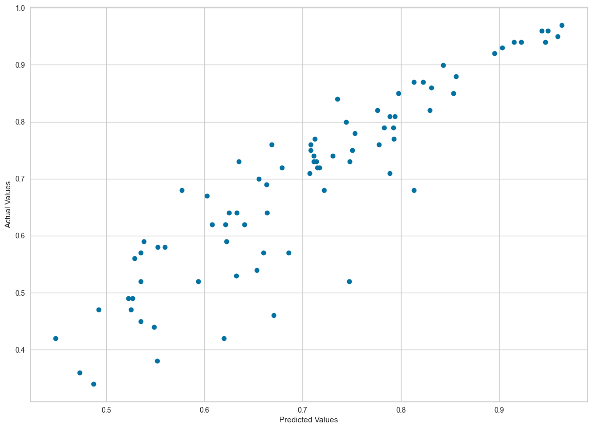

```python
import pandas as pd
import numpy as np
import matplotlib.pyplot as plt
import seaborn as sns


import os
from pathlib import Path

BASE_DIR = Path.cwd().parent

df = pd.read_csv(
    os.path.join(BASE_DIR, "csv", "admission_predict.csv"), index_col="Serial No."
)
```


```python
df
```


<div>
<style scoped>
    .dataframe tbody tr th:only-of-type {
        vertical-align: middle;
    }

    .dataframe tbody tr th {
        vertical-align: top;
    }

    .dataframe thead th {
        text-align: right;
    }
</style>
<table border="1" class="dataframe">
  <thead>
    <tr style="text-align: right;">
      <th></th>
      <th>GRE Score</th>
      <th>TOEFL Score</th>
      <th>University Rating</th>
      <th>SOP</th>
      <th>LOR</th>
      <th>CGPA</th>
      <th>Research</th>
      <th>Chance of Admit</th>
    </tr>
    <tr>
      <th>Serial No.</th>
      <th></th>
      <th></th>
      <th></th>
      <th></th>
      <th></th>
      <th></th>
      <th></th>
      <th></th>
    </tr>
  </thead>
  <tbody>
    <tr>
      <th>1</th>
      <td>337</td>
      <td>118</td>
      <td>4</td>
      <td>4.5</td>
      <td>4.5</td>
      <td>9.65</td>
      <td>1</td>
      <td>0.92</td>
    </tr>
    <tr>
      <th>2</th>
      <td>324</td>
      <td>107</td>
      <td>4</td>
      <td>4.0</td>
      <td>4.5</td>
      <td>8.87</td>
      <td>1</td>
      <td>0.76</td>
    </tr>
    <tr>
      <th>3</th>
      <td>316</td>
      <td>104</td>
      <td>3</td>
      <td>3.0</td>
      <td>3.5</td>
      <td>8.00</td>
      <td>1</td>
      <td>0.72</td>
    </tr>
    <tr>
      <th>4</th>
      <td>322</td>
      <td>110</td>
      <td>3</td>
      <td>3.5</td>
      <td>2.5</td>
      <td>8.67</td>
      <td>1</td>
      <td>0.80</td>
    </tr>
    <tr>
      <th>5</th>
      <td>314</td>
      <td>103</td>
      <td>2</td>
      <td>2.0</td>
      <td>3.0</td>
      <td>8.21</td>
      <td>0</td>
      <td>0.65</td>
    </tr>
    <tr>
      <th>...</th>
      <td>...</td>
      <td>...</td>
      <td>...</td>
      <td>...</td>
      <td>...</td>
      <td>...</td>
      <td>...</td>
      <td>...</td>
    </tr>
    <tr>
      <th>396</th>
      <td>324</td>
      <td>110</td>
      <td>3</td>
      <td>3.5</td>
      <td>3.5</td>
      <td>9.04</td>
      <td>1</td>
      <td>0.82</td>
    </tr>
    <tr>
      <th>397</th>
      <td>325</td>
      <td>107</td>
      <td>3</td>
      <td>3.0</td>
      <td>3.5</td>
      <td>9.11</td>
      <td>1</td>
      <td>0.84</td>
    </tr>
    <tr>
      <th>398</th>
      <td>330</td>
      <td>116</td>
      <td>4</td>
      <td>5.0</td>
      <td>4.5</td>
      <td>9.45</td>
      <td>1</td>
      <td>0.91</td>
    </tr>
    <tr>
      <th>399</th>
      <td>312</td>
      <td>103</td>
      <td>3</td>
      <td>3.5</td>
      <td>4.0</td>
      <td>8.78</td>
      <td>0</td>
      <td>0.67</td>
    </tr>
    <tr>
      <th>400</th>
      <td>333</td>
      <td>117</td>
      <td>4</td>
      <td>5.0</td>
      <td>4.0</td>
      <td>9.66</td>
      <td>1</td>
      <td>0.95</td>
    </tr>
  </tbody>
</table>
<p>400 rows × 8 columns</p>
</div>


```python
X = df.drop("Chance of Admit ", axis=1)
y = df["Chance of Admit "]
```


```python
print(X.shape)
print(y.shape)
print(type(X))
print(type(y))
```

    (400, 7)
    (400,)
    <class 'pandas.core.frame.DataFrame'>
    <class 'pandas.core.series.Series'>


```python
df.info()
```

    <class 'pandas.core.frame.DataFrame'>
    Index: 400 entries, 1 to 400
    Data columns (total 8 columns):
     #   Column             Non-Null Count  Dtype  
    ---  ------             --------------  -----  
     0   GRE Score          400 non-null    int64  
     1   TOEFL Score        400 non-null    int64  
     2   University Rating  400 non-null    int64  
     3   SOP                400 non-null    float64
     4   LOR                400 non-null    float64
     5   CGPA               400 non-null    float64
     6   Research           400 non-null    int64  
     7   Chance of Admit    400 non-null    float64
    dtypes: float64(4), int64(4)
    memory usage: 28.1 KB


```python
from sklearn.preprocessing import MinMaxScaler

scaler = MinMaxScaler()
scaler.fit(X)
X = scaler.fit_transform(X)
```


```python
X = pd.DataFrame(X)
# y = pd.DataFrame(y)
```


```python
y = y.reset_index(drop=True)

y = pd.DataFrame(y)
```


```python
df = pd.concat([X, y], axis=1)
```


```python
df
```


<div>
<style scoped>
    .dataframe tbody tr th:only-of-type {
        vertical-align: middle;
    }

    .dataframe tbody tr th {
        vertical-align: top;
    }

    .dataframe thead th {
        text-align: right;
    }
</style>
<table border="1" class="dataframe">
  <thead>
    <tr style="text-align: right;">
      <th></th>
      <th>0</th>
      <th>1</th>
      <th>2</th>
      <th>3</th>
      <th>4</th>
      <th>5</th>
      <th>6</th>
      <th>Chance of Admit</th>
    </tr>
  </thead>
  <tbody>
    <tr>
      <th>0</th>
      <td>0.94</td>
      <td>0.928571</td>
      <td>0.75</td>
      <td>0.875</td>
      <td>0.875</td>
      <td>0.913462</td>
      <td>1.0</td>
      <td>0.92</td>
    </tr>
    <tr>
      <th>1</th>
      <td>0.68</td>
      <td>0.535714</td>
      <td>0.75</td>
      <td>0.750</td>
      <td>0.875</td>
      <td>0.663462</td>
      <td>1.0</td>
      <td>0.76</td>
    </tr>
    <tr>
      <th>2</th>
      <td>0.52</td>
      <td>0.428571</td>
      <td>0.50</td>
      <td>0.500</td>
      <td>0.625</td>
      <td>0.384615</td>
      <td>1.0</td>
      <td>0.72</td>
    </tr>
    <tr>
      <th>3</th>
      <td>0.64</td>
      <td>0.642857</td>
      <td>0.50</td>
      <td>0.625</td>
      <td>0.375</td>
      <td>0.599359</td>
      <td>1.0</td>
      <td>0.80</td>
    </tr>
    <tr>
      <th>4</th>
      <td>0.48</td>
      <td>0.392857</td>
      <td>0.25</td>
      <td>0.250</td>
      <td>0.500</td>
      <td>0.451923</td>
      <td>0.0</td>
      <td>0.65</td>
    </tr>
    <tr>
      <th>...</th>
      <td>...</td>
      <td>...</td>
      <td>...</td>
      <td>...</td>
      <td>...</td>
      <td>...</td>
      <td>...</td>
      <td>...</td>
    </tr>
    <tr>
      <th>395</th>
      <td>0.68</td>
      <td>0.642857</td>
      <td>0.50</td>
      <td>0.625</td>
      <td>0.625</td>
      <td>0.717949</td>
      <td>1.0</td>
      <td>0.82</td>
    </tr>
    <tr>
      <th>396</th>
      <td>0.70</td>
      <td>0.535714</td>
      <td>0.50</td>
      <td>0.500</td>
      <td>0.625</td>
      <td>0.740385</td>
      <td>1.0</td>
      <td>0.84</td>
    </tr>
    <tr>
      <th>397</th>
      <td>0.80</td>
      <td>0.857143</td>
      <td>0.75</td>
      <td>1.000</td>
      <td>0.875</td>
      <td>0.849359</td>
      <td>1.0</td>
      <td>0.91</td>
    </tr>
    <tr>
      <th>398</th>
      <td>0.44</td>
      <td>0.392857</td>
      <td>0.50</td>
      <td>0.625</td>
      <td>0.750</td>
      <td>0.634615</td>
      <td>0.0</td>
      <td>0.67</td>
    </tr>
    <tr>
      <th>399</th>
      <td>0.86</td>
      <td>0.892857</td>
      <td>0.75</td>
      <td>1.000</td>
      <td>0.750</td>
      <td>0.916667</td>
      <td>1.0</td>
      <td>0.95</td>
    </tr>
  </tbody>
</table>
<p>400 rows × 8 columns</p>
</div>


```python
from sklearn.model_selection import train_test_split

X_train, X_test, y_train, y_test = train_test_split(X, y, train_size=0.8)
```


```python
from pycaret.regression import setup, compare_models

setup(data=X_train, target=y_train, session_id=42)
```


<style type="text/css">
#T_66aae_row8_col1 {
  background-color: lightgreen;
}
</style>
<table id="T_66aae">
  <thead>
    <tr>
      <th class="blank level0" >&nbsp;</th>
      <th id="T_66aae_level0_col0" class="col_heading level0 col0" >Description</th>
      <th id="T_66aae_level0_col1" class="col_heading level0 col1" >Value</th>
    </tr>
  </thead>
  <tbody>
    <tr>
      <th id="T_66aae_level0_row0" class="row_heading level0 row0" >0</th>
      <td id="T_66aae_row0_col0" class="data row0 col0" >Session id</td>
      <td id="T_66aae_row0_col1" class="data row0 col1" >42</td>
    </tr>
    <tr>
      <th id="T_66aae_level0_row1" class="row_heading level0 row1" >1</th>
      <td id="T_66aae_row1_col0" class="data row1 col0" >Target</td>
      <td id="T_66aae_row1_col1" class="data row1 col1" >6</td>
    </tr>
    <tr>
      <th id="T_66aae_level0_row2" class="row_heading level0 row2" >2</th>
      <td id="T_66aae_row2_col0" class="data row2 col0" >Target type</td>
      <td id="T_66aae_row2_col1" class="data row2 col1" >Regression</td>
    </tr>
    <tr>
      <th id="T_66aae_level0_row3" class="row_heading level0 row3" >3</th>
      <td id="T_66aae_row3_col0" class="data row3 col0" >Original data shape</td>
      <td id="T_66aae_row3_col1" class="data row3 col1" >(320, 7)</td>
    </tr>
    <tr>
      <th id="T_66aae_level0_row4" class="row_heading level0 row4" >4</th>
      <td id="T_66aae_row4_col0" class="data row4 col0" >Transformed data shape</td>
      <td id="T_66aae_row4_col1" class="data row4 col1" >(320, 7)</td>
    </tr>
    <tr>
      <th id="T_66aae_level0_row5" class="row_heading level0 row5" >5</th>
      <td id="T_66aae_row5_col0" class="data row5 col0" >Transformed train set shape</td>
      <td id="T_66aae_row5_col1" class="data row5 col1" >(224, 7)</td>
    </tr>
    <tr>
      <th id="T_66aae_level0_row6" class="row_heading level0 row6" >6</th>
      <td id="T_66aae_row6_col0" class="data row6 col0" >Transformed test set shape</td>
      <td id="T_66aae_row6_col1" class="data row6 col1" >(96, 7)</td>
    </tr>
    <tr>
      <th id="T_66aae_level0_row7" class="row_heading level0 row7" >7</th>
      <td id="T_66aae_row7_col0" class="data row7 col0" >Numeric features</td>
      <td id="T_66aae_row7_col1" class="data row7 col1" >6</td>
    </tr>
    <tr>
      <th id="T_66aae_level0_row8" class="row_heading level0 row8" >8</th>
      <td id="T_66aae_row8_col0" class="data row8 col0" >Preprocess</td>
      <td id="T_66aae_row8_col1" class="data row8 col1" >True</td>
    </tr>
    <tr>
      <th id="T_66aae_level0_row9" class="row_heading level0 row9" >9</th>
      <td id="T_66aae_row9_col0" class="data row9 col0" >Imputation type</td>
      <td id="T_66aae_row9_col1" class="data row9 col1" >simple</td>
    </tr>
    <tr>
      <th id="T_66aae_level0_row10" class="row_heading level0 row10" >10</th>
      <td id="T_66aae_row10_col0" class="data row10 col0" >Numeric imputation</td>
      <td id="T_66aae_row10_col1" class="data row10 col1" >mean</td>
    </tr>
    <tr>
      <th id="T_66aae_level0_row11" class="row_heading level0 row11" >11</th>
      <td id="T_66aae_row11_col0" class="data row11 col0" >Categorical imputation</td>
      <td id="T_66aae_row11_col1" class="data row11 col1" >mode</td>
    </tr>
    <tr>
      <th id="T_66aae_level0_row12" class="row_heading level0 row12" >12</th>
      <td id="T_66aae_row12_col0" class="data row12 col0" >Fold Generator</td>
      <td id="T_66aae_row12_col1" class="data row12 col1" >KFold</td>
    </tr>
    <tr>
      <th id="T_66aae_level0_row13" class="row_heading level0 row13" >13</th>
      <td id="T_66aae_row13_col0" class="data row13 col0" >Fold Number</td>
      <td id="T_66aae_row13_col1" class="data row13 col1" >10</td>
    </tr>
    <tr>
      <th id="T_66aae_level0_row14" class="row_heading level0 row14" >14</th>
      <td id="T_66aae_row14_col0" class="data row14 col0" >CPU Jobs</td>
      <td id="T_66aae_row14_col1" class="data row14 col1" >-1</td>
    </tr>
    <tr>
      <th id="T_66aae_level0_row15" class="row_heading level0 row15" >15</th>
      <td id="T_66aae_row15_col0" class="data row15 col0" >Use GPU</td>
      <td id="T_66aae_row15_col1" class="data row15 col1" >False</td>
    </tr>
    <tr>
      <th id="T_66aae_level0_row16" class="row_heading level0 row16" >16</th>
      <td id="T_66aae_row16_col0" class="data row16 col0" >Log Experiment</td>
      <td id="T_66aae_row16_col1" class="data row16 col1" >False</td>
    </tr>
    <tr>
      <th id="T_66aae_level0_row17" class="row_heading level0 row17" >17</th>
      <td id="T_66aae_row17_col0" class="data row17 col0" >Experiment Name</td>
      <td id="T_66aae_row17_col1" class="data row17 col1" >reg-default-name</td>
    </tr>
    <tr>
      <th id="T_66aae_level0_row18" class="row_heading level0 row18" >18</th>
      <td id="T_66aae_row18_col0" class="data row18 col0" >USI</td>
      <td id="T_66aae_row18_col1" class="data row18 col1" >2327</td>
    </tr>
  </tbody>
</table>


    <pycaret.regression.oop.RegressionExperiment at 0x107716610>


```python
compare_models()
```


<style type="text/css">
#T_985e7 th {
  text-align: left;
}
#T_985e7_row0_col0, #T_985e7_row0_col1, #T_985e7_row0_col5, #T_985e7_row0_col6, #T_985e7_row1_col0, #T_985e7_row1_col1, #T_985e7_row1_col2, #T_985e7_row1_col3, #T_985e7_row1_col4, #T_985e7_row1_col5, #T_985e7_row1_col6, #T_985e7_row2_col0, #T_985e7_row2_col1, #T_985e7_row2_col2, #T_985e7_row2_col3, #T_985e7_row2_col4, #T_985e7_row2_col5, #T_985e7_row2_col6, #T_985e7_row3_col0, #T_985e7_row3_col1, #T_985e7_row3_col2, #T_985e7_row3_col3, #T_985e7_row3_col4, #T_985e7_row3_col5, #T_985e7_row3_col6, #T_985e7_row4_col0, #T_985e7_row4_col1, #T_985e7_row4_col2, #T_985e7_row4_col3, #T_985e7_row4_col4, #T_985e7_row4_col5, #T_985e7_row4_col6, #T_985e7_row5_col0, #T_985e7_row5_col1, #T_985e7_row5_col2, #T_985e7_row5_col3, #T_985e7_row5_col4, #T_985e7_row5_col6, #T_985e7_row6_col0, #T_985e7_row6_col1, #T_985e7_row6_col2, #T_985e7_row6_col3, #T_985e7_row6_col4, #T_985e7_row6_col5, #T_985e7_row6_col6, #T_985e7_row7_col0, #T_985e7_row7_col2, #T_985e7_row7_col3, #T_985e7_row7_col4, #T_985e7_row7_col5, #T_985e7_row7_col6, #T_985e7_row8_col0, #T_985e7_row8_col1, #T_985e7_row8_col2, #T_985e7_row8_col3, #T_985e7_row8_col4, #T_985e7_row8_col5, #T_985e7_row8_col6, #T_985e7_row9_col0, #T_985e7_row9_col1, #T_985e7_row9_col2, #T_985e7_row9_col3, #T_985e7_row9_col4, #T_985e7_row9_col5, #T_985e7_row9_col6, #T_985e7_row10_col0, #T_985e7_row10_col1, #T_985e7_row10_col2, #T_985e7_row10_col3, #T_985e7_row10_col4, #T_985e7_row10_col5, #T_985e7_row10_col6, #T_985e7_row11_col0, #T_985e7_row11_col1, #T_985e7_row11_col2, #T_985e7_row11_col3, #T_985e7_row11_col4, #T_985e7_row11_col5, #T_985e7_row11_col6, #T_985e7_row12_col0, #T_985e7_row12_col1, #T_985e7_row12_col2, #T_985e7_row12_col3, #T_985e7_row12_col4, #T_985e7_row12_col5, #T_985e7_row12_col6, #T_985e7_row13_col0, #T_985e7_row13_col1, #T_985e7_row13_col2, #T_985e7_row13_col3, #T_985e7_row13_col4, #T_985e7_row13_col5, #T_985e7_row13_col6, #T_985e7_row14_col0, #T_985e7_row14_col1, #T_985e7_row14_col2, #T_985e7_row14_col3, #T_985e7_row14_col4, #T_985e7_row14_col5, #T_985e7_row14_col6, #T_985e7_row15_col0, #T_985e7_row15_col1, #T_985e7_row15_col2, #T_985e7_row15_col3, #T_985e7_row15_col4, #T_985e7_row15_col5, #T_985e7_row15_col6, #T_985e7_row16_col0, #T_985e7_row16_col1, #T_985e7_row16_col2, #T_985e7_row16_col3, #T_985e7_row16_col4, #T_985e7_row16_col5, #T_985e7_row16_col6, #T_985e7_row17_col0, #T_985e7_row17_col1, #T_985e7_row17_col2, #T_985e7_row17_col3, #T_985e7_row17_col4, #T_985e7_row17_col5, #T_985e7_row17_col6, #T_985e7_row18_col0, #T_985e7_row18_col1, #T_985e7_row18_col2, #T_985e7_row18_col3, #T_985e7_row18_col4, #T_985e7_row18_col5, #T_985e7_row19_col0, #T_985e7_row19_col1, #T_985e7_row19_col2, #T_985e7_row19_col3, #T_985e7_row19_col4, #T_985e7_row19_col5, #T_985e7_row19_col6 {
  text-align: left;
}
#T_985e7_row0_col2, #T_985e7_row0_col3, #T_985e7_row0_col4, #T_985e7_row5_col5, #T_985e7_row7_col1, #T_985e7_row18_col6 {
  text-align: left;
  background-color: yellow;
}
#T_985e7_row0_col7, #T_985e7_row1_col7, #T_985e7_row2_col7, #T_985e7_row15_col7, #T_985e7_row18_col7, #T_985e7_row19_col7 {
  text-align: left;
  background-color: yellow;
  background-color: lightgrey;
}
#T_985e7_row3_col7, #T_985e7_row4_col7, #T_985e7_row5_col7, #T_985e7_row6_col7, #T_985e7_row7_col7, #T_985e7_row8_col7, #T_985e7_row9_col7, #T_985e7_row10_col7, #T_985e7_row11_col7, #T_985e7_row12_col7, #T_985e7_row13_col7, #T_985e7_row14_col7, #T_985e7_row16_col7, #T_985e7_row17_col7 {
  text-align: left;
  background-color: lightgrey;
}
</style>
<table id="T_985e7">
  <thead>
    <tr>
      <th class="blank level0" >&nbsp;</th>
      <th id="T_985e7_level0_col0" class="col_heading level0 col0" >Model</th>
      <th id="T_985e7_level0_col1" class="col_heading level0 col1" >MAE</th>
      <th id="T_985e7_level0_col2" class="col_heading level0 col2" >MSE</th>
      <th id="T_985e7_level0_col3" class="col_heading level0 col3" >RMSE</th>
      <th id="T_985e7_level0_col4" class="col_heading level0 col4" >R2</th>
      <th id="T_985e7_level0_col5" class="col_heading level0 col5" >RMSLE</th>
      <th id="T_985e7_level0_col6" class="col_heading level0 col6" >MAPE</th>
      <th id="T_985e7_level0_col7" class="col_heading level0 col7" >TT (Sec)</th>
    </tr>
  </thead>
  <tbody>
    <tr>
      <th id="T_985e7_level0_row0" class="row_heading level0 row0" >omp</th>
      <td id="T_985e7_row0_col0" class="data row0 col0" >Orthogonal Matching Pursuit</td>
      <td id="T_985e7_row0_col1" class="data row0 col1" >0.3363</td>
      <td id="T_985e7_row0_col2" class="data row0 col2" >0.1652</td>
      <td id="T_985e7_row0_col3" class="data row0 col3" >0.3989</td>
      <td id="T_985e7_row0_col4" class="data row0 col4" >0.3218</td>
      <td id="T_985e7_row0_col5" class="data row0 col5" >0.2792</td>
      <td id="T_985e7_row0_col6" class="data row0 col6" >0.3167</td>
      <td id="T_985e7_row0_col7" class="data row0 col7" >0.0030</td>
    </tr>
    <tr>
      <th id="T_985e7_level0_row1" class="row_heading level0 row1" >ridge</th>
      <td id="T_985e7_row1_col0" class="data row1 col0" >Ridge Regression</td>
      <td id="T_985e7_row1_col1" class="data row1 col1" >0.3411</td>
      <td id="T_985e7_row1_col2" class="data row1 col2" >0.1678</td>
      <td id="T_985e7_row1_col3" class="data row1 col3" >0.4035</td>
      <td id="T_985e7_row1_col4" class="data row1 col4" >0.3110</td>
      <td id="T_985e7_row1_col5" class="data row1 col5" >0.2824</td>
      <td id="T_985e7_row1_col6" class="data row1 col6" >0.3220</td>
      <td id="T_985e7_row1_col7" class="data row1 col7" >0.0030</td>
    </tr>
    <tr>
      <th id="T_985e7_level0_row2" class="row_heading level0 row2" >br</th>
      <td id="T_985e7_row2_col0" class="data row2 col0" >Bayesian Ridge</td>
      <td id="T_985e7_row2_col1" class="data row2 col1" >0.3413</td>
      <td id="T_985e7_row2_col2" class="data row2 col2" >0.1690</td>
      <td id="T_985e7_row2_col3" class="data row2 col3" >0.4045</td>
      <td id="T_985e7_row2_col4" class="data row2 col4" >0.3062</td>
      <td id="T_985e7_row2_col5" class="data row2 col5" >0.2825</td>
      <td id="T_985e7_row2_col6" class="data row2 col6" >0.3230</td>
      <td id="T_985e7_row2_col7" class="data row2 col7" >0.0030</td>
    </tr>
    <tr>
      <th id="T_985e7_level0_row3" class="row_heading level0 row3" >et</th>
      <td id="T_985e7_row3_col0" class="data row3 col0" >Extra Trees Regressor</td>
      <td id="T_985e7_row3_col1" class="data row3 col1" >0.3067</td>
      <td id="T_985e7_row3_col2" class="data row3 col2" >0.1688</td>
      <td id="T_985e7_row3_col3" class="data row3 col3" >0.3998</td>
      <td id="T_985e7_row3_col4" class="data row3 col4" >0.3060</td>
      <td id="T_985e7_row3_col5" class="data row3 col5" >0.2822</td>
      <td id="T_985e7_row3_col6" class="data row3 col6" >0.2863</td>
      <td id="T_985e7_row3_col7" class="data row3 col7" >0.0200</td>
    </tr>
    <tr>
      <th id="T_985e7_level0_row4" class="row_heading level0 row4" >lr</th>
      <td id="T_985e7_row4_col0" class="data row4 col0" >Linear Regression</td>
      <td id="T_985e7_row4_col1" class="data row4 col1" >0.3382</td>
      <td id="T_985e7_row4_col2" class="data row4 col2" >0.1693</td>
      <td id="T_985e7_row4_col3" class="data row4 col3" >0.4043</td>
      <td id="T_985e7_row4_col4" class="data row4 col4" >0.3050</td>
      <td id="T_985e7_row4_col5" class="data row4 col5" >0.2813</td>
      <td id="T_985e7_row4_col6" class="data row4 col6" >0.3210</td>
      <td id="T_985e7_row4_col7" class="data row4 col7" >0.2500</td>
    </tr>
    <tr>
      <th id="T_985e7_level0_row5" class="row_heading level0 row5" >huber</th>
      <td id="T_985e7_row5_col0" class="data row5 col0" >Huber Regressor</td>
      <td id="T_985e7_row5_col1" class="data row5 col1" >0.3308</td>
      <td id="T_985e7_row5_col2" class="data row5 col2" >0.1714</td>
      <td id="T_985e7_row5_col3" class="data row5 col3" >0.4050</td>
      <td id="T_985e7_row5_col4" class="data row5 col4" >0.2965</td>
      <td id="T_985e7_row5_col5" class="data row5 col5" >0.2779</td>
      <td id="T_985e7_row5_col6" class="data row5 col6" >0.3196</td>
      <td id="T_985e7_row5_col7" class="data row5 col7" >0.0040</td>
    </tr>
    <tr>
      <th id="T_985e7_level0_row6" class="row_heading level0 row6" >rf</th>
      <td id="T_985e7_row6_col0" class="data row6 col0" >Random Forest Regressor</td>
      <td id="T_985e7_row6_col1" class="data row6 col1" >0.2980</td>
      <td id="T_985e7_row6_col2" class="data row6 col2" >0.1720</td>
      <td id="T_985e7_row6_col3" class="data row6 col3" >0.4008</td>
      <td id="T_985e7_row6_col4" class="data row6 col4" >0.2918</td>
      <td id="T_985e7_row6_col5" class="data row6 col5" >0.2826</td>
      <td id="T_985e7_row6_col6" class="data row6 col6" >0.2775</td>
      <td id="T_985e7_row6_col7" class="data row6 col7" >0.0180</td>
    </tr>
    <tr>
      <th id="T_985e7_level0_row7" class="row_heading level0 row7" >knn</th>
      <td id="T_985e7_row7_col0" class="data row7 col0" >K Neighbors Regressor</td>
      <td id="T_985e7_row7_col1" class="data row7 col1" >0.2898</td>
      <td id="T_985e7_row7_col2" class="data row7 col2" >0.1742</td>
      <td id="T_985e7_row7_col3" class="data row7 col3" >0.4109</td>
      <td id="T_985e7_row7_col4" class="data row7 col4" >0.2852</td>
      <td id="T_985e7_row7_col5" class="data row7 col5" >0.2875</td>
      <td id="T_985e7_row7_col6" class="data row7 col6" >0.2794</td>
      <td id="T_985e7_row7_col7" class="data row7 col7" >0.0060</td>
    </tr>
    <tr>
      <th id="T_985e7_level0_row8" class="row_heading level0 row8" >lightgbm</th>
      <td id="T_985e7_row8_col0" class="data row8 col0" >Light Gradient Boosting Machine</td>
      <td id="T_985e7_row8_col1" class="data row8 col1" >0.3057</td>
      <td id="T_985e7_row8_col2" class="data row8 col2" >0.1825</td>
      <td id="T_985e7_row8_col3" class="data row8 col3" >0.4152</td>
      <td id="T_985e7_row8_col4" class="data row8 col4" >0.2485</td>
      <td id="T_985e7_row8_col5" class="data row8 col5" >0.2868</td>
      <td id="T_985e7_row8_col6" class="data row8 col6" >0.2863</td>
      <td id="T_985e7_row8_col7" class="data row8 col7" >0.0950</td>
    </tr>
    <tr>
      <th id="T_985e7_level0_row9" class="row_heading level0 row9" >ada</th>
      <td id="T_985e7_row9_col0" class="data row9 col0" >AdaBoost Regressor</td>
      <td id="T_985e7_row9_col1" class="data row9 col1" >0.3636</td>
      <td id="T_985e7_row9_col2" class="data row9 col2" >0.1837</td>
      <td id="T_985e7_row9_col3" class="data row9 col3" >0.4242</td>
      <td id="T_985e7_row9_col4" class="data row9 col4" >0.2438</td>
      <td id="T_985e7_row9_col5" class="data row9 col5" >0.3007</td>
      <td id="T_985e7_row9_col6" class="data row9 col6" >0.3296</td>
      <td id="T_985e7_row9_col7" class="data row9 col7" >0.0050</td>
    </tr>
    <tr>
      <th id="T_985e7_level0_row10" class="row_heading level0 row10" >lar</th>
      <td id="T_985e7_row10_col0" class="data row10 col0" >Least Angle Regression</td>
      <td id="T_985e7_row10_col1" class="data row10 col1" >0.3438</td>
      <td id="T_985e7_row10_col2" class="data row10 col2" >0.1851</td>
      <td id="T_985e7_row10_col3" class="data row10 col3" >0.4231</td>
      <td id="T_985e7_row10_col4" class="data row10 col4" >0.2386</td>
      <td id="T_985e7_row10_col5" class="data row10 col5" >0.2922</td>
      <td id="T_985e7_row10_col6" class="data row10 col6" >0.3080</td>
      <td id="T_985e7_row10_col7" class="data row10 col7" >0.0040</td>
    </tr>
    <tr>
      <th id="T_985e7_level0_row11" class="row_heading level0 row11" >catboost</th>
      <td id="T_985e7_row11_col0" class="data row11 col0" >CatBoost Regressor</td>
      <td id="T_985e7_row11_col1" class="data row11 col1" >0.3150</td>
      <td id="T_985e7_row11_col2" class="data row11 col2" >0.1901</td>
      <td id="T_985e7_row11_col3" class="data row11 col3" >0.4254</td>
      <td id="T_985e7_row11_col4" class="data row11 col4" >0.2188</td>
      <td id="T_985e7_row11_col5" class="data row11 col5" >0.2948</td>
      <td id="T_985e7_row11_col6" class="data row11 col6" >0.2960</td>
      <td id="T_985e7_row11_col7" class="data row11 col7" >0.0760</td>
    </tr>
    <tr>
      <th id="T_985e7_level0_row12" class="row_heading level0 row12" >gbr</th>
      <td id="T_985e7_row12_col0" class="data row12 col0" >Gradient Boosting Regressor</td>
      <td id="T_985e7_row12_col1" class="data row12 col1" >0.3161</td>
      <td id="T_985e7_row12_col2" class="data row12 col2" >0.2041</td>
      <td id="T_985e7_row12_col3" class="data row12 col3" >0.4400</td>
      <td id="T_985e7_row12_col4" class="data row12 col4" >0.1617</td>
      <td id="T_985e7_row12_col5" class="data row12 col5" >0.3039</td>
      <td id="T_985e7_row12_col6" class="data row12 col6" >0.2873</td>
      <td id="T_985e7_row12_col7" class="data row12 col7" >0.0080</td>
    </tr>
    <tr>
      <th id="T_985e7_level0_row13" class="row_heading level0 row13" >xgboost</th>
      <td id="T_985e7_row13_col0" class="data row13 col0" >Extreme Gradient Boosting</td>
      <td id="T_985e7_row13_col1" class="data row13 col1" >0.3208</td>
      <td id="T_985e7_row13_col2" class="data row13 col2" >0.2170</td>
      <td id="T_985e7_row13_col3" class="data row13 col3" >0.4530</td>
      <td id="T_985e7_row13_col4" class="data row13 col4" >0.1067</td>
      <td id="T_985e7_row13_col5" class="data row13 col5" >0.3158</td>
      <td id="T_985e7_row13_col6" class="data row13 col6" >0.2847</td>
      <td id="T_985e7_row13_col7" class="data row13 col7" >0.0080</td>
    </tr>
    <tr>
      <th id="T_985e7_level0_row14" class="row_heading level0 row14" >lasso</th>
      <td id="T_985e7_row14_col0" class="data row14 col0" >Lasso Regression</td>
      <td id="T_985e7_row14_col1" class="data row14 col1" >0.4986</td>
      <td id="T_985e7_row14_col2" class="data row14 col2" >0.2500</td>
      <td id="T_985e7_row14_col3" class="data row14 col3" >0.4999</td>
      <td id="T_985e7_row14_col4" class="data row14 col4" >-0.0261</td>
      <td id="T_985e7_row14_col5" class="data row14 col5" >0.3511</td>
      <td id="T_985e7_row14_col6" class="data row14 col6" >0.4643</td>
      <td id="T_985e7_row14_col7" class="data row14 col7" >0.0040</td>
    </tr>
    <tr>
      <th id="T_985e7_level0_row15" class="row_heading level0 row15" >en</th>
      <td id="T_985e7_row15_col0" class="data row15 col0" >Elastic Net</td>
      <td id="T_985e7_row15_col1" class="data row15 col1" >0.4986</td>
      <td id="T_985e7_row15_col2" class="data row15 col2" >0.2500</td>
      <td id="T_985e7_row15_col3" class="data row15 col3" >0.4999</td>
      <td id="T_985e7_row15_col4" class="data row15 col4" >-0.0261</td>
      <td id="T_985e7_row15_col5" class="data row15 col5" >0.3511</td>
      <td id="T_985e7_row15_col6" class="data row15 col6" >0.4643</td>
      <td id="T_985e7_row15_col7" class="data row15 col7" >0.0030</td>
    </tr>
    <tr>
      <th id="T_985e7_level0_row16" class="row_heading level0 row16" >llar</th>
      <td id="T_985e7_row16_col0" class="data row16 col0" >Lasso Least Angle Regression</td>
      <td id="T_985e7_row16_col1" class="data row16 col1" >0.4986</td>
      <td id="T_985e7_row16_col2" class="data row16 col2" >0.2500</td>
      <td id="T_985e7_row16_col3" class="data row16 col3" >0.4999</td>
      <td id="T_985e7_row16_col4" class="data row16 col4" >-0.0261</td>
      <td id="T_985e7_row16_col5" class="data row16 col5" >0.3511</td>
      <td id="T_985e7_row16_col6" class="data row16 col6" >0.4643</td>
      <td id="T_985e7_row16_col7" class="data row16 col7" >0.0040</td>
    </tr>
    <tr>
      <th id="T_985e7_level0_row17" class="row_heading level0 row17" >dummy</th>
      <td id="T_985e7_row17_col0" class="data row17 col0" >Dummy Regressor</td>
      <td id="T_985e7_row17_col1" class="data row17 col1" >0.4986</td>
      <td id="T_985e7_row17_col2" class="data row17 col2" >0.2500</td>
      <td id="T_985e7_row17_col3" class="data row17 col3" >0.4999</td>
      <td id="T_985e7_row17_col4" class="data row17 col4" >-0.0261</td>
      <td id="T_985e7_row17_col5" class="data row17 col5" >0.3511</td>
      <td id="T_985e7_row17_col6" class="data row17 col6" >0.4643</td>
      <td id="T_985e7_row17_col7" class="data row17 col7" >0.0040</td>
    </tr>
    <tr>
      <th id="T_985e7_level0_row18" class="row_heading level0 row18" >dt</th>
      <td id="T_985e7_row18_col0" class="data row18 col0" >Decision Tree Regressor</td>
      <td id="T_985e7_row18_col1" class="data row18 col1" >0.2903</td>
      <td id="T_985e7_row18_col2" class="data row18 col2" >0.2903</td>
      <td id="T_985e7_row18_col3" class="data row18 col3" >0.5239</td>
      <td id="T_985e7_row18_col4" class="data row18 col4" >-0.1923</td>
      <td id="T_985e7_row18_col5" class="data row18 col5" >0.3631</td>
      <td id="T_985e7_row18_col6" class="data row18 col6" >0.2443</td>
      <td id="T_985e7_row18_col7" class="data row18 col7" >0.0030</td>
    </tr>
    <tr>
      <th id="T_985e7_level0_row19" class="row_heading level0 row19" >par</th>
      <td id="T_985e7_row19_col0" class="data row19 col0" >Passive Aggressive Regressor</td>
      <td id="T_985e7_row19_col1" class="data row19 col1" >0.5950</td>
      <td id="T_985e7_row19_col2" class="data row19 col2" >0.5794</td>
      <td id="T_985e7_row19_col3" class="data row19 col3" >0.6920</td>
      <td id="T_985e7_row19_col4" class="data row19 col4" >-1.4403</td>
      <td id="T_985e7_row19_col5" class="data row19 col5" >0.3790</td>
      <td id="T_985e7_row19_col6" class="data row19 col6" >0.6255</td>
      <td id="T_985e7_row19_col7" class="data row19 col7" >0.0030</td>
    </tr>
  </tbody>
</table>


<style>#sk-container-id-1 {
  /* Definition of color scheme common for light and dark mode */
  --sklearn-color-text: black;
  --sklearn-color-line: gray;
  /* Definition of color scheme for unfitted estimators */
  --sklearn-color-unfitted-level-0: #fff5e6;
  --sklearn-color-unfitted-level-1: #f6e4d2;
  --sklearn-color-unfitted-level-2: #ffe0b3;
  --sklearn-color-unfitted-level-3: chocolate;
  /* Definition of color scheme for fitted estimators */
  --sklearn-color-fitted-level-0: #f0f8ff;
  --sklearn-color-fitted-level-1: #d4ebff;
  --sklearn-color-fitted-level-2: #b3dbfd;
  --sklearn-color-fitted-level-3: cornflowerblue;

  /* Specific color for light theme */
  --sklearn-color-text-on-default-background: var(--sg-text-color, var(--theme-code-foreground, var(--jp-content-font-color1, black)));
  --sklearn-color-background: var(--sg-background-color, var(--theme-background, var(--jp-layout-color0, white)));
  --sklearn-color-border-box: var(--sg-text-color, var(--theme-code-foreground, var(--jp-content-font-color1, black)));
  --sklearn-color-icon: #696969;

  @media (prefers-color-scheme: dark) {
    /* Redefinition of color scheme for dark theme */
    --sklearn-color-text-on-default-background: var(--sg-text-color, var(--theme-code-foreground, var(--jp-content-font-color1, white)));
    --sklearn-color-background: var(--sg-background-color, var(--theme-background, var(--jp-layout-color0, #111)));
    --sklearn-color-border-box: var(--sg-text-color, var(--theme-code-foreground, var(--jp-content-font-color1, white)));
    --sklearn-color-icon: #878787;
  }
}

#sk-container-id-1 {
  color: var(--sklearn-color-text);
}

#sk-container-id-1 pre {
  padding: 0;
}

#sk-container-id-1 input.sk-hidden--visually {
  border: 0;
  clip: rect(1px 1px 1px 1px);
  clip: rect(1px, 1px, 1px, 1px);
  height: 1px;
  margin: -1px;
  overflow: hidden;
  padding: 0;
  position: absolute;
  width: 1px;
}

#sk-container-id-1 div.sk-dashed-wrapped {
  border: 1px dashed var(--sklearn-color-line);
  margin: 0 0.4em 0.5em 0.4em;
  box-sizing: border-box;
  padding-bottom: 0.4em;
  background-color: var(--sklearn-color-background);
}

#sk-container-id-1 div.sk-container {
  /* jupyter's `normalize.less` sets `[hidden] { display: none; }`
     but bootstrap.min.css set `[hidden] { display: none !important; }`
     so we also need the `!important` here to be able to override the
     default hidden behavior on the sphinx rendered scikit-learn.org.
     See: https://github.com/scikit-learn/scikit-learn/issues/21755 */
  display: inline-block !important;
  position: relative;
}

#sk-container-id-1 div.sk-text-repr-fallback {
  display: none;
}

div.sk-parallel-item,
div.sk-serial,
div.sk-item {
  /* draw centered vertical line to link estimators */
  background-image: linear-gradient(var(--sklearn-color-text-on-default-background), var(--sklearn-color-text-on-default-background));
  background-size: 2px 100%;
  background-repeat: no-repeat;
  background-position: center center;
}

/* Parallel-specific style estimator block */

#sk-container-id-1 div.sk-parallel-item::after {
  content: "";
  width: 100%;
  border-bottom: 2px solid var(--sklearn-color-text-on-default-background);
  flex-grow: 1;
}

#sk-container-id-1 div.sk-parallel {
  display: flex;
  align-items: stretch;
  justify-content: center;
  background-color: var(--sklearn-color-background);
  position: relative;
}

#sk-container-id-1 div.sk-parallel-item {
  display: flex;
  flex-direction: column;
}

#sk-container-id-1 div.sk-parallel-item:first-child::after {
  align-self: flex-end;
  width: 50%;
}

#sk-container-id-1 div.sk-parallel-item:last-child::after {
  align-self: flex-start;
  width: 50%;
}

#sk-container-id-1 div.sk-parallel-item:only-child::after {
  width: 0;
}

/* Serial-specific style estimator block */

#sk-container-id-1 div.sk-serial {
  display: flex;
  flex-direction: column;
  align-items: center;
  background-color: var(--sklearn-color-background);
  padding-right: 1em;
  padding-left: 1em;
}


/* Toggleable style: style used for estimator/Pipeline/ColumnTransformer box that is
clickable and can be expanded/collapsed.
- Pipeline and ColumnTransformer use this feature and define the default style
- Estimators will overwrite some part of the style using the `sk-estimator` class
*/

/* Pipeline and ColumnTransformer style (default) */

#sk-container-id-1 div.sk-toggleable {
  /* Default theme specific background. It is overwritten whether we have a
  specific estimator or a Pipeline/ColumnTransformer */
  background-color: var(--sklearn-color-background);
}

/* Toggleable label */
#sk-container-id-1 label.sk-toggleable__label {
  cursor: pointer;
  display: block;
  width: 100%;
  margin-bottom: 0;
  padding: 0.5em;
  box-sizing: border-box;
  text-align: center;
}

#sk-container-id-1 label.sk-toggleable__label-arrow:before {
  /* Arrow on the left of the label */
  content: "▸";
  float: left;
  margin-right: 0.25em;
  color: var(--sklearn-color-icon);
}

#sk-container-id-1 label.sk-toggleable__label-arrow:hover:before {
  color: var(--sklearn-color-text);
}

/* Toggleable content - dropdown */

#sk-container-id-1 div.sk-toggleable__content {
  max-height: 0;
  max-width: 0;
  overflow: hidden;
  text-align: left;
  /* unfitted */
  background-color: var(--sklearn-color-unfitted-level-0);
}

#sk-container-id-1 div.sk-toggleable__content.fitted {
  /* fitted */
  background-color: var(--sklearn-color-fitted-level-0);
}

#sk-container-id-1 div.sk-toggleable__content pre {
  margin: 0.2em;
  border-radius: 0.25em;
  color: var(--sklearn-color-text);
  /* unfitted */
  background-color: var(--sklearn-color-unfitted-level-0);
}

#sk-container-id-1 div.sk-toggleable__content.fitted pre {
  /* unfitted */
  background-color: var(--sklearn-color-fitted-level-0);
}

#sk-container-id-1 input.sk-toggleable__control:checked~div.sk-toggleable__content {
  /* Expand drop-down */
  max-height: 200px;
  max-width: 100%;
  overflow: auto;
}

#sk-container-id-1 input.sk-toggleable__control:checked~label.sk-toggleable__label-arrow:before {
  content: "▾";
}

/* Pipeline/ColumnTransformer-specific style */

#sk-container-id-1 div.sk-label input.sk-toggleable__control:checked~label.sk-toggleable__label {
  color: var(--sklearn-color-text);
  background-color: var(--sklearn-color-unfitted-level-2);
}

#sk-container-id-1 div.sk-label.fitted input.sk-toggleable__control:checked~label.sk-toggleable__label {
  background-color: var(--sklearn-color-fitted-level-2);
}

/* Estimator-specific style */

/* Colorize estimator box */
#sk-container-id-1 div.sk-estimator input.sk-toggleable__control:checked~label.sk-toggleable__label {
  /* unfitted */
  background-color: var(--sklearn-color-unfitted-level-2);
}

#sk-container-id-1 div.sk-estimator.fitted input.sk-toggleable__control:checked~label.sk-toggleable__label {
  /* fitted */
  background-color: var(--sklearn-color-fitted-level-2);
}

#sk-container-id-1 div.sk-label label.sk-toggleable__label,
#sk-container-id-1 div.sk-label label {
  /* The background is the default theme color */
  color: var(--sklearn-color-text-on-default-background);
}

/* On hover, darken the color of the background */
#sk-container-id-1 div.sk-label:hover label.sk-toggleable__label {
  color: var(--sklearn-color-text);
  background-color: var(--sklearn-color-unfitted-level-2);
}

/* Label box, darken color on hover, fitted */
#sk-container-id-1 div.sk-label.fitted:hover label.sk-toggleable__label.fitted {
  color: var(--sklearn-color-text);
  background-color: var(--sklearn-color-fitted-level-2);
}

/* Estimator label */

#sk-container-id-1 div.sk-label label {
  font-family: monospace;
  font-weight: bold;
  display: inline-block;
  line-height: 1.2em;
}

#sk-container-id-1 div.sk-label-container {
  text-align: center;
}

/* Estimator-specific */
#sk-container-id-1 div.sk-estimator {
  font-family: monospace;
  border: 1px dotted var(--sklearn-color-border-box);
  border-radius: 0.25em;
  box-sizing: border-box;
  margin-bottom: 0.5em;
  /* unfitted */
  background-color: var(--sklearn-color-unfitted-level-0);
}

#sk-container-id-1 div.sk-estimator.fitted {
  /* fitted */
  background-color: var(--sklearn-color-fitted-level-0);
}

/* on hover */
#sk-container-id-1 div.sk-estimator:hover {
  /* unfitted */
  background-color: var(--sklearn-color-unfitted-level-2);
}

#sk-container-id-1 div.sk-estimator.fitted:hover {
  /* fitted */
  background-color: var(--sklearn-color-fitted-level-2);
}

/* Specification for estimator info (e.g. "i" and "?") */

/* Common style for "i" and "?" */

.sk-estimator-doc-link,
a:link.sk-estimator-doc-link,
a:visited.sk-estimator-doc-link {
  float: right;
  font-size: smaller;
  line-height: 1em;
  font-family: monospace;
  background-color: var(--sklearn-color-background);
  border-radius: 1em;
  height: 1em;
  width: 1em;
  text-decoration: none !important;
  margin-left: 1ex;
  /* unfitted */
  border: var(--sklearn-color-unfitted-level-1) 1pt solid;
  color: var(--sklearn-color-unfitted-level-1);
}

.sk-estimator-doc-link.fitted,
a:link.sk-estimator-doc-link.fitted,
a:visited.sk-estimator-doc-link.fitted {
  /* fitted */
  border: var(--sklearn-color-fitted-level-1) 1pt solid;
  color: var(--sklearn-color-fitted-level-1);
}

/* On hover */
div.sk-estimator:hover .sk-estimator-doc-link:hover,
.sk-estimator-doc-link:hover,
div.sk-label-container:hover .sk-estimator-doc-link:hover,
.sk-estimator-doc-link:hover {
  /* unfitted */
  background-color: var(--sklearn-color-unfitted-level-3);
  color: var(--sklearn-color-background);
  text-decoration: none;
}

div.sk-estimator.fitted:hover .sk-estimator-doc-link.fitted:hover,
.sk-estimator-doc-link.fitted:hover,
div.sk-label-container:hover .sk-estimator-doc-link.fitted:hover,
.sk-estimator-doc-link.fitted:hover {
  /* fitted */
  background-color: var(--sklearn-color-fitted-level-3);
  color: var(--sklearn-color-background);
  text-decoration: none;
}

/* Span, style for the box shown on hovering the info icon */
.sk-estimator-doc-link span {
  display: none;
  z-index: 9999;
  position: relative;
  font-weight: normal;
  right: .2ex;
  padding: .5ex;
  margin: .5ex;
  width: min-content;
  min-width: 20ex;
  max-width: 50ex;
  color: var(--sklearn-color-text);
  box-shadow: 2pt 2pt 4pt #999;
  /* unfitted */
  background: var(--sklearn-color-unfitted-level-0);
  border: .5pt solid var(--sklearn-color-unfitted-level-3);
}

.sk-estimator-doc-link.fitted span {
  /* fitted */
  background: var(--sklearn-color-fitted-level-0);
  border: var(--sklearn-color-fitted-level-3);
}

.sk-estimator-doc-link:hover span {
  display: block;
}

/* "?"-specific style due to the `<a>` HTML tag */

#sk-container-id-1 a.estimator_doc_link {
  float: right;
  font-size: 1rem;
  line-height: 1em;
  font-family: monospace;
  background-color: var(--sklearn-color-background);
  border-radius: 1rem;
  height: 1rem;
  width: 1rem;
  text-decoration: none;
  /* unfitted */
  color: var(--sklearn-color-unfitted-level-1);
  border: var(--sklearn-color-unfitted-level-1) 1pt solid;
}

#sk-container-id-1 a.estimator_doc_link.fitted {
  /* fitted */
  border: var(--sklearn-color-fitted-level-1) 1pt solid;
  color: var(--sklearn-color-fitted-level-1);
}

/* On hover */
#sk-container-id-1 a.estimator_doc_link:hover {
  /* unfitted */
  background-color: var(--sklearn-color-unfitted-level-3);
  color: var(--sklearn-color-background);
  text-decoration: none;
}

#sk-container-id-1 a.estimator_doc_link.fitted:hover {
  /* fitted */
  background-color: var(--sklearn-color-fitted-level-3);
}
</style><div id="sk-container-id-1" class="sk-top-container"><div class="sk-text-repr-fallback"><pre>OrthogonalMatchingPursuit()</pre><b>In a Jupyter environment, please rerun this cell to show the HTML representation or trust the notebook. <br />On GitHub, the HTML representation is unable to render, please try loading this page with nbviewer.org.</b></div><div class="sk-container" hidden><div class="sk-item"><div class="sk-estimator fitted sk-toggleable"><input class="sk-toggleable__control sk-hidden--visually" id="sk-estimator-id-1" type="checkbox" checked><label for="sk-estimator-id-1" class="sk-toggleable__label fitted sk-toggleable__label-arrow fitted">&nbsp;&nbsp;OrthogonalMatchingPursuit<a class="sk-estimator-doc-link fitted" rel="noreferrer" target="_blank" href="https://scikit-learn.org/1.5/modules/generated/sklearn.linear_model.OrthogonalMatchingPursuit.html">?<span>Documentation for OrthogonalMatchingPursuit</span></a><span class="sk-estimator-doc-link fitted">i<span>Fitted</span></span></label><div class="sk-toggleable__content fitted"><pre>OrthogonalMatchingPursuit()</pre></div> </div></div></div></div>


```python
from sklearn.linear_model import Ridge

ridge_model = Ridge(alpha=1.0, random_state=42)

ridge_model.fit(X_train, y_train)
y_pred = ridge_model.predict(X_test)
```


```python
ridge_model.score(X_test, y_test)
```


    0.8114467327766686


```python
plt.figure(figsize=(14, 10))
plt.plot(y_pred, y_test, "o")
plt.xlabel("Predicted Values")
plt.ylabel("Actual Values")
```


    Text(0, 0.5, 'Actual Values')


    

    


```python

```
