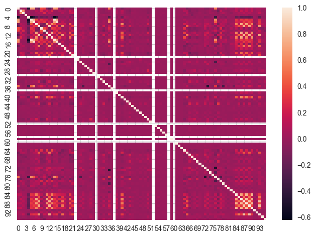
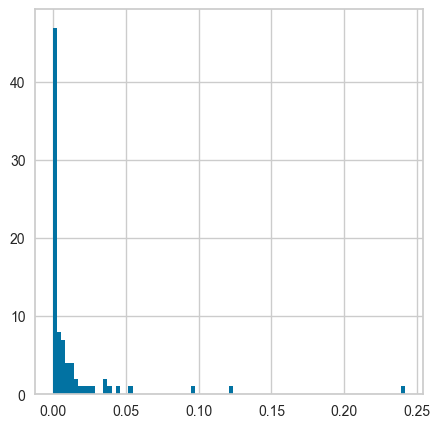

```python
import kagglehub

# Download latest version
path = kagglehub.dataset_download("christianlillelund/csgo-round-winner-classification")

print("Path to dataset files:", path)
```

    Path to dataset files: /Users/jeongho/.cache/kagglehub/datasets/christianlillelund/csgo-round-winner-classification/versions/3


```python
import pandas as pd
import numpy as np
import matplotlib.pyplot as plt
import seaborn as sns
```


```python
import os

df = pd.read_csv(os.path.join(path, "csgo_round_snapshots.csv"))
```


```python
df
```


<div>
<style scoped>
    .dataframe tbody tr th:only-of-type {
        vertical-align: middle;
    }

    .dataframe tbody tr th {
        vertical-align: top;
    }

    .dataframe thead th {
        text-align: right;
    }
</style>
<table border="1" class="dataframe">
  <thead>
    <tr style="text-align: right;">
      <th></th>
      <th>time_left</th>
      <th>ct_score</th>
      <th>t_score</th>
      <th>map</th>
      <th>bomb_planted</th>
      <th>ct_health</th>
      <th>t_health</th>
      <th>ct_armor</th>
      <th>t_armor</th>
      <th>ct_money</th>
      <th>t_money</th>
      <th>ct_helmets</th>
      <th>t_helmets</th>
      <th>ct_defuse_kits</th>
      <th>ct_players_alive</th>
      <th>t_players_alive</th>
      <th>ct_weapon_ak47</th>
      <th>t_weapon_ak47</th>
      <th>ct_weapon_aug</th>
      <th>t_weapon_aug</th>
      <th>ct_weapon_awp</th>
      <th>t_weapon_awp</th>
      <th>ct_weapon_bizon</th>
      <th>t_weapon_bizon</th>
      <th>ct_weapon_cz75auto</th>
      <th>t_weapon_cz75auto</th>
      <th>ct_weapon_elite</th>
      <th>t_weapon_elite</th>
      <th>ct_weapon_famas</th>
      <th>t_weapon_famas</th>
      <th>ct_weapon_g3sg1</th>
      <th>t_weapon_g3sg1</th>
      <th>ct_weapon_galilar</th>
      <th>t_weapon_galilar</th>
      <th>ct_weapon_glock</th>
      <th>t_weapon_glock</th>
      <th>ct_weapon_m249</th>
      <th>t_weapon_m249</th>
      <th>ct_weapon_m4a1s</th>
      <th>t_weapon_m4a1s</th>
      <th>ct_weapon_m4a4</th>
      <th>t_weapon_m4a4</th>
      <th>ct_weapon_mac10</th>
      <th>t_weapon_mac10</th>
      <th>ct_weapon_mag7</th>
      <th>t_weapon_mag7</th>
      <th>ct_weapon_mp5sd</th>
      <th>t_weapon_mp5sd</th>
      <th>ct_weapon_mp7</th>
      <th>t_weapon_mp7</th>
      <th>ct_weapon_mp9</th>
      <th>t_weapon_mp9</th>
      <th>ct_weapon_negev</th>
      <th>t_weapon_negev</th>
      <th>ct_weapon_nova</th>
      <th>t_weapon_nova</th>
      <th>ct_weapon_p90</th>
      <th>t_weapon_p90</th>
      <th>ct_weapon_r8revolver</th>
      <th>t_weapon_r8revolver</th>
      <th>ct_weapon_sawedoff</th>
      <th>t_weapon_sawedoff</th>
      <th>ct_weapon_scar20</th>
      <th>t_weapon_scar20</th>
      <th>ct_weapon_sg553</th>
      <th>t_weapon_sg553</th>
      <th>ct_weapon_ssg08</th>
      <th>t_weapon_ssg08</th>
      <th>ct_weapon_ump45</th>
      <th>t_weapon_ump45</th>
      <th>ct_weapon_xm1014</th>
      <th>t_weapon_xm1014</th>
      <th>ct_weapon_deagle</th>
      <th>t_weapon_deagle</th>
      <th>ct_weapon_fiveseven</th>
      <th>t_weapon_fiveseven</th>
      <th>ct_weapon_usps</th>
      <th>t_weapon_usps</th>
      <th>ct_weapon_p250</th>
      <th>t_weapon_p250</th>
      <th>ct_weapon_p2000</th>
      <th>t_weapon_p2000</th>
      <th>ct_weapon_tec9</th>
      <th>t_weapon_tec9</th>
      <th>ct_grenade_hegrenade</th>
      <th>t_grenade_hegrenade</th>
      <th>ct_grenade_flashbang</th>
      <th>t_grenade_flashbang</th>
      <th>ct_grenade_smokegrenade</th>
      <th>t_grenade_smokegrenade</th>
      <th>ct_grenade_incendiarygrenade</th>
      <th>t_grenade_incendiarygrenade</th>
      <th>ct_grenade_molotovgrenade</th>
      <th>t_grenade_molotovgrenade</th>
      <th>ct_grenade_decoygrenade</th>
      <th>t_grenade_decoygrenade</th>
      <th>round_winner</th>
    </tr>
  </thead>
  <tbody>
    <tr>
      <th>0</th>
      <td>175.00</td>
      <td>0.0</td>
      <td>0.0</td>
      <td>de_dust2</td>
      <td>False</td>
      <td>500.0</td>
      <td>500.0</td>
      <td>0.0</td>
      <td>0.0</td>
      <td>4000.0</td>
      <td>4000.0</td>
      <td>0.0</td>
      <td>0.0</td>
      <td>0.0</td>
      <td>5.0</td>
      <td>5.0</td>
      <td>0.0</td>
      <td>0.0</td>
      <td>0.0</td>
      <td>0.0</td>
      <td>0.0</td>
      <td>0.0</td>
      <td>0.0</td>
      <td>0.0</td>
      <td>0.0</td>
      <td>0.0</td>
      <td>0.0</td>
      <td>0.0</td>
      <td>0.0</td>
      <td>0.0</td>
      <td>0.0</td>
      <td>0.0</td>
      <td>0.0</td>
      <td>0.0</td>
      <td>0.0</td>
      <td>5.0</td>
      <td>0.0</td>
      <td>0.0</td>
      <td>0.0</td>
      <td>0.0</td>
      <td>0.0</td>
      <td>0.0</td>
      <td>0.0</td>
      <td>0.0</td>
      <td>0.0</td>
      <td>0.0</td>
      <td>0.0</td>
      <td>0.0</td>
      <td>0.0</td>
      <td>0.0</td>
      <td>0.0</td>
      <td>0.0</td>
      <td>0.0</td>
      <td>0.0</td>
      <td>0.0</td>
      <td>0.0</td>
      <td>0.0</td>
      <td>0.0</td>
      <td>0.0</td>
      <td>0.0</td>
      <td>0.0</td>
      <td>0.0</td>
      <td>0.0</td>
      <td>0.0</td>
      <td>0.0</td>
      <td>0.0</td>
      <td>0.0</td>
      <td>0.0</td>
      <td>0.0</td>
      <td>0.0</td>
      <td>0.0</td>
      <td>0.0</td>
      <td>0.0</td>
      <td>0.0</td>
      <td>0.0</td>
      <td>0.0</td>
      <td>4.0</td>
      <td>0.0</td>
      <td>0.0</td>
      <td>0.0</td>
      <td>1.0</td>
      <td>0.0</td>
      <td>0.0</td>
      <td>0.0</td>
      <td>0.0</td>
      <td>0.0</td>
      <td>0.0</td>
      <td>0.0</td>
      <td>0.0</td>
      <td>0.0</td>
      <td>0.0</td>
      <td>0.0</td>
      <td>0.0</td>
      <td>0.0</td>
      <td>0.0</td>
      <td>0.0</td>
      <td>CT</td>
    </tr>
    <tr>
      <th>1</th>
      <td>156.03</td>
      <td>0.0</td>
      <td>0.0</td>
      <td>de_dust2</td>
      <td>False</td>
      <td>500.0</td>
      <td>500.0</td>
      <td>400.0</td>
      <td>300.0</td>
      <td>600.0</td>
      <td>650.0</td>
      <td>0.0</td>
      <td>0.0</td>
      <td>1.0</td>
      <td>5.0</td>
      <td>5.0</td>
      <td>0.0</td>
      <td>0.0</td>
      <td>0.0</td>
      <td>0.0</td>
      <td>0.0</td>
      <td>0.0</td>
      <td>0.0</td>
      <td>0.0</td>
      <td>0.0</td>
      <td>0.0</td>
      <td>0.0</td>
      <td>0.0</td>
      <td>0.0</td>
      <td>0.0</td>
      <td>0.0</td>
      <td>0.0</td>
      <td>0.0</td>
      <td>0.0</td>
      <td>0.0</td>
      <td>5.0</td>
      <td>0.0</td>
      <td>0.0</td>
      <td>0.0</td>
      <td>0.0</td>
      <td>0.0</td>
      <td>0.0</td>
      <td>0.0</td>
      <td>0.0</td>
      <td>0.0</td>
      <td>0.0</td>
      <td>0.0</td>
      <td>0.0</td>
      <td>0.0</td>
      <td>0.0</td>
      <td>0.0</td>
      <td>0.0</td>
      <td>0.0</td>
      <td>0.0</td>
      <td>0.0</td>
      <td>0.0</td>
      <td>0.0</td>
      <td>0.0</td>
      <td>0.0</td>
      <td>0.0</td>
      <td>0.0</td>
      <td>0.0</td>
      <td>0.0</td>
      <td>0.0</td>
      <td>0.0</td>
      <td>0.0</td>
      <td>0.0</td>
      <td>0.0</td>
      <td>0.0</td>
      <td>0.0</td>
      <td>0.0</td>
      <td>0.0</td>
      <td>0.0</td>
      <td>0.0</td>
      <td>0.0</td>
      <td>0.0</td>
      <td>4.0</td>
      <td>0.0</td>
      <td>0.0</td>
      <td>0.0</td>
      <td>1.0</td>
      <td>0.0</td>
      <td>0.0</td>
      <td>0.0</td>
      <td>0.0</td>
      <td>0.0</td>
      <td>0.0</td>
      <td>0.0</td>
      <td>0.0</td>
      <td>2.0</td>
      <td>0.0</td>
      <td>0.0</td>
      <td>0.0</td>
      <td>0.0</td>
      <td>0.0</td>
      <td>0.0</td>
      <td>CT</td>
    </tr>
    <tr>
      <th>2</th>
      <td>96.03</td>
      <td>0.0</td>
      <td>0.0</td>
      <td>de_dust2</td>
      <td>False</td>
      <td>391.0</td>
      <td>400.0</td>
      <td>294.0</td>
      <td>200.0</td>
      <td>750.0</td>
      <td>500.0</td>
      <td>0.0</td>
      <td>0.0</td>
      <td>1.0</td>
      <td>4.0</td>
      <td>4.0</td>
      <td>0.0</td>
      <td>0.0</td>
      <td>0.0</td>
      <td>0.0</td>
      <td>0.0</td>
      <td>0.0</td>
      <td>0.0</td>
      <td>0.0</td>
      <td>0.0</td>
      <td>0.0</td>
      <td>0.0</td>
      <td>0.0</td>
      <td>0.0</td>
      <td>0.0</td>
      <td>0.0</td>
      <td>0.0</td>
      <td>0.0</td>
      <td>0.0</td>
      <td>0.0</td>
      <td>4.0</td>
      <td>0.0</td>
      <td>0.0</td>
      <td>0.0</td>
      <td>0.0</td>
      <td>0.0</td>
      <td>0.0</td>
      <td>0.0</td>
      <td>0.0</td>
      <td>0.0</td>
      <td>0.0</td>
      <td>0.0</td>
      <td>0.0</td>
      <td>0.0</td>
      <td>0.0</td>
      <td>0.0</td>
      <td>0.0</td>
      <td>0.0</td>
      <td>0.0</td>
      <td>0.0</td>
      <td>0.0</td>
      <td>0.0</td>
      <td>0.0</td>
      <td>0.0</td>
      <td>0.0</td>
      <td>0.0</td>
      <td>0.0</td>
      <td>0.0</td>
      <td>0.0</td>
      <td>0.0</td>
      <td>0.0</td>
      <td>0.0</td>
      <td>0.0</td>
      <td>0.0</td>
      <td>0.0</td>
      <td>0.0</td>
      <td>0.0</td>
      <td>0.0</td>
      <td>0.0</td>
      <td>0.0</td>
      <td>0.0</td>
      <td>4.0</td>
      <td>0.0</td>
      <td>0.0</td>
      <td>0.0</td>
      <td>0.0</td>
      <td>0.0</td>
      <td>0.0</td>
      <td>0.0</td>
      <td>0.0</td>
      <td>0.0</td>
      <td>0.0</td>
      <td>0.0</td>
      <td>0.0</td>
      <td>2.0</td>
      <td>0.0</td>
      <td>0.0</td>
      <td>0.0</td>
      <td>0.0</td>
      <td>0.0</td>
      <td>0.0</td>
      <td>CT</td>
    </tr>
    <tr>
      <th>3</th>
      <td>76.03</td>
      <td>0.0</td>
      <td>0.0</td>
      <td>de_dust2</td>
      <td>False</td>
      <td>391.0</td>
      <td>400.0</td>
      <td>294.0</td>
      <td>200.0</td>
      <td>750.0</td>
      <td>500.0</td>
      <td>0.0</td>
      <td>0.0</td>
      <td>1.0</td>
      <td>4.0</td>
      <td>4.0</td>
      <td>0.0</td>
      <td>0.0</td>
      <td>0.0</td>
      <td>0.0</td>
      <td>0.0</td>
      <td>0.0</td>
      <td>0.0</td>
      <td>0.0</td>
      <td>0.0</td>
      <td>0.0</td>
      <td>0.0</td>
      <td>0.0</td>
      <td>0.0</td>
      <td>0.0</td>
      <td>0.0</td>
      <td>0.0</td>
      <td>0.0</td>
      <td>0.0</td>
      <td>0.0</td>
      <td>3.0</td>
      <td>0.0</td>
      <td>0.0</td>
      <td>0.0</td>
      <td>0.0</td>
      <td>0.0</td>
      <td>0.0</td>
      <td>0.0</td>
      <td>0.0</td>
      <td>0.0</td>
      <td>0.0</td>
      <td>0.0</td>
      <td>0.0</td>
      <td>0.0</td>
      <td>0.0</td>
      <td>0.0</td>
      <td>0.0</td>
      <td>0.0</td>
      <td>0.0</td>
      <td>0.0</td>
      <td>0.0</td>
      <td>0.0</td>
      <td>0.0</td>
      <td>0.0</td>
      <td>0.0</td>
      <td>0.0</td>
      <td>0.0</td>
      <td>0.0</td>
      <td>0.0</td>
      <td>0.0</td>
      <td>0.0</td>
      <td>0.0</td>
      <td>0.0</td>
      <td>0.0</td>
      <td>0.0</td>
      <td>0.0</td>
      <td>0.0</td>
      <td>0.0</td>
      <td>0.0</td>
      <td>0.0</td>
      <td>0.0</td>
      <td>4.0</td>
      <td>0.0</td>
      <td>0.0</td>
      <td>0.0</td>
      <td>0.0</td>
      <td>1.0</td>
      <td>0.0</td>
      <td>0.0</td>
      <td>0.0</td>
      <td>0.0</td>
      <td>0.0</td>
      <td>0.0</td>
      <td>0.0</td>
      <td>0.0</td>
      <td>0.0</td>
      <td>0.0</td>
      <td>0.0</td>
      <td>0.0</td>
      <td>0.0</td>
      <td>0.0</td>
      <td>CT</td>
    </tr>
    <tr>
      <th>4</th>
      <td>174.97</td>
      <td>1.0</td>
      <td>0.0</td>
      <td>de_dust2</td>
      <td>False</td>
      <td>500.0</td>
      <td>500.0</td>
      <td>192.0</td>
      <td>0.0</td>
      <td>18350.0</td>
      <td>10750.0</td>
      <td>0.0</td>
      <td>0.0</td>
      <td>1.0</td>
      <td>5.0</td>
      <td>5.0</td>
      <td>0.0</td>
      <td>0.0</td>
      <td>0.0</td>
      <td>0.0</td>
      <td>0.0</td>
      <td>0.0</td>
      <td>0.0</td>
      <td>0.0</td>
      <td>0.0</td>
      <td>0.0</td>
      <td>0.0</td>
      <td>0.0</td>
      <td>0.0</td>
      <td>0.0</td>
      <td>0.0</td>
      <td>0.0</td>
      <td>0.0</td>
      <td>0.0</td>
      <td>0.0</td>
      <td>5.0</td>
      <td>0.0</td>
      <td>0.0</td>
      <td>0.0</td>
      <td>0.0</td>
      <td>0.0</td>
      <td>0.0</td>
      <td>0.0</td>
      <td>0.0</td>
      <td>0.0</td>
      <td>0.0</td>
      <td>0.0</td>
      <td>0.0</td>
      <td>0.0</td>
      <td>0.0</td>
      <td>0.0</td>
      <td>0.0</td>
      <td>0.0</td>
      <td>0.0</td>
      <td>0.0</td>
      <td>0.0</td>
      <td>0.0</td>
      <td>0.0</td>
      <td>0.0</td>
      <td>0.0</td>
      <td>0.0</td>
      <td>0.0</td>
      <td>0.0</td>
      <td>0.0</td>
      <td>0.0</td>
      <td>0.0</td>
      <td>0.0</td>
      <td>0.0</td>
      <td>0.0</td>
      <td>0.0</td>
      <td>0.0</td>
      <td>0.0</td>
      <td>0.0</td>
      <td>0.0</td>
      <td>0.0</td>
      <td>0.0</td>
      <td>4.0</td>
      <td>0.0</td>
      <td>0.0</td>
      <td>0.0</td>
      <td>1.0</td>
      <td>0.0</td>
      <td>0.0</td>
      <td>0.0</td>
      <td>0.0</td>
      <td>0.0</td>
      <td>0.0</td>
      <td>0.0</td>
      <td>0.0</td>
      <td>0.0</td>
      <td>0.0</td>
      <td>0.0</td>
      <td>0.0</td>
      <td>0.0</td>
      <td>0.0</td>
      <td>0.0</td>
      <td>CT</td>
    </tr>
    <tr>
      <th>...</th>
      <td>...</td>
      <td>...</td>
      <td>...</td>
      <td>...</td>
      <td>...</td>
      <td>...</td>
      <td>...</td>
      <td>...</td>
      <td>...</td>
      <td>...</td>
      <td>...</td>
      <td>...</td>
      <td>...</td>
      <td>...</td>
      <td>...</td>
      <td>...</td>
      <td>...</td>
      <td>...</td>
      <td>...</td>
      <td>...</td>
      <td>...</td>
      <td>...</td>
      <td>...</td>
      <td>...</td>
      <td>...</td>
      <td>...</td>
      <td>...</td>
      <td>...</td>
      <td>...</td>
      <td>...</td>
      <td>...</td>
      <td>...</td>
      <td>...</td>
      <td>...</td>
      <td>...</td>
      <td>...</td>
      <td>...</td>
      <td>...</td>
      <td>...</td>
      <td>...</td>
      <td>...</td>
      <td>...</td>
      <td>...</td>
      <td>...</td>
      <td>...</td>
      <td>...</td>
      <td>...</td>
      <td>...</td>
      <td>...</td>
      <td>...</td>
      <td>...</td>
      <td>...</td>
      <td>...</td>
      <td>...</td>
      <td>...</td>
      <td>...</td>
      <td>...</td>
      <td>...</td>
      <td>...</td>
      <td>...</td>
      <td>...</td>
      <td>...</td>
      <td>...</td>
      <td>...</td>
      <td>...</td>
      <td>...</td>
      <td>...</td>
      <td>...</td>
      <td>...</td>
      <td>...</td>
      <td>...</td>
      <td>...</td>
      <td>...</td>
      <td>...</td>
      <td>...</td>
      <td>...</td>
      <td>...</td>
      <td>...</td>
      <td>...</td>
      <td>...</td>
      <td>...</td>
      <td>...</td>
      <td>...</td>
      <td>...</td>
      <td>...</td>
      <td>...</td>
      <td>...</td>
      <td>...</td>
      <td>...</td>
      <td>...</td>
      <td>...</td>
      <td>...</td>
      <td>...</td>
      <td>...</td>
      <td>...</td>
      <td>...</td>
      <td>...</td>
    </tr>
    <tr>
      <th>122405</th>
      <td>15.41</td>
      <td>11.0</td>
      <td>14.0</td>
      <td>de_train</td>
      <td>True</td>
      <td>200.0</td>
      <td>242.0</td>
      <td>195.0</td>
      <td>359.0</td>
      <td>100.0</td>
      <td>5950.0</td>
      <td>2.0</td>
      <td>4.0</td>
      <td>1.0</td>
      <td>2.0</td>
      <td>4.0</td>
      <td>0.0</td>
      <td>1.0</td>
      <td>0.0</td>
      <td>0.0</td>
      <td>0.0</td>
      <td>1.0</td>
      <td>0.0</td>
      <td>0.0</td>
      <td>0.0</td>
      <td>0.0</td>
      <td>0.0</td>
      <td>0.0</td>
      <td>0.0</td>
      <td>0.0</td>
      <td>0.0</td>
      <td>0.0</td>
      <td>0.0</td>
      <td>0.0</td>
      <td>0.0</td>
      <td>2.0</td>
      <td>0.0</td>
      <td>0.0</td>
      <td>0.0</td>
      <td>0.0</td>
      <td>1.0</td>
      <td>0.0</td>
      <td>0.0</td>
      <td>0.0</td>
      <td>0.0</td>
      <td>0.0</td>
      <td>0.0</td>
      <td>0.0</td>
      <td>0.0</td>
      <td>0.0</td>
      <td>1.0</td>
      <td>0.0</td>
      <td>0.0</td>
      <td>0.0</td>
      <td>0.0</td>
      <td>0.0</td>
      <td>0.0</td>
      <td>0.0</td>
      <td>0.0</td>
      <td>0.0</td>
      <td>0.0</td>
      <td>0.0</td>
      <td>0.0</td>
      <td>0.0</td>
      <td>0.0</td>
      <td>2.0</td>
      <td>0.0</td>
      <td>0.0</td>
      <td>0.0</td>
      <td>0.0</td>
      <td>0.0</td>
      <td>0.0</td>
      <td>0.0</td>
      <td>0.0</td>
      <td>0.0</td>
      <td>0.0</td>
      <td>2.0</td>
      <td>0.0</td>
      <td>0.0</td>
      <td>2.0</td>
      <td>0.0</td>
      <td>0.0</td>
      <td>0.0</td>
      <td>0.0</td>
      <td>0.0</td>
      <td>0.0</td>
      <td>1.0</td>
      <td>2.0</td>
      <td>1.0</td>
      <td>1.0</td>
      <td>0.0</td>
      <td>0.0</td>
      <td>0.0</td>
      <td>0.0</td>
      <td>0.0</td>
      <td>0.0</td>
      <td>T</td>
    </tr>
    <tr>
      <th>122406</th>
      <td>174.93</td>
      <td>11.0</td>
      <td>15.0</td>
      <td>de_train</td>
      <td>False</td>
      <td>500.0</td>
      <td>500.0</td>
      <td>95.0</td>
      <td>175.0</td>
      <td>11500.0</td>
      <td>23900.0</td>
      <td>1.0</td>
      <td>2.0</td>
      <td>1.0</td>
      <td>5.0</td>
      <td>5.0</td>
      <td>0.0</td>
      <td>0.0</td>
      <td>0.0</td>
      <td>0.0</td>
      <td>0.0</td>
      <td>1.0</td>
      <td>0.0</td>
      <td>0.0</td>
      <td>0.0</td>
      <td>0.0</td>
      <td>0.0</td>
      <td>0.0</td>
      <td>0.0</td>
      <td>0.0</td>
      <td>0.0</td>
      <td>0.0</td>
      <td>0.0</td>
      <td>0.0</td>
      <td>0.0</td>
      <td>5.0</td>
      <td>0.0</td>
      <td>0.0</td>
      <td>0.0</td>
      <td>0.0</td>
      <td>1.0</td>
      <td>0.0</td>
      <td>0.0</td>
      <td>0.0</td>
      <td>0.0</td>
      <td>0.0</td>
      <td>0.0</td>
      <td>0.0</td>
      <td>0.0</td>
      <td>0.0</td>
      <td>0.0</td>
      <td>0.0</td>
      <td>0.0</td>
      <td>0.0</td>
      <td>0.0</td>
      <td>0.0</td>
      <td>0.0</td>
      <td>0.0</td>
      <td>0.0</td>
      <td>0.0</td>
      <td>0.0</td>
      <td>0.0</td>
      <td>0.0</td>
      <td>0.0</td>
      <td>0.0</td>
      <td>1.0</td>
      <td>0.0</td>
      <td>0.0</td>
      <td>0.0</td>
      <td>0.0</td>
      <td>0.0</td>
      <td>0.0</td>
      <td>0.0</td>
      <td>0.0</td>
      <td>0.0</td>
      <td>0.0</td>
      <td>5.0</td>
      <td>0.0</td>
      <td>0.0</td>
      <td>0.0</td>
      <td>0.0</td>
      <td>0.0</td>
      <td>0.0</td>
      <td>0.0</td>
      <td>0.0</td>
      <td>0.0</td>
      <td>1.0</td>
      <td>2.0</td>
      <td>1.0</td>
      <td>0.0</td>
      <td>0.0</td>
      <td>0.0</td>
      <td>0.0</td>
      <td>0.0</td>
      <td>0.0</td>
      <td>0.0</td>
      <td>T</td>
    </tr>
    <tr>
      <th>122407</th>
      <td>114.93</td>
      <td>11.0</td>
      <td>15.0</td>
      <td>de_train</td>
      <td>False</td>
      <td>500.0</td>
      <td>500.0</td>
      <td>495.0</td>
      <td>475.0</td>
      <td>1200.0</td>
      <td>6700.0</td>
      <td>3.0</td>
      <td>5.0</td>
      <td>1.0</td>
      <td>5.0</td>
      <td>5.0</td>
      <td>0.0</td>
      <td>2.0</td>
      <td>0.0</td>
      <td>0.0</td>
      <td>0.0</td>
      <td>1.0</td>
      <td>0.0</td>
      <td>0.0</td>
      <td>1.0</td>
      <td>0.0</td>
      <td>0.0</td>
      <td>0.0</td>
      <td>0.0</td>
      <td>0.0</td>
      <td>0.0</td>
      <td>0.0</td>
      <td>0.0</td>
      <td>0.0</td>
      <td>0.0</td>
      <td>4.0</td>
      <td>0.0</td>
      <td>0.0</td>
      <td>0.0</td>
      <td>0.0</td>
      <td>1.0</td>
      <td>0.0</td>
      <td>0.0</td>
      <td>0.0</td>
      <td>0.0</td>
      <td>0.0</td>
      <td>0.0</td>
      <td>0.0</td>
      <td>0.0</td>
      <td>0.0</td>
      <td>0.0</td>
      <td>0.0</td>
      <td>0.0</td>
      <td>0.0</td>
      <td>0.0</td>
      <td>0.0</td>
      <td>0.0</td>
      <td>0.0</td>
      <td>0.0</td>
      <td>0.0</td>
      <td>0.0</td>
      <td>0.0</td>
      <td>0.0</td>
      <td>0.0</td>
      <td>0.0</td>
      <td>1.0</td>
      <td>0.0</td>
      <td>0.0</td>
      <td>0.0</td>
      <td>0.0</td>
      <td>0.0</td>
      <td>0.0</td>
      <td>3.0</td>
      <td>1.0</td>
      <td>0.0</td>
      <td>0.0</td>
      <td>1.0</td>
      <td>0.0</td>
      <td>0.0</td>
      <td>0.0</td>
      <td>0.0</td>
      <td>0.0</td>
      <td>0.0</td>
      <td>0.0</td>
      <td>2.0</td>
      <td>0.0</td>
      <td>4.0</td>
      <td>4.0</td>
      <td>3.0</td>
      <td>5.0</td>
      <td>1.0</td>
      <td>0.0</td>
      <td>0.0</td>
      <td>5.0</td>
      <td>0.0</td>
      <td>0.0</td>
      <td>T</td>
    </tr>
    <tr>
      <th>122408</th>
      <td>94.93</td>
      <td>11.0</td>
      <td>15.0</td>
      <td>de_train</td>
      <td>False</td>
      <td>500.0</td>
      <td>500.0</td>
      <td>495.0</td>
      <td>475.0</td>
      <td>1200.0</td>
      <td>6700.0</td>
      <td>3.0</td>
      <td>5.0</td>
      <td>1.0</td>
      <td>5.0</td>
      <td>5.0</td>
      <td>0.0</td>
      <td>2.0</td>
      <td>0.0</td>
      <td>0.0</td>
      <td>0.0</td>
      <td>1.0</td>
      <td>0.0</td>
      <td>0.0</td>
      <td>1.0</td>
      <td>0.0</td>
      <td>0.0</td>
      <td>0.0</td>
      <td>0.0</td>
      <td>0.0</td>
      <td>0.0</td>
      <td>0.0</td>
      <td>0.0</td>
      <td>0.0</td>
      <td>0.0</td>
      <td>4.0</td>
      <td>0.0</td>
      <td>0.0</td>
      <td>0.0</td>
      <td>0.0</td>
      <td>1.0</td>
      <td>0.0</td>
      <td>0.0</td>
      <td>0.0</td>
      <td>0.0</td>
      <td>0.0</td>
      <td>0.0</td>
      <td>0.0</td>
      <td>0.0</td>
      <td>0.0</td>
      <td>0.0</td>
      <td>0.0</td>
      <td>0.0</td>
      <td>0.0</td>
      <td>0.0</td>
      <td>0.0</td>
      <td>0.0</td>
      <td>0.0</td>
      <td>0.0</td>
      <td>0.0</td>
      <td>0.0</td>
      <td>0.0</td>
      <td>0.0</td>
      <td>0.0</td>
      <td>0.0</td>
      <td>2.0</td>
      <td>0.0</td>
      <td>0.0</td>
      <td>0.0</td>
      <td>0.0</td>
      <td>0.0</td>
      <td>0.0</td>
      <td>3.0</td>
      <td>1.0</td>
      <td>0.0</td>
      <td>0.0</td>
      <td>1.0</td>
      <td>0.0</td>
      <td>0.0</td>
      <td>0.0</td>
      <td>0.0</td>
      <td>0.0</td>
      <td>0.0</td>
      <td>0.0</td>
      <td>2.0</td>
      <td>0.0</td>
      <td>1.0</td>
      <td>5.0</td>
      <td>0.0</td>
      <td>3.0</td>
      <td>0.0</td>
      <td>0.0</td>
      <td>0.0</td>
      <td>4.0</td>
      <td>0.0</td>
      <td>0.0</td>
      <td>T</td>
    </tr>
    <tr>
      <th>122409</th>
      <td>74.93</td>
      <td>11.0</td>
      <td>15.0</td>
      <td>de_train</td>
      <td>False</td>
      <td>375.0</td>
      <td>479.0</td>
      <td>395.0</td>
      <td>466.0</td>
      <td>1100.0</td>
      <td>7000.0</td>
      <td>2.0</td>
      <td>5.0</td>
      <td>1.0</td>
      <td>4.0</td>
      <td>5.0</td>
      <td>0.0</td>
      <td>2.0</td>
      <td>0.0</td>
      <td>0.0</td>
      <td>0.0</td>
      <td>1.0</td>
      <td>0.0</td>
      <td>0.0</td>
      <td>1.0</td>
      <td>0.0</td>
      <td>0.0</td>
      <td>0.0</td>
      <td>0.0</td>
      <td>0.0</td>
      <td>0.0</td>
      <td>0.0</td>
      <td>0.0</td>
      <td>0.0</td>
      <td>0.0</td>
      <td>4.0</td>
      <td>0.0</td>
      <td>0.0</td>
      <td>0.0</td>
      <td>0.0</td>
      <td>1.0</td>
      <td>0.0</td>
      <td>0.0</td>
      <td>0.0</td>
      <td>0.0</td>
      <td>0.0</td>
      <td>0.0</td>
      <td>0.0</td>
      <td>0.0</td>
      <td>0.0</td>
      <td>0.0</td>
      <td>0.0</td>
      <td>0.0</td>
      <td>0.0</td>
      <td>0.0</td>
      <td>0.0</td>
      <td>0.0</td>
      <td>0.0</td>
      <td>0.0</td>
      <td>0.0</td>
      <td>0.0</td>
      <td>0.0</td>
      <td>0.0</td>
      <td>0.0</td>
      <td>0.0</td>
      <td>2.0</td>
      <td>0.0</td>
      <td>0.0</td>
      <td>0.0</td>
      <td>0.0</td>
      <td>0.0</td>
      <td>0.0</td>
      <td>2.0</td>
      <td>1.0</td>
      <td>0.0</td>
      <td>0.0</td>
      <td>1.0</td>
      <td>0.0</td>
      <td>0.0</td>
      <td>0.0</td>
      <td>0.0</td>
      <td>0.0</td>
      <td>0.0</td>
      <td>0.0</td>
      <td>0.0</td>
      <td>0.0</td>
      <td>0.0</td>
      <td>3.0</td>
      <td>0.0</td>
      <td>2.0</td>
      <td>0.0</td>
      <td>0.0</td>
      <td>0.0</td>
      <td>3.0</td>
      <td>0.0</td>
      <td>0.0</td>
      <td>T</td>
    </tr>
  </tbody>
</table>
<p>122410 rows × 97 columns</p>
</div>


```python
df.info()
```

    <class 'pandas.core.frame.DataFrame'>
    RangeIndex: 122410 entries, 0 to 122409
    Data columns (total 97 columns):
     #   Column                        Non-Null Count   Dtype  
    ---  ------                        --------------   -----  
     0   time_left                     122410 non-null  float64
     1   ct_score                      122410 non-null  float64
     2   t_score                       122410 non-null  float64
     3   map                           122410 non-null  object 
     4   bomb_planted                  122410 non-null  bool   
     5   ct_health                     122410 non-null  float64
     6   t_health                      122410 non-null  float64
     7   ct_armor                      122410 non-null  float64
     8   t_armor                       122410 non-null  float64
     9   ct_money                      122410 non-null  float64
     10  t_money                       122410 non-null  float64
     11  ct_helmets                    122410 non-null  float64
     12  t_helmets                     122410 non-null  float64
     13  ct_defuse_kits                122410 non-null  float64
     14  ct_players_alive              122410 non-null  float64
     15  t_players_alive               122410 non-null  float64
     16  ct_weapon_ak47                122410 non-null  float64
     17  t_weapon_ak47                 122410 non-null  float64
     18  ct_weapon_aug                 122410 non-null  float64
     19  t_weapon_aug                  122410 non-null  float64
     20  ct_weapon_awp                 122410 non-null  float64
     21  t_weapon_awp                  122410 non-null  float64
     22  ct_weapon_bizon               122410 non-null  float64
     23  t_weapon_bizon                122410 non-null  float64
     24  ct_weapon_cz75auto            122410 non-null  float64
     25  t_weapon_cz75auto             122410 non-null  float64
     26  ct_weapon_elite               122410 non-null  float64
     27  t_weapon_elite                122410 non-null  float64
     28  ct_weapon_famas               122410 non-null  float64
     29  t_weapon_famas                122410 non-null  float64
     30  ct_weapon_g3sg1               122410 non-null  float64
     31  t_weapon_g3sg1                122410 non-null  float64
     32  ct_weapon_galilar             122410 non-null  float64
     33  t_weapon_galilar              122410 non-null  float64
     34  ct_weapon_glock               122410 non-null  float64
     35  t_weapon_glock                122410 non-null  float64
     36  ct_weapon_m249                122410 non-null  float64
     37  t_weapon_m249                 122410 non-null  float64
     38  ct_weapon_m4a1s               122410 non-null  float64
     39  t_weapon_m4a1s                122410 non-null  float64
     40  ct_weapon_m4a4                122410 non-null  float64
     41  t_weapon_m4a4                 122410 non-null  float64
     42  ct_weapon_mac10               122410 non-null  float64
     43  t_weapon_mac10                122410 non-null  float64
     44  ct_weapon_mag7                122410 non-null  float64
     45  t_weapon_mag7                 122410 non-null  float64
     46  ct_weapon_mp5sd               122410 non-null  float64
     47  t_weapon_mp5sd                122410 non-null  float64
     48  ct_weapon_mp7                 122410 non-null  float64
     49  t_weapon_mp7                  122410 non-null  float64
     50  ct_weapon_mp9                 122410 non-null  float64
     51  t_weapon_mp9                  122410 non-null  float64
     52  ct_weapon_negev               122410 non-null  float64
     53  t_weapon_negev                122410 non-null  float64
     54  ct_weapon_nova                122410 non-null  float64
     55  t_weapon_nova                 122410 non-null  float64
     56  ct_weapon_p90                 122410 non-null  float64
     57  t_weapon_p90                  122410 non-null  float64
     58  ct_weapon_r8revolver          122410 non-null  float64
     59  t_weapon_r8revolver           122410 non-null  float64
     60  ct_weapon_sawedoff            122410 non-null  float64
     61  t_weapon_sawedoff             122410 non-null  float64
     62  ct_weapon_scar20              122410 non-null  float64
     63  t_weapon_scar20               122410 non-null  float64
     64  ct_weapon_sg553               122410 non-null  float64
     65  t_weapon_sg553                122410 non-null  float64
     66  ct_weapon_ssg08               122410 non-null  float64
     67  t_weapon_ssg08                122410 non-null  float64
     68  ct_weapon_ump45               122410 non-null  float64
     69  t_weapon_ump45                122410 non-null  float64
     70  ct_weapon_xm1014              122410 non-null  float64
     71  t_weapon_xm1014               122410 non-null  float64
     72  ct_weapon_deagle              122410 non-null  float64
     73  t_weapon_deagle               122410 non-null  float64
     74  ct_weapon_fiveseven           122410 non-null  float64
     75  t_weapon_fiveseven            122410 non-null  float64
     76  ct_weapon_usps                122410 non-null  float64
     77  t_weapon_usps                 122410 non-null  float64
     78  ct_weapon_p250                122410 non-null  float64
     79  t_weapon_p250                 122410 non-null  float64
     80  ct_weapon_p2000               122410 non-null  float64
     81  t_weapon_p2000                122410 non-null  float64
     82  ct_weapon_tec9                122410 non-null  float64
     83  t_weapon_tec9                 122410 non-null  float64
     84  ct_grenade_hegrenade          122410 non-null  float64
     85  t_grenade_hegrenade           122410 non-null  float64
     86  ct_grenade_flashbang          122410 non-null  float64
     87  t_grenade_flashbang           122410 non-null  float64
     88  ct_grenade_smokegrenade       122410 non-null  float64
     89  t_grenade_smokegrenade        122410 non-null  float64
     90  ct_grenade_incendiarygrenade  122410 non-null  float64
     91  t_grenade_incendiarygrenade   122410 non-null  float64
     92  ct_grenade_molotovgrenade     122410 non-null  float64
     93  t_grenade_molotovgrenade      122410 non-null  float64
     94  ct_grenade_decoygrenade       122410 non-null  float64
     95  t_grenade_decoygrenade        122410 non-null  float64
     96  round_winner                  122410 non-null  object 
    dtypes: bool(1), float64(94), object(2)
    memory usage: 89.8+ MB


```python
from sklearn.preprocessing import LabelEncoder
from sklearn.preprocessing import RobustScaler  # good for outliers
from sklearn.decomposition import PCA
from sklearn.model_selection import train_test_split

from sklearn.linear_model import LogisticRegression
from sklearn.neural_network import MLPClassifier
```


```python
np.sum(np.sum(df.isnull()))
```


    0


```python
df.drop(df.select_dtypes(np.number), axis=1)
```


<div>
<style scoped>
    .dataframe tbody tr th:only-of-type {
        vertical-align: middle;
    }

    .dataframe tbody tr th {
        vertical-align: top;
    }

    .dataframe thead th {
        text-align: right;
    }
</style>
<table border="1" class="dataframe">
  <thead>
    <tr style="text-align: right;">
      <th></th>
      <th>map</th>
      <th>bomb_planted</th>
      <th>round_winner</th>
    </tr>
  </thead>
  <tbody>
    <tr>
      <th>0</th>
      <td>de_dust2</td>
      <td>False</td>
      <td>CT</td>
    </tr>
    <tr>
      <th>1</th>
      <td>de_dust2</td>
      <td>False</td>
      <td>CT</td>
    </tr>
    <tr>
      <th>2</th>
      <td>de_dust2</td>
      <td>False</td>
      <td>CT</td>
    </tr>
    <tr>
      <th>3</th>
      <td>de_dust2</td>
      <td>False</td>
      <td>CT</td>
    </tr>
    <tr>
      <th>4</th>
      <td>de_dust2</td>
      <td>False</td>
      <td>CT</td>
    </tr>
    <tr>
      <th>...</th>
      <td>...</td>
      <td>...</td>
      <td>...</td>
    </tr>
    <tr>
      <th>122405</th>
      <td>de_train</td>
      <td>True</td>
      <td>T</td>
    </tr>
    <tr>
      <th>122406</th>
      <td>de_train</td>
      <td>False</td>
      <td>T</td>
    </tr>
    <tr>
      <th>122407</th>
      <td>de_train</td>
      <td>False</td>
      <td>T</td>
    </tr>
    <tr>
      <th>122408</th>
      <td>de_train</td>
      <td>False</td>
      <td>T</td>
    </tr>
    <tr>
      <th>122409</th>
      <td>de_train</td>
      <td>False</td>
      <td>T</td>
    </tr>
  </tbody>
</table>
<p>122410 rows × 3 columns</p>
</div>


```python
df["bomb_planted"] = df["bomb_planted"].astype(np.int16)
```


```python
encoder = LabelEncoder()

col_list = [
    "map",
    "round_winner",
]

map_mappings = []

for i, col in enumerate(col_list):
    df[col] = encoder.fit_transform(df[col])
    map_mappings.append({index: label for index, label in enumerate(encoder.classes_)})


for map_mapping in map_mappings:
    print(map_mapping)
```

    {0: 'de_cache', 1: 'de_dust2', 2: 'de_inferno', 3: 'de_mirage', 4: 'de_nuke', 5: 'de_overpass', 6: 'de_train', 7: 'de_vertigo'}
    {0: 'CT', 1: 'T'}


```python
X = df.drop(["round_winner"], axis=1)
y = df["round_winner"]
```


```python
X_train, X_test, y_train, y_test = train_test_split(X, y, train_size=0.8, shuffle=True)
```


```python
scaler = RobustScaler()
X = scaler.fit_transform(X)
pd.DataFrame(X)
```


<div>
<style scoped>
    .dataframe tbody tr th:only-of-type {
        vertical-align: middle;
    }

    .dataframe tbody tr th {
        vertical-align: top;
    }

    .dataframe thead th {
        text-align: right;
    }
</style>
<table border="1" class="dataframe">
  <thead>
    <tr style="text-align: right;">
      <th></th>
      <th>0</th>
      <th>1</th>
      <th>2</th>
      <th>3</th>
      <th>4</th>
      <th>5</th>
      <th>6</th>
      <th>7</th>
      <th>8</th>
      <th>9</th>
      <th>10</th>
      <th>11</th>
      <th>12</th>
      <th>13</th>
      <th>14</th>
      <th>15</th>
      <th>16</th>
      <th>17</th>
      <th>18</th>
      <th>19</th>
      <th>20</th>
      <th>21</th>
      <th>22</th>
      <th>23</th>
      <th>24</th>
      <th>25</th>
      <th>26</th>
      <th>27</th>
      <th>28</th>
      <th>29</th>
      <th>30</th>
      <th>31</th>
      <th>32</th>
      <th>33</th>
      <th>34</th>
      <th>35</th>
      <th>36</th>
      <th>37</th>
      <th>38</th>
      <th>39</th>
      <th>40</th>
      <th>41</th>
      <th>42</th>
      <th>43</th>
      <th>44</th>
      <th>45</th>
      <th>46</th>
      <th>47</th>
      <th>48</th>
      <th>49</th>
      <th>50</th>
      <th>51</th>
      <th>52</th>
      <th>53</th>
      <th>54</th>
      <th>55</th>
      <th>56</th>
      <th>57</th>
      <th>58</th>
      <th>59</th>
      <th>60</th>
      <th>61</th>
      <th>62</th>
      <th>63</th>
      <th>64</th>
      <th>65</th>
      <th>66</th>
      <th>67</th>
      <th>68</th>
      <th>69</th>
      <th>70</th>
      <th>71</th>
      <th>72</th>
      <th>73</th>
      <th>74</th>
      <th>75</th>
      <th>76</th>
      <th>77</th>
      <th>78</th>
      <th>79</th>
      <th>80</th>
      <th>81</th>
      <th>82</th>
      <th>83</th>
      <th>84</th>
      <th>85</th>
      <th>86</th>
      <th>87</th>
      <th>88</th>
      <th>89</th>
      <th>90</th>
      <th>91</th>
      <th>92</th>
      <th>93</th>
      <th>94</th>
      <th>95</th>
    </tr>
  </thead>
  <tbody>
    <tr>
      <th>0</th>
      <td>0.715105</td>
      <td>-0.857143</td>
      <td>-0.857143</td>
      <td>-0.666667</td>
      <td>0.0</td>
      <td>0.000000</td>
      <td>0.000000</td>
      <td>-1.291096</td>
      <td>-1.136054</td>
      <td>-0.112782</td>
      <td>-0.191489</td>
      <td>-0.50</td>
      <td>-0.6</td>
      <td>-0.333333</td>
      <td>0.0</td>
      <td>0.0</td>
      <td>0.0</td>
      <td>-0.5</td>
      <td>0.0</td>
      <td>0.0</td>
      <td>0.0</td>
      <td>0.0</td>
      <td>0.0</td>
      <td>0.0</td>
      <td>0.0</td>
      <td>0.0</td>
      <td>0.0</td>
      <td>0.0</td>
      <td>0.0</td>
      <td>0.0</td>
      <td>0.0</td>
      <td>0.0</td>
      <td>0.0</td>
      <td>0.0</td>
      <td>0.0</td>
      <td>0.333333</td>
      <td>0.0</td>
      <td>0.0</td>
      <td>0.0</td>
      <td>0.0</td>
      <td>-0.5</td>
      <td>0.0</td>
      <td>0.0</td>
      <td>0.0</td>
      <td>0.0</td>
      <td>0.0</td>
      <td>0.0</td>
      <td>0.0</td>
      <td>0.0</td>
      <td>0.0</td>
      <td>0.0</td>
      <td>0.0</td>
      <td>0.0</td>
      <td>0.0</td>
      <td>0.0</td>
      <td>0.0</td>
      <td>0.0</td>
      <td>0.0</td>
      <td>0.0</td>
      <td>0.0</td>
      <td>0.0</td>
      <td>0.0</td>
      <td>0.0</td>
      <td>0.0</td>
      <td>0.0</td>
      <td>0.0</td>
      <td>0.0</td>
      <td>0.0</td>
      <td>0.0</td>
      <td>0.0</td>
      <td>0.0</td>
      <td>0.0</td>
      <td>0.0</td>
      <td>0.0</td>
      <td>0.0</td>
      <td>0.0</td>
      <td>0.333333</td>
      <td>0.0</td>
      <td>0.0</td>
      <td>0.0</td>
      <td>1.0</td>
      <td>0.0</td>
      <td>0.0</td>
      <td>0.0</td>
      <td>0.0</td>
      <td>0.0</td>
      <td>-0.333333</td>
      <td>-0.333333</td>
      <td>-0.333333</td>
      <td>-0.333333</td>
      <td>0.0</td>
      <td>0.0</td>
      <td>0.0</td>
      <td>-0.5</td>
      <td>0.0</td>
      <td>0.0</td>
    </tr>
    <tr>
      <th>1</th>
      <td>0.545726</td>
      <td>-0.857143</td>
      <td>-0.857143</td>
      <td>-0.666667</td>
      <td>0.0</td>
      <td>0.000000</td>
      <td>0.000000</td>
      <td>0.078767</td>
      <td>-0.115646</td>
      <td>-0.368421</td>
      <td>-0.395137</td>
      <td>-0.50</td>
      <td>-0.6</td>
      <td>0.000000</td>
      <td>0.0</td>
      <td>0.0</td>
      <td>0.0</td>
      <td>-0.5</td>
      <td>0.0</td>
      <td>0.0</td>
      <td>0.0</td>
      <td>0.0</td>
      <td>0.0</td>
      <td>0.0</td>
      <td>0.0</td>
      <td>0.0</td>
      <td>0.0</td>
      <td>0.0</td>
      <td>0.0</td>
      <td>0.0</td>
      <td>0.0</td>
      <td>0.0</td>
      <td>0.0</td>
      <td>0.0</td>
      <td>0.0</td>
      <td>0.333333</td>
      <td>0.0</td>
      <td>0.0</td>
      <td>0.0</td>
      <td>0.0</td>
      <td>-0.5</td>
      <td>0.0</td>
      <td>0.0</td>
      <td>0.0</td>
      <td>0.0</td>
      <td>0.0</td>
      <td>0.0</td>
      <td>0.0</td>
      <td>0.0</td>
      <td>0.0</td>
      <td>0.0</td>
      <td>0.0</td>
      <td>0.0</td>
      <td>0.0</td>
      <td>0.0</td>
      <td>0.0</td>
      <td>0.0</td>
      <td>0.0</td>
      <td>0.0</td>
      <td>0.0</td>
      <td>0.0</td>
      <td>0.0</td>
      <td>0.0</td>
      <td>0.0</td>
      <td>0.0</td>
      <td>0.0</td>
      <td>0.0</td>
      <td>0.0</td>
      <td>0.0</td>
      <td>0.0</td>
      <td>0.0</td>
      <td>0.0</td>
      <td>0.0</td>
      <td>0.0</td>
      <td>0.0</td>
      <td>0.0</td>
      <td>0.333333</td>
      <td>0.0</td>
      <td>0.0</td>
      <td>0.0</td>
      <td>1.0</td>
      <td>0.0</td>
      <td>0.0</td>
      <td>0.0</td>
      <td>0.0</td>
      <td>0.0</td>
      <td>-0.333333</td>
      <td>-0.333333</td>
      <td>-0.333333</td>
      <td>0.333333</td>
      <td>0.0</td>
      <td>0.0</td>
      <td>0.0</td>
      <td>-0.5</td>
      <td>0.0</td>
      <td>0.0</td>
    </tr>
    <tr>
      <th>2</th>
      <td>0.010000</td>
      <td>-0.857143</td>
      <td>-0.857143</td>
      <td>-0.666667</td>
      <td>0.0</td>
      <td>-0.726667</td>
      <td>-0.561798</td>
      <td>-0.284247</td>
      <td>-0.455782</td>
      <td>-0.357143</td>
      <td>-0.404255</td>
      <td>-0.50</td>
      <td>-0.6</td>
      <td>0.000000</td>
      <td>-1.0</td>
      <td>-1.0</td>
      <td>0.0</td>
      <td>-0.5</td>
      <td>0.0</td>
      <td>0.0</td>
      <td>0.0</td>
      <td>0.0</td>
      <td>0.0</td>
      <td>0.0</td>
      <td>0.0</td>
      <td>0.0</td>
      <td>0.0</td>
      <td>0.0</td>
      <td>0.0</td>
      <td>0.0</td>
      <td>0.0</td>
      <td>0.0</td>
      <td>0.0</td>
      <td>0.0</td>
      <td>0.0</td>
      <td>0.000000</td>
      <td>0.0</td>
      <td>0.0</td>
      <td>0.0</td>
      <td>0.0</td>
      <td>-0.5</td>
      <td>0.0</td>
      <td>0.0</td>
      <td>0.0</td>
      <td>0.0</td>
      <td>0.0</td>
      <td>0.0</td>
      <td>0.0</td>
      <td>0.0</td>
      <td>0.0</td>
      <td>0.0</td>
      <td>0.0</td>
      <td>0.0</td>
      <td>0.0</td>
      <td>0.0</td>
      <td>0.0</td>
      <td>0.0</td>
      <td>0.0</td>
      <td>0.0</td>
      <td>0.0</td>
      <td>0.0</td>
      <td>0.0</td>
      <td>0.0</td>
      <td>0.0</td>
      <td>0.0</td>
      <td>0.0</td>
      <td>0.0</td>
      <td>0.0</td>
      <td>0.0</td>
      <td>0.0</td>
      <td>0.0</td>
      <td>0.0</td>
      <td>0.0</td>
      <td>0.0</td>
      <td>0.0</td>
      <td>0.0</td>
      <td>0.333333</td>
      <td>0.0</td>
      <td>0.0</td>
      <td>0.0</td>
      <td>0.0</td>
      <td>0.0</td>
      <td>0.0</td>
      <td>0.0</td>
      <td>0.0</td>
      <td>0.0</td>
      <td>-0.333333</td>
      <td>-0.333333</td>
      <td>-0.333333</td>
      <td>0.333333</td>
      <td>0.0</td>
      <td>0.0</td>
      <td>0.0</td>
      <td>-0.5</td>
      <td>0.0</td>
      <td>0.0</td>
    </tr>
    <tr>
      <th>3</th>
      <td>-0.168575</td>
      <td>-0.857143</td>
      <td>-0.857143</td>
      <td>-0.666667</td>
      <td>0.0</td>
      <td>-0.726667</td>
      <td>-0.561798</td>
      <td>-0.284247</td>
      <td>-0.455782</td>
      <td>-0.357143</td>
      <td>-0.404255</td>
      <td>-0.50</td>
      <td>-0.6</td>
      <td>0.000000</td>
      <td>-1.0</td>
      <td>-1.0</td>
      <td>0.0</td>
      <td>-0.5</td>
      <td>0.0</td>
      <td>0.0</td>
      <td>0.0</td>
      <td>0.0</td>
      <td>0.0</td>
      <td>0.0</td>
      <td>0.0</td>
      <td>0.0</td>
      <td>0.0</td>
      <td>0.0</td>
      <td>0.0</td>
      <td>0.0</td>
      <td>0.0</td>
      <td>0.0</td>
      <td>0.0</td>
      <td>0.0</td>
      <td>0.0</td>
      <td>-0.333333</td>
      <td>0.0</td>
      <td>0.0</td>
      <td>0.0</td>
      <td>0.0</td>
      <td>-0.5</td>
      <td>0.0</td>
      <td>0.0</td>
      <td>0.0</td>
      <td>0.0</td>
      <td>0.0</td>
      <td>0.0</td>
      <td>0.0</td>
      <td>0.0</td>
      <td>0.0</td>
      <td>0.0</td>
      <td>0.0</td>
      <td>0.0</td>
      <td>0.0</td>
      <td>0.0</td>
      <td>0.0</td>
      <td>0.0</td>
      <td>0.0</td>
      <td>0.0</td>
      <td>0.0</td>
      <td>0.0</td>
      <td>0.0</td>
      <td>0.0</td>
      <td>0.0</td>
      <td>0.0</td>
      <td>0.0</td>
      <td>0.0</td>
      <td>0.0</td>
      <td>0.0</td>
      <td>0.0</td>
      <td>0.0</td>
      <td>0.0</td>
      <td>0.0</td>
      <td>0.0</td>
      <td>0.0</td>
      <td>0.0</td>
      <td>0.333333</td>
      <td>0.0</td>
      <td>0.0</td>
      <td>0.0</td>
      <td>0.0</td>
      <td>1.0</td>
      <td>0.0</td>
      <td>0.0</td>
      <td>0.0</td>
      <td>0.0</td>
      <td>-0.333333</td>
      <td>-0.333333</td>
      <td>-0.333333</td>
      <td>-0.333333</td>
      <td>0.0</td>
      <td>0.0</td>
      <td>0.0</td>
      <td>-0.5</td>
      <td>0.0</td>
      <td>0.0</td>
    </tr>
    <tr>
      <th>4</th>
      <td>0.714837</td>
      <td>-0.714286</td>
      <td>-0.857143</td>
      <td>-0.666667</td>
      <td>0.0</td>
      <td>0.000000</td>
      <td>0.000000</td>
      <td>-0.633562</td>
      <td>-1.136054</td>
      <td>0.966165</td>
      <td>0.218845</td>
      <td>-0.50</td>
      <td>-0.6</td>
      <td>0.000000</td>
      <td>0.0</td>
      <td>0.0</td>
      <td>0.0</td>
      <td>-0.5</td>
      <td>0.0</td>
      <td>0.0</td>
      <td>0.0</td>
      <td>0.0</td>
      <td>0.0</td>
      <td>0.0</td>
      <td>0.0</td>
      <td>0.0</td>
      <td>0.0</td>
      <td>0.0</td>
      <td>0.0</td>
      <td>0.0</td>
      <td>0.0</td>
      <td>0.0</td>
      <td>0.0</td>
      <td>0.0</td>
      <td>0.0</td>
      <td>0.333333</td>
      <td>0.0</td>
      <td>0.0</td>
      <td>0.0</td>
      <td>0.0</td>
      <td>-0.5</td>
      <td>0.0</td>
      <td>0.0</td>
      <td>0.0</td>
      <td>0.0</td>
      <td>0.0</td>
      <td>0.0</td>
      <td>0.0</td>
      <td>0.0</td>
      <td>0.0</td>
      <td>0.0</td>
      <td>0.0</td>
      <td>0.0</td>
      <td>0.0</td>
      <td>0.0</td>
      <td>0.0</td>
      <td>0.0</td>
      <td>0.0</td>
      <td>0.0</td>
      <td>0.0</td>
      <td>0.0</td>
      <td>0.0</td>
      <td>0.0</td>
      <td>0.0</td>
      <td>0.0</td>
      <td>0.0</td>
      <td>0.0</td>
      <td>0.0</td>
      <td>0.0</td>
      <td>0.0</td>
      <td>0.0</td>
      <td>0.0</td>
      <td>0.0</td>
      <td>0.0</td>
      <td>0.0</td>
      <td>0.0</td>
      <td>0.333333</td>
      <td>0.0</td>
      <td>0.0</td>
      <td>0.0</td>
      <td>1.0</td>
      <td>0.0</td>
      <td>0.0</td>
      <td>0.0</td>
      <td>0.0</td>
      <td>0.0</td>
      <td>-0.333333</td>
      <td>-0.333333</td>
      <td>-0.333333</td>
      <td>-0.333333</td>
      <td>0.0</td>
      <td>0.0</td>
      <td>0.0</td>
      <td>-0.5</td>
      <td>0.0</td>
      <td>0.0</td>
    </tr>
    <tr>
      <th>...</th>
      <td>...</td>
      <td>...</td>
      <td>...</td>
      <td>...</td>
      <td>...</td>
      <td>...</td>
      <td>...</td>
      <td>...</td>
      <td>...</td>
      <td>...</td>
      <td>...</td>
      <td>...</td>
      <td>...</td>
      <td>...</td>
      <td>...</td>
      <td>...</td>
      <td>...</td>
      <td>...</td>
      <td>...</td>
      <td>...</td>
      <td>...</td>
      <td>...</td>
      <td>...</td>
      <td>...</td>
      <td>...</td>
      <td>...</td>
      <td>...</td>
      <td>...</td>
      <td>...</td>
      <td>...</td>
      <td>...</td>
      <td>...</td>
      <td>...</td>
      <td>...</td>
      <td>...</td>
      <td>...</td>
      <td>...</td>
      <td>...</td>
      <td>...</td>
      <td>...</td>
      <td>...</td>
      <td>...</td>
      <td>...</td>
      <td>...</td>
      <td>...</td>
      <td>...</td>
      <td>...</td>
      <td>...</td>
      <td>...</td>
      <td>...</td>
      <td>...</td>
      <td>...</td>
      <td>...</td>
      <td>...</td>
      <td>...</td>
      <td>...</td>
      <td>...</td>
      <td>...</td>
      <td>...</td>
      <td>...</td>
      <td>...</td>
      <td>...</td>
      <td>...</td>
      <td>...</td>
      <td>...</td>
      <td>...</td>
      <td>...</td>
      <td>...</td>
      <td>...</td>
      <td>...</td>
      <td>...</td>
      <td>...</td>
      <td>...</td>
      <td>...</td>
      <td>...</td>
      <td>...</td>
      <td>...</td>
      <td>...</td>
      <td>...</td>
      <td>...</td>
      <td>...</td>
      <td>...</td>
      <td>...</td>
      <td>...</td>
      <td>...</td>
      <td>...</td>
      <td>...</td>
      <td>...</td>
      <td>...</td>
      <td>...</td>
      <td>...</td>
      <td>...</td>
      <td>...</td>
      <td>...</td>
      <td>...</td>
      <td>...</td>
    </tr>
    <tr>
      <th>122405</th>
      <td>-0.709837</td>
      <td>0.714286</td>
      <td>1.142857</td>
      <td>1.000000</td>
      <td>1.0</td>
      <td>-2.000000</td>
      <td>-1.449438</td>
      <td>-0.623288</td>
      <td>0.085034</td>
      <td>-0.406015</td>
      <td>-0.072948</td>
      <td>0.00</td>
      <td>0.2</td>
      <td>0.000000</td>
      <td>-3.0</td>
      <td>-1.0</td>
      <td>0.0</td>
      <td>0.0</td>
      <td>0.0</td>
      <td>0.0</td>
      <td>0.0</td>
      <td>1.0</td>
      <td>0.0</td>
      <td>0.0</td>
      <td>0.0</td>
      <td>0.0</td>
      <td>0.0</td>
      <td>0.0</td>
      <td>0.0</td>
      <td>0.0</td>
      <td>0.0</td>
      <td>0.0</td>
      <td>0.0</td>
      <td>0.0</td>
      <td>0.0</td>
      <td>-0.666667</td>
      <td>0.0</td>
      <td>0.0</td>
      <td>0.0</td>
      <td>0.0</td>
      <td>0.0</td>
      <td>0.0</td>
      <td>0.0</td>
      <td>0.0</td>
      <td>0.0</td>
      <td>0.0</td>
      <td>0.0</td>
      <td>0.0</td>
      <td>0.0</td>
      <td>0.0</td>
      <td>1.0</td>
      <td>0.0</td>
      <td>0.0</td>
      <td>0.0</td>
      <td>0.0</td>
      <td>0.0</td>
      <td>0.0</td>
      <td>0.0</td>
      <td>0.0</td>
      <td>0.0</td>
      <td>0.0</td>
      <td>0.0</td>
      <td>0.0</td>
      <td>0.0</td>
      <td>0.0</td>
      <td>2.0</td>
      <td>0.0</td>
      <td>0.0</td>
      <td>0.0</td>
      <td>0.0</td>
      <td>0.0</td>
      <td>0.0</td>
      <td>0.0</td>
      <td>0.0</td>
      <td>0.0</td>
      <td>0.0</td>
      <td>-0.333333</td>
      <td>0.0</td>
      <td>0.0</td>
      <td>2.0</td>
      <td>0.0</td>
      <td>0.0</td>
      <td>0.0</td>
      <td>0.0</td>
      <td>0.0</td>
      <td>0.0</td>
      <td>0.000000</td>
      <td>0.333333</td>
      <td>0.000000</td>
      <td>0.000000</td>
      <td>0.0</td>
      <td>0.0</td>
      <td>0.0</td>
      <td>-0.5</td>
      <td>0.0</td>
      <td>0.0</td>
    </tr>
    <tr>
      <th>122406</th>
      <td>0.714480</td>
      <td>0.714286</td>
      <td>1.285714</td>
      <td>1.000000</td>
      <td>0.0</td>
      <td>0.000000</td>
      <td>0.000000</td>
      <td>-0.965753</td>
      <td>-0.540816</td>
      <td>0.451128</td>
      <td>1.018237</td>
      <td>-0.25</td>
      <td>-0.2</td>
      <td>0.000000</td>
      <td>0.0</td>
      <td>0.0</td>
      <td>0.0</td>
      <td>-0.5</td>
      <td>0.0</td>
      <td>0.0</td>
      <td>0.0</td>
      <td>1.0</td>
      <td>0.0</td>
      <td>0.0</td>
      <td>0.0</td>
      <td>0.0</td>
      <td>0.0</td>
      <td>0.0</td>
      <td>0.0</td>
      <td>0.0</td>
      <td>0.0</td>
      <td>0.0</td>
      <td>0.0</td>
      <td>0.0</td>
      <td>0.0</td>
      <td>0.333333</td>
      <td>0.0</td>
      <td>0.0</td>
      <td>0.0</td>
      <td>0.0</td>
      <td>0.0</td>
      <td>0.0</td>
      <td>0.0</td>
      <td>0.0</td>
      <td>0.0</td>
      <td>0.0</td>
      <td>0.0</td>
      <td>0.0</td>
      <td>0.0</td>
      <td>0.0</td>
      <td>0.0</td>
      <td>0.0</td>
      <td>0.0</td>
      <td>0.0</td>
      <td>0.0</td>
      <td>0.0</td>
      <td>0.0</td>
      <td>0.0</td>
      <td>0.0</td>
      <td>0.0</td>
      <td>0.0</td>
      <td>0.0</td>
      <td>0.0</td>
      <td>0.0</td>
      <td>0.0</td>
      <td>1.0</td>
      <td>0.0</td>
      <td>0.0</td>
      <td>0.0</td>
      <td>0.0</td>
      <td>0.0</td>
      <td>0.0</td>
      <td>0.0</td>
      <td>0.0</td>
      <td>0.0</td>
      <td>0.0</td>
      <td>0.666667</td>
      <td>0.0</td>
      <td>0.0</td>
      <td>0.0</td>
      <td>0.0</td>
      <td>0.0</td>
      <td>0.0</td>
      <td>0.0</td>
      <td>0.0</td>
      <td>0.0</td>
      <td>0.000000</td>
      <td>0.333333</td>
      <td>0.000000</td>
      <td>-0.333333</td>
      <td>0.0</td>
      <td>0.0</td>
      <td>0.0</td>
      <td>-0.5</td>
      <td>0.0</td>
      <td>0.0</td>
    </tr>
    <tr>
      <th>122407</th>
      <td>0.178754</td>
      <td>0.714286</td>
      <td>1.285714</td>
      <td>1.000000</td>
      <td>0.0</td>
      <td>0.000000</td>
      <td>0.000000</td>
      <td>0.404110</td>
      <td>0.479592</td>
      <td>-0.323308</td>
      <td>-0.027356</td>
      <td>0.25</td>
      <td>0.4</td>
      <td>0.000000</td>
      <td>0.0</td>
      <td>0.0</td>
      <td>0.0</td>
      <td>0.5</td>
      <td>0.0</td>
      <td>0.0</td>
      <td>0.0</td>
      <td>1.0</td>
      <td>0.0</td>
      <td>0.0</td>
      <td>1.0</td>
      <td>0.0</td>
      <td>0.0</td>
      <td>0.0</td>
      <td>0.0</td>
      <td>0.0</td>
      <td>0.0</td>
      <td>0.0</td>
      <td>0.0</td>
      <td>0.0</td>
      <td>0.0</td>
      <td>0.000000</td>
      <td>0.0</td>
      <td>0.0</td>
      <td>0.0</td>
      <td>0.0</td>
      <td>0.0</td>
      <td>0.0</td>
      <td>0.0</td>
      <td>0.0</td>
      <td>0.0</td>
      <td>0.0</td>
      <td>0.0</td>
      <td>0.0</td>
      <td>0.0</td>
      <td>0.0</td>
      <td>0.0</td>
      <td>0.0</td>
      <td>0.0</td>
      <td>0.0</td>
      <td>0.0</td>
      <td>0.0</td>
      <td>0.0</td>
      <td>0.0</td>
      <td>0.0</td>
      <td>0.0</td>
      <td>0.0</td>
      <td>0.0</td>
      <td>0.0</td>
      <td>0.0</td>
      <td>0.0</td>
      <td>1.0</td>
      <td>0.0</td>
      <td>0.0</td>
      <td>0.0</td>
      <td>0.0</td>
      <td>0.0</td>
      <td>0.0</td>
      <td>3.0</td>
      <td>1.0</td>
      <td>0.0</td>
      <td>0.0</td>
      <td>-0.666667</td>
      <td>0.0</td>
      <td>0.0</td>
      <td>0.0</td>
      <td>0.0</td>
      <td>0.0</td>
      <td>0.0</td>
      <td>0.0</td>
      <td>2.0</td>
      <td>0.0</td>
      <td>1.000000</td>
      <td>1.000000</td>
      <td>0.666667</td>
      <td>1.333333</td>
      <td>0.5</td>
      <td>0.0</td>
      <td>0.0</td>
      <td>2.0</td>
      <td>0.0</td>
      <td>0.0</td>
    </tr>
    <tr>
      <th>122408</th>
      <td>0.000179</td>
      <td>0.714286</td>
      <td>1.285714</td>
      <td>1.000000</td>
      <td>0.0</td>
      <td>0.000000</td>
      <td>0.000000</td>
      <td>0.404110</td>
      <td>0.479592</td>
      <td>-0.323308</td>
      <td>-0.027356</td>
      <td>0.25</td>
      <td>0.4</td>
      <td>0.000000</td>
      <td>0.0</td>
      <td>0.0</td>
      <td>0.0</td>
      <td>0.5</td>
      <td>0.0</td>
      <td>0.0</td>
      <td>0.0</td>
      <td>1.0</td>
      <td>0.0</td>
      <td>0.0</td>
      <td>1.0</td>
      <td>0.0</td>
      <td>0.0</td>
      <td>0.0</td>
      <td>0.0</td>
      <td>0.0</td>
      <td>0.0</td>
      <td>0.0</td>
      <td>0.0</td>
      <td>0.0</td>
      <td>0.0</td>
      <td>0.000000</td>
      <td>0.0</td>
      <td>0.0</td>
      <td>0.0</td>
      <td>0.0</td>
      <td>0.0</td>
      <td>0.0</td>
      <td>0.0</td>
      <td>0.0</td>
      <td>0.0</td>
      <td>0.0</td>
      <td>0.0</td>
      <td>0.0</td>
      <td>0.0</td>
      <td>0.0</td>
      <td>0.0</td>
      <td>0.0</td>
      <td>0.0</td>
      <td>0.0</td>
      <td>0.0</td>
      <td>0.0</td>
      <td>0.0</td>
      <td>0.0</td>
      <td>0.0</td>
      <td>0.0</td>
      <td>0.0</td>
      <td>0.0</td>
      <td>0.0</td>
      <td>0.0</td>
      <td>0.0</td>
      <td>2.0</td>
      <td>0.0</td>
      <td>0.0</td>
      <td>0.0</td>
      <td>0.0</td>
      <td>0.0</td>
      <td>0.0</td>
      <td>3.0</td>
      <td>1.0</td>
      <td>0.0</td>
      <td>0.0</td>
      <td>-0.666667</td>
      <td>0.0</td>
      <td>0.0</td>
      <td>0.0</td>
      <td>0.0</td>
      <td>0.0</td>
      <td>0.0</td>
      <td>0.0</td>
      <td>2.0</td>
      <td>0.0</td>
      <td>0.000000</td>
      <td>1.333333</td>
      <td>-0.333333</td>
      <td>0.666667</td>
      <td>0.0</td>
      <td>0.0</td>
      <td>0.0</td>
      <td>1.5</td>
      <td>0.0</td>
      <td>0.0</td>
    </tr>
    <tr>
      <th>122409</th>
      <td>-0.178397</td>
      <td>0.714286</td>
      <td>1.285714</td>
      <td>1.000000</td>
      <td>0.0</td>
      <td>-0.833333</td>
      <td>-0.117978</td>
      <td>0.061644</td>
      <td>0.448980</td>
      <td>-0.330827</td>
      <td>-0.009119</td>
      <td>0.00</td>
      <td>0.4</td>
      <td>0.000000</td>
      <td>-1.0</td>
      <td>0.0</td>
      <td>0.0</td>
      <td>0.5</td>
      <td>0.0</td>
      <td>0.0</td>
      <td>0.0</td>
      <td>1.0</td>
      <td>0.0</td>
      <td>0.0</td>
      <td>1.0</td>
      <td>0.0</td>
      <td>0.0</td>
      <td>0.0</td>
      <td>0.0</td>
      <td>0.0</td>
      <td>0.0</td>
      <td>0.0</td>
      <td>0.0</td>
      <td>0.0</td>
      <td>0.0</td>
      <td>0.000000</td>
      <td>0.0</td>
      <td>0.0</td>
      <td>0.0</td>
      <td>0.0</td>
      <td>0.0</td>
      <td>0.0</td>
      <td>0.0</td>
      <td>0.0</td>
      <td>0.0</td>
      <td>0.0</td>
      <td>0.0</td>
      <td>0.0</td>
      <td>0.0</td>
      <td>0.0</td>
      <td>0.0</td>
      <td>0.0</td>
      <td>0.0</td>
      <td>0.0</td>
      <td>0.0</td>
      <td>0.0</td>
      <td>0.0</td>
      <td>0.0</td>
      <td>0.0</td>
      <td>0.0</td>
      <td>0.0</td>
      <td>0.0</td>
      <td>0.0</td>
      <td>0.0</td>
      <td>0.0</td>
      <td>2.0</td>
      <td>0.0</td>
      <td>0.0</td>
      <td>0.0</td>
      <td>0.0</td>
      <td>0.0</td>
      <td>0.0</td>
      <td>2.0</td>
      <td>1.0</td>
      <td>0.0</td>
      <td>0.0</td>
      <td>-0.666667</td>
      <td>0.0</td>
      <td>0.0</td>
      <td>0.0</td>
      <td>0.0</td>
      <td>0.0</td>
      <td>0.0</td>
      <td>0.0</td>
      <td>0.0</td>
      <td>0.0</td>
      <td>-0.333333</td>
      <td>0.666667</td>
      <td>-0.333333</td>
      <td>0.333333</td>
      <td>0.0</td>
      <td>0.0</td>
      <td>0.0</td>
      <td>1.0</td>
      <td>0.0</td>
      <td>0.0</td>
    </tr>
  </tbody>
</table>
<p>122410 rows × 96 columns</p>
</div>


```python
sns.heatmap(pd.DataFrame(X).corr())
```


    <Axes: >


    

    


```python
pca = PCA(n_components=84)
pca.fit(X)
```


<style>#sk-container-id-4 {
  /* Definition of color scheme common for light and dark mode */
  --sklearn-color-text: black;
  --sklearn-color-line: gray;
  /* Definition of color scheme for unfitted estimators */
  --sklearn-color-unfitted-level-0: #fff5e6;
  --sklearn-color-unfitted-level-1: #f6e4d2;
  --sklearn-color-unfitted-level-2: #ffe0b3;
  --sklearn-color-unfitted-level-3: chocolate;
  /* Definition of color scheme for fitted estimators */
  --sklearn-color-fitted-level-0: #f0f8ff;
  --sklearn-color-fitted-level-1: #d4ebff;
  --sklearn-color-fitted-level-2: #b3dbfd;
  --sklearn-color-fitted-level-3: cornflowerblue;

  /* Specific color for light theme */
  --sklearn-color-text-on-default-background: var(--sg-text-color, var(--theme-code-foreground, var(--jp-content-font-color1, black)));
  --sklearn-color-background: var(--sg-background-color, var(--theme-background, var(--jp-layout-color0, white)));
  --sklearn-color-border-box: var(--sg-text-color, var(--theme-code-foreground, var(--jp-content-font-color1, black)));
  --sklearn-color-icon: #696969;

  @media (prefers-color-scheme: dark) {
    /* Redefinition of color scheme for dark theme */
    --sklearn-color-text-on-default-background: var(--sg-text-color, var(--theme-code-foreground, var(--jp-content-font-color1, white)));
    --sklearn-color-background: var(--sg-background-color, var(--theme-background, var(--jp-layout-color0, #111)));
    --sklearn-color-border-box: var(--sg-text-color, var(--theme-code-foreground, var(--jp-content-font-color1, white)));
    --sklearn-color-icon: #878787;
  }
}

#sk-container-id-4 {
  color: var(--sklearn-color-text);
}

#sk-container-id-4 pre {
  padding: 0;
}

#sk-container-id-4 input.sk-hidden--visually {
  border: 0;
  clip: rect(1px 1px 1px 1px);
  clip: rect(1px, 1px, 1px, 1px);
  height: 1px;
  margin: -1px;
  overflow: hidden;
  padding: 0;
  position: absolute;
  width: 1px;
}

#sk-container-id-4 div.sk-dashed-wrapped {
  border: 1px dashed var(--sklearn-color-line);
  margin: 0 0.4em 0.5em 0.4em;
  box-sizing: border-box;
  padding-bottom: 0.4em;
  background-color: var(--sklearn-color-background);
}

#sk-container-id-4 div.sk-container {
  /* jupyter's `normalize.less` sets `[hidden] { display: none; }`
     but bootstrap.min.css set `[hidden] { display: none !important; }`
     so we also need the `!important` here to be able to override the
     default hidden behavior on the sphinx rendered scikit-learn.org.
     See: https://github.com/scikit-learn/scikit-learn/issues/21755 */
  display: inline-block !important;
  position: relative;
}

#sk-container-id-4 div.sk-text-repr-fallback {
  display: none;
}

div.sk-parallel-item,
div.sk-serial,
div.sk-item {
  /* draw centered vertical line to link estimators */
  background-image: linear-gradient(var(--sklearn-color-text-on-default-background), var(--sklearn-color-text-on-default-background));
  background-size: 2px 100%;
  background-repeat: no-repeat;
  background-position: center center;
}

/* Parallel-specific style estimator block */

#sk-container-id-4 div.sk-parallel-item::after {
  content: "";
  width: 100%;
  border-bottom: 2px solid var(--sklearn-color-text-on-default-background);
  flex-grow: 1;
}

#sk-container-id-4 div.sk-parallel {
  display: flex;
  align-items: stretch;
  justify-content: center;
  background-color: var(--sklearn-color-background);
  position: relative;
}

#sk-container-id-4 div.sk-parallel-item {
  display: flex;
  flex-direction: column;
}

#sk-container-id-4 div.sk-parallel-item:first-child::after {
  align-self: flex-end;
  width: 50%;
}

#sk-container-id-4 div.sk-parallel-item:last-child::after {
  align-self: flex-start;
  width: 50%;
}

#sk-container-id-4 div.sk-parallel-item:only-child::after {
  width: 0;
}

/* Serial-specific style estimator block */

#sk-container-id-4 div.sk-serial {
  display: flex;
  flex-direction: column;
  align-items: center;
  background-color: var(--sklearn-color-background);
  padding-right: 1em;
  padding-left: 1em;
}


/* Toggleable style: style used for estimator/Pipeline/ColumnTransformer box that is
clickable and can be expanded/collapsed.
- Pipeline and ColumnTransformer use this feature and define the default style
- Estimators will overwrite some part of the style using the `sk-estimator` class
*/

/* Pipeline and ColumnTransformer style (default) */

#sk-container-id-4 div.sk-toggleable {
  /* Default theme specific background. It is overwritten whether we have a
  specific estimator or a Pipeline/ColumnTransformer */
  background-color: var(--sklearn-color-background);
}

/* Toggleable label */
#sk-container-id-4 label.sk-toggleable__label {
  cursor: pointer;
  display: block;
  width: 100%;
  margin-bottom: 0;
  padding: 0.5em;
  box-sizing: border-box;
  text-align: center;
}

#sk-container-id-4 label.sk-toggleable__label-arrow:before {
  /* Arrow on the left of the label */
  content: "▸";
  float: left;
  margin-right: 0.25em;
  color: var(--sklearn-color-icon);
}

#sk-container-id-4 label.sk-toggleable__label-arrow:hover:before {
  color: var(--sklearn-color-text);
}

/* Toggleable content - dropdown */

#sk-container-id-4 div.sk-toggleable__content {
  max-height: 0;
  max-width: 0;
  overflow: hidden;
  text-align: left;
  /* unfitted */
  background-color: var(--sklearn-color-unfitted-level-0);
}

#sk-container-id-4 div.sk-toggleable__content.fitted {
  /* fitted */
  background-color: var(--sklearn-color-fitted-level-0);
}

#sk-container-id-4 div.sk-toggleable__content pre {
  margin: 0.2em;
  border-radius: 0.25em;
  color: var(--sklearn-color-text);
  /* unfitted */
  background-color: var(--sklearn-color-unfitted-level-0);
}

#sk-container-id-4 div.sk-toggleable__content.fitted pre {
  /* unfitted */
  background-color: var(--sklearn-color-fitted-level-0);
}

#sk-container-id-4 input.sk-toggleable__control:checked~div.sk-toggleable__content {
  /* Expand drop-down */
  max-height: 200px;
  max-width: 100%;
  overflow: auto;
}

#sk-container-id-4 input.sk-toggleable__control:checked~label.sk-toggleable__label-arrow:before {
  content: "▾";
}

/* Pipeline/ColumnTransformer-specific style */

#sk-container-id-4 div.sk-label input.sk-toggleable__control:checked~label.sk-toggleable__label {
  color: var(--sklearn-color-text);
  background-color: var(--sklearn-color-unfitted-level-2);
}

#sk-container-id-4 div.sk-label.fitted input.sk-toggleable__control:checked~label.sk-toggleable__label {
  background-color: var(--sklearn-color-fitted-level-2);
}

/* Estimator-specific style */

/* Colorize estimator box */
#sk-container-id-4 div.sk-estimator input.sk-toggleable__control:checked~label.sk-toggleable__label {
  /* unfitted */
  background-color: var(--sklearn-color-unfitted-level-2);
}

#sk-container-id-4 div.sk-estimator.fitted input.sk-toggleable__control:checked~label.sk-toggleable__label {
  /* fitted */
  background-color: var(--sklearn-color-fitted-level-2);
}

#sk-container-id-4 div.sk-label label.sk-toggleable__label,
#sk-container-id-4 div.sk-label label {
  /* The background is the default theme color */
  color: var(--sklearn-color-text-on-default-background);
}

/* On hover, darken the color of the background */
#sk-container-id-4 div.sk-label:hover label.sk-toggleable__label {
  color: var(--sklearn-color-text);
  background-color: var(--sklearn-color-unfitted-level-2);
}

/* Label box, darken color on hover, fitted */
#sk-container-id-4 div.sk-label.fitted:hover label.sk-toggleable__label.fitted {
  color: var(--sklearn-color-text);
  background-color: var(--sklearn-color-fitted-level-2);
}

/* Estimator label */

#sk-container-id-4 div.sk-label label {
  font-family: monospace;
  font-weight: bold;
  display: inline-block;
  line-height: 1.2em;
}

#sk-container-id-4 div.sk-label-container {
  text-align: center;
}

/* Estimator-specific */
#sk-container-id-4 div.sk-estimator {
  font-family: monospace;
  border: 1px dotted var(--sklearn-color-border-box);
  border-radius: 0.25em;
  box-sizing: border-box;
  margin-bottom: 0.5em;
  /* unfitted */
  background-color: var(--sklearn-color-unfitted-level-0);
}

#sk-container-id-4 div.sk-estimator.fitted {
  /* fitted */
  background-color: var(--sklearn-color-fitted-level-0);
}

/* on hover */
#sk-container-id-4 div.sk-estimator:hover {
  /* unfitted */
  background-color: var(--sklearn-color-unfitted-level-2);
}

#sk-container-id-4 div.sk-estimator.fitted:hover {
  /* fitted */
  background-color: var(--sklearn-color-fitted-level-2);
}

/* Specification for estimator info (e.g. "i" and "?") */

/* Common style for "i" and "?" */

.sk-estimator-doc-link,
a:link.sk-estimator-doc-link,
a:visited.sk-estimator-doc-link {
  float: right;
  font-size: smaller;
  line-height: 1em;
  font-family: monospace;
  background-color: var(--sklearn-color-background);
  border-radius: 1em;
  height: 1em;
  width: 1em;
  text-decoration: none !important;
  margin-left: 1ex;
  /* unfitted */
  border: var(--sklearn-color-unfitted-level-1) 1pt solid;
  color: var(--sklearn-color-unfitted-level-1);
}

.sk-estimator-doc-link.fitted,
a:link.sk-estimator-doc-link.fitted,
a:visited.sk-estimator-doc-link.fitted {
  /* fitted */
  border: var(--sklearn-color-fitted-level-1) 1pt solid;
  color: var(--sklearn-color-fitted-level-1);
}

/* On hover */
div.sk-estimator:hover .sk-estimator-doc-link:hover,
.sk-estimator-doc-link:hover,
div.sk-label-container:hover .sk-estimator-doc-link:hover,
.sk-estimator-doc-link:hover {
  /* unfitted */
  background-color: var(--sklearn-color-unfitted-level-3);
  color: var(--sklearn-color-background);
  text-decoration: none;
}

div.sk-estimator.fitted:hover .sk-estimator-doc-link.fitted:hover,
.sk-estimator-doc-link.fitted:hover,
div.sk-label-container:hover .sk-estimator-doc-link.fitted:hover,
.sk-estimator-doc-link.fitted:hover {
  /* fitted */
  background-color: var(--sklearn-color-fitted-level-3);
  color: var(--sklearn-color-background);
  text-decoration: none;
}

/* Span, style for the box shown on hovering the info icon */
.sk-estimator-doc-link span {
  display: none;
  z-index: 9999;
  position: relative;
  font-weight: normal;
  right: .2ex;
  padding: .5ex;
  margin: .5ex;
  width: min-content;
  min-width: 20ex;
  max-width: 50ex;
  color: var(--sklearn-color-text);
  box-shadow: 2pt 2pt 4pt #999;
  /* unfitted */
  background: var(--sklearn-color-unfitted-level-0);
  border: .5pt solid var(--sklearn-color-unfitted-level-3);
}

.sk-estimator-doc-link.fitted span {
  /* fitted */
  background: var(--sklearn-color-fitted-level-0);
  border: var(--sklearn-color-fitted-level-3);
}

.sk-estimator-doc-link:hover span {
  display: block;
}

/* "?"-specific style due to the `<a>` HTML tag */

#sk-container-id-4 a.estimator_doc_link {
  float: right;
  font-size: 1rem;
  line-height: 1em;
  font-family: monospace;
  background-color: var(--sklearn-color-background);
  border-radius: 1rem;
  height: 1rem;
  width: 1rem;
  text-decoration: none;
  /* unfitted */
  color: var(--sklearn-color-unfitted-level-1);
  border: var(--sklearn-color-unfitted-level-1) 1pt solid;
}

#sk-container-id-4 a.estimator_doc_link.fitted {
  /* fitted */
  border: var(--sklearn-color-fitted-level-1) 1pt solid;
  color: var(--sklearn-color-fitted-level-1);
}

/* On hover */
#sk-container-id-4 a.estimator_doc_link:hover {
  /* unfitted */
  background-color: var(--sklearn-color-unfitted-level-3);
  color: var(--sklearn-color-background);
  text-decoration: none;
}

#sk-container-id-4 a.estimator_doc_link.fitted:hover {
  /* fitted */
  background-color: var(--sklearn-color-fitted-level-3);
}
</style><div id="sk-container-id-4" class="sk-top-container"><div class="sk-text-repr-fallback"><pre>PCA(copy=True, iterated_power=&#x27;auto&#x27;, n_components=84, n_oversamples=10,
    power_iteration_normalizer=&#x27;auto&#x27;, random_state=None, svd_solver=&#x27;auto&#x27;,
    tol=0.0, whiten=False)</pre><b>In a Jupyter environment, please rerun this cell to show the HTML representation or trust the notebook. <br />On GitHub, the HTML representation is unable to render, please try loading this page with nbviewer.org.</b></div><div class="sk-container" hidden><div class="sk-item"><div class="sk-estimator fitted sk-toggleable"><input class="sk-toggleable__control sk-hidden--visually" id="sk-estimator-id-4" type="checkbox" checked><label for="sk-estimator-id-4" class="sk-toggleable__label fitted sk-toggleable__label-arrow fitted">&nbsp;&nbsp;PCA<a class="sk-estimator-doc-link fitted" rel="noreferrer" target="_blank" href="https://scikit-learn.org/1.5/modules/generated/sklearn.decomposition.PCA.html">?<span>Documentation for PCA</span></a><span class="sk-estimator-doc-link fitted">i<span>Fitted</span></span></label><div class="sk-toggleable__content fitted"><pre>PCA(copy=True, iterated_power=&#x27;auto&#x27;, n_components=84, n_oversamples=10,
    power_iteration_normalizer=&#x27;auto&#x27;, random_state=None, svd_solver=&#x27;auto&#x27;,
    tol=0.0, whiten=False)</pre></div> </div></div></div></div>


```python
plt.figure(figsize=(5, 5))
plt.hist(pca.explained_variance_ratio_, bins=84)
plt.show()
```


    

    


```python
def getKComponets(pca, alpha):
    total_variance = 0
    for feature, variance in enumerate(pca.explained_variance_ratio_):
        total_variance += variance
        if total_variance >= 1 - alpha:
            return feature + 1
    return len(pca.explained_variance_ratio)
```


```python
K = getKComponets(pca, 0.05)  # 0.1 90% satisfying the original components
```


```python
X = pca.transform(X)[:, 0:K]
pd.DataFrame(X)
```


<div>
<style scoped>
    .dataframe tbody tr th:only-of-type {
        vertical-align: middle;
    }

    .dataframe tbody tr th {
        vertical-align: top;
    }

    .dataframe thead th {
        text-align: right;
    }
</style>
<table border="1" class="dataframe">
  <thead>
    <tr style="text-align: right;">
      <th></th>
      <th>0</th>
      <th>1</th>
      <th>2</th>
      <th>3</th>
      <th>4</th>
      <th>5</th>
      <th>6</th>
      <th>7</th>
      <th>8</th>
      <th>9</th>
      <th>10</th>
      <th>11</th>
      <th>12</th>
      <th>13</th>
      <th>14</th>
      <th>15</th>
      <th>16</th>
      <th>17</th>
      <th>18</th>
      <th>19</th>
      <th>20</th>
      <th>21</th>
      <th>22</th>
      <th>23</th>
      <th>24</th>
      <th>25</th>
      <th>26</th>
      <th>27</th>
      <th>28</th>
      <th>29</th>
      <th>30</th>
      <th>31</th>
      <th>32</th>
    </tr>
  </thead>
  <tbody>
    <tr>
      <th>0</th>
      <td>-0.807650</td>
      <td>-3.041170</td>
      <td>-0.477923</td>
      <td>-0.788150</td>
      <td>-0.837791</td>
      <td>0.305314</td>
      <td>-0.571604</td>
      <td>-0.640431</td>
      <td>0.391012</td>
      <td>-0.089662</td>
      <td>-0.495636</td>
      <td>-0.704256</td>
      <td>-0.132945</td>
      <td>0.290378</td>
      <td>-0.053375</td>
      <td>-0.286345</td>
      <td>-0.442457</td>
      <td>0.071405</td>
      <td>0.449524</td>
      <td>-0.293432</td>
      <td>0.150031</td>
      <td>0.105350</td>
      <td>0.579702</td>
      <td>-0.406736</td>
      <td>-0.220961</td>
      <td>0.062492</td>
      <td>-0.033852</td>
      <td>-0.065296</td>
      <td>0.007777</td>
      <td>-0.080869</td>
      <td>-0.049944</td>
      <td>-0.165961</td>
      <td>0.056775</td>
    </tr>
    <tr>
      <th>1</th>
      <td>-0.403354</td>
      <td>-2.516566</td>
      <td>-0.271932</td>
      <td>-1.210600</td>
      <td>-0.940974</td>
      <td>0.463845</td>
      <td>-0.769151</td>
      <td>-0.302018</td>
      <td>-0.226065</td>
      <td>-0.320548</td>
      <td>-0.460276</td>
      <td>-0.679912</td>
      <td>0.045021</td>
      <td>0.235292</td>
      <td>0.007046</td>
      <td>-0.176062</td>
      <td>-0.365063</td>
      <td>-0.012328</td>
      <td>0.278339</td>
      <td>-0.284343</td>
      <td>-0.029642</td>
      <td>0.107304</td>
      <td>0.620166</td>
      <td>-0.424848</td>
      <td>0.001105</td>
      <td>0.020463</td>
      <td>0.051323</td>
      <td>0.030929</td>
      <td>-0.023390</td>
      <td>0.045672</td>
      <td>-0.006290</td>
      <td>0.185634</td>
      <td>0.072155</td>
    </tr>
    <tr>
      <th>2</th>
      <td>-1.793312</td>
      <td>-1.452247</td>
      <td>-0.282613</td>
      <td>-1.090443</td>
      <td>-0.785376</td>
      <td>0.333237</td>
      <td>-0.704440</td>
      <td>-0.376257</td>
      <td>0.147196</td>
      <td>-0.330615</td>
      <td>-0.485776</td>
      <td>-0.710410</td>
      <td>-0.036507</td>
      <td>0.172980</td>
      <td>0.001653</td>
      <td>-0.105821</td>
      <td>-0.332162</td>
      <td>-0.061126</td>
      <td>0.125140</td>
      <td>0.014719</td>
      <td>0.171936</td>
      <td>0.159419</td>
      <td>-0.085199</td>
      <td>0.156083</td>
      <td>0.008170</td>
      <td>-0.026589</td>
      <td>0.010115</td>
      <td>0.146338</td>
      <td>-0.054307</td>
      <td>0.084381</td>
      <td>-0.020325</td>
      <td>0.149910</td>
      <td>0.107855</td>
    </tr>
    <tr>
      <th>3</th>
      <td>-1.953921</td>
      <td>-1.452769</td>
      <td>-0.437852</td>
      <td>-1.067899</td>
      <td>-0.855280</td>
      <td>0.367944</td>
      <td>-0.569773</td>
      <td>-0.317184</td>
      <td>0.120949</td>
      <td>-0.332918</td>
      <td>-0.516474</td>
      <td>-0.668165</td>
      <td>0.079321</td>
      <td>0.194538</td>
      <td>0.028993</td>
      <td>-0.090496</td>
      <td>-0.250764</td>
      <td>-0.055677</td>
      <td>0.128912</td>
      <td>0.113210</td>
      <td>0.054598</td>
      <td>0.169202</td>
      <td>-0.078491</td>
      <td>0.102953</td>
      <td>0.022223</td>
      <td>0.006126</td>
      <td>0.070663</td>
      <td>0.069446</td>
      <td>-0.048108</td>
      <td>0.049091</td>
      <td>-0.094075</td>
      <td>0.219295</td>
      <td>-0.199274</td>
    </tr>
    <tr>
      <th>4</th>
      <td>-0.531003</td>
      <td>-3.044842</td>
      <td>-0.766788</td>
      <td>-0.128865</td>
      <td>-0.392524</td>
      <td>0.306517</td>
      <td>-0.459914</td>
      <td>-0.600220</td>
      <td>0.627068</td>
      <td>-0.421338</td>
      <td>-0.432396</td>
      <td>-0.681997</td>
      <td>-0.142113</td>
      <td>0.180613</td>
      <td>-0.053757</td>
      <td>0.058049</td>
      <td>-0.229754</td>
      <td>0.018191</td>
      <td>0.356925</td>
      <td>-0.130823</td>
      <td>0.198088</td>
      <td>-0.084058</td>
      <td>0.729888</td>
      <td>-0.332748</td>
      <td>-0.130514</td>
      <td>-0.103789</td>
      <td>0.085502</td>
      <td>-0.007072</td>
      <td>-0.034536</td>
      <td>0.101459</td>
      <td>-0.186271</td>
      <td>0.057514</td>
      <td>-0.024417</td>
    </tr>
    <tr>
      <th>...</th>
      <td>...</td>
      <td>...</td>
      <td>...</td>
      <td>...</td>
      <td>...</td>
      <td>...</td>
      <td>...</td>
      <td>...</td>
      <td>...</td>
      <td>...</td>
      <td>...</td>
      <td>...</td>
      <td>...</td>
      <td>...</td>
      <td>...</td>
      <td>...</td>
      <td>...</td>
      <td>...</td>
      <td>...</td>
      <td>...</td>
      <td>...</td>
      <td>...</td>
      <td>...</td>
      <td>...</td>
      <td>...</td>
      <td>...</td>
      <td>...</td>
      <td>...</td>
      <td>...</td>
      <td>...</td>
      <td>...</td>
      <td>...</td>
      <td>...</td>
    </tr>
    <tr>
      <th>122405</th>
      <td>-2.662008</td>
      <td>1.291910</td>
      <td>1.542080</td>
      <td>0.772222</td>
      <td>-0.739458</td>
      <td>-0.647647</td>
      <td>0.687017</td>
      <td>-0.644861</td>
      <td>-1.184389</td>
      <td>0.700592</td>
      <td>-0.089520</td>
      <td>1.091306</td>
      <td>1.103918</td>
      <td>-0.812106</td>
      <td>0.702610</td>
      <td>0.735058</td>
      <td>-0.087271</td>
      <td>0.006881</td>
      <td>-0.023863</td>
      <td>0.255993</td>
      <td>0.098711</td>
      <td>-0.581421</td>
      <td>-0.101480</td>
      <td>0.002813</td>
      <td>0.159939</td>
      <td>0.097054</td>
      <td>-0.472091</td>
      <td>-0.097370</td>
      <td>-0.511502</td>
      <td>-0.017211</td>
      <td>-0.110692</td>
      <td>-0.203674</td>
      <td>0.171138</td>
    </tr>
    <tr>
      <th>122406</th>
      <td>0.110277</td>
      <td>-2.209320</td>
      <td>0.228796</td>
      <td>1.364919</td>
      <td>-0.437793</td>
      <td>-0.861938</td>
      <td>-0.019721</td>
      <td>0.045146</td>
      <td>-0.401692</td>
      <td>0.860939</td>
      <td>0.359920</td>
      <td>0.762484</td>
      <td>-0.330236</td>
      <td>0.081040</td>
      <td>-0.033202</td>
      <td>-0.042262</td>
      <td>0.001624</td>
      <td>-0.164584</td>
      <td>0.203243</td>
      <td>0.056834</td>
      <td>-0.038676</td>
      <td>0.221176</td>
      <td>-0.146084</td>
      <td>0.229384</td>
      <td>0.662024</td>
      <td>0.323117</td>
      <td>-0.426443</td>
      <td>-0.007367</td>
      <td>-0.088607</td>
      <td>0.094928</td>
      <td>0.059359</td>
      <td>-0.130469</td>
      <td>0.205325</td>
    </tr>
    <tr>
      <th>122407</th>
      <td>2.375611</td>
      <td>0.942436</td>
      <td>1.160162</td>
      <td>-0.669273</td>
      <td>1.450319</td>
      <td>1.070238</td>
      <td>0.582792</td>
      <td>0.596464</td>
      <td>-1.143166</td>
      <td>1.541248</td>
      <td>-0.302512</td>
      <td>1.177637</td>
      <td>-1.198107</td>
      <td>-0.092353</td>
      <td>-0.378891</td>
      <td>-0.437141</td>
      <td>-0.880029</td>
      <td>-0.133252</td>
      <td>0.043979</td>
      <td>-0.614435</td>
      <td>0.041570</td>
      <td>0.335376</td>
      <td>0.236874</td>
      <td>0.833349</td>
      <td>0.424366</td>
      <td>-0.131201</td>
      <td>0.113948</td>
      <td>-0.116364</td>
      <td>-0.103917</td>
      <td>0.191911</td>
      <td>-0.500739</td>
      <td>-0.255426</td>
      <td>0.079432</td>
    </tr>
    <tr>
      <th>122408</th>
      <td>1.905041</td>
      <td>0.618990</td>
      <td>1.723658</td>
      <td>-0.066840</td>
      <td>0.992627</td>
      <td>1.524162</td>
      <td>0.628238</td>
      <td>0.485320</td>
      <td>-1.258091</td>
      <td>1.679712</td>
      <td>-0.323927</td>
      <td>1.072950</td>
      <td>-1.227808</td>
      <td>-0.182669</td>
      <td>-0.253467</td>
      <td>-0.611584</td>
      <td>-0.794985</td>
      <td>-0.038496</td>
      <td>0.211720</td>
      <td>-0.047896</td>
      <td>-0.841325</td>
      <td>0.151717</td>
      <td>0.212650</td>
      <td>0.700360</td>
      <td>0.455182</td>
      <td>-0.235973</td>
      <td>0.224711</td>
      <td>-0.127013</td>
      <td>-0.221656</td>
      <td>0.129971</td>
      <td>-0.494348</td>
      <td>-0.006301</td>
      <td>-0.281792</td>
    </tr>
    <tr>
      <th>122409</th>
      <td>0.038915</td>
      <td>0.029125</td>
      <td>2.258288</td>
      <td>0.377764</td>
      <td>0.608470</td>
      <td>0.863123</td>
      <td>0.803317</td>
      <td>0.310871</td>
      <td>-1.703889</td>
      <td>0.727512</td>
      <td>0.254537</td>
      <td>0.921128</td>
      <td>-0.682297</td>
      <td>0.094417</td>
      <td>-0.059903</td>
      <td>-0.241361</td>
      <td>-0.525388</td>
      <td>-0.092889</td>
      <td>0.087991</td>
      <td>-0.249907</td>
      <td>-0.392488</td>
      <td>0.291203</td>
      <td>0.330078</td>
      <td>0.778485</td>
      <td>0.338943</td>
      <td>-0.033668</td>
      <td>-0.103808</td>
      <td>-0.136386</td>
      <td>-0.163887</td>
      <td>0.142128</td>
      <td>-0.441898</td>
      <td>0.023163</td>
      <td>-0.362651</td>
    </tr>
  </tbody>
</table>
<p>122410 rows × 33 columns</p>
</div>


```python
X_train, X_test, y_train, y_test = train_test_split(X, y, train_size=0.8)
```


```python
from pycaret.classification import *

X = pd.DataFrame(X)
y = pd.DataFrame(y)

df = pd.concat([X, y], axis=1)
```


```python
setup(data=df.drop(["round_winner"], axis=1), target=df["round_winner"], session_id=42)
```


<style type="text/css">
#T_87932_row8_col1 {
  background-color: lightgreen;
}
</style>
<table id="T_87932">
  <thead>
    <tr>
      <th class="blank level0" >&nbsp;</th>
      <th id="T_87932_level0_col0" class="col_heading level0 col0" >Description</th>
      <th id="T_87932_level0_col1" class="col_heading level0 col1" >Value</th>
    </tr>
  </thead>
  <tbody>
    <tr>
      <th id="T_87932_level0_row0" class="row_heading level0 row0" >0</th>
      <td id="T_87932_row0_col0" class="data row0 col0" >Session id</td>
      <td id="T_87932_row0_col1" class="data row0 col1" >42</td>
    </tr>
    <tr>
      <th id="T_87932_level0_row1" class="row_heading level0 row1" >1</th>
      <td id="T_87932_row1_col0" class="data row1 col0" >Target</td>
      <td id="T_87932_row1_col1" class="data row1 col1" >round_winner</td>
    </tr>
    <tr>
      <th id="T_87932_level0_row2" class="row_heading level0 row2" >2</th>
      <td id="T_87932_row2_col0" class="data row2 col0" >Target type</td>
      <td id="T_87932_row2_col1" class="data row2 col1" >Binary</td>
    </tr>
    <tr>
      <th id="T_87932_level0_row3" class="row_heading level0 row3" >3</th>
      <td id="T_87932_row3_col0" class="data row3 col0" >Original data shape</td>
      <td id="T_87932_row3_col1" class="data row3 col1" >(122410, 34)</td>
    </tr>
    <tr>
      <th id="T_87932_level0_row4" class="row_heading level0 row4" >4</th>
      <td id="T_87932_row4_col0" class="data row4 col0" >Transformed data shape</td>
      <td id="T_87932_row4_col1" class="data row4 col1" >(122410, 34)</td>
    </tr>
    <tr>
      <th id="T_87932_level0_row5" class="row_heading level0 row5" >5</th>
      <td id="T_87932_row5_col0" class="data row5 col0" >Transformed train set shape</td>
      <td id="T_87932_row5_col1" class="data row5 col1" >(85687, 34)</td>
    </tr>
    <tr>
      <th id="T_87932_level0_row6" class="row_heading level0 row6" >6</th>
      <td id="T_87932_row6_col0" class="data row6 col0" >Transformed test set shape</td>
      <td id="T_87932_row6_col1" class="data row6 col1" >(36723, 34)</td>
    </tr>
    <tr>
      <th id="T_87932_level0_row7" class="row_heading level0 row7" >7</th>
      <td id="T_87932_row7_col0" class="data row7 col0" >Numeric features</td>
      <td id="T_87932_row7_col1" class="data row7 col1" >33</td>
    </tr>
    <tr>
      <th id="T_87932_level0_row8" class="row_heading level0 row8" >8</th>
      <td id="T_87932_row8_col0" class="data row8 col0" >Preprocess</td>
      <td id="T_87932_row8_col1" class="data row8 col1" >True</td>
    </tr>
    <tr>
      <th id="T_87932_level0_row9" class="row_heading level0 row9" >9</th>
      <td id="T_87932_row9_col0" class="data row9 col0" >Imputation type</td>
      <td id="T_87932_row9_col1" class="data row9 col1" >simple</td>
    </tr>
    <tr>
      <th id="T_87932_level0_row10" class="row_heading level0 row10" >10</th>
      <td id="T_87932_row10_col0" class="data row10 col0" >Numeric imputation</td>
      <td id="T_87932_row10_col1" class="data row10 col1" >mean</td>
    </tr>
    <tr>
      <th id="T_87932_level0_row11" class="row_heading level0 row11" >11</th>
      <td id="T_87932_row11_col0" class="data row11 col0" >Categorical imputation</td>
      <td id="T_87932_row11_col1" class="data row11 col1" >mode</td>
    </tr>
    <tr>
      <th id="T_87932_level0_row12" class="row_heading level0 row12" >12</th>
      <td id="T_87932_row12_col0" class="data row12 col0" >Fold Generator</td>
      <td id="T_87932_row12_col1" class="data row12 col1" >StratifiedKFold</td>
    </tr>
    <tr>
      <th id="T_87932_level0_row13" class="row_heading level0 row13" >13</th>
      <td id="T_87932_row13_col0" class="data row13 col0" >Fold Number</td>
      <td id="T_87932_row13_col1" class="data row13 col1" >10</td>
    </tr>
    <tr>
      <th id="T_87932_level0_row14" class="row_heading level0 row14" >14</th>
      <td id="T_87932_row14_col0" class="data row14 col0" >CPU Jobs</td>
      <td id="T_87932_row14_col1" class="data row14 col1" >-1</td>
    </tr>
    <tr>
      <th id="T_87932_level0_row15" class="row_heading level0 row15" >15</th>
      <td id="T_87932_row15_col0" class="data row15 col0" >Use GPU</td>
      <td id="T_87932_row15_col1" class="data row15 col1" >False</td>
    </tr>
    <tr>
      <th id="T_87932_level0_row16" class="row_heading level0 row16" >16</th>
      <td id="T_87932_row16_col0" class="data row16 col0" >Log Experiment</td>
      <td id="T_87932_row16_col1" class="data row16 col1" >False</td>
    </tr>
    <tr>
      <th id="T_87932_level0_row17" class="row_heading level0 row17" >17</th>
      <td id="T_87932_row17_col0" class="data row17 col0" >Experiment Name</td>
      <td id="T_87932_row17_col1" class="data row17 col1" >clf-default-name</td>
    </tr>
    <tr>
      <th id="T_87932_level0_row18" class="row_heading level0 row18" >18</th>
      <td id="T_87932_row18_col0" class="data row18 col0" >USI</td>
      <td id="T_87932_row18_col1" class="data row18 col1" >e062</td>
    </tr>
  </tbody>
</table>


    <pycaret.classification.oop.ClassificationExperiment at 0x16e24c4c0>


```python
print(X_train.shape)
print(y_train.shape)
```

    (97928, 33)
    (97928,)


```python
compare_models()
```


<style type="text/css">
#T_75b17 th {
  text-align: left;
}
#T_75b17_row0_col0, #T_75b17_row0_col3, #T_75b17_row1_col0, #T_75b17_row1_col1, #T_75b17_row1_col2, #T_75b17_row1_col3, #T_75b17_row1_col4, #T_75b17_row1_col5, #T_75b17_row1_col6, #T_75b17_row1_col7, #T_75b17_row2_col0, #T_75b17_row2_col1, #T_75b17_row2_col2, #T_75b17_row2_col3, #T_75b17_row2_col4, #T_75b17_row2_col5, #T_75b17_row2_col6, #T_75b17_row2_col7, #T_75b17_row3_col0, #T_75b17_row3_col1, #T_75b17_row3_col2, #T_75b17_row3_col3, #T_75b17_row3_col4, #T_75b17_row3_col5, #T_75b17_row3_col6, #T_75b17_row3_col7, #T_75b17_row4_col0, #T_75b17_row4_col1, #T_75b17_row4_col2, #T_75b17_row4_col3, #T_75b17_row4_col4, #T_75b17_row4_col5, #T_75b17_row4_col6, #T_75b17_row4_col7, #T_75b17_row5_col0, #T_75b17_row5_col1, #T_75b17_row5_col2, #T_75b17_row5_col3, #T_75b17_row5_col4, #T_75b17_row5_col5, #T_75b17_row5_col6, #T_75b17_row5_col7, #T_75b17_row6_col0, #T_75b17_row6_col1, #T_75b17_row6_col2, #T_75b17_row6_col3, #T_75b17_row6_col4, #T_75b17_row6_col5, #T_75b17_row6_col6, #T_75b17_row6_col7, #T_75b17_row7_col0, #T_75b17_row7_col1, #T_75b17_row7_col2, #T_75b17_row7_col3, #T_75b17_row7_col4, #T_75b17_row7_col5, #T_75b17_row7_col6, #T_75b17_row7_col7, #T_75b17_row8_col0, #T_75b17_row8_col1, #T_75b17_row8_col2, #T_75b17_row8_col3, #T_75b17_row8_col4, #T_75b17_row8_col5, #T_75b17_row8_col6, #T_75b17_row8_col7, #T_75b17_row9_col0, #T_75b17_row9_col1, #T_75b17_row9_col2, #T_75b17_row9_col3, #T_75b17_row9_col4, #T_75b17_row9_col5, #T_75b17_row9_col6, #T_75b17_row9_col7, #T_75b17_row10_col0, #T_75b17_row10_col1, #T_75b17_row10_col2, #T_75b17_row10_col3, #T_75b17_row10_col4, #T_75b17_row10_col5, #T_75b17_row10_col6, #T_75b17_row10_col7, #T_75b17_row11_col0, #T_75b17_row11_col1, #T_75b17_row11_col2, #T_75b17_row11_col3, #T_75b17_row11_col4, #T_75b17_row11_col5, #T_75b17_row11_col6, #T_75b17_row11_col7, #T_75b17_row12_col0, #T_75b17_row12_col1, #T_75b17_row12_col2, #T_75b17_row12_col3, #T_75b17_row12_col4, #T_75b17_row12_col5, #T_75b17_row12_col6, #T_75b17_row12_col7, #T_75b17_row13_col0, #T_75b17_row13_col1, #T_75b17_row13_col2, #T_75b17_row13_col3, #T_75b17_row13_col4, #T_75b17_row13_col5, #T_75b17_row13_col6, #T_75b17_row13_col7, #T_75b17_row14_col0, #T_75b17_row14_col1, #T_75b17_row14_col2, #T_75b17_row14_col3, #T_75b17_row14_col4, #T_75b17_row14_col5, #T_75b17_row14_col6, #T_75b17_row14_col7, #T_75b17_row15_col0, #T_75b17_row15_col1, #T_75b17_row15_col2, #T_75b17_row15_col4, #T_75b17_row15_col5, #T_75b17_row15_col6, #T_75b17_row15_col7 {
  text-align: left;
}
#T_75b17_row0_col1, #T_75b17_row0_col2, #T_75b17_row0_col4, #T_75b17_row0_col5, #T_75b17_row0_col6, #T_75b17_row0_col7, #T_75b17_row15_col3 {
  text-align: left;
  background-color: yellow;
}
#T_75b17_row0_col8, #T_75b17_row1_col8, #T_75b17_row2_col8, #T_75b17_row3_col8, #T_75b17_row4_col8, #T_75b17_row5_col8, #T_75b17_row6_col8, #T_75b17_row7_col8, #T_75b17_row8_col8, #T_75b17_row10_col8, #T_75b17_row11_col8, #T_75b17_row12_col8, #T_75b17_row13_col8, #T_75b17_row14_col8 {
  text-align: left;
  background-color: lightgrey;
}
#T_75b17_row9_col8, #T_75b17_row15_col8 {
  text-align: left;
  background-color: yellow;
  background-color: lightgrey;
}
</style>
<table id="T_75b17">
  <thead>
    <tr>
      <th class="blank level0" >&nbsp;</th>
      <th id="T_75b17_level0_col0" class="col_heading level0 col0" >Model</th>
      <th id="T_75b17_level0_col1" class="col_heading level0 col1" >Accuracy</th>
      <th id="T_75b17_level0_col2" class="col_heading level0 col2" >AUC</th>
      <th id="T_75b17_level0_col3" class="col_heading level0 col3" >Recall</th>
      <th id="T_75b17_level0_col4" class="col_heading level0 col4" >Prec.</th>
      <th id="T_75b17_level0_col5" class="col_heading level0 col5" >F1</th>
      <th id="T_75b17_level0_col6" class="col_heading level0 col6" >Kappa</th>
      <th id="T_75b17_level0_col7" class="col_heading level0 col7" >MCC</th>
      <th id="T_75b17_level0_col8" class="col_heading level0 col8" >TT (Sec)</th>
    </tr>
  </thead>
  <tbody>
    <tr>
      <th id="T_75b17_level0_row0" class="row_heading level0 row0" >et</th>
      <td id="T_75b17_row0_col0" class="data row0 col0" >Extra Trees Classifier</td>
      <td id="T_75b17_row0_col1" class="data row0 col1" >0.8446</td>
      <td id="T_75b17_row0_col2" class="data row0 col2" >0.9264</td>
      <td id="T_75b17_row0_col3" class="data row0 col3" >0.8331</td>
      <td id="T_75b17_row0_col4" class="data row0 col4" >0.8579</td>
      <td id="T_75b17_row0_col5" class="data row0 col5" >0.8453</td>
      <td id="T_75b17_row0_col6" class="data row0 col6" >0.6892</td>
      <td id="T_75b17_row0_col7" class="data row0 col7" >0.6895</td>
      <td id="T_75b17_row0_col8" class="data row0 col8" >1.2650</td>
    </tr>
    <tr>
      <th id="T_75b17_level0_row1" class="row_heading level0 row1" >rf</th>
      <td id="T_75b17_row1_col0" class="data row1 col0" >Random Forest Classifier</td>
      <td id="T_75b17_row1_col1" class="data row1 col1" >0.8309</td>
      <td id="T_75b17_row1_col2" class="data row1 col2" >0.9162</td>
      <td id="T_75b17_row1_col3" class="data row1 col3" >0.8189</td>
      <td id="T_75b17_row1_col4" class="data row1 col4" >0.8446</td>
      <td id="T_75b17_row1_col5" class="data row1 col5" >0.8316</td>
      <td id="T_75b17_row1_col6" class="data row1 col6" >0.6618</td>
      <td id="T_75b17_row1_col7" class="data row1 col7" >0.6622</td>
      <td id="T_75b17_row1_col8" class="data row1 col8" >5.2320</td>
    </tr>
    <tr>
      <th id="T_75b17_level0_row2" class="row_heading level0 row2" >knn</th>
      <td id="T_75b17_row2_col0" class="data row2 col0" >K Neighbors Classifier</td>
      <td id="T_75b17_row2_col1" class="data row2 col1" >0.8076</td>
      <td id="T_75b17_row2_col2" class="data row2 col2" >0.8890</td>
      <td id="T_75b17_row2_col3" class="data row2 col3" >0.8058</td>
      <td id="T_75b17_row2_col4" class="data row2 col4" >0.8148</td>
      <td id="T_75b17_row2_col5" class="data row2 col5" >0.8103</td>
      <td id="T_75b17_row2_col6" class="data row2 col6" >0.6151</td>
      <td id="T_75b17_row2_col7" class="data row2 col7" >0.6152</td>
      <td id="T_75b17_row2_col8" class="data row2 col8" >0.5700</td>
    </tr>
    <tr>
      <th id="T_75b17_level0_row3" class="row_heading level0 row3" >catboost</th>
      <td id="T_75b17_row3_col0" class="data row3 col0" >CatBoost Classifier</td>
      <td id="T_75b17_row3_col1" class="data row3 col1" >0.7975</td>
      <td id="T_75b17_row3_col2" class="data row3 col2" >0.8903</td>
      <td id="T_75b17_row3_col3" class="data row3 col3" >0.7876</td>
      <td id="T_75b17_row3_col4" class="data row3 col4" >0.8100</td>
      <td id="T_75b17_row3_col5" class="data row3 col5" >0.7986</td>
      <td id="T_75b17_row3_col6" class="data row3 col6" >0.5951</td>
      <td id="T_75b17_row3_col7" class="data row3 col7" >0.5954</td>
      <td id="T_75b17_row3_col8" class="data row3 col8" >3.0580</td>
    </tr>
    <tr>
      <th id="T_75b17_level0_row4" class="row_heading level0 row4" >xgboost</th>
      <td id="T_75b17_row4_col0" class="data row4 col0" >Extreme Gradient Boosting</td>
      <td id="T_75b17_row4_col1" class="data row4 col1" >0.7918</td>
      <td id="T_75b17_row4_col2" class="data row4 col2" >0.8859</td>
      <td id="T_75b17_row4_col3" class="data row4 col3" >0.7834</td>
      <td id="T_75b17_row4_col4" class="data row4 col4" >0.8033</td>
      <td id="T_75b17_row4_col5" class="data row4 col5" >0.7932</td>
      <td id="T_75b17_row4_col6" class="data row4 col6" >0.5836</td>
      <td id="T_75b17_row4_col7" class="data row4 col7" >0.5838</td>
      <td id="T_75b17_row4_col8" class="data row4 col8" >0.3790</td>
    </tr>
    <tr>
      <th id="T_75b17_level0_row5" class="row_heading level0 row5" >lightgbm</th>
      <td id="T_75b17_row5_col0" class="data row5 col0" >Light Gradient Boosting Machine</td>
      <td id="T_75b17_row5_col1" class="data row5 col1" >0.7703</td>
      <td id="T_75b17_row5_col2" class="data row5 col2" >0.8686</td>
      <td id="T_75b17_row5_col3" class="data row5 col3" >0.7474</td>
      <td id="T_75b17_row5_col4" class="data row5 col4" >0.7906</td>
      <td id="T_75b17_row5_col5" class="data row5 col5" >0.7683</td>
      <td id="T_75b17_row5_col6" class="data row5 col6" >0.5408</td>
      <td id="T_75b17_row5_col7" class="data row5 col7" >0.5417</td>
      <td id="T_75b17_row5_col8" class="data row5 col8" >0.5710</td>
    </tr>
    <tr>
      <th id="T_75b17_level0_row6" class="row_heading level0 row6" >dt</th>
      <td id="T_75b17_row6_col0" class="data row6 col0" >Decision Tree Classifier</td>
      <td id="T_75b17_row6_col1" class="data row6 col1" >0.7538</td>
      <td id="T_75b17_row6_col2" class="data row6 col2" >0.7552</td>
      <td id="T_75b17_row6_col3" class="data row6 col3" >0.7580</td>
      <td id="T_75b17_row6_col4" class="data row6 col4" >0.7588</td>
      <td id="T_75b17_row6_col5" class="data row6 col5" >0.7584</td>
      <td id="T_75b17_row6_col6" class="data row6 col6" >0.5074</td>
      <td id="T_75b17_row6_col7" class="data row6 col7" >0.5074</td>
      <td id="T_75b17_row6_col8" class="data row6 col8" >0.5890</td>
    </tr>
    <tr>
      <th id="T_75b17_level0_row7" class="row_heading level0 row7" >gbc</th>
      <td id="T_75b17_row7_col0" class="data row7 col0" >Gradient Boosting Classifier</td>
      <td id="T_75b17_row7_col1" class="data row7 col1" >0.7485</td>
      <td id="T_75b17_row7_col2" class="data row7 col2" >0.8510</td>
      <td id="T_75b17_row7_col3" class="data row7 col3" >0.7358</td>
      <td id="T_75b17_row7_col4" class="data row7 col4" >0.7625</td>
      <td id="T_75b17_row7_col5" class="data row7 col5" >0.7489</td>
      <td id="T_75b17_row7_col6" class="data row7 col6" >0.4971</td>
      <td id="T_75b17_row7_col7" class="data row7 col7" >0.4975</td>
      <td id="T_75b17_row7_col8" class="data row7 col8" >10.3250</td>
    </tr>
    <tr>
      <th id="T_75b17_level0_row8" class="row_heading level0 row8" >lr</th>
      <td id="T_75b17_row8_col0" class="data row8 col0" >Logistic Regression</td>
      <td id="T_75b17_row8_col1" class="data row8 col1" >0.7461</td>
      <td id="T_75b17_row8_col2" class="data row8 col2" >0.8417</td>
      <td id="T_75b17_row8_col3" class="data row8 col3" >0.7440</td>
      <td id="T_75b17_row8_col4" class="data row8 col4" >0.7545</td>
      <td id="T_75b17_row8_col5" class="data row8 col5" >0.7492</td>
      <td id="T_75b17_row8_col6" class="data row8 col6" >0.4921</td>
      <td id="T_75b17_row8_col7" class="data row8 col7" >0.4921</td>
      <td id="T_75b17_row8_col8" class="data row8 col8" >0.2470</td>
    </tr>
    <tr>
      <th id="T_75b17_level0_row9" class="row_heading level0 row9" >ridge</th>
      <td id="T_75b17_row9_col0" class="data row9 col0" >Ridge Classifier</td>
      <td id="T_75b17_row9_col1" class="data row9 col1" >0.7461</td>
      <td id="T_75b17_row9_col2" class="data row9 col2" >0.8401</td>
      <td id="T_75b17_row9_col3" class="data row9 col3" >0.7375</td>
      <td id="T_75b17_row9_col4" class="data row9 col4" >0.7580</td>
      <td id="T_75b17_row9_col5" class="data row9 col5" >0.7476</td>
      <td id="T_75b17_row9_col6" class="data row9 col6" >0.4923</td>
      <td id="T_75b17_row9_col7" class="data row9 col7" >0.4925</td>
      <td id="T_75b17_row9_col8" class="data row9 col8" >0.0350</td>
    </tr>
    <tr>
      <th id="T_75b17_level0_row10" class="row_heading level0 row10" >lda</th>
      <td id="T_75b17_row10_col0" class="data row10 col0" >Linear Discriminant Analysis</td>
      <td id="T_75b17_row10_col1" class="data row10 col1" >0.7461</td>
      <td id="T_75b17_row10_col2" class="data row10 col2" >0.8401</td>
      <td id="T_75b17_row10_col3" class="data row10 col3" >0.7375</td>
      <td id="T_75b17_row10_col4" class="data row10 col4" >0.7580</td>
      <td id="T_75b17_row10_col5" class="data row10 col5" >0.7476</td>
      <td id="T_75b17_row10_col6" class="data row10 col6" >0.4923</td>
      <td id="T_75b17_row10_col7" class="data row10 col7" >0.4925</td>
      <td id="T_75b17_row10_col8" class="data row10 col8" >0.0530</td>
    </tr>
    <tr>
      <th id="T_75b17_level0_row11" class="row_heading level0 row11" >svm</th>
      <td id="T_75b17_row11_col0" class="data row11 col0" >SVM - Linear Kernel</td>
      <td id="T_75b17_row11_col1" class="data row11 col1" >0.7431</td>
      <td id="T_75b17_row11_col2" class="data row11 col2" >0.8345</td>
      <td id="T_75b17_row11_col3" class="data row11 col3" >0.7364</td>
      <td id="T_75b17_row11_col4" class="data row11 col4" >0.7543</td>
      <td id="T_75b17_row11_col5" class="data row11 col5" >0.7450</td>
      <td id="T_75b17_row11_col6" class="data row11 col6" >0.4862</td>
      <td id="T_75b17_row11_col7" class="data row11 col7" >0.4867</td>
      <td id="T_75b17_row11_col8" class="data row11 col8" >0.0900</td>
    </tr>
    <tr>
      <th id="T_75b17_level0_row12" class="row_heading level0 row12" >ada</th>
      <td id="T_75b17_row12_col0" class="data row12 col0" >Ada Boost Classifier</td>
      <td id="T_75b17_row12_col1" class="data row12 col1" >0.7391</td>
      <td id="T_75b17_row12_col2" class="data row12 col2" >0.8347</td>
      <td id="T_75b17_row12_col3" class="data row12 col3" >0.7492</td>
      <td id="T_75b17_row12_col4" class="data row12 col4" >0.7417</td>
      <td id="T_75b17_row12_col5" class="data row12 col5" >0.7454</td>
      <td id="T_75b17_row12_col6" class="data row12 col6" >0.4779</td>
      <td id="T_75b17_row12_col7" class="data row12 col7" >0.4780</td>
      <td id="T_75b17_row12_col8" class="data row12 col8" >1.8450</td>
    </tr>
    <tr>
      <th id="T_75b17_level0_row13" class="row_heading level0 row13" >qda</th>
      <td id="T_75b17_row13_col0" class="data row13 col0" >Quadratic Discriminant Analysis</td>
      <td id="T_75b17_row13_col1" class="data row13 col1" >0.7313</td>
      <td id="T_75b17_row13_col2" class="data row13 col2" >0.8163</td>
      <td id="T_75b17_row13_col3" class="data row13 col3" >0.7246</td>
      <td id="T_75b17_row13_col4" class="data row13 col4" >0.7423</td>
      <td id="T_75b17_row13_col5" class="data row13 col5" >0.7333</td>
      <td id="T_75b17_row13_col6" class="data row13 col6" >0.4627</td>
      <td id="T_75b17_row13_col7" class="data row13 col7" >0.4629</td>
      <td id="T_75b17_row13_col8" class="data row13 col8" >0.0560</td>
    </tr>
    <tr>
      <th id="T_75b17_level0_row14" class="row_heading level0 row14" >nb</th>
      <td id="T_75b17_row14_col0" class="data row14 col0" >Naive Bayes</td>
      <td id="T_75b17_row14_col1" class="data row14 col1" >0.7182</td>
      <td id="T_75b17_row14_col2" class="data row14 col2" >0.7903</td>
      <td id="T_75b17_row14_col3" class="data row14 col3" >0.7543</td>
      <td id="T_75b17_row14_col4" class="data row14 col4" >0.7106</td>
      <td id="T_75b17_row14_col5" class="data row14 col5" >0.7318</td>
      <td id="T_75b17_row14_col6" class="data row14 col6" >0.4354</td>
      <td id="T_75b17_row14_col7" class="data row14 col7" >0.4363</td>
      <td id="T_75b17_row14_col8" class="data row14 col8" >0.0400</td>
    </tr>
    <tr>
      <th id="T_75b17_level0_row15" class="row_heading level0 row15" >dummy</th>
      <td id="T_75b17_row15_col0" class="data row15 col0" >Dummy Classifier</td>
      <td id="T_75b17_row15_col1" class="data row15 col1" >0.5098</td>
      <td id="T_75b17_row15_col2" class="data row15 col2" >0.5000</td>
      <td id="T_75b17_row15_col3" class="data row15 col3" >1.0000</td>
      <td id="T_75b17_row15_col4" class="data row15 col4" >0.5098</td>
      <td id="T_75b17_row15_col5" class="data row15 col5" >0.6753</td>
      <td id="T_75b17_row15_col6" class="data row15 col6" >0.0000</td>
      <td id="T_75b17_row15_col7" class="data row15 col7" >0.0000</td>
      <td id="T_75b17_row15_col8" class="data row15 col8" >0.0350</td>
    </tr>
  </tbody>
</table>


<style>#sk-container-id-5 {
  /* Definition of color scheme common for light and dark mode */
  --sklearn-color-text: black;
  --sklearn-color-line: gray;
  /* Definition of color scheme for unfitted estimators */
  --sklearn-color-unfitted-level-0: #fff5e6;
  --sklearn-color-unfitted-level-1: #f6e4d2;
  --sklearn-color-unfitted-level-2: #ffe0b3;
  --sklearn-color-unfitted-level-3: chocolate;
  /* Definition of color scheme for fitted estimators */
  --sklearn-color-fitted-level-0: #f0f8ff;
  --sklearn-color-fitted-level-1: #d4ebff;
  --sklearn-color-fitted-level-2: #b3dbfd;
  --sklearn-color-fitted-level-3: cornflowerblue;

  /* Specific color for light theme */
  --sklearn-color-text-on-default-background: var(--sg-text-color, var(--theme-code-foreground, var(--jp-content-font-color1, black)));
  --sklearn-color-background: var(--sg-background-color, var(--theme-background, var(--jp-layout-color0, white)));
  --sklearn-color-border-box: var(--sg-text-color, var(--theme-code-foreground, var(--jp-content-font-color1, black)));
  --sklearn-color-icon: #696969;

  @media (prefers-color-scheme: dark) {
    /* Redefinition of color scheme for dark theme */
    --sklearn-color-text-on-default-background: var(--sg-text-color, var(--theme-code-foreground, var(--jp-content-font-color1, white)));
    --sklearn-color-background: var(--sg-background-color, var(--theme-background, var(--jp-layout-color0, #111)));
    --sklearn-color-border-box: var(--sg-text-color, var(--theme-code-foreground, var(--jp-content-font-color1, white)));
    --sklearn-color-icon: #878787;
  }
}

#sk-container-id-5 {
  color: var(--sklearn-color-text);
}

#sk-container-id-5 pre {
  padding: 0;
}

#sk-container-id-5 input.sk-hidden--visually {
  border: 0;
  clip: rect(1px 1px 1px 1px);
  clip: rect(1px, 1px, 1px, 1px);
  height: 1px;
  margin: -1px;
  overflow: hidden;
  padding: 0;
  position: absolute;
  width: 1px;
}

#sk-container-id-5 div.sk-dashed-wrapped {
  border: 1px dashed var(--sklearn-color-line);
  margin: 0 0.4em 0.5em 0.4em;
  box-sizing: border-box;
  padding-bottom: 0.4em;
  background-color: var(--sklearn-color-background);
}

#sk-container-id-5 div.sk-container {
  /* jupyter's `normalize.less` sets `[hidden] { display: none; }`
     but bootstrap.min.css set `[hidden] { display: none !important; }`
     so we also need the `!important` here to be able to override the
     default hidden behavior on the sphinx rendered scikit-learn.org.
     See: https://github.com/scikit-learn/scikit-learn/issues/21755 */
  display: inline-block !important;
  position: relative;
}

#sk-container-id-5 div.sk-text-repr-fallback {
  display: none;
}

div.sk-parallel-item,
div.sk-serial,
div.sk-item {
  /* draw centered vertical line to link estimators */
  background-image: linear-gradient(var(--sklearn-color-text-on-default-background), var(--sklearn-color-text-on-default-background));
  background-size: 2px 100%;
  background-repeat: no-repeat;
  background-position: center center;
}

/* Parallel-specific style estimator block */

#sk-container-id-5 div.sk-parallel-item::after {
  content: "";
  width: 100%;
  border-bottom: 2px solid var(--sklearn-color-text-on-default-background);
  flex-grow: 1;
}

#sk-container-id-5 div.sk-parallel {
  display: flex;
  align-items: stretch;
  justify-content: center;
  background-color: var(--sklearn-color-background);
  position: relative;
}

#sk-container-id-5 div.sk-parallel-item {
  display: flex;
  flex-direction: column;
}

#sk-container-id-5 div.sk-parallel-item:first-child::after {
  align-self: flex-end;
  width: 50%;
}

#sk-container-id-5 div.sk-parallel-item:last-child::after {
  align-self: flex-start;
  width: 50%;
}

#sk-container-id-5 div.sk-parallel-item:only-child::after {
  width: 0;
}

/* Serial-specific style estimator block */

#sk-container-id-5 div.sk-serial {
  display: flex;
  flex-direction: column;
  align-items: center;
  background-color: var(--sklearn-color-background);
  padding-right: 1em;
  padding-left: 1em;
}


/* Toggleable style: style used for estimator/Pipeline/ColumnTransformer box that is
clickable and can be expanded/collapsed.
- Pipeline and ColumnTransformer use this feature and define the default style
- Estimators will overwrite some part of the style using the `sk-estimator` class
*/

/* Pipeline and ColumnTransformer style (default) */

#sk-container-id-5 div.sk-toggleable {
  /* Default theme specific background. It is overwritten whether we have a
  specific estimator or a Pipeline/ColumnTransformer */
  background-color: var(--sklearn-color-background);
}

/* Toggleable label */
#sk-container-id-5 label.sk-toggleable__label {
  cursor: pointer;
  display: block;
  width: 100%;
  margin-bottom: 0;
  padding: 0.5em;
  box-sizing: border-box;
  text-align: center;
}

#sk-container-id-5 label.sk-toggleable__label-arrow:before {
  /* Arrow on the left of the label */
  content: "▸";
  float: left;
  margin-right: 0.25em;
  color: var(--sklearn-color-icon);
}

#sk-container-id-5 label.sk-toggleable__label-arrow:hover:before {
  color: var(--sklearn-color-text);
}

/* Toggleable content - dropdown */

#sk-container-id-5 div.sk-toggleable__content {
  max-height: 0;
  max-width: 0;
  overflow: hidden;
  text-align: left;
  /* unfitted */
  background-color: var(--sklearn-color-unfitted-level-0);
}

#sk-container-id-5 div.sk-toggleable__content.fitted {
  /* fitted */
  background-color: var(--sklearn-color-fitted-level-0);
}

#sk-container-id-5 div.sk-toggleable__content pre {
  margin: 0.2em;
  border-radius: 0.25em;
  color: var(--sklearn-color-text);
  /* unfitted */
  background-color: var(--sklearn-color-unfitted-level-0);
}

#sk-container-id-5 div.sk-toggleable__content.fitted pre {
  /* unfitted */
  background-color: var(--sklearn-color-fitted-level-0);
}

#sk-container-id-5 input.sk-toggleable__control:checked~div.sk-toggleable__content {
  /* Expand drop-down */
  max-height: 200px;
  max-width: 100%;
  overflow: auto;
}

#sk-container-id-5 input.sk-toggleable__control:checked~label.sk-toggleable__label-arrow:before {
  content: "▾";
}

/* Pipeline/ColumnTransformer-specific style */

#sk-container-id-5 div.sk-label input.sk-toggleable__control:checked~label.sk-toggleable__label {
  color: var(--sklearn-color-text);
  background-color: var(--sklearn-color-unfitted-level-2);
}

#sk-container-id-5 div.sk-label.fitted input.sk-toggleable__control:checked~label.sk-toggleable__label {
  background-color: var(--sklearn-color-fitted-level-2);
}

/* Estimator-specific style */

/* Colorize estimator box */
#sk-container-id-5 div.sk-estimator input.sk-toggleable__control:checked~label.sk-toggleable__label {
  /* unfitted */
  background-color: var(--sklearn-color-unfitted-level-2);
}

#sk-container-id-5 div.sk-estimator.fitted input.sk-toggleable__control:checked~label.sk-toggleable__label {
  /* fitted */
  background-color: var(--sklearn-color-fitted-level-2);
}

#sk-container-id-5 div.sk-label label.sk-toggleable__label,
#sk-container-id-5 div.sk-label label {
  /* The background is the default theme color */
  color: var(--sklearn-color-text-on-default-background);
}

/* On hover, darken the color of the background */
#sk-container-id-5 div.sk-label:hover label.sk-toggleable__label {
  color: var(--sklearn-color-text);
  background-color: var(--sklearn-color-unfitted-level-2);
}

/* Label box, darken color on hover, fitted */
#sk-container-id-5 div.sk-label.fitted:hover label.sk-toggleable__label.fitted {
  color: var(--sklearn-color-text);
  background-color: var(--sklearn-color-fitted-level-2);
}

/* Estimator label */

#sk-container-id-5 div.sk-label label {
  font-family: monospace;
  font-weight: bold;
  display: inline-block;
  line-height: 1.2em;
}

#sk-container-id-5 div.sk-label-container {
  text-align: center;
}

/* Estimator-specific */
#sk-container-id-5 div.sk-estimator {
  font-family: monospace;
  border: 1px dotted var(--sklearn-color-border-box);
  border-radius: 0.25em;
  box-sizing: border-box;
  margin-bottom: 0.5em;
  /* unfitted */
  background-color: var(--sklearn-color-unfitted-level-0);
}

#sk-container-id-5 div.sk-estimator.fitted {
  /* fitted */
  background-color: var(--sklearn-color-fitted-level-0);
}

/* on hover */
#sk-container-id-5 div.sk-estimator:hover {
  /* unfitted */
  background-color: var(--sklearn-color-unfitted-level-2);
}

#sk-container-id-5 div.sk-estimator.fitted:hover {
  /* fitted */
  background-color: var(--sklearn-color-fitted-level-2);
}

/* Specification for estimator info (e.g. "i" and "?") */

/* Common style for "i" and "?" */

.sk-estimator-doc-link,
a:link.sk-estimator-doc-link,
a:visited.sk-estimator-doc-link {
  float: right;
  font-size: smaller;
  line-height: 1em;
  font-family: monospace;
  background-color: var(--sklearn-color-background);
  border-radius: 1em;
  height: 1em;
  width: 1em;
  text-decoration: none !important;
  margin-left: 1ex;
  /* unfitted */
  border: var(--sklearn-color-unfitted-level-1) 1pt solid;
  color: var(--sklearn-color-unfitted-level-1);
}

.sk-estimator-doc-link.fitted,
a:link.sk-estimator-doc-link.fitted,
a:visited.sk-estimator-doc-link.fitted {
  /* fitted */
  border: var(--sklearn-color-fitted-level-1) 1pt solid;
  color: var(--sklearn-color-fitted-level-1);
}

/* On hover */
div.sk-estimator:hover .sk-estimator-doc-link:hover,
.sk-estimator-doc-link:hover,
div.sk-label-container:hover .sk-estimator-doc-link:hover,
.sk-estimator-doc-link:hover {
  /* unfitted */
  background-color: var(--sklearn-color-unfitted-level-3);
  color: var(--sklearn-color-background);
  text-decoration: none;
}

div.sk-estimator.fitted:hover .sk-estimator-doc-link.fitted:hover,
.sk-estimator-doc-link.fitted:hover,
div.sk-label-container:hover .sk-estimator-doc-link.fitted:hover,
.sk-estimator-doc-link.fitted:hover {
  /* fitted */
  background-color: var(--sklearn-color-fitted-level-3);
  color: var(--sklearn-color-background);
  text-decoration: none;
}

/* Span, style for the box shown on hovering the info icon */
.sk-estimator-doc-link span {
  display: none;
  z-index: 9999;
  position: relative;
  font-weight: normal;
  right: .2ex;
  padding: .5ex;
  margin: .5ex;
  width: min-content;
  min-width: 20ex;
  max-width: 50ex;
  color: var(--sklearn-color-text);
  box-shadow: 2pt 2pt 4pt #999;
  /* unfitted */
  background: var(--sklearn-color-unfitted-level-0);
  border: .5pt solid var(--sklearn-color-unfitted-level-3);
}

.sk-estimator-doc-link.fitted span {
  /* fitted */
  background: var(--sklearn-color-fitted-level-0);
  border: var(--sklearn-color-fitted-level-3);
}

.sk-estimator-doc-link:hover span {
  display: block;
}

/* "?"-specific style due to the `<a>` HTML tag */

#sk-container-id-5 a.estimator_doc_link {
  float: right;
  font-size: 1rem;
  line-height: 1em;
  font-family: monospace;
  background-color: var(--sklearn-color-background);
  border-radius: 1rem;
  height: 1rem;
  width: 1rem;
  text-decoration: none;
  /* unfitted */
  color: var(--sklearn-color-unfitted-level-1);
  border: var(--sklearn-color-unfitted-level-1) 1pt solid;
}

#sk-container-id-5 a.estimator_doc_link.fitted {
  /* fitted */
  border: var(--sklearn-color-fitted-level-1) 1pt solid;
  color: var(--sklearn-color-fitted-level-1);
}

/* On hover */
#sk-container-id-5 a.estimator_doc_link:hover {
  /* unfitted */
  background-color: var(--sklearn-color-unfitted-level-3);
  color: var(--sklearn-color-background);
  text-decoration: none;
}

#sk-container-id-5 a.estimator_doc_link.fitted:hover {
  /* fitted */
  background-color: var(--sklearn-color-fitted-level-3);
}
</style><div id="sk-container-id-5" class="sk-top-container"><div class="sk-text-repr-fallback"><pre>ExtraTreesClassifier(bootstrap=False, ccp_alpha=0.0, class_weight=None,
                     criterion=&#x27;gini&#x27;, max_depth=None, max_features=&#x27;sqrt&#x27;,
                     max_leaf_nodes=None, max_samples=None,
                     min_impurity_decrease=0.0, min_samples_leaf=1,
                     min_samples_split=2, min_weight_fraction_leaf=0.0,
                     monotonic_cst=None, n_estimators=100, n_jobs=-1,
                     oob_score=False, random_state=42, verbose=0,
                     warm_start=False)</pre><b>In a Jupyter environment, please rerun this cell to show the HTML representation or trust the notebook. <br />On GitHub, the HTML representation is unable to render, please try loading this page with nbviewer.org.</b></div><div class="sk-container" hidden><div class="sk-item"><div class="sk-estimator fitted sk-toggleable"><input class="sk-toggleable__control sk-hidden--visually" id="sk-estimator-id-5" type="checkbox" checked><label for="sk-estimator-id-5" class="sk-toggleable__label fitted sk-toggleable__label-arrow fitted">&nbsp;&nbsp;ExtraTreesClassifier<a class="sk-estimator-doc-link fitted" rel="noreferrer" target="_blank" href="https://scikit-learn.org/1.5/modules/generated/sklearn.ensemble.ExtraTreesClassifier.html">?<span>Documentation for ExtraTreesClassifier</span></a><span class="sk-estimator-doc-link fitted">i<span>Fitted</span></span></label><div class="sk-toggleable__content fitted"><pre>ExtraTreesClassifier(bootstrap=False, ccp_alpha=0.0, class_weight=None,
                     criterion=&#x27;gini&#x27;, max_depth=None, max_features=&#x27;sqrt&#x27;,
                     max_leaf_nodes=None, max_samples=None,
                     min_impurity_decrease=0.0, min_samples_leaf=1,
                     min_samples_split=2, min_weight_fraction_leaf=0.0,
                     monotonic_cst=None, n_estimators=100, n_jobs=-1,
                     oob_score=False, random_state=42, verbose=0,
                     warm_start=False)</pre></div> </div></div></div></div>


```python
log_model = LogisticRegression(verbose=True)
nn_model = MLPClassifier(verbose=True)

log_model.fit(X_train, y_train)
nn_model.fit(X_train, y_train)
```

     This problem is unconstrained.


    RUNNING THE L-BFGS-B CODE
    
               * * *
    
    Machine precision = 2.220D-16
     N =           34     M =           10
    
    At X0         0 variables are exactly at the bounds
    
    At iterate    0    f=  6.93147D-01    |proj g|=  3.24078D-01
    
               * * *
    
    Tit   = total number of iterations
    Tnf   = total number of function evaluations
    Tnint = total number of segments explored during Cauchy searches
    Skip  = number of BFGS updates skipped
    Nact  = number of active bounds at final generalized Cauchy point
    Projg = norm of the final projected gradient
    F     = final function value
    
               * * *
    
       N    Tit     Tnf  Tnint  Skip  Nact     Projg        F
       34     20     21      1     0     0   8.387D-05   4.828D-01
      F =  0.48284669858265183     
    
    CONVERGENCE: NORM_OF_PROJECTED_GRADIENT_<=_PGTOL            
    Iteration 1, loss = 0.49340928
    Iteration 2, loss = 0.45880070
    Iteration 3, loss = 0.45248458
    Iteration 4, loss = 0.44841751
    Iteration 5, loss = 0.44507399
    Iteration 6, loss = 0.44268701
    Iteration 7, loss = 0.44066155
    Iteration 8, loss = 0.43857227
    Iteration 9, loss = 0.43682311
    Iteration 10, loss = 0.43538138
    Iteration 11, loss = 0.43388483
    Iteration 12, loss = 0.43232368
    Iteration 13, loss = 0.43121955
    Iteration 14, loss = 0.42993042
    Iteration 15, loss = 0.42858534
    Iteration 16, loss = 0.42744550
    Iteration 17, loss = 0.42661969
    Iteration 18, loss = 0.42543231
    Iteration 19, loss = 0.42432234
    Iteration 20, loss = 0.42307284
    Iteration 21, loss = 0.42238041
    Iteration 22, loss = 0.42147083
    Iteration 23, loss = 0.42038261
    Iteration 24, loss = 0.41969300
    Iteration 25, loss = 0.41891066
    Iteration 26, loss = 0.41808008
    Iteration 27, loss = 0.41743691
    Iteration 28, loss = 0.41681506
    Iteration 29, loss = 0.41581853
    Iteration 30, loss = 0.41528298
    Iteration 31, loss = 0.41478887
    Iteration 32, loss = 0.41385940
    Iteration 33, loss = 0.41328526
    Iteration 34, loss = 0.41271986
    Iteration 35, loss = 0.41211450
    Iteration 36, loss = 0.41138470
    Iteration 37, loss = 0.41087801
    Iteration 38, loss = 0.41023330
    Iteration 39, loss = 0.40926747
    Iteration 40, loss = 0.40875367
    Iteration 41, loss = 0.40834401
    Iteration 42, loss = 0.40794824
    Iteration 43, loss = 0.40739381
    Iteration 44, loss = 0.40690636
    Iteration 45, loss = 0.40587114
    Iteration 46, loss = 0.40597941
    Iteration 47, loss = 0.40545237
    Iteration 48, loss = 0.40472434
    Iteration 49, loss = 0.40471419
    Iteration 50, loss = 0.40436949
    Iteration 51, loss = 0.40336842
    Iteration 52, loss = 0.40337166
    Iteration 53, loss = 0.40261742
    Iteration 54, loss = 0.40249322
    Iteration 55, loss = 0.40178241
    Iteration 56, loss = 0.40130909
    Iteration 57, loss = 0.40136857
    Iteration 58, loss = 0.40090361
    Iteration 59, loss = 0.40030749
    Iteration 60, loss = 0.39996732
    Iteration 61, loss = 0.39965440
    Iteration 62, loss = 0.39954223
    Iteration 63, loss = 0.39891678
    Iteration 64, loss = 0.39845740
    Iteration 65, loss = 0.39808595
    Iteration 66, loss = 0.39775268
    Iteration 67, loss = 0.39794874
    Iteration 68, loss = 0.39729570
    Iteration 69, loss = 0.39662906
    Iteration 70, loss = 0.39672546
    Iteration 71, loss = 0.39626351
    Iteration 72, loss = 0.39601300
    Iteration 73, loss = 0.39560910
    Iteration 74, loss = 0.39569929
    Iteration 75, loss = 0.39533547
    Iteration 76, loss = 0.39535733
    Iteration 77, loss = 0.39494274
    Iteration 78, loss = 0.39467331
    Iteration 79, loss = 0.39444885
    Iteration 80, loss = 0.39414192
    Iteration 81, loss = 0.39389105
    Iteration 82, loss = 0.39346360
    Iteration 83, loss = 0.39327936
    Iteration 84, loss = 0.39320699
    Iteration 85, loss = 0.39316708
    Iteration 86, loss = 0.39258223
    Iteration 87, loss = 0.39236027
    Iteration 88, loss = 0.39250596
    Iteration 89, loss = 0.39187633
    Iteration 90, loss = 0.39193970
    Iteration 91, loss = 0.39169758
    Iteration 92, loss = 0.39214987
    Iteration 93, loss = 0.39154170
    Iteration 94, loss = 0.39134373
    Iteration 95, loss = 0.39108729
    Iteration 96, loss = 0.39108789
    Iteration 97, loss = 0.39087018
    Iteration 98, loss = 0.39079446
    Iteration 99, loss = 0.39071333
    Iteration 100, loss = 0.39051058
    Iteration 101, loss = 0.39012231
    Iteration 102, loss = 0.39009657
    Iteration 103, loss = 0.38956590
    Iteration 104, loss = 0.38995012
    Iteration 105, loss = 0.38931826
    Iteration 106, loss = 0.38950850
    Iteration 107, loss = 0.38897560
    Iteration 108, loss = 0.38919177
    Iteration 109, loss = 0.38919602
    Iteration 110, loss = 0.38854579
    Iteration 111, loss = 0.38836615
    Iteration 112, loss = 0.38858857
    Iteration 113, loss = 0.38839977
    Iteration 114, loss = 0.38855666
    Iteration 115, loss = 0.38813399
    Iteration 116, loss = 0.38813439
    Iteration 117, loss = 0.38777617
    Iteration 118, loss = 0.38803159
    Iteration 119, loss = 0.38793197
    Iteration 120, loss = 0.38739375
    Iteration 121, loss = 0.38696392
    Iteration 122, loss = 0.38722933
    Iteration 123, loss = 0.38694783
    Iteration 124, loss = 0.38682163
    Iteration 125, loss = 0.38667382
    Iteration 126, loss = 0.38696965
    Iteration 127, loss = 0.38684030
    Iteration 128, loss = 0.38657420
    Iteration 129, loss = 0.38615766
    Iteration 130, loss = 0.38631042
    Iteration 131, loss = 0.38626074
    Iteration 132, loss = 0.38590880
    Iteration 133, loss = 0.38605092
    Iteration 134, loss = 0.38561370
    Iteration 135, loss = 0.38513349
    Iteration 136, loss = 0.38536475
    Iteration 137, loss = 0.38504940
    Iteration 138, loss = 0.38538078
    Iteration 139, loss = 0.38488895
    Iteration 140, loss = 0.38520868
    Iteration 141, loss = 0.38492237
    Iteration 142, loss = 0.38497816
    Iteration 143, loss = 0.38509295
    Iteration 144, loss = 0.38466384
    Iteration 145, loss = 0.38466724
    Iteration 146, loss = 0.38455987
    Iteration 147, loss = 0.38458785
    Iteration 148, loss = 0.38435625
    Iteration 149, loss = 0.38398804
    Iteration 150, loss = 0.38416856
    Iteration 151, loss = 0.38417982
    Iteration 152, loss = 0.38430724
    Iteration 153, loss = 0.38372590
    Iteration 154, loss = 0.38337579
    Iteration 155, loss = 0.38341438
    Iteration 156, loss = 0.38347458
    Iteration 157, loss = 0.38335706
    Iteration 158, loss = 0.38364379
    Iteration 159, loss = 0.38305084
    Iteration 160, loss = 0.38280308
    Iteration 161, loss = 0.38284405
    Iteration 162, loss = 0.38244011
    Iteration 163, loss = 0.38218548
    Iteration 164, loss = 0.38258536
    Iteration 165, loss = 0.38247632
    Iteration 166, loss = 0.38190423
    Iteration 167, loss = 0.38195540
    Iteration 168, loss = 0.38140380
    Iteration 169, loss = 0.38195796
    Iteration 170, loss = 0.38114763
    Iteration 171, loss = 0.38161963
    Iteration 172, loss = 0.38183319
    Iteration 173, loss = 0.38115251
    Iteration 174, loss = 0.38125873
    Iteration 175, loss = 0.38147480
    Iteration 176, loss = 0.38054877
    Iteration 177, loss = 0.38098205
    Iteration 178, loss = 0.38126759
    Iteration 179, loss = 0.38121626
    Iteration 180, loss = 0.38113390
    Iteration 181, loss = 0.38168259
    Iteration 182, loss = 0.38072791
    Iteration 183, loss = 0.38076073
    Iteration 184, loss = 0.38067781
    Iteration 185, loss = 0.38064807
    Iteration 186, loss = 0.38032038
    Iteration 187, loss = 0.38047737
    Iteration 188, loss = 0.37992263
    Iteration 189, loss = 0.37999174
    Iteration 190, loss = 0.38031236
    Iteration 191, loss = 0.38045192
    Iteration 192, loss = 0.37971208
    Iteration 193, loss = 0.38009264
    Iteration 194, loss = 0.37997166
    Iteration 195, loss = 0.38003219
    Iteration 196, loss = 0.38003166
    Iteration 197, loss = 0.37975599
    Iteration 198, loss = 0.37975866
    Iteration 199, loss = 0.37975274
    Iteration 200, loss = 0.37909572


<style>#sk-container-id-6 {
  /* Definition of color scheme common for light and dark mode */
  --sklearn-color-text: black;
  --sklearn-color-line: gray;
  /* Definition of color scheme for unfitted estimators */
  --sklearn-color-unfitted-level-0: #fff5e6;
  --sklearn-color-unfitted-level-1: #f6e4d2;
  --sklearn-color-unfitted-level-2: #ffe0b3;
  --sklearn-color-unfitted-level-3: chocolate;
  /* Definition of color scheme for fitted estimators */
  --sklearn-color-fitted-level-0: #f0f8ff;
  --sklearn-color-fitted-level-1: #d4ebff;
  --sklearn-color-fitted-level-2: #b3dbfd;
  --sklearn-color-fitted-level-3: cornflowerblue;

  /* Specific color for light theme */
  --sklearn-color-text-on-default-background: var(--sg-text-color, var(--theme-code-foreground, var(--jp-content-font-color1, black)));
  --sklearn-color-background: var(--sg-background-color, var(--theme-background, var(--jp-layout-color0, white)));
  --sklearn-color-border-box: var(--sg-text-color, var(--theme-code-foreground, var(--jp-content-font-color1, black)));
  --sklearn-color-icon: #696969;

  @media (prefers-color-scheme: dark) {
    /* Redefinition of color scheme for dark theme */
    --sklearn-color-text-on-default-background: var(--sg-text-color, var(--theme-code-foreground, var(--jp-content-font-color1, white)));
    --sklearn-color-background: var(--sg-background-color, var(--theme-background, var(--jp-layout-color0, #111)));
    --sklearn-color-border-box: var(--sg-text-color, var(--theme-code-foreground, var(--jp-content-font-color1, white)));
    --sklearn-color-icon: #878787;
  }
}

#sk-container-id-6 {
  color: var(--sklearn-color-text);
}

#sk-container-id-6 pre {
  padding: 0;
}

#sk-container-id-6 input.sk-hidden--visually {
  border: 0;
  clip: rect(1px 1px 1px 1px);
  clip: rect(1px, 1px, 1px, 1px);
  height: 1px;
  margin: -1px;
  overflow: hidden;
  padding: 0;
  position: absolute;
  width: 1px;
}

#sk-container-id-6 div.sk-dashed-wrapped {
  border: 1px dashed var(--sklearn-color-line);
  margin: 0 0.4em 0.5em 0.4em;
  box-sizing: border-box;
  padding-bottom: 0.4em;
  background-color: var(--sklearn-color-background);
}

#sk-container-id-6 div.sk-container {
  /* jupyter's `normalize.less` sets `[hidden] { display: none; }`
     but bootstrap.min.css set `[hidden] { display: none !important; }`
     so we also need the `!important` here to be able to override the
     default hidden behavior on the sphinx rendered scikit-learn.org.
     See: https://github.com/scikit-learn/scikit-learn/issues/21755 */
  display: inline-block !important;
  position: relative;
}

#sk-container-id-6 div.sk-text-repr-fallback {
  display: none;
}

div.sk-parallel-item,
div.sk-serial,
div.sk-item {
  /* draw centered vertical line to link estimators */
  background-image: linear-gradient(var(--sklearn-color-text-on-default-background), var(--sklearn-color-text-on-default-background));
  background-size: 2px 100%;
  background-repeat: no-repeat;
  background-position: center center;
}

/* Parallel-specific style estimator block */

#sk-container-id-6 div.sk-parallel-item::after {
  content: "";
  width: 100%;
  border-bottom: 2px solid var(--sklearn-color-text-on-default-background);
  flex-grow: 1;
}

#sk-container-id-6 div.sk-parallel {
  display: flex;
  align-items: stretch;
  justify-content: center;
  background-color: var(--sklearn-color-background);
  position: relative;
}

#sk-container-id-6 div.sk-parallel-item {
  display: flex;
  flex-direction: column;
}

#sk-container-id-6 div.sk-parallel-item:first-child::after {
  align-self: flex-end;
  width: 50%;
}

#sk-container-id-6 div.sk-parallel-item:last-child::after {
  align-self: flex-start;
  width: 50%;
}

#sk-container-id-6 div.sk-parallel-item:only-child::after {
  width: 0;
}

/* Serial-specific style estimator block */

#sk-container-id-6 div.sk-serial {
  display: flex;
  flex-direction: column;
  align-items: center;
  background-color: var(--sklearn-color-background);
  padding-right: 1em;
  padding-left: 1em;
}


/* Toggleable style: style used for estimator/Pipeline/ColumnTransformer box that is
clickable and can be expanded/collapsed.
- Pipeline and ColumnTransformer use this feature and define the default style
- Estimators will overwrite some part of the style using the `sk-estimator` class
*/

/* Pipeline and ColumnTransformer style (default) */

#sk-container-id-6 div.sk-toggleable {
  /* Default theme specific background. It is overwritten whether we have a
  specific estimator or a Pipeline/ColumnTransformer */
  background-color: var(--sklearn-color-background);
}

/* Toggleable label */
#sk-container-id-6 label.sk-toggleable__label {
  cursor: pointer;
  display: block;
  width: 100%;
  margin-bottom: 0;
  padding: 0.5em;
  box-sizing: border-box;
  text-align: center;
}

#sk-container-id-6 label.sk-toggleable__label-arrow:before {
  /* Arrow on the left of the label */
  content: "▸";
  float: left;
  margin-right: 0.25em;
  color: var(--sklearn-color-icon);
}

#sk-container-id-6 label.sk-toggleable__label-arrow:hover:before {
  color: var(--sklearn-color-text);
}

/* Toggleable content - dropdown */

#sk-container-id-6 div.sk-toggleable__content {
  max-height: 0;
  max-width: 0;
  overflow: hidden;
  text-align: left;
  /* unfitted */
  background-color: var(--sklearn-color-unfitted-level-0);
}

#sk-container-id-6 div.sk-toggleable__content.fitted {
  /* fitted */
  background-color: var(--sklearn-color-fitted-level-0);
}

#sk-container-id-6 div.sk-toggleable__content pre {
  margin: 0.2em;
  border-radius: 0.25em;
  color: var(--sklearn-color-text);
  /* unfitted */
  background-color: var(--sklearn-color-unfitted-level-0);
}

#sk-container-id-6 div.sk-toggleable__content.fitted pre {
  /* unfitted */
  background-color: var(--sklearn-color-fitted-level-0);
}

#sk-container-id-6 input.sk-toggleable__control:checked~div.sk-toggleable__content {
  /* Expand drop-down */
  max-height: 200px;
  max-width: 100%;
  overflow: auto;
}

#sk-container-id-6 input.sk-toggleable__control:checked~label.sk-toggleable__label-arrow:before {
  content: "▾";
}

/* Pipeline/ColumnTransformer-specific style */

#sk-container-id-6 div.sk-label input.sk-toggleable__control:checked~label.sk-toggleable__label {
  color: var(--sklearn-color-text);
  background-color: var(--sklearn-color-unfitted-level-2);
}

#sk-container-id-6 div.sk-label.fitted input.sk-toggleable__control:checked~label.sk-toggleable__label {
  background-color: var(--sklearn-color-fitted-level-2);
}

/* Estimator-specific style */

/* Colorize estimator box */
#sk-container-id-6 div.sk-estimator input.sk-toggleable__control:checked~label.sk-toggleable__label {
  /* unfitted */
  background-color: var(--sklearn-color-unfitted-level-2);
}

#sk-container-id-6 div.sk-estimator.fitted input.sk-toggleable__control:checked~label.sk-toggleable__label {
  /* fitted */
  background-color: var(--sklearn-color-fitted-level-2);
}

#sk-container-id-6 div.sk-label label.sk-toggleable__label,
#sk-container-id-6 div.sk-label label {
  /* The background is the default theme color */
  color: var(--sklearn-color-text-on-default-background);
}

/* On hover, darken the color of the background */
#sk-container-id-6 div.sk-label:hover label.sk-toggleable__label {
  color: var(--sklearn-color-text);
  background-color: var(--sklearn-color-unfitted-level-2);
}

/* Label box, darken color on hover, fitted */
#sk-container-id-6 div.sk-label.fitted:hover label.sk-toggleable__label.fitted {
  color: var(--sklearn-color-text);
  background-color: var(--sklearn-color-fitted-level-2);
}

/* Estimator label */

#sk-container-id-6 div.sk-label label {
  font-family: monospace;
  font-weight: bold;
  display: inline-block;
  line-height: 1.2em;
}

#sk-container-id-6 div.sk-label-container {
  text-align: center;
}

/* Estimator-specific */
#sk-container-id-6 div.sk-estimator {
  font-family: monospace;
  border: 1px dotted var(--sklearn-color-border-box);
  border-radius: 0.25em;
  box-sizing: border-box;
  margin-bottom: 0.5em;
  /* unfitted */
  background-color: var(--sklearn-color-unfitted-level-0);
}

#sk-container-id-6 div.sk-estimator.fitted {
  /* fitted */
  background-color: var(--sklearn-color-fitted-level-0);
}

/* on hover */
#sk-container-id-6 div.sk-estimator:hover {
  /* unfitted */
  background-color: var(--sklearn-color-unfitted-level-2);
}

#sk-container-id-6 div.sk-estimator.fitted:hover {
  /* fitted */
  background-color: var(--sklearn-color-fitted-level-2);
}

/* Specification for estimator info (e.g. "i" and "?") */

/* Common style for "i" and "?" */

.sk-estimator-doc-link,
a:link.sk-estimator-doc-link,
a:visited.sk-estimator-doc-link {
  float: right;
  font-size: smaller;
  line-height: 1em;
  font-family: monospace;
  background-color: var(--sklearn-color-background);
  border-radius: 1em;
  height: 1em;
  width: 1em;
  text-decoration: none !important;
  margin-left: 1ex;
  /* unfitted */
  border: var(--sklearn-color-unfitted-level-1) 1pt solid;
  color: var(--sklearn-color-unfitted-level-1);
}

.sk-estimator-doc-link.fitted,
a:link.sk-estimator-doc-link.fitted,
a:visited.sk-estimator-doc-link.fitted {
  /* fitted */
  border: var(--sklearn-color-fitted-level-1) 1pt solid;
  color: var(--sklearn-color-fitted-level-1);
}

/* On hover */
div.sk-estimator:hover .sk-estimator-doc-link:hover,
.sk-estimator-doc-link:hover,
div.sk-label-container:hover .sk-estimator-doc-link:hover,
.sk-estimator-doc-link:hover {
  /* unfitted */
  background-color: var(--sklearn-color-unfitted-level-3);
  color: var(--sklearn-color-background);
  text-decoration: none;
}

div.sk-estimator.fitted:hover .sk-estimator-doc-link.fitted:hover,
.sk-estimator-doc-link.fitted:hover,
div.sk-label-container:hover .sk-estimator-doc-link.fitted:hover,
.sk-estimator-doc-link.fitted:hover {
  /* fitted */
  background-color: var(--sklearn-color-fitted-level-3);
  color: var(--sklearn-color-background);
  text-decoration: none;
}

/* Span, style for the box shown on hovering the info icon */
.sk-estimator-doc-link span {
  display: none;
  z-index: 9999;
  position: relative;
  font-weight: normal;
  right: .2ex;
  padding: .5ex;
  margin: .5ex;
  width: min-content;
  min-width: 20ex;
  max-width: 50ex;
  color: var(--sklearn-color-text);
  box-shadow: 2pt 2pt 4pt #999;
  /* unfitted */
  background: var(--sklearn-color-unfitted-level-0);
  border: .5pt solid var(--sklearn-color-unfitted-level-3);
}

.sk-estimator-doc-link.fitted span {
  /* fitted */
  background: var(--sklearn-color-fitted-level-0);
  border: var(--sklearn-color-fitted-level-3);
}

.sk-estimator-doc-link:hover span {
  display: block;
}

/* "?"-specific style due to the `<a>` HTML tag */

#sk-container-id-6 a.estimator_doc_link {
  float: right;
  font-size: 1rem;
  line-height: 1em;
  font-family: monospace;
  background-color: var(--sklearn-color-background);
  border-radius: 1rem;
  height: 1rem;
  width: 1rem;
  text-decoration: none;
  /* unfitted */
  color: var(--sklearn-color-unfitted-level-1);
  border: var(--sklearn-color-unfitted-level-1) 1pt solid;
}

#sk-container-id-6 a.estimator_doc_link.fitted {
  /* fitted */
  border: var(--sklearn-color-fitted-level-1) 1pt solid;
  color: var(--sklearn-color-fitted-level-1);
}

/* On hover */
#sk-container-id-6 a.estimator_doc_link:hover {
  /* unfitted */
  background-color: var(--sklearn-color-unfitted-level-3);
  color: var(--sklearn-color-background);
  text-decoration: none;
}

#sk-container-id-6 a.estimator_doc_link.fitted:hover {
  /* fitted */
  background-color: var(--sklearn-color-fitted-level-3);
}
</style><div id="sk-container-id-6" class="sk-top-container"><div class="sk-text-repr-fallback"><pre>MLPClassifier(activation=&#x27;relu&#x27;, alpha=0.0001, batch_size=&#x27;auto&#x27;, beta_1=0.9,
              beta_2=0.999, early_stopping=False, epsilon=1e-08,
              hidden_layer_sizes=(100,), learning_rate=&#x27;constant&#x27;,
              learning_rate_init=0.001, max_fun=15000, max_iter=200,
              momentum=0.9, n_iter_no_change=10, nesterovs_momentum=True,
              power_t=0.5, random_state=None, shuffle=True, solver=&#x27;adam&#x27;,
              tol=0.0001, validation_fraction=0.1, verbose=True,
              warm_start=False)</pre><b>In a Jupyter environment, please rerun this cell to show the HTML representation or trust the notebook. <br />On GitHub, the HTML representation is unable to render, please try loading this page with nbviewer.org.</b></div><div class="sk-container" hidden><div class="sk-item"><div class="sk-estimator fitted sk-toggleable"><input class="sk-toggleable__control sk-hidden--visually" id="sk-estimator-id-6" type="checkbox" checked><label for="sk-estimator-id-6" class="sk-toggleable__label fitted sk-toggleable__label-arrow fitted">&nbsp;&nbsp;MLPClassifier<a class="sk-estimator-doc-link fitted" rel="noreferrer" target="_blank" href="https://scikit-learn.org/1.5/modules/generated/sklearn.neural_network.MLPClassifier.html">?<span>Documentation for MLPClassifier</span></a><span class="sk-estimator-doc-link fitted">i<span>Fitted</span></span></label><div class="sk-toggleable__content fitted"><pre>MLPClassifier(activation=&#x27;relu&#x27;, alpha=0.0001, batch_size=&#x27;auto&#x27;, beta_1=0.9,
              beta_2=0.999, early_stopping=False, epsilon=1e-08,
              hidden_layer_sizes=(100,), learning_rate=&#x27;constant&#x27;,
              learning_rate_init=0.001, max_fun=15000, max_iter=200,
              momentum=0.9, n_iter_no_change=10, nesterovs_momentum=True,
              power_t=0.5, random_state=None, shuffle=True, solver=&#x27;adam&#x27;,
              tol=0.0001, validation_fraction=0.1, verbose=True,
              warm_start=False)</pre></div> </div></div></div></div>


```python
print(log_model.score(X_test, y_test))
print(nn_model.score(X_test, y_test))
```

    0.7418920022873948
    0.7774283146801731


```python
from sklearn.ensemble import RandomForestClassifier

rfc_model = RandomForestClassifier()

rfc_model.fit(X_train, y_train)
```


<style>#sk-container-id-7 {
  /* Definition of color scheme common for light and dark mode */
  --sklearn-color-text: black;
  --sklearn-color-line: gray;
  /* Definition of color scheme for unfitted estimators */
  --sklearn-color-unfitted-level-0: #fff5e6;
  --sklearn-color-unfitted-level-1: #f6e4d2;
  --sklearn-color-unfitted-level-2: #ffe0b3;
  --sklearn-color-unfitted-level-3: chocolate;
  /* Definition of color scheme for fitted estimators */
  --sklearn-color-fitted-level-0: #f0f8ff;
  --sklearn-color-fitted-level-1: #d4ebff;
  --sklearn-color-fitted-level-2: #b3dbfd;
  --sklearn-color-fitted-level-3: cornflowerblue;

  /* Specific color for light theme */
  --sklearn-color-text-on-default-background: var(--sg-text-color, var(--theme-code-foreground, var(--jp-content-font-color1, black)));
  --sklearn-color-background: var(--sg-background-color, var(--theme-background, var(--jp-layout-color0, white)));
  --sklearn-color-border-box: var(--sg-text-color, var(--theme-code-foreground, var(--jp-content-font-color1, black)));
  --sklearn-color-icon: #696969;

  @media (prefers-color-scheme: dark) {
    /* Redefinition of color scheme for dark theme */
    --sklearn-color-text-on-default-background: var(--sg-text-color, var(--theme-code-foreground, var(--jp-content-font-color1, white)));
    --sklearn-color-background: var(--sg-background-color, var(--theme-background, var(--jp-layout-color0, #111)));
    --sklearn-color-border-box: var(--sg-text-color, var(--theme-code-foreground, var(--jp-content-font-color1, white)));
    --sklearn-color-icon: #878787;
  }
}

#sk-container-id-7 {
  color: var(--sklearn-color-text);
}

#sk-container-id-7 pre {
  padding: 0;
}

#sk-container-id-7 input.sk-hidden--visually {
  border: 0;
  clip: rect(1px 1px 1px 1px);
  clip: rect(1px, 1px, 1px, 1px);
  height: 1px;
  margin: -1px;
  overflow: hidden;
  padding: 0;
  position: absolute;
  width: 1px;
}

#sk-container-id-7 div.sk-dashed-wrapped {
  border: 1px dashed var(--sklearn-color-line);
  margin: 0 0.4em 0.5em 0.4em;
  box-sizing: border-box;
  padding-bottom: 0.4em;
  background-color: var(--sklearn-color-background);
}

#sk-container-id-7 div.sk-container {
  /* jupyter's `normalize.less` sets `[hidden] { display: none; }`
     but bootstrap.min.css set `[hidden] { display: none !important; }`
     so we also need the `!important` here to be able to override the
     default hidden behavior on the sphinx rendered scikit-learn.org.
     See: https://github.com/scikit-learn/scikit-learn/issues/21755 */
  display: inline-block !important;
  position: relative;
}

#sk-container-id-7 div.sk-text-repr-fallback {
  display: none;
}

div.sk-parallel-item,
div.sk-serial,
div.sk-item {
  /* draw centered vertical line to link estimators */
  background-image: linear-gradient(var(--sklearn-color-text-on-default-background), var(--sklearn-color-text-on-default-background));
  background-size: 2px 100%;
  background-repeat: no-repeat;
  background-position: center center;
}

/* Parallel-specific style estimator block */

#sk-container-id-7 div.sk-parallel-item::after {
  content: "";
  width: 100%;
  border-bottom: 2px solid var(--sklearn-color-text-on-default-background);
  flex-grow: 1;
}

#sk-container-id-7 div.sk-parallel {
  display: flex;
  align-items: stretch;
  justify-content: center;
  background-color: var(--sklearn-color-background);
  position: relative;
}

#sk-container-id-7 div.sk-parallel-item {
  display: flex;
  flex-direction: column;
}

#sk-container-id-7 div.sk-parallel-item:first-child::after {
  align-self: flex-end;
  width: 50%;
}

#sk-container-id-7 div.sk-parallel-item:last-child::after {
  align-self: flex-start;
  width: 50%;
}

#sk-container-id-7 div.sk-parallel-item:only-child::after {
  width: 0;
}

/* Serial-specific style estimator block */

#sk-container-id-7 div.sk-serial {
  display: flex;
  flex-direction: column;
  align-items: center;
  background-color: var(--sklearn-color-background);
  padding-right: 1em;
  padding-left: 1em;
}


/* Toggleable style: style used for estimator/Pipeline/ColumnTransformer box that is
clickable and can be expanded/collapsed.
- Pipeline and ColumnTransformer use this feature and define the default style
- Estimators will overwrite some part of the style using the `sk-estimator` class
*/

/* Pipeline and ColumnTransformer style (default) */

#sk-container-id-7 div.sk-toggleable {
  /* Default theme specific background. It is overwritten whether we have a
  specific estimator or a Pipeline/ColumnTransformer */
  background-color: var(--sklearn-color-background);
}

/* Toggleable label */
#sk-container-id-7 label.sk-toggleable__label {
  cursor: pointer;
  display: block;
  width: 100%;
  margin-bottom: 0;
  padding: 0.5em;
  box-sizing: border-box;
  text-align: center;
}

#sk-container-id-7 label.sk-toggleable__label-arrow:before {
  /* Arrow on the left of the label */
  content: "▸";
  float: left;
  margin-right: 0.25em;
  color: var(--sklearn-color-icon);
}

#sk-container-id-7 label.sk-toggleable__label-arrow:hover:before {
  color: var(--sklearn-color-text);
}

/* Toggleable content - dropdown */

#sk-container-id-7 div.sk-toggleable__content {
  max-height: 0;
  max-width: 0;
  overflow: hidden;
  text-align: left;
  /* unfitted */
  background-color: var(--sklearn-color-unfitted-level-0);
}

#sk-container-id-7 div.sk-toggleable__content.fitted {
  /* fitted */
  background-color: var(--sklearn-color-fitted-level-0);
}

#sk-container-id-7 div.sk-toggleable__content pre {
  margin: 0.2em;
  border-radius: 0.25em;
  color: var(--sklearn-color-text);
  /* unfitted */
  background-color: var(--sklearn-color-unfitted-level-0);
}

#sk-container-id-7 div.sk-toggleable__content.fitted pre {
  /* unfitted */
  background-color: var(--sklearn-color-fitted-level-0);
}

#sk-container-id-7 input.sk-toggleable__control:checked~div.sk-toggleable__content {
  /* Expand drop-down */
  max-height: 200px;
  max-width: 100%;
  overflow: auto;
}

#sk-container-id-7 input.sk-toggleable__control:checked~label.sk-toggleable__label-arrow:before {
  content: "▾";
}

/* Pipeline/ColumnTransformer-specific style */

#sk-container-id-7 div.sk-label input.sk-toggleable__control:checked~label.sk-toggleable__label {
  color: var(--sklearn-color-text);
  background-color: var(--sklearn-color-unfitted-level-2);
}

#sk-container-id-7 div.sk-label.fitted input.sk-toggleable__control:checked~label.sk-toggleable__label {
  background-color: var(--sklearn-color-fitted-level-2);
}

/* Estimator-specific style */

/* Colorize estimator box */
#sk-container-id-7 div.sk-estimator input.sk-toggleable__control:checked~label.sk-toggleable__label {
  /* unfitted */
  background-color: var(--sklearn-color-unfitted-level-2);
}

#sk-container-id-7 div.sk-estimator.fitted input.sk-toggleable__control:checked~label.sk-toggleable__label {
  /* fitted */
  background-color: var(--sklearn-color-fitted-level-2);
}

#sk-container-id-7 div.sk-label label.sk-toggleable__label,
#sk-container-id-7 div.sk-label label {
  /* The background is the default theme color */
  color: var(--sklearn-color-text-on-default-background);
}

/* On hover, darken the color of the background */
#sk-container-id-7 div.sk-label:hover label.sk-toggleable__label {
  color: var(--sklearn-color-text);
  background-color: var(--sklearn-color-unfitted-level-2);
}

/* Label box, darken color on hover, fitted */
#sk-container-id-7 div.sk-label.fitted:hover label.sk-toggleable__label.fitted {
  color: var(--sklearn-color-text);
  background-color: var(--sklearn-color-fitted-level-2);
}

/* Estimator label */

#sk-container-id-7 div.sk-label label {
  font-family: monospace;
  font-weight: bold;
  display: inline-block;
  line-height: 1.2em;
}

#sk-container-id-7 div.sk-label-container {
  text-align: center;
}

/* Estimator-specific */
#sk-container-id-7 div.sk-estimator {
  font-family: monospace;
  border: 1px dotted var(--sklearn-color-border-box);
  border-radius: 0.25em;
  box-sizing: border-box;
  margin-bottom: 0.5em;
  /* unfitted */
  background-color: var(--sklearn-color-unfitted-level-0);
}

#sk-container-id-7 div.sk-estimator.fitted {
  /* fitted */
  background-color: var(--sklearn-color-fitted-level-0);
}

/* on hover */
#sk-container-id-7 div.sk-estimator:hover {
  /* unfitted */
  background-color: var(--sklearn-color-unfitted-level-2);
}

#sk-container-id-7 div.sk-estimator.fitted:hover {
  /* fitted */
  background-color: var(--sklearn-color-fitted-level-2);
}

/* Specification for estimator info (e.g. "i" and "?") */

/* Common style for "i" and "?" */

.sk-estimator-doc-link,
a:link.sk-estimator-doc-link,
a:visited.sk-estimator-doc-link {
  float: right;
  font-size: smaller;
  line-height: 1em;
  font-family: monospace;
  background-color: var(--sklearn-color-background);
  border-radius: 1em;
  height: 1em;
  width: 1em;
  text-decoration: none !important;
  margin-left: 1ex;
  /* unfitted */
  border: var(--sklearn-color-unfitted-level-1) 1pt solid;
  color: var(--sklearn-color-unfitted-level-1);
}

.sk-estimator-doc-link.fitted,
a:link.sk-estimator-doc-link.fitted,
a:visited.sk-estimator-doc-link.fitted {
  /* fitted */
  border: var(--sklearn-color-fitted-level-1) 1pt solid;
  color: var(--sklearn-color-fitted-level-1);
}

/* On hover */
div.sk-estimator:hover .sk-estimator-doc-link:hover,
.sk-estimator-doc-link:hover,
div.sk-label-container:hover .sk-estimator-doc-link:hover,
.sk-estimator-doc-link:hover {
  /* unfitted */
  background-color: var(--sklearn-color-unfitted-level-3);
  color: var(--sklearn-color-background);
  text-decoration: none;
}

div.sk-estimator.fitted:hover .sk-estimator-doc-link.fitted:hover,
.sk-estimator-doc-link.fitted:hover,
div.sk-label-container:hover .sk-estimator-doc-link.fitted:hover,
.sk-estimator-doc-link.fitted:hover {
  /* fitted */
  background-color: var(--sklearn-color-fitted-level-3);
  color: var(--sklearn-color-background);
  text-decoration: none;
}

/* Span, style for the box shown on hovering the info icon */
.sk-estimator-doc-link span {
  display: none;
  z-index: 9999;
  position: relative;
  font-weight: normal;
  right: .2ex;
  padding: .5ex;
  margin: .5ex;
  width: min-content;
  min-width: 20ex;
  max-width: 50ex;
  color: var(--sklearn-color-text);
  box-shadow: 2pt 2pt 4pt #999;
  /* unfitted */
  background: var(--sklearn-color-unfitted-level-0);
  border: .5pt solid var(--sklearn-color-unfitted-level-3);
}

.sk-estimator-doc-link.fitted span {
  /* fitted */
  background: var(--sklearn-color-fitted-level-0);
  border: var(--sklearn-color-fitted-level-3);
}

.sk-estimator-doc-link:hover span {
  display: block;
}

/* "?"-specific style due to the `<a>` HTML tag */

#sk-container-id-7 a.estimator_doc_link {
  float: right;
  font-size: 1rem;
  line-height: 1em;
  font-family: monospace;
  background-color: var(--sklearn-color-background);
  border-radius: 1rem;
  height: 1rem;
  width: 1rem;
  text-decoration: none;
  /* unfitted */
  color: var(--sklearn-color-unfitted-level-1);
  border: var(--sklearn-color-unfitted-level-1) 1pt solid;
}

#sk-container-id-7 a.estimator_doc_link.fitted {
  /* fitted */
  border: var(--sklearn-color-fitted-level-1) 1pt solid;
  color: var(--sklearn-color-fitted-level-1);
}

/* On hover */
#sk-container-id-7 a.estimator_doc_link:hover {
  /* unfitted */
  background-color: var(--sklearn-color-unfitted-level-3);
  color: var(--sklearn-color-background);
  text-decoration: none;
}

#sk-container-id-7 a.estimator_doc_link.fitted:hover {
  /* fitted */
  background-color: var(--sklearn-color-fitted-level-3);
}
</style><div id="sk-container-id-7" class="sk-top-container"><div class="sk-text-repr-fallback"><pre>RandomForestClassifier(bootstrap=True, ccp_alpha=0.0, class_weight=None,
                       criterion=&#x27;gini&#x27;, max_depth=None, max_features=&#x27;sqrt&#x27;,
                       max_leaf_nodes=None, max_samples=None,
                       min_impurity_decrease=0.0, min_samples_leaf=1,
                       min_samples_split=2, min_weight_fraction_leaf=0.0,
                       monotonic_cst=None, n_estimators=100, n_jobs=None,
                       oob_score=False, random_state=None, verbose=0,
                       warm_start=False)</pre><b>In a Jupyter environment, please rerun this cell to show the HTML representation or trust the notebook. <br />On GitHub, the HTML representation is unable to render, please try loading this page with nbviewer.org.</b></div><div class="sk-container" hidden><div class="sk-item"><div class="sk-estimator fitted sk-toggleable"><input class="sk-toggleable__control sk-hidden--visually" id="sk-estimator-id-7" type="checkbox" checked><label for="sk-estimator-id-7" class="sk-toggleable__label fitted sk-toggleable__label-arrow fitted">&nbsp;&nbsp;RandomForestClassifier<a class="sk-estimator-doc-link fitted" rel="noreferrer" target="_blank" href="https://scikit-learn.org/1.5/modules/generated/sklearn.ensemble.RandomForestClassifier.html">?<span>Documentation for RandomForestClassifier</span></a><span class="sk-estimator-doc-link fitted">i<span>Fitted</span></span></label><div class="sk-toggleable__content fitted"><pre>RandomForestClassifier(bootstrap=True, ccp_alpha=0.0, class_weight=None,
                       criterion=&#x27;gini&#x27;, max_depth=None, max_features=&#x27;sqrt&#x27;,
                       max_leaf_nodes=None, max_samples=None,
                       min_impurity_decrease=0.0, min_samples_leaf=1,
                       min_samples_split=2, min_weight_fraction_leaf=0.0,
                       monotonic_cst=None, n_estimators=100, n_jobs=None,
                       oob_score=False, random_state=None, verbose=0,
                       warm_start=False)</pre></div> </div></div></div></div>


```python
rfc_model.score(X_test, y_test)
```


    0.8410260599624214


```python

```
