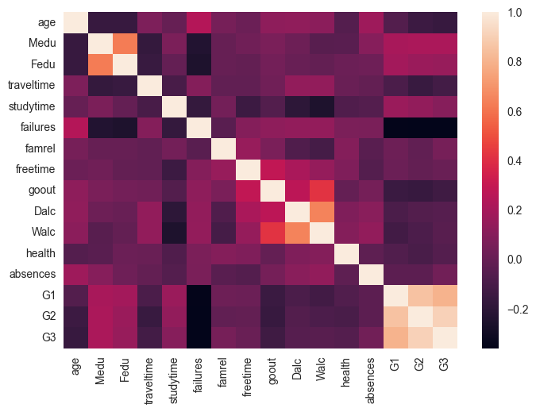

```python
import kagglehub

# Download latest version
path = kagglehub.dataset_download("uciml/student-alcohol-consumption")

print("Path to dataset files:", path)
```

    Path to dataset files: /Users/jeongho/.cache/kagglehub/datasets/uciml/student-alcohol-consumption/versions/2


```python
import pandas as pd
import numpy as np
import matplotlib.pyplot as plt
import seaborn as sns

import os

from sklearn.preprocessing import *
from sklearn.model_selection import train_test_split


df = pd.read_csv(os.path.join(path, "student-mat.csv"))
```


```python
df
```


<div>
<style scoped>
    .dataframe tbody tr th:only-of-type {
        vertical-align: middle;
    }

    .dataframe tbody tr th {
        vertical-align: top;
    }

    .dataframe thead th {
        text-align: right;
    }
</style>
<table border="1" class="dataframe">
  <thead>
    <tr style="text-align: right;">
      <th></th>
      <th>school</th>
      <th>sex</th>
      <th>age</th>
      <th>address</th>
      <th>famsize</th>
      <th>Pstatus</th>
      <th>Medu</th>
      <th>Fedu</th>
      <th>Mjob</th>
      <th>Fjob</th>
      <th>...</th>
      <th>famrel</th>
      <th>freetime</th>
      <th>goout</th>
      <th>Dalc</th>
      <th>Walc</th>
      <th>health</th>
      <th>absences</th>
      <th>G1</th>
      <th>G2</th>
      <th>G3</th>
    </tr>
  </thead>
  <tbody>
    <tr>
      <th>0</th>
      <td>GP</td>
      <td>F</td>
      <td>18</td>
      <td>U</td>
      <td>GT3</td>
      <td>A</td>
      <td>4</td>
      <td>4</td>
      <td>at_home</td>
      <td>teacher</td>
      <td>...</td>
      <td>4</td>
      <td>3</td>
      <td>4</td>
      <td>1</td>
      <td>1</td>
      <td>3</td>
      <td>6</td>
      <td>5</td>
      <td>6</td>
      <td>6</td>
    </tr>
    <tr>
      <th>1</th>
      <td>GP</td>
      <td>F</td>
      <td>17</td>
      <td>U</td>
      <td>GT3</td>
      <td>T</td>
      <td>1</td>
      <td>1</td>
      <td>at_home</td>
      <td>other</td>
      <td>...</td>
      <td>5</td>
      <td>3</td>
      <td>3</td>
      <td>1</td>
      <td>1</td>
      <td>3</td>
      <td>4</td>
      <td>5</td>
      <td>5</td>
      <td>6</td>
    </tr>
    <tr>
      <th>2</th>
      <td>GP</td>
      <td>F</td>
      <td>15</td>
      <td>U</td>
      <td>LE3</td>
      <td>T</td>
      <td>1</td>
      <td>1</td>
      <td>at_home</td>
      <td>other</td>
      <td>...</td>
      <td>4</td>
      <td>3</td>
      <td>2</td>
      <td>2</td>
      <td>3</td>
      <td>3</td>
      <td>10</td>
      <td>7</td>
      <td>8</td>
      <td>10</td>
    </tr>
    <tr>
      <th>3</th>
      <td>GP</td>
      <td>F</td>
      <td>15</td>
      <td>U</td>
      <td>GT3</td>
      <td>T</td>
      <td>4</td>
      <td>2</td>
      <td>health</td>
      <td>services</td>
      <td>...</td>
      <td>3</td>
      <td>2</td>
      <td>2</td>
      <td>1</td>
      <td>1</td>
      <td>5</td>
      <td>2</td>
      <td>15</td>
      <td>14</td>
      <td>15</td>
    </tr>
    <tr>
      <th>4</th>
      <td>GP</td>
      <td>F</td>
      <td>16</td>
      <td>U</td>
      <td>GT3</td>
      <td>T</td>
      <td>3</td>
      <td>3</td>
      <td>other</td>
      <td>other</td>
      <td>...</td>
      <td>4</td>
      <td>3</td>
      <td>2</td>
      <td>1</td>
      <td>2</td>
      <td>5</td>
      <td>4</td>
      <td>6</td>
      <td>10</td>
      <td>10</td>
    </tr>
    <tr>
      <th>...</th>
      <td>...</td>
      <td>...</td>
      <td>...</td>
      <td>...</td>
      <td>...</td>
      <td>...</td>
      <td>...</td>
      <td>...</td>
      <td>...</td>
      <td>...</td>
      <td>...</td>
      <td>...</td>
      <td>...</td>
      <td>...</td>
      <td>...</td>
      <td>...</td>
      <td>...</td>
      <td>...</td>
      <td>...</td>
      <td>...</td>
      <td>...</td>
    </tr>
    <tr>
      <th>390</th>
      <td>MS</td>
      <td>M</td>
      <td>20</td>
      <td>U</td>
      <td>LE3</td>
      <td>A</td>
      <td>2</td>
      <td>2</td>
      <td>services</td>
      <td>services</td>
      <td>...</td>
      <td>5</td>
      <td>5</td>
      <td>4</td>
      <td>4</td>
      <td>5</td>
      <td>4</td>
      <td>11</td>
      <td>9</td>
      <td>9</td>
      <td>9</td>
    </tr>
    <tr>
      <th>391</th>
      <td>MS</td>
      <td>M</td>
      <td>17</td>
      <td>U</td>
      <td>LE3</td>
      <td>T</td>
      <td>3</td>
      <td>1</td>
      <td>services</td>
      <td>services</td>
      <td>...</td>
      <td>2</td>
      <td>4</td>
      <td>5</td>
      <td>3</td>
      <td>4</td>
      <td>2</td>
      <td>3</td>
      <td>14</td>
      <td>16</td>
      <td>16</td>
    </tr>
    <tr>
      <th>392</th>
      <td>MS</td>
      <td>M</td>
      <td>21</td>
      <td>R</td>
      <td>GT3</td>
      <td>T</td>
      <td>1</td>
      <td>1</td>
      <td>other</td>
      <td>other</td>
      <td>...</td>
      <td>5</td>
      <td>5</td>
      <td>3</td>
      <td>3</td>
      <td>3</td>
      <td>3</td>
      <td>3</td>
      <td>10</td>
      <td>8</td>
      <td>7</td>
    </tr>
    <tr>
      <th>393</th>
      <td>MS</td>
      <td>M</td>
      <td>18</td>
      <td>R</td>
      <td>LE3</td>
      <td>T</td>
      <td>3</td>
      <td>2</td>
      <td>services</td>
      <td>other</td>
      <td>...</td>
      <td>4</td>
      <td>4</td>
      <td>1</td>
      <td>3</td>
      <td>4</td>
      <td>5</td>
      <td>0</td>
      <td>11</td>
      <td>12</td>
      <td>10</td>
    </tr>
    <tr>
      <th>394</th>
      <td>MS</td>
      <td>M</td>
      <td>19</td>
      <td>U</td>
      <td>LE3</td>
      <td>T</td>
      <td>1</td>
      <td>1</td>
      <td>other</td>
      <td>at_home</td>
      <td>...</td>
      <td>3</td>
      <td>2</td>
      <td>3</td>
      <td>3</td>
      <td>3</td>
      <td>5</td>
      <td>5</td>
      <td>8</td>
      <td>9</td>
      <td>9</td>
    </tr>
  </tbody>
</table>
<p>395 rows × 33 columns</p>
</div>


```python
df.info()
```

    <class 'pandas.core.frame.DataFrame'>
    RangeIndex: 395 entries, 0 to 394
    Data columns (total 33 columns):
     #   Column      Non-Null Count  Dtype 
    ---  ------      --------------  ----- 
     0   school      395 non-null    object
     1   sex         395 non-null    object
     2   age         395 non-null    int64 
     3   address     395 non-null    object
     4   famsize     395 non-null    object
     5   Pstatus     395 non-null    object
     6   Medu        395 non-null    int64 
     7   Fedu        395 non-null    int64 
     8   Mjob        395 non-null    object
     9   Fjob        395 non-null    object
     10  reason      395 non-null    object
     11  guardian    395 non-null    object
     12  traveltime  395 non-null    int64 
     13  studytime   395 non-null    int64 
     14  failures    395 non-null    int64 
     15  schoolsup   395 non-null    object
     16  famsup      395 non-null    object
     17  paid        395 non-null    object
     18  activities  395 non-null    object
     19  nursery     395 non-null    object
     20  higher      395 non-null    object
     21  internet    395 non-null    object
     22  romantic    395 non-null    object
     23  famrel      395 non-null    int64 
     24  freetime    395 non-null    int64 
     25  goout       395 non-null    int64 
     26  Dalc        395 non-null    int64 
     27  Walc        395 non-null    int64 
     28  health      395 non-null    int64 
     29  absences    395 non-null    int64 
     30  G1          395 non-null    int64 
     31  G2          395 non-null    int64 
     32  G3          395 non-null    int64 
    dtypes: int64(16), object(17)
    memory usage: 102.0+ KB


```python
corr = df.select_dtypes(np.number).corr()

sns.heatmap(corr)
```


    <Axes: >


    

    


```python
np.sum(df.isnull())
```


    school        0
    sex           0
    age           0
    address       0
    famsize       0
    Pstatus       0
    Medu          0
    Fedu          0
    Mjob          0
    Fjob          0
    reason        0
    guardian      0
    traveltime    0
    studytime     0
    failures      0
    schoolsup     0
    famsup        0
    paid          0
    activities    0
    nursery       0
    higher        0
    internet      0
    romantic      0
    famrel        0
    freetime      0
    goout         0
    Dalc          0
    Walc          0
    health        0
    absences      0
    G1            0
    G2            0
    G3            0
    dtype: int64


```python
abs(corr["G3"].sort_values(ascending=False))
```


    G3            1.000000
    G2            0.904868
    G1            0.801468
    Medu          0.217147
    Fedu          0.152457
    studytime     0.097820
    famrel        0.051363
    absences      0.034247
    freetime      0.011307
    Walc          0.051939
    Dalc          0.054660
    health        0.061335
    traveltime    0.117142
    goout         0.132791
    age           0.161579
    failures      0.360415
    Name: G3, dtype: float64


```python
cor_cols = corr[abs(corr["G3"]) > 0.2].columns

cor_cols
```


    Index(['age', 'Medu', 'Fedu', 'traveltime', 'studytime', 'failures', 'famrel',
           'freetime', 'goout', 'Dalc', 'Walc', 'health', 'absences', 'G1', 'G2',
           'G3'],
          dtype='object')


```python
df2 = df[cor_cols]
df2
```


<div>
<style scoped>
    .dataframe tbody tr th:only-of-type {
        vertical-align: middle;
    }

    .dataframe tbody tr th {
        vertical-align: top;
    }

    .dataframe thead th {
        text-align: right;
    }
</style>
<table border="1" class="dataframe">
  <thead>
    <tr style="text-align: right;">
      <th></th>
      <th>age</th>
      <th>Medu</th>
      <th>Fedu</th>
      <th>traveltime</th>
      <th>studytime</th>
      <th>failures</th>
      <th>famrel</th>
      <th>freetime</th>
      <th>goout</th>
      <th>Dalc</th>
      <th>Walc</th>
      <th>health</th>
      <th>absences</th>
      <th>G1</th>
      <th>G2</th>
      <th>G3</th>
    </tr>
  </thead>
  <tbody>
    <tr>
      <th>0</th>
      <td>18</td>
      <td>4</td>
      <td>4</td>
      <td>2</td>
      <td>2</td>
      <td>0</td>
      <td>4</td>
      <td>3</td>
      <td>4</td>
      <td>1</td>
      <td>1</td>
      <td>3</td>
      <td>6</td>
      <td>5</td>
      <td>6</td>
      <td>6</td>
    </tr>
    <tr>
      <th>1</th>
      <td>17</td>
      <td>1</td>
      <td>1</td>
      <td>1</td>
      <td>2</td>
      <td>0</td>
      <td>5</td>
      <td>3</td>
      <td>3</td>
      <td>1</td>
      <td>1</td>
      <td>3</td>
      <td>4</td>
      <td>5</td>
      <td>5</td>
      <td>6</td>
    </tr>
    <tr>
      <th>2</th>
      <td>15</td>
      <td>1</td>
      <td>1</td>
      <td>1</td>
      <td>2</td>
      <td>3</td>
      <td>4</td>
      <td>3</td>
      <td>2</td>
      <td>2</td>
      <td>3</td>
      <td>3</td>
      <td>10</td>
      <td>7</td>
      <td>8</td>
      <td>10</td>
    </tr>
    <tr>
      <th>3</th>
      <td>15</td>
      <td>4</td>
      <td>2</td>
      <td>1</td>
      <td>3</td>
      <td>0</td>
      <td>3</td>
      <td>2</td>
      <td>2</td>
      <td>1</td>
      <td>1</td>
      <td>5</td>
      <td>2</td>
      <td>15</td>
      <td>14</td>
      <td>15</td>
    </tr>
    <tr>
      <th>4</th>
      <td>16</td>
      <td>3</td>
      <td>3</td>
      <td>1</td>
      <td>2</td>
      <td>0</td>
      <td>4</td>
      <td>3</td>
      <td>2</td>
      <td>1</td>
      <td>2</td>
      <td>5</td>
      <td>4</td>
      <td>6</td>
      <td>10</td>
      <td>10</td>
    </tr>
    <tr>
      <th>...</th>
      <td>...</td>
      <td>...</td>
      <td>...</td>
      <td>...</td>
      <td>...</td>
      <td>...</td>
      <td>...</td>
      <td>...</td>
      <td>...</td>
      <td>...</td>
      <td>...</td>
      <td>...</td>
      <td>...</td>
      <td>...</td>
      <td>...</td>
      <td>...</td>
    </tr>
    <tr>
      <th>390</th>
      <td>20</td>
      <td>2</td>
      <td>2</td>
      <td>1</td>
      <td>2</td>
      <td>2</td>
      <td>5</td>
      <td>5</td>
      <td>4</td>
      <td>4</td>
      <td>5</td>
      <td>4</td>
      <td>11</td>
      <td>9</td>
      <td>9</td>
      <td>9</td>
    </tr>
    <tr>
      <th>391</th>
      <td>17</td>
      <td>3</td>
      <td>1</td>
      <td>2</td>
      <td>1</td>
      <td>0</td>
      <td>2</td>
      <td>4</td>
      <td>5</td>
      <td>3</td>
      <td>4</td>
      <td>2</td>
      <td>3</td>
      <td>14</td>
      <td>16</td>
      <td>16</td>
    </tr>
    <tr>
      <th>392</th>
      <td>21</td>
      <td>1</td>
      <td>1</td>
      <td>1</td>
      <td>1</td>
      <td>3</td>
      <td>5</td>
      <td>5</td>
      <td>3</td>
      <td>3</td>
      <td>3</td>
      <td>3</td>
      <td>3</td>
      <td>10</td>
      <td>8</td>
      <td>7</td>
    </tr>
    <tr>
      <th>393</th>
      <td>18</td>
      <td>3</td>
      <td>2</td>
      <td>3</td>
      <td>1</td>
      <td>0</td>
      <td>4</td>
      <td>4</td>
      <td>1</td>
      <td>3</td>
      <td>4</td>
      <td>5</td>
      <td>0</td>
      <td>11</td>
      <td>12</td>
      <td>10</td>
    </tr>
    <tr>
      <th>394</th>
      <td>19</td>
      <td>1</td>
      <td>1</td>
      <td>1</td>
      <td>1</td>
      <td>0</td>
      <td>3</td>
      <td>2</td>
      <td>3</td>
      <td>3</td>
      <td>3</td>
      <td>5</td>
      <td>5</td>
      <td>8</td>
      <td>9</td>
      <td>9</td>
    </tr>
  </tbody>
</table>
<p>395 rows × 16 columns</p>
</div>


```python
from pycaret.regression import *

setup(df2, target=df2["G3"], train_size=0.7, session_id=42)
```


<style type="text/css">
#T_9e958_row8_col1 {
  background-color: lightgreen;
}
</style>
<table id="T_9e958">
  <thead>
    <tr>
      <th class="blank level0" >&nbsp;</th>
      <th id="T_9e958_level0_col0" class="col_heading level0 col0" >Description</th>
      <th id="T_9e958_level0_col1" class="col_heading level0 col1" >Value</th>
    </tr>
  </thead>
  <tbody>
    <tr>
      <th id="T_9e958_level0_row0" class="row_heading level0 row0" >0</th>
      <td id="T_9e958_row0_col0" class="data row0 col0" >Session id</td>
      <td id="T_9e958_row0_col1" class="data row0 col1" >42</td>
    </tr>
    <tr>
      <th id="T_9e958_level0_row1" class="row_heading level0 row1" >1</th>
      <td id="T_9e958_row1_col0" class="data row1 col0" >Target</td>
      <td id="T_9e958_row1_col1" class="data row1 col1" >G3_y</td>
    </tr>
    <tr>
      <th id="T_9e958_level0_row2" class="row_heading level0 row2" >2</th>
      <td id="T_9e958_row2_col0" class="data row2 col0" >Target type</td>
      <td id="T_9e958_row2_col1" class="data row2 col1" >Regression</td>
    </tr>
    <tr>
      <th id="T_9e958_level0_row3" class="row_heading level0 row3" >3</th>
      <td id="T_9e958_row3_col0" class="data row3 col0" >Original data shape</td>
      <td id="T_9e958_row3_col1" class="data row3 col1" >(395, 17)</td>
    </tr>
    <tr>
      <th id="T_9e958_level0_row4" class="row_heading level0 row4" >4</th>
      <td id="T_9e958_row4_col0" class="data row4 col0" >Transformed data shape</td>
      <td id="T_9e958_row4_col1" class="data row4 col1" >(395, 17)</td>
    </tr>
    <tr>
      <th id="T_9e958_level0_row5" class="row_heading level0 row5" >5</th>
      <td id="T_9e958_row5_col0" class="data row5 col0" >Transformed train set shape</td>
      <td id="T_9e958_row5_col1" class="data row5 col1" >(276, 17)</td>
    </tr>
    <tr>
      <th id="T_9e958_level0_row6" class="row_heading level0 row6" >6</th>
      <td id="T_9e958_row6_col0" class="data row6 col0" >Transformed test set shape</td>
      <td id="T_9e958_row6_col1" class="data row6 col1" >(119, 17)</td>
    </tr>
    <tr>
      <th id="T_9e958_level0_row7" class="row_heading level0 row7" >7</th>
      <td id="T_9e958_row7_col0" class="data row7 col0" >Numeric features</td>
      <td id="T_9e958_row7_col1" class="data row7 col1" >16</td>
    </tr>
    <tr>
      <th id="T_9e958_level0_row8" class="row_heading level0 row8" >8</th>
      <td id="T_9e958_row8_col0" class="data row8 col0" >Preprocess</td>
      <td id="T_9e958_row8_col1" class="data row8 col1" >True</td>
    </tr>
    <tr>
      <th id="T_9e958_level0_row9" class="row_heading level0 row9" >9</th>
      <td id="T_9e958_row9_col0" class="data row9 col0" >Imputation type</td>
      <td id="T_9e958_row9_col1" class="data row9 col1" >simple</td>
    </tr>
    <tr>
      <th id="T_9e958_level0_row10" class="row_heading level0 row10" >10</th>
      <td id="T_9e958_row10_col0" class="data row10 col0" >Numeric imputation</td>
      <td id="T_9e958_row10_col1" class="data row10 col1" >mean</td>
    </tr>
    <tr>
      <th id="T_9e958_level0_row11" class="row_heading level0 row11" >11</th>
      <td id="T_9e958_row11_col0" class="data row11 col0" >Categorical imputation</td>
      <td id="T_9e958_row11_col1" class="data row11 col1" >mode</td>
    </tr>
    <tr>
      <th id="T_9e958_level0_row12" class="row_heading level0 row12" >12</th>
      <td id="T_9e958_row12_col0" class="data row12 col0" >Fold Generator</td>
      <td id="T_9e958_row12_col1" class="data row12 col1" >KFold</td>
    </tr>
    <tr>
      <th id="T_9e958_level0_row13" class="row_heading level0 row13" >13</th>
      <td id="T_9e958_row13_col0" class="data row13 col0" >Fold Number</td>
      <td id="T_9e958_row13_col1" class="data row13 col1" >10</td>
    </tr>
    <tr>
      <th id="T_9e958_level0_row14" class="row_heading level0 row14" >14</th>
      <td id="T_9e958_row14_col0" class="data row14 col0" >CPU Jobs</td>
      <td id="T_9e958_row14_col1" class="data row14 col1" >-1</td>
    </tr>
    <tr>
      <th id="T_9e958_level0_row15" class="row_heading level0 row15" >15</th>
      <td id="T_9e958_row15_col0" class="data row15 col0" >Use GPU</td>
      <td id="T_9e958_row15_col1" class="data row15 col1" >False</td>
    </tr>
    <tr>
      <th id="T_9e958_level0_row16" class="row_heading level0 row16" >16</th>
      <td id="T_9e958_row16_col0" class="data row16 col0" >Log Experiment</td>
      <td id="T_9e958_row16_col1" class="data row16 col1" >False</td>
    </tr>
    <tr>
      <th id="T_9e958_level0_row17" class="row_heading level0 row17" >17</th>
      <td id="T_9e958_row17_col0" class="data row17 col0" >Experiment Name</td>
      <td id="T_9e958_row17_col1" class="data row17 col1" >reg-default-name</td>
    </tr>
    <tr>
      <th id="T_9e958_level0_row18" class="row_heading level0 row18" >18</th>
      <td id="T_9e958_row18_col0" class="data row18 col0" >USI</td>
      <td id="T_9e958_row18_col1" class="data row18 col1" >0d64</td>
    </tr>
  </tbody>
</table>


    <pycaret.regression.oop.RegressionExperiment at 0x31e6eaf10>


```python
compare_models()
```


<style type="text/css">
#T_12a0b th {
  text-align: left;
}
#T_12a0b_row0_col0, #T_12a0b_row1_col0, #T_12a0b_row2_col0, #T_12a0b_row3_col0, #T_12a0b_row4_col0, #T_12a0b_row4_col1, #T_12a0b_row4_col3, #T_12a0b_row5_col0, #T_12a0b_row5_col1, #T_12a0b_row5_col3, #T_12a0b_row5_col5, #T_12a0b_row5_col6, #T_12a0b_row6_col0, #T_12a0b_row6_col1, #T_12a0b_row6_col2, #T_12a0b_row6_col3, #T_12a0b_row6_col4, #T_12a0b_row6_col5, #T_12a0b_row6_col6, #T_12a0b_row7_col0, #T_12a0b_row7_col1, #T_12a0b_row7_col2, #T_12a0b_row7_col3, #T_12a0b_row7_col4, #T_12a0b_row7_col5, #T_12a0b_row7_col6, #T_12a0b_row8_col0, #T_12a0b_row8_col1, #T_12a0b_row8_col2, #T_12a0b_row8_col3, #T_12a0b_row8_col4, #T_12a0b_row8_col5, #T_12a0b_row8_col6, #T_12a0b_row9_col0, #T_12a0b_row9_col1, #T_12a0b_row9_col2, #T_12a0b_row9_col3, #T_12a0b_row9_col4, #T_12a0b_row9_col5, #T_12a0b_row9_col6, #T_12a0b_row10_col0, #T_12a0b_row10_col1, #T_12a0b_row10_col2, #T_12a0b_row10_col3, #T_12a0b_row10_col4, #T_12a0b_row10_col5, #T_12a0b_row10_col6, #T_12a0b_row11_col0, #T_12a0b_row11_col1, #T_12a0b_row11_col2, #T_12a0b_row11_col3, #T_12a0b_row11_col4, #T_12a0b_row11_col5, #T_12a0b_row11_col6, #T_12a0b_row12_col0, #T_12a0b_row12_col1, #T_12a0b_row12_col2, #T_12a0b_row12_col3, #T_12a0b_row12_col4, #T_12a0b_row12_col5, #T_12a0b_row12_col6, #T_12a0b_row13_col0, #T_12a0b_row13_col1, #T_12a0b_row13_col2, #T_12a0b_row13_col3, #T_12a0b_row13_col4, #T_12a0b_row13_col5, #T_12a0b_row13_col6, #T_12a0b_row14_col0, #T_12a0b_row14_col1, #T_12a0b_row14_col2, #T_12a0b_row14_col3, #T_12a0b_row14_col4, #T_12a0b_row14_col5, #T_12a0b_row14_col6, #T_12a0b_row15_col0, #T_12a0b_row15_col1, #T_12a0b_row15_col2, #T_12a0b_row15_col3, #T_12a0b_row15_col4, #T_12a0b_row15_col5, #T_12a0b_row15_col6, #T_12a0b_row16_col0, #T_12a0b_row16_col1, #T_12a0b_row16_col2, #T_12a0b_row16_col3, #T_12a0b_row16_col4, #T_12a0b_row16_col5, #T_12a0b_row16_col6, #T_12a0b_row17_col0, #T_12a0b_row17_col1, #T_12a0b_row17_col2, #T_12a0b_row17_col3, #T_12a0b_row17_col4, #T_12a0b_row17_col5, #T_12a0b_row17_col6, #T_12a0b_row18_col0, #T_12a0b_row18_col1, #T_12a0b_row18_col2, #T_12a0b_row18_col3, #T_12a0b_row18_col4, #T_12a0b_row18_col5, #T_12a0b_row18_col6, #T_12a0b_row19_col0, #T_12a0b_row19_col1, #T_12a0b_row19_col2, #T_12a0b_row19_col3, #T_12a0b_row19_col4, #T_12a0b_row19_col5, #T_12a0b_row19_col6 {
  text-align: left;
}
#T_12a0b_row0_col1, #T_12a0b_row0_col2, #T_12a0b_row0_col3, #T_12a0b_row0_col4, #T_12a0b_row0_col5, #T_12a0b_row0_col6, #T_12a0b_row1_col1, #T_12a0b_row1_col2, #T_12a0b_row1_col3, #T_12a0b_row1_col4, #T_12a0b_row1_col5, #T_12a0b_row1_col6, #T_12a0b_row2_col1, #T_12a0b_row2_col2, #T_12a0b_row2_col3, #T_12a0b_row2_col4, #T_12a0b_row2_col5, #T_12a0b_row2_col6, #T_12a0b_row3_col1, #T_12a0b_row3_col2, #T_12a0b_row3_col3, #T_12a0b_row3_col4, #T_12a0b_row3_col5, #T_12a0b_row3_col6, #T_12a0b_row4_col2, #T_12a0b_row4_col4, #T_12a0b_row4_col5, #T_12a0b_row4_col6, #T_12a0b_row5_col2, #T_12a0b_row5_col4 {
  text-align: left;
  background-color: yellow;
}
#T_12a0b_row0_col7, #T_12a0b_row1_col7, #T_12a0b_row2_col7, #T_12a0b_row3_col7, #T_12a0b_row5_col7, #T_12a0b_row6_col7, #T_12a0b_row10_col7, #T_12a0b_row14_col7, #T_12a0b_row18_col7 {
  text-align: left;
  background-color: yellow;
  background-color: lightgrey;
}
#T_12a0b_row4_col7, #T_12a0b_row7_col7, #T_12a0b_row8_col7, #T_12a0b_row9_col7, #T_12a0b_row11_col7, #T_12a0b_row12_col7, #T_12a0b_row13_col7, #T_12a0b_row15_col7, #T_12a0b_row16_col7, #T_12a0b_row17_col7, #T_12a0b_row19_col7 {
  text-align: left;
  background-color: lightgrey;
}
</style>
<table id="T_12a0b">
  <thead>
    <tr>
      <th class="blank level0" >&nbsp;</th>
      <th id="T_12a0b_level0_col0" class="col_heading level0 col0" >Model</th>
      <th id="T_12a0b_level0_col1" class="col_heading level0 col1" >MAE</th>
      <th id="T_12a0b_level0_col2" class="col_heading level0 col2" >MSE</th>
      <th id="T_12a0b_level0_col3" class="col_heading level0 col3" >RMSE</th>
      <th id="T_12a0b_level0_col4" class="col_heading level0 col4" >R2</th>
      <th id="T_12a0b_level0_col5" class="col_heading level0 col5" >RMSLE</th>
      <th id="T_12a0b_level0_col6" class="col_heading level0 col6" >MAPE</th>
      <th id="T_12a0b_level0_col7" class="col_heading level0 col7" >TT (Sec)</th>
    </tr>
  </thead>
  <tbody>
    <tr>
      <th id="T_12a0b_level0_row0" class="row_heading level0 row0" >lr</th>
      <td id="T_12a0b_row0_col0" class="data row0 col0" >Linear Regression</td>
      <td id="T_12a0b_row0_col1" class="data row0 col1" >0.0000</td>
      <td id="T_12a0b_row0_col2" class="data row0 col2" >0.0000</td>
      <td id="T_12a0b_row0_col3" class="data row0 col3" >0.0000</td>
      <td id="T_12a0b_row0_col4" class="data row0 col4" >1.0000</td>
      <td id="T_12a0b_row0_col5" class="data row0 col5" >0.0005</td>
      <td id="T_12a0b_row0_col6" class="data row0 col6" >0.0000</td>
      <td id="T_12a0b_row0_col7" class="data row0 col7" >0.0030</td>
    </tr>
    <tr>
      <th id="T_12a0b_level0_row1" class="row_heading level0 row1" >lar</th>
      <td id="T_12a0b_row1_col0" class="data row1 col0" >Least Angle Regression</td>
      <td id="T_12a0b_row1_col1" class="data row1 col1" >0.0000</td>
      <td id="T_12a0b_row1_col2" class="data row1 col2" >0.0000</td>
      <td id="T_12a0b_row1_col3" class="data row1 col3" >0.0000</td>
      <td id="T_12a0b_row1_col4" class="data row1 col4" >1.0000</td>
      <td id="T_12a0b_row1_col5" class="data row1 col5" >0.0005</td>
      <td id="T_12a0b_row1_col6" class="data row1 col6" >0.0000</td>
      <td id="T_12a0b_row1_col7" class="data row1 col7" >0.0030</td>
    </tr>
    <tr>
      <th id="T_12a0b_level0_row2" class="row_heading level0 row2" >omp</th>
      <td id="T_12a0b_row2_col0" class="data row2 col0" >Orthogonal Matching Pursuit</td>
      <td id="T_12a0b_row2_col1" class="data row2 col1" >0.0000</td>
      <td id="T_12a0b_row2_col2" class="data row2 col2" >0.0000</td>
      <td id="T_12a0b_row2_col3" class="data row2 col3" >0.0000</td>
      <td id="T_12a0b_row2_col4" class="data row2 col4" >1.0000</td>
      <td id="T_12a0b_row2_col5" class="data row2 col5" >0.0005</td>
      <td id="T_12a0b_row2_col6" class="data row2 col6" >0.0000</td>
      <td id="T_12a0b_row2_col7" class="data row2 col7" >0.0030</td>
    </tr>
    <tr>
      <th id="T_12a0b_level0_row3" class="row_heading level0 row3" >br</th>
      <td id="T_12a0b_row3_col0" class="data row3 col0" >Bayesian Ridge</td>
      <td id="T_12a0b_row3_col1" class="data row3 col1" >0.0000</td>
      <td id="T_12a0b_row3_col2" class="data row3 col2" >0.0000</td>
      <td id="T_12a0b_row3_col3" class="data row3 col3" >0.0000</td>
      <td id="T_12a0b_row3_col4" class="data row3 col4" >1.0000</td>
      <td id="T_12a0b_row3_col5" class="data row3 col5" >0.0005</td>
      <td id="T_12a0b_row3_col6" class="data row3 col6" >0.0000</td>
      <td id="T_12a0b_row3_col7" class="data row3 col7" >0.0030</td>
    </tr>
    <tr>
      <th id="T_12a0b_level0_row4" class="row_heading level0 row4" >huber</th>
      <td id="T_12a0b_row4_col0" class="data row4 col0" >Huber Regressor</td>
      <td id="T_12a0b_row4_col1" class="data row4 col1" >0.0001</td>
      <td id="T_12a0b_row4_col2" class="data row4 col2" >0.0000</td>
      <td id="T_12a0b_row4_col3" class="data row4 col3" >0.0001</td>
      <td id="T_12a0b_row4_col4" class="data row4 col4" >1.0000</td>
      <td id="T_12a0b_row4_col5" class="data row4 col5" >0.0005</td>
      <td id="T_12a0b_row4_col6" class="data row4 col6" >0.0000</td>
      <td id="T_12a0b_row4_col7" class="data row4 col7" >0.0060</td>
    </tr>
    <tr>
      <th id="T_12a0b_level0_row5" class="row_heading level0 row5" >ridge</th>
      <td id="T_12a0b_row5_col0" class="data row5 col0" >Ridge Regression</td>
      <td id="T_12a0b_row5_col1" class="data row5 col1" >0.0015</td>
      <td id="T_12a0b_row5_col2" class="data row5 col2" >0.0000</td>
      <td id="T_12a0b_row5_col3" class="data row5 col3" >0.0024</td>
      <td id="T_12a0b_row5_col4" class="data row5 col4" >1.0000</td>
      <td id="T_12a0b_row5_col5" class="data row5 col5" >0.0019</td>
      <td id="T_12a0b_row5_col6" class="data row5 col6" >0.0001</td>
      <td id="T_12a0b_row5_col7" class="data row5 col7" >0.0030</td>
    </tr>
    <tr>
      <th id="T_12a0b_level0_row6" class="row_heading level0 row6" >par</th>
      <td id="T_12a0b_row6_col0" class="data row6 col0" >Passive Aggressive Regressor</td>
      <td id="T_12a0b_row6_col1" class="data row6 col1" >0.0487</td>
      <td id="T_12a0b_row6_col2" class="data row6 col2" >0.0037</td>
      <td id="T_12a0b_row6_col3" class="data row6 col3" >0.0602</td>
      <td id="T_12a0b_row6_col4" class="data row6 col4" >0.9998</td>
      <td id="T_12a0b_row6_col5" class="data row6 col5" >0.0194</td>
      <td id="T_12a0b_row6_col6" class="data row6 col6" >0.0044</td>
      <td id="T_12a0b_row6_col7" class="data row6 col7" >0.0030</td>
    </tr>
    <tr>
      <th id="T_12a0b_level0_row7" class="row_heading level0 row7" >gbr</th>
      <td id="T_12a0b_row7_col0" class="data row7 col0" >Gradient Boosting Regressor</td>
      <td id="T_12a0b_row7_col1" class="data row7 col1" >0.0155</td>
      <td id="T_12a0b_row7_col2" class="data row7 col2" >0.0140</td>
      <td id="T_12a0b_row7_col3" class="data row7 col3" >0.0660</td>
      <td id="T_12a0b_row7_col4" class="data row7 col4" >0.9994</td>
      <td id="T_12a0b_row7_col5" class="data row7 col5" >0.0101</td>
      <td id="T_12a0b_row7_col6" class="data row7 col6" >0.0027</td>
      <td id="T_12a0b_row7_col7" class="data row7 col7" >0.0140</td>
    </tr>
    <tr>
      <th id="T_12a0b_level0_row8" class="row_heading level0 row8" >et</th>
      <td id="T_12a0b_row8_col0" class="data row8 col0" >Extra Trees Regressor</td>
      <td id="T_12a0b_row8_col1" class="data row8 col1" >0.0417</td>
      <td id="T_12a0b_row8_col2" class="data row8 col2" >0.0137</td>
      <td id="T_12a0b_row8_col3" class="data row8 col3" >0.1007</td>
      <td id="T_12a0b_row8_col4" class="data row8 col4" >0.9994</td>
      <td id="T_12a0b_row8_col5" class="data row8 col5" >0.0199</td>
      <td id="T_12a0b_row8_col6" class="data row8 col6" >0.0044</td>
      <td id="T_12a0b_row8_col7" class="data row8 col7" >0.0140</td>
    </tr>
    <tr>
      <th id="T_12a0b_level0_row9" class="row_heading level0 row9" >rf</th>
      <td id="T_12a0b_row9_col0" class="data row9 col0" >Random Forest Regressor</td>
      <td id="T_12a0b_row9_col1" class="data row9 col1" >0.0469</td>
      <td id="T_12a0b_row9_col2" class="data row9 col2" >0.0541</td>
      <td id="T_12a0b_row9_col3" class="data row9 col3" >0.1560</td>
      <td id="T_12a0b_row9_col4" class="data row9 col4" >0.9978</td>
      <td id="T_12a0b_row9_col5" class="data row9 col5" >0.0219</td>
      <td id="T_12a0b_row9_col6" class="data row9 col6" >0.0070</td>
      <td id="T_12a0b_row9_col7" class="data row9 col7" >0.0160</td>
    </tr>
    <tr>
      <th id="T_12a0b_level0_row10" class="row_heading level0 row10" >llar</th>
      <td id="T_12a0b_row10_col0" class="data row10 col0" >Lasso Least Angle Regression</td>
      <td id="T_12a0b_row10_col1" class="data row10 col1" >0.1632</td>
      <td id="T_12a0b_row10_col2" class="data row10 col2" >0.0501</td>
      <td id="T_12a0b_row10_col3" class="data row10 col3" >0.2205</td>
      <td id="T_12a0b_row10_col4" class="data row10 col4" >0.9976</td>
      <td id="T_12a0b_row10_col5" class="data row10 col5" >0.1303</td>
      <td id="T_12a0b_row10_col6" class="data row10 col6" >0.0107</td>
      <td id="T_12a0b_row10_col7" class="data row10 col7" >0.0030</td>
    </tr>
    <tr>
      <th id="T_12a0b_level0_row11" class="row_heading level0 row11" >lasso</th>
      <td id="T_12a0b_row11_col0" class="data row11 col0" >Lasso Regression</td>
      <td id="T_12a0b_row11_col1" class="data row11 col1" >0.1632</td>
      <td id="T_12a0b_row11_col2" class="data row11 col2" >0.0501</td>
      <td id="T_12a0b_row11_col3" class="data row11 col3" >0.2205</td>
      <td id="T_12a0b_row11_col4" class="data row11 col4" >0.9976</td>
      <td id="T_12a0b_row11_col5" class="data row11 col5" >0.1303</td>
      <td id="T_12a0b_row11_col6" class="data row11 col6" >0.0107</td>
      <td id="T_12a0b_row11_col7" class="data row11 col7" >0.0040</td>
    </tr>
    <tr>
      <th id="T_12a0b_level0_row12" class="row_heading level0 row12" >xgboost</th>
      <td id="T_12a0b_row12_col0" class="data row12 col0" >Extreme Gradient Boosting</td>
      <td id="T_12a0b_row12_col1" class="data row12 col1" >0.0288</td>
      <td id="T_12a0b_row12_col2" class="data row12 col2" >0.0752</td>
      <td id="T_12a0b_row12_col3" class="data row12 col3" >0.1270</td>
      <td id="T_12a0b_row12_col4" class="data row12 col4" >0.9975</td>
      <td id="T_12a0b_row12_col5" class="data row12 col5" >0.0392</td>
      <td id="T_12a0b_row12_col6" class="data row12 col6" >0.0064</td>
      <td id="T_12a0b_row12_col7" class="data row12 col7" >0.0070</td>
    </tr>
    <tr>
      <th id="T_12a0b_level0_row13" class="row_heading level0 row13" >en</th>
      <td id="T_12a0b_row13_col0" class="data row13 col0" >Elastic Net</td>
      <td id="T_12a0b_row13_col1" class="data row13 col1" >0.1556</td>
      <td id="T_12a0b_row13_col2" class="data row13 col2" >0.0582</td>
      <td id="T_12a0b_row13_col3" class="data row13 col3" >0.2377</td>
      <td id="T_12a0b_row13_col4" class="data row13 col4" >0.9971</td>
      <td id="T_12a0b_row13_col5" class="data row13 col5" >0.1487</td>
      <td id="T_12a0b_row13_col6" class="data row13 col6" >0.0092</td>
      <td id="T_12a0b_row13_col7" class="data row13 col7" >0.0040</td>
    </tr>
    <tr>
      <th id="T_12a0b_level0_row14" class="row_heading level0 row14" >dt</th>
      <td id="T_12a0b_row14_col0" class="data row14 col0" >Decision Tree Regressor</td>
      <td id="T_12a0b_row14_col1" class="data row14 col1" >0.0396</td>
      <td id="T_12a0b_row14_col2" class="data row14 col2" >0.1467</td>
      <td id="T_12a0b_row14_col3" class="data row14 col3" >0.1862</td>
      <td id="T_12a0b_row14_col4" class="data row14 col4" >0.9935</td>
      <td id="T_12a0b_row14_col5" class="data row14 col5" >0.0452</td>
      <td id="T_12a0b_row14_col6" class="data row14 col6" >0.0066</td>
      <td id="T_12a0b_row14_col7" class="data row14 col7" >0.0030</td>
    </tr>
    <tr>
      <th id="T_12a0b_level0_row15" class="row_heading level0 row15" >ada</th>
      <td id="T_12a0b_row15_col0" class="data row15 col0" >AdaBoost Regressor</td>
      <td id="T_12a0b_row15_col1" class="data row15 col1" >0.2807</td>
      <td id="T_12a0b_row15_col2" class="data row15 col2" >0.1319</td>
      <td id="T_12a0b_row15_col3" class="data row15 col3" >0.3530</td>
      <td id="T_12a0b_row15_col4" class="data row15 col4" >0.9934</td>
      <td id="T_12a0b_row15_col5" class="data row15 col5" >0.0313</td>
      <td id="T_12a0b_row15_col6" class="data row15 col6" >0.0288</td>
      <td id="T_12a0b_row15_col7" class="data row15 col7" >0.0070</td>
    </tr>
    <tr>
      <th id="T_12a0b_level0_row16" class="row_heading level0 row16" >lightgbm</th>
      <td id="T_12a0b_row16_col0" class="data row16 col0" >Light Gradient Boosting Machine</td>
      <td id="T_12a0b_row16_col1" class="data row16 col1" >0.2048</td>
      <td id="T_12a0b_row16_col2" class="data row16 col2" >0.1581</td>
      <td id="T_12a0b_row16_col3" class="data row16 col3" >0.3505</td>
      <td id="T_12a0b_row16_col4" class="data row16 col4" >0.9933</td>
      <td id="T_12a0b_row16_col5" class="data row16 col5" >0.0353</td>
      <td id="T_12a0b_row16_col6" class="data row16 col6" >0.0188</td>
      <td id="T_12a0b_row16_col7" class="data row16 col7" >0.1070</td>
    </tr>
    <tr>
      <th id="T_12a0b_level0_row17" class="row_heading level0 row17" >catboost</th>
      <td id="T_12a0b_row17_col0" class="data row17 col0" >CatBoost Regressor</td>
      <td id="T_12a0b_row17_col1" class="data row17 col1" >0.2621</td>
      <td id="T_12a0b_row17_col2" class="data row17 col2" >0.1732</td>
      <td id="T_12a0b_row17_col3" class="data row17 col3" >0.3989</td>
      <td id="T_12a0b_row17_col4" class="data row17 col4" >0.9914</td>
      <td id="T_12a0b_row17_col5" class="data row17 col5" >0.1583</td>
      <td id="T_12a0b_row17_col6" class="data row17 col6" >0.0204</td>
      <td id="T_12a0b_row17_col7" class="data row17 col7" >0.0580</td>
    </tr>
    <tr>
      <th id="T_12a0b_level0_row18" class="row_heading level0 row18" >knn</th>
      <td id="T_12a0b_row18_col0" class="data row18 col0" >K Neighbors Regressor</td>
      <td id="T_12a0b_row18_col1" class="data row18 col1" >0.6213</td>
      <td id="T_12a0b_row18_col2" class="data row18 col2" >0.7375</td>
      <td id="T_12a0b_row18_col3" class="data row18 col3" >0.8454</td>
      <td id="T_12a0b_row18_col4" class="data row18 col4" >0.9629</td>
      <td id="T_12a0b_row18_col5" class="data row18 col5" >0.0774</td>
      <td id="T_12a0b_row18_col6" class="data row18 col6" >0.0669</td>
      <td id="T_12a0b_row18_col7" class="data row18 col7" >0.0030</td>
    </tr>
    <tr>
      <th id="T_12a0b_level0_row19" class="row_heading level0 row19" >dummy</th>
      <td id="T_12a0b_row19_col0" class="data row19 col0" >Dummy Regressor</td>
      <td id="T_12a0b_row19_col1" class="data row19 col1" >3.3210</td>
      <td id="T_12a0b_row19_col2" class="data row19 col2" >20.5614</td>
      <td id="T_12a0b_row19_col3" class="data row19 col3" >4.4913</td>
      <td id="T_12a0b_row19_col4" class="data row19 col4" >-0.0146</td>
      <td id="T_12a0b_row19_col5" class="data row19 col5" >0.8022</td>
      <td id="T_12a0b_row19_col6" class="data row19 col6" >0.2177</td>
      <td id="T_12a0b_row19_col7" class="data row19 col7" >0.0040</td>
    </tr>
  </tbody>
</table>


<style>#sk-container-id-8 {
  /* Definition of color scheme common for light and dark mode */
  --sklearn-color-text: black;
  --sklearn-color-line: gray;
  /* Definition of color scheme for unfitted estimators */
  --sklearn-color-unfitted-level-0: #fff5e6;
  --sklearn-color-unfitted-level-1: #f6e4d2;
  --sklearn-color-unfitted-level-2: #ffe0b3;
  --sklearn-color-unfitted-level-3: chocolate;
  /* Definition of color scheme for fitted estimators */
  --sklearn-color-fitted-level-0: #f0f8ff;
  --sklearn-color-fitted-level-1: #d4ebff;
  --sklearn-color-fitted-level-2: #b3dbfd;
  --sklearn-color-fitted-level-3: cornflowerblue;

  /* Specific color for light theme */
  --sklearn-color-text-on-default-background: var(--sg-text-color, var(--theme-code-foreground, var(--jp-content-font-color1, black)));
  --sklearn-color-background: var(--sg-background-color, var(--theme-background, var(--jp-layout-color0, white)));
  --sklearn-color-border-box: var(--sg-text-color, var(--theme-code-foreground, var(--jp-content-font-color1, black)));
  --sklearn-color-icon: #696969;

  @media (prefers-color-scheme: dark) {
    /* Redefinition of color scheme for dark theme */
    --sklearn-color-text-on-default-background: var(--sg-text-color, var(--theme-code-foreground, var(--jp-content-font-color1, white)));
    --sklearn-color-background: var(--sg-background-color, var(--theme-background, var(--jp-layout-color0, #111)));
    --sklearn-color-border-box: var(--sg-text-color, var(--theme-code-foreground, var(--jp-content-font-color1, white)));
    --sklearn-color-icon: #878787;
  }
}

#sk-container-id-8 {
  color: var(--sklearn-color-text);
}

#sk-container-id-8 pre {
  padding: 0;
}

#sk-container-id-8 input.sk-hidden--visually {
  border: 0;
  clip: rect(1px 1px 1px 1px);
  clip: rect(1px, 1px, 1px, 1px);
  height: 1px;
  margin: -1px;
  overflow: hidden;
  padding: 0;
  position: absolute;
  width: 1px;
}

#sk-container-id-8 div.sk-dashed-wrapped {
  border: 1px dashed var(--sklearn-color-line);
  margin: 0 0.4em 0.5em 0.4em;
  box-sizing: border-box;
  padding-bottom: 0.4em;
  background-color: var(--sklearn-color-background);
}

#sk-container-id-8 div.sk-container {
  /* jupyter's `normalize.less` sets `[hidden] { display: none; }`
     but bootstrap.min.css set `[hidden] { display: none !important; }`
     so we also need the `!important` here to be able to override the
     default hidden behavior on the sphinx rendered scikit-learn.org.
     See: https://github.com/scikit-learn/scikit-learn/issues/21755 */
  display: inline-block !important;
  position: relative;
}

#sk-container-id-8 div.sk-text-repr-fallback {
  display: none;
}

div.sk-parallel-item,
div.sk-serial,
div.sk-item {
  /* draw centered vertical line to link estimators */
  background-image: linear-gradient(var(--sklearn-color-text-on-default-background), var(--sklearn-color-text-on-default-background));
  background-size: 2px 100%;
  background-repeat: no-repeat;
  background-position: center center;
}

/* Parallel-specific style estimator block */

#sk-container-id-8 div.sk-parallel-item::after {
  content: "";
  width: 100%;
  border-bottom: 2px solid var(--sklearn-color-text-on-default-background);
  flex-grow: 1;
}

#sk-container-id-8 div.sk-parallel {
  display: flex;
  align-items: stretch;
  justify-content: center;
  background-color: var(--sklearn-color-background);
  position: relative;
}

#sk-container-id-8 div.sk-parallel-item {
  display: flex;
  flex-direction: column;
}

#sk-container-id-8 div.sk-parallel-item:first-child::after {
  align-self: flex-end;
  width: 50%;
}

#sk-container-id-8 div.sk-parallel-item:last-child::after {
  align-self: flex-start;
  width: 50%;
}

#sk-container-id-8 div.sk-parallel-item:only-child::after {
  width: 0;
}

/* Serial-specific style estimator block */

#sk-container-id-8 div.sk-serial {
  display: flex;
  flex-direction: column;
  align-items: center;
  background-color: var(--sklearn-color-background);
  padding-right: 1em;
  padding-left: 1em;
}


/* Toggleable style: style used for estimator/Pipeline/ColumnTransformer box that is
clickable and can be expanded/collapsed.
- Pipeline and ColumnTransformer use this feature and define the default style
- Estimators will overwrite some part of the style using the `sk-estimator` class
*/

/* Pipeline and ColumnTransformer style (default) */

#sk-container-id-8 div.sk-toggleable {
  /* Default theme specific background. It is overwritten whether we have a
  specific estimator or a Pipeline/ColumnTransformer */
  background-color: var(--sklearn-color-background);
}

/* Toggleable label */
#sk-container-id-8 label.sk-toggleable__label {
  cursor: pointer;
  display: block;
  width: 100%;
  margin-bottom: 0;
  padding: 0.5em;
  box-sizing: border-box;
  text-align: center;
}

#sk-container-id-8 label.sk-toggleable__label-arrow:before {
  /* Arrow on the left of the label */
  content: "▸";
  float: left;
  margin-right: 0.25em;
  color: var(--sklearn-color-icon);
}

#sk-container-id-8 label.sk-toggleable__label-arrow:hover:before {
  color: var(--sklearn-color-text);
}

/* Toggleable content - dropdown */

#sk-container-id-8 div.sk-toggleable__content {
  max-height: 0;
  max-width: 0;
  overflow: hidden;
  text-align: left;
  /* unfitted */
  background-color: var(--sklearn-color-unfitted-level-0);
}

#sk-container-id-8 div.sk-toggleable__content.fitted {
  /* fitted */
  background-color: var(--sklearn-color-fitted-level-0);
}

#sk-container-id-8 div.sk-toggleable__content pre {
  margin: 0.2em;
  border-radius: 0.25em;
  color: var(--sklearn-color-text);
  /* unfitted */
  background-color: var(--sklearn-color-unfitted-level-0);
}

#sk-container-id-8 div.sk-toggleable__content.fitted pre {
  /* unfitted */
  background-color: var(--sklearn-color-fitted-level-0);
}

#sk-container-id-8 input.sk-toggleable__control:checked~div.sk-toggleable__content {
  /* Expand drop-down */
  max-height: 200px;
  max-width: 100%;
  overflow: auto;
}

#sk-container-id-8 input.sk-toggleable__control:checked~label.sk-toggleable__label-arrow:before {
  content: "▾";
}

/* Pipeline/ColumnTransformer-specific style */

#sk-container-id-8 div.sk-label input.sk-toggleable__control:checked~label.sk-toggleable__label {
  color: var(--sklearn-color-text);
  background-color: var(--sklearn-color-unfitted-level-2);
}

#sk-container-id-8 div.sk-label.fitted input.sk-toggleable__control:checked~label.sk-toggleable__label {
  background-color: var(--sklearn-color-fitted-level-2);
}

/* Estimator-specific style */

/* Colorize estimator box */
#sk-container-id-8 div.sk-estimator input.sk-toggleable__control:checked~label.sk-toggleable__label {
  /* unfitted */
  background-color: var(--sklearn-color-unfitted-level-2);
}

#sk-container-id-8 div.sk-estimator.fitted input.sk-toggleable__control:checked~label.sk-toggleable__label {
  /* fitted */
  background-color: var(--sklearn-color-fitted-level-2);
}

#sk-container-id-8 div.sk-label label.sk-toggleable__label,
#sk-container-id-8 div.sk-label label {
  /* The background is the default theme color */
  color: var(--sklearn-color-text-on-default-background);
}

/* On hover, darken the color of the background */
#sk-container-id-8 div.sk-label:hover label.sk-toggleable__label {
  color: var(--sklearn-color-text);
  background-color: var(--sklearn-color-unfitted-level-2);
}

/* Label box, darken color on hover, fitted */
#sk-container-id-8 div.sk-label.fitted:hover label.sk-toggleable__label.fitted {
  color: var(--sklearn-color-text);
  background-color: var(--sklearn-color-fitted-level-2);
}

/* Estimator label */

#sk-container-id-8 div.sk-label label {
  font-family: monospace;
  font-weight: bold;
  display: inline-block;
  line-height: 1.2em;
}

#sk-container-id-8 div.sk-label-container {
  text-align: center;
}

/* Estimator-specific */
#sk-container-id-8 div.sk-estimator {
  font-family: monospace;
  border: 1px dotted var(--sklearn-color-border-box);
  border-radius: 0.25em;
  box-sizing: border-box;
  margin-bottom: 0.5em;
  /* unfitted */
  background-color: var(--sklearn-color-unfitted-level-0);
}

#sk-container-id-8 div.sk-estimator.fitted {
  /* fitted */
  background-color: var(--sklearn-color-fitted-level-0);
}

/* on hover */
#sk-container-id-8 div.sk-estimator:hover {
  /* unfitted */
  background-color: var(--sklearn-color-unfitted-level-2);
}

#sk-container-id-8 div.sk-estimator.fitted:hover {
  /* fitted */
  background-color: var(--sklearn-color-fitted-level-2);
}

/* Specification for estimator info (e.g. "i" and "?") */

/* Common style for "i" and "?" */

.sk-estimator-doc-link,
a:link.sk-estimator-doc-link,
a:visited.sk-estimator-doc-link {
  float: right;
  font-size: smaller;
  line-height: 1em;
  font-family: monospace;
  background-color: var(--sklearn-color-background);
  border-radius: 1em;
  height: 1em;
  width: 1em;
  text-decoration: none !important;
  margin-left: 1ex;
  /* unfitted */
  border: var(--sklearn-color-unfitted-level-1) 1pt solid;
  color: var(--sklearn-color-unfitted-level-1);
}

.sk-estimator-doc-link.fitted,
a:link.sk-estimator-doc-link.fitted,
a:visited.sk-estimator-doc-link.fitted {
  /* fitted */
  border: var(--sklearn-color-fitted-level-1) 1pt solid;
  color: var(--sklearn-color-fitted-level-1);
}

/* On hover */
div.sk-estimator:hover .sk-estimator-doc-link:hover,
.sk-estimator-doc-link:hover,
div.sk-label-container:hover .sk-estimator-doc-link:hover,
.sk-estimator-doc-link:hover {
  /* unfitted */
  background-color: var(--sklearn-color-unfitted-level-3);
  color: var(--sklearn-color-background);
  text-decoration: none;
}

div.sk-estimator.fitted:hover .sk-estimator-doc-link.fitted:hover,
.sk-estimator-doc-link.fitted:hover,
div.sk-label-container:hover .sk-estimator-doc-link.fitted:hover,
.sk-estimator-doc-link.fitted:hover {
  /* fitted */
  background-color: var(--sklearn-color-fitted-level-3);
  color: var(--sklearn-color-background);
  text-decoration: none;
}

/* Span, style for the box shown on hovering the info icon */
.sk-estimator-doc-link span {
  display: none;
  z-index: 9999;
  position: relative;
  font-weight: normal;
  right: .2ex;
  padding: .5ex;
  margin: .5ex;
  width: min-content;
  min-width: 20ex;
  max-width: 50ex;
  color: var(--sklearn-color-text);
  box-shadow: 2pt 2pt 4pt #999;
  /* unfitted */
  background: var(--sklearn-color-unfitted-level-0);
  border: .5pt solid var(--sklearn-color-unfitted-level-3);
}

.sk-estimator-doc-link.fitted span {
  /* fitted */
  background: var(--sklearn-color-fitted-level-0);
  border: var(--sklearn-color-fitted-level-3);
}

.sk-estimator-doc-link:hover span {
  display: block;
}

/* "?"-specific style due to the `<a>` HTML tag */

#sk-container-id-8 a.estimator_doc_link {
  float: right;
  font-size: 1rem;
  line-height: 1em;
  font-family: monospace;
  background-color: var(--sklearn-color-background);
  border-radius: 1rem;
  height: 1rem;
  width: 1rem;
  text-decoration: none;
  /* unfitted */
  color: var(--sklearn-color-unfitted-level-1);
  border: var(--sklearn-color-unfitted-level-1) 1pt solid;
}

#sk-container-id-8 a.estimator_doc_link.fitted {
  /* fitted */
  border: var(--sklearn-color-fitted-level-1) 1pt solid;
  color: var(--sklearn-color-fitted-level-1);
}

/* On hover */
#sk-container-id-8 a.estimator_doc_link:hover {
  /* unfitted */
  background-color: var(--sklearn-color-unfitted-level-3);
  color: var(--sklearn-color-background);
  text-decoration: none;
}

#sk-container-id-8 a.estimator_doc_link.fitted:hover {
  /* fitted */
  background-color: var(--sklearn-color-fitted-level-3);
}
</style><div id="sk-container-id-8" class="sk-top-container"><div class="sk-text-repr-fallback"><pre>LinearRegression(n_jobs=-1)</pre><b>In a Jupyter environment, please rerun this cell to show the HTML representation or trust the notebook. <br />On GitHub, the HTML representation is unable to render, please try loading this page with nbviewer.org.</b></div><div class="sk-container" hidden><div class="sk-item"><div class="sk-estimator fitted sk-toggleable"><input class="sk-toggleable__control sk-hidden--visually" id="sk-estimator-id-8" type="checkbox" checked><label for="sk-estimator-id-8" class="sk-toggleable__label fitted sk-toggleable__label-arrow fitted">&nbsp;&nbsp;LinearRegression<a class="sk-estimator-doc-link fitted" rel="noreferrer" target="_blank" href="https://scikit-learn.org/1.5/modules/generated/sklearn.linear_model.LinearRegression.html">?<span>Documentation for LinearRegression</span></a><span class="sk-estimator-doc-link fitted">i<span>Fitted</span></span></label><div class="sk-toggleable__content fitted"><pre>LinearRegression(n_jobs=-1)</pre></div> </div></div></div></div>


```python
df2.describe()
```


<div>
<style scoped>
    .dataframe tbody tr th:only-of-type {
        vertical-align: middle;
    }

    .dataframe tbody tr th {
        vertical-align: top;
    }

    .dataframe thead th {
        text-align: right;
    }
</style>
<table border="1" class="dataframe">
  <thead>
    <tr style="text-align: right;">
      <th></th>
      <th>age</th>
      <th>Medu</th>
      <th>Fedu</th>
      <th>traveltime</th>
      <th>studytime</th>
      <th>failures</th>
      <th>famrel</th>
      <th>freetime</th>
      <th>goout</th>
      <th>Dalc</th>
      <th>Walc</th>
      <th>health</th>
      <th>absences</th>
      <th>G1</th>
      <th>G2</th>
      <th>G3</th>
    </tr>
  </thead>
  <tbody>
    <tr>
      <th>count</th>
      <td>395.000000</td>
      <td>395.000000</td>
      <td>395.000000</td>
      <td>395.000000</td>
      <td>395.000000</td>
      <td>395.000000</td>
      <td>395.000000</td>
      <td>395.000000</td>
      <td>395.000000</td>
      <td>395.000000</td>
      <td>395.000000</td>
      <td>395.000000</td>
      <td>395.000000</td>
      <td>395.000000</td>
      <td>395.000000</td>
      <td>395.000000</td>
    </tr>
    <tr>
      <th>mean</th>
      <td>16.696203</td>
      <td>2.749367</td>
      <td>2.521519</td>
      <td>1.448101</td>
      <td>2.035443</td>
      <td>0.334177</td>
      <td>3.944304</td>
      <td>3.235443</td>
      <td>3.108861</td>
      <td>1.481013</td>
      <td>2.291139</td>
      <td>3.554430</td>
      <td>5.708861</td>
      <td>10.908861</td>
      <td>10.713924</td>
      <td>10.415190</td>
    </tr>
    <tr>
      <th>std</th>
      <td>1.276043</td>
      <td>1.094735</td>
      <td>1.088201</td>
      <td>0.697505</td>
      <td>0.839240</td>
      <td>0.743651</td>
      <td>0.896659</td>
      <td>0.998862</td>
      <td>1.113278</td>
      <td>0.890741</td>
      <td>1.287897</td>
      <td>1.390303</td>
      <td>8.003096</td>
      <td>3.319195</td>
      <td>3.761505</td>
      <td>4.581443</td>
    </tr>
    <tr>
      <th>min</th>
      <td>15.000000</td>
      <td>0.000000</td>
      <td>0.000000</td>
      <td>1.000000</td>
      <td>1.000000</td>
      <td>0.000000</td>
      <td>1.000000</td>
      <td>1.000000</td>
      <td>1.000000</td>
      <td>1.000000</td>
      <td>1.000000</td>
      <td>1.000000</td>
      <td>0.000000</td>
      <td>3.000000</td>
      <td>0.000000</td>
      <td>0.000000</td>
    </tr>
    <tr>
      <th>25%</th>
      <td>16.000000</td>
      <td>2.000000</td>
      <td>2.000000</td>
      <td>1.000000</td>
      <td>1.000000</td>
      <td>0.000000</td>
      <td>4.000000</td>
      <td>3.000000</td>
      <td>2.000000</td>
      <td>1.000000</td>
      <td>1.000000</td>
      <td>3.000000</td>
      <td>0.000000</td>
      <td>8.000000</td>
      <td>9.000000</td>
      <td>8.000000</td>
    </tr>
    <tr>
      <th>50%</th>
      <td>17.000000</td>
      <td>3.000000</td>
      <td>2.000000</td>
      <td>1.000000</td>
      <td>2.000000</td>
      <td>0.000000</td>
      <td>4.000000</td>
      <td>3.000000</td>
      <td>3.000000</td>
      <td>1.000000</td>
      <td>2.000000</td>
      <td>4.000000</td>
      <td>4.000000</td>
      <td>11.000000</td>
      <td>11.000000</td>
      <td>11.000000</td>
    </tr>
    <tr>
      <th>75%</th>
      <td>18.000000</td>
      <td>4.000000</td>
      <td>3.000000</td>
      <td>2.000000</td>
      <td>2.000000</td>
      <td>0.000000</td>
      <td>5.000000</td>
      <td>4.000000</td>
      <td>4.000000</td>
      <td>2.000000</td>
      <td>3.000000</td>
      <td>5.000000</td>
      <td>8.000000</td>
      <td>13.000000</td>
      <td>13.000000</td>
      <td>14.000000</td>
    </tr>
    <tr>
      <th>max</th>
      <td>22.000000</td>
      <td>4.000000</td>
      <td>4.000000</td>
      <td>4.000000</td>
      <td>4.000000</td>
      <td>3.000000</td>
      <td>5.000000</td>
      <td>5.000000</td>
      <td>5.000000</td>
      <td>5.000000</td>
      <td>5.000000</td>
      <td>5.000000</td>
      <td>75.000000</td>
      <td>19.000000</td>
      <td>19.000000</td>
      <td>20.000000</td>
    </tr>
  </tbody>
</table>
</div>


```python
df2
```


<div>
<style scoped>
    .dataframe tbody tr th:only-of-type {
        vertical-align: middle;
    }

    .dataframe tbody tr th {
        vertical-align: top;
    }

    .dataframe thead th {
        text-align: right;
    }
</style>
<table border="1" class="dataframe">
  <thead>
    <tr style="text-align: right;">
      <th></th>
      <th>age</th>
      <th>Medu</th>
      <th>Fedu</th>
      <th>traveltime</th>
      <th>studytime</th>
      <th>failures</th>
      <th>famrel</th>
      <th>freetime</th>
      <th>goout</th>
      <th>Dalc</th>
      <th>Walc</th>
      <th>health</th>
      <th>absences</th>
      <th>G1</th>
      <th>G2</th>
      <th>G3</th>
    </tr>
  </thead>
  <tbody>
    <tr>
      <th>0</th>
      <td>18</td>
      <td>4</td>
      <td>4</td>
      <td>2</td>
      <td>2</td>
      <td>0</td>
      <td>4</td>
      <td>3</td>
      <td>4</td>
      <td>1</td>
      <td>1</td>
      <td>3</td>
      <td>6</td>
      <td>5</td>
      <td>6</td>
      <td>6</td>
    </tr>
    <tr>
      <th>1</th>
      <td>17</td>
      <td>1</td>
      <td>1</td>
      <td>1</td>
      <td>2</td>
      <td>0</td>
      <td>5</td>
      <td>3</td>
      <td>3</td>
      <td>1</td>
      <td>1</td>
      <td>3</td>
      <td>4</td>
      <td>5</td>
      <td>5</td>
      <td>6</td>
    </tr>
    <tr>
      <th>2</th>
      <td>15</td>
      <td>1</td>
      <td>1</td>
      <td>1</td>
      <td>2</td>
      <td>3</td>
      <td>4</td>
      <td>3</td>
      <td>2</td>
      <td>2</td>
      <td>3</td>
      <td>3</td>
      <td>10</td>
      <td>7</td>
      <td>8</td>
      <td>10</td>
    </tr>
    <tr>
      <th>3</th>
      <td>15</td>
      <td>4</td>
      <td>2</td>
      <td>1</td>
      <td>3</td>
      <td>0</td>
      <td>3</td>
      <td>2</td>
      <td>2</td>
      <td>1</td>
      <td>1</td>
      <td>5</td>
      <td>2</td>
      <td>15</td>
      <td>14</td>
      <td>15</td>
    </tr>
    <tr>
      <th>4</th>
      <td>16</td>
      <td>3</td>
      <td>3</td>
      <td>1</td>
      <td>2</td>
      <td>0</td>
      <td>4</td>
      <td>3</td>
      <td>2</td>
      <td>1</td>
      <td>2</td>
      <td>5</td>
      <td>4</td>
      <td>6</td>
      <td>10</td>
      <td>10</td>
    </tr>
    <tr>
      <th>...</th>
      <td>...</td>
      <td>...</td>
      <td>...</td>
      <td>...</td>
      <td>...</td>
      <td>...</td>
      <td>...</td>
      <td>...</td>
      <td>...</td>
      <td>...</td>
      <td>...</td>
      <td>...</td>
      <td>...</td>
      <td>...</td>
      <td>...</td>
      <td>...</td>
    </tr>
    <tr>
      <th>390</th>
      <td>20</td>
      <td>2</td>
      <td>2</td>
      <td>1</td>
      <td>2</td>
      <td>2</td>
      <td>5</td>
      <td>5</td>
      <td>4</td>
      <td>4</td>
      <td>5</td>
      <td>4</td>
      <td>11</td>
      <td>9</td>
      <td>9</td>
      <td>9</td>
    </tr>
    <tr>
      <th>391</th>
      <td>17</td>
      <td>3</td>
      <td>1</td>
      <td>2</td>
      <td>1</td>
      <td>0</td>
      <td>2</td>
      <td>4</td>
      <td>5</td>
      <td>3</td>
      <td>4</td>
      <td>2</td>
      <td>3</td>
      <td>14</td>
      <td>16</td>
      <td>16</td>
    </tr>
    <tr>
      <th>392</th>
      <td>21</td>
      <td>1</td>
      <td>1</td>
      <td>1</td>
      <td>1</td>
      <td>3</td>
      <td>5</td>
      <td>5</td>
      <td>3</td>
      <td>3</td>
      <td>3</td>
      <td>3</td>
      <td>3</td>
      <td>10</td>
      <td>8</td>
      <td>7</td>
    </tr>
    <tr>
      <th>393</th>
      <td>18</td>
      <td>3</td>
      <td>2</td>
      <td>3</td>
      <td>1</td>
      <td>0</td>
      <td>4</td>
      <td>4</td>
      <td>1</td>
      <td>3</td>
      <td>4</td>
      <td>5</td>
      <td>0</td>
      <td>11</td>
      <td>12</td>
      <td>10</td>
    </tr>
    <tr>
      <th>394</th>
      <td>19</td>
      <td>1</td>
      <td>1</td>
      <td>1</td>
      <td>1</td>
      <td>0</td>
      <td>3</td>
      <td>2</td>
      <td>3</td>
      <td>3</td>
      <td>3</td>
      <td>5</td>
      <td>5</td>
      <td>8</td>
      <td>9</td>
      <td>9</td>
    </tr>
  </tbody>
</table>
<p>395 rows × 16 columns</p>
</div>


```python
X = df2.drop(["G3"], axis=1)
y = df2["G3"]
```


```python
scaler = StandardScaler()
scaled_X = scaler.fit_transform(X)
```


```python
X_train, X_test, y_train, y_test = train_test_split(
    scaled_X, y, train_size=0.7, shuffle=True
)
```


```python
from sklearn.linear_model import LinearRegression

model = LinearRegression()

model.fit(X_train, y_train)

model.score(X_test, y_test)
```


    0.8049063890373246


```python
nonnumeric_df = df.select_dtypes("object")


for col in nonnumeric_df.columns:
    print(f"{col}", df[col].unique())
```

    school ['GP' 'MS']
    sex ['F' 'M']
    address ['U' 'R']
    famsize ['GT3' 'LE3']
    Pstatus ['A' 'T']
    Mjob ['at_home' 'health' 'other' 'services' 'teacher']
    Fjob ['teacher' 'other' 'services' 'health' 'at_home']
    reason ['course' 'other' 'home' 'reputation']
    guardian ['mother' 'father' 'other']
    schoolsup ['yes' 'no']
    famsup ['no' 'yes']
    paid ['no' 'yes']
    activities ['no' 'yes']
    nursery ['yes' 'no']
    higher ['yes' 'no']
    internet ['no' 'yes']
    romantic ['no' 'yes']


```python
binary_col = list()
col_list = list()

for col in nonnumeric_df.columns:
    if len(nonnumeric_df[col].unique()) == 2:
        binary_col.append(col)
    else:
        col_list.append(col)


print(binary_col)
print(col_list)
```

    ['school', 'sex', 'address', 'famsize', 'Pstatus', 'schoolsup', 'famsup', 'paid', 'activities', 'nursery', 'higher', 'internet', 'romantic']
    ['Mjob', 'Fjob', 'reason', 'guardian']


```python
df["Mjob"] = df["Mjob"].apply(lambda x: "m_" + x)
df["Fjob"] = df["Fjob"].apply(lambda x: "f_" + x)
df["reason"] = df["reason"].apply(lambda x: "r_" + x)
df["guardian"] = df["guardian"].apply(lambda x: "g_" + x)
```


```python
df
```


<div>
<style scoped>
    .dataframe tbody tr th:only-of-type {
        vertical-align: middle;
    }

    .dataframe tbody tr th {
        vertical-align: top;
    }

    .dataframe thead th {
        text-align: right;
    }
</style>
<table border="1" class="dataframe">
  <thead>
    <tr style="text-align: right;">
      <th></th>
      <th>school</th>
      <th>sex</th>
      <th>age</th>
      <th>address</th>
      <th>famsize</th>
      <th>Pstatus</th>
      <th>Medu</th>
      <th>Fedu</th>
      <th>Mjob</th>
      <th>Fjob</th>
      <th>...</th>
      <th>famrel</th>
      <th>freetime</th>
      <th>goout</th>
      <th>Dalc</th>
      <th>Walc</th>
      <th>health</th>
      <th>absences</th>
      <th>G1</th>
      <th>G2</th>
      <th>G3</th>
    </tr>
  </thead>
  <tbody>
    <tr>
      <th>0</th>
      <td>GP</td>
      <td>F</td>
      <td>18</td>
      <td>U</td>
      <td>GT3</td>
      <td>A</td>
      <td>4</td>
      <td>4</td>
      <td>m_at_home</td>
      <td>f_teacher</td>
      <td>...</td>
      <td>4</td>
      <td>3</td>
      <td>4</td>
      <td>1</td>
      <td>1</td>
      <td>3</td>
      <td>6</td>
      <td>5</td>
      <td>6</td>
      <td>6</td>
    </tr>
    <tr>
      <th>1</th>
      <td>GP</td>
      <td>F</td>
      <td>17</td>
      <td>U</td>
      <td>GT3</td>
      <td>T</td>
      <td>1</td>
      <td>1</td>
      <td>m_at_home</td>
      <td>f_other</td>
      <td>...</td>
      <td>5</td>
      <td>3</td>
      <td>3</td>
      <td>1</td>
      <td>1</td>
      <td>3</td>
      <td>4</td>
      <td>5</td>
      <td>5</td>
      <td>6</td>
    </tr>
    <tr>
      <th>2</th>
      <td>GP</td>
      <td>F</td>
      <td>15</td>
      <td>U</td>
      <td>LE3</td>
      <td>T</td>
      <td>1</td>
      <td>1</td>
      <td>m_at_home</td>
      <td>f_other</td>
      <td>...</td>
      <td>4</td>
      <td>3</td>
      <td>2</td>
      <td>2</td>
      <td>3</td>
      <td>3</td>
      <td>10</td>
      <td>7</td>
      <td>8</td>
      <td>10</td>
    </tr>
    <tr>
      <th>3</th>
      <td>GP</td>
      <td>F</td>
      <td>15</td>
      <td>U</td>
      <td>GT3</td>
      <td>T</td>
      <td>4</td>
      <td>2</td>
      <td>m_health</td>
      <td>f_services</td>
      <td>...</td>
      <td>3</td>
      <td>2</td>
      <td>2</td>
      <td>1</td>
      <td>1</td>
      <td>5</td>
      <td>2</td>
      <td>15</td>
      <td>14</td>
      <td>15</td>
    </tr>
    <tr>
      <th>4</th>
      <td>GP</td>
      <td>F</td>
      <td>16</td>
      <td>U</td>
      <td>GT3</td>
      <td>T</td>
      <td>3</td>
      <td>3</td>
      <td>m_other</td>
      <td>f_other</td>
      <td>...</td>
      <td>4</td>
      <td>3</td>
      <td>2</td>
      <td>1</td>
      <td>2</td>
      <td>5</td>
      <td>4</td>
      <td>6</td>
      <td>10</td>
      <td>10</td>
    </tr>
    <tr>
      <th>...</th>
      <td>...</td>
      <td>...</td>
      <td>...</td>
      <td>...</td>
      <td>...</td>
      <td>...</td>
      <td>...</td>
      <td>...</td>
      <td>...</td>
      <td>...</td>
      <td>...</td>
      <td>...</td>
      <td>...</td>
      <td>...</td>
      <td>...</td>
      <td>...</td>
      <td>...</td>
      <td>...</td>
      <td>...</td>
      <td>...</td>
      <td>...</td>
    </tr>
    <tr>
      <th>390</th>
      <td>MS</td>
      <td>M</td>
      <td>20</td>
      <td>U</td>
      <td>LE3</td>
      <td>A</td>
      <td>2</td>
      <td>2</td>
      <td>m_services</td>
      <td>f_services</td>
      <td>...</td>
      <td>5</td>
      <td>5</td>
      <td>4</td>
      <td>4</td>
      <td>5</td>
      <td>4</td>
      <td>11</td>
      <td>9</td>
      <td>9</td>
      <td>9</td>
    </tr>
    <tr>
      <th>391</th>
      <td>MS</td>
      <td>M</td>
      <td>17</td>
      <td>U</td>
      <td>LE3</td>
      <td>T</td>
      <td>3</td>
      <td>1</td>
      <td>m_services</td>
      <td>f_services</td>
      <td>...</td>
      <td>2</td>
      <td>4</td>
      <td>5</td>
      <td>3</td>
      <td>4</td>
      <td>2</td>
      <td>3</td>
      <td>14</td>
      <td>16</td>
      <td>16</td>
    </tr>
    <tr>
      <th>392</th>
      <td>MS</td>
      <td>M</td>
      <td>21</td>
      <td>R</td>
      <td>GT3</td>
      <td>T</td>
      <td>1</td>
      <td>1</td>
      <td>m_other</td>
      <td>f_other</td>
      <td>...</td>
      <td>5</td>
      <td>5</td>
      <td>3</td>
      <td>3</td>
      <td>3</td>
      <td>3</td>
      <td>3</td>
      <td>10</td>
      <td>8</td>
      <td>7</td>
    </tr>
    <tr>
      <th>393</th>
      <td>MS</td>
      <td>M</td>
      <td>18</td>
      <td>R</td>
      <td>LE3</td>
      <td>T</td>
      <td>3</td>
      <td>2</td>
      <td>m_services</td>
      <td>f_other</td>
      <td>...</td>
      <td>4</td>
      <td>4</td>
      <td>1</td>
      <td>3</td>
      <td>4</td>
      <td>5</td>
      <td>0</td>
      <td>11</td>
      <td>12</td>
      <td>10</td>
    </tr>
    <tr>
      <th>394</th>
      <td>MS</td>
      <td>M</td>
      <td>19</td>
      <td>U</td>
      <td>LE3</td>
      <td>T</td>
      <td>1</td>
      <td>1</td>
      <td>m_other</td>
      <td>f_at_home</td>
      <td>...</td>
      <td>3</td>
      <td>2</td>
      <td>3</td>
      <td>3</td>
      <td>3</td>
      <td>5</td>
      <td>5</td>
      <td>8</td>
      <td>9</td>
      <td>9</td>
    </tr>
  </tbody>
</table>
<p>395 rows × 33 columns</p>
</div>


```python
dummies = pd.concat(
    [
        pd.get_dummies(df["Mjob"], dtype=int),
        pd.get_dummies(df["Fjob"], dtype=int),
        pd.get_dummies(df["reason"], dtype=int),
        pd.get_dummies(df["guardian"], dtype=int),
    ],
    axis=1,
)
```


```python
df3 = pd.concat([df2, dummies], axis=1)
df3
```


<div>
<style scoped>
    .dataframe tbody tr th:only-of-type {
        vertical-align: middle;
    }

    .dataframe tbody tr th {
        vertical-align: top;
    }

    .dataframe thead th {
        text-align: right;
    }
</style>
<table border="1" class="dataframe">
  <thead>
    <tr style="text-align: right;">
      <th></th>
      <th>age</th>
      <th>Medu</th>
      <th>Fedu</th>
      <th>traveltime</th>
      <th>studytime</th>
      <th>failures</th>
      <th>famrel</th>
      <th>freetime</th>
      <th>goout</th>
      <th>Dalc</th>
      <th>...</th>
      <th>f_other</th>
      <th>f_services</th>
      <th>f_teacher</th>
      <th>r_course</th>
      <th>r_home</th>
      <th>r_other</th>
      <th>r_reputation</th>
      <th>g_father</th>
      <th>g_mother</th>
      <th>g_other</th>
    </tr>
  </thead>
  <tbody>
    <tr>
      <th>0</th>
      <td>18</td>
      <td>4</td>
      <td>4</td>
      <td>2</td>
      <td>2</td>
      <td>0</td>
      <td>4</td>
      <td>3</td>
      <td>4</td>
      <td>1</td>
      <td>...</td>
      <td>0</td>
      <td>0</td>
      <td>1</td>
      <td>1</td>
      <td>0</td>
      <td>0</td>
      <td>0</td>
      <td>0</td>
      <td>1</td>
      <td>0</td>
    </tr>
    <tr>
      <th>1</th>
      <td>17</td>
      <td>1</td>
      <td>1</td>
      <td>1</td>
      <td>2</td>
      <td>0</td>
      <td>5</td>
      <td>3</td>
      <td>3</td>
      <td>1</td>
      <td>...</td>
      <td>1</td>
      <td>0</td>
      <td>0</td>
      <td>1</td>
      <td>0</td>
      <td>0</td>
      <td>0</td>
      <td>1</td>
      <td>0</td>
      <td>0</td>
    </tr>
    <tr>
      <th>2</th>
      <td>15</td>
      <td>1</td>
      <td>1</td>
      <td>1</td>
      <td>2</td>
      <td>3</td>
      <td>4</td>
      <td>3</td>
      <td>2</td>
      <td>2</td>
      <td>...</td>
      <td>1</td>
      <td>0</td>
      <td>0</td>
      <td>0</td>
      <td>0</td>
      <td>1</td>
      <td>0</td>
      <td>0</td>
      <td>1</td>
      <td>0</td>
    </tr>
    <tr>
      <th>3</th>
      <td>15</td>
      <td>4</td>
      <td>2</td>
      <td>1</td>
      <td>3</td>
      <td>0</td>
      <td>3</td>
      <td>2</td>
      <td>2</td>
      <td>1</td>
      <td>...</td>
      <td>0</td>
      <td>1</td>
      <td>0</td>
      <td>0</td>
      <td>1</td>
      <td>0</td>
      <td>0</td>
      <td>0</td>
      <td>1</td>
      <td>0</td>
    </tr>
    <tr>
      <th>4</th>
      <td>16</td>
      <td>3</td>
      <td>3</td>
      <td>1</td>
      <td>2</td>
      <td>0</td>
      <td>4</td>
      <td>3</td>
      <td>2</td>
      <td>1</td>
      <td>...</td>
      <td>1</td>
      <td>0</td>
      <td>0</td>
      <td>0</td>
      <td>1</td>
      <td>0</td>
      <td>0</td>
      <td>1</td>
      <td>0</td>
      <td>0</td>
    </tr>
    <tr>
      <th>...</th>
      <td>...</td>
      <td>...</td>
      <td>...</td>
      <td>...</td>
      <td>...</td>
      <td>...</td>
      <td>...</td>
      <td>...</td>
      <td>...</td>
      <td>...</td>
      <td>...</td>
      <td>...</td>
      <td>...</td>
      <td>...</td>
      <td>...</td>
      <td>...</td>
      <td>...</td>
      <td>...</td>
      <td>...</td>
      <td>...</td>
      <td>...</td>
    </tr>
    <tr>
      <th>390</th>
      <td>20</td>
      <td>2</td>
      <td>2</td>
      <td>1</td>
      <td>2</td>
      <td>2</td>
      <td>5</td>
      <td>5</td>
      <td>4</td>
      <td>4</td>
      <td>...</td>
      <td>0</td>
      <td>1</td>
      <td>0</td>
      <td>1</td>
      <td>0</td>
      <td>0</td>
      <td>0</td>
      <td>0</td>
      <td>0</td>
      <td>1</td>
    </tr>
    <tr>
      <th>391</th>
      <td>17</td>
      <td>3</td>
      <td>1</td>
      <td>2</td>
      <td>1</td>
      <td>0</td>
      <td>2</td>
      <td>4</td>
      <td>5</td>
      <td>3</td>
      <td>...</td>
      <td>0</td>
      <td>1</td>
      <td>0</td>
      <td>1</td>
      <td>0</td>
      <td>0</td>
      <td>0</td>
      <td>0</td>
      <td>1</td>
      <td>0</td>
    </tr>
    <tr>
      <th>392</th>
      <td>21</td>
      <td>1</td>
      <td>1</td>
      <td>1</td>
      <td>1</td>
      <td>3</td>
      <td>5</td>
      <td>5</td>
      <td>3</td>
      <td>3</td>
      <td>...</td>
      <td>1</td>
      <td>0</td>
      <td>0</td>
      <td>1</td>
      <td>0</td>
      <td>0</td>
      <td>0</td>
      <td>0</td>
      <td>0</td>
      <td>1</td>
    </tr>
    <tr>
      <th>393</th>
      <td>18</td>
      <td>3</td>
      <td>2</td>
      <td>3</td>
      <td>1</td>
      <td>0</td>
      <td>4</td>
      <td>4</td>
      <td>1</td>
      <td>3</td>
      <td>...</td>
      <td>1</td>
      <td>0</td>
      <td>0</td>
      <td>1</td>
      <td>0</td>
      <td>0</td>
      <td>0</td>
      <td>0</td>
      <td>1</td>
      <td>0</td>
    </tr>
    <tr>
      <th>394</th>
      <td>19</td>
      <td>1</td>
      <td>1</td>
      <td>1</td>
      <td>1</td>
      <td>0</td>
      <td>3</td>
      <td>2</td>
      <td>3</td>
      <td>3</td>
      <td>...</td>
      <td>0</td>
      <td>0</td>
      <td>0</td>
      <td>1</td>
      <td>0</td>
      <td>0</td>
      <td>0</td>
      <td>1</td>
      <td>0</td>
      <td>0</td>
    </tr>
  </tbody>
</table>
<p>395 rows × 33 columns</p>
</div>


```python
dummies.info()
```

    <class 'pandas.core.frame.DataFrame'>
    RangeIndex: 395 entries, 0 to 394
    Data columns (total 17 columns):
     #   Column        Non-Null Count  Dtype
    ---  ------        --------------  -----
     0   m_at_home     395 non-null    int64
     1   m_health      395 non-null    int64
     2   m_other       395 non-null    int64
     3   m_services    395 non-null    int64
     4   m_teacher     395 non-null    int64
     5   f_at_home     395 non-null    int64
     6   f_health      395 non-null    int64
     7   f_other       395 non-null    int64
     8   f_services    395 non-null    int64
     9   f_teacher     395 non-null    int64
     10  r_course      395 non-null    int64
     11  r_home        395 non-null    int64
     12  r_other       395 non-null    int64
     13  r_reputation  395 non-null    int64
     14  g_father      395 non-null    int64
     15  g_mother      395 non-null    int64
     16  g_other       395 non-null    int64
    dtypes: int64(17)
    memory usage: 52.6 KB


```python
encoder = LabelEncoder()

binary_df = df[binary_col]

binary_df

mappings = list()

for col in binary_df.columns:
    binary_df[col] = encoder.fit_transform(binary_df[col])
    mapping_dicts = {label: index for index, label in enumerate(encoder.classes_)}
    mappings.append(mapping_dicts)
```


```python
mappings
```


    [{'GP': 0, 'MS': 1},
     {'F': 0, 'M': 1},
     {'R': 0, 'U': 1},
     {'GT3': 0, 'LE3': 1},
     {'A': 0, 'T': 1},
     {'no': 0, 'yes': 1},
     {'no': 0, 'yes': 1},
     {'no': 0, 'yes': 1},
     {'no': 0, 'yes': 1},
     {'no': 0, 'yes': 1},
     {'no': 0, 'yes': 1},
     {'no': 0, 'yes': 1},
     {'no': 0, 'yes': 1}]


```python
df4 = pd.concat([df3, binary_df], axis=1)
```


```python
df4
```


<div>
<style scoped>
    .dataframe tbody tr th:only-of-type {
        vertical-align: middle;
    }

    .dataframe tbody tr th {
        vertical-align: top;
    }

    .dataframe thead th {
        text-align: right;
    }
</style>
<table border="1" class="dataframe">
  <thead>
    <tr style="text-align: right;">
      <th></th>
      <th>age</th>
      <th>Medu</th>
      <th>Fedu</th>
      <th>traveltime</th>
      <th>studytime</th>
      <th>failures</th>
      <th>famrel</th>
      <th>freetime</th>
      <th>goout</th>
      <th>Dalc</th>
      <th>...</th>
      <th>famsize</th>
      <th>Pstatus</th>
      <th>schoolsup</th>
      <th>famsup</th>
      <th>paid</th>
      <th>activities</th>
      <th>nursery</th>
      <th>higher</th>
      <th>internet</th>
      <th>romantic</th>
    </tr>
  </thead>
  <tbody>
    <tr>
      <th>0</th>
      <td>18</td>
      <td>4</td>
      <td>4</td>
      <td>2</td>
      <td>2</td>
      <td>0</td>
      <td>4</td>
      <td>3</td>
      <td>4</td>
      <td>1</td>
      <td>...</td>
      <td>0</td>
      <td>0</td>
      <td>1</td>
      <td>0</td>
      <td>0</td>
      <td>0</td>
      <td>1</td>
      <td>1</td>
      <td>0</td>
      <td>0</td>
    </tr>
    <tr>
      <th>1</th>
      <td>17</td>
      <td>1</td>
      <td>1</td>
      <td>1</td>
      <td>2</td>
      <td>0</td>
      <td>5</td>
      <td>3</td>
      <td>3</td>
      <td>1</td>
      <td>...</td>
      <td>0</td>
      <td>1</td>
      <td>0</td>
      <td>1</td>
      <td>0</td>
      <td>0</td>
      <td>0</td>
      <td>1</td>
      <td>1</td>
      <td>0</td>
    </tr>
    <tr>
      <th>2</th>
      <td>15</td>
      <td>1</td>
      <td>1</td>
      <td>1</td>
      <td>2</td>
      <td>3</td>
      <td>4</td>
      <td>3</td>
      <td>2</td>
      <td>2</td>
      <td>...</td>
      <td>1</td>
      <td>1</td>
      <td>1</td>
      <td>0</td>
      <td>1</td>
      <td>0</td>
      <td>1</td>
      <td>1</td>
      <td>1</td>
      <td>0</td>
    </tr>
    <tr>
      <th>3</th>
      <td>15</td>
      <td>4</td>
      <td>2</td>
      <td>1</td>
      <td>3</td>
      <td>0</td>
      <td>3</td>
      <td>2</td>
      <td>2</td>
      <td>1</td>
      <td>...</td>
      <td>0</td>
      <td>1</td>
      <td>0</td>
      <td>1</td>
      <td>1</td>
      <td>1</td>
      <td>1</td>
      <td>1</td>
      <td>1</td>
      <td>1</td>
    </tr>
    <tr>
      <th>4</th>
      <td>16</td>
      <td>3</td>
      <td>3</td>
      <td>1</td>
      <td>2</td>
      <td>0</td>
      <td>4</td>
      <td>3</td>
      <td>2</td>
      <td>1</td>
      <td>...</td>
      <td>0</td>
      <td>1</td>
      <td>0</td>
      <td>1</td>
      <td>1</td>
      <td>0</td>
      <td>1</td>
      <td>1</td>
      <td>0</td>
      <td>0</td>
    </tr>
    <tr>
      <th>...</th>
      <td>...</td>
      <td>...</td>
      <td>...</td>
      <td>...</td>
      <td>...</td>
      <td>...</td>
      <td>...</td>
      <td>...</td>
      <td>...</td>
      <td>...</td>
      <td>...</td>
      <td>...</td>
      <td>...</td>
      <td>...</td>
      <td>...</td>
      <td>...</td>
      <td>...</td>
      <td>...</td>
      <td>...</td>
      <td>...</td>
      <td>...</td>
    </tr>
    <tr>
      <th>390</th>
      <td>20</td>
      <td>2</td>
      <td>2</td>
      <td>1</td>
      <td>2</td>
      <td>2</td>
      <td>5</td>
      <td>5</td>
      <td>4</td>
      <td>4</td>
      <td>...</td>
      <td>1</td>
      <td>0</td>
      <td>0</td>
      <td>1</td>
      <td>1</td>
      <td>0</td>
      <td>1</td>
      <td>1</td>
      <td>0</td>
      <td>0</td>
    </tr>
    <tr>
      <th>391</th>
      <td>17</td>
      <td>3</td>
      <td>1</td>
      <td>2</td>
      <td>1</td>
      <td>0</td>
      <td>2</td>
      <td>4</td>
      <td>5</td>
      <td>3</td>
      <td>...</td>
      <td>1</td>
      <td>1</td>
      <td>0</td>
      <td>0</td>
      <td>0</td>
      <td>0</td>
      <td>0</td>
      <td>1</td>
      <td>1</td>
      <td>0</td>
    </tr>
    <tr>
      <th>392</th>
      <td>21</td>
      <td>1</td>
      <td>1</td>
      <td>1</td>
      <td>1</td>
      <td>3</td>
      <td>5</td>
      <td>5</td>
      <td>3</td>
      <td>3</td>
      <td>...</td>
      <td>0</td>
      <td>1</td>
      <td>0</td>
      <td>0</td>
      <td>0</td>
      <td>0</td>
      <td>0</td>
      <td>1</td>
      <td>0</td>
      <td>0</td>
    </tr>
    <tr>
      <th>393</th>
      <td>18</td>
      <td>3</td>
      <td>2</td>
      <td>3</td>
      <td>1</td>
      <td>0</td>
      <td>4</td>
      <td>4</td>
      <td>1</td>
      <td>3</td>
      <td>...</td>
      <td>1</td>
      <td>1</td>
      <td>0</td>
      <td>0</td>
      <td>0</td>
      <td>0</td>
      <td>0</td>
      <td>1</td>
      <td>1</td>
      <td>0</td>
    </tr>
    <tr>
      <th>394</th>
      <td>19</td>
      <td>1</td>
      <td>1</td>
      <td>1</td>
      <td>1</td>
      <td>0</td>
      <td>3</td>
      <td>2</td>
      <td>3</td>
      <td>3</td>
      <td>...</td>
      <td>1</td>
      <td>1</td>
      <td>0</td>
      <td>0</td>
      <td>0</td>
      <td>0</td>
      <td>1</td>
      <td>1</td>
      <td>1</td>
      <td>0</td>
    </tr>
  </tbody>
</table>
<p>395 rows × 46 columns</p>
</div>


```python
setup(df4, target=df4["G3"], train_size=0.7, session_id=42)
```


<style type="text/css">
#T_c3fba_row8_col1 {
  background-color: lightgreen;
}
</style>
<table id="T_c3fba">
  <thead>
    <tr>
      <th class="blank level0" >&nbsp;</th>
      <th id="T_c3fba_level0_col0" class="col_heading level0 col0" >Description</th>
      <th id="T_c3fba_level0_col1" class="col_heading level0 col1" >Value</th>
    </tr>
  </thead>
  <tbody>
    <tr>
      <th id="T_c3fba_level0_row0" class="row_heading level0 row0" >0</th>
      <td id="T_c3fba_row0_col0" class="data row0 col0" >Session id</td>
      <td id="T_c3fba_row0_col1" class="data row0 col1" >42</td>
    </tr>
    <tr>
      <th id="T_c3fba_level0_row1" class="row_heading level0 row1" >1</th>
      <td id="T_c3fba_row1_col0" class="data row1 col0" >Target</td>
      <td id="T_c3fba_row1_col1" class="data row1 col1" >G3_y</td>
    </tr>
    <tr>
      <th id="T_c3fba_level0_row2" class="row_heading level0 row2" >2</th>
      <td id="T_c3fba_row2_col0" class="data row2 col0" >Target type</td>
      <td id="T_c3fba_row2_col1" class="data row2 col1" >Regression</td>
    </tr>
    <tr>
      <th id="T_c3fba_level0_row3" class="row_heading level0 row3" >3</th>
      <td id="T_c3fba_row3_col0" class="data row3 col0" >Original data shape</td>
      <td id="T_c3fba_row3_col1" class="data row3 col1" >(395, 47)</td>
    </tr>
    <tr>
      <th id="T_c3fba_level0_row4" class="row_heading level0 row4" >4</th>
      <td id="T_c3fba_row4_col0" class="data row4 col0" >Transformed data shape</td>
      <td id="T_c3fba_row4_col1" class="data row4 col1" >(395, 47)</td>
    </tr>
    <tr>
      <th id="T_c3fba_level0_row5" class="row_heading level0 row5" >5</th>
      <td id="T_c3fba_row5_col0" class="data row5 col0" >Transformed train set shape</td>
      <td id="T_c3fba_row5_col1" class="data row5 col1" >(276, 47)</td>
    </tr>
    <tr>
      <th id="T_c3fba_level0_row6" class="row_heading level0 row6" >6</th>
      <td id="T_c3fba_row6_col0" class="data row6 col0" >Transformed test set shape</td>
      <td id="T_c3fba_row6_col1" class="data row6 col1" >(119, 47)</td>
    </tr>
    <tr>
      <th id="T_c3fba_level0_row7" class="row_heading level0 row7" >7</th>
      <td id="T_c3fba_row7_col0" class="data row7 col0" >Numeric features</td>
      <td id="T_c3fba_row7_col1" class="data row7 col1" >46</td>
    </tr>
    <tr>
      <th id="T_c3fba_level0_row8" class="row_heading level0 row8" >8</th>
      <td id="T_c3fba_row8_col0" class="data row8 col0" >Preprocess</td>
      <td id="T_c3fba_row8_col1" class="data row8 col1" >True</td>
    </tr>
    <tr>
      <th id="T_c3fba_level0_row9" class="row_heading level0 row9" >9</th>
      <td id="T_c3fba_row9_col0" class="data row9 col0" >Imputation type</td>
      <td id="T_c3fba_row9_col1" class="data row9 col1" >simple</td>
    </tr>
    <tr>
      <th id="T_c3fba_level0_row10" class="row_heading level0 row10" >10</th>
      <td id="T_c3fba_row10_col0" class="data row10 col0" >Numeric imputation</td>
      <td id="T_c3fba_row10_col1" class="data row10 col1" >mean</td>
    </tr>
    <tr>
      <th id="T_c3fba_level0_row11" class="row_heading level0 row11" >11</th>
      <td id="T_c3fba_row11_col0" class="data row11 col0" >Categorical imputation</td>
      <td id="T_c3fba_row11_col1" class="data row11 col1" >mode</td>
    </tr>
    <tr>
      <th id="T_c3fba_level0_row12" class="row_heading level0 row12" >12</th>
      <td id="T_c3fba_row12_col0" class="data row12 col0" >Fold Generator</td>
      <td id="T_c3fba_row12_col1" class="data row12 col1" >KFold</td>
    </tr>
    <tr>
      <th id="T_c3fba_level0_row13" class="row_heading level0 row13" >13</th>
      <td id="T_c3fba_row13_col0" class="data row13 col0" >Fold Number</td>
      <td id="T_c3fba_row13_col1" class="data row13 col1" >10</td>
    </tr>
    <tr>
      <th id="T_c3fba_level0_row14" class="row_heading level0 row14" >14</th>
      <td id="T_c3fba_row14_col0" class="data row14 col0" >CPU Jobs</td>
      <td id="T_c3fba_row14_col1" class="data row14 col1" >-1</td>
    </tr>
    <tr>
      <th id="T_c3fba_level0_row15" class="row_heading level0 row15" >15</th>
      <td id="T_c3fba_row15_col0" class="data row15 col0" >Use GPU</td>
      <td id="T_c3fba_row15_col1" class="data row15 col1" >False</td>
    </tr>
    <tr>
      <th id="T_c3fba_level0_row16" class="row_heading level0 row16" >16</th>
      <td id="T_c3fba_row16_col0" class="data row16 col0" >Log Experiment</td>
      <td id="T_c3fba_row16_col1" class="data row16 col1" >False</td>
    </tr>
    <tr>
      <th id="T_c3fba_level0_row17" class="row_heading level0 row17" >17</th>
      <td id="T_c3fba_row17_col0" class="data row17 col0" >Experiment Name</td>
      <td id="T_c3fba_row17_col1" class="data row17 col1" >reg-default-name</td>
    </tr>
    <tr>
      <th id="T_c3fba_level0_row18" class="row_heading level0 row18" >18</th>
      <td id="T_c3fba_row18_col0" class="data row18 col0" >USI</td>
      <td id="T_c3fba_row18_col1" class="data row18 col1" >d1d3</td>
    </tr>
  </tbody>
</table>


    <pycaret.regression.oop.RegressionExperiment at 0x31e21e580>


```python
compare_models()
```


<style type="text/css">
#T_1a588 th {
  text-align: left;
}
#T_1a588_row0_col0, #T_1a588_row1_col0, #T_1a588_row2_col0, #T_1a588_row3_col0, #T_1a588_row4_col0, #T_1a588_row4_col1, #T_1a588_row4_col3, #T_1a588_row4_col5, #T_1a588_row4_col6, #T_1a588_row5_col0, #T_1a588_row5_col1, #T_1a588_row5_col3, #T_1a588_row5_col5, #T_1a588_row5_col6, #T_1a588_row6_col0, #T_1a588_row6_col1, #T_1a588_row6_col2, #T_1a588_row6_col3, #T_1a588_row6_col4, #T_1a588_row6_col5, #T_1a588_row6_col6, #T_1a588_row7_col0, #T_1a588_row7_col1, #T_1a588_row7_col2, #T_1a588_row7_col3, #T_1a588_row7_col4, #T_1a588_row7_col5, #T_1a588_row7_col6, #T_1a588_row8_col0, #T_1a588_row8_col1, #T_1a588_row8_col2, #T_1a588_row8_col3, #T_1a588_row8_col4, #T_1a588_row8_col5, #T_1a588_row8_col6, #T_1a588_row9_col0, #T_1a588_row9_col1, #T_1a588_row9_col2, #T_1a588_row9_col3, #T_1a588_row9_col4, #T_1a588_row9_col5, #T_1a588_row9_col6, #T_1a588_row10_col0, #T_1a588_row10_col1, #T_1a588_row10_col2, #T_1a588_row10_col3, #T_1a588_row10_col4, #T_1a588_row10_col5, #T_1a588_row10_col6, #T_1a588_row11_col0, #T_1a588_row11_col1, #T_1a588_row11_col2, #T_1a588_row11_col3, #T_1a588_row11_col4, #T_1a588_row11_col5, #T_1a588_row11_col6, #T_1a588_row12_col0, #T_1a588_row12_col1, #T_1a588_row12_col2, #T_1a588_row12_col3, #T_1a588_row12_col4, #T_1a588_row12_col5, #T_1a588_row12_col6, #T_1a588_row13_col0, #T_1a588_row13_col1, #T_1a588_row13_col2, #T_1a588_row13_col3, #T_1a588_row13_col4, #T_1a588_row13_col5, #T_1a588_row13_col6, #T_1a588_row14_col0, #T_1a588_row14_col1, #T_1a588_row14_col2, #T_1a588_row14_col3, #T_1a588_row14_col4, #T_1a588_row14_col5, #T_1a588_row14_col6, #T_1a588_row15_col0, #T_1a588_row15_col1, #T_1a588_row15_col2, #T_1a588_row15_col3, #T_1a588_row15_col4, #T_1a588_row15_col5, #T_1a588_row15_col6, #T_1a588_row16_col0, #T_1a588_row16_col1, #T_1a588_row16_col2, #T_1a588_row16_col3, #T_1a588_row16_col4, #T_1a588_row16_col5, #T_1a588_row16_col6, #T_1a588_row17_col0, #T_1a588_row17_col1, #T_1a588_row17_col2, #T_1a588_row17_col3, #T_1a588_row17_col4, #T_1a588_row17_col5, #T_1a588_row17_col6, #T_1a588_row18_col0, #T_1a588_row18_col1, #T_1a588_row18_col2, #T_1a588_row18_col3, #T_1a588_row18_col4, #T_1a588_row18_col5, #T_1a588_row18_col6, #T_1a588_row19_col0, #T_1a588_row19_col1, #T_1a588_row19_col2, #T_1a588_row19_col3, #T_1a588_row19_col4, #T_1a588_row19_col5, #T_1a588_row19_col6 {
  text-align: left;
}
#T_1a588_row0_col1, #T_1a588_row0_col2, #T_1a588_row0_col3, #T_1a588_row0_col4, #T_1a588_row0_col5, #T_1a588_row0_col6, #T_1a588_row1_col1, #T_1a588_row1_col2, #T_1a588_row1_col3, #T_1a588_row1_col4, #T_1a588_row1_col5, #T_1a588_row1_col6, #T_1a588_row2_col1, #T_1a588_row2_col2, #T_1a588_row2_col3, #T_1a588_row2_col4, #T_1a588_row2_col5, #T_1a588_row2_col6, #T_1a588_row3_col1, #T_1a588_row3_col2, #T_1a588_row3_col3, #T_1a588_row3_col4, #T_1a588_row3_col5, #T_1a588_row3_col6, #T_1a588_row4_col2, #T_1a588_row4_col4, #T_1a588_row5_col2, #T_1a588_row5_col4 {
  text-align: left;
  background-color: yellow;
}
#T_1a588_row0_col7 {
  text-align: left;
  background-color: yellow;
  background-color: lightgrey;
}
#T_1a588_row1_col7, #T_1a588_row2_col7, #T_1a588_row3_col7, #T_1a588_row4_col7, #T_1a588_row5_col7, #T_1a588_row6_col7, #T_1a588_row7_col7, #T_1a588_row8_col7, #T_1a588_row9_col7, #T_1a588_row10_col7, #T_1a588_row11_col7, #T_1a588_row12_col7, #T_1a588_row13_col7, #T_1a588_row14_col7, #T_1a588_row15_col7, #T_1a588_row16_col7, #T_1a588_row17_col7, #T_1a588_row18_col7, #T_1a588_row19_col7 {
  text-align: left;
  background-color: lightgrey;
}
</style>
<table id="T_1a588">
  <thead>
    <tr>
      <th class="blank level0" >&nbsp;</th>
      <th id="T_1a588_level0_col0" class="col_heading level0 col0" >Model</th>
      <th id="T_1a588_level0_col1" class="col_heading level0 col1" >MAE</th>
      <th id="T_1a588_level0_col2" class="col_heading level0 col2" >MSE</th>
      <th id="T_1a588_level0_col3" class="col_heading level0 col3" >RMSE</th>
      <th id="T_1a588_level0_col4" class="col_heading level0 col4" >R2</th>
      <th id="T_1a588_level0_col5" class="col_heading level0 col5" >RMSLE</th>
      <th id="T_1a588_level0_col6" class="col_heading level0 col6" >MAPE</th>
      <th id="T_1a588_level0_col7" class="col_heading level0 col7" >TT (Sec)</th>
    </tr>
  </thead>
  <tbody>
    <tr>
      <th id="T_1a588_level0_row0" class="row_heading level0 row0" >lr</th>
      <td id="T_1a588_row0_col0" class="data row0 col0" >Linear Regression</td>
      <td id="T_1a588_row0_col1" class="data row0 col1" >0.0000</td>
      <td id="T_1a588_row0_col2" class="data row0 col2" >0.0000</td>
      <td id="T_1a588_row0_col3" class="data row0 col3" >0.0000</td>
      <td id="T_1a588_row0_col4" class="data row0 col4" >1.0000</td>
      <td id="T_1a588_row0_col5" class="data row0 col5" >0.0005</td>
      <td id="T_1a588_row0_col6" class="data row0 col6" >0.0000</td>
      <td id="T_1a588_row0_col7" class="data row0 col7" >0.0030</td>
    </tr>
    <tr>
      <th id="T_1a588_level0_row1" class="row_heading level0 row1" >lar</th>
      <td id="T_1a588_row1_col0" class="data row1 col0" >Least Angle Regression</td>
      <td id="T_1a588_row1_col1" class="data row1 col1" >0.0000</td>
      <td id="T_1a588_row1_col2" class="data row1 col2" >0.0000</td>
      <td id="T_1a588_row1_col3" class="data row1 col3" >0.0000</td>
      <td id="T_1a588_row1_col4" class="data row1 col4" >1.0000</td>
      <td id="T_1a588_row1_col5" class="data row1 col5" >0.0005</td>
      <td id="T_1a588_row1_col6" class="data row1 col6" >0.0000</td>
      <td id="T_1a588_row1_col7" class="data row1 col7" >0.0040</td>
    </tr>
    <tr>
      <th id="T_1a588_level0_row2" class="row_heading level0 row2" >omp</th>
      <td id="T_1a588_row2_col0" class="data row2 col0" >Orthogonal Matching Pursuit</td>
      <td id="T_1a588_row2_col1" class="data row2 col1" >0.0000</td>
      <td id="T_1a588_row2_col2" class="data row2 col2" >0.0000</td>
      <td id="T_1a588_row2_col3" class="data row2 col3" >0.0000</td>
      <td id="T_1a588_row2_col4" class="data row2 col4" >1.0000</td>
      <td id="T_1a588_row2_col5" class="data row2 col5" >0.0005</td>
      <td id="T_1a588_row2_col6" class="data row2 col6" >0.0000</td>
      <td id="T_1a588_row2_col7" class="data row2 col7" >0.0040</td>
    </tr>
    <tr>
      <th id="T_1a588_level0_row3" class="row_heading level0 row3" >br</th>
      <td id="T_1a588_row3_col0" class="data row3 col0" >Bayesian Ridge</td>
      <td id="T_1a588_row3_col1" class="data row3 col1" >0.0000</td>
      <td id="T_1a588_row3_col2" class="data row3 col2" >0.0000</td>
      <td id="T_1a588_row3_col3" class="data row3 col3" >0.0000</td>
      <td id="T_1a588_row3_col4" class="data row3 col4" >1.0000</td>
      <td id="T_1a588_row3_col5" class="data row3 col5" >0.0005</td>
      <td id="T_1a588_row3_col6" class="data row3 col6" >0.0000</td>
      <td id="T_1a588_row3_col7" class="data row3 col7" >0.0110</td>
    </tr>
    <tr>
      <th id="T_1a588_level0_row4" class="row_heading level0 row4" >huber</th>
      <td id="T_1a588_row4_col0" class="data row4 col0" >Huber Regressor</td>
      <td id="T_1a588_row4_col1" class="data row4 col1" >0.0017</td>
      <td id="T_1a588_row4_col2" class="data row4 col2" >0.0000</td>
      <td id="T_1a588_row4_col3" class="data row4 col3" >0.0020</td>
      <td id="T_1a588_row4_col4" class="data row4 col4" >1.0000</td>
      <td id="T_1a588_row4_col5" class="data row4 col5" >0.0009</td>
      <td id="T_1a588_row4_col6" class="data row4 col6" >0.0001</td>
      <td id="T_1a588_row4_col7" class="data row4 col7" >0.0060</td>
    </tr>
    <tr>
      <th id="T_1a588_level0_row5" class="row_heading level0 row5" >ridge</th>
      <td id="T_1a588_row5_col0" class="data row5 col0" >Ridge Regression</td>
      <td id="T_1a588_row5_col1" class="data row5 col1" >0.0020</td>
      <td id="T_1a588_row5_col2" class="data row5 col2" >0.0000</td>
      <td id="T_1a588_row5_col3" class="data row5 col3" >0.0028</td>
      <td id="T_1a588_row5_col4" class="data row5 col4" >1.0000</td>
      <td id="T_1a588_row5_col5" class="data row5 col5" >0.0021</td>
      <td id="T_1a588_row5_col6" class="data row5 col6" >0.0002</td>
      <td id="T_1a588_row5_col7" class="data row5 col7" >0.0050</td>
    </tr>
    <tr>
      <th id="T_1a588_level0_row6" class="row_heading level0 row6" >par</th>
      <td id="T_1a588_row6_col0" class="data row6 col0" >Passive Aggressive Regressor</td>
      <td id="T_1a588_row6_col1" class="data row6 col1" >0.0558</td>
      <td id="T_1a588_row6_col2" class="data row6 col2" >0.0048</td>
      <td id="T_1a588_row6_col3" class="data row6 col3" >0.0686</td>
      <td id="T_1a588_row6_col4" class="data row6 col4" >0.9997</td>
      <td id="T_1a588_row6_col5" class="data row6 col5" >0.0250</td>
      <td id="T_1a588_row6_col6" class="data row6 col6" >0.0050</td>
      <td id="T_1a588_row6_col7" class="data row6 col7" >0.0040</td>
    </tr>
    <tr>
      <th id="T_1a588_level0_row7" class="row_heading level0 row7" >gbr</th>
      <td id="T_1a588_row7_col0" class="data row7 col0" >Gradient Boosting Regressor</td>
      <td id="T_1a588_row7_col1" class="data row7 col1" >0.0172</td>
      <td id="T_1a588_row7_col2" class="data row7 col2" >0.0134</td>
      <td id="T_1a588_row7_col3" class="data row7 col3" >0.0663</td>
      <td id="T_1a588_row7_col4" class="data row7 col4" >0.9994</td>
      <td id="T_1a588_row7_col5" class="data row7 col5" >0.0091</td>
      <td id="T_1a588_row7_col6" class="data row7 col6" >0.0027</td>
      <td id="T_1a588_row7_col7" class="data row7 col7" >0.0120</td>
    </tr>
    <tr>
      <th id="T_1a588_level0_row8" class="row_heading level0 row8" >et</th>
      <td id="T_1a588_row8_col0" class="data row8 col0" >Extra Trees Regressor</td>
      <td id="T_1a588_row8_col1" class="data row8 col1" >0.0468</td>
      <td id="T_1a588_row8_col2" class="data row8 col2" >0.0202</td>
      <td id="T_1a588_row8_col3" class="data row8 col3" >0.1040</td>
      <td id="T_1a588_row8_col4" class="data row8 col4" >0.9993</td>
      <td id="T_1a588_row8_col5" class="data row8 col5" >0.0144</td>
      <td id="T_1a588_row8_col6" class="data row8 col6" >0.0045</td>
      <td id="T_1a588_row8_col7" class="data row8 col7" >0.0190</td>
    </tr>
    <tr>
      <th id="T_1a588_level0_row9" class="row_heading level0 row9" >rf</th>
      <td id="T_1a588_row9_col0" class="data row9 col0" >Random Forest Regressor</td>
      <td id="T_1a588_row9_col1" class="data row9 col1" >0.0483</td>
      <td id="T_1a588_row9_col2" class="data row9 col2" >0.0543</td>
      <td id="T_1a588_row9_col3" class="data row9 col3" >0.1584</td>
      <td id="T_1a588_row9_col4" class="data row9 col4" >0.9979</td>
      <td id="T_1a588_row9_col5" class="data row9 col5" >0.0213</td>
      <td id="T_1a588_row9_col6" class="data row9 col6" >0.0070</td>
      <td id="T_1a588_row9_col7" class="data row9 col7" >0.0190</td>
    </tr>
    <tr>
      <th id="T_1a588_level0_row10" class="row_heading level0 row10" >dt</th>
      <td id="T_1a588_row10_col0" class="data row10 col0" >Decision Tree Regressor</td>
      <td id="T_1a588_row10_col1" class="data row10 col1" >0.0364</td>
      <td id="T_1a588_row10_col2" class="data row10 col2" >0.0583</td>
      <td id="T_1a588_row10_col3" class="data row10 col3" >0.1412</td>
      <td id="T_1a588_row10_col4" class="data row10 col4" >0.9976</td>
      <td id="T_1a588_row10_col5" class="data row10 col5" >0.0180</td>
      <td id="T_1a588_row10_col6" class="data row10 col6" >0.0054</td>
      <td id="T_1a588_row10_col7" class="data row10 col7" >0.0050</td>
    </tr>
    <tr>
      <th id="T_1a588_level0_row11" class="row_heading level0 row11" >lasso</th>
      <td id="T_1a588_row11_col0" class="data row11 col0" >Lasso Regression</td>
      <td id="T_1a588_row11_col1" class="data row11 col1" >0.1632</td>
      <td id="T_1a588_row11_col2" class="data row11 col2" >0.0501</td>
      <td id="T_1a588_row11_col3" class="data row11 col3" >0.2205</td>
      <td id="T_1a588_row11_col4" class="data row11 col4" >0.9976</td>
      <td id="T_1a588_row11_col5" class="data row11 col5" >0.1303</td>
      <td id="T_1a588_row11_col6" class="data row11 col6" >0.0107</td>
      <td id="T_1a588_row11_col7" class="data row11 col7" >0.0040</td>
    </tr>
    <tr>
      <th id="T_1a588_level0_row12" class="row_heading level0 row12" >llar</th>
      <td id="T_1a588_row12_col0" class="data row12 col0" >Lasso Least Angle Regression</td>
      <td id="T_1a588_row12_col1" class="data row12 col1" >0.1632</td>
      <td id="T_1a588_row12_col2" class="data row12 col2" >0.0501</td>
      <td id="T_1a588_row12_col3" class="data row12 col3" >0.2205</td>
      <td id="T_1a588_row12_col4" class="data row12 col4" >0.9976</td>
      <td id="T_1a588_row12_col5" class="data row12 col5" >0.1303</td>
      <td id="T_1a588_row12_col6" class="data row12 col6" >0.0107</td>
      <td id="T_1a588_row12_col7" class="data row12 col7" >0.0040</td>
    </tr>
    <tr>
      <th id="T_1a588_level0_row13" class="row_heading level0 row13" >xgboost</th>
      <td id="T_1a588_row13_col0" class="data row13 col0" >Extreme Gradient Boosting</td>
      <td id="T_1a588_row13_col1" class="data row13 col1" >0.0288</td>
      <td id="T_1a588_row13_col2" class="data row13 col2" >0.0752</td>
      <td id="T_1a588_row13_col3" class="data row13 col3" >0.1271</td>
      <td id="T_1a588_row13_col4" class="data row13 col4" >0.9975</td>
      <td id="T_1a588_row13_col5" class="data row13 col5" >0.0392</td>
      <td id="T_1a588_row13_col6" class="data row13 col6" >0.0064</td>
      <td id="T_1a588_row13_col7" class="data row13 col7" >0.0070</td>
    </tr>
    <tr>
      <th id="T_1a588_level0_row14" class="row_heading level0 row14" >en</th>
      <td id="T_1a588_row14_col0" class="data row14 col0" >Elastic Net</td>
      <td id="T_1a588_row14_col1" class="data row14 col1" >0.1556</td>
      <td id="T_1a588_row14_col2" class="data row14 col2" >0.0582</td>
      <td id="T_1a588_row14_col3" class="data row14 col3" >0.2377</td>
      <td id="T_1a588_row14_col4" class="data row14 col4" >0.9971</td>
      <td id="T_1a588_row14_col5" class="data row14 col5" >0.1487</td>
      <td id="T_1a588_row14_col6" class="data row14 col6" >0.0092</td>
      <td id="T_1a588_row14_col7" class="data row14 col7" >0.0040</td>
    </tr>
    <tr>
      <th id="T_1a588_level0_row15" class="row_heading level0 row15" >ada</th>
      <td id="T_1a588_row15_col0" class="data row15 col0" >AdaBoost Regressor</td>
      <td id="T_1a588_row15_col1" class="data row15 col1" >0.2684</td>
      <td id="T_1a588_row15_col2" class="data row15 col2" >0.1293</td>
      <td id="T_1a588_row15_col3" class="data row15 col3" >0.3414</td>
      <td id="T_1a588_row15_col4" class="data row15 col4" >0.9939</td>
      <td id="T_1a588_row15_col5" class="data row15 col5" >0.0325</td>
      <td id="T_1a588_row15_col6" class="data row15 col6" >0.0290</td>
      <td id="T_1a588_row15_col7" class="data row15 col7" >0.0060</td>
    </tr>
    <tr>
      <th id="T_1a588_level0_row16" class="row_heading level0 row16" >lightgbm</th>
      <td id="T_1a588_row16_col0" class="data row16 col0" >Light Gradient Boosting Machine</td>
      <td id="T_1a588_row16_col1" class="data row16 col1" >0.1898</td>
      <td id="T_1a588_row16_col2" class="data row16 col2" >0.1452</td>
      <td id="T_1a588_row16_col3" class="data row16 col3" >0.3323</td>
      <td id="T_1a588_row16_col4" class="data row16 col4" >0.9938</td>
      <td id="T_1a588_row16_col5" class="data row16 col5" >0.0347</td>
      <td id="T_1a588_row16_col6" class="data row16 col6" >0.0179</td>
      <td id="T_1a588_row16_col7" class="data row16 col7" >0.1510</td>
    </tr>
    <tr>
      <th id="T_1a588_level0_row17" class="row_heading level0 row17" >catboost</th>
      <td id="T_1a588_row17_col0" class="data row17 col0" >CatBoost Regressor</td>
      <td id="T_1a588_row17_col1" class="data row17 col1" >0.2971</td>
      <td id="T_1a588_row17_col2" class="data row17 col2" >0.2216</td>
      <td id="T_1a588_row17_col3" class="data row17 col3" >0.4544</td>
      <td id="T_1a588_row17_col4" class="data row17 col4" >0.9892</td>
      <td id="T_1a588_row17_col5" class="data row17 col5" >0.1838</td>
      <td id="T_1a588_row17_col6" class="data row17 col6" >0.0209</td>
      <td id="T_1a588_row17_col7" class="data row17 col7" >0.2210</td>
    </tr>
    <tr>
      <th id="T_1a588_level0_row18" class="row_heading level0 row18" >knn</th>
      <td id="T_1a588_row18_col0" class="data row18 col0" >K Neighbors Regressor</td>
      <td id="T_1a588_row18_col1" class="data row18 col1" >0.6234</td>
      <td id="T_1a588_row18_col2" class="data row18 col2" >0.7502</td>
      <td id="T_1a588_row18_col3" class="data row18 col3" >0.8514</td>
      <td id="T_1a588_row18_col4" class="data row18 col4" >0.9624</td>
      <td id="T_1a588_row18_col5" class="data row18 col5" >0.0784</td>
      <td id="T_1a588_row18_col6" class="data row18 col6" >0.0674</td>
      <td id="T_1a588_row18_col7" class="data row18 col7" >0.0050</td>
    </tr>
    <tr>
      <th id="T_1a588_level0_row19" class="row_heading level0 row19" >dummy</th>
      <td id="T_1a588_row19_col0" class="data row19 col0" >Dummy Regressor</td>
      <td id="T_1a588_row19_col1" class="data row19 col1" >3.3210</td>
      <td id="T_1a588_row19_col2" class="data row19 col2" >20.5614</td>
      <td id="T_1a588_row19_col3" class="data row19 col3" >4.4913</td>
      <td id="T_1a588_row19_col4" class="data row19 col4" >-0.0146</td>
      <td id="T_1a588_row19_col5" class="data row19 col5" >0.8022</td>
      <td id="T_1a588_row19_col6" class="data row19 col6" >0.2177</td>
      <td id="T_1a588_row19_col7" class="data row19 col7" >0.0050</td>
    </tr>
  </tbody>
</table>


<style>#sk-container-id-9 {
  /* Definition of color scheme common for light and dark mode */
  --sklearn-color-text: black;
  --sklearn-color-line: gray;
  /* Definition of color scheme for unfitted estimators */
  --sklearn-color-unfitted-level-0: #fff5e6;
  --sklearn-color-unfitted-level-1: #f6e4d2;
  --sklearn-color-unfitted-level-2: #ffe0b3;
  --sklearn-color-unfitted-level-3: chocolate;
  /* Definition of color scheme for fitted estimators */
  --sklearn-color-fitted-level-0: #f0f8ff;
  --sklearn-color-fitted-level-1: #d4ebff;
  --sklearn-color-fitted-level-2: #b3dbfd;
  --sklearn-color-fitted-level-3: cornflowerblue;

  /* Specific color for light theme */
  --sklearn-color-text-on-default-background: var(--sg-text-color, var(--theme-code-foreground, var(--jp-content-font-color1, black)));
  --sklearn-color-background: var(--sg-background-color, var(--theme-background, var(--jp-layout-color0, white)));
  --sklearn-color-border-box: var(--sg-text-color, var(--theme-code-foreground, var(--jp-content-font-color1, black)));
  --sklearn-color-icon: #696969;

  @media (prefers-color-scheme: dark) {
    /* Redefinition of color scheme for dark theme */
    --sklearn-color-text-on-default-background: var(--sg-text-color, var(--theme-code-foreground, var(--jp-content-font-color1, white)));
    --sklearn-color-background: var(--sg-background-color, var(--theme-background, var(--jp-layout-color0, #111)));
    --sklearn-color-border-box: var(--sg-text-color, var(--theme-code-foreground, var(--jp-content-font-color1, white)));
    --sklearn-color-icon: #878787;
  }
}

#sk-container-id-9 {
  color: var(--sklearn-color-text);
}

#sk-container-id-9 pre {
  padding: 0;
}

#sk-container-id-9 input.sk-hidden--visually {
  border: 0;
  clip: rect(1px 1px 1px 1px);
  clip: rect(1px, 1px, 1px, 1px);
  height: 1px;
  margin: -1px;
  overflow: hidden;
  padding: 0;
  position: absolute;
  width: 1px;
}

#sk-container-id-9 div.sk-dashed-wrapped {
  border: 1px dashed var(--sklearn-color-line);
  margin: 0 0.4em 0.5em 0.4em;
  box-sizing: border-box;
  padding-bottom: 0.4em;
  background-color: var(--sklearn-color-background);
}

#sk-container-id-9 div.sk-container {
  /* jupyter's `normalize.less` sets `[hidden] { display: none; }`
     but bootstrap.min.css set `[hidden] { display: none !important; }`
     so we also need the `!important` here to be able to override the
     default hidden behavior on the sphinx rendered scikit-learn.org.
     See: https://github.com/scikit-learn/scikit-learn/issues/21755 */
  display: inline-block !important;
  position: relative;
}

#sk-container-id-9 div.sk-text-repr-fallback {
  display: none;
}

div.sk-parallel-item,
div.sk-serial,
div.sk-item {
  /* draw centered vertical line to link estimators */
  background-image: linear-gradient(var(--sklearn-color-text-on-default-background), var(--sklearn-color-text-on-default-background));
  background-size: 2px 100%;
  background-repeat: no-repeat;
  background-position: center center;
}

/* Parallel-specific style estimator block */

#sk-container-id-9 div.sk-parallel-item::after {
  content: "";
  width: 100%;
  border-bottom: 2px solid var(--sklearn-color-text-on-default-background);
  flex-grow: 1;
}

#sk-container-id-9 div.sk-parallel {
  display: flex;
  align-items: stretch;
  justify-content: center;
  background-color: var(--sklearn-color-background);
  position: relative;
}

#sk-container-id-9 div.sk-parallel-item {
  display: flex;
  flex-direction: column;
}

#sk-container-id-9 div.sk-parallel-item:first-child::after {
  align-self: flex-end;
  width: 50%;
}

#sk-container-id-9 div.sk-parallel-item:last-child::after {
  align-self: flex-start;
  width: 50%;
}

#sk-container-id-9 div.sk-parallel-item:only-child::after {
  width: 0;
}

/* Serial-specific style estimator block */

#sk-container-id-9 div.sk-serial {
  display: flex;
  flex-direction: column;
  align-items: center;
  background-color: var(--sklearn-color-background);
  padding-right: 1em;
  padding-left: 1em;
}


/* Toggleable style: style used for estimator/Pipeline/ColumnTransformer box that is
clickable and can be expanded/collapsed.
- Pipeline and ColumnTransformer use this feature and define the default style
- Estimators will overwrite some part of the style using the `sk-estimator` class
*/

/* Pipeline and ColumnTransformer style (default) */

#sk-container-id-9 div.sk-toggleable {
  /* Default theme specific background. It is overwritten whether we have a
  specific estimator or a Pipeline/ColumnTransformer */
  background-color: var(--sklearn-color-background);
}

/* Toggleable label */
#sk-container-id-9 label.sk-toggleable__label {
  cursor: pointer;
  display: block;
  width: 100%;
  margin-bottom: 0;
  padding: 0.5em;
  box-sizing: border-box;
  text-align: center;
}

#sk-container-id-9 label.sk-toggleable__label-arrow:before {
  /* Arrow on the left of the label */
  content: "▸";
  float: left;
  margin-right: 0.25em;
  color: var(--sklearn-color-icon);
}

#sk-container-id-9 label.sk-toggleable__label-arrow:hover:before {
  color: var(--sklearn-color-text);
}

/* Toggleable content - dropdown */

#sk-container-id-9 div.sk-toggleable__content {
  max-height: 0;
  max-width: 0;
  overflow: hidden;
  text-align: left;
  /* unfitted */
  background-color: var(--sklearn-color-unfitted-level-0);
}

#sk-container-id-9 div.sk-toggleable__content.fitted {
  /* fitted */
  background-color: var(--sklearn-color-fitted-level-0);
}

#sk-container-id-9 div.sk-toggleable__content pre {
  margin: 0.2em;
  border-radius: 0.25em;
  color: var(--sklearn-color-text);
  /* unfitted */
  background-color: var(--sklearn-color-unfitted-level-0);
}

#sk-container-id-9 div.sk-toggleable__content.fitted pre {
  /* unfitted */
  background-color: var(--sklearn-color-fitted-level-0);
}

#sk-container-id-9 input.sk-toggleable__control:checked~div.sk-toggleable__content {
  /* Expand drop-down */
  max-height: 200px;
  max-width: 100%;
  overflow: auto;
}

#sk-container-id-9 input.sk-toggleable__control:checked~label.sk-toggleable__label-arrow:before {
  content: "▾";
}

/* Pipeline/ColumnTransformer-specific style */

#sk-container-id-9 div.sk-label input.sk-toggleable__control:checked~label.sk-toggleable__label {
  color: var(--sklearn-color-text);
  background-color: var(--sklearn-color-unfitted-level-2);
}

#sk-container-id-9 div.sk-label.fitted input.sk-toggleable__control:checked~label.sk-toggleable__label {
  background-color: var(--sklearn-color-fitted-level-2);
}

/* Estimator-specific style */

/* Colorize estimator box */
#sk-container-id-9 div.sk-estimator input.sk-toggleable__control:checked~label.sk-toggleable__label {
  /* unfitted */
  background-color: var(--sklearn-color-unfitted-level-2);
}

#sk-container-id-9 div.sk-estimator.fitted input.sk-toggleable__control:checked~label.sk-toggleable__label {
  /* fitted */
  background-color: var(--sklearn-color-fitted-level-2);
}

#sk-container-id-9 div.sk-label label.sk-toggleable__label,
#sk-container-id-9 div.sk-label label {
  /* The background is the default theme color */
  color: var(--sklearn-color-text-on-default-background);
}

/* On hover, darken the color of the background */
#sk-container-id-9 div.sk-label:hover label.sk-toggleable__label {
  color: var(--sklearn-color-text);
  background-color: var(--sklearn-color-unfitted-level-2);
}

/* Label box, darken color on hover, fitted */
#sk-container-id-9 div.sk-label.fitted:hover label.sk-toggleable__label.fitted {
  color: var(--sklearn-color-text);
  background-color: var(--sklearn-color-fitted-level-2);
}

/* Estimator label */

#sk-container-id-9 div.sk-label label {
  font-family: monospace;
  font-weight: bold;
  display: inline-block;
  line-height: 1.2em;
}

#sk-container-id-9 div.sk-label-container {
  text-align: center;
}

/* Estimator-specific */
#sk-container-id-9 div.sk-estimator {
  font-family: monospace;
  border: 1px dotted var(--sklearn-color-border-box);
  border-radius: 0.25em;
  box-sizing: border-box;
  margin-bottom: 0.5em;
  /* unfitted */
  background-color: var(--sklearn-color-unfitted-level-0);
}

#sk-container-id-9 div.sk-estimator.fitted {
  /* fitted */
  background-color: var(--sklearn-color-fitted-level-0);
}

/* on hover */
#sk-container-id-9 div.sk-estimator:hover {
  /* unfitted */
  background-color: var(--sklearn-color-unfitted-level-2);
}

#sk-container-id-9 div.sk-estimator.fitted:hover {
  /* fitted */
  background-color: var(--sklearn-color-fitted-level-2);
}

/* Specification for estimator info (e.g. "i" and "?") */

/* Common style for "i" and "?" */

.sk-estimator-doc-link,
a:link.sk-estimator-doc-link,
a:visited.sk-estimator-doc-link {
  float: right;
  font-size: smaller;
  line-height: 1em;
  font-family: monospace;
  background-color: var(--sklearn-color-background);
  border-radius: 1em;
  height: 1em;
  width: 1em;
  text-decoration: none !important;
  margin-left: 1ex;
  /* unfitted */
  border: var(--sklearn-color-unfitted-level-1) 1pt solid;
  color: var(--sklearn-color-unfitted-level-1);
}

.sk-estimator-doc-link.fitted,
a:link.sk-estimator-doc-link.fitted,
a:visited.sk-estimator-doc-link.fitted {
  /* fitted */
  border: var(--sklearn-color-fitted-level-1) 1pt solid;
  color: var(--sklearn-color-fitted-level-1);
}

/* On hover */
div.sk-estimator:hover .sk-estimator-doc-link:hover,
.sk-estimator-doc-link:hover,
div.sk-label-container:hover .sk-estimator-doc-link:hover,
.sk-estimator-doc-link:hover {
  /* unfitted */
  background-color: var(--sklearn-color-unfitted-level-3);
  color: var(--sklearn-color-background);
  text-decoration: none;
}

div.sk-estimator.fitted:hover .sk-estimator-doc-link.fitted:hover,
.sk-estimator-doc-link.fitted:hover,
div.sk-label-container:hover .sk-estimator-doc-link.fitted:hover,
.sk-estimator-doc-link.fitted:hover {
  /* fitted */
  background-color: var(--sklearn-color-fitted-level-3);
  color: var(--sklearn-color-background);
  text-decoration: none;
}

/* Span, style for the box shown on hovering the info icon */
.sk-estimator-doc-link span {
  display: none;
  z-index: 9999;
  position: relative;
  font-weight: normal;
  right: .2ex;
  padding: .5ex;
  margin: .5ex;
  width: min-content;
  min-width: 20ex;
  max-width: 50ex;
  color: var(--sklearn-color-text);
  box-shadow: 2pt 2pt 4pt #999;
  /* unfitted */
  background: var(--sklearn-color-unfitted-level-0);
  border: .5pt solid var(--sklearn-color-unfitted-level-3);
}

.sk-estimator-doc-link.fitted span {
  /* fitted */
  background: var(--sklearn-color-fitted-level-0);
  border: var(--sklearn-color-fitted-level-3);
}

.sk-estimator-doc-link:hover span {
  display: block;
}

/* "?"-specific style due to the `<a>` HTML tag */

#sk-container-id-9 a.estimator_doc_link {
  float: right;
  font-size: 1rem;
  line-height: 1em;
  font-family: monospace;
  background-color: var(--sklearn-color-background);
  border-radius: 1rem;
  height: 1rem;
  width: 1rem;
  text-decoration: none;
  /* unfitted */
  color: var(--sklearn-color-unfitted-level-1);
  border: var(--sklearn-color-unfitted-level-1) 1pt solid;
}

#sk-container-id-9 a.estimator_doc_link.fitted {
  /* fitted */
  border: var(--sklearn-color-fitted-level-1) 1pt solid;
  color: var(--sklearn-color-fitted-level-1);
}

/* On hover */
#sk-container-id-9 a.estimator_doc_link:hover {
  /* unfitted */
  background-color: var(--sklearn-color-unfitted-level-3);
  color: var(--sklearn-color-background);
  text-decoration: none;
}

#sk-container-id-9 a.estimator_doc_link.fitted:hover {
  /* fitted */
  background-color: var(--sklearn-color-fitted-level-3);
}
</style><div id="sk-container-id-9" class="sk-top-container"><div class="sk-text-repr-fallback"><pre>LinearRegression(n_jobs=-1)</pre><b>In a Jupyter environment, please rerun this cell to show the HTML representation or trust the notebook. <br />On GitHub, the HTML representation is unable to render, please try loading this page with nbviewer.org.</b></div><div class="sk-container" hidden><div class="sk-item"><div class="sk-estimator fitted sk-toggleable"><input class="sk-toggleable__control sk-hidden--visually" id="sk-estimator-id-9" type="checkbox" checked><label for="sk-estimator-id-9" class="sk-toggleable__label fitted sk-toggleable__label-arrow fitted">&nbsp;&nbsp;LinearRegression<a class="sk-estimator-doc-link fitted" rel="noreferrer" target="_blank" href="https://scikit-learn.org/1.5/modules/generated/sklearn.linear_model.LinearRegression.html">?<span>Documentation for LinearRegression</span></a><span class="sk-estimator-doc-link fitted">i<span>Fitted</span></span></label><div class="sk-toggleable__content fitted"><pre>LinearRegression(n_jobs=-1)</pre></div> </div></div></div></div>


```python
X = df3.drop(["G3"], axis=1)
y = df3["G3"]
```


```python
scaler = StandardScaler()

scaled_X = scaler.fit_transform(X)
```


```python
X_train, X_test, y_train, y_test = train_test_split(
    scaled_X, y, train_size=0.7, shuffle=True
)
```


```python
model = LinearRegression()
model.fit(X_train, y_train)
```


<style>#sk-container-id-10 {
  /* Definition of color scheme common for light and dark mode */
  --sklearn-color-text: black;
  --sklearn-color-line: gray;
  /* Definition of color scheme for unfitted estimators */
  --sklearn-color-unfitted-level-0: #fff5e6;
  --sklearn-color-unfitted-level-1: #f6e4d2;
  --sklearn-color-unfitted-level-2: #ffe0b3;
  --sklearn-color-unfitted-level-3: chocolate;
  /* Definition of color scheme for fitted estimators */
  --sklearn-color-fitted-level-0: #f0f8ff;
  --sklearn-color-fitted-level-1: #d4ebff;
  --sklearn-color-fitted-level-2: #b3dbfd;
  --sklearn-color-fitted-level-3: cornflowerblue;

  /* Specific color for light theme */
  --sklearn-color-text-on-default-background: var(--sg-text-color, var(--theme-code-foreground, var(--jp-content-font-color1, black)));
  --sklearn-color-background: var(--sg-background-color, var(--theme-background, var(--jp-layout-color0, white)));
  --sklearn-color-border-box: var(--sg-text-color, var(--theme-code-foreground, var(--jp-content-font-color1, black)));
  --sklearn-color-icon: #696969;

  @media (prefers-color-scheme: dark) {
    /* Redefinition of color scheme for dark theme */
    --sklearn-color-text-on-default-background: var(--sg-text-color, var(--theme-code-foreground, var(--jp-content-font-color1, white)));
    --sklearn-color-background: var(--sg-background-color, var(--theme-background, var(--jp-layout-color0, #111)));
    --sklearn-color-border-box: var(--sg-text-color, var(--theme-code-foreground, var(--jp-content-font-color1, white)));
    --sklearn-color-icon: #878787;
  }
}

#sk-container-id-10 {
  color: var(--sklearn-color-text);
}

#sk-container-id-10 pre {
  padding: 0;
}

#sk-container-id-10 input.sk-hidden--visually {
  border: 0;
  clip: rect(1px 1px 1px 1px);
  clip: rect(1px, 1px, 1px, 1px);
  height: 1px;
  margin: -1px;
  overflow: hidden;
  padding: 0;
  position: absolute;
  width: 1px;
}

#sk-container-id-10 div.sk-dashed-wrapped {
  border: 1px dashed var(--sklearn-color-line);
  margin: 0 0.4em 0.5em 0.4em;
  box-sizing: border-box;
  padding-bottom: 0.4em;
  background-color: var(--sklearn-color-background);
}

#sk-container-id-10 div.sk-container {
  /* jupyter's `normalize.less` sets `[hidden] { display: none; }`
     but bootstrap.min.css set `[hidden] { display: none !important; }`
     so we also need the `!important` here to be able to override the
     default hidden behavior on the sphinx rendered scikit-learn.org.
     See: https://github.com/scikit-learn/scikit-learn/issues/21755 */
  display: inline-block !important;
  position: relative;
}

#sk-container-id-10 div.sk-text-repr-fallback {
  display: none;
}

div.sk-parallel-item,
div.sk-serial,
div.sk-item {
  /* draw centered vertical line to link estimators */
  background-image: linear-gradient(var(--sklearn-color-text-on-default-background), var(--sklearn-color-text-on-default-background));
  background-size: 2px 100%;
  background-repeat: no-repeat;
  background-position: center center;
}

/* Parallel-specific style estimator block */

#sk-container-id-10 div.sk-parallel-item::after {
  content: "";
  width: 100%;
  border-bottom: 2px solid var(--sklearn-color-text-on-default-background);
  flex-grow: 1;
}

#sk-container-id-10 div.sk-parallel {
  display: flex;
  align-items: stretch;
  justify-content: center;
  background-color: var(--sklearn-color-background);
  position: relative;
}

#sk-container-id-10 div.sk-parallel-item {
  display: flex;
  flex-direction: column;
}

#sk-container-id-10 div.sk-parallel-item:first-child::after {
  align-self: flex-end;
  width: 50%;
}

#sk-container-id-10 div.sk-parallel-item:last-child::after {
  align-self: flex-start;
  width: 50%;
}

#sk-container-id-10 div.sk-parallel-item:only-child::after {
  width: 0;
}

/* Serial-specific style estimator block */

#sk-container-id-10 div.sk-serial {
  display: flex;
  flex-direction: column;
  align-items: center;
  background-color: var(--sklearn-color-background);
  padding-right: 1em;
  padding-left: 1em;
}


/* Toggleable style: style used for estimator/Pipeline/ColumnTransformer box that is
clickable and can be expanded/collapsed.
- Pipeline and ColumnTransformer use this feature and define the default style
- Estimators will overwrite some part of the style using the `sk-estimator` class
*/

/* Pipeline and ColumnTransformer style (default) */

#sk-container-id-10 div.sk-toggleable {
  /* Default theme specific background. It is overwritten whether we have a
  specific estimator or a Pipeline/ColumnTransformer */
  background-color: var(--sklearn-color-background);
}

/* Toggleable label */
#sk-container-id-10 label.sk-toggleable__label {
  cursor: pointer;
  display: block;
  width: 100%;
  margin-bottom: 0;
  padding: 0.5em;
  box-sizing: border-box;
  text-align: center;
}

#sk-container-id-10 label.sk-toggleable__label-arrow:before {
  /* Arrow on the left of the label */
  content: "▸";
  float: left;
  margin-right: 0.25em;
  color: var(--sklearn-color-icon);
}

#sk-container-id-10 label.sk-toggleable__label-arrow:hover:before {
  color: var(--sklearn-color-text);
}

/* Toggleable content - dropdown */

#sk-container-id-10 div.sk-toggleable__content {
  max-height: 0;
  max-width: 0;
  overflow: hidden;
  text-align: left;
  /* unfitted */
  background-color: var(--sklearn-color-unfitted-level-0);
}

#sk-container-id-10 div.sk-toggleable__content.fitted {
  /* fitted */
  background-color: var(--sklearn-color-fitted-level-0);
}

#sk-container-id-10 div.sk-toggleable__content pre {
  margin: 0.2em;
  border-radius: 0.25em;
  color: var(--sklearn-color-text);
  /* unfitted */
  background-color: var(--sklearn-color-unfitted-level-0);
}

#sk-container-id-10 div.sk-toggleable__content.fitted pre {
  /* unfitted */
  background-color: var(--sklearn-color-fitted-level-0);
}

#sk-container-id-10 input.sk-toggleable__control:checked~div.sk-toggleable__content {
  /* Expand drop-down */
  max-height: 200px;
  max-width: 100%;
  overflow: auto;
}

#sk-container-id-10 input.sk-toggleable__control:checked~label.sk-toggleable__label-arrow:before {
  content: "▾";
}

/* Pipeline/ColumnTransformer-specific style */

#sk-container-id-10 div.sk-label input.sk-toggleable__control:checked~label.sk-toggleable__label {
  color: var(--sklearn-color-text);
  background-color: var(--sklearn-color-unfitted-level-2);
}

#sk-container-id-10 div.sk-label.fitted input.sk-toggleable__control:checked~label.sk-toggleable__label {
  background-color: var(--sklearn-color-fitted-level-2);
}

/* Estimator-specific style */

/* Colorize estimator box */
#sk-container-id-10 div.sk-estimator input.sk-toggleable__control:checked~label.sk-toggleable__label {
  /* unfitted */
  background-color: var(--sklearn-color-unfitted-level-2);
}

#sk-container-id-10 div.sk-estimator.fitted input.sk-toggleable__control:checked~label.sk-toggleable__label {
  /* fitted */
  background-color: var(--sklearn-color-fitted-level-2);
}

#sk-container-id-10 div.sk-label label.sk-toggleable__label,
#sk-container-id-10 div.sk-label label {
  /* The background is the default theme color */
  color: var(--sklearn-color-text-on-default-background);
}

/* On hover, darken the color of the background */
#sk-container-id-10 div.sk-label:hover label.sk-toggleable__label {
  color: var(--sklearn-color-text);
  background-color: var(--sklearn-color-unfitted-level-2);
}

/* Label box, darken color on hover, fitted */
#sk-container-id-10 div.sk-label.fitted:hover label.sk-toggleable__label.fitted {
  color: var(--sklearn-color-text);
  background-color: var(--sklearn-color-fitted-level-2);
}

/* Estimator label */

#sk-container-id-10 div.sk-label label {
  font-family: monospace;
  font-weight: bold;
  display: inline-block;
  line-height: 1.2em;
}

#sk-container-id-10 div.sk-label-container {
  text-align: center;
}

/* Estimator-specific */
#sk-container-id-10 div.sk-estimator {
  font-family: monospace;
  border: 1px dotted var(--sklearn-color-border-box);
  border-radius: 0.25em;
  box-sizing: border-box;
  margin-bottom: 0.5em;
  /* unfitted */
  background-color: var(--sklearn-color-unfitted-level-0);
}

#sk-container-id-10 div.sk-estimator.fitted {
  /* fitted */
  background-color: var(--sklearn-color-fitted-level-0);
}

/* on hover */
#sk-container-id-10 div.sk-estimator:hover {
  /* unfitted */
  background-color: var(--sklearn-color-unfitted-level-2);
}

#sk-container-id-10 div.sk-estimator.fitted:hover {
  /* fitted */
  background-color: var(--sklearn-color-fitted-level-2);
}

/* Specification for estimator info (e.g. "i" and "?") */

/* Common style for "i" and "?" */

.sk-estimator-doc-link,
a:link.sk-estimator-doc-link,
a:visited.sk-estimator-doc-link {
  float: right;
  font-size: smaller;
  line-height: 1em;
  font-family: monospace;
  background-color: var(--sklearn-color-background);
  border-radius: 1em;
  height: 1em;
  width: 1em;
  text-decoration: none !important;
  margin-left: 1ex;
  /* unfitted */
  border: var(--sklearn-color-unfitted-level-1) 1pt solid;
  color: var(--sklearn-color-unfitted-level-1);
}

.sk-estimator-doc-link.fitted,
a:link.sk-estimator-doc-link.fitted,
a:visited.sk-estimator-doc-link.fitted {
  /* fitted */
  border: var(--sklearn-color-fitted-level-1) 1pt solid;
  color: var(--sklearn-color-fitted-level-1);
}

/* On hover */
div.sk-estimator:hover .sk-estimator-doc-link:hover,
.sk-estimator-doc-link:hover,
div.sk-label-container:hover .sk-estimator-doc-link:hover,
.sk-estimator-doc-link:hover {
  /* unfitted */
  background-color: var(--sklearn-color-unfitted-level-3);
  color: var(--sklearn-color-background);
  text-decoration: none;
}

div.sk-estimator.fitted:hover .sk-estimator-doc-link.fitted:hover,
.sk-estimator-doc-link.fitted:hover,
div.sk-label-container:hover .sk-estimator-doc-link.fitted:hover,
.sk-estimator-doc-link.fitted:hover {
  /* fitted */
  background-color: var(--sklearn-color-fitted-level-3);
  color: var(--sklearn-color-background);
  text-decoration: none;
}

/* Span, style for the box shown on hovering the info icon */
.sk-estimator-doc-link span {
  display: none;
  z-index: 9999;
  position: relative;
  font-weight: normal;
  right: .2ex;
  padding: .5ex;
  margin: .5ex;
  width: min-content;
  min-width: 20ex;
  max-width: 50ex;
  color: var(--sklearn-color-text);
  box-shadow: 2pt 2pt 4pt #999;
  /* unfitted */
  background: var(--sklearn-color-unfitted-level-0);
  border: .5pt solid var(--sklearn-color-unfitted-level-3);
}

.sk-estimator-doc-link.fitted span {
  /* fitted */
  background: var(--sklearn-color-fitted-level-0);
  border: var(--sklearn-color-fitted-level-3);
}

.sk-estimator-doc-link:hover span {
  display: block;
}

/* "?"-specific style due to the `<a>` HTML tag */

#sk-container-id-10 a.estimator_doc_link {
  float: right;
  font-size: 1rem;
  line-height: 1em;
  font-family: monospace;
  background-color: var(--sklearn-color-background);
  border-radius: 1rem;
  height: 1rem;
  width: 1rem;
  text-decoration: none;
  /* unfitted */
  color: var(--sklearn-color-unfitted-level-1);
  border: var(--sklearn-color-unfitted-level-1) 1pt solid;
}

#sk-container-id-10 a.estimator_doc_link.fitted {
  /* fitted */
  border: var(--sklearn-color-fitted-level-1) 1pt solid;
  color: var(--sklearn-color-fitted-level-1);
}

/* On hover */
#sk-container-id-10 a.estimator_doc_link:hover {
  /* unfitted */
  background-color: var(--sklearn-color-unfitted-level-3);
  color: var(--sklearn-color-background);
  text-decoration: none;
}

#sk-container-id-10 a.estimator_doc_link.fitted:hover {
  /* fitted */
  background-color: var(--sklearn-color-fitted-level-3);
}
</style><div id="sk-container-id-10" class="sk-top-container"><div class="sk-text-repr-fallback"><pre>LinearRegression()</pre><b>In a Jupyter environment, please rerun this cell to show the HTML representation or trust the notebook. <br />On GitHub, the HTML representation is unable to render, please try loading this page with nbviewer.org.</b></div><div class="sk-container" hidden><div class="sk-item"><div class="sk-estimator fitted sk-toggleable"><input class="sk-toggleable__control sk-hidden--visually" id="sk-estimator-id-10" type="checkbox" checked><label for="sk-estimator-id-10" class="sk-toggleable__label fitted sk-toggleable__label-arrow fitted">&nbsp;&nbsp;LinearRegression<a class="sk-estimator-doc-link fitted" rel="noreferrer" target="_blank" href="https://scikit-learn.org/1.5/modules/generated/sklearn.linear_model.LinearRegression.html">?<span>Documentation for LinearRegression</span></a><span class="sk-estimator-doc-link fitted">i<span>Fitted</span></span></label><div class="sk-toggleable__content fitted"><pre>LinearRegression()</pre></div> </div></div></div></div>


```python
model.score(X_test, y_test)
```


    0.7819299689776101


```python

```
