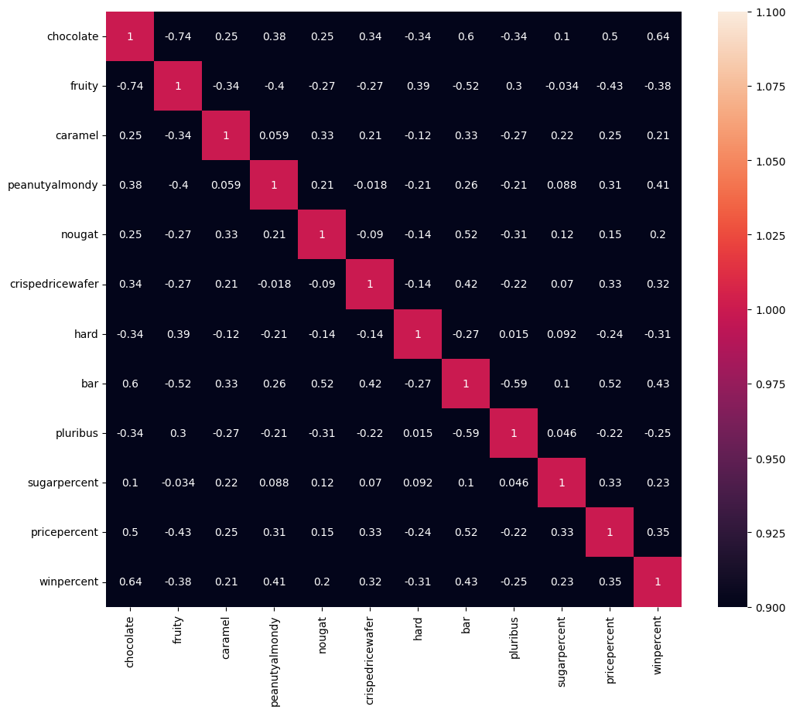

```python
import kagglehub

# Download latest version
path = kagglehub.dataset_download(
    "fivethirtyeight/the-ultimate-halloween-candy-power-ranking"
)

print("Path to dataset files:", path)
```

    Path to dataset files: /Users/jeongho/.cache/kagglehub/datasets/fivethirtyeight/the-ultimate-halloween-candy-power-ranking/versions/1


```python
!/Users/jeongho/.cache/kagglehub/datasets/fivethirtyeight/the-ultimate-halloween-candy-power-ranking/versions/1
```

    zsh:1: permission denied: /Users/jeongho/.cache/kagglehub/datasets/fivethirtyeight/the-ultimate-halloween-candy-power-ranking/versions/1


```python
import pandas as pd
import numpy as np
import matplotlib.pyplot as plt
import seaborn as sns

import os


df = pd.read_csv(os.path.join(path, "candy-data.csv"))
```


```python
df
```


<div>
<style scoped>
    .dataframe tbody tr th:only-of-type {
        vertical-align: middle;
    }

    .dataframe tbody tr th {
        vertical-align: top;
    }

    .dataframe thead th {
        text-align: right;
    }
</style>
<table border="1" class="dataframe">
  <thead>
    <tr style="text-align: right;">
      <th></th>
      <th>competitorname</th>
      <th>chocolate</th>
      <th>fruity</th>
      <th>caramel</th>
      <th>peanutyalmondy</th>
      <th>nougat</th>
      <th>crispedricewafer</th>
      <th>hard</th>
      <th>bar</th>
      <th>pluribus</th>
      <th>sugarpercent</th>
      <th>pricepercent</th>
      <th>winpercent</th>
    </tr>
  </thead>
  <tbody>
    <tr>
      <th>0</th>
      <td>100 Grand</td>
      <td>1</td>
      <td>0</td>
      <td>1</td>
      <td>0</td>
      <td>0</td>
      <td>1</td>
      <td>0</td>
      <td>1</td>
      <td>0</td>
      <td>0.732</td>
      <td>0.860</td>
      <td>66.971725</td>
    </tr>
    <tr>
      <th>1</th>
      <td>3 Musketeers</td>
      <td>1</td>
      <td>0</td>
      <td>0</td>
      <td>0</td>
      <td>1</td>
      <td>0</td>
      <td>0</td>
      <td>1</td>
      <td>0</td>
      <td>0.604</td>
      <td>0.511</td>
      <td>67.602936</td>
    </tr>
    <tr>
      <th>2</th>
      <td>One dime</td>
      <td>0</td>
      <td>0</td>
      <td>0</td>
      <td>0</td>
      <td>0</td>
      <td>0</td>
      <td>0</td>
      <td>0</td>
      <td>0</td>
      <td>0.011</td>
      <td>0.116</td>
      <td>32.261086</td>
    </tr>
    <tr>
      <th>3</th>
      <td>One quarter</td>
      <td>0</td>
      <td>0</td>
      <td>0</td>
      <td>0</td>
      <td>0</td>
      <td>0</td>
      <td>0</td>
      <td>0</td>
      <td>0</td>
      <td>0.011</td>
      <td>0.511</td>
      <td>46.116505</td>
    </tr>
    <tr>
      <th>4</th>
      <td>Air Heads</td>
      <td>0</td>
      <td>1</td>
      <td>0</td>
      <td>0</td>
      <td>0</td>
      <td>0</td>
      <td>0</td>
      <td>0</td>
      <td>0</td>
      <td>0.906</td>
      <td>0.511</td>
      <td>52.341465</td>
    </tr>
    <tr>
      <th>...</th>
      <td>...</td>
      <td>...</td>
      <td>...</td>
      <td>...</td>
      <td>...</td>
      <td>...</td>
      <td>...</td>
      <td>...</td>
      <td>...</td>
      <td>...</td>
      <td>...</td>
      <td>...</td>
      <td>...</td>
    </tr>
    <tr>
      <th>80</th>
      <td>Twizzlers</td>
      <td>0</td>
      <td>1</td>
      <td>0</td>
      <td>0</td>
      <td>0</td>
      <td>0</td>
      <td>0</td>
      <td>0</td>
      <td>0</td>
      <td>0.220</td>
      <td>0.116</td>
      <td>45.466282</td>
    </tr>
    <tr>
      <th>81</th>
      <td>Warheads</td>
      <td>0</td>
      <td>1</td>
      <td>0</td>
      <td>0</td>
      <td>0</td>
      <td>0</td>
      <td>1</td>
      <td>0</td>
      <td>0</td>
      <td>0.093</td>
      <td>0.116</td>
      <td>39.011898</td>
    </tr>
    <tr>
      <th>82</th>
      <td>WelchÕs Fruit Snacks</td>
      <td>0</td>
      <td>1</td>
      <td>0</td>
      <td>0</td>
      <td>0</td>
      <td>0</td>
      <td>0</td>
      <td>0</td>
      <td>1</td>
      <td>0.313</td>
      <td>0.313</td>
      <td>44.375519</td>
    </tr>
    <tr>
      <th>83</th>
      <td>WertherÕs Original Caramel</td>
      <td>0</td>
      <td>0</td>
      <td>1</td>
      <td>0</td>
      <td>0</td>
      <td>0</td>
      <td>1</td>
      <td>0</td>
      <td>0</td>
      <td>0.186</td>
      <td>0.267</td>
      <td>41.904308</td>
    </tr>
    <tr>
      <th>84</th>
      <td>Whoppers</td>
      <td>1</td>
      <td>0</td>
      <td>0</td>
      <td>0</td>
      <td>0</td>
      <td>1</td>
      <td>0</td>
      <td>0</td>
      <td>1</td>
      <td>0.872</td>
      <td>0.848</td>
      <td>49.524113</td>
    </tr>
  </tbody>
</table>
<p>85 rows × 13 columns</p>
</div>


```python
df.info()
```

    <class 'pandas.core.frame.DataFrame'>
    RangeIndex: 85 entries, 0 to 84
    Data columns (total 13 columns):
     #   Column            Non-Null Count  Dtype  
    ---  ------            --------------  -----  
     0   competitorname    85 non-null     object 
     1   chocolate         85 non-null     int64  
     2   fruity            85 non-null     int64  
     3   caramel           85 non-null     int64  
     4   peanutyalmondy    85 non-null     int64  
     5   nougat            85 non-null     int64  
     6   crispedricewafer  85 non-null     int64  
     7   hard              85 non-null     int64  
     8   bar               85 non-null     int64  
     9   pluribus          85 non-null     int64  
     10  sugarpercent      85 non-null     float64
     11  pricepercent      85 non-null     float64
     12  winpercent        85 non-null     float64
    dtypes: float64(3), int64(9), object(1)
    memory usage: 8.8+ KB


```python
df = df.drop(["competitorname"], axis=1)
```


```python
df
```


<div>
<style scoped>
    .dataframe tbody tr th:only-of-type {
        vertical-align: middle;
    }

    .dataframe tbody tr th {
        vertical-align: top;
    }

    .dataframe thead th {
        text-align: right;
    }
</style>
<table border="1" class="dataframe">
  <thead>
    <tr style="text-align: right;">
      <th></th>
      <th>chocolate</th>
      <th>fruity</th>
      <th>caramel</th>
      <th>peanutyalmondy</th>
      <th>nougat</th>
      <th>crispedricewafer</th>
      <th>hard</th>
      <th>bar</th>
      <th>pluribus</th>
      <th>sugarpercent</th>
      <th>pricepercent</th>
      <th>winpercent</th>
    </tr>
  </thead>
  <tbody>
    <tr>
      <th>0</th>
      <td>1</td>
      <td>0</td>
      <td>1</td>
      <td>0</td>
      <td>0</td>
      <td>1</td>
      <td>0</td>
      <td>1</td>
      <td>0</td>
      <td>0.732</td>
      <td>0.860</td>
      <td>66.971725</td>
    </tr>
    <tr>
      <th>1</th>
      <td>1</td>
      <td>0</td>
      <td>0</td>
      <td>0</td>
      <td>1</td>
      <td>0</td>
      <td>0</td>
      <td>1</td>
      <td>0</td>
      <td>0.604</td>
      <td>0.511</td>
      <td>67.602936</td>
    </tr>
    <tr>
      <th>2</th>
      <td>0</td>
      <td>0</td>
      <td>0</td>
      <td>0</td>
      <td>0</td>
      <td>0</td>
      <td>0</td>
      <td>0</td>
      <td>0</td>
      <td>0.011</td>
      <td>0.116</td>
      <td>32.261086</td>
    </tr>
    <tr>
      <th>3</th>
      <td>0</td>
      <td>0</td>
      <td>0</td>
      <td>0</td>
      <td>0</td>
      <td>0</td>
      <td>0</td>
      <td>0</td>
      <td>0</td>
      <td>0.011</td>
      <td>0.511</td>
      <td>46.116505</td>
    </tr>
    <tr>
      <th>4</th>
      <td>0</td>
      <td>1</td>
      <td>0</td>
      <td>0</td>
      <td>0</td>
      <td>0</td>
      <td>0</td>
      <td>0</td>
      <td>0</td>
      <td>0.906</td>
      <td>0.511</td>
      <td>52.341465</td>
    </tr>
    <tr>
      <th>...</th>
      <td>...</td>
      <td>...</td>
      <td>...</td>
      <td>...</td>
      <td>...</td>
      <td>...</td>
      <td>...</td>
      <td>...</td>
      <td>...</td>
      <td>...</td>
      <td>...</td>
      <td>...</td>
    </tr>
    <tr>
      <th>80</th>
      <td>0</td>
      <td>1</td>
      <td>0</td>
      <td>0</td>
      <td>0</td>
      <td>0</td>
      <td>0</td>
      <td>0</td>
      <td>0</td>
      <td>0.220</td>
      <td>0.116</td>
      <td>45.466282</td>
    </tr>
    <tr>
      <th>81</th>
      <td>0</td>
      <td>1</td>
      <td>0</td>
      <td>0</td>
      <td>0</td>
      <td>0</td>
      <td>1</td>
      <td>0</td>
      <td>0</td>
      <td>0.093</td>
      <td>0.116</td>
      <td>39.011898</td>
    </tr>
    <tr>
      <th>82</th>
      <td>0</td>
      <td>1</td>
      <td>0</td>
      <td>0</td>
      <td>0</td>
      <td>0</td>
      <td>0</td>
      <td>0</td>
      <td>1</td>
      <td>0.313</td>
      <td>0.313</td>
      <td>44.375519</td>
    </tr>
    <tr>
      <th>83</th>
      <td>0</td>
      <td>0</td>
      <td>1</td>
      <td>0</td>
      <td>0</td>
      <td>0</td>
      <td>1</td>
      <td>0</td>
      <td>0</td>
      <td>0.186</td>
      <td>0.267</td>
      <td>41.904308</td>
    </tr>
    <tr>
      <th>84</th>
      <td>1</td>
      <td>0</td>
      <td>0</td>
      <td>0</td>
      <td>0</td>
      <td>1</td>
      <td>0</td>
      <td>0</td>
      <td>1</td>
      <td>0.872</td>
      <td>0.848</td>
      <td>49.524113</td>
    </tr>
  </tbody>
</table>
<p>85 rows × 12 columns</p>
</div>


```python

```


```python
plt.figure(figsize=(12, 10))
corr = df.corr()
sns.heatmap(corr, annot=True, vmin=1, vmax=1)
plt.show()
```


    

    


```python
abs(corr["bar"].sort_values(ascending=False))
```


    bar                 1.000000
    chocolate           0.597421
    nougat              0.522976
    pricepercent        0.518407
    winpercent          0.429929
    crispedricewafer    0.423751
    caramel             0.333960
    peanutyalmondy      0.260420
    sugarpercent        0.099985
    hard                0.265165
    fruity              0.515066
    pluribus            0.593409
    Name: bar, dtype: float64


```python

```


```python
y = df["bar"]
X = df.drop(["bar"], axis=1)
```


```python
y
```


    0     1
    1     1
    2     0
    3     0
    4     0
         ..
    80    0
    81    0
    82    0
    83    0
    84    0
    Name: bar, Length: 85, dtype: int64


```python
from sklearn.preprocessing import MinMaxScaler

scaler = MinMaxScaler()
std_X = scaler.fit_transform(X)

std_X
```


    array([[1.        , 0.        , 1.        , 0.        , 0.        ,
            1.        , 0.        , 0.        , 0.73797339, 0.87979275,
            0.72125084],
           [1.        , 0.        , 0.        , 0.        , 1.        ,
            0.        , 0.        , 0.        , 0.60696006, 0.51813469,
            0.73147538],
           [0.        , 0.        , 0.        , 0.        , 0.        ,
            0.        , 0.        , 0.        , 0.        , 0.10880829,
            0.15899819],
           [0.        , 0.        , 0.        , 0.        , 0.        ,
            0.        , 0.        , 0.        , 0.        , 0.51813469,
            0.38343215],
           [0.        , 1.        , 0.        , 0.        , 0.        ,
            0.        , 0.        , 0.        , 0.91606964, 0.51813469,
            0.48426579],
           [1.        , 0.        , 0.        , 1.        , 0.        ,
            0.        , 0.        , 0.        , 0.46468783, 0.7834197 ,
            0.45196773],
           [1.        , 0.        , 1.        , 1.        , 1.        ,
            0.        , 0.        , 0.        , 0.60696006, 0.7834197 ,
            0.55834186],
           [0.        , 0.        , 0.        , 1.        , 0.        ,
            0.        , 0.        , 1.        , 0.30910952, 0.51813469,
            0.01575255],
           [0.        , 0.        , 0.        , 0.        , 0.        ,
            0.        , 0.        , 1.        , 0.91606964, 0.32538859,
            0.25213631],
           [0.        , 1.        , 1.        , 0.        , 0.        ,
            0.        , 0.        , 0.        , 0.60696006, 0.32538859,
            0.19555115],
           [1.        , 0.        , 0.        , 0.        , 1.        ,
            0.        , 0.        , 0.        , 0.60696006, 0.51813469,
            0.26775265],
           [0.        , 1.        , 0.        , 0.        , 0.        ,
            0.        , 0.        , 1.        , 0.73797339, 0.51813469,
            0.21984771],
           [0.        , 1.        , 0.        , 0.        , 0.        ,
            0.        , 0.        , 1.        , 0.03582395, 0.32538859,
            0.0336867 ],
           [0.        , 1.        , 0.        , 0.        , 0.        ,
            0.        , 0.        , 1.        , 0.73797339, 0.51813469,
            0.32115901],
           [0.        , 1.        , 0.        , 0.        , 0.        ,
            0.        , 1.        , 0.        , 0.73797339, 0.0238342 ,
            0.27561722],
           [0.        , 1.        , 0.        , 0.        , 0.        ,
            0.        , 0.        , 1.        , 0.11873081, 0.0238342 ,
            0.33439054],
           [0.        , 1.        , 0.        , 0.        , 0.        ,
            0.        , 1.        , 0.        , 0.73797339, 0.32538859,
            0.27116187],
           [0.        , 1.        , 0.        , 0.        , 0.        ,
            0.        , 1.        , 1.        , 0.91606964, 0.45803109,
            0.39423386],
           [0.        , 1.        , 0.        , 0.        , 0.        ,
            0.        , 0.        , 1.        , 0.46468783, 0.47046632,
            0.56166563],
           [0.        , 0.        , 0.        , 0.        , 0.        ,
            0.        , 0.        , 1.        , 0.46468783, 0.47046632,
            0.18974045],
           [0.        , 1.        , 0.        , 0.        , 0.        ,
            0.        , 0.        , 1.        , 0.46468783, 0.47046632,
            0.46921702],
           [0.        , 1.        , 0.        , 0.        , 0.        ,
            0.        , 0.        , 1.        , 0.46468783, 0.47046632,
            0.31964764],
           [1.        , 0.        , 0.        , 0.        , 0.        ,
            0.        , 0.        , 1.        , 0.11873081, 0.08497409,
            0.5334112 ],
           [1.        , 0.        , 0.        , 0.        , 0.        ,
            1.        , 0.        , 0.        , 0.42886389, 0.93989634,
            0.64532555],
           [1.        , 0.        , 0.        , 0.        , 0.        ,
            0.        , 0.        , 0.        , 0.42886389, 0.93989634,
            0.55147304],
           [1.        , 0.        , 0.        , 0.        , 0.        ,
            0.        , 0.        , 0.        , 0.42886389, 0.93989634,
            0.59594738],
           [0.        , 1.        , 0.        , 0.        , 0.        ,
            0.        , 1.        , 1.        , 0.0839304 , 0.51813469,
            0.09204022],
           [1.        , 0.        , 0.        , 0.        , 0.        ,
            0.        , 0.        , 1.        , 0.19037871, 0.51813469,
            0.56327752],
           [1.        , 0.        , 0.        , 0.        , 0.        ,
            1.        , 0.        , 0.        , 0.30910952, 0.51813469,
            0.87994337],
           [0.        , 1.        , 0.        , 0.        , 0.        ,
            0.        , 0.        , 0.        , 0.21392017, 0.10880829,
            0.30686372],
           [0.        , 1.        , 0.        , 0.        , 0.        ,
            0.        , 1.        , 0.        , 0.03582395, 0.09637306,
            0.27044187],
           [0.        , 1.        , 0.        , 0.        , 0.        ,
            0.        , 0.        , 0.        , 0.26202661, 0.27772021,
            0.49349763],
           [1.        , 0.        , 0.        , 1.        , 0.        ,
            0.        , 0.        , 1.        , 0.83316275, 0.66321245,
            0.79403498],
           [1.        , 0.        , 0.        , 0.        , 0.        ,
            0.        , 0.        , 1.        , 0.83316275, 0.66321245,
            0.71481786],
           [0.        , 1.        , 0.        , 0.        , 0.        ,
            0.        , 0.        , 1.        , 0.88126919, 0.32538859,
            0.38821406],
           [1.        , 0.        , 1.        , 0.        , 0.        ,
            0.        , 0.        , 1.        , 0.29785056, 0.51813469,
            0.52836734],
           [1.        , 0.        , 1.        , 0.        , 1.        ,
            0.        , 0.        , 0.        , 0.60696006, 0.66321245,
            0.82051117],
           [1.        , 0.        , 1.        , 0.        , 1.        ,
            0.        , 0.        , 0.        , 0.73797339, 0.44559586,
            0.62129087],
           [1.        , 0.        , 1.        , 0.        , 0.        ,
            0.        , 0.        , 0.        , 0.97645854, 0.87979275,
            0.67883751],
           [1.        , 0.        , 0.        , 0.        , 0.        ,
            0.        , 0.        , 0.        , 0.30910952, 0.87979275,
            0.41118383],
           [1.        , 0.        , 0.        , 1.        , 0.        ,
            0.        , 0.        , 0.        , 0.30910952, 0.93989634,
            0.51965881],
           [0.        , 1.        , 0.        , 0.        , 0.        ,
            0.        , 1.        , 1.        , 0.8567042 , 0.32538859,
            0.53306442],
           [1.        , 0.        , 0.        , 1.        , 0.        ,
            0.        , 0.        , 0.        , 0.60696006, 0.7834197 ,
            0.78221981],
           [1.        , 0.        , 0.        , 0.        , 0.        ,
            1.        , 0.        , 0.        , 0.30910952, 0.7834197 ,
            0.71313478],
           [0.        , 1.        , 0.        , 0.        , 0.        ,
            0.        , 0.        , 1.        , 0.19037871, 1.        ,
            0.        ],
           [0.        , 1.        , 0.        , 0.        , 0.        ,
            0.        , 0.        , 1.        , 0.21392017, 0.32538859,
            0.2753944 ],
           [0.        , 0.        , 0.        , 1.        , 1.        ,
            0.        , 0.        , 0.        , 0.46468783, 0.7834197 ,
            0.38634933],
           [1.        , 0.        , 0.        , 1.        , 0.        ,
            0.        , 0.        , 1.        , 0.59570113, 0.66321245,
            0.76194194],
           [0.        , 0.        , 0.        , 0.        , 0.        ,
            0.        , 0.        , 1.        , 0.0839304 , 0.01243523,
            0.24746105],
           [0.        , 1.        , 0.        , 0.        , 0.        ,
            0.        , 1.        , 1.        , 0.60696006, 0.85595855,
            0.30485439],
           [0.        , 1.        , 0.        , 0.        , 0.        ,
            0.        , 0.        , 1.        , 0.58341861, 0.10880829,
            0.2414059 ],
           [1.        , 0.        , 0.        , 1.        , 0.        ,
            0.        , 0.        , 0.        , 0.02354146, 0.27772021,
            0.96251665],
           [1.        , 0.        , 0.        , 1.        , 0.        ,
            0.        , 0.        , 0.        , 0.72569094, 0.66321245,
            1.        ],
           [1.        , 0.        , 0.        , 1.        , 0.        ,
            0.        , 0.        , 1.        , 0.40429887, 0.66321245,
            0.82594462],
           [1.        , 0.        , 0.        , 1.        , 0.        ,
            0.        , 0.        , 0.        , 1.        , 0.66321245,
            0.81708272],
           [0.        , 1.        , 0.        , 0.        , 0.        ,
            0.        , 1.        , 0.        , 0.73797339, 0.98860099,
            0.20807363],
           [1.        , 0.        , 1.        , 0.        , 0.        ,
            0.        , 0.        , 1.        , 0.86898672, 0.87979275,
            0.70091489],
           [0.        , 0.        , 0.        , 0.        , 0.        ,
            0.        , 1.        , 1.        , 0.73797339, 0.06010362,
            0.11757279],
           [0.        , 1.        , 0.        , 0.        , 0.        ,
            0.        , 1.        , 1.        , 0.88126919, 0.27772021,
            0.33050652],
           [1.        , 0.        , 0.        , 0.        , 0.        ,
            0.        , 0.        , 1.        , 0.21392017, 0.07253886,
            0.19886076],
           [0.        , 1.        , 0.        , 0.        , 0.        ,
            0.        , 0.        , 1.        , 0.95189355, 0.21658031,
            0.65829485],
           [0.        , 1.        , 0.        , 0.        , 0.        ,
            0.        , 0.        , 1.        , 0.95189355, 0.21658031,
            0.52900917],
           [1.        , 0.        , 0.        , 0.        , 0.        ,
            0.        , 0.        , 1.        , 0.26202661, 1.        ,
            0.25013136],
           [0.        , 1.        , 0.        , 0.        , 0.        ,
            0.        , 1.        , 1.        , 0.26202661, 0.10880829,
            0.38147737],
           [1.        , 0.        , 1.        , 1.        , 1.        ,
            0.        , 0.        , 0.        , 0.54759469, 0.66321245,
            0.87840748],
           [1.        , 0.        , 1.        , 1.        , 0.        ,
            1.        , 0.        , 0.        , 0.60696006, 0.66321245,
            0.60069556],
           [0.        , 1.        , 0.        , 0.        , 0.        ,
            0.        , 0.        , 1.        , 0.0593654 , 0.10880829,
            0.60611789],
           [0.        , 1.        , 0.        , 0.        , 0.        ,
            0.        , 0.        , 1.        , 0.0593654 , 0.10880829,
            0.49211357],
           [0.        , 1.        , 0.        , 0.        , 0.        ,
            0.        , 0.        , 1.        , 0.1432958 , 0.21658031,
            0.72231836],
           [0.        , 1.        , 0.        , 0.        , 0.        ,
            0.        , 1.        , 1.        , 0.57113615, 0.04870466,
            0.19654426],
           [0.        , 0.        , 1.        , 0.        , 0.        ,
            0.        , 0.        , 1.        , 0.97645854, 0.7834197 ,
            0.17805488],
           [0.        , 0.        , 1.        , 0.        , 0.        ,
            0.        , 0.        , 0.        , 0.41658139, 0.32538859,
            0.15851077],
           [0.        , 1.        , 0.        , 0.        , 0.        ,
            0.        , 0.        , 0.        , 0.15455476, 0.10880829,
            0.07869973],
           [0.        , 1.        , 0.        , 0.        , 0.        ,
            0.        , 0.        , 1.        , 0.60696006, 0.77098445,
            0.52507972],
           [1.        , 1.        , 0.        , 0.        , 0.        ,
            0.        , 1.        , 0.        , 0.60696006, 0.32538859,
            0.42985878],
           [1.        , 0.        , 0.        , 0.        , 0.        ,
            0.        , 0.        , 0.        , 0.30910952, 0.51813469,
            0.33406614],
           [1.        , 0.        , 0.        , 0.        , 0.        ,
            0.        , 0.        , 1.        , 0.16683725, 0.        ,
            0.37728074],
           [1.        , 0.        , 0.        , 0.        , 0.        ,
            0.        , 0.        , 0.        , 0.46468783, 0.32538859,
            0.44072543],
           [0.        , 1.        , 0.        , 0.        , 0.        ,
            0.        , 0.        , 1.        , 0.30910952, 0.25284974,
            0.40054926],
           [1.        , 0.        , 1.        , 0.        , 0.        ,
            1.        , 0.        , 0.        , 0.54759469, 0.92746115,
            0.95889887],
           [0.        , 1.        , 0.        , 0.        , 0.        ,
            0.        , 0.        , 0.        , 0.21392017, 0.10880829,
            0.37289965],
           [0.        , 1.        , 0.        , 0.        , 0.        ,
            0.        , 1.        , 0.        , 0.0839304 , 0.10880829,
            0.26834973],
           [0.        , 1.        , 0.        , 0.        , 0.        ,
            0.        , 0.        , 1.        , 0.30910952, 0.31295335,
            0.35523117],
           [0.        , 0.        , 1.        , 0.        , 0.        ,
            0.        , 1.        , 0.        , 0.17911976, 0.26528496,
            0.3152018 ],
           [1.        , 0.        , 0.        , 0.        , 0.        ,
            1.        , 0.        , 1.        , 0.88126919, 0.86735749,
            0.43862954]])


```python
from sklearn.model_selection import train_test_split


X_train, X_test, y_train, y_test = train_test_split(X, y, train_size=0.7, shuffle=True)
```


```python
from sklearn.linear_model import LogisticRegression

model = LogisticRegression()

model.fit(X_train, y_train)
```


<style>#sk-container-id-6 {
  /* Definition of color scheme common for light and dark mode */
  --sklearn-color-text: black;
  --sklearn-color-line: gray;
  /* Definition of color scheme for unfitted estimators */
  --sklearn-color-unfitted-level-0: #fff5e6;
  --sklearn-color-unfitted-level-1: #f6e4d2;
  --sklearn-color-unfitted-level-2: #ffe0b3;
  --sklearn-color-unfitted-level-3: chocolate;
  /* Definition of color scheme for fitted estimators */
  --sklearn-color-fitted-level-0: #f0f8ff;
  --sklearn-color-fitted-level-1: #d4ebff;
  --sklearn-color-fitted-level-2: #b3dbfd;
  --sklearn-color-fitted-level-3: cornflowerblue;

  /* Specific color for light theme */
  --sklearn-color-text-on-default-background: var(--sg-text-color, var(--theme-code-foreground, var(--jp-content-font-color1, black)));
  --sklearn-color-background: var(--sg-background-color, var(--theme-background, var(--jp-layout-color0, white)));
  --sklearn-color-border-box: var(--sg-text-color, var(--theme-code-foreground, var(--jp-content-font-color1, black)));
  --sklearn-color-icon: #696969;

  @media (prefers-color-scheme: dark) {
    /* Redefinition of color scheme for dark theme */
    --sklearn-color-text-on-default-background: var(--sg-text-color, var(--theme-code-foreground, var(--jp-content-font-color1, white)));
    --sklearn-color-background: var(--sg-background-color, var(--theme-background, var(--jp-layout-color0, #111)));
    --sklearn-color-border-box: var(--sg-text-color, var(--theme-code-foreground, var(--jp-content-font-color1, white)));
    --sklearn-color-icon: #878787;
  }
}

#sk-container-id-6 {
  color: var(--sklearn-color-text);
}

#sk-container-id-6 pre {
  padding: 0;
}

#sk-container-id-6 input.sk-hidden--visually {
  border: 0;
  clip: rect(1px 1px 1px 1px);
  clip: rect(1px, 1px, 1px, 1px);
  height: 1px;
  margin: -1px;
  overflow: hidden;
  padding: 0;
  position: absolute;
  width: 1px;
}

#sk-container-id-6 div.sk-dashed-wrapped {
  border: 1px dashed var(--sklearn-color-line);
  margin: 0 0.4em 0.5em 0.4em;
  box-sizing: border-box;
  padding-bottom: 0.4em;
  background-color: var(--sklearn-color-background);
}

#sk-container-id-6 div.sk-container {
  /* jupyter's `normalize.less` sets `[hidden] { display: none; }`
     but bootstrap.min.css set `[hidden] { display: none !important; }`
     so we also need the `!important` here to be able to override the
     default hidden behavior on the sphinx rendered scikit-learn.org.
     See: https://github.com/scikit-learn/scikit-learn/issues/21755 */
  display: inline-block !important;
  position: relative;
}

#sk-container-id-6 div.sk-text-repr-fallback {
  display: none;
}

div.sk-parallel-item,
div.sk-serial,
div.sk-item {
  /* draw centered vertical line to link estimators */
  background-image: linear-gradient(var(--sklearn-color-text-on-default-background), var(--sklearn-color-text-on-default-background));
  background-size: 2px 100%;
  background-repeat: no-repeat;
  background-position: center center;
}

/* Parallel-specific style estimator block */

#sk-container-id-6 div.sk-parallel-item::after {
  content: "";
  width: 100%;
  border-bottom: 2px solid var(--sklearn-color-text-on-default-background);
  flex-grow: 1;
}

#sk-container-id-6 div.sk-parallel {
  display: flex;
  align-items: stretch;
  justify-content: center;
  background-color: var(--sklearn-color-background);
  position: relative;
}

#sk-container-id-6 div.sk-parallel-item {
  display: flex;
  flex-direction: column;
}

#sk-container-id-6 div.sk-parallel-item:first-child::after {
  align-self: flex-end;
  width: 50%;
}

#sk-container-id-6 div.sk-parallel-item:last-child::after {
  align-self: flex-start;
  width: 50%;
}

#sk-container-id-6 div.sk-parallel-item:only-child::after {
  width: 0;
}

/* Serial-specific style estimator block */

#sk-container-id-6 div.sk-serial {
  display: flex;
  flex-direction: column;
  align-items: center;
  background-color: var(--sklearn-color-background);
  padding-right: 1em;
  padding-left: 1em;
}


/* Toggleable style: style used for estimator/Pipeline/ColumnTransformer box that is
clickable and can be expanded/collapsed.
- Pipeline and ColumnTransformer use this feature and define the default style
- Estimators will overwrite some part of the style using the `sk-estimator` class
*/

/* Pipeline and ColumnTransformer style (default) */

#sk-container-id-6 div.sk-toggleable {
  /* Default theme specific background. It is overwritten whether we have a
  specific estimator or a Pipeline/ColumnTransformer */
  background-color: var(--sklearn-color-background);
}

/* Toggleable label */
#sk-container-id-6 label.sk-toggleable__label {
  cursor: pointer;
  display: block;
  width: 100%;
  margin-bottom: 0;
  padding: 0.5em;
  box-sizing: border-box;
  text-align: center;
}

#sk-container-id-6 label.sk-toggleable__label-arrow:before {
  /* Arrow on the left of the label */
  content: "▸";
  float: left;
  margin-right: 0.25em;
  color: var(--sklearn-color-icon);
}

#sk-container-id-6 label.sk-toggleable__label-arrow:hover:before {
  color: var(--sklearn-color-text);
}

/* Toggleable content - dropdown */

#sk-container-id-6 div.sk-toggleable__content {
  max-height: 0;
  max-width: 0;
  overflow: hidden;
  text-align: left;
  /* unfitted */
  background-color: var(--sklearn-color-unfitted-level-0);
}

#sk-container-id-6 div.sk-toggleable__content.fitted {
  /* fitted */
  background-color: var(--sklearn-color-fitted-level-0);
}

#sk-container-id-6 div.sk-toggleable__content pre {
  margin: 0.2em;
  border-radius: 0.25em;
  color: var(--sklearn-color-text);
  /* unfitted */
  background-color: var(--sklearn-color-unfitted-level-0);
}

#sk-container-id-6 div.sk-toggleable__content.fitted pre {
  /* unfitted */
  background-color: var(--sklearn-color-fitted-level-0);
}

#sk-container-id-6 input.sk-toggleable__control:checked~div.sk-toggleable__content {
  /* Expand drop-down */
  max-height: 200px;
  max-width: 100%;
  overflow: auto;
}

#sk-container-id-6 input.sk-toggleable__control:checked~label.sk-toggleable__label-arrow:before {
  content: "▾";
}

/* Pipeline/ColumnTransformer-specific style */

#sk-container-id-6 div.sk-label input.sk-toggleable__control:checked~label.sk-toggleable__label {
  color: var(--sklearn-color-text);
  background-color: var(--sklearn-color-unfitted-level-2);
}

#sk-container-id-6 div.sk-label.fitted input.sk-toggleable__control:checked~label.sk-toggleable__label {
  background-color: var(--sklearn-color-fitted-level-2);
}

/* Estimator-specific style */

/* Colorize estimator box */
#sk-container-id-6 div.sk-estimator input.sk-toggleable__control:checked~label.sk-toggleable__label {
  /* unfitted */
  background-color: var(--sklearn-color-unfitted-level-2);
}

#sk-container-id-6 div.sk-estimator.fitted input.sk-toggleable__control:checked~label.sk-toggleable__label {
  /* fitted */
  background-color: var(--sklearn-color-fitted-level-2);
}

#sk-container-id-6 div.sk-label label.sk-toggleable__label,
#sk-container-id-6 div.sk-label label {
  /* The background is the default theme color */
  color: var(--sklearn-color-text-on-default-background);
}

/* On hover, darken the color of the background */
#sk-container-id-6 div.sk-label:hover label.sk-toggleable__label {
  color: var(--sklearn-color-text);
  background-color: var(--sklearn-color-unfitted-level-2);
}

/* Label box, darken color on hover, fitted */
#sk-container-id-6 div.sk-label.fitted:hover label.sk-toggleable__label.fitted {
  color: var(--sklearn-color-text);
  background-color: var(--sklearn-color-fitted-level-2);
}

/* Estimator label */

#sk-container-id-6 div.sk-label label {
  font-family: monospace;
  font-weight: bold;
  display: inline-block;
  line-height: 1.2em;
}

#sk-container-id-6 div.sk-label-container {
  text-align: center;
}

/* Estimator-specific */
#sk-container-id-6 div.sk-estimator {
  font-family: monospace;
  border: 1px dotted var(--sklearn-color-border-box);
  border-radius: 0.25em;
  box-sizing: border-box;
  margin-bottom: 0.5em;
  /* unfitted */
  background-color: var(--sklearn-color-unfitted-level-0);
}

#sk-container-id-6 div.sk-estimator.fitted {
  /* fitted */
  background-color: var(--sklearn-color-fitted-level-0);
}

/* on hover */
#sk-container-id-6 div.sk-estimator:hover {
  /* unfitted */
  background-color: var(--sklearn-color-unfitted-level-2);
}

#sk-container-id-6 div.sk-estimator.fitted:hover {
  /* fitted */
  background-color: var(--sklearn-color-fitted-level-2);
}

/* Specification for estimator info (e.g. "i" and "?") */

/* Common style for "i" and "?" */

.sk-estimator-doc-link,
a:link.sk-estimator-doc-link,
a:visited.sk-estimator-doc-link {
  float: right;
  font-size: smaller;
  line-height: 1em;
  font-family: monospace;
  background-color: var(--sklearn-color-background);
  border-radius: 1em;
  height: 1em;
  width: 1em;
  text-decoration: none !important;
  margin-left: 1ex;
  /* unfitted */
  border: var(--sklearn-color-unfitted-level-1) 1pt solid;
  color: var(--sklearn-color-unfitted-level-1);
}

.sk-estimator-doc-link.fitted,
a:link.sk-estimator-doc-link.fitted,
a:visited.sk-estimator-doc-link.fitted {
  /* fitted */
  border: var(--sklearn-color-fitted-level-1) 1pt solid;
  color: var(--sklearn-color-fitted-level-1);
}

/* On hover */
div.sk-estimator:hover .sk-estimator-doc-link:hover,
.sk-estimator-doc-link:hover,
div.sk-label-container:hover .sk-estimator-doc-link:hover,
.sk-estimator-doc-link:hover {
  /* unfitted */
  background-color: var(--sklearn-color-unfitted-level-3);
  color: var(--sklearn-color-background);
  text-decoration: none;
}

div.sk-estimator.fitted:hover .sk-estimator-doc-link.fitted:hover,
.sk-estimator-doc-link.fitted:hover,
div.sk-label-container:hover .sk-estimator-doc-link.fitted:hover,
.sk-estimator-doc-link.fitted:hover {
  /* fitted */
  background-color: var(--sklearn-color-fitted-level-3);
  color: var(--sklearn-color-background);
  text-decoration: none;
}

/* Span, style for the box shown on hovering the info icon */
.sk-estimator-doc-link span {
  display: none;
  z-index: 9999;
  position: relative;
  font-weight: normal;
  right: .2ex;
  padding: .5ex;
  margin: .5ex;
  width: min-content;
  min-width: 20ex;
  max-width: 50ex;
  color: var(--sklearn-color-text);
  box-shadow: 2pt 2pt 4pt #999;
  /* unfitted */
  background: var(--sklearn-color-unfitted-level-0);
  border: .5pt solid var(--sklearn-color-unfitted-level-3);
}

.sk-estimator-doc-link.fitted span {
  /* fitted */
  background: var(--sklearn-color-fitted-level-0);
  border: var(--sklearn-color-fitted-level-3);
}

.sk-estimator-doc-link:hover span {
  display: block;
}

/* "?"-specific style due to the `<a>` HTML tag */

#sk-container-id-6 a.estimator_doc_link {
  float: right;
  font-size: 1rem;
  line-height: 1em;
  font-family: monospace;
  background-color: var(--sklearn-color-background);
  border-radius: 1rem;
  height: 1rem;
  width: 1rem;
  text-decoration: none;
  /* unfitted */
  color: var(--sklearn-color-unfitted-level-1);
  border: var(--sklearn-color-unfitted-level-1) 1pt solid;
}

#sk-container-id-6 a.estimator_doc_link.fitted {
  /* fitted */
  border: var(--sklearn-color-fitted-level-1) 1pt solid;
  color: var(--sklearn-color-fitted-level-1);
}

/* On hover */
#sk-container-id-6 a.estimator_doc_link:hover {
  /* unfitted */
  background-color: var(--sklearn-color-unfitted-level-3);
  color: var(--sklearn-color-background);
  text-decoration: none;
}

#sk-container-id-6 a.estimator_doc_link.fitted:hover {
  /* fitted */
  background-color: var(--sklearn-color-fitted-level-3);
}
</style><div id="sk-container-id-6" class="sk-top-container"><div class="sk-text-repr-fallback"><pre>LogisticRegression()</pre><b>In a Jupyter environment, please rerun this cell to show the HTML representation or trust the notebook. <br />On GitHub, the HTML representation is unable to render, please try loading this page with nbviewer.org.</b></div><div class="sk-container" hidden><div class="sk-item"><div class="sk-estimator fitted sk-toggleable"><input class="sk-toggleable__control sk-hidden--visually" id="sk-estimator-id-6" type="checkbox" checked><label for="sk-estimator-id-6" class="sk-toggleable__label fitted sk-toggleable__label-arrow fitted">&nbsp;&nbsp;LogisticRegression<a class="sk-estimator-doc-link fitted" rel="noreferrer" target="_blank" href="https://scikit-learn.org/1.5/modules/generated/sklearn.linear_model.LogisticRegression.html">?<span>Documentation for LogisticRegression</span></a><span class="sk-estimator-doc-link fitted">i<span>Fitted</span></span></label><div class="sk-toggleable__content fitted"><pre>LogisticRegression()</pre></div> </div></div></div></div>


```python
model.score(X_test, y_test)
```


    0.8846153846153846


```python

```
