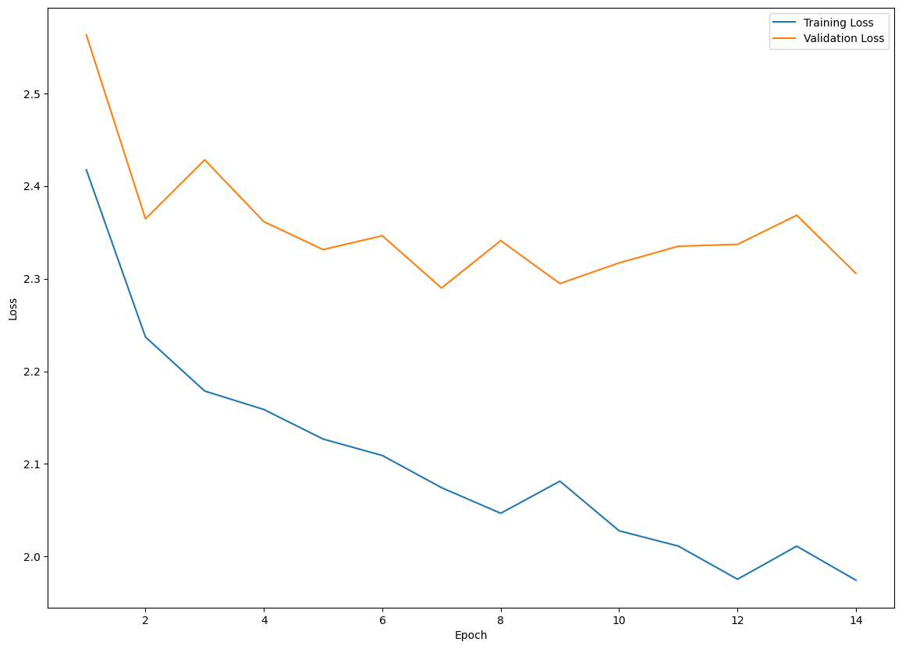

```python
import kagglehub

# Download latest version
path = kagglehub.dataset_download("gregorut/videogamesales")

print("Path to dataset files:", path)
```

    Warning: Looks like you're using an outdated `kagglehub` version, please consider updating (latest version: 0.3.4)
    Path to dataset files: /Users/jeongho/.cache/kagglehub/datasets/gregorut/videogamesales/versions/2


```python
import tensorflow as tf

print(tf.__version__)

import sys

print("Python version:", sys.version)


import tensorflow_addons as tfa

print("TensorFlow Addons version:", tfa.__version__)
```

    2.14.0
    Python version: 3.9.6 (default, Oct  4 2024, 08:01:31) 
    [Clang 16.0.0 (clang-1600.0.26.4)]
    TensorFlow Addons version: 0.23.0-dev


```python
import pandas as pd
import numpy as np
import matplotlib.pyplot as plt
import seaborn as sns

import os


from sklearn.preprocessing import StandardScaler
from sklearn.preprocessing import LabelEncoder
from sklearn.model_selection import train_test_split

import tensorflow as tf
```


```python
df = pd.read_csv(os.path.join(path, "vgsales.csv"), index_col="Rank")
```


```python
df
```


<div>
<style scoped>
    .dataframe tbody tr th:only-of-type {
        vertical-align: middle;
    }

    .dataframe tbody tr th {
        vertical-align: top;
    }

    .dataframe thead th {
        text-align: right;
    }
</style>
<table border="1" class="dataframe">
  <thead>
    <tr style="text-align: right;">
      <th></th>
      <th>Name</th>
      <th>Platform</th>
      <th>Year</th>
      <th>Genre</th>
      <th>Publisher</th>
      <th>NA_Sales</th>
      <th>EU_Sales</th>
      <th>JP_Sales</th>
      <th>Other_Sales</th>
      <th>Global_Sales</th>
    </tr>
    <tr>
      <th>Rank</th>
      <th></th>
      <th></th>
      <th></th>
      <th></th>
      <th></th>
      <th></th>
      <th></th>
      <th></th>
      <th></th>
      <th></th>
    </tr>
  </thead>
  <tbody>
    <tr>
      <th>1</th>
      <td>Wii Sports</td>
      <td>Wii</td>
      <td>2006.0</td>
      <td>Sports</td>
      <td>Nintendo</td>
      <td>41.49</td>
      <td>29.02</td>
      <td>3.77</td>
      <td>8.46</td>
      <td>82.74</td>
    </tr>
    <tr>
      <th>2</th>
      <td>Super Mario Bros.</td>
      <td>NES</td>
      <td>1985.0</td>
      <td>Platform</td>
      <td>Nintendo</td>
      <td>29.08</td>
      <td>3.58</td>
      <td>6.81</td>
      <td>0.77</td>
      <td>40.24</td>
    </tr>
    <tr>
      <th>3</th>
      <td>Mario Kart Wii</td>
      <td>Wii</td>
      <td>2008.0</td>
      <td>Racing</td>
      <td>Nintendo</td>
      <td>15.85</td>
      <td>12.88</td>
      <td>3.79</td>
      <td>3.31</td>
      <td>35.82</td>
    </tr>
    <tr>
      <th>4</th>
      <td>Wii Sports Resort</td>
      <td>Wii</td>
      <td>2009.0</td>
      <td>Sports</td>
      <td>Nintendo</td>
      <td>15.75</td>
      <td>11.01</td>
      <td>3.28</td>
      <td>2.96</td>
      <td>33.00</td>
    </tr>
    <tr>
      <th>5</th>
      <td>Pokemon Red/Pokemon Blue</td>
      <td>GB</td>
      <td>1996.0</td>
      <td>Role-Playing</td>
      <td>Nintendo</td>
      <td>11.27</td>
      <td>8.89</td>
      <td>10.22</td>
      <td>1.00</td>
      <td>31.37</td>
    </tr>
    <tr>
      <th>...</th>
      <td>...</td>
      <td>...</td>
      <td>...</td>
      <td>...</td>
      <td>...</td>
      <td>...</td>
      <td>...</td>
      <td>...</td>
      <td>...</td>
      <td>...</td>
    </tr>
    <tr>
      <th>16596</th>
      <td>Woody Woodpecker in Crazy Castle 5</td>
      <td>GBA</td>
      <td>2002.0</td>
      <td>Platform</td>
      <td>Kemco</td>
      <td>0.01</td>
      <td>0.00</td>
      <td>0.00</td>
      <td>0.00</td>
      <td>0.01</td>
    </tr>
    <tr>
      <th>16597</th>
      <td>Men in Black II: Alien Escape</td>
      <td>GC</td>
      <td>2003.0</td>
      <td>Shooter</td>
      <td>Infogrames</td>
      <td>0.01</td>
      <td>0.00</td>
      <td>0.00</td>
      <td>0.00</td>
      <td>0.01</td>
    </tr>
    <tr>
      <th>16598</th>
      <td>SCORE International Baja 1000: The Official Game</td>
      <td>PS2</td>
      <td>2008.0</td>
      <td>Racing</td>
      <td>Activision</td>
      <td>0.00</td>
      <td>0.00</td>
      <td>0.00</td>
      <td>0.00</td>
      <td>0.01</td>
    </tr>
    <tr>
      <th>16599</th>
      <td>Know How 2</td>
      <td>DS</td>
      <td>2010.0</td>
      <td>Puzzle</td>
      <td>7G//AMES</td>
      <td>0.00</td>
      <td>0.01</td>
      <td>0.00</td>
      <td>0.00</td>
      <td>0.01</td>
    </tr>
    <tr>
      <th>16600</th>
      <td>Spirits &amp; Spells</td>
      <td>GBA</td>
      <td>2003.0</td>
      <td>Platform</td>
      <td>Wanadoo</td>
      <td>0.01</td>
      <td>0.00</td>
      <td>0.00</td>
      <td>0.00</td>
      <td>0.01</td>
    </tr>
  </tbody>
</table>
<p>16598 rows × 10 columns</p>
</div>


```python
df.info()
```

    <class 'pandas.core.frame.DataFrame'>
    Index: 16598 entries, 1 to 16600
    Data columns (total 10 columns):
     #   Column        Non-Null Count  Dtype  
    ---  ------        --------------  -----  
     0   Name          16598 non-null  object 
     1   Platform      16598 non-null  object 
     2   Year          16327 non-null  float64
     3   Genre         16598 non-null  object 
     4   Publisher     16540 non-null  object 
     5   NA_Sales      16598 non-null  float64
     6   EU_Sales      16598 non-null  float64
     7   JP_Sales      16598 non-null  float64
     8   Other_Sales   16598 non-null  float64
     9   Global_Sales  16598 non-null  float64
    dtypes: float64(6), object(4)
    memory usage: 1.4+ MB


```python
columns_to_drop = ["Name", "NA_Sales", "EU_Sales", "JP_Sales", "Other_Sales"]
```


```python
df = df.drop(columns_to_drop, axis=1)
```


```python
df.isnull().sum()
```


    Platform          0
    Year            271
    Genre             0
    Publisher        58
    Global_Sales      0
    dtype: int64


```python
df["Year"] = df["Year"].fillna(df["Year"].mean())
```


```python
df = df.dropna(axis=0)
```


```python
df
```


<div>
<style scoped>
    .dataframe tbody tr th:only-of-type {
        vertical-align: middle;
    }

    .dataframe tbody tr th {
        vertical-align: top;
    }

    .dataframe thead th {
        text-align: right;
    }
</style>
<table border="1" class="dataframe">
  <thead>
    <tr style="text-align: right;">
      <th></th>
      <th>Platform</th>
      <th>Year</th>
      <th>Genre</th>
      <th>Publisher</th>
      <th>Global_Sales</th>
    </tr>
    <tr>
      <th>Rank</th>
      <th></th>
      <th></th>
      <th></th>
      <th></th>
      <th></th>
    </tr>
  </thead>
  <tbody>
    <tr>
      <th>1</th>
      <td>Wii</td>
      <td>2006.0</td>
      <td>Sports</td>
      <td>Nintendo</td>
      <td>82.74</td>
    </tr>
    <tr>
      <th>2</th>
      <td>NES</td>
      <td>1985.0</td>
      <td>Platform</td>
      <td>Nintendo</td>
      <td>40.24</td>
    </tr>
    <tr>
      <th>3</th>
      <td>Wii</td>
      <td>2008.0</td>
      <td>Racing</td>
      <td>Nintendo</td>
      <td>35.82</td>
    </tr>
    <tr>
      <th>4</th>
      <td>Wii</td>
      <td>2009.0</td>
      <td>Sports</td>
      <td>Nintendo</td>
      <td>33.00</td>
    </tr>
    <tr>
      <th>5</th>
      <td>GB</td>
      <td>1996.0</td>
      <td>Role-Playing</td>
      <td>Nintendo</td>
      <td>31.37</td>
    </tr>
    <tr>
      <th>...</th>
      <td>...</td>
      <td>...</td>
      <td>...</td>
      <td>...</td>
      <td>...</td>
    </tr>
    <tr>
      <th>16596</th>
      <td>GBA</td>
      <td>2002.0</td>
      <td>Platform</td>
      <td>Kemco</td>
      <td>0.01</td>
    </tr>
    <tr>
      <th>16597</th>
      <td>GC</td>
      <td>2003.0</td>
      <td>Shooter</td>
      <td>Infogrames</td>
      <td>0.01</td>
    </tr>
    <tr>
      <th>16598</th>
      <td>PS2</td>
      <td>2008.0</td>
      <td>Racing</td>
      <td>Activision</td>
      <td>0.01</td>
    </tr>
    <tr>
      <th>16599</th>
      <td>DS</td>
      <td>2010.0</td>
      <td>Puzzle</td>
      <td>7G//AMES</td>
      <td>0.01</td>
    </tr>
    <tr>
      <th>16600</th>
      <td>GBA</td>
      <td>2003.0</td>
      <td>Platform</td>
      <td>Wanadoo</td>
      <td>0.01</td>
    </tr>
  </tbody>
</table>
<p>16540 rows × 5 columns</p>
</div>


```python
df["Platform"].unique()
```


    array(['Wii', 'NES', 'GB', 'DS', 'X360', 'PS3', 'PS2', 'SNES', 'GBA',
           '3DS', 'PS4', 'N64', 'PS', 'XB', 'PC', '2600', 'PSP', 'XOne', 'GC',
           'WiiU', 'GEN', 'DC', 'PSV', 'SAT', 'SCD', 'WS', 'NG', 'TG16',
           '3DO', 'GG', 'PCFX'], dtype=object)


```python
df["Genre"].unique()
```


    array(['Sports', 'Platform', 'Racing', 'Role-Playing', 'Puzzle', 'Misc',
           'Shooter', 'Simulation', 'Action', 'Fighting', 'Adventure',
           'Strategy'], dtype=object)


```python
df["Publisher"].unique()
```


    array(['Nintendo', 'Microsoft Game Studios', 'Take-Two Interactive',
           'Sony Computer Entertainment', 'Activision', 'Ubisoft',
           'Bethesda Softworks', 'Electronic Arts', 'Sega', 'SquareSoft',
           'Atari', '505 Games', 'Capcom', 'GT Interactive',
           'Konami Digital Entertainment',
           'Sony Computer Entertainment Europe', 'Square Enix', 'LucasArts',
           'Virgin Interactive', 'Warner Bros. Interactive Entertainment',
           'Universal Interactive', 'Eidos Interactive', 'RedOctane',
           'Vivendi Games', 'Enix Corporation', 'Namco Bandai Games',
           'Palcom', 'Hasbro Interactive', 'THQ', 'Fox Interactive',
           'Acclaim Entertainment', 'MTV Games', 'Disney Interactive Studios',
           'Majesco Entertainment', 'Codemasters', 'Red Orb', 'Level 5',
           'Arena Entertainment', 'Midway Games', 'JVC', 'Deep Silver',
           '989 Studios', 'NCSoft', 'UEP Systems', 'Parker Bros.', 'Maxis',
           'Imagic', 'Tecmo Koei', 'Valve Software', 'ASCII Entertainment',
           'Mindscape', 'Infogrames', 'Unknown', 'Square', 'Valve',
           'Activision Value', 'Banpresto', 'D3Publisher',
           'Oxygen Interactive', 'Red Storm Entertainment', 'Video System',
           'Hello Games', 'Global Star', 'Gotham Games', 'Westwood Studios',
           'GungHo', 'Crave Entertainment', 'Hudson Soft', 'Coleco',
           'Rising Star Games', 'Atlus', 'TDK Mediactive', 'ASC Games',
           'Zoo Games', 'Accolade', 'Sony Online Entertainment', '3DO', 'RTL',
           'Natsume', 'Focus Home Interactive', 'Alchemist',
           'Black Label Games', 'SouthPeak Games', 'Mastertronic', 'Ocean',
           'Zoo Digital Publishing', 'Psygnosis', 'City Interactive',
           'Empire Interactive', 'Success', 'Compile', 'Russel', 'Taito',
           'Agetec', 'GSP', 'Microprose', 'Play It', 'Slightly Mad Studios',
           'Tomy Corporation', 'Sammy Corporation', 'Koch Media',
           'Game Factory', 'Titus', 'Marvelous Entertainment', 'Genki',
           'Mojang', 'Pinnacle', 'CTO SpA', 'TalonSoft', 'Crystal Dynamics',
           'SCi', 'Quelle', 'mixi, Inc', 'Rage Software', 'Ubisoft Annecy',
           'Scholastic Inc.', 'Interplay', 'Mystique', 'ChunSoft',
           'Square EA', '20th Century Fox Video Games', 'Avanquest Software',
           'Hudson Entertainment', 'Nordic Games', 'Men-A-Vision', 'Nobilis',
           'Big Ben Interactive', 'Touchstone', 'Spike', 'Jester Interactive',
           'Nippon Ichi Software', 'LEGO Media', 'Quest',
           'Illusion Softworks', 'Tigervision', 'Funbox Media',
           'Rocket Company', 'Metro 3D', 'Mattel Interactive', 'IE Institute',
           'Rondomedia', 'Sony Computer Entertainment America',
           'Universal Gamex', 'Ghostlight', 'Wizard Video Games',
           'BMG Interactive Entertainment', 'PQube', 'Trion Worlds', 'Laguna',
           'Ignition Entertainment', 'Takara', 'Kadokawa Shoten', 'Destineer',
           'Enterbrain', 'Xseed Games', 'Imagineer',
           'System 3 Arcade Software', 'CPG Products', 'Aruze Corp',
           'Gamebridge', 'Midas Interactive Entertainment', 'Jaleco',
           'Answer Software', 'XS Games', 'Activision Blizzard',
           'Pack In Soft', 'Rebellion', 'Xplosiv', 'Ultravision',
           'GameMill Entertainment', 'Wanadoo', 'NovaLogic', 'Telltale Games',
           'Epoch', 'BAM! Entertainment', 'Knowledge Adventure', 'Mastiff',
           'Tetris Online', 'Harmonix Music Systems', 'ESP', 'TYO',
           'Telegames', 'Mud Duck Productions', 'Screenlife', 'Pioneer LDC',
           'Magical Company', 'Mentor Interactive', 'Kemco',
           'Human Entertainment', 'Avanquest', 'Data Age',
           'Electronic Arts Victor', 'Black Bean Games', 'Jack of All Games',
           '989 Sports', 'Takara Tomy', 'Media Rings', 'Elf', 'Kalypso Media',
           'Starfish', 'Zushi Games', 'Jorudan', 'Destination Software, Inc',
           'New', 'Brash Entertainment', 'ITT Family Games', 'PopCap Games',
           'Home Entertainment Suppliers', 'Ackkstudios', 'Starpath Corp.',
           'P2 Games', 'BPS', 'Gathering of Developers', 'NewKidCo',
           'Storm City Games', 'CokeM Interactive', 'CBS Electronics',
           'Magix', 'Marvelous Interactive', 'Nihon Falcom Corporation',
           'Wargaming.net', 'Angel Studios', 'Arc System Works', 'Playmates',
           'SNK Playmore', 'Hamster Corporation', 'From Software',
           'Nippon Columbia', 'Nichibutsu', 'Little Orbit',
           'Conspiracy Entertainment', 'DTP Entertainment', 'Hect',
           'Mumbo Jumbo', 'Pacific Century Cyber Works', 'Indie Games',
           'Liquid Games', 'NEC', 'Axela', 'ArtDink', 'Sunsoft', 'Gust',
           'SNK', 'NEC Interchannel', 'FuRyu', 'Xing Entertainment',
           'ValuSoft', 'Victor Interactive', 'Detn8 Games',
           'American Softworks', 'Nordcurrent', 'Bomb', 'Falcom Corporation',
           'AQ Interactive', 'CCP', 'Milestone S.r.l.', 'Sears',
           'JoWood Productions', 'Seta Corporation', 'On Demand', 'NCS',
           'Aspyr', 'Gremlin Interactive Ltd', 'Agatsuma Entertainment',
           'Compile Heart', 'Culture Brain', 'Mad Catz', 'Shogakukan',
           'Merscom LLC', 'Rebellion Developments', 'Nippon Telenet',
           'TDK Core', 'bitComposer Games', 'Foreign Media Games', 'Astragon',
           'SSI', 'Kadokawa Games', 'Idea Factory',
           'Performance Designed Products', 'Asylum Entertainment',
           'Core Design Ltd.', 'PlayV', 'UFO Interactive',
           'Idea Factory International', 'Playlogic Game Factory',
           'Essential Games', 'Adeline Software', 'Funcom',
           'Panther Software', 'Blast! Entertainment Ltd', 'Game Life',
           'DSI Games', 'Avalon Interactive', 'Popcorn Arcade',
           'Neko Entertainment', 'Vir2L Studios', 'Aques', 'Syscom',
           'White Park Bay Software', 'System 3', 'Vatical Entertainment',
           'Daedalic', 'EA Games', 'Media Factory', 'Vic Tokai',
           'The Adventure Company', 'Game Arts', 'Broccoli', 'Acquire',
           'General Entertainment', 'Excalibur Publishing', 'Imadio',
           'Swing! Entertainment', 'Sony Music Entertainment', 'Aqua Plus',
           'Paradox Interactive', 'Hip Interactive',
           'DreamCatcher Interactive', 'Tripwire Interactive', 'Sting',
           'Yacht Club Games', 'SCS Software', 'Bigben Interactive',
           'Havas Interactive', 'Slitherine Software', 'Graffiti', 'Funsta',
           'Telstar', 'U.S. Gold', 'DreamWorks Interactive',
           'Data Design Interactive', 'MTO', 'DHM Interactive', 'FunSoft',
           'SPS', 'Bohemia Interactive', 'Reef Entertainment',
           'Tru Blu Entertainment', 'Moss', 'T&E Soft', 'O-Games',
           'Aksys Games', 'NDA Productions', 'Data East',
           'Time Warner Interactive', 'Gainax Network Systems', 'Daito',
           'O3 Entertainment', 'Gameloft', 'Xicat Interactive',
           'Simon & Schuster Interactive', 'Valcon Games', 'PopTop Software',
           'TOHO', 'HMH Interactive', '5pb', 'Cave',
           'CDV Software Entertainment', 'Microids', 'PM Studios', 'Paon',
           'Micro Cabin', 'GameTek', 'Benesse', 'Type-Moon',
           'Enjoy Gaming ltd.', 'Asmik Corp', 'Interplay Productions',
           'Asmik Ace Entertainment', 'inXile Entertainment', 'Image Epoch',
           'Phantom EFX', 'Evolved Games', 'responDESIGN',
           'Culture Publishers', 'Griffin International', 'Hackberry',
           'Hearty Robin', 'Nippon Amuse', 'Origin Systems', 'Seventh Chord',
           'Mitsui', 'Milestone', 'Abylight', 'Flight-Plan', 'Glams', 'Locus',
           'Warp', 'Daedalic Entertainment', 'Alternative Software',
           'Myelin Media', 'Mercury Games', 'Irem Software Engineering',
           'Sunrise Interactive', 'Elite', 'Evolution Games', 'Tivola',
           'Global A Entertainment', 'Edia', 'Athena', 'Aria', 'Gamecock',
           'Tommo', 'Altron', 'Happinet', 'iWin', 'Media Works', 'Fortyfive',
           'Revolution Software', 'Imax', 'Crimson Cow', '10TACLE Studios',
           'Groove Games', 'Pack-In-Video', 'Insomniac Games',
           'Ascaron Entertainment GmbH', 'Asgard', 'Ecole', 'Yumedia',
           'Phenomedia', 'HAL Laboratory', 'Grand Prix Games', 'DigiCube',
           'Creative Core', 'Kaga Create', 'WayForward Technologies',
           'LSP Games', 'ASCII Media Works', 'Coconuts Japan', 'Arika',
           'Ertain', 'Marvel Entertainment', 'Prototype',
           'TopWare Interactive', 'Phantagram', '1C Company',
           'The Learning Company', 'TechnoSoft', 'Vap', 'Misawa', 'Tradewest',
           'Team17 Software', 'Yeti', 'Pow', 'Navarre Corp', 'MediaQuest',
           'Max Five', 'Comfort', 'Monte Christo Multimedia', 'Pony Canyon',
           'Riverhillsoft', 'Summitsoft', 'Milestone S.r.l', 'Playmore',
           'MLB.com', 'Kool Kizz', 'Flashpoint Games', '49Games',
           'Legacy Interactive', 'Alawar Entertainment', 'CyberFront',
           'Cloud Imperium Games Corporation', 'Societa',
           'Virtual Play Games', 'Interchannel', 'Sonnet', 'Experience Inc.',
           'Zenrin', 'Iceberg Interactive', 'Ivolgamus', '2D Boy',
           'MC2 Entertainment', 'Kando Games', 'Just Flight', 'Office Create',
           'Mamba Games', 'Fields', 'Princess Soft', 'Maximum Family Games',
           'Berkeley', 'Fuji', 'Dusenberry Martin Racing', 'imageepoch Inc.',
           'Big Fish Games', 'Her Interactive', 'Kamui', 'ASK',
           'Headup Games', 'KSS', 'Cygames', 'KID', 'Quinrose', 'Sunflowers',
           'dramatic create', 'TGL', 'Encore', 'Extreme Entertainment Group',
           'Intergrow', 'G.Rev', 'Sweets', 'Kokopeli Digital Studios',
           'Number None', 'Nexon', 'id Software', 'BushiRoad', 'Tryfirst',
           'Strategy First', '7G//AMES', 'GN Software', "Yuke's",
           'Easy Interactive', 'Licensed 4U', 'FuRyu Corporation',
           'Lexicon Entertainment', 'Paon Corporation', 'Kids Station', 'GOA',
           'Graphsim Entertainment', 'King Records', 'Introversion Software',
           'Minato Station', 'Devolver Digital', 'Blue Byte', 'Gaga',
           'Yamasa Entertainment', 'Plenty', 'Views', 'fonfun', 'NetRevo',
           'Codemasters Online', 'Quintet', 'Phoenix Games', 'Dorart',
           'Marvelous Games', 'Focus Multimedia', 'Imageworks',
           'Karin Entertainment', 'Aerosoft', 'Technos Japan Corporation',
           'Gakken', 'Mirai Shounen', 'Datam Polystar', 'Saurus', 'HuneX',
           'Revolution (Japan)', 'Giza10', 'Visco', 'Alvion', 'Mycom', 'Giga',
           'Warashi', 'System Soft', 'Sold Out', 'Lighthouse Interactive',
           'Masque Publishing', 'RED Entertainment', 'Michaelsoft',
           'Media Entertainment', 'New World Computing', 'Genterprise',
           'Interworks Unlimited, Inc.', 'Boost On', 'Stainless Games',
           'EON Digital Entertainment', 'Epic Games', 'Naxat Soft',
           'Ascaron Entertainment', 'Piacci', 'Nitroplus',
           'Paradox Development', 'Otomate', 'Ongakukan', 'Commseed',
           'Inti Creates', 'Takuyo', 'Interchannel-Holon', 'Rain Games',
           'UIG Entertainment'], dtype=object)


```python
df["Publisher"].value_counts()
```


    Publisher
    Electronic Arts                 1351
    Activision                       975
    Namco Bandai Games               932
    Ubisoft                          921
    Konami Digital Entertainment     832
                                    ... 
    Warp                               1
    New                                1
    Elite                              1
    Evolution Games                    1
    UIG Entertainment                  1
    Name: count, Length: 578, dtype: int64


```python
counts = df["Publisher"].value_counts()

df["Publisher"] = df["Publisher"].apply(
    lambda x: "Small Publisher" if counts[x] < 50 else x
)
```


```python
df["Publisher"].value_counts()
```


    Publisher
    Small Publisher                           3342
    Electronic Arts                           1351
    Activision                                 975
    Namco Bandai Games                         932
    Ubisoft                                    921
    Konami Digital Entertainment               832
    THQ                                        715
    Nintendo                                   703
    Sony Computer Entertainment                683
    Sega                                       639
    Take-Two Interactive                       413
    Capcom                                     381
    Atari                                      363
    Tecmo Koei                                 338
    Square Enix                                233
    Warner Bros. Interactive Entertainment     232
    Disney Interactive Studios                 218
    Unknown                                    203
    Midway Games                               198
    Eidos Interactive                          198
    505 Games                                  192
    Microsoft Game Studios                     189
    D3Publisher                                184
    Acclaim Entertainment                      184
    Vivendi Games                              164
    Codemasters                                152
    Idea Factory                               129
    Deep Silver                                122
    Nippon Ichi Software                       105
    Zoo Digital Publishing                     104
    Majesco Entertainment                       92
    LucasArts                                   90
    Rising Star Games                           86
    Hudson Soft                                 81
    Banpresto                                   73
    Crave Entertainment                         71
    Bethesda Softworks                          71
    Atlus                                       67
    Infogrames                                  62
    Virgin Interactive                          62
    Ignition Entertainment                      61
    5pb                                         61
    Focus Home Interactive                      58
    Marvelous Interactive                       56
    SquareSoft                                  52
    Empire Interactive                          52
    Kadokawa Shoten                             50
    Name: count, dtype: int64


```python
onehot_columns = ["Platform", "Genre", "Publisher"]
```


```python
def onehot_encode(df, columns):
    for column in columns:
        dummies = pd.get_dummies(df[column], dtype=int)
        df = pd.concat([df, dummies], axis=1)
        df.drop(column, axis=1, inplace=True)
    return df
```


```python
df = onehot_encode(df, onehot_columns)
```


```python
df.info()
```

    <class 'pandas.core.frame.DataFrame'>
    Index: 16540 entries, 1 to 16600
    Data columns (total 92 columns):
     #   Column                                  Non-Null Count  Dtype  
    ---  ------                                  --------------  -----  
     0   Year                                    16540 non-null  float64
     1   Global_Sales                            16540 non-null  float64
     2   2600                                    16540 non-null  int64  
     3   3DO                                     16540 non-null  int64  
     4   3DS                                     16540 non-null  int64  
     5   DC                                      16540 non-null  int64  
     6   DS                                      16540 non-null  int64  
     7   GB                                      16540 non-null  int64  
     8   GBA                                     16540 non-null  int64  
     9   GC                                      16540 non-null  int64  
     10  GEN                                     16540 non-null  int64  
     11  GG                                      16540 non-null  int64  
     12  N64                                     16540 non-null  int64  
     13  NES                                     16540 non-null  int64  
     14  NG                                      16540 non-null  int64  
     15  PC                                      16540 non-null  int64  
     16  PCFX                                    16540 non-null  int64  
     17  PS                                      16540 non-null  int64  
     18  PS2                                     16540 non-null  int64  
     19  PS3                                     16540 non-null  int64  
     20  PS4                                     16540 non-null  int64  
     21  PSP                                     16540 non-null  int64  
     22  PSV                                     16540 non-null  int64  
     23  SAT                                     16540 non-null  int64  
     24  SCD                                     16540 non-null  int64  
     25  SNES                                    16540 non-null  int64  
     26  TG16                                    16540 non-null  int64  
     27  WS                                      16540 non-null  int64  
     28  Wii                                     16540 non-null  int64  
     29  WiiU                                    16540 non-null  int64  
     30  X360                                    16540 non-null  int64  
     31  XB                                      16540 non-null  int64  
     32  XOne                                    16540 non-null  int64  
     33  Action                                  16540 non-null  int64  
     34  Adventure                               16540 non-null  int64  
     35  Fighting                                16540 non-null  int64  
     36  Misc                                    16540 non-null  int64  
     37  Platform                                16540 non-null  int64  
     38  Puzzle                                  16540 non-null  int64  
     39  Racing                                  16540 non-null  int64  
     40  Role-Playing                            16540 non-null  int64  
     41  Shooter                                 16540 non-null  int64  
     42  Simulation                              16540 non-null  int64  
     43  Sports                                  16540 non-null  int64  
     44  Strategy                                16540 non-null  int64  
     45  505 Games                               16540 non-null  int64  
     46  5pb                                     16540 non-null  int64  
     47  Acclaim Entertainment                   16540 non-null  int64  
     48  Activision                              16540 non-null  int64  
     49  Atari                                   16540 non-null  int64  
     50  Atlus                                   16540 non-null  int64  
     51  Banpresto                               16540 non-null  int64  
     52  Bethesda Softworks                      16540 non-null  int64  
     53  Capcom                                  16540 non-null  int64  
     54  Codemasters                             16540 non-null  int64  
     55  Crave Entertainment                     16540 non-null  int64  
     56  D3Publisher                             16540 non-null  int64  
     57  Deep Silver                             16540 non-null  int64  
     58  Disney Interactive Studios              16540 non-null  int64  
     59  Eidos Interactive                       16540 non-null  int64  
     60  Electronic Arts                         16540 non-null  int64  
     61  Empire Interactive                      16540 non-null  int64  
     62  Focus Home Interactive                  16540 non-null  int64  
     63  Hudson Soft                             16540 non-null  int64  
     64  Idea Factory                            16540 non-null  int64  
     65  Ignition Entertainment                  16540 non-null  int64  
     66  Infogrames                              16540 non-null  int64  
     67  Kadokawa Shoten                         16540 non-null  int64  
     68  Konami Digital Entertainment            16540 non-null  int64  
     69  LucasArts                               16540 non-null  int64  
     70  Majesco Entertainment                   16540 non-null  int64  
     71  Marvelous Interactive                   16540 non-null  int64  
     72  Microsoft Game Studios                  16540 non-null  int64  
     73  Midway Games                            16540 non-null  int64  
     74  Namco Bandai Games                      16540 non-null  int64  
     75  Nintendo                                16540 non-null  int64  
     76  Nippon Ichi Software                    16540 non-null  int64  
     77  Rising Star Games                       16540 non-null  int64  
     78  Sega                                    16540 non-null  int64  
     79  Small Publisher                         16540 non-null  int64  
     80  Sony Computer Entertainment             16540 non-null  int64  
     81  Square Enix                             16540 non-null  int64  
     82  SquareSoft                              16540 non-null  int64  
     83  THQ                                     16540 non-null  int64  
     84  Take-Two Interactive                    16540 non-null  int64  
     85  Tecmo Koei                              16540 non-null  int64  
     86  Ubisoft                                 16540 non-null  int64  
     87  Unknown                                 16540 non-null  int64  
     88  Virgin Interactive                      16540 non-null  int64  
     89  Vivendi Games                           16540 non-null  int64  
     90  Warner Bros. Interactive Entertainment  16540 non-null  int64  
     91  Zoo Digital Publishing                  16540 non-null  int64  
    dtypes: float64(2), int64(90)
    memory usage: 11.7 MB


```python
y = df["Global_Sales"]
X = df.drop(["Global_Sales"], axis=1)
```


```python
scaler = StandardScaler()
X = scaler.fit_transform(X)
```


```python
X_train, X_test, y_train, y_test = train_test_split(X, y, train_size=0.8)
```


```python
inputs = tf.keras.Input(shape=(91,))
x = tf.keras.layers.Dense(128, activation="relu")(inputs)
x = tf.keras.layers.Dense(128, activation="relu")(x)
outputs = tf.keras.layers.Dense(1)(x)


model = tf.keras.Model(inputs=inputs, outputs=outputs)

optimizer = tf.keras.optimizers.legacy.RMSprop(0.001)
model.compile(optimizer=optimizer, loss="mse")

batch_size = 64
epochs = 14

history = model.fit(
    X_train,
    y_train,
    validation_split=0.2,
    batch_size=batch_size,
    epochs=epochs,
    verbose=0,
)
```


```python
plt.figure(figsize=(14, 10))
epochs_range = range(1, epochs + 1)
train_loss = history.history["loss"]
val_loss = history.history["val_loss"]

plt.plot(epochs_range, train_loss, label="Training Loss")
plt.plot(epochs_range, val_loss, label="Validation Loss")

plt.xlabel("Epoch")
plt.ylabel("Loss")
plt.legend()

plt.show()
```


    

    


```python
np.argmin(val_loss)
```


    14


```python
y_pred = model.predict(X_test)
```

    104/104 [==============================] - 0s 498us/step


```python
model.evaluate(X_test, y_test)
```

    104/104 [==============================] - 0s 885us/step - loss: 1.3126


    1.3126463890075684


```python

```
