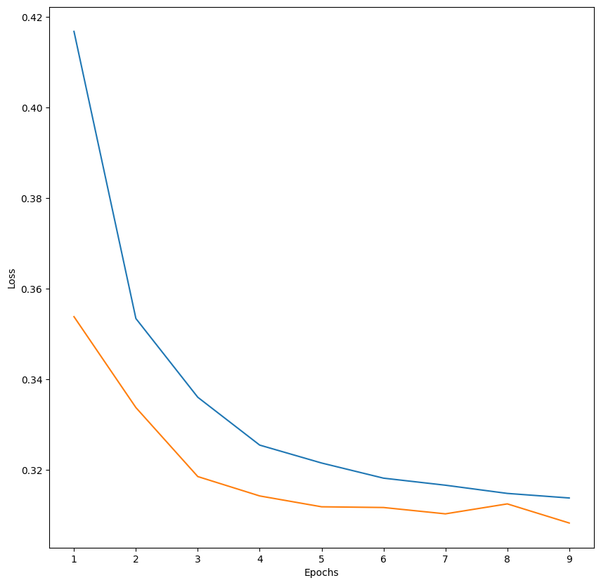

```python
import kagglehub

# Download latest version
path = kagglehub.dataset_download("uciml/adult-census-income")

print("Path to dataset files:", path)
```

    /Users/jeongho/Desktop/w25536-kaggle/kaggle/lib/python3.9/site-packages/urllib3/__init__.py:35: NotOpenSSLWarning: urllib3 v2 only supports OpenSSL 1.1.1+, currently the 'ssl' module is compiled with 'LibreSSL 2.8.3'. See: https://github.com/urllib3/urllib3/issues/3020
      warnings.warn(


    Warning: Looks like you're using an outdated `kagglehub` version, please consider updating (latest version: 0.3.4)
    Path to dataset files: /Users/jeongho/.cache/kagglehub/datasets/uciml/adult-census-income/versions/3


```python
import pandas as pd
import numpy as np
import matplotlib.pyplot as plt
import seaborn as sns

import os

from sklearn.preprocessing import StandardScaler
from sklearn.preprocessing import MinMaxScaler
from sklearn.model_selection import train_test_split

from sklearn.preprocessing import LabelEncoder

import tensorflow as tf
```


```python
df = pd.read_csv(os.path.join(path, "adult.csv"))
```


```python
df
```


<div>
<style scoped>
    .dataframe tbody tr th:only-of-type {
        vertical-align: middle;
    }

    .dataframe tbody tr th {
        vertical-align: top;
    }

    .dataframe thead th {
        text-align: right;
    }
</style>
<table border="1" class="dataframe">
  <thead>
    <tr style="text-align: right;">
      <th></th>
      <th>age</th>
      <th>workclass</th>
      <th>fnlwgt</th>
      <th>education</th>
      <th>education.num</th>
      <th>marital.status</th>
      <th>occupation</th>
      <th>relationship</th>
      <th>race</th>
      <th>sex</th>
      <th>capital.gain</th>
      <th>capital.loss</th>
      <th>hours.per.week</th>
      <th>native.country</th>
      <th>income</th>
    </tr>
  </thead>
  <tbody>
    <tr>
      <th>0</th>
      <td>90</td>
      <td>?</td>
      <td>77053</td>
      <td>HS-grad</td>
      <td>9</td>
      <td>Widowed</td>
      <td>?</td>
      <td>Not-in-family</td>
      <td>White</td>
      <td>Female</td>
      <td>0</td>
      <td>4356</td>
      <td>40</td>
      <td>United-States</td>
      <td>&lt;=50K</td>
    </tr>
    <tr>
      <th>1</th>
      <td>82</td>
      <td>Private</td>
      <td>132870</td>
      <td>HS-grad</td>
      <td>9</td>
      <td>Widowed</td>
      <td>Exec-managerial</td>
      <td>Not-in-family</td>
      <td>White</td>
      <td>Female</td>
      <td>0</td>
      <td>4356</td>
      <td>18</td>
      <td>United-States</td>
      <td>&lt;=50K</td>
    </tr>
    <tr>
      <th>2</th>
      <td>66</td>
      <td>?</td>
      <td>186061</td>
      <td>Some-college</td>
      <td>10</td>
      <td>Widowed</td>
      <td>?</td>
      <td>Unmarried</td>
      <td>Black</td>
      <td>Female</td>
      <td>0</td>
      <td>4356</td>
      <td>40</td>
      <td>United-States</td>
      <td>&lt;=50K</td>
    </tr>
    <tr>
      <th>3</th>
      <td>54</td>
      <td>Private</td>
      <td>140359</td>
      <td>7th-8th</td>
      <td>4</td>
      <td>Divorced</td>
      <td>Machine-op-inspct</td>
      <td>Unmarried</td>
      <td>White</td>
      <td>Female</td>
      <td>0</td>
      <td>3900</td>
      <td>40</td>
      <td>United-States</td>
      <td>&lt;=50K</td>
    </tr>
    <tr>
      <th>4</th>
      <td>41</td>
      <td>Private</td>
      <td>264663</td>
      <td>Some-college</td>
      <td>10</td>
      <td>Separated</td>
      <td>Prof-specialty</td>
      <td>Own-child</td>
      <td>White</td>
      <td>Female</td>
      <td>0</td>
      <td>3900</td>
      <td>40</td>
      <td>United-States</td>
      <td>&lt;=50K</td>
    </tr>
    <tr>
      <th>...</th>
      <td>...</td>
      <td>...</td>
      <td>...</td>
      <td>...</td>
      <td>...</td>
      <td>...</td>
      <td>...</td>
      <td>...</td>
      <td>...</td>
      <td>...</td>
      <td>...</td>
      <td>...</td>
      <td>...</td>
      <td>...</td>
      <td>...</td>
    </tr>
    <tr>
      <th>32556</th>
      <td>22</td>
      <td>Private</td>
      <td>310152</td>
      <td>Some-college</td>
      <td>10</td>
      <td>Never-married</td>
      <td>Protective-serv</td>
      <td>Not-in-family</td>
      <td>White</td>
      <td>Male</td>
      <td>0</td>
      <td>0</td>
      <td>40</td>
      <td>United-States</td>
      <td>&lt;=50K</td>
    </tr>
    <tr>
      <th>32557</th>
      <td>27</td>
      <td>Private</td>
      <td>257302</td>
      <td>Assoc-acdm</td>
      <td>12</td>
      <td>Married-civ-spouse</td>
      <td>Tech-support</td>
      <td>Wife</td>
      <td>White</td>
      <td>Female</td>
      <td>0</td>
      <td>0</td>
      <td>38</td>
      <td>United-States</td>
      <td>&lt;=50K</td>
    </tr>
    <tr>
      <th>32558</th>
      <td>40</td>
      <td>Private</td>
      <td>154374</td>
      <td>HS-grad</td>
      <td>9</td>
      <td>Married-civ-spouse</td>
      <td>Machine-op-inspct</td>
      <td>Husband</td>
      <td>White</td>
      <td>Male</td>
      <td>0</td>
      <td>0</td>
      <td>40</td>
      <td>United-States</td>
      <td>&gt;50K</td>
    </tr>
    <tr>
      <th>32559</th>
      <td>58</td>
      <td>Private</td>
      <td>151910</td>
      <td>HS-grad</td>
      <td>9</td>
      <td>Widowed</td>
      <td>Adm-clerical</td>
      <td>Unmarried</td>
      <td>White</td>
      <td>Female</td>
      <td>0</td>
      <td>0</td>
      <td>40</td>
      <td>United-States</td>
      <td>&lt;=50K</td>
    </tr>
    <tr>
      <th>32560</th>
      <td>22</td>
      <td>Private</td>
      <td>201490</td>
      <td>HS-grad</td>
      <td>9</td>
      <td>Never-married</td>
      <td>Adm-clerical</td>
      <td>Own-child</td>
      <td>White</td>
      <td>Male</td>
      <td>0</td>
      <td>0</td>
      <td>20</td>
      <td>United-States</td>
      <td>&lt;=50K</td>
    </tr>
  </tbody>
</table>
<p>32561 rows × 15 columns</p>
</div>


```python
df.info()
```

    <class 'pandas.core.frame.DataFrame'>
    RangeIndex: 32561 entries, 0 to 32560
    Data columns (total 15 columns):
     #   Column          Non-Null Count  Dtype 
    ---  ------          --------------  ----- 
     0   age             32561 non-null  int64 
     1   workclass       32561 non-null  object
     2   fnlwgt          32561 non-null  int64 
     3   education       32561 non-null  object
     4   education.num   32561 non-null  int64 
     5   marital.status  32561 non-null  object
     6   occupation      32561 non-null  object
     7   relationship    32561 non-null  object
     8   race            32561 non-null  object
     9   sex             32561 non-null  object
     10  capital.gain    32561 non-null  int64 
     11  capital.loss    32561 non-null  int64 
     12  hours.per.week  32561 non-null  int64 
     13  native.country  32561 non-null  object
     14  income          32561 non-null  object
    dtypes: int64(6), object(9)
    memory usage: 3.7+ MB


```python
df.isna().sum()
```


    age               0
    workclass         0
    fnlwgt            0
    education         0
    education.num     0
    marital.status    0
    occupation        0
    relationship      0
    race              0
    sex               0
    capital.gain      0
    capital.loss      0
    hours.per.week    0
    native.country    0
    income            0
    dtype: int64


```python
df.isin(["?"]).sum()
```


    age                  0
    workclass         1836
    fnlwgt               0
    education            0
    education.num        0
    marital.status       0
    occupation        1843
    relationship         0
    race                 0
    sex                  0
    capital.gain         0
    capital.loss         0
    hours.per.week       0
    native.country     583
    income               0
    dtype: int64


```python
df["workclass"].unique()
```


    array(['?', 'Private', 'State-gov', 'Federal-gov', 'Self-emp-not-inc',
           'Self-emp-inc', 'Local-gov', 'Without-pay', 'Never-worked'],
          dtype=object)


```python
df["occupation"].unique()
```


    array(['?', 'Exec-managerial', 'Machine-op-inspct', 'Prof-specialty',
           'Other-service', 'Adm-clerical', 'Craft-repair',
           'Transport-moving', 'Handlers-cleaners', 'Sales',
           'Farming-fishing', 'Tech-support', 'Protective-serv',
           'Armed-Forces', 'Priv-house-serv'], dtype=object)


```python
df["native.country"].unique()
```


    array(['United-States', '?', 'Mexico', 'Greece', 'Vietnam', 'China',
           'Taiwan', 'India', 'Philippines', 'Trinadad&Tobago', 'Canada',
           'South', 'Holand-Netherlands', 'Puerto-Rico', 'Poland', 'Iran',
           'England', 'Germany', 'Italy', 'Japan', 'Hong', 'Honduras', 'Cuba',
           'Ireland', 'Cambodia', 'Peru', 'Nicaragua', 'Dominican-Republic',
           'Haiti', 'El-Salvador', 'Hungary', 'Columbia', 'Guatemala',
           'Jamaica', 'Ecuador', 'France', 'Yugoslavia', 'Scotland',
           'Portugal', 'Laos', 'Thailand', 'Outlying-US(Guam-USVI-etc)'],
          dtype=object)


```python
df = df.replace("?", np.NaN)
```


```python
df = df.drop(["education"], axis=1)
```


```python
# Get list of categorical columns
categorical_features = df.select_dtypes(include=["object"]).columns

categorical_features
```


    Index(['workclass', 'marital.status', 'occupation', 'relationship', 'race',
           'sex', 'native.country', 'income'],
          dtype='object')


```python
def get_uniques(df, columns):
    uniques = dict()
    for column in columns:
        uniques[column] = list(df[column].unique())

    return uniques
```


```python
get_uniques(df, categorical_features)
```


    {'workclass': [nan,
      'Private',
      'State-gov',
      'Federal-gov',
      'Self-emp-not-inc',
      'Self-emp-inc',
      'Local-gov',
      'Without-pay',
      'Never-worked'],
     'marital.status': ['Widowed',
      'Divorced',
      'Separated',
      'Never-married',
      'Married-civ-spouse',
      'Married-spouse-absent',
      'Married-AF-spouse'],
     'occupation': [nan,
      'Exec-managerial',
      'Machine-op-inspct',
      'Prof-specialty',
      'Other-service',
      'Adm-clerical',
      'Craft-repair',
      'Transport-moving',
      'Handlers-cleaners',
      'Sales',
      'Farming-fishing',
      'Tech-support',
      'Protective-serv',
      'Armed-Forces',
      'Priv-house-serv'],
     'relationship': ['Not-in-family',
      'Unmarried',
      'Own-child',
      'Other-relative',
      'Husband',
      'Wife'],
     'race': ['White',
      'Black',
      'Asian-Pac-Islander',
      'Other',
      'Amer-Indian-Eskimo'],
     'sex': ['Female', 'Male'],
     'native.country': ['United-States',
      nan,
      'Mexico',
      'Greece',
      'Vietnam',
      'China',
      'Taiwan',
      'India',
      'Philippines',
      'Trinadad&Tobago',
      'Canada',
      'South',
      'Holand-Netherlands',
      'Puerto-Rico',
      'Poland',
      'Iran',
      'England',
      'Germany',
      'Italy',
      'Japan',
      'Hong',
      'Honduras',
      'Cuba',
      'Ireland',
      'Cambodia',
      'Peru',
      'Nicaragua',
      'Dominican-Republic',
      'Haiti',
      'El-Salvador',
      'Hungary',
      'Columbia',
      'Guatemala',
      'Jamaica',
      'Ecuador',
      'France',
      'Yugoslavia',
      'Scotland',
      'Portugal',
      'Laos',
      'Thailand',
      'Outlying-US(Guam-USVI-etc)'],
     'income': ['<=50K', '>50K']}


```python
binary_features = ["sex"]

nominal_features = [
    "workclass",
    "marital.status",
    "occupation",
    "relationship",
    "race",
    "native.country",
]

ordinal_features = []  # education is gone maybe you could add here
```


```python
def binary_encode(df, columns):
    label_encoder = LabelEncoder()
    for column in columns:
        df[column] = label_encoder.fit_transform(df[column])
    return df


def onehot_encode(df, columns):
    for column in columns:
        dummies = pd.get_dummies(df[column])
        df = pd.concat([df, dummies], axis=1)
        df.drop(column, axis=1, inplace=True)
    return df
```


```python
df = binary_encode(df, binary_features)
df = onehot_encode(df, nominal_features)
```


```python
(df.dtypes == "object").sum()
```


    1


```python
y = df["income"]
X = df.drop(["income"], axis=1)
```


```python
label_encoder = LabelEncoder()
y = label_encoder.fit_transform(y)
y_mappings = {index: label for index, label in enumerate(label_encoder.classes_)}
```


```python
y_mappings
```


    {0: '<=50K', 1: '>50K'}


```python
scaler = MinMaxScaler()
X = pd.DataFrame(scaler.fit_transform(X), columns=X.columns)
```


```python
X
```


<div>
<style scoped>
    .dataframe tbody tr th:only-of-type {
        vertical-align: middle;
    }

    .dataframe tbody tr th {
        vertical-align: top;
    }

    .dataframe thead th {
        text-align: right;
    }
</style>
<table border="1" class="dataframe">
  <thead>
    <tr style="text-align: right;">
      <th></th>
      <th>age</th>
      <th>fnlwgt</th>
      <th>education.num</th>
      <th>sex</th>
      <th>capital.gain</th>
      <th>capital.loss</th>
      <th>hours.per.week</th>
      <th>Federal-gov</th>
      <th>Local-gov</th>
      <th>Never-worked</th>
      <th>...</th>
      <th>Portugal</th>
      <th>Puerto-Rico</th>
      <th>Scotland</th>
      <th>South</th>
      <th>Taiwan</th>
      <th>Thailand</th>
      <th>Trinadad&amp;Tobago</th>
      <th>United-States</th>
      <th>Vietnam</th>
      <th>Yugoslavia</th>
    </tr>
  </thead>
  <tbody>
    <tr>
      <th>0</th>
      <td>1.000000</td>
      <td>0.043987</td>
      <td>0.533333</td>
      <td>0.0</td>
      <td>0.0</td>
      <td>1.000000</td>
      <td>0.397959</td>
      <td>0.0</td>
      <td>0.0</td>
      <td>0.0</td>
      <td>...</td>
      <td>0.0</td>
      <td>0.0</td>
      <td>0.0</td>
      <td>0.0</td>
      <td>0.0</td>
      <td>0.0</td>
      <td>0.0</td>
      <td>1.0</td>
      <td>0.0</td>
      <td>0.0</td>
    </tr>
    <tr>
      <th>1</th>
      <td>0.890411</td>
      <td>0.081896</td>
      <td>0.533333</td>
      <td>0.0</td>
      <td>0.0</td>
      <td>1.000000</td>
      <td>0.173469</td>
      <td>0.0</td>
      <td>0.0</td>
      <td>0.0</td>
      <td>...</td>
      <td>0.0</td>
      <td>0.0</td>
      <td>0.0</td>
      <td>0.0</td>
      <td>0.0</td>
      <td>0.0</td>
      <td>0.0</td>
      <td>1.0</td>
      <td>0.0</td>
      <td>0.0</td>
    </tr>
    <tr>
      <th>2</th>
      <td>0.671233</td>
      <td>0.118021</td>
      <td>0.600000</td>
      <td>0.0</td>
      <td>0.0</td>
      <td>1.000000</td>
      <td>0.397959</td>
      <td>0.0</td>
      <td>0.0</td>
      <td>0.0</td>
      <td>...</td>
      <td>0.0</td>
      <td>0.0</td>
      <td>0.0</td>
      <td>0.0</td>
      <td>0.0</td>
      <td>0.0</td>
      <td>0.0</td>
      <td>1.0</td>
      <td>0.0</td>
      <td>0.0</td>
    </tr>
    <tr>
      <th>3</th>
      <td>0.506849</td>
      <td>0.086982</td>
      <td>0.200000</td>
      <td>0.0</td>
      <td>0.0</td>
      <td>0.895317</td>
      <td>0.397959</td>
      <td>0.0</td>
      <td>0.0</td>
      <td>0.0</td>
      <td>...</td>
      <td>0.0</td>
      <td>0.0</td>
      <td>0.0</td>
      <td>0.0</td>
      <td>0.0</td>
      <td>0.0</td>
      <td>0.0</td>
      <td>1.0</td>
      <td>0.0</td>
      <td>0.0</td>
    </tr>
    <tr>
      <th>4</th>
      <td>0.328767</td>
      <td>0.171404</td>
      <td>0.600000</td>
      <td>0.0</td>
      <td>0.0</td>
      <td>0.895317</td>
      <td>0.397959</td>
      <td>0.0</td>
      <td>0.0</td>
      <td>0.0</td>
      <td>...</td>
      <td>0.0</td>
      <td>0.0</td>
      <td>0.0</td>
      <td>0.0</td>
      <td>0.0</td>
      <td>0.0</td>
      <td>0.0</td>
      <td>1.0</td>
      <td>0.0</td>
      <td>0.0</td>
    </tr>
    <tr>
      <th>...</th>
      <td>...</td>
      <td>...</td>
      <td>...</td>
      <td>...</td>
      <td>...</td>
      <td>...</td>
      <td>...</td>
      <td>...</td>
      <td>...</td>
      <td>...</td>
      <td>...</td>
      <td>...</td>
      <td>...</td>
      <td>...</td>
      <td>...</td>
      <td>...</td>
      <td>...</td>
      <td>...</td>
      <td>...</td>
      <td>...</td>
      <td>...</td>
    </tr>
    <tr>
      <th>32556</th>
      <td>0.068493</td>
      <td>0.202298</td>
      <td>0.600000</td>
      <td>1.0</td>
      <td>0.0</td>
      <td>0.000000</td>
      <td>0.397959</td>
      <td>0.0</td>
      <td>0.0</td>
      <td>0.0</td>
      <td>...</td>
      <td>0.0</td>
      <td>0.0</td>
      <td>0.0</td>
      <td>0.0</td>
      <td>0.0</td>
      <td>0.0</td>
      <td>0.0</td>
      <td>1.0</td>
      <td>0.0</td>
      <td>0.0</td>
    </tr>
    <tr>
      <th>32557</th>
      <td>0.136986</td>
      <td>0.166404</td>
      <td>0.733333</td>
      <td>0.0</td>
      <td>0.0</td>
      <td>0.000000</td>
      <td>0.377551</td>
      <td>0.0</td>
      <td>0.0</td>
      <td>0.0</td>
      <td>...</td>
      <td>0.0</td>
      <td>0.0</td>
      <td>0.0</td>
      <td>0.0</td>
      <td>0.0</td>
      <td>0.0</td>
      <td>0.0</td>
      <td>1.0</td>
      <td>0.0</td>
      <td>0.0</td>
    </tr>
    <tr>
      <th>32558</th>
      <td>0.315068</td>
      <td>0.096500</td>
      <td>0.533333</td>
      <td>1.0</td>
      <td>0.0</td>
      <td>0.000000</td>
      <td>0.397959</td>
      <td>0.0</td>
      <td>0.0</td>
      <td>0.0</td>
      <td>...</td>
      <td>0.0</td>
      <td>0.0</td>
      <td>0.0</td>
      <td>0.0</td>
      <td>0.0</td>
      <td>0.0</td>
      <td>0.0</td>
      <td>1.0</td>
      <td>0.0</td>
      <td>0.0</td>
    </tr>
    <tr>
      <th>32559</th>
      <td>0.561644</td>
      <td>0.094827</td>
      <td>0.533333</td>
      <td>0.0</td>
      <td>0.0</td>
      <td>0.000000</td>
      <td>0.397959</td>
      <td>0.0</td>
      <td>0.0</td>
      <td>0.0</td>
      <td>...</td>
      <td>0.0</td>
      <td>0.0</td>
      <td>0.0</td>
      <td>0.0</td>
      <td>0.0</td>
      <td>0.0</td>
      <td>0.0</td>
      <td>1.0</td>
      <td>0.0</td>
      <td>0.0</td>
    </tr>
    <tr>
      <th>32560</th>
      <td>0.068493</td>
      <td>0.128499</td>
      <td>0.533333</td>
      <td>1.0</td>
      <td>0.0</td>
      <td>0.000000</td>
      <td>0.193878</td>
      <td>0.0</td>
      <td>0.0</td>
      <td>0.0</td>
      <td>...</td>
      <td>0.0</td>
      <td>0.0</td>
      <td>0.0</td>
      <td>0.0</td>
      <td>0.0</td>
      <td>0.0</td>
      <td>0.0</td>
      <td>1.0</td>
      <td>0.0</td>
      <td>0.0</td>
    </tr>
  </tbody>
</table>
<p>32561 rows × 88 columns</p>
</div>


```python
X_train, X_test, y_train, y_test = train_test_split(X, y, train_size=0.8)
```


```python
inputs = tf.keras.Input(shape=(88,))
x = tf.keras.layers.Dense(16, activation="relu")(inputs)
x = tf.keras.layers.Dense(16, activation="relu")(x)
outputs = tf.keras.layers.Dense(1, activation="sigmoid")(x)

model = tf.keras.Model(inputs=inputs, outputs=outputs)

optimizer = tf.keras.optimizers.Adam(learning_rate=0.001)

metrics = [
    tf.keras.metrics.BinaryAccuracy(name="acc"),
    tf.keras.metrics.AUC(name="auc"),
]

model.compile(optimizer=optimizer, loss="binary_crossentropy", metrics=metrics)

batch_size = 32
epochs = 9

history = model.fit(
    X_train,
    y_train,
    validation_split=0.2,
    batch_size=batch_size,
    epochs=epochs,
    verbose=0,
)
```


```python
plt.figure(figsize=(10, 10))

epochs_range = range(1, epochs + 1)
train_loss = history.history["loss"]
val_loss = history.history["val_loss"]

plt.plot(epochs_range, train_loss, label="Training Loss")
plt.plot(epochs_range, val_loss, label="Validation Loss")

plt.xlabel("Epochs")
plt.ylabel("Loss")
plt.legend


plt.show()
```


    

    


```python
np.argmin(val_loss)
```


    8


```python
model.evaluate(X_test, y_test)
```

    204/204 ━━━━━━━━━━━━━━━━━━━━ 0s 596us/step - acc: 0.8410 - auc: 0.9009 - loss: 0.3313


    [0.32660597562789917, 0.8410870432853699, 0.9053516387939453]


```python
y.sum() / len(
    y
)  # percenage of postive value so assumming by accurarcy isn't the right way. Hence, observe auc instead!!!
```


    0.2408095574460244


```python

```
