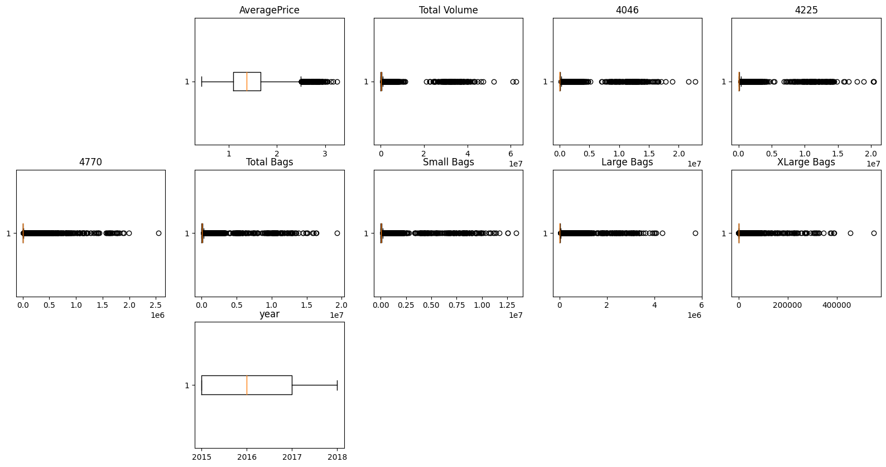
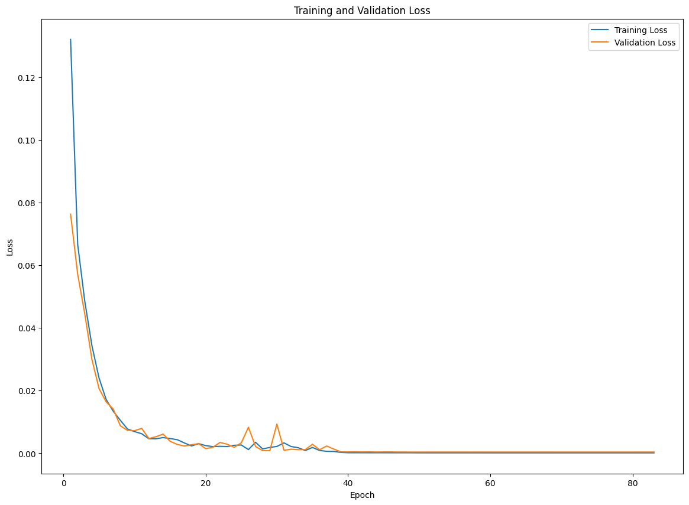

```python
import kagglehub

# Download latest version
path = kagglehub.dataset_download("neuromusic/avocado-prices")

print("Path to dataset files:", path)
```

    Warning: Looks like you're using an outdated `kagglehub` version, please consider updating (latest version: 0.3.5)
    Path to dataset files: /Users/jeongho/.cache/kagglehub/datasets/neuromusic/avocado-prices/versions/1


```python
import pandas as pd
import numpy as np
import matplotlib.pyplot as plt
import seaborn as sns

import os

df = pd.read_csv(os.path.join(path, "avocado.csv"))
```


```python
df1.info()  # premilinary inforamation
```

    <class 'pandas.core.frame.DataFrame'>
    RangeIndex: 18249 entries, 0 to 18248
    Data columns (total 13 columns):
     #   Column        Non-Null Count  Dtype  
    ---  ------        --------------  -----  
     0   Date          18249 non-null  int64  
     1   AveragePrice  18249 non-null  float64
     2   Total Volume  18249 non-null  float64
     3   4046          18249 non-null  float64
     4   4225          18249 non-null  float64
     5   4770          18249 non-null  float64
     6   Total Bags    18249 non-null  float64
     7   Small Bags    18249 non-null  float64
     8   Large Bags    18249 non-null  float64
     9   XLarge Bags   18249 non-null  float64
     10  type          18249 non-null  object 
     11  year          18249 non-null  int64  
     12  region        18249 non-null  object 
    dtypes: float64(9), int64(2), object(2)
    memory usage: 1.8+ MB


```python
df1 = df.drop(["Unnamed: 0"], axis=1)
```


```python
plt.figure(figsize=(20, 10))

for i in range(len(df1.columns)):
    if df1.dtypes[i] != object:
        plt.subplot(3, 5, i + 1)
        plt.boxplot(df1[df1.columns[i]], vert=False)
        plt.title(df1.columns[i])

plt.show
```

    /var/folders/v7/tlyx9w190ks2gfgzd_j0l5c80000gn/T/ipykernel_71312/3078220144.py:4: FutureWarning: Series.__getitem__ treating keys as positions is deprecated. In a future version, integer keys will always be treated as labels (consistent with DataFrame behavior). To access a value by position, use `ser.iloc[pos]`
      if df1.dtypes[i] != object:
    /var/folders/v7/tlyx9w190ks2gfgzd_j0l5c80000gn/T/ipykernel_71312/3078220144.py:4: FutureWarning: Series.__getitem__ treating keys as positions is deprecated. In a future version, integer keys will always be treated as labels (consistent with DataFrame behavior). To access a value by position, use `ser.iloc[pos]`
      if df1.dtypes[i] != object:
    /var/folders/v7/tlyx9w190ks2gfgzd_j0l5c80000gn/T/ipykernel_71312/3078220144.py:4: FutureWarning: Series.__getitem__ treating keys as positions is deprecated. In a future version, integer keys will always be treated as labels (consistent with DataFrame behavior). To access a value by position, use `ser.iloc[pos]`
      if df1.dtypes[i] != object:
    /var/folders/v7/tlyx9w190ks2gfgzd_j0l5c80000gn/T/ipykernel_71312/3078220144.py:4: FutureWarning: Series.__getitem__ treating keys as positions is deprecated. In a future version, integer keys will always be treated as labels (consistent with DataFrame behavior). To access a value by position, use `ser.iloc[pos]`
      if df1.dtypes[i] != object:
    /var/folders/v7/tlyx9w190ks2gfgzd_j0l5c80000gn/T/ipykernel_71312/3078220144.py:4: FutureWarning: Series.__getitem__ treating keys as positions is deprecated. In a future version, integer keys will always be treated as labels (consistent with DataFrame behavior). To access a value by position, use `ser.iloc[pos]`
      if df1.dtypes[i] != object:
    /var/folders/v7/tlyx9w190ks2gfgzd_j0l5c80000gn/T/ipykernel_71312/3078220144.py:4: FutureWarning: Series.__getitem__ treating keys as positions is deprecated. In a future version, integer keys will always be treated as labels (consistent with DataFrame behavior). To access a value by position, use `ser.iloc[pos]`
      if df1.dtypes[i] != object:
    /var/folders/v7/tlyx9w190ks2gfgzd_j0l5c80000gn/T/ipykernel_71312/3078220144.py:4: FutureWarning: Series.__getitem__ treating keys as positions is deprecated. In a future version, integer keys will always be treated as labels (consistent with DataFrame behavior). To access a value by position, use `ser.iloc[pos]`
      if df1.dtypes[i] != object:
    /var/folders/v7/tlyx9w190ks2gfgzd_j0l5c80000gn/T/ipykernel_71312/3078220144.py:4: FutureWarning: Series.__getitem__ treating keys as positions is deprecated. In a future version, integer keys will always be treated as labels (consistent with DataFrame behavior). To access a value by position, use `ser.iloc[pos]`
      if df1.dtypes[i] != object:
    /var/folders/v7/tlyx9w190ks2gfgzd_j0l5c80000gn/T/ipykernel_71312/3078220144.py:4: FutureWarning: Series.__getitem__ treating keys as positions is deprecated. In a future version, integer keys will always be treated as labels (consistent with DataFrame behavior). To access a value by position, use `ser.iloc[pos]`
      if df1.dtypes[i] != object:
    /var/folders/v7/tlyx9w190ks2gfgzd_j0l5c80000gn/T/ipykernel_71312/3078220144.py:4: FutureWarning: Series.__getitem__ treating keys as positions is deprecated. In a future version, integer keys will always be treated as labels (consistent with DataFrame behavior). To access a value by position, use `ser.iloc[pos]`
      if df1.dtypes[i] != object:
    /var/folders/v7/tlyx9w190ks2gfgzd_j0l5c80000gn/T/ipykernel_71312/3078220144.py:4: FutureWarning: Series.__getitem__ treating keys as positions is deprecated. In a future version, integer keys will always be treated as labels (consistent with DataFrame behavior). To access a value by position, use `ser.iloc[pos]`
      if df1.dtypes[i] != object:
    /var/folders/v7/tlyx9w190ks2gfgzd_j0l5c80000gn/T/ipykernel_71312/3078220144.py:4: FutureWarning: Series.__getitem__ treating keys as positions is deprecated. In a future version, integer keys will always be treated as labels (consistent with DataFrame behavior). To access a value by position, use `ser.iloc[pos]`
      if df1.dtypes[i] != object:
    /var/folders/v7/tlyx9w190ks2gfgzd_j0l5c80000gn/T/ipykernel_71312/3078220144.py:4: FutureWarning: Series.__getitem__ treating keys as positions is deprecated. In a future version, integer keys will always be treated as labels (consistent with DataFrame behavior). To access a value by position, use `ser.iloc[pos]`
      if df1.dtypes[i] != object:


    <function matplotlib.pyplot.show(close=None, block=None)>


    

    


```python
df.isna().sum()
```


    Unnamed: 0      0
    Date            0
    AveragePrice    0
    Total Volume    0
    4046            0
    4225            0
    4770            0
    Total Bags      0
    Small Bags      0
    Large Bags      0
    XLarge Bags     0
    type            0
    year            0
    region          0
    dtype: int64


```python
def get_uniques(df, columns):
    return {column: list(df[column].unique()) for column in columns}
```


```python
categorical_columns = list(df1.select_dtypes("object").columns)

categorical_columns
```


    ['Date', 'type', 'region']


```python
ordinal_feature = ["Date"]

nomindal_feature = ["region"]

nomindal_feature = ["type"]
```


```python
date_ordering = sorted(df1["Date"].unique())
```


```python
def ordinal_encode(df, column, ordering):
    df.copy()
    df[column] = df[column].apply(lambda x: ordering.index(x))
    return df


def onehot_encode(df, column):
    df = df.copy()
    dummies = pd.get_dummies(df[column], dtype=int)
    df = pd.concat([df, dummies], axis=1)
    df = df.drop(column, axis=1)
    return df
```


```python
df2 = ordinal_encode(df1, "Date", date_ordering)
```


```python
df2 = onehot_encode(df1, "region")
```


```python
df2
```


<div>
<style scoped>
    .dataframe tbody tr th:only-of-type {
        vertical-align: middle;
    }

    .dataframe tbody tr th {
        vertical-align: top;
    }

    .dataframe thead th {
        text-align: right;
    }
</style>
<table border="1" class="dataframe">
  <thead>
    <tr style="text-align: right;">
      <th></th>
      <th>Date</th>
      <th>AveragePrice</th>
      <th>Total Volume</th>
      <th>4046</th>
      <th>4225</th>
      <th>4770</th>
      <th>Total Bags</th>
      <th>Small Bags</th>
      <th>Large Bags</th>
      <th>XLarge Bags</th>
      <th>...</th>
      <th>SouthCarolina</th>
      <th>SouthCentral</th>
      <th>Southeast</th>
      <th>Spokane</th>
      <th>StLouis</th>
      <th>Syracuse</th>
      <th>Tampa</th>
      <th>TotalUS</th>
      <th>West</th>
      <th>WestTexNewMexico</th>
    </tr>
  </thead>
  <tbody>
    <tr>
      <th>0</th>
      <td>51</td>
      <td>1.33</td>
      <td>64236.62</td>
      <td>1036.74</td>
      <td>54454.85</td>
      <td>48.16</td>
      <td>8696.87</td>
      <td>8603.62</td>
      <td>93.25</td>
      <td>0.0</td>
      <td>...</td>
      <td>0</td>
      <td>0</td>
      <td>0</td>
      <td>0</td>
      <td>0</td>
      <td>0</td>
      <td>0</td>
      <td>0</td>
      <td>0</td>
      <td>0</td>
    </tr>
    <tr>
      <th>1</th>
      <td>50</td>
      <td>1.35</td>
      <td>54876.98</td>
      <td>674.28</td>
      <td>44638.81</td>
      <td>58.33</td>
      <td>9505.56</td>
      <td>9408.07</td>
      <td>97.49</td>
      <td>0.0</td>
      <td>...</td>
      <td>0</td>
      <td>0</td>
      <td>0</td>
      <td>0</td>
      <td>0</td>
      <td>0</td>
      <td>0</td>
      <td>0</td>
      <td>0</td>
      <td>0</td>
    </tr>
    <tr>
      <th>2</th>
      <td>49</td>
      <td>0.93</td>
      <td>118220.22</td>
      <td>794.70</td>
      <td>109149.67</td>
      <td>130.50</td>
      <td>8145.35</td>
      <td>8042.21</td>
      <td>103.14</td>
      <td>0.0</td>
      <td>...</td>
      <td>0</td>
      <td>0</td>
      <td>0</td>
      <td>0</td>
      <td>0</td>
      <td>0</td>
      <td>0</td>
      <td>0</td>
      <td>0</td>
      <td>0</td>
    </tr>
    <tr>
      <th>3</th>
      <td>48</td>
      <td>1.08</td>
      <td>78992.15</td>
      <td>1132.00</td>
      <td>71976.41</td>
      <td>72.58</td>
      <td>5811.16</td>
      <td>5677.40</td>
      <td>133.76</td>
      <td>0.0</td>
      <td>...</td>
      <td>0</td>
      <td>0</td>
      <td>0</td>
      <td>0</td>
      <td>0</td>
      <td>0</td>
      <td>0</td>
      <td>0</td>
      <td>0</td>
      <td>0</td>
    </tr>
    <tr>
      <th>4</th>
      <td>47</td>
      <td>1.28</td>
      <td>51039.60</td>
      <td>941.48</td>
      <td>43838.39</td>
      <td>75.78</td>
      <td>6183.95</td>
      <td>5986.26</td>
      <td>197.69</td>
      <td>0.0</td>
      <td>...</td>
      <td>0</td>
      <td>0</td>
      <td>0</td>
      <td>0</td>
      <td>0</td>
      <td>0</td>
      <td>0</td>
      <td>0</td>
      <td>0</td>
      <td>0</td>
    </tr>
    <tr>
      <th>...</th>
      <td>...</td>
      <td>...</td>
      <td>...</td>
      <td>...</td>
      <td>...</td>
      <td>...</td>
      <td>...</td>
      <td>...</td>
      <td>...</td>
      <td>...</td>
      <td>...</td>
      <td>...</td>
      <td>...</td>
      <td>...</td>
      <td>...</td>
      <td>...</td>
      <td>...</td>
      <td>...</td>
      <td>...</td>
      <td>...</td>
      <td>...</td>
    </tr>
    <tr>
      <th>18244</th>
      <td>161</td>
      <td>1.63</td>
      <td>17074.83</td>
      <td>2046.96</td>
      <td>1529.20</td>
      <td>0.00</td>
      <td>13498.67</td>
      <td>13066.82</td>
      <td>431.85</td>
      <td>0.0</td>
      <td>...</td>
      <td>0</td>
      <td>0</td>
      <td>0</td>
      <td>0</td>
      <td>0</td>
      <td>0</td>
      <td>0</td>
      <td>0</td>
      <td>0</td>
      <td>1</td>
    </tr>
    <tr>
      <th>18245</th>
      <td>160</td>
      <td>1.71</td>
      <td>13888.04</td>
      <td>1191.70</td>
      <td>3431.50</td>
      <td>0.00</td>
      <td>9264.84</td>
      <td>8940.04</td>
      <td>324.80</td>
      <td>0.0</td>
      <td>...</td>
      <td>0</td>
      <td>0</td>
      <td>0</td>
      <td>0</td>
      <td>0</td>
      <td>0</td>
      <td>0</td>
      <td>0</td>
      <td>0</td>
      <td>1</td>
    </tr>
    <tr>
      <th>18246</th>
      <td>159</td>
      <td>1.87</td>
      <td>13766.76</td>
      <td>1191.92</td>
      <td>2452.79</td>
      <td>727.94</td>
      <td>9394.11</td>
      <td>9351.80</td>
      <td>42.31</td>
      <td>0.0</td>
      <td>...</td>
      <td>0</td>
      <td>0</td>
      <td>0</td>
      <td>0</td>
      <td>0</td>
      <td>0</td>
      <td>0</td>
      <td>0</td>
      <td>0</td>
      <td>1</td>
    </tr>
    <tr>
      <th>18247</th>
      <td>158</td>
      <td>1.93</td>
      <td>16205.22</td>
      <td>1527.63</td>
      <td>2981.04</td>
      <td>727.01</td>
      <td>10969.54</td>
      <td>10919.54</td>
      <td>50.00</td>
      <td>0.0</td>
      <td>...</td>
      <td>0</td>
      <td>0</td>
      <td>0</td>
      <td>0</td>
      <td>0</td>
      <td>0</td>
      <td>0</td>
      <td>0</td>
      <td>0</td>
      <td>1</td>
    </tr>
    <tr>
      <th>18248</th>
      <td>157</td>
      <td>1.62</td>
      <td>17489.58</td>
      <td>2894.77</td>
      <td>2356.13</td>
      <td>224.53</td>
      <td>12014.15</td>
      <td>11988.14</td>
      <td>26.01</td>
      <td>0.0</td>
      <td>...</td>
      <td>0</td>
      <td>0</td>
      <td>0</td>
      <td>0</td>
      <td>0</td>
      <td>0</td>
      <td>0</td>
      <td>0</td>
      <td>0</td>
      <td>1</td>
    </tr>
  </tbody>
</table>
<p>18249 rows × 66 columns</p>
</div>


```python
from sklearn.preprocessing import LabelEncoder

label_encoder = LabelEncoder()

df2["type"] = label_encoder.fit_transform(df2["type"])
```


```python
y = df2["type"]
X = df2.drop(["type"], axis=1)
```


```python
from sklearn.preprocessing import StandardScaler

scaler = StandardScaler()
std_X = scaler.fit_transform(X)
```


```python
from sklearn.model_selection import train_test_split


X_train, X_test, y_train, y_test = train_test_split(std_X, y, train_size=0.7)
```


```python
import tensorflow as tf

inputs = tf.keras.Input(shape=(65,))
x = tf.keras.layers.Dense(64, activation="relu")(inputs)
x = tf.keras.layers.Dense(64, activation="relu")(x)
outputs = tf.keras.layers.Dense(1, activation="sigmoid")(x)

model = tf.keras.Model(inputs=inputs, outputs=outputs)

model.compile(optimizer="adam", loss="mse", metrics=["accuracy"])

batch_size = 64
epochs = 83

history = model.fit(
    X_train,
    y_train,
    validation_split=0.2,
    batch_size=batch_size,
    epochs=epochs,
    callbacks=[tf.keras.callbacks.ReduceLROnPlateau()],
    verbose=0,
)
```


```python
plt.figure(figsize=(14, 10))
epochs_range = range(1, epochs + 1)
train_loss = history.history["loss"]
val_loss = history.history["val_loss"]

plt.plot(epochs_range, train_loss, label="Training Loss")
plt.plot(epochs_range, val_loss, label="Validation Loss")

plt.title("Training and Validation Loss")
plt.xlabel("Epoch")
plt.ylabel("Loss")
plt.legend()

plt.show()
```


    

    


```python
np.argmin(val_loss)
```


    48


```python
model.evaluate(X_test, y_test)  # achieved accuracy of 0.9990
```

    172/172 ━━━━━━━━━━━━━━━━━━━━ 0s 582us/step - accuracy: 0.9990 - loss: 7.9936e-04


    [0.00046571780694648623, 0.9996346831321716]


