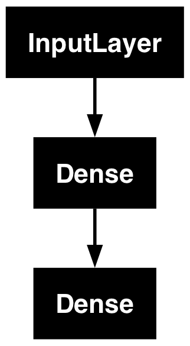
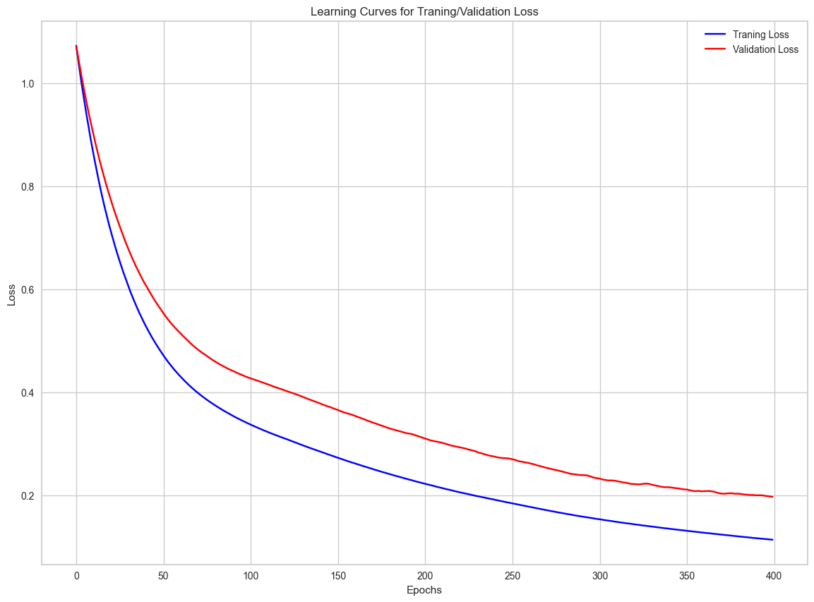

```python
import kagglehub

# Download latest version
path = kagglehub.dataset_download("uciml/iris")

print("Path to dataset files:", path)
```

    Path to dataset files: /Users/jeongho/.cache/kagglehub/datasets/uciml/iris/versions/2


```python
import pandas as pd
import numpy as np
import matplotlib.pyplot as plt
import seaborn as sns
```


```python
import os

df = pd.read_csv(os.path.join(path, "Iris.csv"))
```


```python
df
```


<div>
<style scoped>
    .dataframe tbody tr th:only-of-type {
        vertical-align: middle;
    }

    .dataframe tbody tr th {
        vertical-align: top;
    }

    .dataframe thead th {
        text-align: right;
    }
</style>
<table border="1" class="dataframe">
  <thead>
    <tr style="text-align: right;">
      <th></th>
      <th>Id</th>
      <th>SepalLengthCm</th>
      <th>SepalWidthCm</th>
      <th>PetalLengthCm</th>
      <th>PetalWidthCm</th>
      <th>Species</th>
    </tr>
  </thead>
  <tbody>
    <tr>
      <th>0</th>
      <td>1</td>
      <td>5.1</td>
      <td>3.5</td>
      <td>1.4</td>
      <td>0.2</td>
      <td>Iris-setosa</td>
    </tr>
    <tr>
      <th>1</th>
      <td>2</td>
      <td>4.9</td>
      <td>3.0</td>
      <td>1.4</td>
      <td>0.2</td>
      <td>Iris-setosa</td>
    </tr>
    <tr>
      <th>2</th>
      <td>3</td>
      <td>4.7</td>
      <td>3.2</td>
      <td>1.3</td>
      <td>0.2</td>
      <td>Iris-setosa</td>
    </tr>
    <tr>
      <th>3</th>
      <td>4</td>
      <td>4.6</td>
      <td>3.1</td>
      <td>1.5</td>
      <td>0.2</td>
      <td>Iris-setosa</td>
    </tr>
    <tr>
      <th>4</th>
      <td>5</td>
      <td>5.0</td>
      <td>3.6</td>
      <td>1.4</td>
      <td>0.2</td>
      <td>Iris-setosa</td>
    </tr>
    <tr>
      <th>...</th>
      <td>...</td>
      <td>...</td>
      <td>...</td>
      <td>...</td>
      <td>...</td>
      <td>...</td>
    </tr>
    <tr>
      <th>145</th>
      <td>146</td>
      <td>6.7</td>
      <td>3.0</td>
      <td>5.2</td>
      <td>2.3</td>
      <td>Iris-virginica</td>
    </tr>
    <tr>
      <th>146</th>
      <td>147</td>
      <td>6.3</td>
      <td>2.5</td>
      <td>5.0</td>
      <td>1.9</td>
      <td>Iris-virginica</td>
    </tr>
    <tr>
      <th>147</th>
      <td>148</td>
      <td>6.5</td>
      <td>3.0</td>
      <td>5.2</td>
      <td>2.0</td>
      <td>Iris-virginica</td>
    </tr>
    <tr>
      <th>148</th>
      <td>149</td>
      <td>6.2</td>
      <td>3.4</td>
      <td>5.4</td>
      <td>2.3</td>
      <td>Iris-virginica</td>
    </tr>
    <tr>
      <th>149</th>
      <td>150</td>
      <td>5.9</td>
      <td>3.0</td>
      <td>5.1</td>
      <td>1.8</td>
      <td>Iris-virginica</td>
    </tr>
  </tbody>
</table>
<p>150 rows × 6 columns</p>
</div>


```python
from ydata_profiling import ProfileReport  # Pandas profiling has been depreicated
```


```python
from sklearn.preprocessing import LabelEncoder
from sklearn.preprocessing import StandardScaler
from sklearn.model_selection import train_test_split

import tensorflow as tf
from tensorflow.keras import Input
from tensorflow.keras.layers import Dense
from tensorflow.keras import Model
```


```python
df = df.drop(["Id"], axis=1)
df
```


<div>
<style scoped>
    .dataframe tbody tr th:only-of-type {
        vertical-align: middle;
    }

    .dataframe tbody tr th {
        vertical-align: top;
    }

    .dataframe thead th {
        text-align: right;
    }
</style>
<table border="1" class="dataframe">
  <thead>
    <tr style="text-align: right;">
      <th></th>
      <th>SepalLengthCm</th>
      <th>SepalWidthCm</th>
      <th>PetalLengthCm</th>
      <th>PetalWidthCm</th>
      <th>Species</th>
    </tr>
  </thead>
  <tbody>
    <tr>
      <th>0</th>
      <td>5.1</td>
      <td>3.5</td>
      <td>1.4</td>
      <td>0.2</td>
      <td>Iris-setosa</td>
    </tr>
    <tr>
      <th>1</th>
      <td>4.9</td>
      <td>3.0</td>
      <td>1.4</td>
      <td>0.2</td>
      <td>Iris-setosa</td>
    </tr>
    <tr>
      <th>2</th>
      <td>4.7</td>
      <td>3.2</td>
      <td>1.3</td>
      <td>0.2</td>
      <td>Iris-setosa</td>
    </tr>
    <tr>
      <th>3</th>
      <td>4.6</td>
      <td>3.1</td>
      <td>1.5</td>
      <td>0.2</td>
      <td>Iris-setosa</td>
    </tr>
    <tr>
      <th>4</th>
      <td>5.0</td>
      <td>3.6</td>
      <td>1.4</td>
      <td>0.2</td>
      <td>Iris-setosa</td>
    </tr>
    <tr>
      <th>...</th>
      <td>...</td>
      <td>...</td>
      <td>...</td>
      <td>...</td>
      <td>...</td>
    </tr>
    <tr>
      <th>145</th>
      <td>6.7</td>
      <td>3.0</td>
      <td>5.2</td>
      <td>2.3</td>
      <td>Iris-virginica</td>
    </tr>
    <tr>
      <th>146</th>
      <td>6.3</td>
      <td>2.5</td>
      <td>5.0</td>
      <td>1.9</td>
      <td>Iris-virginica</td>
    </tr>
    <tr>
      <th>147</th>
      <td>6.5</td>
      <td>3.0</td>
      <td>5.2</td>
      <td>2.0</td>
      <td>Iris-virginica</td>
    </tr>
    <tr>
      <th>148</th>
      <td>6.2</td>
      <td>3.4</td>
      <td>5.4</td>
      <td>2.3</td>
      <td>Iris-virginica</td>
    </tr>
    <tr>
      <th>149</th>
      <td>5.9</td>
      <td>3.0</td>
      <td>5.1</td>
      <td>1.8</td>
      <td>Iris-virginica</td>
    </tr>
  </tbody>
</table>
<p>150 rows × 5 columns</p>
</div>


```python
profile = ProfileReport(df, title="Iris Dataset Profiling Report")
profile.to_notebook_iframe()
```


    Summarize dataset:   0%|          | 0/5 [00:00<?, ?it/s]


    Generate report structure:   0%|          | 0/1 [00:00<?, ?it/s]


    Render HTML:   0%|          | 0/1 [00:00<?, ?it/s]


<iframe width="100%" height="800px" srcdoc="&lt;!doctype html&gt;&lt;html lang=en&gt;&lt;head&gt;&lt;meta charset=utf-8&gt;&lt;meta name=viewport content=&quot;width=device-width, initial-scale=1, shrink-to-fit=no&quot;&gt;&lt;meta name=description content=&quot;Profile report generated by YData! Visit us at https://ydata.ai&quot;&gt;&lt;meta name=author content=&quot;YData and the open source community.&quot;&gt;&lt;meta name=generator content=&quot;YData Profiling vv4.11.0&quot;&gt;&lt;meta name=url content=https://github.com/ydataai/ydata-profiling&gt;&lt;meta name=date content=&quot;2024-10-25 14:53:21.563896&quot;&gt;&lt;title&gt;Iris Dataset Profiling Report&lt;/title&gt;&lt;style&gt;
@charset &quot;UTF-8&quot;;/*!
 * Bootstrap  v5.3.3 (https://getbootstrap.com/)
 * Copyright 2011-2024 The Bootstrap Authors
 * Licensed under MIT (https://github.com/twbs/bootstrap/blob/main/LICENSE)
 */:root,[data-bs-theme=light]{--bs-blue:#0d6efd;--bs-indigo:#6610f2;--bs-purple:#6f42c1;--bs-pink:#d63384;--bs-red:#dc3545;--bs-orange:#fd7e14;--bs-yellow:#ffc107;--bs-green:#198754;--bs-teal:#20c997;--bs-cyan:#0dcaf0;--bs-black:#000;--bs-white:#fff;--bs-gray:#6c757d;--bs-gray-dark:#343a40;--bs-gray-100:#f8f9fa;--bs-gray-200:#e9ecef;--bs-gray-300:#dee2e6;--bs-gray-400:#ced4da;--bs-gray-500:#adb5bd;--bs-gray-600:#6c757d;--bs-gray-700:#495057;--bs-gray-800:#343a40;--bs-gray-900:#212529;--bs-primary:#0d6efd;--bs-secondary:#6c757d;--bs-success:#198754;--bs-info:#0dcaf0;--bs-warning:#ffc107;--bs-danger:#dc3545;--bs-light:#f8f9fa;--bs-dark:#212529;--bs-primary-rgb:13,110,253;--bs-secondary-rgb:108,117,125;--bs-success-rgb:25,135,84;--bs-info-rgb:13,202,240;--bs-warning-rgb:255,193,7;--bs-danger-rgb:220,53,69;--bs-light-rgb:248,249,250;--bs-dark-rgb:33,37,41;--bs-primary-text-emphasis:#052c65;--bs-secondary-text-emphasis:#2b2f32;--bs-success-text-emphasis:#0a3622;--bs-info-text-emphasis:#055160;--bs-warning-text-emphasis:#664d03;--bs-danger-text-emphasis:#58151c;--bs-light-text-emphasis:#495057;--bs-dark-text-emphasis:#495057;--bs-primary-bg-subtle:#cfe2ff;--bs-secondary-bg-subtle:#e2e3e5;--bs-success-bg-subtle:#d1e7dd;--bs-info-bg-subtle:#cff4fc;--bs-warning-bg-subtle:#fff3cd;--bs-danger-bg-subtle:#f8d7da;--bs-light-bg-subtle:#fcfcfd;--bs-dark-bg-subtle:#ced4da;--bs-primary-border-subtle:#9ec5fe;--bs-secondary-border-subtle:#c4c8cb;--bs-success-border-subtle:#a3cfbb;--bs-info-border-subtle:#9eeaf9;--bs-warning-border-subtle:#ffe69c;--bs-danger-border-subtle:#f1aeb5;--bs-light-border-subtle:#e9ecef;--bs-dark-border-subtle:#adb5bd;--bs-white-rgb:255,255,255;--bs-black-rgb:0,0,0;--bs-font-sans-serif:system-ui,-apple-system,&quot;Segoe UI&quot;,Roboto,&quot;Helvetica Neue&quot;,&quot;Noto Sans&quot;,&quot;Liberation Sans&quot;,Arial,sans-serif,&quot;Apple Color Emoji&quot;,&quot;Segoe UI Emoji&quot;,&quot;Segoe UI Symbol&quot;,&quot;Noto Color Emoji&quot;;--bs-font-monospace:SFMono-Regular,Menlo,Monaco,Consolas,&quot;Liberation Mono&quot;,&quot;Courier New&quot;,monospace;--bs-gradient:linear-gradient(180deg, rgba(255, 255, 255, 0.15), rgba(255, 255, 255, 0));--bs-body-font-family:var(--bs-font-sans-serif);--bs-body-font-size:1rem;--bs-body-font-weight:400;--bs-body-line-height:1.5;--bs-body-color:#212529;--bs-body-color-rgb:33,37,41;--bs-body-bg:#fff;--bs-body-bg-rgb:255,255,255;--bs-emphasis-color:#000;--bs-emphasis-color-rgb:0,0,0;--bs-secondary-color:rgba(33, 37, 41, 0.75);--bs-secondary-color-rgb:33,37,41;--bs-secondary-bg:#e9ecef;--bs-secondary-bg-rgb:233,236,239;--bs-tertiary-color:rgba(33, 37, 41, 0.5);--bs-tertiary-color-rgb:33,37,41;--bs-tertiary-bg:#f8f9fa;--bs-tertiary-bg-rgb:248,249,250;--bs-heading-color:inherit;--bs-link-color:#0d6efd;--bs-link-color-rgb:13,110,253;--bs-link-decoration:underline;--bs-link-hover-color:#0a58ca;--bs-link-hover-color-rgb:10,88,202;--bs-code-color:#d63384;--bs-highlight-color:#212529;--bs-highlight-bg:#fff3cd;--bs-border-width:1px;--bs-border-style:solid;--bs-border-color:#dee2e6;--bs-border-color-translucent:rgba(0, 0, 0, 0.175);--bs-border-radius:0.375rem;--bs-border-radius-sm:0.25rem;--bs-border-radius-lg:0.5rem;--bs-border-radius-xl:1rem;--bs-border-radius-xxl:2rem;--bs-border-radius-2xl:var(--bs-border-radius-xxl);--bs-border-radius-pill:50rem;--bs-box-shadow:0 0.5rem 1rem rgba(0, 0, 0, 0.15);--bs-box-shadow-sm:0 0.125rem 0.25rem rgba(0, 0, 0, 0.075);--bs-box-shadow-lg:0 1rem 3rem rgba(0, 0, 0, 0.175);--bs-box-shadow-inset:inset 0 1px 2px rgba(0, 0, 0, 0.075);--bs-focus-ring-width:0.25rem;--bs-focus-ring-opacity:0.25;--bs-focus-ring-color:rgba(13, 110, 253, 0.25);--bs-form-valid-color:#198754;--bs-form-valid-border-color:#198754;--bs-form-invalid-color:#dc3545;--bs-form-invalid-border-color:#dc3545}[data-bs-theme=dark]{color-scheme:dark;--bs-body-color:#dee2e6;--bs-body-color-rgb:222,226,230;--bs-body-bg:#212529;--bs-body-bg-rgb:33,37,41;--bs-emphasis-color:#fff;--bs-emphasis-color-rgb:255,255,255;--bs-secondary-color:rgba(222, 226, 230, 0.75);--bs-secondary-color-rgb:222,226,230;--bs-secondary-bg:#343a40;--bs-secondary-bg-rgb:52,58,64;--bs-tertiary-color:rgba(222, 226, 230, 0.5);--bs-tertiary-color-rgb:222,226,230;--bs-tertiary-bg:#2b3035;--bs-tertiary-bg-rgb:43,48,53;--bs-primary-text-emphasis:#6ea8fe;--bs-secondary-text-emphasis:#a7acb1;--bs-success-text-emphasis:#75b798;--bs-info-text-emphasis:#6edff6;--bs-warning-text-emphasis:#ffda6a;--bs-danger-text-emphasis:#ea868f;--bs-light-text-emphasis:#f8f9fa;--bs-dark-text-emphasis:#dee2e6;--bs-primary-bg-subtle:#031633;--bs-secondary-bg-subtle:#161719;--bs-success-bg-subtle:#051b11;--bs-info-bg-subtle:#032830;--bs-warning-bg-subtle:#332701;--bs-danger-bg-subtle:#2c0b0e;--bs-light-bg-subtle:#343a40;--bs-dark-bg-subtle:#1a1d20;--bs-primary-border-subtle:#084298;--bs-secondary-border-subtle:#41464b;--bs-success-border-subtle:#0f5132;--bs-info-border-subtle:#087990;--bs-warning-border-subtle:#997404;--bs-danger-border-subtle:#842029;--bs-light-border-subtle:#495057;--bs-dark-border-subtle:#343a40;--bs-heading-color:inherit;--bs-link-color:#6ea8fe;--bs-link-hover-color:#8bb9fe;--bs-link-color-rgb:110,168,254;--bs-link-hover-color-rgb:139,185,254;--bs-code-color:#e685b5;--bs-highlight-color:#dee2e6;--bs-highlight-bg:#664d03;--bs-border-color:#495057;--bs-border-color-translucent:rgba(255, 255, 255, 0.15);--bs-form-valid-color:#75b798;--bs-form-valid-border-color:#75b798;--bs-form-invalid-color:#ea868f;--bs-form-invalid-border-color:#ea868f}*,::after,::before{box-sizing:border-box}@media (prefers-reduced-motion:no-preference){:root{scroll-behavior:smooth}}body{margin:0;font-family:var(--bs-body-font-family);font-size:var(--bs-body-font-size);font-weight:var(--bs-body-font-weight);line-height:var(--bs-body-line-height);color:var(--bs-body-color);text-align:var(--bs-body-text-align);background-color:var(--bs-body-bg);-webkit-text-size-adjust:100%;-webkit-tap-highlight-color:transparent}hr{margin:1rem 0;color:inherit;border:0;border-top:var(--bs-border-width) solid;opacity:.25}.h1,.h2,.h3,.h4,.h5,.h6,h1,h2,h3,h4,h5,h6{margin-top:0;margin-bottom:.5rem;font-weight:500;line-height:1.2;color:var(--bs-heading-color)}.h1,h1{font-size:calc(1.375rem + 1.5vw)}@media (min-width:1200px){.h1,h1{font-size:2.5rem}}.h2,h2{font-size:calc(1.325rem + .9vw)}@media (min-width:1200px){.h2,h2{font-size:2rem}}.h3,h3{font-size:calc(1.3rem + .6vw)}@media (min-width:1200px){.h3,h3{font-size:1.75rem}}.h4,h4{font-size:calc(1.275rem + .3vw)}@media (min-width:1200px){.h4,h4{font-size:1.5rem}}.h5,h5{font-size:1.25rem}.h6,h6{font-size:1rem}p{margin-top:0;margin-bottom:1rem}abbr[title]{-webkit-text-decoration:underline dotted;text-decoration:underline dotted;cursor:help;-webkit-text-decoration-skip-ink:none;text-decoration-skip-ink:none}address{margin-bottom:1rem;font-style:normal;line-height:inherit}ol,ul{padding-left:2rem}dl,ol,ul{margin-top:0;margin-bottom:1rem}ol ol,ol ul,ul ol,ul ul{margin-bottom:0}dt{font-weight:700}dd{margin-bottom:.5rem;margin-left:0}blockquote{margin:0 0 1rem}b,strong{font-weight:bolder}.small,small{font-size:.875em}.mark,mark{padding:.1875em;color:var(--bs-highlight-color);background-color:var(--bs-highlight-bg)}sub,sup{position:relative;font-size:.75em;line-height:0;vertical-align:baseline}sub{bottom:-.25em}sup{top:-.5em}a{color:rgba(var(--bs-link-color-rgb),var(--bs-link-opacity,1));text-decoration:underline}a:hover{--bs-link-color-rgb:var(--bs-link-hover-color-rgb)}a:not([href]):not([class]),a:not([href]):not([class]):hover{color:inherit;text-decoration:none}code,kbd,pre,samp{font-family:var(--bs-font-monospace);font-size:1em}pre{display:block;margin-top:0;margin-bottom:1rem;overflow:auto;font-size:.875em}pre code{font-size:inherit;color:inherit;word-break:normal}code{font-size:.875em;color:var(--bs-code-color);word-wrap:break-word}a&gt;code{color:inherit}kbd{padding:.1875rem .375rem;font-size:.875em;color:var(--bs-body-bg);background-color:var(--bs-body-color);border-radius:.25rem}kbd kbd{padding:0;font-size:1em}figure{margin:0 0 1rem}img,svg{vertical-align:middle}table{caption-side:bottom;border-collapse:collapse}caption{padding-top:.5rem;padding-bottom:.5rem;color:var(--bs-secondary-color);text-align:left}th{text-align:inherit;text-align:-webkit-match-parent}tbody,td,tfoot,th,thead,tr{border-color:inherit;border-style:solid;border-width:0}label{display:inline-block}button{border-radius:0}button:focus:not(:focus-visible){outline:0}button,input,optgroup,select,textarea{margin:0;font-family:inherit;font-size:inherit;line-height:inherit}button,select{text-transform:none}[role=button]{cursor:pointer}select{word-wrap:normal}select:disabled{opacity:1}[list]:not([type=date]):not([type=datetime-local]):not([type=month]):not([type=week]):not([type=time])::-webkit-calendar-picker-indicator{display:none!important}[type=button],[type=reset],[type=submit],button{-webkit-appearance:button}[type=button]:not(:disabled),[type=reset]:not(:disabled),[type=submit]:not(:disabled),button:not(:disabled){cursor:pointer}::-moz-focus-inner{padding:0;border-style:none}textarea{resize:vertical}fieldset{min-width:0;padding:0;margin:0;border:0}legend{float:left;width:100%;padding:0;margin-bottom:.5rem;font-size:calc(1.275rem + .3vw);line-height:inherit}@media (min-width:1200px){legend{font-size:1.5rem}}legend+*{clear:left}::-webkit-datetime-edit-day-field,::-webkit-datetime-edit-fields-wrapper,::-webkit-datetime-edit-hour-field,::-webkit-datetime-edit-minute,::-webkit-datetime-edit-month-field,::-webkit-datetime-edit-text,::-webkit-datetime-edit-year-field{padding:0}::-webkit-inner-spin-button{height:auto}[type=search]{-webkit-appearance:textfield;outline-offset:-2px}::-webkit-search-decoration{-webkit-appearance:none}::-webkit-color-swatch-wrapper{padding:0}::-webkit-file-upload-button{font:inherit;-webkit-appearance:button}::file-selector-button{font:inherit;-webkit-appearance:button}output{display:inline-block}iframe{border:0}summary{display:list-item;cursor:pointer}progress{vertical-align:baseline}[hidden]{display:none!important}.lead{font-size:1.25rem;font-weight:300}.display-1{font-size:calc(1.625rem + 4.5vw);font-weight:300;line-height:1.2}@media (min-width:1200px){.display-1{font-size:5rem}}.display-2{font-size:calc(1.575rem + 3.9vw);font-weight:300;line-height:1.2}@media (min-width:1200px){.display-2{font-size:4.5rem}}.display-3{font-size:calc(1.525rem + 3.3vw);font-weight:300;line-height:1.2}@media (min-width:1200px){.display-3{font-size:4rem}}.display-4{font-size:calc(1.475rem + 2.7vw);font-weight:300;line-height:1.2}@media (min-width:1200px){.display-4{font-size:3.5rem}}.display-5{font-size:calc(1.425rem + 2.1vw);font-weight:300;line-height:1.2}@media (min-width:1200px){.display-5{font-size:3rem}}.display-6{font-size:calc(1.375rem + 1.5vw);font-weight:300;line-height:1.2}@media (min-width:1200px){.display-6{font-size:2.5rem}}.list-unstyled{padding-left:0;list-style:none}.list-inline{padding-left:0;list-style:none}.list-inline-item{display:inline-block}.list-inline-item:not(:last-child){margin-right:.5rem}.initialism{font-size:.875em;text-transform:uppercase}.blockquote{margin-bottom:1rem;font-size:1.25rem}.blockquote&gt;:last-child{margin-bottom:0}.blockquote-footer{margin-top:-1rem;margin-bottom:1rem;font-size:.875em;color:#6c757d}.blockquote-footer::before{content:&quot;— &quot;}.img-fluid{max-width:100%;height:auto}.img-thumbnail{padding:.25rem;background-color:var(--bs-body-bg);border:var(--bs-border-width) solid var(--bs-border-color);border-radius:var(--bs-border-radius);max-width:100%;height:auto}.figure{display:inline-block}.figure-img{margin-bottom:.5rem;line-height:1}.figure-caption{font-size:.875em;color:var(--bs-secondary-color)}.container,.container-fluid,.container-lg,.container-md,.container-sm,.container-xl,.container-xxl{--bs-gutter-x:1.5rem;--bs-gutter-y:0;width:100%;padding-right:calc(var(--bs-gutter-x) * .5);padding-left:calc(var(--bs-gutter-x) * .5);margin-right:auto;margin-left:auto}@media (min-width:576px){.container,.container-sm{max-width:540px}}@media (min-width:768px){.container,.container-md,.container-sm{max-width:720px}}@media (min-width:992px){.container,.container-lg,.container-md,.container-sm{max-width:960px}}@media (min-width:1200px){.container,.container-lg,.container-md,.container-sm,.container-xl{max-width:1140px}}@media (min-width:1400px){.container,.container-lg,.container-md,.container-sm,.container-xl,.container-xxl{max-width:1320px}}:root{--bs-breakpoint-xs:0;--bs-breakpoint-sm:576px;--bs-breakpoint-md:768px;--bs-breakpoint-lg:992px;--bs-breakpoint-xl:1200px;--bs-breakpoint-xxl:1400px}.row{--bs-gutter-x:1.5rem;--bs-gutter-y:0;display:flex;flex-wrap:wrap;margin-top:calc(-1 * var(--bs-gutter-y));margin-right:calc(-.5 * var(--bs-gutter-x));margin-left:calc(-.5 * var(--bs-gutter-x))}.row&gt;*{flex-shrink:0;width:100%;max-width:100%;padding-right:calc(var(--bs-gutter-x) * .5);padding-left:calc(var(--bs-gutter-x) * .5);margin-top:var(--bs-gutter-y)}.col{flex:1 0 0%}.row-cols-auto&gt;*{flex:0 0 auto;width:auto}.row-cols-1&gt;*{flex:0 0 auto;width:100%}.row-cols-2&gt;*{flex:0 0 auto;width:50%}.row-cols-3&gt;*{flex:0 0 auto;width:33.33333333%}.row-cols-4&gt;*{flex:0 0 auto;width:25%}.row-cols-5&gt;*{flex:0 0 auto;width:20%}.row-cols-6&gt;*{flex:0 0 auto;width:16.66666667%}.col-auto{flex:0 0 auto;width:auto}.col-1{flex:0 0 auto;width:8.33333333%}.col-2{flex:0 0 auto;width:16.66666667%}.col-3{flex:0 0 auto;width:25%}.col-4{flex:0 0 auto;width:33.33333333%}.col-5{flex:0 0 auto;width:41.66666667%}.col-6{flex:0 0 auto;width:50%}.col-7{flex:0 0 auto;width:58.33333333%}.col-8{flex:0 0 auto;width:66.66666667%}.col-9{flex:0 0 auto;width:75%}.col-10{flex:0 0 auto;width:83.33333333%}.col-11{flex:0 0 auto;width:91.66666667%}.col-12{flex:0 0 auto;width:100%}.offset-1{margin-left:8.33333333%}.offset-2{margin-left:16.66666667%}.offset-3{margin-left:25%}.offset-4{margin-left:33.33333333%}.offset-5{margin-left:41.66666667%}.offset-6{margin-left:50%}.offset-7{margin-left:58.33333333%}.offset-8{margin-left:66.66666667%}.offset-9{margin-left:75%}.offset-10{margin-left:83.33333333%}.offset-11{margin-left:91.66666667%}.g-0,.gx-0{--bs-gutter-x:0}.g-0,.gy-0{--bs-gutter-y:0}.g-1,.gx-1{--bs-gutter-x:0.25rem}.g-1,.gy-1{--bs-gutter-y:0.25rem}.g-2,.gx-2{--bs-gutter-x:0.5rem}.g-2,.gy-2{--bs-gutter-y:0.5rem}.g-3,.gx-3{--bs-gutter-x:1rem}.g-3,.gy-3{--bs-gutter-y:1rem}.g-4,.gx-4{--bs-gutter-x:1.5rem}.g-4,.gy-4{--bs-gutter-y:1.5rem}.g-5,.gx-5{--bs-gutter-x:3rem}.g-5,.gy-5{--bs-gutter-y:3rem}@media (min-width:576px){.col-sm{flex:1 0 0%}.row-cols-sm-auto&gt;*{flex:0 0 auto;width:auto}.row-cols-sm-1&gt;*{flex:0 0 auto;width:100%}.row-cols-sm-2&gt;*{flex:0 0 auto;width:50%}.row-cols-sm-3&gt;*{flex:0 0 auto;width:33.33333333%}.row-cols-sm-4&gt;*{flex:0 0 auto;width:25%}.row-cols-sm-5&gt;*{flex:0 0 auto;width:20%}.row-cols-sm-6&gt;*{flex:0 0 auto;width:16.66666667%}.col-sm-auto{flex:0 0 auto;width:auto}.col-sm-1{flex:0 0 auto;width:8.33333333%}.col-sm-2{flex:0 0 auto;width:16.66666667%}.col-sm-3{flex:0 0 auto;width:25%}.col-sm-4{flex:0 0 auto;width:33.33333333%}.col-sm-5{flex:0 0 auto;width:41.66666667%}.col-sm-6{flex:0 0 auto;width:50%}.col-sm-7{flex:0 0 auto;width:58.33333333%}.col-sm-8{flex:0 0 auto;width:66.66666667%}.col-sm-9{flex:0 0 auto;width:75%}.col-sm-10{flex:0 0 auto;width:83.33333333%}.col-sm-11{flex:0 0 auto;width:91.66666667%}.col-sm-12{flex:0 0 auto;width:100%}.offset-sm-0{margin-left:0}.offset-sm-1{margin-left:8.33333333%}.offset-sm-2{margin-left:16.66666667%}.offset-sm-3{margin-left:25%}.offset-sm-4{margin-left:33.33333333%}.offset-sm-5{margin-left:41.66666667%}.offset-sm-6{margin-left:50%}.offset-sm-7{margin-left:58.33333333%}.offset-sm-8{margin-left:66.66666667%}.offset-sm-9{margin-left:75%}.offset-sm-10{margin-left:83.33333333%}.offset-sm-11{margin-left:91.66666667%}.g-sm-0,.gx-sm-0{--bs-gutter-x:0}.g-sm-0,.gy-sm-0{--bs-gutter-y:0}.g-sm-1,.gx-sm-1{--bs-gutter-x:0.25rem}.g-sm-1,.gy-sm-1{--bs-gutter-y:0.25rem}.g-sm-2,.gx-sm-2{--bs-gutter-x:0.5rem}.g-sm-2,.gy-sm-2{--bs-gutter-y:0.5rem}.g-sm-3,.gx-sm-3{--bs-gutter-x:1rem}.g-sm-3,.gy-sm-3{--bs-gutter-y:1rem}.g-sm-4,.gx-sm-4{--bs-gutter-x:1.5rem}.g-sm-4,.gy-sm-4{--bs-gutter-y:1.5rem}.g-sm-5,.gx-sm-5{--bs-gutter-x:3rem}.g-sm-5,.gy-sm-5{--bs-gutter-y:3rem}}@media (min-width:768px){.col-md{flex:1 0 0%}.row-cols-md-auto&gt;*{flex:0 0 auto;width:auto}.row-cols-md-1&gt;*{flex:0 0 auto;width:100%}.row-cols-md-2&gt;*{flex:0 0 auto;width:50%}.row-cols-md-3&gt;*{flex:0 0 auto;width:33.33333333%}.row-cols-md-4&gt;*{flex:0 0 auto;width:25%}.row-cols-md-5&gt;*{flex:0 0 auto;width:20%}.row-cols-md-6&gt;*{flex:0 0 auto;width:16.66666667%}.col-md-auto{flex:0 0 auto;width:auto}.col-md-1{flex:0 0 auto;width:8.33333333%}.col-md-2{flex:0 0 auto;width:16.66666667%}.col-md-3{flex:0 0 auto;width:25%}.col-md-4{flex:0 0 auto;width:33.33333333%}.col-md-5{flex:0 0 auto;width:41.66666667%}.col-md-6{flex:0 0 auto;width:50%}.col-md-7{flex:0 0 auto;width:58.33333333%}.col-md-8{flex:0 0 auto;width:66.66666667%}.col-md-9{flex:0 0 auto;width:75%}.col-md-10{flex:0 0 auto;width:83.33333333%}.col-md-11{flex:0 0 auto;width:91.66666667%}.col-md-12{flex:0 0 auto;width:100%}.offset-md-0{margin-left:0}.offset-md-1{margin-left:8.33333333%}.offset-md-2{margin-left:16.66666667%}.offset-md-3{margin-left:25%}.offset-md-4{margin-left:33.33333333%}.offset-md-5{margin-left:41.66666667%}.offset-md-6{margin-left:50%}.offset-md-7{margin-left:58.33333333%}.offset-md-8{margin-left:66.66666667%}.offset-md-9{margin-left:75%}.offset-md-10{margin-left:83.33333333%}.offset-md-11{margin-left:91.66666667%}.g-md-0,.gx-md-0{--bs-gutter-x:0}.g-md-0,.gy-md-0{--bs-gutter-y:0}.g-md-1,.gx-md-1{--bs-gutter-x:0.25rem}.g-md-1,.gy-md-1{--bs-gutter-y:0.25rem}.g-md-2,.gx-md-2{--bs-gutter-x:0.5rem}.g-md-2,.gy-md-2{--bs-gutter-y:0.5rem}.g-md-3,.gx-md-3{--bs-gutter-x:1rem}.g-md-3,.gy-md-3{--bs-gutter-y:1rem}.g-md-4,.gx-md-4{--bs-gutter-x:1.5rem}.g-md-4,.gy-md-4{--bs-gutter-y:1.5rem}.g-md-5,.gx-md-5{--bs-gutter-x:3rem}.g-md-5,.gy-md-5{--bs-gutter-y:3rem}}@media (min-width:992px){.col-lg{flex:1 0 0%}.row-cols-lg-auto&gt;*{flex:0 0 auto;width:auto}.row-cols-lg-1&gt;*{flex:0 0 auto;width:100%}.row-cols-lg-2&gt;*{flex:0 0 auto;width:50%}.row-cols-lg-3&gt;*{flex:0 0 auto;width:33.33333333%}.row-cols-lg-4&gt;*{flex:0 0 auto;width:25%}.row-cols-lg-5&gt;*{flex:0 0 auto;width:20%}.row-cols-lg-6&gt;*{flex:0 0 auto;width:16.66666667%}.col-lg-auto{flex:0 0 auto;width:auto}.col-lg-1{flex:0 0 auto;width:8.33333333%}.col-lg-2{flex:0 0 auto;width:16.66666667%}.col-lg-3{flex:0 0 auto;width:25%}.col-lg-4{flex:0 0 auto;width:33.33333333%}.col-lg-5{flex:0 0 auto;width:41.66666667%}.col-lg-6{flex:0 0 auto;width:50%}.col-lg-7{flex:0 0 auto;width:58.33333333%}.col-lg-8{flex:0 0 auto;width:66.66666667%}.col-lg-9{flex:0 0 auto;width:75%}.col-lg-10{flex:0 0 auto;width:83.33333333%}.col-lg-11{flex:0 0 auto;width:91.66666667%}.col-lg-12{flex:0 0 auto;width:100%}.offset-lg-0{margin-left:0}.offset-lg-1{margin-left:8.33333333%}.offset-lg-2{margin-left:16.66666667%}.offset-lg-3{margin-left:25%}.offset-lg-4{margin-left:33.33333333%}.offset-lg-5{margin-left:41.66666667%}.offset-lg-6{margin-left:50%}.offset-lg-7{margin-left:58.33333333%}.offset-lg-8{margin-left:66.66666667%}.offset-lg-9{margin-left:75%}.offset-lg-10{margin-left:83.33333333%}.offset-lg-11{margin-left:91.66666667%}.g-lg-0,.gx-lg-0{--bs-gutter-x:0}.g-lg-0,.gy-lg-0{--bs-gutter-y:0}.g-lg-1,.gx-lg-1{--bs-gutter-x:0.25rem}.g-lg-1,.gy-lg-1{--bs-gutter-y:0.25rem}.g-lg-2,.gx-lg-2{--bs-gutter-x:0.5rem}.g-lg-2,.gy-lg-2{--bs-gutter-y:0.5rem}.g-lg-3,.gx-lg-3{--bs-gutter-x:1rem}.g-lg-3,.gy-lg-3{--bs-gutter-y:1rem}.g-lg-4,.gx-lg-4{--bs-gutter-x:1.5rem}.g-lg-4,.gy-lg-4{--bs-gutter-y:1.5rem}.g-lg-5,.gx-lg-5{--bs-gutter-x:3rem}.g-lg-5,.gy-lg-5{--bs-gutter-y:3rem}}@media (min-width:1200px){.col-xl{flex:1 0 0%}.row-cols-xl-auto&gt;*{flex:0 0 auto;width:auto}.row-cols-xl-1&gt;*{flex:0 0 auto;width:100%}.row-cols-xl-2&gt;*{flex:0 0 auto;width:50%}.row-cols-xl-3&gt;*{flex:0 0 auto;width:33.33333333%}.row-cols-xl-4&gt;*{flex:0 0 auto;width:25%}.row-cols-xl-5&gt;*{flex:0 0 auto;width:20%}.row-cols-xl-6&gt;*{flex:0 0 auto;width:16.66666667%}.col-xl-auto{flex:0 0 auto;width:auto}.col-xl-1{flex:0 0 auto;width:8.33333333%}.col-xl-2{flex:0 0 auto;width:16.66666667%}.col-xl-3{flex:0 0 auto;width:25%}.col-xl-4{flex:0 0 auto;width:33.33333333%}.col-xl-5{flex:0 0 auto;width:41.66666667%}.col-xl-6{flex:0 0 auto;width:50%}.col-xl-7{flex:0 0 auto;width:58.33333333%}.col-xl-8{flex:0 0 auto;width:66.66666667%}.col-xl-9{flex:0 0 auto;width:75%}.col-xl-10{flex:0 0 auto;width:83.33333333%}.col-xl-11{flex:0 0 auto;width:91.66666667%}.col-xl-12{flex:0 0 auto;width:100%}.offset-xl-0{margin-left:0}.offset-xl-1{margin-left:8.33333333%}.offset-xl-2{margin-left:16.66666667%}.offset-xl-3{margin-left:25%}.offset-xl-4{margin-left:33.33333333%}.offset-xl-5{margin-left:41.66666667%}.offset-xl-6{margin-left:50%}.offset-xl-7{margin-left:58.33333333%}.offset-xl-8{margin-left:66.66666667%}.offset-xl-9{margin-left:75%}.offset-xl-10{margin-left:83.33333333%}.offset-xl-11{margin-left:91.66666667%}.g-xl-0,.gx-xl-0{--bs-gutter-x:0}.g-xl-0,.gy-xl-0{--bs-gutter-y:0}.g-xl-1,.gx-xl-1{--bs-gutter-x:0.25rem}.g-xl-1,.gy-xl-1{--bs-gutter-y:0.25rem}.g-xl-2,.gx-xl-2{--bs-gutter-x:0.5rem}.g-xl-2,.gy-xl-2{--bs-gutter-y:0.5rem}.g-xl-3,.gx-xl-3{--bs-gutter-x:1rem}.g-xl-3,.gy-xl-3{--bs-gutter-y:1rem}.g-xl-4,.gx-xl-4{--bs-gutter-x:1.5rem}.g-xl-4,.gy-xl-4{--bs-gutter-y:1.5rem}.g-xl-5,.gx-xl-5{--bs-gutter-x:3rem}.g-xl-5,.gy-xl-5{--bs-gutter-y:3rem}}@media (min-width:1400px){.col-xxl{flex:1 0 0%}.row-cols-xxl-auto&gt;*{flex:0 0 auto;width:auto}.row-cols-xxl-1&gt;*{flex:0 0 auto;width:100%}.row-cols-xxl-2&gt;*{flex:0 0 auto;width:50%}.row-cols-xxl-3&gt;*{flex:0 0 auto;width:33.33333333%}.row-cols-xxl-4&gt;*{flex:0 0 auto;width:25%}.row-cols-xxl-5&gt;*{flex:0 0 auto;width:20%}.row-cols-xxl-6&gt;*{flex:0 0 auto;width:16.66666667%}.col-xxl-auto{flex:0 0 auto;width:auto}.col-xxl-1{flex:0 0 auto;width:8.33333333%}.col-xxl-2{flex:0 0 auto;width:16.66666667%}.col-xxl-3{flex:0 0 auto;width:25%}.col-xxl-4{flex:0 0 auto;width:33.33333333%}.col-xxl-5{flex:0 0 auto;width:41.66666667%}.col-xxl-6{flex:0 0 auto;width:50%}.col-xxl-7{flex:0 0 auto;width:58.33333333%}.col-xxl-8{flex:0 0 auto;width:66.66666667%}.col-xxl-9{flex:0 0 auto;width:75%}.col-xxl-10{flex:0 0 auto;width:83.33333333%}.col-xxl-11{flex:0 0 auto;width:91.66666667%}.col-xxl-12{flex:0 0 auto;width:100%}.offset-xxl-0{margin-left:0}.offset-xxl-1{margin-left:8.33333333%}.offset-xxl-2{margin-left:16.66666667%}.offset-xxl-3{margin-left:25%}.offset-xxl-4{margin-left:33.33333333%}.offset-xxl-5{margin-left:41.66666667%}.offset-xxl-6{margin-left:50%}.offset-xxl-7{margin-left:58.33333333%}.offset-xxl-8{margin-left:66.66666667%}.offset-xxl-9{margin-left:75%}.offset-xxl-10{margin-left:83.33333333%}.offset-xxl-11{margin-left:91.66666667%}.g-xxl-0,.gx-xxl-0{--bs-gutter-x:0}.g-xxl-0,.gy-xxl-0{--bs-gutter-y:0}.g-xxl-1,.gx-xxl-1{--bs-gutter-x:0.25rem}.g-xxl-1,.gy-xxl-1{--bs-gutter-y:0.25rem}.g-xxl-2,.gx-xxl-2{--bs-gutter-x:0.5rem}.g-xxl-2,.gy-xxl-2{--bs-gutter-y:0.5rem}.g-xxl-3,.gx-xxl-3{--bs-gutter-x:1rem}.g-xxl-3,.gy-xxl-3{--bs-gutter-y:1rem}.g-xxl-4,.gx-xxl-4{--bs-gutter-x:1.5rem}.g-xxl-4,.gy-xxl-4{--bs-gutter-y:1.5rem}.g-xxl-5,.gx-xxl-5{--bs-gutter-x:3rem}.g-xxl-5,.gy-xxl-5{--bs-gutter-y:3rem}}.table{--bs-table-color-type:initial;--bs-table-bg-type:initial;--bs-table-color-state:initial;--bs-table-bg-state:initial;--bs-table-color:var(--bs-emphasis-color);--bs-table-bg:var(--bs-body-bg);--bs-table-border-color:var(--bs-border-color);--bs-table-accent-bg:transparent;--bs-table-striped-color:var(--bs-emphasis-color);--bs-table-striped-bg:rgba(var(--bs-emphasis-color-rgb), 0.05);--bs-table-active-color:var(--bs-emphasis-color);--bs-table-active-bg:rgba(var(--bs-emphasis-color-rgb), 0.1);--bs-table-hover-color:var(--bs-emphasis-color);--bs-table-hover-bg:rgba(var(--bs-emphasis-color-rgb), 0.075);width:100%;margin-bottom:1rem;vertical-align:top;border-color:var(--bs-table-border-color)}.table&gt;:not(caption)&gt;*&gt;*{padding:.5rem .5rem;color:var(--bs-table-color-state,var(--bs-table-color-type,var(--bs-table-color)));background-color:var(--bs-table-bg);border-bottom-width:var(--bs-border-width);box-shadow:inset 0 0 0 9999px var(--bs-table-bg-state,var(--bs-table-bg-type,var(--bs-table-accent-bg)))}.table&gt;tbody{vertical-align:inherit}.table&gt;thead{vertical-align:bottom}.table-group-divider{border-top:calc(var(--bs-border-width) * 2) solid currentcolor}.caption-top{caption-side:top}.table-sm&gt;:not(caption)&gt;*&gt;*{padding:.25rem .25rem}.table-bordered&gt;:not(caption)&gt;*{border-width:var(--bs-border-width) 0}.table-bordered&gt;:not(caption)&gt;*&gt;*{border-width:0 var(--bs-border-width)}.table-borderless&gt;:not(caption)&gt;*&gt;*{border-bottom-width:0}.table-borderless&gt;:not(:first-child){border-top-width:0}.table-striped&gt;tbody&gt;tr:nth-of-type(odd)&gt;*{--bs-table-color-type:var(--bs-table-striped-color);--bs-table-bg-type:var(--bs-table-striped-bg)}.table-striped-columns&gt;:not(caption)&gt;tr&gt;:nth-child(2n){--bs-table-color-type:var(--bs-table-striped-color);--bs-table-bg-type:var(--bs-table-striped-bg)}.table-active{--bs-table-color-state:var(--bs-table-active-color);--bs-table-bg-state:var(--bs-table-active-bg)}.table-hover&gt;tbody&gt;tr:hover&gt;*{--bs-table-color-state:var(--bs-table-hover-color);--bs-table-bg-state:var(--bs-table-hover-bg)}.table-primary{--bs-table-color:#000;--bs-table-bg:#cfe2ff;--bs-table-border-color:#a6b5cc;--bs-table-striped-bg:#c5d7f2;--bs-table-striped-color:#000;--bs-table-active-bg:#bacbe6;--bs-table-active-color:#000;--bs-table-hover-bg:#bfd1ec;--bs-table-hover-color:#000;color:var(--bs-table-color);border-color:var(--bs-table-border-color)}.table-secondary{--bs-table-color:#000;--bs-table-bg:#e2e3e5;--bs-table-border-color:#b5b6b7;--bs-table-striped-bg:#d7d8da;--bs-table-striped-color:#000;--bs-table-active-bg:#cbccce;--bs-table-active-color:#000;--bs-table-hover-bg:#d1d2d4;--bs-table-hover-color:#000;color:var(--bs-table-color);border-color:var(--bs-table-border-color)}.table-success{--bs-table-color:#000;--bs-table-bg:#d1e7dd;--bs-table-border-color:#a7b9b1;--bs-table-striped-bg:#c7dbd2;--bs-table-striped-color:#000;--bs-table-active-bg:#bcd0c7;--bs-table-active-color:#000;--bs-table-hover-bg:#c1d6cc;--bs-table-hover-color:#000;color:var(--bs-table-color);border-color:var(--bs-table-border-color)}.table-info{--bs-table-color:#000;--bs-table-bg:#cff4fc;--bs-table-border-color:#a6c3ca;--bs-table-striped-bg:#c5e8ef;--bs-table-striped-color:#000;--bs-table-active-bg:#badce3;--bs-table-active-color:#000;--bs-table-hover-bg:#bfe2e9;--bs-table-hover-color:#000;color:var(--bs-table-color);border-color:var(--bs-table-border-color)}.table-warning{--bs-table-color:#000;--bs-table-bg:#fff3cd;--bs-table-border-color:#ccc2a4;--bs-table-striped-bg:#f2e7c3;--bs-table-striped-color:#000;--bs-table-active-bg:#e6dbb9;--bs-table-active-color:#000;--bs-table-hover-bg:#ece1be;--bs-table-hover-color:#000;color:var(--bs-table-color);border-color:var(--bs-table-border-color)}.table-danger{--bs-table-color:#000;--bs-table-bg:#f8d7da;--bs-table-border-color:#c6acae;--bs-table-striped-bg:#eccccf;--bs-table-striped-color:#000;--bs-table-active-bg:#dfc2c4;--bs-table-active-color:#000;--bs-table-hover-bg:#e5c7ca;--bs-table-hover-color:#000;color:var(--bs-table-color);border-color:var(--bs-table-border-color)}.table-light{--bs-table-color:#000;--bs-table-bg:#f8f9fa;--bs-table-border-color:#c6c7c8;--bs-table-striped-bg:#ecedee;--bs-table-striped-color:#000;--bs-table-active-bg:#dfe0e1;--bs-table-active-color:#000;--bs-table-hover-bg:#e5e6e7;--bs-table-hover-color:#000;color:var(--bs-table-color);border-color:var(--bs-table-border-color)}.table-dark{--bs-table-color:#fff;--bs-table-bg:#212529;--bs-table-border-color:#4d5154;--bs-table-striped-bg:#2c3034;--bs-table-striped-color:#fff;--bs-table-active-bg:#373b3e;--bs-table-active-color:#fff;--bs-table-hover-bg:#323539;--bs-table-hover-color:#fff;color:var(--bs-table-color);border-color:var(--bs-table-border-color)}.table-responsive{overflow-x:auto;-webkit-overflow-scrolling:touch}@media (max-width:575.98px){.table-responsive-sm{overflow-x:auto;-webkit-overflow-scrolling:touch}}@media (max-width:767.98px){.table-responsive-md{overflow-x:auto;-webkit-overflow-scrolling:touch}}@media (max-width:991.98px){.table-responsive-lg{overflow-x:auto;-webkit-overflow-scrolling:touch}}@media (max-width:1199.98px){.table-responsive-xl{overflow-x:auto;-webkit-overflow-scrolling:touch}}@media (max-width:1399.98px){.table-responsive-xxl{overflow-x:auto;-webkit-overflow-scrolling:touch}}.form-label{margin-bottom:.5rem}.col-form-label{padding-top:calc(.375rem + var(--bs-border-width));padding-bottom:calc(.375rem + var(--bs-border-width));margin-bottom:0;font-size:inherit;line-height:1.5}.col-form-label-lg{padding-top:calc(.5rem + var(--bs-border-width));padding-bottom:calc(.5rem + var(--bs-border-width));font-size:1.25rem}.col-form-label-sm{padding-top:calc(.25rem + var(--bs-border-width));padding-bottom:calc(.25rem + var(--bs-border-width));font-size:.875rem}.form-text{margin-top:.25rem;font-size:.875em;color:var(--bs-secondary-color)}.form-control{display:block;width:100%;padding:.375rem .75rem;font-size:1rem;font-weight:400;line-height:1.5;color:var(--bs-body-color);-webkit-appearance:none;-moz-appearance:none;appearance:none;background-color:var(--bs-body-bg);background-clip:padding-box;border:var(--bs-border-width) solid var(--bs-border-color);border-radius:var(--bs-border-radius);transition:border-color .15s ease-in-out,box-shadow .15s ease-in-out}@media (prefers-reduced-motion:reduce){.form-control{transition:none}}.form-control[type=file]{overflow:hidden}.form-control[type=file]:not(:disabled):not([readonly]){cursor:pointer}.form-control:focus{color:var(--bs-body-color);background-color:var(--bs-body-bg);border-color:#86b7fe;outline:0;box-shadow:0 0 0 .25rem rgba(13,110,253,.25)}.form-control::-webkit-date-and-time-value{min-width:85px;height:1.5em;margin:0}.form-control::-webkit-datetime-edit{display:block;padding:0}.form-control::-moz-placeholder{color:var(--bs-secondary-color);opacity:1}.form-control::placeholder{color:var(--bs-secondary-color);opacity:1}.form-control:disabled{background-color:var(--bs-secondary-bg);opacity:1}.form-control::-webkit-file-upload-button{padding:.375rem .75rem;margin:-.375rem -.75rem;-webkit-margin-end:.75rem;margin-inline-end:.75rem;color:var(--bs-body-color);background-color:var(--bs-tertiary-bg);pointer-events:none;border-color:inherit;border-style:solid;border-width:0;border-inline-end-width:var(--bs-border-width);border-radius:0;-webkit-transition:color .15s ease-in-out,background-color .15s ease-in-out,border-color .15s ease-in-out,box-shadow .15s ease-in-out;transition:color .15s ease-in-out,background-color .15s ease-in-out,border-color .15s ease-in-out,box-shadow .15s ease-in-out}.form-control::file-selector-button{padding:.375rem .75rem;margin:-.375rem -.75rem;-webkit-margin-end:.75rem;margin-inline-end:.75rem;color:var(--bs-body-color);background-color:var(--bs-tertiary-bg);pointer-events:none;border-color:inherit;border-style:solid;border-width:0;border-inline-end-width:var(--bs-border-width);border-radius:0;transition:color .15s ease-in-out,background-color .15s ease-in-out,border-color .15s ease-in-out,box-shadow .15s ease-in-out}@media (prefers-reduced-motion:reduce){.form-control::-webkit-file-upload-button{-webkit-transition:none;transition:none}.form-control::file-selector-button{transition:none}}.form-control:hover:not(:disabled):not([readonly])::-webkit-file-upload-button{background-color:var(--bs-secondary-bg)}.form-control:hover:not(:disabled):not([readonly])::file-selector-button{background-color:var(--bs-secondary-bg)}.form-control-plaintext{display:block;width:100%;padding:.375rem 0;margin-bottom:0;line-height:1.5;color:var(--bs-body-color);background-color:transparent;border:solid transparent;border-width:var(--bs-border-width) 0}.form-control-plaintext:focus{outline:0}.form-control-plaintext.form-control-lg,.form-control-plaintext.form-control-sm{padding-right:0;padding-left:0}.form-control-sm{min-height:calc(1.5em + .5rem + calc(var(--bs-border-width) * 2));padding:.25rem .5rem;font-size:.875rem;border-radius:var(--bs-border-radius-sm)}.form-control-sm::-webkit-file-upload-button{padding:.25rem .5rem;margin:-.25rem -.5rem;-webkit-margin-end:.5rem;margin-inline-end:.5rem}.form-control-sm::file-selector-button{padding:.25rem .5rem;margin:-.25rem -.5rem;-webkit-margin-end:.5rem;margin-inline-end:.5rem}.form-control-lg{min-height:calc(1.5em + 1rem + calc(var(--bs-border-width) * 2));padding:.5rem 1rem;font-size:1.25rem;border-radius:var(--bs-border-radius-lg)}.form-control-lg::-webkit-file-upload-button{padding:.5rem 1rem;margin:-.5rem -1rem;-webkit-margin-end:1rem;margin-inline-end:1rem}.form-control-lg::file-selector-button{padding:.5rem 1rem;margin:-.5rem -1rem;-webkit-margin-end:1rem;margin-inline-end:1rem}textarea.form-control{min-height:calc(1.5em + .75rem + calc(var(--bs-border-width) * 2))}textarea.form-control-sm{min-height:calc(1.5em + .5rem + calc(var(--bs-border-width) * 2))}textarea.form-control-lg{min-height:calc(1.5em + 1rem + calc(var(--bs-border-width) * 2))}.form-control-color{width:3rem;height:calc(1.5em + .75rem + calc(var(--bs-border-width) * 2));padding:.375rem}.form-control-color:not(:disabled):not([readonly]){cursor:pointer}.form-control-color::-moz-color-swatch{border:0!important;border-radius:var(--bs-border-radius)}.form-control-color::-webkit-color-swatch{border:0!important;border-radius:var(--bs-border-radius)}.form-control-color.form-control-sm{height:calc(1.5em + .5rem + calc(var(--bs-border-width) * 2))}.form-control-color.form-control-lg{height:calc(1.5em + 1rem + calc(var(--bs-border-width) * 2))}.form-select{--bs-form-select-bg-img:url(&quot;data:image/svg+xml,%3csvg xmlns=&#x27;http://www.w3.org/2000/svg&#x27; viewBox=&#x27;0 0 16 16&#x27;%3e%3cpath fill=&#x27;none&#x27; stroke=&#x27;%23343a40&#x27; stroke-linecap=&#x27;round&#x27; stroke-linejoin=&#x27;round&#x27; stroke-width=&#x27;2&#x27; d=&#x27;m2 5 6 6 6-6&#x27;/%3e%3c/svg%3e&quot;);display:block;width:100%;padding:.375rem 2.25rem .375rem .75rem;font-size:1rem;font-weight:400;line-height:1.5;color:var(--bs-body-color);-webkit-appearance:none;-moz-appearance:none;appearance:none;background-color:var(--bs-body-bg);background-image:var(--bs-form-select-bg-img),var(--bs-form-select-bg-icon,none);background-repeat:no-repeat;background-position:right .75rem center;background-size:16px 12px;border:var(--bs-border-width) solid var(--bs-border-color);border-radius:var(--bs-border-radius);transition:border-color .15s ease-in-out,box-shadow .15s ease-in-out}@media (prefers-reduced-motion:reduce){.form-select{transition:none}}.form-select:focus{border-color:#86b7fe;outline:0;box-shadow:0 0 0 .25rem rgba(13,110,253,.25)}.form-select[multiple],.form-select[size]:not([size=&quot;1&quot;]){padding-right:.75rem;background-image:none}.form-select:disabled{background-color:var(--bs-secondary-bg)}.form-select:-moz-focusring{color:transparent;text-shadow:0 0 0 var(--bs-body-color)}.form-select-sm{padding-top:.25rem;padding-bottom:.25rem;padding-left:.5rem;font-size:.875rem;border-radius:var(--bs-border-radius-sm)}.form-select-lg{padding-top:.5rem;padding-bottom:.5rem;padding-left:1rem;font-size:1.25rem;border-radius:var(--bs-border-radius-lg)}[data-bs-theme=dark] .form-select{--bs-form-select-bg-img:url(&quot;data:image/svg+xml,%3csvg xmlns=&#x27;http://www.w3.org/2000/svg&#x27; viewBox=&#x27;0 0 16 16&#x27;%3e%3cpath fill=&#x27;none&#x27; stroke=&#x27;%23dee2e6&#x27; stroke-linecap=&#x27;round&#x27; stroke-linejoin=&#x27;round&#x27; stroke-width=&#x27;2&#x27; d=&#x27;m2 5 6 6 6-6&#x27;/%3e%3c/svg%3e&quot;)}.form-check{display:block;min-height:1.5rem;padding-left:1.5em;margin-bottom:.125rem}.form-check .form-check-input{float:left;margin-left:-1.5em}.form-check-reverse{padding-right:1.5em;padding-left:0;text-align:right}.form-check-reverse .form-check-input{float:right;margin-right:-1.5em;margin-left:0}.form-check-input{--bs-form-check-bg:var(--bs-body-bg);flex-shrink:0;width:1em;height:1em;margin-top:.25em;vertical-align:top;-webkit-appearance:none;-moz-appearance:none;appearance:none;background-color:var(--bs-form-check-bg);background-image:var(--bs-form-check-bg-image);background-repeat:no-repeat;background-position:center;background-size:contain;border:var(--bs-border-width) solid var(--bs-border-color);-webkit-print-color-adjust:exact;color-adjust:exact;print-color-adjust:exact}.form-check-input[type=checkbox]{border-radius:.25em}.form-check-input[type=radio]{border-radius:50%}.form-check-input:active{filter:brightness(90%)}.form-check-input:focus{border-color:#86b7fe;outline:0;box-shadow:0 0 0 .25rem rgba(13,110,253,.25)}.form-check-input:checked{background-color:#0d6efd;border-color:#0d6efd}.form-check-input:checked[type=checkbox]{--bs-form-check-bg-image:url(&quot;data:image/svg+xml,%3csvg xmlns=&#x27;http://www.w3.org/2000/svg&#x27; viewBox=&#x27;0 0 20 20&#x27;%3e%3cpath fill=&#x27;none&#x27; stroke=&#x27;%23fff&#x27; stroke-linecap=&#x27;round&#x27; stroke-linejoin=&#x27;round&#x27; stroke-width=&#x27;3&#x27; d=&#x27;m6 10 3 3 6-6&#x27;/%3e%3c/svg%3e&quot;)}.form-check-input:checked[type=radio]{--bs-form-check-bg-image:url(&quot;data:image/svg+xml,%3csvg xmlns=&#x27;http://www.w3.org/2000/svg&#x27; viewBox=&#x27;-4 -4 8 8&#x27;%3e%3ccircle r=&#x27;2&#x27; fill=&#x27;%23fff&#x27;/%3e%3c/svg%3e&quot;)}.form-check-input[type=checkbox]:indeterminate{background-color:#0d6efd;border-color:#0d6efd;--bs-form-check-bg-image:url(&quot;data:image/svg+xml,%3csvg xmlns=&#x27;http://www.w3.org/2000/svg&#x27; viewBox=&#x27;0 0 20 20&#x27;%3e%3cpath fill=&#x27;none&#x27; stroke=&#x27;%23fff&#x27; stroke-linecap=&#x27;round&#x27; stroke-linejoin=&#x27;round&#x27; stroke-width=&#x27;3&#x27; d=&#x27;M6 10h8&#x27;/%3e%3c/svg%3e&quot;)}.form-check-input:disabled{pointer-events:none;filter:none;opacity:.5}.form-check-input:disabled~.form-check-label,.form-check-input[disabled]~.form-check-label{cursor:default;opacity:.5}.form-switch{padding-left:2.5em}.form-switch .form-check-input{--bs-form-switch-bg:url(&quot;data:image/svg+xml,%3csvg xmlns=&#x27;http://www.w3.org/2000/svg&#x27; viewBox=&#x27;-4 -4 8 8&#x27;%3e%3ccircle r=&#x27;3&#x27; fill=&#x27;rgba%280, 0, 0, 0.25%29&#x27;/%3e%3c/svg%3e&quot;);width:2em;margin-left:-2.5em;background-image:var(--bs-form-switch-bg);background-position:left center;border-radius:2em;transition:background-position .15s ease-in-out}@media (prefers-reduced-motion:reduce){.form-switch .form-check-input{transition:none}}.form-switch .form-check-input:focus{--bs-form-switch-bg:url(&quot;data:image/svg+xml,%3csvg xmlns=&#x27;http://www.w3.org/2000/svg&#x27; viewBox=&#x27;-4 -4 8 8&#x27;%3e%3ccircle r=&#x27;3&#x27; fill=&#x27;%2386b7fe&#x27;/%3e%3c/svg%3e&quot;)}.form-switch .form-check-input:checked{background-position:right center;--bs-form-switch-bg:url(&quot;data:image/svg+xml,%3csvg xmlns=&#x27;http://www.w3.org/2000/svg&#x27; viewBox=&#x27;-4 -4 8 8&#x27;%3e%3ccircle r=&#x27;3&#x27; fill=&#x27;%23fff&#x27;/%3e%3c/svg%3e&quot;)}.form-switch.form-check-reverse{padding-right:2.5em;padding-left:0}.form-switch.form-check-reverse .form-check-input{margin-right:-2.5em;margin-left:0}.form-check-inline{display:inline-block;margin-right:1rem}.btn-check{position:absolute;clip:rect(0,0,0,0);pointer-events:none}.btn-check:disabled+.btn,.btn-check[disabled]+.btn{pointer-events:none;filter:none;opacity:.65}[data-bs-theme=dark] .form-switch .form-check-input:not(:checked):not(:focus){--bs-form-switch-bg:url(&quot;data:image/svg+xml,%3csvg xmlns=&#x27;http://www.w3.org/2000/svg&#x27; viewBox=&#x27;-4 -4 8 8&#x27;%3e%3ccircle r=&#x27;3&#x27; fill=&#x27;rgba%28255, 255, 255, 0.25%29&#x27;/%3e%3c/svg%3e&quot;)}.form-range{width:100%;height:1.5rem;padding:0;-webkit-appearance:none;-moz-appearance:none;appearance:none;background-color:transparent}.form-range:focus{outline:0}.form-range:focus::-webkit-slider-thumb{box-shadow:0 0 0 1px #fff,0 0 0 .25rem rgba(13,110,253,.25)}.form-range:focus::-moz-range-thumb{box-shadow:0 0 0 1px #fff,0 0 0 .25rem rgba(13,110,253,.25)}.form-range::-moz-focus-outer{border:0}.form-range::-webkit-slider-thumb{width:1rem;height:1rem;margin-top:-.25rem;-webkit-appearance:none;appearance:none;background-color:#0d6efd;border:0;border-radius:1rem;-webkit-transition:background-color .15s ease-in-out,border-color .15s ease-in-out,box-shadow .15s ease-in-out;transition:background-color .15s ease-in-out,border-color .15s ease-in-out,box-shadow .15s ease-in-out}@media (prefers-reduced-motion:reduce){.form-range::-webkit-slider-thumb{-webkit-transition:none;transition:none}}.form-range::-webkit-slider-thumb:active{background-color:#b6d4fe}.form-range::-webkit-slider-runnable-track{width:100%;height:.5rem;color:transparent;cursor:pointer;background-color:var(--bs-secondary-bg);border-color:transparent;border-radius:1rem}.form-range::-moz-range-thumb{width:1rem;height:1rem;-moz-appearance:none;appearance:none;background-color:#0d6efd;border:0;border-radius:1rem;-moz-transition:background-color .15s ease-in-out,border-color .15s ease-in-out,box-shadow .15s ease-in-out;transition:background-color .15s ease-in-out,border-color .15s ease-in-out,box-shadow .15s ease-in-out}@media (prefers-reduced-motion:reduce){.form-range::-moz-range-thumb{-moz-transition:none;transition:none}}.form-range::-moz-range-thumb:active{background-color:#b6d4fe}.form-range::-moz-range-track{width:100%;height:.5rem;color:transparent;cursor:pointer;background-color:var(--bs-secondary-bg);border-color:transparent;border-radius:1rem}.form-range:disabled{pointer-events:none}.form-range:disabled::-webkit-slider-thumb{background-color:var(--bs-secondary-color)}.form-range:disabled::-moz-range-thumb{background-color:var(--bs-secondary-color)}.form-floating{position:relative}.form-floating&gt;.form-control,.form-floating&gt;.form-control-plaintext,.form-floating&gt;.form-select{height:calc(3.5rem + calc(var(--bs-border-width) * 2));min-height:calc(3.5rem + calc(var(--bs-border-width) * 2));line-height:1.25}.form-floating&gt;label{position:absolute;top:0;left:0;z-index:2;height:100%;padding:1rem .75rem;overflow:hidden;text-align:start;text-overflow:ellipsis;white-space:nowrap;pointer-events:none;border:var(--bs-border-width) solid transparent;transform-origin:0 0;transition:opacity .1s ease-in-out,transform .1s ease-in-out}@media (prefers-reduced-motion:reduce){.form-floating&gt;label{transition:none}}.form-floating&gt;.form-control,.form-floating&gt;.form-control-plaintext{padding:1rem .75rem}.form-floating&gt;.form-control-plaintext::-moz-placeholder,.form-floating&gt;.form-control::-moz-placeholder{color:transparent}.form-floating&gt;.form-control-plaintext::placeholder,.form-floating&gt;.form-control::placeholder{color:transparent}.form-floating&gt;.form-control-plaintext:not(:-moz-placeholder-shown),.form-floating&gt;.form-control:not(:-moz-placeholder-shown){padding-top:1.625rem;padding-bottom:.625rem}.form-floating&gt;.form-control-plaintext:focus,.form-floating&gt;.form-control-plaintext:not(:placeholder-shown),.form-floating&gt;.form-control:focus,.form-floating&gt;.form-control:not(:placeholder-shown){padding-top:1.625rem;padding-bottom:.625rem}.form-floating&gt;.form-control-plaintext:-webkit-autofill,.form-floating&gt;.form-control:-webkit-autofill{padding-top:1.625rem;padding-bottom:.625rem}.form-floating&gt;.form-select{padding-top:1.625rem;padding-bottom:.625rem}.form-floating&gt;.form-control:not(:-moz-placeholder-shown)~label{color:rgba(var(--bs-body-color-rgb),.65);transform:scale(.85) translateY(-.5rem) translateX(.15rem)}.form-floating&gt;.form-control-plaintext~label,.form-floating&gt;.form-control:focus~label,.form-floating&gt;.form-control:not(:placeholder-shown)~label,.form-floating&gt;.form-select~label{color:rgba(var(--bs-body-color-rgb),.65);transform:scale(.85) translateY(-.5rem) translateX(.15rem)}.form-floating&gt;.form-control:not(:-moz-placeholder-shown)~label::after{position:absolute;inset:1rem 0.375rem;z-index:-1;height:1.5em;content:&quot;&quot;;background-color:var(--bs-body-bg);border-radius:var(--bs-border-radius)}.form-floating&gt;.form-control-plaintext~label::after,.form-floating&gt;.form-control:focus~label::after,.form-floating&gt;.form-control:not(:placeholder-shown)~label::after,.form-floating&gt;.form-select~label::after{position:absolute;inset:1rem 0.375rem;z-index:-1;height:1.5em;content:&quot;&quot;;background-color:var(--bs-body-bg);border-radius:var(--bs-border-radius)}.form-floating&gt;.form-control:-webkit-autofill~label{color:rgba(var(--bs-body-color-rgb),.65);transform:scale(.85) translateY(-.5rem) translateX(.15rem)}.form-floating&gt;.form-control-plaintext~label{border-width:var(--bs-border-width) 0}.form-floating&gt;.form-control:disabled~label,.form-floating&gt;:disabled~label{color:#6c757d}.form-floating&gt;.form-control:disabled~label::after,.form-floating&gt;:disabled~label::after{background-color:var(--bs-secondary-bg)}.input-group{position:relative;display:flex;flex-wrap:wrap;align-items:stretch;width:100%}.input-group&gt;.form-control,.input-group&gt;.form-floating,.input-group&gt;.form-select{position:relative;flex:1 1 auto;width:1%;min-width:0}.input-group&gt;.form-control:focus,.input-group&gt;.form-floating:focus-within,.input-group&gt;.form-select:focus{z-index:5}.input-group .btn{position:relative;z-index:2}.input-group .btn:focus{z-index:5}.input-group-text{display:flex;align-items:center;padding:.375rem .75rem;font-size:1rem;font-weight:400;line-height:1.5;color:var(--bs-body-color);text-align:center;white-space:nowrap;background-color:var(--bs-tertiary-bg);border:var(--bs-border-width) solid var(--bs-border-color);border-radius:var(--bs-border-radius)}.input-group-lg&gt;.btn,.input-group-lg&gt;.form-control,.input-group-lg&gt;.form-select,.input-group-lg&gt;.input-group-text{padding:.5rem 1rem;font-size:1.25rem;border-radius:var(--bs-border-radius-lg)}.input-group-sm&gt;.btn,.input-group-sm&gt;.form-control,.input-group-sm&gt;.form-select,.input-group-sm&gt;.input-group-text{padding:.25rem .5rem;font-size:.875rem;border-radius:var(--bs-border-radius-sm)}.input-group-lg&gt;.form-select,.input-group-sm&gt;.form-select{padding-right:3rem}.input-group:not(.has-validation)&gt;.dropdown-toggle:nth-last-child(n+3),.input-group:not(.has-validation)&gt;.form-floating:not(:last-child)&gt;.form-control,.input-group:not(.has-validation)&gt;.form-floating:not(:last-child)&gt;.form-select,.input-group:not(.has-validation)&gt;:not(:last-child):not(.dropdown-toggle):not(.dropdown-menu):not(.form-floating){border-top-right-radius:0;border-bottom-right-radius:0}.input-group.has-validation&gt;.dropdown-toggle:nth-last-child(n+4),.input-group.has-validation&gt;.form-floating:nth-last-child(n+3)&gt;.form-control,.input-group.has-validation&gt;.form-floating:nth-last-child(n+3)&gt;.form-select,.input-group.has-validation&gt;:nth-last-child(n+3):not(.dropdown-toggle):not(.dropdown-menu):not(.form-floating){border-top-right-radius:0;border-bottom-right-radius:0}.input-group&gt;:not(:first-child):not(.dropdown-menu):not(.valid-tooltip):not(.valid-feedback):not(.invalid-tooltip):not(.invalid-feedback){margin-left:calc(var(--bs-border-width) * -1);border-top-left-radius:0;border-bottom-left-radius:0}.input-group&gt;.form-floating:not(:first-child)&gt;.form-control,.input-group&gt;.form-floating:not(:first-child)&gt;.form-select{border-top-left-radius:0;border-bottom-left-radius:0}.valid-feedback{display:none;width:100%;margin-top:.25rem;font-size:.875em;color:var(--bs-form-valid-color)}.valid-tooltip{position:absolute;top:100%;z-index:5;display:none;max-width:100%;padding:.25rem .5rem;margin-top:.1rem;font-size:.875rem;color:#fff;background-color:var(--bs-success);border-radius:var(--bs-border-radius)}.is-valid~.valid-feedback,.is-valid~.valid-tooltip,.was-validated :valid~.valid-feedback,.was-validated :valid~.valid-tooltip{display:block}.form-control.is-valid,.was-validated .form-control:valid{border-color:var(--bs-form-valid-border-color);padding-right:calc(1.5em + .75rem);background-image:url(&quot;data:image/svg+xml,%3csvg xmlns=&#x27;http://www.w3.org/2000/svg&#x27; viewBox=&#x27;0 0 8 8&#x27;%3e%3cpath fill=&#x27;%23198754&#x27; d=&#x27;M2.3 6.73.6 4.53c-.4-1.04.46-1.4 1.1-.8l1.1 1.4 3.4-3.8c.6-.63 1.6-.27 1.2.7l-4 4.6c-.43.5-.8.4-1.1.1z&#x27;/%3e%3c/svg%3e&quot;);background-repeat:no-repeat;background-position:right calc(.375em + .1875rem) center;background-size:calc(.75em + .375rem) calc(.75em + .375rem)}.form-control.is-valid:focus,.was-validated .form-control:valid:focus{border-color:var(--bs-form-valid-border-color);box-shadow:0 0 0 .25rem rgba(var(--bs-success-rgb),.25)}.was-validated textarea.form-control:valid,textarea.form-control.is-valid{padding-right:calc(1.5em + .75rem);background-position:top calc(.375em + .1875rem) right calc(.375em + .1875rem)}.form-select.is-valid,.was-validated .form-select:valid{border-color:var(--bs-form-valid-border-color)}.form-select.is-valid:not([multiple]):not([size]),.form-select.is-valid:not([multiple])[size=&quot;1&quot;],.was-validated .form-select:valid:not([multiple]):not([size]),.was-validated .form-select:valid:not([multiple])[size=&quot;1&quot;]{--bs-form-select-bg-icon:url(&quot;data:image/svg+xml,%3csvg xmlns=&#x27;http://www.w3.org/2000/svg&#x27; viewBox=&#x27;0 0 8 8&#x27;%3e%3cpath fill=&#x27;%23198754&#x27; d=&#x27;M2.3 6.73.6 4.53c-.4-1.04.46-1.4 1.1-.8l1.1 1.4 3.4-3.8c.6-.63 1.6-.27 1.2.7l-4 4.6c-.43.5-.8.4-1.1.1z&#x27;/%3e%3c/svg%3e&quot;);padding-right:4.125rem;background-position:right .75rem center,center right 2.25rem;background-size:16px 12px,calc(.75em + .375rem) calc(.75em + .375rem)}.form-select.is-valid:focus,.was-validated .form-select:valid:focus{border-color:var(--bs-form-valid-border-color);box-shadow:0 0 0 .25rem rgba(var(--bs-success-rgb),.25)}.form-control-color.is-valid,.was-validated .form-control-color:valid{width:calc(3rem + calc(1.5em + .75rem))}.form-check-input.is-valid,.was-validated .form-check-input:valid{border-color:var(--bs-form-valid-border-color)}.form-check-input.is-valid:checked,.was-validated .form-check-input:valid:checked{background-color:var(--bs-form-valid-color)}.form-check-input.is-valid:focus,.was-validated .form-check-input:valid:focus{box-shadow:0 0 0 .25rem rgba(var(--bs-success-rgb),.25)}.form-check-input.is-valid~.form-check-label,.was-validated .form-check-input:valid~.form-check-label{color:var(--bs-form-valid-color)}.form-check-inline .form-check-input~.valid-feedback{margin-left:.5em}.input-group&gt;.form-control:not(:focus).is-valid,.input-group&gt;.form-floating:not(:focus-within).is-valid,.input-group&gt;.form-select:not(:focus).is-valid,.was-validated .input-group&gt;.form-control:not(:focus):valid,.was-validated .input-group&gt;.form-floating:not(:focus-within):valid,.was-validated .input-group&gt;.form-select:not(:focus):valid{z-index:3}.invalid-feedback{display:none;width:100%;margin-top:.25rem;font-size:.875em;color:var(--bs-form-invalid-color)}.invalid-tooltip{position:absolute;top:100%;z-index:5;display:none;max-width:100%;padding:.25rem .5rem;margin-top:.1rem;font-size:.875rem;color:#fff;background-color:var(--bs-danger);border-radius:var(--bs-border-radius)}.is-invalid~.invalid-feedback,.is-invalid~.invalid-tooltip,.was-validated :invalid~.invalid-feedback,.was-validated :invalid~.invalid-tooltip{display:block}.form-control.is-invalid,.was-validated .form-control:invalid{border-color:var(--bs-form-invalid-border-color);padding-right:calc(1.5em + .75rem);background-image:url(&quot;data:image/svg+xml,%3csvg xmlns=&#x27;http://www.w3.org/2000/svg&#x27; viewBox=&#x27;0 0 12 12&#x27; width=&#x27;12&#x27; height=&#x27;12&#x27; fill=&#x27;none&#x27; stroke=&#x27;%23dc3545&#x27;%3e%3ccircle cx=&#x27;6&#x27; cy=&#x27;6&#x27; r=&#x27;4.5&#x27;/%3e%3cpath stroke-linejoin=&#x27;round&#x27; d=&#x27;M5.8 3.6h.4L6 6.5z&#x27;/%3e%3ccircle cx=&#x27;6&#x27; cy=&#x27;8.2&#x27; r=&#x27;.6&#x27; fill=&#x27;%23dc3545&#x27; stroke=&#x27;none&#x27;/%3e%3c/svg%3e&quot;);background-repeat:no-repeat;background-position:right calc(.375em + .1875rem) center;background-size:calc(.75em + .375rem) calc(.75em + .375rem)}.form-control.is-invalid:focus,.was-validated .form-control:invalid:focus{border-color:var(--bs-form-invalid-border-color);box-shadow:0 0 0 .25rem rgba(var(--bs-danger-rgb),.25)}.was-validated textarea.form-control:invalid,textarea.form-control.is-invalid{padding-right:calc(1.5em + .75rem);background-position:top calc(.375em + .1875rem) right calc(.375em + .1875rem)}.form-select.is-invalid,.was-validated .form-select:invalid{border-color:var(--bs-form-invalid-border-color)}.form-select.is-invalid:not([multiple]):not([size]),.form-select.is-invalid:not([multiple])[size=&quot;1&quot;],.was-validated .form-select:invalid:not([multiple]):not([size]),.was-validated .form-select:invalid:not([multiple])[size=&quot;1&quot;]{--bs-form-select-bg-icon:url(&quot;data:image/svg+xml,%3csvg xmlns=&#x27;http://www.w3.org/2000/svg&#x27; viewBox=&#x27;0 0 12 12&#x27; width=&#x27;12&#x27; height=&#x27;12&#x27; fill=&#x27;none&#x27; stroke=&#x27;%23dc3545&#x27;%3e%3ccircle cx=&#x27;6&#x27; cy=&#x27;6&#x27; r=&#x27;4.5&#x27;/%3e%3cpath stroke-linejoin=&#x27;round&#x27; d=&#x27;M5.8 3.6h.4L6 6.5z&#x27;/%3e%3ccircle cx=&#x27;6&#x27; cy=&#x27;8.2&#x27; r=&#x27;.6&#x27; fill=&#x27;%23dc3545&#x27; stroke=&#x27;none&#x27;/%3e%3c/svg%3e&quot;);padding-right:4.125rem;background-position:right .75rem center,center right 2.25rem;background-size:16px 12px,calc(.75em + .375rem) calc(.75em + .375rem)}.form-select.is-invalid:focus,.was-validated .form-select:invalid:focus{border-color:var(--bs-form-invalid-border-color);box-shadow:0 0 0 .25rem rgba(var(--bs-danger-rgb),.25)}.form-control-color.is-invalid,.was-validated .form-control-color:invalid{width:calc(3rem + calc(1.5em + .75rem))}.form-check-input.is-invalid,.was-validated .form-check-input:invalid{border-color:var(--bs-form-invalid-border-color)}.form-check-input.is-invalid:checked,.was-validated .form-check-input:invalid:checked{background-color:var(--bs-form-invalid-color)}.form-check-input.is-invalid:focus,.was-validated .form-check-input:invalid:focus{box-shadow:0 0 0 .25rem rgba(var(--bs-danger-rgb),.25)}.form-check-input.is-invalid~.form-check-label,.was-validated .form-check-input:invalid~.form-check-label{color:var(--bs-form-invalid-color)}.form-check-inline .form-check-input~.invalid-feedback{margin-left:.5em}.input-group&gt;.form-control:not(:focus).is-invalid,.input-group&gt;.form-floating:not(:focus-within).is-invalid,.input-group&gt;.form-select:not(:focus).is-invalid,.was-validated .input-group&gt;.form-control:not(:focus):invalid,.was-validated .input-group&gt;.form-floating:not(:focus-within):invalid,.was-validated .input-group&gt;.form-select:not(:focus):invalid{z-index:4}.btn{--bs-btn-padding-x:0.75rem;--bs-btn-padding-y:0.375rem;--bs-btn-font-family: ;--bs-btn-font-size:1rem;--bs-btn-font-weight:400;--bs-btn-line-height:1.5;--bs-btn-color:var(--bs-body-color);--bs-btn-bg:transparent;--bs-btn-border-width:var(--bs-border-width);--bs-btn-border-color:transparent;--bs-btn-border-radius:var(--bs-border-radius);--bs-btn-hover-border-color:transparent;--bs-btn-box-shadow:inset 0 1px 0 rgba(255, 255, 255, 0.15),0 1px 1px rgba(0, 0, 0, 0.075);--bs-btn-disabled-opacity:0.65;--bs-btn-focus-box-shadow:0 0 0 0.25rem rgba(var(--bs-btn-focus-shadow-rgb), .5);display:inline-block;padding:var(--bs-btn-padding-y) var(--bs-btn-padding-x);font-family:var(--bs-btn-font-family);font-size:var(--bs-btn-font-size);font-weight:var(--bs-btn-font-weight);line-height:var(--bs-btn-line-height);color:var(--bs-btn-color);text-align:center;text-decoration:none;vertical-align:middle;cursor:pointer;-webkit-user-select:none;-moz-user-select:none;user-select:none;border:var(--bs-btn-border-width) solid var(--bs-btn-border-color);border-radius:var(--bs-btn-border-radius);background-color:var(--bs-btn-bg);transition:color .15s ease-in-out,background-color .15s ease-in-out,border-color .15s ease-in-out,box-shadow .15s ease-in-out}@media (prefers-reduced-motion:reduce){.btn{transition:none}}.btn:hover{color:var(--bs-btn-hover-color);background-color:var(--bs-btn-hover-bg);border-color:var(--bs-btn-hover-border-color)}.btn-check+.btn:hover{color:var(--bs-btn-color);background-color:var(--bs-btn-bg);border-color:var(--bs-btn-border-color)}.btn:focus-visible{color:var(--bs-btn-hover-color);background-color:var(--bs-btn-hover-bg);border-color:var(--bs-btn-hover-border-color);outline:0;box-shadow:var(--bs-btn-focus-box-shadow)}.btn-check:focus-visible+.btn{border-color:var(--bs-btn-hover-border-color);outline:0;box-shadow:var(--bs-btn-focus-box-shadow)}.btn-check:checked+.btn,.btn.active,.btn.show,.btn:first-child:active,:not(.btn-check)+.btn:active{color:var(--bs-btn-active-color);background-color:var(--bs-btn-active-bg);border-color:var(--bs-btn-active-border-color)}.btn-check:checked+.btn:focus-visible,.btn.active:focus-visible,.btn.show:focus-visible,.btn:first-child:active:focus-visible,:not(.btn-check)+.btn:active:focus-visible{box-shadow:var(--bs-btn-focus-box-shadow)}.btn-check:checked:focus-visible+.btn{box-shadow:var(--bs-btn-focus-box-shadow)}.btn.disabled,.btn:disabled,fieldset:disabled .btn{color:var(--bs-btn-disabled-color);pointer-events:none;background-color:var(--bs-btn-disabled-bg);border-color:var(--bs-btn-disabled-border-color);opacity:var(--bs-btn-disabled-opacity)}.btn-primary{--bs-btn-color:#fff;--bs-btn-bg:#0d6efd;--bs-btn-border-color:#0d6efd;--bs-btn-hover-color:#fff;--bs-btn-hover-bg:#0b5ed7;--bs-btn-hover-border-color:#0a58ca;--bs-btn-focus-shadow-rgb:49,132,253;--bs-btn-active-color:#fff;--bs-btn-active-bg:#0a58ca;--bs-btn-active-border-color:#0a53be;--bs-btn-active-shadow:inset 0 3px 5px rgba(0, 0, 0, 0.125);--bs-btn-disabled-color:#fff;--bs-btn-disabled-bg:#0d6efd;--bs-btn-disabled-border-color:#0d6efd}.btn-secondary{--bs-btn-color:#fff;--bs-btn-bg:#6c757d;--bs-btn-border-color:#6c757d;--bs-btn-hover-color:#fff;--bs-btn-hover-bg:#5c636a;--bs-btn-hover-border-color:#565e64;--bs-btn-focus-shadow-rgb:130,138,145;--bs-btn-active-color:#fff;--bs-btn-active-bg:#565e64;--bs-btn-active-border-color:#51585e;--bs-btn-active-shadow:inset 0 3px 5px rgba(0, 0, 0, 0.125);--bs-btn-disabled-color:#fff;--bs-btn-disabled-bg:#6c757d;--bs-btn-disabled-border-color:#6c757d}.btn-success{--bs-btn-color:#fff;--bs-btn-bg:#198754;--bs-btn-border-color:#198754;--bs-btn-hover-color:#fff;--bs-btn-hover-bg:#157347;--bs-btn-hover-border-color:#146c43;--bs-btn-focus-shadow-rgb:60,153,110;--bs-btn-active-color:#fff;--bs-btn-active-bg:#146c43;--bs-btn-active-border-color:#13653f;--bs-btn-active-shadow:inset 0 3px 5px rgba(0, 0, 0, 0.125);--bs-btn-disabled-color:#fff;--bs-btn-disabled-bg:#198754;--bs-btn-disabled-border-color:#198754}.btn-info{--bs-btn-color:#000;--bs-btn-bg:#0dcaf0;--bs-btn-border-color:#0dcaf0;--bs-btn-hover-color:#000;--bs-btn-hover-bg:#31d2f2;--bs-btn-hover-border-color:#25cff2;--bs-btn-focus-shadow-rgb:11,172,204;--bs-btn-active-color:#000;--bs-btn-active-bg:#3dd5f3;--bs-btn-active-border-color:#25cff2;--bs-btn-active-shadow:inset 0 3px 5px rgba(0, 0, 0, 0.125);--bs-btn-disabled-color:#000;--bs-btn-disabled-bg:#0dcaf0;--bs-btn-disabled-border-color:#0dcaf0}.btn-warning{--bs-btn-color:#000;--bs-btn-bg:#ffc107;--bs-btn-border-color:#ffc107;--bs-btn-hover-color:#000;--bs-btn-hover-bg:#ffca2c;--bs-btn-hover-border-color:#ffc720;--bs-btn-focus-shadow-rgb:217,164,6;--bs-btn-active-color:#000;--bs-btn-active-bg:#ffcd39;--bs-btn-active-border-color:#ffc720;--bs-btn-active-shadow:inset 0 3px 5px rgba(0, 0, 0, 0.125);--bs-btn-disabled-color:#000;--bs-btn-disabled-bg:#ffc107;--bs-btn-disabled-border-color:#ffc107}.btn-danger{--bs-btn-color:#fff;--bs-btn-bg:#dc3545;--bs-btn-border-color:#dc3545;--bs-btn-hover-color:#fff;--bs-btn-hover-bg:#bb2d3b;--bs-btn-hover-border-color:#b02a37;--bs-btn-focus-shadow-rgb:225,83,97;--bs-btn-active-color:#fff;--bs-btn-active-bg:#b02a37;--bs-btn-active-border-color:#a52834;--bs-btn-active-shadow:inset 0 3px 5px rgba(0, 0, 0, 0.125);--bs-btn-disabled-color:#fff;--bs-btn-disabled-bg:#dc3545;--bs-btn-disabled-border-color:#dc3545}.btn-light{--bs-btn-color:#000;--bs-btn-bg:#f8f9fa;--bs-btn-border-color:#f8f9fa;--bs-btn-hover-color:#000;--bs-btn-hover-bg:#d3d4d5;--bs-btn-hover-border-color:#c6c7c8;--bs-btn-focus-shadow-rgb:211,212,213;--bs-btn-active-color:#000;--bs-btn-active-bg:#c6c7c8;--bs-btn-active-border-color:#babbbc;--bs-btn-active-shadow:inset 0 3px 5px rgba(0, 0, 0, 0.125);--bs-btn-disabled-color:#000;--bs-btn-disabled-bg:#f8f9fa;--bs-btn-disabled-border-color:#f8f9fa}.btn-dark{--bs-btn-color:#fff;--bs-btn-bg:#212529;--bs-btn-border-color:#212529;--bs-btn-hover-color:#fff;--bs-btn-hover-bg:#424649;--bs-btn-hover-border-color:#373b3e;--bs-btn-focus-shadow-rgb:66,70,73;--bs-btn-active-color:#fff;--bs-btn-active-bg:#4d5154;--bs-btn-active-border-color:#373b3e;--bs-btn-active-shadow:inset 0 3px 5px rgba(0, 0, 0, 0.125);--bs-btn-disabled-color:#fff;--bs-btn-disabled-bg:#212529;--bs-btn-disabled-border-color:#212529}.btn-outline-primary{--bs-btn-color:#0d6efd;--bs-btn-border-color:#0d6efd;--bs-btn-hover-color:#fff;--bs-btn-hover-bg:#0d6efd;--bs-btn-hover-border-color:#0d6efd;--bs-btn-focus-shadow-rgb:13,110,253;--bs-btn-active-color:#fff;--bs-btn-active-bg:#0d6efd;--bs-btn-active-border-color:#0d6efd;--bs-btn-active-shadow:inset 0 3px 5px rgba(0, 0, 0, 0.125);--bs-btn-disabled-color:#0d6efd;--bs-btn-disabled-bg:transparent;--bs-btn-disabled-border-color:#0d6efd;--bs-gradient:none}.btn-outline-secondary{--bs-btn-color:#6c757d;--bs-btn-border-color:#6c757d;--bs-btn-hover-color:#fff;--bs-btn-hover-bg:#6c757d;--bs-btn-hover-border-color:#6c757d;--bs-btn-focus-shadow-rgb:108,117,125;--bs-btn-active-color:#fff;--bs-btn-active-bg:#6c757d;--bs-btn-active-border-color:#6c757d;--bs-btn-active-shadow:inset 0 3px 5px rgba(0, 0, 0, 0.125);--bs-btn-disabled-color:#6c757d;--bs-btn-disabled-bg:transparent;--bs-btn-disabled-border-color:#6c757d;--bs-gradient:none}.btn-outline-success{--bs-btn-color:#198754;--bs-btn-border-color:#198754;--bs-btn-hover-color:#fff;--bs-btn-hover-bg:#198754;--bs-btn-hover-border-color:#198754;--bs-btn-focus-shadow-rgb:25,135,84;--bs-btn-active-color:#fff;--bs-btn-active-bg:#198754;--bs-btn-active-border-color:#198754;--bs-btn-active-shadow:inset 0 3px 5px rgba(0, 0, 0, 0.125);--bs-btn-disabled-color:#198754;--bs-btn-disabled-bg:transparent;--bs-btn-disabled-border-color:#198754;--bs-gradient:none}.btn-outline-info{--bs-btn-color:#0dcaf0;--bs-btn-border-color:#0dcaf0;--bs-btn-hover-color:#000;--bs-btn-hover-bg:#0dcaf0;--bs-btn-hover-border-color:#0dcaf0;--bs-btn-focus-shadow-rgb:13,202,240;--bs-btn-active-color:#000;--bs-btn-active-bg:#0dcaf0;--bs-btn-active-border-color:#0dcaf0;--bs-btn-active-shadow:inset 0 3px 5px rgba(0, 0, 0, 0.125);--bs-btn-disabled-color:#0dcaf0;--bs-btn-disabled-bg:transparent;--bs-btn-disabled-border-color:#0dcaf0;--bs-gradient:none}.btn-outline-warning{--bs-btn-color:#ffc107;--bs-btn-border-color:#ffc107;--bs-btn-hover-color:#000;--bs-btn-hover-bg:#ffc107;--bs-btn-hover-border-color:#ffc107;--bs-btn-focus-shadow-rgb:255,193,7;--bs-btn-active-color:#000;--bs-btn-active-bg:#ffc107;--bs-btn-active-border-color:#ffc107;--bs-btn-active-shadow:inset 0 3px 5px rgba(0, 0, 0, 0.125);--bs-btn-disabled-color:#ffc107;--bs-btn-disabled-bg:transparent;--bs-btn-disabled-border-color:#ffc107;--bs-gradient:none}.btn-outline-danger{--bs-btn-color:#dc3545;--bs-btn-border-color:#dc3545;--bs-btn-hover-color:#fff;--bs-btn-hover-bg:#dc3545;--bs-btn-hover-border-color:#dc3545;--bs-btn-focus-shadow-rgb:220,53,69;--bs-btn-active-color:#fff;--bs-btn-active-bg:#dc3545;--bs-btn-active-border-color:#dc3545;--bs-btn-active-shadow:inset 0 3px 5px rgba(0, 0, 0, 0.125);--bs-btn-disabled-color:#dc3545;--bs-btn-disabled-bg:transparent;--bs-btn-disabled-border-color:#dc3545;--bs-gradient:none}.btn-outline-light{--bs-btn-color:#f8f9fa;--bs-btn-border-color:#f8f9fa;--bs-btn-hover-color:#000;--bs-btn-hover-bg:#f8f9fa;--bs-btn-hover-border-color:#f8f9fa;--bs-btn-focus-shadow-rgb:248,249,250;--bs-btn-active-color:#000;--bs-btn-active-bg:#f8f9fa;--bs-btn-active-border-color:#f8f9fa;--bs-btn-active-shadow:inset 0 3px 5px rgba(0, 0, 0, 0.125);--bs-btn-disabled-color:#f8f9fa;--bs-btn-disabled-bg:transparent;--bs-btn-disabled-border-color:#f8f9fa;--bs-gradient:none}.btn-outline-dark{--bs-btn-color:#212529;--bs-btn-border-color:#212529;--bs-btn-hover-color:#fff;--bs-btn-hover-bg:#212529;--bs-btn-hover-border-color:#212529;--bs-btn-focus-shadow-rgb:33,37,41;--bs-btn-active-color:#fff;--bs-btn-active-bg:#212529;--bs-btn-active-border-color:#212529;--bs-btn-active-shadow:inset 0 3px 5px rgba(0, 0, 0, 0.125);--bs-btn-disabled-color:#212529;--bs-btn-disabled-bg:transparent;--bs-btn-disabled-border-color:#212529;--bs-gradient:none}.btn-link{--bs-btn-font-weight:400;--bs-btn-color:var(--bs-link-color);--bs-btn-bg:transparent;--bs-btn-border-color:transparent;--bs-btn-hover-color:var(--bs-link-hover-color);--bs-btn-hover-border-color:transparent;--bs-btn-active-color:var(--bs-link-hover-color);--bs-btn-active-border-color:transparent;--bs-btn-disabled-color:#6c757d;--bs-btn-disabled-border-color:transparent;--bs-btn-box-shadow:0 0 0 #000;--bs-btn-focus-shadow-rgb:49,132,253;text-decoration:underline}.btn-link:focus-visible{color:var(--bs-btn-color)}.btn-link:hover{color:var(--bs-btn-hover-color)}.btn-group-lg&gt;.btn,.btn-lg{--bs-btn-padding-y:0.5rem;--bs-btn-padding-x:1rem;--bs-btn-font-size:1.25rem;--bs-btn-border-radius:var(--bs-border-radius-lg)}.btn-group-sm&gt;.btn,.btn-sm{--bs-btn-padding-y:0.25rem;--bs-btn-padding-x:0.5rem;--bs-btn-font-size:0.875rem;--bs-btn-border-radius:var(--bs-border-radius-sm)}.fade{transition:opacity .15s linear}@media (prefers-reduced-motion:reduce){.fade{transition:none}}.fade:not(.show){opacity:0}.collapse:not(.show){display:none}.collapsing{height:0;overflow:hidden;transition:height .35s ease}@media (prefers-reduced-motion:reduce){.collapsing{transition:none}}.collapsing.collapse-horizontal{width:0;height:auto;transition:width .35s ease}@media (prefers-reduced-motion:reduce){.collapsing.collapse-horizontal{transition:none}}.dropdown,.dropdown-center,.dropend,.dropstart,.dropup,.dropup-center{position:relative}.dropdown-toggle{white-space:nowrap}.dropdown-toggle::after{display:inline-block;margin-left:.255em;vertical-align:.255em;content:&quot;&quot;;border-top:.3em solid;border-right:.3em solid transparent;border-bottom:0;border-left:.3em solid transparent}.dropdown-toggle:empty::after{margin-left:0}.dropdown-menu{--bs-dropdown-zindex:1000;--bs-dropdown-min-width:10rem;--bs-dropdown-padding-x:0;--bs-dropdown-padding-y:0.5rem;--bs-dropdown-spacer:0.125rem;--bs-dropdown-font-size:1rem;--bs-dropdown-color:var(--bs-body-color);--bs-dropdown-bg:var(--bs-body-bg);--bs-dropdown-border-color:var(--bs-border-color-translucent);--bs-dropdown-border-radius:var(--bs-border-radius);--bs-dropdown-border-width:var(--bs-border-width);--bs-dropdown-inner-border-radius:calc(var(--bs-border-radius) - var(--bs-border-width));--bs-dropdown-divider-bg:var(--bs-border-color-translucent);--bs-dropdown-divider-margin-y:0.5rem;--bs-dropdown-box-shadow:var(--bs-box-shadow);--bs-dropdown-link-color:var(--bs-body-color);--bs-dropdown-link-hover-color:var(--bs-body-color);--bs-dropdown-link-hover-bg:var(--bs-tertiary-bg);--bs-dropdown-link-active-color:#fff;--bs-dropdown-link-active-bg:#0d6efd;--bs-dropdown-link-disabled-color:var(--bs-tertiary-color);--bs-dropdown-item-padding-x:1rem;--bs-dropdown-item-padding-y:0.25rem;--bs-dropdown-header-color:#6c757d;--bs-dropdown-header-padding-x:1rem;--bs-dropdown-header-padding-y:0.5rem;position:absolute;z-index:var(--bs-dropdown-zindex);display:none;min-width:var(--bs-dropdown-min-width);padding:var(--bs-dropdown-padding-y) var(--bs-dropdown-padding-x);margin:0;font-size:var(--bs-dropdown-font-size);color:var(--bs-dropdown-color);text-align:left;list-style:none;background-color:var(--bs-dropdown-bg);background-clip:padding-box;border:var(--bs-dropdown-border-width) solid var(--bs-dropdown-border-color);border-radius:var(--bs-dropdown-border-radius)}.dropdown-menu[data-bs-popper]{top:100%;left:0;margin-top:var(--bs-dropdown-spacer)}.dropdown-menu-start{--bs-position:start}.dropdown-menu-start[data-bs-popper]{right:auto;left:0}.dropdown-menu-end{--bs-position:end}.dropdown-menu-end[data-bs-popper]{right:0;left:auto}@media (min-width:576px){.dropdown-menu-sm-start{--bs-position:start}.dropdown-menu-sm-start[data-bs-popper]{right:auto;left:0}.dropdown-menu-sm-end{--bs-position:end}.dropdown-menu-sm-end[data-bs-popper]{right:0;left:auto}}@media (min-width:768px){.dropdown-menu-md-start{--bs-position:start}.dropdown-menu-md-start[data-bs-popper]{right:auto;left:0}.dropdown-menu-md-end{--bs-position:end}.dropdown-menu-md-end[data-bs-popper]{right:0;left:auto}}@media (min-width:992px){.dropdown-menu-lg-start{--bs-position:start}.dropdown-menu-lg-start[data-bs-popper]{right:auto;left:0}.dropdown-menu-lg-end{--bs-position:end}.dropdown-menu-lg-end[data-bs-popper]{right:0;left:auto}}@media (min-width:1200px){.dropdown-menu-xl-start{--bs-position:start}.dropdown-menu-xl-start[data-bs-popper]{right:auto;left:0}.dropdown-menu-xl-end{--bs-position:end}.dropdown-menu-xl-end[data-bs-popper]{right:0;left:auto}}@media (min-width:1400px){.dropdown-menu-xxl-start{--bs-position:start}.dropdown-menu-xxl-start[data-bs-popper]{right:auto;left:0}.dropdown-menu-xxl-end{--bs-position:end}.dropdown-menu-xxl-end[data-bs-popper]{right:0;left:auto}}.dropup .dropdown-menu[data-bs-popper]{top:auto;bottom:100%;margin-top:0;margin-bottom:var(--bs-dropdown-spacer)}.dropup .dropdown-toggle::after{display:inline-block;margin-left:.255em;vertical-align:.255em;content:&quot;&quot;;border-top:0;border-right:.3em solid transparent;border-bottom:.3em solid;border-left:.3em solid transparent}.dropup .dropdown-toggle:empty::after{margin-left:0}.dropend .dropdown-menu[data-bs-popper]{top:0;right:auto;left:100%;margin-top:0;margin-left:var(--bs-dropdown-spacer)}.dropend .dropdown-toggle::after{display:inline-block;margin-left:.255em;vertical-align:.255em;content:&quot;&quot;;border-top:.3em solid transparent;border-right:0;border-bottom:.3em solid transparent;border-left:.3em solid}.dropend .dropdown-toggle:empty::after{margin-left:0}.dropend .dropdown-toggle::after{vertical-align:0}.dropstart .dropdown-menu[data-bs-popper]{top:0;right:100%;left:auto;margin-top:0;margin-right:var(--bs-dropdown-spacer)}.dropstart .dropdown-toggle::after{display:inline-block;margin-left:.255em;vertical-align:.255em;content:&quot;&quot;}.dropstart .dropdown-toggle::after{display:none}.dropstart .dropdown-toggle::before{display:inline-block;margin-right:.255em;vertical-align:.255em;content:&quot;&quot;;border-top:.3em solid transparent;border-right:.3em solid;border-bottom:.3em solid transparent}.dropstart .dropdown-toggle:empty::after{margin-left:0}.dropstart .dropdown-toggle::before{vertical-align:0}.dropdown-divider{height:0;margin:var(--bs-dropdown-divider-margin-y) 0;overflow:hidden;border-top:1px solid var(--bs-dropdown-divider-bg);opacity:1}.dropdown-item{display:block;width:100%;padding:var(--bs-dropdown-item-padding-y) var(--bs-dropdown-item-padding-x);clear:both;font-weight:400;color:var(--bs-dropdown-link-color);text-align:inherit;text-decoration:none;white-space:nowrap;background-color:transparent;border:0;border-radius:var(--bs-dropdown-item-border-radius,0)}.dropdown-item:focus,.dropdown-item:hover{color:var(--bs-dropdown-link-hover-color);background-color:var(--bs-dropdown-link-hover-bg)}.dropdown-item.active,.dropdown-item:active{color:var(--bs-dropdown-link-active-color);text-decoration:none;background-color:var(--bs-dropdown-link-active-bg)}.dropdown-item.disabled,.dropdown-item:disabled{color:var(--bs-dropdown-link-disabled-color);pointer-events:none;background-color:transparent}.dropdown-menu.show{display:block}.dropdown-header{display:block;padding:var(--bs-dropdown-header-padding-y) var(--bs-dropdown-header-padding-x);margin-bottom:0;font-size:.875rem;color:var(--bs-dropdown-header-color);white-space:nowrap}.dropdown-item-text{display:block;padding:var(--bs-dropdown-item-padding-y) var(--bs-dropdown-item-padding-x);color:var(--bs-dropdown-link-color)}.dropdown-menu-dark{--bs-dropdown-color:#dee2e6;--bs-dropdown-bg:#343a40;--bs-dropdown-border-color:var(--bs-border-color-translucent);--bs-dropdown-box-shadow: ;--bs-dropdown-link-color:#dee2e6;--bs-dropdown-link-hover-color:#fff;--bs-dropdown-divider-bg:var(--bs-border-color-translucent);--bs-dropdown-link-hover-bg:rgba(255, 255, 255, 0.15);--bs-dropdown-link-active-color:#fff;--bs-dropdown-link-active-bg:#0d6efd;--bs-dropdown-link-disabled-color:#adb5bd;--bs-dropdown-header-color:#adb5bd}.btn-group,.btn-group-vertical{position:relative;display:inline-flex;vertical-align:middle}.btn-group-vertical&gt;.btn,.btn-group&gt;.btn{position:relative;flex:1 1 auto}.btn-group-vertical&gt;.btn-check:checked+.btn,.btn-group-vertical&gt;.btn-check:focus+.btn,.btn-group-vertical&gt;.btn.active,.btn-group-vertical&gt;.btn:active,.btn-group-vertical&gt;.btn:focus,.btn-group-vertical&gt;.btn:hover,.btn-group&gt;.btn-check:checked+.btn,.btn-group&gt;.btn-check:focus+.btn,.btn-group&gt;.btn.active,.btn-group&gt;.btn:active,.btn-group&gt;.btn:focus,.btn-group&gt;.btn:hover{z-index:1}.btn-toolbar{display:flex;flex-wrap:wrap;justify-content:flex-start}.btn-toolbar .input-group{width:auto}.btn-group{border-radius:var(--bs-border-radius)}.btn-group&gt;.btn-group:not(:first-child),.btn-group&gt;:not(.btn-check:first-child)+.btn{margin-left:calc(var(--bs-border-width) * -1)}.btn-group&gt;.btn-group:not(:last-child)&gt;.btn,.btn-group&gt;.btn.dropdown-toggle-split:first-child,.btn-group&gt;.btn:not(:last-child):not(.dropdown-toggle){border-top-right-radius:0;border-bottom-right-radius:0}.btn-group&gt;.btn-group:not(:first-child)&gt;.btn,.btn-group&gt;.btn:nth-child(n+3),.btn-group&gt;:not(.btn-check)+.btn{border-top-left-radius:0;border-bottom-left-radius:0}.dropdown-toggle-split{padding-right:.5625rem;padding-left:.5625rem}.dropdown-toggle-split::after,.dropend .dropdown-toggle-split::after,.dropup .dropdown-toggle-split::after{margin-left:0}.dropstart .dropdown-toggle-split::before{margin-right:0}.btn-group-sm&gt;.btn+.dropdown-toggle-split,.btn-sm+.dropdown-toggle-split{padding-right:.375rem;padding-left:.375rem}.btn-group-lg&gt;.btn+.dropdown-toggle-split,.btn-lg+.dropdown-toggle-split{padding-right:.75rem;padding-left:.75rem}.btn-group-vertical{flex-direction:column;align-items:flex-start;justify-content:center}.btn-group-vertical&gt;.btn,.btn-group-vertical&gt;.btn-group{width:100%}.btn-group-vertical&gt;.btn-group:not(:first-child),.btn-group-vertical&gt;.btn:not(:first-child){margin-top:calc(var(--bs-border-width) * -1)}.btn-group-vertical&gt;.btn-group:not(:last-child)&gt;.btn,.btn-group-vertical&gt;.btn:not(:last-child):not(.dropdown-toggle){border-bottom-right-radius:0;border-bottom-left-radius:0}.btn-group-vertical&gt;.btn-group:not(:first-child)&gt;.btn,.btn-group-vertical&gt;.btn~.btn{border-top-left-radius:0;border-top-right-radius:0}.nav{--bs-nav-link-padding-x:1rem;--bs-nav-link-padding-y:0.5rem;--bs-nav-link-font-weight: ;--bs-nav-link-color:var(--bs-link-color);--bs-nav-link-hover-color:var(--bs-link-hover-color);--bs-nav-link-disabled-color:var(--bs-secondary-color);display:flex;flex-wrap:wrap;padding-left:0;margin-bottom:0;list-style:none}.nav-link{display:block;padding:var(--bs-nav-link-padding-y) var(--bs-nav-link-padding-x);font-size:var(--bs-nav-link-font-size);font-weight:var(--bs-nav-link-font-weight);color:var(--bs-nav-link-color);text-decoration:none;background:0 0;border:0;transition:color .15s ease-in-out,background-color .15s ease-in-out,border-color .15s ease-in-out}@media (prefers-reduced-motion:reduce){.nav-link{transition:none}}.nav-link:focus,.nav-link:hover{color:var(--bs-nav-link-hover-color)}.nav-link:focus-visible{outline:0;box-shadow:0 0 0 .25rem rgba(13,110,253,.25)}.nav-link.disabled,.nav-link:disabled{color:var(--bs-nav-link-disabled-color);pointer-events:none;cursor:default}.nav-tabs{--bs-nav-tabs-border-width:var(--bs-border-width);--bs-nav-tabs-border-color:var(--bs-border-color);--bs-nav-tabs-border-radius:var(--bs-border-radius);--bs-nav-tabs-link-hover-border-color:var(--bs-secondary-bg) var(--bs-secondary-bg) var(--bs-border-color);--bs-nav-tabs-link-active-color:var(--bs-emphasis-color);--bs-nav-tabs-link-active-bg:var(--bs-body-bg);--bs-nav-tabs-link-active-border-color:var(--bs-border-color) var(--bs-border-color) var(--bs-body-bg);border-bottom:var(--bs-nav-tabs-border-width) solid var(--bs-nav-tabs-border-color)}.nav-tabs .nav-link{margin-bottom:calc(-1 * var(--bs-nav-tabs-border-width));border:var(--bs-nav-tabs-border-width) solid transparent;border-top-left-radius:var(--bs-nav-tabs-border-radius);border-top-right-radius:var(--bs-nav-tabs-border-radius)}.nav-tabs .nav-link:focus,.nav-tabs .nav-link:hover{isolation:isolate;border-color:var(--bs-nav-tabs-link-hover-border-color)}.nav-tabs .nav-item.show .nav-link,.nav-tabs .nav-link.active{color:var(--bs-nav-tabs-link-active-color);background-color:var(--bs-nav-tabs-link-active-bg);border-color:var(--bs-nav-tabs-link-active-border-color)}.nav-tabs .dropdown-menu{margin-top:calc(-1 * var(--bs-nav-tabs-border-width));border-top-left-radius:0;border-top-right-radius:0}.nav-pills{--bs-nav-pills-border-radius:var(--bs-border-radius);--bs-nav-pills-link-active-color:#fff;--bs-nav-pills-link-active-bg:#0d6efd}.nav-pills .nav-link{border-radius:var(--bs-nav-pills-border-radius)}.nav-pills .nav-link.active,.nav-pills .show&gt;.nav-link{color:var(--bs-nav-pills-link-active-color);background-color:var(--bs-nav-pills-link-active-bg)}.nav-underline{--bs-nav-underline-gap:1rem;--bs-nav-underline-border-width:0.125rem;--bs-nav-underline-link-active-color:var(--bs-emphasis-color);gap:var(--bs-nav-underline-gap)}.nav-underline .nav-link{padding-right:0;padding-left:0;border-bottom:var(--bs-nav-underline-border-width) solid transparent}.nav-underline .nav-link:focus,.nav-underline .nav-link:hover{border-bottom-color:currentcolor}.nav-underline .nav-link.active,.nav-underline .show&gt;.nav-link{font-weight:700;color:var(--bs-nav-underline-link-active-color);border-bottom-color:currentcolor}.nav-fill .nav-item,.nav-fill&gt;.nav-link{flex:1 1 auto;text-align:center}.nav-justified .nav-item,.nav-justified&gt;.nav-link{flex-basis:0;flex-grow:1;text-align:center}.nav-fill .nav-item .nav-link,.nav-justified .nav-item .nav-link{width:100%}.tab-content&gt;.tab-pane{display:none}.tab-content&gt;.active{display:block}.navbar{--bs-navbar-padding-x:0;--bs-navbar-padding-y:0.5rem;--bs-navbar-color:rgba(var(--bs-emphasis-color-rgb), 0.65);--bs-navbar-hover-color:rgba(var(--bs-emphasis-color-rgb), 0.8);--bs-navbar-disabled-color:rgba(var(--bs-emphasis-color-rgb), 0.3);--bs-navbar-active-color:rgba(var(--bs-emphasis-color-rgb), 1);--bs-navbar-brand-padding-y:0.3125rem;--bs-navbar-brand-margin-end:1rem;--bs-navbar-brand-font-size:1.25rem;--bs-navbar-brand-color:rgba(var(--bs-emphasis-color-rgb), 1);--bs-navbar-brand-hover-color:rgba(var(--bs-emphasis-color-rgb), 1);--bs-navbar-nav-link-padding-x:0.5rem;--bs-navbar-toggler-padding-y:0.25rem;--bs-navbar-toggler-padding-x:0.75rem;--bs-navbar-toggler-font-size:1.25rem;--bs-navbar-toggler-icon-bg:url(&quot;data:image/svg+xml,%3csvg xmlns=&#x27;http://www.w3.org/2000/svg&#x27; viewBox=&#x27;0 0 30 30&#x27;%3e%3cpath stroke=&#x27;rgba%2833, 37, 41, 0.75%29&#x27; stroke-linecap=&#x27;round&#x27; stroke-miterlimit=&#x27;10&#x27; stroke-width=&#x27;2&#x27; d=&#x27;M4 7h22M4 15h22M4 23h22&#x27;/%3e%3c/svg%3e&quot;);--bs-navbar-toggler-border-color:rgba(var(--bs-emphasis-color-rgb), 0.15);--bs-navbar-toggler-border-radius:var(--bs-border-radius);--bs-navbar-toggler-focus-width:0.25rem;--bs-navbar-toggler-transition:box-shadow 0.15s ease-in-out;position:relative;display:flex;flex-wrap:wrap;align-items:center;justify-content:space-between;padding:var(--bs-navbar-padding-y) var(--bs-navbar-padding-x)}.navbar&gt;.container,.navbar&gt;.container-fluid,.navbar&gt;.container-lg,.navbar&gt;.container-md,.navbar&gt;.container-sm,.navbar&gt;.container-xl,.navbar&gt;.container-xxl{display:flex;flex-wrap:inherit;align-items:center;justify-content:space-between}.navbar-brand{padding-top:var(--bs-navbar-brand-padding-y);padding-bottom:var(--bs-navbar-brand-padding-y);margin-right:var(--bs-navbar-brand-margin-end);font-size:var(--bs-navbar-brand-font-size);color:var(--bs-navbar-brand-color);text-decoration:none;white-space:nowrap}.navbar-brand:focus,.navbar-brand:hover{color:var(--bs-navbar-brand-hover-color)}.navbar-nav{--bs-nav-link-padding-x:0;--bs-nav-link-padding-y:0.5rem;--bs-nav-link-font-weight: ;--bs-nav-link-color:var(--bs-navbar-color);--bs-nav-link-hover-color:var(--bs-navbar-hover-color);--bs-nav-link-disabled-color:var(--bs-navbar-disabled-color);display:flex;flex-direction:column;padding-left:0;margin-bottom:0;list-style:none}.navbar-nav .nav-link.active,.navbar-nav .nav-link.show{color:var(--bs-navbar-active-color)}.navbar-nav .dropdown-menu{position:static}.navbar-text{padding-top:.5rem;padding-bottom:.5rem;color:var(--bs-navbar-color)}.navbar-text a,.navbar-text a:focus,.navbar-text a:hover{color:var(--bs-navbar-active-color)}.navbar-collapse{flex-basis:100%;flex-grow:1;align-items:center}.navbar-toggler{padding:var(--bs-navbar-toggler-padding-y) var(--bs-navbar-toggler-padding-x);font-size:var(--bs-navbar-toggler-font-size);line-height:1;color:var(--bs-navbar-color);background-color:transparent;border:var(--bs-border-width) solid var(--bs-navbar-toggler-border-color);border-radius:var(--bs-navbar-toggler-border-radius);transition:var(--bs-navbar-toggler-transition)}@media (prefers-reduced-motion:reduce){.navbar-toggler{transition:none}}.navbar-toggler:hover{text-decoration:none}.navbar-toggler:focus{text-decoration:none;outline:0;box-shadow:0 0 0 var(--bs-navbar-toggler-focus-width)}.navbar-toggler-icon{display:inline-block;width:1.5em;height:1.5em;vertical-align:middle;background-image:var(--bs-navbar-toggler-icon-bg);background-repeat:no-repeat;background-position:center;background-size:100%}.navbar-nav-scroll{max-height:var(--bs-scroll-height,75vh);overflow-y:auto}@media (min-width:576px){.navbar-expand-sm{flex-wrap:nowrap;justify-content:flex-start}.navbar-expand-sm .navbar-nav{flex-direction:row}.navbar-expand-sm .navbar-nav .dropdown-menu{position:absolute}.navbar-expand-sm .navbar-nav .nav-link{padding-right:var(--bs-navbar-nav-link-padding-x);padding-left:var(--bs-navbar-nav-link-padding-x)}.navbar-expand-sm .navbar-nav-scroll{overflow:visible}.navbar-expand-sm .navbar-collapse{display:flex!important;flex-basis:auto}.navbar-expand-sm .navbar-toggler{display:none}.navbar-expand-sm .offcanvas{position:static;z-index:auto;flex-grow:1;width:auto!important;height:auto!important;visibility:visible!important;background-color:transparent!important;border:0!important;transform:none!important;transition:none}.navbar-expand-sm .offcanvas .offcanvas-header{display:none}.navbar-expand-sm .offcanvas .offcanvas-body{display:flex;flex-grow:0;padding:0;overflow-y:visible}}@media (min-width:768px){.navbar-expand-md{flex-wrap:nowrap;justify-content:flex-start}.navbar-expand-md .navbar-nav{flex-direction:row}.navbar-expand-md .navbar-nav .dropdown-menu{position:absolute}.navbar-expand-md .navbar-nav .nav-link{padding-right:var(--bs-navbar-nav-link-padding-x);padding-left:var(--bs-navbar-nav-link-padding-x)}.navbar-expand-md .navbar-nav-scroll{overflow:visible}.navbar-expand-md .navbar-collapse{display:flex!important;flex-basis:auto}.navbar-expand-md .navbar-toggler{display:none}.navbar-expand-md .offcanvas{position:static;z-index:auto;flex-grow:1;width:auto!important;height:auto!important;visibility:visible!important;background-color:transparent!important;border:0!important;transform:none!important;transition:none}.navbar-expand-md .offcanvas .offcanvas-header{display:none}.navbar-expand-md .offcanvas .offcanvas-body{display:flex;flex-grow:0;padding:0;overflow-y:visible}}@media (min-width:992px){.navbar-expand-lg{flex-wrap:nowrap;justify-content:flex-start}.navbar-expand-lg .navbar-nav{flex-direction:row}.navbar-expand-lg .navbar-nav .dropdown-menu{position:absolute}.navbar-expand-lg .navbar-nav .nav-link{padding-right:var(--bs-navbar-nav-link-padding-x);padding-left:var(--bs-navbar-nav-link-padding-x)}.navbar-expand-lg .navbar-nav-scroll{overflow:visible}.navbar-expand-lg .navbar-collapse{display:flex!important;flex-basis:auto}.navbar-expand-lg .navbar-toggler{display:none}.navbar-expand-lg .offcanvas{position:static;z-index:auto;flex-grow:1;width:auto!important;height:auto!important;visibility:visible!important;background-color:transparent!important;border:0!important;transform:none!important;transition:none}.navbar-expand-lg .offcanvas .offcanvas-header{display:none}.navbar-expand-lg .offcanvas .offcanvas-body{display:flex;flex-grow:0;padding:0;overflow-y:visible}}@media (min-width:1200px){.navbar-expand-xl{flex-wrap:nowrap;justify-content:flex-start}.navbar-expand-xl .navbar-nav{flex-direction:row}.navbar-expand-xl .navbar-nav .dropdown-menu{position:absolute}.navbar-expand-xl .navbar-nav .nav-link{padding-right:var(--bs-navbar-nav-link-padding-x);padding-left:var(--bs-navbar-nav-link-padding-x)}.navbar-expand-xl .navbar-nav-scroll{overflow:visible}.navbar-expand-xl .navbar-collapse{display:flex!important;flex-basis:auto}.navbar-expand-xl .navbar-toggler{display:none}.navbar-expand-xl .offcanvas{position:static;z-index:auto;flex-grow:1;width:auto!important;height:auto!important;visibility:visible!important;background-color:transparent!important;border:0!important;transform:none!important;transition:none}.navbar-expand-xl .offcanvas .offcanvas-header{display:none}.navbar-expand-xl .offcanvas .offcanvas-body{display:flex;flex-grow:0;padding:0;overflow-y:visible}}@media (min-width:1400px){.navbar-expand-xxl{flex-wrap:nowrap;justify-content:flex-start}.navbar-expand-xxl .navbar-nav{flex-direction:row}.navbar-expand-xxl .navbar-nav .dropdown-menu{position:absolute}.navbar-expand-xxl .navbar-nav .nav-link{padding-right:var(--bs-navbar-nav-link-padding-x);padding-left:var(--bs-navbar-nav-link-padding-x)}.navbar-expand-xxl .navbar-nav-scroll{overflow:visible}.navbar-expand-xxl .navbar-collapse{display:flex!important;flex-basis:auto}.navbar-expand-xxl .navbar-toggler{display:none}.navbar-expand-xxl .offcanvas{position:static;z-index:auto;flex-grow:1;width:auto!important;height:auto!important;visibility:visible!important;background-color:transparent!important;border:0!important;transform:none!important;transition:none}.navbar-expand-xxl .offcanvas .offcanvas-header{display:none}.navbar-expand-xxl .offcanvas .offcanvas-body{display:flex;flex-grow:0;padding:0;overflow-y:visible}}.navbar-expand{flex-wrap:nowrap;justify-content:flex-start}.navbar-expand .navbar-nav{flex-direction:row}.navbar-expand .navbar-nav .dropdown-menu{position:absolute}.navbar-expand .navbar-nav .nav-link{padding-right:var(--bs-navbar-nav-link-padding-x);padding-left:var(--bs-navbar-nav-link-padding-x)}.navbar-expand .navbar-nav-scroll{overflow:visible}.navbar-expand .navbar-collapse{display:flex!important;flex-basis:auto}.navbar-expand .navbar-toggler{display:none}.navbar-expand .offcanvas{position:static;z-index:auto;flex-grow:1;width:auto!important;height:auto!important;visibility:visible!important;background-color:transparent!important;border:0!important;transform:none!important;transition:none}.navbar-expand .offcanvas .offcanvas-header{display:none}.navbar-expand .offcanvas .offcanvas-body{display:flex;flex-grow:0;padding:0;overflow-y:visible}.navbar-dark,.navbar[data-bs-theme=dark]{--bs-navbar-color:rgba(255, 255, 255, 0.55);--bs-navbar-hover-color:rgba(255, 255, 255, 0.75);--bs-navbar-disabled-color:rgba(255, 255, 255, 0.25);--bs-navbar-active-color:#fff;--bs-navbar-brand-color:#fff;--bs-navbar-brand-hover-color:#fff;--bs-navbar-toggler-border-color:rgba(255, 255, 255, 0.1);--bs-navbar-toggler-icon-bg:url(&quot;data:image/svg+xml,%3csvg xmlns=&#x27;http://www.w3.org/2000/svg&#x27; viewBox=&#x27;0 0 30 30&#x27;%3e%3cpath stroke=&#x27;rgba%28255, 255, 255, 0.55%29&#x27; stroke-linecap=&#x27;round&#x27; stroke-miterlimit=&#x27;10&#x27; stroke-width=&#x27;2&#x27; d=&#x27;M4 7h22M4 15h22M4 23h22&#x27;/%3e%3c/svg%3e&quot;)}[data-bs-theme=dark] .navbar-toggler-icon{--bs-navbar-toggler-icon-bg:url(&quot;data:image/svg+xml,%3csvg xmlns=&#x27;http://www.w3.org/2000/svg&#x27; viewBox=&#x27;0 0 30 30&#x27;%3e%3cpath stroke=&#x27;rgba%28255, 255, 255, 0.55%29&#x27; stroke-linecap=&#x27;round&#x27; stroke-miterlimit=&#x27;10&#x27; stroke-width=&#x27;2&#x27; d=&#x27;M4 7h22M4 15h22M4 23h22&#x27;/%3e%3c/svg%3e&quot;)}.card{--bs-card-spacer-y:1rem;--bs-card-spacer-x:1rem;--bs-card-title-spacer-y:0.5rem;--bs-card-title-color: ;--bs-card-subtitle-color: ;--bs-card-border-width:var(--bs-border-width);--bs-card-border-color:var(--bs-border-color-translucent);--bs-card-border-radius:var(--bs-border-radius);--bs-card-box-shadow: ;--bs-card-inner-border-radius:calc(var(--bs-border-radius) - (var(--bs-border-width)));--bs-card-cap-padding-y:0.5rem;--bs-card-cap-padding-x:1rem;--bs-card-cap-bg:rgba(var(--bs-body-color-rgb), 0.03);--bs-card-cap-color: ;--bs-card-height: ;--bs-card-color: ;--bs-card-bg:var(--bs-body-bg);--bs-card-img-overlay-padding:1rem;--bs-card-group-margin:0.75rem;position:relative;display:flex;flex-direction:column;min-width:0;height:var(--bs-card-height);color:var(--bs-body-color);word-wrap:break-word;background-color:var(--bs-card-bg);background-clip:border-box;border:var(--bs-card-border-width) solid var(--bs-card-border-color);border-radius:var(--bs-card-border-radius)}.card&gt;hr{margin-right:0;margin-left:0}.card&gt;.list-group{border-top:inherit;border-bottom:inherit}.card&gt;.list-group:first-child{border-top-width:0;border-top-left-radius:var(--bs-card-inner-border-radius);border-top-right-radius:var(--bs-card-inner-border-radius)}.card&gt;.list-group:last-child{border-bottom-width:0;border-bottom-right-radius:var(--bs-card-inner-border-radius);border-bottom-left-radius:var(--bs-card-inner-border-radius)}.card&gt;.card-header+.list-group,.card&gt;.list-group+.card-footer{border-top:0}.card-body{flex:1 1 auto;padding:var(--bs-card-spacer-y) var(--bs-card-spacer-x);color:var(--bs-card-color)}.card-title{margin-bottom:var(--bs-card-title-spacer-y);color:var(--bs-card-title-color)}.card-subtitle{margin-top:calc(-.5 * var(--bs-card-title-spacer-y));margin-bottom:0;color:var(--bs-card-subtitle-color)}.card-text:last-child{margin-bottom:0}.card-link+.card-link{margin-left:var(--bs-card-spacer-x)}.card-header{padding:var(--bs-card-cap-padding-y) var(--bs-card-cap-padding-x);margin-bottom:0;color:var(--bs-card-cap-color);background-color:var(--bs-card-cap-bg);border-bottom:var(--bs-card-border-width) solid var(--bs-card-border-color)}.card-header:first-child{border-radius:var(--bs-card-inner-border-radius) var(--bs-card-inner-border-radius) 0 0}.card-footer{padding:var(--bs-card-cap-padding-y) var(--bs-card-cap-padding-x);color:var(--bs-card-cap-color);background-color:var(--bs-card-cap-bg);border-top:var(--bs-card-border-width) solid var(--bs-card-border-color)}.card-footer:last-child{border-radius:0 0 var(--bs-card-inner-border-radius) var(--bs-card-inner-border-radius)}.card-header-tabs{margin-right:calc(-.5 * var(--bs-card-cap-padding-x));margin-bottom:calc(-1 * var(--bs-card-cap-padding-y));margin-left:calc(-.5 * var(--bs-card-cap-padding-x));border-bottom:0}.card-header-tabs .nav-link.active{background-color:var(--bs-card-bg);border-bottom-color:var(--bs-card-bg)}.card-header-pills{margin-right:calc(-.5 * var(--bs-card-cap-padding-x));margin-left:calc(-.5 * var(--bs-card-cap-padding-x))}.card-img-overlay{position:absolute;top:0;right:0;bottom:0;left:0;padding:var(--bs-card-img-overlay-padding);border-radius:var(--bs-card-inner-border-radius)}.card-img,.card-img-bottom,.card-img-top{width:100%}.card-img,.card-img-top{border-top-left-radius:var(--bs-card-inner-border-radius);border-top-right-radius:var(--bs-card-inner-border-radius)}.card-img,.card-img-bottom{border-bottom-right-radius:var(--bs-card-inner-border-radius);border-bottom-left-radius:var(--bs-card-inner-border-radius)}.card-group&gt;.card{margin-bottom:var(--bs-card-group-margin)}@media (min-width:576px){.card-group{display:flex;flex-flow:row wrap}.card-group&gt;.card{flex:1 0 0%;margin-bottom:0}.card-group&gt;.card+.card{margin-left:0;border-left:0}.card-group&gt;.card:not(:last-child){border-top-right-radius:0;border-bottom-right-radius:0}.card-group&gt;.card:not(:last-child) .card-header,.card-group&gt;.card:not(:last-child) .card-img-top{border-top-right-radius:0}.card-group&gt;.card:not(:last-child) .card-footer,.card-group&gt;.card:not(:last-child) .card-img-bottom{border-bottom-right-radius:0}.card-group&gt;.card:not(:first-child){border-top-left-radius:0;border-bottom-left-radius:0}.card-group&gt;.card:not(:first-child) .card-header,.card-group&gt;.card:not(:first-child) .card-img-top{border-top-left-radius:0}.card-group&gt;.card:not(:first-child) .card-footer,.card-group&gt;.card:not(:first-child) .card-img-bottom{border-bottom-left-radius:0}}.accordion{--bs-accordion-color:var(--bs-body-color);--bs-accordion-bg:var(--bs-body-bg);--bs-accordion-transition:color 0.15s ease-in-out,background-color 0.15s ease-in-out,border-color 0.15s ease-in-out,box-shadow 0.15s ease-in-out,border-radius 0.15s ease;--bs-accordion-border-color:var(--bs-border-color);--bs-accordion-border-width:var(--bs-border-width);--bs-accordion-border-radius:var(--bs-border-radius);--bs-accordion-inner-border-radius:calc(var(--bs-border-radius) - (var(--bs-border-width)));--bs-accordion-btn-padding-x:1.25rem;--bs-accordion-btn-padding-y:1rem;--bs-accordion-btn-color:var(--bs-body-color);--bs-accordion-btn-bg:var(--bs-accordion-bg);--bs-accordion-btn-icon:url(&quot;data:image/svg+xml,%3csvg xmlns=&#x27;http://www.w3.org/2000/svg&#x27; viewBox=&#x27;0 0 16 16&#x27; fill=&#x27;none&#x27; stroke=&#x27;%23212529&#x27; stroke-linecap=&#x27;round&#x27; stroke-linejoin=&#x27;round&#x27;%3e%3cpath d=&#x27;M2 5L8 11L14 5&#x27;/%3e%3c/svg%3e&quot;);--bs-accordion-btn-icon-width:1.25rem;--bs-accordion-btn-icon-transform:rotate(-180deg);--bs-accordion-btn-icon-transition:transform 0.2s ease-in-out;--bs-accordion-btn-active-icon:url(&quot;data:image/svg+xml,%3csvg xmlns=&#x27;http://www.w3.org/2000/svg&#x27; viewBox=&#x27;0 0 16 16&#x27; fill=&#x27;none&#x27; stroke=&#x27;%23052c65&#x27; stroke-linecap=&#x27;round&#x27; stroke-linejoin=&#x27;round&#x27;%3e%3cpath d=&#x27;M2 5L8 11L14 5&#x27;/%3e%3c/svg%3e&quot;);--bs-accordion-btn-focus-box-shadow:0 0 0 0.25rem rgba(13, 110, 253, 0.25);--bs-accordion-body-padding-x:1.25rem;--bs-accordion-body-padding-y:1rem;--bs-accordion-active-color:var(--bs-primary-text-emphasis);--bs-accordion-active-bg:var(--bs-primary-bg-subtle)}.accordion-button{position:relative;display:flex;align-items:center;width:100%;padding:var(--bs-accordion-btn-padding-y) var(--bs-accordion-btn-padding-x);font-size:1rem;color:var(--bs-accordion-btn-color);text-align:left;background-color:var(--bs-accordion-btn-bg);border:0;border-radius:0;overflow-anchor:none;transition:var(--bs-accordion-transition)}@media (prefers-reduced-motion:reduce){.accordion-button{transition:none}}.accordion-button:not(.collapsed){color:var(--bs-accordion-active-color);background-color:var(--bs-accordion-active-bg);box-shadow:inset 0 calc(-1 * var(--bs-accordion-border-width)) 0 var(--bs-accordion-border-color)}.accordion-button:not(.collapsed)::after{background-image:var(--bs-accordion-btn-active-icon);transform:var(--bs-accordion-btn-icon-transform)}.accordion-button::after{flex-shrink:0;width:var(--bs-accordion-btn-icon-width);height:var(--bs-accordion-btn-icon-width);margin-left:auto;content:&quot;&quot;;background-image:var(--bs-accordion-btn-icon);background-repeat:no-repeat;background-size:var(--bs-accordion-btn-icon-width);transition:var(--bs-accordion-btn-icon-transition)}@media (prefers-reduced-motion:reduce){.accordion-button::after{transition:none}}.accordion-button:hover{z-index:2}.accordion-button:focus{z-index:3;outline:0;box-shadow:var(--bs-accordion-btn-focus-box-shadow)}.accordion-header{margin-bottom:0}.accordion-item{color:var(--bs-accordion-color);background-color:var(--bs-accordion-bg);border:var(--bs-accordion-border-width) solid var(--bs-accordion-border-color)}.accordion-item:first-of-type{border-top-left-radius:var(--bs-accordion-border-radius);border-top-right-radius:var(--bs-accordion-border-radius)}.accordion-item:first-of-type&gt;.accordion-header .accordion-button{border-top-left-radius:var(--bs-accordion-inner-border-radius);border-top-right-radius:var(--bs-accordion-inner-border-radius)}.accordion-item:not(:first-of-type){border-top:0}.accordion-item:last-of-type{border-bottom-right-radius:var(--bs-accordion-border-radius);border-bottom-left-radius:var(--bs-accordion-border-radius)}.accordion-item:last-of-type&gt;.accordion-header .accordion-button.collapsed{border-bottom-right-radius:var(--bs-accordion-inner-border-radius);border-bottom-left-radius:var(--bs-accordion-inner-border-radius)}.accordion-item:last-of-type&gt;.accordion-collapse{border-bottom-right-radius:var(--bs-accordion-border-radius);border-bottom-left-radius:var(--bs-accordion-border-radius)}.accordion-body{padding:var(--bs-accordion-body-padding-y) var(--bs-accordion-body-padding-x)}.accordion-flush&gt;.accordion-item{border-right:0;border-left:0;border-radius:0}.accordion-flush&gt;.accordion-item:first-child{border-top:0}.accordion-flush&gt;.accordion-item:last-child{border-bottom:0}.accordion-flush&gt;.accordion-item&gt;.accordion-header .accordion-button,.accordion-flush&gt;.accordion-item&gt;.accordion-header .accordion-button.collapsed{border-radius:0}.accordion-flush&gt;.accordion-item&gt;.accordion-collapse{border-radius:0}[data-bs-theme=dark] .accordion-button::after{--bs-accordion-btn-icon:url(&quot;data:image/svg+xml,%3csvg xmlns=&#x27;http://www.w3.org/2000/svg&#x27; viewBox=&#x27;0 0 16 16&#x27; fill=&#x27;%236ea8fe&#x27;%3e%3cpath fill-rule=&#x27;evenodd&#x27; d=&#x27;M1.646 4.646a.5.5 0 0 1 .708 0L8 10.293l5.646-5.647a.5.5 0 0 1 .708.708l-6 6a.5.5 0 0 1-.708 0l-6-6a.5.5 0 0 1 0-.708z&#x27;/%3e%3c/svg%3e&quot;);--bs-accordion-btn-active-icon:url(&quot;data:image/svg+xml,%3csvg xmlns=&#x27;http://www.w3.org/2000/svg&#x27; viewBox=&#x27;0 0 16 16&#x27; fill=&#x27;%236ea8fe&#x27;%3e%3cpath fill-rule=&#x27;evenodd&#x27; d=&#x27;M1.646 4.646a.5.5 0 0 1 .708 0L8 10.293l5.646-5.647a.5.5 0 0 1 .708.708l-6 6a.5.5 0 0 1-.708 0l-6-6a.5.5 0 0 1 0-.708z&#x27;/%3e%3c/svg%3e&quot;)}.breadcrumb{--bs-breadcrumb-padding-x:0;--bs-breadcrumb-padding-y:0;--bs-breadcrumb-margin-bottom:1rem;--bs-breadcrumb-bg: ;--bs-breadcrumb-border-radius: ;--bs-breadcrumb-divider-color:var(--bs-secondary-color);--bs-breadcrumb-item-padding-x:0.5rem;--bs-breadcrumb-item-active-color:var(--bs-secondary-color);display:flex;flex-wrap:wrap;padding:var(--bs-breadcrumb-padding-y) var(--bs-breadcrumb-padding-x);margin-bottom:var(--bs-breadcrumb-margin-bottom);font-size:var(--bs-breadcrumb-font-size);list-style:none;background-color:var(--bs-breadcrumb-bg);border-radius:var(--bs-breadcrumb-border-radius)}.breadcrumb-item+.breadcrumb-item{padding-left:var(--bs-breadcrumb-item-padding-x)}.breadcrumb-item+.breadcrumb-item::before{float:left;padding-right:var(--bs-breadcrumb-item-padding-x);color:var(--bs-breadcrumb-divider-color);content:var(--bs-breadcrumb-divider, &quot;/&quot;)}.breadcrumb-item.active{color:var(--bs-breadcrumb-item-active-color)}.pagination{--bs-pagination-padding-x:0.75rem;--bs-pagination-padding-y:0.375rem;--bs-pagination-font-size:1rem;--bs-pagination-color:var(--bs-link-color);--bs-pagination-bg:var(--bs-body-bg);--bs-pagination-border-width:var(--bs-border-width);--bs-pagination-border-color:var(--bs-border-color);--bs-pagination-border-radius:var(--bs-border-radius);--bs-pagination-hover-color:var(--bs-link-hover-color);--bs-pagination-hover-bg:var(--bs-tertiary-bg);--bs-pagination-hover-border-color:var(--bs-border-color);--bs-pagination-focus-color:var(--bs-link-hover-color);--bs-pagination-focus-bg:var(--bs-secondary-bg);--bs-pagination-focus-box-shadow:0 0 0 0.25rem rgba(13, 110, 253, 0.25);--bs-pagination-active-color:#fff;--bs-pagination-active-bg:#0d6efd;--bs-pagination-active-border-color:#0d6efd;--bs-pagination-disabled-color:var(--bs-secondary-color);--bs-pagination-disabled-bg:var(--bs-secondary-bg);--bs-pagination-disabled-border-color:var(--bs-border-color);display:flex;padding-left:0;list-style:none}.page-link{position:relative;display:block;padding:var(--bs-pagination-padding-y) var(--bs-pagination-padding-x);font-size:var(--bs-pagination-font-size);color:var(--bs-pagination-color);text-decoration:none;background-color:var(--bs-pagination-bg);border:var(--bs-pagination-border-width) solid var(--bs-pagination-border-color);transition:color .15s ease-in-out,background-color .15s ease-in-out,border-color .15s ease-in-out,box-shadow .15s ease-in-out}@media (prefers-reduced-motion:reduce){.page-link{transition:none}}.page-link:hover{z-index:2;color:var(--bs-pagination-hover-color);background-color:var(--bs-pagination-hover-bg);border-color:var(--bs-pagination-hover-border-color)}.page-link:focus{z-index:3;color:var(--bs-pagination-focus-color);background-color:var(--bs-pagination-focus-bg);outline:0;box-shadow:var(--bs-pagination-focus-box-shadow)}.active&gt;.page-link,.page-link.active{z-index:3;color:var(--bs-pagination-active-color);background-color:var(--bs-pagination-active-bg);border-color:var(--bs-pagination-active-border-color)}.disabled&gt;.page-link,.page-link.disabled{color:var(--bs-pagination-disabled-color);pointer-events:none;background-color:var(--bs-pagination-disabled-bg);border-color:var(--bs-pagination-disabled-border-color)}.page-item:not(:first-child) .page-link{margin-left:calc(var(--bs-border-width) * -1)}.page-item:first-child .page-link{border-top-left-radius:var(--bs-pagination-border-radius);border-bottom-left-radius:var(--bs-pagination-border-radius)}.page-item:last-child .page-link{border-top-right-radius:var(--bs-pagination-border-radius);border-bottom-right-radius:var(--bs-pagination-border-radius)}.pagination-lg{--bs-pagination-padding-x:1.5rem;--bs-pagination-padding-y:0.75rem;--bs-pagination-font-size:1.25rem;--bs-pagination-border-radius:var(--bs-border-radius-lg)}.pagination-sm{--bs-pagination-padding-x:0.5rem;--bs-pagination-padding-y:0.25rem;--bs-pagination-font-size:0.875rem;--bs-pagination-border-radius:var(--bs-border-radius-sm)}.badge{--bs-badge-padding-x:0.65em;--bs-badge-padding-y:0.35em;--bs-badge-font-size:0.75em;--bs-badge-font-weight:700;--bs-badge-color:#fff;--bs-badge-border-radius:var(--bs-border-radius);display:inline-block;padding:var(--bs-badge-padding-y) var(--bs-badge-padding-x);font-size:var(--bs-badge-font-size);font-weight:var(--bs-badge-font-weight);line-height:1;color:var(--bs-badge-color);text-align:center;white-space:nowrap;vertical-align:baseline;border-radius:var(--bs-badge-border-radius)}.badge:empty{display:none}.btn .badge{position:relative;top:-1px}.alert{--bs-alert-bg:transparent;--bs-alert-padding-x:1rem;--bs-alert-padding-y:1rem;--bs-alert-margin-bottom:1rem;--bs-alert-color:inherit;--bs-alert-border-color:transparent;--bs-alert-border:var(--bs-border-width) solid var(--bs-alert-border-color);--bs-alert-border-radius:var(--bs-border-radius);--bs-alert-link-color:inherit;position:relative;padding:var(--bs-alert-padding-y) var(--bs-alert-padding-x);margin-bottom:var(--bs-alert-margin-bottom);color:var(--bs-alert-color);background-color:var(--bs-alert-bg);border:var(--bs-alert-border);border-radius:var(--bs-alert-border-radius)}.alert-heading{color:inherit}.alert-link{font-weight:700;color:var(--bs-alert-link-color)}.alert-dismissible{padding-right:3rem}.alert-dismissible .btn-close{position:absolute;top:0;right:0;z-index:2;padding:1.25rem 1rem}.alert-primary{--bs-alert-color:var(--bs-primary-text-emphasis);--bs-alert-bg:var(--bs-primary-bg-subtle);--bs-alert-border-color:var(--bs-primary-border-subtle);--bs-alert-link-color:var(--bs-primary-text-emphasis)}.alert-secondary{--bs-alert-color:var(--bs-secondary-text-emphasis);--bs-alert-bg:var(--bs-secondary-bg-subtle);--bs-alert-border-color:var(--bs-secondary-border-subtle);--bs-alert-link-color:var(--bs-secondary-text-emphasis)}.alert-success{--bs-alert-color:var(--bs-success-text-emphasis);--bs-alert-bg:var(--bs-success-bg-subtle);--bs-alert-border-color:var(--bs-success-border-subtle);--bs-alert-link-color:var(--bs-success-text-emphasis)}.alert-info{--bs-alert-color:var(--bs-info-text-emphasis);--bs-alert-bg:var(--bs-info-bg-subtle);--bs-alert-border-color:var(--bs-info-border-subtle);--bs-alert-link-color:var(--bs-info-text-emphasis)}.alert-warning{--bs-alert-color:var(--bs-warning-text-emphasis);--bs-alert-bg:var(--bs-warning-bg-subtle);--bs-alert-border-color:var(--bs-warning-border-subtle);--bs-alert-link-color:var(--bs-warning-text-emphasis)}.alert-danger{--bs-alert-color:var(--bs-danger-text-emphasis);--bs-alert-bg:var(--bs-danger-bg-subtle);--bs-alert-border-color:var(--bs-danger-border-subtle);--bs-alert-link-color:var(--bs-danger-text-emphasis)}.alert-light{--bs-alert-color:var(--bs-light-text-emphasis);--bs-alert-bg:var(--bs-light-bg-subtle);--bs-alert-border-color:var(--bs-light-border-subtle);--bs-alert-link-color:var(--bs-light-text-emphasis)}.alert-dark{--bs-alert-color:var(--bs-dark-text-emphasis);--bs-alert-bg:var(--bs-dark-bg-subtle);--bs-alert-border-color:var(--bs-dark-border-subtle);--bs-alert-link-color:var(--bs-dark-text-emphasis)}@keyframes progress-bar-stripes{0%{background-position-x:1rem}}.progress,.progress-stacked{--bs-progress-height:1rem;--bs-progress-font-size:0.75rem;--bs-progress-bg:var(--bs-secondary-bg);--bs-progress-border-radius:var(--bs-border-radius);--bs-progress-box-shadow:var(--bs-box-shadow-inset);--bs-progress-bar-color:#fff;--bs-progress-bar-bg:#0d6efd;--bs-progress-bar-transition:width 0.6s ease;display:flex;height:var(--bs-progress-height);overflow:hidden;font-size:var(--bs-progress-font-size);background-color:var(--bs-progress-bg);border-radius:var(--bs-progress-border-radius)}.progress-bar{display:flex;flex-direction:column;justify-content:center;overflow:hidden;color:var(--bs-progress-bar-color);text-align:center;white-space:nowrap;background-color:var(--bs-progress-bar-bg);transition:var(--bs-progress-bar-transition)}@media (prefers-reduced-motion:reduce){.progress-bar{transition:none}}.progress-bar-striped{background-image:linear-gradient(45deg,rgba(255,255,255,.15) 25%,transparent 25%,transparent 50%,rgba(255,255,255,.15) 50%,rgba(255,255,255,.15) 75%,transparent 75%,transparent);background-size:var(--bs-progress-height) var(--bs-progress-height)}.progress-stacked&gt;.progress{overflow:visible}.progress-stacked&gt;.progress&gt;.progress-bar{width:100%}.progress-bar-animated{animation:1s linear infinite progress-bar-stripes}@media (prefers-reduced-motion:reduce){.progress-bar-animated{animation:none}}.list-group{--bs-list-group-color:var(--bs-body-color);--bs-list-group-bg:var(--bs-body-bg);--bs-list-group-border-color:var(--bs-border-color);--bs-list-group-border-width:var(--bs-border-width);--bs-list-group-border-radius:var(--bs-border-radius);--bs-list-group-item-padding-x:1rem;--bs-list-group-item-padding-y:0.5rem;--bs-list-group-action-color:var(--bs-secondary-color);--bs-list-group-action-hover-color:var(--bs-emphasis-color);--bs-list-group-action-hover-bg:var(--bs-tertiary-bg);--bs-list-group-action-active-color:var(--bs-body-color);--bs-list-group-action-active-bg:var(--bs-secondary-bg);--bs-list-group-disabled-color:var(--bs-secondary-color);--bs-list-group-disabled-bg:var(--bs-body-bg);--bs-list-group-active-color:#fff;--bs-list-group-active-bg:#0d6efd;--bs-list-group-active-border-color:#0d6efd;display:flex;flex-direction:column;padding-left:0;margin-bottom:0;border-radius:var(--bs-list-group-border-radius)}.list-group-numbered{list-style-type:none;counter-reset:section}.list-group-numbered&gt;.list-group-item::before{content:counters(section, &quot;.&quot;) &quot;. &quot;;counter-increment:section}.list-group-item-action{width:100%;color:var(--bs-list-group-action-color);text-align:inherit}.list-group-item-action:focus,.list-group-item-action:hover{z-index:1;color:var(--bs-list-group-action-hover-color);text-decoration:none;background-color:var(--bs-list-group-action-hover-bg)}.list-group-item-action:active{color:var(--bs-list-group-action-active-color);background-color:var(--bs-list-group-action-active-bg)}.list-group-item{position:relative;display:block;padding:var(--bs-list-group-item-padding-y) var(--bs-list-group-item-padding-x);color:var(--bs-list-group-color);text-decoration:none;background-color:var(--bs-list-group-bg);border:var(--bs-list-group-border-width) solid var(--bs-list-group-border-color)}.list-group-item:first-child{border-top-left-radius:inherit;border-top-right-radius:inherit}.list-group-item:last-child{border-bottom-right-radius:inherit;border-bottom-left-radius:inherit}.list-group-item.disabled,.list-group-item:disabled{color:var(--bs-list-group-disabled-color);pointer-events:none;background-color:var(--bs-list-group-disabled-bg)}.list-group-item.active{z-index:2;color:var(--bs-list-group-active-color);background-color:var(--bs-list-group-active-bg);border-color:var(--bs-list-group-active-border-color)}.list-group-item+.list-group-item{border-top-width:0}.list-group-item+.list-group-item.active{margin-top:calc(-1 * var(--bs-list-group-border-width));border-top-width:var(--bs-list-group-border-width)}.list-group-horizontal{flex-direction:row}.list-group-horizontal&gt;.list-group-item:first-child:not(:last-child){border-bottom-left-radius:var(--bs-list-group-border-radius);border-top-right-radius:0}.list-group-horizontal&gt;.list-group-item:last-child:not(:first-child){border-top-right-radius:var(--bs-list-group-border-radius);border-bottom-left-radius:0}.list-group-horizontal&gt;.list-group-item.active{margin-top:0}.list-group-horizontal&gt;.list-group-item+.list-group-item{border-top-width:var(--bs-list-group-border-width);border-left-width:0}.list-group-horizontal&gt;.list-group-item+.list-group-item.active{margin-left:calc(-1 * var(--bs-list-group-border-width));border-left-width:var(--bs-list-group-border-width)}@media (min-width:576px){.list-group-horizontal-sm{flex-direction:row}.list-group-horizontal-sm&gt;.list-group-item:first-child:not(:last-child){border-bottom-left-radius:var(--bs-list-group-border-radius);border-top-right-radius:0}.list-group-horizontal-sm&gt;.list-group-item:last-child:not(:first-child){border-top-right-radius:var(--bs-list-group-border-radius);border-bottom-left-radius:0}.list-group-horizontal-sm&gt;.list-group-item.active{margin-top:0}.list-group-horizontal-sm&gt;.list-group-item+.list-group-item{border-top-width:var(--bs-list-group-border-width);border-left-width:0}.list-group-horizontal-sm&gt;.list-group-item+.list-group-item.active{margin-left:calc(-1 * var(--bs-list-group-border-width));border-left-width:var(--bs-list-group-border-width)}}@media (min-width:768px){.list-group-horizontal-md{flex-direction:row}.list-group-horizontal-md&gt;.list-group-item:first-child:not(:last-child){border-bottom-left-radius:var(--bs-list-group-border-radius);border-top-right-radius:0}.list-group-horizontal-md&gt;.list-group-item:last-child:not(:first-child){border-top-right-radius:var(--bs-list-group-border-radius);border-bottom-left-radius:0}.list-group-horizontal-md&gt;.list-group-item.active{margin-top:0}.list-group-horizontal-md&gt;.list-group-item+.list-group-item{border-top-width:var(--bs-list-group-border-width);border-left-width:0}.list-group-horizontal-md&gt;.list-group-item+.list-group-item.active{margin-left:calc(-1 * var(--bs-list-group-border-width));border-left-width:var(--bs-list-group-border-width)}}@media (min-width:992px){.list-group-horizontal-lg{flex-direction:row}.list-group-horizontal-lg&gt;.list-group-item:first-child:not(:last-child){border-bottom-left-radius:var(--bs-list-group-border-radius);border-top-right-radius:0}.list-group-horizontal-lg&gt;.list-group-item:last-child:not(:first-child){border-top-right-radius:var(--bs-list-group-border-radius);border-bottom-left-radius:0}.list-group-horizontal-lg&gt;.list-group-item.active{margin-top:0}.list-group-horizontal-lg&gt;.list-group-item+.list-group-item{border-top-width:var(--bs-list-group-border-width);border-left-width:0}.list-group-horizontal-lg&gt;.list-group-item+.list-group-item.active{margin-left:calc(-1 * var(--bs-list-group-border-width));border-left-width:var(--bs-list-group-border-width)}}@media (min-width:1200px){.list-group-horizontal-xl{flex-direction:row}.list-group-horizontal-xl&gt;.list-group-item:first-child:not(:last-child){border-bottom-left-radius:var(--bs-list-group-border-radius);border-top-right-radius:0}.list-group-horizontal-xl&gt;.list-group-item:last-child:not(:first-child){border-top-right-radius:var(--bs-list-group-border-radius);border-bottom-left-radius:0}.list-group-horizontal-xl&gt;.list-group-item.active{margin-top:0}.list-group-horizontal-xl&gt;.list-group-item+.list-group-item{border-top-width:var(--bs-list-group-border-width);border-left-width:0}.list-group-horizontal-xl&gt;.list-group-item+.list-group-item.active{margin-left:calc(-1 * var(--bs-list-group-border-width));border-left-width:var(--bs-list-group-border-width)}}@media (min-width:1400px){.list-group-horizontal-xxl{flex-direction:row}.list-group-horizontal-xxl&gt;.list-group-item:first-child:not(:last-child){border-bottom-left-radius:var(--bs-list-group-border-radius);border-top-right-radius:0}.list-group-horizontal-xxl&gt;.list-group-item:last-child:not(:first-child){border-top-right-radius:var(--bs-list-group-border-radius);border-bottom-left-radius:0}.list-group-horizontal-xxl&gt;.list-group-item.active{margin-top:0}.list-group-horizontal-xxl&gt;.list-group-item+.list-group-item{border-top-width:var(--bs-list-group-border-width);border-left-width:0}.list-group-horizontal-xxl&gt;.list-group-item+.list-group-item.active{margin-left:calc(-1 * var(--bs-list-group-border-width));border-left-width:var(--bs-list-group-border-width)}}.list-group-flush{border-radius:0}.list-group-flush&gt;.list-group-item{border-width:0 0 var(--bs-list-group-border-width)}.list-group-flush&gt;.list-group-item:last-child{border-bottom-width:0}.list-group-item-primary{--bs-list-group-color:var(--bs-primary-text-emphasis);--bs-list-group-bg:var(--bs-primary-bg-subtle);--bs-list-group-border-color:var(--bs-primary-border-subtle);--bs-list-group-action-hover-color:var(--bs-emphasis-color);--bs-list-group-action-hover-bg:var(--bs-primary-border-subtle);--bs-list-group-action-active-color:var(--bs-emphasis-color);--bs-list-group-action-active-bg:var(--bs-primary-border-subtle);--bs-list-group-active-color:var(--bs-primary-bg-subtle);--bs-list-group-active-bg:var(--bs-primary-text-emphasis);--bs-list-group-active-border-color:var(--bs-primary-text-emphasis)}.list-group-item-secondary{--bs-list-group-color:var(--bs-secondary-text-emphasis);--bs-list-group-bg:var(--bs-secondary-bg-subtle);--bs-list-group-border-color:var(--bs-secondary-border-subtle);--bs-list-group-action-hover-color:var(--bs-emphasis-color);--bs-list-group-action-hover-bg:var(--bs-secondary-border-subtle);--bs-list-group-action-active-color:var(--bs-emphasis-color);--bs-list-group-action-active-bg:var(--bs-secondary-border-subtle);--bs-list-group-active-color:var(--bs-secondary-bg-subtle);--bs-list-group-active-bg:var(--bs-secondary-text-emphasis);--bs-list-group-active-border-color:var(--bs-secondary-text-emphasis)}.list-group-item-success{--bs-list-group-color:var(--bs-success-text-emphasis);--bs-list-group-bg:var(--bs-success-bg-subtle);--bs-list-group-border-color:var(--bs-success-border-subtle);--bs-list-group-action-hover-color:var(--bs-emphasis-color);--bs-list-group-action-hover-bg:var(--bs-success-border-subtle);--bs-list-group-action-active-color:var(--bs-emphasis-color);--bs-list-group-action-active-bg:var(--bs-success-border-subtle);--bs-list-group-active-color:var(--bs-success-bg-subtle);--bs-list-group-active-bg:var(--bs-success-text-emphasis);--bs-list-group-active-border-color:var(--bs-success-text-emphasis)}.list-group-item-info{--bs-list-group-color:var(--bs-info-text-emphasis);--bs-list-group-bg:var(--bs-info-bg-subtle);--bs-list-group-border-color:var(--bs-info-border-subtle);--bs-list-group-action-hover-color:var(--bs-emphasis-color);--bs-list-group-action-hover-bg:var(--bs-info-border-subtle);--bs-list-group-action-active-color:var(--bs-emphasis-color);--bs-list-group-action-active-bg:var(--bs-info-border-subtle);--bs-list-group-active-color:var(--bs-info-bg-subtle);--bs-list-group-active-bg:var(--bs-info-text-emphasis);--bs-list-group-active-border-color:var(--bs-info-text-emphasis)}.list-group-item-warning{--bs-list-group-color:var(--bs-warning-text-emphasis);--bs-list-group-bg:var(--bs-warning-bg-subtle);--bs-list-group-border-color:var(--bs-warning-border-subtle);--bs-list-group-action-hover-color:var(--bs-emphasis-color);--bs-list-group-action-hover-bg:var(--bs-warning-border-subtle);--bs-list-group-action-active-color:var(--bs-emphasis-color);--bs-list-group-action-active-bg:var(--bs-warning-border-subtle);--bs-list-group-active-color:var(--bs-warning-bg-subtle);--bs-list-group-active-bg:var(--bs-warning-text-emphasis);--bs-list-group-active-border-color:var(--bs-warning-text-emphasis)}.list-group-item-danger{--bs-list-group-color:var(--bs-danger-text-emphasis);--bs-list-group-bg:var(--bs-danger-bg-subtle);--bs-list-group-border-color:var(--bs-danger-border-subtle);--bs-list-group-action-hover-color:var(--bs-emphasis-color);--bs-list-group-action-hover-bg:var(--bs-danger-border-subtle);--bs-list-group-action-active-color:var(--bs-emphasis-color);--bs-list-group-action-active-bg:var(--bs-danger-border-subtle);--bs-list-group-active-color:var(--bs-danger-bg-subtle);--bs-list-group-active-bg:var(--bs-danger-text-emphasis);--bs-list-group-active-border-color:var(--bs-danger-text-emphasis)}.list-group-item-light{--bs-list-group-color:var(--bs-light-text-emphasis);--bs-list-group-bg:var(--bs-light-bg-subtle);--bs-list-group-border-color:var(--bs-light-border-subtle);--bs-list-group-action-hover-color:var(--bs-emphasis-color);--bs-list-group-action-hover-bg:var(--bs-light-border-subtle);--bs-list-group-action-active-color:var(--bs-emphasis-color);--bs-list-group-action-active-bg:var(--bs-light-border-subtle);--bs-list-group-active-color:var(--bs-light-bg-subtle);--bs-list-group-active-bg:var(--bs-light-text-emphasis);--bs-list-group-active-border-color:var(--bs-light-text-emphasis)}.list-group-item-dark{--bs-list-group-color:var(--bs-dark-text-emphasis);--bs-list-group-bg:var(--bs-dark-bg-subtle);--bs-list-group-border-color:var(--bs-dark-border-subtle);--bs-list-group-action-hover-color:var(--bs-emphasis-color);--bs-list-group-action-hover-bg:var(--bs-dark-border-subtle);--bs-list-group-action-active-color:var(--bs-emphasis-color);--bs-list-group-action-active-bg:var(--bs-dark-border-subtle);--bs-list-group-active-color:var(--bs-dark-bg-subtle);--bs-list-group-active-bg:var(--bs-dark-text-emphasis);--bs-list-group-active-border-color:var(--bs-dark-text-emphasis)}.btn-close{--bs-btn-close-color:#000;--bs-btn-close-bg:url(&quot;data:image/svg+xml,%3csvg xmlns=&#x27;http://www.w3.org/2000/svg&#x27; viewBox=&#x27;0 0 16 16&#x27; fill=&#x27;%23000&#x27;%3e%3cpath d=&#x27;M.293.293a1 1 0 0 1 1.414 0L8 6.586 14.293.293a1 1 0 1 1 1.414 1.414L9.414 8l6.293 6.293a1 1 0 0 1-1.414 1.414L8 9.414l-6.293 6.293a1 1 0 0 1-1.414-1.414L6.586 8 .293 1.707a1 1 0 0 1 0-1.414z&#x27;/%3e%3c/svg%3e&quot;);--bs-btn-close-opacity:0.5;--bs-btn-close-hover-opacity:0.75;--bs-btn-close-focus-shadow:0 0 0 0.25rem rgba(13, 110, 253, 0.25);--bs-btn-close-focus-opacity:1;--bs-btn-close-disabled-opacity:0.25;--bs-btn-close-white-filter:invert(1) grayscale(100%) brightness(200%);box-sizing:content-box;width:1em;height:1em;padding:.25em .25em;color:var(--bs-btn-close-color);background:transparent var(--bs-btn-close-bg) center/1em auto no-repeat;border:0;border-radius:.375rem;opacity:var(--bs-btn-close-opacity)}.btn-close:hover{color:var(--bs-btn-close-color);text-decoration:none;opacity:var(--bs-btn-close-hover-opacity)}.btn-close:focus{outline:0;box-shadow:var(--bs-btn-close-focus-shadow);opacity:var(--bs-btn-close-focus-opacity)}.btn-close.disabled,.btn-close:disabled{pointer-events:none;-webkit-user-select:none;-moz-user-select:none;user-select:none;opacity:var(--bs-btn-close-disabled-opacity)}.btn-close-white{filter:var(--bs-btn-close-white-filter)}[data-bs-theme=dark] .btn-close{filter:var(--bs-btn-close-white-filter)}.toast{--bs-toast-zindex:1090;--bs-toast-padding-x:0.75rem;--bs-toast-padding-y:0.5rem;--bs-toast-spacing:1.5rem;--bs-toast-max-width:350px;--bs-toast-font-size:0.875rem;--bs-toast-color: ;--bs-toast-bg:rgba(var(--bs-body-bg-rgb), 0.85);--bs-toast-border-width:var(--bs-border-width);--bs-toast-border-color:var(--bs-border-color-translucent);--bs-toast-border-radius:var(--bs-border-radius);--bs-toast-box-shadow:var(--bs-box-shadow);--bs-toast-header-color:var(--bs-secondary-color);--bs-toast-header-bg:rgba(var(--bs-body-bg-rgb), 0.85);--bs-toast-header-border-color:var(--bs-border-color-translucent);width:var(--bs-toast-max-width);max-width:100%;font-size:var(--bs-toast-font-size);color:var(--bs-toast-color);pointer-events:auto;background-color:var(--bs-toast-bg);background-clip:padding-box;border:var(--bs-toast-border-width) solid var(--bs-toast-border-color);box-shadow:var(--bs-toast-box-shadow);border-radius:var(--bs-toast-border-radius)}.toast.showing{opacity:0}.toast:not(.show){display:none}.toast-container{--bs-toast-zindex:1090;position:absolute;z-index:var(--bs-toast-zindex);width:-webkit-max-content;width:-moz-max-content;width:max-content;max-width:100%;pointer-events:none}.toast-container&gt;:not(:last-child){margin-bottom:var(--bs-toast-spacing)}.toast-header{display:flex;align-items:center;padding:var(--bs-toast-padding-y) var(--bs-toast-padding-x);color:var(--bs-toast-header-color);background-color:var(--bs-toast-header-bg);background-clip:padding-box;border-bottom:var(--bs-toast-border-width) solid var(--bs-toast-header-border-color);border-top-left-radius:calc(var(--bs-toast-border-radius) - var(--bs-toast-border-width));border-top-right-radius:calc(var(--bs-toast-border-radius) - var(--bs-toast-border-width))}.toast-header .btn-close{margin-right:calc(-.5 * var(--bs-toast-padding-x));margin-left:var(--bs-toast-padding-x)}.toast-body{padding:var(--bs-toast-padding-x);word-wrap:break-word}.modal{--bs-modal-zindex:1055;--bs-modal-width:500px;--bs-modal-padding:1rem;--bs-modal-margin:0.5rem;--bs-modal-color: ;--bs-modal-bg:var(--bs-body-bg);--bs-modal-border-color:var(--bs-border-color-translucent);--bs-modal-border-width:var(--bs-border-width);--bs-modal-border-radius:var(--bs-border-radius-lg);--bs-modal-box-shadow:var(--bs-box-shadow-sm);--bs-modal-inner-border-radius:calc(var(--bs-border-radius-lg) - (var(--bs-border-width)));--bs-modal-header-padding-x:1rem;--bs-modal-header-padding-y:1rem;--bs-modal-header-padding:1rem 1rem;--bs-modal-header-border-color:var(--bs-border-color);--bs-modal-header-border-width:var(--bs-border-width);--bs-modal-title-line-height:1.5;--bs-modal-footer-gap:0.5rem;--bs-modal-footer-bg: ;--bs-modal-footer-border-color:var(--bs-border-color);--bs-modal-footer-border-width:var(--bs-border-width);position:fixed;top:0;left:0;z-index:var(--bs-modal-zindex);display:none;width:100%;height:100%;overflow-x:hidden;overflow-y:auto;outline:0}.modal-dialog{position:relative;width:auto;margin:var(--bs-modal-margin);pointer-events:none}.modal.fade .modal-dialog{transition:transform .3s ease-out;transform:translate(0,-50px)}@media (prefers-reduced-motion:reduce){.modal.fade .modal-dialog{transition:none}}.modal.show .modal-dialog{transform:none}.modal.modal-static .modal-dialog{transform:scale(1.02)}.modal-dialog-scrollable{height:calc(100% - var(--bs-modal-margin) * 2)}.modal-dialog-scrollable .modal-content{max-height:100%;overflow:hidden}.modal-dialog-scrollable .modal-body{overflow-y:auto}.modal-dialog-centered{display:flex;align-items:center;min-height:calc(100% - var(--bs-modal-margin) * 2)}.modal-content{position:relative;display:flex;flex-direction:column;width:100%;color:var(--bs-modal-color);pointer-events:auto;background-color:var(--bs-modal-bg);background-clip:padding-box;border:var(--bs-modal-border-width) solid var(--bs-modal-border-color);border-radius:var(--bs-modal-border-radius);outline:0}.modal-backdrop{--bs-backdrop-zindex:1050;--bs-backdrop-bg:#000;--bs-backdrop-opacity:0.5;position:fixed;top:0;left:0;z-index:var(--bs-backdrop-zindex);width:100vw;height:100vh;background-color:var(--bs-backdrop-bg)}.modal-backdrop.fade{opacity:0}.modal-backdrop.show{opacity:var(--bs-backdrop-opacity)}.modal-header{display:flex;flex-shrink:0;align-items:center;padding:var(--bs-modal-header-padding);border-bottom:var(--bs-modal-header-border-width) solid var(--bs-modal-header-border-color);border-top-left-radius:var(--bs-modal-inner-border-radius);border-top-right-radius:var(--bs-modal-inner-border-radius)}.modal-header .btn-close{padding:calc(var(--bs-modal-header-padding-y) * .5) calc(var(--bs-modal-header-padding-x) * .5);margin:calc(-.5 * var(--bs-modal-header-padding-y)) calc(-.5 * var(--bs-modal-header-padding-x)) calc(-.5 * var(--bs-modal-header-padding-y)) auto}.modal-title{margin-bottom:0;line-height:var(--bs-modal-title-line-height)}.modal-body{position:relative;flex:1 1 auto;padding:var(--bs-modal-padding)}.modal-footer{display:flex;flex-shrink:0;flex-wrap:wrap;align-items:center;justify-content:flex-end;padding:calc(var(--bs-modal-padding) - var(--bs-modal-footer-gap) * .5);background-color:var(--bs-modal-footer-bg);border-top:var(--bs-modal-footer-border-width) solid var(--bs-modal-footer-border-color);border-bottom-right-radius:var(--bs-modal-inner-border-radius);border-bottom-left-radius:var(--bs-modal-inner-border-radius)}.modal-footer&gt;*{margin:calc(var(--bs-modal-footer-gap) * .5)}@media (min-width:576px){.modal{--bs-modal-margin:1.75rem;--bs-modal-box-shadow:var(--bs-box-shadow)}.modal-dialog{max-width:var(--bs-modal-width);margin-right:auto;margin-left:auto}.modal-sm{--bs-modal-width:300px}}@media (min-width:992px){.modal-lg,.modal-xl{--bs-modal-width:800px}}@media (min-width:1200px){.modal-xl{--bs-modal-width:1140px}}.modal-fullscreen{width:100vw;max-width:none;height:100%;margin:0}.modal-fullscreen .modal-content{height:100%;border:0;border-radius:0}.modal-fullscreen .modal-footer,.modal-fullscreen .modal-header{border-radius:0}.modal-fullscreen .modal-body{overflow-y:auto}@media (max-width:575.98px){.modal-fullscreen-sm-down{width:100vw;max-width:none;height:100%;margin:0}.modal-fullscreen-sm-down .modal-content{height:100%;border:0;border-radius:0}.modal-fullscreen-sm-down .modal-footer,.modal-fullscreen-sm-down .modal-header{border-radius:0}.modal-fullscreen-sm-down .modal-body{overflow-y:auto}}@media (max-width:767.98px){.modal-fullscreen-md-down{width:100vw;max-width:none;height:100%;margin:0}.modal-fullscreen-md-down .modal-content{height:100%;border:0;border-radius:0}.modal-fullscreen-md-down .modal-footer,.modal-fullscreen-md-down .modal-header{border-radius:0}.modal-fullscreen-md-down .modal-body{overflow-y:auto}}@media (max-width:991.98px){.modal-fullscreen-lg-down{width:100vw;max-width:none;height:100%;margin:0}.modal-fullscreen-lg-down .modal-content{height:100%;border:0;border-radius:0}.modal-fullscreen-lg-down .modal-footer,.modal-fullscreen-lg-down .modal-header{border-radius:0}.modal-fullscreen-lg-down .modal-body{overflow-y:auto}}@media (max-width:1199.98px){.modal-fullscreen-xl-down{width:100vw;max-width:none;height:100%;margin:0}.modal-fullscreen-xl-down .modal-content{height:100%;border:0;border-radius:0}.modal-fullscreen-xl-down .modal-footer,.modal-fullscreen-xl-down .modal-header{border-radius:0}.modal-fullscreen-xl-down .modal-body{overflow-y:auto}}@media (max-width:1399.98px){.modal-fullscreen-xxl-down{width:100vw;max-width:none;height:100%;margin:0}.modal-fullscreen-xxl-down .modal-content{height:100%;border:0;border-radius:0}.modal-fullscreen-xxl-down .modal-footer,.modal-fullscreen-xxl-down .modal-header{border-radius:0}.modal-fullscreen-xxl-down .modal-body{overflow-y:auto}}.tooltip{--bs-tooltip-zindex:1080;--bs-tooltip-max-width:200px;--bs-tooltip-padding-x:0.5rem;--bs-tooltip-padding-y:0.25rem;--bs-tooltip-margin: ;--bs-tooltip-font-size:0.875rem;--bs-tooltip-color:var(--bs-body-bg);--bs-tooltip-bg:var(--bs-emphasis-color);--bs-tooltip-border-radius:var(--bs-border-radius);--bs-tooltip-opacity:0.9;--bs-tooltip-arrow-width:0.8rem;--bs-tooltip-arrow-height:0.4rem;z-index:var(--bs-tooltip-zindex);display:block;margin:var(--bs-tooltip-margin);font-family:var(--bs-font-sans-serif);font-style:normal;font-weight:400;line-height:1.5;text-align:left;text-align:start;text-decoration:none;text-shadow:none;text-transform:none;letter-spacing:normal;word-break:normal;white-space:normal;word-spacing:normal;line-break:auto;font-size:var(--bs-tooltip-font-size);word-wrap:break-word;opacity:0}.tooltip.show{opacity:var(--bs-tooltip-opacity)}.tooltip .tooltip-arrow{display:block;width:var(--bs-tooltip-arrow-width);height:var(--bs-tooltip-arrow-height)}.tooltip .tooltip-arrow::before{position:absolute;content:&quot;&quot;;border-color:transparent;border-style:solid}.bs-tooltip-auto[data-popper-placement^=top] .tooltip-arrow,.bs-tooltip-top .tooltip-arrow{bottom:calc(-1 * var(--bs-tooltip-arrow-height))}.bs-tooltip-auto[data-popper-placement^=top] .tooltip-arrow::before,.bs-tooltip-top .tooltip-arrow::before{top:-1px;border-width:var(--bs-tooltip-arrow-height) calc(var(--bs-tooltip-arrow-width) * .5) 0;border-top-color:var(--bs-tooltip-bg)}.bs-tooltip-auto[data-popper-placement^=right] .tooltip-arrow,.bs-tooltip-end .tooltip-arrow{left:calc(-1 * var(--bs-tooltip-arrow-height));width:var(--bs-tooltip-arrow-height);height:var(--bs-tooltip-arrow-width)}.bs-tooltip-auto[data-popper-placement^=right] .tooltip-arrow::before,.bs-tooltip-end .tooltip-arrow::before{right:-1px;border-width:calc(var(--bs-tooltip-arrow-width) * .5) var(--bs-tooltip-arrow-height) calc(var(--bs-tooltip-arrow-width) * .5) 0;border-right-color:var(--bs-tooltip-bg)}.bs-tooltip-auto[data-popper-placement^=bottom] .tooltip-arrow,.bs-tooltip-bottom .tooltip-arrow{top:calc(-1 * var(--bs-tooltip-arrow-height))}.bs-tooltip-auto[data-popper-placement^=bottom] .tooltip-arrow::before,.bs-tooltip-bottom .tooltip-arrow::before{bottom:-1px;border-width:0 calc(var(--bs-tooltip-arrow-width) * .5) var(--bs-tooltip-arrow-height);border-bottom-color:var(--bs-tooltip-bg)}.bs-tooltip-auto[data-popper-placement^=left] .tooltip-arrow,.bs-tooltip-start .tooltip-arrow{right:calc(-1 * var(--bs-tooltip-arrow-height));width:var(--bs-tooltip-arrow-height);height:var(--bs-tooltip-arrow-width)}.bs-tooltip-auto[data-popper-placement^=left] .tooltip-arrow::before,.bs-tooltip-start .tooltip-arrow::before{left:-1px;border-width:calc(var(--bs-tooltip-arrow-width) * .5) 0 calc(var(--bs-tooltip-arrow-width) * .5) var(--bs-tooltip-arrow-height);border-left-color:var(--bs-tooltip-bg)}.tooltip-inner{max-width:var(--bs-tooltip-max-width);padding:var(--bs-tooltip-padding-y) var(--bs-tooltip-padding-x);color:var(--bs-tooltip-color);text-align:center;background-color:var(--bs-tooltip-bg);border-radius:var(--bs-tooltip-border-radius)}.popover{--bs-popover-zindex:1070;--bs-popover-max-width:276px;--bs-popover-font-size:0.875rem;--bs-popover-bg:var(--bs-body-bg);--bs-popover-border-width:var(--bs-border-width);--bs-popover-border-color:var(--bs-border-color-translucent);--bs-popover-border-radius:var(--bs-border-radius-lg);--bs-popover-inner-border-radius:calc(var(--bs-border-radius-lg) - var(--bs-border-width));--bs-popover-box-shadow:var(--bs-box-shadow);--bs-popover-header-padding-x:1rem;--bs-popover-header-padding-y:0.5rem;--bs-popover-header-font-size:1rem;--bs-popover-header-color:inherit;--bs-popover-header-bg:var(--bs-secondary-bg);--bs-popover-body-padding-x:1rem;--bs-popover-body-padding-y:1rem;--bs-popover-body-color:var(--bs-body-color);--bs-popover-arrow-width:1rem;--bs-popover-arrow-height:0.5rem;--bs-popover-arrow-border:var(--bs-popover-border-color);z-index:var(--bs-popover-zindex);display:block;max-width:var(--bs-popover-max-width);font-family:var(--bs-font-sans-serif);font-style:normal;font-weight:400;line-height:1.5;text-align:left;text-align:start;text-decoration:none;text-shadow:none;text-transform:none;letter-spacing:normal;word-break:normal;white-space:normal;word-spacing:normal;line-break:auto;font-size:var(--bs-popover-font-size);word-wrap:break-word;background-color:var(--bs-popover-bg);background-clip:padding-box;border:var(--bs-popover-border-width) solid var(--bs-popover-border-color);border-radius:var(--bs-popover-border-radius)}.popover .popover-arrow{display:block;width:var(--bs-popover-arrow-width);height:var(--bs-popover-arrow-height)}.popover .popover-arrow::after,.popover .popover-arrow::before{position:absolute;display:block;content:&quot;&quot;;border-color:transparent;border-style:solid;border-width:0}.bs-popover-auto[data-popper-placement^=top]&gt;.popover-arrow,.bs-popover-top&gt;.popover-arrow{bottom:calc(-1 * (var(--bs-popover-arrow-height)) - var(--bs-popover-border-width))}.bs-popover-auto[data-popper-placement^=top]&gt;.popover-arrow::after,.bs-popover-auto[data-popper-placement^=top]&gt;.popover-arrow::before,.bs-popover-top&gt;.popover-arrow::after,.bs-popover-top&gt;.popover-arrow::before{border-width:var(--bs-popover-arrow-height) calc(var(--bs-popover-arrow-width) * .5) 0}.bs-popover-auto[data-popper-placement^=top]&gt;.popover-arrow::before,.bs-popover-top&gt;.popover-arrow::before{bottom:0;border-top-color:var(--bs-popover-arrow-border)}.bs-popover-auto[data-popper-placement^=top]&gt;.popover-arrow::after,.bs-popover-top&gt;.popover-arrow::after{bottom:var(--bs-popover-border-width);border-top-color:var(--bs-popover-bg)}.bs-popover-auto[data-popper-placement^=right]&gt;.popover-arrow,.bs-popover-end&gt;.popover-arrow{left:calc(-1 * (var(--bs-popover-arrow-height)) - var(--bs-popover-border-width));width:var(--bs-popover-arrow-height);height:var(--bs-popover-arrow-width)}.bs-popover-auto[data-popper-placement^=right]&gt;.popover-arrow::after,.bs-popover-auto[data-popper-placement^=right]&gt;.popover-arrow::before,.bs-popover-end&gt;.popover-arrow::after,.bs-popover-end&gt;.popover-arrow::before{border-width:calc(var(--bs-popover-arrow-width) * .5) var(--bs-popover-arrow-height) calc(var(--bs-popover-arrow-width) * .5) 0}.bs-popover-auto[data-popper-placement^=right]&gt;.popover-arrow::before,.bs-popover-end&gt;.popover-arrow::before{left:0;border-right-color:var(--bs-popover-arrow-border)}.bs-popover-auto[data-popper-placement^=right]&gt;.popover-arrow::after,.bs-popover-end&gt;.popover-arrow::after{left:var(--bs-popover-border-width);border-right-color:var(--bs-popover-bg)}.bs-popover-auto[data-popper-placement^=bottom]&gt;.popover-arrow,.bs-popover-bottom&gt;.popover-arrow{top:calc(-1 * (var(--bs-popover-arrow-height)) - var(--bs-popover-border-width))}.bs-popover-auto[data-popper-placement^=bottom]&gt;.popover-arrow::after,.bs-popover-auto[data-popper-placement^=bottom]&gt;.popover-arrow::before,.bs-popover-bottom&gt;.popover-arrow::after,.bs-popover-bottom&gt;.popover-arrow::before{border-width:0 calc(var(--bs-popover-arrow-width) * .5) var(--bs-popover-arrow-height)}.bs-popover-auto[data-popper-placement^=bottom]&gt;.popover-arrow::before,.bs-popover-bottom&gt;.popover-arrow::before{top:0;border-bottom-color:var(--bs-popover-arrow-border)}.bs-popover-auto[data-popper-placement^=bottom]&gt;.popover-arrow::after,.bs-popover-bottom&gt;.popover-arrow::after{top:var(--bs-popover-border-width);border-bottom-color:var(--bs-popover-bg)}.bs-popover-auto[data-popper-placement^=bottom] .popover-header::before,.bs-popover-bottom .popover-header::before{position:absolute;top:0;left:50%;display:block;width:var(--bs-popover-arrow-width);margin-left:calc(-.5 * var(--bs-popover-arrow-width));content:&quot;&quot;;border-bottom:var(--bs-popover-border-width) solid var(--bs-popover-header-bg)}.bs-popover-auto[data-popper-placement^=left]&gt;.popover-arrow,.bs-popover-start&gt;.popover-arrow{right:calc(-1 * (var(--bs-popover-arrow-height)) - var(--bs-popover-border-width));width:var(--bs-popover-arrow-height);height:var(--bs-popover-arrow-width)}.bs-popover-auto[data-popper-placement^=left]&gt;.popover-arrow::after,.bs-popover-auto[data-popper-placement^=left]&gt;.popover-arrow::before,.bs-popover-start&gt;.popover-arrow::after,.bs-popover-start&gt;.popover-arrow::before{border-width:calc(var(--bs-popover-arrow-width) * .5) 0 calc(var(--bs-popover-arrow-width) * .5) var(--bs-popover-arrow-height)}.bs-popover-auto[data-popper-placement^=left]&gt;.popover-arrow::before,.bs-popover-start&gt;.popover-arrow::before{right:0;border-left-color:var(--bs-popover-arrow-border)}.bs-popover-auto[data-popper-placement^=left]&gt;.popover-arrow::after,.bs-popover-start&gt;.popover-arrow::after{right:var(--bs-popover-border-width);border-left-color:var(--bs-popover-bg)}.popover-header{padding:var(--bs-popover-header-padding-y) var(--bs-popover-header-padding-x);margin-bottom:0;font-size:var(--bs-popover-header-font-size);color:var(--bs-popover-header-color);background-color:var(--bs-popover-header-bg);border-bottom:var(--bs-popover-border-width) solid var(--bs-popover-border-color);border-top-left-radius:var(--bs-popover-inner-border-radius);border-top-right-radius:var(--bs-popover-inner-border-radius)}.popover-header:empty{display:none}.popover-body{padding:var(--bs-popover-body-padding-y) var(--bs-popover-body-padding-x);color:var(--bs-popover-body-color)}.carousel{position:relative}.carousel.pointer-event{touch-action:pan-y}.carousel-inner{position:relative;width:100%;overflow:hidden}.carousel-inner::after{display:block;clear:both;content:&quot;&quot;}.carousel-item{position:relative;display:none;float:left;width:100%;margin-right:-100%;-webkit-backface-visibility:hidden;backface-visibility:hidden;transition:transform .6s ease-in-out}@media (prefers-reduced-motion:reduce){.carousel-item{transition:none}}.carousel-item-next,.carousel-item-prev,.carousel-item.active{display:block}.active.carousel-item-end,.carousel-item-next:not(.carousel-item-start){transform:translateX(100%)}.active.carousel-item-start,.carousel-item-prev:not(.carousel-item-end){transform:translateX(-100%)}.carousel-fade .carousel-item{opacity:0;transition-property:opacity;transform:none}.carousel-fade .carousel-item-next.carousel-item-start,.carousel-fade .carousel-item-prev.carousel-item-end,.carousel-fade .carousel-item.active{z-index:1;opacity:1}.carousel-fade .active.carousel-item-end,.carousel-fade .active.carousel-item-start{z-index:0;opacity:0;transition:opacity 0s .6s}@media (prefers-reduced-motion:reduce){.carousel-fade .active.carousel-item-end,.carousel-fade .active.carousel-item-start{transition:none}}.carousel-control-next,.carousel-control-prev{position:absolute;top:0;bottom:0;z-index:1;display:flex;align-items:center;justify-content:center;width:15%;padding:0;color:#fff;text-align:center;background:0 0;border:0;opacity:.5;transition:opacity .15s ease}@media (prefers-reduced-motion:reduce){.carousel-control-next,.carousel-control-prev{transition:none}}.carousel-control-next:focus,.carousel-control-next:hover,.carousel-control-prev:focus,.carousel-control-prev:hover{color:#fff;text-decoration:none;outline:0;opacity:.9}.carousel-control-prev{left:0}.carousel-control-next{right:0}.carousel-control-next-icon,.carousel-control-prev-icon{display:inline-block;width:2rem;height:2rem;background-repeat:no-repeat;background-position:50%;background-size:100% 100%}.carousel-control-prev-icon{background-image:url(&quot;data:image/svg+xml,%3csvg xmlns=&#x27;http://www.w3.org/2000/svg&#x27; viewBox=&#x27;0 0 16 16&#x27; fill=&#x27;%23fff&#x27;%3e%3cpath d=&#x27;M11.354 1.646a.5.5 0 0 1 0 .708L5.707 8l5.647 5.646a.5.5 0 0 1-.708.708l-6-6a.5.5 0 0 1 0-.708l6-6a.5.5 0 0 1 .708 0z&#x27;/%3e%3c/svg%3e&quot;)}.carousel-control-next-icon{background-image:url(&quot;data:image/svg+xml,%3csvg xmlns=&#x27;http://www.w3.org/2000/svg&#x27; viewBox=&#x27;0 0 16 16&#x27; fill=&#x27;%23fff&#x27;%3e%3cpath d=&#x27;M4.646 1.646a.5.5 0 0 1 .708 0l6 6a.5.5 0 0 1 0 .708l-6 6a.5.5 0 0 1-.708-.708L10.293 8 4.646 2.354a.5.5 0 0 1 0-.708z&#x27;/%3e%3c/svg%3e&quot;)}.carousel-indicators{position:absolute;right:0;bottom:0;left:0;z-index:2;display:flex;justify-content:center;padding:0;margin-right:15%;margin-bottom:1rem;margin-left:15%}.carousel-indicators [data-bs-target]{box-sizing:content-box;flex:0 1 auto;width:30px;height:3px;padding:0;margin-right:3px;margin-left:3px;text-indent:-999px;cursor:pointer;background-color:#fff;background-clip:padding-box;border:0;border-top:10px solid transparent;border-bottom:10px solid transparent;opacity:.5;transition:opacity .6s ease}@media (prefers-reduced-motion:reduce){.carousel-indicators [data-bs-target]{transition:none}}.carousel-indicators .active{opacity:1}.carousel-caption{position:absolute;right:15%;bottom:1.25rem;left:15%;padding-top:1.25rem;padding-bottom:1.25rem;color:#fff;text-align:center}.carousel-dark .carousel-control-next-icon,.carousel-dark .carousel-control-prev-icon{filter:invert(1) grayscale(100)}.carousel-dark .carousel-indicators [data-bs-target]{background-color:#000}.carousel-dark .carousel-caption{color:#000}[data-bs-theme=dark] .carousel .carousel-control-next-icon,[data-bs-theme=dark] .carousel .carousel-control-prev-icon,[data-bs-theme=dark].carousel .carousel-control-next-icon,[data-bs-theme=dark].carousel .carousel-control-prev-icon{filter:invert(1) grayscale(100)}[data-bs-theme=dark] .carousel .carousel-indicators [data-bs-target],[data-bs-theme=dark].carousel .carousel-indicators [data-bs-target]{background-color:#000}[data-bs-theme=dark] .carousel .carousel-caption,[data-bs-theme=dark].carousel .carousel-caption{color:#000}.spinner-border,.spinner-grow{display:inline-block;width:var(--bs-spinner-width);height:var(--bs-spinner-height);vertical-align:var(--bs-spinner-vertical-align);border-radius:50%;animation:var(--bs-spinner-animation-speed) linear infinite var(--bs-spinner-animation-name)}@keyframes spinner-border{to{transform:rotate(360deg)}}.spinner-border{--bs-spinner-width:2rem;--bs-spinner-height:2rem;--bs-spinner-vertical-align:-0.125em;--bs-spinner-border-width:0.25em;--bs-spinner-animation-speed:0.75s;--bs-spinner-animation-name:spinner-border;border:var(--bs-spinner-border-width) solid currentcolor;border-right-color:transparent}.spinner-border-sm{--bs-spinner-width:1rem;--bs-spinner-height:1rem;--bs-spinner-border-width:0.2em}@keyframes spinner-grow{0%{transform:scale(0)}50%{opacity:1;transform:none}}.spinner-grow{--bs-spinner-width:2rem;--bs-spinner-height:2rem;--bs-spinner-vertical-align:-0.125em;--bs-spinner-animation-speed:0.75s;--bs-spinner-animation-name:spinner-grow;background-color:currentcolor;opacity:0}.spinner-grow-sm{--bs-spinner-width:1rem;--bs-spinner-height:1rem}@media (prefers-reduced-motion:reduce){.spinner-border,.spinner-grow{--bs-spinner-animation-speed:1.5s}}.offcanvas,.offcanvas-lg,.offcanvas-md,.offcanvas-sm,.offcanvas-xl,.offcanvas-xxl{--bs-offcanvas-zindex:1045;--bs-offcanvas-width:400px;--bs-offcanvas-height:30vh;--bs-offcanvas-padding-x:1rem;--bs-offcanvas-padding-y:1rem;--bs-offcanvas-color:var(--bs-body-color);--bs-offcanvas-bg:var(--bs-body-bg);--bs-offcanvas-border-width:var(--bs-border-width);--bs-offcanvas-border-color:var(--bs-border-color-translucent);--bs-offcanvas-box-shadow:var(--bs-box-shadow-sm);--bs-offcanvas-transition:transform 0.3s ease-in-out;--bs-offcanvas-title-line-height:1.5}@media (max-width:575.98px){.offcanvas-sm{position:fixed;bottom:0;z-index:var(--bs-offcanvas-zindex);display:flex;flex-direction:column;max-width:100%;color:var(--bs-offcanvas-color);visibility:hidden;background-color:var(--bs-offcanvas-bg);background-clip:padding-box;outline:0;transition:var(--bs-offcanvas-transition)}}@media (max-width:575.98px) and (prefers-reduced-motion:reduce){.offcanvas-sm{transition:none}}@media (max-width:575.98px){.offcanvas-sm.offcanvas-start{top:0;left:0;width:var(--bs-offcanvas-width);border-right:var(--bs-offcanvas-border-width) solid var(--bs-offcanvas-border-color);transform:translateX(-100%)}.offcanvas-sm.offcanvas-end{top:0;right:0;width:var(--bs-offcanvas-width);border-left:var(--bs-offcanvas-border-width) solid var(--bs-offcanvas-border-color);transform:translateX(100%)}.offcanvas-sm.offcanvas-top{top:0;right:0;left:0;height:var(--bs-offcanvas-height);max-height:100%;border-bottom:var(--bs-offcanvas-border-width) solid var(--bs-offcanvas-border-color);transform:translateY(-100%)}.offcanvas-sm.offcanvas-bottom{right:0;left:0;height:var(--bs-offcanvas-height);max-height:100%;border-top:var(--bs-offcanvas-border-width) solid var(--bs-offcanvas-border-color);transform:translateY(100%)}.offcanvas-sm.show:not(.hiding),.offcanvas-sm.showing{transform:none}.offcanvas-sm.hiding,.offcanvas-sm.show,.offcanvas-sm.showing{visibility:visible}}@media (min-width:576px){.offcanvas-sm{--bs-offcanvas-height:auto;--bs-offcanvas-border-width:0;background-color:transparent!important}.offcanvas-sm .offcanvas-header{display:none}.offcanvas-sm .offcanvas-body{display:flex;flex-grow:0;padding:0;overflow-y:visible;background-color:transparent!important}}@media (max-width:767.98px){.offcanvas-md{position:fixed;bottom:0;z-index:var(--bs-offcanvas-zindex);display:flex;flex-direction:column;max-width:100%;color:var(--bs-offcanvas-color);visibility:hidden;background-color:var(--bs-offcanvas-bg);background-clip:padding-box;outline:0;transition:var(--bs-offcanvas-transition)}}@media (max-width:767.98px) and (prefers-reduced-motion:reduce){.offcanvas-md{transition:none}}@media (max-width:767.98px){.offcanvas-md.offcanvas-start{top:0;left:0;width:var(--bs-offcanvas-width);border-right:var(--bs-offcanvas-border-width) solid var(--bs-offcanvas-border-color);transform:translateX(-100%)}.offcanvas-md.offcanvas-end{top:0;right:0;width:var(--bs-offcanvas-width);border-left:var(--bs-offcanvas-border-width) solid var(--bs-offcanvas-border-color);transform:translateX(100%)}.offcanvas-md.offcanvas-top{top:0;right:0;left:0;height:var(--bs-offcanvas-height);max-height:100%;border-bottom:var(--bs-offcanvas-border-width) solid var(--bs-offcanvas-border-color);transform:translateY(-100%)}.offcanvas-md.offcanvas-bottom{right:0;left:0;height:var(--bs-offcanvas-height);max-height:100%;border-top:var(--bs-offcanvas-border-width) solid var(--bs-offcanvas-border-color);transform:translateY(100%)}.offcanvas-md.show:not(.hiding),.offcanvas-md.showing{transform:none}.offcanvas-md.hiding,.offcanvas-md.show,.offcanvas-md.showing{visibility:visible}}@media (min-width:768px){.offcanvas-md{--bs-offcanvas-height:auto;--bs-offcanvas-border-width:0;background-color:transparent!important}.offcanvas-md .offcanvas-header{display:none}.offcanvas-md .offcanvas-body{display:flex;flex-grow:0;padding:0;overflow-y:visible;background-color:transparent!important}}@media (max-width:991.98px){.offcanvas-lg{position:fixed;bottom:0;z-index:var(--bs-offcanvas-zindex);display:flex;flex-direction:column;max-width:100%;color:var(--bs-offcanvas-color);visibility:hidden;background-color:var(--bs-offcanvas-bg);background-clip:padding-box;outline:0;transition:var(--bs-offcanvas-transition)}}@media (max-width:991.98px) and (prefers-reduced-motion:reduce){.offcanvas-lg{transition:none}}@media (max-width:991.98px){.offcanvas-lg.offcanvas-start{top:0;left:0;width:var(--bs-offcanvas-width);border-right:var(--bs-offcanvas-border-width) solid var(--bs-offcanvas-border-color);transform:translateX(-100%)}.offcanvas-lg.offcanvas-end{top:0;right:0;width:var(--bs-offcanvas-width);border-left:var(--bs-offcanvas-border-width) solid var(--bs-offcanvas-border-color);transform:translateX(100%)}.offcanvas-lg.offcanvas-top{top:0;right:0;left:0;height:var(--bs-offcanvas-height);max-height:100%;border-bottom:var(--bs-offcanvas-border-width) solid var(--bs-offcanvas-border-color);transform:translateY(-100%)}.offcanvas-lg.offcanvas-bottom{right:0;left:0;height:var(--bs-offcanvas-height);max-height:100%;border-top:var(--bs-offcanvas-border-width) solid var(--bs-offcanvas-border-color);transform:translateY(100%)}.offcanvas-lg.show:not(.hiding),.offcanvas-lg.showing{transform:none}.offcanvas-lg.hiding,.offcanvas-lg.show,.offcanvas-lg.showing{visibility:visible}}@media (min-width:992px){.offcanvas-lg{--bs-offcanvas-height:auto;--bs-offcanvas-border-width:0;background-color:transparent!important}.offcanvas-lg .offcanvas-header{display:none}.offcanvas-lg .offcanvas-body{display:flex;flex-grow:0;padding:0;overflow-y:visible;background-color:transparent!important}}@media (max-width:1199.98px){.offcanvas-xl{position:fixed;bottom:0;z-index:var(--bs-offcanvas-zindex);display:flex;flex-direction:column;max-width:100%;color:var(--bs-offcanvas-color);visibility:hidden;background-color:var(--bs-offcanvas-bg);background-clip:padding-box;outline:0;transition:var(--bs-offcanvas-transition)}}@media (max-width:1199.98px) and (prefers-reduced-motion:reduce){.offcanvas-xl{transition:none}}@media (max-width:1199.98px){.offcanvas-xl.offcanvas-start{top:0;left:0;width:var(--bs-offcanvas-width);border-right:var(--bs-offcanvas-border-width) solid var(--bs-offcanvas-border-color);transform:translateX(-100%)}.offcanvas-xl.offcanvas-end{top:0;right:0;width:var(--bs-offcanvas-width);border-left:var(--bs-offcanvas-border-width) solid var(--bs-offcanvas-border-color);transform:translateX(100%)}.offcanvas-xl.offcanvas-top{top:0;right:0;left:0;height:var(--bs-offcanvas-height);max-height:100%;border-bottom:var(--bs-offcanvas-border-width) solid var(--bs-offcanvas-border-color);transform:translateY(-100%)}.offcanvas-xl.offcanvas-bottom{right:0;left:0;height:var(--bs-offcanvas-height);max-height:100%;border-top:var(--bs-offcanvas-border-width) solid var(--bs-offcanvas-border-color);transform:translateY(100%)}.offcanvas-xl.show:not(.hiding),.offcanvas-xl.showing{transform:none}.offcanvas-xl.hiding,.offcanvas-xl.show,.offcanvas-xl.showing{visibility:visible}}@media (min-width:1200px){.offcanvas-xl{--bs-offcanvas-height:auto;--bs-offcanvas-border-width:0;background-color:transparent!important}.offcanvas-xl .offcanvas-header{display:none}.offcanvas-xl .offcanvas-body{display:flex;flex-grow:0;padding:0;overflow-y:visible;background-color:transparent!important}}@media (max-width:1399.98px){.offcanvas-xxl{position:fixed;bottom:0;z-index:var(--bs-offcanvas-zindex);display:flex;flex-direction:column;max-width:100%;color:var(--bs-offcanvas-color);visibility:hidden;background-color:var(--bs-offcanvas-bg);background-clip:padding-box;outline:0;transition:var(--bs-offcanvas-transition)}}@media (max-width:1399.98px) and (prefers-reduced-motion:reduce){.offcanvas-xxl{transition:none}}@media (max-width:1399.98px){.offcanvas-xxl.offcanvas-start{top:0;left:0;width:var(--bs-offcanvas-width);border-right:var(--bs-offcanvas-border-width) solid var(--bs-offcanvas-border-color);transform:translateX(-100%)}.offcanvas-xxl.offcanvas-end{top:0;right:0;width:var(--bs-offcanvas-width);border-left:var(--bs-offcanvas-border-width) solid var(--bs-offcanvas-border-color);transform:translateX(100%)}.offcanvas-xxl.offcanvas-top{top:0;right:0;left:0;height:var(--bs-offcanvas-height);max-height:100%;border-bottom:var(--bs-offcanvas-border-width) solid var(--bs-offcanvas-border-color);transform:translateY(-100%)}.offcanvas-xxl.offcanvas-bottom{right:0;left:0;height:var(--bs-offcanvas-height);max-height:100%;border-top:var(--bs-offcanvas-border-width) solid var(--bs-offcanvas-border-color);transform:translateY(100%)}.offcanvas-xxl.show:not(.hiding),.offcanvas-xxl.showing{transform:none}.offcanvas-xxl.hiding,.offcanvas-xxl.show,.offcanvas-xxl.showing{visibility:visible}}@media (min-width:1400px){.offcanvas-xxl{--bs-offcanvas-height:auto;--bs-offcanvas-border-width:0;background-color:transparent!important}.offcanvas-xxl .offcanvas-header{display:none}.offcanvas-xxl .offcanvas-body{display:flex;flex-grow:0;padding:0;overflow-y:visible;background-color:transparent!important}}.offcanvas{position:fixed;bottom:0;z-index:var(--bs-offcanvas-zindex);display:flex;flex-direction:column;max-width:100%;color:var(--bs-offcanvas-color);visibility:hidden;background-color:var(--bs-offcanvas-bg);background-clip:padding-box;outline:0;transition:var(--bs-offcanvas-transition)}@media (prefers-reduced-motion:reduce){.offcanvas{transition:none}}.offcanvas.offcanvas-start{top:0;left:0;width:var(--bs-offcanvas-width);border-right:var(--bs-offcanvas-border-width) solid var(--bs-offcanvas-border-color);transform:translateX(-100%)}.offcanvas.offcanvas-end{top:0;right:0;width:var(--bs-offcanvas-width);border-left:var(--bs-offcanvas-border-width) solid var(--bs-offcanvas-border-color);transform:translateX(100%)}.offcanvas.offcanvas-top{top:0;right:0;left:0;height:var(--bs-offcanvas-height);max-height:100%;border-bottom:var(--bs-offcanvas-border-width) solid var(--bs-offcanvas-border-color);transform:translateY(-100%)}.offcanvas.offcanvas-bottom{right:0;left:0;height:var(--bs-offcanvas-height);max-height:100%;border-top:var(--bs-offcanvas-border-width) solid var(--bs-offcanvas-border-color);transform:translateY(100%)}.offcanvas.show:not(.hiding),.offcanvas.showing{transform:none}.offcanvas.hiding,.offcanvas.show,.offcanvas.showing{visibility:visible}.offcanvas-backdrop{position:fixed;top:0;left:0;z-index:1040;width:100vw;height:100vh;background-color:#000}.offcanvas-backdrop.fade{opacity:0}.offcanvas-backdrop.show{opacity:.5}.offcanvas-header{display:flex;align-items:center;padding:var(--bs-offcanvas-padding-y) var(--bs-offcanvas-padding-x)}.offcanvas-header .btn-close{padding:calc(var(--bs-offcanvas-padding-y) * .5) calc(var(--bs-offcanvas-padding-x) * .5);margin:calc(-.5 * var(--bs-offcanvas-padding-y)) calc(-.5 * var(--bs-offcanvas-padding-x)) calc(-.5 * var(--bs-offcanvas-padding-y)) auto}.offcanvas-title{margin-bottom:0;line-height:var(--bs-offcanvas-title-line-height)}.offcanvas-body{flex-grow:1;padding:var(--bs-offcanvas-padding-y) var(--bs-offcanvas-padding-x);overflow-y:auto}.placeholder{display:inline-block;min-height:1em;vertical-align:middle;cursor:wait;background-color:currentcolor;opacity:.5}.placeholder.btn::before{display:inline-block;content:&quot;&quot;}.placeholder-xs{min-height:.6em}.placeholder-sm{min-height:.8em}.placeholder-lg{min-height:1.2em}.placeholder-glow .placeholder{animation:placeholder-glow 2s ease-in-out infinite}@keyframes placeholder-glow{50%{opacity:.2}}.placeholder-wave{-webkit-mask-image:linear-gradient(130deg,#000 55%,rgba(0,0,0,0.8) 75%,#000 95%);mask-image:linear-gradient(130deg,#000 55%,rgba(0,0,0,0.8) 75%,#000 95%);-webkit-mask-size:200% 100%;mask-size:200% 100%;animation:placeholder-wave 2s linear infinite}@keyframes placeholder-wave{100%{-webkit-mask-position:-200% 0%;mask-position:-200% 0%}}.clearfix::after{display:block;clear:both;content:&quot;&quot;}.text-bg-primary{color:#fff!important;background-color:RGBA(var(--bs-primary-rgb),var(--bs-bg-opacity,1))!important}.text-bg-secondary{color:#fff!important;background-color:RGBA(var(--bs-secondary-rgb),var(--bs-bg-opacity,1))!important}.text-bg-success{color:#fff!important;background-color:RGBA(var(--bs-success-rgb),var(--bs-bg-opacity,1))!important}.text-bg-info{color:#000!important;background-color:RGBA(var(--bs-info-rgb),var(--bs-bg-opacity,1))!important}.text-bg-warning{color:#000!important;background-color:RGBA(var(--bs-warning-rgb),var(--bs-bg-opacity,1))!important}.text-bg-danger{color:#fff!important;background-color:RGBA(var(--bs-danger-rgb),var(--bs-bg-opacity,1))!important}.text-bg-light{color:#000!important;background-color:RGBA(var(--bs-light-rgb),var(--bs-bg-opacity,1))!important}.text-bg-dark{color:#fff!important;background-color:RGBA(var(--bs-dark-rgb),var(--bs-bg-opacity,1))!important}.link-primary{color:RGBA(var(--bs-primary-rgb),var(--bs-link-opacity,1))!important;-webkit-text-decoration-color:RGBA(var(--bs-primary-rgb),var(--bs-link-underline-opacity,1))!important;text-decoration-color:RGBA(var(--bs-primary-rgb),var(--bs-link-underline-opacity,1))!important}.link-primary:focus,.link-primary:hover{color:RGBA(10,88,202,var(--bs-link-opacity,1))!important;-webkit-text-decoration-color:RGBA(10,88,202,var(--bs-link-underline-opacity,1))!important;text-decoration-color:RGBA(10,88,202,var(--bs-link-underline-opacity,1))!important}.link-secondary{color:RGBA(var(--bs-secondary-rgb),var(--bs-link-opacity,1))!important;-webkit-text-decoration-color:RGBA(var(--bs-secondary-rgb),var(--bs-link-underline-opacity,1))!important;text-decoration-color:RGBA(var(--bs-secondary-rgb),var(--bs-link-underline-opacity,1))!important}.link-secondary:focus,.link-secondary:hover{color:RGBA(86,94,100,var(--bs-link-opacity,1))!important;-webkit-text-decoration-color:RGBA(86,94,100,var(--bs-link-underline-opacity,1))!important;text-decoration-color:RGBA(86,94,100,var(--bs-link-underline-opacity,1))!important}.link-success{color:RGBA(var(--bs-success-rgb),var(--bs-link-opacity,1))!important;-webkit-text-decoration-color:RGBA(var(--bs-success-rgb),var(--bs-link-underline-opacity,1))!important;text-decoration-color:RGBA(var(--bs-success-rgb),var(--bs-link-underline-opacity,1))!important}.link-success:focus,.link-success:hover{color:RGBA(20,108,67,var(--bs-link-opacity,1))!important;-webkit-text-decoration-color:RGBA(20,108,67,var(--bs-link-underline-opacity,1))!important;text-decoration-color:RGBA(20,108,67,var(--bs-link-underline-opacity,1))!important}.link-info{color:RGBA(var(--bs-info-rgb),var(--bs-link-opacity,1))!important;-webkit-text-decoration-color:RGBA(var(--bs-info-rgb),var(--bs-link-underline-opacity,1))!important;text-decoration-color:RGBA(var(--bs-info-rgb),var(--bs-link-underline-opacity,1))!important}.link-info:focus,.link-info:hover{color:RGBA(61,213,243,var(--bs-link-opacity,1))!important;-webkit-text-decoration-color:RGBA(61,213,243,var(--bs-link-underline-opacity,1))!important;text-decoration-color:RGBA(61,213,243,var(--bs-link-underline-opacity,1))!important}.link-warning{color:RGBA(var(--bs-warning-rgb),var(--bs-link-opacity,1))!important;-webkit-text-decoration-color:RGBA(var(--bs-warning-rgb),var(--bs-link-underline-opacity,1))!important;text-decoration-color:RGBA(var(--bs-warning-rgb),var(--bs-link-underline-opacity,1))!important}.link-warning:focus,.link-warning:hover{color:RGBA(255,205,57,var(--bs-link-opacity,1))!important;-webkit-text-decoration-color:RGBA(255,205,57,var(--bs-link-underline-opacity,1))!important;text-decoration-color:RGBA(255,205,57,var(--bs-link-underline-opacity,1))!important}.link-danger{color:RGBA(var(--bs-danger-rgb),var(--bs-link-opacity,1))!important;-webkit-text-decoration-color:RGBA(var(--bs-danger-rgb),var(--bs-link-underline-opacity,1))!important;text-decoration-color:RGBA(var(--bs-danger-rgb),var(--bs-link-underline-opacity,1))!important}.link-danger:focus,.link-danger:hover{color:RGBA(176,42,55,var(--bs-link-opacity,1))!important;-webkit-text-decoration-color:RGBA(176,42,55,var(--bs-link-underline-opacity,1))!important;text-decoration-color:RGBA(176,42,55,var(--bs-link-underline-opacity,1))!important}.link-light{color:RGBA(var(--bs-light-rgb),var(--bs-link-opacity,1))!important;-webkit-text-decoration-color:RGBA(var(--bs-light-rgb),var(--bs-link-underline-opacity,1))!important;text-decoration-color:RGBA(var(--bs-light-rgb),var(--bs-link-underline-opacity,1))!important}.link-light:focus,.link-light:hover{color:RGBA(249,250,251,var(--bs-link-opacity,1))!important;-webkit-text-decoration-color:RGBA(249,250,251,var(--bs-link-underline-opacity,1))!important;text-decoration-color:RGBA(249,250,251,var(--bs-link-underline-opacity,1))!important}.link-dark{color:RGBA(var(--bs-dark-rgb),var(--bs-link-opacity,1))!important;-webkit-text-decoration-color:RGBA(var(--bs-dark-rgb),var(--bs-link-underline-opacity,1))!important;text-decoration-color:RGBA(var(--bs-dark-rgb),var(--bs-link-underline-opacity,1))!important}.link-dark:focus,.link-dark:hover{color:RGBA(26,30,33,var(--bs-link-opacity,1))!important;-webkit-text-decoration-color:RGBA(26,30,33,var(--bs-link-underline-opacity,1))!important;text-decoration-color:RGBA(26,30,33,var(--bs-link-underline-opacity,1))!important}.link-body-emphasis{color:RGBA(var(--bs-emphasis-color-rgb),var(--bs-link-opacity,1))!important;-webkit-text-decoration-color:RGBA(var(--bs-emphasis-color-rgb),var(--bs-link-underline-opacity,1))!important;text-decoration-color:RGBA(var(--bs-emphasis-color-rgb),var(--bs-link-underline-opacity,1))!important}.link-body-emphasis:focus,.link-body-emphasis:hover{color:RGBA(var(--bs-emphasis-color-rgb),var(--bs-link-opacity,.75))!important;-webkit-text-decoration-color:RGBA(var(--bs-emphasis-color-rgb),var(--bs-link-underline-opacity,0.75))!important;text-decoration-color:RGBA(var(--bs-emphasis-color-rgb),var(--bs-link-underline-opacity,0.75))!important}.focus-ring:focus{outline:0;box-shadow:var(--bs-focus-ring-x,0) var(--bs-focus-ring-y,0) var(--bs-focus-ring-blur,0) var(--bs-focus-ring-width) var(--bs-focus-ring-color)}.icon-link{display:inline-flex;gap:.375rem;align-items:center;-webkit-text-decoration-color:rgba(var(--bs-link-color-rgb),var(--bs-link-opacity,0.5));text-decoration-color:rgba(var(--bs-link-color-rgb),var(--bs-link-opacity,0.5));text-underline-offset:0.25em;-webkit-backface-visibility:hidden;backface-visibility:hidden}.icon-link&gt;.bi{flex-shrink:0;width:1em;height:1em;fill:currentcolor;transition:.2s ease-in-out transform}@media (prefers-reduced-motion:reduce){.icon-link&gt;.bi{transition:none}}.icon-link-hover:focus-visible&gt;.bi,.icon-link-hover:hover&gt;.bi{transform:var(--bs-icon-link-transform,translate3d(.25em,0,0))}.ratio{position:relative;width:100%}.ratio::before{display:block;padding-top:var(--bs-aspect-ratio);content:&quot;&quot;}.ratio&gt;*{position:absolute;top:0;left:0;width:100%;height:100%}.ratio-1x1{--bs-aspect-ratio:100%}.ratio-4x3{--bs-aspect-ratio:75%}.ratio-16x9{--bs-aspect-ratio:56.25%}.ratio-21x9{--bs-aspect-ratio:42.8571428571%}.fixed-top{position:fixed;top:0;right:0;left:0;z-index:1030}.fixed-bottom{position:fixed;right:0;bottom:0;left:0;z-index:1030}.sticky-top{position:-webkit-sticky;position:sticky;top:0;z-index:1020}.sticky-bottom{position:-webkit-sticky;position:sticky;bottom:0;z-index:1020}@media (min-width:576px){.sticky-sm-top{position:-webkit-sticky;position:sticky;top:0;z-index:1020}.sticky-sm-bottom{position:-webkit-sticky;position:sticky;bottom:0;z-index:1020}}@media (min-width:768px){.sticky-md-top{position:-webkit-sticky;position:sticky;top:0;z-index:1020}.sticky-md-bottom{position:-webkit-sticky;position:sticky;bottom:0;z-index:1020}}@media (min-width:992px){.sticky-lg-top{position:-webkit-sticky;position:sticky;top:0;z-index:1020}.sticky-lg-bottom{position:-webkit-sticky;position:sticky;bottom:0;z-index:1020}}@media (min-width:1200px){.sticky-xl-top{position:-webkit-sticky;position:sticky;top:0;z-index:1020}.sticky-xl-bottom{position:-webkit-sticky;position:sticky;bottom:0;z-index:1020}}@media (min-width:1400px){.sticky-xxl-top{position:-webkit-sticky;position:sticky;top:0;z-index:1020}.sticky-xxl-bottom{position:-webkit-sticky;position:sticky;bottom:0;z-index:1020}}.hstack{display:flex;flex-direction:row;align-items:center;align-self:stretch}.vstack{display:flex;flex:1 1 auto;flex-direction:column;align-self:stretch}.visually-hidden,.visually-hidden-focusable:not(:focus):not(:focus-within){width:1px!important;height:1px!important;padding:0!important;margin:-1px!important;overflow:hidden!important;clip:rect(0,0,0,0)!important;white-space:nowrap!important;border:0!important}.visually-hidden-focusable:not(:focus):not(:focus-within):not(caption),.visually-hidden:not(caption){position:absolute!important}.stretched-link::after{position:absolute;top:0;right:0;bottom:0;left:0;z-index:1;content:&quot;&quot;}.text-truncate{overflow:hidden;text-overflow:ellipsis;white-space:nowrap}.vr{display:inline-block;align-self:stretch;width:var(--bs-border-width);min-height:1em;background-color:currentcolor;opacity:.25}.align-baseline{vertical-align:baseline!important}.align-top{vertical-align:top!important}.align-middle{vertical-align:middle!important}.align-bottom{vertical-align:bottom!important}.align-text-bottom{vertical-align:text-bottom!important}.align-text-top{vertical-align:text-top!important}.float-start{float:left!important}.float-end{float:right!important}.float-none{float:none!important}.object-fit-contain{-o-object-fit:contain!important;object-fit:contain!important}.object-fit-cover{-o-object-fit:cover!important;object-fit:cover!important}.object-fit-fill{-o-object-fit:fill!important;object-fit:fill!important}.object-fit-scale{-o-object-fit:scale-down!important;object-fit:scale-down!important}.object-fit-none{-o-object-fit:none!important;object-fit:none!important}.opacity-0{opacity:0!important}.opacity-25{opacity:.25!important}.opacity-50{opacity:.5!important}.opacity-75{opacity:.75!important}.opacity-100{opacity:1!important}.overflow-auto{overflow:auto!important}.overflow-hidden{overflow:hidden!important}.overflow-visible{overflow:visible!important}.overflow-scroll{overflow:scroll!important}.overflow-x-auto{overflow-x:auto!important}.overflow-x-hidden{overflow-x:hidden!important}.overflow-x-visible{overflow-x:visible!important}.overflow-x-scroll{overflow-x:scroll!important}.overflow-y-auto{overflow-y:auto!important}.overflow-y-hidden{overflow-y:hidden!important}.overflow-y-visible{overflow-y:visible!important}.overflow-y-scroll{overflow-y:scroll!important}.d-inline{display:inline!important}.d-inline-block{display:inline-block!important}.d-block{display:block!important}.d-grid{display:grid!important}.d-inline-grid{display:inline-grid!important}.d-table{display:table!important}.d-table-row{display:table-row!important}.d-table-cell{display:table-cell!important}.d-flex{display:flex!important}.d-inline-flex{display:inline-flex!important}.d-none{display:none!important}.shadow{box-shadow:var(--bs-box-shadow)!important}.shadow-sm{box-shadow:var(--bs-box-shadow-sm)!important}.shadow-lg{box-shadow:var(--bs-box-shadow-lg)!important}.shadow-none{box-shadow:none!important}.focus-ring-primary{--bs-focus-ring-color:rgba(var(--bs-primary-rgb), var(--bs-focus-ring-opacity))}.focus-ring-secondary{--bs-focus-ring-color:rgba(var(--bs-secondary-rgb), var(--bs-focus-ring-opacity))}.focus-ring-success{--bs-focus-ring-color:rgba(var(--bs-success-rgb), var(--bs-focus-ring-opacity))}.focus-ring-info{--bs-focus-ring-color:rgba(var(--bs-info-rgb), var(--bs-focus-ring-opacity))}.focus-ring-warning{--bs-focus-ring-color:rgba(var(--bs-warning-rgb), var(--bs-focus-ring-opacity))}.focus-ring-danger{--bs-focus-ring-color:rgba(var(--bs-danger-rgb), var(--bs-focus-ring-opacity))}.focus-ring-light{--bs-focus-ring-color:rgba(var(--bs-light-rgb), var(--bs-focus-ring-opacity))}.focus-ring-dark{--bs-focus-ring-color:rgba(var(--bs-dark-rgb), var(--bs-focus-ring-opacity))}.position-static{position:static!important}.position-relative{position:relative!important}.position-absolute{position:absolute!important}.position-fixed{position:fixed!important}.position-sticky{position:-webkit-sticky!important;position:sticky!important}.top-0{top:0!important}.top-50{top:50%!important}.top-100{top:100%!important}.bottom-0{bottom:0!important}.bottom-50{bottom:50%!important}.bottom-100{bottom:100%!important}.start-0{left:0!important}.start-50{left:50%!important}.start-100{left:100%!important}.end-0{right:0!important}.end-50{right:50%!important}.end-100{right:100%!important}.translate-middle{transform:translate(-50%,-50%)!important}.translate-middle-x{transform:translateX(-50%)!important}.translate-middle-y{transform:translateY(-50%)!important}.border{border:var(--bs-border-width) var(--bs-border-style) var(--bs-border-color)!important}.border-0{border:0!important}.border-top{border-top:var(--bs-border-width) var(--bs-border-style) var(--bs-border-color)!important}.border-top-0{border-top:0!important}.border-end{border-right:var(--bs-border-width) var(--bs-border-style) var(--bs-border-color)!important}.border-end-0{border-right:0!important}.border-bottom{border-bottom:var(--bs-border-width) var(--bs-border-style) var(--bs-border-color)!important}.border-bottom-0{border-bottom:0!important}.border-start{border-left:var(--bs-border-width) var(--bs-border-style) var(--bs-border-color)!important}.border-start-0{border-left:0!important}.border-primary{--bs-border-opacity:1;border-color:rgba(var(--bs-primary-rgb),var(--bs-border-opacity))!important}.border-secondary{--bs-border-opacity:1;border-color:rgba(var(--bs-secondary-rgb),var(--bs-border-opacity))!important}.border-success{--bs-border-opacity:1;border-color:rgba(var(--bs-success-rgb),var(--bs-border-opacity))!important}.border-info{--bs-border-opacity:1;border-color:rgba(var(--bs-info-rgb),var(--bs-border-opacity))!important}.border-warning{--bs-border-opacity:1;border-color:rgba(var(--bs-warning-rgb),var(--bs-border-opacity))!important}.border-danger{--bs-border-opacity:1;border-color:rgba(var(--bs-danger-rgb),var(--bs-border-opacity))!important}.border-light{--bs-border-opacity:1;border-color:rgba(var(--bs-light-rgb),var(--bs-border-opacity))!important}.border-dark{--bs-border-opacity:1;border-color:rgba(var(--bs-dark-rgb),var(--bs-border-opacity))!important}.border-black{--bs-border-opacity:1;border-color:rgba(var(--bs-black-rgb),var(--bs-border-opacity))!important}.border-white{--bs-border-opacity:1;border-color:rgba(var(--bs-white-rgb),var(--bs-border-opacity))!important}.border-primary-subtle{border-color:var(--bs-primary-border-subtle)!important}.border-secondary-subtle{border-color:var(--bs-secondary-border-subtle)!important}.border-success-subtle{border-color:var(--bs-success-border-subtle)!important}.border-info-subtle{border-color:var(--bs-info-border-subtle)!important}.border-warning-subtle{border-color:var(--bs-warning-border-subtle)!important}.border-danger-subtle{border-color:var(--bs-danger-border-subtle)!important}.border-light-subtle{border-color:var(--bs-light-border-subtle)!important}.border-dark-subtle{border-color:var(--bs-dark-border-subtle)!important}.border-1{border-width:1px!important}.border-2{border-width:2px!important}.border-3{border-width:3px!important}.border-4{border-width:4px!important}.border-5{border-width:5px!important}.border-opacity-10{--bs-border-opacity:0.1}.border-opacity-25{--bs-border-opacity:0.25}.border-opacity-50{--bs-border-opacity:0.5}.border-opacity-75{--bs-border-opacity:0.75}.border-opacity-100{--bs-border-opacity:1}.w-25{width:25%!important}.w-50{width:50%!important}.w-75{width:75%!important}.w-100{width:100%!important}.w-auto{width:auto!important}.mw-100{max-width:100%!important}.vw-100{width:100vw!important}.min-vw-100{min-width:100vw!important}.h-25{height:25%!important}.h-50{height:50%!important}.h-75{height:75%!important}.h-100{height:100%!important}.h-auto{height:auto!important}.mh-100{max-height:100%!important}.vh-100{height:100vh!important}.min-vh-100{min-height:100vh!important}.flex-fill{flex:1 1 auto!important}.flex-row{flex-direction:row!important}.flex-column{flex-direction:column!important}.flex-row-reverse{flex-direction:row-reverse!important}.flex-column-reverse{flex-direction:column-reverse!important}.flex-grow-0{flex-grow:0!important}.flex-grow-1{flex-grow:1!important}.flex-shrink-0{flex-shrink:0!important}.flex-shrink-1{flex-shrink:1!important}.flex-wrap{flex-wrap:wrap!important}.flex-nowrap{flex-wrap:nowrap!important}.flex-wrap-reverse{flex-wrap:wrap-reverse!important}.justify-content-start{justify-content:flex-start!important}.justify-content-end{justify-content:flex-end!important}.justify-content-center{justify-content:center!important}.justify-content-between{justify-content:space-between!important}.justify-content-around{justify-content:space-around!important}.justify-content-evenly{justify-content:space-evenly!important}.align-items-start{align-items:flex-start!important}.align-items-end{align-items:flex-end!important}.align-items-center{align-items:center!important}.align-items-baseline{align-items:baseline!important}.align-items-stretch{align-items:stretch!important}.align-content-start{align-content:flex-start!important}.align-content-end{align-content:flex-end!important}.align-content-center{align-content:center!important}.align-content-between{align-content:space-between!important}.align-content-around{align-content:space-around!important}.align-content-stretch{align-content:stretch!important}.align-self-auto{align-self:auto!important}.align-self-start{align-self:flex-start!important}.align-self-end{align-self:flex-end!important}.align-self-center{align-self:center!important}.align-self-baseline{align-self:baseline!important}.align-self-stretch{align-self:stretch!important}.order-first{order:-1!important}.order-0{order:0!important}.order-1{order:1!important}.order-2{order:2!important}.order-3{order:3!important}.order-4{order:4!important}.order-5{order:5!important}.order-last{order:6!important}.m-0{margin:0!important}.m-1{margin:.25rem!important}.m-2{margin:.5rem!important}.m-3{margin:1rem!important}.m-4{margin:1.5rem!important}.m-5{margin:3rem!important}.m-auto{margin:auto!important}.mx-0{margin-right:0!important;margin-left:0!important}.mx-1{margin-right:.25rem!important;margin-left:.25rem!important}.mx-2{margin-right:.5rem!important;margin-left:.5rem!important}.mx-3{margin-right:1rem!important;margin-left:1rem!important}.mx-4{margin-right:1.5rem!important;margin-left:1.5rem!important}.mx-5{margin-right:3rem!important;margin-left:3rem!important}.mx-auto{margin-right:auto!important;margin-left:auto!important}.my-0{margin-top:0!important;margin-bottom:0!important}.my-1{margin-top:.25rem!important;margin-bottom:.25rem!important}.my-2{margin-top:.5rem!important;margin-bottom:.5rem!important}.my-3{margin-top:1rem!important;margin-bottom:1rem!important}.my-4{margin-top:1.5rem!important;margin-bottom:1.5rem!important}.my-5{margin-top:3rem!important;margin-bottom:3rem!important}.my-auto{margin-top:auto!important;margin-bottom:auto!important}.mt-0{margin-top:0!important}.mt-1{margin-top:.25rem!important}.mt-2{margin-top:.5rem!important}.mt-3{margin-top:1rem!important}.mt-4{margin-top:1.5rem!important}.mt-5{margin-top:3rem!important}.mt-auto{margin-top:auto!important}.me-0{margin-right:0!important}.me-1{margin-right:.25rem!important}.me-2{margin-right:.5rem!important}.me-3{margin-right:1rem!important}.me-4{margin-right:1.5rem!important}.me-5{margin-right:3rem!important}.me-auto{margin-right:auto!important}.mb-0{margin-bottom:0!important}.mb-1{margin-bottom:.25rem!important}.mb-2{margin-bottom:.5rem!important}.mb-3{margin-bottom:1rem!important}.mb-4{margin-bottom:1.5rem!important}.mb-5{margin-bottom:3rem!important}.mb-auto{margin-bottom:auto!important}.ms-0{margin-left:0!important}.ms-1{margin-left:.25rem!important}.ms-2{margin-left:.5rem!important}.ms-3{margin-left:1rem!important}.ms-4{margin-left:1.5rem!important}.ms-5{margin-left:3rem!important}.ms-auto{margin-left:auto!important}.p-0{padding:0!important}.p-1{padding:.25rem!important}.p-2{padding:.5rem!important}.p-3{padding:1rem!important}.p-4{padding:1.5rem!important}.p-5{padding:3rem!important}.px-0{padding-right:0!important;padding-left:0!important}.px-1{padding-right:.25rem!important;padding-left:.25rem!important}.px-2{padding-right:.5rem!important;padding-left:.5rem!important}.px-3{padding-right:1rem!important;padding-left:1rem!important}.px-4{padding-right:1.5rem!important;padding-left:1.5rem!important}.px-5{padding-right:3rem!important;padding-left:3rem!important}.py-0{padding-top:0!important;padding-bottom:0!important}.py-1{padding-top:.25rem!important;padding-bottom:.25rem!important}.py-2{padding-top:.5rem!important;padding-bottom:.5rem!important}.py-3{padding-top:1rem!important;padding-bottom:1rem!important}.py-4{padding-top:1.5rem!important;padding-bottom:1.5rem!important}.py-5{padding-top:3rem!important;padding-bottom:3rem!important}.pt-0{padding-top:0!important}.pt-1{padding-top:.25rem!important}.pt-2{padding-top:.5rem!important}.pt-3{padding-top:1rem!important}.pt-4{padding-top:1.5rem!important}.pt-5{padding-top:3rem!important}.pe-0{padding-right:0!important}.pe-1{padding-right:.25rem!important}.pe-2{padding-right:.5rem!important}.pe-3{padding-right:1rem!important}.pe-4{padding-right:1.5rem!important}.pe-5{padding-right:3rem!important}.pb-0{padding-bottom:0!important}.pb-1{padding-bottom:.25rem!important}.pb-2{padding-bottom:.5rem!important}.pb-3{padding-bottom:1rem!important}.pb-4{padding-bottom:1.5rem!important}.pb-5{padding-bottom:3rem!important}.ps-0{padding-left:0!important}.ps-1{padding-left:.25rem!important}.ps-2{padding-left:.5rem!important}.ps-3{padding-left:1rem!important}.ps-4{padding-left:1.5rem!important}.ps-5{padding-left:3rem!important}.gap-0{gap:0!important}.gap-1{gap:.25rem!important}.gap-2{gap:.5rem!important}.gap-3{gap:1rem!important}.gap-4{gap:1.5rem!important}.gap-5{gap:3rem!important}.row-gap-0{row-gap:0!important}.row-gap-1{row-gap:.25rem!important}.row-gap-2{row-gap:.5rem!important}.row-gap-3{row-gap:1rem!important}.row-gap-4{row-gap:1.5rem!important}.row-gap-5{row-gap:3rem!important}.column-gap-0{-moz-column-gap:0!important;column-gap:0!important}.column-gap-1{-moz-column-gap:0.25rem!important;column-gap:.25rem!important}.column-gap-2{-moz-column-gap:0.5rem!important;column-gap:.5rem!important}.column-gap-3{-moz-column-gap:1rem!important;column-gap:1rem!important}.column-gap-4{-moz-column-gap:1.5rem!important;column-gap:1.5rem!important}.column-gap-5{-moz-column-gap:3rem!important;column-gap:3rem!important}.font-monospace{font-family:var(--bs-font-monospace)!important}.fs-1{font-size:calc(1.375rem + 1.5vw)!important}.fs-2{font-size:calc(1.325rem + .9vw)!important}.fs-3{font-size:calc(1.3rem + .6vw)!important}.fs-4{font-size:calc(1.275rem + .3vw)!important}.fs-5{font-size:1.25rem!important}.fs-6{font-size:1rem!important}.fst-italic{font-style:italic!important}.fst-normal{font-style:normal!important}.fw-lighter{font-weight:lighter!important}.fw-light{font-weight:300!important}.fw-normal{font-weight:400!important}.fw-medium{font-weight:500!important}.fw-semibold{font-weight:600!important}.fw-bold{font-weight:700!important}.fw-bolder{font-weight:bolder!important}.lh-1{line-height:1!important}.lh-sm{line-height:1.25!important}.lh-base{line-height:1.5!important}.lh-lg{line-height:2!important}.text-start{text-align:left!important}.text-end{text-align:right!important}.text-center{text-align:center!important}.text-decoration-none{text-decoration:none!important}.text-decoration-underline{text-decoration:underline!important}.text-decoration-line-through{text-decoration:line-through!important}.text-lowercase{text-transform:lowercase!important}.text-uppercase{text-transform:uppercase!important}.text-capitalize{text-transform:capitalize!important}.text-wrap{white-space:normal!important}.text-nowrap{white-space:nowrap!important}.text-break{word-wrap:break-word!important;word-break:break-word!important}.text-primary{--bs-text-opacity:1;color:rgba(var(--bs-primary-rgb),var(--bs-text-opacity))!important}.text-secondary{--bs-text-opacity:1;color:rgba(var(--bs-secondary-rgb),var(--bs-text-opacity))!important}.text-success{--bs-text-opacity:1;color:rgba(var(--bs-success-rgb),var(--bs-text-opacity))!important}.text-info{--bs-text-opacity:1;color:rgba(var(--bs-info-rgb),var(--bs-text-opacity))!important}.text-warning{--bs-text-opacity:1;color:rgba(var(--bs-warning-rgb),var(--bs-text-opacity))!important}.text-danger{--bs-text-opacity:1;color:rgba(var(--bs-danger-rgb),var(--bs-text-opacity))!important}.text-light{--bs-text-opacity:1;color:rgba(var(--bs-light-rgb),var(--bs-text-opacity))!important}.text-dark{--bs-text-opacity:1;color:rgba(var(--bs-dark-rgb),var(--bs-text-opacity))!important}.text-black{--bs-text-opacity:1;color:rgba(var(--bs-black-rgb),var(--bs-text-opacity))!important}.text-white{--bs-text-opacity:1;color:rgba(var(--bs-white-rgb),var(--bs-text-opacity))!important}.text-body{--bs-text-opacity:1;color:rgba(var(--bs-body-color-rgb),var(--bs-text-opacity))!important}.text-muted{--bs-text-opacity:1;color:var(--bs-secondary-color)!important}.text-black-50{--bs-text-opacity:1;color:rgba(0,0,0,.5)!important}.text-white-50{--bs-text-opacity:1;color:rgba(255,255,255,.5)!important}.text-body-secondary{--bs-text-opacity:1;color:var(--bs-secondary-color)!important}.text-body-tertiary{--bs-text-opacity:1;color:var(--bs-tertiary-color)!important}.text-body-emphasis{--bs-text-opacity:1;color:var(--bs-emphasis-color)!important}.text-reset{--bs-text-opacity:1;color:inherit!important}.text-opacity-25{--bs-text-opacity:0.25}.text-opacity-50{--bs-text-opacity:0.5}.text-opacity-75{--bs-text-opacity:0.75}.text-opacity-100{--bs-text-opacity:1}.text-primary-emphasis{color:var(--bs-primary-text-emphasis)!important}.text-secondary-emphasis{color:var(--bs-secondary-text-emphasis)!important}.text-success-emphasis{color:var(--bs-success-text-emphasis)!important}.text-info-emphasis{color:var(--bs-info-text-emphasis)!important}.text-warning-emphasis{color:var(--bs-warning-text-emphasis)!important}.text-danger-emphasis{color:var(--bs-danger-text-emphasis)!important}.text-light-emphasis{color:var(--bs-light-text-emphasis)!important}.text-dark-emphasis{color:var(--bs-dark-text-emphasis)!important}.link-opacity-10{--bs-link-opacity:0.1}.link-opacity-10-hover:hover{--bs-link-opacity:0.1}.link-opacity-25{--bs-link-opacity:0.25}.link-opacity-25-hover:hover{--bs-link-opacity:0.25}.link-opacity-50{--bs-link-opacity:0.5}.link-opacity-50-hover:hover{--bs-link-opacity:0.5}.link-opacity-75{--bs-link-opacity:0.75}.link-opacity-75-hover:hover{--bs-link-opacity:0.75}.link-opacity-100{--bs-link-opacity:1}.link-opacity-100-hover:hover{--bs-link-opacity:1}.link-offset-1{text-underline-offset:0.125em!important}.link-offset-1-hover:hover{text-underline-offset:0.125em!important}.link-offset-2{text-underline-offset:0.25em!important}.link-offset-2-hover:hover{text-underline-offset:0.25em!important}.link-offset-3{text-underline-offset:0.375em!important}.link-offset-3-hover:hover{text-underline-offset:0.375em!important}.link-underline-primary{--bs-link-underline-opacity:1;-webkit-text-decoration-color:rgba(var(--bs-primary-rgb),var(--bs-link-underline-opacity))!important;text-decoration-color:rgba(var(--bs-primary-rgb),var(--bs-link-underline-opacity))!important}.link-underline-secondary{--bs-link-underline-opacity:1;-webkit-text-decoration-color:rgba(var(--bs-secondary-rgb),var(--bs-link-underline-opacity))!important;text-decoration-color:rgba(var(--bs-secondary-rgb),var(--bs-link-underline-opacity))!important}.link-underline-success{--bs-link-underline-opacity:1;-webkit-text-decoration-color:rgba(var(--bs-success-rgb),var(--bs-link-underline-opacity))!important;text-decoration-color:rgba(var(--bs-success-rgb),var(--bs-link-underline-opacity))!important}.link-underline-info{--bs-link-underline-opacity:1;-webkit-text-decoration-color:rgba(var(--bs-info-rgb),var(--bs-link-underline-opacity))!important;text-decoration-color:rgba(var(--bs-info-rgb),var(--bs-link-underline-opacity))!important}.link-underline-warning{--bs-link-underline-opacity:1;-webkit-text-decoration-color:rgba(var(--bs-warning-rgb),var(--bs-link-underline-opacity))!important;text-decoration-color:rgba(var(--bs-warning-rgb),var(--bs-link-underline-opacity))!important}.link-underline-danger{--bs-link-underline-opacity:1;-webkit-text-decoration-color:rgba(var(--bs-danger-rgb),var(--bs-link-underline-opacity))!important;text-decoration-color:rgba(var(--bs-danger-rgb),var(--bs-link-underline-opacity))!important}.link-underline-light{--bs-link-underline-opacity:1;-webkit-text-decoration-color:rgba(var(--bs-light-rgb),var(--bs-link-underline-opacity))!important;text-decoration-color:rgba(var(--bs-light-rgb),var(--bs-link-underline-opacity))!important}.link-underline-dark{--bs-link-underline-opacity:1;-webkit-text-decoration-color:rgba(var(--bs-dark-rgb),var(--bs-link-underline-opacity))!important;text-decoration-color:rgba(var(--bs-dark-rgb),var(--bs-link-underline-opacity))!important}.link-underline{--bs-link-underline-opacity:1;-webkit-text-decoration-color:rgba(var(--bs-link-color-rgb),var(--bs-link-underline-opacity,1))!important;text-decoration-color:rgba(var(--bs-link-color-rgb),var(--bs-link-underline-opacity,1))!important}.link-underline-opacity-0{--bs-link-underline-opacity:0}.link-underline-opacity-0-hover:hover{--bs-link-underline-opacity:0}.link-underline-opacity-10{--bs-link-underline-opacity:0.1}.link-underline-opacity-10-hover:hover{--bs-link-underline-opacity:0.1}.link-underline-opacity-25{--bs-link-underline-opacity:0.25}.link-underline-opacity-25-hover:hover{--bs-link-underline-opacity:0.25}.link-underline-opacity-50{--bs-link-underline-opacity:0.5}.link-underline-opacity-50-hover:hover{--bs-link-underline-opacity:0.5}.link-underline-opacity-75{--bs-link-underline-opacity:0.75}.link-underline-opacity-75-hover:hover{--bs-link-underline-opacity:0.75}.link-underline-opacity-100{--bs-link-underline-opacity:1}.link-underline-opacity-100-hover:hover{--bs-link-underline-opacity:1}.bg-primary{--bs-bg-opacity:1;background-color:rgba(var(--bs-primary-rgb),var(--bs-bg-opacity))!important}.bg-secondary{--bs-bg-opacity:1;background-color:rgba(var(--bs-secondary-rgb),var(--bs-bg-opacity))!important}.bg-success{--bs-bg-opacity:1;background-color:rgba(var(--bs-success-rgb),var(--bs-bg-opacity))!important}.bg-info{--bs-bg-opacity:1;background-color:rgba(var(--bs-info-rgb),var(--bs-bg-opacity))!important}.bg-warning{--bs-bg-opacity:1;background-color:rgba(var(--bs-warning-rgb),var(--bs-bg-opacity))!important}.bg-danger{--bs-bg-opacity:1;background-color:rgba(var(--bs-danger-rgb),var(--bs-bg-opacity))!important}.bg-light{--bs-bg-opacity:1;background-color:rgba(var(--bs-light-rgb),var(--bs-bg-opacity))!important}.bg-dark{--bs-bg-opacity:1;background-color:rgba(var(--bs-dark-rgb),var(--bs-bg-opacity))!important}.bg-black{--bs-bg-opacity:1;background-color:rgba(var(--bs-black-rgb),var(--bs-bg-opacity))!important}.bg-white{--bs-bg-opacity:1;background-color:rgba(var(--bs-white-rgb),var(--bs-bg-opacity))!important}.bg-body{--bs-bg-opacity:1;background-color:rgba(var(--bs-body-bg-rgb),var(--bs-bg-opacity))!important}.bg-transparent{--bs-bg-opacity:1;background-color:transparent!important}.bg-body-secondary{--bs-bg-opacity:1;background-color:rgba(var(--bs-secondary-bg-rgb),var(--bs-bg-opacity))!important}.bg-body-tertiary{--bs-bg-opacity:1;background-color:rgba(var(--bs-tertiary-bg-rgb),var(--bs-bg-opacity))!important}.bg-opacity-10{--bs-bg-opacity:0.1}.bg-opacity-25{--bs-bg-opacity:0.25}.bg-opacity-50{--bs-bg-opacity:0.5}.bg-opacity-75{--bs-bg-opacity:0.75}.bg-opacity-100{--bs-bg-opacity:1}.bg-primary-subtle{background-color:var(--bs-primary-bg-subtle)!important}.bg-secondary-subtle{background-color:var(--bs-secondary-bg-subtle)!important}.bg-success-subtle{background-color:var(--bs-success-bg-subtle)!important}.bg-info-subtle{background-color:var(--bs-info-bg-subtle)!important}.bg-warning-subtle{background-color:var(--bs-warning-bg-subtle)!important}.bg-danger-subtle{background-color:var(--bs-danger-bg-subtle)!important}.bg-light-subtle{background-color:var(--bs-light-bg-subtle)!important}.bg-dark-subtle{background-color:var(--bs-dark-bg-subtle)!important}.bg-gradient{background-image:var(--bs-gradient)!important}.user-select-all{-webkit-user-select:all!important;-moz-user-select:all!important;user-select:all!important}.user-select-auto{-webkit-user-select:auto!important;-moz-user-select:auto!important;user-select:auto!important}.user-select-none{-webkit-user-select:none!important;-moz-user-select:none!important;user-select:none!important}.pe-none{pointer-events:none!important}.pe-auto{pointer-events:auto!important}.rounded{border-radius:var(--bs-border-radius)!important}.rounded-0{border-radius:0!important}.rounded-1{border-radius:var(--bs-border-radius-sm)!important}.rounded-2{border-radius:var(--bs-border-radius)!important}.rounded-3{border-radius:var(--bs-border-radius-lg)!important}.rounded-4{border-radius:var(--bs-border-radius-xl)!important}.rounded-5{border-radius:var(--bs-border-radius-xxl)!important}.rounded-circle{border-radius:50%!important}.rounded-pill{border-radius:var(--bs-border-radius-pill)!important}.rounded-top{border-top-left-radius:var(--bs-border-radius)!important;border-top-right-radius:var(--bs-border-radius)!important}.rounded-top-0{border-top-left-radius:0!important;border-top-right-radius:0!important}.rounded-top-1{border-top-left-radius:var(--bs-border-radius-sm)!important;border-top-right-radius:var(--bs-border-radius-sm)!important}.rounded-top-2{border-top-left-radius:var(--bs-border-radius)!important;border-top-right-radius:var(--bs-border-radius)!important}.rounded-top-3{border-top-left-radius:var(--bs-border-radius-lg)!important;border-top-right-radius:var(--bs-border-radius-lg)!important}.rounded-top-4{border-top-left-radius:var(--bs-border-radius-xl)!important;border-top-right-radius:var(--bs-border-radius-xl)!important}.rounded-top-5{border-top-left-radius:var(--bs-border-radius-xxl)!important;border-top-right-radius:var(--bs-border-radius-xxl)!important}.rounded-top-circle{border-top-left-radius:50%!important;border-top-right-radius:50%!important}.rounded-top-pill{border-top-left-radius:var(--bs-border-radius-pill)!important;border-top-right-radius:var(--bs-border-radius-pill)!important}.rounded-end{border-top-right-radius:var(--bs-border-radius)!important;border-bottom-right-radius:var(--bs-border-radius)!important}.rounded-end-0{border-top-right-radius:0!important;border-bottom-right-radius:0!important}.rounded-end-1{border-top-right-radius:var(--bs-border-radius-sm)!important;border-bottom-right-radius:var(--bs-border-radius-sm)!important}.rounded-end-2{border-top-right-radius:var(--bs-border-radius)!important;border-bottom-right-radius:var(--bs-border-radius)!important}.rounded-end-3{border-top-right-radius:var(--bs-border-radius-lg)!important;border-bottom-right-radius:var(--bs-border-radius-lg)!important}.rounded-end-4{border-top-right-radius:var(--bs-border-radius-xl)!important;border-bottom-right-radius:var(--bs-border-radius-xl)!important}.rounded-end-5{border-top-right-radius:var(--bs-border-radius-xxl)!important;border-bottom-right-radius:var(--bs-border-radius-xxl)!important}.rounded-end-circle{border-top-right-radius:50%!important;border-bottom-right-radius:50%!important}.rounded-end-pill{border-top-right-radius:var(--bs-border-radius-pill)!important;border-bottom-right-radius:var(--bs-border-radius-pill)!important}.rounded-bottom{border-bottom-right-radius:var(--bs-border-radius)!important;border-bottom-left-radius:var(--bs-border-radius)!important}.rounded-bottom-0{border-bottom-right-radius:0!important;border-bottom-left-radius:0!important}.rounded-bottom-1{border-bottom-right-radius:var(--bs-border-radius-sm)!important;border-bottom-left-radius:var(--bs-border-radius-sm)!important}.rounded-bottom-2{border-bottom-right-radius:var(--bs-border-radius)!important;border-bottom-left-radius:var(--bs-border-radius)!important}.rounded-bottom-3{border-bottom-right-radius:var(--bs-border-radius-lg)!important;border-bottom-left-radius:var(--bs-border-radius-lg)!important}.rounded-bottom-4{border-bottom-right-radius:var(--bs-border-radius-xl)!important;border-bottom-left-radius:var(--bs-border-radius-xl)!important}.rounded-bottom-5{border-bottom-right-radius:var(--bs-border-radius-xxl)!important;border-bottom-left-radius:var(--bs-border-radius-xxl)!important}.rounded-bottom-circle{border-bottom-right-radius:50%!important;border-bottom-left-radius:50%!important}.rounded-bottom-pill{border-bottom-right-radius:var(--bs-border-radius-pill)!important;border-bottom-left-radius:var(--bs-border-radius-pill)!important}.rounded-start{border-bottom-left-radius:var(--bs-border-radius)!important;border-top-left-radius:var(--bs-border-radius)!important}.rounded-start-0{border-bottom-left-radius:0!important;border-top-left-radius:0!important}.rounded-start-1{border-bottom-left-radius:var(--bs-border-radius-sm)!important;border-top-left-radius:var(--bs-border-radius-sm)!important}.rounded-start-2{border-bottom-left-radius:var(--bs-border-radius)!important;border-top-left-radius:var(--bs-border-radius)!important}.rounded-start-3{border-bottom-left-radius:var(--bs-border-radius-lg)!important;border-top-left-radius:var(--bs-border-radius-lg)!important}.rounded-start-4{border-bottom-left-radius:var(--bs-border-radius-xl)!important;border-top-left-radius:var(--bs-border-radius-xl)!important}.rounded-start-5{border-bottom-left-radius:var(--bs-border-radius-xxl)!important;border-top-left-radius:var(--bs-border-radius-xxl)!important}.rounded-start-circle{border-bottom-left-radius:50%!important;border-top-left-radius:50%!important}.rounded-start-pill{border-bottom-left-radius:var(--bs-border-radius-pill)!important;border-top-left-radius:var(--bs-border-radius-pill)!important}.visible{visibility:visible!important}.invisible{visibility:hidden!important}.z-n1{z-index:-1!important}.z-0{z-index:0!important}.z-1{z-index:1!important}.z-2{z-index:2!important}.z-3{z-index:3!important}@media (min-width:576px){.float-sm-start{float:left!important}.float-sm-end{float:right!important}.float-sm-none{float:none!important}.object-fit-sm-contain{-o-object-fit:contain!important;object-fit:contain!important}.object-fit-sm-cover{-o-object-fit:cover!important;object-fit:cover!important}.object-fit-sm-fill{-o-object-fit:fill!important;object-fit:fill!important}.object-fit-sm-scale{-o-object-fit:scale-down!important;object-fit:scale-down!important}.object-fit-sm-none{-o-object-fit:none!important;object-fit:none!important}.d-sm-inline{display:inline!important}.d-sm-inline-block{display:inline-block!important}.d-sm-block{display:block!important}.d-sm-grid{display:grid!important}.d-sm-inline-grid{display:inline-grid!important}.d-sm-table{display:table!important}.d-sm-table-row{display:table-row!important}.d-sm-table-cell{display:table-cell!important}.d-sm-flex{display:flex!important}.d-sm-inline-flex{display:inline-flex!important}.d-sm-none{display:none!important}.flex-sm-fill{flex:1 1 auto!important}.flex-sm-row{flex-direction:row!important}.flex-sm-column{flex-direction:column!important}.flex-sm-row-reverse{flex-direction:row-reverse!important}.flex-sm-column-reverse{flex-direction:column-reverse!important}.flex-sm-grow-0{flex-grow:0!important}.flex-sm-grow-1{flex-grow:1!important}.flex-sm-shrink-0{flex-shrink:0!important}.flex-sm-shrink-1{flex-shrink:1!important}.flex-sm-wrap{flex-wrap:wrap!important}.flex-sm-nowrap{flex-wrap:nowrap!important}.flex-sm-wrap-reverse{flex-wrap:wrap-reverse!important}.justify-content-sm-start{justify-content:flex-start!important}.justify-content-sm-end{justify-content:flex-end!important}.justify-content-sm-center{justify-content:center!important}.justify-content-sm-between{justify-content:space-between!important}.justify-content-sm-around{justify-content:space-around!important}.justify-content-sm-evenly{justify-content:space-evenly!important}.align-items-sm-start{align-items:flex-start!important}.align-items-sm-end{align-items:flex-end!important}.align-items-sm-center{align-items:center!important}.align-items-sm-baseline{align-items:baseline!important}.align-items-sm-stretch{align-items:stretch!important}.align-content-sm-start{align-content:flex-start!important}.align-content-sm-end{align-content:flex-end!important}.align-content-sm-center{align-content:center!important}.align-content-sm-between{align-content:space-between!important}.align-content-sm-around{align-content:space-around!important}.align-content-sm-stretch{align-content:stretch!important}.align-self-sm-auto{align-self:auto!important}.align-self-sm-start{align-self:flex-start!important}.align-self-sm-end{align-self:flex-end!important}.align-self-sm-center{align-self:center!important}.align-self-sm-baseline{align-self:baseline!important}.align-self-sm-stretch{align-self:stretch!important}.order-sm-first{order:-1!important}.order-sm-0{order:0!important}.order-sm-1{order:1!important}.order-sm-2{order:2!important}.order-sm-3{order:3!important}.order-sm-4{order:4!important}.order-sm-5{order:5!important}.order-sm-last{order:6!important}.m-sm-0{margin:0!important}.m-sm-1{margin:.25rem!important}.m-sm-2{margin:.5rem!important}.m-sm-3{margin:1rem!important}.m-sm-4{margin:1.5rem!important}.m-sm-5{margin:3rem!important}.m-sm-auto{margin:auto!important}.mx-sm-0{margin-right:0!important;margin-left:0!important}.mx-sm-1{margin-right:.25rem!important;margin-left:.25rem!important}.mx-sm-2{margin-right:.5rem!important;margin-left:.5rem!important}.mx-sm-3{margin-right:1rem!important;margin-left:1rem!important}.mx-sm-4{margin-right:1.5rem!important;margin-left:1.5rem!important}.mx-sm-5{margin-right:3rem!important;margin-left:3rem!important}.mx-sm-auto{margin-right:auto!important;margin-left:auto!important}.my-sm-0{margin-top:0!important;margin-bottom:0!important}.my-sm-1{margin-top:.25rem!important;margin-bottom:.25rem!important}.my-sm-2{margin-top:.5rem!important;margin-bottom:.5rem!important}.my-sm-3{margin-top:1rem!important;margin-bottom:1rem!important}.my-sm-4{margin-top:1.5rem!important;margin-bottom:1.5rem!important}.my-sm-5{margin-top:3rem!important;margin-bottom:3rem!important}.my-sm-auto{margin-top:auto!important;margin-bottom:auto!important}.mt-sm-0{margin-top:0!important}.mt-sm-1{margin-top:.25rem!important}.mt-sm-2{margin-top:.5rem!important}.mt-sm-3{margin-top:1rem!important}.mt-sm-4{margin-top:1.5rem!important}.mt-sm-5{margin-top:3rem!important}.mt-sm-auto{margin-top:auto!important}.me-sm-0{margin-right:0!important}.me-sm-1{margin-right:.25rem!important}.me-sm-2{margin-right:.5rem!important}.me-sm-3{margin-right:1rem!important}.me-sm-4{margin-right:1.5rem!important}.me-sm-5{margin-right:3rem!important}.me-sm-auto{margin-right:auto!important}.mb-sm-0{margin-bottom:0!important}.mb-sm-1{margin-bottom:.25rem!important}.mb-sm-2{margin-bottom:.5rem!important}.mb-sm-3{margin-bottom:1rem!important}.mb-sm-4{margin-bottom:1.5rem!important}.mb-sm-5{margin-bottom:3rem!important}.mb-sm-auto{margin-bottom:auto!important}.ms-sm-0{margin-left:0!important}.ms-sm-1{margin-left:.25rem!important}.ms-sm-2{margin-left:.5rem!important}.ms-sm-3{margin-left:1rem!important}.ms-sm-4{margin-left:1.5rem!important}.ms-sm-5{margin-left:3rem!important}.ms-sm-auto{margin-left:auto!important}.p-sm-0{padding:0!important}.p-sm-1{padding:.25rem!important}.p-sm-2{padding:.5rem!important}.p-sm-3{padding:1rem!important}.p-sm-4{padding:1.5rem!important}.p-sm-5{padding:3rem!important}.px-sm-0{padding-right:0!important;padding-left:0!important}.px-sm-1{padding-right:.25rem!important;padding-left:.25rem!important}.px-sm-2{padding-right:.5rem!important;padding-left:.5rem!important}.px-sm-3{padding-right:1rem!important;padding-left:1rem!important}.px-sm-4{padding-right:1.5rem!important;padding-left:1.5rem!important}.px-sm-5{padding-right:3rem!important;padding-left:3rem!important}.py-sm-0{padding-top:0!important;padding-bottom:0!important}.py-sm-1{padding-top:.25rem!important;padding-bottom:.25rem!important}.py-sm-2{padding-top:.5rem!important;padding-bottom:.5rem!important}.py-sm-3{padding-top:1rem!important;padding-bottom:1rem!important}.py-sm-4{padding-top:1.5rem!important;padding-bottom:1.5rem!important}.py-sm-5{padding-top:3rem!important;padding-bottom:3rem!important}.pt-sm-0{padding-top:0!important}.pt-sm-1{padding-top:.25rem!important}.pt-sm-2{padding-top:.5rem!important}.pt-sm-3{padding-top:1rem!important}.pt-sm-4{padding-top:1.5rem!important}.pt-sm-5{padding-top:3rem!important}.pe-sm-0{padding-right:0!important}.pe-sm-1{padding-right:.25rem!important}.pe-sm-2{padding-right:.5rem!important}.pe-sm-3{padding-right:1rem!important}.pe-sm-4{padding-right:1.5rem!important}.pe-sm-5{padding-right:3rem!important}.pb-sm-0{padding-bottom:0!important}.pb-sm-1{padding-bottom:.25rem!important}.pb-sm-2{padding-bottom:.5rem!important}.pb-sm-3{padding-bottom:1rem!important}.pb-sm-4{padding-bottom:1.5rem!important}.pb-sm-5{padding-bottom:3rem!important}.ps-sm-0{padding-left:0!important}.ps-sm-1{padding-left:.25rem!important}.ps-sm-2{padding-left:.5rem!important}.ps-sm-3{padding-left:1rem!important}.ps-sm-4{padding-left:1.5rem!important}.ps-sm-5{padding-left:3rem!important}.gap-sm-0{gap:0!important}.gap-sm-1{gap:.25rem!important}.gap-sm-2{gap:.5rem!important}.gap-sm-3{gap:1rem!important}.gap-sm-4{gap:1.5rem!important}.gap-sm-5{gap:3rem!important}.row-gap-sm-0{row-gap:0!important}.row-gap-sm-1{row-gap:.25rem!important}.row-gap-sm-2{row-gap:.5rem!important}.row-gap-sm-3{row-gap:1rem!important}.row-gap-sm-4{row-gap:1.5rem!important}.row-gap-sm-5{row-gap:3rem!important}.column-gap-sm-0{-moz-column-gap:0!important;column-gap:0!important}.column-gap-sm-1{-moz-column-gap:0.25rem!important;column-gap:.25rem!important}.column-gap-sm-2{-moz-column-gap:0.5rem!important;column-gap:.5rem!important}.column-gap-sm-3{-moz-column-gap:1rem!important;column-gap:1rem!important}.column-gap-sm-4{-moz-column-gap:1.5rem!important;column-gap:1.5rem!important}.column-gap-sm-5{-moz-column-gap:3rem!important;column-gap:3rem!important}.text-sm-start{text-align:left!important}.text-sm-end{text-align:right!important}.text-sm-center{text-align:center!important}}@media (min-width:768px){.float-md-start{float:left!important}.float-md-end{float:right!important}.float-md-none{float:none!important}.object-fit-md-contain{-o-object-fit:contain!important;object-fit:contain!important}.object-fit-md-cover{-o-object-fit:cover!important;object-fit:cover!important}.object-fit-md-fill{-o-object-fit:fill!important;object-fit:fill!important}.object-fit-md-scale{-o-object-fit:scale-down!important;object-fit:scale-down!important}.object-fit-md-none{-o-object-fit:none!important;object-fit:none!important}.d-md-inline{display:inline!important}.d-md-inline-block{display:inline-block!important}.d-md-block{display:block!important}.d-md-grid{display:grid!important}.d-md-inline-grid{display:inline-grid!important}.d-md-table{display:table!important}.d-md-table-row{display:table-row!important}.d-md-table-cell{display:table-cell!important}.d-md-flex{display:flex!important}.d-md-inline-flex{display:inline-flex!important}.d-md-none{display:none!important}.flex-md-fill{flex:1 1 auto!important}.flex-md-row{flex-direction:row!important}.flex-md-column{flex-direction:column!important}.flex-md-row-reverse{flex-direction:row-reverse!important}.flex-md-column-reverse{flex-direction:column-reverse!important}.flex-md-grow-0{flex-grow:0!important}.flex-md-grow-1{flex-grow:1!important}.flex-md-shrink-0{flex-shrink:0!important}.flex-md-shrink-1{flex-shrink:1!important}.flex-md-wrap{flex-wrap:wrap!important}.flex-md-nowrap{flex-wrap:nowrap!important}.flex-md-wrap-reverse{flex-wrap:wrap-reverse!important}.justify-content-md-start{justify-content:flex-start!important}.justify-content-md-end{justify-content:flex-end!important}.justify-content-md-center{justify-content:center!important}.justify-content-md-between{justify-content:space-between!important}.justify-content-md-around{justify-content:space-around!important}.justify-content-md-evenly{justify-content:space-evenly!important}.align-items-md-start{align-items:flex-start!important}.align-items-md-end{align-items:flex-end!important}.align-items-md-center{align-items:center!important}.align-items-md-baseline{align-items:baseline!important}.align-items-md-stretch{align-items:stretch!important}.align-content-md-start{align-content:flex-start!important}.align-content-md-end{align-content:flex-end!important}.align-content-md-center{align-content:center!important}.align-content-md-between{align-content:space-between!important}.align-content-md-around{align-content:space-around!important}.align-content-md-stretch{align-content:stretch!important}.align-self-md-auto{align-self:auto!important}.align-self-md-start{align-self:flex-start!important}.align-self-md-end{align-self:flex-end!important}.align-self-md-center{align-self:center!important}.align-self-md-baseline{align-self:baseline!important}.align-self-md-stretch{align-self:stretch!important}.order-md-first{order:-1!important}.order-md-0{order:0!important}.order-md-1{order:1!important}.order-md-2{order:2!important}.order-md-3{order:3!important}.order-md-4{order:4!important}.order-md-5{order:5!important}.order-md-last{order:6!important}.m-md-0{margin:0!important}.m-md-1{margin:.25rem!important}.m-md-2{margin:.5rem!important}.m-md-3{margin:1rem!important}.m-md-4{margin:1.5rem!important}.m-md-5{margin:3rem!important}.m-md-auto{margin:auto!important}.mx-md-0{margin-right:0!important;margin-left:0!important}.mx-md-1{margin-right:.25rem!important;margin-left:.25rem!important}.mx-md-2{margin-right:.5rem!important;margin-left:.5rem!important}.mx-md-3{margin-right:1rem!important;margin-left:1rem!important}.mx-md-4{margin-right:1.5rem!important;margin-left:1.5rem!important}.mx-md-5{margin-right:3rem!important;margin-left:3rem!important}.mx-md-auto{margin-right:auto!important;margin-left:auto!important}.my-md-0{margin-top:0!important;margin-bottom:0!important}.my-md-1{margin-top:.25rem!important;margin-bottom:.25rem!important}.my-md-2{margin-top:.5rem!important;margin-bottom:.5rem!important}.my-md-3{margin-top:1rem!important;margin-bottom:1rem!important}.my-md-4{margin-top:1.5rem!important;margin-bottom:1.5rem!important}.my-md-5{margin-top:3rem!important;margin-bottom:3rem!important}.my-md-auto{margin-top:auto!important;margin-bottom:auto!important}.mt-md-0{margin-top:0!important}.mt-md-1{margin-top:.25rem!important}.mt-md-2{margin-top:.5rem!important}.mt-md-3{margin-top:1rem!important}.mt-md-4{margin-top:1.5rem!important}.mt-md-5{margin-top:3rem!important}.mt-md-auto{margin-top:auto!important}.me-md-0{margin-right:0!important}.me-md-1{margin-right:.25rem!important}.me-md-2{margin-right:.5rem!important}.me-md-3{margin-right:1rem!important}.me-md-4{margin-right:1.5rem!important}.me-md-5{margin-right:3rem!important}.me-md-auto{margin-right:auto!important}.mb-md-0{margin-bottom:0!important}.mb-md-1{margin-bottom:.25rem!important}.mb-md-2{margin-bottom:.5rem!important}.mb-md-3{margin-bottom:1rem!important}.mb-md-4{margin-bottom:1.5rem!important}.mb-md-5{margin-bottom:3rem!important}.mb-md-auto{margin-bottom:auto!important}.ms-md-0{margin-left:0!important}.ms-md-1{margin-left:.25rem!important}.ms-md-2{margin-left:.5rem!important}.ms-md-3{margin-left:1rem!important}.ms-md-4{margin-left:1.5rem!important}.ms-md-5{margin-left:3rem!important}.ms-md-auto{margin-left:auto!important}.p-md-0{padding:0!important}.p-md-1{padding:.25rem!important}.p-md-2{padding:.5rem!important}.p-md-3{padding:1rem!important}.p-md-4{padding:1.5rem!important}.p-md-5{padding:3rem!important}.px-md-0{padding-right:0!important;padding-left:0!important}.px-md-1{padding-right:.25rem!important;padding-left:.25rem!important}.px-md-2{padding-right:.5rem!important;padding-left:.5rem!important}.px-md-3{padding-right:1rem!important;padding-left:1rem!important}.px-md-4{padding-right:1.5rem!important;padding-left:1.5rem!important}.px-md-5{padding-right:3rem!important;padding-left:3rem!important}.py-md-0{padding-top:0!important;padding-bottom:0!important}.py-md-1{padding-top:.25rem!important;padding-bottom:.25rem!important}.py-md-2{padding-top:.5rem!important;padding-bottom:.5rem!important}.py-md-3{padding-top:1rem!important;padding-bottom:1rem!important}.py-md-4{padding-top:1.5rem!important;padding-bottom:1.5rem!important}.py-md-5{padding-top:3rem!important;padding-bottom:3rem!important}.pt-md-0{padding-top:0!important}.pt-md-1{padding-top:.25rem!important}.pt-md-2{padding-top:.5rem!important}.pt-md-3{padding-top:1rem!important}.pt-md-4{padding-top:1.5rem!important}.pt-md-5{padding-top:3rem!important}.pe-md-0{padding-right:0!important}.pe-md-1{padding-right:.25rem!important}.pe-md-2{padding-right:.5rem!important}.pe-md-3{padding-right:1rem!important}.pe-md-4{padding-right:1.5rem!important}.pe-md-5{padding-right:3rem!important}.pb-md-0{padding-bottom:0!important}.pb-md-1{padding-bottom:.25rem!important}.pb-md-2{padding-bottom:.5rem!important}.pb-md-3{padding-bottom:1rem!important}.pb-md-4{padding-bottom:1.5rem!important}.pb-md-5{padding-bottom:3rem!important}.ps-md-0{padding-left:0!important}.ps-md-1{padding-left:.25rem!important}.ps-md-2{padding-left:.5rem!important}.ps-md-3{padding-left:1rem!important}.ps-md-4{padding-left:1.5rem!important}.ps-md-5{padding-left:3rem!important}.gap-md-0{gap:0!important}.gap-md-1{gap:.25rem!important}.gap-md-2{gap:.5rem!important}.gap-md-3{gap:1rem!important}.gap-md-4{gap:1.5rem!important}.gap-md-5{gap:3rem!important}.row-gap-md-0{row-gap:0!important}.row-gap-md-1{row-gap:.25rem!important}.row-gap-md-2{row-gap:.5rem!important}.row-gap-md-3{row-gap:1rem!important}.row-gap-md-4{row-gap:1.5rem!important}.row-gap-md-5{row-gap:3rem!important}.column-gap-md-0{-moz-column-gap:0!important;column-gap:0!important}.column-gap-md-1{-moz-column-gap:0.25rem!important;column-gap:.25rem!important}.column-gap-md-2{-moz-column-gap:0.5rem!important;column-gap:.5rem!important}.column-gap-md-3{-moz-column-gap:1rem!important;column-gap:1rem!important}.column-gap-md-4{-moz-column-gap:1.5rem!important;column-gap:1.5rem!important}.column-gap-md-5{-moz-column-gap:3rem!important;column-gap:3rem!important}.text-md-start{text-align:left!important}.text-md-end{text-align:right!important}.text-md-center{text-align:center!important}}@media (min-width:992px){.float-lg-start{float:left!important}.float-lg-end{float:right!important}.float-lg-none{float:none!important}.object-fit-lg-contain{-o-object-fit:contain!important;object-fit:contain!important}.object-fit-lg-cover{-o-object-fit:cover!important;object-fit:cover!important}.object-fit-lg-fill{-o-object-fit:fill!important;object-fit:fill!important}.object-fit-lg-scale{-o-object-fit:scale-down!important;object-fit:scale-down!important}.object-fit-lg-none{-o-object-fit:none!important;object-fit:none!important}.d-lg-inline{display:inline!important}.d-lg-inline-block{display:inline-block!important}.d-lg-block{display:block!important}.d-lg-grid{display:grid!important}.d-lg-inline-grid{display:inline-grid!important}.d-lg-table{display:table!important}.d-lg-table-row{display:table-row!important}.d-lg-table-cell{display:table-cell!important}.d-lg-flex{display:flex!important}.d-lg-inline-flex{display:inline-flex!important}.d-lg-none{display:none!important}.flex-lg-fill{flex:1 1 auto!important}.flex-lg-row{flex-direction:row!important}.flex-lg-column{flex-direction:column!important}.flex-lg-row-reverse{flex-direction:row-reverse!important}.flex-lg-column-reverse{flex-direction:column-reverse!important}.flex-lg-grow-0{flex-grow:0!important}.flex-lg-grow-1{flex-grow:1!important}.flex-lg-shrink-0{flex-shrink:0!important}.flex-lg-shrink-1{flex-shrink:1!important}.flex-lg-wrap{flex-wrap:wrap!important}.flex-lg-nowrap{flex-wrap:nowrap!important}.flex-lg-wrap-reverse{flex-wrap:wrap-reverse!important}.justify-content-lg-start{justify-content:flex-start!important}.justify-content-lg-end{justify-content:flex-end!important}.justify-content-lg-center{justify-content:center!important}.justify-content-lg-between{justify-content:space-between!important}.justify-content-lg-around{justify-content:space-around!important}.justify-content-lg-evenly{justify-content:space-evenly!important}.align-items-lg-start{align-items:flex-start!important}.align-items-lg-end{align-items:flex-end!important}.align-items-lg-center{align-items:center!important}.align-items-lg-baseline{align-items:baseline!important}.align-items-lg-stretch{align-items:stretch!important}.align-content-lg-start{align-content:flex-start!important}.align-content-lg-end{align-content:flex-end!important}.align-content-lg-center{align-content:center!important}.align-content-lg-between{align-content:space-between!important}.align-content-lg-around{align-content:space-around!important}.align-content-lg-stretch{align-content:stretch!important}.align-self-lg-auto{align-self:auto!important}.align-self-lg-start{align-self:flex-start!important}.align-self-lg-end{align-self:flex-end!important}.align-self-lg-center{align-self:center!important}.align-self-lg-baseline{align-self:baseline!important}.align-self-lg-stretch{align-self:stretch!important}.order-lg-first{order:-1!important}.order-lg-0{order:0!important}.order-lg-1{order:1!important}.order-lg-2{order:2!important}.order-lg-3{order:3!important}.order-lg-4{order:4!important}.order-lg-5{order:5!important}.order-lg-last{order:6!important}.m-lg-0{margin:0!important}.m-lg-1{margin:.25rem!important}.m-lg-2{margin:.5rem!important}.m-lg-3{margin:1rem!important}.m-lg-4{margin:1.5rem!important}.m-lg-5{margin:3rem!important}.m-lg-auto{margin:auto!important}.mx-lg-0{margin-right:0!important;margin-left:0!important}.mx-lg-1{margin-right:.25rem!important;margin-left:.25rem!important}.mx-lg-2{margin-right:.5rem!important;margin-left:.5rem!important}.mx-lg-3{margin-right:1rem!important;margin-left:1rem!important}.mx-lg-4{margin-right:1.5rem!important;margin-left:1.5rem!important}.mx-lg-5{margin-right:3rem!important;margin-left:3rem!important}.mx-lg-auto{margin-right:auto!important;margin-left:auto!important}.my-lg-0{margin-top:0!important;margin-bottom:0!important}.my-lg-1{margin-top:.25rem!important;margin-bottom:.25rem!important}.my-lg-2{margin-top:.5rem!important;margin-bottom:.5rem!important}.my-lg-3{margin-top:1rem!important;margin-bottom:1rem!important}.my-lg-4{margin-top:1.5rem!important;margin-bottom:1.5rem!important}.my-lg-5{margin-top:3rem!important;margin-bottom:3rem!important}.my-lg-auto{margin-top:auto!important;margin-bottom:auto!important}.mt-lg-0{margin-top:0!important}.mt-lg-1{margin-top:.25rem!important}.mt-lg-2{margin-top:.5rem!important}.mt-lg-3{margin-top:1rem!important}.mt-lg-4{margin-top:1.5rem!important}.mt-lg-5{margin-top:3rem!important}.mt-lg-auto{margin-top:auto!important}.me-lg-0{margin-right:0!important}.me-lg-1{margin-right:.25rem!important}.me-lg-2{margin-right:.5rem!important}.me-lg-3{margin-right:1rem!important}.me-lg-4{margin-right:1.5rem!important}.me-lg-5{margin-right:3rem!important}.me-lg-auto{margin-right:auto!important}.mb-lg-0{margin-bottom:0!important}.mb-lg-1{margin-bottom:.25rem!important}.mb-lg-2{margin-bottom:.5rem!important}.mb-lg-3{margin-bottom:1rem!important}.mb-lg-4{margin-bottom:1.5rem!important}.mb-lg-5{margin-bottom:3rem!important}.mb-lg-auto{margin-bottom:auto!important}.ms-lg-0{margin-left:0!important}.ms-lg-1{margin-left:.25rem!important}.ms-lg-2{margin-left:.5rem!important}.ms-lg-3{margin-left:1rem!important}.ms-lg-4{margin-left:1.5rem!important}.ms-lg-5{margin-left:3rem!important}.ms-lg-auto{margin-left:auto!important}.p-lg-0{padding:0!important}.p-lg-1{padding:.25rem!important}.p-lg-2{padding:.5rem!important}.p-lg-3{padding:1rem!important}.p-lg-4{padding:1.5rem!important}.p-lg-5{padding:3rem!important}.px-lg-0{padding-right:0!important;padding-left:0!important}.px-lg-1{padding-right:.25rem!important;padding-left:.25rem!important}.px-lg-2{padding-right:.5rem!important;padding-left:.5rem!important}.px-lg-3{padding-right:1rem!important;padding-left:1rem!important}.px-lg-4{padding-right:1.5rem!important;padding-left:1.5rem!important}.px-lg-5{padding-right:3rem!important;padding-left:3rem!important}.py-lg-0{padding-top:0!important;padding-bottom:0!important}.py-lg-1{padding-top:.25rem!important;padding-bottom:.25rem!important}.py-lg-2{padding-top:.5rem!important;padding-bottom:.5rem!important}.py-lg-3{padding-top:1rem!important;padding-bottom:1rem!important}.py-lg-4{padding-top:1.5rem!important;padding-bottom:1.5rem!important}.py-lg-5{padding-top:3rem!important;padding-bottom:3rem!important}.pt-lg-0{padding-top:0!important}.pt-lg-1{padding-top:.25rem!important}.pt-lg-2{padding-top:.5rem!important}.pt-lg-3{padding-top:1rem!important}.pt-lg-4{padding-top:1.5rem!important}.pt-lg-5{padding-top:3rem!important}.pe-lg-0{padding-right:0!important}.pe-lg-1{padding-right:.25rem!important}.pe-lg-2{padding-right:.5rem!important}.pe-lg-3{padding-right:1rem!important}.pe-lg-4{padding-right:1.5rem!important}.pe-lg-5{padding-right:3rem!important}.pb-lg-0{padding-bottom:0!important}.pb-lg-1{padding-bottom:.25rem!important}.pb-lg-2{padding-bottom:.5rem!important}.pb-lg-3{padding-bottom:1rem!important}.pb-lg-4{padding-bottom:1.5rem!important}.pb-lg-5{padding-bottom:3rem!important}.ps-lg-0{padding-left:0!important}.ps-lg-1{padding-left:.25rem!important}.ps-lg-2{padding-left:.5rem!important}.ps-lg-3{padding-left:1rem!important}.ps-lg-4{padding-left:1.5rem!important}.ps-lg-5{padding-left:3rem!important}.gap-lg-0{gap:0!important}.gap-lg-1{gap:.25rem!important}.gap-lg-2{gap:.5rem!important}.gap-lg-3{gap:1rem!important}.gap-lg-4{gap:1.5rem!important}.gap-lg-5{gap:3rem!important}.row-gap-lg-0{row-gap:0!important}.row-gap-lg-1{row-gap:.25rem!important}.row-gap-lg-2{row-gap:.5rem!important}.row-gap-lg-3{row-gap:1rem!important}.row-gap-lg-4{row-gap:1.5rem!important}.row-gap-lg-5{row-gap:3rem!important}.column-gap-lg-0{-moz-column-gap:0!important;column-gap:0!important}.column-gap-lg-1{-moz-column-gap:0.25rem!important;column-gap:.25rem!important}.column-gap-lg-2{-moz-column-gap:0.5rem!important;column-gap:.5rem!important}.column-gap-lg-3{-moz-column-gap:1rem!important;column-gap:1rem!important}.column-gap-lg-4{-moz-column-gap:1.5rem!important;column-gap:1.5rem!important}.column-gap-lg-5{-moz-column-gap:3rem!important;column-gap:3rem!important}.text-lg-start{text-align:left!important}.text-lg-end{text-align:right!important}.text-lg-center{text-align:center!important}}@media (min-width:1200px){.float-xl-start{float:left!important}.float-xl-end{float:right!important}.float-xl-none{float:none!important}.object-fit-xl-contain{-o-object-fit:contain!important;object-fit:contain!important}.object-fit-xl-cover{-o-object-fit:cover!important;object-fit:cover!important}.object-fit-xl-fill{-o-object-fit:fill!important;object-fit:fill!important}.object-fit-xl-scale{-o-object-fit:scale-down!important;object-fit:scale-down!important}.object-fit-xl-none{-o-object-fit:none!important;object-fit:none!important}.d-xl-inline{display:inline!important}.d-xl-inline-block{display:inline-block!important}.d-xl-block{display:block!important}.d-xl-grid{display:grid!important}.d-xl-inline-grid{display:inline-grid!important}.d-xl-table{display:table!important}.d-xl-table-row{display:table-row!important}.d-xl-table-cell{display:table-cell!important}.d-xl-flex{display:flex!important}.d-xl-inline-flex{display:inline-flex!important}.d-xl-none{display:none!important}.flex-xl-fill{flex:1 1 auto!important}.flex-xl-row{flex-direction:row!important}.flex-xl-column{flex-direction:column!important}.flex-xl-row-reverse{flex-direction:row-reverse!important}.flex-xl-column-reverse{flex-direction:column-reverse!important}.flex-xl-grow-0{flex-grow:0!important}.flex-xl-grow-1{flex-grow:1!important}.flex-xl-shrink-0{flex-shrink:0!important}.flex-xl-shrink-1{flex-shrink:1!important}.flex-xl-wrap{flex-wrap:wrap!important}.flex-xl-nowrap{flex-wrap:nowrap!important}.flex-xl-wrap-reverse{flex-wrap:wrap-reverse!important}.justify-content-xl-start{justify-content:flex-start!important}.justify-content-xl-end{justify-content:flex-end!important}.justify-content-xl-center{justify-content:center!important}.justify-content-xl-between{justify-content:space-between!important}.justify-content-xl-around{justify-content:space-around!important}.justify-content-xl-evenly{justify-content:space-evenly!important}.align-items-xl-start{align-items:flex-start!important}.align-items-xl-end{align-items:flex-end!important}.align-items-xl-center{align-items:center!important}.align-items-xl-baseline{align-items:baseline!important}.align-items-xl-stretch{align-items:stretch!important}.align-content-xl-start{align-content:flex-start!important}.align-content-xl-end{align-content:flex-end!important}.align-content-xl-center{align-content:center!important}.align-content-xl-between{align-content:space-between!important}.align-content-xl-around{align-content:space-around!important}.align-content-xl-stretch{align-content:stretch!important}.align-self-xl-auto{align-self:auto!important}.align-self-xl-start{align-self:flex-start!important}.align-self-xl-end{align-self:flex-end!important}.align-self-xl-center{align-self:center!important}.align-self-xl-baseline{align-self:baseline!important}.align-self-xl-stretch{align-self:stretch!important}.order-xl-first{order:-1!important}.order-xl-0{order:0!important}.order-xl-1{order:1!important}.order-xl-2{order:2!important}.order-xl-3{order:3!important}.order-xl-4{order:4!important}.order-xl-5{order:5!important}.order-xl-last{order:6!important}.m-xl-0{margin:0!important}.m-xl-1{margin:.25rem!important}.m-xl-2{margin:.5rem!important}.m-xl-3{margin:1rem!important}.m-xl-4{margin:1.5rem!important}.m-xl-5{margin:3rem!important}.m-xl-auto{margin:auto!important}.mx-xl-0{margin-right:0!important;margin-left:0!important}.mx-xl-1{margin-right:.25rem!important;margin-left:.25rem!important}.mx-xl-2{margin-right:.5rem!important;margin-left:.5rem!important}.mx-xl-3{margin-right:1rem!important;margin-left:1rem!important}.mx-xl-4{margin-right:1.5rem!important;margin-left:1.5rem!important}.mx-xl-5{margin-right:3rem!important;margin-left:3rem!important}.mx-xl-auto{margin-right:auto!important;margin-left:auto!important}.my-xl-0{margin-top:0!important;margin-bottom:0!important}.my-xl-1{margin-top:.25rem!important;margin-bottom:.25rem!important}.my-xl-2{margin-top:.5rem!important;margin-bottom:.5rem!important}.my-xl-3{margin-top:1rem!important;margin-bottom:1rem!important}.my-xl-4{margin-top:1.5rem!important;margin-bottom:1.5rem!important}.my-xl-5{margin-top:3rem!important;margin-bottom:3rem!important}.my-xl-auto{margin-top:auto!important;margin-bottom:auto!important}.mt-xl-0{margin-top:0!important}.mt-xl-1{margin-top:.25rem!important}.mt-xl-2{margin-top:.5rem!important}.mt-xl-3{margin-top:1rem!important}.mt-xl-4{margin-top:1.5rem!important}.mt-xl-5{margin-top:3rem!important}.mt-xl-auto{margin-top:auto!important}.me-xl-0{margin-right:0!important}.me-xl-1{margin-right:.25rem!important}.me-xl-2{margin-right:.5rem!important}.me-xl-3{margin-right:1rem!important}.me-xl-4{margin-right:1.5rem!important}.me-xl-5{margin-right:3rem!important}.me-xl-auto{margin-right:auto!important}.mb-xl-0{margin-bottom:0!important}.mb-xl-1{margin-bottom:.25rem!important}.mb-xl-2{margin-bottom:.5rem!important}.mb-xl-3{margin-bottom:1rem!important}.mb-xl-4{margin-bottom:1.5rem!important}.mb-xl-5{margin-bottom:3rem!important}.mb-xl-auto{margin-bottom:auto!important}.ms-xl-0{margin-left:0!important}.ms-xl-1{margin-left:.25rem!important}.ms-xl-2{margin-left:.5rem!important}.ms-xl-3{margin-left:1rem!important}.ms-xl-4{margin-left:1.5rem!important}.ms-xl-5{margin-left:3rem!important}.ms-xl-auto{margin-left:auto!important}.p-xl-0{padding:0!important}.p-xl-1{padding:.25rem!important}.p-xl-2{padding:.5rem!important}.p-xl-3{padding:1rem!important}.p-xl-4{padding:1.5rem!important}.p-xl-5{padding:3rem!important}.px-xl-0{padding-right:0!important;padding-left:0!important}.px-xl-1{padding-right:.25rem!important;padding-left:.25rem!important}.px-xl-2{padding-right:.5rem!important;padding-left:.5rem!important}.px-xl-3{padding-right:1rem!important;padding-left:1rem!important}.px-xl-4{padding-right:1.5rem!important;padding-left:1.5rem!important}.px-xl-5{padding-right:3rem!important;padding-left:3rem!important}.py-xl-0{padding-top:0!important;padding-bottom:0!important}.py-xl-1{padding-top:.25rem!important;padding-bottom:.25rem!important}.py-xl-2{padding-top:.5rem!important;padding-bottom:.5rem!important}.py-xl-3{padding-top:1rem!important;padding-bottom:1rem!important}.py-xl-4{padding-top:1.5rem!important;padding-bottom:1.5rem!important}.py-xl-5{padding-top:3rem!important;padding-bottom:3rem!important}.pt-xl-0{padding-top:0!important}.pt-xl-1{padding-top:.25rem!important}.pt-xl-2{padding-top:.5rem!important}.pt-xl-3{padding-top:1rem!important}.pt-xl-4{padding-top:1.5rem!important}.pt-xl-5{padding-top:3rem!important}.pe-xl-0{padding-right:0!important}.pe-xl-1{padding-right:.25rem!important}.pe-xl-2{padding-right:.5rem!important}.pe-xl-3{padding-right:1rem!important}.pe-xl-4{padding-right:1.5rem!important}.pe-xl-5{padding-right:3rem!important}.pb-xl-0{padding-bottom:0!important}.pb-xl-1{padding-bottom:.25rem!important}.pb-xl-2{padding-bottom:.5rem!important}.pb-xl-3{padding-bottom:1rem!important}.pb-xl-4{padding-bottom:1.5rem!important}.pb-xl-5{padding-bottom:3rem!important}.ps-xl-0{padding-left:0!important}.ps-xl-1{padding-left:.25rem!important}.ps-xl-2{padding-left:.5rem!important}.ps-xl-3{padding-left:1rem!important}.ps-xl-4{padding-left:1.5rem!important}.ps-xl-5{padding-left:3rem!important}.gap-xl-0{gap:0!important}.gap-xl-1{gap:.25rem!important}.gap-xl-2{gap:.5rem!important}.gap-xl-3{gap:1rem!important}.gap-xl-4{gap:1.5rem!important}.gap-xl-5{gap:3rem!important}.row-gap-xl-0{row-gap:0!important}.row-gap-xl-1{row-gap:.25rem!important}.row-gap-xl-2{row-gap:.5rem!important}.row-gap-xl-3{row-gap:1rem!important}.row-gap-xl-4{row-gap:1.5rem!important}.row-gap-xl-5{row-gap:3rem!important}.column-gap-xl-0{-moz-column-gap:0!important;column-gap:0!important}.column-gap-xl-1{-moz-column-gap:0.25rem!important;column-gap:.25rem!important}.column-gap-xl-2{-moz-column-gap:0.5rem!important;column-gap:.5rem!important}.column-gap-xl-3{-moz-column-gap:1rem!important;column-gap:1rem!important}.column-gap-xl-4{-moz-column-gap:1.5rem!important;column-gap:1.5rem!important}.column-gap-xl-5{-moz-column-gap:3rem!important;column-gap:3rem!important}.text-xl-start{text-align:left!important}.text-xl-end{text-align:right!important}.text-xl-center{text-align:center!important}}@media (min-width:1400px){.float-xxl-start{float:left!important}.float-xxl-end{float:right!important}.float-xxl-none{float:none!important}.object-fit-xxl-contain{-o-object-fit:contain!important;object-fit:contain!important}.object-fit-xxl-cover{-o-object-fit:cover!important;object-fit:cover!important}.object-fit-xxl-fill{-o-object-fit:fill!important;object-fit:fill!important}.object-fit-xxl-scale{-o-object-fit:scale-down!important;object-fit:scale-down!important}.object-fit-xxl-none{-o-object-fit:none!important;object-fit:none!important}.d-xxl-inline{display:inline!important}.d-xxl-inline-block{display:inline-block!important}.d-xxl-block{display:block!important}.d-xxl-grid{display:grid!important}.d-xxl-inline-grid{display:inline-grid!important}.d-xxl-table{display:table!important}.d-xxl-table-row{display:table-row!important}.d-xxl-table-cell{display:table-cell!important}.d-xxl-flex{display:flex!important}.d-xxl-inline-flex{display:inline-flex!important}.d-xxl-none{display:none!important}.flex-xxl-fill{flex:1 1 auto!important}.flex-xxl-row{flex-direction:row!important}.flex-xxl-column{flex-direction:column!important}.flex-xxl-row-reverse{flex-direction:row-reverse!important}.flex-xxl-column-reverse{flex-direction:column-reverse!important}.flex-xxl-grow-0{flex-grow:0!important}.flex-xxl-grow-1{flex-grow:1!important}.flex-xxl-shrink-0{flex-shrink:0!important}.flex-xxl-shrink-1{flex-shrink:1!important}.flex-xxl-wrap{flex-wrap:wrap!important}.flex-xxl-nowrap{flex-wrap:nowrap!important}.flex-xxl-wrap-reverse{flex-wrap:wrap-reverse!important}.justify-content-xxl-start{justify-content:flex-start!important}.justify-content-xxl-end{justify-content:flex-end!important}.justify-content-xxl-center{justify-content:center!important}.justify-content-xxl-between{justify-content:space-between!important}.justify-content-xxl-around{justify-content:space-around!important}.justify-content-xxl-evenly{justify-content:space-evenly!important}.align-items-xxl-start{align-items:flex-start!important}.align-items-xxl-end{align-items:flex-end!important}.align-items-xxl-center{align-items:center!important}.align-items-xxl-baseline{align-items:baseline!important}.align-items-xxl-stretch{align-items:stretch!important}.align-content-xxl-start{align-content:flex-start!important}.align-content-xxl-end{align-content:flex-end!important}.align-content-xxl-center{align-content:center!important}.align-content-xxl-between{align-content:space-between!important}.align-content-xxl-around{align-content:space-around!important}.align-content-xxl-stretch{align-content:stretch!important}.align-self-xxl-auto{align-self:auto!important}.align-self-xxl-start{align-self:flex-start!important}.align-self-xxl-end{align-self:flex-end!important}.align-self-xxl-center{align-self:center!important}.align-self-xxl-baseline{align-self:baseline!important}.align-self-xxl-stretch{align-self:stretch!important}.order-xxl-first{order:-1!important}.order-xxl-0{order:0!important}.order-xxl-1{order:1!important}.order-xxl-2{order:2!important}.order-xxl-3{order:3!important}.order-xxl-4{order:4!important}.order-xxl-5{order:5!important}.order-xxl-last{order:6!important}.m-xxl-0{margin:0!important}.m-xxl-1{margin:.25rem!important}.m-xxl-2{margin:.5rem!important}.m-xxl-3{margin:1rem!important}.m-xxl-4{margin:1.5rem!important}.m-xxl-5{margin:3rem!important}.m-xxl-auto{margin:auto!important}.mx-xxl-0{margin-right:0!important;margin-left:0!important}.mx-xxl-1{margin-right:.25rem!important;margin-left:.25rem!important}.mx-xxl-2{margin-right:.5rem!important;margin-left:.5rem!important}.mx-xxl-3{margin-right:1rem!important;margin-left:1rem!important}.mx-xxl-4{margin-right:1.5rem!important;margin-left:1.5rem!important}.mx-xxl-5{margin-right:3rem!important;margin-left:3rem!important}.mx-xxl-auto{margin-right:auto!important;margin-left:auto!important}.my-xxl-0{margin-top:0!important;margin-bottom:0!important}.my-xxl-1{margin-top:.25rem!important;margin-bottom:.25rem!important}.my-xxl-2{margin-top:.5rem!important;margin-bottom:.5rem!important}.my-xxl-3{margin-top:1rem!important;margin-bottom:1rem!important}.my-xxl-4{margin-top:1.5rem!important;margin-bottom:1.5rem!important}.my-xxl-5{margin-top:3rem!important;margin-bottom:3rem!important}.my-xxl-auto{margin-top:auto!important;margin-bottom:auto!important}.mt-xxl-0{margin-top:0!important}.mt-xxl-1{margin-top:.25rem!important}.mt-xxl-2{margin-top:.5rem!important}.mt-xxl-3{margin-top:1rem!important}.mt-xxl-4{margin-top:1.5rem!important}.mt-xxl-5{margin-top:3rem!important}.mt-xxl-auto{margin-top:auto!important}.me-xxl-0{margin-right:0!important}.me-xxl-1{margin-right:.25rem!important}.me-xxl-2{margin-right:.5rem!important}.me-xxl-3{margin-right:1rem!important}.me-xxl-4{margin-right:1.5rem!important}.me-xxl-5{margin-right:3rem!important}.me-xxl-auto{margin-right:auto!important}.mb-xxl-0{margin-bottom:0!important}.mb-xxl-1{margin-bottom:.25rem!important}.mb-xxl-2{margin-bottom:.5rem!important}.mb-xxl-3{margin-bottom:1rem!important}.mb-xxl-4{margin-bottom:1.5rem!important}.mb-xxl-5{margin-bottom:3rem!important}.mb-xxl-auto{margin-bottom:auto!important}.ms-xxl-0{margin-left:0!important}.ms-xxl-1{margin-left:.25rem!important}.ms-xxl-2{margin-left:.5rem!important}.ms-xxl-3{margin-left:1rem!important}.ms-xxl-4{margin-left:1.5rem!important}.ms-xxl-5{margin-left:3rem!important}.ms-xxl-auto{margin-left:auto!important}.p-xxl-0{padding:0!important}.p-xxl-1{padding:.25rem!important}.p-xxl-2{padding:.5rem!important}.p-xxl-3{padding:1rem!important}.p-xxl-4{padding:1.5rem!important}.p-xxl-5{padding:3rem!important}.px-xxl-0{padding-right:0!important;padding-left:0!important}.px-xxl-1{padding-right:.25rem!important;padding-left:.25rem!important}.px-xxl-2{padding-right:.5rem!important;padding-left:.5rem!important}.px-xxl-3{padding-right:1rem!important;padding-left:1rem!important}.px-xxl-4{padding-right:1.5rem!important;padding-left:1.5rem!important}.px-xxl-5{padding-right:3rem!important;padding-left:3rem!important}.py-xxl-0{padding-top:0!important;padding-bottom:0!important}.py-xxl-1{padding-top:.25rem!important;padding-bottom:.25rem!important}.py-xxl-2{padding-top:.5rem!important;padding-bottom:.5rem!important}.py-xxl-3{padding-top:1rem!important;padding-bottom:1rem!important}.py-xxl-4{padding-top:1.5rem!important;padding-bottom:1.5rem!important}.py-xxl-5{padding-top:3rem!important;padding-bottom:3rem!important}.pt-xxl-0{padding-top:0!important}.pt-xxl-1{padding-top:.25rem!important}.pt-xxl-2{padding-top:.5rem!important}.pt-xxl-3{padding-top:1rem!important}.pt-xxl-4{padding-top:1.5rem!important}.pt-xxl-5{padding-top:3rem!important}.pe-xxl-0{padding-right:0!important}.pe-xxl-1{padding-right:.25rem!important}.pe-xxl-2{padding-right:.5rem!important}.pe-xxl-3{padding-right:1rem!important}.pe-xxl-4{padding-right:1.5rem!important}.pe-xxl-5{padding-right:3rem!important}.pb-xxl-0{padding-bottom:0!important}.pb-xxl-1{padding-bottom:.25rem!important}.pb-xxl-2{padding-bottom:.5rem!important}.pb-xxl-3{padding-bottom:1rem!important}.pb-xxl-4{padding-bottom:1.5rem!important}.pb-xxl-5{padding-bottom:3rem!important}.ps-xxl-0{padding-left:0!important}.ps-xxl-1{padding-left:.25rem!important}.ps-xxl-2{padding-left:.5rem!important}.ps-xxl-3{padding-left:1rem!important}.ps-xxl-4{padding-left:1.5rem!important}.ps-xxl-5{padding-left:3rem!important}.gap-xxl-0{gap:0!important}.gap-xxl-1{gap:.25rem!important}.gap-xxl-2{gap:.5rem!important}.gap-xxl-3{gap:1rem!important}.gap-xxl-4{gap:1.5rem!important}.gap-xxl-5{gap:3rem!important}.row-gap-xxl-0{row-gap:0!important}.row-gap-xxl-1{row-gap:.25rem!important}.row-gap-xxl-2{row-gap:.5rem!important}.row-gap-xxl-3{row-gap:1rem!important}.row-gap-xxl-4{row-gap:1.5rem!important}.row-gap-xxl-5{row-gap:3rem!important}.column-gap-xxl-0{-moz-column-gap:0!important;column-gap:0!important}.column-gap-xxl-1{-moz-column-gap:0.25rem!important;column-gap:.25rem!important}.column-gap-xxl-2{-moz-column-gap:0.5rem!important;column-gap:.5rem!important}.column-gap-xxl-3{-moz-column-gap:1rem!important;column-gap:1rem!important}.column-gap-xxl-4{-moz-column-gap:1.5rem!important;column-gap:1.5rem!important}.column-gap-xxl-5{-moz-column-gap:3rem!important;column-gap:3rem!important}.text-xxl-start{text-align:left!important}.text-xxl-end{text-align:right!important}.text-xxl-center{text-align:center!important}}@media (min-width:1200px){.fs-1{font-size:2.5rem!important}.fs-2{font-size:2rem!important}.fs-3{font-size:1.75rem!important}.fs-4{font-size:1.5rem!important}}@media print{.d-print-inline{display:inline!important}.d-print-inline-block{display:inline-block!important}.d-print-block{display:block!important}.d-print-grid{display:grid!important}.d-print-inline-grid{display:inline-grid!important}.d-print-table{display:table!important}.d-print-table-row{display:table-row!important}.d-print-table-cell{display:table-cell!important}.d-print-flex{display:flex!important}.d-print-inline-flex{display:inline-flex!important}.d-print-none{display:none!important}}
/*# sourceMappingURL=bootstrap.min.css.map */        &lt;/style&gt;&lt;style&gt;/* Variable */

:root {
    --navbar-height: 56px;
    --navbar-brand-height: 32px;
    --default-padding: 1rem;
    --default-margin: 1rem;
    --tab-select-padding: 0.4rem;
}

/* Common */

html, body {
    margin: 0;
    padding: 0;
    border: 0;
    vertical-align: baseline;
}

a {
    text-decoration: none;
}

.row .row {
    margin-left: 0 !important;
    margin-right: 0 !important;
}

.row &gt; * {
    padding-left: 0 !important;
    padding-right: 0 !important;
}

div[class*=&quot;col-&quot;] + div[class*=&quot;col-&quot;] {
    padding-left: var(--default-padding) !important;
}

div[class*=&quot;col-12&quot;] + div[class*=&quot;col-&quot;],
div[class*=&quot;col-sm-12&quot;] + div[class*=&quot;col-&quot;],
div[class*=&quot;col-md-12&quot;] + div[class*=&quot;col-&quot;],
div[class*=&quot;col-lg-12&quot;] + div[class*=&quot;col-&quot;],
div[class*=&quot;col-xl-12&quot;] + div[class*=&quot;col-&quot;],
div[class*=&quot;col-xxl-12&quot;] + div[class*=&quot;col-&quot;] {
    padding-left: 0 !important;
}

div[class*=&quot;col-&quot;] + div[class*=&quot;col-12&quot;],
div[class*=&quot;col-&quot;] + div[class*=&quot;col-sm-12&quot;],
div[class*=&quot;col-&quot;] + div[class*=&quot;col-md-12&quot;],
div[class*=&quot;col-&quot;] + div[class*=&quot;col-lg-12&quot;],
div[class*=&quot;col-&quot;] + div[class*=&quot;col-xl-12&quot;],
div[class*=&quot;col-&quot;] + div[class*=&quot;col-xxl-12&quot;] {
    padding-left: 0 !important;
}

/* Anchor */

a.anchor-pos {
    visibility: hidden;
}

/* Navbar */

nav {
    height: var(--navbar-height);
    padding-top: 0 !important;
    padding-bottom: 0 !important;
}

.navbar-brand &gt; img {
    max-height: var(--navbar-brand-height);
}

html {
    scroll-padding-top: var(--navbar-height);
}

/* Nav */

.nav {
    margin-bottom: var(--default-margin);
}

/* Section */

.section-header {
    margin-top: var(--default-margin);
    margin-bottom: var(--default-margin);
}

.section-items &gt; .row {
    padding: var(--default-padding);
    margin-left: 0;
    margin-right: 0;
    margin-bottom: var(--default-margin);
    border: solid var(--bs-border-color) 1px;
    border-radius: var(--bs-border-radius);
}

.item-header {
    margin-top: .5rem;
    margin-bottom: .5rem;
}

#variables-dropdown {
    width: auto;
    margin-top: var(--default-margin);
    margin-bottom: var(--default-margin);
}

/* Table */

th, td {
    vertical-align: middle;
}

#correlation-table-container th,
#correlation-table-container td,
#sample-container th,
#sample-container td  {
    white-space: nowrap;
}

/* Frequency Table */

.freq.table{
    table-layout: fixed;
}

.freq:not(.mini) tr td:nth-child(1),
.freq:not(.mini) tr th:nth-child(1){
    width: auto;
    max-width: none;
    white-space: nowrap;
    overflow: hidden;
    text-overflow: ellipsis;
}

.freq:not(.mini) tr td:nth-child(2),
.freq:not(.mini) tr td:nth-child(3),
.freq:not(.mini) tr th:nth-child(2),
.freq:not(.mini) tr th:nth-child(3){
    width: 200px;
    text-align: right;
}

.freq:not(.mini) tr td:nth-child(4),
.freq:not(.mini) tr th:nth-child(4){
    width: 200px;
}

.freq .bar {
    float: left;
    width: 0;
    height: 100%;
    color: #ffffff;
    text-align: center;
    border-radius: 3px;
    margin-right: 4px;
}

.other .bar {
    background-color: var(--bs-secondary);
}

.missing .bar {
    background-color: var(--bs-danger);
}

.freq.table-0 .bar {
    background-color: #0d6efd;
}
.freq.table-1 .bar {
    background-color: #dc3545;
}

/* Frequency Mini Table */

table.freq.mini {
    width: 100%;
    border-collapse: separate;
    border-spacing: 4px;
}

.freq.mini th {
    overflow: hidden;
    text-overflow: ellipsis;
    white-space: nowrap;
    max-width: 5rem;
    font-weight: 400;
    text-align: right;
    padding-right: 0.5rem;
}

.freq.mini td {
    width: 50%;
}

/* Image */

.img-responsive{
    max-width: 99%;
    min-width: 99%;
}

.center-img {
    margin-left: auto !important;
    margin-right: auto !important;
    display: block;
}

/* Tooltip */

span[data-bs-toggle=&quot;tooltip&quot;] {
    cursor: help;
}

/* Color */

.alert-info,
.alert-info &gt; th,
.alert-info &gt; td {
    color: var(--bs-danger);
}

#tab-pane-overview-alerts code,
#tab-pane-overview-alerts span[data-bs-toggle=&quot;tooltip&quot;] {
    color: var(--bs-link-color);
}

/* Tab */

.tab-select {
    height: 100%;
    padding: var(--tab-select-padding) !important;
}

.tab-select-option {
    padding: var(--tab-select-padding) !important;
    border-radius: var(--bs-border-radius-sm) !important;
}

.tab-select-option.active,
.tab-select:focus option:checked {
    background: var(--bs-primary-bg-subtle) linear-gradient(0deg, var(--bs-primary-bg-subtle) 0%, var(--bs-primary-bg-subtle) 100%);
    color: var(--bs-primary-text-emphasis);
}

.tab-select-option:hover {
    background: var(--bs-secondary-bg-subtle);
    color: var(--bs-secondary-text-emphasis);
}&lt;/style&gt;&lt;/head&gt;&lt;body&gt;&lt;a class=anchor-pos id=top&gt;&lt;/a&gt;&lt;nav class=&quot;navbar navbar-expand-lg bg-body-tertiary sticky-top&quot;&gt;&lt;div class=container-fluid&gt;&lt;div class=navbar-header&gt;&lt;a class=&quot;navbar-brand anchor&quot; href=#top&gt;Iris Dataset Profiling Report&lt;/a&gt;&lt;/div&gt;&lt;a class=navbar-toggler type=button data-bs-toggle=offcanvas data-bs-target=#navbar aria-controls=navbar aria-label=&quot;Toggle navigation&quot;&gt;&lt;span class=navbar-toggler-icon&gt;&lt;/span&gt;&lt;/a&gt;&lt;div id=navbar class=&quot;offcanvas offcanvas-end&quot; aria-labelledby=offcanvas-navbar-label&gt;&lt;div class=offcanvas-header&gt;&lt;h5 id=offcanvas-navbar-label class=offcanvas-title&gt;Iris Dataset Profiling Report&lt;/h5&gt;&lt;a type=button class=btn-close data-bs-dismiss=offcanvas aria-label=Close&gt;&lt;/a&gt;&lt;/div&gt;&lt;div class=offcanvas-body&gt;&lt;ul class=&quot;navbar-nav navbar-nav-scroll justify-content-end flex-grow-1&quot;&gt;&lt;li class=nav-item&gt;&lt;a class=nav-link href=#overview&gt;Overview&lt;/a&gt;&lt;/li&gt;&lt;li class=nav-item&gt;&lt;a class=nav-link href=#variables-dropdown&gt;Variables&lt;/a&gt;&lt;/li&gt;&lt;li class=nav-item&gt;&lt;a class=nav-link href=#interactions&gt;Interactions&lt;/a&gt;&lt;/li&gt;&lt;li class=nav-item&gt;&lt;a class=nav-link href=#correlations_tab&gt;Correlations&lt;/a&gt;&lt;/li&gt;&lt;li class=nav-item&gt;&lt;a class=nav-link href=#missing&gt;Missing values&lt;/a&gt;&lt;/li&gt;&lt;li class=nav-item&gt;&lt;a class=nav-link href=#sample&gt;Sample&lt;/a&gt;&lt;/li&gt;&lt;li class=nav-item&gt;&lt;a class=nav-link href=#duplicate&gt;Duplicate rows&lt;/a&gt;&lt;/li&gt;&lt;/ul&gt;&lt;/div&gt;&lt;/div&gt;&lt;/div&gt;&lt;/nav&gt;&lt;div class=content&gt;&lt;div class=container&gt;&lt;div id=overview class=section-header&gt;&lt;h1 class=section-name&gt;Overview&lt;/h1&gt;&lt;p class=&quot;text-body-secondary text-end&quot;&gt;Brought to you by &lt;a href=&quot;https://ydata.ai/?utm_source=opensource&amp;utm_medium=ydataprofiling&amp;utm_campaign=report&quot;&gt;YData&lt;/a&gt;&lt;/p&gt;&lt;/div&gt;&lt;div class=section-items&gt;&lt;div class=&quot;row item &quot;&gt;&lt;ul class=&quot;nav nav-tabs tab-nav&quot; role=tablist&gt;&lt;li class=nav-item role=presentation&gt;&lt;button class=&quot;nav-link active&quot; id=tab-overview-dataset_overview data-bs-toggle=tab data-bs-target=#tab-pane-overview-dataset_overview type=button role=tab aria-controls=tab-pane-overview-dataset_overview aria-selected=true&gt;Overview&lt;/button&gt;&lt;/li&gt;&lt;li class=nav-item role=presentation&gt;&lt;button class=&quot;nav-link &quot; id=tab-overview-alerts data-bs-toggle=tab data-bs-target=#tab-pane-overview-alerts type=button role=tab aria-controls=tab-pane-overview-alerts aria-selected=false&gt;Alerts &lt;span class=&quot;badge text-bg-secondary align-text-top&quot;&gt;6&lt;/span&gt;&lt;/button&gt;&lt;/li&gt;&lt;li class=nav-item role=presentation&gt;&lt;button class=&quot;nav-link &quot; id=tab-overview-reproduction data-bs-toggle=tab data-bs-target=#tab-pane-overview-reproduction type=button role=tab aria-controls=tab-pane-overview-reproduction aria-selected=false&gt;Reproduction&lt;/button&gt;&lt;/li&gt;&lt;/ul&gt;&lt;div class=tab-content&gt;&lt;div class=&quot;tab-pane fade show active&quot; id=tab-pane-overview-dataset_overview role=tabpanel aria-labelledby=tab-pane-overview-dataset_overview&gt;&lt;div class=&quot;row item&quot;&gt;&lt;div class=&quot;row sub-item&quot;&gt;&lt;div class=col-sm-6&gt;&lt;div class=table-responsive&gt;&lt;p class=&quot;h4 item-header&quot;&gt;Dataset statistics&lt;/p&gt;&lt;table class=&quot;table table-striped&quot;&gt;&lt;tbody&gt;&lt;tr&gt;&lt;th&gt;Number of variables&lt;/th&gt;&lt;td style=&quot;white-space: nowrap;&quot;&gt;5&lt;/td&gt;&lt;/tr&gt;&lt;tr&gt;&lt;th&gt;Number of observations&lt;/th&gt;&lt;td style=&quot;white-space: nowrap;&quot;&gt;150&lt;/td&gt;&lt;/tr&gt;&lt;tr&gt;&lt;th&gt;Missing cells&lt;/th&gt;&lt;td style=&quot;white-space: nowrap;&quot;&gt;0&lt;/td&gt;&lt;/tr&gt;&lt;tr&gt;&lt;th&gt;Missing cells (%)&lt;/th&gt;&lt;td style=&quot;white-space: nowrap;&quot;&gt;0.0%&lt;/td&gt;&lt;/tr&gt;&lt;tr&gt;&lt;th&gt;Duplicate rows&lt;/th&gt;&lt;td style=&quot;white-space: nowrap;&quot;&gt;2&lt;/td&gt;&lt;/tr&gt;&lt;tr&gt;&lt;th&gt;Duplicate rows (%)&lt;/th&gt;&lt;td style=&quot;white-space: nowrap;&quot;&gt;1.3%&lt;/td&gt;&lt;/tr&gt;&lt;tr&gt;&lt;th&gt;Total size in memory&lt;/th&gt;&lt;td style=&quot;white-space: nowrap;&quot;&gt;6.0 KiB&lt;/td&gt;&lt;/tr&gt;&lt;tr&gt;&lt;th&gt;Average record size in memory&lt;/th&gt;&lt;td style=&quot;white-space: nowrap;&quot;&gt;40.9 B&lt;/td&gt;&lt;/tr&gt;&lt;/tbody&gt;&lt;/table&gt;&lt;/div&gt;&lt;/div&gt;&lt;div class=col-sm-6&gt;&lt;div class=table-responsive&gt;&lt;p class=&quot;h4 item-header&quot;&gt;Variable types&lt;/p&gt;&lt;table class=&quot;table table-striped&quot;&gt;&lt;tbody&gt;&lt;tr&gt;&lt;th&gt;Numeric&lt;/th&gt;&lt;td style=&quot;white-space: nowrap;&quot;&gt;4&lt;/td&gt;&lt;/tr&gt;&lt;tr&gt;&lt;th&gt;Categorical&lt;/th&gt;&lt;td style=&quot;white-space: nowrap;&quot;&gt;1&lt;/td&gt;&lt;/tr&gt;&lt;/tbody&gt;&lt;/table&gt;&lt;/div&gt;&lt;/div&gt;&lt;/div&gt;&lt;/div&gt;&lt;/div&gt;&lt;div class=&quot;tab-pane fade &quot; id=tab-pane-overview-alerts role=tabpanel aria-labelledby=tab-pane-overview-alerts&gt;&lt;div class=&quot;row item&quot;&gt;&lt;div class=col-sm-12&gt;&lt;table class=&quot;table table-striped&quot;&gt;&lt;p class=&quot;h4 item-header&quot;&gt;Alerts&lt;/p&gt;&lt;tr&gt;&lt;td&gt; Dataset has 2 (1.3%) &lt;a href=#duplicate&gt;duplicate rows&lt;/a&gt;&lt;/td&gt;&lt;td&gt;&lt;span class=&quot;badge text-bg-secondary&quot;&gt;Duplicates&lt;/span&gt;&lt;/td&gt;&lt;/tr&gt;&lt;tr&gt;&lt;td&gt;&lt;a href=#pp_var_-4777232246943726098&gt;&lt;code&gt;PetalLengthCm&lt;/code&gt;&lt;/a&gt; is highly overall correlated with &lt;code&gt;PetalWidthCm&lt;/code&gt; and &lt;span data-bs-toggle=tooltip data-bs-placement=right data-bs-title=&quot;PetalWidthCm, SepalLengthCm, Species&quot;&gt;2 other fields&lt;/span&gt;&lt;/td&gt;&lt;td&gt;&lt;span class=&quot;badge text-bg-secondary&quot;&gt;High correlation&lt;/span&gt;&lt;/td&gt;&lt;/tr&gt;&lt;tr&gt;&lt;td&gt;&lt;a href=#pp_var_2545152176472991321&gt;&lt;code&gt;PetalWidthCm&lt;/code&gt;&lt;/a&gt; is highly overall correlated with &lt;code&gt;PetalLengthCm&lt;/code&gt; and &lt;span data-bs-toggle=tooltip data-bs-placement=right data-bs-title=&quot;PetalLengthCm, SepalLengthCm, Species&quot;&gt;2 other fields&lt;/span&gt;&lt;/td&gt;&lt;td&gt;&lt;span class=&quot;badge text-bg-secondary&quot;&gt;High correlation&lt;/span&gt;&lt;/td&gt;&lt;/tr&gt;&lt;tr&gt;&lt;td&gt;&lt;a href=#pp_var_6548014220531618665&gt;&lt;code&gt;SepalLengthCm&lt;/code&gt;&lt;/a&gt; is highly overall correlated with &lt;code&gt;PetalLengthCm&lt;/code&gt; and &lt;span data-bs-toggle=tooltip data-bs-placement=right data-bs-title=&quot;PetalLengthCm, PetalWidthCm, Species&quot;&gt;2 other fields&lt;/span&gt;&lt;/td&gt;&lt;td&gt;&lt;span class=&quot;badge text-bg-secondary&quot;&gt;High correlation&lt;/span&gt;&lt;/td&gt;&lt;/tr&gt;&lt;tr&gt;&lt;td&gt;&lt;a href=#pp_var_-438272446788543272&gt;&lt;code&gt;Species&lt;/code&gt;&lt;/a&gt; is highly overall correlated with &lt;code&gt;PetalLengthCm&lt;/code&gt; and &lt;span data-bs-toggle=tooltip data-bs-placement=right data-bs-title=&quot;PetalLengthCm, PetalWidthCm, SepalLengthCm&quot;&gt;2 other fields&lt;/span&gt;&lt;/td&gt;&lt;td&gt;&lt;span class=&quot;badge text-bg-secondary&quot;&gt;High correlation&lt;/span&gt;&lt;/td&gt;&lt;/tr&gt;&lt;tr&gt;&lt;td&gt;&lt;a href=#pp_var_-438272446788543272&gt;&lt;code&gt;Species&lt;/code&gt;&lt;/a&gt; is uniformly distributed &lt;/td&gt;&lt;td&gt;&lt;span class=&quot;badge text-bg-danger&quot;&gt;Uniform&lt;/span&gt;&lt;/td&gt;&lt;/tr&gt;&lt;/table&gt;&lt;/div&gt;&lt;/div&gt;&lt;/div&gt;&lt;div class=&quot;tab-pane fade &quot; id=tab-pane-overview-reproduction role=tabpanel aria-labelledby=tab-pane-overview-reproduction&gt;&lt;div class=&quot;row item&quot;&gt;&lt;div class=&quot;row sub-item&quot;&gt;&lt;div class=col-sm-12&gt;&lt;div class=table-responsive&gt;&lt;p class=&quot;h4 item-header&quot;&gt;Reproduction&lt;/p&gt;&lt;table class=&quot;table table-striped&quot;&gt;&lt;tbody&gt;&lt;tr&gt;&lt;th&gt;Analysis started&lt;/th&gt;&lt;td style=&quot;white-space: nowrap;&quot;&gt;2024-10-25 14:53:21.563896&lt;/td&gt;&lt;/tr&gt;&lt;tr&gt;&lt;th&gt;Analysis finished&lt;/th&gt;&lt;td style=&quot;white-space: nowrap;&quot;&gt;2024-10-25 14:53:22.606671&lt;/td&gt;&lt;/tr&gt;&lt;tr&gt;&lt;th&gt;Duration&lt;/th&gt;&lt;td style=&quot;white-space: nowrap;&quot;&gt;1.04 second&lt;/td&gt;&lt;/tr&gt;&lt;tr&gt;&lt;th&gt;Software version&lt;/th&gt;&lt;td style=&quot;white-space: nowrap;&quot;&gt;&lt;a href=https://github.com/ydataai/ydata-profiling&gt;ydata-profiling vv4.11.0&lt;/a&gt;&lt;/td&gt;&lt;/tr&gt;&lt;tr&gt;&lt;th&gt;Download configuration&lt;/th&gt;&lt;td style=&quot;white-space: nowrap;&quot;&gt;&lt;a download=config.json href=&quot;data:text/plain;charset=utf-8,%7B%22title%22%3A%20%22Iris%20Dataset%20Profiling%20Report%22%2C%20%22dataset%22%3A%20%7B%22description%22%3A%20%22%22%2C%20%22creator%22%3A%20%22%22%2C%20%22author%22%3A%20%22%22%2C%20%22copyright_holder%22%3A%20%22%22%2C%20%22copyright_year%22%3A%20%22%22%2C%20%22url%22%3A%20%22%22%7D%2C%20%22variables%22%3A%20%7B%22descriptions%22%3A%20%7B%7D%7D%2C%20%22infer_dtypes%22%3A%20true%2C%20%22show_variable_description%22%3A%20true%2C%20%22pool_size%22%3A%200%2C%20%22progress_bar%22%3A%20true%2C%20%22vars%22%3A%20%7B%22num%22%3A%20%7B%22quantiles%22%3A%20%5B0.05%2C%200.25%2C%200.5%2C%200.75%2C%200.95%5D%2C%20%22skewness_threshold%22%3A%2020%2C%20%22low_categorical_threshold%22%3A%205%2C%20%22chi_squared_threshold%22%3A%200.999%7D%2C%20%22text%22%3A%20%7B%22length%22%3A%20true%2C%20%22words%22%3A%20true%2C%20%22characters%22%3A%20true%2C%20%22redact%22%3A%20false%7D%2C%20%22cat%22%3A%20%7B%22length%22%3A%20true%2C%20%22characters%22%3A%20true%2C%20%22words%22%3A%20true%2C%20%22cardinality_threshold%22%3A%2050%2C%20%22percentage_cat_threshold%22%3A%200.5%2C%20%22imbalance_threshold%22%3A%200.5%2C%20%22n_obs%22%3A%205%2C%20%22chi_squared_threshold%22%3A%200.999%2C%20%22coerce_str_to_date%22%3A%20false%2C%20%22redact%22%3A%20false%2C%20%22histogram_largest%22%3A%2050%2C%20%22stop_words%22%3A%20%5B%5D%7D%2C%20%22image%22%3A%20%7B%22active%22%3A%20false%2C%20%22exif%22%3A%20true%2C%20%22hash%22%3A%20true%7D%2C%20%22bool%22%3A%20%7B%22n_obs%22%3A%203%2C%20%22imbalance_threshold%22%3A%200.5%2C%20%22mappings%22%3A%20%7B%22t%22%3A%20true%2C%20%22f%22%3A%20false%2C%20%22yes%22%3A%20true%2C%20%22no%22%3A%20false%2C%20%22y%22%3A%20true%2C%20%22n%22%3A%20false%2C%20%22true%22%3A%20true%2C%20%22false%22%3A%20false%7D%7D%2C%20%22path%22%3A%20%7B%22active%22%3A%20false%7D%2C%20%22file%22%3A%20%7B%22active%22%3A%20false%7D%2C%20%22url%22%3A%20%7B%22active%22%3A%20false%7D%2C%20%22timeseries%22%3A%20%7B%22active%22%3A%20false%2C%20%22sortby%22%3A%20null%2C%20%22autocorrelation%22%3A%200.7%2C%20%22lags%22%3A%20%5B1%2C%207%2C%2012%2C%2024%2C%2030%5D%2C%20%22significance%22%3A%200.05%2C%20%22pacf_acf_lag%22%3A%20100%7D%7D%2C%20%22sort%22%3A%20null%2C%20%22missing_diagrams%22%3A%20%7B%22bar%22%3A%20true%2C%20%22matrix%22%3A%20true%2C%20%22heatmap%22%3A%20true%7D%2C%20%22correlation_table%22%3A%20true%2C%20%22correlations%22%3A%20%7B%22auto%22%3A%20%7B%22key%22%3A%20%22auto%22%2C%20%22calculate%22%3A%20true%2C%20%22warn_high_correlations%22%3A%2010%2C%20%22threshold%22%3A%200.5%2C%20%22n_bins%22%3A%2010%7D%2C%20%22spearman%22%3A%20%7B%22key%22%3A%20%22spearman%22%2C%20%22calculate%22%3A%20false%2C%20%22warn_high_correlations%22%3A%2010%2C%20%22threshold%22%3A%200.5%2C%20%22n_bins%22%3A%2010%7D%2C%20%22pearson%22%3A%20%7B%22key%22%3A%20%22pearson%22%2C%20%22calculate%22%3A%20false%2C%20%22warn_high_correlations%22%3A%2010%2C%20%22threshold%22%3A%200.5%2C%20%22n_bins%22%3A%2010%7D%2C%20%22phi_k%22%3A%20%7B%22key%22%3A%20%22phi_k%22%2C%20%22calculate%22%3A%20false%2C%20%22warn_high_correlations%22%3A%2010%2C%20%22threshold%22%3A%200.5%2C%20%22n_bins%22%3A%2010%7D%2C%20%22cramers%22%3A%20%7B%22key%22%3A%20%22cramers%22%2C%20%22calculate%22%3A%20false%2C%20%22warn_high_correlations%22%3A%2010%2C%20%22threshold%22%3A%200.5%2C%20%22n_bins%22%3A%2010%7D%2C%20%22kendall%22%3A%20%7B%22key%22%3A%20%22kendall%22%2C%20%22calculate%22%3A%20false%2C%20%22warn_high_correlations%22%3A%2010%2C%20%22threshold%22%3A%200.5%2C%20%22n_bins%22%3A%2010%7D%7D%2C%20%22interactions%22%3A%20%7B%22continuous%22%3A%20true%2C%20%22targets%22%3A%20%5B%5D%7D%2C%20%22categorical_maximum_correlation_distinct%22%3A%20100%2C%20%22memory_deep%22%3A%20false%2C%20%22plot%22%3A%20%7B%22missing%22%3A%20%7B%22force_labels%22%3A%20true%2C%20%22cmap%22%3A%20%22RdBu%22%7D%2C%20%22image_format%22%3A%20%22svg%22%2C%20%22correlation%22%3A%20%7B%22cmap%22%3A%20%22RdBu%22%2C%20%22bad%22%3A%20%22%23000000%22%7D%2C%20%22dpi%22%3A%20800%2C%20%22histogram%22%3A%20%7B%22bins%22%3A%2050%2C%20%22max_bins%22%3A%20250%2C%20%22x_axis_labels%22%3A%20true%2C%20%22density%22%3A%20false%7D%2C%20%22scatter_threshold%22%3A%201000%2C%20%22cat_freq%22%3A%20%7B%22show%22%3A%20true%2C%20%22type%22%3A%20%22bar%22%2C%20%22max_unique%22%3A%2010%2C%20%22colors%22%3A%20null%7D%2C%20%22font_path%22%3A%20null%7D%2C%20%22duplicates%22%3A%20%7B%22head%22%3A%2010%2C%20%22key%22%3A%20%22%23%20duplicates%22%7D%2C%20%22samples%22%3A%20%7B%22head%22%3A%2010%2C%20%22tail%22%3A%2010%2C%20%22random%22%3A%200%7D%2C%20%22reject_variables%22%3A%20true%2C%20%22n_obs_unique%22%3A%2010%2C%20%22n_freq_table_max%22%3A%2010%2C%20%22n_extreme_obs%22%3A%2010%2C%20%22report%22%3A%20%7B%22precision%22%3A%208%7D%2C%20%22html%22%3A%20%7B%22style%22%3A%20%7B%22primary_colors%22%3A%20%5B%22%230d6efd%22%2C%20%22%23dc3545%22%2C%20%22%23198754%22%5D%2C%20%22logo%22%3A%20%22%22%2C%20%22theme%22%3A%20null%7D%2C%20%22navbar_show%22%3A%20true%2C%20%22minify_html%22%3A%20true%2C%20%22use_local_assets%22%3A%20true%2C%20%22inline%22%3A%20true%2C%20%22assets_prefix%22%3A%20null%2C%20%22assets_path%22%3A%20null%2C%20%22full_width%22%3A%20false%7D%2C%20%22notebook%22%3A%20%7B%22iframe%22%3A%20%7B%22height%22%3A%20%22800px%22%2C%20%22width%22%3A%20%22100%25%22%2C%20%22attribute%22%3A%20%22srcdoc%22%7D%7D%7D&quot;&gt;config.json&lt;/a&gt;&lt;/td&gt;&lt;/tr&gt;&lt;/tbody&gt;&lt;/table&gt;&lt;/div&gt;&lt;/div&gt;&lt;/div&gt;&lt;/div&gt;&lt;/div&gt;&lt;/div&gt;&lt;/div&gt;&lt;/div&gt;&lt;div id=variables-dropdown class=section-header&gt;&lt;h1 class=section-name&gt;Variables&lt;/h1&gt;&lt;/div&gt;&lt;div class=section-items&gt;&lt;select name=Variables id=variables-dropdown class=form-select&gt;&lt;option value&gt;Select Columns&lt;/option&gt;&lt;option value=SepalLengthCm&gt; SepalLengthCm &lt;/option&gt;&lt;option value=SepalWidthCm&gt; SepalWidthCm &lt;/option&gt;&lt;option value=PetalLengthCm&gt; PetalLengthCm &lt;/option&gt;&lt;option value=PetalWidthCm&gt; PetalWidthCm &lt;/option&gt;&lt;option value=Species&gt; Species &lt;/option&gt;&lt;/select&gt;&lt;div class=&quot;row item&quot;&gt;&lt;div id=pp_var_6548014220531618665 class=&quot;variable &quot;&gt;&lt;div class=&quot;row sub-item&quot;&gt;&lt;div class=col-sm-12&gt;&lt;p class=&quot;item-header h4&quot; title=SepalLengthCm&gt;&lt;a href=#pp_var_6548014220531618665&gt;SepalLengthCm&lt;/a&gt;&lt;br&gt;&lt;span class=&quot;fs-6 text-body-secondary&quot;&gt;Real number (&amp;Ropf;)&lt;/span&gt;&lt;/p&gt;&lt;p&gt;&lt;span class=&quot;badge text-bg-secondary&quot; data-bs-toggle=tooltip data-bs-placement=right data-bs-title=&quot;This variable has a high overall correlation with 3 fields: PetalLengthCm, PetalWidthCm, Species&quot;&gt;High correlation&lt;/span&gt;&amp;nbsp &lt;/p&gt;&lt;p class=variable-description&gt;&lt;/p&gt;&lt;/div&gt;&lt;div class=col-sm-4&gt;&lt;div class=table-responsive&gt;&lt;table class=&quot;table table-striped&quot;&gt;&lt;tbody&gt;&lt;tr&gt;&lt;th&gt;Distinct&lt;/th&gt;&lt;td style=&quot;white-space: nowrap;&quot;&gt;35&lt;/td&gt;&lt;/tr&gt;&lt;tr&gt;&lt;th&gt;Distinct (%)&lt;/th&gt;&lt;td style=&quot;white-space: nowrap;&quot;&gt;23.3%&lt;/td&gt;&lt;/tr&gt;&lt;tr&gt;&lt;th&gt;Missing&lt;/th&gt;&lt;td style=&quot;white-space: nowrap;&quot;&gt;0&lt;/td&gt;&lt;/tr&gt;&lt;tr&gt;&lt;th&gt;Missing (%)&lt;/th&gt;&lt;td style=&quot;white-space: nowrap;&quot;&gt;0.0%&lt;/td&gt;&lt;/tr&gt;&lt;tr&gt;&lt;th&gt;Infinite&lt;/th&gt;&lt;td style=&quot;white-space: nowrap;&quot;&gt;0&lt;/td&gt;&lt;/tr&gt;&lt;tr&gt;&lt;th&gt;Infinite (%)&lt;/th&gt;&lt;td style=&quot;white-space: nowrap;&quot;&gt;0.0%&lt;/td&gt;&lt;/tr&gt;&lt;tr&gt;&lt;th&gt;Mean&lt;/th&gt;&lt;td style=&quot;white-space: nowrap;&quot;&gt;5.8433333&lt;/td&gt;&lt;/tr&gt;&lt;/tbody&gt;&lt;/table&gt;&lt;/div&gt;&lt;/div&gt;&lt;div class=col-sm-4&gt;&lt;div class=table-responsive&gt;&lt;table class=&quot;table table-striped&quot;&gt;&lt;tbody&gt;&lt;tr&gt;&lt;th&gt;Minimum&lt;/th&gt;&lt;td style=&quot;white-space: nowrap;&quot;&gt;4.3&lt;/td&gt;&lt;/tr&gt;&lt;tr&gt;&lt;th&gt;Maximum&lt;/th&gt;&lt;td style=&quot;white-space: nowrap;&quot;&gt;7.9&lt;/td&gt;&lt;/tr&gt;&lt;tr&gt;&lt;th&gt;Zeros&lt;/th&gt;&lt;td style=&quot;white-space: nowrap;&quot;&gt;0&lt;/td&gt;&lt;/tr&gt;&lt;tr&gt;&lt;th&gt;Zeros (%)&lt;/th&gt;&lt;td style=&quot;white-space: nowrap;&quot;&gt;0.0%&lt;/td&gt;&lt;/tr&gt;&lt;tr&gt;&lt;th&gt;Negative&lt;/th&gt;&lt;td style=&quot;white-space: nowrap;&quot;&gt;0&lt;/td&gt;&lt;/tr&gt;&lt;tr&gt;&lt;th&gt;Negative (%)&lt;/th&gt;&lt;td style=&quot;white-space: nowrap;&quot;&gt;0.0%&lt;/td&gt;&lt;/tr&gt;&lt;tr&gt;&lt;th&gt;Memory size&lt;/th&gt;&lt;td style=&quot;white-space: nowrap;&quot;&gt;1.3 KiB&lt;/td&gt;&lt;/tr&gt;&lt;/tbody&gt;&lt;/table&gt;&lt;/div&gt;&lt;/div&gt;&lt;div class=col-sm-4&gt;&lt;?xml version=&quot;1.0&quot; encoding=&quot;utf-8&quot; standalone=&quot;no&quot;?&gt;&lt;!DOCTYPE svg class=&quot;img-responsive center-img&quot;PUBLIC &quot;-//W3C//DTD SVG 1.1//EN&quot;
  &quot;http://www.w3.org/Graphics/SVG/1.1/DTD/svg11.dtd&quot;&gt;&lt;svg class=&quot;img-responsive center-img&quot; xmlns:xlink=http://www.w3.org/1999/xlink width=216pt height=162pt viewbox=&quot;0 0 216 162&quot; xmlns=http://www.w3.org/2000/svg version=1.1&gt;&lt;metadata&gt;&lt;rdf:rdf xmlns:dc=http://purl.org/dc/elements/1.1/ xmlns:cc=http://creativecommons.org/ns# xmlns:rdf=http://www.w3.org/1999/02/22-rdf-syntax-ns#&gt;&lt;cc:work&gt;&lt;dc:type rdf:resource=http://purl.org/dc/dcmitype/StillImage /&gt;&lt;dc:date&gt;2024-10-25T23:53:22.771906&lt;/dc:date&gt;&lt;dc:format&gt;image/svg+xml&lt;/dc:format&gt;&lt;dc:creator&gt;&lt;cc:agent&gt;&lt;dc:title&gt;Matplotlib v3.7.5, https://matplotlib.org/&lt;/dc:title&gt;&lt;/cc:agent&gt;&lt;/dc:creator&gt;&lt;/cc:work&gt;&lt;/rdf:rdf&gt;&lt;/metadata&gt;&lt;defs&gt;&lt;style type=text/css&gt;*{stroke-linejoin: round; stroke-linecap: butt}&lt;/style&gt;&lt;/defs&gt;&lt;g id=figure_1&gt;&lt;g id=patch_1&gt;&lt;path d=&quot;M 0 162 
L 216 162 
L 216 0 
L 0 0 
z
&quot; style=&quot;fill: #ffffff&quot;/&gt;&lt;/g&gt;&lt;g id=axes_1&gt;&lt;g id=patch_2&gt;&lt;path d=&quot;M 10.8 135.926851 
L 204.445244 135.926851 
L 204.445244 10.8 
L 10.8 10.8 
z
&quot; style=&quot;fill: #ffffff&quot;/&gt;&lt;/g&gt;&lt;g id=matplotlib.axis_1&gt;&lt;g id=xtick_1&gt;&lt;g id=text_1&gt;&lt;g style=&quot;fill: #262626&quot; transform=&quot;translate(53.721791 150.121662) rotate(-45) scale(0.08 -0.08)&quot;&gt;&lt;defs&gt;&lt;path id=ArialMT-35 transform=scale(0.015625) d=&quot;M 266 1200 
L 856 1250 
Q 922 819 1161 601 
Q 1400 384 1738 384 
Q 2144 384 2425 690 
Q 2706 997 2706 1503 
Q 2706 1984 2436 2262 
Q 2166 2541 1728 2541 
Q 1456 2541 1237 2417 
Q 1019 2294 894 2097 
L 366 2166 
L 809 4519 
L 3088 4519 
L 3088 3981 
L 1259 3981 
L 1013 2750 
Q 1425 3038 1878 3038 
Q 2478 3038 2890 2622 
Q 3303 2206 3303 1553 
Q 3303 931 2941 478 
Q 2500 -78 1738 -78 
Q 1113 -78 717 272 
Q 322 622 266 1200 
z
&quot;/&gt;&lt;/defs&gt;&lt;use xlink:href=#ArialMT-35 /&gt;&lt;/g&gt;&lt;/g&gt;&lt;/g&gt;&lt;g id=xtick_2&gt;&lt;g id=text_2&gt;&lt;g style=&quot;fill: #262626&quot; transform=&quot;translate(102.622105 150.121662) rotate(-45) scale(0.08 -0.08)&quot;&gt;&lt;defs&gt;&lt;path id=ArialMT-36 transform=scale(0.015625) d=&quot;M 3184 3459 
L 2625 3416 
Q 2550 3747 2413 3897 
Q 2184 4138 1850 4138 
Q 1581 4138 1378 3988 
Q 1113 3794 959 3422 
Q 806 3050 800 2363 
Q 1003 2672 1297 2822 
Q 1591 2972 1913 2972 
Q 2475 2972 2870 2558 
Q 3266 2144 3266 1488 
Q 3266 1056 3080 686 
Q 2894 316 2569 119 
Q 2244 -78 1831 -78 
Q 1128 -78 684 439 
Q 241 956 241 2144 
Q 241 3472 731 4075 
Q 1159 4600 1884 4600 
Q 2425 4600 2770 4297 
Q 3116 3994 3184 3459 
z
M 888 1484 
Q 888 1194 1011 928 
Q 1134 663 1356 523 
Q 1578 384 1822 384 
Q 2178 384 2434 671 
Q 2691 959 2691 1453 
Q 2691 1928 2437 2201 
Q 2184 2475 1800 2475 
Q 1419 2475 1153 2201 
Q 888 1928 888 1484 
z
&quot;/&gt;&lt;/defs&gt;&lt;use xlink:href=#ArialMT-36 /&gt;&lt;/g&gt;&lt;/g&gt;&lt;/g&gt;&lt;g id=xtick_3&gt;&lt;g id=text_3&gt;&lt;g style=&quot;fill: #262626&quot; transform=&quot;translate(151.522419 150.121662) rotate(-45) scale(0.08 -0.08)&quot;&gt;&lt;defs&gt;&lt;path id=ArialMT-37 transform=scale(0.015625) d=&quot;M 303 3981 
L 303 4522 
L 3269 4522 
L 3269 4084 
Q 2831 3619 2401 2847 
Q 1972 2075 1738 1259 
Q 1569 684 1522 0 
L 944 0 
Q 953 541 1156 1306 
Q 1359 2072 1739 2783 
Q 2119 3494 2547 3981 
L 303 3981 
z
&quot;/&gt;&lt;/defs&gt;&lt;use xlink:href=#ArialMT-37 /&gt;&lt;/g&gt;&lt;/g&gt;&lt;/g&gt;&lt;g id=xtick_4&gt;&lt;g id=text_4&gt;&lt;g style=&quot;fill: #262626&quot; transform=&quot;translate(200.422733 150.121662) rotate(-45) scale(0.08 -0.08)&quot;&gt;&lt;defs&gt;&lt;path id=ArialMT-38 transform=scale(0.015625) d=&quot;M 1131 2484 
Q 781 2613 612 2850 
Q 444 3088 444 3419 
Q 444 3919 803 4259 
Q 1163 4600 1759 4600 
Q 2359 4600 2725 4251 
Q 3091 3903 3091 3403 
Q 3091 3084 2923 2848 
Q 2756 2613 2416 2484 
Q 2838 2347 3058 2040 
Q 3278 1734 3278 1309 
Q 3278 722 2862 322 
Q 2447 -78 1769 -78 
Q 1091 -78 675 323 
Q 259 725 259 1325 
Q 259 1772 486 2073 
Q 713 2375 1131 2484 
z
M 1019 3438 
Q 1019 3113 1228 2906 
Q 1438 2700 1772 2700 
Q 2097 2700 2305 2904 
Q 2513 3109 2513 3406 
Q 2513 3716 2298 3927 
Q 2084 4138 1766 4138 
Q 1444 4138 1231 3931 
Q 1019 3725 1019 3438 
z
M 838 1322 
Q 838 1081 952 856 
Q 1066 631 1291 507 
Q 1516 384 1775 384 
Q 2178 384 2440 643 
Q 2703 903 2703 1303 
Q 2703 1709 2433 1975 
Q 2163 2241 1756 2241 
Q 1359 2241 1098 1978 
Q 838 1716 838 1322 
z
&quot;/&gt;&lt;/defs&gt;&lt;use xlink:href=#ArialMT-38 /&gt;&lt;/g&gt;&lt;/g&gt;&lt;/g&gt;&lt;/g&gt;&lt;g id=patch_3&gt;&lt;path d=&quot;M 19.602057 135.926851 
L 24.631803 135.926851 
L 24.631803 88.259479 
L 19.602057 88.259479 
z
&quot; clip-path=url(#p6750dffee6) style=&quot;fill: #0d6efd; stroke: #ffffff; stroke-width: 0.3; stroke-linejoin: miter&quot;/&gt;&lt;/g&gt;&lt;g id=patch_4&gt;&lt;path d=&quot;M 24.631803 135.926851 
L 29.66155 135.926851 
L 29.66155 124.010008 
L 24.631803 124.010008 
z
&quot; clip-path=url(#p6750dffee6) style=&quot;fill: #0d6efd; stroke: #ffffff; stroke-width: 0.3; stroke-linejoin: miter&quot;/&gt;&lt;/g&gt;&lt;g id=patch_5&gt;&lt;path d=&quot;M 29.66155 135.926851 
L 34.691296 135.926851 
L 34.691296 88.259479 
L 29.66155 88.259479 
z
&quot; clip-path=url(#p6750dffee6) style=&quot;fill: #0d6efd; stroke: #ffffff; stroke-width: 0.3; stroke-linejoin: miter&quot;/&gt;&lt;/g&gt;&lt;g id=patch_6&gt;&lt;path d=&quot;M 34.691296 135.926851 
L 39.721043 135.926851 
L 39.721043 112.093165 
L 34.691296 112.093165 
z
&quot; clip-path=url(#p6750dffee6) style=&quot;fill: #0d6efd; stroke: #ffffff; stroke-width: 0.3; stroke-linejoin: miter&quot;/&gt;&lt;/g&gt;&lt;g id=patch_7&gt;&lt;path d=&quot;M 39.721043 135.926851 
L 44.750789 135.926851 
L 44.750789 76.342636 
L 39.721043 76.342636 
z
&quot; clip-path=url(#p6750dffee6) style=&quot;fill: #0d6efd; stroke: #ffffff; stroke-width: 0.3; stroke-linejoin: miter&quot;/&gt;&lt;/g&gt;&lt;g id=patch_8&gt;&lt;path d=&quot;M 44.750789 135.926851 
L 49.780536 135.926851 
L 49.780536 64.425793 
L 44.750789 64.425793 
z
&quot; clip-path=url(#p6750dffee6) style=&quot;fill: #0d6efd; stroke: #ffffff; stroke-width: 0.3; stroke-linejoin: miter&quot;/&gt;&lt;/g&gt;&lt;g id=patch_9&gt;&lt;path d=&quot;M 49.780536 135.926851 
L 54.810283 135.926851 
L 54.810283 16.758421 
L 49.780536 16.758421 
z
&quot; clip-path=url(#p6750dffee6) style=&quot;fill: #0d6efd; stroke: #ffffff; stroke-width: 0.3; stroke-linejoin: miter&quot;/&gt;&lt;/g&gt;&lt;g id=patch_10&gt;&lt;path d=&quot;M 54.810283 135.926851 
L 59.840029 135.926851 
L 59.840029 28.675264 
L 54.810283 28.675264 
z
&quot; clip-path=url(#p6750dffee6) style=&quot;fill: #0d6efd; stroke: #ffffff; stroke-width: 0.3; stroke-linejoin: miter&quot;/&gt;&lt;/g&gt;&lt;g id=patch_11&gt;&lt;path d=&quot;M 59.840029 135.926851 
L 64.869776 135.926851 
L 64.869776 88.259479 
L 59.840029 88.259479 
z
&quot; clip-path=url(#p6750dffee6) style=&quot;fill: #0d6efd; stroke: #ffffff; stroke-width: 0.3; stroke-linejoin: miter&quot;/&gt;&lt;/g&gt;&lt;g id=patch_12&gt;&lt;path d=&quot;M 64.869776 135.926851 
L 69.899522 135.926851 
L 69.899522 124.010008 
L 64.869776 124.010008 
z
&quot; clip-path=url(#p6750dffee6) style=&quot;fill: #0d6efd; stroke: #ffffff; stroke-width: 0.3; stroke-linejoin: miter&quot;/&gt;&lt;/g&gt;&lt;g id=patch_13&gt;&lt;path d=&quot;M 69.899522 135.926851 
L 74.929269 135.926851 
L 74.929269 64.425793 
L 69.899522 64.425793 
z
&quot; clip-path=url(#p6750dffee6) style=&quot;fill: #0d6efd; stroke: #ffffff; stroke-width: 0.3; stroke-linejoin: miter&quot;/&gt;&lt;/g&gt;&lt;g id=patch_14&gt;&lt;path d=&quot;M 74.929269 135.926851 
L 79.959016 135.926851 
L 79.959016 52.50895 
L 74.929269 52.50895 
z
&quot; clip-path=url(#p6750dffee6) style=&quot;fill: #0d6efd; stroke: #ffffff; stroke-width: 0.3; stroke-linejoin: miter&quot;/&gt;&lt;/g&gt;&lt;g id=patch_15&gt;&lt;path d=&quot;M 79.959016 135.926851 
L 84.988762 135.926851 
L 84.988762 64.425793 
L 79.959016 64.425793 
z
&quot; clip-path=url(#p6750dffee6) style=&quot;fill: #0d6efd; stroke: #ffffff; stroke-width: 0.3; stroke-linejoin: miter&quot;/&gt;&lt;/g&gt;&lt;g id=patch_16&gt;&lt;path d=&quot;M 84.988762 135.926851 
L 90.018509 135.926851 
L 90.018509 40.592107 
L 84.988762 40.592107 
z
&quot; clip-path=url(#p6750dffee6) style=&quot;fill: #0d6efd; stroke: #ffffff; stroke-width: 0.3; stroke-linejoin: miter&quot;/&gt;&lt;/g&gt;&lt;g id=patch_17&gt;&lt;path d=&quot;M 90.018509 135.926851 
L 95.048255 135.926851 
L 95.048255 52.50895 
L 90.018509 52.50895 
z
&quot; clip-path=url(#p6750dffee6) style=&quot;fill: #0d6efd; stroke: #ffffff; stroke-width: 0.3; stroke-linejoin: miter&quot;/&gt;&lt;/g&gt;&lt;g id=patch_18&gt;&lt;path d=&quot;M 95.048255 135.926851 
L 100.078002 135.926851 
L 100.078002 100.176322 
L 95.048255 100.176322 
z
&quot; clip-path=url(#p6750dffee6) style=&quot;fill: #0d6efd; stroke: #ffffff; stroke-width: 0.3; stroke-linejoin: miter&quot;/&gt;&lt;/g&gt;&lt;g id=patch_19&gt;&lt;path d=&quot;M 100.078002 135.926851 
L 105.107748 135.926851 
L 105.107748 64.425793 
L 100.078002 64.425793 
z
&quot; clip-path=url(#p6750dffee6) style=&quot;fill: #0d6efd; stroke: #ffffff; stroke-width: 0.3; stroke-linejoin: miter&quot;/&gt;&lt;/g&gt;&lt;g id=patch_20&gt;&lt;path d=&quot;M 105.107748 135.926851 
L 110.137495 135.926851 
L 110.137495 64.425793 
L 105.107748 64.425793 
z
&quot; clip-path=url(#p6750dffee6) style=&quot;fill: #0d6efd; stroke: #ffffff; stroke-width: 0.3; stroke-linejoin: miter&quot;/&gt;&lt;/g&gt;&lt;g id=patch_21&gt;&lt;path d=&quot;M 110.137495 135.926851 
L 115.167242 135.926851 
L 115.167242 88.259479 
L 110.137495 88.259479 
z
&quot; clip-path=url(#p6750dffee6) style=&quot;fill: #0d6efd; stroke: #ffffff; stroke-width: 0.3; stroke-linejoin: miter&quot;/&gt;&lt;/g&gt;&lt;g id=patch_22&gt;&lt;path d=&quot;M 115.167242 135.926851 
L 120.196988 135.926851 
L 120.196988 28.675264 
L 115.167242 28.675264 
z
&quot; clip-path=url(#p6750dffee6) style=&quot;fill: #0d6efd; stroke: #ffffff; stroke-width: 0.3; stroke-linejoin: miter&quot;/&gt;&lt;/g&gt;&lt;g id=patch_23&gt;&lt;path d=&quot;M 120.196988 135.926851 
L 125.226735 135.926851 
L 125.226735 52.50895 
L 120.196988 52.50895 
z
&quot; clip-path=url(#p6750dffee6) style=&quot;fill: #0d6efd; stroke: #ffffff; stroke-width: 0.3; stroke-linejoin: miter&quot;/&gt;&lt;/g&gt;&lt;g id=patch_24&gt;&lt;path d=&quot;M 125.226735 135.926851 
L 130.256481 135.926851 
L 130.256481 76.342636 
L 125.226735 76.342636 
z
&quot; clip-path=url(#p6750dffee6) style=&quot;fill: #0d6efd; stroke: #ffffff; stroke-width: 0.3; stroke-linejoin: miter&quot;/&gt;&lt;/g&gt;&lt;g id=patch_25&gt;&lt;path d=&quot;M 130.256481 135.926851 
L 135.286228 135.926851 
L 135.286228 112.093165 
L 130.256481 112.093165 
z
&quot; clip-path=url(#p6750dffee6) style=&quot;fill: #0d6efd; stroke: #ffffff; stroke-width: 0.3; stroke-linejoin: miter&quot;/&gt;&lt;/g&gt;&lt;g id=patch_26&gt;&lt;path d=&quot;M 135.286228 135.926851 
L 140.315975 135.926851 
L 140.315975 40.592107 
L 135.286228 40.592107 
z
&quot; clip-path=url(#p6750dffee6) style=&quot;fill: #0d6efd; stroke: #ffffff; stroke-width: 0.3; stroke-linejoin: miter&quot;/&gt;&lt;/g&gt;&lt;g id=patch_27&gt;&lt;path d=&quot;M 140.315975 135.926851 
L 145.345721 135.926851 
L 145.345721 100.176322 
L 140.315975 100.176322 
z
&quot; clip-path=url(#p6750dffee6) style=&quot;fill: #0d6efd; stroke: #ffffff; stroke-width: 0.3; stroke-linejoin: miter&quot;/&gt;&lt;/g&gt;&lt;g id=patch_28&gt;&lt;path d=&quot;M 145.345721 135.926851 
L 150.375468 135.926851 
L 150.375468 88.259479 
L 145.345721 88.259479 
z
&quot; clip-path=url(#p6750dffee6) style=&quot;fill: #0d6efd; stroke: #ffffff; stroke-width: 0.3; stroke-linejoin: miter&quot;/&gt;&lt;/g&gt;&lt;g id=patch_29&gt;&lt;path d=&quot;M 150.375468 135.926851 
L 155.405214 135.926851 
L 155.405214 124.010008 
L 150.375468 124.010008 
z
&quot; clip-path=url(#p6750dffee6) style=&quot;fill: #0d6efd; stroke: #ffffff; stroke-width: 0.3; stroke-linejoin: miter&quot;/&gt;&lt;/g&gt;&lt;g id=patch_30&gt;&lt;path d=&quot;M 155.405214 135.926851 
L 160.434961 135.926851 
L 160.434961 124.010008 
L 155.405214 124.010008 
z
&quot; clip-path=url(#p6750dffee6) style=&quot;fill: #0d6efd; stroke: #ffffff; stroke-width: 0.3; stroke-linejoin: miter&quot;/&gt;&lt;/g&gt;&lt;g id=patch_31&gt;&lt;path d=&quot;M 160.434961 135.926851 
L 165.464707 135.926851 
L 165.464707 100.176322 
L 160.434961 100.176322 
z
&quot; clip-path=url(#p6750dffee6) style=&quot;fill: #0d6efd; stroke: #ffffff; stroke-width: 0.3; stroke-linejoin: miter&quot;/&gt;&lt;/g&gt;&lt;g id=patch_32&gt;&lt;path d=&quot;M 165.464707 135.926851 
L 170.494454 135.926851 
L 170.494454 124.010008 
L 165.464707 124.010008 
z
&quot; clip-path=url(#p6750dffee6) style=&quot;fill: #0d6efd; stroke: #ffffff; stroke-width: 0.3; stroke-linejoin: miter&quot;/&gt;&lt;/g&gt;&lt;g id=patch_33&gt;&lt;path d=&quot;M 170.494454 135.926851 
L 175.524201 135.926851 
L 175.524201 124.010008 
L 170.494454 124.010008 
z
&quot; clip-path=url(#p6750dffee6) style=&quot;fill: #0d6efd; stroke: #ffffff; stroke-width: 0.3; stroke-linejoin: miter&quot;/&gt;&lt;/g&gt;&lt;g id=patch_34&gt;&lt;path d=&quot;M 175.524201 135.926851 
L 180.553947 135.926851 
L 180.553947 135.926851 
L 175.524201 135.926851 
z
&quot; clip-path=url(#p6750dffee6) style=&quot;fill: #0d6efd; stroke: #ffffff; stroke-width: 0.3; stroke-linejoin: miter&quot;/&gt;&lt;/g&gt;&lt;g id=patch_35&gt;&lt;path d=&quot;M 180.553947 135.926851 
L 185.583694 135.926851 
L 185.583694 124.010008 
L 180.553947 124.010008 
z
&quot; clip-path=url(#p6750dffee6) style=&quot;fill: #0d6efd; stroke: #ffffff; stroke-width: 0.3; stroke-linejoin: miter&quot;/&gt;&lt;/g&gt;&lt;g id=patch_36&gt;&lt;path d=&quot;M 185.583694 135.926851 
L 190.61344 135.926851 
L 190.61344 88.259479 
L 185.583694 88.259479 
z
&quot; clip-path=url(#p6750dffee6) style=&quot;fill: #0d6efd; stroke: #ffffff; stroke-width: 0.3; stroke-linejoin: miter&quot;/&gt;&lt;/g&gt;&lt;g id=patch_37&gt;&lt;path d=&quot;M 190.61344 135.926851 
L 195.643187 135.926851 
L 195.643187 124.010008 
L 190.61344 124.010008 
z
&quot; clip-path=url(#p6750dffee6) style=&quot;fill: #0d6efd; stroke: #ffffff; stroke-width: 0.3; stroke-linejoin: miter&quot;/&gt;&lt;/g&gt;&lt;g id=patch_38&gt;&lt;path d=&quot;M 10.8 135.926851 
L 10.8 10.8 
&quot; style=&quot;fill: none&quot;/&gt;&lt;/g&gt;&lt;g id=patch_39&gt;&lt;path d=&quot;M 204.445244 135.926851 
L 204.445244 10.8 
&quot; style=&quot;fill: none&quot;/&gt;&lt;/g&gt;&lt;g id=patch_40&gt;&lt;path d=&quot;M 10.8 135.926851 
L 204.445244 135.926851 
&quot; style=&quot;fill: none&quot;/&gt;&lt;/g&gt;&lt;g id=patch_41&gt;&lt;path d=&quot;M 10.8 10.8 
L 204.445244 10.8 
&quot; style=&quot;fill: none&quot;/&gt;&lt;/g&gt;&lt;/g&gt;&lt;/g&gt;&lt;defs&gt;&lt;clippath id=p6750dffee6&gt;&lt;rect x=10.8 y=10.8 width=193.645244 height=125.126851 /&gt;&lt;/clippath&gt;&lt;/defs&gt;&lt;/svg&gt;&lt;/div&gt;&lt;/div&gt;&lt;div class=&quot;col-sm-12 text-end&quot;&gt;&lt;button class=&quot;btn btn-light&quot; data-bs-toggle=collapse data-bs-target=&quot;#bottom-6548014220531618665, #minifreqtable6548014220531618665&quot; aria-expanded=true aria-controls=&quot;#bottom-6548014220531618665, #minifreqtable6548014220531618665&quot;&gt; More details &lt;/button&gt;&lt;/div&gt;&lt;div id=bottom-6548014220531618665 class=collapse&gt;&lt;div class=&quot;row item &quot;&gt;&lt;ul class=&quot;nav nav-tabs tab-nav&quot; role=tablist&gt;&lt;li class=nav-item role=presentation&gt;&lt;button class=&quot;nav-link active&quot; id=tab-6548014220531618665bottom-6548014220531618665statistics data-bs-toggle=tab data-bs-target=#tab-pane-6548014220531618665bottom-6548014220531618665statistics type=button role=tab aria-controls=tab-pane-6548014220531618665bottom-6548014220531618665statistics aria-selected=true&gt;Statistics&lt;/button&gt;&lt;/li&gt;&lt;li class=nav-item role=presentation&gt;&lt;button class=&quot;nav-link &quot; id=tab-6548014220531618665bottom-6548014220531618665histogram data-bs-toggle=tab data-bs-target=#tab-pane-6548014220531618665bottom-6548014220531618665histogram type=button role=tab aria-controls=tab-pane-6548014220531618665bottom-6548014220531618665histogram aria-selected=false&gt;Histogram&lt;/button&gt;&lt;/li&gt;&lt;li class=nav-item role=presentation&gt;&lt;button class=&quot;nav-link &quot; id=tab-6548014220531618665bottom-6548014220531618665common_values data-bs-toggle=tab data-bs-target=#tab-pane-6548014220531618665bottom-6548014220531618665common_values type=button role=tab aria-controls=tab-pane-6548014220531618665bottom-6548014220531618665common_values aria-selected=false&gt;Common values&lt;/button&gt;&lt;/li&gt;&lt;li class=nav-item role=presentation&gt;&lt;button class=&quot;nav-link &quot; id=tab-6548014220531618665bottom-6548014220531618665extreme_values data-bs-toggle=tab data-bs-target=#tab-pane-6548014220531618665bottom-6548014220531618665extreme_values type=button role=tab aria-controls=tab-pane-6548014220531618665bottom-6548014220531618665extreme_values aria-selected=false&gt;Extreme values&lt;/button&gt;&lt;/li&gt;&lt;/ul&gt;&lt;div class=tab-content&gt;&lt;div class=&quot;tab-pane fade show active&quot; id=tab-pane-6548014220531618665bottom-6548014220531618665statistics role=tabpanel aria-labelledby=tab-pane-6548014220531618665bottom-6548014220531618665statistics&gt;&lt;div class=&quot;row item&quot;&gt;&lt;div class=&quot;row sub-item&quot;&gt;&lt;div class=col-sm-6&gt;&lt;div class=table-responsive&gt;&lt;p class=&quot;h4 item-header&quot;&gt;Quantile statistics&lt;/p&gt;&lt;table class=&quot;table table-striped&quot;&gt;&lt;tbody&gt;&lt;tr&gt;&lt;th&gt;Minimum&lt;/th&gt;&lt;td style=&quot;white-space: nowrap;&quot;&gt;4.3&lt;/td&gt;&lt;/tr&gt;&lt;tr&gt;&lt;th&gt;5-th percentile&lt;/th&gt;&lt;td style=&quot;white-space: nowrap;&quot;&gt;4.6&lt;/td&gt;&lt;/tr&gt;&lt;tr&gt;&lt;th&gt;Q1&lt;/th&gt;&lt;td style=&quot;white-space: nowrap;&quot;&gt;5.1&lt;/td&gt;&lt;/tr&gt;&lt;tr&gt;&lt;th&gt;median&lt;/th&gt;&lt;td style=&quot;white-space: nowrap;&quot;&gt;5.8&lt;/td&gt;&lt;/tr&gt;&lt;tr&gt;&lt;th&gt;Q3&lt;/th&gt;&lt;td style=&quot;white-space: nowrap;&quot;&gt;6.4&lt;/td&gt;&lt;/tr&gt;&lt;tr&gt;&lt;th&gt;95-th percentile&lt;/th&gt;&lt;td style=&quot;white-space: nowrap;&quot;&gt;7.255&lt;/td&gt;&lt;/tr&gt;&lt;tr&gt;&lt;th&gt;Maximum&lt;/th&gt;&lt;td style=&quot;white-space: nowrap;&quot;&gt;7.9&lt;/td&gt;&lt;/tr&gt;&lt;tr&gt;&lt;th&gt;Range&lt;/th&gt;&lt;td style=&quot;white-space: nowrap;&quot;&gt;3.6&lt;/td&gt;&lt;/tr&gt;&lt;tr&gt;&lt;th&gt;Interquartile range (IQR)&lt;/th&gt;&lt;td style=&quot;white-space: nowrap;&quot;&gt;1.3&lt;/td&gt;&lt;/tr&gt;&lt;/tbody&gt;&lt;/table&gt;&lt;/div&gt;&lt;/div&gt;&lt;div class=col-sm-6&gt;&lt;div class=table-responsive&gt;&lt;p class=&quot;h4 item-header&quot;&gt;Descriptive statistics&lt;/p&gt;&lt;table class=&quot;table table-striped&quot;&gt;&lt;tbody&gt;&lt;tr&gt;&lt;th&gt;Standard deviation&lt;/th&gt;&lt;td style=&quot;white-space: nowrap;&quot;&gt;0.82806613&lt;/td&gt;&lt;/tr&gt;&lt;tr&gt;&lt;th&gt;Coefficient of variation (CV)&lt;/th&gt;&lt;td style=&quot;white-space: nowrap;&quot;&gt;0.14171126&lt;/td&gt;&lt;/tr&gt;&lt;tr&gt;&lt;th&gt;Kurtosis&lt;/th&gt;&lt;td style=&quot;white-space: nowrap;&quot;&gt;-0.55206404&lt;/td&gt;&lt;/tr&gt;&lt;tr&gt;&lt;th&gt;Mean&lt;/th&gt;&lt;td style=&quot;white-space: nowrap;&quot;&gt;5.8433333&lt;/td&gt;&lt;/tr&gt;&lt;tr&gt;&lt;th&gt;Median Absolute Deviation (MAD)&lt;/th&gt;&lt;td style=&quot;white-space: nowrap;&quot;&gt;0.7&lt;/td&gt;&lt;/tr&gt;&lt;tr&gt;&lt;th&gt;Skewness&lt;/th&gt;&lt;td style=&quot;white-space: nowrap;&quot;&gt;0.31491096&lt;/td&gt;&lt;/tr&gt;&lt;tr&gt;&lt;th&gt;Sum&lt;/th&gt;&lt;td style=&quot;white-space: nowrap;&quot;&gt;876.5&lt;/td&gt;&lt;/tr&gt;&lt;tr&gt;&lt;th&gt;Variance&lt;/th&gt;&lt;td style=&quot;white-space: nowrap;&quot;&gt;0.68569351&lt;/td&gt;&lt;/tr&gt;&lt;tr&gt;&lt;th&gt;Monotonicity&lt;/th&gt;&lt;td style=&quot;white-space: nowrap;&quot;&gt;Not monotonic&lt;/td&gt;&lt;/tr&gt;&lt;/tbody&gt;&lt;/table&gt;&lt;/div&gt;&lt;/div&gt;&lt;/div&gt;&lt;/div&gt;&lt;/div&gt;&lt;div class=&quot;tab-pane fade &quot; id=tab-pane-6548014220531618665bottom-6548014220531618665histogram role=tabpanel aria-labelledby=tab-pane-6548014220531618665bottom-6548014220531618665histogram&gt;&lt;div class=&quot;row item&quot;&gt;&lt;?xml version=&quot;1.0&quot; encoding=&quot;utf-8&quot; standalone=&quot;no&quot;?&gt;&lt;!DOCTYPE svg class=&quot;img-responsive center-img&quot;PUBLIC &quot;-//W3C//DTD SVG 1.1//EN&quot;
  &quot;http://www.w3.org/Graphics/SVG/1.1/DTD/svg11.dtd&quot;&gt;&lt;svg class=&quot;img-responsive center-img&quot; xmlns:xlink=http://www.w3.org/1999/xlink width=504pt height=216pt viewbox=&quot;0 0 504 216&quot; xmlns=http://www.w3.org/2000/svg version=1.1&gt;&lt;metadata&gt;&lt;rdf:rdf xmlns:dc=http://purl.org/dc/elements/1.1/ xmlns:cc=http://creativecommons.org/ns# xmlns:rdf=http://www.w3.org/1999/02/22-rdf-syntax-ns#&gt;&lt;cc:work&gt;&lt;dc:type rdf:resource=http://purl.org/dc/dcmitype/StillImage /&gt;&lt;dc:date&gt;2024-10-25T23:53:22.848777&lt;/dc:date&gt;&lt;dc:format&gt;image/svg+xml&lt;/dc:format&gt;&lt;dc:creator&gt;&lt;cc:agent&gt;&lt;dc:title&gt;Matplotlib v3.7.5, https://matplotlib.org/&lt;/dc:title&gt;&lt;/cc:agent&gt;&lt;/dc:creator&gt;&lt;/cc:work&gt;&lt;/rdf:rdf&gt;&lt;/metadata&gt;&lt;defs&gt;&lt;style type=text/css&gt;*{stroke-linejoin: round; stroke-linecap: butt}&lt;/style&gt;&lt;/defs&gt;&lt;g id=figure_1&gt;&lt;g id=patch_1&gt;&lt;path d=&quot;M 0 216 
L 504 216 
L 504 0 
L 0 0 
z
&quot; style=&quot;fill: #ffffff&quot;/&gt;&lt;/g&gt;&lt;g id=axes_1&gt;&lt;g id=patch_2&gt;&lt;path d=&quot;M 43.04 181.271864 
L 492.626841 181.271864 
L 492.626841 10.8 
L 43.04 10.8 
z
&quot; style=&quot;fill: #ffffff&quot;/&gt;&lt;/g&gt;&lt;g id=matplotlib.axis_1&gt;&lt;g id=xtick_1&gt;&lt;g id=text_1&gt;&lt;g style=&quot;fill: #262626&quot; transform=&quot;translate(83.095761 203.161986) rotate(-45) scale(0.1 -0.1)&quot;&gt;&lt;defs&gt;&lt;path id=ArialMT-34 transform=scale(0.015625) d=&quot;M 2069 0 
L 2069 1097 
L 81 1097 
L 81 1613 
L 2172 4581 
L 2631 4581 
L 2631 1613 
L 3250 1613 
L 3250 1097 
L 2631 1097 
L 2631 0 
L 2069 0 
z
M 2069 1613 
L 2069 3678 
L 634 1613 
L 2069 1613 
z
&quot;/&gt;&lt;path id=ArialMT-2e transform=scale(0.015625) d=&quot;M 581 0 
L 581 641 
L 1222 641 
L 1222 0 
L 581 0 
z
&quot;/&gt;&lt;path id=ArialMT-35 transform=scale(0.015625) d=&quot;M 266 1200 
L 856 1250 
Q 922 819 1161 601 
Q 1400 384 1738 384 
Q 2144 384 2425 690 
Q 2706 997 2706 1503 
Q 2706 1984 2436 2262 
Q 2166 2541 1728 2541 
Q 1456 2541 1237 2417 
Q 1019 2294 894 2097 
L 366 2166 
L 809 4519 
L 3088 4519 
L 3088 3981 
L 1259 3981 
L 1013 2750 
Q 1425 3038 1878 3038 
Q 2478 3038 2890 2622 
Q 3303 2206 3303 1553 
Q 3303 931 2941 478 
Q 2500 -78 1738 -78 
Q 1113 -78 717 272 
Q 322 622 266 1200 
z
&quot;/&gt;&lt;/defs&gt;&lt;use xlink:href=#ArialMT-34 /&gt;&lt;use xlink:href=#ArialMT-2e x=55.615234 /&gt;&lt;use xlink:href=#ArialMT-35 x=83.398438 /&gt;&lt;/g&gt;&lt;/g&gt;&lt;/g&gt;&lt;g id=xtick_2&gt;&lt;g id=text_2&gt;&lt;g style=&quot;fill: #262626&quot; transform=&quot;translate(139.861776 203.161986) rotate(-45) scale(0.1 -0.1)&quot;&gt;&lt;defs&gt;&lt;path id=ArialMT-30 transform=scale(0.015625) d=&quot;M 266 2259 
Q 266 3072 433 3567 
Q 600 4063 929 4331 
Q 1259 4600 1759 4600 
Q 2128 4600 2406 4451 
Q 2684 4303 2865 4023 
Q 3047 3744 3150 3342 
Q 3253 2941 3253 2259 
Q 3253 1453 3087 958 
Q 2922 463 2592 192 
Q 2263 -78 1759 -78 
Q 1097 -78 719 397 
Q 266 969 266 2259 
z
M 844 2259 
Q 844 1131 1108 757 
Q 1372 384 1759 384 
Q 2147 384 2411 759 
Q 2675 1134 2675 2259 
Q 2675 3391 2411 3762 
Q 2147 4134 1753 4134 
Q 1366 4134 1134 3806 
Q 844 3388 844 2259 
z
&quot;/&gt;&lt;/defs&gt;&lt;use xlink:href=#ArialMT-35 /&gt;&lt;use xlink:href=#ArialMT-2e x=55.615234 /&gt;&lt;use xlink:href=#ArialMT-30 x=83.398438 /&gt;&lt;/g&gt;&lt;/g&gt;&lt;/g&gt;&lt;g id=xtick_3&gt;&lt;g id=text_3&gt;&lt;g style=&quot;fill: #262626&quot; transform=&quot;translate(196.627792 203.161986) rotate(-45) scale(0.1 -0.1)&quot;&gt;&lt;use xlink:href=#ArialMT-35 /&gt;&lt;use xlink:href=#ArialMT-2e x=55.615234 /&gt;&lt;use xlink:href=#ArialMT-35 x=83.398438 /&gt;&lt;/g&gt;&lt;/g&gt;&lt;/g&gt;&lt;g id=xtick_4&gt;&lt;g id=text_4&gt;&lt;g style=&quot;fill: #262626&quot; transform=&quot;translate(253.393807 203.161986) rotate(-45) scale(0.1 -0.1)&quot;&gt;&lt;defs&gt;&lt;path id=ArialMT-36 transform=scale(0.015625) d=&quot;M 3184 3459 
L 2625 3416 
Q 2550 3747 2413 3897 
Q 2184 4138 1850 4138 
Q 1581 4138 1378 3988 
Q 1113 3794 959 3422 
Q 806 3050 800 2363 
Q 1003 2672 1297 2822 
Q 1591 2972 1913 2972 
Q 2475 2972 2870 2558 
Q 3266 2144 3266 1488 
Q 3266 1056 3080 686 
Q 2894 316 2569 119 
Q 2244 -78 1831 -78 
Q 1128 -78 684 439 
Q 241 956 241 2144 
Q 241 3472 731 4075 
Q 1159 4600 1884 4600 
Q 2425 4600 2770 4297 
Q 3116 3994 3184 3459 
z
M 888 1484 
Q 888 1194 1011 928 
Q 1134 663 1356 523 
Q 1578 384 1822 384 
Q 2178 384 2434 671 
Q 2691 959 2691 1453 
Q 2691 1928 2437 2201 
Q 2184 2475 1800 2475 
Q 1419 2475 1153 2201 
Q 888 1928 888 1484 
z
&quot;/&gt;&lt;/defs&gt;&lt;use xlink:href=#ArialMT-36 /&gt;&lt;use xlink:href=#ArialMT-2e x=55.615234 /&gt;&lt;use xlink:href=#ArialMT-30 x=83.398438 /&gt;&lt;/g&gt;&lt;/g&gt;&lt;/g&gt;&lt;g id=xtick_5&gt;&lt;g id=text_5&gt;&lt;g style=&quot;fill: #262626&quot; transform=&quot;translate(310.159822 203.161986) rotate(-45) scale(0.1 -0.1)&quot;&gt;&lt;use xlink:href=#ArialMT-36 /&gt;&lt;use xlink:href=#ArialMT-2e x=55.615234 /&gt;&lt;use xlink:href=#ArialMT-35 x=83.398438 /&gt;&lt;/g&gt;&lt;/g&gt;&lt;/g&gt;&lt;g id=xtick_6&gt;&lt;g id=text_6&gt;&lt;g style=&quot;fill: #262626&quot; transform=&quot;translate(366.925837 203.161986) rotate(-45) scale(0.1 -0.1)&quot;&gt;&lt;defs&gt;&lt;path id=ArialMT-37 transform=scale(0.015625) d=&quot;M 303 3981 
L 303 4522 
L 3269 4522 
L 3269 4084 
Q 2831 3619 2401 2847 
Q 1972 2075 1738 1259 
Q 1569 684 1522 0 
L 944 0 
Q 953 541 1156 1306 
Q 1359 2072 1739 2783 
Q 2119 3494 2547 3981 
L 303 3981 
z
&quot;/&gt;&lt;/defs&gt;&lt;use xlink:href=#ArialMT-37 /&gt;&lt;use xlink:href=#ArialMT-2e x=55.615234 /&gt;&lt;use xlink:href=#ArialMT-30 x=83.398438 /&gt;&lt;/g&gt;&lt;/g&gt;&lt;/g&gt;&lt;g id=xtick_7&gt;&lt;g id=text_7&gt;&lt;g style=&quot;fill: #262626&quot; transform=&quot;translate(423.691853 203.161986) rotate(-45) scale(0.1 -0.1)&quot;&gt;&lt;use xlink:href=#ArialMT-37 /&gt;&lt;use xlink:href=#ArialMT-2e x=55.615234 /&gt;&lt;use xlink:href=#ArialMT-35 x=83.398438 /&gt;&lt;/g&gt;&lt;/g&gt;&lt;/g&gt;&lt;g id=xtick_8&gt;&lt;g id=text_8&gt;&lt;g style=&quot;fill: #262626&quot; transform=&quot;translate(480.457868 203.161986) rotate(-45) scale(0.1 -0.1)&quot;&gt;&lt;defs&gt;&lt;path id=ArialMT-38 transform=scale(0.015625) d=&quot;M 1131 2484 
Q 781 2613 612 2850 
Q 444 3088 444 3419 
Q 444 3919 803 4259 
Q 1163 4600 1759 4600 
Q 2359 4600 2725 4251 
Q 3091 3903 3091 3403 
Q 3091 3084 2923 2848 
Q 2756 2613 2416 2484 
Q 2838 2347 3058 2040 
Q 3278 1734 3278 1309 
Q 3278 722 2862 322 
Q 2447 -78 1769 -78 
Q 1091 -78 675 323 
Q 259 725 259 1325 
Q 259 1772 486 2073 
Q 713 2375 1131 2484 
z
M 1019 3438 
Q 1019 3113 1228 2906 
Q 1438 2700 1772 2700 
Q 2097 2700 2305 2904 
Q 2513 3109 2513 3406 
Q 2513 3716 2298 3927 
Q 2084 4138 1766 4138 
Q 1444 4138 1231 3931 
Q 1019 3725 1019 3438 
z
M 838 1322 
Q 838 1081 952 856 
Q 1066 631 1291 507 
Q 1516 384 1775 384 
Q 2178 384 2440 643 
Q 2703 903 2703 1303 
Q 2703 1709 2433 1975 
Q 2163 2241 1756 2241 
Q 1359 2241 1098 1978 
Q 838 1716 838 1322 
z
&quot;/&gt;&lt;/defs&gt;&lt;use xlink:href=#ArialMT-38 /&gt;&lt;use xlink:href=#ArialMT-2e x=55.615234 /&gt;&lt;use xlink:href=#ArialMT-30 x=83.398438 /&gt;&lt;/g&gt;&lt;/g&gt;&lt;/g&gt;&lt;/g&gt;&lt;g id=matplotlib.axis_2&gt;&lt;g id=ytick_1&gt;&lt;g id=text_9&gt;&lt;g style=&quot;fill: #262626&quot; transform=&quot;translate(30.479063 184.85077) scale(0.1 -0.1)&quot;&gt;&lt;use xlink:href=#ArialMT-30 /&gt;&lt;/g&gt;&lt;/g&gt;&lt;/g&gt;&lt;g id=ytick_2&gt;&lt;g id=text_10&gt;&lt;g style=&quot;fill: #262626&quot; transform=&quot;translate(30.479063 152.379939) scale(0.1 -0.1)&quot;&gt;&lt;defs&gt;&lt;path id=ArialMT-32 transform=scale(0.015625) d=&quot;M 3222 541 
L 3222 0 
L 194 0 
Q 188 203 259 391 
Q 375 700 629 1000 
Q 884 1300 1366 1694 
Q 2113 2306 2375 2664 
Q 2638 3022 2638 3341 
Q 2638 3675 2398 3904 
Q 2159 4134 1775 4134 
Q 1369 4134 1125 3890 
Q 881 3647 878 3216 
L 300 3275 
Q 359 3922 746 4261 
Q 1134 4600 1788 4600 
Q 2447 4600 2831 4234 
Q 3216 3869 3216 3328 
Q 3216 3053 3103 2787 
Q 2991 2522 2730 2228 
Q 2469 1934 1863 1422 
Q 1356 997 1212 845 
Q 1069 694 975 541 
L 3222 541 
z
&quot;/&gt;&lt;/defs&gt;&lt;use xlink:href=#ArialMT-32 /&gt;&lt;/g&gt;&lt;/g&gt;&lt;/g&gt;&lt;g id=ytick_3&gt;&lt;g id=text_11&gt;&lt;g style=&quot;fill: #262626&quot; transform=&quot;translate(30.479063 119.909108) scale(0.1 -0.1)&quot;&gt;&lt;use xlink:href=#ArialMT-34 /&gt;&lt;/g&gt;&lt;/g&gt;&lt;/g&gt;&lt;g id=ytick_4&gt;&lt;g id=text_12&gt;&lt;g style=&quot;fill: #262626&quot; transform=&quot;translate(30.479063 87.438276) scale(0.1 -0.1)&quot;&gt;&lt;use xlink:href=#ArialMT-36 /&gt;&lt;/g&gt;&lt;/g&gt;&lt;/g&gt;&lt;g id=ytick_5&gt;&lt;g id=text_13&gt;&lt;g style=&quot;fill: #262626&quot; transform=&quot;translate(30.479063 54.967445) scale(0.1 -0.1)&quot;&gt;&lt;use xlink:href=#ArialMT-38 /&gt;&lt;/g&gt;&lt;/g&gt;&lt;/g&gt;&lt;g id=ytick_6&gt;&lt;g id=text_14&gt;&lt;g style=&quot;fill: #262626&quot; transform=&quot;translate(24.918125 22.496614) scale(0.1 -0.1)&quot;&gt;&lt;defs&gt;&lt;path id=ArialMT-31 transform=scale(0.015625) d=&quot;M 2384 0 
L 1822 0 
L 1822 3584 
Q 1619 3391 1289 3197 
Q 959 3003 697 2906 
L 697 3450 
Q 1169 3672 1522 3987 
Q 1875 4303 2022 4600 
L 2384 4600 
L 2384 0 
z
&quot;/&gt;&lt;/defs&gt;&lt;use xlink:href=#ArialMT-31 /&gt;&lt;use xlink:href=#ArialMT-30 x=55.615234 /&gt;&lt;/g&gt;&lt;/g&gt;&lt;/g&gt;&lt;g id=text_15&gt;&lt;g style=&quot;fill: #262626&quot; transform=&quot;translate(18.602969 122.019135) rotate(-90) scale(0.11 -0.11)&quot;&gt;&lt;defs&gt;&lt;path id=ArialMT-46 transform=scale(0.015625) d=&quot;M 525 0 
L 525 4581 
L 3616 4581 
L 3616 4041 
L 1131 4041 
L 1131 2622 
L 3281 2622 
L 3281 2081 
L 1131 2081 
L 1131 0 
L 525 0 
z
&quot;/&gt;&lt;path id=ArialMT-72 transform=scale(0.015625) d=&quot;M 416 0 
L 416 3319 
L 922 3319 
L 922 2816 
Q 1116 3169 1280 3281 
Q 1444 3394 1641 3394 
Q 1925 3394 2219 3213 
L 2025 2691 
Q 1819 2813 1613 2813 
Q 1428 2813 1281 2702 
Q 1134 2591 1072 2394 
Q 978 2094 978 1738 
L 978 0 
L 416 0 
z
&quot;/&gt;&lt;path id=ArialMT-65 transform=scale(0.015625) d=&quot;M 2694 1069 
L 3275 997 
Q 3138 488 2766 206 
Q 2394 -75 1816 -75 
Q 1088 -75 661 373 
Q 234 822 234 1631 
Q 234 2469 665 2931 
Q 1097 3394 1784 3394 
Q 2450 3394 2872 2941 
Q 3294 2488 3294 1666 
Q 3294 1616 3291 1516 
L 816 1516 
Q 847 969 1125 678 
Q 1403 388 1819 388 
Q 2128 388 2347 550 
Q 2566 713 2694 1069 
z
M 847 1978 
L 2700 1978 
Q 2663 2397 2488 2606 
Q 2219 2931 1791 2931 
Q 1403 2931 1139 2672 
Q 875 2413 847 1978 
z
&quot;/&gt;&lt;path id=ArialMT-71 transform=scale(0.015625) d=&quot;M 2538 -1272 
L 2538 353 
Q 2406 169 2170 47 
Q 1934 -75 1669 -75 
Q 1078 -75 651 397 
Q 225 869 225 1691 
Q 225 2191 398 2587 
Q 572 2984 901 3189 
Q 1231 3394 1625 3394 
Q 2241 3394 2594 2875 
L 2594 3319 
L 3100 3319 
L 3100 -1272 
L 2538 -1272 
z
M 803 1669 
Q 803 1028 1072 708 
Q 1341 388 1716 388 
Q 2075 388 2334 692 
Q 2594 997 2594 1619 
Q 2594 2281 2320 2615 
Q 2047 2950 1678 2950 
Q 1313 2950 1058 2639 
Q 803 2328 803 1669 
z
&quot;/&gt;&lt;path id=ArialMT-75 transform=scale(0.015625) d=&quot;M 2597 0 
L 2597 488 
Q 2209 -75 1544 -75 
Q 1250 -75 995 37 
Q 741 150 617 320 
Q 494 491 444 738 
Q 409 903 409 1263 
L 409 3319 
L 972 3319 
L 972 1478 
Q 972 1038 1006 884 
Q 1059 663 1231 536 
Q 1403 409 1656 409 
Q 1909 409 2131 539 
Q 2353 669 2445 892 
Q 2538 1116 2538 1541 
L 2538 3319 
L 3100 3319 
L 3100 0 
L 2597 0 
z
&quot;/&gt;&lt;path id=ArialMT-6e transform=scale(0.015625) d=&quot;M 422 0 
L 422 3319 
L 928 3319 
L 928 2847 
Q 1294 3394 1984 3394 
Q 2284 3394 2536 3286 
Q 2788 3178 2913 3003 
Q 3038 2828 3088 2588 
Q 3119 2431 3119 2041 
L 3119 0 
L 2556 0 
L 2556 2019 
Q 2556 2363 2490 2533 
Q 2425 2703 2258 2804 
Q 2091 2906 1866 2906 
Q 1506 2906 1245 2678 
Q 984 2450 984 1813 
L 984 0 
L 422 0 
z
&quot;/&gt;&lt;path id=ArialMT-63 transform=scale(0.015625) d=&quot;M 2588 1216 
L 3141 1144 
Q 3050 572 2676 248 
Q 2303 -75 1759 -75 
Q 1078 -75 664 370 
Q 250 816 250 1647 
Q 250 2184 428 2587 
Q 606 2991 970 3192 
Q 1334 3394 1763 3394 
Q 2303 3394 2647 3120 
Q 2991 2847 3088 2344 
L 2541 2259 
Q 2463 2594 2264 2762 
Q 2066 2931 1784 2931 
Q 1359 2931 1093 2626 
Q 828 2322 828 1663 
Q 828 994 1084 691 
Q 1341 388 1753 388 
Q 2084 388 2306 591 
Q 2528 794 2588 1216 
z
&quot;/&gt;&lt;path id=ArialMT-79 transform=scale(0.015625) d=&quot;M 397 -1278 
L 334 -750 
Q 519 -800 656 -800 
Q 844 -800 956 -737 
Q 1069 -675 1141 -563 
Q 1194 -478 1313 -144 
Q 1328 -97 1363 -6 
L 103 3319 
L 709 3319 
L 1400 1397 
Q 1534 1031 1641 628 
Q 1738 1016 1872 1384 
L 2581 3319 
L 3144 3319 
L 1881 -56 
Q 1678 -603 1566 -809 
Q 1416 -1088 1222 -1217 
Q 1028 -1347 759 -1347 
Q 597 -1347 397 -1278 
z
&quot;/&gt;&lt;/defs&gt;&lt;use xlink:href=#ArialMT-46 /&gt;&lt;use xlink:href=#ArialMT-72 x=61.083984 /&gt;&lt;use xlink:href=#ArialMT-65 x=94.384766 /&gt;&lt;use xlink:href=#ArialMT-71 x=150 /&gt;&lt;use xlink:href=#ArialMT-75 x=205.615234 /&gt;&lt;use xlink:href=#ArialMT-65 x=261.230469 /&gt;&lt;use xlink:href=#ArialMT-6e x=316.845703 /&gt;&lt;use xlink:href=#ArialMT-63 x=372.460938 /&gt;&lt;use xlink:href=#ArialMT-79 x=422.460938 /&gt;&lt;/g&gt;&lt;/g&gt;&lt;/g&gt;&lt;g id=patch_3&gt;&lt;path d=&quot;M 63.475765 181.271864 
L 75.153346 181.271864 
L 75.153346 116.330201 
L 63.475765 116.330201 
z
&quot; clip-path=url(#p0daff4bea6) style=&quot;fill: #0d6efd; stroke: #ffffff; stroke-width: 0.3; stroke-linejoin: miter&quot;/&gt;&lt;/g&gt;&lt;g id=patch_4&gt;&lt;path d=&quot;M 75.153346 181.271864 
L 86.830926 181.271864 
L 86.830926 165.036448 
L 75.153346 165.036448 
z
&quot; clip-path=url(#p0daff4bea6) style=&quot;fill: #0d6efd; stroke: #ffffff; stroke-width: 0.3; stroke-linejoin: miter&quot;/&gt;&lt;/g&gt;&lt;g id=patch_5&gt;&lt;path d=&quot;M 86.830926 181.271864 
L 98.508506 181.271864 
L 98.508506 116.330201 
L 86.830926 116.330201 
z
&quot; clip-path=url(#p0daff4bea6) style=&quot;fill: #0d6efd; stroke: #ffffff; stroke-width: 0.3; stroke-linejoin: miter&quot;/&gt;&lt;/g&gt;&lt;g id=patch_6&gt;&lt;path d=&quot;M 98.508506 181.271864 
L 110.186087 181.271864 
L 110.186087 148.801032 
L 98.508506 148.801032 
z
&quot; clip-path=url(#p0daff4bea6) style=&quot;fill: #0d6efd; stroke: #ffffff; stroke-width: 0.3; stroke-linejoin: miter&quot;/&gt;&lt;/g&gt;&lt;g id=patch_7&gt;&lt;path d=&quot;M 110.186087 181.271864 
L 121.863667 181.271864 
L 121.863667 100.094786 
L 110.186087 100.094786 
z
&quot; clip-path=url(#p0daff4bea6) style=&quot;fill: #0d6efd; stroke: #ffffff; stroke-width: 0.3; stroke-linejoin: miter&quot;/&gt;&lt;/g&gt;&lt;g id=patch_8&gt;&lt;path d=&quot;M 121.863667 181.271864 
L 133.541247 181.271864 
L 133.541247 83.85937 
L 121.863667 83.85937 
z
&quot; clip-path=url(#p0daff4bea6) style=&quot;fill: #0d6efd; stroke: #ffffff; stroke-width: 0.3; stroke-linejoin: miter&quot;/&gt;&lt;/g&gt;&lt;g id=patch_9&gt;&lt;path d=&quot;M 133.541247 181.271864 
L 145.218827 181.271864 
L 145.218827 18.917708 
L 133.541247 18.917708 
z
&quot; clip-path=url(#p0daff4bea6) style=&quot;fill: #0d6efd; stroke: #ffffff; stroke-width: 0.3; stroke-linejoin: miter&quot;/&gt;&lt;/g&gt;&lt;g id=patch_10&gt;&lt;path d=&quot;M 145.218827 181.271864 
L 156.896408 181.271864 
L 156.896408 35.153123 
L 145.218827 35.153123 
z
&quot; clip-path=url(#p0daff4bea6) style=&quot;fill: #0d6efd; stroke: #ffffff; stroke-width: 0.3; stroke-linejoin: miter&quot;/&gt;&lt;/g&gt;&lt;g id=patch_11&gt;&lt;path d=&quot;M 156.896408 181.271864 
L 168.573988 181.271864 
L 168.573988 116.330201 
L 156.896408 116.330201 
z
&quot; clip-path=url(#p0daff4bea6) style=&quot;fill: #0d6efd; stroke: #ffffff; stroke-width: 0.3; stroke-linejoin: miter&quot;/&gt;&lt;/g&gt;&lt;g id=patch_12&gt;&lt;path d=&quot;M 168.573988 181.271864 
L 180.251568 181.271864 
L 180.251568 165.036448 
L 168.573988 165.036448 
z
&quot; clip-path=url(#p0daff4bea6) style=&quot;fill: #0d6efd; stroke: #ffffff; stroke-width: 0.3; stroke-linejoin: miter&quot;/&gt;&lt;/g&gt;&lt;g id=patch_13&gt;&lt;path d=&quot;M 180.251568 181.271864 
L 191.929149 181.271864 
L 191.929149 83.85937 
L 180.251568 83.85937 
z
&quot; clip-path=url(#p0daff4bea6) style=&quot;fill: #0d6efd; stroke: #ffffff; stroke-width: 0.3; stroke-linejoin: miter&quot;/&gt;&lt;/g&gt;&lt;g id=patch_14&gt;&lt;path d=&quot;M 191.929149 181.271864 
L 203.606729 181.271864 
L 203.606729 67.623955 
L 191.929149 67.623955 
z
&quot; clip-path=url(#p0daff4bea6) style=&quot;fill: #0d6efd; stroke: #ffffff; stroke-width: 0.3; stroke-linejoin: miter&quot;/&gt;&lt;/g&gt;&lt;g id=patch_15&gt;&lt;path d=&quot;M 203.606729 181.271864 
L 215.284309 181.271864 
L 215.284309 83.85937 
L 203.606729 83.85937 
z
&quot; clip-path=url(#p0daff4bea6) style=&quot;fill: #0d6efd; stroke: #ffffff; stroke-width: 0.3; stroke-linejoin: miter&quot;/&gt;&lt;/g&gt;&lt;g id=patch_16&gt;&lt;path d=&quot;M 215.284309 181.271864 
L 226.961889 181.271864 
L 226.961889 51.388539 
L 215.284309 51.388539 
z
&quot; clip-path=url(#p0daff4bea6) style=&quot;fill: #0d6efd; stroke: #ffffff; stroke-width: 0.3; stroke-linejoin: miter&quot;/&gt;&lt;/g&gt;&lt;g id=patch_17&gt;&lt;path d=&quot;M 226.961889 181.271864 
L 238.63947 181.271864 
L 238.63947 67.623955 
L 226.961889 67.623955 
z
&quot; clip-path=url(#p0daff4bea6) style=&quot;fill: #0d6efd; stroke: #ffffff; stroke-width: 0.3; stroke-linejoin: miter&quot;/&gt;&lt;/g&gt;&lt;g id=patch_18&gt;&lt;path d=&quot;M 238.63947 181.271864 
L 250.31705 181.271864 
L 250.31705 132.565617 
L 238.63947 132.565617 
z
&quot; clip-path=url(#p0daff4bea6) style=&quot;fill: #0d6efd; stroke: #ffffff; stroke-width: 0.3; stroke-linejoin: miter&quot;/&gt;&lt;/g&gt;&lt;g id=patch_19&gt;&lt;path d=&quot;M 250.31705 181.271864 
L 261.99463 181.271864 
L 261.99463 83.85937 
L 250.31705 83.85937 
z
&quot; clip-path=url(#p0daff4bea6) style=&quot;fill: #0d6efd; stroke: #ffffff; stroke-width: 0.3; stroke-linejoin: miter&quot;/&gt;&lt;/g&gt;&lt;g id=patch_20&gt;&lt;path d=&quot;M 261.99463 181.271864 
L 273.672211 181.271864 
L 273.672211 83.85937 
L 261.99463 83.85937 
z
&quot; clip-path=url(#p0daff4bea6) style=&quot;fill: #0d6efd; stroke: #ffffff; stroke-width: 0.3; stroke-linejoin: miter&quot;/&gt;&lt;/g&gt;&lt;g id=patch_21&gt;&lt;path d=&quot;M 273.672211 181.271864 
L 285.349791 181.271864 
L 285.349791 116.330201 
L 273.672211 116.330201 
z
&quot; clip-path=url(#p0daff4bea6) style=&quot;fill: #0d6efd; stroke: #ffffff; stroke-width: 0.3; stroke-linejoin: miter&quot;/&gt;&lt;/g&gt;&lt;g id=patch_22&gt;&lt;path d=&quot;M 285.349791 181.271864 
L 297.027371 181.271864 
L 297.027371 35.153123 
L 285.349791 35.153123 
z
&quot; clip-path=url(#p0daff4bea6) style=&quot;fill: #0d6efd; stroke: #ffffff; stroke-width: 0.3; stroke-linejoin: miter&quot;/&gt;&lt;/g&gt;&lt;g id=patch_23&gt;&lt;path d=&quot;M 297.027371 181.271864 
L 308.704951 181.271864 
L 308.704951 67.623955 
L 297.027371 67.623955 
z
&quot; clip-path=url(#p0daff4bea6) style=&quot;fill: #0d6efd; stroke: #ffffff; stroke-width: 0.3; stroke-linejoin: miter&quot;/&gt;&lt;/g&gt;&lt;g id=patch_24&gt;&lt;path d=&quot;M 308.704951 181.271864 
L 320.382532 181.271864 
L 320.382532 100.094786 
L 308.704951 100.094786 
z
&quot; clip-path=url(#p0daff4bea6) style=&quot;fill: #0d6efd; stroke: #ffffff; stroke-width: 0.3; stroke-linejoin: miter&quot;/&gt;&lt;/g&gt;&lt;g id=patch_25&gt;&lt;path d=&quot;M 320.382532 181.271864 
L 332.060112 181.271864 
L 332.060112 148.801032 
L 320.382532 148.801032 
z
&quot; clip-path=url(#p0daff4bea6) style=&quot;fill: #0d6efd; stroke: #ffffff; stroke-width: 0.3; stroke-linejoin: miter&quot;/&gt;&lt;/g&gt;&lt;g id=patch_26&gt;&lt;path d=&quot;M 332.060112 181.271864 
L 343.737692 181.271864 
L 343.737692 51.388539 
L 332.060112 51.388539 
z
&quot; clip-path=url(#p0daff4bea6) style=&quot;fill: #0d6efd; stroke: #ffffff; stroke-width: 0.3; stroke-linejoin: miter&quot;/&gt;&lt;/g&gt;&lt;g id=patch_27&gt;&lt;path d=&quot;M 343.737692 181.271864 
L 355.415273 181.271864 
L 355.415273 132.565617 
L 343.737692 132.565617 
z
&quot; clip-path=url(#p0daff4bea6) style=&quot;fill: #0d6efd; stroke: #ffffff; stroke-width: 0.3; stroke-linejoin: miter&quot;/&gt;&lt;/g&gt;&lt;g id=patch_28&gt;&lt;path d=&quot;M 355.415273 181.271864 
L 367.092853 181.271864 
L 367.092853 116.330201 
L 355.415273 116.330201 
z
&quot; clip-path=url(#p0daff4bea6) style=&quot;fill: #0d6efd; stroke: #ffffff; stroke-width: 0.3; stroke-linejoin: miter&quot;/&gt;&lt;/g&gt;&lt;g id=patch_29&gt;&lt;path d=&quot;M 367.092853 181.271864 
L 378.770433 181.271864 
L 378.770433 165.036448 
L 367.092853 165.036448 
z
&quot; clip-path=url(#p0daff4bea6) style=&quot;fill: #0d6efd; stroke: #ffffff; stroke-width: 0.3; stroke-linejoin: miter&quot;/&gt;&lt;/g&gt;&lt;g id=patch_30&gt;&lt;path d=&quot;M 378.770433 181.271864 
L 390.448013 181.271864 
L 390.448013 165.036448 
L 378.770433 165.036448 
z
&quot; clip-path=url(#p0daff4bea6) style=&quot;fill: #0d6efd; stroke: #ffffff; stroke-width: 0.3; stroke-linejoin: miter&quot;/&gt;&lt;/g&gt;&lt;g id=patch_31&gt;&lt;path d=&quot;M 390.448013 181.271864 
L 402.125594 181.271864 
L 402.125594 132.565617 
L 390.448013 132.565617 
z
&quot; clip-path=url(#p0daff4bea6) style=&quot;fill: #0d6efd; stroke: #ffffff; stroke-width: 0.3; stroke-linejoin: miter&quot;/&gt;&lt;/g&gt;&lt;g id=patch_32&gt;&lt;path d=&quot;M 402.125594 181.271864 
L 413.803174 181.271864 
L 413.803174 165.036448 
L 402.125594 165.036448 
z
&quot; clip-path=url(#p0daff4bea6) style=&quot;fill: #0d6efd; stroke: #ffffff; stroke-width: 0.3; stroke-linejoin: miter&quot;/&gt;&lt;/g&gt;&lt;g id=patch_33&gt;&lt;path d=&quot;M 413.803174 181.271864 
L 425.480754 181.271864 
L 425.480754 165.036448 
L 413.803174 165.036448 
z
&quot; clip-path=url(#p0daff4bea6) style=&quot;fill: #0d6efd; stroke: #ffffff; stroke-width: 0.3; stroke-linejoin: miter&quot;/&gt;&lt;/g&gt;&lt;g id=patch_34&gt;&lt;path d=&quot;M 425.480754 181.271864 
L 437.158335 181.271864 
L 437.158335 181.271864 
L 425.480754 181.271864 
z
&quot; clip-path=url(#p0daff4bea6) style=&quot;fill: #0d6efd; stroke: #ffffff; stroke-width: 0.3; stroke-linejoin: miter&quot;/&gt;&lt;/g&gt;&lt;g id=patch_35&gt;&lt;path d=&quot;M 437.158335 181.271864 
L 448.835915 181.271864 
L 448.835915 165.036448 
L 437.158335 165.036448 
z
&quot; clip-path=url(#p0daff4bea6) style=&quot;fill: #0d6efd; stroke: #ffffff; stroke-width: 0.3; stroke-linejoin: miter&quot;/&gt;&lt;/g&gt;&lt;g id=patch_36&gt;&lt;path d=&quot;M 448.835915 181.271864 
L 460.513495 181.271864 
L 460.513495 116.330201 
L 448.835915 116.330201 
z
&quot; clip-path=url(#p0daff4bea6) style=&quot;fill: #0d6efd; stroke: #ffffff; stroke-width: 0.3; stroke-linejoin: miter&quot;/&gt;&lt;/g&gt;&lt;g id=patch_37&gt;&lt;path d=&quot;M 460.513495 181.271864 
L 472.191075 181.271864 
L 472.191075 165.036448 
L 460.513495 165.036448 
z
&quot; clip-path=url(#p0daff4bea6) style=&quot;fill: #0d6efd; stroke: #ffffff; stroke-width: 0.3; stroke-linejoin: miter&quot;/&gt;&lt;/g&gt;&lt;g id=patch_38&gt;&lt;path d=&quot;M 43.04 181.271864 
L 43.04 10.8 
&quot; style=&quot;fill: none&quot;/&gt;&lt;/g&gt;&lt;g id=patch_39&gt;&lt;path d=&quot;M 492.626841 181.271864 
L 492.626841 10.8 
&quot; style=&quot;fill: none&quot;/&gt;&lt;/g&gt;&lt;g id=patch_40&gt;&lt;path d=&quot;M 43.04 181.271864 
L 492.626841 181.271864 
&quot; style=&quot;fill: none&quot;/&gt;&lt;/g&gt;&lt;g id=patch_41&gt;&lt;path d=&quot;M 43.04 10.8 
L 492.626841 10.8 
&quot; style=&quot;fill: none&quot;/&gt;&lt;/g&gt;&lt;/g&gt;&lt;/g&gt;&lt;defs&gt;&lt;clippath id=p0daff4bea6&gt;&lt;rect x=43.04 y=10.8 width=449.586841 height=170.471864 /&gt;&lt;/clippath&gt;&lt;/defs&gt;&lt;/svg&gt;&lt;div class=&quot;caption text-center text-body-secondary&quot;&gt;&lt;strong&gt;Histogram with fixed size bins&lt;/strong&gt; (bins=35) &lt;/div&gt;&lt;/div&gt;&lt;/div&gt;&lt;div class=&quot;tab-pane fade &quot; id=tab-pane-6548014220531618665bottom-6548014220531618665common_values role=tabpanel aria-labelledby=tab-pane-6548014220531618665bottom-6548014220531618665common_values&gt;&lt;div class=&quot;row item&quot;&gt;&lt;div class=table-responsive&gt;&lt;table class=&quot;freq table table-hover table-striped table-0&quot;&gt;&lt;thead&gt;&lt;tr&gt;&lt;td&gt;Value&lt;/td&gt;&lt;td&gt;Count&lt;/td&gt;&lt;td&gt;Frequency (%)&lt;/td&gt;&lt;/tr&gt;&lt;/thead&gt;&lt;tbody&gt;&lt;tr class&gt;&lt;td title=5&gt; 5 &lt;/td&gt;&lt;td&gt;10&lt;/td&gt;&lt;td&gt;&lt;div class=bar style=width:13.7%&gt; &amp;nbsp; &lt;/div&gt; 6.7% &lt;/td&gt;&lt;/tr&gt;&lt;tr class&gt;&lt;td title=5.1&gt; 5.1 &lt;/td&gt;&lt;td&gt;9&lt;/td&gt;&lt;td&gt;&lt;div class=bar style=width:12.3%&gt; &amp;nbsp; &lt;/div&gt; 6.0% &lt;/td&gt;&lt;/tr&gt;&lt;tr class&gt;&lt;td title=6.3&gt; 6.3 &lt;/td&gt;&lt;td&gt;9&lt;/td&gt;&lt;td&gt;&lt;div class=bar style=width:12.3%&gt; &amp;nbsp; &lt;/div&gt; 6.0% &lt;/td&gt;&lt;/tr&gt;&lt;tr class&gt;&lt;td title=5.7&gt; 5.7 &lt;/td&gt;&lt;td&gt;8&lt;/td&gt;&lt;td&gt;&lt;div class=bar style=width:11.0%&gt; &amp;nbsp; &lt;/div&gt; 5.3% &lt;/td&gt;&lt;/tr&gt;&lt;tr class&gt;&lt;td title=6.7&gt; 6.7 &lt;/td&gt;&lt;td&gt;8&lt;/td&gt;&lt;td&gt;&lt;div class=bar style=width:11.0%&gt; &amp;nbsp; &lt;/div&gt; 5.3% &lt;/td&gt;&lt;/tr&gt;&lt;tr class&gt;&lt;td title=5.8&gt; 5.8 &lt;/td&gt;&lt;td&gt;7&lt;/td&gt;&lt;td&gt;&lt;div class=bar style=width:9.6%&gt; &amp;nbsp; &lt;/div&gt; 4.7% &lt;/td&gt;&lt;/tr&gt;&lt;tr class&gt;&lt;td title=5.5&gt; 5.5 &lt;/td&gt;&lt;td&gt;7&lt;/td&gt;&lt;td&gt;&lt;div class=bar style=width:9.6%&gt; &amp;nbsp; &lt;/div&gt; 4.7% &lt;/td&gt;&lt;/tr&gt;&lt;tr class&gt;&lt;td title=6.4&gt; 6.4 &lt;/td&gt;&lt;td&gt;7&lt;/td&gt;&lt;td&gt;&lt;div class=bar style=width:9.6%&gt; &amp;nbsp; &lt;/div&gt; 4.7% &lt;/td&gt;&lt;/tr&gt;&lt;tr class&gt;&lt;td title=4.9&gt; 4.9 &lt;/td&gt;&lt;td&gt;6&lt;/td&gt;&lt;td&gt;&lt;div class=bar style=width:8.2%&gt; &amp;nbsp; &lt;/div&gt; 4.0% &lt;/td&gt;&lt;/tr&gt;&lt;tr class&gt;&lt;td title=5.4&gt; 5.4 &lt;/td&gt;&lt;td&gt;6&lt;/td&gt;&lt;td&gt;&lt;div class=bar style=width:8.2%&gt; &amp;nbsp; &lt;/div&gt; 4.0% &lt;/td&gt;&lt;/tr&gt;&lt;tr class=other&gt;&lt;td title=&quot;Other values (25)&quot;&gt; Other values (25) &lt;/td&gt;&lt;td&gt;73&lt;/td&gt;&lt;td&gt;&lt;div class=bar style=width:100.0%&gt; 48.7% &lt;/div&gt;&lt;/td&gt;&lt;/tr&gt;&lt;/tbody&gt;&lt;/table&gt;&lt;/div&gt;&lt;/div&gt;&lt;/div&gt;&lt;div class=&quot;tab-pane fade &quot; id=tab-pane-6548014220531618665bottom-6548014220531618665extreme_values role=tabpanel aria-labelledby=tab-pane-6548014220531618665bottom-6548014220531618665extreme_values&gt;&lt;div class=&quot;row item&quot;&gt;&lt;div class=&quot;row item &quot;&gt;&lt;ul class=&quot;nav nav-tabs tab-nav&quot; role=tablist&gt;&lt;li class=nav-item role=presentation&gt;&lt;button class=&quot;nav-link active&quot; id=tab-6548014220531618665extreme_values-6548014220531618665firstn data-bs-toggle=tab data-bs-target=#tab-pane-6548014220531618665extreme_values-6548014220531618665firstn type=button role=tab aria-controls=tab-pane-6548014220531618665extreme_values-6548014220531618665firstn aria-selected=true&gt;Minimum 10 values&lt;/button&gt;&lt;/li&gt;&lt;li class=nav-item role=presentation&gt;&lt;button class=&quot;nav-link &quot; id=tab-6548014220531618665extreme_values-6548014220531618665lastn data-bs-toggle=tab data-bs-target=#tab-pane-6548014220531618665extreme_values-6548014220531618665lastn type=button role=tab aria-controls=tab-pane-6548014220531618665extreme_values-6548014220531618665lastn aria-selected=false&gt;Maximum 10 values&lt;/button&gt;&lt;/li&gt;&lt;/ul&gt;&lt;div class=tab-content&gt;&lt;div class=&quot;tab-pane fade show active&quot; id=tab-pane-6548014220531618665extreme_values-6548014220531618665firstn role=tabpanel aria-labelledby=tab-pane-6548014220531618665extreme_values-6548014220531618665firstn&gt;&lt;div class=&quot;row item&quot;&gt;&lt;div class=table-responsive&gt;&lt;table class=&quot;freq table table-hover table-striped table-0&quot;&gt;&lt;thead&gt;&lt;tr&gt;&lt;td&gt;Value&lt;/td&gt;&lt;td&gt;Count&lt;/td&gt;&lt;td&gt;Frequency (%)&lt;/td&gt;&lt;/tr&gt;&lt;/thead&gt;&lt;tbody&gt;&lt;tr class&gt;&lt;td title=4.3&gt; 4.3 &lt;/td&gt;&lt;td&gt;1&lt;/td&gt;&lt;td&gt;&lt;div class=bar style=width:10.0%&gt; &amp;nbsp; &lt;/div&gt; 0.7% &lt;/td&gt;&lt;/tr&gt;&lt;tr class&gt;&lt;td title=4.4&gt; 4.4 &lt;/td&gt;&lt;td&gt;3&lt;/td&gt;&lt;td&gt;&lt;div class=bar style=width:30.0%&gt; &amp;nbsp; &lt;/div&gt; 2.0% &lt;/td&gt;&lt;/tr&gt;&lt;tr class&gt;&lt;td title=4.5&gt; 4.5 &lt;/td&gt;&lt;td&gt;1&lt;/td&gt;&lt;td&gt;&lt;div class=bar style=width:10.0%&gt; &amp;nbsp; &lt;/div&gt; 0.7% &lt;/td&gt;&lt;/tr&gt;&lt;tr class&gt;&lt;td title=4.6&gt; 4.6 &lt;/td&gt;&lt;td&gt;4&lt;/td&gt;&lt;td&gt;&lt;div class=bar style=width:40.0%&gt; &amp;nbsp; &lt;/div&gt; 2.7% &lt;/td&gt;&lt;/tr&gt;&lt;tr class&gt;&lt;td title=4.7&gt; 4.7 &lt;/td&gt;&lt;td&gt;2&lt;/td&gt;&lt;td&gt;&lt;div class=bar style=width:20.0%&gt; &amp;nbsp; &lt;/div&gt; 1.3% &lt;/td&gt;&lt;/tr&gt;&lt;tr class&gt;&lt;td title=4.8&gt; 4.8 &lt;/td&gt;&lt;td&gt;5&lt;/td&gt;&lt;td&gt;&lt;div class=bar style=width:50.0%&gt; 3.3% &lt;/div&gt;&lt;/td&gt;&lt;/tr&gt;&lt;tr class&gt;&lt;td title=4.9&gt; 4.9 &lt;/td&gt;&lt;td&gt;6&lt;/td&gt;&lt;td&gt;&lt;div class=bar style=width:60.0%&gt; 4.0% &lt;/div&gt;&lt;/td&gt;&lt;/tr&gt;&lt;tr class&gt;&lt;td title=5&gt; 5 &lt;/td&gt;&lt;td&gt;10&lt;/td&gt;&lt;td&gt;&lt;div class=bar style=width:100.0%&gt; 6.7% &lt;/div&gt;&lt;/td&gt;&lt;/tr&gt;&lt;tr class&gt;&lt;td title=5.1&gt; 5.1 &lt;/td&gt;&lt;td&gt;9&lt;/td&gt;&lt;td&gt;&lt;div class=bar style=width:90.0%&gt; 6.0% &lt;/div&gt;&lt;/td&gt;&lt;/tr&gt;&lt;tr class&gt;&lt;td title=5.2&gt; 5.2 &lt;/td&gt;&lt;td&gt;4&lt;/td&gt;&lt;td&gt;&lt;div class=bar style=width:40.0%&gt; &amp;nbsp; &lt;/div&gt; 2.7% &lt;/td&gt;&lt;/tr&gt;&lt;/tbody&gt;&lt;/table&gt;&lt;/div&gt;&lt;/div&gt;&lt;/div&gt;&lt;div class=&quot;tab-pane fade &quot; id=tab-pane-6548014220531618665extreme_values-6548014220531618665lastn role=tabpanel aria-labelledby=tab-pane-6548014220531618665extreme_values-6548014220531618665lastn&gt;&lt;div class=&quot;row item&quot;&gt;&lt;div class=table-responsive&gt;&lt;table class=&quot;freq table table-hover table-striped table-0&quot;&gt;&lt;thead&gt;&lt;tr&gt;&lt;td&gt;Value&lt;/td&gt;&lt;td&gt;Count&lt;/td&gt;&lt;td&gt;Frequency (%)&lt;/td&gt;&lt;/tr&gt;&lt;/thead&gt;&lt;tbody&gt;&lt;tr class&gt;&lt;td title=7.9&gt; 7.9 &lt;/td&gt;&lt;td&gt;1&lt;/td&gt;&lt;td&gt;&lt;div class=bar style=width:25.0%&gt; &amp;nbsp; &lt;/div&gt; 0.7% &lt;/td&gt;&lt;/tr&gt;&lt;tr class&gt;&lt;td title=7.7&gt; 7.7 &lt;/td&gt;&lt;td&gt;4&lt;/td&gt;&lt;td&gt;&lt;div class=bar style=width:100.0%&gt; 2.7% &lt;/div&gt;&lt;/td&gt;&lt;/tr&gt;&lt;tr class&gt;&lt;td title=7.6&gt; 7.6 &lt;/td&gt;&lt;td&gt;1&lt;/td&gt;&lt;td&gt;&lt;div class=bar style=width:25.0%&gt; &amp;nbsp; &lt;/div&gt; 0.7% &lt;/td&gt;&lt;/tr&gt;&lt;tr class&gt;&lt;td title=7.4&gt; 7.4 &lt;/td&gt;&lt;td&gt;1&lt;/td&gt;&lt;td&gt;&lt;div class=bar style=width:25.0%&gt; &amp;nbsp; &lt;/div&gt; 0.7% &lt;/td&gt;&lt;/tr&gt;&lt;tr class&gt;&lt;td title=7.3&gt; 7.3 &lt;/td&gt;&lt;td&gt;1&lt;/td&gt;&lt;td&gt;&lt;div class=bar style=width:25.0%&gt; &amp;nbsp; &lt;/div&gt; 0.7% &lt;/td&gt;&lt;/tr&gt;&lt;tr class&gt;&lt;td title=7.2&gt; 7.2 &lt;/td&gt;&lt;td&gt;3&lt;/td&gt;&lt;td&gt;&lt;div class=bar style=width:75.0%&gt; 2.0% &lt;/div&gt;&lt;/td&gt;&lt;/tr&gt;&lt;tr class&gt;&lt;td title=7.1&gt; 7.1 &lt;/td&gt;&lt;td&gt;1&lt;/td&gt;&lt;td&gt;&lt;div class=bar style=width:25.0%&gt; &amp;nbsp; &lt;/div&gt; 0.7% &lt;/td&gt;&lt;/tr&gt;&lt;tr class&gt;&lt;td title=7&gt; 7 &lt;/td&gt;&lt;td&gt;1&lt;/td&gt;&lt;td&gt;&lt;div class=bar style=width:25.0%&gt; &amp;nbsp; &lt;/div&gt; 0.7% &lt;/td&gt;&lt;/tr&gt;&lt;tr class&gt;&lt;td title=6.9&gt; 6.9 &lt;/td&gt;&lt;td&gt;4&lt;/td&gt;&lt;td&gt;&lt;div class=bar style=width:100.0%&gt; 2.7% &lt;/div&gt;&lt;/td&gt;&lt;/tr&gt;&lt;tr class&gt;&lt;td title=6.8&gt; 6.8 &lt;/td&gt;&lt;td&gt;3&lt;/td&gt;&lt;td&gt;&lt;div class=bar style=width:75.0%&gt; 2.0% &lt;/div&gt;&lt;/td&gt;&lt;/tr&gt;&lt;/tbody&gt;&lt;/table&gt;&lt;/div&gt;&lt;/div&gt;&lt;/div&gt;&lt;/div&gt;&lt;/div&gt;&lt;/div&gt;&lt;/div&gt;&lt;/div&gt;&lt;/div&gt;&lt;/div&gt;&lt;/div&gt;&lt;/div&gt;&lt;div class=&quot;row item&quot;&gt;&lt;div id=pp_var_-1418718197860014410 class=&quot;variable &quot;&gt;&lt;div class=&quot;row sub-item&quot;&gt;&lt;div class=col-sm-12&gt;&lt;p class=&quot;item-header h4&quot; title=SepalWidthCm&gt;&lt;a href=#pp_var_-1418718197860014410&gt;SepalWidthCm&lt;/a&gt;&lt;br&gt;&lt;span class=&quot;fs-6 text-body-secondary&quot;&gt;Real number (&amp;Ropf;)&lt;/span&gt;&lt;/p&gt;&lt;p class=variable-description&gt;&lt;/p&gt;&lt;/div&gt;&lt;div class=col-sm-4&gt;&lt;div class=table-responsive&gt;&lt;table class=&quot;table table-striped&quot;&gt;&lt;tbody&gt;&lt;tr&gt;&lt;th&gt;Distinct&lt;/th&gt;&lt;td style=&quot;white-space: nowrap;&quot;&gt;23&lt;/td&gt;&lt;/tr&gt;&lt;tr&gt;&lt;th&gt;Distinct (%)&lt;/th&gt;&lt;td style=&quot;white-space: nowrap;&quot;&gt;15.3%&lt;/td&gt;&lt;/tr&gt;&lt;tr&gt;&lt;th&gt;Missing&lt;/th&gt;&lt;td style=&quot;white-space: nowrap;&quot;&gt;0&lt;/td&gt;&lt;/tr&gt;&lt;tr&gt;&lt;th&gt;Missing (%)&lt;/th&gt;&lt;td style=&quot;white-space: nowrap;&quot;&gt;0.0%&lt;/td&gt;&lt;/tr&gt;&lt;tr&gt;&lt;th&gt;Infinite&lt;/th&gt;&lt;td style=&quot;white-space: nowrap;&quot;&gt;0&lt;/td&gt;&lt;/tr&gt;&lt;tr&gt;&lt;th&gt;Infinite (%)&lt;/th&gt;&lt;td style=&quot;white-space: nowrap;&quot;&gt;0.0%&lt;/td&gt;&lt;/tr&gt;&lt;tr&gt;&lt;th&gt;Mean&lt;/th&gt;&lt;td style=&quot;white-space: nowrap;&quot;&gt;3.054&lt;/td&gt;&lt;/tr&gt;&lt;/tbody&gt;&lt;/table&gt;&lt;/div&gt;&lt;/div&gt;&lt;div class=col-sm-4&gt;&lt;div class=table-responsive&gt;&lt;table class=&quot;table table-striped&quot;&gt;&lt;tbody&gt;&lt;tr&gt;&lt;th&gt;Minimum&lt;/th&gt;&lt;td style=&quot;white-space: nowrap;&quot;&gt;2&lt;/td&gt;&lt;/tr&gt;&lt;tr&gt;&lt;th&gt;Maximum&lt;/th&gt;&lt;td style=&quot;white-space: nowrap;&quot;&gt;4.4&lt;/td&gt;&lt;/tr&gt;&lt;tr&gt;&lt;th&gt;Zeros&lt;/th&gt;&lt;td style=&quot;white-space: nowrap;&quot;&gt;0&lt;/td&gt;&lt;/tr&gt;&lt;tr&gt;&lt;th&gt;Zeros (%)&lt;/th&gt;&lt;td style=&quot;white-space: nowrap;&quot;&gt;0.0%&lt;/td&gt;&lt;/tr&gt;&lt;tr&gt;&lt;th&gt;Negative&lt;/th&gt;&lt;td style=&quot;white-space: nowrap;&quot;&gt;0&lt;/td&gt;&lt;/tr&gt;&lt;tr&gt;&lt;th&gt;Negative (%)&lt;/th&gt;&lt;td style=&quot;white-space: nowrap;&quot;&gt;0.0%&lt;/td&gt;&lt;/tr&gt;&lt;tr&gt;&lt;th&gt;Memory size&lt;/th&gt;&lt;td style=&quot;white-space: nowrap;&quot;&gt;1.3 KiB&lt;/td&gt;&lt;/tr&gt;&lt;/tbody&gt;&lt;/table&gt;&lt;/div&gt;&lt;/div&gt;&lt;div class=col-sm-4&gt;&lt;?xml version=&quot;1.0&quot; encoding=&quot;utf-8&quot; standalone=&quot;no&quot;?&gt;&lt;!DOCTYPE svg class=&quot;img-responsive center-img&quot;PUBLIC &quot;-//W3C//DTD SVG 1.1//EN&quot;
  &quot;http://www.w3.org/Graphics/SVG/1.1/DTD/svg11.dtd&quot;&gt;&lt;svg class=&quot;img-responsive center-img&quot; xmlns:xlink=http://www.w3.org/1999/xlink width=216pt height=162pt viewbox=&quot;0 0 216 162&quot; xmlns=http://www.w3.org/2000/svg version=1.1&gt;&lt;metadata&gt;&lt;rdf:rdf xmlns:dc=http://purl.org/dc/elements/1.1/ xmlns:cc=http://creativecommons.org/ns# xmlns:rdf=http://www.w3.org/1999/02/22-rdf-syntax-ns#&gt;&lt;cc:work&gt;&lt;dc:type rdf:resource=http://purl.org/dc/dcmitype/StillImage /&gt;&lt;dc:date&gt;2024-10-25T23:53:22.911577&lt;/dc:date&gt;&lt;dc:format&gt;image/svg+xml&lt;/dc:format&gt;&lt;dc:creator&gt;&lt;cc:agent&gt;&lt;dc:title&gt;Matplotlib v3.7.5, https://matplotlib.org/&lt;/dc:title&gt;&lt;/cc:agent&gt;&lt;/dc:creator&gt;&lt;/cc:work&gt;&lt;/rdf:rdf&gt;&lt;/metadata&gt;&lt;defs&gt;&lt;style type=text/css&gt;*{stroke-linejoin: round; stroke-linecap: butt}&lt;/style&gt;&lt;/defs&gt;&lt;g id=figure_1&gt;&lt;g id=patch_1&gt;&lt;path d=&quot;M 0 162 
L 216 162 
L 216 0 
L 0 0 
z
&quot; style=&quot;fill: #ffffff&quot;/&gt;&lt;/g&gt;&lt;g id=axes_1&gt;&lt;g id=patch_2&gt;&lt;path d=&quot;M 10.8 135.926851 
L 205.2 135.926851 
L 205.2 10.8 
L 10.8 10.8 
z
&quot; style=&quot;fill: #ffffff&quot;/&gt;&lt;/g&gt;&lt;g id=matplotlib.axis_1&gt;&lt;g id=xtick_1&gt;&lt;g id=text_1&gt;&lt;g style=&quot;fill: #262626&quot; transform=&quot;translate(17.167235 154.838948) rotate(-45) scale(0.08 -0.08)&quot;&gt;&lt;defs&gt;&lt;path id=ArialMT-32 transform=scale(0.015625) d=&quot;M 3222 541 
L 3222 0 
L 194 0 
Q 188 203 259 391 
Q 375 700 629 1000 
Q 884 1300 1366 1694 
Q 2113 2306 2375 2664 
Q 2638 3022 2638 3341 
Q 2638 3675 2398 3904 
Q 2159 4134 1775 4134 
Q 1369 4134 1125 3890 
Q 881 3647 878 3216 
L 300 3275 
Q 359 3922 746 4261 
Q 1134 4600 1788 4600 
Q 2447 4600 2831 4234 
Q 3216 3869 3216 3328 
Q 3216 3053 3103 2787 
Q 2991 2522 2730 2228 
Q 2469 1934 1863 1422 
Q 1356 997 1212 845 
Q 1069 694 975 541 
L 3222 541 
z
&quot;/&gt;&lt;path id=ArialMT-2e transform=scale(0.015625) d=&quot;M 581 0 
L 581 641 
L 1222 641 
L 1222 0 
L 581 0 
z
&quot;/&gt;&lt;path id=ArialMT-30 transform=scale(0.015625) d=&quot;M 266 2259 
Q 266 3072 433 3567 
Q 600 4063 929 4331 
Q 1259 4600 1759 4600 
Q 2128 4600 2406 4451 
Q 2684 4303 2865 4023 
Q 3047 3744 3150 3342 
Q 3253 2941 3253 2259 
Q 3253 1453 3087 958 
Q 2922 463 2592 192 
Q 2263 -78 1759 -78 
Q 1097 -78 719 397 
Q 266 969 266 2259 
z
M 844 2259 
Q 844 1131 1108 757 
Q 1372 384 1759 384 
Q 2147 384 2411 759 
Q 2675 1134 2675 2259 
Q 2675 3391 2411 3762 
Q 2147 4134 1753 4134 
Q 1366 4134 1134 3806 
Q 844 3388 844 2259 
z
&quot;/&gt;&lt;/defs&gt;&lt;use xlink:href=#ArialMT-32 /&gt;&lt;use xlink:href=#ArialMT-2e x=55.615234 /&gt;&lt;use xlink:href=#ArialMT-30 x=83.398438 /&gt;&lt;/g&gt;&lt;/g&gt;&lt;/g&gt;&lt;g id=xtick_2&gt;&lt;g id=text_2&gt;&lt;g style=&quot;fill: #262626&quot; transform=&quot;translate(53.985417 154.838948) rotate(-45) scale(0.08 -0.08)&quot;&gt;&lt;defs&gt;&lt;path id=ArialMT-35 transform=scale(0.015625) d=&quot;M 266 1200 
L 856 1250 
Q 922 819 1161 601 
Q 1400 384 1738 384 
Q 2144 384 2425 690 
Q 2706 997 2706 1503 
Q 2706 1984 2436 2262 
Q 2166 2541 1728 2541 
Q 1456 2541 1237 2417 
Q 1019 2294 894 2097 
L 366 2166 
L 809 4519 
L 3088 4519 
L 3088 3981 
L 1259 3981 
L 1013 2750 
Q 1425 3038 1878 3038 
Q 2478 3038 2890 2622 
Q 3303 2206 3303 1553 
Q 3303 931 2941 478 
Q 2500 -78 1738 -78 
Q 1113 -78 717 272 
Q 322 622 266 1200 
z
&quot;/&gt;&lt;/defs&gt;&lt;use xlink:href=#ArialMT-32 /&gt;&lt;use xlink:href=#ArialMT-2e x=55.615234 /&gt;&lt;use xlink:href=#ArialMT-35 x=83.398438 /&gt;&lt;/g&gt;&lt;/g&gt;&lt;/g&gt;&lt;g id=xtick_3&gt;&lt;g id=text_3&gt;&lt;g style=&quot;fill: #262626&quot; transform=&quot;translate(90.803599 154.838948) rotate(-45) scale(0.08 -0.08)&quot;&gt;&lt;defs&gt;&lt;path id=ArialMT-33 transform=scale(0.015625) d=&quot;M 269 1209 
L 831 1284 
Q 928 806 1161 595 
Q 1394 384 1728 384 
Q 2125 384 2398 659 
Q 2672 934 2672 1341 
Q 2672 1728 2419 1979 
Q 2166 2231 1775 2231 
Q 1616 2231 1378 2169 
L 1441 2663 
Q 1497 2656 1531 2656 
Q 1891 2656 2178 2843 
Q 2466 3031 2466 3422 
Q 2466 3731 2256 3934 
Q 2047 4138 1716 4138 
Q 1388 4138 1169 3931 
Q 950 3725 888 3313 
L 325 3413 
Q 428 3978 793 4289 
Q 1159 4600 1703 4600 
Q 2078 4600 2393 4439 
Q 2709 4278 2876 4000 
Q 3044 3722 3044 3409 
Q 3044 3113 2884 2869 
Q 2725 2625 2413 2481 
Q 2819 2388 3044 2092 
Q 3269 1797 3269 1353 
Q 3269 753 2831 336 
Q 2394 -81 1725 -81 
Q 1122 -81 723 278 
Q 325 638 269 1209 
z
&quot;/&gt;&lt;/defs&gt;&lt;use xlink:href=#ArialMT-33 /&gt;&lt;use xlink:href=#ArialMT-2e x=55.615234 /&gt;&lt;use xlink:href=#ArialMT-30 x=83.398438 /&gt;&lt;/g&gt;&lt;/g&gt;&lt;/g&gt;&lt;g id=xtick_4&gt;&lt;g id=text_4&gt;&lt;g style=&quot;fill: #262626&quot; transform=&quot;translate(127.621781 154.838948) rotate(-45) scale(0.08 -0.08)&quot;&gt;&lt;use xlink:href=#ArialMT-33 /&gt;&lt;use xlink:href=#ArialMT-2e x=55.615234 /&gt;&lt;use xlink:href=#ArialMT-35 x=83.398438 /&gt;&lt;/g&gt;&lt;/g&gt;&lt;/g&gt;&lt;g id=xtick_5&gt;&lt;g id=text_5&gt;&lt;g style=&quot;fill: #262626&quot; transform=&quot;translate(164.439962 154.838948) rotate(-45) scale(0.08 -0.08)&quot;&gt;&lt;defs&gt;&lt;path id=ArialMT-34 transform=scale(0.015625) d=&quot;M 2069 0 
L 2069 1097 
L 81 1097 
L 81 1613 
L 2172 4581 
L 2631 4581 
L 2631 1613 
L 3250 1613 
L 3250 1097 
L 2631 1097 
L 2631 0 
L 2069 0 
z
M 2069 1613 
L 2069 3678 
L 634 1613 
L 2069 1613 
z
&quot;/&gt;&lt;/defs&gt;&lt;use xlink:href=#ArialMT-34 /&gt;&lt;use xlink:href=#ArialMT-2e x=55.615234 /&gt;&lt;use xlink:href=#ArialMT-30 x=83.398438 /&gt;&lt;/g&gt;&lt;/g&gt;&lt;/g&gt;&lt;g id=xtick_6&gt;&lt;g id=text_6&gt;&lt;g style=&quot;fill: #262626&quot; transform=&quot;translate(201.258144 154.838948) rotate(-45) scale(0.08 -0.08)&quot;&gt;&lt;use xlink:href=#ArialMT-34 /&gt;&lt;use xlink:href=#ArialMT-2e x=55.615234 /&gt;&lt;use xlink:href=#ArialMT-35 x=83.398438 /&gt;&lt;/g&gt;&lt;/g&gt;&lt;/g&gt;&lt;/g&gt;&lt;g id=patch_3&gt;&lt;path d=&quot;M 19.636364 135.926851 
L 27.320158 135.926851 
L 27.320158 131.34345 
L 19.636364 131.34345 
z
&quot; clip-path=url(#pc5c3912d56) style=&quot;fill: #0d6efd; stroke: #ffffff; stroke-width: 0.3; stroke-linejoin: miter&quot;/&gt;&lt;/g&gt;&lt;g id=patch_4&gt;&lt;path d=&quot;M 27.320158 135.926851 
L 35.003953 135.926851 
L 35.003953 122.176647 
L 27.320158 122.176647 
z
&quot; clip-path=url(#pc5c3912d56) style=&quot;fill: #0d6efd; stroke: #ffffff; stroke-width: 0.3; stroke-linejoin: miter&quot;/&gt;&lt;/g&gt;&lt;g id=patch_5&gt;&lt;path d=&quot;M 35.003953 135.926851 
L 42.687747 135.926851 
L 42.687747 117.593246 
L 35.003953 117.593246 
z
&quot; clip-path=url(#pc5c3912d56) style=&quot;fill: #0d6efd; stroke: #ffffff; stroke-width: 0.3; stroke-linejoin: miter&quot;/&gt;&lt;/g&gt;&lt;g id=patch_6&gt;&lt;path d=&quot;M 42.687747 135.926851 
L 50.371542 135.926851 
L 50.371542 122.176647 
L 42.687747 122.176647 
z
&quot; clip-path=url(#pc5c3912d56) style=&quot;fill: #0d6efd; stroke: #ffffff; stroke-width: 0.3; stroke-linejoin: miter&quot;/&gt;&lt;/g&gt;&lt;g id=patch_7&gt;&lt;path d=&quot;M 50.371542 135.926851 
L 58.055336 135.926851 
L 58.055336 99.259642 
L 50.371542 99.259642 
z
&quot; clip-path=url(#pc5c3912d56) style=&quot;fill: #0d6efd; stroke: #ffffff; stroke-width: 0.3; stroke-linejoin: miter&quot;/&gt;&lt;/g&gt;&lt;g id=patch_8&gt;&lt;path d=&quot;M 58.055336 135.926851 
L 65.73913 135.926851 
L 65.73913 113.009845 
L 58.055336 113.009845 
z
&quot; clip-path=url(#pc5c3912d56) style=&quot;fill: #0d6efd; stroke: #ffffff; stroke-width: 0.3; stroke-linejoin: miter&quot;/&gt;&lt;/g&gt;&lt;g id=patch_9&gt;&lt;path d=&quot;M 65.73913 135.926851 
L 73.422925 135.926851 
L 73.422925 94.676241 
L 65.73913 94.676241 
z
&quot; clip-path=url(#pc5c3912d56) style=&quot;fill: #0d6efd; stroke: #ffffff; stroke-width: 0.3; stroke-linejoin: miter&quot;/&gt;&lt;/g&gt;&lt;g id=patch_10&gt;&lt;path d=&quot;M 73.422925 135.926851 
L 81.106719 135.926851 
L 81.106719 71.759235 
L 73.422925 71.759235 
z
&quot; clip-path=url(#pc5c3912d56) style=&quot;fill: #0d6efd; stroke: #ffffff; stroke-width: 0.3; stroke-linejoin: miter&quot;/&gt;&lt;/g&gt;&lt;g id=patch_11&gt;&lt;path d=&quot;M 81.106719 135.926851 
L 88.790514 135.926851 
L 88.790514 90.092839 
L 81.106719 90.092839 
z
&quot; clip-path=url(#pc5c3912d56) style=&quot;fill: #0d6efd; stroke: #ffffff; stroke-width: 0.3; stroke-linejoin: miter&quot;/&gt;&lt;/g&gt;&lt;g id=patch_12&gt;&lt;path d=&quot;M 88.790514 135.926851 
L 96.474308 135.926851 
L 96.474308 16.758421 
L 88.790514 16.758421 
z
&quot; clip-path=url(#pc5c3912d56) style=&quot;fill: #0d6efd; stroke: #ffffff; stroke-width: 0.3; stroke-linejoin: miter&quot;/&gt;&lt;/g&gt;&lt;g id=patch_13&gt;&lt;path d=&quot;M 96.474308 135.926851 
L 104.158103 135.926851 
L 104.158103 80.926037 
L 96.474308 80.926037 
z
&quot; clip-path=url(#pc5c3912d56) style=&quot;fill: #0d6efd; stroke: #ffffff; stroke-width: 0.3; stroke-linejoin: miter&quot;/&gt;&lt;/g&gt;&lt;g id=patch_14&gt;&lt;path d=&quot;M 104.158103 135.926851 
L 111.841897 135.926851 
L 111.841897 76.342636 
L 104.158103 76.342636 
z
&quot; clip-path=url(#pc5c3912d56) style=&quot;fill: #0d6efd; stroke: #ffffff; stroke-width: 0.3; stroke-linejoin: miter&quot;/&gt;&lt;/g&gt;&lt;g id=patch_15&gt;&lt;path d=&quot;M 111.841897 135.926851 
L 119.525692 135.926851 
L 119.525692 108.426444 
L 111.841897 108.426444 
z
&quot; clip-path=url(#pc5c3912d56) style=&quot;fill: #0d6efd; stroke: #ffffff; stroke-width: 0.3; stroke-linejoin: miter&quot;/&gt;&lt;/g&gt;&lt;g id=patch_16&gt;&lt;path d=&quot;M 119.525692 135.926851 
L 127.209486 135.926851 
L 127.209486 80.926037 
L 119.525692 80.926037 
z
&quot; clip-path=url(#pc5c3912d56) style=&quot;fill: #0d6efd; stroke: #ffffff; stroke-width: 0.3; stroke-linejoin: miter&quot;/&gt;&lt;/g&gt;&lt;g id=patch_17&gt;&lt;path d=&quot;M 127.209486 135.926851 
L 134.893281 135.926851 
L 134.893281 108.426444 
L 127.209486 108.426444 
z
&quot; clip-path=url(#pc5c3912d56) style=&quot;fill: #0d6efd; stroke: #ffffff; stroke-width: 0.3; stroke-linejoin: miter&quot;/&gt;&lt;/g&gt;&lt;g id=patch_18&gt;&lt;path d=&quot;M 134.893281 135.926851 
L 142.577075 135.926851 
L 142.577075 122.176647 
L 134.893281 122.176647 
z
&quot; clip-path=url(#pc5c3912d56) style=&quot;fill: #0d6efd; stroke: #ffffff; stroke-width: 0.3; stroke-linejoin: miter&quot;/&gt;&lt;/g&gt;&lt;g id=patch_19&gt;&lt;path d=&quot;M 142.577075 135.926851 
L 150.26087 135.926851 
L 150.26087 122.176647 
L 142.577075 122.176647 
z
&quot; clip-path=url(#pc5c3912d56) style=&quot;fill: #0d6efd; stroke: #ffffff; stroke-width: 0.3; stroke-linejoin: miter&quot;/&gt;&lt;/g&gt;&lt;g id=patch_20&gt;&lt;path d=&quot;M 150.26087 135.926851 
L 157.944664 135.926851 
L 157.944664 108.426444 
L 150.26087 108.426444 
z
&quot; clip-path=url(#pc5c3912d56) style=&quot;fill: #0d6efd; stroke: #ffffff; stroke-width: 0.3; stroke-linejoin: miter&quot;/&gt;&lt;/g&gt;&lt;g id=patch_21&gt;&lt;path d=&quot;M 157.944664 135.926851 
L 165.628458 135.926851 
L 165.628458 126.760048 
L 157.944664 126.760048 
z
&quot; clip-path=url(#pc5c3912d56) style=&quot;fill: #0d6efd; stroke: #ffffff; stroke-width: 0.3; stroke-linejoin: miter&quot;/&gt;&lt;/g&gt;&lt;g id=patch_22&gt;&lt;path d=&quot;M 165.628458 135.926851 
L 173.312253 135.926851 
L 173.312253 131.34345 
L 165.628458 131.34345 
z
&quot; clip-path=url(#pc5c3912d56) style=&quot;fill: #0d6efd; stroke: #ffffff; stroke-width: 0.3; stroke-linejoin: miter&quot;/&gt;&lt;/g&gt;&lt;g id=patch_23&gt;&lt;path d=&quot;M 173.312253 135.926851 
L 180.996047 135.926851 
L 180.996047 131.34345 
L 173.312253 131.34345 
z
&quot; clip-path=url(#pc5c3912d56) style=&quot;fill: #0d6efd; stroke: #ffffff; stroke-width: 0.3; stroke-linejoin: miter&quot;/&gt;&lt;/g&gt;&lt;g id=patch_24&gt;&lt;path d=&quot;M 180.996047 135.926851 
L 188.679842 135.926851 
L 188.679842 131.34345 
L 180.996047 131.34345 
z
&quot; clip-path=url(#pc5c3912d56) style=&quot;fill: #0d6efd; stroke: #ffffff; stroke-width: 0.3; stroke-linejoin: miter&quot;/&gt;&lt;/g&gt;&lt;g id=patch_25&gt;&lt;path d=&quot;M 188.679842 135.926851 
L 196.363636 135.926851 
L 196.363636 131.34345 
L 188.679842 131.34345 
z
&quot; clip-path=url(#pc5c3912d56) style=&quot;fill: #0d6efd; stroke: #ffffff; stroke-width: 0.3; stroke-linejoin: miter&quot;/&gt;&lt;/g&gt;&lt;g id=patch_26&gt;&lt;path d=&quot;M 10.8 135.926851 
L 10.8 10.8 
&quot; style=&quot;fill: none&quot;/&gt;&lt;/g&gt;&lt;g id=patch_27&gt;&lt;path d=&quot;M 205.2 135.926851 
L 205.2 10.8 
&quot; style=&quot;fill: none&quot;/&gt;&lt;/g&gt;&lt;g id=patch_28&gt;&lt;path d=&quot;M 10.8 135.926851 
L 205.2 135.926851 
&quot; style=&quot;fill: none&quot;/&gt;&lt;/g&gt;&lt;g id=patch_29&gt;&lt;path d=&quot;M 10.8 10.8 
L 205.2 10.8 
&quot; style=&quot;fill: none&quot;/&gt;&lt;/g&gt;&lt;/g&gt;&lt;/g&gt;&lt;defs&gt;&lt;clippath id=pc5c3912d56&gt;&lt;rect x=10.8 y=10.8 width=194.4 height=125.126851 /&gt;&lt;/clippath&gt;&lt;/defs&gt;&lt;/svg&gt;&lt;/div&gt;&lt;/div&gt;&lt;div class=&quot;col-sm-12 text-end&quot;&gt;&lt;button class=&quot;btn btn-light&quot; data-bs-toggle=collapse data-bs-target=&quot;#bottom--1418718197860014410, #minifreqtable-1418718197860014410&quot; aria-expanded=true aria-controls=&quot;#bottom--1418718197860014410, #minifreqtable-1418718197860014410&quot;&gt; More details &lt;/button&gt;&lt;/div&gt;&lt;div id=bottom--1418718197860014410 class=collapse&gt;&lt;div class=&quot;row item &quot;&gt;&lt;ul class=&quot;nav nav-tabs tab-nav&quot; role=tablist&gt;&lt;li class=nav-item role=presentation&gt;&lt;button class=&quot;nav-link active&quot; id=tab--1418718197860014410bottom--1418718197860014410statistics data-bs-toggle=tab data-bs-target=#tab-pane--1418718197860014410bottom--1418718197860014410statistics type=button role=tab aria-controls=tab-pane--1418718197860014410bottom--1418718197860014410statistics aria-selected=true&gt;Statistics&lt;/button&gt;&lt;/li&gt;&lt;li class=nav-item role=presentation&gt;&lt;button class=&quot;nav-link &quot; id=tab--1418718197860014410bottom--1418718197860014410histogram data-bs-toggle=tab data-bs-target=#tab-pane--1418718197860014410bottom--1418718197860014410histogram type=button role=tab aria-controls=tab-pane--1418718197860014410bottom--1418718197860014410histogram aria-selected=false&gt;Histogram&lt;/button&gt;&lt;/li&gt;&lt;li class=nav-item role=presentation&gt;&lt;button class=&quot;nav-link &quot; id=tab--1418718197860014410bottom--1418718197860014410common_values data-bs-toggle=tab data-bs-target=#tab-pane--1418718197860014410bottom--1418718197860014410common_values type=button role=tab aria-controls=tab-pane--1418718197860014410bottom--1418718197860014410common_values aria-selected=false&gt;Common values&lt;/button&gt;&lt;/li&gt;&lt;li class=nav-item role=presentation&gt;&lt;button class=&quot;nav-link &quot; id=tab--1418718197860014410bottom--1418718197860014410extreme_values data-bs-toggle=tab data-bs-target=#tab-pane--1418718197860014410bottom--1418718197860014410extreme_values type=button role=tab aria-controls=tab-pane--1418718197860014410bottom--1418718197860014410extreme_values aria-selected=false&gt;Extreme values&lt;/button&gt;&lt;/li&gt;&lt;/ul&gt;&lt;div class=tab-content&gt;&lt;div class=&quot;tab-pane fade show active&quot; id=tab-pane--1418718197860014410bottom--1418718197860014410statistics role=tabpanel aria-labelledby=tab-pane--1418718197860014410bottom--1418718197860014410statistics&gt;&lt;div class=&quot;row item&quot;&gt;&lt;div class=&quot;row sub-item&quot;&gt;&lt;div class=col-sm-6&gt;&lt;div class=table-responsive&gt;&lt;p class=&quot;h4 item-header&quot;&gt;Quantile statistics&lt;/p&gt;&lt;table class=&quot;table table-striped&quot;&gt;&lt;tbody&gt;&lt;tr&gt;&lt;th&gt;Minimum&lt;/th&gt;&lt;td style=&quot;white-space: nowrap;&quot;&gt;2&lt;/td&gt;&lt;/tr&gt;&lt;tr&gt;&lt;th&gt;5-th percentile&lt;/th&gt;&lt;td style=&quot;white-space: nowrap;&quot;&gt;2.345&lt;/td&gt;&lt;/tr&gt;&lt;tr&gt;&lt;th&gt;Q1&lt;/th&gt;&lt;td style=&quot;white-space: nowrap;&quot;&gt;2.8&lt;/td&gt;&lt;/tr&gt;&lt;tr&gt;&lt;th&gt;median&lt;/th&gt;&lt;td style=&quot;white-space: nowrap;&quot;&gt;3&lt;/td&gt;&lt;/tr&gt;&lt;tr&gt;&lt;th&gt;Q3&lt;/th&gt;&lt;td style=&quot;white-space: nowrap;&quot;&gt;3.3&lt;/td&gt;&lt;/tr&gt;&lt;tr&gt;&lt;th&gt;95-th percentile&lt;/th&gt;&lt;td style=&quot;white-space: nowrap;&quot;&gt;3.8&lt;/td&gt;&lt;/tr&gt;&lt;tr&gt;&lt;th&gt;Maximum&lt;/th&gt;&lt;td style=&quot;white-space: nowrap;&quot;&gt;4.4&lt;/td&gt;&lt;/tr&gt;&lt;tr&gt;&lt;th&gt;Range&lt;/th&gt;&lt;td style=&quot;white-space: nowrap;&quot;&gt;2.4&lt;/td&gt;&lt;/tr&gt;&lt;tr&gt;&lt;th&gt;Interquartile range (IQR)&lt;/th&gt;&lt;td style=&quot;white-space: nowrap;&quot;&gt;0.5&lt;/td&gt;&lt;/tr&gt;&lt;/tbody&gt;&lt;/table&gt;&lt;/div&gt;&lt;/div&gt;&lt;div class=col-sm-6&gt;&lt;div class=table-responsive&gt;&lt;p class=&quot;h4 item-header&quot;&gt;Descriptive statistics&lt;/p&gt;&lt;table class=&quot;table table-striped&quot;&gt;&lt;tbody&gt;&lt;tr&gt;&lt;th&gt;Standard deviation&lt;/th&gt;&lt;td style=&quot;white-space: nowrap;&quot;&gt;0.43359431&lt;/td&gt;&lt;/tr&gt;&lt;tr&gt;&lt;th&gt;Coefficient of variation (CV)&lt;/th&gt;&lt;td style=&quot;white-space: nowrap;&quot;&gt;0.14197587&lt;/td&gt;&lt;/tr&gt;&lt;tr&gt;&lt;th&gt;Kurtosis&lt;/th&gt;&lt;td style=&quot;white-space: nowrap;&quot;&gt;0.29078106&lt;/td&gt;&lt;/tr&gt;&lt;tr&gt;&lt;th&gt;Mean&lt;/th&gt;&lt;td style=&quot;white-space: nowrap;&quot;&gt;3.054&lt;/td&gt;&lt;/tr&gt;&lt;tr&gt;&lt;th&gt;Median Absolute Deviation (MAD)&lt;/th&gt;&lt;td style=&quot;white-space: nowrap;&quot;&gt;0.25&lt;/td&gt;&lt;/tr&gt;&lt;tr&gt;&lt;th&gt;Skewness&lt;/th&gt;&lt;td style=&quot;white-space: nowrap;&quot;&gt;0.33405266&lt;/td&gt;&lt;/tr&gt;&lt;tr&gt;&lt;th&gt;Sum&lt;/th&gt;&lt;td style=&quot;white-space: nowrap;&quot;&gt;458.1&lt;/td&gt;&lt;/tr&gt;&lt;tr&gt;&lt;th&gt;Variance&lt;/th&gt;&lt;td style=&quot;white-space: nowrap;&quot;&gt;0.18800403&lt;/td&gt;&lt;/tr&gt;&lt;tr&gt;&lt;th&gt;Monotonicity&lt;/th&gt;&lt;td style=&quot;white-space: nowrap;&quot;&gt;Not monotonic&lt;/td&gt;&lt;/tr&gt;&lt;/tbody&gt;&lt;/table&gt;&lt;/div&gt;&lt;/div&gt;&lt;/div&gt;&lt;/div&gt;&lt;/div&gt;&lt;div class=&quot;tab-pane fade &quot; id=tab-pane--1418718197860014410bottom--1418718197860014410histogram role=tabpanel aria-labelledby=tab-pane--1418718197860014410bottom--1418718197860014410histogram&gt;&lt;div class=&quot;row item&quot;&gt;&lt;?xml version=&quot;1.0&quot; encoding=&quot;utf-8&quot; standalone=&quot;no&quot;?&gt;&lt;!DOCTYPE svg class=&quot;img-responsive center-img&quot;PUBLIC &quot;-//W3C//DTD SVG 1.1//EN&quot;
  &quot;http://www.w3.org/Graphics/SVG/1.1/DTD/svg11.dtd&quot;&gt;&lt;svg class=&quot;img-responsive center-img&quot; xmlns:xlink=http://www.w3.org/1999/xlink width=504pt height=216pt viewbox=&quot;0 0 504 216&quot; xmlns=http://www.w3.org/2000/svg version=1.1&gt;&lt;metadata&gt;&lt;rdf:rdf xmlns:dc=http://purl.org/dc/elements/1.1/ xmlns:cc=http://creativecommons.org/ns# xmlns:rdf=http://www.w3.org/1999/02/22-rdf-syntax-ns#&gt;&lt;cc:work&gt;&lt;dc:type rdf:resource=http://purl.org/dc/dcmitype/StillImage /&gt;&lt;dc:date&gt;2024-10-25T23:53:22.972650&lt;/dc:date&gt;&lt;dc:format&gt;image/svg+xml&lt;/dc:format&gt;&lt;dc:creator&gt;&lt;cc:agent&gt;&lt;dc:title&gt;Matplotlib v3.7.5, https://matplotlib.org/&lt;/dc:title&gt;&lt;/cc:agent&gt;&lt;/dc:creator&gt;&lt;/cc:work&gt;&lt;/rdf:rdf&gt;&lt;/metadata&gt;&lt;defs&gt;&lt;style type=text/css&gt;*{stroke-linejoin: round; stroke-linecap: butt}&lt;/style&gt;&lt;/defs&gt;&lt;g id=figure_1&gt;&lt;g id=patch_1&gt;&lt;path d=&quot;M 0 216 
L 504 216 
L 504 0 
L 0 0 
z
&quot; style=&quot;fill: #ffffff&quot;/&gt;&lt;/g&gt;&lt;g id=axes_1&gt;&lt;g id=patch_2&gt;&lt;path d=&quot;M 43.04 181.208224 
L 487.726843 181.208224 
L 487.726843 10.8 
L 43.04 10.8 
z
&quot; style=&quot;fill: #ffffff&quot;/&gt;&lt;/g&gt;&lt;g id=matplotlib.axis_1&gt;&lt;g id=xtick_1&gt;&lt;g id=text_1&gt;&lt;g style=&quot;fill: #262626&quot; transform=&quot;translate(60.166628 203.098346) rotate(-45) scale(0.1 -0.1)&quot;&gt;&lt;defs&gt;&lt;path id=ArialMT-32 transform=scale(0.015625) d=&quot;M 3222 541 
L 3222 0 
L 194 0 
Q 188 203 259 391 
Q 375 700 629 1000 
Q 884 1300 1366 1694 
Q 2113 2306 2375 2664 
Q 2638 3022 2638 3341 
Q 2638 3675 2398 3904 
Q 2159 4134 1775 4134 
Q 1369 4134 1125 3890 
Q 881 3647 878 3216 
L 300 3275 
Q 359 3922 746 4261 
Q 1134 4600 1788 4600 
Q 2447 4600 2831 4234 
Q 3216 3869 3216 3328 
Q 3216 3053 3103 2787 
Q 2991 2522 2730 2228 
Q 2469 1934 1863 1422 
Q 1356 997 1212 845 
Q 1069 694 975 541 
L 3222 541 
z
&quot;/&gt;&lt;path id=ArialMT-2e transform=scale(0.015625) d=&quot;M 581 0 
L 581 641 
L 1222 641 
L 1222 0 
L 581 0 
z
&quot;/&gt;&lt;path id=ArialMT-30 transform=scale(0.015625) d=&quot;M 266 2259 
Q 266 3072 433 3567 
Q 600 4063 929 4331 
Q 1259 4600 1759 4600 
Q 2128 4600 2406 4451 
Q 2684 4303 2865 4023 
Q 3047 3744 3150 3342 
Q 3253 2941 3253 2259 
Q 3253 1453 3087 958 
Q 2922 463 2592 192 
Q 2263 -78 1759 -78 
Q 1097 -78 719 397 
Q 266 969 266 2259 
z
M 844 2259 
Q 844 1131 1108 757 
Q 1372 384 1759 384 
Q 2147 384 2411 759 
Q 2675 1134 2675 2259 
Q 2675 3391 2411 3762 
Q 2147 4134 1753 4134 
Q 1366 4134 1134 3806 
Q 844 3388 844 2259 
z
&quot;/&gt;&lt;/defs&gt;&lt;use xlink:href=#ArialMT-32 /&gt;&lt;use xlink:href=#ArialMT-2e x=55.615234 /&gt;&lt;use xlink:href=#ArialMT-30 x=83.398438 /&gt;&lt;/g&gt;&lt;/g&gt;&lt;/g&gt;&lt;g id=xtick_2&gt;&lt;g id=text_2&gt;&lt;g style=&quot;fill: #262626&quot; transform=&quot;translate(144.387621 203.098346) rotate(-45) scale(0.1 -0.1)&quot;&gt;&lt;defs&gt;&lt;path id=ArialMT-35 transform=scale(0.015625) d=&quot;M 266 1200 
L 856 1250 
Q 922 819 1161 601 
Q 1400 384 1738 384 
Q 2144 384 2425 690 
Q 2706 997 2706 1503 
Q 2706 1984 2436 2262 
Q 2166 2541 1728 2541 
Q 1456 2541 1237 2417 
Q 1019 2294 894 2097 
L 366 2166 
L 809 4519 
L 3088 4519 
L 3088 3981 
L 1259 3981 
L 1013 2750 
Q 1425 3038 1878 3038 
Q 2478 3038 2890 2622 
Q 3303 2206 3303 1553 
Q 3303 931 2941 478 
Q 2500 -78 1738 -78 
Q 1113 -78 717 272 
Q 322 622 266 1200 
z
&quot;/&gt;&lt;/defs&gt;&lt;use xlink:href=#ArialMT-32 /&gt;&lt;use xlink:href=#ArialMT-2e x=55.615234 /&gt;&lt;use xlink:href=#ArialMT-35 x=83.398438 /&gt;&lt;/g&gt;&lt;/g&gt;&lt;/g&gt;&lt;g id=xtick_3&gt;&lt;g id=text_3&gt;&lt;g style=&quot;fill: #262626&quot; transform=&quot;translate(228.608613 203.098346) rotate(-45) scale(0.1 -0.1)&quot;&gt;&lt;defs&gt;&lt;path id=ArialMT-33 transform=scale(0.015625) d=&quot;M 269 1209 
L 831 1284 
Q 928 806 1161 595 
Q 1394 384 1728 384 
Q 2125 384 2398 659 
Q 2672 934 2672 1341 
Q 2672 1728 2419 1979 
Q 2166 2231 1775 2231 
Q 1616 2231 1378 2169 
L 1441 2663 
Q 1497 2656 1531 2656 
Q 1891 2656 2178 2843 
Q 2466 3031 2466 3422 
Q 2466 3731 2256 3934 
Q 2047 4138 1716 4138 
Q 1388 4138 1169 3931 
Q 950 3725 888 3313 
L 325 3413 
Q 428 3978 793 4289 
Q 1159 4600 1703 4600 
Q 2078 4600 2393 4439 
Q 2709 4278 2876 4000 
Q 3044 3722 3044 3409 
Q 3044 3113 2884 2869 
Q 2725 2625 2413 2481 
Q 2819 2388 3044 2092 
Q 3269 1797 3269 1353 
Q 3269 753 2831 336 
Q 2394 -81 1725 -81 
Q 1122 -81 723 278 
Q 325 638 269 1209 
z
&quot;/&gt;&lt;/defs&gt;&lt;use xlink:href=#ArialMT-33 /&gt;&lt;use xlink:href=#ArialMT-2e x=55.615234 /&gt;&lt;use xlink:href=#ArialMT-30 x=83.398438 /&gt;&lt;/g&gt;&lt;/g&gt;&lt;/g&gt;&lt;g id=xtick_4&gt;&lt;g id=text_4&gt;&lt;g style=&quot;fill: #262626&quot; transform=&quot;translate(312.829606 203.098346) rotate(-45) scale(0.1 -0.1)&quot;&gt;&lt;use xlink:href=#ArialMT-33 /&gt;&lt;use xlink:href=#ArialMT-2e x=55.615234 /&gt;&lt;use xlink:href=#ArialMT-35 x=83.398438 /&gt;&lt;/g&gt;&lt;/g&gt;&lt;/g&gt;&lt;g id=xtick_5&gt;&lt;g id=text_5&gt;&lt;g style=&quot;fill: #262626&quot; transform=&quot;translate(397.050599 203.098346) rotate(-45) scale(0.1 -0.1)&quot;&gt;&lt;defs&gt;&lt;path id=ArialMT-34 transform=scale(0.015625) d=&quot;M 2069 0 
L 2069 1097 
L 81 1097 
L 81 1613 
L 2172 4581 
L 2631 4581 
L 2631 1613 
L 3250 1613 
L 3250 1097 
L 2631 1097 
L 2631 0 
L 2069 0 
z
M 2069 1613 
L 2069 3678 
L 634 1613 
L 2069 1613 
z
&quot;/&gt;&lt;/defs&gt;&lt;use xlink:href=#ArialMT-34 /&gt;&lt;use xlink:href=#ArialMT-2e x=55.615234 /&gt;&lt;use xlink:href=#ArialMT-30 x=83.398438 /&gt;&lt;/g&gt;&lt;/g&gt;&lt;/g&gt;&lt;g id=xtick_6&gt;&lt;g id=text_6&gt;&lt;g style=&quot;fill: #262626&quot; transform=&quot;translate(481.271592 203.098346) rotate(-45) scale(0.1 -0.1)&quot;&gt;&lt;use xlink:href=#ArialMT-34 /&gt;&lt;use xlink:href=#ArialMT-2e x=55.615234 /&gt;&lt;use xlink:href=#ArialMT-35 x=83.398438 /&gt;&lt;/g&gt;&lt;/g&gt;&lt;/g&gt;&lt;/g&gt;&lt;g id=matplotlib.axis_2&gt;&lt;g id=ytick_1&gt;&lt;g id=text_7&gt;&lt;g style=&quot;fill: #262626&quot; transform=&quot;translate(30.479063 184.78713) scale(0.1 -0.1)&quot;&gt;&lt;use xlink:href=#ArialMT-30 /&gt;&lt;/g&gt;&lt;/g&gt;&lt;/g&gt;&lt;g id=ytick_2&gt;&lt;g id=text_8&gt;&lt;g style=&quot;fill: #262626&quot; transform=&quot;translate(30.479063 153.576833) scale(0.1 -0.1)&quot;&gt;&lt;use xlink:href=#ArialMT-35 /&gt;&lt;/g&gt;&lt;/g&gt;&lt;/g&gt;&lt;g id=ytick_3&gt;&lt;g id=text_9&gt;&lt;g style=&quot;fill: #262626&quot; transform=&quot;translate(24.918125 122.366535) scale(0.1 -0.1)&quot;&gt;&lt;defs&gt;&lt;path id=ArialMT-31 transform=scale(0.015625) d=&quot;M 2384 0 
L 1822 0 
L 1822 3584 
Q 1619 3391 1289 3197 
Q 959 3003 697 2906 
L 697 3450 
Q 1169 3672 1522 3987 
Q 1875 4303 2022 4600 
L 2384 4600 
L 2384 0 
z
&quot;/&gt;&lt;/defs&gt;&lt;use xlink:href=#ArialMT-31 /&gt;&lt;use xlink:href=#ArialMT-30 x=55.615234 /&gt;&lt;/g&gt;&lt;/g&gt;&lt;/g&gt;&lt;g id=ytick_4&gt;&lt;g id=text_10&gt;&lt;g style=&quot;fill: #262626&quot; transform=&quot;translate(24.918125 91.156238) scale(0.1 -0.1)&quot;&gt;&lt;use xlink:href=#ArialMT-31 /&gt;&lt;use xlink:href=#ArialMT-35 x=55.615234 /&gt;&lt;/g&gt;&lt;/g&gt;&lt;/g&gt;&lt;g id=ytick_5&gt;&lt;g id=text_11&gt;&lt;g style=&quot;fill: #262626&quot; transform=&quot;translate(24.918125 59.945941) scale(0.1 -0.1)&quot;&gt;&lt;use xlink:href=#ArialMT-32 /&gt;&lt;use xlink:href=#ArialMT-30 x=55.615234 /&gt;&lt;/g&gt;&lt;/g&gt;&lt;/g&gt;&lt;g id=ytick_6&gt;&lt;g id=text_12&gt;&lt;g style=&quot;fill: #262626&quot; transform=&quot;translate(24.918125 28.735643) scale(0.1 -0.1)&quot;&gt;&lt;use xlink:href=#ArialMT-32 /&gt;&lt;use xlink:href=#ArialMT-35 x=55.615234 /&gt;&lt;/g&gt;&lt;/g&gt;&lt;/g&gt;&lt;g id=text_13&gt;&lt;g style=&quot;fill: #262626&quot; transform=&quot;translate(18.602969 121.987315) rotate(-90) scale(0.11 -0.11)&quot;&gt;&lt;defs&gt;&lt;path id=ArialMT-46 transform=scale(0.015625) d=&quot;M 525 0 
L 525 4581 
L 3616 4581 
L 3616 4041 
L 1131 4041 
L 1131 2622 
L 3281 2622 
L 3281 2081 
L 1131 2081 
L 1131 0 
L 525 0 
z
&quot;/&gt;&lt;path id=ArialMT-72 transform=scale(0.015625) d=&quot;M 416 0 
L 416 3319 
L 922 3319 
L 922 2816 
Q 1116 3169 1280 3281 
Q 1444 3394 1641 3394 
Q 1925 3394 2219 3213 
L 2025 2691 
Q 1819 2813 1613 2813 
Q 1428 2813 1281 2702 
Q 1134 2591 1072 2394 
Q 978 2094 978 1738 
L 978 0 
L 416 0 
z
&quot;/&gt;&lt;path id=ArialMT-65 transform=scale(0.015625) d=&quot;M 2694 1069 
L 3275 997 
Q 3138 488 2766 206 
Q 2394 -75 1816 -75 
Q 1088 -75 661 373 
Q 234 822 234 1631 
Q 234 2469 665 2931 
Q 1097 3394 1784 3394 
Q 2450 3394 2872 2941 
Q 3294 2488 3294 1666 
Q 3294 1616 3291 1516 
L 816 1516 
Q 847 969 1125 678 
Q 1403 388 1819 388 
Q 2128 388 2347 550 
Q 2566 713 2694 1069 
z
M 847 1978 
L 2700 1978 
Q 2663 2397 2488 2606 
Q 2219 2931 1791 2931 
Q 1403 2931 1139 2672 
Q 875 2413 847 1978 
z
&quot;/&gt;&lt;path id=ArialMT-71 transform=scale(0.015625) d=&quot;M 2538 -1272 
L 2538 353 
Q 2406 169 2170 47 
Q 1934 -75 1669 -75 
Q 1078 -75 651 397 
Q 225 869 225 1691 
Q 225 2191 398 2587 
Q 572 2984 901 3189 
Q 1231 3394 1625 3394 
Q 2241 3394 2594 2875 
L 2594 3319 
L 3100 3319 
L 3100 -1272 
L 2538 -1272 
z
M 803 1669 
Q 803 1028 1072 708 
Q 1341 388 1716 388 
Q 2075 388 2334 692 
Q 2594 997 2594 1619 
Q 2594 2281 2320 2615 
Q 2047 2950 1678 2950 
Q 1313 2950 1058 2639 
Q 803 2328 803 1669 
z
&quot;/&gt;&lt;path id=ArialMT-75 transform=scale(0.015625) d=&quot;M 2597 0 
L 2597 488 
Q 2209 -75 1544 -75 
Q 1250 -75 995 37 
Q 741 150 617 320 
Q 494 491 444 738 
Q 409 903 409 1263 
L 409 3319 
L 972 3319 
L 972 1478 
Q 972 1038 1006 884 
Q 1059 663 1231 536 
Q 1403 409 1656 409 
Q 1909 409 2131 539 
Q 2353 669 2445 892 
Q 2538 1116 2538 1541 
L 2538 3319 
L 3100 3319 
L 3100 0 
L 2597 0 
z
&quot;/&gt;&lt;path id=ArialMT-6e transform=scale(0.015625) d=&quot;M 422 0 
L 422 3319 
L 928 3319 
L 928 2847 
Q 1294 3394 1984 3394 
Q 2284 3394 2536 3286 
Q 2788 3178 2913 3003 
Q 3038 2828 3088 2588 
Q 3119 2431 3119 2041 
L 3119 0 
L 2556 0 
L 2556 2019 
Q 2556 2363 2490 2533 
Q 2425 2703 2258 2804 
Q 2091 2906 1866 2906 
Q 1506 2906 1245 2678 
Q 984 2450 984 1813 
L 984 0 
L 422 0 
z
&quot;/&gt;&lt;path id=ArialMT-63 transform=scale(0.015625) d=&quot;M 2588 1216 
L 3141 1144 
Q 3050 572 2676 248 
Q 2303 -75 1759 -75 
Q 1078 -75 664 370 
Q 250 816 250 1647 
Q 250 2184 428 2587 
Q 606 2991 970 3192 
Q 1334 3394 1763 3394 
Q 2303 3394 2647 3120 
Q 2991 2847 3088 2344 
L 2541 2259 
Q 2463 2594 2264 2762 
Q 2066 2931 1784 2931 
Q 1359 2931 1093 2626 
Q 828 2322 828 1663 
Q 828 994 1084 691 
Q 1341 388 1753 388 
Q 2084 388 2306 591 
Q 2528 794 2588 1216 
z
&quot;/&gt;&lt;path id=ArialMT-79 transform=scale(0.015625) d=&quot;M 397 -1278 
L 334 -750 
Q 519 -800 656 -800 
Q 844 -800 956 -737 
Q 1069 -675 1141 -563 
Q 1194 -478 1313 -144 
Q 1328 -97 1363 -6 
L 103 3319 
L 709 3319 
L 1400 1397 
Q 1534 1031 1641 628 
Q 1738 1016 1872 1384 
L 2581 3319 
L 3144 3319 
L 1881 -56 
Q 1678 -603 1566 -809 
Q 1416 -1088 1222 -1217 
Q 1028 -1347 759 -1347 
Q 597 -1347 397 -1278 
z
&quot;/&gt;&lt;/defs&gt;&lt;use xlink:href=#ArialMT-46 /&gt;&lt;use xlink:href=#ArialMT-72 x=61.083984 /&gt;&lt;use xlink:href=#ArialMT-65 x=94.384766 /&gt;&lt;use xlink:href=#ArialMT-71 x=150 /&gt;&lt;use xlink:href=#ArialMT-75 x=205.615234 /&gt;&lt;use xlink:href=#ArialMT-65 x=261.230469 /&gt;&lt;use xlink:href=#ArialMT-6e x=316.845703 /&gt;&lt;use xlink:href=#ArialMT-63 x=372.460938 /&gt;&lt;use xlink:href=#ArialMT-79 x=422.460938 /&gt;&lt;/g&gt;&lt;/g&gt;&lt;/g&gt;&lt;g id=patch_3&gt;&lt;path d=&quot;M 63.253038 181.208224 
L 80.829593 181.208224 
L 80.829593 174.966165 
L 63.253038 174.966165 
z
&quot; clip-path=url(#pcd7463c0b6) style=&quot;fill: #0d6efd; stroke: #ffffff; stroke-width: 0.3; stroke-linejoin: miter&quot;/&gt;&lt;/g&gt;&lt;g id=patch_4&gt;&lt;path d=&quot;M 80.829593 181.208224 
L 98.406148 181.208224 
L 98.406148 162.482046 
L 80.829593 162.482046 
z
&quot; clip-path=url(#pcd7463c0b6) style=&quot;fill: #0d6efd; stroke: #ffffff; stroke-width: 0.3; stroke-linejoin: miter&quot;/&gt;&lt;/g&gt;&lt;g id=patch_5&gt;&lt;path d=&quot;M 98.406148 181.208224 
L 115.982703 181.208224 
L 115.982703 156.239986 
L 98.406148 156.239986 
z
&quot; clip-path=url(#pcd7463c0b6) style=&quot;fill: #0d6efd; stroke: #ffffff; stroke-width: 0.3; stroke-linejoin: miter&quot;/&gt;&lt;/g&gt;&lt;g id=patch_6&gt;&lt;path d=&quot;M 115.982703 181.208224 
L 133.559258 181.208224 
L 133.559258 162.482046 
L 115.982703 162.482046 
z
&quot; clip-path=url(#pcd7463c0b6) style=&quot;fill: #0d6efd; stroke: #ffffff; stroke-width: 0.3; stroke-linejoin: miter&quot;/&gt;&lt;/g&gt;&lt;g id=patch_7&gt;&lt;path d=&quot;M 133.559258 181.208224 
L 151.135814 181.208224 
L 151.135814 131.271748 
L 133.559258 131.271748 
z
&quot; clip-path=url(#pcd7463c0b6) style=&quot;fill: #0d6efd; stroke: #ffffff; stroke-width: 0.3; stroke-linejoin: miter&quot;/&gt;&lt;/g&gt;&lt;g id=patch_8&gt;&lt;path d=&quot;M 151.135814 181.208224 
L 168.712369 181.208224 
L 168.712369 149.997927 
L 151.135814 149.997927 
z
&quot; clip-path=url(#pcd7463c0b6) style=&quot;fill: #0d6efd; stroke: #ffffff; stroke-width: 0.3; stroke-linejoin: miter&quot;/&gt;&lt;/g&gt;&lt;g id=patch_9&gt;&lt;path d=&quot;M 168.712369 181.208224 
L 186.288924 181.208224 
L 186.288924 125.029689 
L 168.712369 125.029689 
z
&quot; clip-path=url(#pcd7463c0b6) style=&quot;fill: #0d6efd; stroke: #ffffff; stroke-width: 0.3; stroke-linejoin: miter&quot;/&gt;&lt;/g&gt;&lt;g id=patch_10&gt;&lt;path d=&quot;M 186.288924 181.208224 
L 203.865479 181.208224 
L 203.865479 93.819391 
L 186.288924 93.819391 
z
&quot; clip-path=url(#pcd7463c0b6) style=&quot;fill: #0d6efd; stroke: #ffffff; stroke-width: 0.3; stroke-linejoin: miter&quot;/&gt;&lt;/g&gt;&lt;g id=patch_11&gt;&lt;path d=&quot;M 203.865479 181.208224 
L 221.442034 181.208224 
L 221.442034 118.787629 
L 203.865479 118.787629 
z
&quot; clip-path=url(#pcd7463c0b6) style=&quot;fill: #0d6efd; stroke: #ffffff; stroke-width: 0.3; stroke-linejoin: miter&quot;/&gt;&lt;/g&gt;&lt;g id=patch_12&gt;&lt;path d=&quot;M 221.442034 181.208224 
L 239.018589 181.208224 
L 239.018589 18.914677 
L 221.442034 18.914677 
z
&quot; clip-path=url(#pcd7463c0b6) style=&quot;fill: #0d6efd; stroke: #ffffff; stroke-width: 0.3; stroke-linejoin: miter&quot;/&gt;&lt;/g&gt;&lt;g id=patch_13&gt;&lt;path d=&quot;M 239.018589 181.208224 
L 256.595144 181.208224 
L 256.595144 106.30351 
L 239.018589 106.30351 
z
&quot; clip-path=url(#pcd7463c0b6) style=&quot;fill: #0d6efd; stroke: #ffffff; stroke-width: 0.3; stroke-linejoin: miter&quot;/&gt;&lt;/g&gt;&lt;g id=patch_14&gt;&lt;path d=&quot;M 256.595144 181.208224 
L 274.171699 181.208224 
L 274.171699 100.061451 
L 256.595144 100.061451 
z
&quot; clip-path=url(#pcd7463c0b6) style=&quot;fill: #0d6efd; stroke: #ffffff; stroke-width: 0.3; stroke-linejoin: miter&quot;/&gt;&lt;/g&gt;&lt;g id=patch_15&gt;&lt;path d=&quot;M 274.171699 181.208224 
L 291.748254 181.208224 
L 291.748254 143.755867 
L 274.171699 143.755867 
z
&quot; clip-path=url(#pcd7463c0b6) style=&quot;fill: #0d6efd; stroke: #ffffff; stroke-width: 0.3; stroke-linejoin: miter&quot;/&gt;&lt;/g&gt;&lt;g id=patch_16&gt;&lt;path d=&quot;M 291.748254 181.208224 
L 309.324809 181.208224 
L 309.324809 106.30351 
L 291.748254 106.30351 
z
&quot; clip-path=url(#pcd7463c0b6) style=&quot;fill: #0d6efd; stroke: #ffffff; stroke-width: 0.3; stroke-linejoin: miter&quot;/&gt;&lt;/g&gt;&lt;g id=patch_17&gt;&lt;path d=&quot;M 309.324809 181.208224 
L 326.901364 181.208224 
L 326.901364 143.755867 
L 309.324809 143.755867 
z
&quot; clip-path=url(#pcd7463c0b6) style=&quot;fill: #0d6efd; stroke: #ffffff; stroke-width: 0.3; stroke-linejoin: miter&quot;/&gt;&lt;/g&gt;&lt;g id=patch_18&gt;&lt;path d=&quot;M 326.901364 181.208224 
L 344.477919 181.208224 
L 344.477919 162.482046 
L 326.901364 162.482046 
z
&quot; clip-path=url(#pcd7463c0b6) style=&quot;fill: #0d6efd; stroke: #ffffff; stroke-width: 0.3; stroke-linejoin: miter&quot;/&gt;&lt;/g&gt;&lt;g id=patch_19&gt;&lt;path d=&quot;M 344.477919 181.208224 
L 362.054474 181.208224 
L 362.054474 162.482046 
L 344.477919 162.482046 
z
&quot; clip-path=url(#pcd7463c0b6) style=&quot;fill: #0d6efd; stroke: #ffffff; stroke-width: 0.3; stroke-linejoin: miter&quot;/&gt;&lt;/g&gt;&lt;g id=patch_20&gt;&lt;path d=&quot;M 362.054474 181.208224 
L 379.631029 181.208224 
L 379.631029 143.755867 
L 362.054474 143.755867 
z
&quot; clip-path=url(#pcd7463c0b6) style=&quot;fill: #0d6efd; stroke: #ffffff; stroke-width: 0.3; stroke-linejoin: miter&quot;/&gt;&lt;/g&gt;&lt;g id=patch_21&gt;&lt;path d=&quot;M 379.631029 181.208224 
L 397.207584 181.208224 
L 397.207584 168.724105 
L 379.631029 168.724105 
z
&quot; clip-path=url(#pcd7463c0b6) style=&quot;fill: #0d6efd; stroke: #ffffff; stroke-width: 0.3; stroke-linejoin: miter&quot;/&gt;&lt;/g&gt;&lt;g id=patch_22&gt;&lt;path d=&quot;M 397.207584 181.208224 
L 414.784139 181.208224 
L 414.784139 174.966165 
L 397.207584 174.966165 
z
&quot; clip-path=url(#pcd7463c0b6) style=&quot;fill: #0d6efd; stroke: #ffffff; stroke-width: 0.3; stroke-linejoin: miter&quot;/&gt;&lt;/g&gt;&lt;g id=patch_23&gt;&lt;path d=&quot;M 414.784139 181.208224 
L 432.360694 181.208224 
L 432.360694 174.966165 
L 414.784139 174.966165 
z
&quot; clip-path=url(#pcd7463c0b6) style=&quot;fill: #0d6efd; stroke: #ffffff; stroke-width: 0.3; stroke-linejoin: miter&quot;/&gt;&lt;/g&gt;&lt;g id=patch_24&gt;&lt;path d=&quot;M 432.360694 181.208224 
L 449.937249 181.208224 
L 449.937249 174.966165 
L 432.360694 174.966165 
z
&quot; clip-path=url(#pcd7463c0b6) style=&quot;fill: #0d6efd; stroke: #ffffff; stroke-width: 0.3; stroke-linejoin: miter&quot;/&gt;&lt;/g&gt;&lt;g id=patch_25&gt;&lt;path d=&quot;M 449.937249 181.208224 
L 467.513804 181.208224 
L 467.513804 174.966165 
L 449.937249 174.966165 
z
&quot; clip-path=url(#pcd7463c0b6) style=&quot;fill: #0d6efd; stroke: #ffffff; stroke-width: 0.3; stroke-linejoin: miter&quot;/&gt;&lt;/g&gt;&lt;g id=patch_26&gt;&lt;path d=&quot;M 43.04 181.208224 
L 43.04 10.8 
&quot; style=&quot;fill: none&quot;/&gt;&lt;/g&gt;&lt;g id=patch_27&gt;&lt;path d=&quot;M 487.726843 181.208224 
L 487.726843 10.8 
&quot; style=&quot;fill: none&quot;/&gt;&lt;/g&gt;&lt;g id=patch_28&gt;&lt;path d=&quot;M 43.04 181.208224 
L 487.726843 181.208224 
&quot; style=&quot;fill: none&quot;/&gt;&lt;/g&gt;&lt;g id=patch_29&gt;&lt;path d=&quot;M 43.04 10.8 
L 487.726843 10.8 
&quot; style=&quot;fill: none&quot;/&gt;&lt;/g&gt;&lt;/g&gt;&lt;/g&gt;&lt;defs&gt;&lt;clippath id=pcd7463c0b6&gt;&lt;rect x=43.04 y=10.8 width=444.686843 height=170.408224 /&gt;&lt;/clippath&gt;&lt;/defs&gt;&lt;/svg&gt;&lt;div class=&quot;caption text-center text-body-secondary&quot;&gt;&lt;strong&gt;Histogram with fixed size bins&lt;/strong&gt; (bins=23) &lt;/div&gt;&lt;/div&gt;&lt;/div&gt;&lt;div class=&quot;tab-pane fade &quot; id=tab-pane--1418718197860014410bottom--1418718197860014410common_values role=tabpanel aria-labelledby=tab-pane--1418718197860014410bottom--1418718197860014410common_values&gt;&lt;div class=&quot;row item&quot;&gt;&lt;div class=table-responsive&gt;&lt;table class=&quot;freq table table-hover table-striped table-0&quot;&gt;&lt;thead&gt;&lt;tr&gt;&lt;td&gt;Value&lt;/td&gt;&lt;td&gt;Count&lt;/td&gt;&lt;td&gt;Frequency (%)&lt;/td&gt;&lt;/tr&gt;&lt;/thead&gt;&lt;tbody&gt;&lt;tr class&gt;&lt;td title=3&gt; 3 &lt;/td&gt;&lt;td&gt;26&lt;/td&gt;&lt;td&gt;&lt;div class=bar style=width:76.5%&gt; 17.3% &lt;/div&gt;&lt;/td&gt;&lt;/tr&gt;&lt;tr class&gt;&lt;td title=2.8&gt; 2.8 &lt;/td&gt;&lt;td&gt;14&lt;/td&gt;&lt;td&gt;&lt;div class=bar style=width:41.2%&gt; 9.3% &lt;/div&gt;&lt;/td&gt;&lt;/tr&gt;&lt;tr class&gt;&lt;td title=3.2&gt; 3.2 &lt;/td&gt;&lt;td&gt;13&lt;/td&gt;&lt;td&gt;&lt;div class=bar style=width:38.2%&gt; &amp;nbsp; &lt;/div&gt; 8.7% &lt;/td&gt;&lt;/tr&gt;&lt;tr class&gt;&lt;td title=3.1&gt; 3.1 &lt;/td&gt;&lt;td&gt;12&lt;/td&gt;&lt;td&gt;&lt;div class=bar style=width:35.3%&gt; &amp;nbsp; &lt;/div&gt; 8.0% &lt;/td&gt;&lt;/tr&gt;&lt;tr class&gt;&lt;td title=3.4&gt; 3.4 &lt;/td&gt;&lt;td&gt;12&lt;/td&gt;&lt;td&gt;&lt;div class=bar style=width:35.3%&gt; &amp;nbsp; &lt;/div&gt; 8.0% &lt;/td&gt;&lt;/tr&gt;&lt;tr class&gt;&lt;td title=2.9&gt; 2.9 &lt;/td&gt;&lt;td&gt;10&lt;/td&gt;&lt;td&gt;&lt;div class=bar style=width:29.4%&gt; &amp;nbsp; &lt;/div&gt; 6.7% &lt;/td&gt;&lt;/tr&gt;&lt;tr class&gt;&lt;td title=2.7&gt; 2.7 &lt;/td&gt;&lt;td&gt;9&lt;/td&gt;&lt;td&gt;&lt;div class=bar style=width:26.5%&gt; &amp;nbsp; &lt;/div&gt; 6.0% &lt;/td&gt;&lt;/tr&gt;&lt;tr class&gt;&lt;td title=2.5&gt; 2.5 &lt;/td&gt;&lt;td&gt;8&lt;/td&gt;&lt;td&gt;&lt;div class=bar style=width:23.5%&gt; &amp;nbsp; &lt;/div&gt; 5.3% &lt;/td&gt;&lt;/tr&gt;&lt;tr class&gt;&lt;td title=3.5&gt; 3.5 &lt;/td&gt;&lt;td&gt;6&lt;/td&gt;&lt;td&gt;&lt;div class=bar style=width:17.6%&gt; &amp;nbsp; &lt;/div&gt; 4.0% &lt;/td&gt;&lt;/tr&gt;&lt;tr class&gt;&lt;td title=3.3&gt; 3.3 &lt;/td&gt;&lt;td&gt;6&lt;/td&gt;&lt;td&gt;&lt;div class=bar style=width:17.6%&gt; &amp;nbsp; &lt;/div&gt; 4.0% &lt;/td&gt;&lt;/tr&gt;&lt;tr class=other&gt;&lt;td title=&quot;Other values (13)&quot;&gt; Other values (13) &lt;/td&gt;&lt;td&gt;34&lt;/td&gt;&lt;td&gt;&lt;div class=bar style=width:100.0%&gt; 22.7% &lt;/div&gt;&lt;/td&gt;&lt;/tr&gt;&lt;/tbody&gt;&lt;/table&gt;&lt;/div&gt;&lt;/div&gt;&lt;/div&gt;&lt;div class=&quot;tab-pane fade &quot; id=tab-pane--1418718197860014410bottom--1418718197860014410extreme_values role=tabpanel aria-labelledby=tab-pane--1418718197860014410bottom--1418718197860014410extreme_values&gt;&lt;div class=&quot;row item&quot;&gt;&lt;div class=&quot;row item &quot;&gt;&lt;ul class=&quot;nav nav-tabs tab-nav&quot; role=tablist&gt;&lt;li class=nav-item role=presentation&gt;&lt;button class=&quot;nav-link active&quot; id=tab--1418718197860014410extreme_values--1418718197860014410firstn data-bs-toggle=tab data-bs-target=#tab-pane--1418718197860014410extreme_values--1418718197860014410firstn type=button role=tab aria-controls=tab-pane--1418718197860014410extreme_values--1418718197860014410firstn aria-selected=true&gt;Minimum 10 values&lt;/button&gt;&lt;/li&gt;&lt;li class=nav-item role=presentation&gt;&lt;button class=&quot;nav-link &quot; id=tab--1418718197860014410extreme_values--1418718197860014410lastn data-bs-toggle=tab data-bs-target=#tab-pane--1418718197860014410extreme_values--1418718197860014410lastn type=button role=tab aria-controls=tab-pane--1418718197860014410extreme_values--1418718197860014410lastn aria-selected=false&gt;Maximum 10 values&lt;/button&gt;&lt;/li&gt;&lt;/ul&gt;&lt;div class=tab-content&gt;&lt;div class=&quot;tab-pane fade show active&quot; id=tab-pane--1418718197860014410extreme_values--1418718197860014410firstn role=tabpanel aria-labelledby=tab-pane--1418718197860014410extreme_values--1418718197860014410firstn&gt;&lt;div class=&quot;row item&quot;&gt;&lt;div class=table-responsive&gt;&lt;table class=&quot;freq table table-hover table-striped table-0&quot;&gt;&lt;thead&gt;&lt;tr&gt;&lt;td&gt;Value&lt;/td&gt;&lt;td&gt;Count&lt;/td&gt;&lt;td&gt;Frequency (%)&lt;/td&gt;&lt;/tr&gt;&lt;/thead&gt;&lt;tbody&gt;&lt;tr class&gt;&lt;td title=2&gt; 2 &lt;/td&gt;&lt;td&gt;1&lt;/td&gt;&lt;td&gt;&lt;div class=bar style=width:3.8%&gt; &amp;nbsp; &lt;/div&gt; 0.7% &lt;/td&gt;&lt;/tr&gt;&lt;tr class&gt;&lt;td title=2.2&gt; 2.2 &lt;/td&gt;&lt;td&gt;3&lt;/td&gt;&lt;td&gt;&lt;div class=bar style=width:11.5%&gt; &amp;nbsp; &lt;/div&gt; 2.0% &lt;/td&gt;&lt;/tr&gt;&lt;tr class&gt;&lt;td title=2.3&gt; 2.3 &lt;/td&gt;&lt;td&gt;4&lt;/td&gt;&lt;td&gt;&lt;div class=bar style=width:15.4%&gt; &amp;nbsp; &lt;/div&gt; 2.7% &lt;/td&gt;&lt;/tr&gt;&lt;tr class&gt;&lt;td title=2.4&gt; 2.4 &lt;/td&gt;&lt;td&gt;3&lt;/td&gt;&lt;td&gt;&lt;div class=bar style=width:11.5%&gt; &amp;nbsp; &lt;/div&gt; 2.0% &lt;/td&gt;&lt;/tr&gt;&lt;tr class&gt;&lt;td title=2.5&gt; 2.5 &lt;/td&gt;&lt;td&gt;8&lt;/td&gt;&lt;td&gt;&lt;div class=bar style=width:30.8%&gt; &amp;nbsp; &lt;/div&gt; 5.3% &lt;/td&gt;&lt;/tr&gt;&lt;tr class&gt;&lt;td title=2.6&gt; 2.6 &lt;/td&gt;&lt;td&gt;5&lt;/td&gt;&lt;td&gt;&lt;div class=bar style=width:19.2%&gt; &amp;nbsp; &lt;/div&gt; 3.3% &lt;/td&gt;&lt;/tr&gt;&lt;tr class&gt;&lt;td title=2.7&gt; 2.7 &lt;/td&gt;&lt;td&gt;9&lt;/td&gt;&lt;td&gt;&lt;div class=bar style=width:34.6%&gt; &amp;nbsp; &lt;/div&gt; 6.0% &lt;/td&gt;&lt;/tr&gt;&lt;tr class&gt;&lt;td title=2.8&gt; 2.8 &lt;/td&gt;&lt;td&gt;14&lt;/td&gt;&lt;td&gt;&lt;div class=bar style=width:53.8%&gt; 9.3% &lt;/div&gt;&lt;/td&gt;&lt;/tr&gt;&lt;tr class&gt;&lt;td title=2.9&gt; 2.9 &lt;/td&gt;&lt;td&gt;10&lt;/td&gt;&lt;td&gt;&lt;div class=bar style=width:38.5%&gt; &amp;nbsp; &lt;/div&gt; 6.7% &lt;/td&gt;&lt;/tr&gt;&lt;tr class&gt;&lt;td title=3&gt; 3 &lt;/td&gt;&lt;td&gt;26&lt;/td&gt;&lt;td&gt;&lt;div class=bar style=width:100.0%&gt; 17.3% &lt;/div&gt;&lt;/td&gt;&lt;/tr&gt;&lt;/tbody&gt;&lt;/table&gt;&lt;/div&gt;&lt;/div&gt;&lt;/div&gt;&lt;div class=&quot;tab-pane fade &quot; id=tab-pane--1418718197860014410extreme_values--1418718197860014410lastn role=tabpanel aria-labelledby=tab-pane--1418718197860014410extreme_values--1418718197860014410lastn&gt;&lt;div class=&quot;row item&quot;&gt;&lt;div class=table-responsive&gt;&lt;table class=&quot;freq table table-hover table-striped table-0&quot;&gt;&lt;thead&gt;&lt;tr&gt;&lt;td&gt;Value&lt;/td&gt;&lt;td&gt;Count&lt;/td&gt;&lt;td&gt;Frequency (%)&lt;/td&gt;&lt;/tr&gt;&lt;/thead&gt;&lt;tbody&gt;&lt;tr class&gt;&lt;td title=4.4&gt; 4.4 &lt;/td&gt;&lt;td&gt;1&lt;/td&gt;&lt;td&gt;&lt;div class=bar style=width:8.3%&gt; &amp;nbsp; &lt;/div&gt; 0.7% &lt;/td&gt;&lt;/tr&gt;&lt;tr class&gt;&lt;td title=4.2&gt; 4.2 &lt;/td&gt;&lt;td&gt;1&lt;/td&gt;&lt;td&gt;&lt;div class=bar style=width:8.3%&gt; &amp;nbsp; &lt;/div&gt; 0.7% &lt;/td&gt;&lt;/tr&gt;&lt;tr class&gt;&lt;td title=4.1&gt; 4.1 &lt;/td&gt;&lt;td&gt;1&lt;/td&gt;&lt;td&gt;&lt;div class=bar style=width:8.3%&gt; &amp;nbsp; &lt;/div&gt; 0.7% &lt;/td&gt;&lt;/tr&gt;&lt;tr class&gt;&lt;td title=4&gt; 4 &lt;/td&gt;&lt;td&gt;1&lt;/td&gt;&lt;td&gt;&lt;div class=bar style=width:8.3%&gt; &amp;nbsp; &lt;/div&gt; 0.7% &lt;/td&gt;&lt;/tr&gt;&lt;tr class&gt;&lt;td title=3.9&gt; 3.9 &lt;/td&gt;&lt;td&gt;2&lt;/td&gt;&lt;td&gt;&lt;div class=bar style=width:16.7%&gt; &amp;nbsp; &lt;/div&gt; 1.3% &lt;/td&gt;&lt;/tr&gt;&lt;tr class&gt;&lt;td title=3.8&gt; 3.8 &lt;/td&gt;&lt;td&gt;6&lt;/td&gt;&lt;td&gt;&lt;div class=bar style=width:50.0%&gt; 4.0% &lt;/div&gt;&lt;/td&gt;&lt;/tr&gt;&lt;tr class&gt;&lt;td title=3.7&gt; 3.7 &lt;/td&gt;&lt;td&gt;3&lt;/td&gt;&lt;td&gt;&lt;div class=bar style=width:25.0%&gt; &amp;nbsp; &lt;/div&gt; 2.0% &lt;/td&gt;&lt;/tr&gt;&lt;tr class&gt;&lt;td title=3.6&gt; 3.6 &lt;/td&gt;&lt;td&gt;3&lt;/td&gt;&lt;td&gt;&lt;div class=bar style=width:25.0%&gt; &amp;nbsp; &lt;/div&gt; 2.0% &lt;/td&gt;&lt;/tr&gt;&lt;tr class&gt;&lt;td title=3.5&gt; 3.5 &lt;/td&gt;&lt;td&gt;6&lt;/td&gt;&lt;td&gt;&lt;div class=bar style=width:50.0%&gt; 4.0% &lt;/div&gt;&lt;/td&gt;&lt;/tr&gt;&lt;tr class&gt;&lt;td title=3.4&gt; 3.4 &lt;/td&gt;&lt;td&gt;12&lt;/td&gt;&lt;td&gt;&lt;div class=bar style=width:100.0%&gt; 8.0% &lt;/div&gt;&lt;/td&gt;&lt;/tr&gt;&lt;/tbody&gt;&lt;/table&gt;&lt;/div&gt;&lt;/div&gt;&lt;/div&gt;&lt;/div&gt;&lt;/div&gt;&lt;/div&gt;&lt;/div&gt;&lt;/div&gt;&lt;/div&gt;&lt;/div&gt;&lt;/div&gt;&lt;/div&gt;&lt;div class=&quot;row item&quot;&gt;&lt;div id=pp_var_-4777232246943726098 class=&quot;variable &quot;&gt;&lt;div class=&quot;row sub-item&quot;&gt;&lt;div class=col-sm-12&gt;&lt;p class=&quot;item-header h4&quot; title=PetalLengthCm&gt;&lt;a href=#pp_var_-4777232246943726098&gt;PetalLengthCm&lt;/a&gt;&lt;br&gt;&lt;span class=&quot;fs-6 text-body-secondary&quot;&gt;Real number (&amp;Ropf;)&lt;/span&gt;&lt;/p&gt;&lt;p&gt;&lt;span class=&quot;badge text-bg-secondary&quot; data-bs-toggle=tooltip data-bs-placement=right data-bs-title=&quot;This variable has a high overall correlation with 3 fields: PetalWidthCm, SepalLengthCm, Species&quot;&gt;High correlation&lt;/span&gt;&amp;nbsp &lt;/p&gt;&lt;p class=variable-description&gt;&lt;/p&gt;&lt;/div&gt;&lt;div class=col-sm-4&gt;&lt;div class=table-responsive&gt;&lt;table class=&quot;table table-striped&quot;&gt;&lt;tbody&gt;&lt;tr&gt;&lt;th&gt;Distinct&lt;/th&gt;&lt;td style=&quot;white-space: nowrap;&quot;&gt;43&lt;/td&gt;&lt;/tr&gt;&lt;tr&gt;&lt;th&gt;Distinct (%)&lt;/th&gt;&lt;td style=&quot;white-space: nowrap;&quot;&gt;28.7%&lt;/td&gt;&lt;/tr&gt;&lt;tr&gt;&lt;th&gt;Missing&lt;/th&gt;&lt;td style=&quot;white-space: nowrap;&quot;&gt;0&lt;/td&gt;&lt;/tr&gt;&lt;tr&gt;&lt;th&gt;Missing (%)&lt;/th&gt;&lt;td style=&quot;white-space: nowrap;&quot;&gt;0.0%&lt;/td&gt;&lt;/tr&gt;&lt;tr&gt;&lt;th&gt;Infinite&lt;/th&gt;&lt;td style=&quot;white-space: nowrap;&quot;&gt;0&lt;/td&gt;&lt;/tr&gt;&lt;tr&gt;&lt;th&gt;Infinite (%)&lt;/th&gt;&lt;td style=&quot;white-space: nowrap;&quot;&gt;0.0%&lt;/td&gt;&lt;/tr&gt;&lt;tr&gt;&lt;th&gt;Mean&lt;/th&gt;&lt;td style=&quot;white-space: nowrap;&quot;&gt;3.7586667&lt;/td&gt;&lt;/tr&gt;&lt;/tbody&gt;&lt;/table&gt;&lt;/div&gt;&lt;/div&gt;&lt;div class=col-sm-4&gt;&lt;div class=table-responsive&gt;&lt;table class=&quot;table table-striped&quot;&gt;&lt;tbody&gt;&lt;tr&gt;&lt;th&gt;Minimum&lt;/th&gt;&lt;td style=&quot;white-space: nowrap;&quot;&gt;1&lt;/td&gt;&lt;/tr&gt;&lt;tr&gt;&lt;th&gt;Maximum&lt;/th&gt;&lt;td style=&quot;white-space: nowrap;&quot;&gt;6.9&lt;/td&gt;&lt;/tr&gt;&lt;tr&gt;&lt;th&gt;Zeros&lt;/th&gt;&lt;td style=&quot;white-space: nowrap;&quot;&gt;0&lt;/td&gt;&lt;/tr&gt;&lt;tr&gt;&lt;th&gt;Zeros (%)&lt;/th&gt;&lt;td style=&quot;white-space: nowrap;&quot;&gt;0.0%&lt;/td&gt;&lt;/tr&gt;&lt;tr&gt;&lt;th&gt;Negative&lt;/th&gt;&lt;td style=&quot;white-space: nowrap;&quot;&gt;0&lt;/td&gt;&lt;/tr&gt;&lt;tr&gt;&lt;th&gt;Negative (%)&lt;/th&gt;&lt;td style=&quot;white-space: nowrap;&quot;&gt;0.0%&lt;/td&gt;&lt;/tr&gt;&lt;tr&gt;&lt;th&gt;Memory size&lt;/th&gt;&lt;td style=&quot;white-space: nowrap;&quot;&gt;1.3 KiB&lt;/td&gt;&lt;/tr&gt;&lt;/tbody&gt;&lt;/table&gt;&lt;/div&gt;&lt;/div&gt;&lt;div class=col-sm-4&gt;&lt;?xml version=&quot;1.0&quot; encoding=&quot;utf-8&quot; standalone=&quot;no&quot;?&gt;&lt;!DOCTYPE svg class=&quot;img-responsive center-img&quot;PUBLIC &quot;-//W3C//DTD SVG 1.1//EN&quot;
  &quot;http://www.w3.org/Graphics/SVG/1.1/DTD/svg11.dtd&quot;&gt;&lt;svg class=&quot;img-responsive center-img&quot; xmlns:xlink=http://www.w3.org/1999/xlink width=216pt height=162pt viewbox=&quot;0 0 216 162&quot; xmlns=http://www.w3.org/2000/svg version=1.1&gt;&lt;metadata&gt;&lt;rdf:rdf xmlns:dc=http://purl.org/dc/elements/1.1/ xmlns:cc=http://creativecommons.org/ns# xmlns:rdf=http://www.w3.org/1999/02/22-rdf-syntax-ns#&gt;&lt;cc:work&gt;&lt;dc:type rdf:resource=http://purl.org/dc/dcmitype/StillImage /&gt;&lt;dc:date&gt;2024-10-25T23:53:23.033655&lt;/dc:date&gt;&lt;dc:format&gt;image/svg+xml&lt;/dc:format&gt;&lt;dc:creator&gt;&lt;cc:agent&gt;&lt;dc:title&gt;Matplotlib v3.7.5, https://matplotlib.org/&lt;/dc:title&gt;&lt;/cc:agent&gt;&lt;/dc:creator&gt;&lt;/cc:work&gt;&lt;/rdf:rdf&gt;&lt;/metadata&gt;&lt;defs&gt;&lt;style type=text/css&gt;*{stroke-linejoin: round; stroke-linecap: butt}&lt;/style&gt;&lt;/defs&gt;&lt;g id=figure_1&gt;&lt;g id=patch_1&gt;&lt;path d=&quot;M 0 162 
L 216 162 
L 216 0 
L 0 0 
z
&quot; style=&quot;fill: #ffffff&quot;/&gt;&lt;/g&gt;&lt;g id=axes_1&gt;&lt;g id=patch_2&gt;&lt;path d=&quot;M 10.8 135.926851 
L 205.2 135.926851 
L 205.2 10.8 
L 10.8 10.8 
z
&quot; style=&quot;fill: #ffffff&quot;/&gt;&lt;/g&gt;&lt;g id=matplotlib.axis_1&gt;&lt;g id=xtick_1&gt;&lt;g id=text_1&gt;&lt;g style=&quot;fill: #262626&quot; transform=&quot;translate(49.479653 150.121662) rotate(-45) scale(0.08 -0.08)&quot;&gt;&lt;defs&gt;&lt;path id=ArialMT-32 transform=scale(0.015625) d=&quot;M 3222 541 
L 3222 0 
L 194 0 
Q 188 203 259 391 
Q 375 700 629 1000 
Q 884 1300 1366 1694 
Q 2113 2306 2375 2664 
Q 2638 3022 2638 3341 
Q 2638 3675 2398 3904 
Q 2159 4134 1775 4134 
Q 1369 4134 1125 3890 
Q 881 3647 878 3216 
L 300 3275 
Q 359 3922 746 4261 
Q 1134 4600 1788 4600 
Q 2447 4600 2831 4234 
Q 3216 3869 3216 3328 
Q 3216 3053 3103 2787 
Q 2991 2522 2730 2228 
Q 2469 1934 1863 1422 
Q 1356 997 1212 845 
Q 1069 694 975 541 
L 3222 541 
z
&quot;/&gt;&lt;/defs&gt;&lt;use xlink:href=#ArialMT-32 /&gt;&lt;/g&gt;&lt;/g&gt;&lt;/g&gt;&lt;g id=xtick_2&gt;&lt;g id=text_2&gt;&lt;g style=&quot;fill: #262626&quot; transform=&quot;translate(109.387203 150.121662) rotate(-45) scale(0.08 -0.08)&quot;&gt;&lt;defs&gt;&lt;path id=ArialMT-34 transform=scale(0.015625) d=&quot;M 2069 0 
L 2069 1097 
L 81 1097 
L 81 1613 
L 2172 4581 
L 2631 4581 
L 2631 1613 
L 3250 1613 
L 3250 1097 
L 2631 1097 
L 2631 0 
L 2069 0 
z
M 2069 1613 
L 2069 3678 
L 634 1613 
L 2069 1613 
z
&quot;/&gt;&lt;/defs&gt;&lt;use xlink:href=#ArialMT-34 /&gt;&lt;/g&gt;&lt;/g&gt;&lt;/g&gt;&lt;g id=xtick_3&gt;&lt;g id=text_3&gt;&lt;g style=&quot;fill: #262626&quot; transform=&quot;translate(169.294753 150.121662) rotate(-45) scale(0.08 -0.08)&quot;&gt;&lt;defs&gt;&lt;path id=ArialMT-36 transform=scale(0.015625) d=&quot;M 3184 3459 
L 2625 3416 
Q 2550 3747 2413 3897 
Q 2184 4138 1850 4138 
Q 1581 4138 1378 3988 
Q 1113 3794 959 3422 
Q 806 3050 800 2363 
Q 1003 2672 1297 2822 
Q 1591 2972 1913 2972 
Q 2475 2972 2870 2558 
Q 3266 2144 3266 1488 
Q 3266 1056 3080 686 
Q 2894 316 2569 119 
Q 2244 -78 1831 -78 
Q 1128 -78 684 439 
Q 241 956 241 2144 
Q 241 3472 731 4075 
Q 1159 4600 1884 4600 
Q 2425 4600 2770 4297 
Q 3116 3994 3184 3459 
z
M 888 1484 
Q 888 1194 1011 928 
Q 1134 663 1356 523 
Q 1578 384 1822 384 
Q 2178 384 2434 671 
Q 2691 959 2691 1453 
Q 2691 1928 2437 2201 
Q 2184 2475 1800 2475 
Q 1419 2475 1153 2201 
Q 888 1928 888 1484 
z
&quot;/&gt;&lt;/defs&gt;&lt;use xlink:href=#ArialMT-36 /&gt;&lt;/g&gt;&lt;/g&gt;&lt;/g&gt;&lt;/g&gt;&lt;g id=patch_3&gt;&lt;path d=&quot;M 19.636364 135.926851 
L 23.7463 135.926851 
L 23.7463 123.382805 
L 19.636364 123.382805 
z
&quot; clip-path=url(#p706c8e5e45) style=&quot;fill: #0d6efd; stroke: #ffffff; stroke-width: 0.3; stroke-linejoin: miter&quot;/&gt;&lt;/g&gt;&lt;g id=patch_4&gt;&lt;path d=&quot;M 23.7463 135.926851 
L 27.856237 135.926851 
L 27.856237 123.382805 
L 23.7463 123.382805 
z
&quot; clip-path=url(#p706c8e5e45) style=&quot;fill: #0d6efd; stroke: #ffffff; stroke-width: 0.3; stroke-linejoin: miter&quot;/&gt;&lt;/g&gt;&lt;g id=patch_5&gt;&lt;path d=&quot;M 27.856237 135.926851 
L 31.966173 135.926851 
L 31.966173 16.758421 
L 27.856237 16.758421 
z
&quot; clip-path=url(#p706c8e5e45) style=&quot;fill: #0d6efd; stroke: #ffffff; stroke-width: 0.3; stroke-linejoin: miter&quot;/&gt;&lt;/g&gt;&lt;g id=patch_6&gt;&lt;path d=&quot;M 31.966173 135.926851 
L 36.07611 135.926851 
L 36.07611 48.118534 
L 31.966173 48.118534 
z
&quot; clip-path=url(#p706c8e5e45) style=&quot;fill: #0d6efd; stroke: #ffffff; stroke-width: 0.3; stroke-linejoin: miter&quot;/&gt;&lt;/g&gt;&lt;g id=patch_7&gt;&lt;path d=&quot;M 36.07611 135.926851 
L 40.186047 135.926851 
L 40.186047 92.022693 
L 36.07611 92.022693 
z
&quot; clip-path=url(#p706c8e5e45) style=&quot;fill: #0d6efd; stroke: #ffffff; stroke-width: 0.3; stroke-linejoin: miter&quot;/&gt;&lt;/g&gt;&lt;g id=patch_8&gt;&lt;path d=&quot;M 40.186047 135.926851 
L 44.295983 135.926851 
L 44.295983 110.83876 
L 40.186047 110.83876 
z
&quot; clip-path=url(#p706c8e5e45) style=&quot;fill: #0d6efd; stroke: #ffffff; stroke-width: 0.3; stroke-linejoin: miter&quot;/&gt;&lt;/g&gt;&lt;g id=patch_9&gt;&lt;path d=&quot;M 44.295983 135.926851 
L 48.40592 135.926851 
L 48.40592 123.382805 
L 44.295983 123.382805 
z
&quot; clip-path=url(#p706c8e5e45) style=&quot;fill: #0d6efd; stroke: #ffffff; stroke-width: 0.3; stroke-linejoin: miter&quot;/&gt;&lt;/g&gt;&lt;g id=patch_10&gt;&lt;path d=&quot;M 48.40592 135.926851 
L 52.515856 135.926851 
L 52.515856 135.926851 
L 48.40592 135.926851 
z
&quot; clip-path=url(#p706c8e5e45) style=&quot;fill: #0d6efd; stroke: #ffffff; stroke-width: 0.3; stroke-linejoin: miter&quot;/&gt;&lt;/g&gt;&lt;g id=patch_11&gt;&lt;path d=&quot;M 52.515856 135.926851 
L 56.625793 135.926851 
L 56.625793 135.926851 
L 52.515856 135.926851 
z
&quot; clip-path=url(#p706c8e5e45) style=&quot;fill: #0d6efd; stroke: #ffffff; stroke-width: 0.3; stroke-linejoin: miter&quot;/&gt;&lt;/g&gt;&lt;g id=patch_12&gt;&lt;path d=&quot;M 56.625793 135.926851 
L 60.735729 135.926851 
L 60.735729 135.926851 
L 56.625793 135.926851 
z
&quot; clip-path=url(#p706c8e5e45) style=&quot;fill: #0d6efd; stroke: #ffffff; stroke-width: 0.3; stroke-linejoin: miter&quot;/&gt;&lt;/g&gt;&lt;g id=patch_13&gt;&lt;path d=&quot;M 60.735729 135.926851 
L 64.845666 135.926851 
L 64.845666 135.926851 
L 60.735729 135.926851 
z
&quot; clip-path=url(#p706c8e5e45) style=&quot;fill: #0d6efd; stroke: #ffffff; stroke-width: 0.3; stroke-linejoin: miter&quot;/&gt;&lt;/g&gt;&lt;g id=patch_14&gt;&lt;path d=&quot;M 64.845666 135.926851 
L 68.955603 135.926851 
L 68.955603 135.926851 
L 64.845666 135.926851 
z
&quot; clip-path=url(#p706c8e5e45) style=&quot;fill: #0d6efd; stroke: #ffffff; stroke-width: 0.3; stroke-linejoin: miter&quot;/&gt;&lt;/g&gt;&lt;g id=patch_15&gt;&lt;path d=&quot;M 68.955603 135.926851 
L 73.065539 135.926851 
L 73.065539 135.926851 
L 68.955603 135.926851 
z
&quot; clip-path=url(#p706c8e5e45) style=&quot;fill: #0d6efd; stroke: #ffffff; stroke-width: 0.3; stroke-linejoin: miter&quot;/&gt;&lt;/g&gt;&lt;g id=patch_16&gt;&lt;path d=&quot;M 73.065539 135.926851 
L 77.175476 135.926851 
L 77.175476 135.926851 
L 73.065539 135.926851 
z
&quot; clip-path=url(#p706c8e5e45) style=&quot;fill: #0d6efd; stroke: #ffffff; stroke-width: 0.3; stroke-linejoin: miter&quot;/&gt;&lt;/g&gt;&lt;g id=patch_17&gt;&lt;path d=&quot;M 77.175476 135.926851 
L 81.285412 135.926851 
L 81.285412 129.654828 
L 77.175476 129.654828 
z
&quot; clip-path=url(#p706c8e5e45) style=&quot;fill: #0d6efd; stroke: #ffffff; stroke-width: 0.3; stroke-linejoin: miter&quot;/&gt;&lt;/g&gt;&lt;g id=patch_18&gt;&lt;path d=&quot;M 81.285412 135.926851 
L 85.395349 135.926851 
L 85.395349 135.926851 
L 81.285412 135.926851 
z
&quot; clip-path=url(#p706c8e5e45) style=&quot;fill: #0d6efd; stroke: #ffffff; stroke-width: 0.3; stroke-linejoin: miter&quot;/&gt;&lt;/g&gt;&lt;g id=patch_19&gt;&lt;path d=&quot;M 85.395349 135.926851 
L 89.505285 135.926851 
L 89.505285 123.382805 
L 85.395349 123.382805 
z
&quot; clip-path=url(#p706c8e5e45) style=&quot;fill: #0d6efd; stroke: #ffffff; stroke-width: 0.3; stroke-linejoin: miter&quot;/&gt;&lt;/g&gt;&lt;g id=patch_20&gt;&lt;path d=&quot;M 89.505285 135.926851 
L 93.615222 135.926851 
L 93.615222 135.926851 
L 89.505285 135.926851 
z
&quot; clip-path=url(#p706c8e5e45) style=&quot;fill: #0d6efd; stroke: #ffffff; stroke-width: 0.3; stroke-linejoin: miter&quot;/&gt;&lt;/g&gt;&lt;g id=patch_21&gt;&lt;path d=&quot;M 93.615222 135.926851 
L 97.725159 135.926851 
L 97.725159 117.110783 
L 93.615222 117.110783 
z
&quot; clip-path=url(#p706c8e5e45) style=&quot;fill: #0d6efd; stroke: #ffffff; stroke-width: 0.3; stroke-linejoin: miter&quot;/&gt;&lt;/g&gt;&lt;g id=patch_22&gt;&lt;path d=&quot;M 97.725159 135.926851 
L 101.835095 135.926851 
L 101.835095 129.654828 
L 97.725159 129.654828 
z
&quot; clip-path=url(#p706c8e5e45) style=&quot;fill: #0d6efd; stroke: #ffffff; stroke-width: 0.3; stroke-linejoin: miter&quot;/&gt;&lt;/g&gt;&lt;g id=patch_23&gt;&lt;path d=&quot;M 101.835095 135.926851 
L 105.945032 135.926851 
L 105.945032 129.654828 
L 101.835095 129.654828 
z
&quot; clip-path=url(#p706c8e5e45) style=&quot;fill: #0d6efd; stroke: #ffffff; stroke-width: 0.3; stroke-linejoin: miter&quot;/&gt;&lt;/g&gt;&lt;g id=patch_24&gt;&lt;path d=&quot;M 105.945032 135.926851 
L 110.054968 135.926851 
L 110.054968 85.75067 
L 105.945032 85.75067 
z
&quot; clip-path=url(#p706c8e5e45) style=&quot;fill: #0d6efd; stroke: #ffffff; stroke-width: 0.3; stroke-linejoin: miter&quot;/&gt;&lt;/g&gt;&lt;g id=patch_25&gt;&lt;path d=&quot;M 110.054968 135.926851 
L 114.164905 135.926851 
L 114.164905 117.110783 
L 110.054968 117.110783 
z
&quot; clip-path=url(#p706c8e5e45) style=&quot;fill: #0d6efd; stroke: #ffffff; stroke-width: 0.3; stroke-linejoin: miter&quot;/&gt;&lt;/g&gt;&lt;g id=patch_26&gt;&lt;path d=&quot;M 114.164905 135.926851 
L 118.274841 135.926851 
L 118.274841 110.83876 
L 114.164905 110.83876 
z
&quot; clip-path=url(#p706c8e5e45) style=&quot;fill: #0d6efd; stroke: #ffffff; stroke-width: 0.3; stroke-linejoin: miter&quot;/&gt;&lt;/g&gt;&lt;g id=patch_27&gt;&lt;path d=&quot;M 118.274841 135.926851 
L 122.384778 135.926851 
L 122.384778 98.294715 
L 118.274841 98.294715 
z
&quot; clip-path=url(#p706c8e5e45) style=&quot;fill: #0d6efd; stroke: #ffffff; stroke-width: 0.3; stroke-linejoin: miter&quot;/&gt;&lt;/g&gt;&lt;g id=patch_28&gt;&lt;path d=&quot;M 122.384778 135.926851 
L 126.494715 135.926851 
L 126.494715 85.75067 
L 122.384778 85.75067 
z
&quot; clip-path=url(#p706c8e5e45) style=&quot;fill: #0d6efd; stroke: #ffffff; stroke-width: 0.3; stroke-linejoin: miter&quot;/&gt;&lt;/g&gt;&lt;g id=patch_29&gt;&lt;path d=&quot;M 126.494715 135.926851 
L 130.604651 135.926851 
L 130.604651 85.75067 
L 126.494715 85.75067 
z
&quot; clip-path=url(#p706c8e5e45) style=&quot;fill: #0d6efd; stroke: #ffffff; stroke-width: 0.3; stroke-linejoin: miter&quot;/&gt;&lt;/g&gt;&lt;g id=patch_30&gt;&lt;path d=&quot;M 130.604651 135.926851 
L 134.714588 135.926851 
L 134.714588 110.83876 
L 130.604651 110.83876 
z
&quot; clip-path=url(#p706c8e5e45) style=&quot;fill: #0d6efd; stroke: #ffffff; stroke-width: 0.3; stroke-linejoin: miter&quot;/&gt;&lt;/g&gt;&lt;g id=patch_31&gt;&lt;path d=&quot;M 134.714588 135.926851 
L 138.824524 135.926851 
L 138.824524 104.566738 
L 134.714588 104.566738 
z
&quot; clip-path=url(#p706c8e5e45) style=&quot;fill: #0d6efd; stroke: #ffffff; stroke-width: 0.3; stroke-linejoin: miter&quot;/&gt;&lt;/g&gt;&lt;g id=patch_32&gt;&lt;path d=&quot;M 138.824524 135.926851 
L 142.934461 135.926851 
L 142.934461 60.66258 
L 138.824524 60.66258 
z
&quot; clip-path=url(#p706c8e5e45) style=&quot;fill: #0d6efd; stroke: #ffffff; stroke-width: 0.3; stroke-linejoin: miter&quot;/&gt;&lt;/g&gt;&lt;g id=patch_33&gt;&lt;path d=&quot;M 142.934461 135.926851 
L 147.044397 135.926851 
L 147.044397 123.382805 
L 142.934461 123.382805 
z
&quot; clip-path=url(#p706c8e5e45) style=&quot;fill: #0d6efd; stroke: #ffffff; stroke-width: 0.3; stroke-linejoin: miter&quot;/&gt;&lt;/g&gt;&lt;g id=patch_34&gt;&lt;path d=&quot;M 147.044397 135.926851 
L 151.154334 135.926851 
L 151.154334 123.382805 
L 147.044397 123.382805 
z
&quot; clip-path=url(#p706c8e5e45) style=&quot;fill: #0d6efd; stroke: #ffffff; stroke-width: 0.3; stroke-linejoin: miter&quot;/&gt;&lt;/g&gt;&lt;g id=patch_35&gt;&lt;path d=&quot;M 151.154334 135.926851 
L 155.264271 135.926851 
L 155.264271 104.566738 
L 151.154334 104.566738 
z
&quot; clip-path=url(#p706c8e5e45) style=&quot;fill: #0d6efd; stroke: #ffffff; stroke-width: 0.3; stroke-linejoin: miter&quot;/&gt;&lt;/g&gt;&lt;g id=patch_36&gt;&lt;path d=&quot;M 155.264271 135.926851 
L 159.374207 135.926851 
L 159.374207 98.294715 
L 155.264271 98.294715 
z
&quot; clip-path=url(#p706c8e5e45) style=&quot;fill: #0d6efd; stroke: #ffffff; stroke-width: 0.3; stroke-linejoin: miter&quot;/&gt;&lt;/g&gt;&lt;g id=patch_37&gt;&lt;path d=&quot;M 159.374207 135.926851 
L 163.484144 135.926851 
L 163.484144 98.294715 
L 159.374207 98.294715 
z
&quot; clip-path=url(#p706c8e5e45) style=&quot;fill: #0d6efd; stroke: #ffffff; stroke-width: 0.3; stroke-linejoin: miter&quot;/&gt;&lt;/g&gt;&lt;g id=patch_38&gt;&lt;path d=&quot;M 163.484144 135.926851 
L 167.59408 135.926851 
L 167.59408 123.382805 
L 163.484144 123.382805 
z
&quot; clip-path=url(#p706c8e5e45) style=&quot;fill: #0d6efd; stroke: #ffffff; stroke-width: 0.3; stroke-linejoin: miter&quot;/&gt;&lt;/g&gt;&lt;g id=patch_39&gt;&lt;path d=&quot;M 167.59408 135.926851 
L 171.704017 135.926851 
L 171.704017 123.382805 
L 167.59408 123.382805 
z
&quot; clip-path=url(#p706c8e5e45) style=&quot;fill: #0d6efd; stroke: #ffffff; stroke-width: 0.3; stroke-linejoin: miter&quot;/&gt;&lt;/g&gt;&lt;g id=patch_40&gt;&lt;path d=&quot;M 171.704017 135.926851 
L 175.813953 135.926851 
L 175.813953 117.110783 
L 171.704017 117.110783 
z
&quot; clip-path=url(#p706c8e5e45) style=&quot;fill: #0d6efd; stroke: #ffffff; stroke-width: 0.3; stroke-linejoin: miter&quot;/&gt;&lt;/g&gt;&lt;g id=patch_41&gt;&lt;path d=&quot;M 175.813953 135.926851 
L 179.92389 135.926851 
L 179.92389 129.654828 
L 175.813953 129.654828 
z
&quot; clip-path=url(#p706c8e5e45) style=&quot;fill: #0d6efd; stroke: #ffffff; stroke-width: 0.3; stroke-linejoin: miter&quot;/&gt;&lt;/g&gt;&lt;g id=patch_42&gt;&lt;path d=&quot;M 179.92389 135.926851 
L 184.033827 135.926851 
L 184.033827 129.654828 
L 179.92389 129.654828 
z
&quot; clip-path=url(#p706c8e5e45) style=&quot;fill: #0d6efd; stroke: #ffffff; stroke-width: 0.3; stroke-linejoin: miter&quot;/&gt;&lt;/g&gt;&lt;g id=patch_43&gt;&lt;path d=&quot;M 184.033827 135.926851 
L 188.143763 135.926851 
L 188.143763 129.654828 
L 184.033827 129.654828 
z
&quot; clip-path=url(#p706c8e5e45) style=&quot;fill: #0d6efd; stroke: #ffffff; stroke-width: 0.3; stroke-linejoin: miter&quot;/&gt;&lt;/g&gt;&lt;g id=patch_44&gt;&lt;path d=&quot;M 188.143763 135.926851 
L 192.2537 135.926851 
L 192.2537 123.382805 
L 188.143763 123.382805 
z
&quot; clip-path=url(#p706c8e5e45) style=&quot;fill: #0d6efd; stroke: #ffffff; stroke-width: 0.3; stroke-linejoin: miter&quot;/&gt;&lt;/g&gt;&lt;g id=patch_45&gt;&lt;path d=&quot;M 192.2537 135.926851 
L 196.363636 135.926851 
L 196.363636 129.654828 
L 192.2537 129.654828 
z
&quot; clip-path=url(#p706c8e5e45) style=&quot;fill: #0d6efd; stroke: #ffffff; stroke-width: 0.3; stroke-linejoin: miter&quot;/&gt;&lt;/g&gt;&lt;g id=patch_46&gt;&lt;path d=&quot;M 10.8 135.926851 
L 10.8 10.8 
&quot; style=&quot;fill: none&quot;/&gt;&lt;/g&gt;&lt;g id=patch_47&gt;&lt;path d=&quot;M 205.2 135.926851 
L 205.2 10.8 
&quot; style=&quot;fill: none&quot;/&gt;&lt;/g&gt;&lt;g id=patch_48&gt;&lt;path d=&quot;M 10.8 135.926851 
L 205.2 135.926851 
&quot; style=&quot;fill: none&quot;/&gt;&lt;/g&gt;&lt;g id=patch_49&gt;&lt;path d=&quot;M 10.8 10.8 
L 205.2 10.8 
&quot; style=&quot;fill: none&quot;/&gt;&lt;/g&gt;&lt;/g&gt;&lt;/g&gt;&lt;defs&gt;&lt;clippath id=p706c8e5e45&gt;&lt;rect x=10.8 y=10.8 width=194.4 height=125.126851 /&gt;&lt;/clippath&gt;&lt;/defs&gt;&lt;/svg&gt;&lt;/div&gt;&lt;/div&gt;&lt;div class=&quot;col-sm-12 text-end&quot;&gt;&lt;button class=&quot;btn btn-light&quot; data-bs-toggle=collapse data-bs-target=&quot;#bottom--4777232246943726098, #minifreqtable-4777232246943726098&quot; aria-expanded=true aria-controls=&quot;#bottom--4777232246943726098, #minifreqtable-4777232246943726098&quot;&gt; More details &lt;/button&gt;&lt;/div&gt;&lt;div id=bottom--4777232246943726098 class=collapse&gt;&lt;div class=&quot;row item &quot;&gt;&lt;ul class=&quot;nav nav-tabs tab-nav&quot; role=tablist&gt;&lt;li class=nav-item role=presentation&gt;&lt;button class=&quot;nav-link active&quot; id=tab--4777232246943726098bottom--4777232246943726098statistics data-bs-toggle=tab data-bs-target=#tab-pane--4777232246943726098bottom--4777232246943726098statistics type=button role=tab aria-controls=tab-pane--4777232246943726098bottom--4777232246943726098statistics aria-selected=true&gt;Statistics&lt;/button&gt;&lt;/li&gt;&lt;li class=nav-item role=presentation&gt;&lt;button class=&quot;nav-link &quot; id=tab--4777232246943726098bottom--4777232246943726098histogram data-bs-toggle=tab data-bs-target=#tab-pane--4777232246943726098bottom--4777232246943726098histogram type=button role=tab aria-controls=tab-pane--4777232246943726098bottom--4777232246943726098histogram aria-selected=false&gt;Histogram&lt;/button&gt;&lt;/li&gt;&lt;li class=nav-item role=presentation&gt;&lt;button class=&quot;nav-link &quot; id=tab--4777232246943726098bottom--4777232246943726098common_values data-bs-toggle=tab data-bs-target=#tab-pane--4777232246943726098bottom--4777232246943726098common_values type=button role=tab aria-controls=tab-pane--4777232246943726098bottom--4777232246943726098common_values aria-selected=false&gt;Common values&lt;/button&gt;&lt;/li&gt;&lt;li class=nav-item role=presentation&gt;&lt;button class=&quot;nav-link &quot; id=tab--4777232246943726098bottom--4777232246943726098extreme_values data-bs-toggle=tab data-bs-target=#tab-pane--4777232246943726098bottom--4777232246943726098extreme_values type=button role=tab aria-controls=tab-pane--4777232246943726098bottom--4777232246943726098extreme_values aria-selected=false&gt;Extreme values&lt;/button&gt;&lt;/li&gt;&lt;/ul&gt;&lt;div class=tab-content&gt;&lt;div class=&quot;tab-pane fade show active&quot; id=tab-pane--4777232246943726098bottom--4777232246943726098statistics role=tabpanel aria-labelledby=tab-pane--4777232246943726098bottom--4777232246943726098statistics&gt;&lt;div class=&quot;row item&quot;&gt;&lt;div class=&quot;row sub-item&quot;&gt;&lt;div class=col-sm-6&gt;&lt;div class=table-responsive&gt;&lt;p class=&quot;h4 item-header&quot;&gt;Quantile statistics&lt;/p&gt;&lt;table class=&quot;table table-striped&quot;&gt;&lt;tbody&gt;&lt;tr&gt;&lt;th&gt;Minimum&lt;/th&gt;&lt;td style=&quot;white-space: nowrap;&quot;&gt;1&lt;/td&gt;&lt;/tr&gt;&lt;tr&gt;&lt;th&gt;5-th percentile&lt;/th&gt;&lt;td style=&quot;white-space: nowrap;&quot;&gt;1.3&lt;/td&gt;&lt;/tr&gt;&lt;tr&gt;&lt;th&gt;Q1&lt;/th&gt;&lt;td style=&quot;white-space: nowrap;&quot;&gt;1.6&lt;/td&gt;&lt;/tr&gt;&lt;tr&gt;&lt;th&gt;median&lt;/th&gt;&lt;td style=&quot;white-space: nowrap;&quot;&gt;4.35&lt;/td&gt;&lt;/tr&gt;&lt;tr&gt;&lt;th&gt;Q3&lt;/th&gt;&lt;td style=&quot;white-space: nowrap;&quot;&gt;5.1&lt;/td&gt;&lt;/tr&gt;&lt;tr&gt;&lt;th&gt;95-th percentile&lt;/th&gt;&lt;td style=&quot;white-space: nowrap;&quot;&gt;6.1&lt;/td&gt;&lt;/tr&gt;&lt;tr&gt;&lt;th&gt;Maximum&lt;/th&gt;&lt;td style=&quot;white-space: nowrap;&quot;&gt;6.9&lt;/td&gt;&lt;/tr&gt;&lt;tr&gt;&lt;th&gt;Range&lt;/th&gt;&lt;td style=&quot;white-space: nowrap;&quot;&gt;5.9&lt;/td&gt;&lt;/tr&gt;&lt;tr&gt;&lt;th&gt;Interquartile range (IQR)&lt;/th&gt;&lt;td style=&quot;white-space: nowrap;&quot;&gt;3.5&lt;/td&gt;&lt;/tr&gt;&lt;/tbody&gt;&lt;/table&gt;&lt;/div&gt;&lt;/div&gt;&lt;div class=col-sm-6&gt;&lt;div class=table-responsive&gt;&lt;p class=&quot;h4 item-header&quot;&gt;Descriptive statistics&lt;/p&gt;&lt;table class=&quot;table table-striped&quot;&gt;&lt;tbody&gt;&lt;tr&gt;&lt;th&gt;Standard deviation&lt;/th&gt;&lt;td style=&quot;white-space: nowrap;&quot;&gt;1.7644204&lt;/td&gt;&lt;/tr&gt;&lt;tr&gt;&lt;th&gt;Coefficient of variation (CV)&lt;/th&gt;&lt;td style=&quot;white-space: nowrap;&quot;&gt;0.46942721&lt;/td&gt;&lt;/tr&gt;&lt;tr&gt;&lt;th&gt;Kurtosis&lt;/th&gt;&lt;td style=&quot;white-space: nowrap;&quot;&gt;-1.4019208&lt;/td&gt;&lt;/tr&gt;&lt;tr&gt;&lt;th&gt;Mean&lt;/th&gt;&lt;td style=&quot;white-space: nowrap;&quot;&gt;3.7586667&lt;/td&gt;&lt;/tr&gt;&lt;tr&gt;&lt;th&gt;Median Absolute Deviation (MAD)&lt;/th&gt;&lt;td style=&quot;white-space: nowrap;&quot;&gt;1.25&lt;/td&gt;&lt;/tr&gt;&lt;tr&gt;&lt;th&gt;Skewness&lt;/th&gt;&lt;td style=&quot;white-space: nowrap;&quot;&gt;-0.27446425&lt;/td&gt;&lt;/tr&gt;&lt;tr&gt;&lt;th&gt;Sum&lt;/th&gt;&lt;td style=&quot;white-space: nowrap;&quot;&gt;563.8&lt;/td&gt;&lt;/tr&gt;&lt;tr&gt;&lt;th&gt;Variance&lt;/th&gt;&lt;td style=&quot;white-space: nowrap;&quot;&gt;3.1131794&lt;/td&gt;&lt;/tr&gt;&lt;tr&gt;&lt;th&gt;Monotonicity&lt;/th&gt;&lt;td style=&quot;white-space: nowrap;&quot;&gt;Not monotonic&lt;/td&gt;&lt;/tr&gt;&lt;/tbody&gt;&lt;/table&gt;&lt;/div&gt;&lt;/div&gt;&lt;/div&gt;&lt;/div&gt;&lt;/div&gt;&lt;div class=&quot;tab-pane fade &quot; id=tab-pane--4777232246943726098bottom--4777232246943726098histogram role=tabpanel aria-labelledby=tab-pane--4777232246943726098bottom--4777232246943726098histogram&gt;&lt;div class=&quot;row item&quot;&gt;&lt;?xml version=&quot;1.0&quot; encoding=&quot;utf-8&quot; standalone=&quot;no&quot;?&gt;&lt;!DOCTYPE svg class=&quot;img-responsive center-img&quot;PUBLIC &quot;-//W3C//DTD SVG 1.1//EN&quot;
  &quot;http://www.w3.org/Graphics/SVG/1.1/DTD/svg11.dtd&quot;&gt;&lt;svg class=&quot;img-responsive center-img&quot; xmlns:xlink=http://www.w3.org/1999/xlink width=504pt height=216pt viewbox=&quot;0 0 504 216&quot; xmlns=http://www.w3.org/2000/svg version=1.1&gt;&lt;metadata&gt;&lt;rdf:rdf xmlns:dc=http://purl.org/dc/elements/1.1/ xmlns:cc=http://creativecommons.org/ns# xmlns:rdf=http://www.w3.org/1999/02/22-rdf-syntax-ns#&gt;&lt;cc:work&gt;&lt;dc:type rdf:resource=http://purl.org/dc/dcmitype/StillImage /&gt;&lt;dc:date&gt;2024-10-25T23:53:23.103567&lt;/dc:date&gt;&lt;dc:format&gt;image/svg+xml&lt;/dc:format&gt;&lt;dc:creator&gt;&lt;cc:agent&gt;&lt;dc:title&gt;Matplotlib v3.7.5, https://matplotlib.org/&lt;/dc:title&gt;&lt;/cc:agent&gt;&lt;/dc:creator&gt;&lt;/cc:work&gt;&lt;/rdf:rdf&gt;&lt;/metadata&gt;&lt;defs&gt;&lt;style type=text/css&gt;*{stroke-linejoin: round; stroke-linecap: butt}&lt;/style&gt;&lt;/defs&gt;&lt;g id=figure_1&gt;&lt;g id=patch_1&gt;&lt;path d=&quot;M 0 216 
L 504 216 
L 504 0 
L 0 0 
z
&quot; style=&quot;fill: #ffffff&quot;/&gt;&lt;/g&gt;&lt;g id=axes_1&gt;&lt;g id=patch_2&gt;&lt;path d=&quot;M 51.41 187.126708 
L 493.2 187.126708 
L 493.2 10.8 
L 51.41 10.8 
z
&quot; style=&quot;fill: #ffffff&quot;/&gt;&lt;/g&gt;&lt;g id=matplotlib.axis_1&gt;&lt;g id=xtick_1&gt;&lt;g id=text_1&gt;&lt;g style=&quot;fill: #262626&quot; transform=&quot;translate(71.353257 203.120222) rotate(-45) scale(0.1 -0.1)&quot;&gt;&lt;defs&gt;&lt;path id=ArialMT-31 transform=scale(0.015625) d=&quot;M 2384 0 
L 1822 0 
L 1822 3584 
Q 1619 3391 1289 3197 
Q 959 3003 697 2906 
L 697 3450 
Q 1169 3672 1522 3987 
Q 1875 4303 2022 4600 
L 2384 4600 
L 2384 0 
z
&quot;/&gt;&lt;/defs&gt;&lt;use xlink:href=#ArialMT-31 /&gt;&lt;/g&gt;&lt;/g&gt;&lt;/g&gt;&lt;g id=xtick_2&gt;&lt;g id=text_2&gt;&lt;g style=&quot;fill: #262626&quot; transform=&quot;translate(139.425676 203.120222) rotate(-45) scale(0.1 -0.1)&quot;&gt;&lt;defs&gt;&lt;path id=ArialMT-32 transform=scale(0.015625) d=&quot;M 3222 541 
L 3222 0 
L 194 0 
Q 188 203 259 391 
Q 375 700 629 1000 
Q 884 1300 1366 1694 
Q 2113 2306 2375 2664 
Q 2638 3022 2638 3341 
Q 2638 3675 2398 3904 
Q 2159 4134 1775 4134 
Q 1369 4134 1125 3890 
Q 881 3647 878 3216 
L 300 3275 
Q 359 3922 746 4261 
Q 1134 4600 1788 4600 
Q 2447 4600 2831 4234 
Q 3216 3869 3216 3328 
Q 3216 3053 3103 2787 
Q 2991 2522 2730 2228 
Q 2469 1934 1863 1422 
Q 1356 997 1212 845 
Q 1069 694 975 541 
L 3222 541 
z
&quot;/&gt;&lt;/defs&gt;&lt;use xlink:href=#ArialMT-32 /&gt;&lt;/g&gt;&lt;/g&gt;&lt;/g&gt;&lt;g id=xtick_3&gt;&lt;g id=text_3&gt;&lt;g style=&quot;fill: #262626&quot; transform=&quot;translate(207.498095 203.120222) rotate(-45) scale(0.1 -0.1)&quot;&gt;&lt;defs&gt;&lt;path id=ArialMT-33 transform=scale(0.015625) d=&quot;M 269 1209 
L 831 1284 
Q 928 806 1161 595 
Q 1394 384 1728 384 
Q 2125 384 2398 659 
Q 2672 934 2672 1341 
Q 2672 1728 2419 1979 
Q 2166 2231 1775 2231 
Q 1616 2231 1378 2169 
L 1441 2663 
Q 1497 2656 1531 2656 
Q 1891 2656 2178 2843 
Q 2466 3031 2466 3422 
Q 2466 3731 2256 3934 
Q 2047 4138 1716 4138 
Q 1388 4138 1169 3931 
Q 950 3725 888 3313 
L 325 3413 
Q 428 3978 793 4289 
Q 1159 4600 1703 4600 
Q 2078 4600 2393 4439 
Q 2709 4278 2876 4000 
Q 3044 3722 3044 3409 
Q 3044 3113 2884 2869 
Q 2725 2625 2413 2481 
Q 2819 2388 3044 2092 
Q 3269 1797 3269 1353 
Q 3269 753 2831 336 
Q 2394 -81 1725 -81 
Q 1122 -81 723 278 
Q 325 638 269 1209 
z
&quot;/&gt;&lt;/defs&gt;&lt;use xlink:href=#ArialMT-33 /&gt;&lt;/g&gt;&lt;/g&gt;&lt;/g&gt;&lt;g id=xtick_4&gt;&lt;g id=text_4&gt;&lt;g style=&quot;fill: #262626&quot; transform=&quot;translate(275.570514 203.120222) rotate(-45) scale(0.1 -0.1)&quot;&gt;&lt;defs&gt;&lt;path id=ArialMT-34 transform=scale(0.015625) d=&quot;M 2069 0 
L 2069 1097 
L 81 1097 
L 81 1613 
L 2172 4581 
L 2631 4581 
L 2631 1613 
L 3250 1613 
L 3250 1097 
L 2631 1097 
L 2631 0 
L 2069 0 
z
M 2069 1613 
L 2069 3678 
L 634 1613 
L 2069 1613 
z
&quot;/&gt;&lt;/defs&gt;&lt;use xlink:href=#ArialMT-34 /&gt;&lt;/g&gt;&lt;/g&gt;&lt;/g&gt;&lt;g id=xtick_5&gt;&lt;g id=text_5&gt;&lt;g style=&quot;fill: #262626&quot; transform=&quot;translate(343.642933 203.120222) rotate(-45) scale(0.1 -0.1)&quot;&gt;&lt;defs&gt;&lt;path id=ArialMT-35 transform=scale(0.015625) d=&quot;M 266 1200 
L 856 1250 
Q 922 819 1161 601 
Q 1400 384 1738 384 
Q 2144 384 2425 690 
Q 2706 997 2706 1503 
Q 2706 1984 2436 2262 
Q 2166 2541 1728 2541 
Q 1456 2541 1237 2417 
Q 1019 2294 894 2097 
L 366 2166 
L 809 4519 
L 3088 4519 
L 3088 3981 
L 1259 3981 
L 1013 2750 
Q 1425 3038 1878 3038 
Q 2478 3038 2890 2622 
Q 3303 2206 3303 1553 
Q 3303 931 2941 478 
Q 2500 -78 1738 -78 
Q 1113 -78 717 272 
Q 322 622 266 1200 
z
&quot;/&gt;&lt;/defs&gt;&lt;use xlink:href=#ArialMT-35 /&gt;&lt;/g&gt;&lt;/g&gt;&lt;/g&gt;&lt;g id=xtick_6&gt;&lt;g id=text_6&gt;&lt;g style=&quot;fill: #262626&quot; transform=&quot;translate(411.715352 203.120222) rotate(-45) scale(0.1 -0.1)&quot;&gt;&lt;defs&gt;&lt;path id=ArialMT-36 transform=scale(0.015625) d=&quot;M 3184 3459 
L 2625 3416 
Q 2550 3747 2413 3897 
Q 2184 4138 1850 4138 
Q 1581 4138 1378 3988 
Q 1113 3794 959 3422 
Q 806 3050 800 2363 
Q 1003 2672 1297 2822 
Q 1591 2972 1913 2972 
Q 2475 2972 2870 2558 
Q 3266 2144 3266 1488 
Q 3266 1056 3080 686 
Q 2894 316 2569 119 
Q 2244 -78 1831 -78 
Q 1128 -78 684 439 
Q 241 956 241 2144 
Q 241 3472 731 4075 
Q 1159 4600 1884 4600 
Q 2425 4600 2770 4297 
Q 3116 3994 3184 3459 
z
M 888 1484 
Q 888 1194 1011 928 
Q 1134 663 1356 523 
Q 1578 384 1822 384 
Q 2178 384 2434 671 
Q 2691 959 2691 1453 
Q 2691 1928 2437 2201 
Q 2184 2475 1800 2475 
Q 1419 2475 1153 2201 
Q 888 1928 888 1484 
z
&quot;/&gt;&lt;/defs&gt;&lt;use xlink:href=#ArialMT-36 /&gt;&lt;/g&gt;&lt;/g&gt;&lt;/g&gt;&lt;g id=xtick_7&gt;&lt;g id=text_7&gt;&lt;g style=&quot;fill: #262626&quot; transform=&quot;translate(479.787771 203.120222) rotate(-45) scale(0.1 -0.1)&quot;&gt;&lt;defs&gt;&lt;path id=ArialMT-37 transform=scale(0.015625) d=&quot;M 303 3981 
L 303 4522 
L 3269 4522 
L 3269 4084 
Q 2831 3619 2401 2847 
Q 1972 2075 1738 1259 
Q 1569 684 1522 0 
L 944 0 
Q 953 541 1156 1306 
Q 1359 2072 1739 2783 
Q 2119 3494 2547 3981 
L 303 3981 
z
&quot;/&gt;&lt;/defs&gt;&lt;use xlink:href=#ArialMT-37 /&gt;&lt;/g&gt;&lt;/g&gt;&lt;/g&gt;&lt;/g&gt;&lt;g id=matplotlib.axis_2&gt;&lt;g id=ytick_1&gt;&lt;g id=text_8&gt;&lt;g style=&quot;fill: #262626&quot; transform=&quot;translate(30.51 190.705614) scale(0.1 -0.1)&quot;&gt;&lt;defs&gt;&lt;path id=ArialMT-30 transform=scale(0.015625) d=&quot;M 266 2259 
Q 266 3072 433 3567 
Q 600 4063 929 4331 
Q 1259 4600 1759 4600 
Q 2128 4600 2406 4451 
Q 2684 4303 2865 4023 
Q 3047 3744 3150 3342 
Q 3253 2941 3253 2259 
Q 3253 1453 3087 958 
Q 2922 463 2592 192 
Q 2263 -78 1759 -78 
Q 1097 -78 719 397 
Q 266 969 266 2259 
z
M 844 2259 
Q 844 1131 1108 757 
Q 1372 384 1759 384 
Q 2147 384 2411 759 
Q 2675 1134 2675 2259 
Q 2675 3391 2411 3762 
Q 2147 4134 1753 4134 
Q 1366 4134 1134 3806 
Q 844 3388 844 2259 
z
&quot;/&gt;&lt;path id=ArialMT-2e transform=scale(0.015625) d=&quot;M 581 0 
L 581 641 
L 1222 641 
L 1222 0 
L 581 0 
z
&quot;/&gt;&lt;/defs&gt;&lt;use xlink:href=#ArialMT-30 /&gt;&lt;use xlink:href=#ArialMT-2e x=55.615234 /&gt;&lt;use xlink:href=#ArialMT-30 x=83.398438 /&gt;&lt;/g&gt;&lt;/g&gt;&lt;/g&gt;&lt;g id=ytick_2&gt;&lt;g id=text_9&gt;&lt;g style=&quot;fill: #262626&quot; transform=&quot;translate(30.51 168.609535) scale(0.1 -0.1)&quot;&gt;&lt;use xlink:href=#ArialMT-32 /&gt;&lt;use xlink:href=#ArialMT-2e x=55.615234 /&gt;&lt;use xlink:href=#ArialMT-35 x=83.398438 /&gt;&lt;/g&gt;&lt;/g&gt;&lt;/g&gt;&lt;g id=ytick_3&gt;&lt;g id=text_10&gt;&lt;g style=&quot;fill: #262626&quot; transform=&quot;translate(30.51 146.513457) scale(0.1 -0.1)&quot;&gt;&lt;use xlink:href=#ArialMT-35 /&gt;&lt;use xlink:href=#ArialMT-2e x=55.615234 /&gt;&lt;use xlink:href=#ArialMT-30 x=83.398438 /&gt;&lt;/g&gt;&lt;/g&gt;&lt;/g&gt;&lt;g id=ytick_4&gt;&lt;g id=text_11&gt;&lt;g style=&quot;fill: #262626&quot; transform=&quot;translate(30.51 124.417378) scale(0.1 -0.1)&quot;&gt;&lt;use xlink:href=#ArialMT-37 /&gt;&lt;use xlink:href=#ArialMT-2e x=55.615234 /&gt;&lt;use xlink:href=#ArialMT-35 x=83.398438 /&gt;&lt;/g&gt;&lt;/g&gt;&lt;/g&gt;&lt;g id=ytick_5&gt;&lt;g id=text_12&gt;&lt;g style=&quot;fill: #262626&quot; transform=&quot;translate(24.949063 102.321299) scale(0.1 -0.1)&quot;&gt;&lt;use xlink:href=#ArialMT-31 /&gt;&lt;use xlink:href=#ArialMT-30 x=55.615234 /&gt;&lt;use xlink:href=#ArialMT-2e x=111.230469 /&gt;&lt;use xlink:href=#ArialMT-30 x=139.013672 /&gt;&lt;/g&gt;&lt;/g&gt;&lt;/g&gt;&lt;g id=ytick_6&gt;&lt;g id=text_13&gt;&lt;g style=&quot;fill: #262626&quot; transform=&quot;translate(24.949063 80.225221) scale(0.1 -0.1)&quot;&gt;&lt;use xlink:href=#ArialMT-31 /&gt;&lt;use xlink:href=#ArialMT-32 x=55.615234 /&gt;&lt;use xlink:href=#ArialMT-2e x=111.230469 /&gt;&lt;use xlink:href=#ArialMT-35 x=139.013672 /&gt;&lt;/g&gt;&lt;/g&gt;&lt;/g&gt;&lt;g id=ytick_7&gt;&lt;g id=text_14&gt;&lt;g style=&quot;fill: #262626&quot; transform=&quot;translate(24.949063 58.129142) scale(0.1 -0.1)&quot;&gt;&lt;use xlink:href=#ArialMT-31 /&gt;&lt;use xlink:href=#ArialMT-35 x=55.615234 /&gt;&lt;use xlink:href=#ArialMT-2e x=111.230469 /&gt;&lt;use xlink:href=#ArialMT-30 x=139.013672 /&gt;&lt;/g&gt;&lt;/g&gt;&lt;/g&gt;&lt;g id=ytick_8&gt;&lt;g id=text_15&gt;&lt;g style=&quot;fill: #262626&quot; transform=&quot;translate(24.949063 36.033063) scale(0.1 -0.1)&quot;&gt;&lt;use xlink:href=#ArialMT-31 /&gt;&lt;use xlink:href=#ArialMT-37 x=55.615234 /&gt;&lt;use xlink:href=#ArialMT-2e x=111.230469 /&gt;&lt;use xlink:href=#ArialMT-35 x=139.013672 /&gt;&lt;/g&gt;&lt;/g&gt;&lt;/g&gt;&lt;g id=text_16&gt;&lt;g style=&quot;fill: #262626&quot; transform=&quot;translate(18.633906 124.946557) rotate(-90) scale(0.11 -0.11)&quot;&gt;&lt;defs&gt;&lt;path id=ArialMT-46 transform=scale(0.015625) d=&quot;M 525 0 
L 525 4581 
L 3616 4581 
L 3616 4041 
L 1131 4041 
L 1131 2622 
L 3281 2622 
L 3281 2081 
L 1131 2081 
L 1131 0 
L 525 0 
z
&quot;/&gt;&lt;path id=ArialMT-72 transform=scale(0.015625) d=&quot;M 416 0 
L 416 3319 
L 922 3319 
L 922 2816 
Q 1116 3169 1280 3281 
Q 1444 3394 1641 3394 
Q 1925 3394 2219 3213 
L 2025 2691 
Q 1819 2813 1613 2813 
Q 1428 2813 1281 2702 
Q 1134 2591 1072 2394 
Q 978 2094 978 1738 
L 978 0 
L 416 0 
z
&quot;/&gt;&lt;path id=ArialMT-65 transform=scale(0.015625) d=&quot;M 2694 1069 
L 3275 997 
Q 3138 488 2766 206 
Q 2394 -75 1816 -75 
Q 1088 -75 661 373 
Q 234 822 234 1631 
Q 234 2469 665 2931 
Q 1097 3394 1784 3394 
Q 2450 3394 2872 2941 
Q 3294 2488 3294 1666 
Q 3294 1616 3291 1516 
L 816 1516 
Q 847 969 1125 678 
Q 1403 388 1819 388 
Q 2128 388 2347 550 
Q 2566 713 2694 1069 
z
M 847 1978 
L 2700 1978 
Q 2663 2397 2488 2606 
Q 2219 2931 1791 2931 
Q 1403 2931 1139 2672 
Q 875 2413 847 1978 
z
&quot;/&gt;&lt;path id=ArialMT-71 transform=scale(0.015625) d=&quot;M 2538 -1272 
L 2538 353 
Q 2406 169 2170 47 
Q 1934 -75 1669 -75 
Q 1078 -75 651 397 
Q 225 869 225 1691 
Q 225 2191 398 2587 
Q 572 2984 901 3189 
Q 1231 3394 1625 3394 
Q 2241 3394 2594 2875 
L 2594 3319 
L 3100 3319 
L 3100 -1272 
L 2538 -1272 
z
M 803 1669 
Q 803 1028 1072 708 
Q 1341 388 1716 388 
Q 2075 388 2334 692 
Q 2594 997 2594 1619 
Q 2594 2281 2320 2615 
Q 2047 2950 1678 2950 
Q 1313 2950 1058 2639 
Q 803 2328 803 1669 
z
&quot;/&gt;&lt;path id=ArialMT-75 transform=scale(0.015625) d=&quot;M 2597 0 
L 2597 488 
Q 2209 -75 1544 -75 
Q 1250 -75 995 37 
Q 741 150 617 320 
Q 494 491 444 738 
Q 409 903 409 1263 
L 409 3319 
L 972 3319 
L 972 1478 
Q 972 1038 1006 884 
Q 1059 663 1231 536 
Q 1403 409 1656 409 
Q 1909 409 2131 539 
Q 2353 669 2445 892 
Q 2538 1116 2538 1541 
L 2538 3319 
L 3100 3319 
L 3100 0 
L 2597 0 
z
&quot;/&gt;&lt;path id=ArialMT-6e transform=scale(0.015625) d=&quot;M 422 0 
L 422 3319 
L 928 3319 
L 928 2847 
Q 1294 3394 1984 3394 
Q 2284 3394 2536 3286 
Q 2788 3178 2913 3003 
Q 3038 2828 3088 2588 
Q 3119 2431 3119 2041 
L 3119 0 
L 2556 0 
L 2556 2019 
Q 2556 2363 2490 2533 
Q 2425 2703 2258 2804 
Q 2091 2906 1866 2906 
Q 1506 2906 1245 2678 
Q 984 2450 984 1813 
L 984 0 
L 422 0 
z
&quot;/&gt;&lt;path id=ArialMT-63 transform=scale(0.015625) d=&quot;M 2588 1216 
L 3141 1144 
Q 3050 572 2676 248 
Q 2303 -75 1759 -75 
Q 1078 -75 664 370 
Q 250 816 250 1647 
Q 250 2184 428 2587 
Q 606 2991 970 3192 
Q 1334 3394 1763 3394 
Q 2303 3394 2647 3120 
Q 2991 2847 3088 2344 
L 2541 2259 
Q 2463 2594 2264 2762 
Q 2066 2931 1784 2931 
Q 1359 2931 1093 2626 
Q 828 2322 828 1663 
Q 828 994 1084 691 
Q 1341 388 1753 388 
Q 2084 388 2306 591 
Q 2528 794 2588 1216 
z
&quot;/&gt;&lt;path id=ArialMT-79 transform=scale(0.015625) d=&quot;M 397 -1278 
L 334 -750 
Q 519 -800 656 -800 
Q 844 -800 956 -737 
Q 1069 -675 1141 -563 
Q 1194 -478 1313 -144 
Q 1328 -97 1363 -6 
L 103 3319 
L 709 3319 
L 1400 1397 
Q 1534 1031 1641 628 
Q 1738 1016 1872 1384 
L 2581 3319 
L 3144 3319 
L 1881 -56 
Q 1678 -603 1566 -809 
Q 1416 -1088 1222 -1217 
Q 1028 -1347 759 -1347 
Q 597 -1347 397 -1278 
z
&quot;/&gt;&lt;/defs&gt;&lt;use xlink:href=#ArialMT-46 /&gt;&lt;use xlink:href=#ArialMT-72 x=61.083984 /&gt;&lt;use xlink:href=#ArialMT-65 x=94.384766 /&gt;&lt;use xlink:href=#ArialMT-71 x=150 /&gt;&lt;use xlink:href=#ArialMT-75 x=205.615234 /&gt;&lt;use xlink:href=#ArialMT-65 x=261.230469 /&gt;&lt;use xlink:href=#ArialMT-6e x=316.845703 /&gt;&lt;use xlink:href=#ArialMT-63 x=372.460938 /&gt;&lt;use xlink:href=#ArialMT-79 x=422.460938 /&gt;&lt;/g&gt;&lt;/g&gt;&lt;/g&gt;&lt;g id=patch_3&gt;&lt;path d=&quot;M 71.491364 187.126708 
L 80.831533 187.126708 
L 80.831533 169.449845 
L 71.491364 169.449845 
z
&quot; clip-path=url(#p17a32410d9) style=&quot;fill: #0d6efd; stroke: #ffffff; stroke-width: 0.3; stroke-linejoin: miter&quot;/&gt;&lt;/g&gt;&lt;g id=patch_4&gt;&lt;path d=&quot;M 80.831533 187.126708 
L 90.171702 187.126708 
L 90.171702 169.449845 
L 80.831533 169.449845 
z
&quot; clip-path=url(#p17a32410d9) style=&quot;fill: #0d6efd; stroke: #ffffff; stroke-width: 0.3; stroke-linejoin: miter&quot;/&gt;&lt;/g&gt;&lt;g id=patch_5&gt;&lt;path d=&quot;M 90.171702 187.126708 
L 99.511871 187.126708 
L 99.511871 19.19651 
L 90.171702 19.19651 
z
&quot; clip-path=url(#p17a32410d9) style=&quot;fill: #0d6efd; stroke: #ffffff; stroke-width: 0.3; stroke-linejoin: miter&quot;/&gt;&lt;/g&gt;&lt;g id=patch_6&gt;&lt;path d=&quot;M 99.511871 187.126708 
L 108.85204 187.126708 
L 108.85204 63.388667 
L 99.511871 63.388667 
z
&quot; clip-path=url(#p17a32410d9) style=&quot;fill: #0d6efd; stroke: #ffffff; stroke-width: 0.3; stroke-linejoin: miter&quot;/&gt;&lt;/g&gt;&lt;g id=patch_7&gt;&lt;path d=&quot;M 108.85204 187.126708 
L 118.192209 187.126708 
L 118.192209 125.257688 
L 108.85204 125.257688 
z
&quot; clip-path=url(#p17a32410d9) style=&quot;fill: #0d6efd; stroke: #ffffff; stroke-width: 0.3; stroke-linejoin: miter&quot;/&gt;&lt;/g&gt;&lt;g id=patch_8&gt;&lt;path d=&quot;M 118.192209 187.126708 
L 127.532378 187.126708 
L 127.532378 151.772982 
L 118.192209 151.772982 
z
&quot; clip-path=url(#p17a32410d9) style=&quot;fill: #0d6efd; stroke: #ffffff; stroke-width: 0.3; stroke-linejoin: miter&quot;/&gt;&lt;/g&gt;&lt;g id=patch_9&gt;&lt;path d=&quot;M 127.532378 187.126708 
L 136.872548 187.126708 
L 136.872548 169.449845 
L 127.532378 169.449845 
z
&quot; clip-path=url(#p17a32410d9) style=&quot;fill: #0d6efd; stroke: #ffffff; stroke-width: 0.3; stroke-linejoin: miter&quot;/&gt;&lt;/g&gt;&lt;g id=patch_10&gt;&lt;path d=&quot;M 136.872548 187.126708 
L 146.212717 187.126708 
L 146.212717 187.126708 
L 136.872548 187.126708 
z
&quot; clip-path=url(#p17a32410d9) style=&quot;fill: #0d6efd; stroke: #ffffff; stroke-width: 0.3; stroke-linejoin: miter&quot;/&gt;&lt;/g&gt;&lt;g id=patch_11&gt;&lt;path d=&quot;M 146.212717 187.126708 
L 155.552886 187.126708 
L 155.552886 187.126708 
L 146.212717 187.126708 
z
&quot; clip-path=url(#p17a32410d9) style=&quot;fill: #0d6efd; stroke: #ffffff; stroke-width: 0.3; stroke-linejoin: miter&quot;/&gt;&lt;/g&gt;&lt;g id=patch_12&gt;&lt;path d=&quot;M 155.552886 187.126708 
L 164.893055 187.126708 
L 164.893055 187.126708 
L 155.552886 187.126708 
z
&quot; clip-path=url(#p17a32410d9) style=&quot;fill: #0d6efd; stroke: #ffffff; stroke-width: 0.3; stroke-linejoin: miter&quot;/&gt;&lt;/g&gt;&lt;g id=patch_13&gt;&lt;path d=&quot;M 164.893055 187.126708 
L 174.233224 187.126708 
L 174.233224 187.126708 
L 164.893055 187.126708 
z
&quot; clip-path=url(#p17a32410d9) style=&quot;fill: #0d6efd; stroke: #ffffff; stroke-width: 0.3; stroke-linejoin: miter&quot;/&gt;&lt;/g&gt;&lt;g id=patch_14&gt;&lt;path d=&quot;M 174.233224 187.126708 
L 183.573393 187.126708 
L 183.573393 187.126708 
L 174.233224 187.126708 
z
&quot; clip-path=url(#p17a32410d9) style=&quot;fill: #0d6efd; stroke: #ffffff; stroke-width: 0.3; stroke-linejoin: miter&quot;/&gt;&lt;/g&gt;&lt;g id=patch_15&gt;&lt;path d=&quot;M 183.573393 187.126708 
L 192.913562 187.126708 
L 192.913562 187.126708 
L 183.573393 187.126708 
z
&quot; clip-path=url(#p17a32410d9) style=&quot;fill: #0d6efd; stroke: #ffffff; stroke-width: 0.3; stroke-linejoin: miter&quot;/&gt;&lt;/g&gt;&lt;g id=patch_16&gt;&lt;path d=&quot;M 192.913562 187.126708 
L 202.253732 187.126708 
L 202.253732 187.126708 
L 192.913562 187.126708 
z
&quot; clip-path=url(#p17a32410d9) style=&quot;fill: #0d6efd; stroke: #ffffff; stroke-width: 0.3; stroke-linejoin: miter&quot;/&gt;&lt;/g&gt;&lt;g id=patch_17&gt;&lt;path d=&quot;M 202.253732 187.126708 
L 211.593901 187.126708 
L 211.593901 178.288276 
L 202.253732 178.288276 
z
&quot; clip-path=url(#p17a32410d9) style=&quot;fill: #0d6efd; stroke: #ffffff; stroke-width: 0.3; stroke-linejoin: miter&quot;/&gt;&lt;/g&gt;&lt;g id=patch_18&gt;&lt;path d=&quot;M 211.593901 187.126708 
L 220.93407 187.126708 
L 220.93407 187.126708 
L 211.593901 187.126708 
z
&quot; clip-path=url(#p17a32410d9) style=&quot;fill: #0d6efd; stroke: #ffffff; stroke-width: 0.3; stroke-linejoin: miter&quot;/&gt;&lt;/g&gt;&lt;g id=patch_19&gt;&lt;path d=&quot;M 220.93407 187.126708 
L 230.274239 187.126708 
L 230.274239 169.449845 
L 220.93407 169.449845 
z
&quot; clip-path=url(#p17a32410d9) style=&quot;fill: #0d6efd; stroke: #ffffff; stroke-width: 0.3; stroke-linejoin: miter&quot;/&gt;&lt;/g&gt;&lt;g id=patch_20&gt;&lt;path d=&quot;M 230.274239 187.126708 
L 239.614408 187.126708 
L 239.614408 187.126708 
L 230.274239 187.126708 
z
&quot; clip-path=url(#p17a32410d9) style=&quot;fill: #0d6efd; stroke: #ffffff; stroke-width: 0.3; stroke-linejoin: miter&quot;/&gt;&lt;/g&gt;&lt;g id=patch_21&gt;&lt;path d=&quot;M 239.614408 187.126708 
L 248.954577 187.126708 
L 248.954577 160.611413 
L 239.614408 160.611413 
z
&quot; clip-path=url(#p17a32410d9) style=&quot;fill: #0d6efd; stroke: #ffffff; stroke-width: 0.3; stroke-linejoin: miter&quot;/&gt;&lt;/g&gt;&lt;g id=patch_22&gt;&lt;path d=&quot;M 248.954577 187.126708 
L 258.294746 187.126708 
L 258.294746 178.288276 
L 248.954577 178.288276 
z
&quot; clip-path=url(#p17a32410d9) style=&quot;fill: #0d6efd; stroke: #ffffff; stroke-width: 0.3; stroke-linejoin: miter&quot;/&gt;&lt;/g&gt;&lt;g id=patch_23&gt;&lt;path d=&quot;M 258.294746 187.126708 
L 267.634915 187.126708 
L 267.634915 178.288276 
L 258.294746 178.288276 
z
&quot; clip-path=url(#p17a32410d9) style=&quot;fill: #0d6efd; stroke: #ffffff; stroke-width: 0.3; stroke-linejoin: miter&quot;/&gt;&lt;/g&gt;&lt;g id=patch_24&gt;&lt;path d=&quot;M 267.634915 187.126708 
L 276.975085 187.126708 
L 276.975085 116.419256 
L 267.634915 116.419256 
z
&quot; clip-path=url(#p17a32410d9) style=&quot;fill: #0d6efd; stroke: #ffffff; stroke-width: 0.3; stroke-linejoin: miter&quot;/&gt;&lt;/g&gt;&lt;g id=patch_25&gt;&lt;path d=&quot;M 276.975085 187.126708 
L 286.315254 187.126708 
L 286.315254 160.611413 
L 276.975085 160.611413 
z
&quot; clip-path=url(#p17a32410d9) style=&quot;fill: #0d6efd; stroke: #ffffff; stroke-width: 0.3; stroke-linejoin: miter&quot;/&gt;&lt;/g&gt;&lt;g id=patch_26&gt;&lt;path d=&quot;M 286.315254 187.126708 
L 295.655423 187.126708 
L 295.655423 151.772982 
L 286.315254 151.772982 
z
&quot; clip-path=url(#p17a32410d9) style=&quot;fill: #0d6efd; stroke: #ffffff; stroke-width: 0.3; stroke-linejoin: miter&quot;/&gt;&lt;/g&gt;&lt;g id=patch_27&gt;&lt;path d=&quot;M 295.655423 187.126708 
L 304.995592 187.126708 
L 304.995592 134.096119 
L 295.655423 134.096119 
z
&quot; clip-path=url(#p17a32410d9) style=&quot;fill: #0d6efd; stroke: #ffffff; stroke-width: 0.3; stroke-linejoin: miter&quot;/&gt;&lt;/g&gt;&lt;g id=patch_28&gt;&lt;path d=&quot;M 304.995592 187.126708 
L 314.335761 187.126708 
L 314.335761 116.419256 
L 304.995592 116.419256 
z
&quot; clip-path=url(#p17a32410d9) style=&quot;fill: #0d6efd; stroke: #ffffff; stroke-width: 0.3; stroke-linejoin: miter&quot;/&gt;&lt;/g&gt;&lt;g id=patch_29&gt;&lt;path d=&quot;M 314.335761 187.126708 
L 323.67593 187.126708 
L 323.67593 116.419256 
L 314.335761 116.419256 
z
&quot; clip-path=url(#p17a32410d9) style=&quot;fill: #0d6efd; stroke: #ffffff; stroke-width: 0.3; stroke-linejoin: miter&quot;/&gt;&lt;/g&gt;&lt;g id=patch_30&gt;&lt;path d=&quot;M 323.67593 187.126708 
L 333.016099 187.126708 
L 333.016099 151.772982 
L 323.67593 151.772982 
z
&quot; clip-path=url(#p17a32410d9) style=&quot;fill: #0d6efd; stroke: #ffffff; stroke-width: 0.3; stroke-linejoin: miter&quot;/&gt;&lt;/g&gt;&lt;g id=patch_31&gt;&lt;path d=&quot;M 333.016099 187.126708 
L 342.356268 187.126708 
L 342.356268 142.93455 
L 333.016099 142.93455 
z
&quot; clip-path=url(#p17a32410d9) style=&quot;fill: #0d6efd; stroke: #ffffff; stroke-width: 0.3; stroke-linejoin: miter&quot;/&gt;&lt;/g&gt;&lt;g id=patch_32&gt;&lt;path d=&quot;M 342.356268 187.126708 
L 351.696438 187.126708 
L 351.696438 81.06553 
L 342.356268 81.06553 
z
&quot; clip-path=url(#p17a32410d9) style=&quot;fill: #0d6efd; stroke: #ffffff; stroke-width: 0.3; stroke-linejoin: miter&quot;/&gt;&lt;/g&gt;&lt;g id=patch_33&gt;&lt;path d=&quot;M 351.696438 187.126708 
L 361.036607 187.126708 
L 361.036607 169.449845 
L 351.696438 169.449845 
z
&quot; clip-path=url(#p17a32410d9) style=&quot;fill: #0d6efd; stroke: #ffffff; stroke-width: 0.3; stroke-linejoin: miter&quot;/&gt;&lt;/g&gt;&lt;g id=patch_34&gt;&lt;path d=&quot;M 361.036607 187.126708 
L 370.376776 187.126708 
L 370.376776 169.449845 
L 361.036607 169.449845 
z
&quot; clip-path=url(#p17a32410d9) style=&quot;fill: #0d6efd; stroke: #ffffff; stroke-width: 0.3; stroke-linejoin: miter&quot;/&gt;&lt;/g&gt;&lt;g id=patch_35&gt;&lt;path d=&quot;M 370.376776 187.126708 
L 379.716945 187.126708 
L 379.716945 142.93455 
L 370.376776 142.93455 
z
&quot; clip-path=url(#p17a32410d9) style=&quot;fill: #0d6efd; stroke: #ffffff; stroke-width: 0.3; stroke-linejoin: miter&quot;/&gt;&lt;/g&gt;&lt;g id=patch_36&gt;&lt;path d=&quot;M 379.716945 187.126708 
L 389.057114 187.126708 
L 389.057114 134.096119 
L 379.716945 134.096119 
z
&quot; clip-path=url(#p17a32410d9) style=&quot;fill: #0d6efd; stroke: #ffffff; stroke-width: 0.3; stroke-linejoin: miter&quot;/&gt;&lt;/g&gt;&lt;g id=patch_37&gt;&lt;path d=&quot;M 389.057114 187.126708 
L 398.397283 187.126708 
L 398.397283 134.096119 
L 389.057114 134.096119 
z
&quot; clip-path=url(#p17a32410d9) style=&quot;fill: #0d6efd; stroke: #ffffff; stroke-width: 0.3; stroke-linejoin: miter&quot;/&gt;&lt;/g&gt;&lt;g id=patch_38&gt;&lt;path d=&quot;M 398.397283 187.126708 
L 407.737452 187.126708 
L 407.737452 169.449845 
L 398.397283 169.449845 
z
&quot; clip-path=url(#p17a32410d9) style=&quot;fill: #0d6efd; stroke: #ffffff; stroke-width: 0.3; stroke-linejoin: miter&quot;/&gt;&lt;/g&gt;&lt;g id=patch_39&gt;&lt;path d=&quot;M 407.737452 187.126708 
L 417.077622 187.126708 
L 417.077622 169.449845 
L 407.737452 169.449845 
z
&quot; clip-path=url(#p17a32410d9) style=&quot;fill: #0d6efd; stroke: #ffffff; stroke-width: 0.3; stroke-linejoin: miter&quot;/&gt;&lt;/g&gt;&lt;g id=patch_40&gt;&lt;path d=&quot;M 417.077622 187.126708 
L 426.417791 187.126708 
L 426.417791 160.611413 
L 417.077622 160.611413 
z
&quot; clip-path=url(#p17a32410d9) style=&quot;fill: #0d6efd; stroke: #ffffff; stroke-width: 0.3; stroke-linejoin: miter&quot;/&gt;&lt;/g&gt;&lt;g id=patch_41&gt;&lt;path d=&quot;M 426.417791 187.126708 
L 435.75796 187.126708 
L 435.75796 178.288276 
L 426.417791 178.288276 
z
&quot; clip-path=url(#p17a32410d9) style=&quot;fill: #0d6efd; stroke: #ffffff; stroke-width: 0.3; stroke-linejoin: miter&quot;/&gt;&lt;/g&gt;&lt;g id=patch_42&gt;&lt;path d=&quot;M 435.75796 187.126708 
L 445.098129 187.126708 
L 445.098129 178.288276 
L 435.75796 178.288276 
z
&quot; clip-path=url(#p17a32410d9) style=&quot;fill: #0d6efd; stroke: #ffffff; stroke-width: 0.3; stroke-linejoin: miter&quot;/&gt;&lt;/g&gt;&lt;g id=patch_43&gt;&lt;path d=&quot;M 445.098129 187.126708 
L 454.438298 187.126708 
L 454.438298 178.288276 
L 445.098129 178.288276 
z
&quot; clip-path=url(#p17a32410d9) style=&quot;fill: #0d6efd; stroke: #ffffff; stroke-width: 0.3; stroke-linejoin: miter&quot;/&gt;&lt;/g&gt;&lt;g id=patch_44&gt;&lt;path d=&quot;M 454.438298 187.126708 
L 463.778467 187.126708 
L 463.778467 169.449845 
L 454.438298 169.449845 
z
&quot; clip-path=url(#p17a32410d9) style=&quot;fill: #0d6efd; stroke: #ffffff; stroke-width: 0.3; stroke-linejoin: miter&quot;/&gt;&lt;/g&gt;&lt;g id=patch_45&gt;&lt;path d=&quot;M 463.778467 187.126708 
L 473.118636 187.126708 
L 473.118636 178.288276 
L 463.778467 178.288276 
z
&quot; clip-path=url(#p17a32410d9) style=&quot;fill: #0d6efd; stroke: #ffffff; stroke-width: 0.3; stroke-linejoin: miter&quot;/&gt;&lt;/g&gt;&lt;g id=patch_46&gt;&lt;path d=&quot;M 51.41 187.126708 
L 51.41 10.8 
&quot; style=&quot;fill: none&quot;/&gt;&lt;/g&gt;&lt;g id=patch_47&gt;&lt;path d=&quot;M 493.2 187.126708 
L 493.2 10.8 
&quot; style=&quot;fill: none&quot;/&gt;&lt;/g&gt;&lt;g id=patch_48&gt;&lt;path d=&quot;M 51.41 187.126708 
L 493.2 187.126708 
&quot; style=&quot;fill: none&quot;/&gt;&lt;/g&gt;&lt;g id=patch_49&gt;&lt;path d=&quot;M 51.41 10.8 
L 493.2 10.8 
&quot; style=&quot;fill: none&quot;/&gt;&lt;/g&gt;&lt;/g&gt;&lt;/g&gt;&lt;defs&gt;&lt;clippath id=p17a32410d9&gt;&lt;rect x=51.41 y=10.8 width=441.79 height=176.326708 /&gt;&lt;/clippath&gt;&lt;/defs&gt;&lt;/svg&gt;&lt;div class=&quot;caption text-center text-body-secondary&quot;&gt;&lt;strong&gt;Histogram with fixed size bins&lt;/strong&gt; (bins=43) &lt;/div&gt;&lt;/div&gt;&lt;/div&gt;&lt;div class=&quot;tab-pane fade &quot; id=tab-pane--4777232246943726098bottom--4777232246943726098common_values role=tabpanel aria-labelledby=tab-pane--4777232246943726098bottom--4777232246943726098common_values&gt;&lt;div class=&quot;row item&quot;&gt;&lt;div class=table-responsive&gt;&lt;table class=&quot;freq table table-hover table-striped table-0&quot;&gt;&lt;thead&gt;&lt;tr&gt;&lt;td&gt;Value&lt;/td&gt;&lt;td&gt;Count&lt;/td&gt;&lt;td&gt;Frequency (%)&lt;/td&gt;&lt;/tr&gt;&lt;/thead&gt;&lt;tbody&gt;&lt;tr class&gt;&lt;td title=1.5&gt; 1.5 &lt;/td&gt;&lt;td&gt;14&lt;/td&gt;&lt;td&gt;&lt;div class=bar style=width:19.2%&gt; &amp;nbsp; &lt;/div&gt; 9.3% &lt;/td&gt;&lt;/tr&gt;&lt;tr class&gt;&lt;td title=1.4&gt; 1.4 &lt;/td&gt;&lt;td&gt;12&lt;/td&gt;&lt;td&gt;&lt;div class=bar style=width:16.4%&gt; &amp;nbsp; &lt;/div&gt; 8.0% &lt;/td&gt;&lt;/tr&gt;&lt;tr class&gt;&lt;td title=5.1&gt; 5.1 &lt;/td&gt;&lt;td&gt;8&lt;/td&gt;&lt;td&gt;&lt;div class=bar style=width:11.0%&gt; &amp;nbsp; &lt;/div&gt; 5.3% &lt;/td&gt;&lt;/tr&gt;&lt;tr class&gt;&lt;td title=4.5&gt; 4.5 &lt;/td&gt;&lt;td&gt;8&lt;/td&gt;&lt;td&gt;&lt;div class=bar style=width:11.0%&gt; &amp;nbsp; &lt;/div&gt; 5.3% &lt;/td&gt;&lt;/tr&gt;&lt;tr class&gt;&lt;td title=1.6&gt; 1.6 &lt;/td&gt;&lt;td&gt;7&lt;/td&gt;&lt;td&gt;&lt;div class=bar style=width:9.6%&gt; &amp;nbsp; &lt;/div&gt; 4.7% &lt;/td&gt;&lt;/tr&gt;&lt;tr class&gt;&lt;td title=1.3&gt; 1.3 &lt;/td&gt;&lt;td&gt;7&lt;/td&gt;&lt;td&gt;&lt;div class=bar style=width:9.6%&gt; &amp;nbsp; &lt;/div&gt; 4.7% &lt;/td&gt;&lt;/tr&gt;&lt;tr class&gt;&lt;td title=5.6&gt; 5.6 &lt;/td&gt;&lt;td&gt;6&lt;/td&gt;&lt;td&gt;&lt;div class=bar style=width:8.2%&gt; &amp;nbsp; &lt;/div&gt; 4.0% &lt;/td&gt;&lt;/tr&gt;&lt;tr class&gt;&lt;td title=4.7&gt; 4.7 &lt;/td&gt;&lt;td&gt;5&lt;/td&gt;&lt;td&gt;&lt;div class=bar style=width:6.8%&gt; &amp;nbsp; &lt;/div&gt; 3.3% &lt;/td&gt;&lt;/tr&gt;&lt;tr class&gt;&lt;td title=4.9&gt; 4.9 &lt;/td&gt;&lt;td&gt;5&lt;/td&gt;&lt;td&gt;&lt;div class=bar style=width:6.8%&gt; &amp;nbsp; &lt;/div&gt; 3.3% &lt;/td&gt;&lt;/tr&gt;&lt;tr class&gt;&lt;td title=4&gt; 4 &lt;/td&gt;&lt;td&gt;5&lt;/td&gt;&lt;td&gt;&lt;div class=bar style=width:6.8%&gt; &amp;nbsp; &lt;/div&gt; 3.3% &lt;/td&gt;&lt;/tr&gt;&lt;tr class=other&gt;&lt;td title=&quot;Other values (33)&quot;&gt; Other values (33) &lt;/td&gt;&lt;td&gt;73&lt;/td&gt;&lt;td&gt;&lt;div class=bar style=width:100.0%&gt; 48.7% &lt;/div&gt;&lt;/td&gt;&lt;/tr&gt;&lt;/tbody&gt;&lt;/table&gt;&lt;/div&gt;&lt;/div&gt;&lt;/div&gt;&lt;div class=&quot;tab-pane fade &quot; id=tab-pane--4777232246943726098bottom--4777232246943726098extreme_values role=tabpanel aria-labelledby=tab-pane--4777232246943726098bottom--4777232246943726098extreme_values&gt;&lt;div class=&quot;row item&quot;&gt;&lt;div class=&quot;row item &quot;&gt;&lt;ul class=&quot;nav nav-tabs tab-nav&quot; role=tablist&gt;&lt;li class=nav-item role=presentation&gt;&lt;button class=&quot;nav-link active&quot; id=tab--4777232246943726098extreme_values--4777232246943726098firstn data-bs-toggle=tab data-bs-target=#tab-pane--4777232246943726098extreme_values--4777232246943726098firstn type=button role=tab aria-controls=tab-pane--4777232246943726098extreme_values--4777232246943726098firstn aria-selected=true&gt;Minimum 10 values&lt;/button&gt;&lt;/li&gt;&lt;li class=nav-item role=presentation&gt;&lt;button class=&quot;nav-link &quot; id=tab--4777232246943726098extreme_values--4777232246943726098lastn data-bs-toggle=tab data-bs-target=#tab-pane--4777232246943726098extreme_values--4777232246943726098lastn type=button role=tab aria-controls=tab-pane--4777232246943726098extreme_values--4777232246943726098lastn aria-selected=false&gt;Maximum 10 values&lt;/button&gt;&lt;/li&gt;&lt;/ul&gt;&lt;div class=tab-content&gt;&lt;div class=&quot;tab-pane fade show active&quot; id=tab-pane--4777232246943726098extreme_values--4777232246943726098firstn role=tabpanel aria-labelledby=tab-pane--4777232246943726098extreme_values--4777232246943726098firstn&gt;&lt;div class=&quot;row item&quot;&gt;&lt;div class=table-responsive&gt;&lt;table class=&quot;freq table table-hover table-striped table-0&quot;&gt;&lt;thead&gt;&lt;tr&gt;&lt;td&gt;Value&lt;/td&gt;&lt;td&gt;Count&lt;/td&gt;&lt;td&gt;Frequency (%)&lt;/td&gt;&lt;/tr&gt;&lt;/thead&gt;&lt;tbody&gt;&lt;tr class&gt;&lt;td title=1&gt; 1 &lt;/td&gt;&lt;td&gt;1&lt;/td&gt;&lt;td&gt;&lt;div class=bar style=width:7.1%&gt; &amp;nbsp; &lt;/div&gt; 0.7% &lt;/td&gt;&lt;/tr&gt;&lt;tr class&gt;&lt;td title=1.1&gt; 1.1 &lt;/td&gt;&lt;td&gt;1&lt;/td&gt;&lt;td&gt;&lt;div class=bar style=width:7.1%&gt; &amp;nbsp; &lt;/div&gt; 0.7% &lt;/td&gt;&lt;/tr&gt;&lt;tr class&gt;&lt;td title=1.2&gt; 1.2 &lt;/td&gt;&lt;td&gt;2&lt;/td&gt;&lt;td&gt;&lt;div class=bar style=width:14.3%&gt; &amp;nbsp; &lt;/div&gt; 1.3% &lt;/td&gt;&lt;/tr&gt;&lt;tr class&gt;&lt;td title=1.3&gt; 1.3 &lt;/td&gt;&lt;td&gt;7&lt;/td&gt;&lt;td&gt;&lt;div class=bar style=width:50.0%&gt; 4.7% &lt;/div&gt;&lt;/td&gt;&lt;/tr&gt;&lt;tr class&gt;&lt;td title=1.4&gt; 1.4 &lt;/td&gt;&lt;td&gt;12&lt;/td&gt;&lt;td&gt;&lt;div class=bar style=width:85.7%&gt; 8.0% &lt;/div&gt;&lt;/td&gt;&lt;/tr&gt;&lt;tr class&gt;&lt;td title=1.5&gt; 1.5 &lt;/td&gt;&lt;td&gt;14&lt;/td&gt;&lt;td&gt;&lt;div class=bar style=width:100.0%&gt; 9.3% &lt;/div&gt;&lt;/td&gt;&lt;/tr&gt;&lt;tr class&gt;&lt;td title=1.6&gt; 1.6 &lt;/td&gt;&lt;td&gt;7&lt;/td&gt;&lt;td&gt;&lt;div class=bar style=width:50.0%&gt; 4.7% &lt;/div&gt;&lt;/td&gt;&lt;/tr&gt;&lt;tr class&gt;&lt;td title=1.7&gt; 1.7 &lt;/td&gt;&lt;td&gt;4&lt;/td&gt;&lt;td&gt;&lt;div class=bar style=width:28.6%&gt; &amp;nbsp; &lt;/div&gt; 2.7% &lt;/td&gt;&lt;/tr&gt;&lt;tr class&gt;&lt;td title=1.9&gt; 1.9 &lt;/td&gt;&lt;td&gt;2&lt;/td&gt;&lt;td&gt;&lt;div class=bar style=width:14.3%&gt; &amp;nbsp; &lt;/div&gt; 1.3% &lt;/td&gt;&lt;/tr&gt;&lt;tr class&gt;&lt;td title=3&gt; 3 &lt;/td&gt;&lt;td&gt;1&lt;/td&gt;&lt;td&gt;&lt;div class=bar style=width:7.1%&gt; &amp;nbsp; &lt;/div&gt; 0.7% &lt;/td&gt;&lt;/tr&gt;&lt;/tbody&gt;&lt;/table&gt;&lt;/div&gt;&lt;/div&gt;&lt;/div&gt;&lt;div class=&quot;tab-pane fade &quot; id=tab-pane--4777232246943726098extreme_values--4777232246943726098lastn role=tabpanel aria-labelledby=tab-pane--4777232246943726098extreme_values--4777232246943726098lastn&gt;&lt;div class=&quot;row item&quot;&gt;&lt;div class=table-responsive&gt;&lt;table class=&quot;freq table table-hover table-striped table-0&quot;&gt;&lt;thead&gt;&lt;tr&gt;&lt;td&gt;Value&lt;/td&gt;&lt;td&gt;Count&lt;/td&gt;&lt;td&gt;Frequency (%)&lt;/td&gt;&lt;/tr&gt;&lt;/thead&gt;&lt;tbody&gt;&lt;tr class&gt;&lt;td title=6.9&gt; 6.9 &lt;/td&gt;&lt;td&gt;1&lt;/td&gt;&lt;td&gt;&lt;div class=bar style=width:33.3%&gt; &amp;nbsp; &lt;/div&gt; 0.7% &lt;/td&gt;&lt;/tr&gt;&lt;tr class&gt;&lt;td title=6.7&gt; 6.7 &lt;/td&gt;&lt;td&gt;2&lt;/td&gt;&lt;td&gt;&lt;div class=bar style=width:66.7%&gt; 1.3% &lt;/div&gt;&lt;/td&gt;&lt;/tr&gt;&lt;tr class&gt;&lt;td title=6.6&gt; 6.6 &lt;/td&gt;&lt;td&gt;1&lt;/td&gt;&lt;td&gt;&lt;div class=bar style=width:33.3%&gt; &amp;nbsp; &lt;/div&gt; 0.7% &lt;/td&gt;&lt;/tr&gt;&lt;tr class&gt;&lt;td title=6.4&gt; 6.4 &lt;/td&gt;&lt;td&gt;1&lt;/td&gt;&lt;td&gt;&lt;div class=bar style=width:33.3%&gt; &amp;nbsp; &lt;/div&gt; 0.7% &lt;/td&gt;&lt;/tr&gt;&lt;tr class&gt;&lt;td title=6.3&gt; 6.3 &lt;/td&gt;&lt;td&gt;1&lt;/td&gt;&lt;td&gt;&lt;div class=bar style=width:33.3%&gt; &amp;nbsp; &lt;/div&gt; 0.7% &lt;/td&gt;&lt;/tr&gt;&lt;tr class&gt;&lt;td title=6.1&gt; 6.1 &lt;/td&gt;&lt;td&gt;3&lt;/td&gt;&lt;td&gt;&lt;div class=bar style=width:100.0%&gt; 2.0% &lt;/div&gt;&lt;/td&gt;&lt;/tr&gt;&lt;tr class&gt;&lt;td title=6&gt; 6 &lt;/td&gt;&lt;td&gt;2&lt;/td&gt;&lt;td&gt;&lt;div class=bar style=width:66.7%&gt; 1.3% &lt;/div&gt;&lt;/td&gt;&lt;/tr&gt;&lt;tr class&gt;&lt;td title=5.9&gt; 5.9 &lt;/td&gt;&lt;td&gt;2&lt;/td&gt;&lt;td&gt;&lt;div class=bar style=width:66.7%&gt; 1.3% &lt;/div&gt;&lt;/td&gt;&lt;/tr&gt;&lt;tr class&gt;&lt;td title=5.8&gt; 5.8 &lt;/td&gt;&lt;td&gt;3&lt;/td&gt;&lt;td&gt;&lt;div class=bar style=width:100.0%&gt; 2.0% &lt;/div&gt;&lt;/td&gt;&lt;/tr&gt;&lt;tr class&gt;&lt;td title=5.7&gt; 5.7 &lt;/td&gt;&lt;td&gt;3&lt;/td&gt;&lt;td&gt;&lt;div class=bar style=width:100.0%&gt; 2.0% &lt;/div&gt;&lt;/td&gt;&lt;/tr&gt;&lt;/tbody&gt;&lt;/table&gt;&lt;/div&gt;&lt;/div&gt;&lt;/div&gt;&lt;/div&gt;&lt;/div&gt;&lt;/div&gt;&lt;/div&gt;&lt;/div&gt;&lt;/div&gt;&lt;/div&gt;&lt;/div&gt;&lt;/div&gt;&lt;div class=&quot;row item&quot;&gt;&lt;div id=pp_var_2545152176472991321 class=&quot;variable &quot;&gt;&lt;div class=&quot;row sub-item&quot;&gt;&lt;div class=col-sm-12&gt;&lt;p class=&quot;item-header h4&quot; title=PetalWidthCm&gt;&lt;a href=#pp_var_2545152176472991321&gt;PetalWidthCm&lt;/a&gt;&lt;br&gt;&lt;span class=&quot;fs-6 text-body-secondary&quot;&gt;Real number (&amp;Ropf;)&lt;/span&gt;&lt;/p&gt;&lt;p&gt;&lt;span class=&quot;badge text-bg-secondary&quot; data-bs-toggle=tooltip data-bs-placement=right data-bs-title=&quot;This variable has a high overall correlation with 3 fields: PetalLengthCm, SepalLengthCm, Species&quot;&gt;High correlation&lt;/span&gt;&amp;nbsp &lt;/p&gt;&lt;p class=variable-description&gt;&lt;/p&gt;&lt;/div&gt;&lt;div class=col-sm-4&gt;&lt;div class=table-responsive&gt;&lt;table class=&quot;table table-striped&quot;&gt;&lt;tbody&gt;&lt;tr&gt;&lt;th&gt;Distinct&lt;/th&gt;&lt;td style=&quot;white-space: nowrap;&quot;&gt;22&lt;/td&gt;&lt;/tr&gt;&lt;tr&gt;&lt;th&gt;Distinct (%)&lt;/th&gt;&lt;td style=&quot;white-space: nowrap;&quot;&gt;14.7%&lt;/td&gt;&lt;/tr&gt;&lt;tr&gt;&lt;th&gt;Missing&lt;/th&gt;&lt;td style=&quot;white-space: nowrap;&quot;&gt;0&lt;/td&gt;&lt;/tr&gt;&lt;tr&gt;&lt;th&gt;Missing (%)&lt;/th&gt;&lt;td style=&quot;white-space: nowrap;&quot;&gt;0.0%&lt;/td&gt;&lt;/tr&gt;&lt;tr&gt;&lt;th&gt;Infinite&lt;/th&gt;&lt;td style=&quot;white-space: nowrap;&quot;&gt;0&lt;/td&gt;&lt;/tr&gt;&lt;tr&gt;&lt;th&gt;Infinite (%)&lt;/th&gt;&lt;td style=&quot;white-space: nowrap;&quot;&gt;0.0%&lt;/td&gt;&lt;/tr&gt;&lt;tr&gt;&lt;th&gt;Mean&lt;/th&gt;&lt;td style=&quot;white-space: nowrap;&quot;&gt;1.1986667&lt;/td&gt;&lt;/tr&gt;&lt;/tbody&gt;&lt;/table&gt;&lt;/div&gt;&lt;/div&gt;&lt;div class=col-sm-4&gt;&lt;div class=table-responsive&gt;&lt;table class=&quot;table table-striped&quot;&gt;&lt;tbody&gt;&lt;tr&gt;&lt;th&gt;Minimum&lt;/th&gt;&lt;td style=&quot;white-space: nowrap;&quot;&gt;0.1&lt;/td&gt;&lt;/tr&gt;&lt;tr&gt;&lt;th&gt;Maximum&lt;/th&gt;&lt;td style=&quot;white-space: nowrap;&quot;&gt;2.5&lt;/td&gt;&lt;/tr&gt;&lt;tr&gt;&lt;th&gt;Zeros&lt;/th&gt;&lt;td style=&quot;white-space: nowrap;&quot;&gt;0&lt;/td&gt;&lt;/tr&gt;&lt;tr&gt;&lt;th&gt;Zeros (%)&lt;/th&gt;&lt;td style=&quot;white-space: nowrap;&quot;&gt;0.0%&lt;/td&gt;&lt;/tr&gt;&lt;tr&gt;&lt;th&gt;Negative&lt;/th&gt;&lt;td style=&quot;white-space: nowrap;&quot;&gt;0&lt;/td&gt;&lt;/tr&gt;&lt;tr&gt;&lt;th&gt;Negative (%)&lt;/th&gt;&lt;td style=&quot;white-space: nowrap;&quot;&gt;0.0%&lt;/td&gt;&lt;/tr&gt;&lt;tr&gt;&lt;th&gt;Memory size&lt;/th&gt;&lt;td style=&quot;white-space: nowrap;&quot;&gt;1.3 KiB&lt;/td&gt;&lt;/tr&gt;&lt;/tbody&gt;&lt;/table&gt;&lt;/div&gt;&lt;/div&gt;&lt;div class=col-sm-4&gt;&lt;?xml version=&quot;1.0&quot; encoding=&quot;utf-8&quot; standalone=&quot;no&quot;?&gt;&lt;!DOCTYPE svg class=&quot;img-responsive center-img&quot;PUBLIC &quot;-//W3C//DTD SVG 1.1//EN&quot;
  &quot;http://www.w3.org/Graphics/SVG/1.1/DTD/svg11.dtd&quot;&gt;&lt;svg class=&quot;img-responsive center-img&quot; xmlns:xlink=http://www.w3.org/1999/xlink width=216pt height=162pt viewbox=&quot;0 0 216 162&quot; xmlns=http://www.w3.org/2000/svg version=1.1&gt;&lt;metadata&gt;&lt;rdf:rdf xmlns:dc=http://purl.org/dc/elements/1.1/ xmlns:cc=http://creativecommons.org/ns# xmlns:rdf=http://www.w3.org/1999/02/22-rdf-syntax-ns#&gt;&lt;cc:work&gt;&lt;dc:type rdf:resource=http://purl.org/dc/dcmitype/StillImage /&gt;&lt;dc:date&gt;2024-10-25T23:53:23.172575&lt;/dc:date&gt;&lt;dc:format&gt;image/svg+xml&lt;/dc:format&gt;&lt;dc:creator&gt;&lt;cc:agent&gt;&lt;dc:title&gt;Matplotlib v3.7.5, https://matplotlib.org/&lt;/dc:title&gt;&lt;/cc:agent&gt;&lt;/dc:creator&gt;&lt;/cc:work&gt;&lt;/rdf:rdf&gt;&lt;/metadata&gt;&lt;defs&gt;&lt;style type=text/css&gt;*{stroke-linejoin: round; stroke-linecap: butt}&lt;/style&gt;&lt;/defs&gt;&lt;g id=figure_1&gt;&lt;g id=patch_1&gt;&lt;path d=&quot;M 0 162 
L 216 162 
L 216 0 
L 0 0 
z
&quot; style=&quot;fill: #ffffff&quot;/&gt;&lt;/g&gt;&lt;g id=axes_1&gt;&lt;g id=patch_2&gt;&lt;path d=&quot;M 13.668393 135.926851 
L 205.2 135.926851 
L 205.2 10.8 
L 13.668393 10.8 
z
&quot; style=&quot;fill: #ffffff&quot;/&gt;&lt;/g&gt;&lt;g id=matplotlib.axis_1&gt;&lt;g id=xtick_1&gt;&lt;g id=text_1&gt;&lt;g style=&quot;fill: #262626&quot; transform=&quot;translate(12.650261 154.838948) rotate(-45) scale(0.08 -0.08)&quot;&gt;&lt;defs&gt;&lt;path id=ArialMT-30 transform=scale(0.015625) d=&quot;M 266 2259 
Q 266 3072 433 3567 
Q 600 4063 929 4331 
Q 1259 4600 1759 4600 
Q 2128 4600 2406 4451 
Q 2684 4303 2865 4023 
Q 3047 3744 3150 3342 
Q 3253 2941 3253 2259 
Q 3253 1453 3087 958 
Q 2922 463 2592 192 
Q 2263 -78 1759 -78 
Q 1097 -78 719 397 
Q 266 969 266 2259 
z
M 844 2259 
Q 844 1131 1108 757 
Q 1372 384 1759 384 
Q 2147 384 2411 759 
Q 2675 1134 2675 2259 
Q 2675 3391 2411 3762 
Q 2147 4134 1753 4134 
Q 1366 4134 1134 3806 
Q 844 3388 844 2259 
z
&quot;/&gt;&lt;path id=ArialMT-2e transform=scale(0.015625) d=&quot;M 581 0 
L 581 641 
L 1222 641 
L 1222 0 
L 581 0 
z
&quot;/&gt;&lt;/defs&gt;&lt;use xlink:href=#ArialMT-30 /&gt;&lt;use xlink:href=#ArialMT-2e x=55.615234 /&gt;&lt;use xlink:href=#ArialMT-30 x=83.398438 /&gt;&lt;/g&gt;&lt;/g&gt;&lt;/g&gt;&lt;g id=xtick_2&gt;&lt;g id=text_2&gt;&lt;g style=&quot;fill: #262626&quot; transform=&quot;translate(48.925187 154.838948) rotate(-45) scale(0.08 -0.08)&quot;&gt;&lt;defs&gt;&lt;path id=ArialMT-35 transform=scale(0.015625) d=&quot;M 266 1200 
L 856 1250 
Q 922 819 1161 601 
Q 1400 384 1738 384 
Q 2144 384 2425 690 
Q 2706 997 2706 1503 
Q 2706 1984 2436 2262 
Q 2166 2541 1728 2541 
Q 1456 2541 1237 2417 
Q 1019 2294 894 2097 
L 366 2166 
L 809 4519 
L 3088 4519 
L 3088 3981 
L 1259 3981 
L 1013 2750 
Q 1425 3038 1878 3038 
Q 2478 3038 2890 2622 
Q 3303 2206 3303 1553 
Q 3303 931 2941 478 
Q 2500 -78 1738 -78 
Q 1113 -78 717 272 
Q 322 622 266 1200 
z
&quot;/&gt;&lt;/defs&gt;&lt;use xlink:href=#ArialMT-30 /&gt;&lt;use xlink:href=#ArialMT-2e x=55.615234 /&gt;&lt;use xlink:href=#ArialMT-35 x=83.398438 /&gt;&lt;/g&gt;&lt;/g&gt;&lt;/g&gt;&lt;g id=xtick_3&gt;&lt;g id=text_3&gt;&lt;g style=&quot;fill: #262626&quot; transform=&quot;translate(85.200113 154.838948) rotate(-45) scale(0.08 -0.08)&quot;&gt;&lt;defs&gt;&lt;path id=ArialMT-31 transform=scale(0.015625) d=&quot;M 2384 0 
L 1822 0 
L 1822 3584 
Q 1619 3391 1289 3197 
Q 959 3003 697 2906 
L 697 3450 
Q 1169 3672 1522 3987 
Q 1875 4303 2022 4600 
L 2384 4600 
L 2384 0 
z
&quot;/&gt;&lt;/defs&gt;&lt;use xlink:href=#ArialMT-31 /&gt;&lt;use xlink:href=#ArialMT-2e x=55.615234 /&gt;&lt;use xlink:href=#ArialMT-30 x=83.398438 /&gt;&lt;/g&gt;&lt;/g&gt;&lt;/g&gt;&lt;g id=xtick_4&gt;&lt;g id=text_4&gt;&lt;g style=&quot;fill: #262626&quot; transform=&quot;translate(121.475038 154.838948) rotate(-45) scale(0.08 -0.08)&quot;&gt;&lt;use xlink:href=#ArialMT-31 /&gt;&lt;use xlink:href=#ArialMT-2e x=55.615234 /&gt;&lt;use xlink:href=#ArialMT-35 x=83.398438 /&gt;&lt;/g&gt;&lt;/g&gt;&lt;/g&gt;&lt;g id=xtick_5&gt;&lt;g id=text_5&gt;&lt;g style=&quot;fill: #262626&quot; transform=&quot;translate(157.749964 154.838948) rotate(-45) scale(0.08 -0.08)&quot;&gt;&lt;defs&gt;&lt;path id=ArialMT-32 transform=scale(0.015625) d=&quot;M 3222 541 
L 3222 0 
L 194 0 
Q 188 203 259 391 
Q 375 700 629 1000 
Q 884 1300 1366 1694 
Q 2113 2306 2375 2664 
Q 2638 3022 2638 3341 
Q 2638 3675 2398 3904 
Q 2159 4134 1775 4134 
Q 1369 4134 1125 3890 
Q 881 3647 878 3216 
L 300 3275 
Q 359 3922 746 4261 
Q 1134 4600 1788 4600 
Q 2447 4600 2831 4234 
Q 3216 3869 3216 3328 
Q 3216 3053 3103 2787 
Q 2991 2522 2730 2228 
Q 2469 1934 1863 1422 
Q 1356 997 1212 845 
Q 1069 694 975 541 
L 3222 541 
z
&quot;/&gt;&lt;/defs&gt;&lt;use xlink:href=#ArialMT-32 /&gt;&lt;use xlink:href=#ArialMT-2e x=55.615234 /&gt;&lt;use xlink:href=#ArialMT-30 x=83.398438 /&gt;&lt;/g&gt;&lt;/g&gt;&lt;/g&gt;&lt;g id=xtick_6&gt;&lt;g id=text_6&gt;&lt;g style=&quot;fill: #262626&quot; transform=&quot;translate(194.024889 154.838948) rotate(-45) scale(0.08 -0.08)&quot;&gt;&lt;use xlink:href=#ArialMT-32 /&gt;&lt;use xlink:href=#ArialMT-2e x=55.615234 /&gt;&lt;use xlink:href=#ArialMT-35 x=83.398438 /&gt;&lt;/g&gt;&lt;/g&gt;&lt;/g&gt;&lt;/g&gt;&lt;g id=patch_3&gt;&lt;path d=&quot;M 22.374375 135.926851 
L 30.288904 135.926851 
L 30.288904 16.758421 
L 22.374375 16.758421 
z
&quot; clip-path=url(#p070d1829b8) style=&quot;fill: #0d6efd; stroke: #ffffff; stroke-width: 0.3; stroke-linejoin: miter&quot;/&gt;&lt;/g&gt;&lt;g id=patch_4&gt;&lt;path d=&quot;M 30.288904 135.926851 
L 38.203433 135.926851 
L 38.203433 111.392174 
L 30.288904 111.392174 
z
&quot; clip-path=url(#p070d1829b8) style=&quot;fill: #0d6efd; stroke: #ffffff; stroke-width: 0.3; stroke-linejoin: miter&quot;/&gt;&lt;/g&gt;&lt;g id=patch_5&gt;&lt;path d=&quot;M 38.203433 135.926851 
L 46.117963 135.926851 
L 46.117963 111.392174 
L 38.203433 111.392174 
z
&quot; clip-path=url(#p070d1829b8) style=&quot;fill: #0d6efd; stroke: #ffffff; stroke-width: 0.3; stroke-linejoin: miter&quot;/&gt;&lt;/g&gt;&lt;g id=patch_6&gt;&lt;path d=&quot;M 46.117963 135.926851 
L 54.032492 135.926851 
L 54.032492 132.421897 
L 46.117963 132.421897 
z
&quot; clip-path=url(#p070d1829b8) style=&quot;fill: #0d6efd; stroke: #ffffff; stroke-width: 0.3; stroke-linejoin: miter&quot;/&gt;&lt;/g&gt;&lt;g id=patch_7&gt;&lt;path d=&quot;M 54.032492 135.926851 
L 61.947021 135.926851 
L 61.947021 132.421897 
L 54.032492 132.421897 
z
&quot; clip-path=url(#p070d1829b8) style=&quot;fill: #0d6efd; stroke: #ffffff; stroke-width: 0.3; stroke-linejoin: miter&quot;/&gt;&lt;/g&gt;&lt;g id=patch_8&gt;&lt;path d=&quot;M 61.947021 135.926851 
L 69.86155 135.926851 
L 69.86155 135.926851 
L 61.947021 135.926851 
z
&quot; clip-path=url(#p070d1829b8) style=&quot;fill: #0d6efd; stroke: #ffffff; stroke-width: 0.3; stroke-linejoin: miter&quot;/&gt;&lt;/g&gt;&lt;g id=patch_9&gt;&lt;path d=&quot;M 69.86155 135.926851 
L 77.77608 135.926851 
L 77.77608 135.926851 
L 69.86155 135.926851 
z
&quot; clip-path=url(#p070d1829b8) style=&quot;fill: #0d6efd; stroke: #ffffff; stroke-width: 0.3; stroke-linejoin: miter&quot;/&gt;&lt;/g&gt;&lt;g id=patch_10&gt;&lt;path d=&quot;M 77.77608 135.926851 
L 85.690609 135.926851 
L 85.690609 135.926851 
L 77.77608 135.926851 
z
&quot; clip-path=url(#p070d1829b8) style=&quot;fill: #0d6efd; stroke: #ffffff; stroke-width: 0.3; stroke-linejoin: miter&quot;/&gt;&lt;/g&gt;&lt;g id=patch_11&gt;&lt;path d=&quot;M 85.690609 135.926851 
L 93.605138 135.926851 
L 93.605138 111.392174 
L 85.690609 111.392174 
z
&quot; clip-path=url(#p070d1829b8) style=&quot;fill: #0d6efd; stroke: #ffffff; stroke-width: 0.3; stroke-linejoin: miter&quot;/&gt;&lt;/g&gt;&lt;g id=patch_12&gt;&lt;path d=&quot;M 93.605138 135.926851 
L 101.519667 135.926851 
L 101.519667 125.411989 
L 93.605138 125.411989 
z
&quot; clip-path=url(#p070d1829b8) style=&quot;fill: #0d6efd; stroke: #ffffff; stroke-width: 0.3; stroke-linejoin: miter&quot;/&gt;&lt;/g&gt;&lt;g id=patch_13&gt;&lt;path d=&quot;M 101.519667 135.926851 
L 109.434196 135.926851 
L 109.434196 118.402082 
L 101.519667 118.402082 
z
&quot; clip-path=url(#p070d1829b8) style=&quot;fill: #0d6efd; stroke: #ffffff; stroke-width: 0.3; stroke-linejoin: miter&quot;/&gt;&lt;/g&gt;&lt;g id=patch_14&gt;&lt;path d=&quot;M 109.434196 135.926851 
L 117.348726 135.926851 
L 117.348726 62.322821 
L 109.434196 62.322821 
z
&quot; clip-path=url(#p070d1829b8) style=&quot;fill: #0d6efd; stroke: #ffffff; stroke-width: 0.3; stroke-linejoin: miter&quot;/&gt;&lt;/g&gt;&lt;g id=patch_15&gt;&lt;path d=&quot;M 117.348726 135.926851 
L 125.263255 135.926851 
L 125.263255 93.867405 
L 117.348726 93.867405 
z
&quot; clip-path=url(#p070d1829b8) style=&quot;fill: #0d6efd; stroke: #ffffff; stroke-width: 0.3; stroke-linejoin: miter&quot;/&gt;&lt;/g&gt;&lt;g id=patch_16&gt;&lt;path d=&quot;M 125.263255 135.926851 
L 133.177784 135.926851 
L 133.177784 121.907035 
L 125.263255 121.907035 
z
&quot; clip-path=url(#p070d1829b8) style=&quot;fill: #0d6efd; stroke: #ffffff; stroke-width: 0.3; stroke-linejoin: miter&quot;/&gt;&lt;/g&gt;&lt;g id=patch_17&gt;&lt;path d=&quot;M 133.177784 135.926851 
L 141.092313 135.926851 
L 141.092313 128.916943 
L 133.177784 128.916943 
z
&quot; clip-path=url(#p070d1829b8) style=&quot;fill: #0d6efd; stroke: #ffffff; stroke-width: 0.3; stroke-linejoin: miter&quot;/&gt;&lt;/g&gt;&lt;g id=patch_18&gt;&lt;path d=&quot;M 141.092313 135.926851 
L 149.006843 135.926851 
L 149.006843 93.867405 
L 141.092313 93.867405 
z
&quot; clip-path=url(#p070d1829b8) style=&quot;fill: #0d6efd; stroke: #ffffff; stroke-width: 0.3; stroke-linejoin: miter&quot;/&gt;&lt;/g&gt;&lt;g id=patch_19&gt;&lt;path d=&quot;M 149.006843 135.926851 
L 156.921372 135.926851 
L 156.921372 118.402082 
L 149.006843 118.402082 
z
&quot; clip-path=url(#p070d1829b8) style=&quot;fill: #0d6efd; stroke: #ffffff; stroke-width: 0.3; stroke-linejoin: miter&quot;/&gt;&lt;/g&gt;&lt;g id=patch_20&gt;&lt;path d=&quot;M 156.921372 135.926851 
L 164.835901 135.926851 
L 164.835901 114.897128 
L 156.921372 114.897128 
z
&quot; clip-path=url(#p070d1829b8) style=&quot;fill: #0d6efd; stroke: #ffffff; stroke-width: 0.3; stroke-linejoin: miter&quot;/&gt;&lt;/g&gt;&lt;g id=patch_21&gt;&lt;path d=&quot;M 164.835901 135.926851 
L 172.75043 135.926851 
L 172.75043 114.897128 
L 164.835901 114.897128 
z
&quot; clip-path=url(#p070d1829b8) style=&quot;fill: #0d6efd; stroke: #ffffff; stroke-width: 0.3; stroke-linejoin: miter&quot;/&gt;&lt;/g&gt;&lt;g id=patch_22&gt;&lt;path d=&quot;M 172.75043 135.926851 
L 180.664959 135.926851 
L 180.664959 125.411989 
L 172.75043 125.411989 
z
&quot; clip-path=url(#p070d1829b8) style=&quot;fill: #0d6efd; stroke: #ffffff; stroke-width: 0.3; stroke-linejoin: miter&quot;/&gt;&lt;/g&gt;&lt;g id=patch_23&gt;&lt;path d=&quot;M 180.664959 135.926851 
L 188.579489 135.926851 
L 188.579489 107.88722 
L 180.664959 107.88722 
z
&quot; clip-path=url(#p070d1829b8) style=&quot;fill: #0d6efd; stroke: #ffffff; stroke-width: 0.3; stroke-linejoin: miter&quot;/&gt;&lt;/g&gt;&lt;g id=patch_24&gt;&lt;path d=&quot;M 188.579489 135.926851 
L 196.494018 135.926851 
L 196.494018 114.897128 
L 188.579489 114.897128 
z
&quot; clip-path=url(#p070d1829b8) style=&quot;fill: #0d6efd; stroke: #ffffff; stroke-width: 0.3; stroke-linejoin: miter&quot;/&gt;&lt;/g&gt;&lt;g id=patch_25&gt;&lt;path d=&quot;M 13.668393 135.926851 
L 13.668393 10.8 
&quot; style=&quot;fill: none&quot;/&gt;&lt;/g&gt;&lt;g id=patch_26&gt;&lt;path d=&quot;M 205.2 135.926851 
L 205.2 10.8 
&quot; style=&quot;fill: none&quot;/&gt;&lt;/g&gt;&lt;g id=patch_27&gt;&lt;path d=&quot;M 13.668393 135.926851 
L 205.2 135.926851 
&quot; style=&quot;fill: none&quot;/&gt;&lt;/g&gt;&lt;g id=patch_28&gt;&lt;path d=&quot;M 13.668393 10.8 
L 205.2 10.8 
&quot; style=&quot;fill: none&quot;/&gt;&lt;/g&gt;&lt;/g&gt;&lt;/g&gt;&lt;defs&gt;&lt;clippath id=p070d1829b8&gt;&lt;rect x=13.668393 y=10.8 width=191.531607 height=125.126851 /&gt;&lt;/clippath&gt;&lt;/defs&gt;&lt;/svg&gt;&lt;/div&gt;&lt;/div&gt;&lt;div class=&quot;col-sm-12 text-end&quot;&gt;&lt;button class=&quot;btn btn-light&quot; data-bs-toggle=collapse data-bs-target=&quot;#bottom-2545152176472991321, #minifreqtable2545152176472991321&quot; aria-expanded=true aria-controls=&quot;#bottom-2545152176472991321, #minifreqtable2545152176472991321&quot;&gt; More details &lt;/button&gt;&lt;/div&gt;&lt;div id=bottom-2545152176472991321 class=collapse&gt;&lt;div class=&quot;row item &quot;&gt;&lt;ul class=&quot;nav nav-tabs tab-nav&quot; role=tablist&gt;&lt;li class=nav-item role=presentation&gt;&lt;button class=&quot;nav-link active&quot; id=tab-2545152176472991321bottom-2545152176472991321statistics data-bs-toggle=tab data-bs-target=#tab-pane-2545152176472991321bottom-2545152176472991321statistics type=button role=tab aria-controls=tab-pane-2545152176472991321bottom-2545152176472991321statistics aria-selected=true&gt;Statistics&lt;/button&gt;&lt;/li&gt;&lt;li class=nav-item role=presentation&gt;&lt;button class=&quot;nav-link &quot; id=tab-2545152176472991321bottom-2545152176472991321histogram data-bs-toggle=tab data-bs-target=#tab-pane-2545152176472991321bottom-2545152176472991321histogram type=button role=tab aria-controls=tab-pane-2545152176472991321bottom-2545152176472991321histogram aria-selected=false&gt;Histogram&lt;/button&gt;&lt;/li&gt;&lt;li class=nav-item role=presentation&gt;&lt;button class=&quot;nav-link &quot; id=tab-2545152176472991321bottom-2545152176472991321common_values data-bs-toggle=tab data-bs-target=#tab-pane-2545152176472991321bottom-2545152176472991321common_values type=button role=tab aria-controls=tab-pane-2545152176472991321bottom-2545152176472991321common_values aria-selected=false&gt;Common values&lt;/button&gt;&lt;/li&gt;&lt;li class=nav-item role=presentation&gt;&lt;button class=&quot;nav-link &quot; id=tab-2545152176472991321bottom-2545152176472991321extreme_values data-bs-toggle=tab data-bs-target=#tab-pane-2545152176472991321bottom-2545152176472991321extreme_values type=button role=tab aria-controls=tab-pane-2545152176472991321bottom-2545152176472991321extreme_values aria-selected=false&gt;Extreme values&lt;/button&gt;&lt;/li&gt;&lt;/ul&gt;&lt;div class=tab-content&gt;&lt;div class=&quot;tab-pane fade show active&quot; id=tab-pane-2545152176472991321bottom-2545152176472991321statistics role=tabpanel aria-labelledby=tab-pane-2545152176472991321bottom-2545152176472991321statistics&gt;&lt;div class=&quot;row item&quot;&gt;&lt;div class=&quot;row sub-item&quot;&gt;&lt;div class=col-sm-6&gt;&lt;div class=table-responsive&gt;&lt;p class=&quot;h4 item-header&quot;&gt;Quantile statistics&lt;/p&gt;&lt;table class=&quot;table table-striped&quot;&gt;&lt;tbody&gt;&lt;tr&gt;&lt;th&gt;Minimum&lt;/th&gt;&lt;td style=&quot;white-space: nowrap;&quot;&gt;0.1&lt;/td&gt;&lt;/tr&gt;&lt;tr&gt;&lt;th&gt;5-th percentile&lt;/th&gt;&lt;td style=&quot;white-space: nowrap;&quot;&gt;0.2&lt;/td&gt;&lt;/tr&gt;&lt;tr&gt;&lt;th&gt;Q1&lt;/th&gt;&lt;td style=&quot;white-space: nowrap;&quot;&gt;0.3&lt;/td&gt;&lt;/tr&gt;&lt;tr&gt;&lt;th&gt;median&lt;/th&gt;&lt;td style=&quot;white-space: nowrap;&quot;&gt;1.3&lt;/td&gt;&lt;/tr&gt;&lt;tr&gt;&lt;th&gt;Q3&lt;/th&gt;&lt;td style=&quot;white-space: nowrap;&quot;&gt;1.8&lt;/td&gt;&lt;/tr&gt;&lt;tr&gt;&lt;th&gt;95-th percentile&lt;/th&gt;&lt;td style=&quot;white-space: nowrap;&quot;&gt;2.3&lt;/td&gt;&lt;/tr&gt;&lt;tr&gt;&lt;th&gt;Maximum&lt;/th&gt;&lt;td style=&quot;white-space: nowrap;&quot;&gt;2.5&lt;/td&gt;&lt;/tr&gt;&lt;tr&gt;&lt;th&gt;Range&lt;/th&gt;&lt;td style=&quot;white-space: nowrap;&quot;&gt;2.4&lt;/td&gt;&lt;/tr&gt;&lt;tr&gt;&lt;th&gt;Interquartile range (IQR)&lt;/th&gt;&lt;td style=&quot;white-space: nowrap;&quot;&gt;1.5&lt;/td&gt;&lt;/tr&gt;&lt;/tbody&gt;&lt;/table&gt;&lt;/div&gt;&lt;/div&gt;&lt;div class=col-sm-6&gt;&lt;div class=table-responsive&gt;&lt;p class=&quot;h4 item-header&quot;&gt;Descriptive statistics&lt;/p&gt;&lt;table class=&quot;table table-striped&quot;&gt;&lt;tbody&gt;&lt;tr&gt;&lt;th&gt;Standard deviation&lt;/th&gt;&lt;td style=&quot;white-space: nowrap;&quot;&gt;0.76316074&lt;/td&gt;&lt;/tr&gt;&lt;tr&gt;&lt;th&gt;Coefficient of variation (CV)&lt;/th&gt;&lt;td style=&quot;white-space: nowrap;&quot;&gt;0.6366747&lt;/td&gt;&lt;/tr&gt;&lt;tr&gt;&lt;th&gt;Kurtosis&lt;/th&gt;&lt;td style=&quot;white-space: nowrap;&quot;&gt;-1.3397542&lt;/td&gt;&lt;/tr&gt;&lt;tr&gt;&lt;th&gt;Mean&lt;/th&gt;&lt;td style=&quot;white-space: nowrap;&quot;&gt;1.1986667&lt;/td&gt;&lt;/tr&gt;&lt;tr&gt;&lt;th&gt;Median Absolute Deviation (MAD)&lt;/th&gt;&lt;td style=&quot;white-space: nowrap;&quot;&gt;0.7&lt;/td&gt;&lt;/tr&gt;&lt;tr&gt;&lt;th&gt;Skewness&lt;/th&gt;&lt;td style=&quot;white-space: nowrap;&quot;&gt;-0.10499656&lt;/td&gt;&lt;/tr&gt;&lt;tr&gt;&lt;th&gt;Sum&lt;/th&gt;&lt;td style=&quot;white-space: nowrap;&quot;&gt;179.8&lt;/td&gt;&lt;/tr&gt;&lt;tr&gt;&lt;th&gt;Variance&lt;/th&gt;&lt;td style=&quot;white-space: nowrap;&quot;&gt;0.58241432&lt;/td&gt;&lt;/tr&gt;&lt;tr&gt;&lt;th&gt;Monotonicity&lt;/th&gt;&lt;td style=&quot;white-space: nowrap;&quot;&gt;Not monotonic&lt;/td&gt;&lt;/tr&gt;&lt;/tbody&gt;&lt;/table&gt;&lt;/div&gt;&lt;/div&gt;&lt;/div&gt;&lt;/div&gt;&lt;/div&gt;&lt;div class=&quot;tab-pane fade &quot; id=tab-pane-2545152176472991321bottom-2545152176472991321histogram role=tabpanel aria-labelledby=tab-pane-2545152176472991321bottom-2545152176472991321histogram&gt;&lt;div class=&quot;row item&quot;&gt;&lt;?xml version=&quot;1.0&quot; encoding=&quot;utf-8&quot; standalone=&quot;no&quot;?&gt;&lt;!DOCTYPE svg class=&quot;img-responsive center-img&quot;PUBLIC &quot;-//W3C//DTD SVG 1.1//EN&quot;
  &quot;http://www.w3.org/Graphics/SVG/1.1/DTD/svg11.dtd&quot;&gt;&lt;svg class=&quot;img-responsive center-img&quot; xmlns:xlink=http://www.w3.org/1999/xlink width=504pt height=216pt viewbox=&quot;0 0 504 216&quot; xmlns=http://www.w3.org/2000/svg version=1.1&gt;&lt;metadata&gt;&lt;rdf:rdf xmlns:dc=http://purl.org/dc/elements/1.1/ xmlns:cc=http://creativecommons.org/ns# xmlns:rdf=http://www.w3.org/1999/02/22-rdf-syntax-ns#&gt;&lt;cc:work&gt;&lt;dc:type rdf:resource=http://purl.org/dc/dcmitype/StillImage /&gt;&lt;dc:date&gt;2024-10-25T23:53:23.237738&lt;/dc:date&gt;&lt;dc:format&gt;image/svg+xml&lt;/dc:format&gt;&lt;dc:creator&gt;&lt;cc:agent&gt;&lt;dc:title&gt;Matplotlib v3.7.5, https://matplotlib.org/&lt;/dc:title&gt;&lt;/cc:agent&gt;&lt;/dc:creator&gt;&lt;/cc:work&gt;&lt;/rdf:rdf&gt;&lt;/metadata&gt;&lt;defs&gt;&lt;style type=text/css&gt;*{stroke-linejoin: round; stroke-linecap: butt}&lt;/style&gt;&lt;/defs&gt;&lt;g id=figure_1&gt;&lt;g id=patch_1&gt;&lt;path d=&quot;M 0 216 
L 504 216 
L 504 0 
L 0 0 
z
&quot; style=&quot;fill: #ffffff&quot;/&gt;&lt;/g&gt;&lt;g id=axes_1&gt;&lt;g id=patch_2&gt;&lt;path d=&quot;M 43.04 181.208224 
L 493.2 181.208224 
L 493.2 11.498824 
L 43.04 11.498824 
z
&quot; style=&quot;fill: #ffffff&quot;/&gt;&lt;/g&gt;&lt;g id=matplotlib.axis_1&gt;&lt;g id=xtick_1&gt;&lt;g id=text_1&gt;&lt;g style=&quot;fill: #262626&quot; transform=&quot;translate(43.363892 203.098346) rotate(-45) scale(0.1 -0.1)&quot;&gt;&lt;defs&gt;&lt;path id=ArialMT-30 transform=scale(0.015625) d=&quot;M 266 2259 
Q 266 3072 433 3567 
Q 600 4063 929 4331 
Q 1259 4600 1759 4600 
Q 2128 4600 2406 4451 
Q 2684 4303 2865 4023 
Q 3047 3744 3150 3342 
Q 3253 2941 3253 2259 
Q 3253 1453 3087 958 
Q 2922 463 2592 192 
Q 2263 -78 1759 -78 
Q 1097 -78 719 397 
Q 266 969 266 2259 
z
M 844 2259 
Q 844 1131 1108 757 
Q 1372 384 1759 384 
Q 2147 384 2411 759 
Q 2675 1134 2675 2259 
Q 2675 3391 2411 3762 
Q 2147 4134 1753 4134 
Q 1366 4134 1134 3806 
Q 844 3388 844 2259 
z
&quot;/&gt;&lt;path id=ArialMT-2e transform=scale(0.015625) d=&quot;M 581 0 
L 581 641 
L 1222 641 
L 1222 0 
L 581 0 
z
&quot;/&gt;&lt;/defs&gt;&lt;use xlink:href=#ArialMT-30 /&gt;&lt;use xlink:href=#ArialMT-2e x=55.615234 /&gt;&lt;use xlink:href=#ArialMT-30 x=83.398438 /&gt;&lt;/g&gt;&lt;/g&gt;&lt;/g&gt;&lt;g id=xtick_2&gt;&lt;g id=text_2&gt;&lt;g style=&quot;fill: #262626&quot; transform=&quot;translate(128.621468 203.098346) rotate(-45) scale(0.1 -0.1)&quot;&gt;&lt;defs&gt;&lt;path id=ArialMT-35 transform=scale(0.015625) d=&quot;M 266 1200 
L 856 1250 
Q 922 819 1161 601 
Q 1400 384 1738 384 
Q 2144 384 2425 690 
Q 2706 997 2706 1503 
Q 2706 1984 2436 2262 
Q 2166 2541 1728 2541 
Q 1456 2541 1237 2417 
Q 1019 2294 894 2097 
L 366 2166 
L 809 4519 
L 3088 4519 
L 3088 3981 
L 1259 3981 
L 1013 2750 
Q 1425 3038 1878 3038 
Q 2478 3038 2890 2622 
Q 3303 2206 3303 1553 
Q 3303 931 2941 478 
Q 2500 -78 1738 -78 
Q 1113 -78 717 272 
Q 322 622 266 1200 
z
&quot;/&gt;&lt;/defs&gt;&lt;use xlink:href=#ArialMT-30 /&gt;&lt;use xlink:href=#ArialMT-2e x=55.615234 /&gt;&lt;use xlink:href=#ArialMT-35 x=83.398438 /&gt;&lt;/g&gt;&lt;/g&gt;&lt;/g&gt;&lt;g id=xtick_3&gt;&lt;g id=text_3&gt;&lt;g style=&quot;fill: #262626&quot; transform=&quot;translate(213.879044 203.098346) rotate(-45) scale(0.1 -0.1)&quot;&gt;&lt;defs&gt;&lt;path id=ArialMT-31 transform=scale(0.015625) d=&quot;M 2384 0 
L 1822 0 
L 1822 3584 
Q 1619 3391 1289 3197 
Q 959 3003 697 2906 
L 697 3450 
Q 1169 3672 1522 3987 
Q 1875 4303 2022 4600 
L 2384 4600 
L 2384 0 
z
&quot;/&gt;&lt;/defs&gt;&lt;use xlink:href=#ArialMT-31 /&gt;&lt;use xlink:href=#ArialMT-2e x=55.615234 /&gt;&lt;use xlink:href=#ArialMT-30 x=83.398438 /&gt;&lt;/g&gt;&lt;/g&gt;&lt;/g&gt;&lt;g id=xtick_4&gt;&lt;g id=text_4&gt;&lt;g style=&quot;fill: #262626&quot; transform=&quot;translate(299.13662 203.098346) rotate(-45) scale(0.1 -0.1)&quot;&gt;&lt;use xlink:href=#ArialMT-31 /&gt;&lt;use xlink:href=#ArialMT-2e x=55.615234 /&gt;&lt;use xlink:href=#ArialMT-35 x=83.398438 /&gt;&lt;/g&gt;&lt;/g&gt;&lt;/g&gt;&lt;g id=xtick_5&gt;&lt;g id=text_5&gt;&lt;g style=&quot;fill: #262626&quot; transform=&quot;translate(384.394195 203.098346) rotate(-45) scale(0.1 -0.1)&quot;&gt;&lt;defs&gt;&lt;path id=ArialMT-32 transform=scale(0.015625) d=&quot;M 3222 541 
L 3222 0 
L 194 0 
Q 188 203 259 391 
Q 375 700 629 1000 
Q 884 1300 1366 1694 
Q 2113 2306 2375 2664 
Q 2638 3022 2638 3341 
Q 2638 3675 2398 3904 
Q 2159 4134 1775 4134 
Q 1369 4134 1125 3890 
Q 881 3647 878 3216 
L 300 3275 
Q 359 3922 746 4261 
Q 1134 4600 1788 4600 
Q 2447 4600 2831 4234 
Q 3216 3869 3216 3328 
Q 3216 3053 3103 2787 
Q 2991 2522 2730 2228 
Q 2469 1934 1863 1422 
Q 1356 997 1212 845 
Q 1069 694 975 541 
L 3222 541 
z
&quot;/&gt;&lt;/defs&gt;&lt;use xlink:href=#ArialMT-32 /&gt;&lt;use xlink:href=#ArialMT-2e x=55.615234 /&gt;&lt;use xlink:href=#ArialMT-30 x=83.398438 /&gt;&lt;/g&gt;&lt;/g&gt;&lt;/g&gt;&lt;g id=xtick_6&gt;&lt;g id=text_6&gt;&lt;g style=&quot;fill: #262626&quot; transform=&quot;translate(469.651771 203.098346) rotate(-45) scale(0.1 -0.1)&quot;&gt;&lt;use xlink:href=#ArialMT-32 /&gt;&lt;use xlink:href=#ArialMT-2e x=55.615234 /&gt;&lt;use xlink:href=#ArialMT-35 x=83.398438 /&gt;&lt;/g&gt;&lt;/g&gt;&lt;/g&gt;&lt;/g&gt;&lt;g id=matplotlib.axis_2&gt;&lt;g id=ytick_1&gt;&lt;g id=text_7&gt;&lt;g style=&quot;fill: #262626&quot; transform=&quot;translate(30.479063 184.78713) scale(0.1 -0.1)&quot;&gt;&lt;use xlink:href=#ArialMT-30 /&gt;&lt;/g&gt;&lt;/g&gt;&lt;/g&gt;&lt;g id=ytick_2&gt;&lt;g id=text_8&gt;&lt;g style=&quot;fill: #262626&quot; transform=&quot;translate(30.479063 161.018307) scale(0.1 -0.1)&quot;&gt;&lt;use xlink:href=#ArialMT-35 /&gt;&lt;/g&gt;&lt;/g&gt;&lt;/g&gt;&lt;g id=ytick_3&gt;&lt;g id=text_9&gt;&lt;g style=&quot;fill: #262626&quot; transform=&quot;translate(24.918125 137.249483) scale(0.1 -0.1)&quot;&gt;&lt;use xlink:href=#ArialMT-31 /&gt;&lt;use xlink:href=#ArialMT-30 x=55.615234 /&gt;&lt;/g&gt;&lt;/g&gt;&lt;/g&gt;&lt;g id=ytick_4&gt;&lt;g id=text_10&gt;&lt;g style=&quot;fill: #262626&quot; transform=&quot;translate(24.918125 113.480659) scale(0.1 -0.1)&quot;&gt;&lt;use xlink:href=#ArialMT-31 /&gt;&lt;use xlink:href=#ArialMT-35 x=55.615234 /&gt;&lt;/g&gt;&lt;/g&gt;&lt;/g&gt;&lt;g id=ytick_5&gt;&lt;g id=text_11&gt;&lt;g style=&quot;fill: #262626&quot; transform=&quot;translate(24.918125 89.711836) scale(0.1 -0.1)&quot;&gt;&lt;use xlink:href=#ArialMT-32 /&gt;&lt;use xlink:href=#ArialMT-30 x=55.615234 /&gt;&lt;/g&gt;&lt;/g&gt;&lt;/g&gt;&lt;g id=ytick_6&gt;&lt;g id=text_12&gt;&lt;g style=&quot;fill: #262626&quot; transform=&quot;translate(24.918125 65.943012) scale(0.1 -0.1)&quot;&gt;&lt;use xlink:href=#ArialMT-32 /&gt;&lt;use xlink:href=#ArialMT-35 x=55.615234 /&gt;&lt;/g&gt;&lt;/g&gt;&lt;/g&gt;&lt;g id=ytick_7&gt;&lt;g id=text_13&gt;&lt;g style=&quot;fill: #262626&quot; transform=&quot;translate(24.918125 42.174189) scale(0.1 -0.1)&quot;&gt;&lt;defs&gt;&lt;path id=ArialMT-33 transform=scale(0.015625) d=&quot;M 269 1209 
L 831 1284 
Q 928 806 1161 595 
Q 1394 384 1728 384 
Q 2125 384 2398 659 
Q 2672 934 2672 1341 
Q 2672 1728 2419 1979 
Q 2166 2231 1775 2231 
Q 1616 2231 1378 2169 
L 1441 2663 
Q 1497 2656 1531 2656 
Q 1891 2656 2178 2843 
Q 2466 3031 2466 3422 
Q 2466 3731 2256 3934 
Q 2047 4138 1716 4138 
Q 1388 4138 1169 3931 
Q 950 3725 888 3313 
L 325 3413 
Q 428 3978 793 4289 
Q 1159 4600 1703 4600 
Q 2078 4600 2393 4439 
Q 2709 4278 2876 4000 
Q 3044 3722 3044 3409 
Q 3044 3113 2884 2869 
Q 2725 2625 2413 2481 
Q 2819 2388 3044 2092 
Q 3269 1797 3269 1353 
Q 3269 753 2831 336 
Q 2394 -81 1725 -81 
Q 1122 -81 723 278 
Q 325 638 269 1209 
z
&quot;/&gt;&lt;/defs&gt;&lt;use xlink:href=#ArialMT-33 /&gt;&lt;use xlink:href=#ArialMT-30 x=55.615234 /&gt;&lt;/g&gt;&lt;/g&gt;&lt;/g&gt;&lt;g id=ytick_8&gt;&lt;g id=text_14&gt;&lt;g style=&quot;fill: #262626&quot; transform=&quot;translate(24.918125 18.405365) scale(0.1 -0.1)&quot;&gt;&lt;use xlink:href=#ArialMT-33 /&gt;&lt;use xlink:href=#ArialMT-35 x=55.615234 /&gt;&lt;/g&gt;&lt;/g&gt;&lt;/g&gt;&lt;g id=text_15&gt;&lt;g style=&quot;fill: #262626&quot; transform=&quot;translate(18.602969 122.336727) rotate(-90) scale(0.11 -0.11)&quot;&gt;&lt;defs&gt;&lt;path id=ArialMT-46 transform=scale(0.015625) d=&quot;M 525 0 
L 525 4581 
L 3616 4581 
L 3616 4041 
L 1131 4041 
L 1131 2622 
L 3281 2622 
L 3281 2081 
L 1131 2081 
L 1131 0 
L 525 0 
z
&quot;/&gt;&lt;path id=ArialMT-72 transform=scale(0.015625) d=&quot;M 416 0 
L 416 3319 
L 922 3319 
L 922 2816 
Q 1116 3169 1280 3281 
Q 1444 3394 1641 3394 
Q 1925 3394 2219 3213 
L 2025 2691 
Q 1819 2813 1613 2813 
Q 1428 2813 1281 2702 
Q 1134 2591 1072 2394 
Q 978 2094 978 1738 
L 978 0 
L 416 0 
z
&quot;/&gt;&lt;path id=ArialMT-65 transform=scale(0.015625) d=&quot;M 2694 1069 
L 3275 997 
Q 3138 488 2766 206 
Q 2394 -75 1816 -75 
Q 1088 -75 661 373 
Q 234 822 234 1631 
Q 234 2469 665 2931 
Q 1097 3394 1784 3394 
Q 2450 3394 2872 2941 
Q 3294 2488 3294 1666 
Q 3294 1616 3291 1516 
L 816 1516 
Q 847 969 1125 678 
Q 1403 388 1819 388 
Q 2128 388 2347 550 
Q 2566 713 2694 1069 
z
M 847 1978 
L 2700 1978 
Q 2663 2397 2488 2606 
Q 2219 2931 1791 2931 
Q 1403 2931 1139 2672 
Q 875 2413 847 1978 
z
&quot;/&gt;&lt;path id=ArialMT-71 transform=scale(0.015625) d=&quot;M 2538 -1272 
L 2538 353 
Q 2406 169 2170 47 
Q 1934 -75 1669 -75 
Q 1078 -75 651 397 
Q 225 869 225 1691 
Q 225 2191 398 2587 
Q 572 2984 901 3189 
Q 1231 3394 1625 3394 
Q 2241 3394 2594 2875 
L 2594 3319 
L 3100 3319 
L 3100 -1272 
L 2538 -1272 
z
M 803 1669 
Q 803 1028 1072 708 
Q 1341 388 1716 388 
Q 2075 388 2334 692 
Q 2594 997 2594 1619 
Q 2594 2281 2320 2615 
Q 2047 2950 1678 2950 
Q 1313 2950 1058 2639 
Q 803 2328 803 1669 
z
&quot;/&gt;&lt;path id=ArialMT-75 transform=scale(0.015625) d=&quot;M 2597 0 
L 2597 488 
Q 2209 -75 1544 -75 
Q 1250 -75 995 37 
Q 741 150 617 320 
Q 494 491 444 738 
Q 409 903 409 1263 
L 409 3319 
L 972 3319 
L 972 1478 
Q 972 1038 1006 884 
Q 1059 663 1231 536 
Q 1403 409 1656 409 
Q 1909 409 2131 539 
Q 2353 669 2445 892 
Q 2538 1116 2538 1541 
L 2538 3319 
L 3100 3319 
L 3100 0 
L 2597 0 
z
&quot;/&gt;&lt;path id=ArialMT-6e transform=scale(0.015625) d=&quot;M 422 0 
L 422 3319 
L 928 3319 
L 928 2847 
Q 1294 3394 1984 3394 
Q 2284 3394 2536 3286 
Q 2788 3178 2913 3003 
Q 3038 2828 3088 2588 
Q 3119 2431 3119 2041 
L 3119 0 
L 2556 0 
L 2556 2019 
Q 2556 2363 2490 2533 
Q 2425 2703 2258 2804 
Q 2091 2906 1866 2906 
Q 1506 2906 1245 2678 
Q 984 2450 984 1813 
L 984 0 
L 422 0 
z
&quot;/&gt;&lt;path id=ArialMT-63 transform=scale(0.015625) d=&quot;M 2588 1216 
L 3141 1144 
Q 3050 572 2676 248 
Q 2303 -75 1759 -75 
Q 1078 -75 664 370 
Q 250 816 250 1647 
Q 250 2184 428 2587 
Q 606 2991 970 3192 
Q 1334 3394 1763 3394 
Q 2303 3394 2647 3120 
Q 2991 2847 3088 2344 
L 2541 2259 
Q 2463 2594 2264 2762 
Q 2066 2931 1784 2931 
Q 1359 2931 1093 2626 
Q 828 2322 828 1663 
Q 828 994 1084 691 
Q 1341 388 1753 388 
Q 2084 388 2306 591 
Q 2528 794 2588 1216 
z
&quot;/&gt;&lt;path id=ArialMT-79 transform=scale(0.015625) d=&quot;M 397 -1278 
L 334 -750 
Q 519 -800 656 -800 
Q 844 -800 956 -737 
Q 1069 -675 1141 -563 
Q 1194 -478 1313 -144 
Q 1328 -97 1363 -6 
L 103 3319 
L 709 3319 
L 1400 1397 
Q 1534 1031 1641 628 
Q 1738 1016 1872 1384 
L 2581 3319 
L 3144 3319 
L 1881 -56 
Q 1678 -603 1566 -809 
Q 1416 -1088 1222 -1217 
Q 1028 -1347 759 -1347 
Q 597 -1347 397 -1278 
z
&quot;/&gt;&lt;/defs&gt;&lt;use xlink:href=#ArialMT-46 /&gt;&lt;use xlink:href=#ArialMT-72 x=61.083984 /&gt;&lt;use xlink:href=#ArialMT-65 x=94.384766 /&gt;&lt;use xlink:href=#ArialMT-71 x=150 /&gt;&lt;use xlink:href=#ArialMT-75 x=205.615234 /&gt;&lt;use xlink:href=#ArialMT-65 x=261.230469 /&gt;&lt;use xlink:href=#ArialMT-6e x=316.845703 /&gt;&lt;use xlink:href=#ArialMT-63 x=372.460938 /&gt;&lt;use xlink:href=#ArialMT-79 x=422.460938 /&gt;&lt;/g&gt;&lt;/g&gt;&lt;/g&gt;&lt;g id=patch_3&gt;&lt;path d=&quot;M 63.501818 181.208224 
L 82.103471 181.208224 
L 82.103471 19.580224 
L 63.501818 19.580224 
z
&quot; clip-path=url(#p72a71750da) style=&quot;fill: #0d6efd; stroke: #ffffff; stroke-width: 0.3; stroke-linejoin: miter&quot;/&gt;&lt;/g&gt;&lt;g id=patch_4&gt;&lt;path d=&quot;M 82.103471 181.208224 
L 100.705124 181.208224 
L 100.705124 147.931871 
L 82.103471 147.931871 
z
&quot; clip-path=url(#p72a71750da) style=&quot;fill: #0d6efd; stroke: #ffffff; stroke-width: 0.3; stroke-linejoin: miter&quot;/&gt;&lt;/g&gt;&lt;g id=patch_5&gt;&lt;path d=&quot;M 100.705124 181.208224 
L 119.306777 181.208224 
L 119.306777 147.931871 
L 100.705124 147.931871 
z
&quot; clip-path=url(#p72a71750da) style=&quot;fill: #0d6efd; stroke: #ffffff; stroke-width: 0.3; stroke-linejoin: miter&quot;/&gt;&lt;/g&gt;&lt;g id=patch_6&gt;&lt;path d=&quot;M 119.306777 181.208224 
L 137.90843 181.208224 
L 137.90843 176.454459 
L 119.306777 176.454459 
z
&quot; clip-path=url(#p72a71750da) style=&quot;fill: #0d6efd; stroke: #ffffff; stroke-width: 0.3; stroke-linejoin: miter&quot;/&gt;&lt;/g&gt;&lt;g id=patch_7&gt;&lt;path d=&quot;M 137.90843 181.208224 
L 156.510083 181.208224 
L 156.510083 176.454459 
L 137.90843 176.454459 
z
&quot; clip-path=url(#p72a71750da) style=&quot;fill: #0d6efd; stroke: #ffffff; stroke-width: 0.3; stroke-linejoin: miter&quot;/&gt;&lt;/g&gt;&lt;g id=patch_8&gt;&lt;path d=&quot;M 156.510083 181.208224 
L 175.111736 181.208224 
L 175.111736 181.208224 
L 156.510083 181.208224 
z
&quot; clip-path=url(#p72a71750da) style=&quot;fill: #0d6efd; stroke: #ffffff; stroke-width: 0.3; stroke-linejoin: miter&quot;/&gt;&lt;/g&gt;&lt;g id=patch_9&gt;&lt;path d=&quot;M 175.111736 181.208224 
L 193.713388 181.208224 
L 193.713388 181.208224 
L 175.111736 181.208224 
z
&quot; clip-path=url(#p72a71750da) style=&quot;fill: #0d6efd; stroke: #ffffff; stroke-width: 0.3; stroke-linejoin: miter&quot;/&gt;&lt;/g&gt;&lt;g id=patch_10&gt;&lt;path d=&quot;M 193.713388 181.208224 
L 212.315041 181.208224 
L 212.315041 181.208224 
L 193.713388 181.208224 
z
&quot; clip-path=url(#p72a71750da) style=&quot;fill: #0d6efd; stroke: #ffffff; stroke-width: 0.3; stroke-linejoin: miter&quot;/&gt;&lt;/g&gt;&lt;g id=patch_11&gt;&lt;path d=&quot;M 212.315041 181.208224 
L 230.916694 181.208224 
L 230.916694 147.931871 
L 212.315041 147.931871 
z
&quot; clip-path=url(#p72a71750da) style=&quot;fill: #0d6efd; stroke: #ffffff; stroke-width: 0.3; stroke-linejoin: miter&quot;/&gt;&lt;/g&gt;&lt;g id=patch_12&gt;&lt;path d=&quot;M 230.916694 181.208224 
L 249.518347 181.208224 
L 249.518347 166.94693 
L 230.916694 166.94693 
z
&quot; clip-path=url(#p72a71750da) style=&quot;fill: #0d6efd; stroke: #ffffff; stroke-width: 0.3; stroke-linejoin: miter&quot;/&gt;&lt;/g&gt;&lt;g id=patch_13&gt;&lt;path d=&quot;M 249.518347 181.208224 
L 268.12 181.208224 
L 268.12 157.4394 
L 249.518347 157.4394 
z
&quot; clip-path=url(#p72a71750da) style=&quot;fill: #0d6efd; stroke: #ffffff; stroke-width: 0.3; stroke-linejoin: miter&quot;/&gt;&lt;/g&gt;&lt;g id=patch_14&gt;&lt;path d=&quot;M 268.12 181.208224 
L 286.721653 181.208224 
L 286.721653 81.379165 
L 268.12 81.379165 
z
&quot; clip-path=url(#p72a71750da) style=&quot;fill: #0d6efd; stroke: #ffffff; stroke-width: 0.3; stroke-linejoin: miter&quot;/&gt;&lt;/g&gt;&lt;g id=patch_15&gt;&lt;path d=&quot;M 286.721653 181.208224 
L 305.323306 181.208224 
L 305.323306 124.163047 
L 286.721653 124.163047 
z
&quot; clip-path=url(#p72a71750da) style=&quot;fill: #0d6efd; stroke: #ffffff; stroke-width: 0.3; stroke-linejoin: miter&quot;/&gt;&lt;/g&gt;&lt;g id=patch_16&gt;&lt;path d=&quot;M 305.323306 181.208224 
L 323.924959 181.208224 
L 323.924959 162.193165 
L 305.323306 162.193165 
z
&quot; clip-path=url(#p72a71750da) style=&quot;fill: #0d6efd; stroke: #ffffff; stroke-width: 0.3; stroke-linejoin: miter&quot;/&gt;&lt;/g&gt;&lt;g id=patch_17&gt;&lt;path d=&quot;M 323.924959 181.208224 
L 342.526612 181.208224 
L 342.526612 171.700695 
L 323.924959 171.700695 
z
&quot; clip-path=url(#p72a71750da) style=&quot;fill: #0d6efd; stroke: #ffffff; stroke-width: 0.3; stroke-linejoin: miter&quot;/&gt;&lt;/g&gt;&lt;g id=patch_18&gt;&lt;path d=&quot;M 342.526612 181.208224 
L 361.128264 181.208224 
L 361.128264 124.163047 
L 342.526612 124.163047 
z
&quot; clip-path=url(#p72a71750da) style=&quot;fill: #0d6efd; stroke: #ffffff; stroke-width: 0.3; stroke-linejoin: miter&quot;/&gt;&lt;/g&gt;&lt;g id=patch_19&gt;&lt;path d=&quot;M 361.128264 181.208224 
L 379.729917 181.208224 
L 379.729917 157.4394 
L 361.128264 157.4394 
z
&quot; clip-path=url(#p72a71750da) style=&quot;fill: #0d6efd; stroke: #ffffff; stroke-width: 0.3; stroke-linejoin: miter&quot;/&gt;&lt;/g&gt;&lt;g id=patch_20&gt;&lt;path d=&quot;M 379.729917 181.208224 
L 398.33157 181.208224 
L 398.33157 152.685636 
L 379.729917 152.685636 
z
&quot; clip-path=url(#p72a71750da) style=&quot;fill: #0d6efd; stroke: #ffffff; stroke-width: 0.3; stroke-linejoin: miter&quot;/&gt;&lt;/g&gt;&lt;g id=patch_21&gt;&lt;path d=&quot;M 398.33157 181.208224 
L 416.933223 181.208224 
L 416.933223 152.685636 
L 398.33157 152.685636 
z
&quot; clip-path=url(#p72a71750da) style=&quot;fill: #0d6efd; stroke: #ffffff; stroke-width: 0.3; stroke-linejoin: miter&quot;/&gt;&lt;/g&gt;&lt;g id=patch_22&gt;&lt;path d=&quot;M 416.933223 181.208224 
L 435.534876 181.208224 
L 435.534876 166.94693 
L 416.933223 166.94693 
z
&quot; clip-path=url(#p72a71750da) style=&quot;fill: #0d6efd; stroke: #ffffff; stroke-width: 0.3; stroke-linejoin: miter&quot;/&gt;&lt;/g&gt;&lt;g id=patch_23&gt;&lt;path d=&quot;M 435.534876 181.208224 
L 454.136529 181.208224 
L 454.136529 143.178106 
L 435.534876 143.178106 
z
&quot; clip-path=url(#p72a71750da) style=&quot;fill: #0d6efd; stroke: #ffffff; stroke-width: 0.3; stroke-linejoin: miter&quot;/&gt;&lt;/g&gt;&lt;g id=patch_24&gt;&lt;path d=&quot;M 454.136529 181.208224 
L 472.738182 181.208224 
L 472.738182 152.685636 
L 454.136529 152.685636 
z
&quot; clip-path=url(#p72a71750da) style=&quot;fill: #0d6efd; stroke: #ffffff; stroke-width: 0.3; stroke-linejoin: miter&quot;/&gt;&lt;/g&gt;&lt;g id=patch_25&gt;&lt;path d=&quot;M 43.04 181.208224 
L 43.04 11.498824 
&quot; style=&quot;fill: none&quot;/&gt;&lt;/g&gt;&lt;g id=patch_26&gt;&lt;path d=&quot;M 493.2 181.208224 
L 493.2 11.498824 
&quot; style=&quot;fill: none&quot;/&gt;&lt;/g&gt;&lt;g id=patch_27&gt;&lt;path d=&quot;M 43.04 181.208224 
L 493.2 181.208224 
&quot; style=&quot;fill: none&quot;/&gt;&lt;/g&gt;&lt;g id=patch_28&gt;&lt;path d=&quot;M 43.04 11.498824 
L 493.2 11.498824 
&quot; style=&quot;fill: none&quot;/&gt;&lt;/g&gt;&lt;/g&gt;&lt;/g&gt;&lt;defs&gt;&lt;clippath id=p72a71750da&gt;&lt;rect x=43.04 y=11.498824 width=450.16 height=169.709401 /&gt;&lt;/clippath&gt;&lt;/defs&gt;&lt;/svg&gt;&lt;div class=&quot;caption text-center text-body-secondary&quot;&gt;&lt;strong&gt;Histogram with fixed size bins&lt;/strong&gt; (bins=22) &lt;/div&gt;&lt;/div&gt;&lt;/div&gt;&lt;div class=&quot;tab-pane fade &quot; id=tab-pane-2545152176472991321bottom-2545152176472991321common_values role=tabpanel aria-labelledby=tab-pane-2545152176472991321bottom-2545152176472991321common_values&gt;&lt;div class=&quot;row item&quot;&gt;&lt;div class=table-responsive&gt;&lt;table class=&quot;freq table table-hover table-striped table-0&quot;&gt;&lt;thead&gt;&lt;tr&gt;&lt;td&gt;Value&lt;/td&gt;&lt;td&gt;Count&lt;/td&gt;&lt;td&gt;Frequency (%)&lt;/td&gt;&lt;/tr&gt;&lt;/thead&gt;&lt;tbody&gt;&lt;tr class&gt;&lt;td title=0.2&gt; 0.2 &lt;/td&gt;&lt;td&gt;28&lt;/td&gt;&lt;td&gt;&lt;div class=bar style=width:66.7%&gt; 18.7% &lt;/div&gt;&lt;/td&gt;&lt;/tr&gt;&lt;tr class&gt;&lt;td title=1.3&gt; 1.3 &lt;/td&gt;&lt;td&gt;13&lt;/td&gt;&lt;td&gt;&lt;div class=bar style=width:31.0%&gt; &amp;nbsp; &lt;/div&gt; 8.7% &lt;/td&gt;&lt;/tr&gt;&lt;tr class&gt;&lt;td title=1.8&gt; 1.8 &lt;/td&gt;&lt;td&gt;12&lt;/td&gt;&lt;td&gt;&lt;div class=bar style=width:28.6%&gt; &amp;nbsp; &lt;/div&gt; 8.0% &lt;/td&gt;&lt;/tr&gt;&lt;tr class&gt;&lt;td title=1.5&gt; 1.5 &lt;/td&gt;&lt;td&gt;12&lt;/td&gt;&lt;td&gt;&lt;div class=bar style=width:28.6%&gt; &amp;nbsp; &lt;/div&gt; 8.0% &lt;/td&gt;&lt;/tr&gt;&lt;tr class&gt;&lt;td title=1.4&gt; 1.4 &lt;/td&gt;&lt;td&gt;8&lt;/td&gt;&lt;td&gt;&lt;div class=bar style=width:19.0%&gt; &amp;nbsp; &lt;/div&gt; 5.3% &lt;/td&gt;&lt;/tr&gt;&lt;tr class&gt;&lt;td title=2.3&gt; 2.3 &lt;/td&gt;&lt;td&gt;8&lt;/td&gt;&lt;td&gt;&lt;div class=bar style=width:19.0%&gt; &amp;nbsp; &lt;/div&gt; 5.3% &lt;/td&gt;&lt;/tr&gt;&lt;tr class&gt;&lt;td title=1&gt; 1 &lt;/td&gt;&lt;td&gt;7&lt;/td&gt;&lt;td&gt;&lt;div class=bar style=width:16.7%&gt; &amp;nbsp; &lt;/div&gt; 4.7% &lt;/td&gt;&lt;/tr&gt;&lt;tr class&gt;&lt;td title=0.4&gt; 0.4 &lt;/td&gt;&lt;td&gt;7&lt;/td&gt;&lt;td&gt;&lt;div class=bar style=width:16.7%&gt; &amp;nbsp; &lt;/div&gt; 4.7% &lt;/td&gt;&lt;/tr&gt;&lt;tr class&gt;&lt;td title=0.3&gt; 0.3 &lt;/td&gt;&lt;td&gt;7&lt;/td&gt;&lt;td&gt;&lt;div class=bar style=width:16.7%&gt; &amp;nbsp; &lt;/div&gt; 4.7% &lt;/td&gt;&lt;/tr&gt;&lt;tr class&gt;&lt;td title=0.1&gt; 0.1 &lt;/td&gt;&lt;td&gt;6&lt;/td&gt;&lt;td&gt;&lt;div class=bar style=width:14.3%&gt; &amp;nbsp; &lt;/div&gt; 4.0% &lt;/td&gt;&lt;/tr&gt;&lt;tr class=other&gt;&lt;td title=&quot;Other values (12)&quot;&gt; Other values (12) &lt;/td&gt;&lt;td&gt;42&lt;/td&gt;&lt;td&gt;&lt;div class=bar style=width:100.0%&gt; 28.0% &lt;/div&gt;&lt;/td&gt;&lt;/tr&gt;&lt;/tbody&gt;&lt;/table&gt;&lt;/div&gt;&lt;/div&gt;&lt;/div&gt;&lt;div class=&quot;tab-pane fade &quot; id=tab-pane-2545152176472991321bottom-2545152176472991321extreme_values role=tabpanel aria-labelledby=tab-pane-2545152176472991321bottom-2545152176472991321extreme_values&gt;&lt;div class=&quot;row item&quot;&gt;&lt;div class=&quot;row item &quot;&gt;&lt;ul class=&quot;nav nav-tabs tab-nav&quot; role=tablist&gt;&lt;li class=nav-item role=presentation&gt;&lt;button class=&quot;nav-link active&quot; id=tab-2545152176472991321extreme_values-2545152176472991321firstn data-bs-toggle=tab data-bs-target=#tab-pane-2545152176472991321extreme_values-2545152176472991321firstn type=button role=tab aria-controls=tab-pane-2545152176472991321extreme_values-2545152176472991321firstn aria-selected=true&gt;Minimum 10 values&lt;/button&gt;&lt;/li&gt;&lt;li class=nav-item role=presentation&gt;&lt;button class=&quot;nav-link &quot; id=tab-2545152176472991321extreme_values-2545152176472991321lastn data-bs-toggle=tab data-bs-target=#tab-pane-2545152176472991321extreme_values-2545152176472991321lastn type=button role=tab aria-controls=tab-pane-2545152176472991321extreme_values-2545152176472991321lastn aria-selected=false&gt;Maximum 10 values&lt;/button&gt;&lt;/li&gt;&lt;/ul&gt;&lt;div class=tab-content&gt;&lt;div class=&quot;tab-pane fade show active&quot; id=tab-pane-2545152176472991321extreme_values-2545152176472991321firstn role=tabpanel aria-labelledby=tab-pane-2545152176472991321extreme_values-2545152176472991321firstn&gt;&lt;div class=&quot;row item&quot;&gt;&lt;div class=table-responsive&gt;&lt;table class=&quot;freq table table-hover table-striped table-0&quot;&gt;&lt;thead&gt;&lt;tr&gt;&lt;td&gt;Value&lt;/td&gt;&lt;td&gt;Count&lt;/td&gt;&lt;td&gt;Frequency (%)&lt;/td&gt;&lt;/tr&gt;&lt;/thead&gt;&lt;tbody&gt;&lt;tr class&gt;&lt;td title=0.1&gt; 0.1 &lt;/td&gt;&lt;td&gt;6&lt;/td&gt;&lt;td&gt;&lt;div class=bar style=width:21.4%&gt; &amp;nbsp; &lt;/div&gt; 4.0% &lt;/td&gt;&lt;/tr&gt;&lt;tr class&gt;&lt;td title=0.2&gt; 0.2 &lt;/td&gt;&lt;td&gt;28&lt;/td&gt;&lt;td&gt;&lt;div class=bar style=width:100.0%&gt; 18.7% &lt;/div&gt;&lt;/td&gt;&lt;/tr&gt;&lt;tr class&gt;&lt;td title=0.3&gt; 0.3 &lt;/td&gt;&lt;td&gt;7&lt;/td&gt;&lt;td&gt;&lt;div class=bar style=width:25.0%&gt; &amp;nbsp; &lt;/div&gt; 4.7% &lt;/td&gt;&lt;/tr&gt;&lt;tr class&gt;&lt;td title=0.4&gt; 0.4 &lt;/td&gt;&lt;td&gt;7&lt;/td&gt;&lt;td&gt;&lt;div class=bar style=width:25.0%&gt; &amp;nbsp; &lt;/div&gt; 4.7% &lt;/td&gt;&lt;/tr&gt;&lt;tr class&gt;&lt;td title=0.5&gt; 0.5 &lt;/td&gt;&lt;td&gt;1&lt;/td&gt;&lt;td&gt;&lt;div class=bar style=width:3.6%&gt; &amp;nbsp; &lt;/div&gt; 0.7% &lt;/td&gt;&lt;/tr&gt;&lt;tr class&gt;&lt;td title=0.6&gt; 0.6 &lt;/td&gt;&lt;td&gt;1&lt;/td&gt;&lt;td&gt;&lt;div class=bar style=width:3.6%&gt; &amp;nbsp; &lt;/div&gt; 0.7% &lt;/td&gt;&lt;/tr&gt;&lt;tr class&gt;&lt;td title=1&gt; 1 &lt;/td&gt;&lt;td&gt;7&lt;/td&gt;&lt;td&gt;&lt;div class=bar style=width:25.0%&gt; &amp;nbsp; &lt;/div&gt; 4.7% &lt;/td&gt;&lt;/tr&gt;&lt;tr class&gt;&lt;td title=1.1&gt; 1.1 &lt;/td&gt;&lt;td&gt;3&lt;/td&gt;&lt;td&gt;&lt;div class=bar style=width:10.7%&gt; &amp;nbsp; &lt;/div&gt; 2.0% &lt;/td&gt;&lt;/tr&gt;&lt;tr class&gt;&lt;td title=1.2&gt; 1.2 &lt;/td&gt;&lt;td&gt;5&lt;/td&gt;&lt;td&gt;&lt;div class=bar style=width:17.9%&gt; &amp;nbsp; &lt;/div&gt; 3.3% &lt;/td&gt;&lt;/tr&gt;&lt;tr class&gt;&lt;td title=1.3&gt; 1.3 &lt;/td&gt;&lt;td&gt;13&lt;/td&gt;&lt;td&gt;&lt;div class=bar style=width:46.4%&gt; 8.7% &lt;/div&gt;&lt;/td&gt;&lt;/tr&gt;&lt;/tbody&gt;&lt;/table&gt;&lt;/div&gt;&lt;/div&gt;&lt;/div&gt;&lt;div class=&quot;tab-pane fade &quot; id=tab-pane-2545152176472991321extreme_values-2545152176472991321lastn role=tabpanel aria-labelledby=tab-pane-2545152176472991321extreme_values-2545152176472991321lastn&gt;&lt;div class=&quot;row item&quot;&gt;&lt;div class=table-responsive&gt;&lt;table class=&quot;freq table table-hover table-striped table-0&quot;&gt;&lt;thead&gt;&lt;tr&gt;&lt;td&gt;Value&lt;/td&gt;&lt;td&gt;Count&lt;/td&gt;&lt;td&gt;Frequency (%)&lt;/td&gt;&lt;/tr&gt;&lt;/thead&gt;&lt;tbody&gt;&lt;tr class&gt;&lt;td title=2.5&gt; 2.5 &lt;/td&gt;&lt;td&gt;3&lt;/td&gt;&lt;td&gt;&lt;div class=bar style=width:25.0%&gt; &amp;nbsp; &lt;/div&gt; 2.0% &lt;/td&gt;&lt;/tr&gt;&lt;tr class&gt;&lt;td title=2.4&gt; 2.4 &lt;/td&gt;&lt;td&gt;3&lt;/td&gt;&lt;td&gt;&lt;div class=bar style=width:25.0%&gt; &amp;nbsp; &lt;/div&gt; 2.0% &lt;/td&gt;&lt;/tr&gt;&lt;tr class&gt;&lt;td title=2.3&gt; 2.3 &lt;/td&gt;&lt;td&gt;8&lt;/td&gt;&lt;td&gt;&lt;div class=bar style=width:66.7%&gt; 5.3% &lt;/div&gt;&lt;/td&gt;&lt;/tr&gt;&lt;tr class&gt;&lt;td title=2.2&gt; 2.2 &lt;/td&gt;&lt;td&gt;3&lt;/td&gt;&lt;td&gt;&lt;div class=bar style=width:25.0%&gt; &amp;nbsp; &lt;/div&gt; 2.0% &lt;/td&gt;&lt;/tr&gt;&lt;tr class&gt;&lt;td title=2.1&gt; 2.1 &lt;/td&gt;&lt;td&gt;6&lt;/td&gt;&lt;td&gt;&lt;div class=bar style=width:50.0%&gt; 4.0% &lt;/div&gt;&lt;/td&gt;&lt;/tr&gt;&lt;tr class&gt;&lt;td title=2&gt; 2 &lt;/td&gt;&lt;td&gt;6&lt;/td&gt;&lt;td&gt;&lt;div class=bar style=width:50.0%&gt; 4.0% &lt;/div&gt;&lt;/td&gt;&lt;/tr&gt;&lt;tr class&gt;&lt;td title=1.9&gt; 1.9 &lt;/td&gt;&lt;td&gt;5&lt;/td&gt;&lt;td&gt;&lt;div class=bar style=width:41.7%&gt; 3.3% &lt;/div&gt;&lt;/td&gt;&lt;/tr&gt;&lt;tr class&gt;&lt;td title=1.8&gt; 1.8 &lt;/td&gt;&lt;td&gt;12&lt;/td&gt;&lt;td&gt;&lt;div class=bar style=width:100.0%&gt; 8.0% &lt;/div&gt;&lt;/td&gt;&lt;/tr&gt;&lt;tr class&gt;&lt;td title=1.7&gt; 1.7 &lt;/td&gt;&lt;td&gt;2&lt;/td&gt;&lt;td&gt;&lt;div class=bar style=width:16.7%&gt; &amp;nbsp; &lt;/div&gt; 1.3% &lt;/td&gt;&lt;/tr&gt;&lt;tr class&gt;&lt;td title=1.6&gt; 1.6 &lt;/td&gt;&lt;td&gt;4&lt;/td&gt;&lt;td&gt;&lt;div class=bar style=width:33.3%&gt; &amp;nbsp; &lt;/div&gt; 2.7% &lt;/td&gt;&lt;/tr&gt;&lt;/tbody&gt;&lt;/table&gt;&lt;/div&gt;&lt;/div&gt;&lt;/div&gt;&lt;/div&gt;&lt;/div&gt;&lt;/div&gt;&lt;/div&gt;&lt;/div&gt;&lt;/div&gt;&lt;/div&gt;&lt;/div&gt;&lt;/div&gt;&lt;div class=&quot;row item&quot;&gt;&lt;div id=pp_var_-438272446788543272 class=&quot;variable &quot;&gt;&lt;div class=&quot;row sub-item&quot;&gt;&lt;div class=col-sm-12&gt;&lt;p class=&quot;item-header h4&quot; title=Species&gt;&lt;a href=#pp_var_-438272446788543272&gt;Species&lt;/a&gt;&lt;br&gt;&lt;span class=&quot;fs-6 text-body-secondary&quot;&gt;Categorical&lt;/span&gt;&lt;/p&gt;&lt;p&gt;&lt;span class=&quot;badge text-bg-secondary&quot; data-bs-toggle=tooltip data-bs-placement=right data-bs-title=&quot;This variable has a high overall correlation with 3 fields: PetalLengthCm, PetalWidthCm, SepalLengthCm&quot;&gt;High correlation&lt;/span&gt;&amp;nbsp &lt;span class=&quot;badge text-bg-danger&quot;&gt;Uniform&lt;/span&gt;&amp;nbsp &lt;/p&gt;&lt;p class=variable-description&gt;&lt;/p&gt;&lt;/div&gt;&lt;div class=col-sm-6&gt;&lt;div class=table-responsive&gt;&lt;table class=&quot;table table-striped&quot;&gt;&lt;tbody&gt;&lt;tr&gt;&lt;th&gt;Distinct&lt;/th&gt;&lt;td style=&quot;white-space: nowrap;&quot;&gt;3&lt;/td&gt;&lt;/tr&gt;&lt;tr&gt;&lt;th&gt;Distinct (%)&lt;/th&gt;&lt;td style=&quot;white-space: nowrap;&quot;&gt;2.0%&lt;/td&gt;&lt;/tr&gt;&lt;tr&gt;&lt;th&gt;Missing&lt;/th&gt;&lt;td style=&quot;white-space: nowrap;&quot;&gt;0&lt;/td&gt;&lt;/tr&gt;&lt;tr&gt;&lt;th&gt;Missing (%)&lt;/th&gt;&lt;td style=&quot;white-space: nowrap;&quot;&gt;0.0%&lt;/td&gt;&lt;/tr&gt;&lt;tr&gt;&lt;th&gt;Memory size&lt;/th&gt;&lt;td style=&quot;white-space: nowrap;&quot;&gt;1.3 KiB&lt;/td&gt;&lt;/tr&gt;&lt;/tbody&gt;&lt;/table&gt;&lt;/div&gt;&lt;/div&gt;&lt;div class=col-sm-6&gt;&lt;div class=row id=minifreqtable&gt;&lt;div class=table-responsive&gt;&lt;table class=&quot;mini freq table-0&quot;&gt;&lt;tr class&gt;&lt;th width=10%&gt; Iris-setosa &lt;/th&gt;&lt;td width=10%&gt;&lt;div class=bar style=width:100.0% data-bs-toggle=tooltip data-bs-placement=center data-bs-html=true data-bs-delay=500&gt; 50&amp;nbsp; &lt;/div&gt;&lt;/td&gt;&lt;/tr&gt;&lt;tr class&gt;&lt;th width=10%&gt; Iris-versicolor &lt;/th&gt;&lt;td width=10%&gt;&lt;div class=bar style=width:100.0% data-bs-toggle=tooltip data-bs-placement=center data-bs-html=true data-bs-delay=500&gt; 50&amp;nbsp; &lt;/div&gt;&lt;/td&gt;&lt;/tr&gt;&lt;tr class&gt;&lt;th width=10%&gt; Iris-virginica &lt;/th&gt;&lt;td width=10%&gt;&lt;div class=bar style=width:100.0% data-bs-toggle=tooltip data-bs-placement=center data-bs-html=true data-bs-delay=500&gt; 50&amp;nbsp; &lt;/div&gt;&lt;/td&gt;&lt;/tr&gt;&lt;/table&gt;&lt;/div&gt;&lt;/div&gt;&lt;/div&gt;&lt;/div&gt;&lt;div class=&quot;col-sm-12 text-end&quot;&gt;&lt;button class=&quot;btn btn-light&quot; data-bs-toggle=collapse data-bs-target=&quot;#bottom--438272446788543272, #minifreqtable-438272446788543272&quot; aria-expanded=true aria-controls=&quot;#bottom--438272446788543272, #minifreqtable-438272446788543272&quot;&gt; More details &lt;/button&gt;&lt;/div&gt;&lt;div id=bottom--438272446788543272 class=collapse&gt;&lt;div class=&quot;row item &quot;&gt;&lt;ul class=&quot;nav nav-tabs tab-nav&quot; role=tablist&gt;&lt;li class=nav-item role=presentation&gt;&lt;button class=&quot;nav-link active&quot; id=tab--438272446788543272bottom--438272446788543272overview data-bs-toggle=tab data-bs-target=#tab-pane--438272446788543272bottom--438272446788543272overview type=button role=tab aria-controls=tab-pane--438272446788543272bottom--438272446788543272overview aria-selected=true&gt;Overview&lt;/button&gt;&lt;/li&gt;&lt;li class=nav-item role=presentation&gt;&lt;button class=&quot;nav-link &quot; id=tab--438272446788543272bottom--438272446788543272string data-bs-toggle=tab data-bs-target=#tab-pane--438272446788543272bottom--438272446788543272string type=button role=tab aria-controls=tab-pane--438272446788543272bottom--438272446788543272string aria-selected=false&gt;Categories&lt;/button&gt;&lt;/li&gt;&lt;li class=nav-item role=presentation&gt;&lt;button class=&quot;nav-link &quot; id=tab--438272446788543272bottom--438272446788543272word data-bs-toggle=tab data-bs-target=#tab-pane--438272446788543272bottom--438272446788543272word type=button role=tab aria-controls=tab-pane--438272446788543272bottom--438272446788543272word aria-selected=false&gt;Words&lt;/button&gt;&lt;/li&gt;&lt;li class=nav-item role=presentation&gt;&lt;button class=&quot;nav-link &quot; id=tab--438272446788543272bottom--438272446788543272characters data-bs-toggle=tab data-bs-target=#tab-pane--438272446788543272bottom--438272446788543272characters type=button role=tab aria-controls=tab-pane--438272446788543272bottom--438272446788543272characters aria-selected=false&gt;Characters&lt;/button&gt;&lt;/li&gt;&lt;/ul&gt;&lt;div class=tab-content&gt;&lt;div class=&quot;tab-pane fade show active&quot; id=tab-pane--438272446788543272bottom--438272446788543272overview role=tabpanel aria-labelledby=tab-pane--438272446788543272bottom--438272446788543272overview&gt;&lt;div class=&quot;row item&quot;&gt;&lt;div class=&quot;row sub-item&quot;&gt;&lt;div class=col-sm-3&gt;&lt;div class=table-responsive&gt;&lt;p class=&quot;h4 item-header&quot;&gt;Length&lt;/p&gt;&lt;table class=&quot;table table-striped&quot;&gt;&lt;tbody&gt;&lt;tr&gt;&lt;th&gt;Max length&lt;/th&gt;&lt;td style=&quot;white-space: nowrap;&quot;&gt;15&lt;/td&gt;&lt;/tr&gt;&lt;tr&gt;&lt;th&gt;Median length&lt;/th&gt;&lt;td style=&quot;white-space: nowrap;&quot;&gt;14&lt;/td&gt;&lt;/tr&gt;&lt;tr&gt;&lt;th&gt;Mean length&lt;/th&gt;&lt;td style=&quot;white-space: nowrap;&quot;&gt;13.333333&lt;/td&gt;&lt;/tr&gt;&lt;tr&gt;&lt;th&gt;Min length&lt;/th&gt;&lt;td style=&quot;white-space: nowrap;&quot;&gt;11&lt;/td&gt;&lt;/tr&gt;&lt;/tbody&gt;&lt;/table&gt;&lt;/div&gt;&lt;/div&gt;&lt;div class=col-sm-3&gt;&lt;div class=table-responsive&gt;&lt;p class=&quot;h4 item-header&quot;&gt;Characters and Unicode&lt;/p&gt;&lt;table class=&quot;table table-striped&quot;&gt;&lt;tbody&gt;&lt;tr&gt;&lt;th&gt;Total characters&lt;/th&gt;&lt;td style=&quot;white-space: nowrap;&quot;&gt;2000&lt;/td&gt;&lt;/tr&gt;&lt;tr&gt;&lt;th&gt;Distinct characters&lt;/th&gt;&lt;td style=&quot;white-space: nowrap;&quot;&gt;14&lt;/td&gt;&lt;/tr&gt;&lt;tr&gt;&lt;th&gt;Distinct categories&lt;/th&gt;&lt;td style=&quot;white-space: nowrap;&quot;&gt;1 &lt;a href=https://en.wikipedia.org/wiki/Unicode_character_property#General_Category&gt;&lt;span class=&quot;badge text-bg-secondary float-end&quot; data-bs-toggle=tooltip data-bs-placement=right data-bs-title=&quot;Unicode categories (click for more information)&quot;&gt;?&lt;/span&gt;&lt;/a&gt;&lt;/td&gt;&lt;/tr&gt;&lt;tr&gt;&lt;th&gt;Distinct scripts&lt;/th&gt;&lt;td style=&quot;white-space: nowrap;&quot;&gt;1 &lt;a href=https://en.wikipedia.org/wiki/Script_(Unicode)#List_of_scripts_in_Unicode&gt;&lt;span class=&quot;badge text-bg-secondary float-end&quot; data-bs-toggle=tooltip data-bs-placement=right data-bs-title=&quot;Unicode scripts (click for more information)&quot;&gt;?&lt;/span&gt;&lt;/a&gt;&lt;/td&gt;&lt;/tr&gt;&lt;tr&gt;&lt;th&gt;Distinct blocks&lt;/th&gt;&lt;td style=&quot;white-space: nowrap;&quot;&gt;1 &lt;a href=https://en.wikipedia.org/wiki/Unicode_block&gt;&lt;span class=&quot;badge text-bg-secondary float-end&quot; data-bs-toggle=tooltip data-bs-placement=right data-bs-title=&quot;Unicode blocks (click for more information)&quot;&gt;?&lt;/span&gt;&lt;/a&gt;&lt;/td&gt;&lt;/tr&gt;&lt;/tbody&gt;&lt;/table&gt;&lt;div class=&quot;caption text-center text-body-secondary&quot;&gt; The Unicode Standard assigns character properties to each code point, which can be used to analyse textual variables. &lt;/div&gt;&lt;/div&gt;&lt;/div&gt;&lt;div class=col-sm-3&gt;&lt;div class=table-responsive&gt;&lt;p class=&quot;h4 item-header&quot;&gt;Unique&lt;/p&gt;&lt;table class=&quot;table table-striped&quot;&gt;&lt;tbody&gt;&lt;tr&gt;&lt;th&gt;Unique&lt;/th&gt;&lt;td style=&quot;white-space: nowrap;&quot;&gt;0 &lt;span class=&quot;badge text-bg-secondary float-end&quot; data-bs-toggle=tooltip data-bs-placement=right data-bs-title=&quot;The number of unique values (all values that occur exactly once in the dataset).&quot;&gt;?&lt;/span&gt;&lt;/td&gt;&lt;/tr&gt;&lt;tr&gt;&lt;th&gt;Unique (%)&lt;/th&gt;&lt;td style=&quot;white-space: nowrap;&quot;&gt;0.0%&lt;/td&gt;&lt;/tr&gt;&lt;/tbody&gt;&lt;/table&gt;&lt;/div&gt;&lt;/div&gt;&lt;div class=col-sm-3&gt;&lt;div class=table-responsive&gt;&lt;p class=&quot;h4 item-header&quot;&gt;Sample&lt;/p&gt;&lt;table class=&quot;table table-striped&quot;&gt;&lt;tbody&gt;&lt;tr&gt;&lt;th&gt;1st row&lt;/th&gt;&lt;td style=&quot;white-space: nowrap;&quot;&gt;Iris-setosa&lt;/td&gt;&lt;/tr&gt;&lt;tr&gt;&lt;th&gt;2nd row&lt;/th&gt;&lt;td style=&quot;white-space: nowrap;&quot;&gt;Iris-setosa&lt;/td&gt;&lt;/tr&gt;&lt;tr&gt;&lt;th&gt;3rd row&lt;/th&gt;&lt;td style=&quot;white-space: nowrap;&quot;&gt;Iris-setosa&lt;/td&gt;&lt;/tr&gt;&lt;tr&gt;&lt;th&gt;4th row&lt;/th&gt;&lt;td style=&quot;white-space: nowrap;&quot;&gt;Iris-setosa&lt;/td&gt;&lt;/tr&gt;&lt;tr&gt;&lt;th&gt;5th row&lt;/th&gt;&lt;td style=&quot;white-space: nowrap;&quot;&gt;Iris-setosa&lt;/td&gt;&lt;/tr&gt;&lt;/tbody&gt;&lt;/table&gt;&lt;/div&gt;&lt;/div&gt;&lt;/div&gt;&lt;/div&gt;&lt;/div&gt;&lt;div class=&quot;tab-pane fade &quot; id=tab-pane--438272446788543272bottom--438272446788543272string role=tabpanel aria-labelledby=tab-pane--438272446788543272bottom--438272446788543272string&gt;&lt;div class=&quot;row item&quot;&gt;&lt;div class=&quot;row sub-item&quot;&gt;&lt;div class=col-sm-12&gt;&lt;h4 class=item-header&gt;Common Values&lt;/h4&gt;&lt;div class=table-responsive&gt;&lt;table class=&quot;freq table table-hover table-striped table-0&quot;&gt;&lt;thead&gt;&lt;tr&gt;&lt;td&gt;Value&lt;/td&gt;&lt;td&gt;Count&lt;/td&gt;&lt;td&gt;Frequency (%)&lt;/td&gt;&lt;/tr&gt;&lt;/thead&gt;&lt;tbody&gt;&lt;tr class&gt;&lt;td title=Iris-setosa&gt; Iris-setosa &lt;/td&gt;&lt;td&gt;50&lt;/td&gt;&lt;td&gt;&lt;div class=bar style=width:100.0%&gt; 33.3% &lt;/div&gt;&lt;/td&gt;&lt;/tr&gt;&lt;tr class&gt;&lt;td title=Iris-versicolor&gt; Iris-versicolor &lt;/td&gt;&lt;td&gt;50&lt;/td&gt;&lt;td&gt;&lt;div class=bar style=width:100.0%&gt; 33.3% &lt;/div&gt;&lt;/td&gt;&lt;/tr&gt;&lt;tr class&gt;&lt;td title=Iris-virginica&gt; Iris-virginica &lt;/td&gt;&lt;td&gt;50&lt;/td&gt;&lt;td&gt;&lt;div class=bar style=width:100.0%&gt; 33.3% &lt;/div&gt;&lt;/td&gt;&lt;/tr&gt;&lt;/tbody&gt;&lt;/table&gt;&lt;/div&gt;&lt;/div&gt;&lt;/div&gt;&lt;div class=&quot;row sub-item&quot;&gt;&lt;div class=col-sm-12&gt;&lt;h4 class=item-header&gt;Length&lt;/h4&gt;&lt;?xml version=&quot;1.0&quot; encoding=&quot;utf-8&quot; standalone=&quot;no&quot;?&gt;&lt;!DOCTYPE svg class=&quot;img-responsive center-img&quot;PUBLIC &quot;-//W3C//DTD SVG 1.1//EN&quot;
  &quot;http://www.w3.org/Graphics/SVG/1.1/DTD/svg11.dtd&quot;&gt;&lt;svg class=&quot;img-responsive center-img&quot; xmlns:xlink=http://www.w3.org/1999/xlink width=504pt height=216pt viewbox=&quot;0 0 504 216&quot; xmlns=http://www.w3.org/2000/svg version=1.1&gt;&lt;metadata&gt;&lt;rdf:rdf xmlns:dc=http://purl.org/dc/elements/1.1/ xmlns:cc=http://creativecommons.org/ns# xmlns:rdf=http://www.w3.org/1999/02/22-rdf-syntax-ns#&gt;&lt;cc:work&gt;&lt;dc:type rdf:resource=http://purl.org/dc/dcmitype/StillImage /&gt;&lt;dc:date&gt;2024-10-25T23:53:23.307433&lt;/dc:date&gt;&lt;dc:format&gt;image/svg+xml&lt;/dc:format&gt;&lt;dc:creator&gt;&lt;cc:agent&gt;&lt;dc:title&gt;Matplotlib v3.7.5, https://matplotlib.org/&lt;/dc:title&gt;&lt;/cc:agent&gt;&lt;/dc:creator&gt;&lt;/cc:work&gt;&lt;/rdf:rdf&gt;&lt;/metadata&gt;&lt;defs&gt;&lt;style type=text/css&gt;*{stroke-linejoin: round; stroke-linecap: butt}&lt;/style&gt;&lt;/defs&gt;&lt;g id=figure_1&gt;&lt;g id=patch_1&gt;&lt;path d=&quot;M 0 216 
L 504 216 
L 504 0 
L 0 0 
z
&quot; style=&quot;fill: #ffffff&quot;/&gt;&lt;/g&gt;&lt;g id=axes_1&gt;&lt;g id=patch_2&gt;&lt;path d=&quot;M 48.62 177.262568 
L 493.2 177.262568 
L 493.2 10.8 
L 48.62 10.8 
z
&quot; style=&quot;fill: #ffffff&quot;/&gt;&lt;/g&gt;&lt;g id=matplotlib.axis_1&gt;&lt;g id=xtick_1&gt;&lt;g id=text_1&gt;&lt;g style=&quot;fill: #262626&quot; transform=&quot;translate(64.036429 202.563376) rotate(-45) scale(0.1 -0.1)&quot;&gt;&lt;defs&gt;&lt;path id=ArialMT-31 transform=scale(0.015625) d=&quot;M 2384 0 
L 1822 0 
L 1822 3584 
Q 1619 3391 1289 3197 
Q 959 3003 697 2906 
L 697 3450 
Q 1169 3672 1522 3987 
Q 1875 4303 2022 4600 
L 2384 4600 
L 2384 0 
z
&quot;/&gt;&lt;path id=ArialMT-2e transform=scale(0.015625) d=&quot;M 581 0 
L 581 641 
L 1222 641 
L 1222 0 
L 581 0 
z
&quot;/&gt;&lt;path id=ArialMT-30 transform=scale(0.015625) d=&quot;M 266 2259 
Q 266 3072 433 3567 
Q 600 4063 929 4331 
Q 1259 4600 1759 4600 
Q 2128 4600 2406 4451 
Q 2684 4303 2865 4023 
Q 3047 3744 3150 3342 
Q 3253 2941 3253 2259 
Q 3253 1453 3087 958 
Q 2922 463 2592 192 
Q 2263 -78 1759 -78 
Q 1097 -78 719 397 
Q 266 969 266 2259 
z
M 844 2259 
Q 844 1131 1108 757 
Q 1372 384 1759 384 
Q 2147 384 2411 759 
Q 2675 1134 2675 2259 
Q 2675 3391 2411 3762 
Q 2147 4134 1753 4134 
Q 1366 4134 1134 3806 
Q 844 3388 844 2259 
z
&quot;/&gt;&lt;/defs&gt;&lt;use xlink:href=#ArialMT-31 /&gt;&lt;use xlink:href=#ArialMT-31 x=48.240234 /&gt;&lt;use xlink:href=#ArialMT-2e x=103.855469 /&gt;&lt;use xlink:href=#ArialMT-30 x=131.638672 /&gt;&lt;/g&gt;&lt;/g&gt;&lt;/g&gt;&lt;g id=xtick_2&gt;&lt;g id=text_2&gt;&lt;g style=&quot;fill: #262626&quot; transform=&quot;translate(114.556883 202.563376) rotate(-45) scale(0.1 -0.1)&quot;&gt;&lt;defs&gt;&lt;path id=ArialMT-35 transform=scale(0.015625) d=&quot;M 266 1200 
L 856 1250 
Q 922 819 1161 601 
Q 1400 384 1738 384 
Q 2144 384 2425 690 
Q 2706 997 2706 1503 
Q 2706 1984 2436 2262 
Q 2166 2541 1728 2541 
Q 1456 2541 1237 2417 
Q 1019 2294 894 2097 
L 366 2166 
L 809 4519 
L 3088 4519 
L 3088 3981 
L 1259 3981 
L 1013 2750 
Q 1425 3038 1878 3038 
Q 2478 3038 2890 2622 
Q 3303 2206 3303 1553 
Q 3303 931 2941 478 
Q 2500 -78 1738 -78 
Q 1113 -78 717 272 
Q 322 622 266 1200 
z
&quot;/&gt;&lt;/defs&gt;&lt;use xlink:href=#ArialMT-31 /&gt;&lt;use xlink:href=#ArialMT-31 x=48.240234 /&gt;&lt;use xlink:href=#ArialMT-2e x=103.855469 /&gt;&lt;use xlink:href=#ArialMT-35 x=131.638672 /&gt;&lt;/g&gt;&lt;/g&gt;&lt;/g&gt;&lt;g id=xtick_3&gt;&lt;g id=text_3&gt;&lt;g style=&quot;fill: #262626&quot; transform=&quot;translate(164.816592 203.084867) rotate(-45) scale(0.1 -0.1)&quot;&gt;&lt;defs&gt;&lt;path id=ArialMT-32 transform=scale(0.015625) d=&quot;M 3222 541 
L 3222 0 
L 194 0 
Q 188 203 259 391 
Q 375 700 629 1000 
Q 884 1300 1366 1694 
Q 2113 2306 2375 2664 
Q 2638 3022 2638 3341 
Q 2638 3675 2398 3904 
Q 2159 4134 1775 4134 
Q 1369 4134 1125 3890 
Q 881 3647 878 3216 
L 300 3275 
Q 359 3922 746 4261 
Q 1134 4600 1788 4600 
Q 2447 4600 2831 4234 
Q 3216 3869 3216 3328 
Q 3216 3053 3103 2787 
Q 2991 2522 2730 2228 
Q 2469 1934 1863 1422 
Q 1356 997 1212 845 
Q 1069 694 975 541 
L 3222 541 
z
&quot;/&gt;&lt;/defs&gt;&lt;use xlink:href=#ArialMT-31 /&gt;&lt;use xlink:href=#ArialMT-32 x=55.615234 /&gt;&lt;use xlink:href=#ArialMT-2e x=111.230469 /&gt;&lt;use xlink:href=#ArialMT-30 x=139.013672 /&gt;&lt;/g&gt;&lt;/g&gt;&lt;/g&gt;&lt;g id=xtick_4&gt;&lt;g id=text_4&gt;&lt;g style=&quot;fill: #262626&quot; transform=&quot;translate(215.337047 203.084867) rotate(-45) scale(0.1 -0.1)&quot;&gt;&lt;use xlink:href=#ArialMT-31 /&gt;&lt;use xlink:href=#ArialMT-32 x=55.615234 /&gt;&lt;use xlink:href=#ArialMT-2e x=111.230469 /&gt;&lt;use xlink:href=#ArialMT-35 x=139.013672 /&gt;&lt;/g&gt;&lt;/g&gt;&lt;/g&gt;&lt;g id=xtick_5&gt;&lt;g id=text_5&gt;&lt;g style=&quot;fill: #262626&quot; transform=&quot;translate(265.857501 203.084867) rotate(-45) scale(0.1 -0.1)&quot;&gt;&lt;defs&gt;&lt;path id=ArialMT-33 transform=scale(0.015625) d=&quot;M 269 1209 
L 831 1284 
Q 928 806 1161 595 
Q 1394 384 1728 384 
Q 2125 384 2398 659 
Q 2672 934 2672 1341 
Q 2672 1728 2419 1979 
Q 2166 2231 1775 2231 
Q 1616 2231 1378 2169 
L 1441 2663 
Q 1497 2656 1531 2656 
Q 1891 2656 2178 2843 
Q 2466 3031 2466 3422 
Q 2466 3731 2256 3934 
Q 2047 4138 1716 4138 
Q 1388 4138 1169 3931 
Q 950 3725 888 3313 
L 325 3413 
Q 428 3978 793 4289 
Q 1159 4600 1703 4600 
Q 2078 4600 2393 4439 
Q 2709 4278 2876 4000 
Q 3044 3722 3044 3409 
Q 3044 3113 2884 2869 
Q 2725 2625 2413 2481 
Q 2819 2388 3044 2092 
Q 3269 1797 3269 1353 
Q 3269 753 2831 336 
Q 2394 -81 1725 -81 
Q 1122 -81 723 278 
Q 325 638 269 1209 
z
&quot;/&gt;&lt;/defs&gt;&lt;use xlink:href=#ArialMT-31 /&gt;&lt;use xlink:href=#ArialMT-33 x=55.615234 /&gt;&lt;use xlink:href=#ArialMT-2e x=111.230469 /&gt;&lt;use xlink:href=#ArialMT-30 x=139.013672 /&gt;&lt;/g&gt;&lt;/g&gt;&lt;/g&gt;&lt;g id=xtick_6&gt;&lt;g id=text_6&gt;&lt;g style=&quot;fill: #262626&quot; transform=&quot;translate(316.377956 203.084867) rotate(-45) scale(0.1 -0.1)&quot;&gt;&lt;use xlink:href=#ArialMT-31 /&gt;&lt;use xlink:href=#ArialMT-33 x=55.615234 /&gt;&lt;use xlink:href=#ArialMT-2e x=111.230469 /&gt;&lt;use xlink:href=#ArialMT-35 x=139.013672 /&gt;&lt;/g&gt;&lt;/g&gt;&lt;/g&gt;&lt;g id=xtick_7&gt;&lt;g id=text_7&gt;&lt;g style=&quot;fill: #262626&quot; transform=&quot;translate(366.89841 203.084867) rotate(-45) scale(0.1 -0.1)&quot;&gt;&lt;defs&gt;&lt;path id=ArialMT-34 transform=scale(0.015625) d=&quot;M 2069 0 
L 2069 1097 
L 81 1097 
L 81 1613 
L 2172 4581 
L 2631 4581 
L 2631 1613 
L 3250 1613 
L 3250 1097 
L 2631 1097 
L 2631 0 
L 2069 0 
z
M 2069 1613 
L 2069 3678 
L 634 1613 
L 2069 1613 
z
&quot;/&gt;&lt;/defs&gt;&lt;use xlink:href=#ArialMT-31 /&gt;&lt;use xlink:href=#ArialMT-34 x=55.615234 /&gt;&lt;use xlink:href=#ArialMT-2e x=111.230469 /&gt;&lt;use xlink:href=#ArialMT-30 x=139.013672 /&gt;&lt;/g&gt;&lt;/g&gt;&lt;/g&gt;&lt;g id=xtick_8&gt;&lt;g id=text_8&gt;&lt;g style=&quot;fill: #262626&quot; transform=&quot;translate(417.418865 203.084867) rotate(-45) scale(0.1 -0.1)&quot;&gt;&lt;use xlink:href=#ArialMT-31 /&gt;&lt;use xlink:href=#ArialMT-34 x=55.615234 /&gt;&lt;use xlink:href=#ArialMT-2e x=111.230469 /&gt;&lt;use xlink:href=#ArialMT-35 x=139.013672 /&gt;&lt;/g&gt;&lt;/g&gt;&lt;/g&gt;&lt;g id=xtick_9&gt;&lt;g id=text_9&gt;&lt;g style=&quot;fill: #262626&quot; transform=&quot;translate(467.939319 203.084867) rotate(-45) scale(0.1 -0.1)&quot;&gt;&lt;use xlink:href=#ArialMT-31 /&gt;&lt;use xlink:href=#ArialMT-35 x=55.615234 /&gt;&lt;use xlink:href=#ArialMT-2e x=111.230469 /&gt;&lt;use xlink:href=#ArialMT-30 x=139.013672 /&gt;&lt;/g&gt;&lt;/g&gt;&lt;/g&gt;&lt;/g&gt;&lt;g id=matplotlib.axis_2&gt;&lt;g id=ytick_1&gt;&lt;g id=text_10&gt;&lt;g style=&quot;fill: #262626&quot; transform=&quot;translate(36.059063 180.841474) scale(0.1 -0.1)&quot;&gt;&lt;use xlink:href=#ArialMT-30 /&gt;&lt;/g&gt;&lt;/g&gt;&lt;/g&gt;&lt;g id=ytick_2&gt;&lt;g id=text_11&gt;&lt;g style=&quot;fill: #262626&quot; transform=&quot;translate(30.498125 149.134319) scale(0.1 -0.1)&quot;&gt;&lt;use xlink:href=#ArialMT-32 /&gt;&lt;use xlink:href=#ArialMT-30 x=55.615234 /&gt;&lt;/g&gt;&lt;/g&gt;&lt;/g&gt;&lt;g id=ytick_3&gt;&lt;g id=text_12&gt;&lt;g style=&quot;fill: #262626&quot; transform=&quot;translate(30.498125 117.427163) scale(0.1 -0.1)&quot;&gt;&lt;use xlink:href=#ArialMT-34 /&gt;&lt;use xlink:href=#ArialMT-30 x=55.615234 /&gt;&lt;/g&gt;&lt;/g&gt;&lt;/g&gt;&lt;g id=ytick_4&gt;&lt;g id=text_13&gt;&lt;g style=&quot;fill: #262626&quot; transform=&quot;translate(30.498125 85.720007) scale(0.1 -0.1)&quot;&gt;&lt;defs&gt;&lt;path id=ArialMT-36 transform=scale(0.015625) d=&quot;M 3184 3459 
L 2625 3416 
Q 2550 3747 2413 3897 
Q 2184 4138 1850 4138 
Q 1581 4138 1378 3988 
Q 1113 3794 959 3422 
Q 806 3050 800 2363 
Q 1003 2672 1297 2822 
Q 1591 2972 1913 2972 
Q 2475 2972 2870 2558 
Q 3266 2144 3266 1488 
Q 3266 1056 3080 686 
Q 2894 316 2569 119 
Q 2244 -78 1831 -78 
Q 1128 -78 684 439 
Q 241 956 241 2144 
Q 241 3472 731 4075 
Q 1159 4600 1884 4600 
Q 2425 4600 2770 4297 
Q 3116 3994 3184 3459 
z
M 888 1484 
Q 888 1194 1011 928 
Q 1134 663 1356 523 
Q 1578 384 1822 384 
Q 2178 384 2434 671 
Q 2691 959 2691 1453 
Q 2691 1928 2437 2201 
Q 2184 2475 1800 2475 
Q 1419 2475 1153 2201 
Q 888 1928 888 1484 
z
&quot;/&gt;&lt;/defs&gt;&lt;use xlink:href=#ArialMT-36 /&gt;&lt;use xlink:href=#ArialMT-30 x=55.615234 /&gt;&lt;/g&gt;&lt;/g&gt;&lt;/g&gt;&lt;g id=ytick_5&gt;&lt;g id=text_14&gt;&lt;g style=&quot;fill: #262626&quot; transform=&quot;translate(30.498125 54.012851) scale(0.1 -0.1)&quot;&gt;&lt;defs&gt;&lt;path id=ArialMT-38 transform=scale(0.015625) d=&quot;M 1131 2484 
Q 781 2613 612 2850 
Q 444 3088 444 3419 
Q 444 3919 803 4259 
Q 1163 4600 1759 4600 
Q 2359 4600 2725 4251 
Q 3091 3903 3091 3403 
Q 3091 3084 2923 2848 
Q 2756 2613 2416 2484 
Q 2838 2347 3058 2040 
Q 3278 1734 3278 1309 
Q 3278 722 2862 322 
Q 2447 -78 1769 -78 
Q 1091 -78 675 323 
Q 259 725 259 1325 
Q 259 1772 486 2073 
Q 713 2375 1131 2484 
z
M 1019 3438 
Q 1019 3113 1228 2906 
Q 1438 2700 1772 2700 
Q 2097 2700 2305 2904 
Q 2513 3109 2513 3406 
Q 2513 3716 2298 3927 
Q 2084 4138 1766 4138 
Q 1444 4138 1231 3931 
Q 1019 3725 1019 3438 
z
M 838 1322 
Q 838 1081 952 856 
Q 1066 631 1291 507 
Q 1516 384 1775 384 
Q 2178 384 2440 643 
Q 2703 903 2703 1303 
Q 2703 1709 2433 1975 
Q 2163 2241 1756 2241 
Q 1359 2241 1098 1978 
Q 838 1716 838 1322 
z
&quot;/&gt;&lt;/defs&gt;&lt;use xlink:href=#ArialMT-38 /&gt;&lt;use xlink:href=#ArialMT-30 x=55.615234 /&gt;&lt;/g&gt;&lt;/g&gt;&lt;/g&gt;&lt;g id=ytick_6&gt;&lt;g id=text_15&gt;&lt;g style=&quot;fill: #262626&quot; transform=&quot;translate(24.937188 22.305695) scale(0.1 -0.1)&quot;&gt;&lt;use xlink:href=#ArialMT-31 /&gt;&lt;use xlink:href=#ArialMT-30 x=55.615234 /&gt;&lt;use xlink:href=#ArialMT-30 x=111.230469 /&gt;&lt;/g&gt;&lt;/g&gt;&lt;/g&gt;&lt;g id=text_16&gt;&lt;g style=&quot;fill: #262626&quot; transform=&quot;translate(18.622031 120.014487) rotate(-90) scale(0.11 -0.11)&quot;&gt;&lt;defs&gt;&lt;path id=ArialMT-46 transform=scale(0.015625) d=&quot;M 525 0 
L 525 4581 
L 3616 4581 
L 3616 4041 
L 1131 4041 
L 1131 2622 
L 3281 2622 
L 3281 2081 
L 1131 2081 
L 1131 0 
L 525 0 
z
&quot;/&gt;&lt;path id=ArialMT-72 transform=scale(0.015625) d=&quot;M 416 0 
L 416 3319 
L 922 3319 
L 922 2816 
Q 1116 3169 1280 3281 
Q 1444 3394 1641 3394 
Q 1925 3394 2219 3213 
L 2025 2691 
Q 1819 2813 1613 2813 
Q 1428 2813 1281 2702 
Q 1134 2591 1072 2394 
Q 978 2094 978 1738 
L 978 0 
L 416 0 
z
&quot;/&gt;&lt;path id=ArialMT-65 transform=scale(0.015625) d=&quot;M 2694 1069 
L 3275 997 
Q 3138 488 2766 206 
Q 2394 -75 1816 -75 
Q 1088 -75 661 373 
Q 234 822 234 1631 
Q 234 2469 665 2931 
Q 1097 3394 1784 3394 
Q 2450 3394 2872 2941 
Q 3294 2488 3294 1666 
Q 3294 1616 3291 1516 
L 816 1516 
Q 847 969 1125 678 
Q 1403 388 1819 388 
Q 2128 388 2347 550 
Q 2566 713 2694 1069 
z
M 847 1978 
L 2700 1978 
Q 2663 2397 2488 2606 
Q 2219 2931 1791 2931 
Q 1403 2931 1139 2672 
Q 875 2413 847 1978 
z
&quot;/&gt;&lt;path id=ArialMT-71 transform=scale(0.015625) d=&quot;M 2538 -1272 
L 2538 353 
Q 2406 169 2170 47 
Q 1934 -75 1669 -75 
Q 1078 -75 651 397 
Q 225 869 225 1691 
Q 225 2191 398 2587 
Q 572 2984 901 3189 
Q 1231 3394 1625 3394 
Q 2241 3394 2594 2875 
L 2594 3319 
L 3100 3319 
L 3100 -1272 
L 2538 -1272 
z
M 803 1669 
Q 803 1028 1072 708 
Q 1341 388 1716 388 
Q 2075 388 2334 692 
Q 2594 997 2594 1619 
Q 2594 2281 2320 2615 
Q 2047 2950 1678 2950 
Q 1313 2950 1058 2639 
Q 803 2328 803 1669 
z
&quot;/&gt;&lt;path id=ArialMT-75 transform=scale(0.015625) d=&quot;M 2597 0 
L 2597 488 
Q 2209 -75 1544 -75 
Q 1250 -75 995 37 
Q 741 150 617 320 
Q 494 491 444 738 
Q 409 903 409 1263 
L 409 3319 
L 972 3319 
L 972 1478 
Q 972 1038 1006 884 
Q 1059 663 1231 536 
Q 1403 409 1656 409 
Q 1909 409 2131 539 
Q 2353 669 2445 892 
Q 2538 1116 2538 1541 
L 2538 3319 
L 3100 3319 
L 3100 0 
L 2597 0 
z
&quot;/&gt;&lt;path id=ArialMT-6e transform=scale(0.015625) d=&quot;M 422 0 
L 422 3319 
L 928 3319 
L 928 2847 
Q 1294 3394 1984 3394 
Q 2284 3394 2536 3286 
Q 2788 3178 2913 3003 
Q 3038 2828 3088 2588 
Q 3119 2431 3119 2041 
L 3119 0 
L 2556 0 
L 2556 2019 
Q 2556 2363 2490 2533 
Q 2425 2703 2258 2804 
Q 2091 2906 1866 2906 
Q 1506 2906 1245 2678 
Q 984 2450 984 1813 
L 984 0 
L 422 0 
z
&quot;/&gt;&lt;path id=ArialMT-63 transform=scale(0.015625) d=&quot;M 2588 1216 
L 3141 1144 
Q 3050 572 2676 248 
Q 2303 -75 1759 -75 
Q 1078 -75 664 370 
Q 250 816 250 1647 
Q 250 2184 428 2587 
Q 606 2991 970 3192 
Q 1334 3394 1763 3394 
Q 2303 3394 2647 3120 
Q 2991 2847 3088 2344 
L 2541 2259 
Q 2463 2594 2264 2762 
Q 2066 2931 1784 2931 
Q 1359 2931 1093 2626 
Q 828 2322 828 1663 
Q 828 994 1084 691 
Q 1341 388 1753 388 
Q 2084 388 2306 591 
Q 2528 794 2588 1216 
z
&quot;/&gt;&lt;path id=ArialMT-79 transform=scale(0.015625) d=&quot;M 397 -1278 
L 334 -750 
Q 519 -800 656 -800 
Q 844 -800 956 -737 
Q 1069 -675 1141 -563 
Q 1194 -478 1313 -144 
Q 1328 -97 1363 -6 
L 103 3319 
L 709 3319 
L 1400 1397 
Q 1534 1031 1641 628 
Q 1738 1016 1872 1384 
L 2581 3319 
L 3144 3319 
L 1881 -56 
Q 1678 -603 1566 -809 
Q 1416 -1088 1222 -1217 
Q 1028 -1347 759 -1347 
Q 597 -1347 397 -1278 
z
&quot;/&gt;&lt;/defs&gt;&lt;use xlink:href=#ArialMT-46 /&gt;&lt;use xlink:href=#ArialMT-72 x=61.083984 /&gt;&lt;use xlink:href=#ArialMT-65 x=94.384766 /&gt;&lt;use xlink:href=#ArialMT-71 x=150 /&gt;&lt;use xlink:href=#ArialMT-75 x=205.615234 /&gt;&lt;use xlink:href=#ArialMT-65 x=261.230469 /&gt;&lt;use xlink:href=#ArialMT-6e x=316.845703 /&gt;&lt;use xlink:href=#ArialMT-63 x=372.460938 /&gt;&lt;use xlink:href=#ArialMT-79 x=422.460938 /&gt;&lt;/g&gt;&lt;/g&gt;&lt;/g&gt;&lt;g id=patch_3&gt;&lt;path d=&quot;M 68.828182 177.262568 
L 203.549394 177.262568 
L 203.549394 97.994679 
L 68.828182 97.994679 
z
&quot; clip-path=url(#p57fa69a52c) style=&quot;fill: #0d6efd; stroke: #ffffff; stroke-width: 0.3; stroke-linejoin: miter&quot;/&gt;&lt;/g&gt;&lt;g id=patch_4&gt;&lt;path d=&quot;M 203.549394 177.262568 
L 338.270606 177.262568 
L 338.270606 177.262568 
L 203.549394 177.262568 
z
&quot; clip-path=url(#p57fa69a52c) style=&quot;fill: #0d6efd; stroke: #ffffff; stroke-width: 0.3; stroke-linejoin: miter&quot;/&gt;&lt;/g&gt;&lt;g id=patch_5&gt;&lt;path d=&quot;M 338.270606 177.262568 
L 472.991818 177.262568 
L 472.991818 18.726789 
L 338.270606 18.726789 
z
&quot; clip-path=url(#p57fa69a52c) style=&quot;fill: #0d6efd; stroke: #ffffff; stroke-width: 0.3; stroke-linejoin: miter&quot;/&gt;&lt;/g&gt;&lt;g id=patch_6&gt;&lt;path d=&quot;M 48.62 177.262568 
L 48.62 10.8 
&quot; style=&quot;fill: none&quot;/&gt;&lt;/g&gt;&lt;g id=patch_7&gt;&lt;path d=&quot;M 493.2 177.262568 
L 493.2 10.8 
&quot; style=&quot;fill: none&quot;/&gt;&lt;/g&gt;&lt;g id=patch_8&gt;&lt;path d=&quot;M 48.62 177.262568 
L 493.2 177.262568 
&quot; style=&quot;fill: none&quot;/&gt;&lt;/g&gt;&lt;g id=patch_9&gt;&lt;path d=&quot;M 48.62 10.8 
L 493.2 10.8 
&quot; style=&quot;fill: none&quot;/&gt;&lt;/g&gt;&lt;/g&gt;&lt;/g&gt;&lt;defs&gt;&lt;clippath id=p57fa69a52c&gt;&lt;rect x=48.62 y=10.8 width=444.58 height=166.462568 /&gt;&lt;/clippath&gt;&lt;/defs&gt;&lt;/svg&gt;&lt;div class=&quot;caption text-center text-body-secondary&quot;&gt; Histogram of lengths of the category &lt;/div&gt;&lt;/div&gt;&lt;/div&gt;&lt;div class=&quot;row sub-item&quot;&gt;&lt;div class=col-sm-12&gt;&lt;h4 class=item-header&gt;Common Values (Plot)&lt;/h4&gt;&lt;?xml version=&quot;1.0&quot; encoding=&quot;utf-8&quot; standalone=&quot;no&quot;?&gt;&lt;!DOCTYPE svg class=&quot;img-responsive center-img&quot;PUBLIC &quot;-//W3C//DTD SVG 1.1//EN&quot;
  &quot;http://www.w3.org/Graphics/SVG/1.1/DTD/svg11.dtd&quot;&gt;&lt;svg class=&quot;img-responsive center-img&quot; xmlns:xlink=http://www.w3.org/1999/xlink width=405pt height=212.6358pt viewbox=&quot;0 0 405 212.6358&quot; xmlns=http://www.w3.org/2000/svg version=1.1&gt;&lt;metadata&gt;&lt;rdf:rdf xmlns:dc=http://purl.org/dc/elements/1.1/ xmlns:cc=http://creativecommons.org/ns# xmlns:rdf=http://www.w3.org/1999/02/22-rdf-syntax-ns#&gt;&lt;cc:work&gt;&lt;dc:type rdf:resource=http://purl.org/dc/dcmitype/StillImage /&gt;&lt;dc:date&gt;2024-10-25T23:53:23.367303&lt;/dc:date&gt;&lt;dc:format&gt;image/svg+xml&lt;/dc:format&gt;&lt;dc:creator&gt;&lt;cc:agent&gt;&lt;dc:title&gt;Matplotlib v3.7.5, https://matplotlib.org/&lt;/dc:title&gt;&lt;/cc:agent&gt;&lt;/dc:creator&gt;&lt;/cc:work&gt;&lt;/rdf:rdf&gt;&lt;/metadata&gt;&lt;defs&gt;&lt;style type=text/css&gt;*{stroke-linejoin: round; stroke-linecap: butt}&lt;/style&gt;&lt;/defs&gt;&lt;g id=figure_1&gt;&lt;g id=patch_1&gt;&lt;path d=&quot;M 0 212.6358 
L 405 212.6358 
L 405 0 
L 0 0 
z
&quot; style=&quot;fill: #ffffff&quot;/&gt;&lt;/g&gt;&lt;g id=axes_1&gt;&lt;g id=patch_2&gt;&lt;path d=&quot;M 7.2 108.84 
L 137.4 108.84 
L 137.4 16.44 
L 7.2 16.44 
z
&quot; clip-path=url(#p3826f37f55) style=&quot;fill: #0272a2; stroke: #ffffff; stroke-width: 0.3; stroke-linejoin: miter&quot;/&gt;&lt;/g&gt;&lt;g id=patch_3&gt;&lt;path d=&quot;M 137.4 108.84 
L 267.6 108.84 
L 267.6 16.44 
L 137.4 16.44 
z
&quot; clip-path=url(#p3826f37f55) style=&quot;fill: #9fc377; stroke: #ffffff; stroke-width: 0.3; stroke-linejoin: miter&quot;/&gt;&lt;/g&gt;&lt;g id=patch_4&gt;&lt;path d=&quot;M 267.6 108.84 
L 397.8 108.84 
L 397.8 16.44 
L 267.6 16.44 
z
&quot; clip-path=url(#p3826f37f55) style=&quot;fill: #ca0b03; stroke: #ffffff; stroke-width: 0.3; stroke-linejoin: miter&quot;/&gt;&lt;/g&gt;&lt;g id=text_1&gt;&lt;g style=&quot;fill: #ffffff&quot; transform=&quot;translate(51.88575 58.567725) scale(0.144 -0.144)&quot;&gt;&lt;defs&gt;&lt;path id=Arial-BoldMT-33 transform=scale(0.015625) d=&quot;M 241 1216 
L 1091 1319 
Q 1131 994 1309 822 
Q 1488 650 1741 650 
Q 2013 650 2198 856 
Q 2384 1063 2384 1413 
Q 2384 1744 2206 1937 
Q 2028 2131 1772 2131 
Q 1603 2131 1369 2066 
L 1466 2781 
Q 1822 2772 2009 2936 
Q 2197 3100 2197 3372 
Q 2197 3603 2059 3740 
Q 1922 3878 1694 3878 
Q 1469 3878 1309 3722 
Q 1150 3566 1116 3266 
L 306 3403 
Q 391 3819 561 4067 
Q 731 4316 1036 4458 
Q 1341 4600 1719 4600 
Q 2366 4600 2756 4188 
Q 3078 3850 3078 3425 
Q 3078 2822 2419 2463 
Q 2813 2378 3048 2084 
Q 3284 1791 3284 1375 
Q 3284 772 2843 347 
Q 2403 -78 1747 -78 
Q 1125 -78 715 280 
Q 306 638 241 1216 
z
&quot;/&gt;&lt;path id=Arial-BoldMT-2e transform=scale(0.015625) d=&quot;M 459 0 
L 459 878 
L 1338 878 
L 1338 0 
L 459 0 
z
&quot;/&gt;&lt;path id=Arial-BoldMT-25 transform=scale(0.015625) d=&quot;M 278 3450 
Q 278 4066 548 4362 
Q 819 4659 1281 4659 
Q 1759 4659 2029 4364 
Q 2300 4069 2300 3450 
Q 2300 2834 2029 2537 
Q 1759 2241 1297 2241 
Q 819 2241 548 2536 
Q 278 2831 278 3450 
z
M 963 3456 
Q 963 3009 1066 2856 
Q 1144 2744 1281 2744 
Q 1422 2744 1500 2856 
Q 1600 3009 1600 3456 
Q 1600 3903 1500 4053 
Q 1422 4169 1281 4169 
Q 1144 4169 1066 4056 
Q 963 3903 963 3456 
z
M 1950 -175 
L 1300 -175 
L 3741 4659 
L 4372 4659 
L 1950 -175 
z
M 3369 1028 
Q 3369 1644 3639 1941 
Q 3909 2238 4378 2238 
Q 4850 2238 5120 1941 
Q 5391 1644 5391 1028 
Q 5391 409 5120 112 
Q 4850 -184 4388 -184 
Q 3909 -184 3639 112 
Q 3369 409 3369 1028 
z
M 4053 1031 
Q 4053 584 4156 434 
Q 4234 319 4372 319 
Q 4513 319 4588 431 
Q 4691 584 4691 1031 
Q 4691 1478 4591 1631 
Q 4513 1744 4372 1744 
Q 4231 1744 4156 1631 
Q 4053 1478 4053 1031 
z
&quot;/&gt;&lt;/defs&gt;&lt;use xlink:href=#Arial-BoldMT-33 /&gt;&lt;use xlink:href=#Arial-BoldMT-33 x=55.615234 /&gt;&lt;use xlink:href=#Arial-BoldMT-2e x=111.230469 /&gt;&lt;use xlink:href=#Arial-BoldMT-33 x=139.013672 /&gt;&lt;use xlink:href=#Arial-BoldMT-25 x=194.628906 /&gt;&lt;/g&gt;&lt;g style=&quot;fill: #ffffff&quot; transform=&quot;translate(59.4975 73.988775) scale(0.144 -0.144)&quot;&gt;&lt;defs&gt;&lt;path id=Arial-BoldMT-28 transform=scale(0.015625) d=&quot;M 1916 -1347 
L 1313 -1347 
Q 834 -625 584 153 
Q 334 931 334 1659 
Q 334 2563 644 3369 
Q 913 4069 1325 4659 
L 1925 4659 
Q 1497 3713 1336 3048 
Q 1175 2384 1175 1641 
Q 1175 1128 1270 590 
Q 1366 53 1531 -431 
Q 1641 -750 1916 -1347 
z
&quot;/&gt;&lt;path id=Arial-BoldMT-35 transform=scale(0.015625) d=&quot;M 284 1178 
L 1159 1269 
Q 1197 972 1381 798 
Q 1566 625 1806 625 
Q 2081 625 2272 848 
Q 2463 1072 2463 1522 
Q 2463 1944 2273 2155 
Q 2084 2366 1781 2366 
Q 1403 2366 1103 2031 
L 391 2134 
L 841 4519 
L 3163 4519 
L 3163 3697 
L 1506 3697 
L 1369 2919 
Q 1663 3066 1969 3066 
Q 2553 3066 2959 2641 
Q 3366 2216 3366 1538 
Q 3366 972 3038 528 
Q 2591 -78 1797 -78 
Q 1163 -78 763 262 
Q 363 603 284 1178 
z
&quot;/&gt;&lt;path id=Arial-BoldMT-30 transform=scale(0.015625) d=&quot;M 1756 4600 
Q 2422 4600 2797 4125 
Q 3244 3563 3244 2259 
Q 3244 959 2794 391 
Q 2422 -78 1756 -78 
Q 1088 -78 678 436 
Q 269 950 269 2269 
Q 269 3563 719 4131 
Q 1091 4600 1756 4600 
z
M 1756 3872 
Q 1597 3872 1472 3770 
Q 1347 3669 1278 3406 
Q 1188 3066 1188 2259 
Q 1188 1453 1269 1151 
Q 1350 850 1473 750 
Q 1597 650 1756 650 
Q 1916 650 2041 751 
Q 2166 853 2234 1116 
Q 2325 1453 2325 2259 
Q 2325 3066 2244 3367 
Q 2163 3669 2039 3770 
Q 1916 3872 1756 3872 
z
&quot;/&gt;&lt;path id=Arial-BoldMT-29 transform=scale(0.015625) d=&quot;M 216 -1347 
Q 475 -791 581 -494 
Q 688 -197 778 190 
Q 869 578 912 926 
Q 956 1275 956 1641 
Q 956 2384 797 3048 
Q 638 3713 209 4659 
L 806 4659 
Q 1278 3988 1539 3234 
Q 1800 2481 1800 1706 
Q 1800 1053 1594 306 
Q 1359 -531 822 -1347 
L 216 -1347 
z
&quot;/&gt;&lt;/defs&gt;&lt;use xlink:href=#Arial-BoldMT-28 /&gt;&lt;use xlink:href=#Arial-BoldMT-35 x=33.300781 /&gt;&lt;use xlink:href=#Arial-BoldMT-30 x=88.916016 /&gt;&lt;use xlink:href=#Arial-BoldMT-29 x=144.53125 /&gt;&lt;/g&gt;&lt;/g&gt;&lt;g id=text_2&gt;&lt;g style=&quot;fill: #ffffff&quot; transform=&quot;translate(182.08575 58.567725) scale(0.144 -0.144)&quot;&gt;&lt;use xlink:href=#Arial-BoldMT-33 /&gt;&lt;use xlink:href=#Arial-BoldMT-33 x=55.615234 /&gt;&lt;use xlink:href=#Arial-BoldMT-2e x=111.230469 /&gt;&lt;use xlink:href=#Arial-BoldMT-33 x=139.013672 /&gt;&lt;use xlink:href=#Arial-BoldMT-25 x=194.628906 /&gt;&lt;/g&gt;&lt;g style=&quot;fill: #ffffff&quot; transform=&quot;translate(189.6975 73.988775) scale(0.144 -0.144)&quot;&gt;&lt;use xlink:href=#Arial-BoldMT-28 /&gt;&lt;use xlink:href=#Arial-BoldMT-35 x=33.300781 /&gt;&lt;use xlink:href=#Arial-BoldMT-30 x=88.916016 /&gt;&lt;use xlink:href=#Arial-BoldMT-29 x=144.53125 /&gt;&lt;/g&gt;&lt;/g&gt;&lt;g id=text_3&gt;&lt;g style=&quot;fill: #ffffff&quot; transform=&quot;translate(312.28575 58.567725) scale(0.144 -0.144)&quot;&gt;&lt;use xlink:href=#Arial-BoldMT-33 /&gt;&lt;use xlink:href=#Arial-BoldMT-33 x=55.615234 /&gt;&lt;use xlink:href=#Arial-BoldMT-2e x=111.230469 /&gt;&lt;use xlink:href=#Arial-BoldMT-33 x=139.013672 /&gt;&lt;use xlink:href=#Arial-BoldMT-25 x=194.628906 /&gt;&lt;/g&gt;&lt;g style=&quot;fill: #ffffff&quot; transform=&quot;translate(319.8975 73.988775) scale(0.144 -0.144)&quot;&gt;&lt;use xlink:href=#Arial-BoldMT-28 /&gt;&lt;use xlink:href=#Arial-BoldMT-35 x=33.300781 /&gt;&lt;use xlink:href=#Arial-BoldMT-30 x=88.916016 /&gt;&lt;use xlink:href=#Arial-BoldMT-29 x=144.53125 /&gt;&lt;/g&gt;&lt;/g&gt;&lt;g id=legend_1&gt;&lt;g id=patch_5&gt;&lt;path d=&quot;M 22.752 146.0007 
L 57.312 146.0007 
L 57.312 133.9047 
L 22.752 133.9047 
z
&quot; style=&quot;fill: #0272a2; stroke: #ffffff; stroke-width: 0.3; stroke-linejoin: miter&quot;/&gt;&lt;/g&gt;&lt;g id=text_4&gt;&lt;g style=&quot;fill: #262626&quot; transform=&quot;translate(71.136 146.0007) scale(0.1728 -0.1728)&quot;&gt;&lt;defs&gt;&lt;path id=ArialMT-49 transform=scale(0.015625) d=&quot;M 597 0 
L 597 4581 
L 1203 4581 
L 1203 0 
L 597 0 
z
&quot;/&gt;&lt;path id=ArialMT-72 transform=scale(0.015625) d=&quot;M 416 0 
L 416 3319 
L 922 3319 
L 922 2816 
Q 1116 3169 1280 3281 
Q 1444 3394 1641 3394 
Q 1925 3394 2219 3213 
L 2025 2691 
Q 1819 2813 1613 2813 
Q 1428 2813 1281 2702 
Q 1134 2591 1072 2394 
Q 978 2094 978 1738 
L 978 0 
L 416 0 
z
&quot;/&gt;&lt;path id=ArialMT-69 transform=scale(0.015625) d=&quot;M 425 3934 
L 425 4581 
L 988 4581 
L 988 3934 
L 425 3934 
z
M 425 0 
L 425 3319 
L 988 3319 
L 988 0 
L 425 0 
z
&quot;/&gt;&lt;path id=ArialMT-73 transform=scale(0.015625) d=&quot;M 197 991 
L 753 1078 
Q 800 744 1014 566 
Q 1228 388 1613 388 
Q 2000 388 2187 545 
Q 2375 703 2375 916 
Q 2375 1106 2209 1216 
Q 2094 1291 1634 1406 
Q 1016 1563 777 1677 
Q 538 1791 414 1992 
Q 291 2194 291 2438 
Q 291 2659 392 2848 
Q 494 3038 669 3163 
Q 800 3259 1026 3326 
Q 1253 3394 1513 3394 
Q 1903 3394 2198 3281 
Q 2494 3169 2634 2976 
Q 2775 2784 2828 2463 
L 2278 2388 
Q 2241 2644 2061 2787 
Q 1881 2931 1553 2931 
Q 1166 2931 1000 2803 
Q 834 2675 834 2503 
Q 834 2394 903 2306 
Q 972 2216 1119 2156 
Q 1203 2125 1616 2013 
Q 2213 1853 2448 1751 
Q 2684 1650 2818 1456 
Q 2953 1263 2953 975 
Q 2953 694 2789 445 
Q 2625 197 2315 61 
Q 2006 -75 1616 -75 
Q 969 -75 630 194 
Q 291 463 197 991 
z
&quot;/&gt;&lt;path id=ArialMT-2d transform=scale(0.015625) d=&quot;M 203 1375 
L 203 1941 
L 1931 1941 
L 1931 1375 
L 203 1375 
z
&quot;/&gt;&lt;path id=ArialMT-65 transform=scale(0.015625) d=&quot;M 2694 1069 
L 3275 997 
Q 3138 488 2766 206 
Q 2394 -75 1816 -75 
Q 1088 -75 661 373 
Q 234 822 234 1631 
Q 234 2469 665 2931 
Q 1097 3394 1784 3394 
Q 2450 3394 2872 2941 
Q 3294 2488 3294 1666 
Q 3294 1616 3291 1516 
L 816 1516 
Q 847 969 1125 678 
Q 1403 388 1819 388 
Q 2128 388 2347 550 
Q 2566 713 2694 1069 
z
M 847 1978 
L 2700 1978 
Q 2663 2397 2488 2606 
Q 2219 2931 1791 2931 
Q 1403 2931 1139 2672 
Q 875 2413 847 1978 
z
&quot;/&gt;&lt;path id=ArialMT-74 transform=scale(0.015625) d=&quot;M 1650 503 
L 1731 6 
Q 1494 -44 1306 -44 
Q 1000 -44 831 53 
Q 663 150 594 308 
Q 525 466 525 972 
L 525 2881 
L 113 2881 
L 113 3319 
L 525 3319 
L 525 4141 
L 1084 4478 
L 1084 3319 
L 1650 3319 
L 1650 2881 
L 1084 2881 
L 1084 941 
Q 1084 700 1114 631 
Q 1144 563 1211 522 
Q 1278 481 1403 481 
Q 1497 481 1650 503 
z
&quot;/&gt;&lt;path id=ArialMT-6f transform=scale(0.015625) d=&quot;M 213 1659 
Q 213 2581 725 3025 
Q 1153 3394 1769 3394 
Q 2453 3394 2887 2945 
Q 3322 2497 3322 1706 
Q 3322 1066 3130 698 
Q 2938 331 2570 128 
Q 2203 -75 1769 -75 
Q 1072 -75 642 372 
Q 213 819 213 1659 
z
M 791 1659 
Q 791 1022 1069 705 
Q 1347 388 1769 388 
Q 2188 388 2466 706 
Q 2744 1025 2744 1678 
Q 2744 2294 2464 2611 
Q 2184 2928 1769 2928 
Q 1347 2928 1069 2612 
Q 791 2297 791 1659 
z
&quot;/&gt;&lt;path id=ArialMT-61 transform=scale(0.015625) d=&quot;M 2588 409 
Q 2275 144 1986 34 
Q 1697 -75 1366 -75 
Q 819 -75 525 192 
Q 231 459 231 875 
Q 231 1119 342 1320 
Q 453 1522 633 1644 
Q 813 1766 1038 1828 
Q 1203 1872 1538 1913 
Q 2219 1994 2541 2106 
Q 2544 2222 2544 2253 
Q 2544 2597 2384 2738 
Q 2169 2928 1744 2928 
Q 1347 2928 1158 2789 
Q 969 2650 878 2297 
L 328 2372 
Q 403 2725 575 2942 
Q 747 3159 1072 3276 
Q 1397 3394 1825 3394 
Q 2250 3394 2515 3294 
Q 2781 3194 2906 3042 
Q 3031 2891 3081 2659 
Q 3109 2516 3109 2141 
L 3109 1391 
Q 3109 606 3145 398 
Q 3181 191 3288 0 
L 2700 0 
Q 2613 175 2588 409 
z
M 2541 1666 
Q 2234 1541 1622 1453 
Q 1275 1403 1131 1340 
Q 988 1278 909 1158 
Q 831 1038 831 891 
Q 831 666 1001 516 
Q 1172 366 1500 366 
Q 1825 366 2078 508 
Q 2331 650 2450 897 
Q 2541 1088 2541 1459 
L 2541 1666 
z
&quot;/&gt;&lt;/defs&gt;&lt;use xlink:href=#ArialMT-49 /&gt;&lt;use xlink:href=#ArialMT-72 x=27.783203 /&gt;&lt;use xlink:href=#ArialMT-69 x=61.083984 /&gt;&lt;use xlink:href=#ArialMT-73 x=83.300781 /&gt;&lt;use xlink:href=#ArialMT-2d x=133.300781 /&gt;&lt;use xlink:href=#ArialMT-73 x=166.601562 /&gt;&lt;use xlink:href=#ArialMT-65 x=216.601562 /&gt;&lt;use xlink:href=#ArialMT-74 x=272.216797 /&gt;&lt;use xlink:href=#ArialMT-6f x=300 /&gt;&lt;use xlink:href=#ArialMT-73 x=355.615234 /&gt;&lt;use xlink:href=#ArialMT-61 x=405.615234 /&gt;&lt;/g&gt;&lt;/g&gt;&lt;g id=patch_6&gt;&lt;path d=&quot;M 22.752 170.4438 
L 57.312 170.4438 
L 57.312 158.3478 
L 22.752 158.3478 
z
&quot; style=&quot;fill: #9fc377; stroke: #ffffff; stroke-width: 0.3; stroke-linejoin: miter&quot;/&gt;&lt;/g&gt;&lt;g id=text_5&gt;&lt;g style=&quot;fill: #262626&quot; transform=&quot;translate(71.136 170.4438) scale(0.1728 -0.1728)&quot;&gt;&lt;defs&gt;&lt;path id=ArialMT-76 transform=scale(0.015625) d=&quot;M 1344 0 
L 81 3319 
L 675 3319 
L 1388 1331 
Q 1503 1009 1600 663 
Q 1675 925 1809 1294 
L 2547 3319 
L 3125 3319 
L 1869 0 
L 1344 0 
z
&quot;/&gt;&lt;path id=ArialMT-63 transform=scale(0.015625) d=&quot;M 2588 1216 
L 3141 1144 
Q 3050 572 2676 248 
Q 2303 -75 1759 -75 
Q 1078 -75 664 370 
Q 250 816 250 1647 
Q 250 2184 428 2587 
Q 606 2991 970 3192 
Q 1334 3394 1763 3394 
Q 2303 3394 2647 3120 
Q 2991 2847 3088 2344 
L 2541 2259 
Q 2463 2594 2264 2762 
Q 2066 2931 1784 2931 
Q 1359 2931 1093 2626 
Q 828 2322 828 1663 
Q 828 994 1084 691 
Q 1341 388 1753 388 
Q 2084 388 2306 591 
Q 2528 794 2588 1216 
z
&quot;/&gt;&lt;path id=ArialMT-6c transform=scale(0.015625) d=&quot;M 409 0 
L 409 4581 
L 972 4581 
L 972 0 
L 409 0 
z
&quot;/&gt;&lt;/defs&gt;&lt;use xlink:href=#ArialMT-49 /&gt;&lt;use xlink:href=#ArialMT-72 x=27.783203 /&gt;&lt;use xlink:href=#ArialMT-69 x=61.083984 /&gt;&lt;use xlink:href=#ArialMT-73 x=83.300781 /&gt;&lt;use xlink:href=#ArialMT-2d x=133.300781 /&gt;&lt;use xlink:href=#ArialMT-76 x=166.601562 /&gt;&lt;use xlink:href=#ArialMT-65 x=216.601562 /&gt;&lt;use xlink:href=#ArialMT-72 x=272.216797 /&gt;&lt;use xlink:href=#ArialMT-73 x=305.517578 /&gt;&lt;use xlink:href=#ArialMT-69 x=355.517578 /&gt;&lt;use xlink:href=#ArialMT-63 x=377.734375 /&gt;&lt;use xlink:href=#ArialMT-6f x=427.734375 /&gt;&lt;use xlink:href=#ArialMT-6c x=483.349609 /&gt;&lt;use xlink:href=#ArialMT-6f x=505.566406 /&gt;&lt;use xlink:href=#ArialMT-72 x=561.181641 /&gt;&lt;/g&gt;&lt;/g&gt;&lt;g id=patch_7&gt;&lt;path d=&quot;M 22.752 194.8869 
L 57.312 194.8869 
L 57.312 182.7909 
L 22.752 182.7909 
z
&quot; style=&quot;fill: #ca0b03; stroke: #ffffff; stroke-width: 0.3; stroke-linejoin: miter&quot;/&gt;&lt;/g&gt;&lt;g id=text_6&gt;&lt;g style=&quot;fill: #262626&quot; transform=&quot;translate(71.136 194.8869) scale(0.1728 -0.1728)&quot;&gt;&lt;defs&gt;&lt;path id=ArialMT-67 transform=scale(0.015625) d=&quot;M 319 -275 
L 866 -356 
Q 900 -609 1056 -725 
Q 1266 -881 1628 -881 
Q 2019 -881 2231 -725 
Q 2444 -569 2519 -288 
Q 2563 -116 2559 434 
Q 2191 0 1641 0 
Q 956 0 581 494 
Q 206 988 206 1678 
Q 206 2153 378 2554 
Q 550 2956 876 3175 
Q 1203 3394 1644 3394 
Q 2231 3394 2613 2919 
L 2613 3319 
L 3131 3319 
L 3131 450 
Q 3131 -325 2973 -648 
Q 2816 -972 2473 -1159 
Q 2131 -1347 1631 -1347 
Q 1038 -1347 672 -1080 
Q 306 -813 319 -275 
z
M 784 1719 
Q 784 1066 1043 766 
Q 1303 466 1694 466 
Q 2081 466 2343 764 
Q 2606 1063 2606 1700 
Q 2606 2309 2336 2618 
Q 2066 2928 1684 2928 
Q 1309 2928 1046 2623 
Q 784 2319 784 1719 
z
&quot;/&gt;&lt;path id=ArialMT-6e transform=scale(0.015625) d=&quot;M 422 0 
L 422 3319 
L 928 3319 
L 928 2847 
Q 1294 3394 1984 3394 
Q 2284 3394 2536 3286 
Q 2788 3178 2913 3003 
Q 3038 2828 3088 2588 
Q 3119 2431 3119 2041 
L 3119 0 
L 2556 0 
L 2556 2019 
Q 2556 2363 2490 2533 
Q 2425 2703 2258 2804 
Q 2091 2906 1866 2906 
Q 1506 2906 1245 2678 
Q 984 2450 984 1813 
L 984 0 
L 422 0 
z
&quot;/&gt;&lt;/defs&gt;&lt;use xlink:href=#ArialMT-49 /&gt;&lt;use xlink:href=#ArialMT-72 x=27.783203 /&gt;&lt;use xlink:href=#ArialMT-69 x=61.083984 /&gt;&lt;use xlink:href=#ArialMT-73 x=83.300781 /&gt;&lt;use xlink:href=#ArialMT-2d x=133.300781 /&gt;&lt;use xlink:href=#ArialMT-76 x=166.601562 /&gt;&lt;use xlink:href=#ArialMT-69 x=216.601562 /&gt;&lt;use xlink:href=#ArialMT-72 x=238.818359 /&gt;&lt;use xlink:href=#ArialMT-67 x=272.119141 /&gt;&lt;use xlink:href=#ArialMT-69 x=327.734375 /&gt;&lt;use xlink:href=#ArialMT-6e x=349.951172 /&gt;&lt;use xlink:href=#ArialMT-69 x=405.566406 /&gt;&lt;use xlink:href=#ArialMT-63 x=427.783203 /&gt;&lt;use xlink:href=#ArialMT-61 x=477.783203 /&gt;&lt;/g&gt;&lt;/g&gt;&lt;/g&gt;&lt;/g&gt;&lt;/g&gt;&lt;defs&gt;&lt;clippath id=p3826f37f55&gt;&lt;rect x=7.2 y=7.2 width=390.6 height=110.88 /&gt;&lt;/clippath&gt;&lt;/defs&gt;&lt;/svg&gt;&lt;/div&gt;&lt;/div&gt;&lt;/div&gt;&lt;/div&gt;&lt;div class=&quot;tab-pane fade &quot; id=tab-pane--438272446788543272bottom--438272446788543272word role=tabpanel aria-labelledby=tab-pane--438272446788543272bottom--438272446788543272word&gt;&lt;div class=&quot;row item&quot;&gt;&lt;div class=&quot;row sub-item&quot;&gt;&lt;div class=col-sm-12&gt;&lt;div class=table-responsive&gt;&lt;table class=&quot;freq table table-hover table-striped table-0&quot;&gt;&lt;thead&gt;&lt;tr&gt;&lt;td&gt;Value&lt;/td&gt;&lt;td&gt;Count&lt;/td&gt;&lt;td&gt;Frequency (%)&lt;/td&gt;&lt;/tr&gt;&lt;/thead&gt;&lt;tbody&gt;&lt;tr class&gt;&lt;td title=iris-setosa&gt; iris-setosa &lt;/td&gt;&lt;td&gt;50&lt;/td&gt;&lt;td&gt;&lt;div class=bar style=width:100.0%&gt; 33.3% &lt;/div&gt;&lt;/td&gt;&lt;/tr&gt;&lt;tr class&gt;&lt;td title=iris-versicolor&gt; iris-versicolor &lt;/td&gt;&lt;td&gt;50&lt;/td&gt;&lt;td&gt;&lt;div class=bar style=width:100.0%&gt; 33.3% &lt;/div&gt;&lt;/td&gt;&lt;/tr&gt;&lt;tr class&gt;&lt;td title=iris-virginica&gt; iris-virginica &lt;/td&gt;&lt;td&gt;50&lt;/td&gt;&lt;td&gt;&lt;div class=bar style=width:100.0%&gt; 33.3% &lt;/div&gt;&lt;/td&gt;&lt;/tr&gt;&lt;/tbody&gt;&lt;/table&gt;&lt;/div&gt;&lt;/div&gt;&lt;/div&gt;&lt;/div&gt;&lt;/div&gt;&lt;div class=&quot;tab-pane fade &quot; id=tab-pane--438272446788543272bottom--438272446788543272characters role=tabpanel aria-labelledby=tab-pane--438272446788543272bottom--438272446788543272characters&gt;&lt;div class=&quot;row item&quot;&gt;&lt;div class=&quot;row sub-item&quot;&gt;&lt;div class=col-sm-12&gt;&lt;div class=&quot;row item &quot;&gt;&lt;ul class=&quot;nav nav-tabs tab-nav&quot; role=tablist&gt;&lt;li class=nav-item role=presentation&gt;&lt;button class=&quot;nav-link active&quot; id=tab--438272446788543272unicode--438272446788543272characters data-bs-toggle=tab data-bs-target=#tab-pane--438272446788543272unicode--438272446788543272characters type=button role=tab aria-controls=tab-pane--438272446788543272unicode--438272446788543272characters aria-selected=true&gt;Characters&lt;/button&gt;&lt;/li&gt;&lt;li class=nav-item role=presentation&gt;&lt;button class=&quot;nav-link &quot; id=tab--438272446788543272unicode--438272446788543272categories data-bs-toggle=tab data-bs-target=#tab-pane--438272446788543272unicode--438272446788543272categories type=button role=tab aria-controls=tab-pane--438272446788543272unicode--438272446788543272categories aria-selected=false&gt;Categories&lt;/button&gt;&lt;/li&gt;&lt;li class=nav-item role=presentation&gt;&lt;button class=&quot;nav-link &quot; id=tab--438272446788543272unicode--438272446788543272scripts data-bs-toggle=tab data-bs-target=#tab-pane--438272446788543272unicode--438272446788543272scripts type=button role=tab aria-controls=tab-pane--438272446788543272unicode--438272446788543272scripts aria-selected=false&gt;Scripts&lt;/button&gt;&lt;/li&gt;&lt;li class=nav-item role=presentation&gt;&lt;button class=&quot;nav-link &quot; id=tab--438272446788543272unicode--438272446788543272blocks data-bs-toggle=tab data-bs-target=#tab-pane--438272446788543272unicode--438272446788543272blocks type=button role=tab aria-controls=tab-pane--438272446788543272unicode--438272446788543272blocks aria-selected=false&gt;Blocks&lt;/button&gt;&lt;/li&gt;&lt;/ul&gt;&lt;div class=tab-content&gt;&lt;div class=&quot;tab-pane fade show active&quot; id=tab-pane--438272446788543272unicode--438272446788543272characters role=tabpanel aria-labelledby=tab-pane--438272446788543272unicode--438272446788543272characters&gt;&lt;div class=&quot;row item&quot;&gt;&lt;div class=&quot;row named-list-item&quot;&gt;&lt;h4 class=item-header&gt;Most occurring characters&lt;/h4&gt;&lt;div class=table-responsive&gt;&lt;table class=&quot;freq table table-hover table-striped table-0&quot;&gt;&lt;thead&gt;&lt;tr&gt;&lt;td&gt;Value&lt;/td&gt;&lt;td&gt;Count&lt;/td&gt;&lt;td&gt;Frequency (%)&lt;/td&gt;&lt;/tr&gt;&lt;/thead&gt;&lt;tbody&gt;&lt;tr class&gt;&lt;td title=i&gt; i &lt;/td&gt;&lt;td&gt;350&lt;/td&gt;&lt;td&gt;&lt;div class=bar style=width:100.0%&gt; 17.5% &lt;/div&gt;&lt;/td&gt;&lt;/tr&gt;&lt;tr class&gt;&lt;td title=r&gt; r &lt;/td&gt;&lt;td&gt;300&lt;/td&gt;&lt;td&gt;&lt;div class=bar style=width:85.7%&gt; 15.0% &lt;/div&gt;&lt;/td&gt;&lt;/tr&gt;&lt;tr class&gt;&lt;td title=s&gt; s &lt;/td&gt;&lt;td&gt;300&lt;/td&gt;&lt;td&gt;&lt;div class=bar style=width:85.7%&gt; 15.0% &lt;/div&gt;&lt;/td&gt;&lt;/tr&gt;&lt;tr class&gt;&lt;td title=I&gt; I &lt;/td&gt;&lt;td&gt;150&lt;/td&gt;&lt;td&gt;&lt;div class=bar style=width:42.9%&gt; 7.5% &lt;/div&gt;&lt;/td&gt;&lt;/tr&gt;&lt;tr class&gt;&lt;td title=-&gt; - &lt;/td&gt;&lt;td&gt;150&lt;/td&gt;&lt;td&gt;&lt;div class=bar style=width:42.9%&gt; 7.5% &lt;/div&gt;&lt;/td&gt;&lt;/tr&gt;&lt;tr class&gt;&lt;td title=o&gt; o &lt;/td&gt;&lt;td&gt;150&lt;/td&gt;&lt;td&gt;&lt;div class=bar style=width:42.9%&gt; 7.5% &lt;/div&gt;&lt;/td&gt;&lt;/tr&gt;&lt;tr class&gt;&lt;td title=e&gt; e &lt;/td&gt;&lt;td&gt;100&lt;/td&gt;&lt;td&gt;&lt;div class=bar style=width:28.6%&gt; &amp;nbsp; &lt;/div&gt; 5.0% &lt;/td&gt;&lt;/tr&gt;&lt;tr class&gt;&lt;td title=a&gt; a &lt;/td&gt;&lt;td&gt;100&lt;/td&gt;&lt;td&gt;&lt;div class=bar style=width:28.6%&gt; &amp;nbsp; &lt;/div&gt; 5.0% &lt;/td&gt;&lt;/tr&gt;&lt;tr class&gt;&lt;td title=v&gt; v &lt;/td&gt;&lt;td&gt;100&lt;/td&gt;&lt;td&gt;&lt;div class=bar style=width:28.6%&gt; &amp;nbsp; &lt;/div&gt; 5.0% &lt;/td&gt;&lt;/tr&gt;&lt;tr class&gt;&lt;td title=c&gt; c &lt;/td&gt;&lt;td&gt;100&lt;/td&gt;&lt;td&gt;&lt;div class=bar style=width:28.6%&gt; &amp;nbsp; &lt;/div&gt; 5.0% &lt;/td&gt;&lt;/tr&gt;&lt;tr class=other&gt;&lt;td title=&quot;Other values (4)&quot;&gt; Other values (4) &lt;/td&gt;&lt;td&gt;200&lt;/td&gt;&lt;td&gt;&lt;div class=bar style=width:57.1%&gt; 10.0% &lt;/div&gt;&lt;/td&gt;&lt;/tr&gt;&lt;/tbody&gt;&lt;/table&gt;&lt;/div&gt;&lt;/div&gt;&lt;/div&gt;&lt;/div&gt;&lt;div class=&quot;tab-pane fade &quot; id=tab-pane--438272446788543272unicode--438272446788543272categories role=tabpanel aria-labelledby=tab-pane--438272446788543272unicode--438272446788543272categories&gt;&lt;div class=&quot;row item&quot;&gt;&lt;div class=&quot;row named-list-item&quot;&gt;&lt;h4 class=item-header&gt;Most occurring categories&lt;/h4&gt;&lt;div class=table-responsive&gt;&lt;table class=&quot;freq table table-hover table-striped table-0&quot;&gt;&lt;thead&gt;&lt;tr&gt;&lt;td&gt;Value&lt;/td&gt;&lt;td&gt;Count&lt;/td&gt;&lt;td&gt;Frequency (%)&lt;/td&gt;&lt;/tr&gt;&lt;/thead&gt;&lt;tbody&gt;&lt;tr class&gt;&lt;td title=(unknown)&gt; (unknown) &lt;/td&gt;&lt;td&gt;2000&lt;/td&gt;&lt;td&gt;&lt;div class=bar style=width:100.0%&gt; 100.0% &lt;/div&gt;&lt;/td&gt;&lt;/tr&gt;&lt;/tbody&gt;&lt;/table&gt;&lt;/div&gt;&lt;/div&gt;&lt;div class=&quot;row named-list-item&quot;&gt;&lt;h4 class=item-header&gt;Most frequent character per category&lt;/h4&gt;&lt;div class=&quot;row sub-item&quot;&gt;&lt;div class=col-sm-12&gt;&lt;h5 class=item-header&gt;(unknown)&lt;/h5&gt;&lt;div class=table-responsive&gt;&lt;table class=&quot;freq table table-hover table-striped table-0&quot;&gt;&lt;thead&gt;&lt;tr&gt;&lt;td&gt;Value&lt;/td&gt;&lt;td&gt;Count&lt;/td&gt;&lt;td&gt;Frequency (%)&lt;/td&gt;&lt;/tr&gt;&lt;/thead&gt;&lt;tbody&gt;&lt;tr class&gt;&lt;td title=i&gt; i &lt;/td&gt;&lt;td&gt;350&lt;/td&gt;&lt;td&gt;&lt;div class=bar style=width:100.0%&gt; 17.5% &lt;/div&gt;&lt;/td&gt;&lt;/tr&gt;&lt;tr class&gt;&lt;td title=r&gt; r &lt;/td&gt;&lt;td&gt;300&lt;/td&gt;&lt;td&gt;&lt;div class=bar style=width:85.7%&gt; 15.0% &lt;/div&gt;&lt;/td&gt;&lt;/tr&gt;&lt;tr class&gt;&lt;td title=s&gt; s &lt;/td&gt;&lt;td&gt;300&lt;/td&gt;&lt;td&gt;&lt;div class=bar style=width:85.7%&gt; 15.0% &lt;/div&gt;&lt;/td&gt;&lt;/tr&gt;&lt;tr class&gt;&lt;td title=I&gt; I &lt;/td&gt;&lt;td&gt;150&lt;/td&gt;&lt;td&gt;&lt;div class=bar style=width:42.9%&gt; 7.5% &lt;/div&gt;&lt;/td&gt;&lt;/tr&gt;&lt;tr class&gt;&lt;td title=-&gt; - &lt;/td&gt;&lt;td&gt;150&lt;/td&gt;&lt;td&gt;&lt;div class=bar style=width:42.9%&gt; 7.5% &lt;/div&gt;&lt;/td&gt;&lt;/tr&gt;&lt;tr class&gt;&lt;td title=o&gt; o &lt;/td&gt;&lt;td&gt;150&lt;/td&gt;&lt;td&gt;&lt;div class=bar style=width:42.9%&gt; 7.5% &lt;/div&gt;&lt;/td&gt;&lt;/tr&gt;&lt;tr class&gt;&lt;td title=e&gt; e &lt;/td&gt;&lt;td&gt;100&lt;/td&gt;&lt;td&gt;&lt;div class=bar style=width:28.6%&gt; &amp;nbsp; &lt;/div&gt; 5.0% &lt;/td&gt;&lt;/tr&gt;&lt;tr class&gt;&lt;td title=a&gt; a &lt;/td&gt;&lt;td&gt;100&lt;/td&gt;&lt;td&gt;&lt;div class=bar style=width:28.6%&gt; &amp;nbsp; &lt;/div&gt; 5.0% &lt;/td&gt;&lt;/tr&gt;&lt;tr class&gt;&lt;td title=v&gt; v &lt;/td&gt;&lt;td&gt;100&lt;/td&gt;&lt;td&gt;&lt;div class=bar style=width:28.6%&gt; &amp;nbsp; &lt;/div&gt; 5.0% &lt;/td&gt;&lt;/tr&gt;&lt;tr class&gt;&lt;td title=c&gt; c &lt;/td&gt;&lt;td&gt;100&lt;/td&gt;&lt;td&gt;&lt;div class=bar style=width:28.6%&gt; &amp;nbsp; &lt;/div&gt; 5.0% &lt;/td&gt;&lt;/tr&gt;&lt;tr class=other&gt;&lt;td title=&quot;Other values (4)&quot;&gt; Other values (4) &lt;/td&gt;&lt;td&gt;200&lt;/td&gt;&lt;td&gt;&lt;div class=bar style=width:57.1%&gt; 10.0% &lt;/div&gt;&lt;/td&gt;&lt;/tr&gt;&lt;/tbody&gt;&lt;/table&gt;&lt;/div&gt;&lt;/div&gt;&lt;/div&gt;&lt;/div&gt;&lt;/div&gt;&lt;/div&gt;&lt;div class=&quot;tab-pane fade &quot; id=tab-pane--438272446788543272unicode--438272446788543272scripts role=tabpanel aria-labelledby=tab-pane--438272446788543272unicode--438272446788543272scripts&gt;&lt;div class=&quot;row item&quot;&gt;&lt;div class=&quot;row named-list-item&quot;&gt;&lt;h4 class=item-header&gt;Most occurring scripts&lt;/h4&gt;&lt;div class=table-responsive&gt;&lt;table class=&quot;freq table table-hover table-striped table-0&quot;&gt;&lt;thead&gt;&lt;tr&gt;&lt;td&gt;Value&lt;/td&gt;&lt;td&gt;Count&lt;/td&gt;&lt;td&gt;Frequency (%)&lt;/td&gt;&lt;/tr&gt;&lt;/thead&gt;&lt;tbody&gt;&lt;tr class&gt;&lt;td title=(unknown)&gt; (unknown) &lt;/td&gt;&lt;td&gt;2000&lt;/td&gt;&lt;td&gt;&lt;div class=bar style=width:100.0%&gt; 100.0% &lt;/div&gt;&lt;/td&gt;&lt;/tr&gt;&lt;/tbody&gt;&lt;/table&gt;&lt;/div&gt;&lt;/div&gt;&lt;div class=&quot;row named-list-item&quot;&gt;&lt;h4 class=item-header&gt;Most frequent character per script&lt;/h4&gt;&lt;div class=&quot;row sub-item&quot;&gt;&lt;div class=col-sm-12&gt;&lt;h5 class=item-header&gt;(unknown)&lt;/h5&gt;&lt;div class=table-responsive&gt;&lt;table class=&quot;freq table table-hover table-striped table-0&quot;&gt;&lt;thead&gt;&lt;tr&gt;&lt;td&gt;Value&lt;/td&gt;&lt;td&gt;Count&lt;/td&gt;&lt;td&gt;Frequency (%)&lt;/td&gt;&lt;/tr&gt;&lt;/thead&gt;&lt;tbody&gt;&lt;tr class&gt;&lt;td title=i&gt; i &lt;/td&gt;&lt;td&gt;350&lt;/td&gt;&lt;td&gt;&lt;div class=bar style=width:100.0%&gt; 17.5% &lt;/div&gt;&lt;/td&gt;&lt;/tr&gt;&lt;tr class&gt;&lt;td title=r&gt; r &lt;/td&gt;&lt;td&gt;300&lt;/td&gt;&lt;td&gt;&lt;div class=bar style=width:85.7%&gt; 15.0% &lt;/div&gt;&lt;/td&gt;&lt;/tr&gt;&lt;tr class&gt;&lt;td title=s&gt; s &lt;/td&gt;&lt;td&gt;300&lt;/td&gt;&lt;td&gt;&lt;div class=bar style=width:85.7%&gt; 15.0% &lt;/div&gt;&lt;/td&gt;&lt;/tr&gt;&lt;tr class&gt;&lt;td title=I&gt; I &lt;/td&gt;&lt;td&gt;150&lt;/td&gt;&lt;td&gt;&lt;div class=bar style=width:42.9%&gt; 7.5% &lt;/div&gt;&lt;/td&gt;&lt;/tr&gt;&lt;tr class&gt;&lt;td title=-&gt; - &lt;/td&gt;&lt;td&gt;150&lt;/td&gt;&lt;td&gt;&lt;div class=bar style=width:42.9%&gt; 7.5% &lt;/div&gt;&lt;/td&gt;&lt;/tr&gt;&lt;tr class&gt;&lt;td title=o&gt; o &lt;/td&gt;&lt;td&gt;150&lt;/td&gt;&lt;td&gt;&lt;div class=bar style=width:42.9%&gt; 7.5% &lt;/div&gt;&lt;/td&gt;&lt;/tr&gt;&lt;tr class&gt;&lt;td title=e&gt; e &lt;/td&gt;&lt;td&gt;100&lt;/td&gt;&lt;td&gt;&lt;div class=bar style=width:28.6%&gt; &amp;nbsp; &lt;/div&gt; 5.0% &lt;/td&gt;&lt;/tr&gt;&lt;tr class&gt;&lt;td title=a&gt; a &lt;/td&gt;&lt;td&gt;100&lt;/td&gt;&lt;td&gt;&lt;div class=bar style=width:28.6%&gt; &amp;nbsp; &lt;/div&gt; 5.0% &lt;/td&gt;&lt;/tr&gt;&lt;tr class&gt;&lt;td title=v&gt; v &lt;/td&gt;&lt;td&gt;100&lt;/td&gt;&lt;td&gt;&lt;div class=bar style=width:28.6%&gt; &amp;nbsp; &lt;/div&gt; 5.0% &lt;/td&gt;&lt;/tr&gt;&lt;tr class&gt;&lt;td title=c&gt; c &lt;/td&gt;&lt;td&gt;100&lt;/td&gt;&lt;td&gt;&lt;div class=bar style=width:28.6%&gt; &amp;nbsp; &lt;/div&gt; 5.0% &lt;/td&gt;&lt;/tr&gt;&lt;tr class=other&gt;&lt;td title=&quot;Other values (4)&quot;&gt; Other values (4) &lt;/td&gt;&lt;td&gt;200&lt;/td&gt;&lt;td&gt;&lt;div class=bar style=width:57.1%&gt; 10.0% &lt;/div&gt;&lt;/td&gt;&lt;/tr&gt;&lt;/tbody&gt;&lt;/table&gt;&lt;/div&gt;&lt;/div&gt;&lt;/div&gt;&lt;/div&gt;&lt;/div&gt;&lt;/div&gt;&lt;div class=&quot;tab-pane fade &quot; id=tab-pane--438272446788543272unicode--438272446788543272blocks role=tabpanel aria-labelledby=tab-pane--438272446788543272unicode--438272446788543272blocks&gt;&lt;div class=&quot;row item&quot;&gt;&lt;div class=&quot;row named-list-item&quot;&gt;&lt;h4 class=item-header&gt;Most occurring blocks&lt;/h4&gt;&lt;div class=table-responsive&gt;&lt;table class=&quot;freq table table-hover table-striped table-0&quot;&gt;&lt;thead&gt;&lt;tr&gt;&lt;td&gt;Value&lt;/td&gt;&lt;td&gt;Count&lt;/td&gt;&lt;td&gt;Frequency (%)&lt;/td&gt;&lt;/tr&gt;&lt;/thead&gt;&lt;tbody&gt;&lt;tr class&gt;&lt;td title=(unknown)&gt; (unknown) &lt;/td&gt;&lt;td&gt;2000&lt;/td&gt;&lt;td&gt;&lt;div class=bar style=width:100.0%&gt; 100.0% &lt;/div&gt;&lt;/td&gt;&lt;/tr&gt;&lt;/tbody&gt;&lt;/table&gt;&lt;/div&gt;&lt;/div&gt;&lt;div class=&quot;row named-list-item&quot;&gt;&lt;h4 class=item-header&gt;Most frequent character per block&lt;/h4&gt;&lt;div class=&quot;row sub-item&quot;&gt;&lt;div class=col-sm-12&gt;&lt;h5 class=item-header&gt;(unknown)&lt;/h5&gt;&lt;div class=table-responsive&gt;&lt;table class=&quot;freq table table-hover table-striped table-0&quot;&gt;&lt;thead&gt;&lt;tr&gt;&lt;td&gt;Value&lt;/td&gt;&lt;td&gt;Count&lt;/td&gt;&lt;td&gt;Frequency (%)&lt;/td&gt;&lt;/tr&gt;&lt;/thead&gt;&lt;tbody&gt;&lt;tr class&gt;&lt;td title=i&gt; i &lt;/td&gt;&lt;td&gt;350&lt;/td&gt;&lt;td&gt;&lt;div class=bar style=width:100.0%&gt; 17.5% &lt;/div&gt;&lt;/td&gt;&lt;/tr&gt;&lt;tr class&gt;&lt;td title=r&gt; r &lt;/td&gt;&lt;td&gt;300&lt;/td&gt;&lt;td&gt;&lt;div class=bar style=width:85.7%&gt; 15.0% &lt;/div&gt;&lt;/td&gt;&lt;/tr&gt;&lt;tr class&gt;&lt;td title=s&gt; s &lt;/td&gt;&lt;td&gt;300&lt;/td&gt;&lt;td&gt;&lt;div class=bar style=width:85.7%&gt; 15.0% &lt;/div&gt;&lt;/td&gt;&lt;/tr&gt;&lt;tr class&gt;&lt;td title=I&gt; I &lt;/td&gt;&lt;td&gt;150&lt;/td&gt;&lt;td&gt;&lt;div class=bar style=width:42.9%&gt; 7.5% &lt;/div&gt;&lt;/td&gt;&lt;/tr&gt;&lt;tr class&gt;&lt;td title=-&gt; - &lt;/td&gt;&lt;td&gt;150&lt;/td&gt;&lt;td&gt;&lt;div class=bar style=width:42.9%&gt; 7.5% &lt;/div&gt;&lt;/td&gt;&lt;/tr&gt;&lt;tr class&gt;&lt;td title=o&gt; o &lt;/td&gt;&lt;td&gt;150&lt;/td&gt;&lt;td&gt;&lt;div class=bar style=width:42.9%&gt; 7.5% &lt;/div&gt;&lt;/td&gt;&lt;/tr&gt;&lt;tr class&gt;&lt;td title=e&gt; e &lt;/td&gt;&lt;td&gt;100&lt;/td&gt;&lt;td&gt;&lt;div class=bar style=width:28.6%&gt; &amp;nbsp; &lt;/div&gt; 5.0% &lt;/td&gt;&lt;/tr&gt;&lt;tr class&gt;&lt;td title=a&gt; a &lt;/td&gt;&lt;td&gt;100&lt;/td&gt;&lt;td&gt;&lt;div class=bar style=width:28.6%&gt; &amp;nbsp; &lt;/div&gt; 5.0% &lt;/td&gt;&lt;/tr&gt;&lt;tr class&gt;&lt;td title=v&gt; v &lt;/td&gt;&lt;td&gt;100&lt;/td&gt;&lt;td&gt;&lt;div class=bar style=width:28.6%&gt; &amp;nbsp; &lt;/div&gt; 5.0% &lt;/td&gt;&lt;/tr&gt;&lt;tr class&gt;&lt;td title=c&gt; c &lt;/td&gt;&lt;td&gt;100&lt;/td&gt;&lt;td&gt;&lt;div class=bar style=width:28.6%&gt; &amp;nbsp; &lt;/div&gt; 5.0% &lt;/td&gt;&lt;/tr&gt;&lt;tr class=other&gt;&lt;td title=&quot;Other values (4)&quot;&gt; Other values (4) &lt;/td&gt;&lt;td&gt;200&lt;/td&gt;&lt;td&gt;&lt;div class=bar style=width:57.1%&gt; 10.0% &lt;/div&gt;&lt;/td&gt;&lt;/tr&gt;&lt;/tbody&gt;&lt;/table&gt;&lt;/div&gt;&lt;/div&gt;&lt;/div&gt;&lt;/div&gt;&lt;/div&gt;&lt;/div&gt;&lt;/div&gt;&lt;/div&gt;&lt;/div&gt;&lt;/div&gt;&lt;/div&gt;&lt;/div&gt;&lt;/div&gt;&lt;/div&gt;&lt;/div&gt;&lt;/div&gt;&lt;/div&gt;&lt;/div&gt;&lt;div id=interactions class=section-header&gt;&lt;h1 class=section-name&gt;Interactions&lt;/h1&gt;&lt;/div&gt;&lt;div class=section-items&gt;&lt;div class=&quot;row item &quot;&gt;&lt;ul class=&quot;nav nav-tabs tab-nav&quot; role=tablist&gt;&lt;li class=nav-item role=presentation&gt;&lt;button class=&quot;nav-link active&quot; id=tab-interactions-interactions_sepallengthcm data-bs-toggle=tab data-bs-target=#tab-pane-interactions-interactions_sepallengthcm type=button role=tab aria-controls=tab-pane-interactions-interactions_sepallengthcm aria-selected=true&gt;SepalLengthCm&lt;/button&gt;&lt;/li&gt;&lt;li class=nav-item role=presentation&gt;&lt;button class=&quot;nav-link &quot; id=tab-interactions-interactions_sepalwidthcm data-bs-toggle=tab data-bs-target=#tab-pane-interactions-interactions_sepalwidthcm type=button role=tab aria-controls=tab-pane-interactions-interactions_sepalwidthcm aria-selected=false&gt;SepalWidthCm&lt;/button&gt;&lt;/li&gt;&lt;li class=nav-item role=presentation&gt;&lt;button class=&quot;nav-link &quot; id=tab-interactions-interactions_petallengthcm data-bs-toggle=tab data-bs-target=#tab-pane-interactions-interactions_petallengthcm type=button role=tab aria-controls=tab-pane-interactions-interactions_petallengthcm aria-selected=false&gt;PetalLengthCm&lt;/button&gt;&lt;/li&gt;&lt;li class=nav-item role=presentation&gt;&lt;button class=&quot;nav-link &quot; id=tab-interactions-interactions_petalwidthcm data-bs-toggle=tab data-bs-target=#tab-pane-interactions-interactions_petalwidthcm type=button role=tab aria-controls=tab-pane-interactions-interactions_petalwidthcm aria-selected=false&gt;PetalWidthCm&lt;/button&gt;&lt;/li&gt;&lt;/ul&gt;&lt;div class=tab-content&gt;&lt;div class=&quot;tab-pane fade show active&quot; id=tab-pane-interactions-interactions_sepallengthcm role=tabpanel aria-labelledby=tab-pane-interactions-interactions_sepallengthcm&gt;&lt;div class=&quot;row item&quot;&gt;&lt;div class=&quot;row item &quot;&gt;&lt;ul class=&quot;nav nav-tabs tab-nav&quot; role=tablist&gt;&lt;li class=nav-item role=presentation&gt;&lt;button class=&quot;nav-link active&quot; id=tab-interactions_sepallengthcm-interactions_sepallengthcm_petalwidthcm data-bs-toggle=tab data-bs-target=#tab-pane-interactions_sepallengthcm-interactions_sepallengthcm_petalwidthcm type=button role=tab aria-controls=tab-pane-interactions_sepallengthcm-interactions_sepallengthcm_petalwidthcm aria-selected=true&gt;PetalWidthCm&lt;/button&gt;&lt;/li&gt;&lt;li class=nav-item role=presentation&gt;&lt;button class=&quot;nav-link &quot; id=tab-interactions_sepallengthcm-interactions_sepallengthcm_sepallengthcm data-bs-toggle=tab data-bs-target=#tab-pane-interactions_sepallengthcm-interactions_sepallengthcm_sepallengthcm type=button role=tab aria-controls=tab-pane-interactions_sepallengthcm-interactions_sepallengthcm_sepallengthcm aria-selected=false&gt;SepalLengthCm&lt;/button&gt;&lt;/li&gt;&lt;li class=nav-item role=presentation&gt;&lt;button class=&quot;nav-link &quot; id=tab-interactions_sepallengthcm-interactions_sepallengthcm_sepalwidthcm data-bs-toggle=tab data-bs-target=#tab-pane-interactions_sepallengthcm-interactions_sepallengthcm_sepalwidthcm type=button role=tab aria-controls=tab-pane-interactions_sepallengthcm-interactions_sepallengthcm_sepalwidthcm aria-selected=false&gt;SepalWidthCm&lt;/button&gt;&lt;/li&gt;&lt;li class=nav-item role=presentation&gt;&lt;button class=&quot;nav-link &quot; id=tab-interactions_sepallengthcm-interactions_sepallengthcm_petallengthcm data-bs-toggle=tab data-bs-target=#tab-pane-interactions_sepallengthcm-interactions_sepallengthcm_petallengthcm type=button role=tab aria-controls=tab-pane-interactions_sepallengthcm-interactions_sepallengthcm_petallengthcm aria-selected=false&gt;PetalLengthCm&lt;/button&gt;&lt;/li&gt;&lt;/ul&gt;&lt;div class=tab-content&gt;&lt;div class=&quot;tab-pane fade show active&quot; id=tab-pane-interactions_sepallengthcm-interactions_sepallengthcm_petalwidthcm role=tabpanel aria-labelledby=tab-pane-interactions_sepallengthcm-interactions_sepallengthcm_petalwidthcm&gt;&lt;div class=&quot;row item&quot;&gt;&lt;?xml version=&quot;1.0&quot; encoding=&quot;utf-8&quot; standalone=&quot;no&quot;?&gt;&lt;!DOCTYPE svg class=&quot;img-responsive center-img&quot;PUBLIC &quot;-//W3C//DTD SVG 1.1//EN&quot;
  &quot;http://www.w3.org/Graphics/SVG/1.1/DTD/svg11.dtd&quot;&gt;&lt;svg class=&quot;img-responsive center-img&quot; xmlns:xlink=http://www.w3.org/1999/xlink width=576pt height=396pt viewbox=&quot;0 0 576 396&quot; xmlns=http://www.w3.org/2000/svg version=1.1&gt;&lt;metadata&gt;&lt;rdf:rdf xmlns:dc=http://purl.org/dc/elements/1.1/ xmlns:cc=http://creativecommons.org/ns# xmlns:rdf=http://www.w3.org/1999/02/22-rdf-syntax-ns#&gt;&lt;cc:work&gt;&lt;dc:type rdf:resource=http://purl.org/dc/dcmitype/StillImage /&gt;&lt;dc:date&gt;2024-10-25T23:53:22.303502&lt;/dc:date&gt;&lt;dc:format&gt;image/svg+xml&lt;/dc:format&gt;&lt;dc:creator&gt;&lt;cc:agent&gt;&lt;dc:title&gt;Matplotlib v3.7.5, https://matplotlib.org/&lt;/dc:title&gt;&lt;/cc:agent&gt;&lt;/dc:creator&gt;&lt;/cc:work&gt;&lt;/rdf:rdf&gt;&lt;/metadata&gt;&lt;defs&gt;&lt;style type=text/css&gt;*{stroke-linejoin: round; stroke-linecap: butt}&lt;/style&gt;&lt;/defs&gt;&lt;g id=figure_1&gt;&lt;g id=patch_1&gt;&lt;path d=&quot;M 0 396 
L 576 396 
L 576 0 
L 0 0 
z
&quot; style=&quot;fill: #ffffff&quot;/&gt;&lt;/g&gt;&lt;g id=axes_1&gt;&lt;g id=patch_2&gt;&lt;path d=&quot;M 72 352.44 
L 518.4 352.44 
L 518.4 47.52 
L 72 47.52 
z
&quot; style=&quot;fill: #ffffff&quot;/&gt;&lt;/g&gt;&lt;g id=matplotlib.axis_1&gt;&lt;g id=xtick_1&gt;&lt;g id=text_1&gt;&lt;g style=&quot;fill: #262626&quot; transform=&quot;translate(107.886364 366.597813) scale(0.1 -0.1)&quot;&gt;&lt;defs&gt;&lt;path id=ArialMT-34 transform=scale(0.015625) d=&quot;M 2069 0 
L 2069 1097 
L 81 1097 
L 81 1613 
L 2172 4581 
L 2631 4581 
L 2631 1613 
L 3250 1613 
L 3250 1097 
L 2631 1097 
L 2631 0 
L 2069 0 
z
M 2069 1613 
L 2069 3678 
L 634 1613 
L 2069 1613 
z
&quot;/&gt;&lt;path id=ArialMT-2e transform=scale(0.015625) d=&quot;M 581 0 
L 581 641 
L 1222 641 
L 1222 0 
L 581 0 
z
&quot;/&gt;&lt;path id=ArialMT-35 transform=scale(0.015625) d=&quot;M 266 1200 
L 856 1250 
Q 922 819 1161 601 
Q 1400 384 1738 384 
Q 2144 384 2425 690 
Q 2706 997 2706 1503 
Q 2706 1984 2436 2262 
Q 2166 2541 1728 2541 
Q 1456 2541 1237 2417 
Q 1019 2294 894 2097 
L 366 2166 
L 809 4519 
L 3088 4519 
L 3088 3981 
L 1259 3981 
L 1013 2750 
Q 1425 3038 1878 3038 
Q 2478 3038 2890 2622 
Q 3303 2206 3303 1553 
Q 3303 931 2941 478 
Q 2500 -78 1738 -78 
Q 1113 -78 717 272 
Q 322 622 266 1200 
z
&quot;/&gt;&lt;/defs&gt;&lt;use xlink:href=#ArialMT-34 /&gt;&lt;use xlink:href=#ArialMT-2e x=55.615234 /&gt;&lt;use xlink:href=#ArialMT-35 x=83.398438 /&gt;&lt;/g&gt;&lt;/g&gt;&lt;/g&gt;&lt;g id=xtick_2&gt;&lt;g id=text_2&gt;&lt;g style=&quot;fill: #262626&quot; transform=&quot;translate(164.25 366.597813) scale(0.1 -0.1)&quot;&gt;&lt;defs&gt;&lt;path id=ArialMT-30 transform=scale(0.015625) d=&quot;M 266 2259 
Q 266 3072 433 3567 
Q 600 4063 929 4331 
Q 1259 4600 1759 4600 
Q 2128 4600 2406 4451 
Q 2684 4303 2865 4023 
Q 3047 3744 3150 3342 
Q 3253 2941 3253 2259 
Q 3253 1453 3087 958 
Q 2922 463 2592 192 
Q 2263 -78 1759 -78 
Q 1097 -78 719 397 
Q 266 969 266 2259 
z
M 844 2259 
Q 844 1131 1108 757 
Q 1372 384 1759 384 
Q 2147 384 2411 759 
Q 2675 1134 2675 2259 
Q 2675 3391 2411 3762 
Q 2147 4134 1753 4134 
Q 1366 4134 1134 3806 
Q 844 3388 844 2259 
z
&quot;/&gt;&lt;/defs&gt;&lt;use xlink:href=#ArialMT-35 /&gt;&lt;use xlink:href=#ArialMT-2e x=55.615234 /&gt;&lt;use xlink:href=#ArialMT-30 x=83.398438 /&gt;&lt;/g&gt;&lt;/g&gt;&lt;/g&gt;&lt;g id=xtick_3&gt;&lt;g id=text_3&gt;&lt;g style=&quot;fill: #262626&quot; transform=&quot;translate(220.613636 366.597813) scale(0.1 -0.1)&quot;&gt;&lt;use xlink:href=#ArialMT-35 /&gt;&lt;use xlink:href=#ArialMT-2e x=55.615234 /&gt;&lt;use xlink:href=#ArialMT-35 x=83.398438 /&gt;&lt;/g&gt;&lt;/g&gt;&lt;/g&gt;&lt;g id=xtick_4&gt;&lt;g id=text_4&gt;&lt;g style=&quot;fill: #262626&quot; transform=&quot;translate(276.977273 366.597813) scale(0.1 -0.1)&quot;&gt;&lt;defs&gt;&lt;path id=ArialMT-36 transform=scale(0.015625) d=&quot;M 3184 3459 
L 2625 3416 
Q 2550 3747 2413 3897 
Q 2184 4138 1850 4138 
Q 1581 4138 1378 3988 
Q 1113 3794 959 3422 
Q 806 3050 800 2363 
Q 1003 2672 1297 2822 
Q 1591 2972 1913 2972 
Q 2475 2972 2870 2558 
Q 3266 2144 3266 1488 
Q 3266 1056 3080 686 
Q 2894 316 2569 119 
Q 2244 -78 1831 -78 
Q 1128 -78 684 439 
Q 241 956 241 2144 
Q 241 3472 731 4075 
Q 1159 4600 1884 4600 
Q 2425 4600 2770 4297 
Q 3116 3994 3184 3459 
z
M 888 1484 
Q 888 1194 1011 928 
Q 1134 663 1356 523 
Q 1578 384 1822 384 
Q 2178 384 2434 671 
Q 2691 959 2691 1453 
Q 2691 1928 2437 2201 
Q 2184 2475 1800 2475 
Q 1419 2475 1153 2201 
Q 888 1928 888 1484 
z
&quot;/&gt;&lt;/defs&gt;&lt;use xlink:href=#ArialMT-36 /&gt;&lt;use xlink:href=#ArialMT-2e x=55.615234 /&gt;&lt;use xlink:href=#ArialMT-30 x=83.398438 /&gt;&lt;/g&gt;&lt;/g&gt;&lt;/g&gt;&lt;g id=xtick_5&gt;&lt;g id=text_5&gt;&lt;g style=&quot;fill: #262626&quot; transform=&quot;translate(333.340909 366.597813) scale(0.1 -0.1)&quot;&gt;&lt;use xlink:href=#ArialMT-36 /&gt;&lt;use xlink:href=#ArialMT-2e x=55.615234 /&gt;&lt;use xlink:href=#ArialMT-35 x=83.398438 /&gt;&lt;/g&gt;&lt;/g&gt;&lt;/g&gt;&lt;g id=xtick_6&gt;&lt;g id=text_6&gt;&lt;g style=&quot;fill: #262626&quot; transform=&quot;translate(389.704545 366.597813) scale(0.1 -0.1)&quot;&gt;&lt;defs&gt;&lt;path id=ArialMT-37 transform=scale(0.015625) d=&quot;M 303 3981 
L 303 4522 
L 3269 4522 
L 3269 4084 
Q 2831 3619 2401 2847 
Q 1972 2075 1738 1259 
Q 1569 684 1522 0 
L 944 0 
Q 953 541 1156 1306 
Q 1359 2072 1739 2783 
Q 2119 3494 2547 3981 
L 303 3981 
z
&quot;/&gt;&lt;/defs&gt;&lt;use xlink:href=#ArialMT-37 /&gt;&lt;use xlink:href=#ArialMT-2e x=55.615234 /&gt;&lt;use xlink:href=#ArialMT-30 x=83.398438 /&gt;&lt;/g&gt;&lt;/g&gt;&lt;/g&gt;&lt;g id=xtick_7&gt;&lt;g id=text_7&gt;&lt;g style=&quot;fill: #262626&quot; transform=&quot;translate(446.068182 366.597813) scale(0.1 -0.1)&quot;&gt;&lt;use xlink:href=#ArialMT-37 /&gt;&lt;use xlink:href=#ArialMT-2e x=55.615234 /&gt;&lt;use xlink:href=#ArialMT-35 x=83.398438 /&gt;&lt;/g&gt;&lt;/g&gt;&lt;/g&gt;&lt;g id=xtick_8&gt;&lt;g id=text_8&gt;&lt;g style=&quot;fill: #262626&quot; transform=&quot;translate(502.431818 366.597813) scale(0.1 -0.1)&quot;&gt;&lt;defs&gt;&lt;path id=ArialMT-38 transform=scale(0.015625) d=&quot;M 1131 2484 
Q 781 2613 612 2850 
Q 444 3088 444 3419 
Q 444 3919 803 4259 
Q 1163 4600 1759 4600 
Q 2359 4600 2725 4251 
Q 3091 3903 3091 3403 
Q 3091 3084 2923 2848 
Q 2756 2613 2416 2484 
Q 2838 2347 3058 2040 
Q 3278 1734 3278 1309 
Q 3278 722 2862 322 
Q 2447 -78 1769 -78 
Q 1091 -78 675 323 
Q 259 725 259 1325 
Q 259 1772 486 2073 
Q 713 2375 1131 2484 
z
M 1019 3438 
Q 1019 3113 1228 2906 
Q 1438 2700 1772 2700 
Q 2097 2700 2305 2904 
Q 2513 3109 2513 3406 
Q 2513 3716 2298 3927 
Q 2084 4138 1766 4138 
Q 1444 4138 1231 3931 
Q 1019 3725 1019 3438 
z
M 838 1322 
Q 838 1081 952 856 
Q 1066 631 1291 507 
Q 1516 384 1775 384 
Q 2178 384 2440 643 
Q 2703 903 2703 1303 
Q 2703 1709 2433 1975 
Q 2163 2241 1756 2241 
Q 1359 2241 1098 1978 
Q 838 1716 838 1322 
z
&quot;/&gt;&lt;/defs&gt;&lt;use xlink:href=#ArialMT-38 /&gt;&lt;use xlink:href=#ArialMT-2e x=55.615234 /&gt;&lt;use xlink:href=#ArialMT-30 x=83.398438 /&gt;&lt;/g&gt;&lt;/g&gt;&lt;/g&gt;&lt;g id=text_9&gt;&lt;g style=&quot;fill: #262626&quot; transform=&quot;translate(255.759844 380.592969) scale(0.11 -0.11)&quot;&gt;&lt;defs&gt;&lt;path id=ArialMT-53 transform=scale(0.015625) d=&quot;M 288 1472 
L 859 1522 
Q 900 1178 1048 958 
Q 1197 738 1509 602 
Q 1822 466 2213 466 
Q 2559 466 2825 569 
Q 3091 672 3220 851 
Q 3350 1031 3350 1244 
Q 3350 1459 3225 1620 
Q 3100 1781 2813 1891 
Q 2628 1963 1997 2114 
Q 1366 2266 1113 2400 
Q 784 2572 623 2826 
Q 463 3081 463 3397 
Q 463 3744 659 4045 
Q 856 4347 1234 4503 
Q 1613 4659 2075 4659 
Q 2584 4659 2973 4495 
Q 3363 4331 3572 4012 
Q 3781 3694 3797 3291 
L 3216 3247 
Q 3169 3681 2898 3903 
Q 2628 4125 2100 4125 
Q 1550 4125 1298 3923 
Q 1047 3722 1047 3438 
Q 1047 3191 1225 3031 
Q 1400 2872 2139 2705 
Q 2878 2538 3153 2413 
Q 3553 2228 3743 1945 
Q 3934 1663 3934 1294 
Q 3934 928 3725 604 
Q 3516 281 3123 101 
Q 2731 -78 2241 -78 
Q 1619 -78 1198 103 
Q 778 284 539 648 
Q 300 1013 288 1472 
z
&quot;/&gt;&lt;path id=ArialMT-65 transform=scale(0.015625) d=&quot;M 2694 1069 
L 3275 997 
Q 3138 488 2766 206 
Q 2394 -75 1816 -75 
Q 1088 -75 661 373 
Q 234 822 234 1631 
Q 234 2469 665 2931 
Q 1097 3394 1784 3394 
Q 2450 3394 2872 2941 
Q 3294 2488 3294 1666 
Q 3294 1616 3291 1516 
L 816 1516 
Q 847 969 1125 678 
Q 1403 388 1819 388 
Q 2128 388 2347 550 
Q 2566 713 2694 1069 
z
M 847 1978 
L 2700 1978 
Q 2663 2397 2488 2606 
Q 2219 2931 1791 2931 
Q 1403 2931 1139 2672 
Q 875 2413 847 1978 
z
&quot;/&gt;&lt;path id=ArialMT-70 transform=scale(0.015625) d=&quot;M 422 -1272 
L 422 3319 
L 934 3319 
L 934 2888 
Q 1116 3141 1344 3267 
Q 1572 3394 1897 3394 
Q 2322 3394 2647 3175 
Q 2972 2956 3137 2557 
Q 3303 2159 3303 1684 
Q 3303 1175 3120 767 
Q 2938 359 2589 142 
Q 2241 -75 1856 -75 
Q 1575 -75 1351 44 
Q 1128 163 984 344 
L 984 -1272 
L 422 -1272 
z
M 931 1641 
Q 931 1000 1190 694 
Q 1450 388 1819 388 
Q 2194 388 2461 705 
Q 2728 1022 2728 1688 
Q 2728 2322 2467 2637 
Q 2206 2953 1844 2953 
Q 1484 2953 1207 2617 
Q 931 2281 931 1641 
z
&quot;/&gt;&lt;path id=ArialMT-61 transform=scale(0.015625) d=&quot;M 2588 409 
Q 2275 144 1986 34 
Q 1697 -75 1366 -75 
Q 819 -75 525 192 
Q 231 459 231 875 
Q 231 1119 342 1320 
Q 453 1522 633 1644 
Q 813 1766 1038 1828 
Q 1203 1872 1538 1913 
Q 2219 1994 2541 2106 
Q 2544 2222 2544 2253 
Q 2544 2597 2384 2738 
Q 2169 2928 1744 2928 
Q 1347 2928 1158 2789 
Q 969 2650 878 2297 
L 328 2372 
Q 403 2725 575 2942 
Q 747 3159 1072 3276 
Q 1397 3394 1825 3394 
Q 2250 3394 2515 3294 
Q 2781 3194 2906 3042 
Q 3031 2891 3081 2659 
Q 3109 2516 3109 2141 
L 3109 1391 
Q 3109 606 3145 398 
Q 3181 191 3288 0 
L 2700 0 
Q 2613 175 2588 409 
z
M 2541 1666 
Q 2234 1541 1622 1453 
Q 1275 1403 1131 1340 
Q 988 1278 909 1158 
Q 831 1038 831 891 
Q 831 666 1001 516 
Q 1172 366 1500 366 
Q 1825 366 2078 508 
Q 2331 650 2450 897 
Q 2541 1088 2541 1459 
L 2541 1666 
z
&quot;/&gt;&lt;path id=ArialMT-6c transform=scale(0.015625) d=&quot;M 409 0 
L 409 4581 
L 972 4581 
L 972 0 
L 409 0 
z
&quot;/&gt;&lt;path id=ArialMT-4c transform=scale(0.015625) d=&quot;M 469 0 
L 469 4581 
L 1075 4581 
L 1075 541 
L 3331 541 
L 3331 0 
L 469 0 
z
&quot;/&gt;&lt;path id=ArialMT-6e transform=scale(0.015625) d=&quot;M 422 0 
L 422 3319 
L 928 3319 
L 928 2847 
Q 1294 3394 1984 3394 
Q 2284 3394 2536 3286 
Q 2788 3178 2913 3003 
Q 3038 2828 3088 2588 
Q 3119 2431 3119 2041 
L 3119 0 
L 2556 0 
L 2556 2019 
Q 2556 2363 2490 2533 
Q 2425 2703 2258 2804 
Q 2091 2906 1866 2906 
Q 1506 2906 1245 2678 
Q 984 2450 984 1813 
L 984 0 
L 422 0 
z
&quot;/&gt;&lt;path id=ArialMT-67 transform=scale(0.015625) d=&quot;M 319 -275 
L 866 -356 
Q 900 -609 1056 -725 
Q 1266 -881 1628 -881 
Q 2019 -881 2231 -725 
Q 2444 -569 2519 -288 
Q 2563 -116 2559 434 
Q 2191 0 1641 0 
Q 956 0 581 494 
Q 206 988 206 1678 
Q 206 2153 378 2554 
Q 550 2956 876 3175 
Q 1203 3394 1644 3394 
Q 2231 3394 2613 2919 
L 2613 3319 
L 3131 3319 
L 3131 450 
Q 3131 -325 2973 -648 
Q 2816 -972 2473 -1159 
Q 2131 -1347 1631 -1347 
Q 1038 -1347 672 -1080 
Q 306 -813 319 -275 
z
M 784 1719 
Q 784 1066 1043 766 
Q 1303 466 1694 466 
Q 2081 466 2343 764 
Q 2606 1063 2606 1700 
Q 2606 2309 2336 2618 
Q 2066 2928 1684 2928 
Q 1309 2928 1046 2623 
Q 784 2319 784 1719 
z
&quot;/&gt;&lt;path id=ArialMT-74 transform=scale(0.015625) d=&quot;M 1650 503 
L 1731 6 
Q 1494 -44 1306 -44 
Q 1000 -44 831 53 
Q 663 150 594 308 
Q 525 466 525 972 
L 525 2881 
L 113 2881 
L 113 3319 
L 525 3319 
L 525 4141 
L 1084 4478 
L 1084 3319 
L 1650 3319 
L 1650 2881 
L 1084 2881 
L 1084 941 
Q 1084 700 1114 631 
Q 1144 563 1211 522 
Q 1278 481 1403 481 
Q 1497 481 1650 503 
z
&quot;/&gt;&lt;path id=ArialMT-68 transform=scale(0.015625) d=&quot;M 422 0 
L 422 4581 
L 984 4581 
L 984 2938 
Q 1378 3394 1978 3394 
Q 2347 3394 2619 3248 
Q 2891 3103 3008 2847 
Q 3125 2591 3125 2103 
L 3125 0 
L 2563 0 
L 2563 2103 
Q 2563 2525 2380 2717 
Q 2197 2909 1863 2909 
Q 1613 2909 1392 2779 
Q 1172 2650 1078 2428 
Q 984 2206 984 1816 
L 984 0 
L 422 0 
z
&quot;/&gt;&lt;path id=ArialMT-43 transform=scale(0.015625) d=&quot;M 3763 1606 
L 4369 1453 
Q 4178 706 3683 314 
Q 3188 -78 2472 -78 
Q 1731 -78 1267 223 
Q 803 525 561 1097 
Q 319 1669 319 2325 
Q 319 3041 592 3573 
Q 866 4106 1370 4382 
Q 1875 4659 2481 4659 
Q 3169 4659 3637 4309 
Q 4106 3959 4291 3325 
L 3694 3184 
Q 3534 3684 3231 3912 
Q 2928 4141 2469 4141 
Q 1941 4141 1586 3887 
Q 1231 3634 1087 3207 
Q 944 2781 944 2328 
Q 944 1744 1114 1308 
Q 1284 872 1643 656 
Q 2003 441 2422 441 
Q 2931 441 3284 734 
Q 3638 1028 3763 1606 
z
&quot;/&gt;&lt;path id=ArialMT-6d transform=scale(0.015625) d=&quot;M 422 0 
L 422 3319 
L 925 3319 
L 925 2853 
Q 1081 3097 1340 3245 
Q 1600 3394 1931 3394 
Q 2300 3394 2536 3241 
Q 2772 3088 2869 2813 
Q 3263 3394 3894 3394 
Q 4388 3394 4653 3120 
Q 4919 2847 4919 2278 
L 4919 0 
L 4359 0 
L 4359 2091 
Q 4359 2428 4304 2576 
Q 4250 2725 4106 2815 
Q 3963 2906 3769 2906 
Q 3419 2906 3187 2673 
Q 2956 2441 2956 1928 
L 2956 0 
L 2394 0 
L 2394 2156 
Q 2394 2531 2256 2718 
Q 2119 2906 1806 2906 
Q 1569 2906 1367 2781 
Q 1166 2656 1075 2415 
Q 984 2175 984 1722 
L 984 0 
L 422 0 
z
&quot;/&gt;&lt;/defs&gt;&lt;use xlink:href=#ArialMT-53 /&gt;&lt;use xlink:href=#ArialMT-65 x=66.699219 /&gt;&lt;use xlink:href=#ArialMT-70 x=122.314453 /&gt;&lt;use xlink:href=#ArialMT-61 x=177.929688 /&gt;&lt;use xlink:href=#ArialMT-6c x=233.544922 /&gt;&lt;use xlink:href=#ArialMT-4c x=255.761719 /&gt;&lt;use xlink:href=#ArialMT-65 x=311.376953 /&gt;&lt;use xlink:href=#ArialMT-6e x=366.992188 /&gt;&lt;use xlink:href=#ArialMT-67 x=422.607422 /&gt;&lt;use xlink:href=#ArialMT-74 x=478.222656 /&gt;&lt;use xlink:href=#ArialMT-68 x=506.005859 /&gt;&lt;use xlink:href=#ArialMT-43 x=561.621094 /&gt;&lt;use xlink:href=#ArialMT-6d x=633.837891 /&gt;&lt;/g&gt;&lt;/g&gt;&lt;/g&gt;&lt;g id=matplotlib.axis_2&gt;&lt;g id=ytick_1&gt;&lt;g id=text_10&gt;&lt;g style=&quot;fill: #262626&quot; transform=&quot;translate(51.1 353.708906) scale(0.1 -0.1)&quot;&gt;&lt;use xlink:href=#ArialMT-30 /&gt;&lt;use xlink:href=#ArialMT-2e x=55.615234 /&gt;&lt;use xlink:href=#ArialMT-30 x=83.398438 /&gt;&lt;/g&gt;&lt;/g&gt;&lt;/g&gt;&lt;g id=ytick_2&gt;&lt;g id=text_11&gt;&lt;g style=&quot;fill: #262626&quot; transform=&quot;translate(51.1 295.958906) scale(0.1 -0.1)&quot;&gt;&lt;use xlink:href=#ArialMT-30 /&gt;&lt;use xlink:href=#ArialMT-2e x=55.615234 /&gt;&lt;use xlink:href=#ArialMT-35 x=83.398438 /&gt;&lt;/g&gt;&lt;/g&gt;&lt;/g&gt;&lt;g id=ytick_3&gt;&lt;g id=text_12&gt;&lt;g style=&quot;fill: #262626&quot; transform=&quot;translate(51.1 238.208906) scale(0.1 -0.1)&quot;&gt;&lt;defs&gt;&lt;path id=ArialMT-31 transform=scale(0.015625) d=&quot;M 2384 0 
L 1822 0 
L 1822 3584 
Q 1619 3391 1289 3197 
Q 959 3003 697 2906 
L 697 3450 
Q 1169 3672 1522 3987 
Q 1875 4303 2022 4600 
L 2384 4600 
L 2384 0 
z
&quot;/&gt;&lt;/defs&gt;&lt;use xlink:href=#ArialMT-31 /&gt;&lt;use xlink:href=#ArialMT-2e x=55.615234 /&gt;&lt;use xlink:href=#ArialMT-30 x=83.398438 /&gt;&lt;/g&gt;&lt;/g&gt;&lt;/g&gt;&lt;g id=ytick_4&gt;&lt;g id=text_13&gt;&lt;g style=&quot;fill: #262626&quot; transform=&quot;translate(51.1 180.458906) scale(0.1 -0.1)&quot;&gt;&lt;use xlink:href=#ArialMT-31 /&gt;&lt;use xlink:href=#ArialMT-2e x=55.615234 /&gt;&lt;use xlink:href=#ArialMT-35 x=83.398438 /&gt;&lt;/g&gt;&lt;/g&gt;&lt;/g&gt;&lt;g id=ytick_5&gt;&lt;g id=text_14&gt;&lt;g style=&quot;fill: #262626&quot; transform=&quot;translate(51.1 122.708906) scale(0.1 -0.1)&quot;&gt;&lt;defs&gt;&lt;path id=ArialMT-32 transform=scale(0.015625) d=&quot;M 3222 541 
L 3222 0 
L 194 0 
Q 188 203 259 391 
Q 375 700 629 1000 
Q 884 1300 1366 1694 
Q 2113 2306 2375 2664 
Q 2638 3022 2638 3341 
Q 2638 3675 2398 3904 
Q 2159 4134 1775 4134 
Q 1369 4134 1125 3890 
Q 881 3647 878 3216 
L 300 3275 
Q 359 3922 746 4261 
Q 1134 4600 1788 4600 
Q 2447 4600 2831 4234 
Q 3216 3869 3216 3328 
Q 3216 3053 3103 2787 
Q 2991 2522 2730 2228 
Q 2469 1934 1863 1422 
Q 1356 997 1212 845 
Q 1069 694 975 541 
L 3222 541 
z
&quot;/&gt;&lt;/defs&gt;&lt;use xlink:href=#ArialMT-32 /&gt;&lt;use xlink:href=#ArialMT-2e x=55.615234 /&gt;&lt;use xlink:href=#ArialMT-30 x=83.398438 /&gt;&lt;/g&gt;&lt;/g&gt;&lt;/g&gt;&lt;g id=ytick_6&gt;&lt;g id=text_15&gt;&lt;g style=&quot;fill: #262626&quot; transform=&quot;translate(51.1 64.958906) scale(0.1 -0.1)&quot;&gt;&lt;use xlink:href=#ArialMT-32 /&gt;&lt;use xlink:href=#ArialMT-2e x=55.615234 /&gt;&lt;use xlink:href=#ArialMT-35 x=83.398438 /&gt;&lt;/g&gt;&lt;/g&gt;&lt;/g&gt;&lt;g id=text_16&gt;&lt;g style=&quot;fill: #262626&quot; transform=&quot;translate(44.91375 235.127578) rotate(-90) scale(0.11 -0.11)&quot;&gt;&lt;defs&gt;&lt;path id=ArialMT-50 transform=scale(0.015625) d=&quot;M 494 0 
L 494 4581 
L 2222 4581 
Q 2678 4581 2919 4538 
Q 3256 4481 3484 4323 
Q 3713 4166 3852 3881 
Q 3991 3597 3991 3256 
Q 3991 2672 3619 2267 
Q 3247 1863 2275 1863 
L 1100 1863 
L 1100 0 
L 494 0 
z
M 1100 2403 
L 2284 2403 
Q 2872 2403 3119 2622 
Q 3366 2841 3366 3238 
Q 3366 3525 3220 3729 
Q 3075 3934 2838 4000 
Q 2684 4041 2272 4041 
L 1100 4041 
L 1100 2403 
z
&quot;/&gt;&lt;path id=ArialMT-57 transform=scale(0.015625) d=&quot;M 1294 0 
L 78 4581 
L 700 4581 
L 1397 1578 
Q 1509 1106 1591 641 
Q 1766 1375 1797 1488 
L 2669 4581 
L 3400 4581 
L 4056 2263 
Q 4303 1400 4413 641 
Q 4500 1075 4641 1638 
L 5359 4581 
L 5969 4581 
L 4713 0 
L 4128 0 
L 3163 3491 
Q 3041 3928 3019 4028 
Q 2947 3713 2884 3491 
L 1913 0 
L 1294 0 
z
&quot;/&gt;&lt;path id=ArialMT-69 transform=scale(0.015625) d=&quot;M 425 3934 
L 425 4581 
L 988 4581 
L 988 3934 
L 425 3934 
z
M 425 0 
L 425 3319 
L 988 3319 
L 988 0 
L 425 0 
z
&quot;/&gt;&lt;path id=ArialMT-64 transform=scale(0.015625) d=&quot;M 2575 0 
L 2575 419 
Q 2259 -75 1647 -75 
Q 1250 -75 917 144 
Q 584 363 401 755 
Q 219 1147 219 1656 
Q 219 2153 384 2558 
Q 550 2963 881 3178 
Q 1213 3394 1622 3394 
Q 1922 3394 2156 3267 
Q 2391 3141 2538 2938 
L 2538 4581 
L 3097 4581 
L 3097 0 
L 2575 0 
z
M 797 1656 
Q 797 1019 1065 703 
Q 1334 388 1700 388 
Q 2069 388 2326 689 
Q 2584 991 2584 1609 
Q 2584 2291 2321 2609 
Q 2059 2928 1675 2928 
Q 1300 2928 1048 2622 
Q 797 2316 797 1656 
z
&quot;/&gt;&lt;/defs&gt;&lt;use xlink:href=#ArialMT-50 /&gt;&lt;use xlink:href=#ArialMT-65 x=66.699219 /&gt;&lt;use xlink:href=#ArialMT-74 x=122.314453 /&gt;&lt;use xlink:href=#ArialMT-61 x=150.097656 /&gt;&lt;use xlink:href=#ArialMT-6c x=205.712891 /&gt;&lt;use xlink:href=#ArialMT-57 x=227.929688 /&gt;&lt;use xlink:href=#ArialMT-69 x=322.314453 /&gt;&lt;use xlink:href=#ArialMT-64 x=344.53125 /&gt;&lt;use xlink:href=#ArialMT-74 x=400.146484 /&gt;&lt;use xlink:href=#ArialMT-68 x=427.929688 /&gt;&lt;use xlink:href=#ArialMT-43 x=483.544922 /&gt;&lt;use xlink:href=#ArialMT-6d x=555.761719 /&gt;&lt;/g&gt;&lt;/g&gt;&lt;/g&gt;&lt;g id=PathCollection_1&gt;&lt;defs&gt;&lt;path id=m6be3bc1dc1 d=&quot;M 0 3.5 
C 0.928211 3.5 1.81853 3.131218 2.474874 2.474874 
C 3.131218 1.81853 3.5 0.928211 3.5 0 
C 3.5 -0.928211 3.131218 -1.81853 2.474874 -2.474874 
C 1.81853 -3.131218 0.928211 -3.5 0 -3.5 
C -0.928211 -3.5 -1.81853 -3.131218 -2.474874 -2.474874 
C -3.131218 -1.81853 -3.5 -0.928211 -3.5 0 
C -3.5 0.928211 -3.131218 1.81853 -2.474874 2.474874 
C -1.81853 3.131218 -0.928211 3.5 0 3.5 
z
&quot; style=&quot;stroke: #0d6efd; stroke-width: 0.3&quot;/&gt;&lt;/defs&gt;&lt;g clip-path=url(#p8f43aa31d8)&gt;&lt;use xlink:href=#m6be3bc1dc1 x=182.472727 y=327.03 style=&quot;fill: #0d6efd; stroke: #0d6efd; stroke-width: 0.3&quot;/&gt;&lt;use xlink:href=#m6be3bc1dc1 x=159.927273 y=327.03 style=&quot;fill: #0d6efd; stroke: #0d6efd; stroke-width: 0.3&quot;/&gt;&lt;use xlink:href=#m6be3bc1dc1 x=137.381818 y=327.03 style=&quot;fill: #0d6efd; stroke: #0d6efd; stroke-width: 0.3&quot;/&gt;&lt;use xlink:href=#m6be3bc1dc1 x=126.109091 y=327.03 style=&quot;fill: #0d6efd; stroke: #0d6efd; stroke-width: 0.3&quot;/&gt;&lt;use xlink:href=#m6be3bc1dc1 x=171.2 y=327.03 style=&quot;fill: #0d6efd; stroke: #0d6efd; stroke-width: 0.3&quot;/&gt;&lt;use xlink:href=#m6be3bc1dc1 x=216.290909 y=303.93 style=&quot;fill: #0d6efd; stroke: #0d6efd; stroke-width: 0.3&quot;/&gt;&lt;use xlink:href=#m6be3bc1dc1 x=126.109091 y=315.48 style=&quot;fill: #0d6efd; stroke: #0d6efd; stroke-width: 0.3&quot;/&gt;&lt;use xlink:href=#m6be3bc1dc1 x=171.2 y=327.03 style=&quot;fill: #0d6efd; stroke: #0d6efd; stroke-width: 0.3&quot;/&gt;&lt;use xlink:href=#m6be3bc1dc1 x=103.563636 y=327.03 style=&quot;fill: #0d6efd; stroke: #0d6efd; stroke-width: 0.3&quot;/&gt;&lt;use xlink:href=#m6be3bc1dc1 x=159.927273 y=338.58 style=&quot;fill: #0d6efd; stroke: #0d6efd; stroke-width: 0.3&quot;/&gt;&lt;use xlink:href=#m6be3bc1dc1 x=216.290909 y=327.03 style=&quot;fill: #0d6efd; stroke: #0d6efd; stroke-width: 0.3&quot;/&gt;&lt;use xlink:href=#m6be3bc1dc1 x=148.654545 y=327.03 style=&quot;fill: #0d6efd; stroke: #0d6efd; stroke-width: 0.3&quot;/&gt;&lt;use xlink:href=#m6be3bc1dc1 x=148.654545 y=338.58 style=&quot;fill: #0d6efd; stroke: #0d6efd; stroke-width: 0.3&quot;/&gt;&lt;use xlink:href=#m6be3bc1dc1 x=92.290909 y=338.58 style=&quot;fill: #0d6efd; stroke: #0d6efd; stroke-width: 0.3&quot;/&gt;&lt;use xlink:href=#m6be3bc1dc1 x=261.381818 y=327.03 style=&quot;fill: #0d6efd; stroke: #0d6efd; stroke-width: 0.3&quot;/&gt;&lt;use xlink:href=#m6be3bc1dc1 x=250.109091 y=303.93 style=&quot;fill: #0d6efd; stroke: #0d6efd; stroke-width: 0.3&quot;/&gt;&lt;use xlink:href=#m6be3bc1dc1 x=216.290909 y=303.93 style=&quot;fill: #0d6efd; stroke: #0d6efd; stroke-width: 0.3&quot;/&gt;&lt;use xlink:href=#m6be3bc1dc1 x=182.472727 y=315.48 style=&quot;fill: #0d6efd; stroke: #0d6efd; stroke-width: 0.3&quot;/&gt;&lt;use xlink:href=#m6be3bc1dc1 x=250.109091 y=315.48 style=&quot;fill: #0d6efd; stroke: #0d6efd; stroke-width: 0.3&quot;/&gt;&lt;use xlink:href=#m6be3bc1dc1 x=182.472727 y=315.48 style=&quot;fill: #0d6efd; stroke: #0d6efd; stroke-width: 0.3&quot;/&gt;&lt;use xlink:href=#m6be3bc1dc1 x=216.290909 y=327.03 style=&quot;fill: #0d6efd; stroke: #0d6efd; stroke-width: 0.3&quot;/&gt;&lt;use xlink:href=#m6be3bc1dc1 x=182.472727 y=303.93 style=&quot;fill: #0d6efd; stroke: #0d6efd; stroke-width: 0.3&quot;/&gt;&lt;use xlink:href=#m6be3bc1dc1 x=126.109091 y=327.03 style=&quot;fill: #0d6efd; stroke: #0d6efd; stroke-width: 0.3&quot;/&gt;&lt;use xlink:href=#m6be3bc1dc1 x=182.472727 y=292.38 style=&quot;fill: #0d6efd; stroke: #0d6efd; stroke-width: 0.3&quot;/&gt;&lt;use xlink:href=#m6be3bc1dc1 x=148.654545 y=327.03 style=&quot;fill: #0d6efd; stroke: #0d6efd; stroke-width: 0.3&quot;/&gt;&lt;use xlink:href=#m6be3bc1dc1 x=171.2 y=327.03 style=&quot;fill: #0d6efd; stroke: #0d6efd; stroke-width: 0.3&quot;/&gt;&lt;use xlink:href=#m6be3bc1dc1 x=171.2 y=303.93 style=&quot;fill: #0d6efd; stroke: #0d6efd; stroke-width: 0.3&quot;/&gt;&lt;use xlink:href=#m6be3bc1dc1 x=193.745455 y=327.03 style=&quot;fill: #0d6efd; stroke: #0d6efd; stroke-width: 0.3&quot;/&gt;&lt;use xlink:href=#m6be3bc1dc1 x=193.745455 y=327.03 style=&quot;fill: #0d6efd; stroke: #0d6efd; stroke-width: 0.3&quot;/&gt;&lt;use xlink:href=#m6be3bc1dc1 x=137.381818 y=327.03 style=&quot;fill: #0d6efd; stroke: #0d6efd; stroke-width: 0.3&quot;/&gt;&lt;use xlink:href=#m6be3bc1dc1 x=148.654545 y=327.03 style=&quot;fill: #0d6efd; stroke: #0d6efd; stroke-width: 0.3&quot;/&gt;&lt;use xlink:href=#m6be3bc1dc1 x=216.290909 y=303.93 style=&quot;fill: #0d6efd; stroke: #0d6efd; stroke-width: 0.3&quot;/&gt;&lt;use xlink:href=#m6be3bc1dc1 x=193.745455 y=338.58 style=&quot;fill: #0d6efd; stroke: #0d6efd; stroke-width: 0.3&quot;/&gt;&lt;use xlink:href=#m6be3bc1dc1 x=227.563636 y=327.03 style=&quot;fill: #0d6efd; stroke: #0d6efd; stroke-width: 0.3&quot;/&gt;&lt;use xlink:href=#m6be3bc1dc1 x=159.927273 y=338.58 style=&quot;fill: #0d6efd; stroke: #0d6efd; stroke-width: 0.3&quot;/&gt;&lt;use xlink:href=#m6be3bc1dc1 x=171.2 y=327.03 style=&quot;fill: #0d6efd; stroke: #0d6efd; stroke-width: 0.3&quot;/&gt;&lt;use xlink:href=#m6be3bc1dc1 x=227.563636 y=327.03 style=&quot;fill: #0d6efd; stroke: #0d6efd; stroke-width: 0.3&quot;/&gt;&lt;use xlink:href=#m6be3bc1dc1 x=159.927273 y=338.58 style=&quot;fill: #0d6efd; stroke: #0d6efd; stroke-width: 0.3&quot;/&gt;&lt;use xlink:href=#m6be3bc1dc1 x=103.563636 y=327.03 style=&quot;fill: #0d6efd; stroke: #0d6efd; stroke-width: 0.3&quot;/&gt;&lt;use xlink:href=#m6be3bc1dc1 x=182.472727 y=327.03 style=&quot;fill: #0d6efd; stroke: #0d6efd; stroke-width: 0.3&quot;/&gt;&lt;use xlink:href=#m6be3bc1dc1 x=171.2 y=315.48 style=&quot;fill: #0d6efd; stroke: #0d6efd; stroke-width: 0.3&quot;/&gt;&lt;use xlink:href=#m6be3bc1dc1 x=114.836364 y=315.48 style=&quot;fill: #0d6efd; stroke: #0d6efd; stroke-width: 0.3&quot;/&gt;&lt;use xlink:href=#m6be3bc1dc1 x=103.563636 y=327.03 style=&quot;fill: #0d6efd; stroke: #0d6efd; stroke-width: 0.3&quot;/&gt;&lt;use xlink:href=#m6be3bc1dc1 x=171.2 y=280.83 style=&quot;fill: #0d6efd; stroke: #0d6efd; stroke-width: 0.3&quot;/&gt;&lt;use xlink:href=#m6be3bc1dc1 x=182.472727 y=303.93 style=&quot;fill: #0d6efd; stroke: #0d6efd; stroke-width: 0.3&quot;/&gt;&lt;use xlink:href=#m6be3bc1dc1 x=148.654545 y=315.48 style=&quot;fill: #0d6efd; stroke: #0d6efd; stroke-width: 0.3&quot;/&gt;&lt;use xlink:href=#m6be3bc1dc1 x=182.472727 y=327.03 style=&quot;fill: #0d6efd; stroke: #0d6efd; stroke-width: 0.3&quot;/&gt;&lt;use xlink:href=#m6be3bc1dc1 x=126.109091 y=327.03 style=&quot;fill: #0d6efd; stroke: #0d6efd; stroke-width: 0.3&quot;/&gt;&lt;use xlink:href=#m6be3bc1dc1 x=205.018182 y=327.03 style=&quot;fill: #0d6efd; stroke: #0d6efd; stroke-width: 0.3&quot;/&gt;&lt;use xlink:href=#m6be3bc1dc1 x=171.2 y=327.03 style=&quot;fill: #0d6efd; stroke: #0d6efd; stroke-width: 0.3&quot;/&gt;&lt;use xlink:href=#m6be3bc1dc1 x=396.654545 y=188.43 style=&quot;fill: #0d6efd; stroke: #0d6efd; stroke-width: 0.3&quot;/&gt;&lt;use xlink:href=#m6be3bc1dc1 x=329.018182 y=176.88 style=&quot;fill: #0d6efd; stroke: #0d6efd; stroke-width: 0.3&quot;/&gt;&lt;use xlink:href=#m6be3bc1dc1 x=385.381818 y=176.88 style=&quot;fill: #0d6efd; stroke: #0d6efd; stroke-width: 0.3&quot;/&gt;&lt;use xlink:href=#m6be3bc1dc1 x=227.563636 y=199.98 style=&quot;fill: #0d6efd; stroke: #0d6efd; stroke-width: 0.3&quot;/&gt;&lt;use xlink:href=#m6be3bc1dc1 x=340.290909 y=176.88 style=&quot;fill: #0d6efd; stroke: #0d6efd; stroke-width: 0.3&quot;/&gt;&lt;use xlink:href=#m6be3bc1dc1 x=250.109091 y=199.98 style=&quot;fill: #0d6efd; stroke: #0d6efd; stroke-width: 0.3&quot;/&gt;&lt;use xlink:href=#m6be3bc1dc1 x=317.745455 y=165.33 style=&quot;fill: #0d6efd; stroke: #0d6efd; stroke-width: 0.3&quot;/&gt;&lt;use xlink:href=#m6be3bc1dc1 x=159.927273 y=234.63 style=&quot;fill: #0d6efd; stroke: #0d6efd; stroke-width: 0.3&quot;/&gt;&lt;use xlink:href=#m6be3bc1dc1 x=351.563636 y=199.98 style=&quot;fill: #0d6efd; stroke: #0d6efd; stroke-width: 0.3&quot;/&gt;&lt;use xlink:href=#m6be3bc1dc1 x=193.745455 y=188.43 style=&quot;fill: #0d6efd; stroke: #0d6efd; stroke-width: 0.3&quot;/&gt;&lt;use xlink:href=#m6be3bc1dc1 x=171.2 y=234.63 style=&quot;fill: #0d6efd; stroke: #0d6efd; stroke-width: 0.3&quot;/&gt;&lt;use xlink:href=#m6be3bc1dc1 x=272.654545 y=176.88 style=&quot;fill: #0d6efd; stroke: #0d6efd; stroke-width: 0.3&quot;/&gt;&lt;use xlink:href=#m6be3bc1dc1 x=283.927273 y=234.63 style=&quot;fill: #0d6efd; stroke: #0d6efd; stroke-width: 0.3&quot;/&gt;&lt;use xlink:href=#m6be3bc1dc1 x=295.2 y=188.43 style=&quot;fill: #0d6efd; stroke: #0d6efd; stroke-width: 0.3&quot;/&gt;&lt;use xlink:href=#m6be3bc1dc1 x=238.836364 y=199.98 style=&quot;fill: #0d6efd; stroke: #0d6efd; stroke-width: 0.3&quot;/&gt;&lt;use xlink:href=#m6be3bc1dc1 x=362.836364 y=188.43 style=&quot;fill: #0d6efd; stroke: #0d6efd; stroke-width: 0.3&quot;/&gt;&lt;use xlink:href=#m6be3bc1dc1 x=238.836364 y=176.88 style=&quot;fill: #0d6efd; stroke: #0d6efd; stroke-width: 0.3&quot;/&gt;&lt;use xlink:href=#m6be3bc1dc1 x=261.381818 y=234.63 style=&quot;fill: #0d6efd; stroke: #0d6efd; stroke-width: 0.3&quot;/&gt;&lt;use xlink:href=#m6be3bc1dc1 x=306.472727 y=176.88 style=&quot;fill: #0d6efd; stroke: #0d6efd; stroke-width: 0.3&quot;/&gt;&lt;use xlink:href=#m6be3bc1dc1 x=238.836364 y=223.08 style=&quot;fill: #0d6efd; stroke: #0d6efd; stroke-width: 0.3&quot;/&gt;&lt;use xlink:href=#m6be3bc1dc1 x=272.654545 y=142.23 style=&quot;fill: #0d6efd; stroke: #0d6efd; stroke-width: 0.3&quot;/&gt;&lt;use xlink:href=#m6be3bc1dc1 x=295.2 y=199.98 style=&quot;fill: #0d6efd; stroke: #0d6efd; stroke-width: 0.3&quot;/&gt;&lt;use xlink:href=#m6be3bc1dc1 x=317.745455 y=176.88 style=&quot;fill: #0d6efd; stroke: #0d6efd; stroke-width: 0.3&quot;/&gt;&lt;use xlink:href=#m6be3bc1dc1 x=295.2 y=211.53 style=&quot;fill: #0d6efd; stroke: #0d6efd; stroke-width: 0.3&quot;/&gt;&lt;use xlink:href=#m6be3bc1dc1 x=329.018182 y=199.98 style=&quot;fill: #0d6efd; stroke: #0d6efd; stroke-width: 0.3&quot;/&gt;&lt;use xlink:href=#m6be3bc1dc1 x=351.563636 y=188.43 style=&quot;fill: #0d6efd; stroke: #0d6efd; stroke-width: 0.3&quot;/&gt;&lt;use xlink:href=#m6be3bc1dc1 x=374.109091 y=188.43 style=&quot;fill: #0d6efd; stroke: #0d6efd; stroke-width: 0.3&quot;/&gt;&lt;use xlink:href=#m6be3bc1dc1 x=362.836364 y=153.78 style=&quot;fill: #0d6efd; stroke: #0d6efd; stroke-width: 0.3&quot;/&gt;&lt;use xlink:href=#m6be3bc1dc1 x=283.927273 y=176.88 style=&quot;fill: #0d6efd; stroke: #0d6efd; stroke-width: 0.3&quot;/&gt;&lt;use xlink:href=#m6be3bc1dc1 x=250.109091 y=234.63 style=&quot;fill: #0d6efd; stroke: #0d6efd; stroke-width: 0.3&quot;/&gt;&lt;use xlink:href=#m6be3bc1dc1 x=227.563636 y=223.08 style=&quot;fill: #0d6efd; stroke: #0d6efd; stroke-width: 0.3&quot;/&gt;&lt;use xlink:href=#m6be3bc1dc1 x=227.563636 y=234.63 style=&quot;fill: #0d6efd; stroke: #0d6efd; stroke-width: 0.3&quot;/&gt;&lt;use xlink:href=#m6be3bc1dc1 x=261.381818 y=211.53 style=&quot;fill: #0d6efd; stroke: #0d6efd; stroke-width: 0.3&quot;/&gt;&lt;use xlink:href=#m6be3bc1dc1 x=283.927273 y=165.33 style=&quot;fill: #0d6efd; stroke: #0d6efd; stroke-width: 0.3&quot;/&gt;&lt;use xlink:href=#m6be3bc1dc1 x=216.290909 y=176.88 style=&quot;fill: #0d6efd; stroke: #0d6efd; stroke-width: 0.3&quot;/&gt;&lt;use xlink:href=#m6be3bc1dc1 x=283.927273 y=165.33 style=&quot;fill: #0d6efd; stroke: #0d6efd; stroke-width: 0.3&quot;/&gt;&lt;use xlink:href=#m6be3bc1dc1 x=362.836364 y=176.88 style=&quot;fill: #0d6efd; stroke: #0d6efd; stroke-width: 0.3&quot;/&gt;&lt;use xlink:href=#m6be3bc1dc1 x=317.745455 y=199.98 style=&quot;fill: #0d6efd; stroke: #0d6efd; stroke-width: 0.3&quot;/&gt;&lt;use xlink:href=#m6be3bc1dc1 x=238.836364 y=199.98 style=&quot;fill: #0d6efd; stroke: #0d6efd; stroke-width: 0.3&quot;/&gt;&lt;use xlink:href=#m6be3bc1dc1 x=227.563636 y=199.98 style=&quot;fill: #0d6efd; stroke: #0d6efd; stroke-width: 0.3&quot;/&gt;&lt;use xlink:href=#m6be3bc1dc1 x=227.563636 y=211.53 style=&quot;fill: #0d6efd; stroke: #0d6efd; stroke-width: 0.3&quot;/&gt;&lt;use xlink:href=#m6be3bc1dc1 x=295.2 y=188.43 style=&quot;fill: #0d6efd; stroke: #0d6efd; stroke-width: 0.3&quot;/&gt;&lt;use xlink:href=#m6be3bc1dc1 x=261.381818 y=211.53 style=&quot;fill: #0d6efd; stroke: #0d6efd; stroke-width: 0.3&quot;/&gt;&lt;use xlink:href=#m6be3bc1dc1 x=171.2 y=234.63 style=&quot;fill: #0d6efd; stroke: #0d6efd; stroke-width: 0.3&quot;/&gt;&lt;use xlink:href=#m6be3bc1dc1 x=238.836364 y=199.98 style=&quot;fill: #0d6efd; stroke: #0d6efd; stroke-width: 0.3&quot;/&gt;&lt;use xlink:href=#m6be3bc1dc1 x=250.109091 y=211.53 style=&quot;fill: #0d6efd; stroke: #0d6efd; stroke-width: 0.3&quot;/&gt;&lt;use xlink:href=#m6be3bc1dc1 x=250.109091 y=199.98 style=&quot;fill: #0d6efd; stroke: #0d6efd; stroke-width: 0.3&quot;/&gt;&lt;use xlink:href=#m6be3bc1dc1 x=306.472727 y=199.98 style=&quot;fill: #0d6efd; stroke: #0d6efd; stroke-width: 0.3&quot;/&gt;&lt;use xlink:href=#m6be3bc1dc1 x=182.472727 y=223.08 style=&quot;fill: #0d6efd; stroke: #0d6efd; stroke-width: 0.3&quot;/&gt;&lt;use xlink:href=#m6be3bc1dc1 x=250.109091 y=199.98 style=&quot;fill: #0d6efd; stroke: #0d6efd; stroke-width: 0.3&quot;/&gt;&lt;use xlink:href=#m6be3bc1dc1 x=317.745455 y=61.38 style=&quot;fill: #0d6efd; stroke: #0d6efd; stroke-width: 0.3&quot;/&gt;&lt;use xlink:href=#m6be3bc1dc1 x=261.381818 y=130.68 style=&quot;fill: #0d6efd; stroke: #0d6efd; stroke-width: 0.3&quot;/&gt;&lt;use xlink:href=#m6be3bc1dc1 x=407.927273 y=107.58 style=&quot;fill: #0d6efd; stroke: #0d6efd; stroke-width: 0.3&quot;/&gt;&lt;use xlink:href=#m6be3bc1dc1 x=317.745455 y=142.23 style=&quot;fill: #0d6efd; stroke: #0d6efd; stroke-width: 0.3&quot;/&gt;&lt;use xlink:href=#m6be3bc1dc1 x=340.290909 y=96.03 style=&quot;fill: #0d6efd; stroke: #0d6efd; stroke-width: 0.3&quot;/&gt;&lt;use xlink:href=#m6be3bc1dc1 x=464.290909 y=107.58 style=&quot;fill: #0d6efd; stroke: #0d6efd; stroke-width: 0.3&quot;/&gt;&lt;use xlink:href=#m6be3bc1dc1 x=159.927273 y=153.78 style=&quot;fill: #0d6efd; stroke: #0d6efd; stroke-width: 0.3&quot;/&gt;&lt;use xlink:href=#m6be3bc1dc1 x=430.472727 y=142.23 style=&quot;fill: #0d6efd; stroke: #0d6efd; stroke-width: 0.3&quot;/&gt;&lt;use xlink:href=#m6be3bc1dc1 x=362.836364 y=142.23 style=&quot;fill: #0d6efd; stroke: #0d6efd; stroke-width: 0.3&quot;/&gt;&lt;use xlink:href=#m6be3bc1dc1 x=419.2 y=61.38 style=&quot;fill: #0d6efd; stroke: #0d6efd; stroke-width: 0.3&quot;/&gt;&lt;use xlink:href=#m6be3bc1dc1 x=340.290909 y=119.13 style=&quot;fill: #0d6efd; stroke: #0d6efd; stroke-width: 0.3&quot;/&gt;&lt;use xlink:href=#m6be3bc1dc1 x=329.018182 y=130.68 style=&quot;fill: #0d6efd; stroke: #0d6efd; stroke-width: 0.3&quot;/&gt;&lt;use xlink:href=#m6be3bc1dc1 x=374.109091 y=107.58 style=&quot;fill: #0d6efd; stroke: #0d6efd; stroke-width: 0.3&quot;/&gt;&lt;use xlink:href=#m6be3bc1dc1 x=250.109091 y=119.13 style=&quot;fill: #0d6efd; stroke: #0d6efd; stroke-width: 0.3&quot;/&gt;&lt;use xlink:href=#m6be3bc1dc1 x=261.381818 y=72.93 style=&quot;fill: #0d6efd; stroke: #0d6efd; stroke-width: 0.3&quot;/&gt;&lt;use xlink:href=#m6be3bc1dc1 x=329.018182 y=84.48 style=&quot;fill: #0d6efd; stroke: #0d6efd; stroke-width: 0.3&quot;/&gt;&lt;use xlink:href=#m6be3bc1dc1 x=340.290909 y=142.23 style=&quot;fill: #0d6efd; stroke: #0d6efd; stroke-width: 0.3&quot;/&gt;&lt;use xlink:href=#m6be3bc1dc1 x=475.563636 y=96.03 style=&quot;fill: #0d6efd; stroke: #0d6efd; stroke-width: 0.3&quot;/&gt;&lt;use xlink:href=#m6be3bc1dc1 x=475.563636 y=84.48 style=&quot;fill: #0d6efd; stroke: #0d6efd; stroke-width: 0.3&quot;/&gt;&lt;use xlink:href=#m6be3bc1dc1 x=283.927273 y=176.88 style=&quot;fill: #0d6efd; stroke: #0d6efd; stroke-width: 0.3&quot;/&gt;&lt;use xlink:href=#m6be3bc1dc1 x=385.381818 y=84.48 style=&quot;fill: #0d6efd; stroke: #0d6efd; stroke-width: 0.3&quot;/&gt;&lt;use xlink:href=#m6be3bc1dc1 x=238.836364 y=119.13 style=&quot;fill: #0d6efd; stroke: #0d6efd; stroke-width: 0.3&quot;/&gt;&lt;use xlink:href=#m6be3bc1dc1 x=475.563636 y=119.13 style=&quot;fill: #0d6efd; stroke: #0d6efd; stroke-width: 0.3&quot;/&gt;&lt;use xlink:href=#m6be3bc1dc1 x=317.745455 y=142.23 style=&quot;fill: #0d6efd; stroke: #0d6efd; stroke-width: 0.3&quot;/&gt;&lt;use xlink:href=#m6be3bc1dc1 x=362.836364 y=107.58 style=&quot;fill: #0d6efd; stroke: #0d6efd; stroke-width: 0.3&quot;/&gt;&lt;use xlink:href=#m6be3bc1dc1 x=419.2 y=142.23 style=&quot;fill: #0d6efd; stroke: #0d6efd; stroke-width: 0.3&quot;/&gt;&lt;use xlink:href=#m6be3bc1dc1 x=306.472727 y=142.23 style=&quot;fill: #0d6efd; stroke: #0d6efd; stroke-width: 0.3&quot;/&gt;&lt;use xlink:href=#m6be3bc1dc1 x=295.2 y=142.23 style=&quot;fill: #0d6efd; stroke: #0d6efd; stroke-width: 0.3&quot;/&gt;&lt;use xlink:href=#m6be3bc1dc1 x=329.018182 y=107.58 style=&quot;fill: #0d6efd; stroke: #0d6efd; stroke-width: 0.3&quot;/&gt;&lt;use xlink:href=#m6be3bc1dc1 x=419.2 y=165.33 style=&quot;fill: #0d6efd; stroke: #0d6efd; stroke-width: 0.3&quot;/&gt;&lt;use xlink:href=#m6be3bc1dc1 x=441.745455 y=130.68 style=&quot;fill: #0d6efd; stroke: #0d6efd; stroke-width: 0.3&quot;/&gt;&lt;use xlink:href=#m6be3bc1dc1 x=498.109091 y=119.13 style=&quot;fill: #0d6efd; stroke: #0d6efd; stroke-width: 0.3&quot;/&gt;&lt;use xlink:href=#m6be3bc1dc1 x=329.018182 y=96.03 style=&quot;fill: #0d6efd; stroke: #0d6efd; stroke-width: 0.3&quot;/&gt;&lt;use xlink:href=#m6be3bc1dc1 x=317.745455 y=176.88 style=&quot;fill: #0d6efd; stroke: #0d6efd; stroke-width: 0.3&quot;/&gt;&lt;use xlink:href=#m6be3bc1dc1 x=295.2 y=188.43 style=&quot;fill: #0d6efd; stroke: #0d6efd; stroke-width: 0.3&quot;/&gt;&lt;use xlink:href=#m6be3bc1dc1 x=475.563636 y=84.48 style=&quot;fill: #0d6efd; stroke: #0d6efd; stroke-width: 0.3&quot;/&gt;&lt;use xlink:href=#m6be3bc1dc1 x=317.745455 y=72.93 style=&quot;fill: #0d6efd; stroke: #0d6efd; stroke-width: 0.3&quot;/&gt;&lt;use xlink:href=#m6be3bc1dc1 x=329.018182 y=142.23 style=&quot;fill: #0d6efd; stroke: #0d6efd; stroke-width: 0.3&quot;/&gt;&lt;use xlink:href=#m6be3bc1dc1 x=283.927273 y=142.23 style=&quot;fill: #0d6efd; stroke: #0d6efd; stroke-width: 0.3&quot;/&gt;&lt;use xlink:href=#m6be3bc1dc1 x=385.381818 y=107.58 style=&quot;fill: #0d6efd; stroke: #0d6efd; stroke-width: 0.3&quot;/&gt;&lt;use xlink:href=#m6be3bc1dc1 x=362.836364 y=72.93 style=&quot;fill: #0d6efd; stroke: #0d6efd; stroke-width: 0.3&quot;/&gt;&lt;use xlink:href=#m6be3bc1dc1 x=385.381818 y=84.48 style=&quot;fill: #0d6efd; stroke: #0d6efd; stroke-width: 0.3&quot;/&gt;&lt;use xlink:href=#m6be3bc1dc1 x=261.381818 y=130.68 style=&quot;fill: #0d6efd; stroke: #0d6efd; stroke-width: 0.3&quot;/&gt;&lt;use xlink:href=#m6be3bc1dc1 x=374.109091 y=84.48 style=&quot;fill: #0d6efd; stroke: #0d6efd; stroke-width: 0.3&quot;/&gt;&lt;use xlink:href=#m6be3bc1dc1 x=362.836364 y=61.38 style=&quot;fill: #0d6efd; stroke: #0d6efd; stroke-width: 0.3&quot;/&gt;&lt;use xlink:href=#m6be3bc1dc1 x=362.836364 y=84.48 style=&quot;fill: #0d6efd; stroke: #0d6efd; stroke-width: 0.3&quot;/&gt;&lt;use xlink:href=#m6be3bc1dc1 x=317.745455 y=130.68 style=&quot;fill: #0d6efd; stroke: #0d6efd; stroke-width: 0.3&quot;/&gt;&lt;use xlink:href=#m6be3bc1dc1 x=340.290909 y=119.13 style=&quot;fill: #0d6efd; stroke: #0d6efd; stroke-width: 0.3&quot;/&gt;&lt;use xlink:href=#m6be3bc1dc1 x=306.472727 y=84.48 style=&quot;fill: #0d6efd; stroke: #0d6efd; stroke-width: 0.3&quot;/&gt;&lt;use xlink:href=#m6be3bc1dc1 x=272.654545 y=142.23 style=&quot;fill: #0d6efd; stroke: #0d6efd; stroke-width: 0.3&quot;/&gt;&lt;/g&gt;&lt;/g&gt;&lt;g id=patch_3&gt;&lt;path d=&quot;M 72 352.44 
L 72 47.52 
&quot; style=&quot;fill: none&quot;/&gt;&lt;/g&gt;&lt;g id=patch_4&gt;&lt;path d=&quot;M 518.4 352.44 
L 518.4 47.52 
&quot; style=&quot;fill: none&quot;/&gt;&lt;/g&gt;&lt;g id=patch_5&gt;&lt;path d=&quot;M 72 352.44 
L 518.4 352.44 
&quot; style=&quot;fill: none&quot;/&gt;&lt;/g&gt;&lt;g id=patch_6&gt;&lt;path d=&quot;M 72 47.52 
L 518.4 47.52 
&quot; style=&quot;fill: none&quot;/&gt;&lt;/g&gt;&lt;/g&gt;&lt;/g&gt;&lt;defs&gt;&lt;clippath id=p8f43aa31d8&gt;&lt;rect x=72 y=47.52 width=446.4 height=304.92 /&gt;&lt;/clippath&gt;&lt;/defs&gt;&lt;/svg&gt;&lt;/div&gt;&lt;/div&gt;&lt;div class=&quot;tab-pane fade &quot; id=tab-pane-interactions_sepallengthcm-interactions_sepallengthcm_sepallengthcm role=tabpanel aria-labelledby=tab-pane-interactions_sepallengthcm-interactions_sepallengthcm_sepallengthcm&gt;&lt;div class=&quot;row item&quot;&gt;&lt;?xml version=&quot;1.0&quot; encoding=&quot;utf-8&quot; standalone=&quot;no&quot;?&gt;&lt;!DOCTYPE svg class=&quot;img-responsive center-img&quot;PUBLIC &quot;-//W3C//DTD SVG 1.1//EN&quot;
  &quot;http://www.w3.org/Graphics/SVG/1.1/DTD/svg11.dtd&quot;&gt;&lt;svg class=&quot;img-responsive center-img&quot; xmlns:xlink=http://www.w3.org/1999/xlink width=576pt height=396pt viewbox=&quot;0 0 576 396&quot; xmlns=http://www.w3.org/2000/svg version=1.1&gt;&lt;metadata&gt;&lt;rdf:rdf xmlns:dc=http://purl.org/dc/elements/1.1/ xmlns:cc=http://creativecommons.org/ns# xmlns:rdf=http://www.w3.org/1999/02/22-rdf-syntax-ns#&gt;&lt;cc:work&gt;&lt;dc:type rdf:resource=http://purl.org/dc/dcmitype/StillImage /&gt;&lt;dc:date&gt;2024-10-25T23:53:21.644138&lt;/dc:date&gt;&lt;dc:format&gt;image/svg+xml&lt;/dc:format&gt;&lt;dc:creator&gt;&lt;cc:agent&gt;&lt;dc:title&gt;Matplotlib v3.7.5, https://matplotlib.org/&lt;/dc:title&gt;&lt;/cc:agent&gt;&lt;/dc:creator&gt;&lt;/cc:work&gt;&lt;/rdf:rdf&gt;&lt;/metadata&gt;&lt;defs&gt;&lt;style type=text/css&gt;*{stroke-linejoin: round; stroke-linecap: butt}&lt;/style&gt;&lt;/defs&gt;&lt;g id=figure_1&gt;&lt;g id=patch_1&gt;&lt;path d=&quot;M 0 396 
L 576 396 
L 576 0 
L 0 0 
z
&quot; style=&quot;fill: #ffffff&quot;/&gt;&lt;/g&gt;&lt;g id=axes_1&gt;&lt;g id=patch_2&gt;&lt;path d=&quot;M 72 352.44 
L 518.4 352.44 
L 518.4 47.52 
L 72 47.52 
z
&quot; style=&quot;fill: #ffffff&quot;/&gt;&lt;/g&gt;&lt;g id=matplotlib.axis_1&gt;&lt;g id=xtick_1&gt;&lt;g id=text_1&gt;&lt;g style=&quot;fill: #262626&quot; transform=&quot;translate(107.886364 366.597813) scale(0.1 -0.1)&quot;&gt;&lt;defs&gt;&lt;path id=ArialMT-34 transform=scale(0.015625) d=&quot;M 2069 0 
L 2069 1097 
L 81 1097 
L 81 1613 
L 2172 4581 
L 2631 4581 
L 2631 1613 
L 3250 1613 
L 3250 1097 
L 2631 1097 
L 2631 0 
L 2069 0 
z
M 2069 1613 
L 2069 3678 
L 634 1613 
L 2069 1613 
z
&quot;/&gt;&lt;path id=ArialMT-2e transform=scale(0.015625) d=&quot;M 581 0 
L 581 641 
L 1222 641 
L 1222 0 
L 581 0 
z
&quot;/&gt;&lt;path id=ArialMT-35 transform=scale(0.015625) d=&quot;M 266 1200 
L 856 1250 
Q 922 819 1161 601 
Q 1400 384 1738 384 
Q 2144 384 2425 690 
Q 2706 997 2706 1503 
Q 2706 1984 2436 2262 
Q 2166 2541 1728 2541 
Q 1456 2541 1237 2417 
Q 1019 2294 894 2097 
L 366 2166 
L 809 4519 
L 3088 4519 
L 3088 3981 
L 1259 3981 
L 1013 2750 
Q 1425 3038 1878 3038 
Q 2478 3038 2890 2622 
Q 3303 2206 3303 1553 
Q 3303 931 2941 478 
Q 2500 -78 1738 -78 
Q 1113 -78 717 272 
Q 322 622 266 1200 
z
&quot;/&gt;&lt;/defs&gt;&lt;use xlink:href=#ArialMT-34 /&gt;&lt;use xlink:href=#ArialMT-2e x=55.615234 /&gt;&lt;use xlink:href=#ArialMT-35 x=83.398438 /&gt;&lt;/g&gt;&lt;/g&gt;&lt;/g&gt;&lt;g id=xtick_2&gt;&lt;g id=text_2&gt;&lt;g style=&quot;fill: #262626&quot; transform=&quot;translate(164.25 366.597813) scale(0.1 -0.1)&quot;&gt;&lt;defs&gt;&lt;path id=ArialMT-30 transform=scale(0.015625) d=&quot;M 266 2259 
Q 266 3072 433 3567 
Q 600 4063 929 4331 
Q 1259 4600 1759 4600 
Q 2128 4600 2406 4451 
Q 2684 4303 2865 4023 
Q 3047 3744 3150 3342 
Q 3253 2941 3253 2259 
Q 3253 1453 3087 958 
Q 2922 463 2592 192 
Q 2263 -78 1759 -78 
Q 1097 -78 719 397 
Q 266 969 266 2259 
z
M 844 2259 
Q 844 1131 1108 757 
Q 1372 384 1759 384 
Q 2147 384 2411 759 
Q 2675 1134 2675 2259 
Q 2675 3391 2411 3762 
Q 2147 4134 1753 4134 
Q 1366 4134 1134 3806 
Q 844 3388 844 2259 
z
&quot;/&gt;&lt;/defs&gt;&lt;use xlink:href=#ArialMT-35 /&gt;&lt;use xlink:href=#ArialMT-2e x=55.615234 /&gt;&lt;use xlink:href=#ArialMT-30 x=83.398438 /&gt;&lt;/g&gt;&lt;/g&gt;&lt;/g&gt;&lt;g id=xtick_3&gt;&lt;g id=text_3&gt;&lt;g style=&quot;fill: #262626&quot; transform=&quot;translate(220.613636 366.597813) scale(0.1 -0.1)&quot;&gt;&lt;use xlink:href=#ArialMT-35 /&gt;&lt;use xlink:href=#ArialMT-2e x=55.615234 /&gt;&lt;use xlink:href=#ArialMT-35 x=83.398438 /&gt;&lt;/g&gt;&lt;/g&gt;&lt;/g&gt;&lt;g id=xtick_4&gt;&lt;g id=text_4&gt;&lt;g style=&quot;fill: #262626&quot; transform=&quot;translate(276.977273 366.597813) scale(0.1 -0.1)&quot;&gt;&lt;defs&gt;&lt;path id=ArialMT-36 transform=scale(0.015625) d=&quot;M 3184 3459 
L 2625 3416 
Q 2550 3747 2413 3897 
Q 2184 4138 1850 4138 
Q 1581 4138 1378 3988 
Q 1113 3794 959 3422 
Q 806 3050 800 2363 
Q 1003 2672 1297 2822 
Q 1591 2972 1913 2972 
Q 2475 2972 2870 2558 
Q 3266 2144 3266 1488 
Q 3266 1056 3080 686 
Q 2894 316 2569 119 
Q 2244 -78 1831 -78 
Q 1128 -78 684 439 
Q 241 956 241 2144 
Q 241 3472 731 4075 
Q 1159 4600 1884 4600 
Q 2425 4600 2770 4297 
Q 3116 3994 3184 3459 
z
M 888 1484 
Q 888 1194 1011 928 
Q 1134 663 1356 523 
Q 1578 384 1822 384 
Q 2178 384 2434 671 
Q 2691 959 2691 1453 
Q 2691 1928 2437 2201 
Q 2184 2475 1800 2475 
Q 1419 2475 1153 2201 
Q 888 1928 888 1484 
z
&quot;/&gt;&lt;/defs&gt;&lt;use xlink:href=#ArialMT-36 /&gt;&lt;use xlink:href=#ArialMT-2e x=55.615234 /&gt;&lt;use xlink:href=#ArialMT-30 x=83.398438 /&gt;&lt;/g&gt;&lt;/g&gt;&lt;/g&gt;&lt;g id=xtick_5&gt;&lt;g id=text_5&gt;&lt;g style=&quot;fill: #262626&quot; transform=&quot;translate(333.340909 366.597813) scale(0.1 -0.1)&quot;&gt;&lt;use xlink:href=#ArialMT-36 /&gt;&lt;use xlink:href=#ArialMT-2e x=55.615234 /&gt;&lt;use xlink:href=#ArialMT-35 x=83.398438 /&gt;&lt;/g&gt;&lt;/g&gt;&lt;/g&gt;&lt;g id=xtick_6&gt;&lt;g id=text_6&gt;&lt;g style=&quot;fill: #262626&quot; transform=&quot;translate(389.704545 366.597813) scale(0.1 -0.1)&quot;&gt;&lt;defs&gt;&lt;path id=ArialMT-37 transform=scale(0.015625) d=&quot;M 303 3981 
L 303 4522 
L 3269 4522 
L 3269 4084 
Q 2831 3619 2401 2847 
Q 1972 2075 1738 1259 
Q 1569 684 1522 0 
L 944 0 
Q 953 541 1156 1306 
Q 1359 2072 1739 2783 
Q 2119 3494 2547 3981 
L 303 3981 
z
&quot;/&gt;&lt;/defs&gt;&lt;use xlink:href=#ArialMT-37 /&gt;&lt;use xlink:href=#ArialMT-2e x=55.615234 /&gt;&lt;use xlink:href=#ArialMT-30 x=83.398438 /&gt;&lt;/g&gt;&lt;/g&gt;&lt;/g&gt;&lt;g id=xtick_7&gt;&lt;g id=text_7&gt;&lt;g style=&quot;fill: #262626&quot; transform=&quot;translate(446.068182 366.597813) scale(0.1 -0.1)&quot;&gt;&lt;use xlink:href=#ArialMT-37 /&gt;&lt;use xlink:href=#ArialMT-2e x=55.615234 /&gt;&lt;use xlink:href=#ArialMT-35 x=83.398438 /&gt;&lt;/g&gt;&lt;/g&gt;&lt;/g&gt;&lt;g id=xtick_8&gt;&lt;g id=text_8&gt;&lt;g style=&quot;fill: #262626&quot; transform=&quot;translate(502.431818 366.597813) scale(0.1 -0.1)&quot;&gt;&lt;defs&gt;&lt;path id=ArialMT-38 transform=scale(0.015625) d=&quot;M 1131 2484 
Q 781 2613 612 2850 
Q 444 3088 444 3419 
Q 444 3919 803 4259 
Q 1163 4600 1759 4600 
Q 2359 4600 2725 4251 
Q 3091 3903 3091 3403 
Q 3091 3084 2923 2848 
Q 2756 2613 2416 2484 
Q 2838 2347 3058 2040 
Q 3278 1734 3278 1309 
Q 3278 722 2862 322 
Q 2447 -78 1769 -78 
Q 1091 -78 675 323 
Q 259 725 259 1325 
Q 259 1772 486 2073 
Q 713 2375 1131 2484 
z
M 1019 3438 
Q 1019 3113 1228 2906 
Q 1438 2700 1772 2700 
Q 2097 2700 2305 2904 
Q 2513 3109 2513 3406 
Q 2513 3716 2298 3927 
Q 2084 4138 1766 4138 
Q 1444 4138 1231 3931 
Q 1019 3725 1019 3438 
z
M 838 1322 
Q 838 1081 952 856 
Q 1066 631 1291 507 
Q 1516 384 1775 384 
Q 2178 384 2440 643 
Q 2703 903 2703 1303 
Q 2703 1709 2433 1975 
Q 2163 2241 1756 2241 
Q 1359 2241 1098 1978 
Q 838 1716 838 1322 
z
&quot;/&gt;&lt;/defs&gt;&lt;use xlink:href=#ArialMT-38 /&gt;&lt;use xlink:href=#ArialMT-2e x=55.615234 /&gt;&lt;use xlink:href=#ArialMT-30 x=83.398438 /&gt;&lt;/g&gt;&lt;/g&gt;&lt;/g&gt;&lt;g id=text_9&gt;&lt;g style=&quot;fill: #262626&quot; transform=&quot;translate(255.759844 380.592969) scale(0.11 -0.11)&quot;&gt;&lt;defs&gt;&lt;path id=ArialMT-53 transform=scale(0.015625) d=&quot;M 288 1472 
L 859 1522 
Q 900 1178 1048 958 
Q 1197 738 1509 602 
Q 1822 466 2213 466 
Q 2559 466 2825 569 
Q 3091 672 3220 851 
Q 3350 1031 3350 1244 
Q 3350 1459 3225 1620 
Q 3100 1781 2813 1891 
Q 2628 1963 1997 2114 
Q 1366 2266 1113 2400 
Q 784 2572 623 2826 
Q 463 3081 463 3397 
Q 463 3744 659 4045 
Q 856 4347 1234 4503 
Q 1613 4659 2075 4659 
Q 2584 4659 2973 4495 
Q 3363 4331 3572 4012 
Q 3781 3694 3797 3291 
L 3216 3247 
Q 3169 3681 2898 3903 
Q 2628 4125 2100 4125 
Q 1550 4125 1298 3923 
Q 1047 3722 1047 3438 
Q 1047 3191 1225 3031 
Q 1400 2872 2139 2705 
Q 2878 2538 3153 2413 
Q 3553 2228 3743 1945 
Q 3934 1663 3934 1294 
Q 3934 928 3725 604 
Q 3516 281 3123 101 
Q 2731 -78 2241 -78 
Q 1619 -78 1198 103 
Q 778 284 539 648 
Q 300 1013 288 1472 
z
&quot;/&gt;&lt;path id=ArialMT-65 transform=scale(0.015625) d=&quot;M 2694 1069 
L 3275 997 
Q 3138 488 2766 206 
Q 2394 -75 1816 -75 
Q 1088 -75 661 373 
Q 234 822 234 1631 
Q 234 2469 665 2931 
Q 1097 3394 1784 3394 
Q 2450 3394 2872 2941 
Q 3294 2488 3294 1666 
Q 3294 1616 3291 1516 
L 816 1516 
Q 847 969 1125 678 
Q 1403 388 1819 388 
Q 2128 388 2347 550 
Q 2566 713 2694 1069 
z
M 847 1978 
L 2700 1978 
Q 2663 2397 2488 2606 
Q 2219 2931 1791 2931 
Q 1403 2931 1139 2672 
Q 875 2413 847 1978 
z
&quot;/&gt;&lt;path id=ArialMT-70 transform=scale(0.015625) d=&quot;M 422 -1272 
L 422 3319 
L 934 3319 
L 934 2888 
Q 1116 3141 1344 3267 
Q 1572 3394 1897 3394 
Q 2322 3394 2647 3175 
Q 2972 2956 3137 2557 
Q 3303 2159 3303 1684 
Q 3303 1175 3120 767 
Q 2938 359 2589 142 
Q 2241 -75 1856 -75 
Q 1575 -75 1351 44 
Q 1128 163 984 344 
L 984 -1272 
L 422 -1272 
z
M 931 1641 
Q 931 1000 1190 694 
Q 1450 388 1819 388 
Q 2194 388 2461 705 
Q 2728 1022 2728 1688 
Q 2728 2322 2467 2637 
Q 2206 2953 1844 2953 
Q 1484 2953 1207 2617 
Q 931 2281 931 1641 
z
&quot;/&gt;&lt;path id=ArialMT-61 transform=scale(0.015625) d=&quot;M 2588 409 
Q 2275 144 1986 34 
Q 1697 -75 1366 -75 
Q 819 -75 525 192 
Q 231 459 231 875 
Q 231 1119 342 1320 
Q 453 1522 633 1644 
Q 813 1766 1038 1828 
Q 1203 1872 1538 1913 
Q 2219 1994 2541 2106 
Q 2544 2222 2544 2253 
Q 2544 2597 2384 2738 
Q 2169 2928 1744 2928 
Q 1347 2928 1158 2789 
Q 969 2650 878 2297 
L 328 2372 
Q 403 2725 575 2942 
Q 747 3159 1072 3276 
Q 1397 3394 1825 3394 
Q 2250 3394 2515 3294 
Q 2781 3194 2906 3042 
Q 3031 2891 3081 2659 
Q 3109 2516 3109 2141 
L 3109 1391 
Q 3109 606 3145 398 
Q 3181 191 3288 0 
L 2700 0 
Q 2613 175 2588 409 
z
M 2541 1666 
Q 2234 1541 1622 1453 
Q 1275 1403 1131 1340 
Q 988 1278 909 1158 
Q 831 1038 831 891 
Q 831 666 1001 516 
Q 1172 366 1500 366 
Q 1825 366 2078 508 
Q 2331 650 2450 897 
Q 2541 1088 2541 1459 
L 2541 1666 
z
&quot;/&gt;&lt;path id=ArialMT-6c transform=scale(0.015625) d=&quot;M 409 0 
L 409 4581 
L 972 4581 
L 972 0 
L 409 0 
z
&quot;/&gt;&lt;path id=ArialMT-4c transform=scale(0.015625) d=&quot;M 469 0 
L 469 4581 
L 1075 4581 
L 1075 541 
L 3331 541 
L 3331 0 
L 469 0 
z
&quot;/&gt;&lt;path id=ArialMT-6e transform=scale(0.015625) d=&quot;M 422 0 
L 422 3319 
L 928 3319 
L 928 2847 
Q 1294 3394 1984 3394 
Q 2284 3394 2536 3286 
Q 2788 3178 2913 3003 
Q 3038 2828 3088 2588 
Q 3119 2431 3119 2041 
L 3119 0 
L 2556 0 
L 2556 2019 
Q 2556 2363 2490 2533 
Q 2425 2703 2258 2804 
Q 2091 2906 1866 2906 
Q 1506 2906 1245 2678 
Q 984 2450 984 1813 
L 984 0 
L 422 0 
z
&quot;/&gt;&lt;path id=ArialMT-67 transform=scale(0.015625) d=&quot;M 319 -275 
L 866 -356 
Q 900 -609 1056 -725 
Q 1266 -881 1628 -881 
Q 2019 -881 2231 -725 
Q 2444 -569 2519 -288 
Q 2563 -116 2559 434 
Q 2191 0 1641 0 
Q 956 0 581 494 
Q 206 988 206 1678 
Q 206 2153 378 2554 
Q 550 2956 876 3175 
Q 1203 3394 1644 3394 
Q 2231 3394 2613 2919 
L 2613 3319 
L 3131 3319 
L 3131 450 
Q 3131 -325 2973 -648 
Q 2816 -972 2473 -1159 
Q 2131 -1347 1631 -1347 
Q 1038 -1347 672 -1080 
Q 306 -813 319 -275 
z
M 784 1719 
Q 784 1066 1043 766 
Q 1303 466 1694 466 
Q 2081 466 2343 764 
Q 2606 1063 2606 1700 
Q 2606 2309 2336 2618 
Q 2066 2928 1684 2928 
Q 1309 2928 1046 2623 
Q 784 2319 784 1719 
z
&quot;/&gt;&lt;path id=ArialMT-74 transform=scale(0.015625) d=&quot;M 1650 503 
L 1731 6 
Q 1494 -44 1306 -44 
Q 1000 -44 831 53 
Q 663 150 594 308 
Q 525 466 525 972 
L 525 2881 
L 113 2881 
L 113 3319 
L 525 3319 
L 525 4141 
L 1084 4478 
L 1084 3319 
L 1650 3319 
L 1650 2881 
L 1084 2881 
L 1084 941 
Q 1084 700 1114 631 
Q 1144 563 1211 522 
Q 1278 481 1403 481 
Q 1497 481 1650 503 
z
&quot;/&gt;&lt;path id=ArialMT-68 transform=scale(0.015625) d=&quot;M 422 0 
L 422 4581 
L 984 4581 
L 984 2938 
Q 1378 3394 1978 3394 
Q 2347 3394 2619 3248 
Q 2891 3103 3008 2847 
Q 3125 2591 3125 2103 
L 3125 0 
L 2563 0 
L 2563 2103 
Q 2563 2525 2380 2717 
Q 2197 2909 1863 2909 
Q 1613 2909 1392 2779 
Q 1172 2650 1078 2428 
Q 984 2206 984 1816 
L 984 0 
L 422 0 
z
&quot;/&gt;&lt;path id=ArialMT-43 transform=scale(0.015625) d=&quot;M 3763 1606 
L 4369 1453 
Q 4178 706 3683 314 
Q 3188 -78 2472 -78 
Q 1731 -78 1267 223 
Q 803 525 561 1097 
Q 319 1669 319 2325 
Q 319 3041 592 3573 
Q 866 4106 1370 4382 
Q 1875 4659 2481 4659 
Q 3169 4659 3637 4309 
Q 4106 3959 4291 3325 
L 3694 3184 
Q 3534 3684 3231 3912 
Q 2928 4141 2469 4141 
Q 1941 4141 1586 3887 
Q 1231 3634 1087 3207 
Q 944 2781 944 2328 
Q 944 1744 1114 1308 
Q 1284 872 1643 656 
Q 2003 441 2422 441 
Q 2931 441 3284 734 
Q 3638 1028 3763 1606 
z
&quot;/&gt;&lt;path id=ArialMT-6d transform=scale(0.015625) d=&quot;M 422 0 
L 422 3319 
L 925 3319 
L 925 2853 
Q 1081 3097 1340 3245 
Q 1600 3394 1931 3394 
Q 2300 3394 2536 3241 
Q 2772 3088 2869 2813 
Q 3263 3394 3894 3394 
Q 4388 3394 4653 3120 
Q 4919 2847 4919 2278 
L 4919 0 
L 4359 0 
L 4359 2091 
Q 4359 2428 4304 2576 
Q 4250 2725 4106 2815 
Q 3963 2906 3769 2906 
Q 3419 2906 3187 2673 
Q 2956 2441 2956 1928 
L 2956 0 
L 2394 0 
L 2394 2156 
Q 2394 2531 2256 2718 
Q 2119 2906 1806 2906 
Q 1569 2906 1367 2781 
Q 1166 2656 1075 2415 
Q 984 2175 984 1722 
L 984 0 
L 422 0 
z
&quot;/&gt;&lt;/defs&gt;&lt;use xlink:href=#ArialMT-53 /&gt;&lt;use xlink:href=#ArialMT-65 x=66.699219 /&gt;&lt;use xlink:href=#ArialMT-70 x=122.314453 /&gt;&lt;use xlink:href=#ArialMT-61 x=177.929688 /&gt;&lt;use xlink:href=#ArialMT-6c x=233.544922 /&gt;&lt;use xlink:href=#ArialMT-4c x=255.761719 /&gt;&lt;use xlink:href=#ArialMT-65 x=311.376953 /&gt;&lt;use xlink:href=#ArialMT-6e x=366.992188 /&gt;&lt;use xlink:href=#ArialMT-67 x=422.607422 /&gt;&lt;use xlink:href=#ArialMT-74 x=478.222656 /&gt;&lt;use xlink:href=#ArialMT-68 x=506.005859 /&gt;&lt;use xlink:href=#ArialMT-43 x=561.621094 /&gt;&lt;use xlink:href=#ArialMT-6d x=633.837891 /&gt;&lt;/g&gt;&lt;/g&gt;&lt;/g&gt;&lt;g id=matplotlib.axis_2&gt;&lt;g id=ytick_1&gt;&lt;g id=text_10&gt;&lt;g style=&quot;fill: #262626&quot; transform=&quot;translate(51.1 326.758906) scale(0.1 -0.1)&quot;&gt;&lt;use xlink:href=#ArialMT-34 /&gt;&lt;use xlink:href=#ArialMT-2e x=55.615234 /&gt;&lt;use xlink:href=#ArialMT-35 x=83.398438 /&gt;&lt;/g&gt;&lt;/g&gt;&lt;/g&gt;&lt;g id=ytick_2&gt;&lt;g id=text_11&gt;&lt;g style=&quot;fill: #262626&quot; transform=&quot;translate(51.1 288.258906) scale(0.1 -0.1)&quot;&gt;&lt;use xlink:href=#ArialMT-35 /&gt;&lt;use xlink:href=#ArialMT-2e x=55.615234 /&gt;&lt;use xlink:href=#ArialMT-30 x=83.398438 /&gt;&lt;/g&gt;&lt;/g&gt;&lt;/g&gt;&lt;g id=ytick_3&gt;&lt;g id=text_12&gt;&lt;g style=&quot;fill: #262626&quot; transform=&quot;translate(51.1 249.758906) scale(0.1 -0.1)&quot;&gt;&lt;use xlink:href=#ArialMT-35 /&gt;&lt;use xlink:href=#ArialMT-2e x=55.615234 /&gt;&lt;use xlink:href=#ArialMT-35 x=83.398438 /&gt;&lt;/g&gt;&lt;/g&gt;&lt;/g&gt;&lt;g id=ytick_4&gt;&lt;g id=text_13&gt;&lt;g style=&quot;fill: #262626&quot; transform=&quot;translate(51.1 211.258906) scale(0.1 -0.1)&quot;&gt;&lt;use xlink:href=#ArialMT-36 /&gt;&lt;use xlink:href=#ArialMT-2e x=55.615234 /&gt;&lt;use xlink:href=#ArialMT-30 x=83.398438 /&gt;&lt;/g&gt;&lt;/g&gt;&lt;/g&gt;&lt;g id=ytick_5&gt;&lt;g id=text_14&gt;&lt;g style=&quot;fill: #262626&quot; transform=&quot;translate(51.1 172.758906) scale(0.1 -0.1)&quot;&gt;&lt;use xlink:href=#ArialMT-36 /&gt;&lt;use xlink:href=#ArialMT-2e x=55.615234 /&gt;&lt;use xlink:href=#ArialMT-35 x=83.398438 /&gt;&lt;/g&gt;&lt;/g&gt;&lt;/g&gt;&lt;g id=ytick_6&gt;&lt;g id=text_15&gt;&lt;g style=&quot;fill: #262626&quot; transform=&quot;translate(51.1 134.258906) scale(0.1 -0.1)&quot;&gt;&lt;use xlink:href=#ArialMT-37 /&gt;&lt;use xlink:href=#ArialMT-2e x=55.615234 /&gt;&lt;use xlink:href=#ArialMT-30 x=83.398438 /&gt;&lt;/g&gt;&lt;/g&gt;&lt;/g&gt;&lt;g id=ytick_7&gt;&lt;g id=text_16&gt;&lt;g style=&quot;fill: #262626&quot; transform=&quot;translate(51.1 95.758906) scale(0.1 -0.1)&quot;&gt;&lt;use xlink:href=#ArialMT-37 /&gt;&lt;use xlink:href=#ArialMT-2e x=55.615234 /&gt;&lt;use xlink:href=#ArialMT-35 x=83.398438 /&gt;&lt;/g&gt;&lt;/g&gt;&lt;/g&gt;&lt;g id=ytick_8&gt;&lt;g id=text_17&gt;&lt;g style=&quot;fill: #262626&quot; transform=&quot;translate(51.1 57.258906) scale(0.1 -0.1)&quot;&gt;&lt;use xlink:href=#ArialMT-38 /&gt;&lt;use xlink:href=#ArialMT-2e x=55.615234 /&gt;&lt;use xlink:href=#ArialMT-30 x=83.398438 /&gt;&lt;/g&gt;&lt;/g&gt;&lt;/g&gt;&lt;g id=text_18&gt;&lt;g style=&quot;fill: #262626&quot; transform=&quot;translate(44.784844 239.420156) rotate(-90) scale(0.11 -0.11)&quot;&gt;&lt;use xlink:href=#ArialMT-53 /&gt;&lt;use xlink:href=#ArialMT-65 x=66.699219 /&gt;&lt;use xlink:href=#ArialMT-70 x=122.314453 /&gt;&lt;use xlink:href=#ArialMT-61 x=177.929688 /&gt;&lt;use xlink:href=#ArialMT-6c x=233.544922 /&gt;&lt;use xlink:href=#ArialMT-4c x=255.761719 /&gt;&lt;use xlink:href=#ArialMT-65 x=311.376953 /&gt;&lt;use xlink:href=#ArialMT-6e x=366.992188 /&gt;&lt;use xlink:href=#ArialMT-67 x=422.607422 /&gt;&lt;use xlink:href=#ArialMT-74 x=478.222656 /&gt;&lt;use xlink:href=#ArialMT-68 x=506.005859 /&gt;&lt;use xlink:href=#ArialMT-43 x=561.621094 /&gt;&lt;use xlink:href=#ArialMT-6d x=633.837891 /&gt;&lt;/g&gt;&lt;/g&gt;&lt;/g&gt;&lt;g id=PathCollection_1&gt;&lt;defs&gt;&lt;path id=m6afee2cdc1 d=&quot;M 0 3.5 
C 0.928211 3.5 1.81853 3.131218 2.474874 2.474874 
C 3.131218 1.81853 3.5 0.928211 3.5 0 
C 3.5 -0.928211 3.131218 -1.81853 2.474874 -2.474874 
C 1.81853 -3.131218 0.928211 -3.5 0 -3.5 
C -0.928211 -3.5 -1.81853 -3.131218 -2.474874 -2.474874 
C -3.131218 -1.81853 -3.5 -0.928211 -3.5 0 
C -3.5 0.928211 -3.131218 1.81853 -2.474874 2.474874 
C -1.81853 3.131218 -0.928211 3.5 0 3.5 
z
&quot; style=&quot;stroke: #0d6efd; stroke-width: 0.3&quot;/&gt;&lt;/defs&gt;&lt;g clip-path=url(#p2464d216cb)&gt;&lt;use xlink:href=#m6afee2cdc1 x=182.472727 y=276.98 style=&quot;fill: #0d6efd; stroke: #0d6efd; stroke-width: 0.3&quot;/&gt;&lt;use xlink:href=#m6afee2cdc1 x=159.927273 y=292.38 style=&quot;fill: #0d6efd; stroke: #0d6efd; stroke-width: 0.3&quot;/&gt;&lt;use xlink:href=#m6afee2cdc1 x=137.381818 y=307.78 style=&quot;fill: #0d6efd; stroke: #0d6efd; stroke-width: 0.3&quot;/&gt;&lt;use xlink:href=#m6afee2cdc1 x=126.109091 y=315.48 style=&quot;fill: #0d6efd; stroke: #0d6efd; stroke-width: 0.3&quot;/&gt;&lt;use xlink:href=#m6afee2cdc1 x=171.2 y=284.68 style=&quot;fill: #0d6efd; stroke: #0d6efd; stroke-width: 0.3&quot;/&gt;&lt;use xlink:href=#m6afee2cdc1 x=216.290909 y=253.88 style=&quot;fill: #0d6efd; stroke: #0d6efd; stroke-width: 0.3&quot;/&gt;&lt;use xlink:href=#m6afee2cdc1 x=126.109091 y=315.48 style=&quot;fill: #0d6efd; stroke: #0d6efd; stroke-width: 0.3&quot;/&gt;&lt;use xlink:href=#m6afee2cdc1 x=171.2 y=284.68 style=&quot;fill: #0d6efd; stroke: #0d6efd; stroke-width: 0.3&quot;/&gt;&lt;use xlink:href=#m6afee2cdc1 x=103.563636 y=330.88 style=&quot;fill: #0d6efd; stroke: #0d6efd; stroke-width: 0.3&quot;/&gt;&lt;use xlink:href=#m6afee2cdc1 x=159.927273 y=292.38 style=&quot;fill: #0d6efd; stroke: #0d6efd; stroke-width: 0.3&quot;/&gt;&lt;use xlink:href=#m6afee2cdc1 x=216.290909 y=253.88 style=&quot;fill: #0d6efd; stroke: #0d6efd; stroke-width: 0.3&quot;/&gt;&lt;use xlink:href=#m6afee2cdc1 x=148.654545 y=300.08 style=&quot;fill: #0d6efd; stroke: #0d6efd; stroke-width: 0.3&quot;/&gt;&lt;use xlink:href=#m6afee2cdc1 x=148.654545 y=300.08 style=&quot;fill: #0d6efd; stroke: #0d6efd; stroke-width: 0.3&quot;/&gt;&lt;use xlink:href=#m6afee2cdc1 x=92.290909 y=338.58 style=&quot;fill: #0d6efd; stroke: #0d6efd; stroke-width: 0.3&quot;/&gt;&lt;use xlink:href=#m6afee2cdc1 x=261.381818 y=223.08 style=&quot;fill: #0d6efd; stroke: #0d6efd; stroke-width: 0.3&quot;/&gt;&lt;use xlink:href=#m6afee2cdc1 x=250.109091 y=230.78 style=&quot;fill: #0d6efd; stroke: #0d6efd; stroke-width: 0.3&quot;/&gt;&lt;use xlink:href=#m6afee2cdc1 x=216.290909 y=253.88 style=&quot;fill: #0d6efd; stroke: #0d6efd; stroke-width: 0.3&quot;/&gt;&lt;use xlink:href=#m6afee2cdc1 x=182.472727 y=276.98 style=&quot;fill: #0d6efd; stroke: #0d6efd; stroke-width: 0.3&quot;/&gt;&lt;use xlink:href=#m6afee2cdc1 x=250.109091 y=230.78 style=&quot;fill: #0d6efd; stroke: #0d6efd; stroke-width: 0.3&quot;/&gt;&lt;use xlink:href=#m6afee2cdc1 x=182.472727 y=276.98 style=&quot;fill: #0d6efd; stroke: #0d6efd; stroke-width: 0.3&quot;/&gt;&lt;use xlink:href=#m6afee2cdc1 x=216.290909 y=253.88 style=&quot;fill: #0d6efd; stroke: #0d6efd; stroke-width: 0.3&quot;/&gt;&lt;use xlink:href=#m6afee2cdc1 x=182.472727 y=276.98 style=&quot;fill: #0d6efd; stroke: #0d6efd; stroke-width: 0.3&quot;/&gt;&lt;use xlink:href=#m6afee2cdc1 x=126.109091 y=315.48 style=&quot;fill: #0d6efd; stroke: #0d6efd; stroke-width: 0.3&quot;/&gt;&lt;use xlink:href=#m6afee2cdc1 x=182.472727 y=276.98 style=&quot;fill: #0d6efd; stroke: #0d6efd; stroke-width: 0.3&quot;/&gt;&lt;use xlink:href=#m6afee2cdc1 x=148.654545 y=300.08 style=&quot;fill: #0d6efd; stroke: #0d6efd; stroke-width: 0.3&quot;/&gt;&lt;use xlink:href=#m6afee2cdc1 x=171.2 y=284.68 style=&quot;fill: #0d6efd; stroke: #0d6efd; stroke-width: 0.3&quot;/&gt;&lt;use xlink:href=#m6afee2cdc1 x=171.2 y=284.68 style=&quot;fill: #0d6efd; stroke: #0d6efd; stroke-width: 0.3&quot;/&gt;&lt;use xlink:href=#m6afee2cdc1 x=193.745455 y=269.28 style=&quot;fill: #0d6efd; stroke: #0d6efd; stroke-width: 0.3&quot;/&gt;&lt;use xlink:href=#m6afee2cdc1 x=193.745455 y=269.28 style=&quot;fill: #0d6efd; stroke: #0d6efd; stroke-width: 0.3&quot;/&gt;&lt;use xlink:href=#m6afee2cdc1 x=137.381818 y=307.78 style=&quot;fill: #0d6efd; stroke: #0d6efd; stroke-width: 0.3&quot;/&gt;&lt;use xlink:href=#m6afee2cdc1 x=148.654545 y=300.08 style=&quot;fill: #0d6efd; stroke: #0d6efd; stroke-width: 0.3&quot;/&gt;&lt;use xlink:href=#m6afee2cdc1 x=216.290909 y=253.88 style=&quot;fill: #0d6efd; stroke: #0d6efd; stroke-width: 0.3&quot;/&gt;&lt;use xlink:href=#m6afee2cdc1 x=193.745455 y=269.28 style=&quot;fill: #0d6efd; stroke: #0d6efd; stroke-width: 0.3&quot;/&gt;&lt;use xlink:href=#m6afee2cdc1 x=227.563636 y=246.18 style=&quot;fill: #0d6efd; stroke: #0d6efd; stroke-width: 0.3&quot;/&gt;&lt;use xlink:href=#m6afee2cdc1 x=159.927273 y=292.38 style=&quot;fill: #0d6efd; stroke: #0d6efd; stroke-width: 0.3&quot;/&gt;&lt;use xlink:href=#m6afee2cdc1 x=171.2 y=284.68 style=&quot;fill: #0d6efd; stroke: #0d6efd; stroke-width: 0.3&quot;/&gt;&lt;use xlink:href=#m6afee2cdc1 x=227.563636 y=246.18 style=&quot;fill: #0d6efd; stroke: #0d6efd; stroke-width: 0.3&quot;/&gt;&lt;use xlink:href=#m6afee2cdc1 x=159.927273 y=292.38 style=&quot;fill: #0d6efd; stroke: #0d6efd; stroke-width: 0.3&quot;/&gt;&lt;use xlink:href=#m6afee2cdc1 x=103.563636 y=330.88 style=&quot;fill: #0d6efd; stroke: #0d6efd; stroke-width: 0.3&quot;/&gt;&lt;use xlink:href=#m6afee2cdc1 x=182.472727 y=276.98 style=&quot;fill: #0d6efd; stroke: #0d6efd; stroke-width: 0.3&quot;/&gt;&lt;use xlink:href=#m6afee2cdc1 x=171.2 y=284.68 style=&quot;fill: #0d6efd; stroke: #0d6efd; stroke-width: 0.3&quot;/&gt;&lt;use xlink:href=#m6afee2cdc1 x=114.836364 y=323.18 style=&quot;fill: #0d6efd; stroke: #0d6efd; stroke-width: 0.3&quot;/&gt;&lt;use xlink:href=#m6afee2cdc1 x=103.563636 y=330.88 style=&quot;fill: #0d6efd; stroke: #0d6efd; stroke-width: 0.3&quot;/&gt;&lt;use xlink:href=#m6afee2cdc1 x=171.2 y=284.68 style=&quot;fill: #0d6efd; stroke: #0d6efd; stroke-width: 0.3&quot;/&gt;&lt;use xlink:href=#m6afee2cdc1 x=182.472727 y=276.98 style=&quot;fill: #0d6efd; stroke: #0d6efd; stroke-width: 0.3&quot;/&gt;&lt;use xlink:href=#m6afee2cdc1 x=148.654545 y=300.08 style=&quot;fill: #0d6efd; stroke: #0d6efd; stroke-width: 0.3&quot;/&gt;&lt;use xlink:href=#m6afee2cdc1 x=182.472727 y=276.98 style=&quot;fill: #0d6efd; stroke: #0d6efd; stroke-width: 0.3&quot;/&gt;&lt;use xlink:href=#m6afee2cdc1 x=126.109091 y=315.48 style=&quot;fill: #0d6efd; stroke: #0d6efd; stroke-width: 0.3&quot;/&gt;&lt;use xlink:href=#m6afee2cdc1 x=205.018182 y=261.58 style=&quot;fill: #0d6efd; stroke: #0d6efd; stroke-width: 0.3&quot;/&gt;&lt;use xlink:href=#m6afee2cdc1 x=171.2 y=284.68 style=&quot;fill: #0d6efd; stroke: #0d6efd; stroke-width: 0.3&quot;/&gt;&lt;use xlink:href=#m6afee2cdc1 x=396.654545 y=130.68 style=&quot;fill: #0d6efd; stroke: #0d6efd; stroke-width: 0.3&quot;/&gt;&lt;use xlink:href=#m6afee2cdc1 x=329.018182 y=176.88 style=&quot;fill: #0d6efd; stroke: #0d6efd; stroke-width: 0.3&quot;/&gt;&lt;use xlink:href=#m6afee2cdc1 x=385.381818 y=138.38 style=&quot;fill: #0d6efd; stroke: #0d6efd; stroke-width: 0.3&quot;/&gt;&lt;use xlink:href=#m6afee2cdc1 x=227.563636 y=246.18 style=&quot;fill: #0d6efd; stroke: #0d6efd; stroke-width: 0.3&quot;/&gt;&lt;use xlink:href=#m6afee2cdc1 x=340.290909 y=169.18 style=&quot;fill: #0d6efd; stroke: #0d6efd; stroke-width: 0.3&quot;/&gt;&lt;use xlink:href=#m6afee2cdc1 x=250.109091 y=230.78 style=&quot;fill: #0d6efd; stroke: #0d6efd; stroke-width: 0.3&quot;/&gt;&lt;use xlink:href=#m6afee2cdc1 x=317.745455 y=184.58 style=&quot;fill: #0d6efd; stroke: #0d6efd; stroke-width: 0.3&quot;/&gt;&lt;use xlink:href=#m6afee2cdc1 x=159.927273 y=292.38 style=&quot;fill: #0d6efd; stroke: #0d6efd; stroke-width: 0.3&quot;/&gt;&lt;use xlink:href=#m6afee2cdc1 x=351.563636 y=161.48 style=&quot;fill: #0d6efd; stroke: #0d6efd; stroke-width: 0.3&quot;/&gt;&lt;use xlink:href=#m6afee2cdc1 x=193.745455 y=269.28 style=&quot;fill: #0d6efd; stroke: #0d6efd; stroke-width: 0.3&quot;/&gt;&lt;use xlink:href=#m6afee2cdc1 x=171.2 y=284.68 style=&quot;fill: #0d6efd; stroke: #0d6efd; stroke-width: 0.3&quot;/&gt;&lt;use xlink:href=#m6afee2cdc1 x=272.654545 y=215.38 style=&quot;fill: #0d6efd; stroke: #0d6efd; stroke-width: 0.3&quot;/&gt;&lt;use xlink:href=#m6afee2cdc1 x=283.927273 y=207.68 style=&quot;fill: #0d6efd; stroke: #0d6efd; stroke-width: 0.3&quot;/&gt;&lt;use xlink:href=#m6afee2cdc1 x=295.2 y=199.98 style=&quot;fill: #0d6efd; stroke: #0d6efd; stroke-width: 0.3&quot;/&gt;&lt;use xlink:href=#m6afee2cdc1 x=238.836364 y=238.48 style=&quot;fill: #0d6efd; stroke: #0d6efd; stroke-width: 0.3&quot;/&gt;&lt;use xlink:href=#m6afee2cdc1 x=362.836364 y=153.78 style=&quot;fill: #0d6efd; stroke: #0d6efd; stroke-width: 0.3&quot;/&gt;&lt;use xlink:href=#m6afee2cdc1 x=238.836364 y=238.48 style=&quot;fill: #0d6efd; stroke: #0d6efd; stroke-width: 0.3&quot;/&gt;&lt;use xlink:href=#m6afee2cdc1 x=261.381818 y=223.08 style=&quot;fill: #0d6efd; stroke: #0d6efd; stroke-width: 0.3&quot;/&gt;&lt;use xlink:href=#m6afee2cdc1 x=306.472727 y=192.28 style=&quot;fill: #0d6efd; stroke: #0d6efd; stroke-width: 0.3&quot;/&gt;&lt;use xlink:href=#m6afee2cdc1 x=238.836364 y=238.48 style=&quot;fill: #0d6efd; stroke: #0d6efd; stroke-width: 0.3&quot;/&gt;&lt;use xlink:href=#m6afee2cdc1 x=272.654545 y=215.38 style=&quot;fill: #0d6efd; stroke: #0d6efd; stroke-width: 0.3&quot;/&gt;&lt;use xlink:href=#m6afee2cdc1 x=295.2 y=199.98 style=&quot;fill: #0d6efd; stroke: #0d6efd; stroke-width: 0.3&quot;/&gt;&lt;use xlink:href=#m6afee2cdc1 x=317.745455 y=184.58 style=&quot;fill: #0d6efd; stroke: #0d6efd; stroke-width: 0.3&quot;/&gt;&lt;use xlink:href=#m6afee2cdc1 x=295.2 y=199.98 style=&quot;fill: #0d6efd; stroke: #0d6efd; stroke-width: 0.3&quot;/&gt;&lt;use xlink:href=#m6afee2cdc1 x=329.018182 y=176.88 style=&quot;fill: #0d6efd; stroke: #0d6efd; stroke-width: 0.3&quot;/&gt;&lt;use xlink:href=#m6afee2cdc1 x=351.563636 y=161.48 style=&quot;fill: #0d6efd; stroke: #0d6efd; stroke-width: 0.3&quot;/&gt;&lt;use xlink:href=#m6afee2cdc1 x=374.109091 y=146.08 style=&quot;fill: #0d6efd; stroke: #0d6efd; stroke-width: 0.3&quot;/&gt;&lt;use xlink:href=#m6afee2cdc1 x=362.836364 y=153.78 style=&quot;fill: #0d6efd; stroke: #0d6efd; stroke-width: 0.3&quot;/&gt;&lt;use xlink:href=#m6afee2cdc1 x=283.927273 y=207.68 style=&quot;fill: #0d6efd; stroke: #0d6efd; stroke-width: 0.3&quot;/&gt;&lt;use xlink:href=#m6afee2cdc1 x=250.109091 y=230.78 style=&quot;fill: #0d6efd; stroke: #0d6efd; stroke-width: 0.3&quot;/&gt;&lt;use xlink:href=#m6afee2cdc1 x=227.563636 y=246.18 style=&quot;fill: #0d6efd; stroke: #0d6efd; stroke-width: 0.3&quot;/&gt;&lt;use xlink:href=#m6afee2cdc1 x=227.563636 y=246.18 style=&quot;fill: #0d6efd; stroke: #0d6efd; stroke-width: 0.3&quot;/&gt;&lt;use xlink:href=#m6afee2cdc1 x=261.381818 y=223.08 style=&quot;fill: #0d6efd; stroke: #0d6efd; stroke-width: 0.3&quot;/&gt;&lt;use xlink:href=#m6afee2cdc1 x=283.927273 y=207.68 style=&quot;fill: #0d6efd; stroke: #0d6efd; stroke-width: 0.3&quot;/&gt;&lt;use xlink:href=#m6afee2cdc1 x=216.290909 y=253.88 style=&quot;fill: #0d6efd; stroke: #0d6efd; stroke-width: 0.3&quot;/&gt;&lt;use xlink:href=#m6afee2cdc1 x=283.927273 y=207.68 style=&quot;fill: #0d6efd; stroke: #0d6efd; stroke-width: 0.3&quot;/&gt;&lt;use xlink:href=#m6afee2cdc1 x=362.836364 y=153.78 style=&quot;fill: #0d6efd; stroke: #0d6efd; stroke-width: 0.3&quot;/&gt;&lt;use xlink:href=#m6afee2cdc1 x=317.745455 y=184.58 style=&quot;fill: #0d6efd; stroke: #0d6efd; stroke-width: 0.3&quot;/&gt;&lt;use xlink:href=#m6afee2cdc1 x=238.836364 y=238.48 style=&quot;fill: #0d6efd; stroke: #0d6efd; stroke-width: 0.3&quot;/&gt;&lt;use xlink:href=#m6afee2cdc1 x=227.563636 y=246.18 style=&quot;fill: #0d6efd; stroke: #0d6efd; stroke-width: 0.3&quot;/&gt;&lt;use xlink:href=#m6afee2cdc1 x=227.563636 y=246.18 style=&quot;fill: #0d6efd; stroke: #0d6efd; stroke-width: 0.3&quot;/&gt;&lt;use xlink:href=#m6afee2cdc1 x=295.2 y=199.98 style=&quot;fill: #0d6efd; stroke: #0d6efd; stroke-width: 0.3&quot;/&gt;&lt;use xlink:href=#m6afee2cdc1 x=261.381818 y=223.08 style=&quot;fill: #0d6efd; stroke: #0d6efd; stroke-width: 0.3&quot;/&gt;&lt;use xlink:href=#m6afee2cdc1 x=171.2 y=284.68 style=&quot;fill: #0d6efd; stroke: #0d6efd; stroke-width: 0.3&quot;/&gt;&lt;use xlink:href=#m6afee2cdc1 x=238.836364 y=238.48 style=&quot;fill: #0d6efd; stroke: #0d6efd; stroke-width: 0.3&quot;/&gt;&lt;use xlink:href=#m6afee2cdc1 x=250.109091 y=230.78 style=&quot;fill: #0d6efd; stroke: #0d6efd; stroke-width: 0.3&quot;/&gt;&lt;use xlink:href=#m6afee2cdc1 x=250.109091 y=230.78 style=&quot;fill: #0d6efd; stroke: #0d6efd; stroke-width: 0.3&quot;/&gt;&lt;use xlink:href=#m6afee2cdc1 x=306.472727 y=192.28 style=&quot;fill: #0d6efd; stroke: #0d6efd; stroke-width: 0.3&quot;/&gt;&lt;use xlink:href=#m6afee2cdc1 x=182.472727 y=276.98 style=&quot;fill: #0d6efd; stroke: #0d6efd; stroke-width: 0.3&quot;/&gt;&lt;use xlink:href=#m6afee2cdc1 x=250.109091 y=230.78 style=&quot;fill: #0d6efd; stroke: #0d6efd; stroke-width: 0.3&quot;/&gt;&lt;use xlink:href=#m6afee2cdc1 x=317.745455 y=184.58 style=&quot;fill: #0d6efd; stroke: #0d6efd; stroke-width: 0.3&quot;/&gt;&lt;use xlink:href=#m6afee2cdc1 x=261.381818 y=223.08 style=&quot;fill: #0d6efd; stroke: #0d6efd; stroke-width: 0.3&quot;/&gt;&lt;use xlink:href=#m6afee2cdc1 x=407.927273 y=122.98 style=&quot;fill: #0d6efd; stroke: #0d6efd; stroke-width: 0.3&quot;/&gt;&lt;use xlink:href=#m6afee2cdc1 x=317.745455 y=184.58 style=&quot;fill: #0d6efd; stroke: #0d6efd; stroke-width: 0.3&quot;/&gt;&lt;use xlink:href=#m6afee2cdc1 x=340.290909 y=169.18 style=&quot;fill: #0d6efd; stroke: #0d6efd; stroke-width: 0.3&quot;/&gt;&lt;use xlink:href=#m6afee2cdc1 x=464.290909 y=84.48 style=&quot;fill: #0d6efd; stroke: #0d6efd; stroke-width: 0.3&quot;/&gt;&lt;use xlink:href=#m6afee2cdc1 x=159.927273 y=292.38 style=&quot;fill: #0d6efd; stroke: #0d6efd; stroke-width: 0.3&quot;/&gt;&lt;use xlink:href=#m6afee2cdc1 x=430.472727 y=107.58 style=&quot;fill: #0d6efd; stroke: #0d6efd; stroke-width: 0.3&quot;/&gt;&lt;use xlink:href=#m6afee2cdc1 x=362.836364 y=153.78 style=&quot;fill: #0d6efd; stroke: #0d6efd; stroke-width: 0.3&quot;/&gt;&lt;use xlink:href=#m6afee2cdc1 x=419.2 y=115.28 style=&quot;fill: #0d6efd; stroke: #0d6efd; stroke-width: 0.3&quot;/&gt;&lt;use xlink:href=#m6afee2cdc1 x=340.290909 y=169.18 style=&quot;fill: #0d6efd; stroke: #0d6efd; stroke-width: 0.3&quot;/&gt;&lt;use xlink:href=#m6afee2cdc1 x=329.018182 y=176.88 style=&quot;fill: #0d6efd; stroke: #0d6efd; stroke-width: 0.3&quot;/&gt;&lt;use xlink:href=#m6afee2cdc1 x=374.109091 y=146.08 style=&quot;fill: #0d6efd; stroke: #0d6efd; stroke-width: 0.3&quot;/&gt;&lt;use xlink:href=#m6afee2cdc1 x=250.109091 y=230.78 style=&quot;fill: #0d6efd; stroke: #0d6efd; stroke-width: 0.3&quot;/&gt;&lt;use xlink:href=#m6afee2cdc1 x=261.381818 y=223.08 style=&quot;fill: #0d6efd; stroke: #0d6efd; stroke-width: 0.3&quot;/&gt;&lt;use xlink:href=#m6afee2cdc1 x=329.018182 y=176.88 style=&quot;fill: #0d6efd; stroke: #0d6efd; stroke-width: 0.3&quot;/&gt;&lt;use xlink:href=#m6afee2cdc1 x=340.290909 y=169.18 style=&quot;fill: #0d6efd; stroke: #0d6efd; stroke-width: 0.3&quot;/&gt;&lt;use xlink:href=#m6afee2cdc1 x=475.563636 y=76.78 style=&quot;fill: #0d6efd; stroke: #0d6efd; stroke-width: 0.3&quot;/&gt;&lt;use xlink:href=#m6afee2cdc1 x=475.563636 y=76.78 style=&quot;fill: #0d6efd; stroke: #0d6efd; stroke-width: 0.3&quot;/&gt;&lt;use xlink:href=#m6afee2cdc1 x=283.927273 y=207.68 style=&quot;fill: #0d6efd; stroke: #0d6efd; stroke-width: 0.3&quot;/&gt;&lt;use xlink:href=#m6afee2cdc1 x=385.381818 y=138.38 style=&quot;fill: #0d6efd; stroke: #0d6efd; stroke-width: 0.3&quot;/&gt;&lt;use xlink:href=#m6afee2cdc1 x=238.836364 y=238.48 style=&quot;fill: #0d6efd; stroke: #0d6efd; stroke-width: 0.3&quot;/&gt;&lt;use xlink:href=#m6afee2cdc1 x=475.563636 y=76.78 style=&quot;fill: #0d6efd; stroke: #0d6efd; stroke-width: 0.3&quot;/&gt;&lt;use xlink:href=#m6afee2cdc1 x=317.745455 y=184.58 style=&quot;fill: #0d6efd; stroke: #0d6efd; stroke-width: 0.3&quot;/&gt;&lt;use xlink:href=#m6afee2cdc1 x=362.836364 y=153.78 style=&quot;fill: #0d6efd; stroke: #0d6efd; stroke-width: 0.3&quot;/&gt;&lt;use xlink:href=#m6afee2cdc1 x=419.2 y=115.28 style=&quot;fill: #0d6efd; stroke: #0d6efd; stroke-width: 0.3&quot;/&gt;&lt;use xlink:href=#m6afee2cdc1 x=306.472727 y=192.28 style=&quot;fill: #0d6efd; stroke: #0d6efd; stroke-width: 0.3&quot;/&gt;&lt;use xlink:href=#m6afee2cdc1 x=295.2 y=199.98 style=&quot;fill: #0d6efd; stroke: #0d6efd; stroke-width: 0.3&quot;/&gt;&lt;use xlink:href=#m6afee2cdc1 x=329.018182 y=176.88 style=&quot;fill: #0d6efd; stroke: #0d6efd; stroke-width: 0.3&quot;/&gt;&lt;use xlink:href=#m6afee2cdc1 x=419.2 y=115.28 style=&quot;fill: #0d6efd; stroke: #0d6efd; stroke-width: 0.3&quot;/&gt;&lt;use xlink:href=#m6afee2cdc1 x=441.745455 y=99.88 style=&quot;fill: #0d6efd; stroke: #0d6efd; stroke-width: 0.3&quot;/&gt;&lt;use xlink:href=#m6afee2cdc1 x=498.109091 y=61.38 style=&quot;fill: #0d6efd; stroke: #0d6efd; stroke-width: 0.3&quot;/&gt;&lt;use xlink:href=#m6afee2cdc1 x=329.018182 y=176.88 style=&quot;fill: #0d6efd; stroke: #0d6efd; stroke-width: 0.3&quot;/&gt;&lt;use xlink:href=#m6afee2cdc1 x=317.745455 y=184.58 style=&quot;fill: #0d6efd; stroke: #0d6efd; stroke-width: 0.3&quot;/&gt;&lt;use xlink:href=#m6afee2cdc1 x=295.2 y=199.98 style=&quot;fill: #0d6efd; stroke: #0d6efd; stroke-width: 0.3&quot;/&gt;&lt;use xlink:href=#m6afee2cdc1 x=475.563636 y=76.78 style=&quot;fill: #0d6efd; stroke: #0d6efd; stroke-width: 0.3&quot;/&gt;&lt;use xlink:href=#m6afee2cdc1 x=317.745455 y=184.58 style=&quot;fill: #0d6efd; stroke: #0d6efd; stroke-width: 0.3&quot;/&gt;&lt;use xlink:href=#m6afee2cdc1 x=329.018182 y=176.88 style=&quot;fill: #0d6efd; stroke: #0d6efd; stroke-width: 0.3&quot;/&gt;&lt;use xlink:href=#m6afee2cdc1 x=283.927273 y=207.68 style=&quot;fill: #0d6efd; stroke: #0d6efd; stroke-width: 0.3&quot;/&gt;&lt;use xlink:href=#m6afee2cdc1 x=385.381818 y=138.38 style=&quot;fill: #0d6efd; stroke: #0d6efd; stroke-width: 0.3&quot;/&gt;&lt;use xlink:href=#m6afee2cdc1 x=362.836364 y=153.78 style=&quot;fill: #0d6efd; stroke: #0d6efd; stroke-width: 0.3&quot;/&gt;&lt;use xlink:href=#m6afee2cdc1 x=385.381818 y=138.38 style=&quot;fill: #0d6efd; stroke: #0d6efd; stroke-width: 0.3&quot;/&gt;&lt;use xlink:href=#m6afee2cdc1 x=261.381818 y=223.08 style=&quot;fill: #0d6efd; stroke: #0d6efd; stroke-width: 0.3&quot;/&gt;&lt;use xlink:href=#m6afee2cdc1 x=374.109091 y=146.08 style=&quot;fill: #0d6efd; stroke: #0d6efd; stroke-width: 0.3&quot;/&gt;&lt;use xlink:href=#m6afee2cdc1 x=362.836364 y=153.78 style=&quot;fill: #0d6efd; stroke: #0d6efd; stroke-width: 0.3&quot;/&gt;&lt;use xlink:href=#m6afee2cdc1 x=362.836364 y=153.78 style=&quot;fill: #0d6efd; stroke: #0d6efd; stroke-width: 0.3&quot;/&gt;&lt;use xlink:href=#m6afee2cdc1 x=317.745455 y=184.58 style=&quot;fill: #0d6efd; stroke: #0d6efd; stroke-width: 0.3&quot;/&gt;&lt;use xlink:href=#m6afee2cdc1 x=340.290909 y=169.18 style=&quot;fill: #0d6efd; stroke: #0d6efd; stroke-width: 0.3&quot;/&gt;&lt;use xlink:href=#m6afee2cdc1 x=306.472727 y=192.28 style=&quot;fill: #0d6efd; stroke: #0d6efd; stroke-width: 0.3&quot;/&gt;&lt;use xlink:href=#m6afee2cdc1 x=272.654545 y=215.38 style=&quot;fill: #0d6efd; stroke: #0d6efd; stroke-width: 0.3&quot;/&gt;&lt;/g&gt;&lt;/g&gt;&lt;g id=patch_3&gt;&lt;path d=&quot;M 72 352.44 
L 72 47.52 
&quot; style=&quot;fill: none&quot;/&gt;&lt;/g&gt;&lt;g id=patch_4&gt;&lt;path d=&quot;M 518.4 352.44 
L 518.4 47.52 
&quot; style=&quot;fill: none&quot;/&gt;&lt;/g&gt;&lt;g id=patch_5&gt;&lt;path d=&quot;M 72 352.44 
L 518.4 352.44 
&quot; style=&quot;fill: none&quot;/&gt;&lt;/g&gt;&lt;g id=patch_6&gt;&lt;path d=&quot;M 72 47.52 
L 518.4 47.52 
&quot; style=&quot;fill: none&quot;/&gt;&lt;/g&gt;&lt;/g&gt;&lt;/g&gt;&lt;defs&gt;&lt;clippath id=p2464d216cb&gt;&lt;rect x=72 y=47.52 width=446.4 height=304.92 /&gt;&lt;/clippath&gt;&lt;/defs&gt;&lt;/svg&gt;&lt;/div&gt;&lt;/div&gt;&lt;div class=&quot;tab-pane fade &quot; id=tab-pane-interactions_sepallengthcm-interactions_sepallengthcm_sepalwidthcm role=tabpanel aria-labelledby=tab-pane-interactions_sepallengthcm-interactions_sepallengthcm_sepalwidthcm&gt;&lt;div class=&quot;row item&quot;&gt;&lt;?xml version=&quot;1.0&quot; encoding=&quot;utf-8&quot; standalone=&quot;no&quot;?&gt;&lt;!DOCTYPE svg class=&quot;img-responsive center-img&quot;PUBLIC &quot;-//W3C//DTD SVG 1.1//EN&quot;
  &quot;http://www.w3.org/Graphics/SVG/1.1/DTD/svg11.dtd&quot;&gt;&lt;svg class=&quot;img-responsive center-img&quot; xmlns:xlink=http://www.w3.org/1999/xlink width=576pt height=396pt viewbox=&quot;0 0 576 396&quot; xmlns=http://www.w3.org/2000/svg version=1.1&gt;&lt;metadata&gt;&lt;rdf:rdf xmlns:dc=http://purl.org/dc/elements/1.1/ xmlns:cc=http://creativecommons.org/ns# xmlns:rdf=http://www.w3.org/1999/02/22-rdf-syntax-ns#&gt;&lt;cc:work&gt;&lt;dc:type rdf:resource=http://purl.org/dc/dcmitype/StillImage /&gt;&lt;dc:date&gt;2024-10-25T23:53:21.918566&lt;/dc:date&gt;&lt;dc:format&gt;image/svg+xml&lt;/dc:format&gt;&lt;dc:creator&gt;&lt;cc:agent&gt;&lt;dc:title&gt;Matplotlib v3.7.5, https://matplotlib.org/&lt;/dc:title&gt;&lt;/cc:agent&gt;&lt;/dc:creator&gt;&lt;/cc:work&gt;&lt;/rdf:rdf&gt;&lt;/metadata&gt;&lt;defs&gt;&lt;style type=text/css&gt;*{stroke-linejoin: round; stroke-linecap: butt}&lt;/style&gt;&lt;/defs&gt;&lt;g id=figure_1&gt;&lt;g id=patch_1&gt;&lt;path d=&quot;M 0 396 
L 576 396 
L 576 0 
L 0 0 
z
&quot; style=&quot;fill: #ffffff&quot;/&gt;&lt;/g&gt;&lt;g id=axes_1&gt;&lt;g id=patch_2&gt;&lt;path d=&quot;M 72 352.44 
L 518.4 352.44 
L 518.4 47.52 
L 72 47.52 
z
&quot; style=&quot;fill: #ffffff&quot;/&gt;&lt;/g&gt;&lt;g id=matplotlib.axis_1&gt;&lt;g id=xtick_1&gt;&lt;g id=text_1&gt;&lt;g style=&quot;fill: #262626&quot; transform=&quot;translate(107.886364 366.597813) scale(0.1 -0.1)&quot;&gt;&lt;defs&gt;&lt;path id=ArialMT-34 transform=scale(0.015625) d=&quot;M 2069 0 
L 2069 1097 
L 81 1097 
L 81 1613 
L 2172 4581 
L 2631 4581 
L 2631 1613 
L 3250 1613 
L 3250 1097 
L 2631 1097 
L 2631 0 
L 2069 0 
z
M 2069 1613 
L 2069 3678 
L 634 1613 
L 2069 1613 
z
&quot;/&gt;&lt;path id=ArialMT-2e transform=scale(0.015625) d=&quot;M 581 0 
L 581 641 
L 1222 641 
L 1222 0 
L 581 0 
z
&quot;/&gt;&lt;path id=ArialMT-35 transform=scale(0.015625) d=&quot;M 266 1200 
L 856 1250 
Q 922 819 1161 601 
Q 1400 384 1738 384 
Q 2144 384 2425 690 
Q 2706 997 2706 1503 
Q 2706 1984 2436 2262 
Q 2166 2541 1728 2541 
Q 1456 2541 1237 2417 
Q 1019 2294 894 2097 
L 366 2166 
L 809 4519 
L 3088 4519 
L 3088 3981 
L 1259 3981 
L 1013 2750 
Q 1425 3038 1878 3038 
Q 2478 3038 2890 2622 
Q 3303 2206 3303 1553 
Q 3303 931 2941 478 
Q 2500 -78 1738 -78 
Q 1113 -78 717 272 
Q 322 622 266 1200 
z
&quot;/&gt;&lt;/defs&gt;&lt;use xlink:href=#ArialMT-34 /&gt;&lt;use xlink:href=#ArialMT-2e x=55.615234 /&gt;&lt;use xlink:href=#ArialMT-35 x=83.398438 /&gt;&lt;/g&gt;&lt;/g&gt;&lt;/g&gt;&lt;g id=xtick_2&gt;&lt;g id=text_2&gt;&lt;g style=&quot;fill: #262626&quot; transform=&quot;translate(164.25 366.597813) scale(0.1 -0.1)&quot;&gt;&lt;defs&gt;&lt;path id=ArialMT-30 transform=scale(0.015625) d=&quot;M 266 2259 
Q 266 3072 433 3567 
Q 600 4063 929 4331 
Q 1259 4600 1759 4600 
Q 2128 4600 2406 4451 
Q 2684 4303 2865 4023 
Q 3047 3744 3150 3342 
Q 3253 2941 3253 2259 
Q 3253 1453 3087 958 
Q 2922 463 2592 192 
Q 2263 -78 1759 -78 
Q 1097 -78 719 397 
Q 266 969 266 2259 
z
M 844 2259 
Q 844 1131 1108 757 
Q 1372 384 1759 384 
Q 2147 384 2411 759 
Q 2675 1134 2675 2259 
Q 2675 3391 2411 3762 
Q 2147 4134 1753 4134 
Q 1366 4134 1134 3806 
Q 844 3388 844 2259 
z
&quot;/&gt;&lt;/defs&gt;&lt;use xlink:href=#ArialMT-35 /&gt;&lt;use xlink:href=#ArialMT-2e x=55.615234 /&gt;&lt;use xlink:href=#ArialMT-30 x=83.398438 /&gt;&lt;/g&gt;&lt;/g&gt;&lt;/g&gt;&lt;g id=xtick_3&gt;&lt;g id=text_3&gt;&lt;g style=&quot;fill: #262626&quot; transform=&quot;translate(220.613636 366.597813) scale(0.1 -0.1)&quot;&gt;&lt;use xlink:href=#ArialMT-35 /&gt;&lt;use xlink:href=#ArialMT-2e x=55.615234 /&gt;&lt;use xlink:href=#ArialMT-35 x=83.398438 /&gt;&lt;/g&gt;&lt;/g&gt;&lt;/g&gt;&lt;g id=xtick_4&gt;&lt;g id=text_4&gt;&lt;g style=&quot;fill: #262626&quot; transform=&quot;translate(276.977273 366.597813) scale(0.1 -0.1)&quot;&gt;&lt;defs&gt;&lt;path id=ArialMT-36 transform=scale(0.015625) d=&quot;M 3184 3459 
L 2625 3416 
Q 2550 3747 2413 3897 
Q 2184 4138 1850 4138 
Q 1581 4138 1378 3988 
Q 1113 3794 959 3422 
Q 806 3050 800 2363 
Q 1003 2672 1297 2822 
Q 1591 2972 1913 2972 
Q 2475 2972 2870 2558 
Q 3266 2144 3266 1488 
Q 3266 1056 3080 686 
Q 2894 316 2569 119 
Q 2244 -78 1831 -78 
Q 1128 -78 684 439 
Q 241 956 241 2144 
Q 241 3472 731 4075 
Q 1159 4600 1884 4600 
Q 2425 4600 2770 4297 
Q 3116 3994 3184 3459 
z
M 888 1484 
Q 888 1194 1011 928 
Q 1134 663 1356 523 
Q 1578 384 1822 384 
Q 2178 384 2434 671 
Q 2691 959 2691 1453 
Q 2691 1928 2437 2201 
Q 2184 2475 1800 2475 
Q 1419 2475 1153 2201 
Q 888 1928 888 1484 
z
&quot;/&gt;&lt;/defs&gt;&lt;use xlink:href=#ArialMT-36 /&gt;&lt;use xlink:href=#ArialMT-2e x=55.615234 /&gt;&lt;use xlink:href=#ArialMT-30 x=83.398438 /&gt;&lt;/g&gt;&lt;/g&gt;&lt;/g&gt;&lt;g id=xtick_5&gt;&lt;g id=text_5&gt;&lt;g style=&quot;fill: #262626&quot; transform=&quot;translate(333.340909 366.597813) scale(0.1 -0.1)&quot;&gt;&lt;use xlink:href=#ArialMT-36 /&gt;&lt;use xlink:href=#ArialMT-2e x=55.615234 /&gt;&lt;use xlink:href=#ArialMT-35 x=83.398438 /&gt;&lt;/g&gt;&lt;/g&gt;&lt;/g&gt;&lt;g id=xtick_6&gt;&lt;g id=text_6&gt;&lt;g style=&quot;fill: #262626&quot; transform=&quot;translate(389.704545 366.597813) scale(0.1 -0.1)&quot;&gt;&lt;defs&gt;&lt;path id=ArialMT-37 transform=scale(0.015625) d=&quot;M 303 3981 
L 303 4522 
L 3269 4522 
L 3269 4084 
Q 2831 3619 2401 2847 
Q 1972 2075 1738 1259 
Q 1569 684 1522 0 
L 944 0 
Q 953 541 1156 1306 
Q 1359 2072 1739 2783 
Q 2119 3494 2547 3981 
L 303 3981 
z
&quot;/&gt;&lt;/defs&gt;&lt;use xlink:href=#ArialMT-37 /&gt;&lt;use xlink:href=#ArialMT-2e x=55.615234 /&gt;&lt;use xlink:href=#ArialMT-30 x=83.398438 /&gt;&lt;/g&gt;&lt;/g&gt;&lt;/g&gt;&lt;g id=xtick_7&gt;&lt;g id=text_7&gt;&lt;g style=&quot;fill: #262626&quot; transform=&quot;translate(446.068182 366.597813) scale(0.1 -0.1)&quot;&gt;&lt;use xlink:href=#ArialMT-37 /&gt;&lt;use xlink:href=#ArialMT-2e x=55.615234 /&gt;&lt;use xlink:href=#ArialMT-35 x=83.398438 /&gt;&lt;/g&gt;&lt;/g&gt;&lt;/g&gt;&lt;g id=xtick_8&gt;&lt;g id=text_8&gt;&lt;g style=&quot;fill: #262626&quot; transform=&quot;translate(502.431818 366.597813) scale(0.1 -0.1)&quot;&gt;&lt;defs&gt;&lt;path id=ArialMT-38 transform=scale(0.015625) d=&quot;M 1131 2484 
Q 781 2613 612 2850 
Q 444 3088 444 3419 
Q 444 3919 803 4259 
Q 1163 4600 1759 4600 
Q 2359 4600 2725 4251 
Q 3091 3903 3091 3403 
Q 3091 3084 2923 2848 
Q 2756 2613 2416 2484 
Q 2838 2347 3058 2040 
Q 3278 1734 3278 1309 
Q 3278 722 2862 322 
Q 2447 -78 1769 -78 
Q 1091 -78 675 323 
Q 259 725 259 1325 
Q 259 1772 486 2073 
Q 713 2375 1131 2484 
z
M 1019 3438 
Q 1019 3113 1228 2906 
Q 1438 2700 1772 2700 
Q 2097 2700 2305 2904 
Q 2513 3109 2513 3406 
Q 2513 3716 2298 3927 
Q 2084 4138 1766 4138 
Q 1444 4138 1231 3931 
Q 1019 3725 1019 3438 
z
M 838 1322 
Q 838 1081 952 856 
Q 1066 631 1291 507 
Q 1516 384 1775 384 
Q 2178 384 2440 643 
Q 2703 903 2703 1303 
Q 2703 1709 2433 1975 
Q 2163 2241 1756 2241 
Q 1359 2241 1098 1978 
Q 838 1716 838 1322 
z
&quot;/&gt;&lt;/defs&gt;&lt;use xlink:href=#ArialMT-38 /&gt;&lt;use xlink:href=#ArialMT-2e x=55.615234 /&gt;&lt;use xlink:href=#ArialMT-30 x=83.398438 /&gt;&lt;/g&gt;&lt;/g&gt;&lt;/g&gt;&lt;g id=text_9&gt;&lt;g style=&quot;fill: #262626&quot; transform=&quot;translate(255.759844 380.592969) scale(0.11 -0.11)&quot;&gt;&lt;defs&gt;&lt;path id=ArialMT-53 transform=scale(0.015625) d=&quot;M 288 1472 
L 859 1522 
Q 900 1178 1048 958 
Q 1197 738 1509 602 
Q 1822 466 2213 466 
Q 2559 466 2825 569 
Q 3091 672 3220 851 
Q 3350 1031 3350 1244 
Q 3350 1459 3225 1620 
Q 3100 1781 2813 1891 
Q 2628 1963 1997 2114 
Q 1366 2266 1113 2400 
Q 784 2572 623 2826 
Q 463 3081 463 3397 
Q 463 3744 659 4045 
Q 856 4347 1234 4503 
Q 1613 4659 2075 4659 
Q 2584 4659 2973 4495 
Q 3363 4331 3572 4012 
Q 3781 3694 3797 3291 
L 3216 3247 
Q 3169 3681 2898 3903 
Q 2628 4125 2100 4125 
Q 1550 4125 1298 3923 
Q 1047 3722 1047 3438 
Q 1047 3191 1225 3031 
Q 1400 2872 2139 2705 
Q 2878 2538 3153 2413 
Q 3553 2228 3743 1945 
Q 3934 1663 3934 1294 
Q 3934 928 3725 604 
Q 3516 281 3123 101 
Q 2731 -78 2241 -78 
Q 1619 -78 1198 103 
Q 778 284 539 648 
Q 300 1013 288 1472 
z
&quot;/&gt;&lt;path id=ArialMT-65 transform=scale(0.015625) d=&quot;M 2694 1069 
L 3275 997 
Q 3138 488 2766 206 
Q 2394 -75 1816 -75 
Q 1088 -75 661 373 
Q 234 822 234 1631 
Q 234 2469 665 2931 
Q 1097 3394 1784 3394 
Q 2450 3394 2872 2941 
Q 3294 2488 3294 1666 
Q 3294 1616 3291 1516 
L 816 1516 
Q 847 969 1125 678 
Q 1403 388 1819 388 
Q 2128 388 2347 550 
Q 2566 713 2694 1069 
z
M 847 1978 
L 2700 1978 
Q 2663 2397 2488 2606 
Q 2219 2931 1791 2931 
Q 1403 2931 1139 2672 
Q 875 2413 847 1978 
z
&quot;/&gt;&lt;path id=ArialMT-70 transform=scale(0.015625) d=&quot;M 422 -1272 
L 422 3319 
L 934 3319 
L 934 2888 
Q 1116 3141 1344 3267 
Q 1572 3394 1897 3394 
Q 2322 3394 2647 3175 
Q 2972 2956 3137 2557 
Q 3303 2159 3303 1684 
Q 3303 1175 3120 767 
Q 2938 359 2589 142 
Q 2241 -75 1856 -75 
Q 1575 -75 1351 44 
Q 1128 163 984 344 
L 984 -1272 
L 422 -1272 
z
M 931 1641 
Q 931 1000 1190 694 
Q 1450 388 1819 388 
Q 2194 388 2461 705 
Q 2728 1022 2728 1688 
Q 2728 2322 2467 2637 
Q 2206 2953 1844 2953 
Q 1484 2953 1207 2617 
Q 931 2281 931 1641 
z
&quot;/&gt;&lt;path id=ArialMT-61 transform=scale(0.015625) d=&quot;M 2588 409 
Q 2275 144 1986 34 
Q 1697 -75 1366 -75 
Q 819 -75 525 192 
Q 231 459 231 875 
Q 231 1119 342 1320 
Q 453 1522 633 1644 
Q 813 1766 1038 1828 
Q 1203 1872 1538 1913 
Q 2219 1994 2541 2106 
Q 2544 2222 2544 2253 
Q 2544 2597 2384 2738 
Q 2169 2928 1744 2928 
Q 1347 2928 1158 2789 
Q 969 2650 878 2297 
L 328 2372 
Q 403 2725 575 2942 
Q 747 3159 1072 3276 
Q 1397 3394 1825 3394 
Q 2250 3394 2515 3294 
Q 2781 3194 2906 3042 
Q 3031 2891 3081 2659 
Q 3109 2516 3109 2141 
L 3109 1391 
Q 3109 606 3145 398 
Q 3181 191 3288 0 
L 2700 0 
Q 2613 175 2588 409 
z
M 2541 1666 
Q 2234 1541 1622 1453 
Q 1275 1403 1131 1340 
Q 988 1278 909 1158 
Q 831 1038 831 891 
Q 831 666 1001 516 
Q 1172 366 1500 366 
Q 1825 366 2078 508 
Q 2331 650 2450 897 
Q 2541 1088 2541 1459 
L 2541 1666 
z
&quot;/&gt;&lt;path id=ArialMT-6c transform=scale(0.015625) d=&quot;M 409 0 
L 409 4581 
L 972 4581 
L 972 0 
L 409 0 
z
&quot;/&gt;&lt;path id=ArialMT-4c transform=scale(0.015625) d=&quot;M 469 0 
L 469 4581 
L 1075 4581 
L 1075 541 
L 3331 541 
L 3331 0 
L 469 0 
z
&quot;/&gt;&lt;path id=ArialMT-6e transform=scale(0.015625) d=&quot;M 422 0 
L 422 3319 
L 928 3319 
L 928 2847 
Q 1294 3394 1984 3394 
Q 2284 3394 2536 3286 
Q 2788 3178 2913 3003 
Q 3038 2828 3088 2588 
Q 3119 2431 3119 2041 
L 3119 0 
L 2556 0 
L 2556 2019 
Q 2556 2363 2490 2533 
Q 2425 2703 2258 2804 
Q 2091 2906 1866 2906 
Q 1506 2906 1245 2678 
Q 984 2450 984 1813 
L 984 0 
L 422 0 
z
&quot;/&gt;&lt;path id=ArialMT-67 transform=scale(0.015625) d=&quot;M 319 -275 
L 866 -356 
Q 900 -609 1056 -725 
Q 1266 -881 1628 -881 
Q 2019 -881 2231 -725 
Q 2444 -569 2519 -288 
Q 2563 -116 2559 434 
Q 2191 0 1641 0 
Q 956 0 581 494 
Q 206 988 206 1678 
Q 206 2153 378 2554 
Q 550 2956 876 3175 
Q 1203 3394 1644 3394 
Q 2231 3394 2613 2919 
L 2613 3319 
L 3131 3319 
L 3131 450 
Q 3131 -325 2973 -648 
Q 2816 -972 2473 -1159 
Q 2131 -1347 1631 -1347 
Q 1038 -1347 672 -1080 
Q 306 -813 319 -275 
z
M 784 1719 
Q 784 1066 1043 766 
Q 1303 466 1694 466 
Q 2081 466 2343 764 
Q 2606 1063 2606 1700 
Q 2606 2309 2336 2618 
Q 2066 2928 1684 2928 
Q 1309 2928 1046 2623 
Q 784 2319 784 1719 
z
&quot;/&gt;&lt;path id=ArialMT-74 transform=scale(0.015625) d=&quot;M 1650 503 
L 1731 6 
Q 1494 -44 1306 -44 
Q 1000 -44 831 53 
Q 663 150 594 308 
Q 525 466 525 972 
L 525 2881 
L 113 2881 
L 113 3319 
L 525 3319 
L 525 4141 
L 1084 4478 
L 1084 3319 
L 1650 3319 
L 1650 2881 
L 1084 2881 
L 1084 941 
Q 1084 700 1114 631 
Q 1144 563 1211 522 
Q 1278 481 1403 481 
Q 1497 481 1650 503 
z
&quot;/&gt;&lt;path id=ArialMT-68 transform=scale(0.015625) d=&quot;M 422 0 
L 422 4581 
L 984 4581 
L 984 2938 
Q 1378 3394 1978 3394 
Q 2347 3394 2619 3248 
Q 2891 3103 3008 2847 
Q 3125 2591 3125 2103 
L 3125 0 
L 2563 0 
L 2563 2103 
Q 2563 2525 2380 2717 
Q 2197 2909 1863 2909 
Q 1613 2909 1392 2779 
Q 1172 2650 1078 2428 
Q 984 2206 984 1816 
L 984 0 
L 422 0 
z
&quot;/&gt;&lt;path id=ArialMT-43 transform=scale(0.015625) d=&quot;M 3763 1606 
L 4369 1453 
Q 4178 706 3683 314 
Q 3188 -78 2472 -78 
Q 1731 -78 1267 223 
Q 803 525 561 1097 
Q 319 1669 319 2325 
Q 319 3041 592 3573 
Q 866 4106 1370 4382 
Q 1875 4659 2481 4659 
Q 3169 4659 3637 4309 
Q 4106 3959 4291 3325 
L 3694 3184 
Q 3534 3684 3231 3912 
Q 2928 4141 2469 4141 
Q 1941 4141 1586 3887 
Q 1231 3634 1087 3207 
Q 944 2781 944 2328 
Q 944 1744 1114 1308 
Q 1284 872 1643 656 
Q 2003 441 2422 441 
Q 2931 441 3284 734 
Q 3638 1028 3763 1606 
z
&quot;/&gt;&lt;path id=ArialMT-6d transform=scale(0.015625) d=&quot;M 422 0 
L 422 3319 
L 925 3319 
L 925 2853 
Q 1081 3097 1340 3245 
Q 1600 3394 1931 3394 
Q 2300 3394 2536 3241 
Q 2772 3088 2869 2813 
Q 3263 3394 3894 3394 
Q 4388 3394 4653 3120 
Q 4919 2847 4919 2278 
L 4919 0 
L 4359 0 
L 4359 2091 
Q 4359 2428 4304 2576 
Q 4250 2725 4106 2815 
Q 3963 2906 3769 2906 
Q 3419 2906 3187 2673 
Q 2956 2441 2956 1928 
L 2956 0 
L 2394 0 
L 2394 2156 
Q 2394 2531 2256 2718 
Q 2119 2906 1806 2906 
Q 1569 2906 1367 2781 
Q 1166 2656 1075 2415 
Q 984 2175 984 1722 
L 984 0 
L 422 0 
z
&quot;/&gt;&lt;/defs&gt;&lt;use xlink:href=#ArialMT-53 /&gt;&lt;use xlink:href=#ArialMT-65 x=66.699219 /&gt;&lt;use xlink:href=#ArialMT-70 x=122.314453 /&gt;&lt;use xlink:href=#ArialMT-61 x=177.929688 /&gt;&lt;use xlink:href=#ArialMT-6c x=233.544922 /&gt;&lt;use xlink:href=#ArialMT-4c x=255.761719 /&gt;&lt;use xlink:href=#ArialMT-65 x=311.376953 /&gt;&lt;use xlink:href=#ArialMT-6e x=366.992188 /&gt;&lt;use xlink:href=#ArialMT-67 x=422.607422 /&gt;&lt;use xlink:href=#ArialMT-74 x=478.222656 /&gt;&lt;use xlink:href=#ArialMT-68 x=506.005859 /&gt;&lt;use xlink:href=#ArialMT-43 x=561.621094 /&gt;&lt;use xlink:href=#ArialMT-6d x=633.837891 /&gt;&lt;/g&gt;&lt;/g&gt;&lt;/g&gt;&lt;g id=matplotlib.axis_2&gt;&lt;g id=ytick_1&gt;&lt;g id=text_10&gt;&lt;g style=&quot;fill: #262626&quot; transform=&quot;translate(51.1 342.158906) scale(0.1 -0.1)&quot;&gt;&lt;defs&gt;&lt;path id=ArialMT-32 transform=scale(0.015625) d=&quot;M 3222 541 
L 3222 0 
L 194 0 
Q 188 203 259 391 
Q 375 700 629 1000 
Q 884 1300 1366 1694 
Q 2113 2306 2375 2664 
Q 2638 3022 2638 3341 
Q 2638 3675 2398 3904 
Q 2159 4134 1775 4134 
Q 1369 4134 1125 3890 
Q 881 3647 878 3216 
L 300 3275 
Q 359 3922 746 4261 
Q 1134 4600 1788 4600 
Q 2447 4600 2831 4234 
Q 3216 3869 3216 3328 
Q 3216 3053 3103 2787 
Q 2991 2522 2730 2228 
Q 2469 1934 1863 1422 
Q 1356 997 1212 845 
Q 1069 694 975 541 
L 3222 541 
z
&quot;/&gt;&lt;/defs&gt;&lt;use xlink:href=#ArialMT-32 /&gt;&lt;use xlink:href=#ArialMT-2e x=55.615234 /&gt;&lt;use xlink:href=#ArialMT-30 x=83.398438 /&gt;&lt;/g&gt;&lt;/g&gt;&lt;/g&gt;&lt;g id=ytick_2&gt;&lt;g id=text_11&gt;&lt;g style=&quot;fill: #262626&quot; transform=&quot;translate(51.1 284.408906) scale(0.1 -0.1)&quot;&gt;&lt;use xlink:href=#ArialMT-32 /&gt;&lt;use xlink:href=#ArialMT-2e x=55.615234 /&gt;&lt;use xlink:href=#ArialMT-35 x=83.398438 /&gt;&lt;/g&gt;&lt;/g&gt;&lt;/g&gt;&lt;g id=ytick_3&gt;&lt;g id=text_12&gt;&lt;g style=&quot;fill: #262626&quot; transform=&quot;translate(51.1 226.658906) scale(0.1 -0.1)&quot;&gt;&lt;defs&gt;&lt;path id=ArialMT-33 transform=scale(0.015625) d=&quot;M 269 1209 
L 831 1284 
Q 928 806 1161 595 
Q 1394 384 1728 384 
Q 2125 384 2398 659 
Q 2672 934 2672 1341 
Q 2672 1728 2419 1979 
Q 2166 2231 1775 2231 
Q 1616 2231 1378 2169 
L 1441 2663 
Q 1497 2656 1531 2656 
Q 1891 2656 2178 2843 
Q 2466 3031 2466 3422 
Q 2466 3731 2256 3934 
Q 2047 4138 1716 4138 
Q 1388 4138 1169 3931 
Q 950 3725 888 3313 
L 325 3413 
Q 428 3978 793 4289 
Q 1159 4600 1703 4600 
Q 2078 4600 2393 4439 
Q 2709 4278 2876 4000 
Q 3044 3722 3044 3409 
Q 3044 3113 2884 2869 
Q 2725 2625 2413 2481 
Q 2819 2388 3044 2092 
Q 3269 1797 3269 1353 
Q 3269 753 2831 336 
Q 2394 -81 1725 -81 
Q 1122 -81 723 278 
Q 325 638 269 1209 
z
&quot;/&gt;&lt;/defs&gt;&lt;use xlink:href=#ArialMT-33 /&gt;&lt;use xlink:href=#ArialMT-2e x=55.615234 /&gt;&lt;use xlink:href=#ArialMT-30 x=83.398438 /&gt;&lt;/g&gt;&lt;/g&gt;&lt;/g&gt;&lt;g id=ytick_4&gt;&lt;g id=text_13&gt;&lt;g style=&quot;fill: #262626&quot; transform=&quot;translate(51.1 168.908906) scale(0.1 -0.1)&quot;&gt;&lt;use xlink:href=#ArialMT-33 /&gt;&lt;use xlink:href=#ArialMT-2e x=55.615234 /&gt;&lt;use xlink:href=#ArialMT-35 x=83.398438 /&gt;&lt;/g&gt;&lt;/g&gt;&lt;/g&gt;&lt;g id=ytick_5&gt;&lt;g id=text_14&gt;&lt;g style=&quot;fill: #262626&quot; transform=&quot;translate(51.1 111.158906) scale(0.1 -0.1)&quot;&gt;&lt;use xlink:href=#ArialMT-34 /&gt;&lt;use xlink:href=#ArialMT-2e x=55.615234 /&gt;&lt;use xlink:href=#ArialMT-30 x=83.398438 /&gt;&lt;/g&gt;&lt;/g&gt;&lt;/g&gt;&lt;g id=ytick_6&gt;&lt;g id=text_15&gt;&lt;g style=&quot;fill: #262626&quot; transform=&quot;translate(51.1 53.408906) scale(0.1 -0.1)&quot;&gt;&lt;use xlink:href=#ArialMT-34 /&gt;&lt;use xlink:href=#ArialMT-2e x=55.615234 /&gt;&lt;use xlink:href=#ArialMT-35 x=83.398438 /&gt;&lt;/g&gt;&lt;/g&gt;&lt;/g&gt;&lt;g id=text_16&gt;&lt;g style=&quot;fill: #262626&quot; transform=&quot;translate(44.91375 236.658125) rotate(-90) scale(0.11 -0.11)&quot;&gt;&lt;defs&gt;&lt;path id=ArialMT-57 transform=scale(0.015625) d=&quot;M 1294 0 
L 78 4581 
L 700 4581 
L 1397 1578 
Q 1509 1106 1591 641 
Q 1766 1375 1797 1488 
L 2669 4581 
L 3400 4581 
L 4056 2263 
Q 4303 1400 4413 641 
Q 4500 1075 4641 1638 
L 5359 4581 
L 5969 4581 
L 4713 0 
L 4128 0 
L 3163 3491 
Q 3041 3928 3019 4028 
Q 2947 3713 2884 3491 
L 1913 0 
L 1294 0 
z
&quot;/&gt;&lt;path id=ArialMT-69 transform=scale(0.015625) d=&quot;M 425 3934 
L 425 4581 
L 988 4581 
L 988 3934 
L 425 3934 
z
M 425 0 
L 425 3319 
L 988 3319 
L 988 0 
L 425 0 
z
&quot;/&gt;&lt;path id=ArialMT-64 transform=scale(0.015625) d=&quot;M 2575 0 
L 2575 419 
Q 2259 -75 1647 -75 
Q 1250 -75 917 144 
Q 584 363 401 755 
Q 219 1147 219 1656 
Q 219 2153 384 2558 
Q 550 2963 881 3178 
Q 1213 3394 1622 3394 
Q 1922 3394 2156 3267 
Q 2391 3141 2538 2938 
L 2538 4581 
L 3097 4581 
L 3097 0 
L 2575 0 
z
M 797 1656 
Q 797 1019 1065 703 
Q 1334 388 1700 388 
Q 2069 388 2326 689 
Q 2584 991 2584 1609 
Q 2584 2291 2321 2609 
Q 2059 2928 1675 2928 
Q 1300 2928 1048 2622 
Q 797 2316 797 1656 
z
&quot;/&gt;&lt;/defs&gt;&lt;use xlink:href=#ArialMT-53 /&gt;&lt;use xlink:href=#ArialMT-65 x=66.699219 /&gt;&lt;use xlink:href=#ArialMT-70 x=122.314453 /&gt;&lt;use xlink:href=#ArialMT-61 x=177.929688 /&gt;&lt;use xlink:href=#ArialMT-6c x=233.544922 /&gt;&lt;use xlink:href=#ArialMT-57 x=255.761719 /&gt;&lt;use xlink:href=#ArialMT-69 x=350.146484 /&gt;&lt;use xlink:href=#ArialMT-64 x=372.363281 /&gt;&lt;use xlink:href=#ArialMT-74 x=427.978516 /&gt;&lt;use xlink:href=#ArialMT-68 x=455.761719 /&gt;&lt;use xlink:href=#ArialMT-43 x=511.376953 /&gt;&lt;use xlink:href=#ArialMT-6d x=583.59375 /&gt;&lt;/g&gt;&lt;/g&gt;&lt;/g&gt;&lt;g id=PathCollection_1&gt;&lt;defs&gt;&lt;path id=ma025546eb0 d=&quot;M 0 3.5 
C 0.928211 3.5 1.81853 3.131218 2.474874 2.474874 
C 3.131218 1.81853 3.5 0.928211 3.5 0 
C 3.5 -0.928211 3.131218 -1.81853 2.474874 -2.474874 
C 1.81853 -3.131218 0.928211 -3.5 0 -3.5 
C -0.928211 -3.5 -1.81853 -3.131218 -2.474874 -2.474874 
C -3.131218 -1.81853 -3.5 -0.928211 -3.5 0 
C -3.5 0.928211 -3.131218 1.81853 -2.474874 2.474874 
C -1.81853 3.131218 -0.928211 3.5 0 3.5 
z
&quot; style=&quot;stroke: #0d6efd; stroke-width: 0.3&quot;/&gt;&lt;/defs&gt;&lt;g clip-path=url(#p4776e8c568)&gt;&lt;use xlink:href=#ma025546eb0 x=182.472727 y=165.33 style=&quot;fill: #0d6efd; stroke: #0d6efd; stroke-width: 0.3&quot;/&gt;&lt;use xlink:href=#ma025546eb0 x=159.927273 y=223.08 style=&quot;fill: #0d6efd; stroke: #0d6efd; stroke-width: 0.3&quot;/&gt;&lt;use xlink:href=#ma025546eb0 x=137.381818 y=199.98 style=&quot;fill: #0d6efd; stroke: #0d6efd; stroke-width: 0.3&quot;/&gt;&lt;use xlink:href=#ma025546eb0 x=126.109091 y=211.53 style=&quot;fill: #0d6efd; stroke: #0d6efd; stroke-width: 0.3&quot;/&gt;&lt;use xlink:href=#ma025546eb0 x=171.2 y=153.78 style=&quot;fill: #0d6efd; stroke: #0d6efd; stroke-width: 0.3&quot;/&gt;&lt;use xlink:href=#ma025546eb0 x=216.290909 y=119.13 style=&quot;fill: #0d6efd; stroke: #0d6efd; stroke-width: 0.3&quot;/&gt;&lt;use xlink:href=#ma025546eb0 x=126.109091 y=176.88 style=&quot;fill: #0d6efd; stroke: #0d6efd; stroke-width: 0.3&quot;/&gt;&lt;use xlink:href=#ma025546eb0 x=171.2 y=176.88 style=&quot;fill: #0d6efd; stroke: #0d6efd; stroke-width: 0.3&quot;/&gt;&lt;use xlink:href=#ma025546eb0 x=103.563636 y=234.63 style=&quot;fill: #0d6efd; stroke: #0d6efd; stroke-width: 0.3&quot;/&gt;&lt;use xlink:href=#ma025546eb0 x=159.927273 y=211.53 style=&quot;fill: #0d6efd; stroke: #0d6efd; stroke-width: 0.3&quot;/&gt;&lt;use xlink:href=#ma025546eb0 x=216.290909 y=142.23 style=&quot;fill: #0d6efd; stroke: #0d6efd; stroke-width: 0.3&quot;/&gt;&lt;use xlink:href=#ma025546eb0 x=148.654545 y=176.88 style=&quot;fill: #0d6efd; stroke: #0d6efd; stroke-width: 0.3&quot;/&gt;&lt;use xlink:href=#ma025546eb0 x=148.654545 y=223.08 style=&quot;fill: #0d6efd; stroke: #0d6efd; stroke-width: 0.3&quot;/&gt;&lt;use xlink:href=#ma025546eb0 x=92.290909 y=223.08 style=&quot;fill: #0d6efd; stroke: #0d6efd; stroke-width: 0.3&quot;/&gt;&lt;use xlink:href=#ma025546eb0 x=261.381818 y=107.58 style=&quot;fill: #0d6efd; stroke: #0d6efd; stroke-width: 0.3&quot;/&gt;&lt;use xlink:href=#ma025546eb0 x=250.109091 y=61.38 style=&quot;fill: #0d6efd; stroke: #0d6efd; stroke-width: 0.3&quot;/&gt;&lt;use xlink:href=#ma025546eb0 x=216.290909 y=119.13 style=&quot;fill: #0d6efd; stroke: #0d6efd; stroke-width: 0.3&quot;/&gt;&lt;use xlink:href=#ma025546eb0 x=182.472727 y=165.33 style=&quot;fill: #0d6efd; stroke: #0d6efd; stroke-width: 0.3&quot;/&gt;&lt;use xlink:href=#ma025546eb0 x=250.109091 y=130.68 style=&quot;fill: #0d6efd; stroke: #0d6efd; stroke-width: 0.3&quot;/&gt;&lt;use xlink:href=#ma025546eb0 x=182.472727 y=130.68 style=&quot;fill: #0d6efd; stroke: #0d6efd; stroke-width: 0.3&quot;/&gt;&lt;use xlink:href=#ma025546eb0 x=216.290909 y=176.88 style=&quot;fill: #0d6efd; stroke: #0d6efd; stroke-width: 0.3&quot;/&gt;&lt;use xlink:href=#ma025546eb0 x=182.472727 y=142.23 style=&quot;fill: #0d6efd; stroke: #0d6efd; stroke-width: 0.3&quot;/&gt;&lt;use xlink:href=#ma025546eb0 x=126.109091 y=153.78 style=&quot;fill: #0d6efd; stroke: #0d6efd; stroke-width: 0.3&quot;/&gt;&lt;use xlink:href=#ma025546eb0 x=182.472727 y=188.43 style=&quot;fill: #0d6efd; stroke: #0d6efd; stroke-width: 0.3&quot;/&gt;&lt;use xlink:href=#ma025546eb0 x=148.654545 y=176.88 style=&quot;fill: #0d6efd; stroke: #0d6efd; stroke-width: 0.3&quot;/&gt;&lt;use xlink:href=#ma025546eb0 x=171.2 y=223.08 style=&quot;fill: #0d6efd; stroke: #0d6efd; stroke-width: 0.3&quot;/&gt;&lt;use xlink:href=#ma025546eb0 x=171.2 y=176.88 style=&quot;fill: #0d6efd; stroke: #0d6efd; stroke-width: 0.3&quot;/&gt;&lt;use xlink:href=#ma025546eb0 x=193.745455 y=165.33 style=&quot;fill: #0d6efd; stroke: #0d6efd; stroke-width: 0.3&quot;/&gt;&lt;use xlink:href=#ma025546eb0 x=193.745455 y=176.88 style=&quot;fill: #0d6efd; stroke: #0d6efd; stroke-width: 0.3&quot;/&gt;&lt;use xlink:href=#ma025546eb0 x=137.381818 y=199.98 style=&quot;fill: #0d6efd; stroke: #0d6efd; stroke-width: 0.3&quot;/&gt;&lt;use xlink:href=#ma025546eb0 x=148.654545 y=211.53 style=&quot;fill: #0d6efd; stroke: #0d6efd; stroke-width: 0.3&quot;/&gt;&lt;use xlink:href=#ma025546eb0 x=216.290909 y=176.88 style=&quot;fill: #0d6efd; stroke: #0d6efd; stroke-width: 0.3&quot;/&gt;&lt;use xlink:href=#ma025546eb0 x=193.745455 y=96.03 style=&quot;fill: #0d6efd; stroke: #0d6efd; stroke-width: 0.3&quot;/&gt;&lt;use xlink:href=#ma025546eb0 x=227.563636 y=84.48 style=&quot;fill: #0d6efd; stroke: #0d6efd; stroke-width: 0.3&quot;/&gt;&lt;use xlink:href=#ma025546eb0 x=159.927273 y=211.53 style=&quot;fill: #0d6efd; stroke: #0d6efd; stroke-width: 0.3&quot;/&gt;&lt;use xlink:href=#ma025546eb0 x=171.2 y=199.98 style=&quot;fill: #0d6efd; stroke: #0d6efd; stroke-width: 0.3&quot;/&gt;&lt;use xlink:href=#ma025546eb0 x=227.563636 y=165.33 style=&quot;fill: #0d6efd; stroke: #0d6efd; stroke-width: 0.3&quot;/&gt;&lt;use xlink:href=#ma025546eb0 x=159.927273 y=211.53 style=&quot;fill: #0d6efd; stroke: #0d6efd; stroke-width: 0.3&quot;/&gt;&lt;use xlink:href=#ma025546eb0 x=103.563636 y=223.08 style=&quot;fill: #0d6efd; stroke: #0d6efd; stroke-width: 0.3&quot;/&gt;&lt;use xlink:href=#ma025546eb0 x=182.472727 y=176.88 style=&quot;fill: #0d6efd; stroke: #0d6efd; stroke-width: 0.3&quot;/&gt;&lt;use xlink:href=#ma025546eb0 x=171.2 y=165.33 style=&quot;fill: #0d6efd; stroke: #0d6efd; stroke-width: 0.3&quot;/&gt;&lt;use xlink:href=#ma025546eb0 x=114.836364 y=303.93 style=&quot;fill: #0d6efd; stroke: #0d6efd; stroke-width: 0.3&quot;/&gt;&lt;use xlink:href=#ma025546eb0 x=103.563636 y=199.98 style=&quot;fill: #0d6efd; stroke: #0d6efd; stroke-width: 0.3&quot;/&gt;&lt;use xlink:href=#ma025546eb0 x=171.2 y=165.33 style=&quot;fill: #0d6efd; stroke: #0d6efd; stroke-width: 0.3&quot;/&gt;&lt;use xlink:href=#ma025546eb0 x=182.472727 y=130.68 style=&quot;fill: #0d6efd; stroke: #0d6efd; stroke-width: 0.3&quot;/&gt;&lt;use xlink:href=#ma025546eb0 x=148.654545 y=223.08 style=&quot;fill: #0d6efd; stroke: #0d6efd; stroke-width: 0.3&quot;/&gt;&lt;use xlink:href=#ma025546eb0 x=182.472727 y=130.68 style=&quot;fill: #0d6efd; stroke: #0d6efd; stroke-width: 0.3&quot;/&gt;&lt;use xlink:href=#ma025546eb0 x=126.109091 y=199.98 style=&quot;fill: #0d6efd; stroke: #0d6efd; stroke-width: 0.3&quot;/&gt;&lt;use xlink:href=#ma025546eb0 x=205.018182 y=142.23 style=&quot;fill: #0d6efd; stroke: #0d6efd; stroke-width: 0.3&quot;/&gt;&lt;use xlink:href=#ma025546eb0 x=171.2 y=188.43 style=&quot;fill: #0d6efd; stroke: #0d6efd; stroke-width: 0.3&quot;/&gt;&lt;use xlink:href=#ma025546eb0 x=396.654545 y=199.98 style=&quot;fill: #0d6efd; stroke: #0d6efd; stroke-width: 0.3&quot;/&gt;&lt;use xlink:href=#ma025546eb0 x=329.018182 y=199.98 style=&quot;fill: #0d6efd; stroke: #0d6efd; stroke-width: 0.3&quot;/&gt;&lt;use xlink:href=#ma025546eb0 x=385.381818 y=211.53 style=&quot;fill: #0d6efd; stroke: #0d6efd; stroke-width: 0.3&quot;/&gt;&lt;use xlink:href=#ma025546eb0 x=227.563636 y=303.93 style=&quot;fill: #0d6efd; stroke: #0d6efd; stroke-width: 0.3&quot;/&gt;&lt;use xlink:href=#ma025546eb0 x=340.290909 y=246.18 style=&quot;fill: #0d6efd; stroke: #0d6efd; stroke-width: 0.3&quot;/&gt;&lt;use xlink:href=#ma025546eb0 x=250.109091 y=246.18 style=&quot;fill: #0d6efd; stroke: #0d6efd; stroke-width: 0.3&quot;/&gt;&lt;use xlink:href=#ma025546eb0 x=317.745455 y=188.43 style=&quot;fill: #0d6efd; stroke: #0d6efd; stroke-width: 0.3&quot;/&gt;&lt;use xlink:href=#ma025546eb0 x=159.927273 y=292.38 style=&quot;fill: #0d6efd; stroke: #0d6efd; stroke-width: 0.3&quot;/&gt;&lt;use xlink:href=#ma025546eb0 x=351.563636 y=234.63 style=&quot;fill: #0d6efd; stroke: #0d6efd; stroke-width: 0.3&quot;/&gt;&lt;use xlink:href=#ma025546eb0 x=193.745455 y=257.73 style=&quot;fill: #0d6efd; stroke: #0d6efd; stroke-width: 0.3&quot;/&gt;&lt;use xlink:href=#ma025546eb0 x=171.2 y=338.58 style=&quot;fill: #0d6efd; stroke: #0d6efd; stroke-width: 0.3&quot;/&gt;&lt;use xlink:href=#ma025546eb0 x=272.654545 y=223.08 style=&quot;fill: #0d6efd; stroke: #0d6efd; stroke-width: 0.3&quot;/&gt;&lt;use xlink:href=#ma025546eb0 x=283.927273 y=315.48 style=&quot;fill: #0d6efd; stroke: #0d6efd; stroke-width: 0.3&quot;/&gt;&lt;use xlink:href=#ma025546eb0 x=295.2 y=234.63 style=&quot;fill: #0d6efd; stroke: #0d6efd; stroke-width: 0.3&quot;/&gt;&lt;use xlink:href=#ma025546eb0 x=238.836364 y=234.63 style=&quot;fill: #0d6efd; stroke: #0d6efd; stroke-width: 0.3&quot;/&gt;&lt;use xlink:href=#ma025546eb0 x=362.836364 y=211.53 style=&quot;fill: #0d6efd; stroke: #0d6efd; stroke-width: 0.3&quot;/&gt;&lt;use xlink:href=#ma025546eb0 x=238.836364 y=223.08 style=&quot;fill: #0d6efd; stroke: #0d6efd; stroke-width: 0.3&quot;/&gt;&lt;use xlink:href=#ma025546eb0 x=261.381818 y=257.73 style=&quot;fill: #0d6efd; stroke: #0d6efd; stroke-width: 0.3&quot;/&gt;&lt;use xlink:href=#ma025546eb0 x=306.472727 y=315.48 style=&quot;fill: #0d6efd; stroke: #0d6efd; stroke-width: 0.3&quot;/&gt;&lt;use xlink:href=#ma025546eb0 x=238.836364 y=280.83 style=&quot;fill: #0d6efd; stroke: #0d6efd; stroke-width: 0.3&quot;/&gt;&lt;use xlink:href=#ma025546eb0 x=272.654545 y=199.98 style=&quot;fill: #0d6efd; stroke: #0d6efd; stroke-width: 0.3&quot;/&gt;&lt;use xlink:href=#ma025546eb0 x=295.2 y=246.18 style=&quot;fill: #0d6efd; stroke: #0d6efd; stroke-width: 0.3&quot;/&gt;&lt;use xlink:href=#ma025546eb0 x=317.745455 y=280.83 style=&quot;fill: #0d6efd; stroke: #0d6efd; stroke-width: 0.3&quot;/&gt;&lt;use xlink:href=#ma025546eb0 x=295.2 y=246.18 style=&quot;fill: #0d6efd; stroke: #0d6efd; stroke-width: 0.3&quot;/&gt;&lt;use xlink:href=#ma025546eb0 x=329.018182 y=234.63 style=&quot;fill: #0d6efd; stroke: #0d6efd; stroke-width: 0.3&quot;/&gt;&lt;use xlink:href=#ma025546eb0 x=351.563636 y=223.08 style=&quot;fill: #0d6efd; stroke: #0d6efd; stroke-width: 0.3&quot;/&gt;&lt;use xlink:href=#ma025546eb0 x=374.109091 y=246.18 style=&quot;fill: #0d6efd; stroke: #0d6efd; stroke-width: 0.3&quot;/&gt;&lt;use xlink:href=#ma025546eb0 x=362.836364 y=223.08 style=&quot;fill: #0d6efd; stroke: #0d6efd; stroke-width: 0.3&quot;/&gt;&lt;use xlink:href=#ma025546eb0 x=283.927273 y=234.63 style=&quot;fill: #0d6efd; stroke: #0d6efd; stroke-width: 0.3&quot;/&gt;&lt;use xlink:href=#ma025546eb0 x=250.109091 y=269.28 style=&quot;fill: #0d6efd; stroke: #0d6efd; stroke-width: 0.3&quot;/&gt;&lt;use xlink:href=#ma025546eb0 x=227.563636 y=292.38 style=&quot;fill: #0d6efd; stroke: #0d6efd; stroke-width: 0.3&quot;/&gt;&lt;use xlink:href=#ma025546eb0 x=227.563636 y=292.38 style=&quot;fill: #0d6efd; stroke: #0d6efd; stroke-width: 0.3&quot;/&gt;&lt;use xlink:href=#ma025546eb0 x=261.381818 y=257.73 style=&quot;fill: #0d6efd; stroke: #0d6efd; stroke-width: 0.3&quot;/&gt;&lt;use xlink:href=#ma025546eb0 x=283.927273 y=257.73 style=&quot;fill: #0d6efd; stroke: #0d6efd; stroke-width: 0.3&quot;/&gt;&lt;use xlink:href=#ma025546eb0 x=216.290909 y=223.08 style=&quot;fill: #0d6efd; stroke: #0d6efd; stroke-width: 0.3&quot;/&gt;&lt;use xlink:href=#ma025546eb0 x=283.927273 y=176.88 style=&quot;fill: #0d6efd; stroke: #0d6efd; stroke-width: 0.3&quot;/&gt;&lt;use xlink:href=#ma025546eb0 x=362.836364 y=211.53 style=&quot;fill: #0d6efd; stroke: #0d6efd; stroke-width: 0.3&quot;/&gt;&lt;use xlink:href=#ma025546eb0 x=317.745455 y=303.93 style=&quot;fill: #0d6efd; stroke: #0d6efd; stroke-width: 0.3&quot;/&gt;&lt;use xlink:href=#ma025546eb0 x=238.836364 y=223.08 style=&quot;fill: #0d6efd; stroke: #0d6efd; stroke-width: 0.3&quot;/&gt;&lt;use xlink:href=#ma025546eb0 x=227.563636 y=280.83 style=&quot;fill: #0d6efd; stroke: #0d6efd; stroke-width: 0.3&quot;/&gt;&lt;use xlink:href=#ma025546eb0 x=227.563636 y=269.28 style=&quot;fill: #0d6efd; stroke: #0d6efd; stroke-width: 0.3&quot;/&gt;&lt;use xlink:href=#ma025546eb0 x=295.2 y=223.08 style=&quot;fill: #0d6efd; stroke: #0d6efd; stroke-width: 0.3&quot;/&gt;&lt;use xlink:href=#ma025546eb0 x=261.381818 y=269.28 style=&quot;fill: #0d6efd; stroke: #0d6efd; stroke-width: 0.3&quot;/&gt;&lt;use xlink:href=#ma025546eb0 x=171.2 y=303.93 style=&quot;fill: #0d6efd; stroke: #0d6efd; stroke-width: 0.3&quot;/&gt;&lt;use xlink:href=#ma025546eb0 x=238.836364 y=257.73 style=&quot;fill: #0d6efd; stroke: #0d6efd; stroke-width: 0.3&quot;/&gt;&lt;use xlink:href=#ma025546eb0 x=250.109091 y=223.08 style=&quot;fill: #0d6efd; stroke: #0d6efd; stroke-width: 0.3&quot;/&gt;&lt;use xlink:href=#ma025546eb0 x=250.109091 y=234.63 style=&quot;fill: #0d6efd; stroke: #0d6efd; stroke-width: 0.3&quot;/&gt;&lt;use xlink:href=#ma025546eb0 x=306.472727 y=234.63 style=&quot;fill: #0d6efd; stroke: #0d6efd; stroke-width: 0.3&quot;/&gt;&lt;use xlink:href=#ma025546eb0 x=182.472727 y=280.83 style=&quot;fill: #0d6efd; stroke: #0d6efd; stroke-width: 0.3&quot;/&gt;&lt;use xlink:href=#ma025546eb0 x=250.109091 y=246.18 style=&quot;fill: #0d6efd; stroke: #0d6efd; stroke-width: 0.3&quot;/&gt;&lt;use xlink:href=#ma025546eb0 x=317.745455 y=188.43 style=&quot;fill: #0d6efd; stroke: #0d6efd; stroke-width: 0.3&quot;/&gt;&lt;use xlink:href=#ma025546eb0 x=261.381818 y=257.73 style=&quot;fill: #0d6efd; stroke: #0d6efd; stroke-width: 0.3&quot;/&gt;&lt;use xlink:href=#ma025546eb0 x=407.927273 y=223.08 style=&quot;fill: #0d6efd; stroke: #0d6efd; stroke-width: 0.3&quot;/&gt;&lt;use xlink:href=#ma025546eb0 x=317.745455 y=234.63 style=&quot;fill: #0d6efd; stroke: #0d6efd; stroke-width: 0.3&quot;/&gt;&lt;use xlink:href=#ma025546eb0 x=340.290909 y=223.08 style=&quot;fill: #0d6efd; stroke: #0d6efd; stroke-width: 0.3&quot;/&gt;&lt;use xlink:href=#ma025546eb0 x=464.290909 y=223.08 style=&quot;fill: #0d6efd; stroke: #0d6efd; stroke-width: 0.3&quot;/&gt;&lt;use xlink:href=#ma025546eb0 x=159.927273 y=280.83 style=&quot;fill: #0d6efd; stroke: #0d6efd; stroke-width: 0.3&quot;/&gt;&lt;use xlink:href=#ma025546eb0 x=430.472727 y=234.63 style=&quot;fill: #0d6efd; stroke: #0d6efd; stroke-width: 0.3&quot;/&gt;&lt;use xlink:href=#ma025546eb0 x=362.836364 y=280.83 style=&quot;fill: #0d6efd; stroke: #0d6efd; stroke-width: 0.3&quot;/&gt;&lt;use xlink:href=#ma025546eb0 x=419.2 y=153.78 style=&quot;fill: #0d6efd; stroke: #0d6efd; stroke-width: 0.3&quot;/&gt;&lt;use xlink:href=#ma025546eb0 x=340.290909 y=199.98 style=&quot;fill: #0d6efd; stroke: #0d6efd; stroke-width: 0.3&quot;/&gt;&lt;use xlink:href=#ma025546eb0 x=329.018182 y=257.73 style=&quot;fill: #0d6efd; stroke: #0d6efd; stroke-width: 0.3&quot;/&gt;&lt;use xlink:href=#ma025546eb0 x=374.109091 y=223.08 style=&quot;fill: #0d6efd; stroke: #0d6efd; stroke-width: 0.3&quot;/&gt;&lt;use xlink:href=#ma025546eb0 x=250.109091 y=280.83 style=&quot;fill: #0d6efd; stroke: #0d6efd; stroke-width: 0.3&quot;/&gt;&lt;use xlink:href=#ma025546eb0 x=261.381818 y=246.18 style=&quot;fill: #0d6efd; stroke: #0d6efd; stroke-width: 0.3&quot;/&gt;&lt;use xlink:href=#ma025546eb0 x=329.018182 y=199.98 style=&quot;fill: #0d6efd; stroke: #0d6efd; stroke-width: 0.3&quot;/&gt;&lt;use xlink:href=#ma025546eb0 x=340.290909 y=223.08 style=&quot;fill: #0d6efd; stroke: #0d6efd; stroke-width: 0.3&quot;/&gt;&lt;use xlink:href=#ma025546eb0 x=475.563636 y=130.68 style=&quot;fill: #0d6efd; stroke: #0d6efd; stroke-width: 0.3&quot;/&gt;&lt;use xlink:href=#ma025546eb0 x=475.563636 y=269.28 style=&quot;fill: #0d6efd; stroke: #0d6efd; stroke-width: 0.3&quot;/&gt;&lt;use xlink:href=#ma025546eb0 x=283.927273 y=315.48 style=&quot;fill: #0d6efd; stroke: #0d6efd; stroke-width: 0.3&quot;/&gt;&lt;use xlink:href=#ma025546eb0 x=385.381818 y=199.98 style=&quot;fill: #0d6efd; stroke: #0d6efd; stroke-width: 0.3&quot;/&gt;&lt;use xlink:href=#ma025546eb0 x=238.836364 y=246.18 style=&quot;fill: #0d6efd; stroke: #0d6efd; stroke-width: 0.3&quot;/&gt;&lt;use xlink:href=#ma025546eb0 x=475.563636 y=246.18 style=&quot;fill: #0d6efd; stroke: #0d6efd; stroke-width: 0.3&quot;/&gt;&lt;use xlink:href=#ma025546eb0 x=317.745455 y=257.73 style=&quot;fill: #0d6efd; stroke: #0d6efd; stroke-width: 0.3&quot;/&gt;&lt;use xlink:href=#ma025546eb0 x=362.836364 y=188.43 style=&quot;fill: #0d6efd; stroke: #0d6efd; stroke-width: 0.3&quot;/&gt;&lt;use xlink:href=#ma025546eb0 x=419.2 y=199.98 style=&quot;fill: #0d6efd; stroke: #0d6efd; stroke-width: 0.3&quot;/&gt;&lt;use xlink:href=#ma025546eb0 x=306.472727 y=246.18 style=&quot;fill: #0d6efd; stroke: #0d6efd; stroke-width: 0.3&quot;/&gt;&lt;use xlink:href=#ma025546eb0 x=295.2 y=223.08 style=&quot;fill: #0d6efd; stroke: #0d6efd; stroke-width: 0.3&quot;/&gt;&lt;use xlink:href=#ma025546eb0 x=329.018182 y=246.18 style=&quot;fill: #0d6efd; stroke: #0d6efd; stroke-width: 0.3&quot;/&gt;&lt;use xlink:href=#ma025546eb0 x=419.2 y=223.08 style=&quot;fill: #0d6efd; stroke: #0d6efd; stroke-width: 0.3&quot;/&gt;&lt;use xlink:href=#ma025546eb0 x=441.745455 y=246.18 style=&quot;fill: #0d6efd; stroke: #0d6efd; stroke-width: 0.3&quot;/&gt;&lt;use xlink:href=#ma025546eb0 x=498.109091 y=130.68 style=&quot;fill: #0d6efd; stroke: #0d6efd; stroke-width: 0.3&quot;/&gt;&lt;use xlink:href=#ma025546eb0 x=329.018182 y=246.18 style=&quot;fill: #0d6efd; stroke: #0d6efd; stroke-width: 0.3&quot;/&gt;&lt;use xlink:href=#ma025546eb0 x=317.745455 y=246.18 style=&quot;fill: #0d6efd; stroke: #0d6efd; stroke-width: 0.3&quot;/&gt;&lt;use xlink:href=#ma025546eb0 x=295.2 y=269.28 style=&quot;fill: #0d6efd; stroke: #0d6efd; stroke-width: 0.3&quot;/&gt;&lt;use xlink:href=#ma025546eb0 x=475.563636 y=223.08 style=&quot;fill: #0d6efd; stroke: #0d6efd; stroke-width: 0.3&quot;/&gt;&lt;use xlink:href=#ma025546eb0 x=317.745455 y=176.88 style=&quot;fill: #0d6efd; stroke: #0d6efd; stroke-width: 0.3&quot;/&gt;&lt;use xlink:href=#ma025546eb0 x=329.018182 y=211.53 style=&quot;fill: #0d6efd; stroke: #0d6efd; stroke-width: 0.3&quot;/&gt;&lt;use xlink:href=#ma025546eb0 x=283.927273 y=223.08 style=&quot;fill: #0d6efd; stroke: #0d6efd; stroke-width: 0.3&quot;/&gt;&lt;use xlink:href=#ma025546eb0 x=385.381818 y=211.53 style=&quot;fill: #0d6efd; stroke: #0d6efd; stroke-width: 0.3&quot;/&gt;&lt;use xlink:href=#ma025546eb0 x=362.836364 y=211.53 style=&quot;fill: #0d6efd; stroke: #0d6efd; stroke-width: 0.3&quot;/&gt;&lt;use xlink:href=#ma025546eb0 x=385.381818 y=211.53 style=&quot;fill: #0d6efd; stroke: #0d6efd; stroke-width: 0.3&quot;/&gt;&lt;use xlink:href=#ma025546eb0 x=261.381818 y=257.73 style=&quot;fill: #0d6efd; stroke: #0d6efd; stroke-width: 0.3&quot;/&gt;&lt;use xlink:href=#ma025546eb0 x=374.109091 y=199.98 style=&quot;fill: #0d6efd; stroke: #0d6efd; stroke-width: 0.3&quot;/&gt;&lt;use xlink:href=#ma025546eb0 x=362.836364 y=188.43 style=&quot;fill: #0d6efd; stroke: #0d6efd; stroke-width: 0.3&quot;/&gt;&lt;use xlink:href=#ma025546eb0 x=362.836364 y=223.08 style=&quot;fill: #0d6efd; stroke: #0d6efd; stroke-width: 0.3&quot;/&gt;&lt;use xlink:href=#ma025546eb0 x=317.745455 y=280.83 style=&quot;fill: #0d6efd; stroke: #0d6efd; stroke-width: 0.3&quot;/&gt;&lt;use xlink:href=#ma025546eb0 x=340.290909 y=223.08 style=&quot;fill: #0d6efd; stroke: #0d6efd; stroke-width: 0.3&quot;/&gt;&lt;use xlink:href=#ma025546eb0 x=306.472727 y=176.88 style=&quot;fill: #0d6efd; stroke: #0d6efd; stroke-width: 0.3&quot;/&gt;&lt;use xlink:href=#ma025546eb0 x=272.654545 y=223.08 style=&quot;fill: #0d6efd; stroke: #0d6efd; stroke-width: 0.3&quot;/&gt;&lt;/g&gt;&lt;/g&gt;&lt;g id=patch_3&gt;&lt;path d=&quot;M 72 352.44 
L 72 47.52 
&quot; style=&quot;fill: none&quot;/&gt;&lt;/g&gt;&lt;g id=patch_4&gt;&lt;path d=&quot;M 518.4 352.44 
L 518.4 47.52 
&quot; style=&quot;fill: none&quot;/&gt;&lt;/g&gt;&lt;g id=patch_5&gt;&lt;path d=&quot;M 72 352.44 
L 518.4 352.44 
&quot; style=&quot;fill: none&quot;/&gt;&lt;/g&gt;&lt;g id=patch_6&gt;&lt;path d=&quot;M 72 47.52 
L 518.4 47.52 
&quot; style=&quot;fill: none&quot;/&gt;&lt;/g&gt;&lt;/g&gt;&lt;/g&gt;&lt;defs&gt;&lt;clippath id=p4776e8c568&gt;&lt;rect x=72 y=47.52 width=446.4 height=304.92 /&gt;&lt;/clippath&gt;&lt;/defs&gt;&lt;/svg&gt;&lt;/div&gt;&lt;/div&gt;&lt;div class=&quot;tab-pane fade &quot; id=tab-pane-interactions_sepallengthcm-interactions_sepallengthcm_petallengthcm role=tabpanel aria-labelledby=tab-pane-interactions_sepallengthcm-interactions_sepallengthcm_petallengthcm&gt;&lt;div class=&quot;row item&quot;&gt;&lt;?xml version=&quot;1.0&quot; encoding=&quot;utf-8&quot; standalone=&quot;no&quot;?&gt;&lt;!DOCTYPE svg class=&quot;img-responsive center-img&quot;PUBLIC &quot;-//W3C//DTD SVG 1.1//EN&quot;
  &quot;http://www.w3.org/Graphics/SVG/1.1/DTD/svg11.dtd&quot;&gt;&lt;svg class=&quot;img-responsive center-img&quot; xmlns:xlink=http://www.w3.org/1999/xlink width=576pt height=396pt viewbox=&quot;0 0 576 396&quot; xmlns=http://www.w3.org/2000/svg version=1.1&gt;&lt;metadata&gt;&lt;rdf:rdf xmlns:dc=http://purl.org/dc/elements/1.1/ xmlns:cc=http://creativecommons.org/ns# xmlns:rdf=http://www.w3.org/1999/02/22-rdf-syntax-ns#&gt;&lt;cc:work&gt;&lt;dc:type rdf:resource=http://purl.org/dc/dcmitype/StillImage /&gt;&lt;dc:date&gt;2024-10-25T23:53:22.109710&lt;/dc:date&gt;&lt;dc:format&gt;image/svg+xml&lt;/dc:format&gt;&lt;dc:creator&gt;&lt;cc:agent&gt;&lt;dc:title&gt;Matplotlib v3.7.5, https://matplotlib.org/&lt;/dc:title&gt;&lt;/cc:agent&gt;&lt;/dc:creator&gt;&lt;/cc:work&gt;&lt;/rdf:rdf&gt;&lt;/metadata&gt;&lt;defs&gt;&lt;style type=text/css&gt;*{stroke-linejoin: round; stroke-linecap: butt}&lt;/style&gt;&lt;/defs&gt;&lt;g id=figure_1&gt;&lt;g id=patch_1&gt;&lt;path d=&quot;M 0 396 
L 576 396 
L 576 0 
L 0 0 
z
&quot; style=&quot;fill: #ffffff&quot;/&gt;&lt;/g&gt;&lt;g id=axes_1&gt;&lt;g id=patch_2&gt;&lt;path d=&quot;M 72 352.44 
L 518.4 352.44 
L 518.4 47.52 
L 72 47.52 
z
&quot; style=&quot;fill: #ffffff&quot;/&gt;&lt;/g&gt;&lt;g id=matplotlib.axis_1&gt;&lt;g id=xtick_1&gt;&lt;g id=text_1&gt;&lt;g style=&quot;fill: #262626&quot; transform=&quot;translate(107.886364 366.597813) scale(0.1 -0.1)&quot;&gt;&lt;defs&gt;&lt;path id=ArialMT-34 transform=scale(0.015625) d=&quot;M 2069 0 
L 2069 1097 
L 81 1097 
L 81 1613 
L 2172 4581 
L 2631 4581 
L 2631 1613 
L 3250 1613 
L 3250 1097 
L 2631 1097 
L 2631 0 
L 2069 0 
z
M 2069 1613 
L 2069 3678 
L 634 1613 
L 2069 1613 
z
&quot;/&gt;&lt;path id=ArialMT-2e transform=scale(0.015625) d=&quot;M 581 0 
L 581 641 
L 1222 641 
L 1222 0 
L 581 0 
z
&quot;/&gt;&lt;path id=ArialMT-35 transform=scale(0.015625) d=&quot;M 266 1200 
L 856 1250 
Q 922 819 1161 601 
Q 1400 384 1738 384 
Q 2144 384 2425 690 
Q 2706 997 2706 1503 
Q 2706 1984 2436 2262 
Q 2166 2541 1728 2541 
Q 1456 2541 1237 2417 
Q 1019 2294 894 2097 
L 366 2166 
L 809 4519 
L 3088 4519 
L 3088 3981 
L 1259 3981 
L 1013 2750 
Q 1425 3038 1878 3038 
Q 2478 3038 2890 2622 
Q 3303 2206 3303 1553 
Q 3303 931 2941 478 
Q 2500 -78 1738 -78 
Q 1113 -78 717 272 
Q 322 622 266 1200 
z
&quot;/&gt;&lt;/defs&gt;&lt;use xlink:href=#ArialMT-34 /&gt;&lt;use xlink:href=#ArialMT-2e x=55.615234 /&gt;&lt;use xlink:href=#ArialMT-35 x=83.398438 /&gt;&lt;/g&gt;&lt;/g&gt;&lt;/g&gt;&lt;g id=xtick_2&gt;&lt;g id=text_2&gt;&lt;g style=&quot;fill: #262626&quot; transform=&quot;translate(164.25 366.597813) scale(0.1 -0.1)&quot;&gt;&lt;defs&gt;&lt;path id=ArialMT-30 transform=scale(0.015625) d=&quot;M 266 2259 
Q 266 3072 433 3567 
Q 600 4063 929 4331 
Q 1259 4600 1759 4600 
Q 2128 4600 2406 4451 
Q 2684 4303 2865 4023 
Q 3047 3744 3150 3342 
Q 3253 2941 3253 2259 
Q 3253 1453 3087 958 
Q 2922 463 2592 192 
Q 2263 -78 1759 -78 
Q 1097 -78 719 397 
Q 266 969 266 2259 
z
M 844 2259 
Q 844 1131 1108 757 
Q 1372 384 1759 384 
Q 2147 384 2411 759 
Q 2675 1134 2675 2259 
Q 2675 3391 2411 3762 
Q 2147 4134 1753 4134 
Q 1366 4134 1134 3806 
Q 844 3388 844 2259 
z
&quot;/&gt;&lt;/defs&gt;&lt;use xlink:href=#ArialMT-35 /&gt;&lt;use xlink:href=#ArialMT-2e x=55.615234 /&gt;&lt;use xlink:href=#ArialMT-30 x=83.398438 /&gt;&lt;/g&gt;&lt;/g&gt;&lt;/g&gt;&lt;g id=xtick_3&gt;&lt;g id=text_3&gt;&lt;g style=&quot;fill: #262626&quot; transform=&quot;translate(220.613636 366.597813) scale(0.1 -0.1)&quot;&gt;&lt;use xlink:href=#ArialMT-35 /&gt;&lt;use xlink:href=#ArialMT-2e x=55.615234 /&gt;&lt;use xlink:href=#ArialMT-35 x=83.398438 /&gt;&lt;/g&gt;&lt;/g&gt;&lt;/g&gt;&lt;g id=xtick_4&gt;&lt;g id=text_4&gt;&lt;g style=&quot;fill: #262626&quot; transform=&quot;translate(276.977273 366.597813) scale(0.1 -0.1)&quot;&gt;&lt;defs&gt;&lt;path id=ArialMT-36 transform=scale(0.015625) d=&quot;M 3184 3459 
L 2625 3416 
Q 2550 3747 2413 3897 
Q 2184 4138 1850 4138 
Q 1581 4138 1378 3988 
Q 1113 3794 959 3422 
Q 806 3050 800 2363 
Q 1003 2672 1297 2822 
Q 1591 2972 1913 2972 
Q 2475 2972 2870 2558 
Q 3266 2144 3266 1488 
Q 3266 1056 3080 686 
Q 2894 316 2569 119 
Q 2244 -78 1831 -78 
Q 1128 -78 684 439 
Q 241 956 241 2144 
Q 241 3472 731 4075 
Q 1159 4600 1884 4600 
Q 2425 4600 2770 4297 
Q 3116 3994 3184 3459 
z
M 888 1484 
Q 888 1194 1011 928 
Q 1134 663 1356 523 
Q 1578 384 1822 384 
Q 2178 384 2434 671 
Q 2691 959 2691 1453 
Q 2691 1928 2437 2201 
Q 2184 2475 1800 2475 
Q 1419 2475 1153 2201 
Q 888 1928 888 1484 
z
&quot;/&gt;&lt;/defs&gt;&lt;use xlink:href=#ArialMT-36 /&gt;&lt;use xlink:href=#ArialMT-2e x=55.615234 /&gt;&lt;use xlink:href=#ArialMT-30 x=83.398438 /&gt;&lt;/g&gt;&lt;/g&gt;&lt;/g&gt;&lt;g id=xtick_5&gt;&lt;g id=text_5&gt;&lt;g style=&quot;fill: #262626&quot; transform=&quot;translate(333.340909 366.597813) scale(0.1 -0.1)&quot;&gt;&lt;use xlink:href=#ArialMT-36 /&gt;&lt;use xlink:href=#ArialMT-2e x=55.615234 /&gt;&lt;use xlink:href=#ArialMT-35 x=83.398438 /&gt;&lt;/g&gt;&lt;/g&gt;&lt;/g&gt;&lt;g id=xtick_6&gt;&lt;g id=text_6&gt;&lt;g style=&quot;fill: #262626&quot; transform=&quot;translate(389.704545 366.597813) scale(0.1 -0.1)&quot;&gt;&lt;defs&gt;&lt;path id=ArialMT-37 transform=scale(0.015625) d=&quot;M 303 3981 
L 303 4522 
L 3269 4522 
L 3269 4084 
Q 2831 3619 2401 2847 
Q 1972 2075 1738 1259 
Q 1569 684 1522 0 
L 944 0 
Q 953 541 1156 1306 
Q 1359 2072 1739 2783 
Q 2119 3494 2547 3981 
L 303 3981 
z
&quot;/&gt;&lt;/defs&gt;&lt;use xlink:href=#ArialMT-37 /&gt;&lt;use xlink:href=#ArialMT-2e x=55.615234 /&gt;&lt;use xlink:href=#ArialMT-30 x=83.398438 /&gt;&lt;/g&gt;&lt;/g&gt;&lt;/g&gt;&lt;g id=xtick_7&gt;&lt;g id=text_7&gt;&lt;g style=&quot;fill: #262626&quot; transform=&quot;translate(446.068182 366.597813) scale(0.1 -0.1)&quot;&gt;&lt;use xlink:href=#ArialMT-37 /&gt;&lt;use xlink:href=#ArialMT-2e x=55.615234 /&gt;&lt;use xlink:href=#ArialMT-35 x=83.398438 /&gt;&lt;/g&gt;&lt;/g&gt;&lt;/g&gt;&lt;g id=xtick_8&gt;&lt;g id=text_8&gt;&lt;g style=&quot;fill: #262626&quot; transform=&quot;translate(502.431818 366.597813) scale(0.1 -0.1)&quot;&gt;&lt;defs&gt;&lt;path id=ArialMT-38 transform=scale(0.015625) d=&quot;M 1131 2484 
Q 781 2613 612 2850 
Q 444 3088 444 3419 
Q 444 3919 803 4259 
Q 1163 4600 1759 4600 
Q 2359 4600 2725 4251 
Q 3091 3903 3091 3403 
Q 3091 3084 2923 2848 
Q 2756 2613 2416 2484 
Q 2838 2347 3058 2040 
Q 3278 1734 3278 1309 
Q 3278 722 2862 322 
Q 2447 -78 1769 -78 
Q 1091 -78 675 323 
Q 259 725 259 1325 
Q 259 1772 486 2073 
Q 713 2375 1131 2484 
z
M 1019 3438 
Q 1019 3113 1228 2906 
Q 1438 2700 1772 2700 
Q 2097 2700 2305 2904 
Q 2513 3109 2513 3406 
Q 2513 3716 2298 3927 
Q 2084 4138 1766 4138 
Q 1444 4138 1231 3931 
Q 1019 3725 1019 3438 
z
M 838 1322 
Q 838 1081 952 856 
Q 1066 631 1291 507 
Q 1516 384 1775 384 
Q 2178 384 2440 643 
Q 2703 903 2703 1303 
Q 2703 1709 2433 1975 
Q 2163 2241 1756 2241 
Q 1359 2241 1098 1978 
Q 838 1716 838 1322 
z
&quot;/&gt;&lt;/defs&gt;&lt;use xlink:href=#ArialMT-38 /&gt;&lt;use xlink:href=#ArialMT-2e x=55.615234 /&gt;&lt;use xlink:href=#ArialMT-30 x=83.398438 /&gt;&lt;/g&gt;&lt;/g&gt;&lt;/g&gt;&lt;g id=text_9&gt;&lt;g style=&quot;fill: #262626&quot; transform=&quot;translate(255.759844 380.592969) scale(0.11 -0.11)&quot;&gt;&lt;defs&gt;&lt;path id=ArialMT-53 transform=scale(0.015625) d=&quot;M 288 1472 
L 859 1522 
Q 900 1178 1048 958 
Q 1197 738 1509 602 
Q 1822 466 2213 466 
Q 2559 466 2825 569 
Q 3091 672 3220 851 
Q 3350 1031 3350 1244 
Q 3350 1459 3225 1620 
Q 3100 1781 2813 1891 
Q 2628 1963 1997 2114 
Q 1366 2266 1113 2400 
Q 784 2572 623 2826 
Q 463 3081 463 3397 
Q 463 3744 659 4045 
Q 856 4347 1234 4503 
Q 1613 4659 2075 4659 
Q 2584 4659 2973 4495 
Q 3363 4331 3572 4012 
Q 3781 3694 3797 3291 
L 3216 3247 
Q 3169 3681 2898 3903 
Q 2628 4125 2100 4125 
Q 1550 4125 1298 3923 
Q 1047 3722 1047 3438 
Q 1047 3191 1225 3031 
Q 1400 2872 2139 2705 
Q 2878 2538 3153 2413 
Q 3553 2228 3743 1945 
Q 3934 1663 3934 1294 
Q 3934 928 3725 604 
Q 3516 281 3123 101 
Q 2731 -78 2241 -78 
Q 1619 -78 1198 103 
Q 778 284 539 648 
Q 300 1013 288 1472 
z
&quot;/&gt;&lt;path id=ArialMT-65 transform=scale(0.015625) d=&quot;M 2694 1069 
L 3275 997 
Q 3138 488 2766 206 
Q 2394 -75 1816 -75 
Q 1088 -75 661 373 
Q 234 822 234 1631 
Q 234 2469 665 2931 
Q 1097 3394 1784 3394 
Q 2450 3394 2872 2941 
Q 3294 2488 3294 1666 
Q 3294 1616 3291 1516 
L 816 1516 
Q 847 969 1125 678 
Q 1403 388 1819 388 
Q 2128 388 2347 550 
Q 2566 713 2694 1069 
z
M 847 1978 
L 2700 1978 
Q 2663 2397 2488 2606 
Q 2219 2931 1791 2931 
Q 1403 2931 1139 2672 
Q 875 2413 847 1978 
z
&quot;/&gt;&lt;path id=ArialMT-70 transform=scale(0.015625) d=&quot;M 422 -1272 
L 422 3319 
L 934 3319 
L 934 2888 
Q 1116 3141 1344 3267 
Q 1572 3394 1897 3394 
Q 2322 3394 2647 3175 
Q 2972 2956 3137 2557 
Q 3303 2159 3303 1684 
Q 3303 1175 3120 767 
Q 2938 359 2589 142 
Q 2241 -75 1856 -75 
Q 1575 -75 1351 44 
Q 1128 163 984 344 
L 984 -1272 
L 422 -1272 
z
M 931 1641 
Q 931 1000 1190 694 
Q 1450 388 1819 388 
Q 2194 388 2461 705 
Q 2728 1022 2728 1688 
Q 2728 2322 2467 2637 
Q 2206 2953 1844 2953 
Q 1484 2953 1207 2617 
Q 931 2281 931 1641 
z
&quot;/&gt;&lt;path id=ArialMT-61 transform=scale(0.015625) d=&quot;M 2588 409 
Q 2275 144 1986 34 
Q 1697 -75 1366 -75 
Q 819 -75 525 192 
Q 231 459 231 875 
Q 231 1119 342 1320 
Q 453 1522 633 1644 
Q 813 1766 1038 1828 
Q 1203 1872 1538 1913 
Q 2219 1994 2541 2106 
Q 2544 2222 2544 2253 
Q 2544 2597 2384 2738 
Q 2169 2928 1744 2928 
Q 1347 2928 1158 2789 
Q 969 2650 878 2297 
L 328 2372 
Q 403 2725 575 2942 
Q 747 3159 1072 3276 
Q 1397 3394 1825 3394 
Q 2250 3394 2515 3294 
Q 2781 3194 2906 3042 
Q 3031 2891 3081 2659 
Q 3109 2516 3109 2141 
L 3109 1391 
Q 3109 606 3145 398 
Q 3181 191 3288 0 
L 2700 0 
Q 2613 175 2588 409 
z
M 2541 1666 
Q 2234 1541 1622 1453 
Q 1275 1403 1131 1340 
Q 988 1278 909 1158 
Q 831 1038 831 891 
Q 831 666 1001 516 
Q 1172 366 1500 366 
Q 1825 366 2078 508 
Q 2331 650 2450 897 
Q 2541 1088 2541 1459 
L 2541 1666 
z
&quot;/&gt;&lt;path id=ArialMT-6c transform=scale(0.015625) d=&quot;M 409 0 
L 409 4581 
L 972 4581 
L 972 0 
L 409 0 
z
&quot;/&gt;&lt;path id=ArialMT-4c transform=scale(0.015625) d=&quot;M 469 0 
L 469 4581 
L 1075 4581 
L 1075 541 
L 3331 541 
L 3331 0 
L 469 0 
z
&quot;/&gt;&lt;path id=ArialMT-6e transform=scale(0.015625) d=&quot;M 422 0 
L 422 3319 
L 928 3319 
L 928 2847 
Q 1294 3394 1984 3394 
Q 2284 3394 2536 3286 
Q 2788 3178 2913 3003 
Q 3038 2828 3088 2588 
Q 3119 2431 3119 2041 
L 3119 0 
L 2556 0 
L 2556 2019 
Q 2556 2363 2490 2533 
Q 2425 2703 2258 2804 
Q 2091 2906 1866 2906 
Q 1506 2906 1245 2678 
Q 984 2450 984 1813 
L 984 0 
L 422 0 
z
&quot;/&gt;&lt;path id=ArialMT-67 transform=scale(0.015625) d=&quot;M 319 -275 
L 866 -356 
Q 900 -609 1056 -725 
Q 1266 -881 1628 -881 
Q 2019 -881 2231 -725 
Q 2444 -569 2519 -288 
Q 2563 -116 2559 434 
Q 2191 0 1641 0 
Q 956 0 581 494 
Q 206 988 206 1678 
Q 206 2153 378 2554 
Q 550 2956 876 3175 
Q 1203 3394 1644 3394 
Q 2231 3394 2613 2919 
L 2613 3319 
L 3131 3319 
L 3131 450 
Q 3131 -325 2973 -648 
Q 2816 -972 2473 -1159 
Q 2131 -1347 1631 -1347 
Q 1038 -1347 672 -1080 
Q 306 -813 319 -275 
z
M 784 1719 
Q 784 1066 1043 766 
Q 1303 466 1694 466 
Q 2081 466 2343 764 
Q 2606 1063 2606 1700 
Q 2606 2309 2336 2618 
Q 2066 2928 1684 2928 
Q 1309 2928 1046 2623 
Q 784 2319 784 1719 
z
&quot;/&gt;&lt;path id=ArialMT-74 transform=scale(0.015625) d=&quot;M 1650 503 
L 1731 6 
Q 1494 -44 1306 -44 
Q 1000 -44 831 53 
Q 663 150 594 308 
Q 525 466 525 972 
L 525 2881 
L 113 2881 
L 113 3319 
L 525 3319 
L 525 4141 
L 1084 4478 
L 1084 3319 
L 1650 3319 
L 1650 2881 
L 1084 2881 
L 1084 941 
Q 1084 700 1114 631 
Q 1144 563 1211 522 
Q 1278 481 1403 481 
Q 1497 481 1650 503 
z
&quot;/&gt;&lt;path id=ArialMT-68 transform=scale(0.015625) d=&quot;M 422 0 
L 422 4581 
L 984 4581 
L 984 2938 
Q 1378 3394 1978 3394 
Q 2347 3394 2619 3248 
Q 2891 3103 3008 2847 
Q 3125 2591 3125 2103 
L 3125 0 
L 2563 0 
L 2563 2103 
Q 2563 2525 2380 2717 
Q 2197 2909 1863 2909 
Q 1613 2909 1392 2779 
Q 1172 2650 1078 2428 
Q 984 2206 984 1816 
L 984 0 
L 422 0 
z
&quot;/&gt;&lt;path id=ArialMT-43 transform=scale(0.015625) d=&quot;M 3763 1606 
L 4369 1453 
Q 4178 706 3683 314 
Q 3188 -78 2472 -78 
Q 1731 -78 1267 223 
Q 803 525 561 1097 
Q 319 1669 319 2325 
Q 319 3041 592 3573 
Q 866 4106 1370 4382 
Q 1875 4659 2481 4659 
Q 3169 4659 3637 4309 
Q 4106 3959 4291 3325 
L 3694 3184 
Q 3534 3684 3231 3912 
Q 2928 4141 2469 4141 
Q 1941 4141 1586 3887 
Q 1231 3634 1087 3207 
Q 944 2781 944 2328 
Q 944 1744 1114 1308 
Q 1284 872 1643 656 
Q 2003 441 2422 441 
Q 2931 441 3284 734 
Q 3638 1028 3763 1606 
z
&quot;/&gt;&lt;path id=ArialMT-6d transform=scale(0.015625) d=&quot;M 422 0 
L 422 3319 
L 925 3319 
L 925 2853 
Q 1081 3097 1340 3245 
Q 1600 3394 1931 3394 
Q 2300 3394 2536 3241 
Q 2772 3088 2869 2813 
Q 3263 3394 3894 3394 
Q 4388 3394 4653 3120 
Q 4919 2847 4919 2278 
L 4919 0 
L 4359 0 
L 4359 2091 
Q 4359 2428 4304 2576 
Q 4250 2725 4106 2815 
Q 3963 2906 3769 2906 
Q 3419 2906 3187 2673 
Q 2956 2441 2956 1928 
L 2956 0 
L 2394 0 
L 2394 2156 
Q 2394 2531 2256 2718 
Q 2119 2906 1806 2906 
Q 1569 2906 1367 2781 
Q 1166 2656 1075 2415 
Q 984 2175 984 1722 
L 984 0 
L 422 0 
z
&quot;/&gt;&lt;/defs&gt;&lt;use xlink:href=#ArialMT-53 /&gt;&lt;use xlink:href=#ArialMT-65 x=66.699219 /&gt;&lt;use xlink:href=#ArialMT-70 x=122.314453 /&gt;&lt;use xlink:href=#ArialMT-61 x=177.929688 /&gt;&lt;use xlink:href=#ArialMT-6c x=233.544922 /&gt;&lt;use xlink:href=#ArialMT-4c x=255.761719 /&gt;&lt;use xlink:href=#ArialMT-65 x=311.376953 /&gt;&lt;use xlink:href=#ArialMT-6e x=366.992188 /&gt;&lt;use xlink:href=#ArialMT-67 x=422.607422 /&gt;&lt;use xlink:href=#ArialMT-74 x=478.222656 /&gt;&lt;use xlink:href=#ArialMT-68 x=506.005859 /&gt;&lt;use xlink:href=#ArialMT-43 x=561.621094 /&gt;&lt;use xlink:href=#ArialMT-6d x=633.837891 /&gt;&lt;/g&gt;&lt;/g&gt;&lt;/g&gt;&lt;g id=matplotlib.axis_2&gt;&lt;g id=ytick_1&gt;&lt;g id=text_10&gt;&lt;g style=&quot;fill: #262626&quot; transform=&quot;translate(59.439062 342.158906) scale(0.1 -0.1)&quot;&gt;&lt;defs&gt;&lt;path id=ArialMT-31 transform=scale(0.015625) d=&quot;M 2384 0 
L 1822 0 
L 1822 3584 
Q 1619 3391 1289 3197 
Q 959 3003 697 2906 
L 697 3450 
Q 1169 3672 1522 3987 
Q 1875 4303 2022 4600 
L 2384 4600 
L 2384 0 
z
&quot;/&gt;&lt;/defs&gt;&lt;use xlink:href=#ArialMT-31 /&gt;&lt;/g&gt;&lt;/g&gt;&lt;/g&gt;&lt;g id=ytick_2&gt;&lt;g id=text_11&gt;&lt;g style=&quot;fill: #262626&quot; transform=&quot;translate(59.439062 295.175855) scale(0.1 -0.1)&quot;&gt;&lt;defs&gt;&lt;path id=ArialMT-32 transform=scale(0.015625) d=&quot;M 3222 541 
L 3222 0 
L 194 0 
Q 188 203 259 391 
Q 375 700 629 1000 
Q 884 1300 1366 1694 
Q 2113 2306 2375 2664 
Q 2638 3022 2638 3341 
Q 2638 3675 2398 3904 
Q 2159 4134 1775 4134 
Q 1369 4134 1125 3890 
Q 881 3647 878 3216 
L 300 3275 
Q 359 3922 746 4261 
Q 1134 4600 1788 4600 
Q 2447 4600 2831 4234 
Q 3216 3869 3216 3328 
Q 3216 3053 3103 2787 
Q 2991 2522 2730 2228 
Q 2469 1934 1863 1422 
Q 1356 997 1212 845 
Q 1069 694 975 541 
L 3222 541 
z
&quot;/&gt;&lt;/defs&gt;&lt;use xlink:href=#ArialMT-32 /&gt;&lt;/g&gt;&lt;/g&gt;&lt;/g&gt;&lt;g id=ytick_3&gt;&lt;g id=text_12&gt;&lt;g style=&quot;fill: #262626&quot; transform=&quot;translate(59.439062 248.192805) scale(0.1 -0.1)&quot;&gt;&lt;defs&gt;&lt;path id=ArialMT-33 transform=scale(0.015625) d=&quot;M 269 1209 
L 831 1284 
Q 928 806 1161 595 
Q 1394 384 1728 384 
Q 2125 384 2398 659 
Q 2672 934 2672 1341 
Q 2672 1728 2419 1979 
Q 2166 2231 1775 2231 
Q 1616 2231 1378 2169 
L 1441 2663 
Q 1497 2656 1531 2656 
Q 1891 2656 2178 2843 
Q 2466 3031 2466 3422 
Q 2466 3731 2256 3934 
Q 2047 4138 1716 4138 
Q 1388 4138 1169 3931 
Q 950 3725 888 3313 
L 325 3413 
Q 428 3978 793 4289 
Q 1159 4600 1703 4600 
Q 2078 4600 2393 4439 
Q 2709 4278 2876 4000 
Q 3044 3722 3044 3409 
Q 3044 3113 2884 2869 
Q 2725 2625 2413 2481 
Q 2819 2388 3044 2092 
Q 3269 1797 3269 1353 
Q 3269 753 2831 336 
Q 2394 -81 1725 -81 
Q 1122 -81 723 278 
Q 325 638 269 1209 
z
&quot;/&gt;&lt;/defs&gt;&lt;use xlink:href=#ArialMT-33 /&gt;&lt;/g&gt;&lt;/g&gt;&lt;/g&gt;&lt;g id=ytick_4&gt;&lt;g id=text_13&gt;&lt;g style=&quot;fill: #262626&quot; transform=&quot;translate(59.439062 201.209754) scale(0.1 -0.1)&quot;&gt;&lt;use xlink:href=#ArialMT-34 /&gt;&lt;/g&gt;&lt;/g&gt;&lt;/g&gt;&lt;g id=ytick_5&gt;&lt;g id=text_14&gt;&lt;g style=&quot;fill: #262626&quot; transform=&quot;translate(59.439062 154.226703) scale(0.1 -0.1)&quot;&gt;&lt;use xlink:href=#ArialMT-35 /&gt;&lt;/g&gt;&lt;/g&gt;&lt;/g&gt;&lt;g id=ytick_6&gt;&lt;g id=text_15&gt;&lt;g style=&quot;fill: #262626&quot; transform=&quot;translate(59.439062 107.243652) scale(0.1 -0.1)&quot;&gt;&lt;use xlink:href=#ArialMT-36 /&gt;&lt;/g&gt;&lt;/g&gt;&lt;/g&gt;&lt;g id=ytick_7&gt;&lt;g id=text_16&gt;&lt;g style=&quot;fill: #262626&quot; transform=&quot;translate(59.439062 60.260601) scale(0.1 -0.1)&quot;&gt;&lt;use xlink:href=#ArialMT-37 /&gt;&lt;/g&gt;&lt;/g&gt;&lt;/g&gt;&lt;g id=text_17&gt;&lt;g style=&quot;fill: #262626&quot; transform=&quot;translate(53.123906 237.889609) rotate(-90) scale(0.11 -0.11)&quot;&gt;&lt;defs&gt;&lt;path id=ArialMT-50 transform=scale(0.015625) d=&quot;M 494 0 
L 494 4581 
L 2222 4581 
Q 2678 4581 2919 4538 
Q 3256 4481 3484 4323 
Q 3713 4166 3852 3881 
Q 3991 3597 3991 3256 
Q 3991 2672 3619 2267 
Q 3247 1863 2275 1863 
L 1100 1863 
L 1100 0 
L 494 0 
z
M 1100 2403 
L 2284 2403 
Q 2872 2403 3119 2622 
Q 3366 2841 3366 3238 
Q 3366 3525 3220 3729 
Q 3075 3934 2838 4000 
Q 2684 4041 2272 4041 
L 1100 4041 
L 1100 2403 
z
&quot;/&gt;&lt;/defs&gt;&lt;use xlink:href=#ArialMT-50 /&gt;&lt;use xlink:href=#ArialMT-65 x=66.699219 /&gt;&lt;use xlink:href=#ArialMT-74 x=122.314453 /&gt;&lt;use xlink:href=#ArialMT-61 x=150.097656 /&gt;&lt;use xlink:href=#ArialMT-6c x=205.712891 /&gt;&lt;use xlink:href=#ArialMT-4c x=227.929688 /&gt;&lt;use xlink:href=#ArialMT-65 x=283.544922 /&gt;&lt;use xlink:href=#ArialMT-6e x=339.160156 /&gt;&lt;use xlink:href=#ArialMT-67 x=394.775391 /&gt;&lt;use xlink:href=#ArialMT-74 x=450.390625 /&gt;&lt;use xlink:href=#ArialMT-68 x=478.173828 /&gt;&lt;use xlink:href=#ArialMT-43 x=533.789062 /&gt;&lt;use xlink:href=#ArialMT-6d x=606.005859 /&gt;&lt;/g&gt;&lt;/g&gt;&lt;/g&gt;&lt;g id=PathCollection_1&gt;&lt;defs&gt;&lt;path id=m61a272ffbf d=&quot;M 0 3.5 
C 0.928211 3.5 1.81853 3.131218 2.474874 2.474874 
C 3.131218 1.81853 3.5 0.928211 3.5 0 
C 3.5 -0.928211 3.131218 -1.81853 2.474874 -2.474874 
C 1.81853 -3.131218 0.928211 -3.5 0 -3.5 
C -0.928211 -3.5 -1.81853 -3.131218 -2.474874 -2.474874 
C -3.131218 -1.81853 -3.5 -0.928211 -3.5 0 
C -3.5 0.928211 -3.131218 1.81853 -2.474874 2.474874 
C -1.81853 3.131218 -0.928211 3.5 0 3.5 
z
&quot; style=&quot;stroke: #0d6efd; stroke-width: 0.3&quot;/&gt;&lt;/defs&gt;&lt;g clip-path=url(#p3c15501f60)&gt;&lt;use xlink:href=#m61a272ffbf x=182.472727 y=319.78678 style=&quot;fill: #0d6efd; stroke: #0d6efd; stroke-width: 0.3&quot;/&gt;&lt;use xlink:href=#m61a272ffbf x=159.927273 y=319.78678 style=&quot;fill: #0d6efd; stroke: #0d6efd; stroke-width: 0.3&quot;/&gt;&lt;use xlink:href=#m61a272ffbf x=137.381818 y=324.485085 style=&quot;fill: #0d6efd; stroke: #0d6efd; stroke-width: 0.3&quot;/&gt;&lt;use xlink:href=#m61a272ffbf x=126.109091 y=315.088475 style=&quot;fill: #0d6efd; stroke: #0d6efd; stroke-width: 0.3&quot;/&gt;&lt;use xlink:href=#m61a272ffbf x=171.2 y=319.78678 style=&quot;fill: #0d6efd; stroke: #0d6efd; stroke-width: 0.3&quot;/&gt;&lt;use xlink:href=#m61a272ffbf x=216.290909 y=305.691864 style=&quot;fill: #0d6efd; stroke: #0d6efd; stroke-width: 0.3&quot;/&gt;&lt;use xlink:href=#m61a272ffbf x=126.109091 y=319.78678 style=&quot;fill: #0d6efd; stroke: #0d6efd; stroke-width: 0.3&quot;/&gt;&lt;use xlink:href=#m61a272ffbf x=171.2 y=315.088475 style=&quot;fill: #0d6efd; stroke: #0d6efd; stroke-width: 0.3&quot;/&gt;&lt;use xlink:href=#m61a272ffbf x=103.563636 y=319.78678 style=&quot;fill: #0d6efd; stroke: #0d6efd; stroke-width: 0.3&quot;/&gt;&lt;use xlink:href=#m61a272ffbf x=159.927273 y=315.088475 style=&quot;fill: #0d6efd; stroke: #0d6efd; stroke-width: 0.3&quot;/&gt;&lt;use xlink:href=#m61a272ffbf x=216.290909 y=315.088475 style=&quot;fill: #0d6efd; stroke: #0d6efd; stroke-width: 0.3&quot;/&gt;&lt;use xlink:href=#m61a272ffbf x=148.654545 y=310.390169 style=&quot;fill: #0d6efd; stroke: #0d6efd; stroke-width: 0.3&quot;/&gt;&lt;use xlink:href=#m61a272ffbf x=148.654545 y=319.78678 style=&quot;fill: #0d6efd; stroke: #0d6efd; stroke-width: 0.3&quot;/&gt;&lt;use xlink:href=#m61a272ffbf x=92.290909 y=333.881695 style=&quot;fill: #0d6efd; stroke: #0d6efd; stroke-width: 0.3&quot;/&gt;&lt;use xlink:href=#m61a272ffbf x=261.381818 y=329.18339 style=&quot;fill: #0d6efd; stroke: #0d6efd; stroke-width: 0.3&quot;/&gt;&lt;use xlink:href=#m61a272ffbf x=250.109091 y=315.088475 style=&quot;fill: #0d6efd; stroke: #0d6efd; stroke-width: 0.3&quot;/&gt;&lt;use xlink:href=#m61a272ffbf x=216.290909 y=324.485085 style=&quot;fill: #0d6efd; stroke: #0d6efd; stroke-width: 0.3&quot;/&gt;&lt;use xlink:href=#m61a272ffbf x=182.472727 y=319.78678 style=&quot;fill: #0d6efd; stroke: #0d6efd; stroke-width: 0.3&quot;/&gt;&lt;use xlink:href=#m61a272ffbf x=250.109091 y=305.691864 style=&quot;fill: #0d6efd; stroke: #0d6efd; stroke-width: 0.3&quot;/&gt;&lt;use xlink:href=#m61a272ffbf x=182.472727 y=315.088475 style=&quot;fill: #0d6efd; stroke: #0d6efd; stroke-width: 0.3&quot;/&gt;&lt;use xlink:href=#m61a272ffbf x=216.290909 y=305.691864 style=&quot;fill: #0d6efd; stroke: #0d6efd; stroke-width: 0.3&quot;/&gt;&lt;use xlink:href=#m61a272ffbf x=182.472727 y=315.088475 style=&quot;fill: #0d6efd; stroke: #0d6efd; stroke-width: 0.3&quot;/&gt;&lt;use xlink:href=#m61a272ffbf x=126.109091 y=338.58 style=&quot;fill: #0d6efd; stroke: #0d6efd; stroke-width: 0.3&quot;/&gt;&lt;use xlink:href=#m61a272ffbf x=182.472727 y=305.691864 style=&quot;fill: #0d6efd; stroke: #0d6efd; stroke-width: 0.3&quot;/&gt;&lt;use xlink:href=#m61a272ffbf x=148.654545 y=296.295254 style=&quot;fill: #0d6efd; stroke: #0d6efd; stroke-width: 0.3&quot;/&gt;&lt;use xlink:href=#m61a272ffbf x=171.2 y=310.390169 style=&quot;fill: #0d6efd; stroke: #0d6efd; stroke-width: 0.3&quot;/&gt;&lt;use xlink:href=#m61a272ffbf x=171.2 y=310.390169 style=&quot;fill: #0d6efd; stroke: #0d6efd; stroke-width: 0.3&quot;/&gt;&lt;use xlink:href=#m61a272ffbf x=193.745455 y=315.088475 style=&quot;fill: #0d6efd; stroke: #0d6efd; stroke-width: 0.3&quot;/&gt;&lt;use xlink:href=#m61a272ffbf x=193.745455 y=319.78678 style=&quot;fill: #0d6efd; stroke: #0d6efd; stroke-width: 0.3&quot;/&gt;&lt;use xlink:href=#m61a272ffbf x=137.381818 y=310.390169 style=&quot;fill: #0d6efd; stroke: #0d6efd; stroke-width: 0.3&quot;/&gt;&lt;use xlink:href=#m61a272ffbf x=148.654545 y=310.390169 style=&quot;fill: #0d6efd; stroke: #0d6efd; stroke-width: 0.3&quot;/&gt;&lt;use xlink:href=#m61a272ffbf x=216.290909 y=315.088475 style=&quot;fill: #0d6efd; stroke: #0d6efd; stroke-width: 0.3&quot;/&gt;&lt;use xlink:href=#m61a272ffbf x=193.745455 y=315.088475 style=&quot;fill: #0d6efd; stroke: #0d6efd; stroke-width: 0.3&quot;/&gt;&lt;use xlink:href=#m61a272ffbf x=227.563636 y=319.78678 style=&quot;fill: #0d6efd; stroke: #0d6efd; stroke-width: 0.3&quot;/&gt;&lt;use xlink:href=#m61a272ffbf x=159.927273 y=315.088475 style=&quot;fill: #0d6efd; stroke: #0d6efd; stroke-width: 0.3&quot;/&gt;&lt;use xlink:href=#m61a272ffbf x=171.2 y=329.18339 style=&quot;fill: #0d6efd; stroke: #0d6efd; stroke-width: 0.3&quot;/&gt;&lt;use xlink:href=#m61a272ffbf x=227.563636 y=324.485085 style=&quot;fill: #0d6efd; stroke: #0d6efd; stroke-width: 0.3&quot;/&gt;&lt;use xlink:href=#m61a272ffbf x=159.927273 y=315.088475 style=&quot;fill: #0d6efd; stroke: #0d6efd; stroke-width: 0.3&quot;/&gt;&lt;use xlink:href=#m61a272ffbf x=103.563636 y=324.485085 style=&quot;fill: #0d6efd; stroke: #0d6efd; stroke-width: 0.3&quot;/&gt;&lt;use xlink:href=#m61a272ffbf x=182.472727 y=315.088475 style=&quot;fill: #0d6efd; stroke: #0d6efd; stroke-width: 0.3&quot;/&gt;&lt;use xlink:href=#m61a272ffbf x=171.2 y=324.485085 style=&quot;fill: #0d6efd; stroke: #0d6efd; stroke-width: 0.3&quot;/&gt;&lt;use xlink:href=#m61a272ffbf x=114.836364 y=324.485085 style=&quot;fill: #0d6efd; stroke: #0d6efd; stroke-width: 0.3&quot;/&gt;&lt;use xlink:href=#m61a272ffbf x=103.563636 y=324.485085 style=&quot;fill: #0d6efd; stroke: #0d6efd; stroke-width: 0.3&quot;/&gt;&lt;use xlink:href=#m61a272ffbf x=171.2 y=310.390169 style=&quot;fill: #0d6efd; stroke: #0d6efd; stroke-width: 0.3&quot;/&gt;&lt;use xlink:href=#m61a272ffbf x=182.472727 y=296.295254 style=&quot;fill: #0d6efd; stroke: #0d6efd; stroke-width: 0.3&quot;/&gt;&lt;use xlink:href=#m61a272ffbf x=148.654545 y=319.78678 style=&quot;fill: #0d6efd; stroke: #0d6efd; stroke-width: 0.3&quot;/&gt;&lt;use xlink:href=#m61a272ffbf x=182.472727 y=310.390169 style=&quot;fill: #0d6efd; stroke: #0d6efd; stroke-width: 0.3&quot;/&gt;&lt;use xlink:href=#m61a272ffbf x=126.109091 y=319.78678 style=&quot;fill: #0d6efd; stroke: #0d6efd; stroke-width: 0.3&quot;/&gt;&lt;use xlink:href=#m61a272ffbf x=205.018182 y=315.088475 style=&quot;fill: #0d6efd; stroke: #0d6efd; stroke-width: 0.3&quot;/&gt;&lt;use xlink:href=#m61a272ffbf x=171.2 y=319.78678 style=&quot;fill: #0d6efd; stroke: #0d6efd; stroke-width: 0.3&quot;/&gt;&lt;use xlink:href=#m61a272ffbf x=396.654545 y=164.742712 style=&quot;fill: #0d6efd; stroke: #0d6efd; stroke-width: 0.3&quot;/&gt;&lt;use xlink:href=#m61a272ffbf x=329.018182 y=174.139322 style=&quot;fill: #0d6efd; stroke: #0d6efd; stroke-width: 0.3&quot;/&gt;&lt;use xlink:href=#m61a272ffbf x=385.381818 y=155.346102 style=&quot;fill: #0d6efd; stroke: #0d6efd; stroke-width: 0.3&quot;/&gt;&lt;use xlink:href=#m61a272ffbf x=227.563636 y=197.630847 style=&quot;fill: #0d6efd; stroke: #0d6efd; stroke-width: 0.3&quot;/&gt;&lt;use xlink:href=#m61a272ffbf x=340.290909 y=169.441017 style=&quot;fill: #0d6efd; stroke: #0d6efd; stroke-width: 0.3&quot;/&gt;&lt;use xlink:href=#m61a272ffbf x=250.109091 y=174.139322 style=&quot;fill: #0d6efd; stroke: #0d6efd; stroke-width: 0.3&quot;/&gt;&lt;use xlink:href=#m61a272ffbf x=317.745455 y=164.742712 style=&quot;fill: #0d6efd; stroke: #0d6efd; stroke-width: 0.3&quot;/&gt;&lt;use xlink:href=#m61a272ffbf x=159.927273 y=230.518983 style=&quot;fill: #0d6efd; stroke: #0d6efd; stroke-width: 0.3&quot;/&gt;&lt;use xlink:href=#m61a272ffbf x=351.563636 y=169.441017 style=&quot;fill: #0d6efd; stroke: #0d6efd; stroke-width: 0.3&quot;/&gt;&lt;use xlink:href=#m61a272ffbf x=193.745455 y=202.329153 style=&quot;fill: #0d6efd; stroke: #0d6efd; stroke-width: 0.3&quot;/&gt;&lt;use xlink:href=#m61a272ffbf x=171.2 y=221.122373 style=&quot;fill: #0d6efd; stroke: #0d6efd; stroke-width: 0.3&quot;/&gt;&lt;use xlink:href=#m61a272ffbf x=272.654545 y=188.234237 style=&quot;fill: #0d6efd; stroke: #0d6efd; stroke-width: 0.3&quot;/&gt;&lt;use xlink:href=#m61a272ffbf x=283.927273 y=197.630847 style=&quot;fill: #0d6efd; stroke: #0d6efd; stroke-width: 0.3&quot;/&gt;&lt;use xlink:href=#m61a272ffbf x=295.2 y=164.742712 style=&quot;fill: #0d6efd; stroke: #0d6efd; stroke-width: 0.3&quot;/&gt;&lt;use xlink:href=#m61a272ffbf x=238.836364 y=216.424068 style=&quot;fill: #0d6efd; stroke: #0d6efd; stroke-width: 0.3&quot;/&gt;&lt;use xlink:href=#m61a272ffbf x=362.836364 y=178.837627 style=&quot;fill: #0d6efd; stroke: #0d6efd; stroke-width: 0.3&quot;/&gt;&lt;use xlink:href=#m61a272ffbf x=238.836364 y=174.139322 style=&quot;fill: #0d6efd; stroke: #0d6efd; stroke-width: 0.3&quot;/&gt;&lt;use xlink:href=#m61a272ffbf x=261.381818 y=192.932542 style=&quot;fill: #0d6efd; stroke: #0d6efd; stroke-width: 0.3&quot;/&gt;&lt;use xlink:href=#m61a272ffbf x=306.472727 y=174.139322 style=&quot;fill: #0d6efd; stroke: #0d6efd; stroke-width: 0.3&quot;/&gt;&lt;use xlink:href=#m61a272ffbf x=238.836364 y=202.329153 style=&quot;fill: #0d6efd; stroke: #0d6efd; stroke-width: 0.3&quot;/&gt;&lt;use xlink:href=#m61a272ffbf x=272.654545 y=160.044407 style=&quot;fill: #0d6efd; stroke: #0d6efd; stroke-width: 0.3&quot;/&gt;&lt;use xlink:href=#m61a272ffbf x=295.2 y=197.630847 style=&quot;fill: #0d6efd; stroke: #0d6efd; stroke-width: 0.3&quot;/&gt;&lt;use xlink:href=#m61a272ffbf x=317.745455 y=155.346102 style=&quot;fill: #0d6efd; stroke: #0d6efd; stroke-width: 0.3&quot;/&gt;&lt;use xlink:href=#m61a272ffbf x=295.2 y=164.742712 style=&quot;fill: #0d6efd; stroke: #0d6efd; stroke-width: 0.3&quot;/&gt;&lt;use xlink:href=#m61a272ffbf x=329.018182 y=183.535932 style=&quot;fill: #0d6efd; stroke: #0d6efd; stroke-width: 0.3&quot;/&gt;&lt;use xlink:href=#m61a272ffbf x=351.563636 y=178.837627 style=&quot;fill: #0d6efd; stroke: #0d6efd; stroke-width: 0.3&quot;/&gt;&lt;use xlink:href=#m61a272ffbf x=374.109091 y=160.044407 style=&quot;fill: #0d6efd; stroke: #0d6efd; stroke-width: 0.3&quot;/&gt;&lt;use xlink:href=#m61a272ffbf x=362.836364 y=150.647797 style=&quot;fill: #0d6efd; stroke: #0d6efd; stroke-width: 0.3&quot;/&gt;&lt;use xlink:href=#m61a272ffbf x=283.927273 y=174.139322 style=&quot;fill: #0d6efd; stroke: #0d6efd; stroke-width: 0.3&quot;/&gt;&lt;use xlink:href=#m61a272ffbf x=250.109091 y=221.122373 style=&quot;fill: #0d6efd; stroke: #0d6efd; stroke-width: 0.3&quot;/&gt;&lt;use xlink:href=#m61a272ffbf x=227.563636 y=207.027458 style=&quot;fill: #0d6efd; stroke: #0d6efd; stroke-width: 0.3&quot;/&gt;&lt;use xlink:href=#m61a272ffbf x=227.563636 y=211.725763 style=&quot;fill: #0d6efd; stroke: #0d6efd; stroke-width: 0.3&quot;/&gt;&lt;use xlink:href=#m61a272ffbf x=261.381818 y=202.329153 style=&quot;fill: #0d6efd; stroke: #0d6efd; stroke-width: 0.3&quot;/&gt;&lt;use xlink:href=#m61a272ffbf x=283.927273 y=145.949492 style=&quot;fill: #0d6efd; stroke: #0d6efd; stroke-width: 0.3&quot;/&gt;&lt;use xlink:href=#m61a272ffbf x=216.290909 y=174.139322 style=&quot;fill: #0d6efd; stroke: #0d6efd; stroke-width: 0.3&quot;/&gt;&lt;use xlink:href=#m61a272ffbf x=283.927273 y=174.139322 style=&quot;fill: #0d6efd; stroke: #0d6efd; stroke-width: 0.3&quot;/&gt;&lt;use xlink:href=#m61a272ffbf x=362.836364 y=164.742712 style=&quot;fill: #0d6efd; stroke: #0d6efd; stroke-width: 0.3&quot;/&gt;&lt;use xlink:href=#m61a272ffbf x=317.745455 y=178.837627 style=&quot;fill: #0d6efd; stroke: #0d6efd; stroke-width: 0.3&quot;/&gt;&lt;use xlink:href=#m61a272ffbf x=238.836364 y=192.932542 style=&quot;fill: #0d6efd; stroke: #0d6efd; stroke-width: 0.3&quot;/&gt;&lt;use xlink:href=#m61a272ffbf x=227.563636 y=197.630847 style=&quot;fill: #0d6efd; stroke: #0d6efd; stroke-width: 0.3&quot;/&gt;&lt;use xlink:href=#m61a272ffbf x=227.563636 y=178.837627 style=&quot;fill: #0d6efd; stroke: #0d6efd; stroke-width: 0.3&quot;/&gt;&lt;use xlink:href=#m61a272ffbf x=295.2 y=169.441017 style=&quot;fill: #0d6efd; stroke: #0d6efd; stroke-width: 0.3&quot;/&gt;&lt;use xlink:href=#m61a272ffbf x=261.381818 y=197.630847 style=&quot;fill: #0d6efd; stroke: #0d6efd; stroke-width: 0.3&quot;/&gt;&lt;use xlink:href=#m61a272ffbf x=171.2 y=230.518983 style=&quot;fill: #0d6efd; stroke: #0d6efd; stroke-width: 0.3&quot;/&gt;&lt;use xlink:href=#m61a272ffbf x=238.836364 y=188.234237 style=&quot;fill: #0d6efd; stroke: #0d6efd; stroke-width: 0.3&quot;/&gt;&lt;use xlink:href=#m61a272ffbf x=250.109091 y=188.234237 style=&quot;fill: #0d6efd; stroke: #0d6efd; stroke-width: 0.3&quot;/&gt;&lt;use xlink:href=#m61a272ffbf x=250.109091 y=188.234237 style=&quot;fill: #0d6efd; stroke: #0d6efd; stroke-width: 0.3&quot;/&gt;&lt;use xlink:href=#m61a272ffbf x=306.472727 y=183.535932 style=&quot;fill: #0d6efd; stroke: #0d6efd; stroke-width: 0.3&quot;/&gt;&lt;use xlink:href=#m61a272ffbf x=182.472727 y=244.613898 style=&quot;fill: #0d6efd; stroke: #0d6efd; stroke-width: 0.3&quot;/&gt;&lt;use xlink:href=#m61a272ffbf x=250.109091 y=192.932542 style=&quot;fill: #0d6efd; stroke: #0d6efd; stroke-width: 0.3&quot;/&gt;&lt;use xlink:href=#m61a272ffbf x=317.745455 y=103.664746 style=&quot;fill: #0d6efd; stroke: #0d6efd; stroke-width: 0.3&quot;/&gt;&lt;use xlink:href=#m61a272ffbf x=261.381818 y=145.949492 style=&quot;fill: #0d6efd; stroke: #0d6efd; stroke-width: 0.3&quot;/&gt;&lt;use xlink:href=#m61a272ffbf x=407.927273 y=108.363051 style=&quot;fill: #0d6efd; stroke: #0d6efd; stroke-width: 0.3&quot;/&gt;&lt;use xlink:href=#m61a272ffbf x=317.745455 y=122.457966 style=&quot;fill: #0d6efd; stroke: #0d6efd; stroke-width: 0.3&quot;/&gt;&lt;use xlink:href=#m61a272ffbf x=340.290909 y=113.061356 style=&quot;fill: #0d6efd; stroke: #0d6efd; stroke-width: 0.3&quot;/&gt;&lt;use xlink:href=#m61a272ffbf x=464.290909 y=75.474915 style=&quot;fill: #0d6efd; stroke: #0d6efd; stroke-width: 0.3&quot;/&gt;&lt;use xlink:href=#m61a272ffbf x=159.927273 y=174.139322 style=&quot;fill: #0d6efd; stroke: #0d6efd; stroke-width: 0.3&quot;/&gt;&lt;use xlink:href=#m61a272ffbf x=430.472727 y=89.569831 style=&quot;fill: #0d6efd; stroke: #0d6efd; stroke-width: 0.3&quot;/&gt;&lt;use xlink:href=#m61a272ffbf x=362.836364 y=113.061356 style=&quot;fill: #0d6efd; stroke: #0d6efd; stroke-width: 0.3&quot;/&gt;&lt;use xlink:href=#m61a272ffbf x=419.2 y=98.966441 style=&quot;fill: #0d6efd; stroke: #0d6efd; stroke-width: 0.3&quot;/&gt;&lt;use xlink:href=#m61a272ffbf x=340.290909 y=145.949492 style=&quot;fill: #0d6efd; stroke: #0d6efd; stroke-width: 0.3&quot;/&gt;&lt;use xlink:href=#m61a272ffbf x=329.018182 y=136.552881 style=&quot;fill: #0d6efd; stroke: #0d6efd; stroke-width: 0.3&quot;/&gt;&lt;use xlink:href=#m61a272ffbf x=374.109091 y=127.156271 style=&quot;fill: #0d6efd; stroke: #0d6efd; stroke-width: 0.3&quot;/&gt;&lt;use xlink:href=#m61a272ffbf x=250.109091 y=150.647797 style=&quot;fill: #0d6efd; stroke: #0d6efd; stroke-width: 0.3&quot;/&gt;&lt;use xlink:href=#m61a272ffbf x=261.381818 y=145.949492 style=&quot;fill: #0d6efd; stroke: #0d6efd; stroke-width: 0.3&quot;/&gt;&lt;use xlink:href=#m61a272ffbf x=329.018182 y=136.552881 style=&quot;fill: #0d6efd; stroke: #0d6efd; stroke-width: 0.3&quot;/&gt;&lt;use xlink:href=#m61a272ffbf x=340.290909 y=127.156271 style=&quot;fill: #0d6efd; stroke: #0d6efd; stroke-width: 0.3&quot;/&gt;&lt;use xlink:href=#m61a272ffbf x=475.563636 y=70.77661 style=&quot;fill: #0d6efd; stroke: #0d6efd; stroke-width: 0.3&quot;/&gt;&lt;use xlink:href=#m61a272ffbf x=475.563636 y=61.38 style=&quot;fill: #0d6efd; stroke: #0d6efd; stroke-width: 0.3&quot;/&gt;&lt;use xlink:href=#m61a272ffbf x=283.927273 y=150.647797 style=&quot;fill: #0d6efd; stroke: #0d6efd; stroke-width: 0.3&quot;/&gt;&lt;use xlink:href=#m61a272ffbf x=385.381818 y=117.759661 style=&quot;fill: #0d6efd; stroke: #0d6efd; stroke-width: 0.3&quot;/&gt;&lt;use xlink:href=#m61a272ffbf x=238.836364 y=155.346102 style=&quot;fill: #0d6efd; stroke: #0d6efd; stroke-width: 0.3&quot;/&gt;&lt;use xlink:href=#m61a272ffbf x=475.563636 y=70.77661 style=&quot;fill: #0d6efd; stroke: #0d6efd; stroke-width: 0.3&quot;/&gt;&lt;use xlink:href=#m61a272ffbf x=317.745455 y=155.346102 style=&quot;fill: #0d6efd; stroke: #0d6efd; stroke-width: 0.3&quot;/&gt;&lt;use xlink:href=#m61a272ffbf x=362.836364 y=117.759661 style=&quot;fill: #0d6efd; stroke: #0d6efd; stroke-width: 0.3&quot;/&gt;&lt;use xlink:href=#m61a272ffbf x=419.2 y=103.664746 style=&quot;fill: #0d6efd; stroke: #0d6efd; stroke-width: 0.3&quot;/&gt;&lt;use xlink:href=#m61a272ffbf x=306.472727 y=160.044407 style=&quot;fill: #0d6efd; stroke: #0d6efd; stroke-width: 0.3&quot;/&gt;&lt;use xlink:href=#m61a272ffbf x=295.2 y=155.346102 style=&quot;fill: #0d6efd; stroke: #0d6efd; stroke-width: 0.3&quot;/&gt;&lt;use xlink:href=#m61a272ffbf x=329.018182 y=122.457966 style=&quot;fill: #0d6efd; stroke: #0d6efd; stroke-width: 0.3&quot;/&gt;&lt;use xlink:href=#m61a272ffbf x=419.2 y=113.061356 style=&quot;fill: #0d6efd; stroke: #0d6efd; stroke-width: 0.3&quot;/&gt;&lt;use xlink:href=#m61a272ffbf x=441.745455 y=98.966441 style=&quot;fill: #0d6efd; stroke: #0d6efd; stroke-width: 0.3&quot;/&gt;&lt;use xlink:href=#m61a272ffbf x=498.109091 y=84.871525 style=&quot;fill: #0d6efd; stroke: #0d6efd; stroke-width: 0.3&quot;/&gt;&lt;use xlink:href=#m61a272ffbf x=329.018182 y=122.457966 style=&quot;fill: #0d6efd; stroke: #0d6efd; stroke-width: 0.3&quot;/&gt;&lt;use xlink:href=#m61a272ffbf x=317.745455 y=145.949492 style=&quot;fill: #0d6efd; stroke: #0d6efd; stroke-width: 0.3&quot;/&gt;&lt;use xlink:href=#m61a272ffbf x=295.2 y=122.457966 style=&quot;fill: #0d6efd; stroke: #0d6efd; stroke-width: 0.3&quot;/&gt;&lt;use xlink:href=#m61a272ffbf x=475.563636 y=98.966441 style=&quot;fill: #0d6efd; stroke: #0d6efd; stroke-width: 0.3&quot;/&gt;&lt;use xlink:href=#m61a272ffbf x=317.745455 y=122.457966 style=&quot;fill: #0d6efd; stroke: #0d6efd; stroke-width: 0.3&quot;/&gt;&lt;use xlink:href=#m61a272ffbf x=329.018182 y=127.156271 style=&quot;fill: #0d6efd; stroke: #0d6efd; stroke-width: 0.3&quot;/&gt;&lt;use xlink:href=#m61a272ffbf x=283.927273 y=160.044407 style=&quot;fill: #0d6efd; stroke: #0d6efd; stroke-width: 0.3&quot;/&gt;&lt;use xlink:href=#m61a272ffbf x=385.381818 y=131.854576 style=&quot;fill: #0d6efd; stroke: #0d6efd; stroke-width: 0.3&quot;/&gt;&lt;use xlink:href=#m61a272ffbf x=362.836364 y=122.457966 style=&quot;fill: #0d6efd; stroke: #0d6efd; stroke-width: 0.3&quot;/&gt;&lt;use xlink:href=#m61a272ffbf x=385.381818 y=145.949492 style=&quot;fill: #0d6efd; stroke: #0d6efd; stroke-width: 0.3&quot;/&gt;&lt;use xlink:href=#m61a272ffbf x=261.381818 y=145.949492 style=&quot;fill: #0d6efd; stroke: #0d6efd; stroke-width: 0.3&quot;/&gt;&lt;use xlink:href=#m61a272ffbf x=374.109091 y=108.363051 style=&quot;fill: #0d6efd; stroke: #0d6efd; stroke-width: 0.3&quot;/&gt;&lt;use xlink:href=#m61a272ffbf x=362.836364 y=117.759661 style=&quot;fill: #0d6efd; stroke: #0d6efd; stroke-width: 0.3&quot;/&gt;&lt;use xlink:href=#m61a272ffbf x=362.836364 y=141.251186 style=&quot;fill: #0d6efd; stroke: #0d6efd; stroke-width: 0.3&quot;/&gt;&lt;use xlink:href=#m61a272ffbf x=317.745455 y=150.647797 style=&quot;fill: #0d6efd; stroke: #0d6efd; stroke-width: 0.3&quot;/&gt;&lt;use xlink:href=#m61a272ffbf x=340.290909 y=141.251186 style=&quot;fill: #0d6efd; stroke: #0d6efd; stroke-width: 0.3&quot;/&gt;&lt;use xlink:href=#m61a272ffbf x=306.472727 y=131.854576 style=&quot;fill: #0d6efd; stroke: #0d6efd; stroke-width: 0.3&quot;/&gt;&lt;use xlink:href=#m61a272ffbf x=272.654545 y=145.949492 style=&quot;fill: #0d6efd; stroke: #0d6efd; stroke-width: 0.3&quot;/&gt;&lt;/g&gt;&lt;/g&gt;&lt;g id=patch_3&gt;&lt;path d=&quot;M 72 352.44 
L 72 47.52 
&quot; style=&quot;fill: none&quot;/&gt;&lt;/g&gt;&lt;g id=patch_4&gt;&lt;path d=&quot;M 518.4 352.44 
L 518.4 47.52 
&quot; style=&quot;fill: none&quot;/&gt;&lt;/g&gt;&lt;g id=patch_5&gt;&lt;path d=&quot;M 72 352.44 
L 518.4 352.44 
&quot; style=&quot;fill: none&quot;/&gt;&lt;/g&gt;&lt;g id=patch_6&gt;&lt;path d=&quot;M 72 47.52 
L 518.4 47.52 
&quot; style=&quot;fill: none&quot;/&gt;&lt;/g&gt;&lt;/g&gt;&lt;/g&gt;&lt;defs&gt;&lt;clippath id=p3c15501f60&gt;&lt;rect x=72 y=47.52 width=446.4 height=304.92 /&gt;&lt;/clippath&gt;&lt;/defs&gt;&lt;/svg&gt;&lt;/div&gt;&lt;/div&gt;&lt;/div&gt;&lt;/div&gt;&lt;/div&gt;&lt;/div&gt;&lt;div class=&quot;tab-pane fade &quot; id=tab-pane-interactions-interactions_sepalwidthcm role=tabpanel aria-labelledby=tab-pane-interactions-interactions_sepalwidthcm&gt;&lt;div class=&quot;row item&quot;&gt;&lt;div class=&quot;row item &quot;&gt;&lt;ul class=&quot;nav nav-tabs tab-nav&quot; role=tablist&gt;&lt;li class=nav-item role=presentation&gt;&lt;button class=&quot;nav-link active&quot; id=tab-interactions_sepalwidthcm-interactions_sepalwidthcm_petalwidthcm data-bs-toggle=tab data-bs-target=#tab-pane-interactions_sepalwidthcm-interactions_sepalwidthcm_petalwidthcm type=button role=tab aria-controls=tab-pane-interactions_sepalwidthcm-interactions_sepalwidthcm_petalwidthcm aria-selected=true&gt;PetalWidthCm&lt;/button&gt;&lt;/li&gt;&lt;li class=nav-item role=presentation&gt;&lt;button class=&quot;nav-link &quot; id=tab-interactions_sepalwidthcm-interactions_sepalwidthcm_sepallengthcm data-bs-toggle=tab data-bs-target=#tab-pane-interactions_sepalwidthcm-interactions_sepalwidthcm_sepallengthcm type=button role=tab aria-controls=tab-pane-interactions_sepalwidthcm-interactions_sepalwidthcm_sepallengthcm aria-selected=false&gt;SepalLengthCm&lt;/button&gt;&lt;/li&gt;&lt;li class=nav-item role=presentation&gt;&lt;button class=&quot;nav-link &quot; id=tab-interactions_sepalwidthcm-interactions_sepalwidthcm_sepalwidthcm data-bs-toggle=tab data-bs-target=#tab-pane-interactions_sepalwidthcm-interactions_sepalwidthcm_sepalwidthcm type=button role=tab aria-controls=tab-pane-interactions_sepalwidthcm-interactions_sepalwidthcm_sepalwidthcm aria-selected=false&gt;SepalWidthCm&lt;/button&gt;&lt;/li&gt;&lt;li class=nav-item role=presentation&gt;&lt;button class=&quot;nav-link &quot; id=tab-interactions_sepalwidthcm-interactions_sepalwidthcm_petallengthcm data-bs-toggle=tab data-bs-target=#tab-pane-interactions_sepalwidthcm-interactions_sepalwidthcm_petallengthcm type=button role=tab aria-controls=tab-pane-interactions_sepalwidthcm-interactions_sepalwidthcm_petallengthcm aria-selected=false&gt;PetalLengthCm&lt;/button&gt;&lt;/li&gt;&lt;/ul&gt;&lt;div class=tab-content&gt;&lt;div class=&quot;tab-pane fade show active&quot; id=tab-pane-interactions_sepalwidthcm-interactions_sepalwidthcm_petalwidthcm role=tabpanel aria-labelledby=tab-pane-interactions_sepalwidthcm-interactions_sepalwidthcm_petalwidthcm&gt;&lt;div class=&quot;row item&quot;&gt;&lt;?xml version=&quot;1.0&quot; encoding=&quot;utf-8&quot; standalone=&quot;no&quot;?&gt;&lt;!DOCTYPE svg class=&quot;img-responsive center-img&quot;PUBLIC &quot;-//W3C//DTD SVG 1.1//EN&quot;
  &quot;http://www.w3.org/Graphics/SVG/1.1/DTD/svg11.dtd&quot;&gt;&lt;svg class=&quot;img-responsive center-img&quot; xmlns:xlink=http://www.w3.org/1999/xlink width=576pt height=396pt viewbox=&quot;0 0 576 396&quot; xmlns=http://www.w3.org/2000/svg version=1.1&gt;&lt;metadata&gt;&lt;rdf:rdf xmlns:dc=http://purl.org/dc/elements/1.1/ xmlns:cc=http://creativecommons.org/ns# xmlns:rdf=http://www.w3.org/1999/02/22-rdf-syntax-ns#&gt;&lt;cc:work&gt;&lt;dc:type rdf:resource=http://purl.org/dc/dcmitype/StillImage /&gt;&lt;dc:date&gt;2024-10-25T23:53:22.354776&lt;/dc:date&gt;&lt;dc:format&gt;image/svg+xml&lt;/dc:format&gt;&lt;dc:creator&gt;&lt;cc:agent&gt;&lt;dc:title&gt;Matplotlib v3.7.5, https://matplotlib.org/&lt;/dc:title&gt;&lt;/cc:agent&gt;&lt;/dc:creator&gt;&lt;/cc:work&gt;&lt;/rdf:rdf&gt;&lt;/metadata&gt;&lt;defs&gt;&lt;style type=text/css&gt;*{stroke-linejoin: round; stroke-linecap: butt}&lt;/style&gt;&lt;/defs&gt;&lt;g id=figure_1&gt;&lt;g id=patch_1&gt;&lt;path d=&quot;M 0 396 
L 576 396 
L 576 0 
L 0 0 
z
&quot; style=&quot;fill: #ffffff&quot;/&gt;&lt;/g&gt;&lt;g id=axes_1&gt;&lt;g id=patch_2&gt;&lt;path d=&quot;M 72 352.44 
L 518.4 352.44 
L 518.4 47.52 
L 72 47.52 
z
&quot; style=&quot;fill: #ffffff&quot;/&gt;&lt;/g&gt;&lt;g id=matplotlib.axis_1&gt;&lt;g id=xtick_1&gt;&lt;g id=text_1&gt;&lt;g style=&quot;fill: #262626&quot; transform=&quot;translate(85.340909 366.597813) scale(0.1 -0.1)&quot;&gt;&lt;defs&gt;&lt;path id=ArialMT-32 transform=scale(0.015625) d=&quot;M 3222 541 
L 3222 0 
L 194 0 
Q 188 203 259 391 
Q 375 700 629 1000 
Q 884 1300 1366 1694 
Q 2113 2306 2375 2664 
Q 2638 3022 2638 3341 
Q 2638 3675 2398 3904 
Q 2159 4134 1775 4134 
Q 1369 4134 1125 3890 
Q 881 3647 878 3216 
L 300 3275 
Q 359 3922 746 4261 
Q 1134 4600 1788 4600 
Q 2447 4600 2831 4234 
Q 3216 3869 3216 3328 
Q 3216 3053 3103 2787 
Q 2991 2522 2730 2228 
Q 2469 1934 1863 1422 
Q 1356 997 1212 845 
Q 1069 694 975 541 
L 3222 541 
z
&quot;/&gt;&lt;path id=ArialMT-2e transform=scale(0.015625) d=&quot;M 581 0 
L 581 641 
L 1222 641 
L 1222 0 
L 581 0 
z
&quot;/&gt;&lt;path id=ArialMT-30 transform=scale(0.015625) d=&quot;M 266 2259 
Q 266 3072 433 3567 
Q 600 4063 929 4331 
Q 1259 4600 1759 4600 
Q 2128 4600 2406 4451 
Q 2684 4303 2865 4023 
Q 3047 3744 3150 3342 
Q 3253 2941 3253 2259 
Q 3253 1453 3087 958 
Q 2922 463 2592 192 
Q 2263 -78 1759 -78 
Q 1097 -78 719 397 
Q 266 969 266 2259 
z
M 844 2259 
Q 844 1131 1108 757 
Q 1372 384 1759 384 
Q 2147 384 2411 759 
Q 2675 1134 2675 2259 
Q 2675 3391 2411 3762 
Q 2147 4134 1753 4134 
Q 1366 4134 1134 3806 
Q 844 3388 844 2259 
z
&quot;/&gt;&lt;/defs&gt;&lt;use xlink:href=#ArialMT-32 /&gt;&lt;use xlink:href=#ArialMT-2e x=55.615234 /&gt;&lt;use xlink:href=#ArialMT-30 x=83.398438 /&gt;&lt;/g&gt;&lt;/g&gt;&lt;/g&gt;&lt;g id=xtick_2&gt;&lt;g id=text_2&gt;&lt;g style=&quot;fill: #262626&quot; transform=&quot;translate(169.886364 366.597813) scale(0.1 -0.1)&quot;&gt;&lt;defs&gt;&lt;path id=ArialMT-35 transform=scale(0.015625) d=&quot;M 266 1200 
L 856 1250 
Q 922 819 1161 601 
Q 1400 384 1738 384 
Q 2144 384 2425 690 
Q 2706 997 2706 1503 
Q 2706 1984 2436 2262 
Q 2166 2541 1728 2541 
Q 1456 2541 1237 2417 
Q 1019 2294 894 2097 
L 366 2166 
L 809 4519 
L 3088 4519 
L 3088 3981 
L 1259 3981 
L 1013 2750 
Q 1425 3038 1878 3038 
Q 2478 3038 2890 2622 
Q 3303 2206 3303 1553 
Q 3303 931 2941 478 
Q 2500 -78 1738 -78 
Q 1113 -78 717 272 
Q 322 622 266 1200 
z
&quot;/&gt;&lt;/defs&gt;&lt;use xlink:href=#ArialMT-32 /&gt;&lt;use xlink:href=#ArialMT-2e x=55.615234 /&gt;&lt;use xlink:href=#ArialMT-35 x=83.398438 /&gt;&lt;/g&gt;&lt;/g&gt;&lt;/g&gt;&lt;g id=xtick_3&gt;&lt;g id=text_3&gt;&lt;g style=&quot;fill: #262626&quot; transform=&quot;translate(254.431818 366.597813) scale(0.1 -0.1)&quot;&gt;&lt;defs&gt;&lt;path id=ArialMT-33 transform=scale(0.015625) d=&quot;M 269 1209 
L 831 1284 
Q 928 806 1161 595 
Q 1394 384 1728 384 
Q 2125 384 2398 659 
Q 2672 934 2672 1341 
Q 2672 1728 2419 1979 
Q 2166 2231 1775 2231 
Q 1616 2231 1378 2169 
L 1441 2663 
Q 1497 2656 1531 2656 
Q 1891 2656 2178 2843 
Q 2466 3031 2466 3422 
Q 2466 3731 2256 3934 
Q 2047 4138 1716 4138 
Q 1388 4138 1169 3931 
Q 950 3725 888 3313 
L 325 3413 
Q 428 3978 793 4289 
Q 1159 4600 1703 4600 
Q 2078 4600 2393 4439 
Q 2709 4278 2876 4000 
Q 3044 3722 3044 3409 
Q 3044 3113 2884 2869 
Q 2725 2625 2413 2481 
Q 2819 2388 3044 2092 
Q 3269 1797 3269 1353 
Q 3269 753 2831 336 
Q 2394 -81 1725 -81 
Q 1122 -81 723 278 
Q 325 638 269 1209 
z
&quot;/&gt;&lt;/defs&gt;&lt;use xlink:href=#ArialMT-33 /&gt;&lt;use xlink:href=#ArialMT-2e x=55.615234 /&gt;&lt;use xlink:href=#ArialMT-30 x=83.398438 /&gt;&lt;/g&gt;&lt;/g&gt;&lt;/g&gt;&lt;g id=xtick_4&gt;&lt;g id=text_4&gt;&lt;g style=&quot;fill: #262626&quot; transform=&quot;translate(338.977273 366.597813) scale(0.1 -0.1)&quot;&gt;&lt;use xlink:href=#ArialMT-33 /&gt;&lt;use xlink:href=#ArialMT-2e x=55.615234 /&gt;&lt;use xlink:href=#ArialMT-35 x=83.398438 /&gt;&lt;/g&gt;&lt;/g&gt;&lt;/g&gt;&lt;g id=xtick_5&gt;&lt;g id=text_5&gt;&lt;g style=&quot;fill: #262626&quot; transform=&quot;translate(423.522727 366.597813) scale(0.1 -0.1)&quot;&gt;&lt;defs&gt;&lt;path id=ArialMT-34 transform=scale(0.015625) d=&quot;M 2069 0 
L 2069 1097 
L 81 1097 
L 81 1613 
L 2172 4581 
L 2631 4581 
L 2631 1613 
L 3250 1613 
L 3250 1097 
L 2631 1097 
L 2631 0 
L 2069 0 
z
M 2069 1613 
L 2069 3678 
L 634 1613 
L 2069 1613 
z
&quot;/&gt;&lt;/defs&gt;&lt;use xlink:href=#ArialMT-34 /&gt;&lt;use xlink:href=#ArialMT-2e x=55.615234 /&gt;&lt;use xlink:href=#ArialMT-30 x=83.398438 /&gt;&lt;/g&gt;&lt;/g&gt;&lt;/g&gt;&lt;g id=xtick_6&gt;&lt;g id=text_6&gt;&lt;g style=&quot;fill: #262626&quot; transform=&quot;translate(508.068182 366.597813) scale(0.1 -0.1)&quot;&gt;&lt;use xlink:href=#ArialMT-34 /&gt;&lt;use xlink:href=#ArialMT-2e x=55.615234 /&gt;&lt;use xlink:href=#ArialMT-35 x=83.398438 /&gt;&lt;/g&gt;&lt;/g&gt;&lt;/g&gt;&lt;g id=text_7&gt;&lt;g style=&quot;fill: #262626&quot; transform=&quot;translate(258.521875 380.592969) scale(0.11 -0.11)&quot;&gt;&lt;defs&gt;&lt;path id=ArialMT-53 transform=scale(0.015625) d=&quot;M 288 1472 
L 859 1522 
Q 900 1178 1048 958 
Q 1197 738 1509 602 
Q 1822 466 2213 466 
Q 2559 466 2825 569 
Q 3091 672 3220 851 
Q 3350 1031 3350 1244 
Q 3350 1459 3225 1620 
Q 3100 1781 2813 1891 
Q 2628 1963 1997 2114 
Q 1366 2266 1113 2400 
Q 784 2572 623 2826 
Q 463 3081 463 3397 
Q 463 3744 659 4045 
Q 856 4347 1234 4503 
Q 1613 4659 2075 4659 
Q 2584 4659 2973 4495 
Q 3363 4331 3572 4012 
Q 3781 3694 3797 3291 
L 3216 3247 
Q 3169 3681 2898 3903 
Q 2628 4125 2100 4125 
Q 1550 4125 1298 3923 
Q 1047 3722 1047 3438 
Q 1047 3191 1225 3031 
Q 1400 2872 2139 2705 
Q 2878 2538 3153 2413 
Q 3553 2228 3743 1945 
Q 3934 1663 3934 1294 
Q 3934 928 3725 604 
Q 3516 281 3123 101 
Q 2731 -78 2241 -78 
Q 1619 -78 1198 103 
Q 778 284 539 648 
Q 300 1013 288 1472 
z
&quot;/&gt;&lt;path id=ArialMT-65 transform=scale(0.015625) d=&quot;M 2694 1069 
L 3275 997 
Q 3138 488 2766 206 
Q 2394 -75 1816 -75 
Q 1088 -75 661 373 
Q 234 822 234 1631 
Q 234 2469 665 2931 
Q 1097 3394 1784 3394 
Q 2450 3394 2872 2941 
Q 3294 2488 3294 1666 
Q 3294 1616 3291 1516 
L 816 1516 
Q 847 969 1125 678 
Q 1403 388 1819 388 
Q 2128 388 2347 550 
Q 2566 713 2694 1069 
z
M 847 1978 
L 2700 1978 
Q 2663 2397 2488 2606 
Q 2219 2931 1791 2931 
Q 1403 2931 1139 2672 
Q 875 2413 847 1978 
z
&quot;/&gt;&lt;path id=ArialMT-70 transform=scale(0.015625) d=&quot;M 422 -1272 
L 422 3319 
L 934 3319 
L 934 2888 
Q 1116 3141 1344 3267 
Q 1572 3394 1897 3394 
Q 2322 3394 2647 3175 
Q 2972 2956 3137 2557 
Q 3303 2159 3303 1684 
Q 3303 1175 3120 767 
Q 2938 359 2589 142 
Q 2241 -75 1856 -75 
Q 1575 -75 1351 44 
Q 1128 163 984 344 
L 984 -1272 
L 422 -1272 
z
M 931 1641 
Q 931 1000 1190 694 
Q 1450 388 1819 388 
Q 2194 388 2461 705 
Q 2728 1022 2728 1688 
Q 2728 2322 2467 2637 
Q 2206 2953 1844 2953 
Q 1484 2953 1207 2617 
Q 931 2281 931 1641 
z
&quot;/&gt;&lt;path id=ArialMT-61 transform=scale(0.015625) d=&quot;M 2588 409 
Q 2275 144 1986 34 
Q 1697 -75 1366 -75 
Q 819 -75 525 192 
Q 231 459 231 875 
Q 231 1119 342 1320 
Q 453 1522 633 1644 
Q 813 1766 1038 1828 
Q 1203 1872 1538 1913 
Q 2219 1994 2541 2106 
Q 2544 2222 2544 2253 
Q 2544 2597 2384 2738 
Q 2169 2928 1744 2928 
Q 1347 2928 1158 2789 
Q 969 2650 878 2297 
L 328 2372 
Q 403 2725 575 2942 
Q 747 3159 1072 3276 
Q 1397 3394 1825 3394 
Q 2250 3394 2515 3294 
Q 2781 3194 2906 3042 
Q 3031 2891 3081 2659 
Q 3109 2516 3109 2141 
L 3109 1391 
Q 3109 606 3145 398 
Q 3181 191 3288 0 
L 2700 0 
Q 2613 175 2588 409 
z
M 2541 1666 
Q 2234 1541 1622 1453 
Q 1275 1403 1131 1340 
Q 988 1278 909 1158 
Q 831 1038 831 891 
Q 831 666 1001 516 
Q 1172 366 1500 366 
Q 1825 366 2078 508 
Q 2331 650 2450 897 
Q 2541 1088 2541 1459 
L 2541 1666 
z
&quot;/&gt;&lt;path id=ArialMT-6c transform=scale(0.015625) d=&quot;M 409 0 
L 409 4581 
L 972 4581 
L 972 0 
L 409 0 
z
&quot;/&gt;&lt;path id=ArialMT-57 transform=scale(0.015625) d=&quot;M 1294 0 
L 78 4581 
L 700 4581 
L 1397 1578 
Q 1509 1106 1591 641 
Q 1766 1375 1797 1488 
L 2669 4581 
L 3400 4581 
L 4056 2263 
Q 4303 1400 4413 641 
Q 4500 1075 4641 1638 
L 5359 4581 
L 5969 4581 
L 4713 0 
L 4128 0 
L 3163 3491 
Q 3041 3928 3019 4028 
Q 2947 3713 2884 3491 
L 1913 0 
L 1294 0 
z
&quot;/&gt;&lt;path id=ArialMT-69 transform=scale(0.015625) d=&quot;M 425 3934 
L 425 4581 
L 988 4581 
L 988 3934 
L 425 3934 
z
M 425 0 
L 425 3319 
L 988 3319 
L 988 0 
L 425 0 
z
&quot;/&gt;&lt;path id=ArialMT-64 transform=scale(0.015625) d=&quot;M 2575 0 
L 2575 419 
Q 2259 -75 1647 -75 
Q 1250 -75 917 144 
Q 584 363 401 755 
Q 219 1147 219 1656 
Q 219 2153 384 2558 
Q 550 2963 881 3178 
Q 1213 3394 1622 3394 
Q 1922 3394 2156 3267 
Q 2391 3141 2538 2938 
L 2538 4581 
L 3097 4581 
L 3097 0 
L 2575 0 
z
M 797 1656 
Q 797 1019 1065 703 
Q 1334 388 1700 388 
Q 2069 388 2326 689 
Q 2584 991 2584 1609 
Q 2584 2291 2321 2609 
Q 2059 2928 1675 2928 
Q 1300 2928 1048 2622 
Q 797 2316 797 1656 
z
&quot;/&gt;&lt;path id=ArialMT-74 transform=scale(0.015625) d=&quot;M 1650 503 
L 1731 6 
Q 1494 -44 1306 -44 
Q 1000 -44 831 53 
Q 663 150 594 308 
Q 525 466 525 972 
L 525 2881 
L 113 2881 
L 113 3319 
L 525 3319 
L 525 4141 
L 1084 4478 
L 1084 3319 
L 1650 3319 
L 1650 2881 
L 1084 2881 
L 1084 941 
Q 1084 700 1114 631 
Q 1144 563 1211 522 
Q 1278 481 1403 481 
Q 1497 481 1650 503 
z
&quot;/&gt;&lt;path id=ArialMT-68 transform=scale(0.015625) d=&quot;M 422 0 
L 422 4581 
L 984 4581 
L 984 2938 
Q 1378 3394 1978 3394 
Q 2347 3394 2619 3248 
Q 2891 3103 3008 2847 
Q 3125 2591 3125 2103 
L 3125 0 
L 2563 0 
L 2563 2103 
Q 2563 2525 2380 2717 
Q 2197 2909 1863 2909 
Q 1613 2909 1392 2779 
Q 1172 2650 1078 2428 
Q 984 2206 984 1816 
L 984 0 
L 422 0 
z
&quot;/&gt;&lt;path id=ArialMT-43 transform=scale(0.015625) d=&quot;M 3763 1606 
L 4369 1453 
Q 4178 706 3683 314 
Q 3188 -78 2472 -78 
Q 1731 -78 1267 223 
Q 803 525 561 1097 
Q 319 1669 319 2325 
Q 319 3041 592 3573 
Q 866 4106 1370 4382 
Q 1875 4659 2481 4659 
Q 3169 4659 3637 4309 
Q 4106 3959 4291 3325 
L 3694 3184 
Q 3534 3684 3231 3912 
Q 2928 4141 2469 4141 
Q 1941 4141 1586 3887 
Q 1231 3634 1087 3207 
Q 944 2781 944 2328 
Q 944 1744 1114 1308 
Q 1284 872 1643 656 
Q 2003 441 2422 441 
Q 2931 441 3284 734 
Q 3638 1028 3763 1606 
z
&quot;/&gt;&lt;path id=ArialMT-6d transform=scale(0.015625) d=&quot;M 422 0 
L 422 3319 
L 925 3319 
L 925 2853 
Q 1081 3097 1340 3245 
Q 1600 3394 1931 3394 
Q 2300 3394 2536 3241 
Q 2772 3088 2869 2813 
Q 3263 3394 3894 3394 
Q 4388 3394 4653 3120 
Q 4919 2847 4919 2278 
L 4919 0 
L 4359 0 
L 4359 2091 
Q 4359 2428 4304 2576 
Q 4250 2725 4106 2815 
Q 3963 2906 3769 2906 
Q 3419 2906 3187 2673 
Q 2956 2441 2956 1928 
L 2956 0 
L 2394 0 
L 2394 2156 
Q 2394 2531 2256 2718 
Q 2119 2906 1806 2906 
Q 1569 2906 1367 2781 
Q 1166 2656 1075 2415 
Q 984 2175 984 1722 
L 984 0 
L 422 0 
z
&quot;/&gt;&lt;/defs&gt;&lt;use xlink:href=#ArialMT-53 /&gt;&lt;use xlink:href=#ArialMT-65 x=66.699219 /&gt;&lt;use xlink:href=#ArialMT-70 x=122.314453 /&gt;&lt;use xlink:href=#ArialMT-61 x=177.929688 /&gt;&lt;use xlink:href=#ArialMT-6c x=233.544922 /&gt;&lt;use xlink:href=#ArialMT-57 x=255.761719 /&gt;&lt;use xlink:href=#ArialMT-69 x=350.146484 /&gt;&lt;use xlink:href=#ArialMT-64 x=372.363281 /&gt;&lt;use xlink:href=#ArialMT-74 x=427.978516 /&gt;&lt;use xlink:href=#ArialMT-68 x=455.761719 /&gt;&lt;use xlink:href=#ArialMT-43 x=511.376953 /&gt;&lt;use xlink:href=#ArialMT-6d x=583.59375 /&gt;&lt;/g&gt;&lt;/g&gt;&lt;/g&gt;&lt;g id=matplotlib.axis_2&gt;&lt;g id=ytick_1&gt;&lt;g id=text_8&gt;&lt;g style=&quot;fill: #262626&quot; transform=&quot;translate(51.1 353.708906) scale(0.1 -0.1)&quot;&gt;&lt;use xlink:href=#ArialMT-30 /&gt;&lt;use xlink:href=#ArialMT-2e x=55.615234 /&gt;&lt;use xlink:href=#ArialMT-30 x=83.398438 /&gt;&lt;/g&gt;&lt;/g&gt;&lt;/g&gt;&lt;g id=ytick_2&gt;&lt;g id=text_9&gt;&lt;g style=&quot;fill: #262626&quot; transform=&quot;translate(51.1 295.958906) scale(0.1 -0.1)&quot;&gt;&lt;use xlink:href=#ArialMT-30 /&gt;&lt;use xlink:href=#ArialMT-2e x=55.615234 /&gt;&lt;use xlink:href=#ArialMT-35 x=83.398438 /&gt;&lt;/g&gt;&lt;/g&gt;&lt;/g&gt;&lt;g id=ytick_3&gt;&lt;g id=text_10&gt;&lt;g style=&quot;fill: #262626&quot; transform=&quot;translate(51.1 238.208906) scale(0.1 -0.1)&quot;&gt;&lt;defs&gt;&lt;path id=ArialMT-31 transform=scale(0.015625) d=&quot;M 2384 0 
L 1822 0 
L 1822 3584 
Q 1619 3391 1289 3197 
Q 959 3003 697 2906 
L 697 3450 
Q 1169 3672 1522 3987 
Q 1875 4303 2022 4600 
L 2384 4600 
L 2384 0 
z
&quot;/&gt;&lt;/defs&gt;&lt;use xlink:href=#ArialMT-31 /&gt;&lt;use xlink:href=#ArialMT-2e x=55.615234 /&gt;&lt;use xlink:href=#ArialMT-30 x=83.398438 /&gt;&lt;/g&gt;&lt;/g&gt;&lt;/g&gt;&lt;g id=ytick_4&gt;&lt;g id=text_11&gt;&lt;g style=&quot;fill: #262626&quot; transform=&quot;translate(51.1 180.458906) scale(0.1 -0.1)&quot;&gt;&lt;use xlink:href=#ArialMT-31 /&gt;&lt;use xlink:href=#ArialMT-2e x=55.615234 /&gt;&lt;use xlink:href=#ArialMT-35 x=83.398438 /&gt;&lt;/g&gt;&lt;/g&gt;&lt;/g&gt;&lt;g id=ytick_5&gt;&lt;g id=text_12&gt;&lt;g style=&quot;fill: #262626&quot; transform=&quot;translate(51.1 122.708906) scale(0.1 -0.1)&quot;&gt;&lt;use xlink:href=#ArialMT-32 /&gt;&lt;use xlink:href=#ArialMT-2e x=55.615234 /&gt;&lt;use xlink:href=#ArialMT-30 x=83.398438 /&gt;&lt;/g&gt;&lt;/g&gt;&lt;/g&gt;&lt;g id=ytick_6&gt;&lt;g id=text_13&gt;&lt;g style=&quot;fill: #262626&quot; transform=&quot;translate(51.1 64.958906) scale(0.1 -0.1)&quot;&gt;&lt;use xlink:href=#ArialMT-32 /&gt;&lt;use xlink:href=#ArialMT-2e x=55.615234 /&gt;&lt;use xlink:href=#ArialMT-35 x=83.398438 /&gt;&lt;/g&gt;&lt;/g&gt;&lt;/g&gt;&lt;g id=text_14&gt;&lt;g style=&quot;fill: #262626&quot; transform=&quot;translate(44.91375 235.127578) rotate(-90) scale(0.11 -0.11)&quot;&gt;&lt;defs&gt;&lt;path id=ArialMT-50 transform=scale(0.015625) d=&quot;M 494 0 
L 494 4581 
L 2222 4581 
Q 2678 4581 2919 4538 
Q 3256 4481 3484 4323 
Q 3713 4166 3852 3881 
Q 3991 3597 3991 3256 
Q 3991 2672 3619 2267 
Q 3247 1863 2275 1863 
L 1100 1863 
L 1100 0 
L 494 0 
z
M 1100 2403 
L 2284 2403 
Q 2872 2403 3119 2622 
Q 3366 2841 3366 3238 
Q 3366 3525 3220 3729 
Q 3075 3934 2838 4000 
Q 2684 4041 2272 4041 
L 1100 4041 
L 1100 2403 
z
&quot;/&gt;&lt;/defs&gt;&lt;use xlink:href=#ArialMT-50 /&gt;&lt;use xlink:href=#ArialMT-65 x=66.699219 /&gt;&lt;use xlink:href=#ArialMT-74 x=122.314453 /&gt;&lt;use xlink:href=#ArialMT-61 x=150.097656 /&gt;&lt;use xlink:href=#ArialMT-6c x=205.712891 /&gt;&lt;use xlink:href=#ArialMT-57 x=227.929688 /&gt;&lt;use xlink:href=#ArialMT-69 x=322.314453 /&gt;&lt;use xlink:href=#ArialMT-64 x=344.53125 /&gt;&lt;use xlink:href=#ArialMT-74 x=400.146484 /&gt;&lt;use xlink:href=#ArialMT-68 x=427.929688 /&gt;&lt;use xlink:href=#ArialMT-43 x=483.544922 /&gt;&lt;use xlink:href=#ArialMT-6d x=555.761719 /&gt;&lt;/g&gt;&lt;/g&gt;&lt;/g&gt;&lt;g id=PathCollection_1&gt;&lt;defs&gt;&lt;path id=md01a106e73 d=&quot;M 0 3.5 
C 0.928211 3.5 1.81853 3.131218 2.474874 2.474874 
C 3.131218 1.81853 3.5 0.928211 3.5 0 
C 3.5 -0.928211 3.131218 -1.81853 2.474874 -2.474874 
C 1.81853 -3.131218 0.928211 -3.5 0 -3.5 
C -0.928211 -3.5 -1.81853 -3.131218 -2.474874 -2.474874 
C -3.131218 -1.81853 -3.5 -0.928211 -3.5 0 
C -3.5 0.928211 -3.131218 1.81853 -2.474874 2.474874 
C -1.81853 3.131218 -0.928211 3.5 0 3.5 
z
&quot; style=&quot;stroke: #0d6efd; stroke-width: 0.3&quot;/&gt;&lt;/defs&gt;&lt;g clip-path=url(#p690efd1551)&gt;&lt;use xlink:href=#md01a106e73 x=345.927273 y=327.03 style=&quot;fill: #0d6efd; stroke: #0d6efd; stroke-width: 0.3&quot;/&gt;&lt;use xlink:href=#md01a106e73 x=261.381818 y=327.03 style=&quot;fill: #0d6efd; stroke: #0d6efd; stroke-width: 0.3&quot;/&gt;&lt;use xlink:href=#md01a106e73 x=295.2 y=327.03 style=&quot;fill: #0d6efd; stroke: #0d6efd; stroke-width: 0.3&quot;/&gt;&lt;use xlink:href=#md01a106e73 x=278.290909 y=327.03 style=&quot;fill: #0d6efd; stroke: #0d6efd; stroke-width: 0.3&quot;/&gt;&lt;use xlink:href=#md01a106e73 x=362.836364 y=327.03 style=&quot;fill: #0d6efd; stroke: #0d6efd; stroke-width: 0.3&quot;/&gt;&lt;use xlink:href=#md01a106e73 x=413.563636 y=303.93 style=&quot;fill: #0d6efd; stroke: #0d6efd; stroke-width: 0.3&quot;/&gt;&lt;use xlink:href=#md01a106e73 x=329.018182 y=315.48 style=&quot;fill: #0d6efd; stroke: #0d6efd; stroke-width: 0.3&quot;/&gt;&lt;use xlink:href=#md01a106e73 x=329.018182 y=327.03 style=&quot;fill: #0d6efd; stroke: #0d6efd; stroke-width: 0.3&quot;/&gt;&lt;use xlink:href=#md01a106e73 x=244.472727 y=327.03 style=&quot;fill: #0d6efd; stroke: #0d6efd; stroke-width: 0.3&quot;/&gt;&lt;use xlink:href=#md01a106e73 x=278.290909 y=338.58 style=&quot;fill: #0d6efd; stroke: #0d6efd; stroke-width: 0.3&quot;/&gt;&lt;use xlink:href=#md01a106e73 x=379.745455 y=327.03 style=&quot;fill: #0d6efd; stroke: #0d6efd; stroke-width: 0.3&quot;/&gt;&lt;use xlink:href=#md01a106e73 x=329.018182 y=327.03 style=&quot;fill: #0d6efd; stroke: #0d6efd; stroke-width: 0.3&quot;/&gt;&lt;use xlink:href=#md01a106e73 x=261.381818 y=338.58 style=&quot;fill: #0d6efd; stroke: #0d6efd; stroke-width: 0.3&quot;/&gt;&lt;use xlink:href=#md01a106e73 x=261.381818 y=338.58 style=&quot;fill: #0d6efd; stroke: #0d6efd; stroke-width: 0.3&quot;/&gt;&lt;use xlink:href=#md01a106e73 x=430.472727 y=327.03 style=&quot;fill: #0d6efd; stroke: #0d6efd; stroke-width: 0.3&quot;/&gt;&lt;use xlink:href=#md01a106e73 x=498.109091 y=303.93 style=&quot;fill: #0d6efd; stroke: #0d6efd; stroke-width: 0.3&quot;/&gt;&lt;use xlink:href=#md01a106e73 x=413.563636 y=303.93 style=&quot;fill: #0d6efd; stroke: #0d6efd; stroke-width: 0.3&quot;/&gt;&lt;use xlink:href=#md01a106e73 x=345.927273 y=315.48 style=&quot;fill: #0d6efd; stroke: #0d6efd; stroke-width: 0.3&quot;/&gt;&lt;use xlink:href=#md01a106e73 x=396.654545 y=315.48 style=&quot;fill: #0d6efd; stroke: #0d6efd; stroke-width: 0.3&quot;/&gt;&lt;use xlink:href=#md01a106e73 x=396.654545 y=315.48 style=&quot;fill: #0d6efd; stroke: #0d6efd; stroke-width: 0.3&quot;/&gt;&lt;use xlink:href=#md01a106e73 x=329.018182 y=327.03 style=&quot;fill: #0d6efd; stroke: #0d6efd; stroke-width: 0.3&quot;/&gt;&lt;use xlink:href=#md01a106e73 x=379.745455 y=303.93 style=&quot;fill: #0d6efd; stroke: #0d6efd; stroke-width: 0.3&quot;/&gt;&lt;use xlink:href=#md01a106e73 x=362.836364 y=327.03 style=&quot;fill: #0d6efd; stroke: #0d6efd; stroke-width: 0.3&quot;/&gt;&lt;use xlink:href=#md01a106e73 x=312.109091 y=292.38 style=&quot;fill: #0d6efd; stroke: #0d6efd; stroke-width: 0.3&quot;/&gt;&lt;use xlink:href=#md01a106e73 x=329.018182 y=327.03 style=&quot;fill: #0d6efd; stroke: #0d6efd; stroke-width: 0.3&quot;/&gt;&lt;use xlink:href=#md01a106e73 x=261.381818 y=327.03 style=&quot;fill: #0d6efd; stroke: #0d6efd; stroke-width: 0.3&quot;/&gt;&lt;use xlink:href=#md01a106e73 x=329.018182 y=303.93 style=&quot;fill: #0d6efd; stroke: #0d6efd; stroke-width: 0.3&quot;/&gt;&lt;use xlink:href=#md01a106e73 x=345.927273 y=327.03 style=&quot;fill: #0d6efd; stroke: #0d6efd; stroke-width: 0.3&quot;/&gt;&lt;use xlink:href=#md01a106e73 x=329.018182 y=327.03 style=&quot;fill: #0d6efd; stroke: #0d6efd; stroke-width: 0.3&quot;/&gt;&lt;use xlink:href=#md01a106e73 x=295.2 y=327.03 style=&quot;fill: #0d6efd; stroke: #0d6efd; stroke-width: 0.3&quot;/&gt;&lt;use xlink:href=#md01a106e73 x=278.290909 y=327.03 style=&quot;fill: #0d6efd; stroke: #0d6efd; stroke-width: 0.3&quot;/&gt;&lt;use xlink:href=#md01a106e73 x=329.018182 y=303.93 style=&quot;fill: #0d6efd; stroke: #0d6efd; stroke-width: 0.3&quot;/&gt;&lt;use xlink:href=#md01a106e73 x=447.381818 y=338.58 style=&quot;fill: #0d6efd; stroke: #0d6efd; stroke-width: 0.3&quot;/&gt;&lt;use xlink:href=#md01a106e73 x=464.290909 y=327.03 style=&quot;fill: #0d6efd; stroke: #0d6efd; stroke-width: 0.3&quot;/&gt;&lt;use xlink:href=#md01a106e73 x=278.290909 y=338.58 style=&quot;fill: #0d6efd; stroke: #0d6efd; stroke-width: 0.3&quot;/&gt;&lt;use xlink:href=#md01a106e73 x=295.2 y=327.03 style=&quot;fill: #0d6efd; stroke: #0d6efd; stroke-width: 0.3&quot;/&gt;&lt;use xlink:href=#md01a106e73 x=345.927273 y=327.03 style=&quot;fill: #0d6efd; stroke: #0d6efd; stroke-width: 0.3&quot;/&gt;&lt;use xlink:href=#md01a106e73 x=278.290909 y=338.58 style=&quot;fill: #0d6efd; stroke: #0d6efd; stroke-width: 0.3&quot;/&gt;&lt;use xlink:href=#md01a106e73 x=261.381818 y=327.03 style=&quot;fill: #0d6efd; stroke: #0d6efd; stroke-width: 0.3&quot;/&gt;&lt;use xlink:href=#md01a106e73 x=329.018182 y=327.03 style=&quot;fill: #0d6efd; stroke: #0d6efd; stroke-width: 0.3&quot;/&gt;&lt;use xlink:href=#md01a106e73 x=345.927273 y=315.48 style=&quot;fill: #0d6efd; stroke: #0d6efd; stroke-width: 0.3&quot;/&gt;&lt;use xlink:href=#md01a106e73 x=143.018182 y=315.48 style=&quot;fill: #0d6efd; stroke: #0d6efd; stroke-width: 0.3&quot;/&gt;&lt;use xlink:href=#md01a106e73 x=295.2 y=327.03 style=&quot;fill: #0d6efd; stroke: #0d6efd; stroke-width: 0.3&quot;/&gt;&lt;use xlink:href=#md01a106e73 x=345.927273 y=280.83 style=&quot;fill: #0d6efd; stroke: #0d6efd; stroke-width: 0.3&quot;/&gt;&lt;use xlink:href=#md01a106e73 x=396.654545 y=303.93 style=&quot;fill: #0d6efd; stroke: #0d6efd; stroke-width: 0.3&quot;/&gt;&lt;use xlink:href=#md01a106e73 x=261.381818 y=315.48 style=&quot;fill: #0d6efd; stroke: #0d6efd; stroke-width: 0.3&quot;/&gt;&lt;use xlink:href=#md01a106e73 x=396.654545 y=327.03 style=&quot;fill: #0d6efd; stroke: #0d6efd; stroke-width: 0.3&quot;/&gt;&lt;use xlink:href=#md01a106e73 x=295.2 y=327.03 style=&quot;fill: #0d6efd; stroke: #0d6efd; stroke-width: 0.3&quot;/&gt;&lt;use xlink:href=#md01a106e73 x=379.745455 y=327.03 style=&quot;fill: #0d6efd; stroke: #0d6efd; stroke-width: 0.3&quot;/&gt;&lt;use xlink:href=#md01a106e73 x=312.109091 y=327.03 style=&quot;fill: #0d6efd; stroke: #0d6efd; stroke-width: 0.3&quot;/&gt;&lt;use xlink:href=#md01a106e73 x=295.2 y=188.43 style=&quot;fill: #0d6efd; stroke: #0d6efd; stroke-width: 0.3&quot;/&gt;&lt;use xlink:href=#md01a106e73 x=295.2 y=176.88 style=&quot;fill: #0d6efd; stroke: #0d6efd; stroke-width: 0.3&quot;/&gt;&lt;use xlink:href=#md01a106e73 x=278.290909 y=176.88 style=&quot;fill: #0d6efd; stroke: #0d6efd; stroke-width: 0.3&quot;/&gt;&lt;use xlink:href=#md01a106e73 x=143.018182 y=199.98 style=&quot;fill: #0d6efd; stroke: #0d6efd; stroke-width: 0.3&quot;/&gt;&lt;use xlink:href=#md01a106e73 x=227.563636 y=176.88 style=&quot;fill: #0d6efd; stroke: #0d6efd; stroke-width: 0.3&quot;/&gt;&lt;use xlink:href=#md01a106e73 x=227.563636 y=199.98 style=&quot;fill: #0d6efd; stroke: #0d6efd; stroke-width: 0.3&quot;/&gt;&lt;use xlink:href=#md01a106e73 x=312.109091 y=165.33 style=&quot;fill: #0d6efd; stroke: #0d6efd; stroke-width: 0.3&quot;/&gt;&lt;use xlink:href=#md01a106e73 x=159.927273 y=234.63 style=&quot;fill: #0d6efd; stroke: #0d6efd; stroke-width: 0.3&quot;/&gt;&lt;use xlink:href=#md01a106e73 x=244.472727 y=199.98 style=&quot;fill: #0d6efd; stroke: #0d6efd; stroke-width: 0.3&quot;/&gt;&lt;use xlink:href=#md01a106e73 x=210.654545 y=188.43 style=&quot;fill: #0d6efd; stroke: #0d6efd; stroke-width: 0.3&quot;/&gt;&lt;use xlink:href=#md01a106e73 x=92.290909 y=234.63 style=&quot;fill: #0d6efd; stroke: #0d6efd; stroke-width: 0.3&quot;/&gt;&lt;use xlink:href=#md01a106e73 x=261.381818 y=176.88 style=&quot;fill: #0d6efd; stroke: #0d6efd; stroke-width: 0.3&quot;/&gt;&lt;use xlink:href=#md01a106e73 x=126.109091 y=234.63 style=&quot;fill: #0d6efd; stroke: #0d6efd; stroke-width: 0.3&quot;/&gt;&lt;use xlink:href=#md01a106e73 x=244.472727 y=188.43 style=&quot;fill: #0d6efd; stroke: #0d6efd; stroke-width: 0.3&quot;/&gt;&lt;use xlink:href=#md01a106e73 x=244.472727 y=199.98 style=&quot;fill: #0d6efd; stroke: #0d6efd; stroke-width: 0.3&quot;/&gt;&lt;use xlink:href=#md01a106e73 x=278.290909 y=188.43 style=&quot;fill: #0d6efd; stroke: #0d6efd; stroke-width: 0.3&quot;/&gt;&lt;use xlink:href=#md01a106e73 x=261.381818 y=176.88 style=&quot;fill: #0d6efd; stroke: #0d6efd; stroke-width: 0.3&quot;/&gt;&lt;use xlink:href=#md01a106e73 x=210.654545 y=234.63 style=&quot;fill: #0d6efd; stroke: #0d6efd; stroke-width: 0.3&quot;/&gt;&lt;use xlink:href=#md01a106e73 x=126.109091 y=176.88 style=&quot;fill: #0d6efd; stroke: #0d6efd; stroke-width: 0.3&quot;/&gt;&lt;use xlink:href=#md01a106e73 x=176.836364 y=223.08 style=&quot;fill: #0d6efd; stroke: #0d6efd; stroke-width: 0.3&quot;/&gt;&lt;use xlink:href=#md01a106e73 x=295.2 y=142.23 style=&quot;fill: #0d6efd; stroke: #0d6efd; stroke-width: 0.3&quot;/&gt;&lt;use xlink:href=#md01a106e73 x=227.563636 y=199.98 style=&quot;fill: #0d6efd; stroke: #0d6efd; stroke-width: 0.3&quot;/&gt;&lt;use xlink:href=#md01a106e73 x=176.836364 y=176.88 style=&quot;fill: #0d6efd; stroke: #0d6efd; stroke-width: 0.3&quot;/&gt;&lt;use xlink:href=#md01a106e73 x=227.563636 y=211.53 style=&quot;fill: #0d6efd; stroke: #0d6efd; stroke-width: 0.3&quot;/&gt;&lt;use xlink:href=#md01a106e73 x=244.472727 y=199.98 style=&quot;fill: #0d6efd; stroke: #0d6efd; stroke-width: 0.3&quot;/&gt;&lt;use xlink:href=#md01a106e73 x=261.381818 y=188.43 style=&quot;fill: #0d6efd; stroke: #0d6efd; stroke-width: 0.3&quot;/&gt;&lt;use xlink:href=#md01a106e73 x=227.563636 y=188.43 style=&quot;fill: #0d6efd; stroke: #0d6efd; stroke-width: 0.3&quot;/&gt;&lt;use xlink:href=#md01a106e73 x=261.381818 y=153.78 style=&quot;fill: #0d6efd; stroke: #0d6efd; stroke-width: 0.3&quot;/&gt;&lt;use xlink:href=#md01a106e73 x=244.472727 y=176.88 style=&quot;fill: #0d6efd; stroke: #0d6efd; stroke-width: 0.3&quot;/&gt;&lt;use xlink:href=#md01a106e73 x=193.745455 y=234.63 style=&quot;fill: #0d6efd; stroke: #0d6efd; stroke-width: 0.3&quot;/&gt;&lt;use xlink:href=#md01a106e73 x=159.927273 y=223.08 style=&quot;fill: #0d6efd; stroke: #0d6efd; stroke-width: 0.3&quot;/&gt;&lt;use xlink:href=#md01a106e73 x=159.927273 y=234.63 style=&quot;fill: #0d6efd; stroke: #0d6efd; stroke-width: 0.3&quot;/&gt;&lt;use xlink:href=#md01a106e73 x=210.654545 y=211.53 style=&quot;fill: #0d6efd; stroke: #0d6efd; stroke-width: 0.3&quot;/&gt;&lt;use xlink:href=#md01a106e73 x=210.654545 y=165.33 style=&quot;fill: #0d6efd; stroke: #0d6efd; stroke-width: 0.3&quot;/&gt;&lt;use xlink:href=#md01a106e73 x=261.381818 y=176.88 style=&quot;fill: #0d6efd; stroke: #0d6efd; stroke-width: 0.3&quot;/&gt;&lt;use xlink:href=#md01a106e73 x=329.018182 y=165.33 style=&quot;fill: #0d6efd; stroke: #0d6efd; stroke-width: 0.3&quot;/&gt;&lt;use xlink:href=#md01a106e73 x=278.290909 y=176.88 style=&quot;fill: #0d6efd; stroke: #0d6efd; stroke-width: 0.3&quot;/&gt;&lt;use xlink:href=#md01a106e73 x=143.018182 y=199.98 style=&quot;fill: #0d6efd; stroke: #0d6efd; stroke-width: 0.3&quot;/&gt;&lt;use xlink:href=#md01a106e73 x=261.381818 y=199.98 style=&quot;fill: #0d6efd; stroke: #0d6efd; stroke-width: 0.3&quot;/&gt;&lt;use xlink:href=#md01a106e73 x=176.836364 y=199.98 style=&quot;fill: #0d6efd; stroke: #0d6efd; stroke-width: 0.3&quot;/&gt;&lt;use xlink:href=#md01a106e73 x=193.745455 y=211.53 style=&quot;fill: #0d6efd; stroke: #0d6efd; stroke-width: 0.3&quot;/&gt;&lt;use xlink:href=#md01a106e73 x=261.381818 y=188.43 style=&quot;fill: #0d6efd; stroke: #0d6efd; stroke-width: 0.3&quot;/&gt;&lt;use xlink:href=#md01a106e73 x=193.745455 y=211.53 style=&quot;fill: #0d6efd; stroke: #0d6efd; stroke-width: 0.3&quot;/&gt;&lt;use xlink:href=#md01a106e73 x=143.018182 y=234.63 style=&quot;fill: #0d6efd; stroke: #0d6efd; stroke-width: 0.3&quot;/&gt;&lt;use xlink:href=#md01a106e73 x=210.654545 y=199.98 style=&quot;fill: #0d6efd; stroke: #0d6efd; stroke-width: 0.3&quot;/&gt;&lt;use xlink:href=#md01a106e73 x=261.381818 y=211.53 style=&quot;fill: #0d6efd; stroke: #0d6efd; stroke-width: 0.3&quot;/&gt;&lt;use xlink:href=#md01a106e73 x=244.472727 y=199.98 style=&quot;fill: #0d6efd; stroke: #0d6efd; stroke-width: 0.3&quot;/&gt;&lt;use xlink:href=#md01a106e73 x=244.472727 y=199.98 style=&quot;fill: #0d6efd; stroke: #0d6efd; stroke-width: 0.3&quot;/&gt;&lt;use xlink:href=#md01a106e73 x=176.836364 y=223.08 style=&quot;fill: #0d6efd; stroke: #0d6efd; stroke-width: 0.3&quot;/&gt;&lt;use xlink:href=#md01a106e73 x=227.563636 y=199.98 style=&quot;fill: #0d6efd; stroke: #0d6efd; stroke-width: 0.3&quot;/&gt;&lt;use xlink:href=#md01a106e73 x=312.109091 y=61.38 style=&quot;fill: #0d6efd; stroke: #0d6efd; stroke-width: 0.3&quot;/&gt;&lt;use xlink:href=#md01a106e73 x=210.654545 y=130.68 style=&quot;fill: #0d6efd; stroke: #0d6efd; stroke-width: 0.3&quot;/&gt;&lt;use xlink:href=#md01a106e73 x=261.381818 y=107.58 style=&quot;fill: #0d6efd; stroke: #0d6efd; stroke-width: 0.3&quot;/&gt;&lt;use xlink:href=#md01a106e73 x=244.472727 y=142.23 style=&quot;fill: #0d6efd; stroke: #0d6efd; stroke-width: 0.3&quot;/&gt;&lt;use xlink:href=#md01a106e73 x=261.381818 y=96.03 style=&quot;fill: #0d6efd; stroke: #0d6efd; stroke-width: 0.3&quot;/&gt;&lt;use xlink:href=#md01a106e73 x=261.381818 y=107.58 style=&quot;fill: #0d6efd; stroke: #0d6efd; stroke-width: 0.3&quot;/&gt;&lt;use xlink:href=#md01a106e73 x=176.836364 y=153.78 style=&quot;fill: #0d6efd; stroke: #0d6efd; stroke-width: 0.3&quot;/&gt;&lt;use xlink:href=#md01a106e73 x=244.472727 y=142.23 style=&quot;fill: #0d6efd; stroke: #0d6efd; stroke-width: 0.3&quot;/&gt;&lt;use xlink:href=#md01a106e73 x=176.836364 y=142.23 style=&quot;fill: #0d6efd; stroke: #0d6efd; stroke-width: 0.3&quot;/&gt;&lt;use xlink:href=#md01a106e73 x=362.836364 y=61.38 style=&quot;fill: #0d6efd; stroke: #0d6efd; stroke-width: 0.3&quot;/&gt;&lt;use xlink:href=#md01a106e73 x=295.2 y=119.13 style=&quot;fill: #0d6efd; stroke: #0d6efd; stroke-width: 0.3&quot;/&gt;&lt;use xlink:href=#md01a106e73 x=210.654545 y=130.68 style=&quot;fill: #0d6efd; stroke: #0d6efd; stroke-width: 0.3&quot;/&gt;&lt;use xlink:href=#md01a106e73 x=261.381818 y=107.58 style=&quot;fill: #0d6efd; stroke: #0d6efd; stroke-width: 0.3&quot;/&gt;&lt;use xlink:href=#md01a106e73 x=176.836364 y=119.13 style=&quot;fill: #0d6efd; stroke: #0d6efd; stroke-width: 0.3&quot;/&gt;&lt;use xlink:href=#md01a106e73 x=227.563636 y=72.93 style=&quot;fill: #0d6efd; stroke: #0d6efd; stroke-width: 0.3&quot;/&gt;&lt;use xlink:href=#md01a106e73 x=295.2 y=84.48 style=&quot;fill: #0d6efd; stroke: #0d6efd; stroke-width: 0.3&quot;/&gt;&lt;use xlink:href=#md01a106e73 x=261.381818 y=142.23 style=&quot;fill: #0d6efd; stroke: #0d6efd; stroke-width: 0.3&quot;/&gt;&lt;use xlink:href=#md01a106e73 x=396.654545 y=96.03 style=&quot;fill: #0d6efd; stroke: #0d6efd; stroke-width: 0.3&quot;/&gt;&lt;use xlink:href=#md01a106e73 x=193.745455 y=84.48 style=&quot;fill: #0d6efd; stroke: #0d6efd; stroke-width: 0.3&quot;/&gt;&lt;use xlink:href=#md01a106e73 x=126.109091 y=176.88 style=&quot;fill: #0d6efd; stroke: #0d6efd; stroke-width: 0.3&quot;/&gt;&lt;use xlink:href=#md01a106e73 x=295.2 y=84.48 style=&quot;fill: #0d6efd; stroke: #0d6efd; stroke-width: 0.3&quot;/&gt;&lt;use xlink:href=#md01a106e73 x=227.563636 y=119.13 style=&quot;fill: #0d6efd; stroke: #0d6efd; stroke-width: 0.3&quot;/&gt;&lt;use xlink:href=#md01a106e73 x=227.563636 y=119.13 style=&quot;fill: #0d6efd; stroke: #0d6efd; stroke-width: 0.3&quot;/&gt;&lt;use xlink:href=#md01a106e73 x=210.654545 y=142.23 style=&quot;fill: #0d6efd; stroke: #0d6efd; stroke-width: 0.3&quot;/&gt;&lt;use xlink:href=#md01a106e73 x=312.109091 y=107.58 style=&quot;fill: #0d6efd; stroke: #0d6efd; stroke-width: 0.3&quot;/&gt;&lt;use xlink:href=#md01a106e73 x=295.2 y=142.23 style=&quot;fill: #0d6efd; stroke: #0d6efd; stroke-width: 0.3&quot;/&gt;&lt;use xlink:href=#md01a106e73 x=227.563636 y=142.23 style=&quot;fill: #0d6efd; stroke: #0d6efd; stroke-width: 0.3&quot;/&gt;&lt;use xlink:href=#md01a106e73 x=261.381818 y=142.23 style=&quot;fill: #0d6efd; stroke: #0d6efd; stroke-width: 0.3&quot;/&gt;&lt;use xlink:href=#md01a106e73 x=227.563636 y=107.58 style=&quot;fill: #0d6efd; stroke: #0d6efd; stroke-width: 0.3&quot;/&gt;&lt;use xlink:href=#md01a106e73 x=261.381818 y=165.33 style=&quot;fill: #0d6efd; stroke: #0d6efd; stroke-width: 0.3&quot;/&gt;&lt;use xlink:href=#md01a106e73 x=227.563636 y=130.68 style=&quot;fill: #0d6efd; stroke: #0d6efd; stroke-width: 0.3&quot;/&gt;&lt;use xlink:href=#md01a106e73 x=396.654545 y=119.13 style=&quot;fill: #0d6efd; stroke: #0d6efd; stroke-width: 0.3&quot;/&gt;&lt;use xlink:href=#md01a106e73 x=227.563636 y=96.03 style=&quot;fill: #0d6efd; stroke: #0d6efd; stroke-width: 0.3&quot;/&gt;&lt;use xlink:href=#md01a106e73 x=227.563636 y=176.88 style=&quot;fill: #0d6efd; stroke: #0d6efd; stroke-width: 0.3&quot;/&gt;&lt;use xlink:href=#md01a106e73 x=193.745455 y=188.43 style=&quot;fill: #0d6efd; stroke: #0d6efd; stroke-width: 0.3&quot;/&gt;&lt;use xlink:href=#md01a106e73 x=261.381818 y=84.48 style=&quot;fill: #0d6efd; stroke: #0d6efd; stroke-width: 0.3&quot;/&gt;&lt;use xlink:href=#md01a106e73 x=329.018182 y=72.93 style=&quot;fill: #0d6efd; stroke: #0d6efd; stroke-width: 0.3&quot;/&gt;&lt;use xlink:href=#md01a106e73 x=278.290909 y=142.23 style=&quot;fill: #0d6efd; stroke: #0d6efd; stroke-width: 0.3&quot;/&gt;&lt;use xlink:href=#md01a106e73 x=261.381818 y=142.23 style=&quot;fill: #0d6efd; stroke: #0d6efd; stroke-width: 0.3&quot;/&gt;&lt;use xlink:href=#md01a106e73 x=278.290909 y=107.58 style=&quot;fill: #0d6efd; stroke: #0d6efd; stroke-width: 0.3&quot;/&gt;&lt;use xlink:href=#md01a106e73 x=278.290909 y=72.93 style=&quot;fill: #0d6efd; stroke: #0d6efd; stroke-width: 0.3&quot;/&gt;&lt;use xlink:href=#md01a106e73 x=278.290909 y=84.48 style=&quot;fill: #0d6efd; stroke: #0d6efd; stroke-width: 0.3&quot;/&gt;&lt;use xlink:href=#md01a106e73 x=210.654545 y=130.68 style=&quot;fill: #0d6efd; stroke: #0d6efd; stroke-width: 0.3&quot;/&gt;&lt;use xlink:href=#md01a106e73 x=295.2 y=84.48 style=&quot;fill: #0d6efd; stroke: #0d6efd; stroke-width: 0.3&quot;/&gt;&lt;use xlink:href=#md01a106e73 x=312.109091 y=61.38 style=&quot;fill: #0d6efd; stroke: #0d6efd; stroke-width: 0.3&quot;/&gt;&lt;use xlink:href=#md01a106e73 x=261.381818 y=84.48 style=&quot;fill: #0d6efd; stroke: #0d6efd; stroke-width: 0.3&quot;/&gt;&lt;use xlink:href=#md01a106e73 x=176.836364 y=130.68 style=&quot;fill: #0d6efd; stroke: #0d6efd; stroke-width: 0.3&quot;/&gt;&lt;use xlink:href=#md01a106e73 x=261.381818 y=119.13 style=&quot;fill: #0d6efd; stroke: #0d6efd; stroke-width: 0.3&quot;/&gt;&lt;use xlink:href=#md01a106e73 x=329.018182 y=84.48 style=&quot;fill: #0d6efd; stroke: #0d6efd; stroke-width: 0.3&quot;/&gt;&lt;use xlink:href=#md01a106e73 x=261.381818 y=142.23 style=&quot;fill: #0d6efd; stroke: #0d6efd; stroke-width: 0.3&quot;/&gt;&lt;/g&gt;&lt;/g&gt;&lt;g id=patch_3&gt;&lt;path d=&quot;M 72 352.44 
L 72 47.52 
&quot; style=&quot;fill: none&quot;/&gt;&lt;/g&gt;&lt;g id=patch_4&gt;&lt;path d=&quot;M 518.4 352.44 
L 518.4 47.52 
&quot; style=&quot;fill: none&quot;/&gt;&lt;/g&gt;&lt;g id=patch_5&gt;&lt;path d=&quot;M 72 352.44 
L 518.4 352.44 
&quot; style=&quot;fill: none&quot;/&gt;&lt;/g&gt;&lt;g id=patch_6&gt;&lt;path d=&quot;M 72 47.52 
L 518.4 47.52 
&quot; style=&quot;fill: none&quot;/&gt;&lt;/g&gt;&lt;/g&gt;&lt;/g&gt;&lt;defs&gt;&lt;clippath id=p690efd1551&gt;&lt;rect x=72 y=47.52 width=446.4 height=304.92 /&gt;&lt;/clippath&gt;&lt;/defs&gt;&lt;/svg&gt;&lt;/div&gt;&lt;/div&gt;&lt;div class=&quot;tab-pane fade &quot; id=tab-pane-interactions_sepalwidthcm-interactions_sepalwidthcm_sepallengthcm role=tabpanel aria-labelledby=tab-pane-interactions_sepalwidthcm-interactions_sepalwidthcm_sepallengthcm&gt;&lt;div class=&quot;row item&quot;&gt;&lt;?xml version=&quot;1.0&quot; encoding=&quot;utf-8&quot; standalone=&quot;no&quot;?&gt;&lt;!DOCTYPE svg class=&quot;img-responsive center-img&quot;PUBLIC &quot;-//W3C//DTD SVG 1.1//EN&quot;
  &quot;http://www.w3.org/Graphics/SVG/1.1/DTD/svg11.dtd&quot;&gt;&lt;svg class=&quot;img-responsive center-img&quot; xmlns:xlink=http://www.w3.org/1999/xlink width=576pt height=396pt viewbox=&quot;0 0 576 396&quot; xmlns=http://www.w3.org/2000/svg version=1.1&gt;&lt;metadata&gt;&lt;rdf:rdf xmlns:dc=http://purl.org/dc/elements/1.1/ xmlns:cc=http://creativecommons.org/ns# xmlns:rdf=http://www.w3.org/1999/02/22-rdf-syntax-ns#&gt;&lt;cc:work&gt;&lt;dc:type rdf:resource=http://purl.org/dc/dcmitype/StillImage /&gt;&lt;dc:date&gt;2024-10-25T23:53:21.712830&lt;/dc:date&gt;&lt;dc:format&gt;image/svg+xml&lt;/dc:format&gt;&lt;dc:creator&gt;&lt;cc:agent&gt;&lt;dc:title&gt;Matplotlib v3.7.5, https://matplotlib.org/&lt;/dc:title&gt;&lt;/cc:agent&gt;&lt;/dc:creator&gt;&lt;/cc:work&gt;&lt;/rdf:rdf&gt;&lt;/metadata&gt;&lt;defs&gt;&lt;style type=text/css&gt;*{stroke-linejoin: round; stroke-linecap: butt}&lt;/style&gt;&lt;/defs&gt;&lt;g id=figure_1&gt;&lt;g id=patch_1&gt;&lt;path d=&quot;M 0 396 
L 576 396 
L 576 0 
L 0 0 
z
&quot; style=&quot;fill: #ffffff&quot;/&gt;&lt;/g&gt;&lt;g id=axes_1&gt;&lt;g id=patch_2&gt;&lt;path d=&quot;M 72 352.44 
L 518.4 352.44 
L 518.4 47.52 
L 72 47.52 
z
&quot; style=&quot;fill: #ffffff&quot;/&gt;&lt;/g&gt;&lt;g id=matplotlib.axis_1&gt;&lt;g id=xtick_1&gt;&lt;g id=text_1&gt;&lt;g style=&quot;fill: #262626&quot; transform=&quot;translate(85.340909 366.597813) scale(0.1 -0.1)&quot;&gt;&lt;defs&gt;&lt;path id=ArialMT-32 transform=scale(0.015625) d=&quot;M 3222 541 
L 3222 0 
L 194 0 
Q 188 203 259 391 
Q 375 700 629 1000 
Q 884 1300 1366 1694 
Q 2113 2306 2375 2664 
Q 2638 3022 2638 3341 
Q 2638 3675 2398 3904 
Q 2159 4134 1775 4134 
Q 1369 4134 1125 3890 
Q 881 3647 878 3216 
L 300 3275 
Q 359 3922 746 4261 
Q 1134 4600 1788 4600 
Q 2447 4600 2831 4234 
Q 3216 3869 3216 3328 
Q 3216 3053 3103 2787 
Q 2991 2522 2730 2228 
Q 2469 1934 1863 1422 
Q 1356 997 1212 845 
Q 1069 694 975 541 
L 3222 541 
z
&quot;/&gt;&lt;path id=ArialMT-2e transform=scale(0.015625) d=&quot;M 581 0 
L 581 641 
L 1222 641 
L 1222 0 
L 581 0 
z
&quot;/&gt;&lt;path id=ArialMT-30 transform=scale(0.015625) d=&quot;M 266 2259 
Q 266 3072 433 3567 
Q 600 4063 929 4331 
Q 1259 4600 1759 4600 
Q 2128 4600 2406 4451 
Q 2684 4303 2865 4023 
Q 3047 3744 3150 3342 
Q 3253 2941 3253 2259 
Q 3253 1453 3087 958 
Q 2922 463 2592 192 
Q 2263 -78 1759 -78 
Q 1097 -78 719 397 
Q 266 969 266 2259 
z
M 844 2259 
Q 844 1131 1108 757 
Q 1372 384 1759 384 
Q 2147 384 2411 759 
Q 2675 1134 2675 2259 
Q 2675 3391 2411 3762 
Q 2147 4134 1753 4134 
Q 1366 4134 1134 3806 
Q 844 3388 844 2259 
z
&quot;/&gt;&lt;/defs&gt;&lt;use xlink:href=#ArialMT-32 /&gt;&lt;use xlink:href=#ArialMT-2e x=55.615234 /&gt;&lt;use xlink:href=#ArialMT-30 x=83.398438 /&gt;&lt;/g&gt;&lt;/g&gt;&lt;/g&gt;&lt;g id=xtick_2&gt;&lt;g id=text_2&gt;&lt;g style=&quot;fill: #262626&quot; transform=&quot;translate(169.886364 366.597813) scale(0.1 -0.1)&quot;&gt;&lt;defs&gt;&lt;path id=ArialMT-35 transform=scale(0.015625) d=&quot;M 266 1200 
L 856 1250 
Q 922 819 1161 601 
Q 1400 384 1738 384 
Q 2144 384 2425 690 
Q 2706 997 2706 1503 
Q 2706 1984 2436 2262 
Q 2166 2541 1728 2541 
Q 1456 2541 1237 2417 
Q 1019 2294 894 2097 
L 366 2166 
L 809 4519 
L 3088 4519 
L 3088 3981 
L 1259 3981 
L 1013 2750 
Q 1425 3038 1878 3038 
Q 2478 3038 2890 2622 
Q 3303 2206 3303 1553 
Q 3303 931 2941 478 
Q 2500 -78 1738 -78 
Q 1113 -78 717 272 
Q 322 622 266 1200 
z
&quot;/&gt;&lt;/defs&gt;&lt;use xlink:href=#ArialMT-32 /&gt;&lt;use xlink:href=#ArialMT-2e x=55.615234 /&gt;&lt;use xlink:href=#ArialMT-35 x=83.398438 /&gt;&lt;/g&gt;&lt;/g&gt;&lt;/g&gt;&lt;g id=xtick_3&gt;&lt;g id=text_3&gt;&lt;g style=&quot;fill: #262626&quot; transform=&quot;translate(254.431818 366.597813) scale(0.1 -0.1)&quot;&gt;&lt;defs&gt;&lt;path id=ArialMT-33 transform=scale(0.015625) d=&quot;M 269 1209 
L 831 1284 
Q 928 806 1161 595 
Q 1394 384 1728 384 
Q 2125 384 2398 659 
Q 2672 934 2672 1341 
Q 2672 1728 2419 1979 
Q 2166 2231 1775 2231 
Q 1616 2231 1378 2169 
L 1441 2663 
Q 1497 2656 1531 2656 
Q 1891 2656 2178 2843 
Q 2466 3031 2466 3422 
Q 2466 3731 2256 3934 
Q 2047 4138 1716 4138 
Q 1388 4138 1169 3931 
Q 950 3725 888 3313 
L 325 3413 
Q 428 3978 793 4289 
Q 1159 4600 1703 4600 
Q 2078 4600 2393 4439 
Q 2709 4278 2876 4000 
Q 3044 3722 3044 3409 
Q 3044 3113 2884 2869 
Q 2725 2625 2413 2481 
Q 2819 2388 3044 2092 
Q 3269 1797 3269 1353 
Q 3269 753 2831 336 
Q 2394 -81 1725 -81 
Q 1122 -81 723 278 
Q 325 638 269 1209 
z
&quot;/&gt;&lt;/defs&gt;&lt;use xlink:href=#ArialMT-33 /&gt;&lt;use xlink:href=#ArialMT-2e x=55.615234 /&gt;&lt;use xlink:href=#ArialMT-30 x=83.398438 /&gt;&lt;/g&gt;&lt;/g&gt;&lt;/g&gt;&lt;g id=xtick_4&gt;&lt;g id=text_4&gt;&lt;g style=&quot;fill: #262626&quot; transform=&quot;translate(338.977273 366.597813) scale(0.1 -0.1)&quot;&gt;&lt;use xlink:href=#ArialMT-33 /&gt;&lt;use xlink:href=#ArialMT-2e x=55.615234 /&gt;&lt;use xlink:href=#ArialMT-35 x=83.398438 /&gt;&lt;/g&gt;&lt;/g&gt;&lt;/g&gt;&lt;g id=xtick_5&gt;&lt;g id=text_5&gt;&lt;g style=&quot;fill: #262626&quot; transform=&quot;translate(423.522727 366.597813) scale(0.1 -0.1)&quot;&gt;&lt;defs&gt;&lt;path id=ArialMT-34 transform=scale(0.015625) d=&quot;M 2069 0 
L 2069 1097 
L 81 1097 
L 81 1613 
L 2172 4581 
L 2631 4581 
L 2631 1613 
L 3250 1613 
L 3250 1097 
L 2631 1097 
L 2631 0 
L 2069 0 
z
M 2069 1613 
L 2069 3678 
L 634 1613 
L 2069 1613 
z
&quot;/&gt;&lt;/defs&gt;&lt;use xlink:href=#ArialMT-34 /&gt;&lt;use xlink:href=#ArialMT-2e x=55.615234 /&gt;&lt;use xlink:href=#ArialMT-30 x=83.398438 /&gt;&lt;/g&gt;&lt;/g&gt;&lt;/g&gt;&lt;g id=xtick_6&gt;&lt;g id=text_6&gt;&lt;g style=&quot;fill: #262626&quot; transform=&quot;translate(508.068182 366.597813) scale(0.1 -0.1)&quot;&gt;&lt;use xlink:href=#ArialMT-34 /&gt;&lt;use xlink:href=#ArialMT-2e x=55.615234 /&gt;&lt;use xlink:href=#ArialMT-35 x=83.398438 /&gt;&lt;/g&gt;&lt;/g&gt;&lt;/g&gt;&lt;g id=text_7&gt;&lt;g style=&quot;fill: #262626&quot; transform=&quot;translate(258.521875 380.592969) scale(0.11 -0.11)&quot;&gt;&lt;defs&gt;&lt;path id=ArialMT-53 transform=scale(0.015625) d=&quot;M 288 1472 
L 859 1522 
Q 900 1178 1048 958 
Q 1197 738 1509 602 
Q 1822 466 2213 466 
Q 2559 466 2825 569 
Q 3091 672 3220 851 
Q 3350 1031 3350 1244 
Q 3350 1459 3225 1620 
Q 3100 1781 2813 1891 
Q 2628 1963 1997 2114 
Q 1366 2266 1113 2400 
Q 784 2572 623 2826 
Q 463 3081 463 3397 
Q 463 3744 659 4045 
Q 856 4347 1234 4503 
Q 1613 4659 2075 4659 
Q 2584 4659 2973 4495 
Q 3363 4331 3572 4012 
Q 3781 3694 3797 3291 
L 3216 3247 
Q 3169 3681 2898 3903 
Q 2628 4125 2100 4125 
Q 1550 4125 1298 3923 
Q 1047 3722 1047 3438 
Q 1047 3191 1225 3031 
Q 1400 2872 2139 2705 
Q 2878 2538 3153 2413 
Q 3553 2228 3743 1945 
Q 3934 1663 3934 1294 
Q 3934 928 3725 604 
Q 3516 281 3123 101 
Q 2731 -78 2241 -78 
Q 1619 -78 1198 103 
Q 778 284 539 648 
Q 300 1013 288 1472 
z
&quot;/&gt;&lt;path id=ArialMT-65 transform=scale(0.015625) d=&quot;M 2694 1069 
L 3275 997 
Q 3138 488 2766 206 
Q 2394 -75 1816 -75 
Q 1088 -75 661 373 
Q 234 822 234 1631 
Q 234 2469 665 2931 
Q 1097 3394 1784 3394 
Q 2450 3394 2872 2941 
Q 3294 2488 3294 1666 
Q 3294 1616 3291 1516 
L 816 1516 
Q 847 969 1125 678 
Q 1403 388 1819 388 
Q 2128 388 2347 550 
Q 2566 713 2694 1069 
z
M 847 1978 
L 2700 1978 
Q 2663 2397 2488 2606 
Q 2219 2931 1791 2931 
Q 1403 2931 1139 2672 
Q 875 2413 847 1978 
z
&quot;/&gt;&lt;path id=ArialMT-70 transform=scale(0.015625) d=&quot;M 422 -1272 
L 422 3319 
L 934 3319 
L 934 2888 
Q 1116 3141 1344 3267 
Q 1572 3394 1897 3394 
Q 2322 3394 2647 3175 
Q 2972 2956 3137 2557 
Q 3303 2159 3303 1684 
Q 3303 1175 3120 767 
Q 2938 359 2589 142 
Q 2241 -75 1856 -75 
Q 1575 -75 1351 44 
Q 1128 163 984 344 
L 984 -1272 
L 422 -1272 
z
M 931 1641 
Q 931 1000 1190 694 
Q 1450 388 1819 388 
Q 2194 388 2461 705 
Q 2728 1022 2728 1688 
Q 2728 2322 2467 2637 
Q 2206 2953 1844 2953 
Q 1484 2953 1207 2617 
Q 931 2281 931 1641 
z
&quot;/&gt;&lt;path id=ArialMT-61 transform=scale(0.015625) d=&quot;M 2588 409 
Q 2275 144 1986 34 
Q 1697 -75 1366 -75 
Q 819 -75 525 192 
Q 231 459 231 875 
Q 231 1119 342 1320 
Q 453 1522 633 1644 
Q 813 1766 1038 1828 
Q 1203 1872 1538 1913 
Q 2219 1994 2541 2106 
Q 2544 2222 2544 2253 
Q 2544 2597 2384 2738 
Q 2169 2928 1744 2928 
Q 1347 2928 1158 2789 
Q 969 2650 878 2297 
L 328 2372 
Q 403 2725 575 2942 
Q 747 3159 1072 3276 
Q 1397 3394 1825 3394 
Q 2250 3394 2515 3294 
Q 2781 3194 2906 3042 
Q 3031 2891 3081 2659 
Q 3109 2516 3109 2141 
L 3109 1391 
Q 3109 606 3145 398 
Q 3181 191 3288 0 
L 2700 0 
Q 2613 175 2588 409 
z
M 2541 1666 
Q 2234 1541 1622 1453 
Q 1275 1403 1131 1340 
Q 988 1278 909 1158 
Q 831 1038 831 891 
Q 831 666 1001 516 
Q 1172 366 1500 366 
Q 1825 366 2078 508 
Q 2331 650 2450 897 
Q 2541 1088 2541 1459 
L 2541 1666 
z
&quot;/&gt;&lt;path id=ArialMT-6c transform=scale(0.015625) d=&quot;M 409 0 
L 409 4581 
L 972 4581 
L 972 0 
L 409 0 
z
&quot;/&gt;&lt;path id=ArialMT-57 transform=scale(0.015625) d=&quot;M 1294 0 
L 78 4581 
L 700 4581 
L 1397 1578 
Q 1509 1106 1591 641 
Q 1766 1375 1797 1488 
L 2669 4581 
L 3400 4581 
L 4056 2263 
Q 4303 1400 4413 641 
Q 4500 1075 4641 1638 
L 5359 4581 
L 5969 4581 
L 4713 0 
L 4128 0 
L 3163 3491 
Q 3041 3928 3019 4028 
Q 2947 3713 2884 3491 
L 1913 0 
L 1294 0 
z
&quot;/&gt;&lt;path id=ArialMT-69 transform=scale(0.015625) d=&quot;M 425 3934 
L 425 4581 
L 988 4581 
L 988 3934 
L 425 3934 
z
M 425 0 
L 425 3319 
L 988 3319 
L 988 0 
L 425 0 
z
&quot;/&gt;&lt;path id=ArialMT-64 transform=scale(0.015625) d=&quot;M 2575 0 
L 2575 419 
Q 2259 -75 1647 -75 
Q 1250 -75 917 144 
Q 584 363 401 755 
Q 219 1147 219 1656 
Q 219 2153 384 2558 
Q 550 2963 881 3178 
Q 1213 3394 1622 3394 
Q 1922 3394 2156 3267 
Q 2391 3141 2538 2938 
L 2538 4581 
L 3097 4581 
L 3097 0 
L 2575 0 
z
M 797 1656 
Q 797 1019 1065 703 
Q 1334 388 1700 388 
Q 2069 388 2326 689 
Q 2584 991 2584 1609 
Q 2584 2291 2321 2609 
Q 2059 2928 1675 2928 
Q 1300 2928 1048 2622 
Q 797 2316 797 1656 
z
&quot;/&gt;&lt;path id=ArialMT-74 transform=scale(0.015625) d=&quot;M 1650 503 
L 1731 6 
Q 1494 -44 1306 -44 
Q 1000 -44 831 53 
Q 663 150 594 308 
Q 525 466 525 972 
L 525 2881 
L 113 2881 
L 113 3319 
L 525 3319 
L 525 4141 
L 1084 4478 
L 1084 3319 
L 1650 3319 
L 1650 2881 
L 1084 2881 
L 1084 941 
Q 1084 700 1114 631 
Q 1144 563 1211 522 
Q 1278 481 1403 481 
Q 1497 481 1650 503 
z
&quot;/&gt;&lt;path id=ArialMT-68 transform=scale(0.015625) d=&quot;M 422 0 
L 422 4581 
L 984 4581 
L 984 2938 
Q 1378 3394 1978 3394 
Q 2347 3394 2619 3248 
Q 2891 3103 3008 2847 
Q 3125 2591 3125 2103 
L 3125 0 
L 2563 0 
L 2563 2103 
Q 2563 2525 2380 2717 
Q 2197 2909 1863 2909 
Q 1613 2909 1392 2779 
Q 1172 2650 1078 2428 
Q 984 2206 984 1816 
L 984 0 
L 422 0 
z
&quot;/&gt;&lt;path id=ArialMT-43 transform=scale(0.015625) d=&quot;M 3763 1606 
L 4369 1453 
Q 4178 706 3683 314 
Q 3188 -78 2472 -78 
Q 1731 -78 1267 223 
Q 803 525 561 1097 
Q 319 1669 319 2325 
Q 319 3041 592 3573 
Q 866 4106 1370 4382 
Q 1875 4659 2481 4659 
Q 3169 4659 3637 4309 
Q 4106 3959 4291 3325 
L 3694 3184 
Q 3534 3684 3231 3912 
Q 2928 4141 2469 4141 
Q 1941 4141 1586 3887 
Q 1231 3634 1087 3207 
Q 944 2781 944 2328 
Q 944 1744 1114 1308 
Q 1284 872 1643 656 
Q 2003 441 2422 441 
Q 2931 441 3284 734 
Q 3638 1028 3763 1606 
z
&quot;/&gt;&lt;path id=ArialMT-6d transform=scale(0.015625) d=&quot;M 422 0 
L 422 3319 
L 925 3319 
L 925 2853 
Q 1081 3097 1340 3245 
Q 1600 3394 1931 3394 
Q 2300 3394 2536 3241 
Q 2772 3088 2869 2813 
Q 3263 3394 3894 3394 
Q 4388 3394 4653 3120 
Q 4919 2847 4919 2278 
L 4919 0 
L 4359 0 
L 4359 2091 
Q 4359 2428 4304 2576 
Q 4250 2725 4106 2815 
Q 3963 2906 3769 2906 
Q 3419 2906 3187 2673 
Q 2956 2441 2956 1928 
L 2956 0 
L 2394 0 
L 2394 2156 
Q 2394 2531 2256 2718 
Q 2119 2906 1806 2906 
Q 1569 2906 1367 2781 
Q 1166 2656 1075 2415 
Q 984 2175 984 1722 
L 984 0 
L 422 0 
z
&quot;/&gt;&lt;/defs&gt;&lt;use xlink:href=#ArialMT-53 /&gt;&lt;use xlink:href=#ArialMT-65 x=66.699219 /&gt;&lt;use xlink:href=#ArialMT-70 x=122.314453 /&gt;&lt;use xlink:href=#ArialMT-61 x=177.929688 /&gt;&lt;use xlink:href=#ArialMT-6c x=233.544922 /&gt;&lt;use xlink:href=#ArialMT-57 x=255.761719 /&gt;&lt;use xlink:href=#ArialMT-69 x=350.146484 /&gt;&lt;use xlink:href=#ArialMT-64 x=372.363281 /&gt;&lt;use xlink:href=#ArialMT-74 x=427.978516 /&gt;&lt;use xlink:href=#ArialMT-68 x=455.761719 /&gt;&lt;use xlink:href=#ArialMT-43 x=511.376953 /&gt;&lt;use xlink:href=#ArialMT-6d x=583.59375 /&gt;&lt;/g&gt;&lt;/g&gt;&lt;/g&gt;&lt;g id=matplotlib.axis_2&gt;&lt;g id=ytick_1&gt;&lt;g id=text_8&gt;&lt;g style=&quot;fill: #262626&quot; transform=&quot;translate(51.1 326.758906) scale(0.1 -0.1)&quot;&gt;&lt;use xlink:href=#ArialMT-34 /&gt;&lt;use xlink:href=#ArialMT-2e x=55.615234 /&gt;&lt;use xlink:href=#ArialMT-35 x=83.398438 /&gt;&lt;/g&gt;&lt;/g&gt;&lt;/g&gt;&lt;g id=ytick_2&gt;&lt;g id=text_9&gt;&lt;g style=&quot;fill: #262626&quot; transform=&quot;translate(51.1 288.258906) scale(0.1 -0.1)&quot;&gt;&lt;use xlink:href=#ArialMT-35 /&gt;&lt;use xlink:href=#ArialMT-2e x=55.615234 /&gt;&lt;use xlink:href=#ArialMT-30 x=83.398438 /&gt;&lt;/g&gt;&lt;/g&gt;&lt;/g&gt;&lt;g id=ytick_3&gt;&lt;g id=text_10&gt;&lt;g style=&quot;fill: #262626&quot; transform=&quot;translate(51.1 249.758906) scale(0.1 -0.1)&quot;&gt;&lt;use xlink:href=#ArialMT-35 /&gt;&lt;use xlink:href=#ArialMT-2e x=55.615234 /&gt;&lt;use xlink:href=#ArialMT-35 x=83.398438 /&gt;&lt;/g&gt;&lt;/g&gt;&lt;/g&gt;&lt;g id=ytick_4&gt;&lt;g id=text_11&gt;&lt;g style=&quot;fill: #262626&quot; transform=&quot;translate(51.1 211.258906) scale(0.1 -0.1)&quot;&gt;&lt;defs&gt;&lt;path id=ArialMT-36 transform=scale(0.015625) d=&quot;M 3184 3459 
L 2625 3416 
Q 2550 3747 2413 3897 
Q 2184 4138 1850 4138 
Q 1581 4138 1378 3988 
Q 1113 3794 959 3422 
Q 806 3050 800 2363 
Q 1003 2672 1297 2822 
Q 1591 2972 1913 2972 
Q 2475 2972 2870 2558 
Q 3266 2144 3266 1488 
Q 3266 1056 3080 686 
Q 2894 316 2569 119 
Q 2244 -78 1831 -78 
Q 1128 -78 684 439 
Q 241 956 241 2144 
Q 241 3472 731 4075 
Q 1159 4600 1884 4600 
Q 2425 4600 2770 4297 
Q 3116 3994 3184 3459 
z
M 888 1484 
Q 888 1194 1011 928 
Q 1134 663 1356 523 
Q 1578 384 1822 384 
Q 2178 384 2434 671 
Q 2691 959 2691 1453 
Q 2691 1928 2437 2201 
Q 2184 2475 1800 2475 
Q 1419 2475 1153 2201 
Q 888 1928 888 1484 
z
&quot;/&gt;&lt;/defs&gt;&lt;use xlink:href=#ArialMT-36 /&gt;&lt;use xlink:href=#ArialMT-2e x=55.615234 /&gt;&lt;use xlink:href=#ArialMT-30 x=83.398438 /&gt;&lt;/g&gt;&lt;/g&gt;&lt;/g&gt;&lt;g id=ytick_5&gt;&lt;g id=text_12&gt;&lt;g style=&quot;fill: #262626&quot; transform=&quot;translate(51.1 172.758906) scale(0.1 -0.1)&quot;&gt;&lt;use xlink:href=#ArialMT-36 /&gt;&lt;use xlink:href=#ArialMT-2e x=55.615234 /&gt;&lt;use xlink:href=#ArialMT-35 x=83.398438 /&gt;&lt;/g&gt;&lt;/g&gt;&lt;/g&gt;&lt;g id=ytick_6&gt;&lt;g id=text_13&gt;&lt;g style=&quot;fill: #262626&quot; transform=&quot;translate(51.1 134.258906) scale(0.1 -0.1)&quot;&gt;&lt;defs&gt;&lt;path id=ArialMT-37 transform=scale(0.015625) d=&quot;M 303 3981 
L 303 4522 
L 3269 4522 
L 3269 4084 
Q 2831 3619 2401 2847 
Q 1972 2075 1738 1259 
Q 1569 684 1522 0 
L 944 0 
Q 953 541 1156 1306 
Q 1359 2072 1739 2783 
Q 2119 3494 2547 3981 
L 303 3981 
z
&quot;/&gt;&lt;/defs&gt;&lt;use xlink:href=#ArialMT-37 /&gt;&lt;use xlink:href=#ArialMT-2e x=55.615234 /&gt;&lt;use xlink:href=#ArialMT-30 x=83.398438 /&gt;&lt;/g&gt;&lt;/g&gt;&lt;/g&gt;&lt;g id=ytick_7&gt;&lt;g id=text_14&gt;&lt;g style=&quot;fill: #262626&quot; transform=&quot;translate(51.1 95.758906) scale(0.1 -0.1)&quot;&gt;&lt;use xlink:href=#ArialMT-37 /&gt;&lt;use xlink:href=#ArialMT-2e x=55.615234 /&gt;&lt;use xlink:href=#ArialMT-35 x=83.398438 /&gt;&lt;/g&gt;&lt;/g&gt;&lt;/g&gt;&lt;g id=ytick_8&gt;&lt;g id=text_15&gt;&lt;g style=&quot;fill: #262626&quot; transform=&quot;translate(51.1 57.258906) scale(0.1 -0.1)&quot;&gt;&lt;defs&gt;&lt;path id=ArialMT-38 transform=scale(0.015625) d=&quot;M 1131 2484 
Q 781 2613 612 2850 
Q 444 3088 444 3419 
Q 444 3919 803 4259 
Q 1163 4600 1759 4600 
Q 2359 4600 2725 4251 
Q 3091 3903 3091 3403 
Q 3091 3084 2923 2848 
Q 2756 2613 2416 2484 
Q 2838 2347 3058 2040 
Q 3278 1734 3278 1309 
Q 3278 722 2862 322 
Q 2447 -78 1769 -78 
Q 1091 -78 675 323 
Q 259 725 259 1325 
Q 259 1772 486 2073 
Q 713 2375 1131 2484 
z
M 1019 3438 
Q 1019 3113 1228 2906 
Q 1438 2700 1772 2700 
Q 2097 2700 2305 2904 
Q 2513 3109 2513 3406 
Q 2513 3716 2298 3927 
Q 2084 4138 1766 4138 
Q 1444 4138 1231 3931 
Q 1019 3725 1019 3438 
z
M 838 1322 
Q 838 1081 952 856 
Q 1066 631 1291 507 
Q 1516 384 1775 384 
Q 2178 384 2440 643 
Q 2703 903 2703 1303 
Q 2703 1709 2433 1975 
Q 2163 2241 1756 2241 
Q 1359 2241 1098 1978 
Q 838 1716 838 1322 
z
&quot;/&gt;&lt;/defs&gt;&lt;use xlink:href=#ArialMT-38 /&gt;&lt;use xlink:href=#ArialMT-2e x=55.615234 /&gt;&lt;use xlink:href=#ArialMT-30 x=83.398438 /&gt;&lt;/g&gt;&lt;/g&gt;&lt;/g&gt;&lt;g id=text_16&gt;&lt;g style=&quot;fill: #262626&quot; transform=&quot;translate(44.784844 239.420156) rotate(-90) scale(0.11 -0.11)&quot;&gt;&lt;defs&gt;&lt;path id=ArialMT-4c transform=scale(0.015625) d=&quot;M 469 0 
L 469 4581 
L 1075 4581 
L 1075 541 
L 3331 541 
L 3331 0 
L 469 0 
z
&quot;/&gt;&lt;path id=ArialMT-6e transform=scale(0.015625) d=&quot;M 422 0 
L 422 3319 
L 928 3319 
L 928 2847 
Q 1294 3394 1984 3394 
Q 2284 3394 2536 3286 
Q 2788 3178 2913 3003 
Q 3038 2828 3088 2588 
Q 3119 2431 3119 2041 
L 3119 0 
L 2556 0 
L 2556 2019 
Q 2556 2363 2490 2533 
Q 2425 2703 2258 2804 
Q 2091 2906 1866 2906 
Q 1506 2906 1245 2678 
Q 984 2450 984 1813 
L 984 0 
L 422 0 
z
&quot;/&gt;&lt;path id=ArialMT-67 transform=scale(0.015625) d=&quot;M 319 -275 
L 866 -356 
Q 900 -609 1056 -725 
Q 1266 -881 1628 -881 
Q 2019 -881 2231 -725 
Q 2444 -569 2519 -288 
Q 2563 -116 2559 434 
Q 2191 0 1641 0 
Q 956 0 581 494 
Q 206 988 206 1678 
Q 206 2153 378 2554 
Q 550 2956 876 3175 
Q 1203 3394 1644 3394 
Q 2231 3394 2613 2919 
L 2613 3319 
L 3131 3319 
L 3131 450 
Q 3131 -325 2973 -648 
Q 2816 -972 2473 -1159 
Q 2131 -1347 1631 -1347 
Q 1038 -1347 672 -1080 
Q 306 -813 319 -275 
z
M 784 1719 
Q 784 1066 1043 766 
Q 1303 466 1694 466 
Q 2081 466 2343 764 
Q 2606 1063 2606 1700 
Q 2606 2309 2336 2618 
Q 2066 2928 1684 2928 
Q 1309 2928 1046 2623 
Q 784 2319 784 1719 
z
&quot;/&gt;&lt;/defs&gt;&lt;use xlink:href=#ArialMT-53 /&gt;&lt;use xlink:href=#ArialMT-65 x=66.699219 /&gt;&lt;use xlink:href=#ArialMT-70 x=122.314453 /&gt;&lt;use xlink:href=#ArialMT-61 x=177.929688 /&gt;&lt;use xlink:href=#ArialMT-6c x=233.544922 /&gt;&lt;use xlink:href=#ArialMT-4c x=255.761719 /&gt;&lt;use xlink:href=#ArialMT-65 x=311.376953 /&gt;&lt;use xlink:href=#ArialMT-6e x=366.992188 /&gt;&lt;use xlink:href=#ArialMT-67 x=422.607422 /&gt;&lt;use xlink:href=#ArialMT-74 x=478.222656 /&gt;&lt;use xlink:href=#ArialMT-68 x=506.005859 /&gt;&lt;use xlink:href=#ArialMT-43 x=561.621094 /&gt;&lt;use xlink:href=#ArialMT-6d x=633.837891 /&gt;&lt;/g&gt;&lt;/g&gt;&lt;/g&gt;&lt;g id=PathCollection_1&gt;&lt;defs&gt;&lt;path id=m7cb15d01a5 d=&quot;M 0 3.5 
C 0.928211 3.5 1.81853 3.131218 2.474874 2.474874 
C 3.131218 1.81853 3.5 0.928211 3.5 0 
C 3.5 -0.928211 3.131218 -1.81853 2.474874 -2.474874 
C 1.81853 -3.131218 0.928211 -3.5 0 -3.5 
C -0.928211 -3.5 -1.81853 -3.131218 -2.474874 -2.474874 
C -3.131218 -1.81853 -3.5 -0.928211 -3.5 0 
C -3.5 0.928211 -3.131218 1.81853 -2.474874 2.474874 
C -1.81853 3.131218 -0.928211 3.5 0 3.5 
z
&quot; style=&quot;stroke: #0d6efd; stroke-width: 0.3&quot;/&gt;&lt;/defs&gt;&lt;g clip-path=url(#p49b5b7ecdf)&gt;&lt;use xlink:href=#m7cb15d01a5 x=345.927273 y=276.98 style=&quot;fill: #0d6efd; stroke: #0d6efd; stroke-width: 0.3&quot;/&gt;&lt;use xlink:href=#m7cb15d01a5 x=261.381818 y=292.38 style=&quot;fill: #0d6efd; stroke: #0d6efd; stroke-width: 0.3&quot;/&gt;&lt;use xlink:href=#m7cb15d01a5 x=295.2 y=307.78 style=&quot;fill: #0d6efd; stroke: #0d6efd; stroke-width: 0.3&quot;/&gt;&lt;use xlink:href=#m7cb15d01a5 x=278.290909 y=315.48 style=&quot;fill: #0d6efd; stroke: #0d6efd; stroke-width: 0.3&quot;/&gt;&lt;use xlink:href=#m7cb15d01a5 x=362.836364 y=284.68 style=&quot;fill: #0d6efd; stroke: #0d6efd; stroke-width: 0.3&quot;/&gt;&lt;use xlink:href=#m7cb15d01a5 x=413.563636 y=253.88 style=&quot;fill: #0d6efd; stroke: #0d6efd; stroke-width: 0.3&quot;/&gt;&lt;use xlink:href=#m7cb15d01a5 x=329.018182 y=315.48 style=&quot;fill: #0d6efd; stroke: #0d6efd; stroke-width: 0.3&quot;/&gt;&lt;use xlink:href=#m7cb15d01a5 x=329.018182 y=284.68 style=&quot;fill: #0d6efd; stroke: #0d6efd; stroke-width: 0.3&quot;/&gt;&lt;use xlink:href=#m7cb15d01a5 x=244.472727 y=330.88 style=&quot;fill: #0d6efd; stroke: #0d6efd; stroke-width: 0.3&quot;/&gt;&lt;use xlink:href=#m7cb15d01a5 x=278.290909 y=292.38 style=&quot;fill: #0d6efd; stroke: #0d6efd; stroke-width: 0.3&quot;/&gt;&lt;use xlink:href=#m7cb15d01a5 x=379.745455 y=253.88 style=&quot;fill: #0d6efd; stroke: #0d6efd; stroke-width: 0.3&quot;/&gt;&lt;use xlink:href=#m7cb15d01a5 x=329.018182 y=300.08 style=&quot;fill: #0d6efd; stroke: #0d6efd; stroke-width: 0.3&quot;/&gt;&lt;use xlink:href=#m7cb15d01a5 x=261.381818 y=300.08 style=&quot;fill: #0d6efd; stroke: #0d6efd; stroke-width: 0.3&quot;/&gt;&lt;use xlink:href=#m7cb15d01a5 x=261.381818 y=338.58 style=&quot;fill: #0d6efd; stroke: #0d6efd; stroke-width: 0.3&quot;/&gt;&lt;use xlink:href=#m7cb15d01a5 x=430.472727 y=223.08 style=&quot;fill: #0d6efd; stroke: #0d6efd; stroke-width: 0.3&quot;/&gt;&lt;use xlink:href=#m7cb15d01a5 x=498.109091 y=230.78 style=&quot;fill: #0d6efd; stroke: #0d6efd; stroke-width: 0.3&quot;/&gt;&lt;use xlink:href=#m7cb15d01a5 x=413.563636 y=253.88 style=&quot;fill: #0d6efd; stroke: #0d6efd; stroke-width: 0.3&quot;/&gt;&lt;use xlink:href=#m7cb15d01a5 x=345.927273 y=276.98 style=&quot;fill: #0d6efd; stroke: #0d6efd; stroke-width: 0.3&quot;/&gt;&lt;use xlink:href=#m7cb15d01a5 x=396.654545 y=230.78 style=&quot;fill: #0d6efd; stroke: #0d6efd; stroke-width: 0.3&quot;/&gt;&lt;use xlink:href=#m7cb15d01a5 x=396.654545 y=276.98 style=&quot;fill: #0d6efd; stroke: #0d6efd; stroke-width: 0.3&quot;/&gt;&lt;use xlink:href=#m7cb15d01a5 x=329.018182 y=253.88 style=&quot;fill: #0d6efd; stroke: #0d6efd; stroke-width: 0.3&quot;/&gt;&lt;use xlink:href=#m7cb15d01a5 x=379.745455 y=276.98 style=&quot;fill: #0d6efd; stroke: #0d6efd; stroke-width: 0.3&quot;/&gt;&lt;use xlink:href=#m7cb15d01a5 x=362.836364 y=315.48 style=&quot;fill: #0d6efd; stroke: #0d6efd; stroke-width: 0.3&quot;/&gt;&lt;use xlink:href=#m7cb15d01a5 x=312.109091 y=276.98 style=&quot;fill: #0d6efd; stroke: #0d6efd; stroke-width: 0.3&quot;/&gt;&lt;use xlink:href=#m7cb15d01a5 x=329.018182 y=300.08 style=&quot;fill: #0d6efd; stroke: #0d6efd; stroke-width: 0.3&quot;/&gt;&lt;use xlink:href=#m7cb15d01a5 x=261.381818 y=284.68 style=&quot;fill: #0d6efd; stroke: #0d6efd; stroke-width: 0.3&quot;/&gt;&lt;use xlink:href=#m7cb15d01a5 x=329.018182 y=284.68 style=&quot;fill: #0d6efd; stroke: #0d6efd; stroke-width: 0.3&quot;/&gt;&lt;use xlink:href=#m7cb15d01a5 x=345.927273 y=269.28 style=&quot;fill: #0d6efd; stroke: #0d6efd; stroke-width: 0.3&quot;/&gt;&lt;use xlink:href=#m7cb15d01a5 x=329.018182 y=269.28 style=&quot;fill: #0d6efd; stroke: #0d6efd; stroke-width: 0.3&quot;/&gt;&lt;use xlink:href=#m7cb15d01a5 x=295.2 y=307.78 style=&quot;fill: #0d6efd; stroke: #0d6efd; stroke-width: 0.3&quot;/&gt;&lt;use xlink:href=#m7cb15d01a5 x=278.290909 y=300.08 style=&quot;fill: #0d6efd; stroke: #0d6efd; stroke-width: 0.3&quot;/&gt;&lt;use xlink:href=#m7cb15d01a5 x=329.018182 y=253.88 style=&quot;fill: #0d6efd; stroke: #0d6efd; stroke-width: 0.3&quot;/&gt;&lt;use xlink:href=#m7cb15d01a5 x=447.381818 y=269.28 style=&quot;fill: #0d6efd; stroke: #0d6efd; stroke-width: 0.3&quot;/&gt;&lt;use xlink:href=#m7cb15d01a5 x=464.290909 y=246.18 style=&quot;fill: #0d6efd; stroke: #0d6efd; stroke-width: 0.3&quot;/&gt;&lt;use xlink:href=#m7cb15d01a5 x=278.290909 y=292.38 style=&quot;fill: #0d6efd; stroke: #0d6efd; stroke-width: 0.3&quot;/&gt;&lt;use xlink:href=#m7cb15d01a5 x=295.2 y=284.68 style=&quot;fill: #0d6efd; stroke: #0d6efd; stroke-width: 0.3&quot;/&gt;&lt;use xlink:href=#m7cb15d01a5 x=345.927273 y=246.18 style=&quot;fill: #0d6efd; stroke: #0d6efd; stroke-width: 0.3&quot;/&gt;&lt;use xlink:href=#m7cb15d01a5 x=278.290909 y=292.38 style=&quot;fill: #0d6efd; stroke: #0d6efd; stroke-width: 0.3&quot;/&gt;&lt;use xlink:href=#m7cb15d01a5 x=261.381818 y=330.88 style=&quot;fill: #0d6efd; stroke: #0d6efd; stroke-width: 0.3&quot;/&gt;&lt;use xlink:href=#m7cb15d01a5 x=329.018182 y=276.98 style=&quot;fill: #0d6efd; stroke: #0d6efd; stroke-width: 0.3&quot;/&gt;&lt;use xlink:href=#m7cb15d01a5 x=345.927273 y=284.68 style=&quot;fill: #0d6efd; stroke: #0d6efd; stroke-width: 0.3&quot;/&gt;&lt;use xlink:href=#m7cb15d01a5 x=143.018182 y=323.18 style=&quot;fill: #0d6efd; stroke: #0d6efd; stroke-width: 0.3&quot;/&gt;&lt;use xlink:href=#m7cb15d01a5 x=295.2 y=330.88 style=&quot;fill: #0d6efd; stroke: #0d6efd; stroke-width: 0.3&quot;/&gt;&lt;use xlink:href=#m7cb15d01a5 x=345.927273 y=284.68 style=&quot;fill: #0d6efd; stroke: #0d6efd; stroke-width: 0.3&quot;/&gt;&lt;use xlink:href=#m7cb15d01a5 x=396.654545 y=276.98 style=&quot;fill: #0d6efd; stroke: #0d6efd; stroke-width: 0.3&quot;/&gt;&lt;use xlink:href=#m7cb15d01a5 x=261.381818 y=300.08 style=&quot;fill: #0d6efd; stroke: #0d6efd; stroke-width: 0.3&quot;/&gt;&lt;use xlink:href=#m7cb15d01a5 x=396.654545 y=276.98 style=&quot;fill: #0d6efd; stroke: #0d6efd; stroke-width: 0.3&quot;/&gt;&lt;use xlink:href=#m7cb15d01a5 x=295.2 y=315.48 style=&quot;fill: #0d6efd; stroke: #0d6efd; stroke-width: 0.3&quot;/&gt;&lt;use xlink:href=#m7cb15d01a5 x=379.745455 y=261.58 style=&quot;fill: #0d6efd; stroke: #0d6efd; stroke-width: 0.3&quot;/&gt;&lt;use xlink:href=#m7cb15d01a5 x=312.109091 y=284.68 style=&quot;fill: #0d6efd; stroke: #0d6efd; stroke-width: 0.3&quot;/&gt;&lt;use xlink:href=#m7cb15d01a5 x=295.2 y=130.68 style=&quot;fill: #0d6efd; stroke: #0d6efd; stroke-width: 0.3&quot;/&gt;&lt;use xlink:href=#m7cb15d01a5 x=295.2 y=176.88 style=&quot;fill: #0d6efd; stroke: #0d6efd; stroke-width: 0.3&quot;/&gt;&lt;use xlink:href=#m7cb15d01a5 x=278.290909 y=138.38 style=&quot;fill: #0d6efd; stroke: #0d6efd; stroke-width: 0.3&quot;/&gt;&lt;use xlink:href=#m7cb15d01a5 x=143.018182 y=246.18 style=&quot;fill: #0d6efd; stroke: #0d6efd; stroke-width: 0.3&quot;/&gt;&lt;use xlink:href=#m7cb15d01a5 x=227.563636 y=169.18 style=&quot;fill: #0d6efd; stroke: #0d6efd; stroke-width: 0.3&quot;/&gt;&lt;use xlink:href=#m7cb15d01a5 x=227.563636 y=230.78 style=&quot;fill: #0d6efd; stroke: #0d6efd; stroke-width: 0.3&quot;/&gt;&lt;use xlink:href=#m7cb15d01a5 x=312.109091 y=184.58 style=&quot;fill: #0d6efd; stroke: #0d6efd; stroke-width: 0.3&quot;/&gt;&lt;use xlink:href=#m7cb15d01a5 x=159.927273 y=292.38 style=&quot;fill: #0d6efd; stroke: #0d6efd; stroke-width: 0.3&quot;/&gt;&lt;use xlink:href=#m7cb15d01a5 x=244.472727 y=161.48 style=&quot;fill: #0d6efd; stroke: #0d6efd; stroke-width: 0.3&quot;/&gt;&lt;use xlink:href=#m7cb15d01a5 x=210.654545 y=269.28 style=&quot;fill: #0d6efd; stroke: #0d6efd; stroke-width: 0.3&quot;/&gt;&lt;use xlink:href=#m7cb15d01a5 x=92.290909 y=284.68 style=&quot;fill: #0d6efd; stroke: #0d6efd; stroke-width: 0.3&quot;/&gt;&lt;use xlink:href=#m7cb15d01a5 x=261.381818 y=215.38 style=&quot;fill: #0d6efd; stroke: #0d6efd; stroke-width: 0.3&quot;/&gt;&lt;use xlink:href=#m7cb15d01a5 x=126.109091 y=207.68 style=&quot;fill: #0d6efd; stroke: #0d6efd; stroke-width: 0.3&quot;/&gt;&lt;use xlink:href=#m7cb15d01a5 x=244.472727 y=199.98 style=&quot;fill: #0d6efd; stroke: #0d6efd; stroke-width: 0.3&quot;/&gt;&lt;use xlink:href=#m7cb15d01a5 x=244.472727 y=238.48 style=&quot;fill: #0d6efd; stroke: #0d6efd; stroke-width: 0.3&quot;/&gt;&lt;use xlink:href=#m7cb15d01a5 x=278.290909 y=153.78 style=&quot;fill: #0d6efd; stroke: #0d6efd; stroke-width: 0.3&quot;/&gt;&lt;use xlink:href=#m7cb15d01a5 x=261.381818 y=238.48 style=&quot;fill: #0d6efd; stroke: #0d6efd; stroke-width: 0.3&quot;/&gt;&lt;use xlink:href=#m7cb15d01a5 x=210.654545 y=223.08 style=&quot;fill: #0d6efd; stroke: #0d6efd; stroke-width: 0.3&quot;/&gt;&lt;use xlink:href=#m7cb15d01a5 x=126.109091 y=192.28 style=&quot;fill: #0d6efd; stroke: #0d6efd; stroke-width: 0.3&quot;/&gt;&lt;use xlink:href=#m7cb15d01a5 x=176.836364 y=238.48 style=&quot;fill: #0d6efd; stroke: #0d6efd; stroke-width: 0.3&quot;/&gt;&lt;use xlink:href=#m7cb15d01a5 x=295.2 y=215.38 style=&quot;fill: #0d6efd; stroke: #0d6efd; stroke-width: 0.3&quot;/&gt;&lt;use xlink:href=#m7cb15d01a5 x=227.563636 y=199.98 style=&quot;fill: #0d6efd; stroke: #0d6efd; stroke-width: 0.3&quot;/&gt;&lt;use xlink:href=#m7cb15d01a5 x=176.836364 y=184.58 style=&quot;fill: #0d6efd; stroke: #0d6efd; stroke-width: 0.3&quot;/&gt;&lt;use xlink:href=#m7cb15d01a5 x=227.563636 y=199.98 style=&quot;fill: #0d6efd; stroke: #0d6efd; stroke-width: 0.3&quot;/&gt;&lt;use xlink:href=#m7cb15d01a5 x=244.472727 y=176.88 style=&quot;fill: #0d6efd; stroke: #0d6efd; stroke-width: 0.3&quot;/&gt;&lt;use xlink:href=#m7cb15d01a5 x=261.381818 y=161.48 style=&quot;fill: #0d6efd; stroke: #0d6efd; stroke-width: 0.3&quot;/&gt;&lt;use xlink:href=#m7cb15d01a5 x=227.563636 y=146.08 style=&quot;fill: #0d6efd; stroke: #0d6efd; stroke-width: 0.3&quot;/&gt;&lt;use xlink:href=#m7cb15d01a5 x=261.381818 y=153.78 style=&quot;fill: #0d6efd; stroke: #0d6efd; stroke-width: 0.3&quot;/&gt;&lt;use xlink:href=#m7cb15d01a5 x=244.472727 y=207.68 style=&quot;fill: #0d6efd; stroke: #0d6efd; stroke-width: 0.3&quot;/&gt;&lt;use xlink:href=#m7cb15d01a5 x=193.745455 y=230.78 style=&quot;fill: #0d6efd; stroke: #0d6efd; stroke-width: 0.3&quot;/&gt;&lt;use xlink:href=#m7cb15d01a5 x=159.927273 y=246.18 style=&quot;fill: #0d6efd; stroke: #0d6efd; stroke-width: 0.3&quot;/&gt;&lt;use xlink:href=#m7cb15d01a5 x=159.927273 y=246.18 style=&quot;fill: #0d6efd; stroke: #0d6efd; stroke-width: 0.3&quot;/&gt;&lt;use xlink:href=#m7cb15d01a5 x=210.654545 y=223.08 style=&quot;fill: #0d6efd; stroke: #0d6efd; stroke-width: 0.3&quot;/&gt;&lt;use xlink:href=#m7cb15d01a5 x=210.654545 y=207.68 style=&quot;fill: #0d6efd; stroke: #0d6efd; stroke-width: 0.3&quot;/&gt;&lt;use xlink:href=#m7cb15d01a5 x=261.381818 y=253.88 style=&quot;fill: #0d6efd; stroke: #0d6efd; stroke-width: 0.3&quot;/&gt;&lt;use xlink:href=#m7cb15d01a5 x=329.018182 y=207.68 style=&quot;fill: #0d6efd; stroke: #0d6efd; stroke-width: 0.3&quot;/&gt;&lt;use xlink:href=#m7cb15d01a5 x=278.290909 y=153.78 style=&quot;fill: #0d6efd; stroke: #0d6efd; stroke-width: 0.3&quot;/&gt;&lt;use xlink:href=#m7cb15d01a5 x=143.018182 y=184.58 style=&quot;fill: #0d6efd; stroke: #0d6efd; stroke-width: 0.3&quot;/&gt;&lt;use xlink:href=#m7cb15d01a5 x=261.381818 y=238.48 style=&quot;fill: #0d6efd; stroke: #0d6efd; stroke-width: 0.3&quot;/&gt;&lt;use xlink:href=#m7cb15d01a5 x=176.836364 y=246.18 style=&quot;fill: #0d6efd; stroke: #0d6efd; stroke-width: 0.3&quot;/&gt;&lt;use xlink:href=#m7cb15d01a5 x=193.745455 y=246.18 style=&quot;fill: #0d6efd; stroke: #0d6efd; stroke-width: 0.3&quot;/&gt;&lt;use xlink:href=#m7cb15d01a5 x=261.381818 y=199.98 style=&quot;fill: #0d6efd; stroke: #0d6efd; stroke-width: 0.3&quot;/&gt;&lt;use xlink:href=#m7cb15d01a5 x=193.745455 y=223.08 style=&quot;fill: #0d6efd; stroke: #0d6efd; stroke-width: 0.3&quot;/&gt;&lt;use xlink:href=#m7cb15d01a5 x=143.018182 y=284.68 style=&quot;fill: #0d6efd; stroke: #0d6efd; stroke-width: 0.3&quot;/&gt;&lt;use xlink:href=#m7cb15d01a5 x=210.654545 y=238.48 style=&quot;fill: #0d6efd; stroke: #0d6efd; stroke-width: 0.3&quot;/&gt;&lt;use xlink:href=#m7cb15d01a5 x=261.381818 y=230.78 style=&quot;fill: #0d6efd; stroke: #0d6efd; stroke-width: 0.3&quot;/&gt;&lt;use xlink:href=#m7cb15d01a5 x=244.472727 y=230.78 style=&quot;fill: #0d6efd; stroke: #0d6efd; stroke-width: 0.3&quot;/&gt;&lt;use xlink:href=#m7cb15d01a5 x=244.472727 y=192.28 style=&quot;fill: #0d6efd; stroke: #0d6efd; stroke-width: 0.3&quot;/&gt;&lt;use xlink:href=#m7cb15d01a5 x=176.836364 y=276.98 style=&quot;fill: #0d6efd; stroke: #0d6efd; stroke-width: 0.3&quot;/&gt;&lt;use xlink:href=#m7cb15d01a5 x=227.563636 y=230.78 style=&quot;fill: #0d6efd; stroke: #0d6efd; stroke-width: 0.3&quot;/&gt;&lt;use xlink:href=#m7cb15d01a5 x=312.109091 y=184.58 style=&quot;fill: #0d6efd; stroke: #0d6efd; stroke-width: 0.3&quot;/&gt;&lt;use xlink:href=#m7cb15d01a5 x=210.654545 y=223.08 style=&quot;fill: #0d6efd; stroke: #0d6efd; stroke-width: 0.3&quot;/&gt;&lt;use xlink:href=#m7cb15d01a5 x=261.381818 y=122.98 style=&quot;fill: #0d6efd; stroke: #0d6efd; stroke-width: 0.3&quot;/&gt;&lt;use xlink:href=#m7cb15d01a5 x=244.472727 y=184.58 style=&quot;fill: #0d6efd; stroke: #0d6efd; stroke-width: 0.3&quot;/&gt;&lt;use xlink:href=#m7cb15d01a5 x=261.381818 y=169.18 style=&quot;fill: #0d6efd; stroke: #0d6efd; stroke-width: 0.3&quot;/&gt;&lt;use xlink:href=#m7cb15d01a5 x=261.381818 y=84.48 style=&quot;fill: #0d6efd; stroke: #0d6efd; stroke-width: 0.3&quot;/&gt;&lt;use xlink:href=#m7cb15d01a5 x=176.836364 y=292.38 style=&quot;fill: #0d6efd; stroke: #0d6efd; stroke-width: 0.3&quot;/&gt;&lt;use xlink:href=#m7cb15d01a5 x=244.472727 y=107.58 style=&quot;fill: #0d6efd; stroke: #0d6efd; stroke-width: 0.3&quot;/&gt;&lt;use xlink:href=#m7cb15d01a5 x=176.836364 y=153.78 style=&quot;fill: #0d6efd; stroke: #0d6efd; stroke-width: 0.3&quot;/&gt;&lt;use xlink:href=#m7cb15d01a5 x=362.836364 y=115.28 style=&quot;fill: #0d6efd; stroke: #0d6efd; stroke-width: 0.3&quot;/&gt;&lt;use xlink:href=#m7cb15d01a5 x=295.2 y=169.18 style=&quot;fill: #0d6efd; stroke: #0d6efd; stroke-width: 0.3&quot;/&gt;&lt;use xlink:href=#m7cb15d01a5 x=210.654545 y=176.88 style=&quot;fill: #0d6efd; stroke: #0d6efd; stroke-width: 0.3&quot;/&gt;&lt;use xlink:href=#m7cb15d01a5 x=261.381818 y=146.08 style=&quot;fill: #0d6efd; stroke: #0d6efd; stroke-width: 0.3&quot;/&gt;&lt;use xlink:href=#m7cb15d01a5 x=176.836364 y=230.78 style=&quot;fill: #0d6efd; stroke: #0d6efd; stroke-width: 0.3&quot;/&gt;&lt;use xlink:href=#m7cb15d01a5 x=227.563636 y=223.08 style=&quot;fill: #0d6efd; stroke: #0d6efd; stroke-width: 0.3&quot;/&gt;&lt;use xlink:href=#m7cb15d01a5 x=295.2 y=176.88 style=&quot;fill: #0d6efd; stroke: #0d6efd; stroke-width: 0.3&quot;/&gt;&lt;use xlink:href=#m7cb15d01a5 x=261.381818 y=169.18 style=&quot;fill: #0d6efd; stroke: #0d6efd; stroke-width: 0.3&quot;/&gt;&lt;use xlink:href=#m7cb15d01a5 x=396.654545 y=76.78 style=&quot;fill: #0d6efd; stroke: #0d6efd; stroke-width: 0.3&quot;/&gt;&lt;use xlink:href=#m7cb15d01a5 x=193.745455 y=76.78 style=&quot;fill: #0d6efd; stroke: #0d6efd; stroke-width: 0.3&quot;/&gt;&lt;use xlink:href=#m7cb15d01a5 x=126.109091 y=207.68 style=&quot;fill: #0d6efd; stroke: #0d6efd; stroke-width: 0.3&quot;/&gt;&lt;use xlink:href=#m7cb15d01a5 x=295.2 y=138.38 style=&quot;fill: #0d6efd; stroke: #0d6efd; stroke-width: 0.3&quot;/&gt;&lt;use xlink:href=#m7cb15d01a5 x=227.563636 y=238.48 style=&quot;fill: #0d6efd; stroke: #0d6efd; stroke-width: 0.3&quot;/&gt;&lt;use xlink:href=#m7cb15d01a5 x=227.563636 y=76.78 style=&quot;fill: #0d6efd; stroke: #0d6efd; stroke-width: 0.3&quot;/&gt;&lt;use xlink:href=#m7cb15d01a5 x=210.654545 y=184.58 style=&quot;fill: #0d6efd; stroke: #0d6efd; stroke-width: 0.3&quot;/&gt;&lt;use xlink:href=#m7cb15d01a5 x=312.109091 y=153.78 style=&quot;fill: #0d6efd; stroke: #0d6efd; stroke-width: 0.3&quot;/&gt;&lt;use xlink:href=#m7cb15d01a5 x=295.2 y=115.28 style=&quot;fill: #0d6efd; stroke: #0d6efd; stroke-width: 0.3&quot;/&gt;&lt;use xlink:href=#m7cb15d01a5 x=227.563636 y=192.28 style=&quot;fill: #0d6efd; stroke: #0d6efd; stroke-width: 0.3&quot;/&gt;&lt;use xlink:href=#m7cb15d01a5 x=261.381818 y=199.98 style=&quot;fill: #0d6efd; stroke: #0d6efd; stroke-width: 0.3&quot;/&gt;&lt;use xlink:href=#m7cb15d01a5 x=227.563636 y=176.88 style=&quot;fill: #0d6efd; stroke: #0d6efd; stroke-width: 0.3&quot;/&gt;&lt;use xlink:href=#m7cb15d01a5 x=261.381818 y=115.28 style=&quot;fill: #0d6efd; stroke: #0d6efd; stroke-width: 0.3&quot;/&gt;&lt;use xlink:href=#m7cb15d01a5 x=227.563636 y=99.88 style=&quot;fill: #0d6efd; stroke: #0d6efd; stroke-width: 0.3&quot;/&gt;&lt;use xlink:href=#m7cb15d01a5 x=396.654545 y=61.38 style=&quot;fill: #0d6efd; stroke: #0d6efd; stroke-width: 0.3&quot;/&gt;&lt;use xlink:href=#m7cb15d01a5 x=227.563636 y=176.88 style=&quot;fill: #0d6efd; stroke: #0d6efd; stroke-width: 0.3&quot;/&gt;&lt;use xlink:href=#m7cb15d01a5 x=227.563636 y=184.58 style=&quot;fill: #0d6efd; stroke: #0d6efd; stroke-width: 0.3&quot;/&gt;&lt;use xlink:href=#m7cb15d01a5 x=193.745455 y=199.98 style=&quot;fill: #0d6efd; stroke: #0d6efd; stroke-width: 0.3&quot;/&gt;&lt;use xlink:href=#m7cb15d01a5 x=261.381818 y=76.78 style=&quot;fill: #0d6efd; stroke: #0d6efd; stroke-width: 0.3&quot;/&gt;&lt;use xlink:href=#m7cb15d01a5 x=329.018182 y=184.58 style=&quot;fill: #0d6efd; stroke: #0d6efd; stroke-width: 0.3&quot;/&gt;&lt;use xlink:href=#m7cb15d01a5 x=278.290909 y=176.88 style=&quot;fill: #0d6efd; stroke: #0d6efd; stroke-width: 0.3&quot;/&gt;&lt;use xlink:href=#m7cb15d01a5 x=261.381818 y=207.68 style=&quot;fill: #0d6efd; stroke: #0d6efd; stroke-width: 0.3&quot;/&gt;&lt;use xlink:href=#m7cb15d01a5 x=278.290909 y=138.38 style=&quot;fill: #0d6efd; stroke: #0d6efd; stroke-width: 0.3&quot;/&gt;&lt;use xlink:href=#m7cb15d01a5 x=278.290909 y=153.78 style=&quot;fill: #0d6efd; stroke: #0d6efd; stroke-width: 0.3&quot;/&gt;&lt;use xlink:href=#m7cb15d01a5 x=278.290909 y=138.38 style=&quot;fill: #0d6efd; stroke: #0d6efd; stroke-width: 0.3&quot;/&gt;&lt;use xlink:href=#m7cb15d01a5 x=210.654545 y=223.08 style=&quot;fill: #0d6efd; stroke: #0d6efd; stroke-width: 0.3&quot;/&gt;&lt;use xlink:href=#m7cb15d01a5 x=295.2 y=146.08 style=&quot;fill: #0d6efd; stroke: #0d6efd; stroke-width: 0.3&quot;/&gt;&lt;use xlink:href=#m7cb15d01a5 x=312.109091 y=153.78 style=&quot;fill: #0d6efd; stroke: #0d6efd; stroke-width: 0.3&quot;/&gt;&lt;use xlink:href=#m7cb15d01a5 x=261.381818 y=153.78 style=&quot;fill: #0d6efd; stroke: #0d6efd; stroke-width: 0.3&quot;/&gt;&lt;use xlink:href=#m7cb15d01a5 x=176.836364 y=184.58 style=&quot;fill: #0d6efd; stroke: #0d6efd; stroke-width: 0.3&quot;/&gt;&lt;use xlink:href=#m7cb15d01a5 x=261.381818 y=169.18 style=&quot;fill: #0d6efd; stroke: #0d6efd; stroke-width: 0.3&quot;/&gt;&lt;use xlink:href=#m7cb15d01a5 x=329.018182 y=192.28 style=&quot;fill: #0d6efd; stroke: #0d6efd; stroke-width: 0.3&quot;/&gt;&lt;use xlink:href=#m7cb15d01a5 x=261.381818 y=215.38 style=&quot;fill: #0d6efd; stroke: #0d6efd; stroke-width: 0.3&quot;/&gt;&lt;/g&gt;&lt;/g&gt;&lt;g id=patch_3&gt;&lt;path d=&quot;M 72 352.44 
L 72 47.52 
&quot; style=&quot;fill: none&quot;/&gt;&lt;/g&gt;&lt;g id=patch_4&gt;&lt;path d=&quot;M 518.4 352.44 
L 518.4 47.52 
&quot; style=&quot;fill: none&quot;/&gt;&lt;/g&gt;&lt;g id=patch_5&gt;&lt;path d=&quot;M 72 352.44 
L 518.4 352.44 
&quot; style=&quot;fill: none&quot;/&gt;&lt;/g&gt;&lt;g id=patch_6&gt;&lt;path d=&quot;M 72 47.52 
L 518.4 47.52 
&quot; style=&quot;fill: none&quot;/&gt;&lt;/g&gt;&lt;/g&gt;&lt;/g&gt;&lt;defs&gt;&lt;clippath id=p49b5b7ecdf&gt;&lt;rect x=72 y=47.52 width=446.4 height=304.92 /&gt;&lt;/clippath&gt;&lt;/defs&gt;&lt;/svg&gt;&lt;/div&gt;&lt;/div&gt;&lt;div class=&quot;tab-pane fade &quot; id=tab-pane-interactions_sepalwidthcm-interactions_sepalwidthcm_sepalwidthcm role=tabpanel aria-labelledby=tab-pane-interactions_sepalwidthcm-interactions_sepalwidthcm_sepalwidthcm&gt;&lt;div class=&quot;row item&quot;&gt;&lt;?xml version=&quot;1.0&quot; encoding=&quot;utf-8&quot; standalone=&quot;no&quot;?&gt;&lt;!DOCTYPE svg class=&quot;img-responsive center-img&quot;PUBLIC &quot;-//W3C//DTD SVG 1.1//EN&quot;
  &quot;http://www.w3.org/Graphics/SVG/1.1/DTD/svg11.dtd&quot;&gt;&lt;svg class=&quot;img-responsive center-img&quot; xmlns:xlink=http://www.w3.org/1999/xlink width=576pt height=396pt viewbox=&quot;0 0 576 396&quot; xmlns=http://www.w3.org/2000/svg version=1.1&gt;&lt;metadata&gt;&lt;rdf:rdf xmlns:dc=http://purl.org/dc/elements/1.1/ xmlns:cc=http://creativecommons.org/ns# xmlns:rdf=http://www.w3.org/1999/02/22-rdf-syntax-ns#&gt;&lt;cc:work&gt;&lt;dc:type rdf:resource=http://purl.org/dc/dcmitype/StillImage /&gt;&lt;dc:date&gt;2024-10-25T23:53:21.969913&lt;/dc:date&gt;&lt;dc:format&gt;image/svg+xml&lt;/dc:format&gt;&lt;dc:creator&gt;&lt;cc:agent&gt;&lt;dc:title&gt;Matplotlib v3.7.5, https://matplotlib.org/&lt;/dc:title&gt;&lt;/cc:agent&gt;&lt;/dc:creator&gt;&lt;/cc:work&gt;&lt;/rdf:rdf&gt;&lt;/metadata&gt;&lt;defs&gt;&lt;style type=text/css&gt;*{stroke-linejoin: round; stroke-linecap: butt}&lt;/style&gt;&lt;/defs&gt;&lt;g id=figure_1&gt;&lt;g id=patch_1&gt;&lt;path d=&quot;M 0 396 
L 576 396 
L 576 0 
L 0 0 
z
&quot; style=&quot;fill: #ffffff&quot;/&gt;&lt;/g&gt;&lt;g id=axes_1&gt;&lt;g id=patch_2&gt;&lt;path d=&quot;M 72 352.44 
L 518.4 352.44 
L 518.4 47.52 
L 72 47.52 
z
&quot; style=&quot;fill: #ffffff&quot;/&gt;&lt;/g&gt;&lt;g id=matplotlib.axis_1&gt;&lt;g id=xtick_1&gt;&lt;g id=text_1&gt;&lt;g style=&quot;fill: #262626&quot; transform=&quot;translate(85.340909 366.597813) scale(0.1 -0.1)&quot;&gt;&lt;defs&gt;&lt;path id=ArialMT-32 transform=scale(0.015625) d=&quot;M 3222 541 
L 3222 0 
L 194 0 
Q 188 203 259 391 
Q 375 700 629 1000 
Q 884 1300 1366 1694 
Q 2113 2306 2375 2664 
Q 2638 3022 2638 3341 
Q 2638 3675 2398 3904 
Q 2159 4134 1775 4134 
Q 1369 4134 1125 3890 
Q 881 3647 878 3216 
L 300 3275 
Q 359 3922 746 4261 
Q 1134 4600 1788 4600 
Q 2447 4600 2831 4234 
Q 3216 3869 3216 3328 
Q 3216 3053 3103 2787 
Q 2991 2522 2730 2228 
Q 2469 1934 1863 1422 
Q 1356 997 1212 845 
Q 1069 694 975 541 
L 3222 541 
z
&quot;/&gt;&lt;path id=ArialMT-2e transform=scale(0.015625) d=&quot;M 581 0 
L 581 641 
L 1222 641 
L 1222 0 
L 581 0 
z
&quot;/&gt;&lt;path id=ArialMT-30 transform=scale(0.015625) d=&quot;M 266 2259 
Q 266 3072 433 3567 
Q 600 4063 929 4331 
Q 1259 4600 1759 4600 
Q 2128 4600 2406 4451 
Q 2684 4303 2865 4023 
Q 3047 3744 3150 3342 
Q 3253 2941 3253 2259 
Q 3253 1453 3087 958 
Q 2922 463 2592 192 
Q 2263 -78 1759 -78 
Q 1097 -78 719 397 
Q 266 969 266 2259 
z
M 844 2259 
Q 844 1131 1108 757 
Q 1372 384 1759 384 
Q 2147 384 2411 759 
Q 2675 1134 2675 2259 
Q 2675 3391 2411 3762 
Q 2147 4134 1753 4134 
Q 1366 4134 1134 3806 
Q 844 3388 844 2259 
z
&quot;/&gt;&lt;/defs&gt;&lt;use xlink:href=#ArialMT-32 /&gt;&lt;use xlink:href=#ArialMT-2e x=55.615234 /&gt;&lt;use xlink:href=#ArialMT-30 x=83.398438 /&gt;&lt;/g&gt;&lt;/g&gt;&lt;/g&gt;&lt;g id=xtick_2&gt;&lt;g id=text_2&gt;&lt;g style=&quot;fill: #262626&quot; transform=&quot;translate(169.886364 366.597813) scale(0.1 -0.1)&quot;&gt;&lt;defs&gt;&lt;path id=ArialMT-35 transform=scale(0.015625) d=&quot;M 266 1200 
L 856 1250 
Q 922 819 1161 601 
Q 1400 384 1738 384 
Q 2144 384 2425 690 
Q 2706 997 2706 1503 
Q 2706 1984 2436 2262 
Q 2166 2541 1728 2541 
Q 1456 2541 1237 2417 
Q 1019 2294 894 2097 
L 366 2166 
L 809 4519 
L 3088 4519 
L 3088 3981 
L 1259 3981 
L 1013 2750 
Q 1425 3038 1878 3038 
Q 2478 3038 2890 2622 
Q 3303 2206 3303 1553 
Q 3303 931 2941 478 
Q 2500 -78 1738 -78 
Q 1113 -78 717 272 
Q 322 622 266 1200 
z
&quot;/&gt;&lt;/defs&gt;&lt;use xlink:href=#ArialMT-32 /&gt;&lt;use xlink:href=#ArialMT-2e x=55.615234 /&gt;&lt;use xlink:href=#ArialMT-35 x=83.398438 /&gt;&lt;/g&gt;&lt;/g&gt;&lt;/g&gt;&lt;g id=xtick_3&gt;&lt;g id=text_3&gt;&lt;g style=&quot;fill: #262626&quot; transform=&quot;translate(254.431818 366.597813) scale(0.1 -0.1)&quot;&gt;&lt;defs&gt;&lt;path id=ArialMT-33 transform=scale(0.015625) d=&quot;M 269 1209 
L 831 1284 
Q 928 806 1161 595 
Q 1394 384 1728 384 
Q 2125 384 2398 659 
Q 2672 934 2672 1341 
Q 2672 1728 2419 1979 
Q 2166 2231 1775 2231 
Q 1616 2231 1378 2169 
L 1441 2663 
Q 1497 2656 1531 2656 
Q 1891 2656 2178 2843 
Q 2466 3031 2466 3422 
Q 2466 3731 2256 3934 
Q 2047 4138 1716 4138 
Q 1388 4138 1169 3931 
Q 950 3725 888 3313 
L 325 3413 
Q 428 3978 793 4289 
Q 1159 4600 1703 4600 
Q 2078 4600 2393 4439 
Q 2709 4278 2876 4000 
Q 3044 3722 3044 3409 
Q 3044 3113 2884 2869 
Q 2725 2625 2413 2481 
Q 2819 2388 3044 2092 
Q 3269 1797 3269 1353 
Q 3269 753 2831 336 
Q 2394 -81 1725 -81 
Q 1122 -81 723 278 
Q 325 638 269 1209 
z
&quot;/&gt;&lt;/defs&gt;&lt;use xlink:href=#ArialMT-33 /&gt;&lt;use xlink:href=#ArialMT-2e x=55.615234 /&gt;&lt;use xlink:href=#ArialMT-30 x=83.398438 /&gt;&lt;/g&gt;&lt;/g&gt;&lt;/g&gt;&lt;g id=xtick_4&gt;&lt;g id=text_4&gt;&lt;g style=&quot;fill: #262626&quot; transform=&quot;translate(338.977273 366.597813) scale(0.1 -0.1)&quot;&gt;&lt;use xlink:href=#ArialMT-33 /&gt;&lt;use xlink:href=#ArialMT-2e x=55.615234 /&gt;&lt;use xlink:href=#ArialMT-35 x=83.398438 /&gt;&lt;/g&gt;&lt;/g&gt;&lt;/g&gt;&lt;g id=xtick_5&gt;&lt;g id=text_5&gt;&lt;g style=&quot;fill: #262626&quot; transform=&quot;translate(423.522727 366.597813) scale(0.1 -0.1)&quot;&gt;&lt;defs&gt;&lt;path id=ArialMT-34 transform=scale(0.015625) d=&quot;M 2069 0 
L 2069 1097 
L 81 1097 
L 81 1613 
L 2172 4581 
L 2631 4581 
L 2631 1613 
L 3250 1613 
L 3250 1097 
L 2631 1097 
L 2631 0 
L 2069 0 
z
M 2069 1613 
L 2069 3678 
L 634 1613 
L 2069 1613 
z
&quot;/&gt;&lt;/defs&gt;&lt;use xlink:href=#ArialMT-34 /&gt;&lt;use xlink:href=#ArialMT-2e x=55.615234 /&gt;&lt;use xlink:href=#ArialMT-30 x=83.398438 /&gt;&lt;/g&gt;&lt;/g&gt;&lt;/g&gt;&lt;g id=xtick_6&gt;&lt;g id=text_6&gt;&lt;g style=&quot;fill: #262626&quot; transform=&quot;translate(508.068182 366.597813) scale(0.1 -0.1)&quot;&gt;&lt;use xlink:href=#ArialMT-34 /&gt;&lt;use xlink:href=#ArialMT-2e x=55.615234 /&gt;&lt;use xlink:href=#ArialMT-35 x=83.398438 /&gt;&lt;/g&gt;&lt;/g&gt;&lt;/g&gt;&lt;g id=text_7&gt;&lt;g style=&quot;fill: #262626&quot; transform=&quot;translate(258.521875 380.592969) scale(0.11 -0.11)&quot;&gt;&lt;defs&gt;&lt;path id=ArialMT-53 transform=scale(0.015625) d=&quot;M 288 1472 
L 859 1522 
Q 900 1178 1048 958 
Q 1197 738 1509 602 
Q 1822 466 2213 466 
Q 2559 466 2825 569 
Q 3091 672 3220 851 
Q 3350 1031 3350 1244 
Q 3350 1459 3225 1620 
Q 3100 1781 2813 1891 
Q 2628 1963 1997 2114 
Q 1366 2266 1113 2400 
Q 784 2572 623 2826 
Q 463 3081 463 3397 
Q 463 3744 659 4045 
Q 856 4347 1234 4503 
Q 1613 4659 2075 4659 
Q 2584 4659 2973 4495 
Q 3363 4331 3572 4012 
Q 3781 3694 3797 3291 
L 3216 3247 
Q 3169 3681 2898 3903 
Q 2628 4125 2100 4125 
Q 1550 4125 1298 3923 
Q 1047 3722 1047 3438 
Q 1047 3191 1225 3031 
Q 1400 2872 2139 2705 
Q 2878 2538 3153 2413 
Q 3553 2228 3743 1945 
Q 3934 1663 3934 1294 
Q 3934 928 3725 604 
Q 3516 281 3123 101 
Q 2731 -78 2241 -78 
Q 1619 -78 1198 103 
Q 778 284 539 648 
Q 300 1013 288 1472 
z
&quot;/&gt;&lt;path id=ArialMT-65 transform=scale(0.015625) d=&quot;M 2694 1069 
L 3275 997 
Q 3138 488 2766 206 
Q 2394 -75 1816 -75 
Q 1088 -75 661 373 
Q 234 822 234 1631 
Q 234 2469 665 2931 
Q 1097 3394 1784 3394 
Q 2450 3394 2872 2941 
Q 3294 2488 3294 1666 
Q 3294 1616 3291 1516 
L 816 1516 
Q 847 969 1125 678 
Q 1403 388 1819 388 
Q 2128 388 2347 550 
Q 2566 713 2694 1069 
z
M 847 1978 
L 2700 1978 
Q 2663 2397 2488 2606 
Q 2219 2931 1791 2931 
Q 1403 2931 1139 2672 
Q 875 2413 847 1978 
z
&quot;/&gt;&lt;path id=ArialMT-70 transform=scale(0.015625) d=&quot;M 422 -1272 
L 422 3319 
L 934 3319 
L 934 2888 
Q 1116 3141 1344 3267 
Q 1572 3394 1897 3394 
Q 2322 3394 2647 3175 
Q 2972 2956 3137 2557 
Q 3303 2159 3303 1684 
Q 3303 1175 3120 767 
Q 2938 359 2589 142 
Q 2241 -75 1856 -75 
Q 1575 -75 1351 44 
Q 1128 163 984 344 
L 984 -1272 
L 422 -1272 
z
M 931 1641 
Q 931 1000 1190 694 
Q 1450 388 1819 388 
Q 2194 388 2461 705 
Q 2728 1022 2728 1688 
Q 2728 2322 2467 2637 
Q 2206 2953 1844 2953 
Q 1484 2953 1207 2617 
Q 931 2281 931 1641 
z
&quot;/&gt;&lt;path id=ArialMT-61 transform=scale(0.015625) d=&quot;M 2588 409 
Q 2275 144 1986 34 
Q 1697 -75 1366 -75 
Q 819 -75 525 192 
Q 231 459 231 875 
Q 231 1119 342 1320 
Q 453 1522 633 1644 
Q 813 1766 1038 1828 
Q 1203 1872 1538 1913 
Q 2219 1994 2541 2106 
Q 2544 2222 2544 2253 
Q 2544 2597 2384 2738 
Q 2169 2928 1744 2928 
Q 1347 2928 1158 2789 
Q 969 2650 878 2297 
L 328 2372 
Q 403 2725 575 2942 
Q 747 3159 1072 3276 
Q 1397 3394 1825 3394 
Q 2250 3394 2515 3294 
Q 2781 3194 2906 3042 
Q 3031 2891 3081 2659 
Q 3109 2516 3109 2141 
L 3109 1391 
Q 3109 606 3145 398 
Q 3181 191 3288 0 
L 2700 0 
Q 2613 175 2588 409 
z
M 2541 1666 
Q 2234 1541 1622 1453 
Q 1275 1403 1131 1340 
Q 988 1278 909 1158 
Q 831 1038 831 891 
Q 831 666 1001 516 
Q 1172 366 1500 366 
Q 1825 366 2078 508 
Q 2331 650 2450 897 
Q 2541 1088 2541 1459 
L 2541 1666 
z
&quot;/&gt;&lt;path id=ArialMT-6c transform=scale(0.015625) d=&quot;M 409 0 
L 409 4581 
L 972 4581 
L 972 0 
L 409 0 
z
&quot;/&gt;&lt;path id=ArialMT-57 transform=scale(0.015625) d=&quot;M 1294 0 
L 78 4581 
L 700 4581 
L 1397 1578 
Q 1509 1106 1591 641 
Q 1766 1375 1797 1488 
L 2669 4581 
L 3400 4581 
L 4056 2263 
Q 4303 1400 4413 641 
Q 4500 1075 4641 1638 
L 5359 4581 
L 5969 4581 
L 4713 0 
L 4128 0 
L 3163 3491 
Q 3041 3928 3019 4028 
Q 2947 3713 2884 3491 
L 1913 0 
L 1294 0 
z
&quot;/&gt;&lt;path id=ArialMT-69 transform=scale(0.015625) d=&quot;M 425 3934 
L 425 4581 
L 988 4581 
L 988 3934 
L 425 3934 
z
M 425 0 
L 425 3319 
L 988 3319 
L 988 0 
L 425 0 
z
&quot;/&gt;&lt;path id=ArialMT-64 transform=scale(0.015625) d=&quot;M 2575 0 
L 2575 419 
Q 2259 -75 1647 -75 
Q 1250 -75 917 144 
Q 584 363 401 755 
Q 219 1147 219 1656 
Q 219 2153 384 2558 
Q 550 2963 881 3178 
Q 1213 3394 1622 3394 
Q 1922 3394 2156 3267 
Q 2391 3141 2538 2938 
L 2538 4581 
L 3097 4581 
L 3097 0 
L 2575 0 
z
M 797 1656 
Q 797 1019 1065 703 
Q 1334 388 1700 388 
Q 2069 388 2326 689 
Q 2584 991 2584 1609 
Q 2584 2291 2321 2609 
Q 2059 2928 1675 2928 
Q 1300 2928 1048 2622 
Q 797 2316 797 1656 
z
&quot;/&gt;&lt;path id=ArialMT-74 transform=scale(0.015625) d=&quot;M 1650 503 
L 1731 6 
Q 1494 -44 1306 -44 
Q 1000 -44 831 53 
Q 663 150 594 308 
Q 525 466 525 972 
L 525 2881 
L 113 2881 
L 113 3319 
L 525 3319 
L 525 4141 
L 1084 4478 
L 1084 3319 
L 1650 3319 
L 1650 2881 
L 1084 2881 
L 1084 941 
Q 1084 700 1114 631 
Q 1144 563 1211 522 
Q 1278 481 1403 481 
Q 1497 481 1650 503 
z
&quot;/&gt;&lt;path id=ArialMT-68 transform=scale(0.015625) d=&quot;M 422 0 
L 422 4581 
L 984 4581 
L 984 2938 
Q 1378 3394 1978 3394 
Q 2347 3394 2619 3248 
Q 2891 3103 3008 2847 
Q 3125 2591 3125 2103 
L 3125 0 
L 2563 0 
L 2563 2103 
Q 2563 2525 2380 2717 
Q 2197 2909 1863 2909 
Q 1613 2909 1392 2779 
Q 1172 2650 1078 2428 
Q 984 2206 984 1816 
L 984 0 
L 422 0 
z
&quot;/&gt;&lt;path id=ArialMT-43 transform=scale(0.015625) d=&quot;M 3763 1606 
L 4369 1453 
Q 4178 706 3683 314 
Q 3188 -78 2472 -78 
Q 1731 -78 1267 223 
Q 803 525 561 1097 
Q 319 1669 319 2325 
Q 319 3041 592 3573 
Q 866 4106 1370 4382 
Q 1875 4659 2481 4659 
Q 3169 4659 3637 4309 
Q 4106 3959 4291 3325 
L 3694 3184 
Q 3534 3684 3231 3912 
Q 2928 4141 2469 4141 
Q 1941 4141 1586 3887 
Q 1231 3634 1087 3207 
Q 944 2781 944 2328 
Q 944 1744 1114 1308 
Q 1284 872 1643 656 
Q 2003 441 2422 441 
Q 2931 441 3284 734 
Q 3638 1028 3763 1606 
z
&quot;/&gt;&lt;path id=ArialMT-6d transform=scale(0.015625) d=&quot;M 422 0 
L 422 3319 
L 925 3319 
L 925 2853 
Q 1081 3097 1340 3245 
Q 1600 3394 1931 3394 
Q 2300 3394 2536 3241 
Q 2772 3088 2869 2813 
Q 3263 3394 3894 3394 
Q 4388 3394 4653 3120 
Q 4919 2847 4919 2278 
L 4919 0 
L 4359 0 
L 4359 2091 
Q 4359 2428 4304 2576 
Q 4250 2725 4106 2815 
Q 3963 2906 3769 2906 
Q 3419 2906 3187 2673 
Q 2956 2441 2956 1928 
L 2956 0 
L 2394 0 
L 2394 2156 
Q 2394 2531 2256 2718 
Q 2119 2906 1806 2906 
Q 1569 2906 1367 2781 
Q 1166 2656 1075 2415 
Q 984 2175 984 1722 
L 984 0 
L 422 0 
z
&quot;/&gt;&lt;/defs&gt;&lt;use xlink:href=#ArialMT-53 /&gt;&lt;use xlink:href=#ArialMT-65 x=66.699219 /&gt;&lt;use xlink:href=#ArialMT-70 x=122.314453 /&gt;&lt;use xlink:href=#ArialMT-61 x=177.929688 /&gt;&lt;use xlink:href=#ArialMT-6c x=233.544922 /&gt;&lt;use xlink:href=#ArialMT-57 x=255.761719 /&gt;&lt;use xlink:href=#ArialMT-69 x=350.146484 /&gt;&lt;use xlink:href=#ArialMT-64 x=372.363281 /&gt;&lt;use xlink:href=#ArialMT-74 x=427.978516 /&gt;&lt;use xlink:href=#ArialMT-68 x=455.761719 /&gt;&lt;use xlink:href=#ArialMT-43 x=511.376953 /&gt;&lt;use xlink:href=#ArialMT-6d x=583.59375 /&gt;&lt;/g&gt;&lt;/g&gt;&lt;/g&gt;&lt;g id=matplotlib.axis_2&gt;&lt;g id=ytick_1&gt;&lt;g id=text_8&gt;&lt;g style=&quot;fill: #262626&quot; transform=&quot;translate(51.1 342.158906) scale(0.1 -0.1)&quot;&gt;&lt;use xlink:href=#ArialMT-32 /&gt;&lt;use xlink:href=#ArialMT-2e x=55.615234 /&gt;&lt;use xlink:href=#ArialMT-30 x=83.398438 /&gt;&lt;/g&gt;&lt;/g&gt;&lt;/g&gt;&lt;g id=ytick_2&gt;&lt;g id=text_9&gt;&lt;g style=&quot;fill: #262626&quot; transform=&quot;translate(51.1 284.408906) scale(0.1 -0.1)&quot;&gt;&lt;use xlink:href=#ArialMT-32 /&gt;&lt;use xlink:href=#ArialMT-2e x=55.615234 /&gt;&lt;use xlink:href=#ArialMT-35 x=83.398438 /&gt;&lt;/g&gt;&lt;/g&gt;&lt;/g&gt;&lt;g id=ytick_3&gt;&lt;g id=text_10&gt;&lt;g style=&quot;fill: #262626&quot; transform=&quot;translate(51.1 226.658906) scale(0.1 -0.1)&quot;&gt;&lt;use xlink:href=#ArialMT-33 /&gt;&lt;use xlink:href=#ArialMT-2e x=55.615234 /&gt;&lt;use xlink:href=#ArialMT-30 x=83.398438 /&gt;&lt;/g&gt;&lt;/g&gt;&lt;/g&gt;&lt;g id=ytick_4&gt;&lt;g id=text_11&gt;&lt;g style=&quot;fill: #262626&quot; transform=&quot;translate(51.1 168.908906) scale(0.1 -0.1)&quot;&gt;&lt;use xlink:href=#ArialMT-33 /&gt;&lt;use xlink:href=#ArialMT-2e x=55.615234 /&gt;&lt;use xlink:href=#ArialMT-35 x=83.398438 /&gt;&lt;/g&gt;&lt;/g&gt;&lt;/g&gt;&lt;g id=ytick_5&gt;&lt;g id=text_12&gt;&lt;g style=&quot;fill: #262626&quot; transform=&quot;translate(51.1 111.158906) scale(0.1 -0.1)&quot;&gt;&lt;use xlink:href=#ArialMT-34 /&gt;&lt;use xlink:href=#ArialMT-2e x=55.615234 /&gt;&lt;use xlink:href=#ArialMT-30 x=83.398438 /&gt;&lt;/g&gt;&lt;/g&gt;&lt;/g&gt;&lt;g id=ytick_6&gt;&lt;g id=text_13&gt;&lt;g style=&quot;fill: #262626&quot; transform=&quot;translate(51.1 53.408906) scale(0.1 -0.1)&quot;&gt;&lt;use xlink:href=#ArialMT-34 /&gt;&lt;use xlink:href=#ArialMT-2e x=55.615234 /&gt;&lt;use xlink:href=#ArialMT-35 x=83.398438 /&gt;&lt;/g&gt;&lt;/g&gt;&lt;/g&gt;&lt;g id=text_14&gt;&lt;g style=&quot;fill: #262626&quot; transform=&quot;translate(44.91375 236.658125) rotate(-90) scale(0.11 -0.11)&quot;&gt;&lt;use xlink:href=#ArialMT-53 /&gt;&lt;use xlink:href=#ArialMT-65 x=66.699219 /&gt;&lt;use xlink:href=#ArialMT-70 x=122.314453 /&gt;&lt;use xlink:href=#ArialMT-61 x=177.929688 /&gt;&lt;use xlink:href=#ArialMT-6c x=233.544922 /&gt;&lt;use xlink:href=#ArialMT-57 x=255.761719 /&gt;&lt;use xlink:href=#ArialMT-69 x=350.146484 /&gt;&lt;use xlink:href=#ArialMT-64 x=372.363281 /&gt;&lt;use xlink:href=#ArialMT-74 x=427.978516 /&gt;&lt;use xlink:href=#ArialMT-68 x=455.761719 /&gt;&lt;use xlink:href=#ArialMT-43 x=511.376953 /&gt;&lt;use xlink:href=#ArialMT-6d x=583.59375 /&gt;&lt;/g&gt;&lt;/g&gt;&lt;/g&gt;&lt;g id=PathCollection_1&gt;&lt;defs&gt;&lt;path id=mfea374ea52 d=&quot;M 0 3.5 
C 0.928211 3.5 1.81853 3.131218 2.474874 2.474874 
C 3.131218 1.81853 3.5 0.928211 3.5 0 
C 3.5 -0.928211 3.131218 -1.81853 2.474874 -2.474874 
C 1.81853 -3.131218 0.928211 -3.5 0 -3.5 
C -0.928211 -3.5 -1.81853 -3.131218 -2.474874 -2.474874 
C -3.131218 -1.81853 -3.5 -0.928211 -3.5 0 
C -3.5 0.928211 -3.131218 1.81853 -2.474874 2.474874 
C -1.81853 3.131218 -0.928211 3.5 0 3.5 
z
&quot; style=&quot;stroke: #0d6efd; stroke-width: 0.3&quot;/&gt;&lt;/defs&gt;&lt;g clip-path=url(#p211add70b5)&gt;&lt;use xlink:href=#mfea374ea52 x=345.927273 y=165.33 style=&quot;fill: #0d6efd; stroke: #0d6efd; stroke-width: 0.3&quot;/&gt;&lt;use xlink:href=#mfea374ea52 x=261.381818 y=223.08 style=&quot;fill: #0d6efd; stroke: #0d6efd; stroke-width: 0.3&quot;/&gt;&lt;use xlink:href=#mfea374ea52 x=295.2 y=199.98 style=&quot;fill: #0d6efd; stroke: #0d6efd; stroke-width: 0.3&quot;/&gt;&lt;use xlink:href=#mfea374ea52 x=278.290909 y=211.53 style=&quot;fill: #0d6efd; stroke: #0d6efd; stroke-width: 0.3&quot;/&gt;&lt;use xlink:href=#mfea374ea52 x=362.836364 y=153.78 style=&quot;fill: #0d6efd; stroke: #0d6efd; stroke-width: 0.3&quot;/&gt;&lt;use xlink:href=#mfea374ea52 x=413.563636 y=119.13 style=&quot;fill: #0d6efd; stroke: #0d6efd; stroke-width: 0.3&quot;/&gt;&lt;use xlink:href=#mfea374ea52 x=329.018182 y=176.88 style=&quot;fill: #0d6efd; stroke: #0d6efd; stroke-width: 0.3&quot;/&gt;&lt;use xlink:href=#mfea374ea52 x=329.018182 y=176.88 style=&quot;fill: #0d6efd; stroke: #0d6efd; stroke-width: 0.3&quot;/&gt;&lt;use xlink:href=#mfea374ea52 x=244.472727 y=234.63 style=&quot;fill: #0d6efd; stroke: #0d6efd; stroke-width: 0.3&quot;/&gt;&lt;use xlink:href=#mfea374ea52 x=278.290909 y=211.53 style=&quot;fill: #0d6efd; stroke: #0d6efd; stroke-width: 0.3&quot;/&gt;&lt;use xlink:href=#mfea374ea52 x=379.745455 y=142.23 style=&quot;fill: #0d6efd; stroke: #0d6efd; stroke-width: 0.3&quot;/&gt;&lt;use xlink:href=#mfea374ea52 x=329.018182 y=176.88 style=&quot;fill: #0d6efd; stroke: #0d6efd; stroke-width: 0.3&quot;/&gt;&lt;use xlink:href=#mfea374ea52 x=261.381818 y=223.08 style=&quot;fill: #0d6efd; stroke: #0d6efd; stroke-width: 0.3&quot;/&gt;&lt;use xlink:href=#mfea374ea52 x=261.381818 y=223.08 style=&quot;fill: #0d6efd; stroke: #0d6efd; stroke-width: 0.3&quot;/&gt;&lt;use xlink:href=#mfea374ea52 x=430.472727 y=107.58 style=&quot;fill: #0d6efd; stroke: #0d6efd; stroke-width: 0.3&quot;/&gt;&lt;use xlink:href=#mfea374ea52 x=498.109091 y=61.38 style=&quot;fill: #0d6efd; stroke: #0d6efd; stroke-width: 0.3&quot;/&gt;&lt;use xlink:href=#mfea374ea52 x=413.563636 y=119.13 style=&quot;fill: #0d6efd; stroke: #0d6efd; stroke-width: 0.3&quot;/&gt;&lt;use xlink:href=#mfea374ea52 x=345.927273 y=165.33 style=&quot;fill: #0d6efd; stroke: #0d6efd; stroke-width: 0.3&quot;/&gt;&lt;use xlink:href=#mfea374ea52 x=396.654545 y=130.68 style=&quot;fill: #0d6efd; stroke: #0d6efd; stroke-width: 0.3&quot;/&gt;&lt;use xlink:href=#mfea374ea52 x=396.654545 y=130.68 style=&quot;fill: #0d6efd; stroke: #0d6efd; stroke-width: 0.3&quot;/&gt;&lt;use xlink:href=#mfea374ea52 x=329.018182 y=176.88 style=&quot;fill: #0d6efd; stroke: #0d6efd; stroke-width: 0.3&quot;/&gt;&lt;use xlink:href=#mfea374ea52 x=379.745455 y=142.23 style=&quot;fill: #0d6efd; stroke: #0d6efd; stroke-width: 0.3&quot;/&gt;&lt;use xlink:href=#mfea374ea52 x=362.836364 y=153.78 style=&quot;fill: #0d6efd; stroke: #0d6efd; stroke-width: 0.3&quot;/&gt;&lt;use xlink:href=#mfea374ea52 x=312.109091 y=188.43 style=&quot;fill: #0d6efd; stroke: #0d6efd; stroke-width: 0.3&quot;/&gt;&lt;use xlink:href=#mfea374ea52 x=329.018182 y=176.88 style=&quot;fill: #0d6efd; stroke: #0d6efd; stroke-width: 0.3&quot;/&gt;&lt;use xlink:href=#mfea374ea52 x=261.381818 y=223.08 style=&quot;fill: #0d6efd; stroke: #0d6efd; stroke-width: 0.3&quot;/&gt;&lt;use xlink:href=#mfea374ea52 x=329.018182 y=176.88 style=&quot;fill: #0d6efd; stroke: #0d6efd; stroke-width: 0.3&quot;/&gt;&lt;use xlink:href=#mfea374ea52 x=345.927273 y=165.33 style=&quot;fill: #0d6efd; stroke: #0d6efd; stroke-width: 0.3&quot;/&gt;&lt;use xlink:href=#mfea374ea52 x=329.018182 y=176.88 style=&quot;fill: #0d6efd; stroke: #0d6efd; stroke-width: 0.3&quot;/&gt;&lt;use xlink:href=#mfea374ea52 x=295.2 y=199.98 style=&quot;fill: #0d6efd; stroke: #0d6efd; stroke-width: 0.3&quot;/&gt;&lt;use xlink:href=#mfea374ea52 x=278.290909 y=211.53 style=&quot;fill: #0d6efd; stroke: #0d6efd; stroke-width: 0.3&quot;/&gt;&lt;use xlink:href=#mfea374ea52 x=329.018182 y=176.88 style=&quot;fill: #0d6efd; stroke: #0d6efd; stroke-width: 0.3&quot;/&gt;&lt;use xlink:href=#mfea374ea52 x=447.381818 y=96.03 style=&quot;fill: #0d6efd; stroke: #0d6efd; stroke-width: 0.3&quot;/&gt;&lt;use xlink:href=#mfea374ea52 x=464.290909 y=84.48 style=&quot;fill: #0d6efd; stroke: #0d6efd; stroke-width: 0.3&quot;/&gt;&lt;use xlink:href=#mfea374ea52 x=278.290909 y=211.53 style=&quot;fill: #0d6efd; stroke: #0d6efd; stroke-width: 0.3&quot;/&gt;&lt;use xlink:href=#mfea374ea52 x=295.2 y=199.98 style=&quot;fill: #0d6efd; stroke: #0d6efd; stroke-width: 0.3&quot;/&gt;&lt;use xlink:href=#mfea374ea52 x=345.927273 y=165.33 style=&quot;fill: #0d6efd; stroke: #0d6efd; stroke-width: 0.3&quot;/&gt;&lt;use xlink:href=#mfea374ea52 x=278.290909 y=211.53 style=&quot;fill: #0d6efd; stroke: #0d6efd; stroke-width: 0.3&quot;/&gt;&lt;use xlink:href=#mfea374ea52 x=261.381818 y=223.08 style=&quot;fill: #0d6efd; stroke: #0d6efd; stroke-width: 0.3&quot;/&gt;&lt;use xlink:href=#mfea374ea52 x=329.018182 y=176.88 style=&quot;fill: #0d6efd; stroke: #0d6efd; stroke-width: 0.3&quot;/&gt;&lt;use xlink:href=#mfea374ea52 x=345.927273 y=165.33 style=&quot;fill: #0d6efd; stroke: #0d6efd; stroke-width: 0.3&quot;/&gt;&lt;use xlink:href=#mfea374ea52 x=143.018182 y=303.93 style=&quot;fill: #0d6efd; stroke: #0d6efd; stroke-width: 0.3&quot;/&gt;&lt;use xlink:href=#mfea374ea52 x=295.2 y=199.98 style=&quot;fill: #0d6efd; stroke: #0d6efd; stroke-width: 0.3&quot;/&gt;&lt;use xlink:href=#mfea374ea52 x=345.927273 y=165.33 style=&quot;fill: #0d6efd; stroke: #0d6efd; stroke-width: 0.3&quot;/&gt;&lt;use xlink:href=#mfea374ea52 x=396.654545 y=130.68 style=&quot;fill: #0d6efd; stroke: #0d6efd; stroke-width: 0.3&quot;/&gt;&lt;use xlink:href=#mfea374ea52 x=261.381818 y=223.08 style=&quot;fill: #0d6efd; stroke: #0d6efd; stroke-width: 0.3&quot;/&gt;&lt;use xlink:href=#mfea374ea52 x=396.654545 y=130.68 style=&quot;fill: #0d6efd; stroke: #0d6efd; stroke-width: 0.3&quot;/&gt;&lt;use xlink:href=#mfea374ea52 x=295.2 y=199.98 style=&quot;fill: #0d6efd; stroke: #0d6efd; stroke-width: 0.3&quot;/&gt;&lt;use xlink:href=#mfea374ea52 x=379.745455 y=142.23 style=&quot;fill: #0d6efd; stroke: #0d6efd; stroke-width: 0.3&quot;/&gt;&lt;use xlink:href=#mfea374ea52 x=312.109091 y=188.43 style=&quot;fill: #0d6efd; stroke: #0d6efd; stroke-width: 0.3&quot;/&gt;&lt;use xlink:href=#mfea374ea52 x=295.2 y=199.98 style=&quot;fill: #0d6efd; stroke: #0d6efd; stroke-width: 0.3&quot;/&gt;&lt;use xlink:href=#mfea374ea52 x=295.2 y=199.98 style=&quot;fill: #0d6efd; stroke: #0d6efd; stroke-width: 0.3&quot;/&gt;&lt;use xlink:href=#mfea374ea52 x=278.290909 y=211.53 style=&quot;fill: #0d6efd; stroke: #0d6efd; stroke-width: 0.3&quot;/&gt;&lt;use xlink:href=#mfea374ea52 x=143.018182 y=303.93 style=&quot;fill: #0d6efd; stroke: #0d6efd; stroke-width: 0.3&quot;/&gt;&lt;use xlink:href=#mfea374ea52 x=227.563636 y=246.18 style=&quot;fill: #0d6efd; stroke: #0d6efd; stroke-width: 0.3&quot;/&gt;&lt;use xlink:href=#mfea374ea52 x=227.563636 y=246.18 style=&quot;fill: #0d6efd; stroke: #0d6efd; stroke-width: 0.3&quot;/&gt;&lt;use xlink:href=#mfea374ea52 x=312.109091 y=188.43 style=&quot;fill: #0d6efd; stroke: #0d6efd; stroke-width: 0.3&quot;/&gt;&lt;use xlink:href=#mfea374ea52 x=159.927273 y=292.38 style=&quot;fill: #0d6efd; stroke: #0d6efd; stroke-width: 0.3&quot;/&gt;&lt;use xlink:href=#mfea374ea52 x=244.472727 y=234.63 style=&quot;fill: #0d6efd; stroke: #0d6efd; stroke-width: 0.3&quot;/&gt;&lt;use xlink:href=#mfea374ea52 x=210.654545 y=257.73 style=&quot;fill: #0d6efd; stroke: #0d6efd; stroke-width: 0.3&quot;/&gt;&lt;use xlink:href=#mfea374ea52 x=92.290909 y=338.58 style=&quot;fill: #0d6efd; stroke: #0d6efd; stroke-width: 0.3&quot;/&gt;&lt;use xlink:href=#mfea374ea52 x=261.381818 y=223.08 style=&quot;fill: #0d6efd; stroke: #0d6efd; stroke-width: 0.3&quot;/&gt;&lt;use xlink:href=#mfea374ea52 x=126.109091 y=315.48 style=&quot;fill: #0d6efd; stroke: #0d6efd; stroke-width: 0.3&quot;/&gt;&lt;use xlink:href=#mfea374ea52 x=244.472727 y=234.63 style=&quot;fill: #0d6efd; stroke: #0d6efd; stroke-width: 0.3&quot;/&gt;&lt;use xlink:href=#mfea374ea52 x=244.472727 y=234.63 style=&quot;fill: #0d6efd; stroke: #0d6efd; stroke-width: 0.3&quot;/&gt;&lt;use xlink:href=#mfea374ea52 x=278.290909 y=211.53 style=&quot;fill: #0d6efd; stroke: #0d6efd; stroke-width: 0.3&quot;/&gt;&lt;use xlink:href=#mfea374ea52 x=261.381818 y=223.08 style=&quot;fill: #0d6efd; stroke: #0d6efd; stroke-width: 0.3&quot;/&gt;&lt;use xlink:href=#mfea374ea52 x=210.654545 y=257.73 style=&quot;fill: #0d6efd; stroke: #0d6efd; stroke-width: 0.3&quot;/&gt;&lt;use xlink:href=#mfea374ea52 x=126.109091 y=315.48 style=&quot;fill: #0d6efd; stroke: #0d6efd; stroke-width: 0.3&quot;/&gt;&lt;use xlink:href=#mfea374ea52 x=176.836364 y=280.83 style=&quot;fill: #0d6efd; stroke: #0d6efd; stroke-width: 0.3&quot;/&gt;&lt;use xlink:href=#mfea374ea52 x=295.2 y=199.98 style=&quot;fill: #0d6efd; stroke: #0d6efd; stroke-width: 0.3&quot;/&gt;&lt;use xlink:href=#mfea374ea52 x=227.563636 y=246.18 style=&quot;fill: #0d6efd; stroke: #0d6efd; stroke-width: 0.3&quot;/&gt;&lt;use xlink:href=#mfea374ea52 x=176.836364 y=280.83 style=&quot;fill: #0d6efd; stroke: #0d6efd; stroke-width: 0.3&quot;/&gt;&lt;use xlink:href=#mfea374ea52 x=227.563636 y=246.18 style=&quot;fill: #0d6efd; stroke: #0d6efd; stroke-width: 0.3&quot;/&gt;&lt;use xlink:href=#mfea374ea52 x=244.472727 y=234.63 style=&quot;fill: #0d6efd; stroke: #0d6efd; stroke-width: 0.3&quot;/&gt;&lt;use xlink:href=#mfea374ea52 x=261.381818 y=223.08 style=&quot;fill: #0d6efd; stroke: #0d6efd; stroke-width: 0.3&quot;/&gt;&lt;use xlink:href=#mfea374ea52 x=227.563636 y=246.18 style=&quot;fill: #0d6efd; stroke: #0d6efd; stroke-width: 0.3&quot;/&gt;&lt;use xlink:href=#mfea374ea52 x=261.381818 y=223.08 style=&quot;fill: #0d6efd; stroke: #0d6efd; stroke-width: 0.3&quot;/&gt;&lt;use xlink:href=#mfea374ea52 x=244.472727 y=234.63 style=&quot;fill: #0d6efd; stroke: #0d6efd; stroke-width: 0.3&quot;/&gt;&lt;use xlink:href=#mfea374ea52 x=193.745455 y=269.28 style=&quot;fill: #0d6efd; stroke: #0d6efd; stroke-width: 0.3&quot;/&gt;&lt;use xlink:href=#mfea374ea52 x=159.927273 y=292.38 style=&quot;fill: #0d6efd; stroke: #0d6efd; stroke-width: 0.3&quot;/&gt;&lt;use xlink:href=#mfea374ea52 x=159.927273 y=292.38 style=&quot;fill: #0d6efd; stroke: #0d6efd; stroke-width: 0.3&quot;/&gt;&lt;use xlink:href=#mfea374ea52 x=210.654545 y=257.73 style=&quot;fill: #0d6efd; stroke: #0d6efd; stroke-width: 0.3&quot;/&gt;&lt;use xlink:href=#mfea374ea52 x=210.654545 y=257.73 style=&quot;fill: #0d6efd; stroke: #0d6efd; stroke-width: 0.3&quot;/&gt;&lt;use xlink:href=#mfea374ea52 x=261.381818 y=223.08 style=&quot;fill: #0d6efd; stroke: #0d6efd; stroke-width: 0.3&quot;/&gt;&lt;use xlink:href=#mfea374ea52 x=329.018182 y=176.88 style=&quot;fill: #0d6efd; stroke: #0d6efd; stroke-width: 0.3&quot;/&gt;&lt;use xlink:href=#mfea374ea52 x=278.290909 y=211.53 style=&quot;fill: #0d6efd; stroke: #0d6efd; stroke-width: 0.3&quot;/&gt;&lt;use xlink:href=#mfea374ea52 x=143.018182 y=303.93 style=&quot;fill: #0d6efd; stroke: #0d6efd; stroke-width: 0.3&quot;/&gt;&lt;use xlink:href=#mfea374ea52 x=261.381818 y=223.08 style=&quot;fill: #0d6efd; stroke: #0d6efd; stroke-width: 0.3&quot;/&gt;&lt;use xlink:href=#mfea374ea52 x=176.836364 y=280.83 style=&quot;fill: #0d6efd; stroke: #0d6efd; stroke-width: 0.3&quot;/&gt;&lt;use xlink:href=#mfea374ea52 x=193.745455 y=269.28 style=&quot;fill: #0d6efd; stroke: #0d6efd; stroke-width: 0.3&quot;/&gt;&lt;use xlink:href=#mfea374ea52 x=261.381818 y=223.08 style=&quot;fill: #0d6efd; stroke: #0d6efd; stroke-width: 0.3&quot;/&gt;&lt;use xlink:href=#mfea374ea52 x=193.745455 y=269.28 style=&quot;fill: #0d6efd; stroke: #0d6efd; stroke-width: 0.3&quot;/&gt;&lt;use xlink:href=#mfea374ea52 x=143.018182 y=303.93 style=&quot;fill: #0d6efd; stroke: #0d6efd; stroke-width: 0.3&quot;/&gt;&lt;use xlink:href=#mfea374ea52 x=210.654545 y=257.73 style=&quot;fill: #0d6efd; stroke: #0d6efd; stroke-width: 0.3&quot;/&gt;&lt;use xlink:href=#mfea374ea52 x=261.381818 y=223.08 style=&quot;fill: #0d6efd; stroke: #0d6efd; stroke-width: 0.3&quot;/&gt;&lt;use xlink:href=#mfea374ea52 x=244.472727 y=234.63 style=&quot;fill: #0d6efd; stroke: #0d6efd; stroke-width: 0.3&quot;/&gt;&lt;use xlink:href=#mfea374ea52 x=244.472727 y=234.63 style=&quot;fill: #0d6efd; stroke: #0d6efd; stroke-width: 0.3&quot;/&gt;&lt;use xlink:href=#mfea374ea52 x=176.836364 y=280.83 style=&quot;fill: #0d6efd; stroke: #0d6efd; stroke-width: 0.3&quot;/&gt;&lt;use xlink:href=#mfea374ea52 x=227.563636 y=246.18 style=&quot;fill: #0d6efd; stroke: #0d6efd; stroke-width: 0.3&quot;/&gt;&lt;use xlink:href=#mfea374ea52 x=312.109091 y=188.43 style=&quot;fill: #0d6efd; stroke: #0d6efd; stroke-width: 0.3&quot;/&gt;&lt;use xlink:href=#mfea374ea52 x=210.654545 y=257.73 style=&quot;fill: #0d6efd; stroke: #0d6efd; stroke-width: 0.3&quot;/&gt;&lt;use xlink:href=#mfea374ea52 x=261.381818 y=223.08 style=&quot;fill: #0d6efd; stroke: #0d6efd; stroke-width: 0.3&quot;/&gt;&lt;use xlink:href=#mfea374ea52 x=244.472727 y=234.63 style=&quot;fill: #0d6efd; stroke: #0d6efd; stroke-width: 0.3&quot;/&gt;&lt;use xlink:href=#mfea374ea52 x=261.381818 y=223.08 style=&quot;fill: #0d6efd; stroke: #0d6efd; stroke-width: 0.3&quot;/&gt;&lt;use xlink:href=#mfea374ea52 x=261.381818 y=223.08 style=&quot;fill: #0d6efd; stroke: #0d6efd; stroke-width: 0.3&quot;/&gt;&lt;use xlink:href=#mfea374ea52 x=176.836364 y=280.83 style=&quot;fill: #0d6efd; stroke: #0d6efd; stroke-width: 0.3&quot;/&gt;&lt;use xlink:href=#mfea374ea52 x=244.472727 y=234.63 style=&quot;fill: #0d6efd; stroke: #0d6efd; stroke-width: 0.3&quot;/&gt;&lt;use xlink:href=#mfea374ea52 x=176.836364 y=280.83 style=&quot;fill: #0d6efd; stroke: #0d6efd; stroke-width: 0.3&quot;/&gt;&lt;use xlink:href=#mfea374ea52 x=362.836364 y=153.78 style=&quot;fill: #0d6efd; stroke: #0d6efd; stroke-width: 0.3&quot;/&gt;&lt;use xlink:href=#mfea374ea52 x=295.2 y=199.98 style=&quot;fill: #0d6efd; stroke: #0d6efd; stroke-width: 0.3&quot;/&gt;&lt;use xlink:href=#mfea374ea52 x=210.654545 y=257.73 style=&quot;fill: #0d6efd; stroke: #0d6efd; stroke-width: 0.3&quot;/&gt;&lt;use xlink:href=#mfea374ea52 x=261.381818 y=223.08 style=&quot;fill: #0d6efd; stroke: #0d6efd; stroke-width: 0.3&quot;/&gt;&lt;use xlink:href=#mfea374ea52 x=176.836364 y=280.83 style=&quot;fill: #0d6efd; stroke: #0d6efd; stroke-width: 0.3&quot;/&gt;&lt;use xlink:href=#mfea374ea52 x=227.563636 y=246.18 style=&quot;fill: #0d6efd; stroke: #0d6efd; stroke-width: 0.3&quot;/&gt;&lt;use xlink:href=#mfea374ea52 x=295.2 y=199.98 style=&quot;fill: #0d6efd; stroke: #0d6efd; stroke-width: 0.3&quot;/&gt;&lt;use xlink:href=#mfea374ea52 x=261.381818 y=223.08 style=&quot;fill: #0d6efd; stroke: #0d6efd; stroke-width: 0.3&quot;/&gt;&lt;use xlink:href=#mfea374ea52 x=396.654545 y=130.68 style=&quot;fill: #0d6efd; stroke: #0d6efd; stroke-width: 0.3&quot;/&gt;&lt;use xlink:href=#mfea374ea52 x=193.745455 y=269.28 style=&quot;fill: #0d6efd; stroke: #0d6efd; stroke-width: 0.3&quot;/&gt;&lt;use xlink:href=#mfea374ea52 x=126.109091 y=315.48 style=&quot;fill: #0d6efd; stroke: #0d6efd; stroke-width: 0.3&quot;/&gt;&lt;use xlink:href=#mfea374ea52 x=295.2 y=199.98 style=&quot;fill: #0d6efd; stroke: #0d6efd; stroke-width: 0.3&quot;/&gt;&lt;use xlink:href=#mfea374ea52 x=227.563636 y=246.18 style=&quot;fill: #0d6efd; stroke: #0d6efd; stroke-width: 0.3&quot;/&gt;&lt;use xlink:href=#mfea374ea52 x=227.563636 y=246.18 style=&quot;fill: #0d6efd; stroke: #0d6efd; stroke-width: 0.3&quot;/&gt;&lt;use xlink:href=#mfea374ea52 x=210.654545 y=257.73 style=&quot;fill: #0d6efd; stroke: #0d6efd; stroke-width: 0.3&quot;/&gt;&lt;use xlink:href=#mfea374ea52 x=312.109091 y=188.43 style=&quot;fill: #0d6efd; stroke: #0d6efd; stroke-width: 0.3&quot;/&gt;&lt;use xlink:href=#mfea374ea52 x=295.2 y=199.98 style=&quot;fill: #0d6efd; stroke: #0d6efd; stroke-width: 0.3&quot;/&gt;&lt;use xlink:href=#mfea374ea52 x=227.563636 y=246.18 style=&quot;fill: #0d6efd; stroke: #0d6efd; stroke-width: 0.3&quot;/&gt;&lt;use xlink:href=#mfea374ea52 x=261.381818 y=223.08 style=&quot;fill: #0d6efd; stroke: #0d6efd; stroke-width: 0.3&quot;/&gt;&lt;use xlink:href=#mfea374ea52 x=227.563636 y=246.18 style=&quot;fill: #0d6efd; stroke: #0d6efd; stroke-width: 0.3&quot;/&gt;&lt;use xlink:href=#mfea374ea52 x=261.381818 y=223.08 style=&quot;fill: #0d6efd; stroke: #0d6efd; stroke-width: 0.3&quot;/&gt;&lt;use xlink:href=#mfea374ea52 x=227.563636 y=246.18 style=&quot;fill: #0d6efd; stroke: #0d6efd; stroke-width: 0.3&quot;/&gt;&lt;use xlink:href=#mfea374ea52 x=396.654545 y=130.68 style=&quot;fill: #0d6efd; stroke: #0d6efd; stroke-width: 0.3&quot;/&gt;&lt;use xlink:href=#mfea374ea52 x=227.563636 y=246.18 style=&quot;fill: #0d6efd; stroke: #0d6efd; stroke-width: 0.3&quot;/&gt;&lt;use xlink:href=#mfea374ea52 x=227.563636 y=246.18 style=&quot;fill: #0d6efd; stroke: #0d6efd; stroke-width: 0.3&quot;/&gt;&lt;use xlink:href=#mfea374ea52 x=193.745455 y=269.28 style=&quot;fill: #0d6efd; stroke: #0d6efd; stroke-width: 0.3&quot;/&gt;&lt;use xlink:href=#mfea374ea52 x=261.381818 y=223.08 style=&quot;fill: #0d6efd; stroke: #0d6efd; stroke-width: 0.3&quot;/&gt;&lt;use xlink:href=#mfea374ea52 x=329.018182 y=176.88 style=&quot;fill: #0d6efd; stroke: #0d6efd; stroke-width: 0.3&quot;/&gt;&lt;use xlink:href=#mfea374ea52 x=278.290909 y=211.53 style=&quot;fill: #0d6efd; stroke: #0d6efd; stroke-width: 0.3&quot;/&gt;&lt;use xlink:href=#mfea374ea52 x=261.381818 y=223.08 style=&quot;fill: #0d6efd; stroke: #0d6efd; stroke-width: 0.3&quot;/&gt;&lt;use xlink:href=#mfea374ea52 x=278.290909 y=211.53 style=&quot;fill: #0d6efd; stroke: #0d6efd; stroke-width: 0.3&quot;/&gt;&lt;use xlink:href=#mfea374ea52 x=278.290909 y=211.53 style=&quot;fill: #0d6efd; stroke: #0d6efd; stroke-width: 0.3&quot;/&gt;&lt;use xlink:href=#mfea374ea52 x=278.290909 y=211.53 style=&quot;fill: #0d6efd; stroke: #0d6efd; stroke-width: 0.3&quot;/&gt;&lt;use xlink:href=#mfea374ea52 x=210.654545 y=257.73 style=&quot;fill: #0d6efd; stroke: #0d6efd; stroke-width: 0.3&quot;/&gt;&lt;use xlink:href=#mfea374ea52 x=295.2 y=199.98 style=&quot;fill: #0d6efd; stroke: #0d6efd; stroke-width: 0.3&quot;/&gt;&lt;use xlink:href=#mfea374ea52 x=312.109091 y=188.43 style=&quot;fill: #0d6efd; stroke: #0d6efd; stroke-width: 0.3&quot;/&gt;&lt;use xlink:href=#mfea374ea52 x=261.381818 y=223.08 style=&quot;fill: #0d6efd; stroke: #0d6efd; stroke-width: 0.3&quot;/&gt;&lt;use xlink:href=#mfea374ea52 x=176.836364 y=280.83 style=&quot;fill: #0d6efd; stroke: #0d6efd; stroke-width: 0.3&quot;/&gt;&lt;use xlink:href=#mfea374ea52 x=261.381818 y=223.08 style=&quot;fill: #0d6efd; stroke: #0d6efd; stroke-width: 0.3&quot;/&gt;&lt;use xlink:href=#mfea374ea52 x=329.018182 y=176.88 style=&quot;fill: #0d6efd; stroke: #0d6efd; stroke-width: 0.3&quot;/&gt;&lt;use xlink:href=#mfea374ea52 x=261.381818 y=223.08 style=&quot;fill: #0d6efd; stroke: #0d6efd; stroke-width: 0.3&quot;/&gt;&lt;/g&gt;&lt;/g&gt;&lt;g id=patch_3&gt;&lt;path d=&quot;M 72 352.44 
L 72 47.52 
&quot; style=&quot;fill: none&quot;/&gt;&lt;/g&gt;&lt;g id=patch_4&gt;&lt;path d=&quot;M 518.4 352.44 
L 518.4 47.52 
&quot; style=&quot;fill: none&quot;/&gt;&lt;/g&gt;&lt;g id=patch_5&gt;&lt;path d=&quot;M 72 352.44 
L 518.4 352.44 
&quot; style=&quot;fill: none&quot;/&gt;&lt;/g&gt;&lt;g id=patch_6&gt;&lt;path d=&quot;M 72 47.52 
L 518.4 47.52 
&quot; style=&quot;fill: none&quot;/&gt;&lt;/g&gt;&lt;/g&gt;&lt;/g&gt;&lt;defs&gt;&lt;clippath id=p211add70b5&gt;&lt;rect x=72 y=47.52 width=446.4 height=304.92 /&gt;&lt;/clippath&gt;&lt;/defs&gt;&lt;/svg&gt;&lt;/div&gt;&lt;/div&gt;&lt;div class=&quot;tab-pane fade &quot; id=tab-pane-interactions_sepalwidthcm-interactions_sepalwidthcm_petallengthcm role=tabpanel aria-labelledby=tab-pane-interactions_sepalwidthcm-interactions_sepalwidthcm_petallengthcm&gt;&lt;div class=&quot;row item&quot;&gt;&lt;?xml version=&quot;1.0&quot; encoding=&quot;utf-8&quot; standalone=&quot;no&quot;?&gt;&lt;!DOCTYPE svg class=&quot;img-responsive center-img&quot;PUBLIC &quot;-//W3C//DTD SVG 1.1//EN&quot;
  &quot;http://www.w3.org/Graphics/SVG/1.1/DTD/svg11.dtd&quot;&gt;&lt;svg class=&quot;img-responsive center-img&quot; xmlns:xlink=http://www.w3.org/1999/xlink width=576pt height=396pt viewbox=&quot;0 0 576 396&quot; xmlns=http://www.w3.org/2000/svg version=1.1&gt;&lt;metadata&gt;&lt;rdf:rdf xmlns:dc=http://purl.org/dc/elements/1.1/ xmlns:cc=http://creativecommons.org/ns# xmlns:rdf=http://www.w3.org/1999/02/22-rdf-syntax-ns#&gt;&lt;cc:work&gt;&lt;dc:type rdf:resource=http://purl.org/dc/dcmitype/StillImage /&gt;&lt;dc:date&gt;2024-10-25T23:53:22.160175&lt;/dc:date&gt;&lt;dc:format&gt;image/svg+xml&lt;/dc:format&gt;&lt;dc:creator&gt;&lt;cc:agent&gt;&lt;dc:title&gt;Matplotlib v3.7.5, https://matplotlib.org/&lt;/dc:title&gt;&lt;/cc:agent&gt;&lt;/dc:creator&gt;&lt;/cc:work&gt;&lt;/rdf:rdf&gt;&lt;/metadata&gt;&lt;defs&gt;&lt;style type=text/css&gt;*{stroke-linejoin: round; stroke-linecap: butt}&lt;/style&gt;&lt;/defs&gt;&lt;g id=figure_1&gt;&lt;g id=patch_1&gt;&lt;path d=&quot;M 0 396 
L 576 396 
L 576 0 
L 0 0 
z
&quot; style=&quot;fill: #ffffff&quot;/&gt;&lt;/g&gt;&lt;g id=axes_1&gt;&lt;g id=patch_2&gt;&lt;path d=&quot;M 72 352.44 
L 518.4 352.44 
L 518.4 47.52 
L 72 47.52 
z
&quot; style=&quot;fill: #ffffff&quot;/&gt;&lt;/g&gt;&lt;g id=matplotlib.axis_1&gt;&lt;g id=xtick_1&gt;&lt;g id=text_1&gt;&lt;g style=&quot;fill: #262626&quot; transform=&quot;translate(85.340909 366.597813) scale(0.1 -0.1)&quot;&gt;&lt;defs&gt;&lt;path id=ArialMT-32 transform=scale(0.015625) d=&quot;M 3222 541 
L 3222 0 
L 194 0 
Q 188 203 259 391 
Q 375 700 629 1000 
Q 884 1300 1366 1694 
Q 2113 2306 2375 2664 
Q 2638 3022 2638 3341 
Q 2638 3675 2398 3904 
Q 2159 4134 1775 4134 
Q 1369 4134 1125 3890 
Q 881 3647 878 3216 
L 300 3275 
Q 359 3922 746 4261 
Q 1134 4600 1788 4600 
Q 2447 4600 2831 4234 
Q 3216 3869 3216 3328 
Q 3216 3053 3103 2787 
Q 2991 2522 2730 2228 
Q 2469 1934 1863 1422 
Q 1356 997 1212 845 
Q 1069 694 975 541 
L 3222 541 
z
&quot;/&gt;&lt;path id=ArialMT-2e transform=scale(0.015625) d=&quot;M 581 0 
L 581 641 
L 1222 641 
L 1222 0 
L 581 0 
z
&quot;/&gt;&lt;path id=ArialMT-30 transform=scale(0.015625) d=&quot;M 266 2259 
Q 266 3072 433 3567 
Q 600 4063 929 4331 
Q 1259 4600 1759 4600 
Q 2128 4600 2406 4451 
Q 2684 4303 2865 4023 
Q 3047 3744 3150 3342 
Q 3253 2941 3253 2259 
Q 3253 1453 3087 958 
Q 2922 463 2592 192 
Q 2263 -78 1759 -78 
Q 1097 -78 719 397 
Q 266 969 266 2259 
z
M 844 2259 
Q 844 1131 1108 757 
Q 1372 384 1759 384 
Q 2147 384 2411 759 
Q 2675 1134 2675 2259 
Q 2675 3391 2411 3762 
Q 2147 4134 1753 4134 
Q 1366 4134 1134 3806 
Q 844 3388 844 2259 
z
&quot;/&gt;&lt;/defs&gt;&lt;use xlink:href=#ArialMT-32 /&gt;&lt;use xlink:href=#ArialMT-2e x=55.615234 /&gt;&lt;use xlink:href=#ArialMT-30 x=83.398438 /&gt;&lt;/g&gt;&lt;/g&gt;&lt;/g&gt;&lt;g id=xtick_2&gt;&lt;g id=text_2&gt;&lt;g style=&quot;fill: #262626&quot; transform=&quot;translate(169.886364 366.597813) scale(0.1 -0.1)&quot;&gt;&lt;defs&gt;&lt;path id=ArialMT-35 transform=scale(0.015625) d=&quot;M 266 1200 
L 856 1250 
Q 922 819 1161 601 
Q 1400 384 1738 384 
Q 2144 384 2425 690 
Q 2706 997 2706 1503 
Q 2706 1984 2436 2262 
Q 2166 2541 1728 2541 
Q 1456 2541 1237 2417 
Q 1019 2294 894 2097 
L 366 2166 
L 809 4519 
L 3088 4519 
L 3088 3981 
L 1259 3981 
L 1013 2750 
Q 1425 3038 1878 3038 
Q 2478 3038 2890 2622 
Q 3303 2206 3303 1553 
Q 3303 931 2941 478 
Q 2500 -78 1738 -78 
Q 1113 -78 717 272 
Q 322 622 266 1200 
z
&quot;/&gt;&lt;/defs&gt;&lt;use xlink:href=#ArialMT-32 /&gt;&lt;use xlink:href=#ArialMT-2e x=55.615234 /&gt;&lt;use xlink:href=#ArialMT-35 x=83.398438 /&gt;&lt;/g&gt;&lt;/g&gt;&lt;/g&gt;&lt;g id=xtick_3&gt;&lt;g id=text_3&gt;&lt;g style=&quot;fill: #262626&quot; transform=&quot;translate(254.431818 366.597813) scale(0.1 -0.1)&quot;&gt;&lt;defs&gt;&lt;path id=ArialMT-33 transform=scale(0.015625) d=&quot;M 269 1209 
L 831 1284 
Q 928 806 1161 595 
Q 1394 384 1728 384 
Q 2125 384 2398 659 
Q 2672 934 2672 1341 
Q 2672 1728 2419 1979 
Q 2166 2231 1775 2231 
Q 1616 2231 1378 2169 
L 1441 2663 
Q 1497 2656 1531 2656 
Q 1891 2656 2178 2843 
Q 2466 3031 2466 3422 
Q 2466 3731 2256 3934 
Q 2047 4138 1716 4138 
Q 1388 4138 1169 3931 
Q 950 3725 888 3313 
L 325 3413 
Q 428 3978 793 4289 
Q 1159 4600 1703 4600 
Q 2078 4600 2393 4439 
Q 2709 4278 2876 4000 
Q 3044 3722 3044 3409 
Q 3044 3113 2884 2869 
Q 2725 2625 2413 2481 
Q 2819 2388 3044 2092 
Q 3269 1797 3269 1353 
Q 3269 753 2831 336 
Q 2394 -81 1725 -81 
Q 1122 -81 723 278 
Q 325 638 269 1209 
z
&quot;/&gt;&lt;/defs&gt;&lt;use xlink:href=#ArialMT-33 /&gt;&lt;use xlink:href=#ArialMT-2e x=55.615234 /&gt;&lt;use xlink:href=#ArialMT-30 x=83.398438 /&gt;&lt;/g&gt;&lt;/g&gt;&lt;/g&gt;&lt;g id=xtick_4&gt;&lt;g id=text_4&gt;&lt;g style=&quot;fill: #262626&quot; transform=&quot;translate(338.977273 366.597813) scale(0.1 -0.1)&quot;&gt;&lt;use xlink:href=#ArialMT-33 /&gt;&lt;use xlink:href=#ArialMT-2e x=55.615234 /&gt;&lt;use xlink:href=#ArialMT-35 x=83.398438 /&gt;&lt;/g&gt;&lt;/g&gt;&lt;/g&gt;&lt;g id=xtick_5&gt;&lt;g id=text_5&gt;&lt;g style=&quot;fill: #262626&quot; transform=&quot;translate(423.522727 366.597813) scale(0.1 -0.1)&quot;&gt;&lt;defs&gt;&lt;path id=ArialMT-34 transform=scale(0.015625) d=&quot;M 2069 0 
L 2069 1097 
L 81 1097 
L 81 1613 
L 2172 4581 
L 2631 4581 
L 2631 1613 
L 3250 1613 
L 3250 1097 
L 2631 1097 
L 2631 0 
L 2069 0 
z
M 2069 1613 
L 2069 3678 
L 634 1613 
L 2069 1613 
z
&quot;/&gt;&lt;/defs&gt;&lt;use xlink:href=#ArialMT-34 /&gt;&lt;use xlink:href=#ArialMT-2e x=55.615234 /&gt;&lt;use xlink:href=#ArialMT-30 x=83.398438 /&gt;&lt;/g&gt;&lt;/g&gt;&lt;/g&gt;&lt;g id=xtick_6&gt;&lt;g id=text_6&gt;&lt;g style=&quot;fill: #262626&quot; transform=&quot;translate(508.068182 366.597813) scale(0.1 -0.1)&quot;&gt;&lt;use xlink:href=#ArialMT-34 /&gt;&lt;use xlink:href=#ArialMT-2e x=55.615234 /&gt;&lt;use xlink:href=#ArialMT-35 x=83.398438 /&gt;&lt;/g&gt;&lt;/g&gt;&lt;/g&gt;&lt;g id=text_7&gt;&lt;g style=&quot;fill: #262626&quot; transform=&quot;translate(258.521875 380.592969) scale(0.11 -0.11)&quot;&gt;&lt;defs&gt;&lt;path id=ArialMT-53 transform=scale(0.015625) d=&quot;M 288 1472 
L 859 1522 
Q 900 1178 1048 958 
Q 1197 738 1509 602 
Q 1822 466 2213 466 
Q 2559 466 2825 569 
Q 3091 672 3220 851 
Q 3350 1031 3350 1244 
Q 3350 1459 3225 1620 
Q 3100 1781 2813 1891 
Q 2628 1963 1997 2114 
Q 1366 2266 1113 2400 
Q 784 2572 623 2826 
Q 463 3081 463 3397 
Q 463 3744 659 4045 
Q 856 4347 1234 4503 
Q 1613 4659 2075 4659 
Q 2584 4659 2973 4495 
Q 3363 4331 3572 4012 
Q 3781 3694 3797 3291 
L 3216 3247 
Q 3169 3681 2898 3903 
Q 2628 4125 2100 4125 
Q 1550 4125 1298 3923 
Q 1047 3722 1047 3438 
Q 1047 3191 1225 3031 
Q 1400 2872 2139 2705 
Q 2878 2538 3153 2413 
Q 3553 2228 3743 1945 
Q 3934 1663 3934 1294 
Q 3934 928 3725 604 
Q 3516 281 3123 101 
Q 2731 -78 2241 -78 
Q 1619 -78 1198 103 
Q 778 284 539 648 
Q 300 1013 288 1472 
z
&quot;/&gt;&lt;path id=ArialMT-65 transform=scale(0.015625) d=&quot;M 2694 1069 
L 3275 997 
Q 3138 488 2766 206 
Q 2394 -75 1816 -75 
Q 1088 -75 661 373 
Q 234 822 234 1631 
Q 234 2469 665 2931 
Q 1097 3394 1784 3394 
Q 2450 3394 2872 2941 
Q 3294 2488 3294 1666 
Q 3294 1616 3291 1516 
L 816 1516 
Q 847 969 1125 678 
Q 1403 388 1819 388 
Q 2128 388 2347 550 
Q 2566 713 2694 1069 
z
M 847 1978 
L 2700 1978 
Q 2663 2397 2488 2606 
Q 2219 2931 1791 2931 
Q 1403 2931 1139 2672 
Q 875 2413 847 1978 
z
&quot;/&gt;&lt;path id=ArialMT-70 transform=scale(0.015625) d=&quot;M 422 -1272 
L 422 3319 
L 934 3319 
L 934 2888 
Q 1116 3141 1344 3267 
Q 1572 3394 1897 3394 
Q 2322 3394 2647 3175 
Q 2972 2956 3137 2557 
Q 3303 2159 3303 1684 
Q 3303 1175 3120 767 
Q 2938 359 2589 142 
Q 2241 -75 1856 -75 
Q 1575 -75 1351 44 
Q 1128 163 984 344 
L 984 -1272 
L 422 -1272 
z
M 931 1641 
Q 931 1000 1190 694 
Q 1450 388 1819 388 
Q 2194 388 2461 705 
Q 2728 1022 2728 1688 
Q 2728 2322 2467 2637 
Q 2206 2953 1844 2953 
Q 1484 2953 1207 2617 
Q 931 2281 931 1641 
z
&quot;/&gt;&lt;path id=ArialMT-61 transform=scale(0.015625) d=&quot;M 2588 409 
Q 2275 144 1986 34 
Q 1697 -75 1366 -75 
Q 819 -75 525 192 
Q 231 459 231 875 
Q 231 1119 342 1320 
Q 453 1522 633 1644 
Q 813 1766 1038 1828 
Q 1203 1872 1538 1913 
Q 2219 1994 2541 2106 
Q 2544 2222 2544 2253 
Q 2544 2597 2384 2738 
Q 2169 2928 1744 2928 
Q 1347 2928 1158 2789 
Q 969 2650 878 2297 
L 328 2372 
Q 403 2725 575 2942 
Q 747 3159 1072 3276 
Q 1397 3394 1825 3394 
Q 2250 3394 2515 3294 
Q 2781 3194 2906 3042 
Q 3031 2891 3081 2659 
Q 3109 2516 3109 2141 
L 3109 1391 
Q 3109 606 3145 398 
Q 3181 191 3288 0 
L 2700 0 
Q 2613 175 2588 409 
z
M 2541 1666 
Q 2234 1541 1622 1453 
Q 1275 1403 1131 1340 
Q 988 1278 909 1158 
Q 831 1038 831 891 
Q 831 666 1001 516 
Q 1172 366 1500 366 
Q 1825 366 2078 508 
Q 2331 650 2450 897 
Q 2541 1088 2541 1459 
L 2541 1666 
z
&quot;/&gt;&lt;path id=ArialMT-6c transform=scale(0.015625) d=&quot;M 409 0 
L 409 4581 
L 972 4581 
L 972 0 
L 409 0 
z
&quot;/&gt;&lt;path id=ArialMT-57 transform=scale(0.015625) d=&quot;M 1294 0 
L 78 4581 
L 700 4581 
L 1397 1578 
Q 1509 1106 1591 641 
Q 1766 1375 1797 1488 
L 2669 4581 
L 3400 4581 
L 4056 2263 
Q 4303 1400 4413 641 
Q 4500 1075 4641 1638 
L 5359 4581 
L 5969 4581 
L 4713 0 
L 4128 0 
L 3163 3491 
Q 3041 3928 3019 4028 
Q 2947 3713 2884 3491 
L 1913 0 
L 1294 0 
z
&quot;/&gt;&lt;path id=ArialMT-69 transform=scale(0.015625) d=&quot;M 425 3934 
L 425 4581 
L 988 4581 
L 988 3934 
L 425 3934 
z
M 425 0 
L 425 3319 
L 988 3319 
L 988 0 
L 425 0 
z
&quot;/&gt;&lt;path id=ArialMT-64 transform=scale(0.015625) d=&quot;M 2575 0 
L 2575 419 
Q 2259 -75 1647 -75 
Q 1250 -75 917 144 
Q 584 363 401 755 
Q 219 1147 219 1656 
Q 219 2153 384 2558 
Q 550 2963 881 3178 
Q 1213 3394 1622 3394 
Q 1922 3394 2156 3267 
Q 2391 3141 2538 2938 
L 2538 4581 
L 3097 4581 
L 3097 0 
L 2575 0 
z
M 797 1656 
Q 797 1019 1065 703 
Q 1334 388 1700 388 
Q 2069 388 2326 689 
Q 2584 991 2584 1609 
Q 2584 2291 2321 2609 
Q 2059 2928 1675 2928 
Q 1300 2928 1048 2622 
Q 797 2316 797 1656 
z
&quot;/&gt;&lt;path id=ArialMT-74 transform=scale(0.015625) d=&quot;M 1650 503 
L 1731 6 
Q 1494 -44 1306 -44 
Q 1000 -44 831 53 
Q 663 150 594 308 
Q 525 466 525 972 
L 525 2881 
L 113 2881 
L 113 3319 
L 525 3319 
L 525 4141 
L 1084 4478 
L 1084 3319 
L 1650 3319 
L 1650 2881 
L 1084 2881 
L 1084 941 
Q 1084 700 1114 631 
Q 1144 563 1211 522 
Q 1278 481 1403 481 
Q 1497 481 1650 503 
z
&quot;/&gt;&lt;path id=ArialMT-68 transform=scale(0.015625) d=&quot;M 422 0 
L 422 4581 
L 984 4581 
L 984 2938 
Q 1378 3394 1978 3394 
Q 2347 3394 2619 3248 
Q 2891 3103 3008 2847 
Q 3125 2591 3125 2103 
L 3125 0 
L 2563 0 
L 2563 2103 
Q 2563 2525 2380 2717 
Q 2197 2909 1863 2909 
Q 1613 2909 1392 2779 
Q 1172 2650 1078 2428 
Q 984 2206 984 1816 
L 984 0 
L 422 0 
z
&quot;/&gt;&lt;path id=ArialMT-43 transform=scale(0.015625) d=&quot;M 3763 1606 
L 4369 1453 
Q 4178 706 3683 314 
Q 3188 -78 2472 -78 
Q 1731 -78 1267 223 
Q 803 525 561 1097 
Q 319 1669 319 2325 
Q 319 3041 592 3573 
Q 866 4106 1370 4382 
Q 1875 4659 2481 4659 
Q 3169 4659 3637 4309 
Q 4106 3959 4291 3325 
L 3694 3184 
Q 3534 3684 3231 3912 
Q 2928 4141 2469 4141 
Q 1941 4141 1586 3887 
Q 1231 3634 1087 3207 
Q 944 2781 944 2328 
Q 944 1744 1114 1308 
Q 1284 872 1643 656 
Q 2003 441 2422 441 
Q 2931 441 3284 734 
Q 3638 1028 3763 1606 
z
&quot;/&gt;&lt;path id=ArialMT-6d transform=scale(0.015625) d=&quot;M 422 0 
L 422 3319 
L 925 3319 
L 925 2853 
Q 1081 3097 1340 3245 
Q 1600 3394 1931 3394 
Q 2300 3394 2536 3241 
Q 2772 3088 2869 2813 
Q 3263 3394 3894 3394 
Q 4388 3394 4653 3120 
Q 4919 2847 4919 2278 
L 4919 0 
L 4359 0 
L 4359 2091 
Q 4359 2428 4304 2576 
Q 4250 2725 4106 2815 
Q 3963 2906 3769 2906 
Q 3419 2906 3187 2673 
Q 2956 2441 2956 1928 
L 2956 0 
L 2394 0 
L 2394 2156 
Q 2394 2531 2256 2718 
Q 2119 2906 1806 2906 
Q 1569 2906 1367 2781 
Q 1166 2656 1075 2415 
Q 984 2175 984 1722 
L 984 0 
L 422 0 
z
&quot;/&gt;&lt;/defs&gt;&lt;use xlink:href=#ArialMT-53 /&gt;&lt;use xlink:href=#ArialMT-65 x=66.699219 /&gt;&lt;use xlink:href=#ArialMT-70 x=122.314453 /&gt;&lt;use xlink:href=#ArialMT-61 x=177.929688 /&gt;&lt;use xlink:href=#ArialMT-6c x=233.544922 /&gt;&lt;use xlink:href=#ArialMT-57 x=255.761719 /&gt;&lt;use xlink:href=#ArialMT-69 x=350.146484 /&gt;&lt;use xlink:href=#ArialMT-64 x=372.363281 /&gt;&lt;use xlink:href=#ArialMT-74 x=427.978516 /&gt;&lt;use xlink:href=#ArialMT-68 x=455.761719 /&gt;&lt;use xlink:href=#ArialMT-43 x=511.376953 /&gt;&lt;use xlink:href=#ArialMT-6d x=583.59375 /&gt;&lt;/g&gt;&lt;/g&gt;&lt;/g&gt;&lt;g id=matplotlib.axis_2&gt;&lt;g id=ytick_1&gt;&lt;g id=text_8&gt;&lt;g style=&quot;fill: #262626&quot; transform=&quot;translate(59.439062 342.158906) scale(0.1 -0.1)&quot;&gt;&lt;defs&gt;&lt;path id=ArialMT-31 transform=scale(0.015625) d=&quot;M 2384 0 
L 1822 0 
L 1822 3584 
Q 1619 3391 1289 3197 
Q 959 3003 697 2906 
L 697 3450 
Q 1169 3672 1522 3987 
Q 1875 4303 2022 4600 
L 2384 4600 
L 2384 0 
z
&quot;/&gt;&lt;/defs&gt;&lt;use xlink:href=#ArialMT-31 /&gt;&lt;/g&gt;&lt;/g&gt;&lt;/g&gt;&lt;g id=ytick_2&gt;&lt;g id=text_9&gt;&lt;g style=&quot;fill: #262626&quot; transform=&quot;translate(59.439062 295.175855) scale(0.1 -0.1)&quot;&gt;&lt;use xlink:href=#ArialMT-32 /&gt;&lt;/g&gt;&lt;/g&gt;&lt;/g&gt;&lt;g id=ytick_3&gt;&lt;g id=text_10&gt;&lt;g style=&quot;fill: #262626&quot; transform=&quot;translate(59.439062 248.192805) scale(0.1 -0.1)&quot;&gt;&lt;use xlink:href=#ArialMT-33 /&gt;&lt;/g&gt;&lt;/g&gt;&lt;/g&gt;&lt;g id=ytick_4&gt;&lt;g id=text_11&gt;&lt;g style=&quot;fill: #262626&quot; transform=&quot;translate(59.439062 201.209754) scale(0.1 -0.1)&quot;&gt;&lt;use xlink:href=#ArialMT-34 /&gt;&lt;/g&gt;&lt;/g&gt;&lt;/g&gt;&lt;g id=ytick_5&gt;&lt;g id=text_12&gt;&lt;g style=&quot;fill: #262626&quot; transform=&quot;translate(59.439062 154.226703) scale(0.1 -0.1)&quot;&gt;&lt;use xlink:href=#ArialMT-35 /&gt;&lt;/g&gt;&lt;/g&gt;&lt;/g&gt;&lt;g id=ytick_6&gt;&lt;g id=text_13&gt;&lt;g style=&quot;fill: #262626&quot; transform=&quot;translate(59.439062 107.243652) scale(0.1 -0.1)&quot;&gt;&lt;defs&gt;&lt;path id=ArialMT-36 transform=scale(0.015625) d=&quot;M 3184 3459 
L 2625 3416 
Q 2550 3747 2413 3897 
Q 2184 4138 1850 4138 
Q 1581 4138 1378 3988 
Q 1113 3794 959 3422 
Q 806 3050 800 2363 
Q 1003 2672 1297 2822 
Q 1591 2972 1913 2972 
Q 2475 2972 2870 2558 
Q 3266 2144 3266 1488 
Q 3266 1056 3080 686 
Q 2894 316 2569 119 
Q 2244 -78 1831 -78 
Q 1128 -78 684 439 
Q 241 956 241 2144 
Q 241 3472 731 4075 
Q 1159 4600 1884 4600 
Q 2425 4600 2770 4297 
Q 3116 3994 3184 3459 
z
M 888 1484 
Q 888 1194 1011 928 
Q 1134 663 1356 523 
Q 1578 384 1822 384 
Q 2178 384 2434 671 
Q 2691 959 2691 1453 
Q 2691 1928 2437 2201 
Q 2184 2475 1800 2475 
Q 1419 2475 1153 2201 
Q 888 1928 888 1484 
z
&quot;/&gt;&lt;/defs&gt;&lt;use xlink:href=#ArialMT-36 /&gt;&lt;/g&gt;&lt;/g&gt;&lt;/g&gt;&lt;g id=ytick_7&gt;&lt;g id=text_14&gt;&lt;g style=&quot;fill: #262626&quot; transform=&quot;translate(59.439062 60.260601) scale(0.1 -0.1)&quot;&gt;&lt;defs&gt;&lt;path id=ArialMT-37 transform=scale(0.015625) d=&quot;M 303 3981 
L 303 4522 
L 3269 4522 
L 3269 4084 
Q 2831 3619 2401 2847 
Q 1972 2075 1738 1259 
Q 1569 684 1522 0 
L 944 0 
Q 953 541 1156 1306 
Q 1359 2072 1739 2783 
Q 2119 3494 2547 3981 
L 303 3981 
z
&quot;/&gt;&lt;/defs&gt;&lt;use xlink:href=#ArialMT-37 /&gt;&lt;/g&gt;&lt;/g&gt;&lt;/g&gt;&lt;g id=text_15&gt;&lt;g style=&quot;fill: #262626&quot; transform=&quot;translate(53.123906 237.889609) rotate(-90) scale(0.11 -0.11)&quot;&gt;&lt;defs&gt;&lt;path id=ArialMT-50 transform=scale(0.015625) d=&quot;M 494 0 
L 494 4581 
L 2222 4581 
Q 2678 4581 2919 4538 
Q 3256 4481 3484 4323 
Q 3713 4166 3852 3881 
Q 3991 3597 3991 3256 
Q 3991 2672 3619 2267 
Q 3247 1863 2275 1863 
L 1100 1863 
L 1100 0 
L 494 0 
z
M 1100 2403 
L 2284 2403 
Q 2872 2403 3119 2622 
Q 3366 2841 3366 3238 
Q 3366 3525 3220 3729 
Q 3075 3934 2838 4000 
Q 2684 4041 2272 4041 
L 1100 4041 
L 1100 2403 
z
&quot;/&gt;&lt;path id=ArialMT-4c transform=scale(0.015625) d=&quot;M 469 0 
L 469 4581 
L 1075 4581 
L 1075 541 
L 3331 541 
L 3331 0 
L 469 0 
z
&quot;/&gt;&lt;path id=ArialMT-6e transform=scale(0.015625) d=&quot;M 422 0 
L 422 3319 
L 928 3319 
L 928 2847 
Q 1294 3394 1984 3394 
Q 2284 3394 2536 3286 
Q 2788 3178 2913 3003 
Q 3038 2828 3088 2588 
Q 3119 2431 3119 2041 
L 3119 0 
L 2556 0 
L 2556 2019 
Q 2556 2363 2490 2533 
Q 2425 2703 2258 2804 
Q 2091 2906 1866 2906 
Q 1506 2906 1245 2678 
Q 984 2450 984 1813 
L 984 0 
L 422 0 
z
&quot;/&gt;&lt;path id=ArialMT-67 transform=scale(0.015625) d=&quot;M 319 -275 
L 866 -356 
Q 900 -609 1056 -725 
Q 1266 -881 1628 -881 
Q 2019 -881 2231 -725 
Q 2444 -569 2519 -288 
Q 2563 -116 2559 434 
Q 2191 0 1641 0 
Q 956 0 581 494 
Q 206 988 206 1678 
Q 206 2153 378 2554 
Q 550 2956 876 3175 
Q 1203 3394 1644 3394 
Q 2231 3394 2613 2919 
L 2613 3319 
L 3131 3319 
L 3131 450 
Q 3131 -325 2973 -648 
Q 2816 -972 2473 -1159 
Q 2131 -1347 1631 -1347 
Q 1038 -1347 672 -1080 
Q 306 -813 319 -275 
z
M 784 1719 
Q 784 1066 1043 766 
Q 1303 466 1694 466 
Q 2081 466 2343 764 
Q 2606 1063 2606 1700 
Q 2606 2309 2336 2618 
Q 2066 2928 1684 2928 
Q 1309 2928 1046 2623 
Q 784 2319 784 1719 
z
&quot;/&gt;&lt;/defs&gt;&lt;use xlink:href=#ArialMT-50 /&gt;&lt;use xlink:href=#ArialMT-65 x=66.699219 /&gt;&lt;use xlink:href=#ArialMT-74 x=122.314453 /&gt;&lt;use xlink:href=#ArialMT-61 x=150.097656 /&gt;&lt;use xlink:href=#ArialMT-6c x=205.712891 /&gt;&lt;use xlink:href=#ArialMT-4c x=227.929688 /&gt;&lt;use xlink:href=#ArialMT-65 x=283.544922 /&gt;&lt;use xlink:href=#ArialMT-6e x=339.160156 /&gt;&lt;use xlink:href=#ArialMT-67 x=394.775391 /&gt;&lt;use xlink:href=#ArialMT-74 x=450.390625 /&gt;&lt;use xlink:href=#ArialMT-68 x=478.173828 /&gt;&lt;use xlink:href=#ArialMT-43 x=533.789062 /&gt;&lt;use xlink:href=#ArialMT-6d x=606.005859 /&gt;&lt;/g&gt;&lt;/g&gt;&lt;/g&gt;&lt;g id=PathCollection_1&gt;&lt;defs&gt;&lt;path id=mf19501c17e d=&quot;M 0 3.5 
C 0.928211 3.5 1.81853 3.131218 2.474874 2.474874 
C 3.131218 1.81853 3.5 0.928211 3.5 0 
C 3.5 -0.928211 3.131218 -1.81853 2.474874 -2.474874 
C 1.81853 -3.131218 0.928211 -3.5 0 -3.5 
C -0.928211 -3.5 -1.81853 -3.131218 -2.474874 -2.474874 
C -3.131218 -1.81853 -3.5 -0.928211 -3.5 0 
C -3.5 0.928211 -3.131218 1.81853 -2.474874 2.474874 
C -1.81853 3.131218 -0.928211 3.5 0 3.5 
z
&quot; style=&quot;stroke: #0d6efd; stroke-width: 0.3&quot;/&gt;&lt;/defs&gt;&lt;g clip-path=url(#p3546218a0b)&gt;&lt;use xlink:href=#mf19501c17e x=345.927273 y=319.78678 style=&quot;fill: #0d6efd; stroke: #0d6efd; stroke-width: 0.3&quot;/&gt;&lt;use xlink:href=#mf19501c17e x=261.381818 y=319.78678 style=&quot;fill: #0d6efd; stroke: #0d6efd; stroke-width: 0.3&quot;/&gt;&lt;use xlink:href=#mf19501c17e x=295.2 y=324.485085 style=&quot;fill: #0d6efd; stroke: #0d6efd; stroke-width: 0.3&quot;/&gt;&lt;use xlink:href=#mf19501c17e x=278.290909 y=315.088475 style=&quot;fill: #0d6efd; stroke: #0d6efd; stroke-width: 0.3&quot;/&gt;&lt;use xlink:href=#mf19501c17e x=362.836364 y=319.78678 style=&quot;fill: #0d6efd; stroke: #0d6efd; stroke-width: 0.3&quot;/&gt;&lt;use xlink:href=#mf19501c17e x=413.563636 y=305.691864 style=&quot;fill: #0d6efd; stroke: #0d6efd; stroke-width: 0.3&quot;/&gt;&lt;use xlink:href=#mf19501c17e x=329.018182 y=319.78678 style=&quot;fill: #0d6efd; stroke: #0d6efd; stroke-width: 0.3&quot;/&gt;&lt;use xlink:href=#mf19501c17e x=329.018182 y=315.088475 style=&quot;fill: #0d6efd; stroke: #0d6efd; stroke-width: 0.3&quot;/&gt;&lt;use xlink:href=#mf19501c17e x=244.472727 y=319.78678 style=&quot;fill: #0d6efd; stroke: #0d6efd; stroke-width: 0.3&quot;/&gt;&lt;use xlink:href=#mf19501c17e x=278.290909 y=315.088475 style=&quot;fill: #0d6efd; stroke: #0d6efd; stroke-width: 0.3&quot;/&gt;&lt;use xlink:href=#mf19501c17e x=379.745455 y=315.088475 style=&quot;fill: #0d6efd; stroke: #0d6efd; stroke-width: 0.3&quot;/&gt;&lt;use xlink:href=#mf19501c17e x=329.018182 y=310.390169 style=&quot;fill: #0d6efd; stroke: #0d6efd; stroke-width: 0.3&quot;/&gt;&lt;use xlink:href=#mf19501c17e x=261.381818 y=319.78678 style=&quot;fill: #0d6efd; stroke: #0d6efd; stroke-width: 0.3&quot;/&gt;&lt;use xlink:href=#mf19501c17e x=261.381818 y=333.881695 style=&quot;fill: #0d6efd; stroke: #0d6efd; stroke-width: 0.3&quot;/&gt;&lt;use xlink:href=#mf19501c17e x=430.472727 y=329.18339 style=&quot;fill: #0d6efd; stroke: #0d6efd; stroke-width: 0.3&quot;/&gt;&lt;use xlink:href=#mf19501c17e x=498.109091 y=315.088475 style=&quot;fill: #0d6efd; stroke: #0d6efd; stroke-width: 0.3&quot;/&gt;&lt;use xlink:href=#mf19501c17e x=413.563636 y=324.485085 style=&quot;fill: #0d6efd; stroke: #0d6efd; stroke-width: 0.3&quot;/&gt;&lt;use xlink:href=#mf19501c17e x=345.927273 y=319.78678 style=&quot;fill: #0d6efd; stroke: #0d6efd; stroke-width: 0.3&quot;/&gt;&lt;use xlink:href=#mf19501c17e x=396.654545 y=305.691864 style=&quot;fill: #0d6efd; stroke: #0d6efd; stroke-width: 0.3&quot;/&gt;&lt;use xlink:href=#mf19501c17e x=396.654545 y=315.088475 style=&quot;fill: #0d6efd; stroke: #0d6efd; stroke-width: 0.3&quot;/&gt;&lt;use xlink:href=#mf19501c17e x=329.018182 y=305.691864 style=&quot;fill: #0d6efd; stroke: #0d6efd; stroke-width: 0.3&quot;/&gt;&lt;use xlink:href=#mf19501c17e x=379.745455 y=315.088475 style=&quot;fill: #0d6efd; stroke: #0d6efd; stroke-width: 0.3&quot;/&gt;&lt;use xlink:href=#mf19501c17e x=362.836364 y=338.58 style=&quot;fill: #0d6efd; stroke: #0d6efd; stroke-width: 0.3&quot;/&gt;&lt;use xlink:href=#mf19501c17e x=312.109091 y=305.691864 style=&quot;fill: #0d6efd; stroke: #0d6efd; stroke-width: 0.3&quot;/&gt;&lt;use xlink:href=#mf19501c17e x=329.018182 y=296.295254 style=&quot;fill: #0d6efd; stroke: #0d6efd; stroke-width: 0.3&quot;/&gt;&lt;use xlink:href=#mf19501c17e x=261.381818 y=310.390169 style=&quot;fill: #0d6efd; stroke: #0d6efd; stroke-width: 0.3&quot;/&gt;&lt;use xlink:href=#mf19501c17e x=329.018182 y=310.390169 style=&quot;fill: #0d6efd; stroke: #0d6efd; stroke-width: 0.3&quot;/&gt;&lt;use xlink:href=#mf19501c17e x=345.927273 y=315.088475 style=&quot;fill: #0d6efd; stroke: #0d6efd; stroke-width: 0.3&quot;/&gt;&lt;use xlink:href=#mf19501c17e x=329.018182 y=319.78678 style=&quot;fill: #0d6efd; stroke: #0d6efd; stroke-width: 0.3&quot;/&gt;&lt;use xlink:href=#mf19501c17e x=295.2 y=310.390169 style=&quot;fill: #0d6efd; stroke: #0d6efd; stroke-width: 0.3&quot;/&gt;&lt;use xlink:href=#mf19501c17e x=278.290909 y=310.390169 style=&quot;fill: #0d6efd; stroke: #0d6efd; stroke-width: 0.3&quot;/&gt;&lt;use xlink:href=#mf19501c17e x=329.018182 y=315.088475 style=&quot;fill: #0d6efd; stroke: #0d6efd; stroke-width: 0.3&quot;/&gt;&lt;use xlink:href=#mf19501c17e x=447.381818 y=315.088475 style=&quot;fill: #0d6efd; stroke: #0d6efd; stroke-width: 0.3&quot;/&gt;&lt;use xlink:href=#mf19501c17e x=464.290909 y=319.78678 style=&quot;fill: #0d6efd; stroke: #0d6efd; stroke-width: 0.3&quot;/&gt;&lt;use xlink:href=#mf19501c17e x=278.290909 y=315.088475 style=&quot;fill: #0d6efd; stroke: #0d6efd; stroke-width: 0.3&quot;/&gt;&lt;use xlink:href=#mf19501c17e x=295.2 y=329.18339 style=&quot;fill: #0d6efd; stroke: #0d6efd; stroke-width: 0.3&quot;/&gt;&lt;use xlink:href=#mf19501c17e x=345.927273 y=324.485085 style=&quot;fill: #0d6efd; stroke: #0d6efd; stroke-width: 0.3&quot;/&gt;&lt;use xlink:href=#mf19501c17e x=278.290909 y=315.088475 style=&quot;fill: #0d6efd; stroke: #0d6efd; stroke-width: 0.3&quot;/&gt;&lt;use xlink:href=#mf19501c17e x=261.381818 y=324.485085 style=&quot;fill: #0d6efd; stroke: #0d6efd; stroke-width: 0.3&quot;/&gt;&lt;use xlink:href=#mf19501c17e x=329.018182 y=315.088475 style=&quot;fill: #0d6efd; stroke: #0d6efd; stroke-width: 0.3&quot;/&gt;&lt;use xlink:href=#mf19501c17e x=345.927273 y=324.485085 style=&quot;fill: #0d6efd; stroke: #0d6efd; stroke-width: 0.3&quot;/&gt;&lt;use xlink:href=#mf19501c17e x=143.018182 y=324.485085 style=&quot;fill: #0d6efd; stroke: #0d6efd; stroke-width: 0.3&quot;/&gt;&lt;use xlink:href=#mf19501c17e x=295.2 y=324.485085 style=&quot;fill: #0d6efd; stroke: #0d6efd; stroke-width: 0.3&quot;/&gt;&lt;use xlink:href=#mf19501c17e x=345.927273 y=310.390169 style=&quot;fill: #0d6efd; stroke: #0d6efd; stroke-width: 0.3&quot;/&gt;&lt;use xlink:href=#mf19501c17e x=396.654545 y=296.295254 style=&quot;fill: #0d6efd; stroke: #0d6efd; stroke-width: 0.3&quot;/&gt;&lt;use xlink:href=#mf19501c17e x=261.381818 y=319.78678 style=&quot;fill: #0d6efd; stroke: #0d6efd; stroke-width: 0.3&quot;/&gt;&lt;use xlink:href=#mf19501c17e x=396.654545 y=310.390169 style=&quot;fill: #0d6efd; stroke: #0d6efd; stroke-width: 0.3&quot;/&gt;&lt;use xlink:href=#mf19501c17e x=295.2 y=319.78678 style=&quot;fill: #0d6efd; stroke: #0d6efd; stroke-width: 0.3&quot;/&gt;&lt;use xlink:href=#mf19501c17e x=379.745455 y=315.088475 style=&quot;fill: #0d6efd; stroke: #0d6efd; stroke-width: 0.3&quot;/&gt;&lt;use xlink:href=#mf19501c17e x=312.109091 y=319.78678 style=&quot;fill: #0d6efd; stroke: #0d6efd; stroke-width: 0.3&quot;/&gt;&lt;use xlink:href=#mf19501c17e x=295.2 y=164.742712 style=&quot;fill: #0d6efd; stroke: #0d6efd; stroke-width: 0.3&quot;/&gt;&lt;use xlink:href=#mf19501c17e x=295.2 y=174.139322 style=&quot;fill: #0d6efd; stroke: #0d6efd; stroke-width: 0.3&quot;/&gt;&lt;use xlink:href=#mf19501c17e x=278.290909 y=155.346102 style=&quot;fill: #0d6efd; stroke: #0d6efd; stroke-width: 0.3&quot;/&gt;&lt;use xlink:href=#mf19501c17e x=143.018182 y=197.630847 style=&quot;fill: #0d6efd; stroke: #0d6efd; stroke-width: 0.3&quot;/&gt;&lt;use xlink:href=#mf19501c17e x=227.563636 y=169.441017 style=&quot;fill: #0d6efd; stroke: #0d6efd; stroke-width: 0.3&quot;/&gt;&lt;use xlink:href=#mf19501c17e x=227.563636 y=174.139322 style=&quot;fill: #0d6efd; stroke: #0d6efd; stroke-width: 0.3&quot;/&gt;&lt;use xlink:href=#mf19501c17e x=312.109091 y=164.742712 style=&quot;fill: #0d6efd; stroke: #0d6efd; stroke-width: 0.3&quot;/&gt;&lt;use xlink:href=#mf19501c17e x=159.927273 y=230.518983 style=&quot;fill: #0d6efd; stroke: #0d6efd; stroke-width: 0.3&quot;/&gt;&lt;use xlink:href=#mf19501c17e x=244.472727 y=169.441017 style=&quot;fill: #0d6efd; stroke: #0d6efd; stroke-width: 0.3&quot;/&gt;&lt;use xlink:href=#mf19501c17e x=210.654545 y=202.329153 style=&quot;fill: #0d6efd; stroke: #0d6efd; stroke-width: 0.3&quot;/&gt;&lt;use xlink:href=#mf19501c17e x=92.290909 y=221.122373 style=&quot;fill: #0d6efd; stroke: #0d6efd; stroke-width: 0.3&quot;/&gt;&lt;use xlink:href=#mf19501c17e x=261.381818 y=188.234237 style=&quot;fill: #0d6efd; stroke: #0d6efd; stroke-width: 0.3&quot;/&gt;&lt;use xlink:href=#mf19501c17e x=126.109091 y=197.630847 style=&quot;fill: #0d6efd; stroke: #0d6efd; stroke-width: 0.3&quot;/&gt;&lt;use xlink:href=#mf19501c17e x=244.472727 y=164.742712 style=&quot;fill: #0d6efd; stroke: #0d6efd; stroke-width: 0.3&quot;/&gt;&lt;use xlink:href=#mf19501c17e x=244.472727 y=216.424068 style=&quot;fill: #0d6efd; stroke: #0d6efd; stroke-width: 0.3&quot;/&gt;&lt;use xlink:href=#mf19501c17e x=278.290909 y=178.837627 style=&quot;fill: #0d6efd; stroke: #0d6efd; stroke-width: 0.3&quot;/&gt;&lt;use xlink:href=#mf19501c17e x=261.381818 y=174.139322 style=&quot;fill: #0d6efd; stroke: #0d6efd; stroke-width: 0.3&quot;/&gt;&lt;use xlink:href=#mf19501c17e x=210.654545 y=192.932542 style=&quot;fill: #0d6efd; stroke: #0d6efd; stroke-width: 0.3&quot;/&gt;&lt;use xlink:href=#mf19501c17e x=126.109091 y=174.139322 style=&quot;fill: #0d6efd; stroke: #0d6efd; stroke-width: 0.3&quot;/&gt;&lt;use xlink:href=#mf19501c17e x=176.836364 y=202.329153 style=&quot;fill: #0d6efd; stroke: #0d6efd; stroke-width: 0.3&quot;/&gt;&lt;use xlink:href=#mf19501c17e x=295.2 y=160.044407 style=&quot;fill: #0d6efd; stroke: #0d6efd; stroke-width: 0.3&quot;/&gt;&lt;use xlink:href=#mf19501c17e x=227.563636 y=197.630847 style=&quot;fill: #0d6efd; stroke: #0d6efd; stroke-width: 0.3&quot;/&gt;&lt;use xlink:href=#mf19501c17e x=176.836364 y=155.346102 style=&quot;fill: #0d6efd; stroke: #0d6efd; stroke-width: 0.3&quot;/&gt;&lt;use xlink:href=#mf19501c17e x=227.563636 y=164.742712 style=&quot;fill: #0d6efd; stroke: #0d6efd; stroke-width: 0.3&quot;/&gt;&lt;use xlink:href=#mf19501c17e x=244.472727 y=183.535932 style=&quot;fill: #0d6efd; stroke: #0d6efd; stroke-width: 0.3&quot;/&gt;&lt;use xlink:href=#mf19501c17e x=261.381818 y=178.837627 style=&quot;fill: #0d6efd; stroke: #0d6efd; stroke-width: 0.3&quot;/&gt;&lt;use xlink:href=#mf19501c17e x=227.563636 y=160.044407 style=&quot;fill: #0d6efd; stroke: #0d6efd; stroke-width: 0.3&quot;/&gt;&lt;use xlink:href=#mf19501c17e x=261.381818 y=150.647797 style=&quot;fill: #0d6efd; stroke: #0d6efd; stroke-width: 0.3&quot;/&gt;&lt;use xlink:href=#mf19501c17e x=244.472727 y=174.139322 style=&quot;fill: #0d6efd; stroke: #0d6efd; stroke-width: 0.3&quot;/&gt;&lt;use xlink:href=#mf19501c17e x=193.745455 y=221.122373 style=&quot;fill: #0d6efd; stroke: #0d6efd; stroke-width: 0.3&quot;/&gt;&lt;use xlink:href=#mf19501c17e x=159.927273 y=207.027458 style=&quot;fill: #0d6efd; stroke: #0d6efd; stroke-width: 0.3&quot;/&gt;&lt;use xlink:href=#mf19501c17e x=159.927273 y=211.725763 style=&quot;fill: #0d6efd; stroke: #0d6efd; stroke-width: 0.3&quot;/&gt;&lt;use xlink:href=#mf19501c17e x=210.654545 y=202.329153 style=&quot;fill: #0d6efd; stroke: #0d6efd; stroke-width: 0.3&quot;/&gt;&lt;use xlink:href=#mf19501c17e x=210.654545 y=145.949492 style=&quot;fill: #0d6efd; stroke: #0d6efd; stroke-width: 0.3&quot;/&gt;&lt;use xlink:href=#mf19501c17e x=261.381818 y=174.139322 style=&quot;fill: #0d6efd; stroke: #0d6efd; stroke-width: 0.3&quot;/&gt;&lt;use xlink:href=#mf19501c17e x=329.018182 y=174.139322 style=&quot;fill: #0d6efd; stroke: #0d6efd; stroke-width: 0.3&quot;/&gt;&lt;use xlink:href=#mf19501c17e x=278.290909 y=164.742712 style=&quot;fill: #0d6efd; stroke: #0d6efd; stroke-width: 0.3&quot;/&gt;&lt;use xlink:href=#mf19501c17e x=143.018182 y=178.837627 style=&quot;fill: #0d6efd; stroke: #0d6efd; stroke-width: 0.3&quot;/&gt;&lt;use xlink:href=#mf19501c17e x=261.381818 y=192.932542 style=&quot;fill: #0d6efd; stroke: #0d6efd; stroke-width: 0.3&quot;/&gt;&lt;use xlink:href=#mf19501c17e x=176.836364 y=197.630847 style=&quot;fill: #0d6efd; stroke: #0d6efd; stroke-width: 0.3&quot;/&gt;&lt;use xlink:href=#mf19501c17e x=193.745455 y=178.837627 style=&quot;fill: #0d6efd; stroke: #0d6efd; stroke-width: 0.3&quot;/&gt;&lt;use xlink:href=#mf19501c17e x=261.381818 y=169.441017 style=&quot;fill: #0d6efd; stroke: #0d6efd; stroke-width: 0.3&quot;/&gt;&lt;use xlink:href=#mf19501c17e x=193.745455 y=197.630847 style=&quot;fill: #0d6efd; stroke: #0d6efd; stroke-width: 0.3&quot;/&gt;&lt;use xlink:href=#mf19501c17e x=143.018182 y=230.518983 style=&quot;fill: #0d6efd; stroke: #0d6efd; stroke-width: 0.3&quot;/&gt;&lt;use xlink:href=#mf19501c17e x=210.654545 y=188.234237 style=&quot;fill: #0d6efd; stroke: #0d6efd; stroke-width: 0.3&quot;/&gt;&lt;use xlink:href=#mf19501c17e x=261.381818 y=188.234237 style=&quot;fill: #0d6efd; stroke: #0d6efd; stroke-width: 0.3&quot;/&gt;&lt;use xlink:href=#mf19501c17e x=244.472727 y=188.234237 style=&quot;fill: #0d6efd; stroke: #0d6efd; stroke-width: 0.3&quot;/&gt;&lt;use xlink:href=#mf19501c17e x=244.472727 y=183.535932 style=&quot;fill: #0d6efd; stroke: #0d6efd; stroke-width: 0.3&quot;/&gt;&lt;use xlink:href=#mf19501c17e x=176.836364 y=244.613898 style=&quot;fill: #0d6efd; stroke: #0d6efd; stroke-width: 0.3&quot;/&gt;&lt;use xlink:href=#mf19501c17e x=227.563636 y=192.932542 style=&quot;fill: #0d6efd; stroke: #0d6efd; stroke-width: 0.3&quot;/&gt;&lt;use xlink:href=#mf19501c17e x=312.109091 y=103.664746 style=&quot;fill: #0d6efd; stroke: #0d6efd; stroke-width: 0.3&quot;/&gt;&lt;use xlink:href=#mf19501c17e x=210.654545 y=145.949492 style=&quot;fill: #0d6efd; stroke: #0d6efd; stroke-width: 0.3&quot;/&gt;&lt;use xlink:href=#mf19501c17e x=261.381818 y=108.363051 style=&quot;fill: #0d6efd; stroke: #0d6efd; stroke-width: 0.3&quot;/&gt;&lt;use xlink:href=#mf19501c17e x=244.472727 y=122.457966 style=&quot;fill: #0d6efd; stroke: #0d6efd; stroke-width: 0.3&quot;/&gt;&lt;use xlink:href=#mf19501c17e x=261.381818 y=113.061356 style=&quot;fill: #0d6efd; stroke: #0d6efd; stroke-width: 0.3&quot;/&gt;&lt;use xlink:href=#mf19501c17e x=261.381818 y=75.474915 style=&quot;fill: #0d6efd; stroke: #0d6efd; stroke-width: 0.3&quot;/&gt;&lt;use xlink:href=#mf19501c17e x=176.836364 y=174.139322 style=&quot;fill: #0d6efd; stroke: #0d6efd; stroke-width: 0.3&quot;/&gt;&lt;use xlink:href=#mf19501c17e x=244.472727 y=89.569831 style=&quot;fill: #0d6efd; stroke: #0d6efd; stroke-width: 0.3&quot;/&gt;&lt;use xlink:href=#mf19501c17e x=176.836364 y=113.061356 style=&quot;fill: #0d6efd; stroke: #0d6efd; stroke-width: 0.3&quot;/&gt;&lt;use xlink:href=#mf19501c17e x=362.836364 y=98.966441 style=&quot;fill: #0d6efd; stroke: #0d6efd; stroke-width: 0.3&quot;/&gt;&lt;use xlink:href=#mf19501c17e x=295.2 y=145.949492 style=&quot;fill: #0d6efd; stroke: #0d6efd; stroke-width: 0.3&quot;/&gt;&lt;use xlink:href=#mf19501c17e x=210.654545 y=136.552881 style=&quot;fill: #0d6efd; stroke: #0d6efd; stroke-width: 0.3&quot;/&gt;&lt;use xlink:href=#mf19501c17e x=261.381818 y=127.156271 style=&quot;fill: #0d6efd; stroke: #0d6efd; stroke-width: 0.3&quot;/&gt;&lt;use xlink:href=#mf19501c17e x=176.836364 y=150.647797 style=&quot;fill: #0d6efd; stroke: #0d6efd; stroke-width: 0.3&quot;/&gt;&lt;use xlink:href=#mf19501c17e x=227.563636 y=145.949492 style=&quot;fill: #0d6efd; stroke: #0d6efd; stroke-width: 0.3&quot;/&gt;&lt;use xlink:href=#mf19501c17e x=295.2 y=136.552881 style=&quot;fill: #0d6efd; stroke: #0d6efd; stroke-width: 0.3&quot;/&gt;&lt;use xlink:href=#mf19501c17e x=261.381818 y=127.156271 style=&quot;fill: #0d6efd; stroke: #0d6efd; stroke-width: 0.3&quot;/&gt;&lt;use xlink:href=#mf19501c17e x=396.654545 y=70.77661 style=&quot;fill: #0d6efd; stroke: #0d6efd; stroke-width: 0.3&quot;/&gt;&lt;use xlink:href=#mf19501c17e x=193.745455 y=61.38 style=&quot;fill: #0d6efd; stroke: #0d6efd; stroke-width: 0.3&quot;/&gt;&lt;use xlink:href=#mf19501c17e x=126.109091 y=150.647797 style=&quot;fill: #0d6efd; stroke: #0d6efd; stroke-width: 0.3&quot;/&gt;&lt;use xlink:href=#mf19501c17e x=295.2 y=117.759661 style=&quot;fill: #0d6efd; stroke: #0d6efd; stroke-width: 0.3&quot;/&gt;&lt;use xlink:href=#mf19501c17e x=227.563636 y=155.346102 style=&quot;fill: #0d6efd; stroke: #0d6efd; stroke-width: 0.3&quot;/&gt;&lt;use xlink:href=#mf19501c17e x=227.563636 y=70.77661 style=&quot;fill: #0d6efd; stroke: #0d6efd; stroke-width: 0.3&quot;/&gt;&lt;use xlink:href=#mf19501c17e x=210.654545 y=155.346102 style=&quot;fill: #0d6efd; stroke: #0d6efd; stroke-width: 0.3&quot;/&gt;&lt;use xlink:href=#mf19501c17e x=312.109091 y=117.759661 style=&quot;fill: #0d6efd; stroke: #0d6efd; stroke-width: 0.3&quot;/&gt;&lt;use xlink:href=#mf19501c17e x=295.2 y=103.664746 style=&quot;fill: #0d6efd; stroke: #0d6efd; stroke-width: 0.3&quot;/&gt;&lt;use xlink:href=#mf19501c17e x=227.563636 y=160.044407 style=&quot;fill: #0d6efd; stroke: #0d6efd; stroke-width: 0.3&quot;/&gt;&lt;use xlink:href=#mf19501c17e x=261.381818 y=155.346102 style=&quot;fill: #0d6efd; stroke: #0d6efd; stroke-width: 0.3&quot;/&gt;&lt;use xlink:href=#mf19501c17e x=227.563636 y=122.457966 style=&quot;fill: #0d6efd; stroke: #0d6efd; stroke-width: 0.3&quot;/&gt;&lt;use xlink:href=#mf19501c17e x=261.381818 y=113.061356 style=&quot;fill: #0d6efd; stroke: #0d6efd; stroke-width: 0.3&quot;/&gt;&lt;use xlink:href=#mf19501c17e x=227.563636 y=98.966441 style=&quot;fill: #0d6efd; stroke: #0d6efd; stroke-width: 0.3&quot;/&gt;&lt;use xlink:href=#mf19501c17e x=396.654545 y=84.871525 style=&quot;fill: #0d6efd; stroke: #0d6efd; stroke-width: 0.3&quot;/&gt;&lt;use xlink:href=#mf19501c17e x=227.563636 y=122.457966 style=&quot;fill: #0d6efd; stroke: #0d6efd; stroke-width: 0.3&quot;/&gt;&lt;use xlink:href=#mf19501c17e x=227.563636 y=145.949492 style=&quot;fill: #0d6efd; stroke: #0d6efd; stroke-width: 0.3&quot;/&gt;&lt;use xlink:href=#mf19501c17e x=193.745455 y=122.457966 style=&quot;fill: #0d6efd; stroke: #0d6efd; stroke-width: 0.3&quot;/&gt;&lt;use xlink:href=#mf19501c17e x=261.381818 y=98.966441 style=&quot;fill: #0d6efd; stroke: #0d6efd; stroke-width: 0.3&quot;/&gt;&lt;use xlink:href=#mf19501c17e x=329.018182 y=122.457966 style=&quot;fill: #0d6efd; stroke: #0d6efd; stroke-width: 0.3&quot;/&gt;&lt;use xlink:href=#mf19501c17e x=278.290909 y=127.156271 style=&quot;fill: #0d6efd; stroke: #0d6efd; stroke-width: 0.3&quot;/&gt;&lt;use xlink:href=#mf19501c17e x=261.381818 y=160.044407 style=&quot;fill: #0d6efd; stroke: #0d6efd; stroke-width: 0.3&quot;/&gt;&lt;use xlink:href=#mf19501c17e x=278.290909 y=131.854576 style=&quot;fill: #0d6efd; stroke: #0d6efd; stroke-width: 0.3&quot;/&gt;&lt;use xlink:href=#mf19501c17e x=278.290909 y=122.457966 style=&quot;fill: #0d6efd; stroke: #0d6efd; stroke-width: 0.3&quot;/&gt;&lt;use xlink:href=#mf19501c17e x=278.290909 y=145.949492 style=&quot;fill: #0d6efd; stroke: #0d6efd; stroke-width: 0.3&quot;/&gt;&lt;use xlink:href=#mf19501c17e x=210.654545 y=145.949492 style=&quot;fill: #0d6efd; stroke: #0d6efd; stroke-width: 0.3&quot;/&gt;&lt;use xlink:href=#mf19501c17e x=295.2 y=108.363051 style=&quot;fill: #0d6efd; stroke: #0d6efd; stroke-width: 0.3&quot;/&gt;&lt;use xlink:href=#mf19501c17e x=312.109091 y=117.759661 style=&quot;fill: #0d6efd; stroke: #0d6efd; stroke-width: 0.3&quot;/&gt;&lt;use xlink:href=#mf19501c17e x=261.381818 y=141.251186 style=&quot;fill: #0d6efd; stroke: #0d6efd; stroke-width: 0.3&quot;/&gt;&lt;use xlink:href=#mf19501c17e x=176.836364 y=150.647797 style=&quot;fill: #0d6efd; stroke: #0d6efd; stroke-width: 0.3&quot;/&gt;&lt;use xlink:href=#mf19501c17e x=261.381818 y=141.251186 style=&quot;fill: #0d6efd; stroke: #0d6efd; stroke-width: 0.3&quot;/&gt;&lt;use xlink:href=#mf19501c17e x=329.018182 y=131.854576 style=&quot;fill: #0d6efd; stroke: #0d6efd; stroke-width: 0.3&quot;/&gt;&lt;use xlink:href=#mf19501c17e x=261.381818 y=145.949492 style=&quot;fill: #0d6efd; stroke: #0d6efd; stroke-width: 0.3&quot;/&gt;&lt;/g&gt;&lt;/g&gt;&lt;g id=patch_3&gt;&lt;path d=&quot;M 72 352.44 
L 72 47.52 
&quot; style=&quot;fill: none&quot;/&gt;&lt;/g&gt;&lt;g id=patch_4&gt;&lt;path d=&quot;M 518.4 352.44 
L 518.4 47.52 
&quot; style=&quot;fill: none&quot;/&gt;&lt;/g&gt;&lt;g id=patch_5&gt;&lt;path d=&quot;M 72 352.44 
L 518.4 352.44 
&quot; style=&quot;fill: none&quot;/&gt;&lt;/g&gt;&lt;g id=patch_6&gt;&lt;path d=&quot;M 72 47.52 
L 518.4 47.52 
&quot; style=&quot;fill: none&quot;/&gt;&lt;/g&gt;&lt;/g&gt;&lt;/g&gt;&lt;defs&gt;&lt;clippath id=p3546218a0b&gt;&lt;rect x=72 y=47.52 width=446.4 height=304.92 /&gt;&lt;/clippath&gt;&lt;/defs&gt;&lt;/svg&gt;&lt;/div&gt;&lt;/div&gt;&lt;/div&gt;&lt;/div&gt;&lt;/div&gt;&lt;/div&gt;&lt;div class=&quot;tab-pane fade &quot; id=tab-pane-interactions-interactions_petallengthcm role=tabpanel aria-labelledby=tab-pane-interactions-interactions_petallengthcm&gt;&lt;div class=&quot;row item&quot;&gt;&lt;div class=&quot;row item &quot;&gt;&lt;ul class=&quot;nav nav-tabs tab-nav&quot; role=tablist&gt;&lt;li class=nav-item role=presentation&gt;&lt;button class=&quot;nav-link active&quot; id=tab-interactions_petallengthcm-interactions_petallengthcm_petalwidthcm data-bs-toggle=tab data-bs-target=#tab-pane-interactions_petallengthcm-interactions_petallengthcm_petalwidthcm type=button role=tab aria-controls=tab-pane-interactions_petallengthcm-interactions_petallengthcm_petalwidthcm aria-selected=true&gt;PetalWidthCm&lt;/button&gt;&lt;/li&gt;&lt;li class=nav-item role=presentation&gt;&lt;button class=&quot;nav-link &quot; id=tab-interactions_petallengthcm-interactions_petallengthcm_sepallengthcm data-bs-toggle=tab data-bs-target=#tab-pane-interactions_petallengthcm-interactions_petallengthcm_sepallengthcm type=button role=tab aria-controls=tab-pane-interactions_petallengthcm-interactions_petallengthcm_sepallengthcm aria-selected=false&gt;SepalLengthCm&lt;/button&gt;&lt;/li&gt;&lt;li class=nav-item role=presentation&gt;&lt;button class=&quot;nav-link &quot; id=tab-interactions_petallengthcm-interactions_petallengthcm_sepalwidthcm data-bs-toggle=tab data-bs-target=#tab-pane-interactions_petallengthcm-interactions_petallengthcm_sepalwidthcm type=button role=tab aria-controls=tab-pane-interactions_petallengthcm-interactions_petallengthcm_sepalwidthcm aria-selected=false&gt;SepalWidthCm&lt;/button&gt;&lt;/li&gt;&lt;li class=nav-item role=presentation&gt;&lt;button class=&quot;nav-link &quot; id=tab-interactions_petallengthcm-interactions_petallengthcm_petallengthcm data-bs-toggle=tab data-bs-target=#tab-pane-interactions_petallengthcm-interactions_petallengthcm_petallengthcm type=button role=tab aria-controls=tab-pane-interactions_petallengthcm-interactions_petallengthcm_petallengthcm aria-selected=false&gt;PetalLengthCm&lt;/button&gt;&lt;/li&gt;&lt;/ul&gt;&lt;div class=tab-content&gt;&lt;div class=&quot;tab-pane fade show active&quot; id=tab-pane-interactions_petallengthcm-interactions_petallengthcm_petalwidthcm role=tabpanel aria-labelledby=tab-pane-interactions_petallengthcm-interactions_petallengthcm_petalwidthcm&gt;&lt;div class=&quot;row item&quot;&gt;&lt;?xml version=&quot;1.0&quot; encoding=&quot;utf-8&quot; standalone=&quot;no&quot;?&gt;&lt;!DOCTYPE svg class=&quot;img-responsive center-img&quot;PUBLIC &quot;-//W3C//DTD SVG 1.1//EN&quot;
  &quot;http://www.w3.org/Graphics/SVG/1.1/DTD/svg11.dtd&quot;&gt;&lt;svg class=&quot;img-responsive center-img&quot; xmlns:xlink=http://www.w3.org/1999/xlink width=576pt height=396pt viewbox=&quot;0 0 576 396&quot; xmlns=http://www.w3.org/2000/svg version=1.1&gt;&lt;metadata&gt;&lt;rdf:rdf xmlns:dc=http://purl.org/dc/elements/1.1/ xmlns:cc=http://creativecommons.org/ns# xmlns:rdf=http://www.w3.org/1999/02/22-rdf-syntax-ns#&gt;&lt;cc:work&gt;&lt;dc:type rdf:resource=http://purl.org/dc/dcmitype/StillImage /&gt;&lt;dc:date&gt;2024-10-25T23:53:22.399251&lt;/dc:date&gt;&lt;dc:format&gt;image/svg+xml&lt;/dc:format&gt;&lt;dc:creator&gt;&lt;cc:agent&gt;&lt;dc:title&gt;Matplotlib v3.7.5, https://matplotlib.org/&lt;/dc:title&gt;&lt;/cc:agent&gt;&lt;/dc:creator&gt;&lt;/cc:work&gt;&lt;/rdf:rdf&gt;&lt;/metadata&gt;&lt;defs&gt;&lt;style type=text/css&gt;*{stroke-linejoin: round; stroke-linecap: butt}&lt;/style&gt;&lt;/defs&gt;&lt;g id=figure_1&gt;&lt;g id=patch_1&gt;&lt;path d=&quot;M 0 396 
L 576 396 
L 576 0 
L 0 0 
z
&quot; style=&quot;fill: #ffffff&quot;/&gt;&lt;/g&gt;&lt;g id=axes_1&gt;&lt;g id=patch_2&gt;&lt;path d=&quot;M 72 352.44 
L 518.4 352.44 
L 518.4 47.52 
L 72 47.52 
z
&quot; style=&quot;fill: #ffffff&quot;/&gt;&lt;/g&gt;&lt;g id=matplotlib.axis_1&gt;&lt;g id=xtick_1&gt;&lt;g id=text_1&gt;&lt;g style=&quot;fill: #262626&quot; transform=&quot;translate(89.51044 366.597813) scale(0.1 -0.1)&quot;&gt;&lt;defs&gt;&lt;path id=ArialMT-31 transform=scale(0.015625) d=&quot;M 2384 0 
L 1822 0 
L 1822 3584 
Q 1619 3391 1289 3197 
Q 959 3003 697 2906 
L 697 3450 
Q 1169 3672 1522 3987 
Q 1875 4303 2022 4600 
L 2384 4600 
L 2384 0 
z
&quot;/&gt;&lt;/defs&gt;&lt;use xlink:href=#ArialMT-31 /&gt;&lt;/g&gt;&lt;/g&gt;&lt;/g&gt;&lt;g id=xtick_2&gt;&lt;g id=text_2&gt;&lt;g style=&quot;fill: #262626&quot; transform=&quot;translate(158.293183 366.597813) scale(0.1 -0.1)&quot;&gt;&lt;defs&gt;&lt;path id=ArialMT-32 transform=scale(0.015625) d=&quot;M 3222 541 
L 3222 0 
L 194 0 
Q 188 203 259 391 
Q 375 700 629 1000 
Q 884 1300 1366 1694 
Q 2113 2306 2375 2664 
Q 2638 3022 2638 3341 
Q 2638 3675 2398 3904 
Q 2159 4134 1775 4134 
Q 1369 4134 1125 3890 
Q 881 3647 878 3216 
L 300 3275 
Q 359 3922 746 4261 
Q 1134 4600 1788 4600 
Q 2447 4600 2831 4234 
Q 3216 3869 3216 3328 
Q 3216 3053 3103 2787 
Q 2991 2522 2730 2228 
Q 2469 1934 1863 1422 
Q 1356 997 1212 845 
Q 1069 694 975 541 
L 3222 541 
z
&quot;/&gt;&lt;/defs&gt;&lt;use xlink:href=#ArialMT-32 /&gt;&lt;/g&gt;&lt;/g&gt;&lt;/g&gt;&lt;g id=xtick_3&gt;&lt;g id=text_3&gt;&lt;g style=&quot;fill: #262626&quot; transform=&quot;translate(227.075926 366.597813) scale(0.1 -0.1)&quot;&gt;&lt;defs&gt;&lt;path id=ArialMT-33 transform=scale(0.015625) d=&quot;M 269 1209 
L 831 1284 
Q 928 806 1161 595 
Q 1394 384 1728 384 
Q 2125 384 2398 659 
Q 2672 934 2672 1341 
Q 2672 1728 2419 1979 
Q 2166 2231 1775 2231 
Q 1616 2231 1378 2169 
L 1441 2663 
Q 1497 2656 1531 2656 
Q 1891 2656 2178 2843 
Q 2466 3031 2466 3422 
Q 2466 3731 2256 3934 
Q 2047 4138 1716 4138 
Q 1388 4138 1169 3931 
Q 950 3725 888 3313 
L 325 3413 
Q 428 3978 793 4289 
Q 1159 4600 1703 4600 
Q 2078 4600 2393 4439 
Q 2709 4278 2876 4000 
Q 3044 3722 3044 3409 
Q 3044 3113 2884 2869 
Q 2725 2625 2413 2481 
Q 2819 2388 3044 2092 
Q 3269 1797 3269 1353 
Q 3269 753 2831 336 
Q 2394 -81 1725 -81 
Q 1122 -81 723 278 
Q 325 638 269 1209 
z
&quot;/&gt;&lt;/defs&gt;&lt;use xlink:href=#ArialMT-33 /&gt;&lt;/g&gt;&lt;/g&gt;&lt;/g&gt;&lt;g id=xtick_4&gt;&lt;g id=text_4&gt;&lt;g style=&quot;fill: #262626&quot; transform=&quot;translate(295.858668 366.597813) scale(0.1 -0.1)&quot;&gt;&lt;defs&gt;&lt;path id=ArialMT-34 transform=scale(0.015625) d=&quot;M 2069 0 
L 2069 1097 
L 81 1097 
L 81 1613 
L 2172 4581 
L 2631 4581 
L 2631 1613 
L 3250 1613 
L 3250 1097 
L 2631 1097 
L 2631 0 
L 2069 0 
z
M 2069 1613 
L 2069 3678 
L 634 1613 
L 2069 1613 
z
&quot;/&gt;&lt;/defs&gt;&lt;use xlink:href=#ArialMT-34 /&gt;&lt;/g&gt;&lt;/g&gt;&lt;/g&gt;&lt;g id=xtick_5&gt;&lt;g id=text_5&gt;&lt;g style=&quot;fill: #262626&quot; transform=&quot;translate(364.641411 366.597813) scale(0.1 -0.1)&quot;&gt;&lt;defs&gt;&lt;path id=ArialMT-35 transform=scale(0.015625) d=&quot;M 266 1200 
L 856 1250 
Q 922 819 1161 601 
Q 1400 384 1738 384 
Q 2144 384 2425 690 
Q 2706 997 2706 1503 
Q 2706 1984 2436 2262 
Q 2166 2541 1728 2541 
Q 1456 2541 1237 2417 
Q 1019 2294 894 2097 
L 366 2166 
L 809 4519 
L 3088 4519 
L 3088 3981 
L 1259 3981 
L 1013 2750 
Q 1425 3038 1878 3038 
Q 2478 3038 2890 2622 
Q 3303 2206 3303 1553 
Q 3303 931 2941 478 
Q 2500 -78 1738 -78 
Q 1113 -78 717 272 
Q 322 622 266 1200 
z
&quot;/&gt;&lt;/defs&gt;&lt;use xlink:href=#ArialMT-35 /&gt;&lt;/g&gt;&lt;/g&gt;&lt;/g&gt;&lt;g id=xtick_6&gt;&lt;g id=text_6&gt;&lt;g style=&quot;fill: #262626&quot; transform=&quot;translate(433.424154 366.597813) scale(0.1 -0.1)&quot;&gt;&lt;defs&gt;&lt;path id=ArialMT-36 transform=scale(0.015625) d=&quot;M 3184 3459 
L 2625 3416 
Q 2550 3747 2413 3897 
Q 2184 4138 1850 4138 
Q 1581 4138 1378 3988 
Q 1113 3794 959 3422 
Q 806 3050 800 2363 
Q 1003 2672 1297 2822 
Q 1591 2972 1913 2972 
Q 2475 2972 2870 2558 
Q 3266 2144 3266 1488 
Q 3266 1056 3080 686 
Q 2894 316 2569 119 
Q 2244 -78 1831 -78 
Q 1128 -78 684 439 
Q 241 956 241 2144 
Q 241 3472 731 4075 
Q 1159 4600 1884 4600 
Q 2425 4600 2770 4297 
Q 3116 3994 3184 3459 
z
M 888 1484 
Q 888 1194 1011 928 
Q 1134 663 1356 523 
Q 1578 384 1822 384 
Q 2178 384 2434 671 
Q 2691 959 2691 1453 
Q 2691 1928 2437 2201 
Q 2184 2475 1800 2475 
Q 1419 2475 1153 2201 
Q 888 1928 888 1484 
z
&quot;/&gt;&lt;/defs&gt;&lt;use xlink:href=#ArialMT-36 /&gt;&lt;/g&gt;&lt;/g&gt;&lt;/g&gt;&lt;g id=xtick_7&gt;&lt;g id=text_7&gt;&lt;g style=&quot;fill: #262626&quot; transform=&quot;translate(502.206896 366.597813) scale(0.1 -0.1)&quot;&gt;&lt;defs&gt;&lt;path id=ArialMT-37 transform=scale(0.015625) d=&quot;M 303 3981 
L 303 4522 
L 3269 4522 
L 3269 4084 
Q 2831 3619 2401 2847 
Q 1972 2075 1738 1259 
Q 1569 684 1522 0 
L 944 0 
Q 953 541 1156 1306 
Q 1359 2072 1739 2783 
Q 2119 3494 2547 3981 
L 303 3981 
z
&quot;/&gt;&lt;/defs&gt;&lt;use xlink:href=#ArialMT-37 /&gt;&lt;/g&gt;&lt;/g&gt;&lt;/g&gt;&lt;g id=text_8&gt;&lt;g style=&quot;fill: #262626&quot; transform=&quot;translate(257.290391 380.592969) scale(0.11 -0.11)&quot;&gt;&lt;defs&gt;&lt;path id=ArialMT-50 transform=scale(0.015625) d=&quot;M 494 0 
L 494 4581 
L 2222 4581 
Q 2678 4581 2919 4538 
Q 3256 4481 3484 4323 
Q 3713 4166 3852 3881 
Q 3991 3597 3991 3256 
Q 3991 2672 3619 2267 
Q 3247 1863 2275 1863 
L 1100 1863 
L 1100 0 
L 494 0 
z
M 1100 2403 
L 2284 2403 
Q 2872 2403 3119 2622 
Q 3366 2841 3366 3238 
Q 3366 3525 3220 3729 
Q 3075 3934 2838 4000 
Q 2684 4041 2272 4041 
L 1100 4041 
L 1100 2403 
z
&quot;/&gt;&lt;path id=ArialMT-65 transform=scale(0.015625) d=&quot;M 2694 1069 
L 3275 997 
Q 3138 488 2766 206 
Q 2394 -75 1816 -75 
Q 1088 -75 661 373 
Q 234 822 234 1631 
Q 234 2469 665 2931 
Q 1097 3394 1784 3394 
Q 2450 3394 2872 2941 
Q 3294 2488 3294 1666 
Q 3294 1616 3291 1516 
L 816 1516 
Q 847 969 1125 678 
Q 1403 388 1819 388 
Q 2128 388 2347 550 
Q 2566 713 2694 1069 
z
M 847 1978 
L 2700 1978 
Q 2663 2397 2488 2606 
Q 2219 2931 1791 2931 
Q 1403 2931 1139 2672 
Q 875 2413 847 1978 
z
&quot;/&gt;&lt;path id=ArialMT-74 transform=scale(0.015625) d=&quot;M 1650 503 
L 1731 6 
Q 1494 -44 1306 -44 
Q 1000 -44 831 53 
Q 663 150 594 308 
Q 525 466 525 972 
L 525 2881 
L 113 2881 
L 113 3319 
L 525 3319 
L 525 4141 
L 1084 4478 
L 1084 3319 
L 1650 3319 
L 1650 2881 
L 1084 2881 
L 1084 941 
Q 1084 700 1114 631 
Q 1144 563 1211 522 
Q 1278 481 1403 481 
Q 1497 481 1650 503 
z
&quot;/&gt;&lt;path id=ArialMT-61 transform=scale(0.015625) d=&quot;M 2588 409 
Q 2275 144 1986 34 
Q 1697 -75 1366 -75 
Q 819 -75 525 192 
Q 231 459 231 875 
Q 231 1119 342 1320 
Q 453 1522 633 1644 
Q 813 1766 1038 1828 
Q 1203 1872 1538 1913 
Q 2219 1994 2541 2106 
Q 2544 2222 2544 2253 
Q 2544 2597 2384 2738 
Q 2169 2928 1744 2928 
Q 1347 2928 1158 2789 
Q 969 2650 878 2297 
L 328 2372 
Q 403 2725 575 2942 
Q 747 3159 1072 3276 
Q 1397 3394 1825 3394 
Q 2250 3394 2515 3294 
Q 2781 3194 2906 3042 
Q 3031 2891 3081 2659 
Q 3109 2516 3109 2141 
L 3109 1391 
Q 3109 606 3145 398 
Q 3181 191 3288 0 
L 2700 0 
Q 2613 175 2588 409 
z
M 2541 1666 
Q 2234 1541 1622 1453 
Q 1275 1403 1131 1340 
Q 988 1278 909 1158 
Q 831 1038 831 891 
Q 831 666 1001 516 
Q 1172 366 1500 366 
Q 1825 366 2078 508 
Q 2331 650 2450 897 
Q 2541 1088 2541 1459 
L 2541 1666 
z
&quot;/&gt;&lt;path id=ArialMT-6c transform=scale(0.015625) d=&quot;M 409 0 
L 409 4581 
L 972 4581 
L 972 0 
L 409 0 
z
&quot;/&gt;&lt;path id=ArialMT-4c transform=scale(0.015625) d=&quot;M 469 0 
L 469 4581 
L 1075 4581 
L 1075 541 
L 3331 541 
L 3331 0 
L 469 0 
z
&quot;/&gt;&lt;path id=ArialMT-6e transform=scale(0.015625) d=&quot;M 422 0 
L 422 3319 
L 928 3319 
L 928 2847 
Q 1294 3394 1984 3394 
Q 2284 3394 2536 3286 
Q 2788 3178 2913 3003 
Q 3038 2828 3088 2588 
Q 3119 2431 3119 2041 
L 3119 0 
L 2556 0 
L 2556 2019 
Q 2556 2363 2490 2533 
Q 2425 2703 2258 2804 
Q 2091 2906 1866 2906 
Q 1506 2906 1245 2678 
Q 984 2450 984 1813 
L 984 0 
L 422 0 
z
&quot;/&gt;&lt;path id=ArialMT-67 transform=scale(0.015625) d=&quot;M 319 -275 
L 866 -356 
Q 900 -609 1056 -725 
Q 1266 -881 1628 -881 
Q 2019 -881 2231 -725 
Q 2444 -569 2519 -288 
Q 2563 -116 2559 434 
Q 2191 0 1641 0 
Q 956 0 581 494 
Q 206 988 206 1678 
Q 206 2153 378 2554 
Q 550 2956 876 3175 
Q 1203 3394 1644 3394 
Q 2231 3394 2613 2919 
L 2613 3319 
L 3131 3319 
L 3131 450 
Q 3131 -325 2973 -648 
Q 2816 -972 2473 -1159 
Q 2131 -1347 1631 -1347 
Q 1038 -1347 672 -1080 
Q 306 -813 319 -275 
z
M 784 1719 
Q 784 1066 1043 766 
Q 1303 466 1694 466 
Q 2081 466 2343 764 
Q 2606 1063 2606 1700 
Q 2606 2309 2336 2618 
Q 2066 2928 1684 2928 
Q 1309 2928 1046 2623 
Q 784 2319 784 1719 
z
&quot;/&gt;&lt;path id=ArialMT-68 transform=scale(0.015625) d=&quot;M 422 0 
L 422 4581 
L 984 4581 
L 984 2938 
Q 1378 3394 1978 3394 
Q 2347 3394 2619 3248 
Q 2891 3103 3008 2847 
Q 3125 2591 3125 2103 
L 3125 0 
L 2563 0 
L 2563 2103 
Q 2563 2525 2380 2717 
Q 2197 2909 1863 2909 
Q 1613 2909 1392 2779 
Q 1172 2650 1078 2428 
Q 984 2206 984 1816 
L 984 0 
L 422 0 
z
&quot;/&gt;&lt;path id=ArialMT-43 transform=scale(0.015625) d=&quot;M 3763 1606 
L 4369 1453 
Q 4178 706 3683 314 
Q 3188 -78 2472 -78 
Q 1731 -78 1267 223 
Q 803 525 561 1097 
Q 319 1669 319 2325 
Q 319 3041 592 3573 
Q 866 4106 1370 4382 
Q 1875 4659 2481 4659 
Q 3169 4659 3637 4309 
Q 4106 3959 4291 3325 
L 3694 3184 
Q 3534 3684 3231 3912 
Q 2928 4141 2469 4141 
Q 1941 4141 1586 3887 
Q 1231 3634 1087 3207 
Q 944 2781 944 2328 
Q 944 1744 1114 1308 
Q 1284 872 1643 656 
Q 2003 441 2422 441 
Q 2931 441 3284 734 
Q 3638 1028 3763 1606 
z
&quot;/&gt;&lt;path id=ArialMT-6d transform=scale(0.015625) d=&quot;M 422 0 
L 422 3319 
L 925 3319 
L 925 2853 
Q 1081 3097 1340 3245 
Q 1600 3394 1931 3394 
Q 2300 3394 2536 3241 
Q 2772 3088 2869 2813 
Q 3263 3394 3894 3394 
Q 4388 3394 4653 3120 
Q 4919 2847 4919 2278 
L 4919 0 
L 4359 0 
L 4359 2091 
Q 4359 2428 4304 2576 
Q 4250 2725 4106 2815 
Q 3963 2906 3769 2906 
Q 3419 2906 3187 2673 
Q 2956 2441 2956 1928 
L 2956 0 
L 2394 0 
L 2394 2156 
Q 2394 2531 2256 2718 
Q 2119 2906 1806 2906 
Q 1569 2906 1367 2781 
Q 1166 2656 1075 2415 
Q 984 2175 984 1722 
L 984 0 
L 422 0 
z
&quot;/&gt;&lt;/defs&gt;&lt;use xlink:href=#ArialMT-50 /&gt;&lt;use xlink:href=#ArialMT-65 x=66.699219 /&gt;&lt;use xlink:href=#ArialMT-74 x=122.314453 /&gt;&lt;use xlink:href=#ArialMT-61 x=150.097656 /&gt;&lt;use xlink:href=#ArialMT-6c x=205.712891 /&gt;&lt;use xlink:href=#ArialMT-4c x=227.929688 /&gt;&lt;use xlink:href=#ArialMT-65 x=283.544922 /&gt;&lt;use xlink:href=#ArialMT-6e x=339.160156 /&gt;&lt;use xlink:href=#ArialMT-67 x=394.775391 /&gt;&lt;use xlink:href=#ArialMT-74 x=450.390625 /&gt;&lt;use xlink:href=#ArialMT-68 x=478.173828 /&gt;&lt;use xlink:href=#ArialMT-43 x=533.789062 /&gt;&lt;use xlink:href=#ArialMT-6d x=606.005859 /&gt;&lt;/g&gt;&lt;/g&gt;&lt;/g&gt;&lt;g id=matplotlib.axis_2&gt;&lt;g id=ytick_1&gt;&lt;g id=text_9&gt;&lt;g style=&quot;fill: #262626&quot; transform=&quot;translate(51.1 353.708906) scale(0.1 -0.1)&quot;&gt;&lt;defs&gt;&lt;path id=ArialMT-30 transform=scale(0.015625) d=&quot;M 266 2259 
Q 266 3072 433 3567 
Q 600 4063 929 4331 
Q 1259 4600 1759 4600 
Q 2128 4600 2406 4451 
Q 2684 4303 2865 4023 
Q 3047 3744 3150 3342 
Q 3253 2941 3253 2259 
Q 3253 1453 3087 958 
Q 2922 463 2592 192 
Q 2263 -78 1759 -78 
Q 1097 -78 719 397 
Q 266 969 266 2259 
z
M 844 2259 
Q 844 1131 1108 757 
Q 1372 384 1759 384 
Q 2147 384 2411 759 
Q 2675 1134 2675 2259 
Q 2675 3391 2411 3762 
Q 2147 4134 1753 4134 
Q 1366 4134 1134 3806 
Q 844 3388 844 2259 
z
&quot;/&gt;&lt;path id=ArialMT-2e transform=scale(0.015625) d=&quot;M 581 0 
L 581 641 
L 1222 641 
L 1222 0 
L 581 0 
z
&quot;/&gt;&lt;/defs&gt;&lt;use xlink:href=#ArialMT-30 /&gt;&lt;use xlink:href=#ArialMT-2e x=55.615234 /&gt;&lt;use xlink:href=#ArialMT-30 x=83.398438 /&gt;&lt;/g&gt;&lt;/g&gt;&lt;/g&gt;&lt;g id=ytick_2&gt;&lt;g id=text_10&gt;&lt;g style=&quot;fill: #262626&quot; transform=&quot;translate(51.1 295.958906) scale(0.1 -0.1)&quot;&gt;&lt;use xlink:href=#ArialMT-30 /&gt;&lt;use xlink:href=#ArialMT-2e x=55.615234 /&gt;&lt;use xlink:href=#ArialMT-35 x=83.398438 /&gt;&lt;/g&gt;&lt;/g&gt;&lt;/g&gt;&lt;g id=ytick_3&gt;&lt;g id=text_11&gt;&lt;g style=&quot;fill: #262626&quot; transform=&quot;translate(51.1 238.208906) scale(0.1 -0.1)&quot;&gt;&lt;use xlink:href=#ArialMT-31 /&gt;&lt;use xlink:href=#ArialMT-2e x=55.615234 /&gt;&lt;use xlink:href=#ArialMT-30 x=83.398438 /&gt;&lt;/g&gt;&lt;/g&gt;&lt;/g&gt;&lt;g id=ytick_4&gt;&lt;g id=text_12&gt;&lt;g style=&quot;fill: #262626&quot; transform=&quot;translate(51.1 180.458906) scale(0.1 -0.1)&quot;&gt;&lt;use xlink:href=#ArialMT-31 /&gt;&lt;use xlink:href=#ArialMT-2e x=55.615234 /&gt;&lt;use xlink:href=#ArialMT-35 x=83.398438 /&gt;&lt;/g&gt;&lt;/g&gt;&lt;/g&gt;&lt;g id=ytick_5&gt;&lt;g id=text_13&gt;&lt;g style=&quot;fill: #262626&quot; transform=&quot;translate(51.1 122.708906) scale(0.1 -0.1)&quot;&gt;&lt;use xlink:href=#ArialMT-32 /&gt;&lt;use xlink:href=#ArialMT-2e x=55.615234 /&gt;&lt;use xlink:href=#ArialMT-30 x=83.398438 /&gt;&lt;/g&gt;&lt;/g&gt;&lt;/g&gt;&lt;g id=ytick_6&gt;&lt;g id=text_14&gt;&lt;g style=&quot;fill: #262626&quot; transform=&quot;translate(51.1 64.958906) scale(0.1 -0.1)&quot;&gt;&lt;use xlink:href=#ArialMT-32 /&gt;&lt;use xlink:href=#ArialMT-2e x=55.615234 /&gt;&lt;use xlink:href=#ArialMT-35 x=83.398438 /&gt;&lt;/g&gt;&lt;/g&gt;&lt;/g&gt;&lt;g id=text_15&gt;&lt;g style=&quot;fill: #262626&quot; transform=&quot;translate(44.91375 235.127578) rotate(-90) scale(0.11 -0.11)&quot;&gt;&lt;defs&gt;&lt;path id=ArialMT-57 transform=scale(0.015625) d=&quot;M 1294 0 
L 78 4581 
L 700 4581 
L 1397 1578 
Q 1509 1106 1591 641 
Q 1766 1375 1797 1488 
L 2669 4581 
L 3400 4581 
L 4056 2263 
Q 4303 1400 4413 641 
Q 4500 1075 4641 1638 
L 5359 4581 
L 5969 4581 
L 4713 0 
L 4128 0 
L 3163 3491 
Q 3041 3928 3019 4028 
Q 2947 3713 2884 3491 
L 1913 0 
L 1294 0 
z
&quot;/&gt;&lt;path id=ArialMT-69 transform=scale(0.015625) d=&quot;M 425 3934 
L 425 4581 
L 988 4581 
L 988 3934 
L 425 3934 
z
M 425 0 
L 425 3319 
L 988 3319 
L 988 0 
L 425 0 
z
&quot;/&gt;&lt;path id=ArialMT-64 transform=scale(0.015625) d=&quot;M 2575 0 
L 2575 419 
Q 2259 -75 1647 -75 
Q 1250 -75 917 144 
Q 584 363 401 755 
Q 219 1147 219 1656 
Q 219 2153 384 2558 
Q 550 2963 881 3178 
Q 1213 3394 1622 3394 
Q 1922 3394 2156 3267 
Q 2391 3141 2538 2938 
L 2538 4581 
L 3097 4581 
L 3097 0 
L 2575 0 
z
M 797 1656 
Q 797 1019 1065 703 
Q 1334 388 1700 388 
Q 2069 388 2326 689 
Q 2584 991 2584 1609 
Q 2584 2291 2321 2609 
Q 2059 2928 1675 2928 
Q 1300 2928 1048 2622 
Q 797 2316 797 1656 
z
&quot;/&gt;&lt;/defs&gt;&lt;use xlink:href=#ArialMT-50 /&gt;&lt;use xlink:href=#ArialMT-65 x=66.699219 /&gt;&lt;use xlink:href=#ArialMT-74 x=122.314453 /&gt;&lt;use xlink:href=#ArialMT-61 x=150.097656 /&gt;&lt;use xlink:href=#ArialMT-6c x=205.712891 /&gt;&lt;use xlink:href=#ArialMT-57 x=227.929688 /&gt;&lt;use xlink:href=#ArialMT-69 x=322.314453 /&gt;&lt;use xlink:href=#ArialMT-64 x=344.53125 /&gt;&lt;use xlink:href=#ArialMT-74 x=400.146484 /&gt;&lt;use xlink:href=#ArialMT-68 x=427.929688 /&gt;&lt;use xlink:href=#ArialMT-43 x=483.544922 /&gt;&lt;use xlink:href=#ArialMT-6d x=555.761719 /&gt;&lt;/g&gt;&lt;/g&gt;&lt;/g&gt;&lt;g id=PathCollection_1&gt;&lt;defs&gt;&lt;path id=m364f0318a0 d=&quot;M 0 3.5 
C 0.928211 3.5 1.81853 3.131218 2.474874 2.474874 
C 3.131218 1.81853 3.5 0.928211 3.5 0 
C 3.5 -0.928211 3.131218 -1.81853 2.474874 -2.474874 
C 1.81853 -3.131218 0.928211 -3.5 0 -3.5 
C -0.928211 -3.5 -1.81853 -3.131218 -2.474874 -2.474874 
C -3.131218 -1.81853 -3.5 -0.928211 -3.5 0 
C -3.5 0.928211 -3.131218 1.81853 -2.474874 2.474874 
C -1.81853 3.131218 -0.928211 3.5 0 3.5 
z
&quot; style=&quot;stroke: #0d6efd; stroke-width: 0.3&quot;/&gt;&lt;/defs&gt;&lt;g clip-path=url(#pa41e7e2d10)&gt;&lt;use xlink:href=#m364f0318a0 x=119.804006 y=327.03 style=&quot;fill: #0d6efd; stroke: #0d6efd; stroke-width: 0.3&quot;/&gt;&lt;use xlink:href=#m364f0318a0 x=119.804006 y=327.03 style=&quot;fill: #0d6efd; stroke: #0d6efd; stroke-width: 0.3&quot;/&gt;&lt;use xlink:href=#m364f0318a0 x=112.925732 y=327.03 style=&quot;fill: #0d6efd; stroke: #0d6efd; stroke-width: 0.3&quot;/&gt;&lt;use xlink:href=#m364f0318a0 x=126.68228 y=327.03 style=&quot;fill: #0d6efd; stroke: #0d6efd; stroke-width: 0.3&quot;/&gt;&lt;use xlink:href=#m364f0318a0 x=119.804006 y=327.03 style=&quot;fill: #0d6efd; stroke: #0d6efd; stroke-width: 0.3&quot;/&gt;&lt;use xlink:href=#m364f0318a0 x=140.438829 y=303.93 style=&quot;fill: #0d6efd; stroke: #0d6efd; stroke-width: 0.3&quot;/&gt;&lt;use xlink:href=#m364f0318a0 x=119.804006 y=315.48 style=&quot;fill: #0d6efd; stroke: #0d6efd; stroke-width: 0.3&quot;/&gt;&lt;use xlink:href=#m364f0318a0 x=126.68228 y=327.03 style=&quot;fill: #0d6efd; stroke: #0d6efd; stroke-width: 0.3&quot;/&gt;&lt;use xlink:href=#m364f0318a0 x=119.804006 y=327.03 style=&quot;fill: #0d6efd; stroke: #0d6efd; stroke-width: 0.3&quot;/&gt;&lt;use xlink:href=#m364f0318a0 x=126.68228 y=338.58 style=&quot;fill: #0d6efd; stroke: #0d6efd; stroke-width: 0.3&quot;/&gt;&lt;use xlink:href=#m364f0318a0 x=126.68228 y=327.03 style=&quot;fill: #0d6efd; stroke: #0d6efd; stroke-width: 0.3&quot;/&gt;&lt;use xlink:href=#m364f0318a0 x=133.560555 y=327.03 style=&quot;fill: #0d6efd; stroke: #0d6efd; stroke-width: 0.3&quot;/&gt;&lt;use xlink:href=#m364f0318a0 x=119.804006 y=338.58 style=&quot;fill: #0d6efd; stroke: #0d6efd; stroke-width: 0.3&quot;/&gt;&lt;use xlink:href=#m364f0318a0 x=99.169183 y=338.58 style=&quot;fill: #0d6efd; stroke: #0d6efd; stroke-width: 0.3&quot;/&gt;&lt;use xlink:href=#m364f0318a0 x=106.047458 y=327.03 style=&quot;fill: #0d6efd; stroke: #0d6efd; stroke-width: 0.3&quot;/&gt;&lt;use xlink:href=#m364f0318a0 x=126.68228 y=303.93 style=&quot;fill: #0d6efd; stroke: #0d6efd; stroke-width: 0.3&quot;/&gt;&lt;use xlink:href=#m364f0318a0 x=112.925732 y=303.93 style=&quot;fill: #0d6efd; stroke: #0d6efd; stroke-width: 0.3&quot;/&gt;&lt;use xlink:href=#m364f0318a0 x=119.804006 y=315.48 style=&quot;fill: #0d6efd; stroke: #0d6efd; stroke-width: 0.3&quot;/&gt;&lt;use xlink:href=#m364f0318a0 x=140.438829 y=315.48 style=&quot;fill: #0d6efd; stroke: #0d6efd; stroke-width: 0.3&quot;/&gt;&lt;use xlink:href=#m364f0318a0 x=126.68228 y=315.48 style=&quot;fill: #0d6efd; stroke: #0d6efd; stroke-width: 0.3&quot;/&gt;&lt;use xlink:href=#m364f0318a0 x=140.438829 y=327.03 style=&quot;fill: #0d6efd; stroke: #0d6efd; stroke-width: 0.3&quot;/&gt;&lt;use xlink:href=#m364f0318a0 x=126.68228 y=303.93 style=&quot;fill: #0d6efd; stroke: #0d6efd; stroke-width: 0.3&quot;/&gt;&lt;use xlink:href=#m364f0318a0 x=92.290909 y=327.03 style=&quot;fill: #0d6efd; stroke: #0d6efd; stroke-width: 0.3&quot;/&gt;&lt;use xlink:href=#m364f0318a0 x=140.438829 y=292.38 style=&quot;fill: #0d6efd; stroke: #0d6efd; stroke-width: 0.3&quot;/&gt;&lt;use xlink:href=#m364f0318a0 x=154.195378 y=327.03 style=&quot;fill: #0d6efd; stroke: #0d6efd; stroke-width: 0.3&quot;/&gt;&lt;use xlink:href=#m364f0318a0 x=133.560555 y=327.03 style=&quot;fill: #0d6efd; stroke: #0d6efd; stroke-width: 0.3&quot;/&gt;&lt;use xlink:href=#m364f0318a0 x=133.560555 y=303.93 style=&quot;fill: #0d6efd; stroke: #0d6efd; stroke-width: 0.3&quot;/&gt;&lt;use xlink:href=#m364f0318a0 x=126.68228 y=327.03 style=&quot;fill: #0d6efd; stroke: #0d6efd; stroke-width: 0.3&quot;/&gt;&lt;use xlink:href=#m364f0318a0 x=119.804006 y=327.03 style=&quot;fill: #0d6efd; stroke: #0d6efd; stroke-width: 0.3&quot;/&gt;&lt;use xlink:href=#m364f0318a0 x=133.560555 y=327.03 style=&quot;fill: #0d6efd; stroke: #0d6efd; stroke-width: 0.3&quot;/&gt;&lt;use xlink:href=#m364f0318a0 x=133.560555 y=327.03 style=&quot;fill: #0d6efd; stroke: #0d6efd; stroke-width: 0.3&quot;/&gt;&lt;use xlink:href=#m364f0318a0 x=126.68228 y=303.93 style=&quot;fill: #0d6efd; stroke: #0d6efd; stroke-width: 0.3&quot;/&gt;&lt;use xlink:href=#m364f0318a0 x=126.68228 y=338.58 style=&quot;fill: #0d6efd; stroke: #0d6efd; stroke-width: 0.3&quot;/&gt;&lt;use xlink:href=#m364f0318a0 x=119.804006 y=327.03 style=&quot;fill: #0d6efd; stroke: #0d6efd; stroke-width: 0.3&quot;/&gt;&lt;use xlink:href=#m364f0318a0 x=126.68228 y=338.58 style=&quot;fill: #0d6efd; stroke: #0d6efd; stroke-width: 0.3&quot;/&gt;&lt;use xlink:href=#m364f0318a0 x=106.047458 y=327.03 style=&quot;fill: #0d6efd; stroke: #0d6efd; stroke-width: 0.3&quot;/&gt;&lt;use xlink:href=#m364f0318a0 x=112.925732 y=327.03 style=&quot;fill: #0d6efd; stroke: #0d6efd; stroke-width: 0.3&quot;/&gt;&lt;use xlink:href=#m364f0318a0 x=126.68228 y=338.58 style=&quot;fill: #0d6efd; stroke: #0d6efd; stroke-width: 0.3&quot;/&gt;&lt;use xlink:href=#m364f0318a0 x=112.925732 y=327.03 style=&quot;fill: #0d6efd; stroke: #0d6efd; stroke-width: 0.3&quot;/&gt;&lt;use xlink:href=#m364f0318a0 x=126.68228 y=327.03 style=&quot;fill: #0d6efd; stroke: #0d6efd; stroke-width: 0.3&quot;/&gt;&lt;use xlink:href=#m364f0318a0 x=112.925732 y=315.48 style=&quot;fill: #0d6efd; stroke: #0d6efd; stroke-width: 0.3&quot;/&gt;&lt;use xlink:href=#m364f0318a0 x=112.925732 y=315.48 style=&quot;fill: #0d6efd; stroke: #0d6efd; stroke-width: 0.3&quot;/&gt;&lt;use xlink:href=#m364f0318a0 x=112.925732 y=327.03 style=&quot;fill: #0d6efd; stroke: #0d6efd; stroke-width: 0.3&quot;/&gt;&lt;use xlink:href=#m364f0318a0 x=133.560555 y=280.83 style=&quot;fill: #0d6efd; stroke: #0d6efd; stroke-width: 0.3&quot;/&gt;&lt;use xlink:href=#m364f0318a0 x=154.195378 y=303.93 style=&quot;fill: #0d6efd; stroke: #0d6efd; stroke-width: 0.3&quot;/&gt;&lt;use xlink:href=#m364f0318a0 x=119.804006 y=315.48 style=&quot;fill: #0d6efd; stroke: #0d6efd; stroke-width: 0.3&quot;/&gt;&lt;use xlink:href=#m364f0318a0 x=133.560555 y=327.03 style=&quot;fill: #0d6efd; stroke: #0d6efd; stroke-width: 0.3&quot;/&gt;&lt;use xlink:href=#m364f0318a0 x=119.804006 y=327.03 style=&quot;fill: #0d6efd; stroke: #0d6efd; stroke-width: 0.3&quot;/&gt;&lt;use xlink:href=#m364f0318a0 x=126.68228 y=327.03 style=&quot;fill: #0d6efd; stroke: #0d6efd; stroke-width: 0.3&quot;/&gt;&lt;use xlink:href=#m364f0318a0 x=119.804006 y=327.03 style=&quot;fill: #0d6efd; stroke: #0d6efd; stroke-width: 0.3&quot;/&gt;&lt;use xlink:href=#m364f0318a0 x=346.787057 y=188.43 style=&quot;fill: #0d6efd; stroke: #0d6efd; stroke-width: 0.3&quot;/&gt;&lt;use xlink:href=#m364f0318a0 x=333.030508 y=176.88 style=&quot;fill: #0d6efd; stroke: #0d6efd; stroke-width: 0.3&quot;/&gt;&lt;use xlink:href=#m364f0318a0 x=360.543606 y=176.88 style=&quot;fill: #0d6efd; stroke: #0d6efd; stroke-width: 0.3&quot;/&gt;&lt;use xlink:href=#m364f0318a0 x=298.639137 y=199.98 style=&quot;fill: #0d6efd; stroke: #0d6efd; stroke-width: 0.3&quot;/&gt;&lt;use xlink:href=#m364f0318a0 x=339.908783 y=176.88 style=&quot;fill: #0d6efd; stroke: #0d6efd; stroke-width: 0.3&quot;/&gt;&lt;use xlink:href=#m364f0318a0 x=333.030508 y=199.98 style=&quot;fill: #0d6efd; stroke: #0d6efd; stroke-width: 0.3&quot;/&gt;&lt;use xlink:href=#m364f0318a0 x=346.787057 y=165.33 style=&quot;fill: #0d6efd; stroke: #0d6efd; stroke-width: 0.3&quot;/&gt;&lt;use xlink:href=#m364f0318a0 x=250.491217 y=234.63 style=&quot;fill: #0d6efd; stroke: #0d6efd; stroke-width: 0.3&quot;/&gt;&lt;use xlink:href=#m364f0318a0 x=339.908783 y=199.98 style=&quot;fill: #0d6efd; stroke: #0d6efd; stroke-width: 0.3&quot;/&gt;&lt;use xlink:href=#m364f0318a0 x=291.760863 y=188.43 style=&quot;fill: #0d6efd; stroke: #0d6efd; stroke-width: 0.3&quot;/&gt;&lt;use xlink:href=#m364f0318a0 x=264.247766 y=234.63 style=&quot;fill: #0d6efd; stroke: #0d6efd; stroke-width: 0.3&quot;/&gt;&lt;use xlink:href=#m364f0318a0 x=312.395686 y=176.88 style=&quot;fill: #0d6efd; stroke: #0d6efd; stroke-width: 0.3&quot;/&gt;&lt;use xlink:href=#m364f0318a0 x=298.639137 y=234.63 style=&quot;fill: #0d6efd; stroke: #0d6efd; stroke-width: 0.3&quot;/&gt;&lt;use xlink:href=#m364f0318a0 x=346.787057 y=188.43 style=&quot;fill: #0d6efd; stroke: #0d6efd; stroke-width: 0.3&quot;/&gt;&lt;use xlink:href=#m364f0318a0 x=271.12604 y=199.98 style=&quot;fill: #0d6efd; stroke: #0d6efd; stroke-width: 0.3&quot;/&gt;&lt;use xlink:href=#m364f0318a0 x=326.152234 y=188.43 style=&quot;fill: #0d6efd; stroke: #0d6efd; stroke-width: 0.3&quot;/&gt;&lt;use xlink:href=#m364f0318a0 x=333.030508 y=176.88 style=&quot;fill: #0d6efd; stroke: #0d6efd; stroke-width: 0.3&quot;/&gt;&lt;use xlink:href=#m364f0318a0 x=305.517411 y=234.63 style=&quot;fill: #0d6efd; stroke: #0d6efd; stroke-width: 0.3&quot;/&gt;&lt;use xlink:href=#m364f0318a0 x=333.030508 y=176.88 style=&quot;fill: #0d6efd; stroke: #0d6efd; stroke-width: 0.3&quot;/&gt;&lt;use xlink:href=#m364f0318a0 x=291.760863 y=223.08 style=&quot;fill: #0d6efd; stroke: #0d6efd; stroke-width: 0.3&quot;/&gt;&lt;use xlink:href=#m364f0318a0 x=353.665331 y=142.23 style=&quot;fill: #0d6efd; stroke: #0d6efd; stroke-width: 0.3&quot;/&gt;&lt;use xlink:href=#m364f0318a0 x=298.639137 y=199.98 style=&quot;fill: #0d6efd; stroke: #0d6efd; stroke-width: 0.3&quot;/&gt;&lt;use xlink:href=#m364f0318a0 x=360.543606 y=176.88 style=&quot;fill: #0d6efd; stroke: #0d6efd; stroke-width: 0.3&quot;/&gt;&lt;use xlink:href=#m364f0318a0 x=346.787057 y=211.53 style=&quot;fill: #0d6efd; stroke: #0d6efd; stroke-width: 0.3&quot;/&gt;&lt;use xlink:href=#m364f0318a0 x=319.27396 y=199.98 style=&quot;fill: #0d6efd; stroke: #0d6efd; stroke-width: 0.3&quot;/&gt;&lt;use xlink:href=#m364f0318a0 x=326.152234 y=188.43 style=&quot;fill: #0d6efd; stroke: #0d6efd; stroke-width: 0.3&quot;/&gt;&lt;use xlink:href=#m364f0318a0 x=353.665331 y=188.43 style=&quot;fill: #0d6efd; stroke: #0d6efd; stroke-width: 0.3&quot;/&gt;&lt;use xlink:href=#m364f0318a0 x=367.42188 y=153.78 style=&quot;fill: #0d6efd; stroke: #0d6efd; stroke-width: 0.3&quot;/&gt;&lt;use xlink:href=#m364f0318a0 x=333.030508 y=176.88 style=&quot;fill: #0d6efd; stroke: #0d6efd; stroke-width: 0.3&quot;/&gt;&lt;use xlink:href=#m364f0318a0 x=264.247766 y=234.63 style=&quot;fill: #0d6efd; stroke: #0d6efd; stroke-width: 0.3&quot;/&gt;&lt;use xlink:href=#m364f0318a0 x=284.882589 y=223.08 style=&quot;fill: #0d6efd; stroke: #0d6efd; stroke-width: 0.3&quot;/&gt;&lt;use xlink:href=#m364f0318a0 x=278.004314 y=234.63 style=&quot;fill: #0d6efd; stroke: #0d6efd; stroke-width: 0.3&quot;/&gt;&lt;use xlink:href=#m364f0318a0 x=291.760863 y=211.53 style=&quot;fill: #0d6efd; stroke: #0d6efd; stroke-width: 0.3&quot;/&gt;&lt;use xlink:href=#m364f0318a0 x=374.300154 y=165.33 style=&quot;fill: #0d6efd; stroke: #0d6efd; stroke-width: 0.3&quot;/&gt;&lt;use xlink:href=#m364f0318a0 x=333.030508 y=176.88 style=&quot;fill: #0d6efd; stroke: #0d6efd; stroke-width: 0.3&quot;/&gt;&lt;use xlink:href=#m364f0318a0 x=333.030508 y=165.33 style=&quot;fill: #0d6efd; stroke: #0d6efd; stroke-width: 0.3&quot;/&gt;&lt;use xlink:href=#m364f0318a0 x=346.787057 y=176.88 style=&quot;fill: #0d6efd; stroke: #0d6efd; stroke-width: 0.3&quot;/&gt;&lt;use xlink:href=#m364f0318a0 x=326.152234 y=199.98 style=&quot;fill: #0d6efd; stroke: #0d6efd; stroke-width: 0.3&quot;/&gt;&lt;use xlink:href=#m364f0318a0 x=305.517411 y=199.98 style=&quot;fill: #0d6efd; stroke: #0d6efd; stroke-width: 0.3&quot;/&gt;&lt;use xlink:href=#m364f0318a0 x=298.639137 y=199.98 style=&quot;fill: #0d6efd; stroke: #0d6efd; stroke-width: 0.3&quot;/&gt;&lt;use xlink:href=#m364f0318a0 x=326.152234 y=211.53 style=&quot;fill: #0d6efd; stroke: #0d6efd; stroke-width: 0.3&quot;/&gt;&lt;use xlink:href=#m364f0318a0 x=339.908783 y=188.43 style=&quot;fill: #0d6efd; stroke: #0d6efd; stroke-width: 0.3&quot;/&gt;&lt;use xlink:href=#m364f0318a0 x=298.639137 y=211.53 style=&quot;fill: #0d6efd; stroke: #0d6efd; stroke-width: 0.3&quot;/&gt;&lt;use xlink:href=#m364f0318a0 x=250.491217 y=234.63 style=&quot;fill: #0d6efd; stroke: #0d6efd; stroke-width: 0.3&quot;/&gt;&lt;use xlink:href=#m364f0318a0 x=312.395686 y=199.98 style=&quot;fill: #0d6efd; stroke: #0d6efd; stroke-width: 0.3&quot;/&gt;&lt;use xlink:href=#m364f0318a0 x=312.395686 y=211.53 style=&quot;fill: #0d6efd; stroke: #0d6efd; stroke-width: 0.3&quot;/&gt;&lt;use xlink:href=#m364f0318a0 x=312.395686 y=199.98 style=&quot;fill: #0d6efd; stroke: #0d6efd; stroke-width: 0.3&quot;/&gt;&lt;use xlink:href=#m364f0318a0 x=319.27396 y=199.98 style=&quot;fill: #0d6efd; stroke: #0d6efd; stroke-width: 0.3&quot;/&gt;&lt;use xlink:href=#m364f0318a0 x=229.856394 y=223.08 style=&quot;fill: #0d6efd; stroke: #0d6efd; stroke-width: 0.3&quot;/&gt;&lt;use xlink:href=#m364f0318a0 x=305.517411 y=199.98 style=&quot;fill: #0d6efd; stroke: #0d6efd; stroke-width: 0.3&quot;/&gt;&lt;use xlink:href=#m364f0318a0 x=436.204622 y=61.38 style=&quot;fill: #0d6efd; stroke: #0d6efd; stroke-width: 0.3&quot;/&gt;&lt;use xlink:href=#m364f0318a0 x=374.300154 y=130.68 style=&quot;fill: #0d6efd; stroke: #0d6efd; stroke-width: 0.3&quot;/&gt;&lt;use xlink:href=#m364f0318a0 x=429.326348 y=107.58 style=&quot;fill: #0d6efd; stroke: #0d6efd; stroke-width: 0.3&quot;/&gt;&lt;use xlink:href=#m364f0318a0 x=408.691525 y=142.23 style=&quot;fill: #0d6efd; stroke: #0d6efd; stroke-width: 0.3&quot;/&gt;&lt;use xlink:href=#m364f0318a0 x=422.448074 y=96.03 style=&quot;fill: #0d6efd; stroke: #0d6efd; stroke-width: 0.3&quot;/&gt;&lt;use xlink:href=#m364f0318a0 x=477.474268 y=107.58 style=&quot;fill: #0d6efd; stroke: #0d6efd; stroke-width: 0.3&quot;/&gt;&lt;use xlink:href=#m364f0318a0 x=333.030508 y=153.78 style=&quot;fill: #0d6efd; stroke: #0d6efd; stroke-width: 0.3&quot;/&gt;&lt;use xlink:href=#m364f0318a0 x=456.839445 y=142.23 style=&quot;fill: #0d6efd; stroke: #0d6efd; stroke-width: 0.3&quot;/&gt;&lt;use xlink:href=#m364f0318a0 x=422.448074 y=142.23 style=&quot;fill: #0d6efd; stroke: #0d6efd; stroke-width: 0.3&quot;/&gt;&lt;use xlink:href=#m364f0318a0 x=443.082897 y=61.38 style=&quot;fill: #0d6efd; stroke: #0d6efd; stroke-width: 0.3&quot;/&gt;&lt;use xlink:href=#m364f0318a0 x=374.300154 y=119.13 style=&quot;fill: #0d6efd; stroke: #0d6efd; stroke-width: 0.3&quot;/&gt;&lt;use xlink:href=#m364f0318a0 x=388.056703 y=130.68 style=&quot;fill: #0d6efd; stroke: #0d6efd; stroke-width: 0.3&quot;/&gt;&lt;use xlink:href=#m364f0318a0 x=401.813251 y=107.58 style=&quot;fill: #0d6efd; stroke: #0d6efd; stroke-width: 0.3&quot;/&gt;&lt;use xlink:href=#m364f0318a0 x=367.42188 y=119.13 style=&quot;fill: #0d6efd; stroke: #0d6efd; stroke-width: 0.3&quot;/&gt;&lt;use xlink:href=#m364f0318a0 x=374.300154 y=72.93 style=&quot;fill: #0d6efd; stroke: #0d6efd; stroke-width: 0.3&quot;/&gt;&lt;use xlink:href=#m364f0318a0 x=388.056703 y=84.48 style=&quot;fill: #0d6efd; stroke: #0d6efd; stroke-width: 0.3&quot;/&gt;&lt;use xlink:href=#m364f0318a0 x=401.813251 y=142.23 style=&quot;fill: #0d6efd; stroke: #0d6efd; stroke-width: 0.3&quot;/&gt;&lt;use xlink:href=#m364f0318a0 x=484.352542 y=96.03 style=&quot;fill: #0d6efd; stroke: #0d6efd; stroke-width: 0.3&quot;/&gt;&lt;use xlink:href=#m364f0318a0 x=498.109091 y=84.48 style=&quot;fill: #0d6efd; stroke: #0d6efd; stroke-width: 0.3&quot;/&gt;&lt;use xlink:href=#m364f0318a0 x=367.42188 y=176.88 style=&quot;fill: #0d6efd; stroke: #0d6efd; stroke-width: 0.3&quot;/&gt;&lt;use xlink:href=#m364f0318a0 x=415.5698 y=84.48 style=&quot;fill: #0d6efd; stroke: #0d6efd; stroke-width: 0.3&quot;/&gt;&lt;use xlink:href=#m364f0318a0 x=360.543606 y=119.13 style=&quot;fill: #0d6efd; stroke: #0d6efd; stroke-width: 0.3&quot;/&gt;&lt;use xlink:href=#m364f0318a0 x=484.352542 y=119.13 style=&quot;fill: #0d6efd; stroke: #0d6efd; stroke-width: 0.3&quot;/&gt;&lt;use xlink:href=#m364f0318a0 x=360.543606 y=142.23 style=&quot;fill: #0d6efd; stroke: #0d6efd; stroke-width: 0.3&quot;/&gt;&lt;use xlink:href=#m364f0318a0 x=415.5698 y=107.58 style=&quot;fill: #0d6efd; stroke: #0d6efd; stroke-width: 0.3&quot;/&gt;&lt;use xlink:href=#m364f0318a0 x=436.204622 y=142.23 style=&quot;fill: #0d6efd; stroke: #0d6efd; stroke-width: 0.3&quot;/&gt;&lt;use xlink:href=#m364f0318a0 x=353.665331 y=142.23 style=&quot;fill: #0d6efd; stroke: #0d6efd; stroke-width: 0.3&quot;/&gt;&lt;use xlink:href=#m364f0318a0 x=360.543606 y=142.23 style=&quot;fill: #0d6efd; stroke: #0d6efd; stroke-width: 0.3&quot;/&gt;&lt;use xlink:href=#m364f0318a0 x=408.691525 y=107.58 style=&quot;fill: #0d6efd; stroke: #0d6efd; stroke-width: 0.3&quot;/&gt;&lt;use xlink:href=#m364f0318a0 x=422.448074 y=165.33 style=&quot;fill: #0d6efd; stroke: #0d6efd; stroke-width: 0.3&quot;/&gt;&lt;use xlink:href=#m364f0318a0 x=443.082897 y=130.68 style=&quot;fill: #0d6efd; stroke: #0d6efd; stroke-width: 0.3&quot;/&gt;&lt;use xlink:href=#m364f0318a0 x=463.71772 y=119.13 style=&quot;fill: #0d6efd; stroke: #0d6efd; stroke-width: 0.3&quot;/&gt;&lt;use xlink:href=#m364f0318a0 x=408.691525 y=96.03 style=&quot;fill: #0d6efd; stroke: #0d6efd; stroke-width: 0.3&quot;/&gt;&lt;use xlink:href=#m364f0318a0 x=374.300154 y=176.88 style=&quot;fill: #0d6efd; stroke: #0d6efd; stroke-width: 0.3&quot;/&gt;&lt;use xlink:href=#m364f0318a0 x=408.691525 y=188.43 style=&quot;fill: #0d6efd; stroke: #0d6efd; stroke-width: 0.3&quot;/&gt;&lt;use xlink:href=#m364f0318a0 x=443.082897 y=84.48 style=&quot;fill: #0d6efd; stroke: #0d6efd; stroke-width: 0.3&quot;/&gt;&lt;use xlink:href=#m364f0318a0 x=408.691525 y=72.93 style=&quot;fill: #0d6efd; stroke: #0d6efd; stroke-width: 0.3&quot;/&gt;&lt;use xlink:href=#m364f0318a0 x=401.813251 y=142.23 style=&quot;fill: #0d6efd; stroke: #0d6efd; stroke-width: 0.3&quot;/&gt;&lt;use xlink:href=#m364f0318a0 x=353.665331 y=142.23 style=&quot;fill: #0d6efd; stroke: #0d6efd; stroke-width: 0.3&quot;/&gt;&lt;use xlink:href=#m364f0318a0 x=394.934977 y=107.58 style=&quot;fill: #0d6efd; stroke: #0d6efd; stroke-width: 0.3&quot;/&gt;&lt;use xlink:href=#m364f0318a0 x=408.691525 y=72.93 style=&quot;fill: #0d6efd; stroke: #0d6efd; stroke-width: 0.3&quot;/&gt;&lt;use xlink:href=#m364f0318a0 x=374.300154 y=84.48 style=&quot;fill: #0d6efd; stroke: #0d6efd; stroke-width: 0.3&quot;/&gt;&lt;use xlink:href=#m364f0318a0 x=374.300154 y=130.68 style=&quot;fill: #0d6efd; stroke: #0d6efd; stroke-width: 0.3&quot;/&gt;&lt;use xlink:href=#m364f0318a0 x=429.326348 y=84.48 style=&quot;fill: #0d6efd; stroke: #0d6efd; stroke-width: 0.3&quot;/&gt;&lt;use xlink:href=#m364f0318a0 x=415.5698 y=61.38 style=&quot;fill: #0d6efd; stroke: #0d6efd; stroke-width: 0.3&quot;/&gt;&lt;use xlink:href=#m364f0318a0 x=381.178428 y=84.48 style=&quot;fill: #0d6efd; stroke: #0d6efd; stroke-width: 0.3&quot;/&gt;&lt;use xlink:href=#m364f0318a0 x=367.42188 y=130.68 style=&quot;fill: #0d6efd; stroke: #0d6efd; stroke-width: 0.3&quot;/&gt;&lt;use xlink:href=#m364f0318a0 x=381.178428 y=119.13 style=&quot;fill: #0d6efd; stroke: #0d6efd; stroke-width: 0.3&quot;/&gt;&lt;use xlink:href=#m364f0318a0 x=394.934977 y=84.48 style=&quot;fill: #0d6efd; stroke: #0d6efd; stroke-width: 0.3&quot;/&gt;&lt;use xlink:href=#m364f0318a0 x=374.300154 y=142.23 style=&quot;fill: #0d6efd; stroke: #0d6efd; stroke-width: 0.3&quot;/&gt;&lt;/g&gt;&lt;/g&gt;&lt;g id=patch_3&gt;&lt;path d=&quot;M 72 352.44 
L 72 47.52 
&quot; style=&quot;fill: none&quot;/&gt;&lt;/g&gt;&lt;g id=patch_4&gt;&lt;path d=&quot;M 518.4 352.44 
L 518.4 47.52 
&quot; style=&quot;fill: none&quot;/&gt;&lt;/g&gt;&lt;g id=patch_5&gt;&lt;path d=&quot;M 72 352.44 
L 518.4 352.44 
&quot; style=&quot;fill: none&quot;/&gt;&lt;/g&gt;&lt;g id=patch_6&gt;&lt;path d=&quot;M 72 47.52 
L 518.4 47.52 
&quot; style=&quot;fill: none&quot;/&gt;&lt;/g&gt;&lt;/g&gt;&lt;/g&gt;&lt;defs&gt;&lt;clippath id=pa41e7e2d10&gt;&lt;rect x=72 y=47.52 width=446.4 height=304.92 /&gt;&lt;/clippath&gt;&lt;/defs&gt;&lt;/svg&gt;&lt;/div&gt;&lt;/div&gt;&lt;div class=&quot;tab-pane fade &quot; id=tab-pane-interactions_petallengthcm-interactions_petallengthcm_sepallengthcm role=tabpanel aria-labelledby=tab-pane-interactions_petallengthcm-interactions_petallengthcm_sepallengthcm&gt;&lt;div class=&quot;row item&quot;&gt;&lt;?xml version=&quot;1.0&quot; encoding=&quot;utf-8&quot; standalone=&quot;no&quot;?&gt;&lt;!DOCTYPE svg class=&quot;img-responsive center-img&quot;PUBLIC &quot;-//W3C//DTD SVG 1.1//EN&quot;
  &quot;http://www.w3.org/Graphics/SVG/1.1/DTD/svg11.dtd&quot;&gt;&lt;svg class=&quot;img-responsive center-img&quot; xmlns:xlink=http://www.w3.org/1999/xlink width=576pt height=396pt viewbox=&quot;0 0 576 396&quot; xmlns=http://www.w3.org/2000/svg version=1.1&gt;&lt;metadata&gt;&lt;rdf:rdf xmlns:dc=http://purl.org/dc/elements/1.1/ xmlns:cc=http://creativecommons.org/ns# xmlns:rdf=http://www.w3.org/1999/02/22-rdf-syntax-ns#&gt;&lt;cc:work&gt;&lt;dc:type rdf:resource=http://purl.org/dc/dcmitype/StillImage /&gt;&lt;dc:date&gt;2024-10-25T23:53:21.790594&lt;/dc:date&gt;&lt;dc:format&gt;image/svg+xml&lt;/dc:format&gt;&lt;dc:creator&gt;&lt;cc:agent&gt;&lt;dc:title&gt;Matplotlib v3.7.5, https://matplotlib.org/&lt;/dc:title&gt;&lt;/cc:agent&gt;&lt;/dc:creator&gt;&lt;/cc:work&gt;&lt;/rdf:rdf&gt;&lt;/metadata&gt;&lt;defs&gt;&lt;style type=text/css&gt;*{stroke-linejoin: round; stroke-linecap: butt}&lt;/style&gt;&lt;/defs&gt;&lt;g id=figure_1&gt;&lt;g id=patch_1&gt;&lt;path d=&quot;M 0 396 
L 576 396 
L 576 0 
L 0 0 
z
&quot; style=&quot;fill: #ffffff&quot;/&gt;&lt;/g&gt;&lt;g id=axes_1&gt;&lt;g id=patch_2&gt;&lt;path d=&quot;M 72 352.44 
L 518.4 352.44 
L 518.4 47.52 
L 72 47.52 
z
&quot; style=&quot;fill: #ffffff&quot;/&gt;&lt;/g&gt;&lt;g id=matplotlib.axis_1&gt;&lt;g id=xtick_1&gt;&lt;g id=text_1&gt;&lt;g style=&quot;fill: #262626&quot; transform=&quot;translate(89.51044 366.597813) scale(0.1 -0.1)&quot;&gt;&lt;defs&gt;&lt;path id=ArialMT-31 transform=scale(0.015625) d=&quot;M 2384 0 
L 1822 0 
L 1822 3584 
Q 1619 3391 1289 3197 
Q 959 3003 697 2906 
L 697 3450 
Q 1169 3672 1522 3987 
Q 1875 4303 2022 4600 
L 2384 4600 
L 2384 0 
z
&quot;/&gt;&lt;/defs&gt;&lt;use xlink:href=#ArialMT-31 /&gt;&lt;/g&gt;&lt;/g&gt;&lt;/g&gt;&lt;g id=xtick_2&gt;&lt;g id=text_2&gt;&lt;g style=&quot;fill: #262626&quot; transform=&quot;translate(158.293183 366.597813) scale(0.1 -0.1)&quot;&gt;&lt;defs&gt;&lt;path id=ArialMT-32 transform=scale(0.015625) d=&quot;M 3222 541 
L 3222 0 
L 194 0 
Q 188 203 259 391 
Q 375 700 629 1000 
Q 884 1300 1366 1694 
Q 2113 2306 2375 2664 
Q 2638 3022 2638 3341 
Q 2638 3675 2398 3904 
Q 2159 4134 1775 4134 
Q 1369 4134 1125 3890 
Q 881 3647 878 3216 
L 300 3275 
Q 359 3922 746 4261 
Q 1134 4600 1788 4600 
Q 2447 4600 2831 4234 
Q 3216 3869 3216 3328 
Q 3216 3053 3103 2787 
Q 2991 2522 2730 2228 
Q 2469 1934 1863 1422 
Q 1356 997 1212 845 
Q 1069 694 975 541 
L 3222 541 
z
&quot;/&gt;&lt;/defs&gt;&lt;use xlink:href=#ArialMT-32 /&gt;&lt;/g&gt;&lt;/g&gt;&lt;/g&gt;&lt;g id=xtick_3&gt;&lt;g id=text_3&gt;&lt;g style=&quot;fill: #262626&quot; transform=&quot;translate(227.075926 366.597813) scale(0.1 -0.1)&quot;&gt;&lt;defs&gt;&lt;path id=ArialMT-33 transform=scale(0.015625) d=&quot;M 269 1209 
L 831 1284 
Q 928 806 1161 595 
Q 1394 384 1728 384 
Q 2125 384 2398 659 
Q 2672 934 2672 1341 
Q 2672 1728 2419 1979 
Q 2166 2231 1775 2231 
Q 1616 2231 1378 2169 
L 1441 2663 
Q 1497 2656 1531 2656 
Q 1891 2656 2178 2843 
Q 2466 3031 2466 3422 
Q 2466 3731 2256 3934 
Q 2047 4138 1716 4138 
Q 1388 4138 1169 3931 
Q 950 3725 888 3313 
L 325 3413 
Q 428 3978 793 4289 
Q 1159 4600 1703 4600 
Q 2078 4600 2393 4439 
Q 2709 4278 2876 4000 
Q 3044 3722 3044 3409 
Q 3044 3113 2884 2869 
Q 2725 2625 2413 2481 
Q 2819 2388 3044 2092 
Q 3269 1797 3269 1353 
Q 3269 753 2831 336 
Q 2394 -81 1725 -81 
Q 1122 -81 723 278 
Q 325 638 269 1209 
z
&quot;/&gt;&lt;/defs&gt;&lt;use xlink:href=#ArialMT-33 /&gt;&lt;/g&gt;&lt;/g&gt;&lt;/g&gt;&lt;g id=xtick_4&gt;&lt;g id=text_4&gt;&lt;g style=&quot;fill: #262626&quot; transform=&quot;translate(295.858668 366.597813) scale(0.1 -0.1)&quot;&gt;&lt;defs&gt;&lt;path id=ArialMT-34 transform=scale(0.015625) d=&quot;M 2069 0 
L 2069 1097 
L 81 1097 
L 81 1613 
L 2172 4581 
L 2631 4581 
L 2631 1613 
L 3250 1613 
L 3250 1097 
L 2631 1097 
L 2631 0 
L 2069 0 
z
M 2069 1613 
L 2069 3678 
L 634 1613 
L 2069 1613 
z
&quot;/&gt;&lt;/defs&gt;&lt;use xlink:href=#ArialMT-34 /&gt;&lt;/g&gt;&lt;/g&gt;&lt;/g&gt;&lt;g id=xtick_5&gt;&lt;g id=text_5&gt;&lt;g style=&quot;fill: #262626&quot; transform=&quot;translate(364.641411 366.597813) scale(0.1 -0.1)&quot;&gt;&lt;defs&gt;&lt;path id=ArialMT-35 transform=scale(0.015625) d=&quot;M 266 1200 
L 856 1250 
Q 922 819 1161 601 
Q 1400 384 1738 384 
Q 2144 384 2425 690 
Q 2706 997 2706 1503 
Q 2706 1984 2436 2262 
Q 2166 2541 1728 2541 
Q 1456 2541 1237 2417 
Q 1019 2294 894 2097 
L 366 2166 
L 809 4519 
L 3088 4519 
L 3088 3981 
L 1259 3981 
L 1013 2750 
Q 1425 3038 1878 3038 
Q 2478 3038 2890 2622 
Q 3303 2206 3303 1553 
Q 3303 931 2941 478 
Q 2500 -78 1738 -78 
Q 1113 -78 717 272 
Q 322 622 266 1200 
z
&quot;/&gt;&lt;/defs&gt;&lt;use xlink:href=#ArialMT-35 /&gt;&lt;/g&gt;&lt;/g&gt;&lt;/g&gt;&lt;g id=xtick_6&gt;&lt;g id=text_6&gt;&lt;g style=&quot;fill: #262626&quot; transform=&quot;translate(433.424154 366.597813) scale(0.1 -0.1)&quot;&gt;&lt;defs&gt;&lt;path id=ArialMT-36 transform=scale(0.015625) d=&quot;M 3184 3459 
L 2625 3416 
Q 2550 3747 2413 3897 
Q 2184 4138 1850 4138 
Q 1581 4138 1378 3988 
Q 1113 3794 959 3422 
Q 806 3050 800 2363 
Q 1003 2672 1297 2822 
Q 1591 2972 1913 2972 
Q 2475 2972 2870 2558 
Q 3266 2144 3266 1488 
Q 3266 1056 3080 686 
Q 2894 316 2569 119 
Q 2244 -78 1831 -78 
Q 1128 -78 684 439 
Q 241 956 241 2144 
Q 241 3472 731 4075 
Q 1159 4600 1884 4600 
Q 2425 4600 2770 4297 
Q 3116 3994 3184 3459 
z
M 888 1484 
Q 888 1194 1011 928 
Q 1134 663 1356 523 
Q 1578 384 1822 384 
Q 2178 384 2434 671 
Q 2691 959 2691 1453 
Q 2691 1928 2437 2201 
Q 2184 2475 1800 2475 
Q 1419 2475 1153 2201 
Q 888 1928 888 1484 
z
&quot;/&gt;&lt;/defs&gt;&lt;use xlink:href=#ArialMT-36 /&gt;&lt;/g&gt;&lt;/g&gt;&lt;/g&gt;&lt;g id=xtick_7&gt;&lt;g id=text_7&gt;&lt;g style=&quot;fill: #262626&quot; transform=&quot;translate(502.206896 366.597813) scale(0.1 -0.1)&quot;&gt;&lt;defs&gt;&lt;path id=ArialMT-37 transform=scale(0.015625) d=&quot;M 303 3981 
L 303 4522 
L 3269 4522 
L 3269 4084 
Q 2831 3619 2401 2847 
Q 1972 2075 1738 1259 
Q 1569 684 1522 0 
L 944 0 
Q 953 541 1156 1306 
Q 1359 2072 1739 2783 
Q 2119 3494 2547 3981 
L 303 3981 
z
&quot;/&gt;&lt;/defs&gt;&lt;use xlink:href=#ArialMT-37 /&gt;&lt;/g&gt;&lt;/g&gt;&lt;/g&gt;&lt;g id=text_8&gt;&lt;g style=&quot;fill: #262626&quot; transform=&quot;translate(257.290391 380.592969) scale(0.11 -0.11)&quot;&gt;&lt;defs&gt;&lt;path id=ArialMT-50 transform=scale(0.015625) d=&quot;M 494 0 
L 494 4581 
L 2222 4581 
Q 2678 4581 2919 4538 
Q 3256 4481 3484 4323 
Q 3713 4166 3852 3881 
Q 3991 3597 3991 3256 
Q 3991 2672 3619 2267 
Q 3247 1863 2275 1863 
L 1100 1863 
L 1100 0 
L 494 0 
z
M 1100 2403 
L 2284 2403 
Q 2872 2403 3119 2622 
Q 3366 2841 3366 3238 
Q 3366 3525 3220 3729 
Q 3075 3934 2838 4000 
Q 2684 4041 2272 4041 
L 1100 4041 
L 1100 2403 
z
&quot;/&gt;&lt;path id=ArialMT-65 transform=scale(0.015625) d=&quot;M 2694 1069 
L 3275 997 
Q 3138 488 2766 206 
Q 2394 -75 1816 -75 
Q 1088 -75 661 373 
Q 234 822 234 1631 
Q 234 2469 665 2931 
Q 1097 3394 1784 3394 
Q 2450 3394 2872 2941 
Q 3294 2488 3294 1666 
Q 3294 1616 3291 1516 
L 816 1516 
Q 847 969 1125 678 
Q 1403 388 1819 388 
Q 2128 388 2347 550 
Q 2566 713 2694 1069 
z
M 847 1978 
L 2700 1978 
Q 2663 2397 2488 2606 
Q 2219 2931 1791 2931 
Q 1403 2931 1139 2672 
Q 875 2413 847 1978 
z
&quot;/&gt;&lt;path id=ArialMT-74 transform=scale(0.015625) d=&quot;M 1650 503 
L 1731 6 
Q 1494 -44 1306 -44 
Q 1000 -44 831 53 
Q 663 150 594 308 
Q 525 466 525 972 
L 525 2881 
L 113 2881 
L 113 3319 
L 525 3319 
L 525 4141 
L 1084 4478 
L 1084 3319 
L 1650 3319 
L 1650 2881 
L 1084 2881 
L 1084 941 
Q 1084 700 1114 631 
Q 1144 563 1211 522 
Q 1278 481 1403 481 
Q 1497 481 1650 503 
z
&quot;/&gt;&lt;path id=ArialMT-61 transform=scale(0.015625) d=&quot;M 2588 409 
Q 2275 144 1986 34 
Q 1697 -75 1366 -75 
Q 819 -75 525 192 
Q 231 459 231 875 
Q 231 1119 342 1320 
Q 453 1522 633 1644 
Q 813 1766 1038 1828 
Q 1203 1872 1538 1913 
Q 2219 1994 2541 2106 
Q 2544 2222 2544 2253 
Q 2544 2597 2384 2738 
Q 2169 2928 1744 2928 
Q 1347 2928 1158 2789 
Q 969 2650 878 2297 
L 328 2372 
Q 403 2725 575 2942 
Q 747 3159 1072 3276 
Q 1397 3394 1825 3394 
Q 2250 3394 2515 3294 
Q 2781 3194 2906 3042 
Q 3031 2891 3081 2659 
Q 3109 2516 3109 2141 
L 3109 1391 
Q 3109 606 3145 398 
Q 3181 191 3288 0 
L 2700 0 
Q 2613 175 2588 409 
z
M 2541 1666 
Q 2234 1541 1622 1453 
Q 1275 1403 1131 1340 
Q 988 1278 909 1158 
Q 831 1038 831 891 
Q 831 666 1001 516 
Q 1172 366 1500 366 
Q 1825 366 2078 508 
Q 2331 650 2450 897 
Q 2541 1088 2541 1459 
L 2541 1666 
z
&quot;/&gt;&lt;path id=ArialMT-6c transform=scale(0.015625) d=&quot;M 409 0 
L 409 4581 
L 972 4581 
L 972 0 
L 409 0 
z
&quot;/&gt;&lt;path id=ArialMT-4c transform=scale(0.015625) d=&quot;M 469 0 
L 469 4581 
L 1075 4581 
L 1075 541 
L 3331 541 
L 3331 0 
L 469 0 
z
&quot;/&gt;&lt;path id=ArialMT-6e transform=scale(0.015625) d=&quot;M 422 0 
L 422 3319 
L 928 3319 
L 928 2847 
Q 1294 3394 1984 3394 
Q 2284 3394 2536 3286 
Q 2788 3178 2913 3003 
Q 3038 2828 3088 2588 
Q 3119 2431 3119 2041 
L 3119 0 
L 2556 0 
L 2556 2019 
Q 2556 2363 2490 2533 
Q 2425 2703 2258 2804 
Q 2091 2906 1866 2906 
Q 1506 2906 1245 2678 
Q 984 2450 984 1813 
L 984 0 
L 422 0 
z
&quot;/&gt;&lt;path id=ArialMT-67 transform=scale(0.015625) d=&quot;M 319 -275 
L 866 -356 
Q 900 -609 1056 -725 
Q 1266 -881 1628 -881 
Q 2019 -881 2231 -725 
Q 2444 -569 2519 -288 
Q 2563 -116 2559 434 
Q 2191 0 1641 0 
Q 956 0 581 494 
Q 206 988 206 1678 
Q 206 2153 378 2554 
Q 550 2956 876 3175 
Q 1203 3394 1644 3394 
Q 2231 3394 2613 2919 
L 2613 3319 
L 3131 3319 
L 3131 450 
Q 3131 -325 2973 -648 
Q 2816 -972 2473 -1159 
Q 2131 -1347 1631 -1347 
Q 1038 -1347 672 -1080 
Q 306 -813 319 -275 
z
M 784 1719 
Q 784 1066 1043 766 
Q 1303 466 1694 466 
Q 2081 466 2343 764 
Q 2606 1063 2606 1700 
Q 2606 2309 2336 2618 
Q 2066 2928 1684 2928 
Q 1309 2928 1046 2623 
Q 784 2319 784 1719 
z
&quot;/&gt;&lt;path id=ArialMT-68 transform=scale(0.015625) d=&quot;M 422 0 
L 422 4581 
L 984 4581 
L 984 2938 
Q 1378 3394 1978 3394 
Q 2347 3394 2619 3248 
Q 2891 3103 3008 2847 
Q 3125 2591 3125 2103 
L 3125 0 
L 2563 0 
L 2563 2103 
Q 2563 2525 2380 2717 
Q 2197 2909 1863 2909 
Q 1613 2909 1392 2779 
Q 1172 2650 1078 2428 
Q 984 2206 984 1816 
L 984 0 
L 422 0 
z
&quot;/&gt;&lt;path id=ArialMT-43 transform=scale(0.015625) d=&quot;M 3763 1606 
L 4369 1453 
Q 4178 706 3683 314 
Q 3188 -78 2472 -78 
Q 1731 -78 1267 223 
Q 803 525 561 1097 
Q 319 1669 319 2325 
Q 319 3041 592 3573 
Q 866 4106 1370 4382 
Q 1875 4659 2481 4659 
Q 3169 4659 3637 4309 
Q 4106 3959 4291 3325 
L 3694 3184 
Q 3534 3684 3231 3912 
Q 2928 4141 2469 4141 
Q 1941 4141 1586 3887 
Q 1231 3634 1087 3207 
Q 944 2781 944 2328 
Q 944 1744 1114 1308 
Q 1284 872 1643 656 
Q 2003 441 2422 441 
Q 2931 441 3284 734 
Q 3638 1028 3763 1606 
z
&quot;/&gt;&lt;path id=ArialMT-6d transform=scale(0.015625) d=&quot;M 422 0 
L 422 3319 
L 925 3319 
L 925 2853 
Q 1081 3097 1340 3245 
Q 1600 3394 1931 3394 
Q 2300 3394 2536 3241 
Q 2772 3088 2869 2813 
Q 3263 3394 3894 3394 
Q 4388 3394 4653 3120 
Q 4919 2847 4919 2278 
L 4919 0 
L 4359 0 
L 4359 2091 
Q 4359 2428 4304 2576 
Q 4250 2725 4106 2815 
Q 3963 2906 3769 2906 
Q 3419 2906 3187 2673 
Q 2956 2441 2956 1928 
L 2956 0 
L 2394 0 
L 2394 2156 
Q 2394 2531 2256 2718 
Q 2119 2906 1806 2906 
Q 1569 2906 1367 2781 
Q 1166 2656 1075 2415 
Q 984 2175 984 1722 
L 984 0 
L 422 0 
z
&quot;/&gt;&lt;/defs&gt;&lt;use xlink:href=#ArialMT-50 /&gt;&lt;use xlink:href=#ArialMT-65 x=66.699219 /&gt;&lt;use xlink:href=#ArialMT-74 x=122.314453 /&gt;&lt;use xlink:href=#ArialMT-61 x=150.097656 /&gt;&lt;use xlink:href=#ArialMT-6c x=205.712891 /&gt;&lt;use xlink:href=#ArialMT-4c x=227.929688 /&gt;&lt;use xlink:href=#ArialMT-65 x=283.544922 /&gt;&lt;use xlink:href=#ArialMT-6e x=339.160156 /&gt;&lt;use xlink:href=#ArialMT-67 x=394.775391 /&gt;&lt;use xlink:href=#ArialMT-74 x=450.390625 /&gt;&lt;use xlink:href=#ArialMT-68 x=478.173828 /&gt;&lt;use xlink:href=#ArialMT-43 x=533.789062 /&gt;&lt;use xlink:href=#ArialMT-6d x=606.005859 /&gt;&lt;/g&gt;&lt;/g&gt;&lt;/g&gt;&lt;g id=matplotlib.axis_2&gt;&lt;g id=ytick_1&gt;&lt;g id=text_9&gt;&lt;g style=&quot;fill: #262626&quot; transform=&quot;translate(51.1 326.758906) scale(0.1 -0.1)&quot;&gt;&lt;defs&gt;&lt;path id=ArialMT-2e transform=scale(0.015625) d=&quot;M 581 0 
L 581 641 
L 1222 641 
L 1222 0 
L 581 0 
z
&quot;/&gt;&lt;/defs&gt;&lt;use xlink:href=#ArialMT-34 /&gt;&lt;use xlink:href=#ArialMT-2e x=55.615234 /&gt;&lt;use xlink:href=#ArialMT-35 x=83.398438 /&gt;&lt;/g&gt;&lt;/g&gt;&lt;/g&gt;&lt;g id=ytick_2&gt;&lt;g id=text_10&gt;&lt;g style=&quot;fill: #262626&quot; transform=&quot;translate(51.1 288.258906) scale(0.1 -0.1)&quot;&gt;&lt;defs&gt;&lt;path id=ArialMT-30 transform=scale(0.015625) d=&quot;M 266 2259 
Q 266 3072 433 3567 
Q 600 4063 929 4331 
Q 1259 4600 1759 4600 
Q 2128 4600 2406 4451 
Q 2684 4303 2865 4023 
Q 3047 3744 3150 3342 
Q 3253 2941 3253 2259 
Q 3253 1453 3087 958 
Q 2922 463 2592 192 
Q 2263 -78 1759 -78 
Q 1097 -78 719 397 
Q 266 969 266 2259 
z
M 844 2259 
Q 844 1131 1108 757 
Q 1372 384 1759 384 
Q 2147 384 2411 759 
Q 2675 1134 2675 2259 
Q 2675 3391 2411 3762 
Q 2147 4134 1753 4134 
Q 1366 4134 1134 3806 
Q 844 3388 844 2259 
z
&quot;/&gt;&lt;/defs&gt;&lt;use xlink:href=#ArialMT-35 /&gt;&lt;use xlink:href=#ArialMT-2e x=55.615234 /&gt;&lt;use xlink:href=#ArialMT-30 x=83.398438 /&gt;&lt;/g&gt;&lt;/g&gt;&lt;/g&gt;&lt;g id=ytick_3&gt;&lt;g id=text_11&gt;&lt;g style=&quot;fill: #262626&quot; transform=&quot;translate(51.1 249.758906) scale(0.1 -0.1)&quot;&gt;&lt;use xlink:href=#ArialMT-35 /&gt;&lt;use xlink:href=#ArialMT-2e x=55.615234 /&gt;&lt;use xlink:href=#ArialMT-35 x=83.398438 /&gt;&lt;/g&gt;&lt;/g&gt;&lt;/g&gt;&lt;g id=ytick_4&gt;&lt;g id=text_12&gt;&lt;g style=&quot;fill: #262626&quot; transform=&quot;translate(51.1 211.258906) scale(0.1 -0.1)&quot;&gt;&lt;use xlink:href=#ArialMT-36 /&gt;&lt;use xlink:href=#ArialMT-2e x=55.615234 /&gt;&lt;use xlink:href=#ArialMT-30 x=83.398438 /&gt;&lt;/g&gt;&lt;/g&gt;&lt;/g&gt;&lt;g id=ytick_5&gt;&lt;g id=text_13&gt;&lt;g style=&quot;fill: #262626&quot; transform=&quot;translate(51.1 172.758906) scale(0.1 -0.1)&quot;&gt;&lt;use xlink:href=#ArialMT-36 /&gt;&lt;use xlink:href=#ArialMT-2e x=55.615234 /&gt;&lt;use xlink:href=#ArialMT-35 x=83.398438 /&gt;&lt;/g&gt;&lt;/g&gt;&lt;/g&gt;&lt;g id=ytick_6&gt;&lt;g id=text_14&gt;&lt;g style=&quot;fill: #262626&quot; transform=&quot;translate(51.1 134.258906) scale(0.1 -0.1)&quot;&gt;&lt;use xlink:href=#ArialMT-37 /&gt;&lt;use xlink:href=#ArialMT-2e x=55.615234 /&gt;&lt;use xlink:href=#ArialMT-30 x=83.398438 /&gt;&lt;/g&gt;&lt;/g&gt;&lt;/g&gt;&lt;g id=ytick_7&gt;&lt;g id=text_15&gt;&lt;g style=&quot;fill: #262626&quot; transform=&quot;translate(51.1 95.758906) scale(0.1 -0.1)&quot;&gt;&lt;use xlink:href=#ArialMT-37 /&gt;&lt;use xlink:href=#ArialMT-2e x=55.615234 /&gt;&lt;use xlink:href=#ArialMT-35 x=83.398438 /&gt;&lt;/g&gt;&lt;/g&gt;&lt;/g&gt;&lt;g id=ytick_8&gt;&lt;g id=text_16&gt;&lt;g style=&quot;fill: #262626&quot; transform=&quot;translate(51.1 57.258906) scale(0.1 -0.1)&quot;&gt;&lt;defs&gt;&lt;path id=ArialMT-38 transform=scale(0.015625) d=&quot;M 1131 2484 
Q 781 2613 612 2850 
Q 444 3088 444 3419 
Q 444 3919 803 4259 
Q 1163 4600 1759 4600 
Q 2359 4600 2725 4251 
Q 3091 3903 3091 3403 
Q 3091 3084 2923 2848 
Q 2756 2613 2416 2484 
Q 2838 2347 3058 2040 
Q 3278 1734 3278 1309 
Q 3278 722 2862 322 
Q 2447 -78 1769 -78 
Q 1091 -78 675 323 
Q 259 725 259 1325 
Q 259 1772 486 2073 
Q 713 2375 1131 2484 
z
M 1019 3438 
Q 1019 3113 1228 2906 
Q 1438 2700 1772 2700 
Q 2097 2700 2305 2904 
Q 2513 3109 2513 3406 
Q 2513 3716 2298 3927 
Q 2084 4138 1766 4138 
Q 1444 4138 1231 3931 
Q 1019 3725 1019 3438 
z
M 838 1322 
Q 838 1081 952 856 
Q 1066 631 1291 507 
Q 1516 384 1775 384 
Q 2178 384 2440 643 
Q 2703 903 2703 1303 
Q 2703 1709 2433 1975 
Q 2163 2241 1756 2241 
Q 1359 2241 1098 1978 
Q 838 1716 838 1322 
z
&quot;/&gt;&lt;/defs&gt;&lt;use xlink:href=#ArialMT-38 /&gt;&lt;use xlink:href=#ArialMT-2e x=55.615234 /&gt;&lt;use xlink:href=#ArialMT-30 x=83.398438 /&gt;&lt;/g&gt;&lt;/g&gt;&lt;/g&gt;&lt;g id=text_17&gt;&lt;g style=&quot;fill: #262626&quot; transform=&quot;translate(44.784844 239.420156) rotate(-90) scale(0.11 -0.11)&quot;&gt;&lt;defs&gt;&lt;path id=ArialMT-53 transform=scale(0.015625) d=&quot;M 288 1472 
L 859 1522 
Q 900 1178 1048 958 
Q 1197 738 1509 602 
Q 1822 466 2213 466 
Q 2559 466 2825 569 
Q 3091 672 3220 851 
Q 3350 1031 3350 1244 
Q 3350 1459 3225 1620 
Q 3100 1781 2813 1891 
Q 2628 1963 1997 2114 
Q 1366 2266 1113 2400 
Q 784 2572 623 2826 
Q 463 3081 463 3397 
Q 463 3744 659 4045 
Q 856 4347 1234 4503 
Q 1613 4659 2075 4659 
Q 2584 4659 2973 4495 
Q 3363 4331 3572 4012 
Q 3781 3694 3797 3291 
L 3216 3247 
Q 3169 3681 2898 3903 
Q 2628 4125 2100 4125 
Q 1550 4125 1298 3923 
Q 1047 3722 1047 3438 
Q 1047 3191 1225 3031 
Q 1400 2872 2139 2705 
Q 2878 2538 3153 2413 
Q 3553 2228 3743 1945 
Q 3934 1663 3934 1294 
Q 3934 928 3725 604 
Q 3516 281 3123 101 
Q 2731 -78 2241 -78 
Q 1619 -78 1198 103 
Q 778 284 539 648 
Q 300 1013 288 1472 
z
&quot;/&gt;&lt;path id=ArialMT-70 transform=scale(0.015625) d=&quot;M 422 -1272 
L 422 3319 
L 934 3319 
L 934 2888 
Q 1116 3141 1344 3267 
Q 1572 3394 1897 3394 
Q 2322 3394 2647 3175 
Q 2972 2956 3137 2557 
Q 3303 2159 3303 1684 
Q 3303 1175 3120 767 
Q 2938 359 2589 142 
Q 2241 -75 1856 -75 
Q 1575 -75 1351 44 
Q 1128 163 984 344 
L 984 -1272 
L 422 -1272 
z
M 931 1641 
Q 931 1000 1190 694 
Q 1450 388 1819 388 
Q 2194 388 2461 705 
Q 2728 1022 2728 1688 
Q 2728 2322 2467 2637 
Q 2206 2953 1844 2953 
Q 1484 2953 1207 2617 
Q 931 2281 931 1641 
z
&quot;/&gt;&lt;/defs&gt;&lt;use xlink:href=#ArialMT-53 /&gt;&lt;use xlink:href=#ArialMT-65 x=66.699219 /&gt;&lt;use xlink:href=#ArialMT-70 x=122.314453 /&gt;&lt;use xlink:href=#ArialMT-61 x=177.929688 /&gt;&lt;use xlink:href=#ArialMT-6c x=233.544922 /&gt;&lt;use xlink:href=#ArialMT-4c x=255.761719 /&gt;&lt;use xlink:href=#ArialMT-65 x=311.376953 /&gt;&lt;use xlink:href=#ArialMT-6e x=366.992188 /&gt;&lt;use xlink:href=#ArialMT-67 x=422.607422 /&gt;&lt;use xlink:href=#ArialMT-74 x=478.222656 /&gt;&lt;use xlink:href=#ArialMT-68 x=506.005859 /&gt;&lt;use xlink:href=#ArialMT-43 x=561.621094 /&gt;&lt;use xlink:href=#ArialMT-6d x=633.837891 /&gt;&lt;/g&gt;&lt;/g&gt;&lt;/g&gt;&lt;g id=PathCollection_1&gt;&lt;defs&gt;&lt;path id=mdd120f18e0 d=&quot;M 0 3.5 
C 0.928211 3.5 1.81853 3.131218 2.474874 2.474874 
C 3.131218 1.81853 3.5 0.928211 3.5 0 
C 3.5 -0.928211 3.131218 -1.81853 2.474874 -2.474874 
C 1.81853 -3.131218 0.928211 -3.5 0 -3.5 
C -0.928211 -3.5 -1.81853 -3.131218 -2.474874 -2.474874 
C -3.131218 -1.81853 -3.5 -0.928211 -3.5 0 
C -3.5 0.928211 -3.131218 1.81853 -2.474874 2.474874 
C -1.81853 3.131218 -0.928211 3.5 0 3.5 
z
&quot; style=&quot;stroke: #0d6efd; stroke-width: 0.3&quot;/&gt;&lt;/defs&gt;&lt;g clip-path=url(#p49f5d2ddb1)&gt;&lt;use xlink:href=#mdd120f18e0 x=119.804006 y=276.98 style=&quot;fill: #0d6efd; stroke: #0d6efd; stroke-width: 0.3&quot;/&gt;&lt;use xlink:href=#mdd120f18e0 x=119.804006 y=292.38 style=&quot;fill: #0d6efd; stroke: #0d6efd; stroke-width: 0.3&quot;/&gt;&lt;use xlink:href=#mdd120f18e0 x=112.925732 y=307.78 style=&quot;fill: #0d6efd; stroke: #0d6efd; stroke-width: 0.3&quot;/&gt;&lt;use xlink:href=#mdd120f18e0 x=126.68228 y=315.48 style=&quot;fill: #0d6efd; stroke: #0d6efd; stroke-width: 0.3&quot;/&gt;&lt;use xlink:href=#mdd120f18e0 x=119.804006 y=284.68 style=&quot;fill: #0d6efd; stroke: #0d6efd; stroke-width: 0.3&quot;/&gt;&lt;use xlink:href=#mdd120f18e0 x=140.438829 y=253.88 style=&quot;fill: #0d6efd; stroke: #0d6efd; stroke-width: 0.3&quot;/&gt;&lt;use xlink:href=#mdd120f18e0 x=119.804006 y=315.48 style=&quot;fill: #0d6efd; stroke: #0d6efd; stroke-width: 0.3&quot;/&gt;&lt;use xlink:href=#mdd120f18e0 x=126.68228 y=284.68 style=&quot;fill: #0d6efd; stroke: #0d6efd; stroke-width: 0.3&quot;/&gt;&lt;use xlink:href=#mdd120f18e0 x=119.804006 y=330.88 style=&quot;fill: #0d6efd; stroke: #0d6efd; stroke-width: 0.3&quot;/&gt;&lt;use xlink:href=#mdd120f18e0 x=126.68228 y=292.38 style=&quot;fill: #0d6efd; stroke: #0d6efd; stroke-width: 0.3&quot;/&gt;&lt;use xlink:href=#mdd120f18e0 x=126.68228 y=253.88 style=&quot;fill: #0d6efd; stroke: #0d6efd; stroke-width: 0.3&quot;/&gt;&lt;use xlink:href=#mdd120f18e0 x=133.560555 y=300.08 style=&quot;fill: #0d6efd; stroke: #0d6efd; stroke-width: 0.3&quot;/&gt;&lt;use xlink:href=#mdd120f18e0 x=119.804006 y=300.08 style=&quot;fill: #0d6efd; stroke: #0d6efd; stroke-width: 0.3&quot;/&gt;&lt;use xlink:href=#mdd120f18e0 x=99.169183 y=338.58 style=&quot;fill: #0d6efd; stroke: #0d6efd; stroke-width: 0.3&quot;/&gt;&lt;use xlink:href=#mdd120f18e0 x=106.047458 y=223.08 style=&quot;fill: #0d6efd; stroke: #0d6efd; stroke-width: 0.3&quot;/&gt;&lt;use xlink:href=#mdd120f18e0 x=126.68228 y=230.78 style=&quot;fill: #0d6efd; stroke: #0d6efd; stroke-width: 0.3&quot;/&gt;&lt;use xlink:href=#mdd120f18e0 x=112.925732 y=253.88 style=&quot;fill: #0d6efd; stroke: #0d6efd; stroke-width: 0.3&quot;/&gt;&lt;use xlink:href=#mdd120f18e0 x=119.804006 y=276.98 style=&quot;fill: #0d6efd; stroke: #0d6efd; stroke-width: 0.3&quot;/&gt;&lt;use xlink:href=#mdd120f18e0 x=140.438829 y=230.78 style=&quot;fill: #0d6efd; stroke: #0d6efd; stroke-width: 0.3&quot;/&gt;&lt;use xlink:href=#mdd120f18e0 x=126.68228 y=276.98 style=&quot;fill: #0d6efd; stroke: #0d6efd; stroke-width: 0.3&quot;/&gt;&lt;use xlink:href=#mdd120f18e0 x=140.438829 y=253.88 style=&quot;fill: #0d6efd; stroke: #0d6efd; stroke-width: 0.3&quot;/&gt;&lt;use xlink:href=#mdd120f18e0 x=126.68228 y=276.98 style=&quot;fill: #0d6efd; stroke: #0d6efd; stroke-width: 0.3&quot;/&gt;&lt;use xlink:href=#mdd120f18e0 x=92.290909 y=315.48 style=&quot;fill: #0d6efd; stroke: #0d6efd; stroke-width: 0.3&quot;/&gt;&lt;use xlink:href=#mdd120f18e0 x=140.438829 y=276.98 style=&quot;fill: #0d6efd; stroke: #0d6efd; stroke-width: 0.3&quot;/&gt;&lt;use xlink:href=#mdd120f18e0 x=154.195378 y=300.08 style=&quot;fill: #0d6efd; stroke: #0d6efd; stroke-width: 0.3&quot;/&gt;&lt;use xlink:href=#mdd120f18e0 x=133.560555 y=284.68 style=&quot;fill: #0d6efd; stroke: #0d6efd; stroke-width: 0.3&quot;/&gt;&lt;use xlink:href=#mdd120f18e0 x=133.560555 y=284.68 style=&quot;fill: #0d6efd; stroke: #0d6efd; stroke-width: 0.3&quot;/&gt;&lt;use xlink:href=#mdd120f18e0 x=126.68228 y=269.28 style=&quot;fill: #0d6efd; stroke: #0d6efd; stroke-width: 0.3&quot;/&gt;&lt;use xlink:href=#mdd120f18e0 x=119.804006 y=269.28 style=&quot;fill: #0d6efd; stroke: #0d6efd; stroke-width: 0.3&quot;/&gt;&lt;use xlink:href=#mdd120f18e0 x=133.560555 y=307.78 style=&quot;fill: #0d6efd; stroke: #0d6efd; stroke-width: 0.3&quot;/&gt;&lt;use xlink:href=#mdd120f18e0 x=133.560555 y=300.08 style=&quot;fill: #0d6efd; stroke: #0d6efd; stroke-width: 0.3&quot;/&gt;&lt;use xlink:href=#mdd120f18e0 x=126.68228 y=253.88 style=&quot;fill: #0d6efd; stroke: #0d6efd; stroke-width: 0.3&quot;/&gt;&lt;use xlink:href=#mdd120f18e0 x=126.68228 y=269.28 style=&quot;fill: #0d6efd; stroke: #0d6efd; stroke-width: 0.3&quot;/&gt;&lt;use xlink:href=#mdd120f18e0 x=119.804006 y=246.18 style=&quot;fill: #0d6efd; stroke: #0d6efd; stroke-width: 0.3&quot;/&gt;&lt;use xlink:href=#mdd120f18e0 x=126.68228 y=292.38 style=&quot;fill: #0d6efd; stroke: #0d6efd; stroke-width: 0.3&quot;/&gt;&lt;use xlink:href=#mdd120f18e0 x=106.047458 y=284.68 style=&quot;fill: #0d6efd; stroke: #0d6efd; stroke-width: 0.3&quot;/&gt;&lt;use xlink:href=#mdd120f18e0 x=112.925732 y=246.18 style=&quot;fill: #0d6efd; stroke: #0d6efd; stroke-width: 0.3&quot;/&gt;&lt;use xlink:href=#mdd120f18e0 x=126.68228 y=292.38 style=&quot;fill: #0d6efd; stroke: #0d6efd; stroke-width: 0.3&quot;/&gt;&lt;use xlink:href=#mdd120f18e0 x=112.925732 y=330.88 style=&quot;fill: #0d6efd; stroke: #0d6efd; stroke-width: 0.3&quot;/&gt;&lt;use xlink:href=#mdd120f18e0 x=126.68228 y=276.98 style=&quot;fill: #0d6efd; stroke: #0d6efd; stroke-width: 0.3&quot;/&gt;&lt;use xlink:href=#mdd120f18e0 x=112.925732 y=284.68 style=&quot;fill: #0d6efd; stroke: #0d6efd; stroke-width: 0.3&quot;/&gt;&lt;use xlink:href=#mdd120f18e0 x=112.925732 y=323.18 style=&quot;fill: #0d6efd; stroke: #0d6efd; stroke-width: 0.3&quot;/&gt;&lt;use xlink:href=#mdd120f18e0 x=112.925732 y=330.88 style=&quot;fill: #0d6efd; stroke: #0d6efd; stroke-width: 0.3&quot;/&gt;&lt;use xlink:href=#mdd120f18e0 x=133.560555 y=284.68 style=&quot;fill: #0d6efd; stroke: #0d6efd; stroke-width: 0.3&quot;/&gt;&lt;use xlink:href=#mdd120f18e0 x=154.195378 y=276.98 style=&quot;fill: #0d6efd; stroke: #0d6efd; stroke-width: 0.3&quot;/&gt;&lt;use xlink:href=#mdd120f18e0 x=119.804006 y=300.08 style=&quot;fill: #0d6efd; stroke: #0d6efd; stroke-width: 0.3&quot;/&gt;&lt;use xlink:href=#mdd120f18e0 x=133.560555 y=276.98 style=&quot;fill: #0d6efd; stroke: #0d6efd; stroke-width: 0.3&quot;/&gt;&lt;use xlink:href=#mdd120f18e0 x=119.804006 y=315.48 style=&quot;fill: #0d6efd; stroke: #0d6efd; stroke-width: 0.3&quot;/&gt;&lt;use xlink:href=#mdd120f18e0 x=126.68228 y=261.58 style=&quot;fill: #0d6efd; stroke: #0d6efd; stroke-width: 0.3&quot;/&gt;&lt;use xlink:href=#mdd120f18e0 x=119.804006 y=284.68 style=&quot;fill: #0d6efd; stroke: #0d6efd; stroke-width: 0.3&quot;/&gt;&lt;use xlink:href=#mdd120f18e0 x=346.787057 y=130.68 style=&quot;fill: #0d6efd; stroke: #0d6efd; stroke-width: 0.3&quot;/&gt;&lt;use xlink:href=#mdd120f18e0 x=333.030508 y=176.88 style=&quot;fill: #0d6efd; stroke: #0d6efd; stroke-width: 0.3&quot;/&gt;&lt;use xlink:href=#mdd120f18e0 x=360.543606 y=138.38 style=&quot;fill: #0d6efd; stroke: #0d6efd; stroke-width: 0.3&quot;/&gt;&lt;use xlink:href=#mdd120f18e0 x=298.639137 y=246.18 style=&quot;fill: #0d6efd; stroke: #0d6efd; stroke-width: 0.3&quot;/&gt;&lt;use xlink:href=#mdd120f18e0 x=339.908783 y=169.18 style=&quot;fill: #0d6efd; stroke: #0d6efd; stroke-width: 0.3&quot;/&gt;&lt;use xlink:href=#mdd120f18e0 x=333.030508 y=230.78 style=&quot;fill: #0d6efd; stroke: #0d6efd; stroke-width: 0.3&quot;/&gt;&lt;use xlink:href=#mdd120f18e0 x=346.787057 y=184.58 style=&quot;fill: #0d6efd; stroke: #0d6efd; stroke-width: 0.3&quot;/&gt;&lt;use xlink:href=#mdd120f18e0 x=250.491217 y=292.38 style=&quot;fill: #0d6efd; stroke: #0d6efd; stroke-width: 0.3&quot;/&gt;&lt;use xlink:href=#mdd120f18e0 x=339.908783 y=161.48 style=&quot;fill: #0d6efd; stroke: #0d6efd; stroke-width: 0.3&quot;/&gt;&lt;use xlink:href=#mdd120f18e0 x=291.760863 y=269.28 style=&quot;fill: #0d6efd; stroke: #0d6efd; stroke-width: 0.3&quot;/&gt;&lt;use xlink:href=#mdd120f18e0 x=264.247766 y=284.68 style=&quot;fill: #0d6efd; stroke: #0d6efd; stroke-width: 0.3&quot;/&gt;&lt;use xlink:href=#mdd120f18e0 x=312.395686 y=215.38 style=&quot;fill: #0d6efd; stroke: #0d6efd; stroke-width: 0.3&quot;/&gt;&lt;use xlink:href=#mdd120f18e0 x=298.639137 y=207.68 style=&quot;fill: #0d6efd; stroke: #0d6efd; stroke-width: 0.3&quot;/&gt;&lt;use xlink:href=#mdd120f18e0 x=346.787057 y=199.98 style=&quot;fill: #0d6efd; stroke: #0d6efd; stroke-width: 0.3&quot;/&gt;&lt;use xlink:href=#mdd120f18e0 x=271.12604 y=238.48 style=&quot;fill: #0d6efd; stroke: #0d6efd; stroke-width: 0.3&quot;/&gt;&lt;use xlink:href=#mdd120f18e0 x=326.152234 y=153.78 style=&quot;fill: #0d6efd; stroke: #0d6efd; stroke-width: 0.3&quot;/&gt;&lt;use xlink:href=#mdd120f18e0 x=333.030508 y=238.48 style=&quot;fill: #0d6efd; stroke: #0d6efd; stroke-width: 0.3&quot;/&gt;&lt;use xlink:href=#mdd120f18e0 x=305.517411 y=223.08 style=&quot;fill: #0d6efd; stroke: #0d6efd; stroke-width: 0.3&quot;/&gt;&lt;use xlink:href=#mdd120f18e0 x=333.030508 y=192.28 style=&quot;fill: #0d6efd; stroke: #0d6efd; stroke-width: 0.3&quot;/&gt;&lt;use xlink:href=#mdd120f18e0 x=291.760863 y=238.48 style=&quot;fill: #0d6efd; stroke: #0d6efd; stroke-width: 0.3&quot;/&gt;&lt;use xlink:href=#mdd120f18e0 x=353.665331 y=215.38 style=&quot;fill: #0d6efd; stroke: #0d6efd; stroke-width: 0.3&quot;/&gt;&lt;use xlink:href=#mdd120f18e0 x=298.639137 y=199.98 style=&quot;fill: #0d6efd; stroke: #0d6efd; stroke-width: 0.3&quot;/&gt;&lt;use xlink:href=#mdd120f18e0 x=360.543606 y=184.58 style=&quot;fill: #0d6efd; stroke: #0d6efd; stroke-width: 0.3&quot;/&gt;&lt;use xlink:href=#mdd120f18e0 x=346.787057 y=199.98 style=&quot;fill: #0d6efd; stroke: #0d6efd; stroke-width: 0.3&quot;/&gt;&lt;use xlink:href=#mdd120f18e0 x=319.27396 y=176.88 style=&quot;fill: #0d6efd; stroke: #0d6efd; stroke-width: 0.3&quot;/&gt;&lt;use xlink:href=#mdd120f18e0 x=326.152234 y=161.48 style=&quot;fill: #0d6efd; stroke: #0d6efd; stroke-width: 0.3&quot;/&gt;&lt;use xlink:href=#mdd120f18e0 x=353.665331 y=146.08 style=&quot;fill: #0d6efd; stroke: #0d6efd; stroke-width: 0.3&quot;/&gt;&lt;use xlink:href=#mdd120f18e0 x=367.42188 y=153.78 style=&quot;fill: #0d6efd; stroke: #0d6efd; stroke-width: 0.3&quot;/&gt;&lt;use xlink:href=#mdd120f18e0 x=333.030508 y=207.68 style=&quot;fill: #0d6efd; stroke: #0d6efd; stroke-width: 0.3&quot;/&gt;&lt;use xlink:href=#mdd120f18e0 x=264.247766 y=230.78 style=&quot;fill: #0d6efd; stroke: #0d6efd; stroke-width: 0.3&quot;/&gt;&lt;use xlink:href=#mdd120f18e0 x=284.882589 y=246.18 style=&quot;fill: #0d6efd; stroke: #0d6efd; stroke-width: 0.3&quot;/&gt;&lt;use xlink:href=#mdd120f18e0 x=278.004314 y=246.18 style=&quot;fill: #0d6efd; stroke: #0d6efd; stroke-width: 0.3&quot;/&gt;&lt;use xlink:href=#mdd120f18e0 x=291.760863 y=223.08 style=&quot;fill: #0d6efd; stroke: #0d6efd; stroke-width: 0.3&quot;/&gt;&lt;use xlink:href=#mdd120f18e0 x=374.300154 y=207.68 style=&quot;fill: #0d6efd; stroke: #0d6efd; stroke-width: 0.3&quot;/&gt;&lt;use xlink:href=#mdd120f18e0 x=333.030508 y=253.88 style=&quot;fill: #0d6efd; stroke: #0d6efd; stroke-width: 0.3&quot;/&gt;&lt;use xlink:href=#mdd120f18e0 x=333.030508 y=207.68 style=&quot;fill: #0d6efd; stroke: #0d6efd; stroke-width: 0.3&quot;/&gt;&lt;use xlink:href=#mdd120f18e0 x=346.787057 y=153.78 style=&quot;fill: #0d6efd; stroke: #0d6efd; stroke-width: 0.3&quot;/&gt;&lt;use xlink:href=#mdd120f18e0 x=326.152234 y=184.58 style=&quot;fill: #0d6efd; stroke: #0d6efd; stroke-width: 0.3&quot;/&gt;&lt;use xlink:href=#mdd120f18e0 x=305.517411 y=238.48 style=&quot;fill: #0d6efd; stroke: #0d6efd; stroke-width: 0.3&quot;/&gt;&lt;use xlink:href=#mdd120f18e0 x=298.639137 y=246.18 style=&quot;fill: #0d6efd; stroke: #0d6efd; stroke-width: 0.3&quot;/&gt;&lt;use xlink:href=#mdd120f18e0 x=326.152234 y=246.18 style=&quot;fill: #0d6efd; stroke: #0d6efd; stroke-width: 0.3&quot;/&gt;&lt;use xlink:href=#mdd120f18e0 x=339.908783 y=199.98 style=&quot;fill: #0d6efd; stroke: #0d6efd; stroke-width: 0.3&quot;/&gt;&lt;use xlink:href=#mdd120f18e0 x=298.639137 y=223.08 style=&quot;fill: #0d6efd; stroke: #0d6efd; stroke-width: 0.3&quot;/&gt;&lt;use xlink:href=#mdd120f18e0 x=250.491217 y=284.68 style=&quot;fill: #0d6efd; stroke: #0d6efd; stroke-width: 0.3&quot;/&gt;&lt;use xlink:href=#mdd120f18e0 x=312.395686 y=238.48 style=&quot;fill: #0d6efd; stroke: #0d6efd; stroke-width: 0.3&quot;/&gt;&lt;use xlink:href=#mdd120f18e0 x=312.395686 y=230.78 style=&quot;fill: #0d6efd; stroke: #0d6efd; stroke-width: 0.3&quot;/&gt;&lt;use xlink:href=#mdd120f18e0 x=312.395686 y=230.78 style=&quot;fill: #0d6efd; stroke: #0d6efd; stroke-width: 0.3&quot;/&gt;&lt;use xlink:href=#mdd120f18e0 x=319.27396 y=192.28 style=&quot;fill: #0d6efd; stroke: #0d6efd; stroke-width: 0.3&quot;/&gt;&lt;use xlink:href=#mdd120f18e0 x=229.856394 y=276.98 style=&quot;fill: #0d6efd; stroke: #0d6efd; stroke-width: 0.3&quot;/&gt;&lt;use xlink:href=#mdd120f18e0 x=305.517411 y=230.78 style=&quot;fill: #0d6efd; stroke: #0d6efd; stroke-width: 0.3&quot;/&gt;&lt;use xlink:href=#mdd120f18e0 x=436.204622 y=184.58 style=&quot;fill: #0d6efd; stroke: #0d6efd; stroke-width: 0.3&quot;/&gt;&lt;use xlink:href=#mdd120f18e0 x=374.300154 y=223.08 style=&quot;fill: #0d6efd; stroke: #0d6efd; stroke-width: 0.3&quot;/&gt;&lt;use xlink:href=#mdd120f18e0 x=429.326348 y=122.98 style=&quot;fill: #0d6efd; stroke: #0d6efd; stroke-width: 0.3&quot;/&gt;&lt;use xlink:href=#mdd120f18e0 x=408.691525 y=184.58 style=&quot;fill: #0d6efd; stroke: #0d6efd; stroke-width: 0.3&quot;/&gt;&lt;use xlink:href=#mdd120f18e0 x=422.448074 y=169.18 style=&quot;fill: #0d6efd; stroke: #0d6efd; stroke-width: 0.3&quot;/&gt;&lt;use xlink:href=#mdd120f18e0 x=477.474268 y=84.48 style=&quot;fill: #0d6efd; stroke: #0d6efd; stroke-width: 0.3&quot;/&gt;&lt;use xlink:href=#mdd120f18e0 x=333.030508 y=292.38 style=&quot;fill: #0d6efd; stroke: #0d6efd; stroke-width: 0.3&quot;/&gt;&lt;use xlink:href=#mdd120f18e0 x=456.839445 y=107.58 style=&quot;fill: #0d6efd; stroke: #0d6efd; stroke-width: 0.3&quot;/&gt;&lt;use xlink:href=#mdd120f18e0 x=422.448074 y=153.78 style=&quot;fill: #0d6efd; stroke: #0d6efd; stroke-width: 0.3&quot;/&gt;&lt;use xlink:href=#mdd120f18e0 x=443.082897 y=115.28 style=&quot;fill: #0d6efd; stroke: #0d6efd; stroke-width: 0.3&quot;/&gt;&lt;use xlink:href=#mdd120f18e0 x=374.300154 y=169.18 style=&quot;fill: #0d6efd; stroke: #0d6efd; stroke-width: 0.3&quot;/&gt;&lt;use xlink:href=#mdd120f18e0 x=388.056703 y=176.88 style=&quot;fill: #0d6efd; stroke: #0d6efd; stroke-width: 0.3&quot;/&gt;&lt;use xlink:href=#mdd120f18e0 x=401.813251 y=146.08 style=&quot;fill: #0d6efd; stroke: #0d6efd; stroke-width: 0.3&quot;/&gt;&lt;use xlink:href=#mdd120f18e0 x=367.42188 y=230.78 style=&quot;fill: #0d6efd; stroke: #0d6efd; stroke-width: 0.3&quot;/&gt;&lt;use xlink:href=#mdd120f18e0 x=374.300154 y=223.08 style=&quot;fill: #0d6efd; stroke: #0d6efd; stroke-width: 0.3&quot;/&gt;&lt;use xlink:href=#mdd120f18e0 x=388.056703 y=176.88 style=&quot;fill: #0d6efd; stroke: #0d6efd; stroke-width: 0.3&quot;/&gt;&lt;use xlink:href=#mdd120f18e0 x=401.813251 y=169.18 style=&quot;fill: #0d6efd; stroke: #0d6efd; stroke-width: 0.3&quot;/&gt;&lt;use xlink:href=#mdd120f18e0 x=484.352542 y=76.78 style=&quot;fill: #0d6efd; stroke: #0d6efd; stroke-width: 0.3&quot;/&gt;&lt;use xlink:href=#mdd120f18e0 x=498.109091 y=76.78 style=&quot;fill: #0d6efd; stroke: #0d6efd; stroke-width: 0.3&quot;/&gt;&lt;use xlink:href=#mdd120f18e0 x=367.42188 y=207.68 style=&quot;fill: #0d6efd; stroke: #0d6efd; stroke-width: 0.3&quot;/&gt;&lt;use xlink:href=#mdd120f18e0 x=415.5698 y=138.38 style=&quot;fill: #0d6efd; stroke: #0d6efd; stroke-width: 0.3&quot;/&gt;&lt;use xlink:href=#mdd120f18e0 x=360.543606 y=238.48 style=&quot;fill: #0d6efd; stroke: #0d6efd; stroke-width: 0.3&quot;/&gt;&lt;use xlink:href=#mdd120f18e0 x=484.352542 y=76.78 style=&quot;fill: #0d6efd; stroke: #0d6efd; stroke-width: 0.3&quot;/&gt;&lt;use xlink:href=#mdd120f18e0 x=360.543606 y=184.58 style=&quot;fill: #0d6efd; stroke: #0d6efd; stroke-width: 0.3&quot;/&gt;&lt;use xlink:href=#mdd120f18e0 x=415.5698 y=153.78 style=&quot;fill: #0d6efd; stroke: #0d6efd; stroke-width: 0.3&quot;/&gt;&lt;use xlink:href=#mdd120f18e0 x=436.204622 y=115.28 style=&quot;fill: #0d6efd; stroke: #0d6efd; stroke-width: 0.3&quot;/&gt;&lt;use xlink:href=#mdd120f18e0 x=353.665331 y=192.28 style=&quot;fill: #0d6efd; stroke: #0d6efd; stroke-width: 0.3&quot;/&gt;&lt;use xlink:href=#mdd120f18e0 x=360.543606 y=199.98 style=&quot;fill: #0d6efd; stroke: #0d6efd; stroke-width: 0.3&quot;/&gt;&lt;use xlink:href=#mdd120f18e0 x=408.691525 y=176.88 style=&quot;fill: #0d6efd; stroke: #0d6efd; stroke-width: 0.3&quot;/&gt;&lt;use xlink:href=#mdd120f18e0 x=422.448074 y=115.28 style=&quot;fill: #0d6efd; stroke: #0d6efd; stroke-width: 0.3&quot;/&gt;&lt;use xlink:href=#mdd120f18e0 x=443.082897 y=99.88 style=&quot;fill: #0d6efd; stroke: #0d6efd; stroke-width: 0.3&quot;/&gt;&lt;use xlink:href=#mdd120f18e0 x=463.71772 y=61.38 style=&quot;fill: #0d6efd; stroke: #0d6efd; stroke-width: 0.3&quot;/&gt;&lt;use xlink:href=#mdd120f18e0 x=408.691525 y=176.88 style=&quot;fill: #0d6efd; stroke: #0d6efd; stroke-width: 0.3&quot;/&gt;&lt;use xlink:href=#mdd120f18e0 x=374.300154 y=184.58 style=&quot;fill: #0d6efd; stroke: #0d6efd; stroke-width: 0.3&quot;/&gt;&lt;use xlink:href=#mdd120f18e0 x=408.691525 y=199.98 style=&quot;fill: #0d6efd; stroke: #0d6efd; stroke-width: 0.3&quot;/&gt;&lt;use xlink:href=#mdd120f18e0 x=443.082897 y=76.78 style=&quot;fill: #0d6efd; stroke: #0d6efd; stroke-width: 0.3&quot;/&gt;&lt;use xlink:href=#mdd120f18e0 x=408.691525 y=184.58 style=&quot;fill: #0d6efd; stroke: #0d6efd; stroke-width: 0.3&quot;/&gt;&lt;use xlink:href=#mdd120f18e0 x=401.813251 y=176.88 style=&quot;fill: #0d6efd; stroke: #0d6efd; stroke-width: 0.3&quot;/&gt;&lt;use xlink:href=#mdd120f18e0 x=353.665331 y=207.68 style=&quot;fill: #0d6efd; stroke: #0d6efd; stroke-width: 0.3&quot;/&gt;&lt;use xlink:href=#mdd120f18e0 x=394.934977 y=138.38 style=&quot;fill: #0d6efd; stroke: #0d6efd; stroke-width: 0.3&quot;/&gt;&lt;use xlink:href=#mdd120f18e0 x=408.691525 y=153.78 style=&quot;fill: #0d6efd; stroke: #0d6efd; stroke-width: 0.3&quot;/&gt;&lt;use xlink:href=#mdd120f18e0 x=374.300154 y=138.38 style=&quot;fill: #0d6efd; stroke: #0d6efd; stroke-width: 0.3&quot;/&gt;&lt;use xlink:href=#mdd120f18e0 x=374.300154 y=223.08 style=&quot;fill: #0d6efd; stroke: #0d6efd; stroke-width: 0.3&quot;/&gt;&lt;use xlink:href=#mdd120f18e0 x=429.326348 y=146.08 style=&quot;fill: #0d6efd; stroke: #0d6efd; stroke-width: 0.3&quot;/&gt;&lt;use xlink:href=#mdd120f18e0 x=415.5698 y=153.78 style=&quot;fill: #0d6efd; stroke: #0d6efd; stroke-width: 0.3&quot;/&gt;&lt;use xlink:href=#mdd120f18e0 x=381.178428 y=153.78 style=&quot;fill: #0d6efd; stroke: #0d6efd; stroke-width: 0.3&quot;/&gt;&lt;use xlink:href=#mdd120f18e0 x=367.42188 y=184.58 style=&quot;fill: #0d6efd; stroke: #0d6efd; stroke-width: 0.3&quot;/&gt;&lt;use xlink:href=#mdd120f18e0 x=381.178428 y=169.18 style=&quot;fill: #0d6efd; stroke: #0d6efd; stroke-width: 0.3&quot;/&gt;&lt;use xlink:href=#mdd120f18e0 x=394.934977 y=192.28 style=&quot;fill: #0d6efd; stroke: #0d6efd; stroke-width: 0.3&quot;/&gt;&lt;use xlink:href=#mdd120f18e0 x=374.300154 y=215.38 style=&quot;fill: #0d6efd; stroke: #0d6efd; stroke-width: 0.3&quot;/&gt;&lt;/g&gt;&lt;/g&gt;&lt;g id=patch_3&gt;&lt;path d=&quot;M 72 352.44 
L 72 47.52 
&quot; style=&quot;fill: none&quot;/&gt;&lt;/g&gt;&lt;g id=patch_4&gt;&lt;path d=&quot;M 518.4 352.44 
L 518.4 47.52 
&quot; style=&quot;fill: none&quot;/&gt;&lt;/g&gt;&lt;g id=patch_5&gt;&lt;path d=&quot;M 72 352.44 
L 518.4 352.44 
&quot; style=&quot;fill: none&quot;/&gt;&lt;/g&gt;&lt;g id=patch_6&gt;&lt;path d=&quot;M 72 47.52 
L 518.4 47.52 
&quot; style=&quot;fill: none&quot;/&gt;&lt;/g&gt;&lt;/g&gt;&lt;/g&gt;&lt;defs&gt;&lt;clippath id=p49f5d2ddb1&gt;&lt;rect x=72 y=47.52 width=446.4 height=304.92 /&gt;&lt;/clippath&gt;&lt;/defs&gt;&lt;/svg&gt;&lt;/div&gt;&lt;/div&gt;&lt;div class=&quot;tab-pane fade &quot; id=tab-pane-interactions_petallengthcm-interactions_petallengthcm_sepalwidthcm role=tabpanel aria-labelledby=tab-pane-interactions_petallengthcm-interactions_petallengthcm_sepalwidthcm&gt;&lt;div class=&quot;row item&quot;&gt;&lt;?xml version=&quot;1.0&quot; encoding=&quot;utf-8&quot; standalone=&quot;no&quot;?&gt;&lt;!DOCTYPE svg class=&quot;img-responsive center-img&quot;PUBLIC &quot;-//W3C//DTD SVG 1.1//EN&quot;
  &quot;http://www.w3.org/Graphics/SVG/1.1/DTD/svg11.dtd&quot;&gt;&lt;svg class=&quot;img-responsive center-img&quot; xmlns:xlink=http://www.w3.org/1999/xlink width=576pt height=396pt viewbox=&quot;0 0 576 396&quot; xmlns=http://www.w3.org/2000/svg version=1.1&gt;&lt;metadata&gt;&lt;rdf:rdf xmlns:dc=http://purl.org/dc/elements/1.1/ xmlns:cc=http://creativecommons.org/ns# xmlns:rdf=http://www.w3.org/1999/02/22-rdf-syntax-ns#&gt;&lt;cc:work&gt;&lt;dc:type rdf:resource=http://purl.org/dc/dcmitype/StillImage /&gt;&lt;dc:date&gt;2024-10-25T23:53:22.016375&lt;/dc:date&gt;&lt;dc:format&gt;image/svg+xml&lt;/dc:format&gt;&lt;dc:creator&gt;&lt;cc:agent&gt;&lt;dc:title&gt;Matplotlib v3.7.5, https://matplotlib.org/&lt;/dc:title&gt;&lt;/cc:agent&gt;&lt;/dc:creator&gt;&lt;/cc:work&gt;&lt;/rdf:rdf&gt;&lt;/metadata&gt;&lt;defs&gt;&lt;style type=text/css&gt;*{stroke-linejoin: round; stroke-linecap: butt}&lt;/style&gt;&lt;/defs&gt;&lt;g id=figure_1&gt;&lt;g id=patch_1&gt;&lt;path d=&quot;M 0 396 
L 576 396 
L 576 0 
L 0 0 
z
&quot; style=&quot;fill: #ffffff&quot;/&gt;&lt;/g&gt;&lt;g id=axes_1&gt;&lt;g id=patch_2&gt;&lt;path d=&quot;M 72 352.44 
L 518.4 352.44 
L 518.4 47.52 
L 72 47.52 
z
&quot; style=&quot;fill: #ffffff&quot;/&gt;&lt;/g&gt;&lt;g id=matplotlib.axis_1&gt;&lt;g id=xtick_1&gt;&lt;g id=text_1&gt;&lt;g style=&quot;fill: #262626&quot; transform=&quot;translate(89.51044 366.597813) scale(0.1 -0.1)&quot;&gt;&lt;defs&gt;&lt;path id=ArialMT-31 transform=scale(0.015625) d=&quot;M 2384 0 
L 1822 0 
L 1822 3584 
Q 1619 3391 1289 3197 
Q 959 3003 697 2906 
L 697 3450 
Q 1169 3672 1522 3987 
Q 1875 4303 2022 4600 
L 2384 4600 
L 2384 0 
z
&quot;/&gt;&lt;/defs&gt;&lt;use xlink:href=#ArialMT-31 /&gt;&lt;/g&gt;&lt;/g&gt;&lt;/g&gt;&lt;g id=xtick_2&gt;&lt;g id=text_2&gt;&lt;g style=&quot;fill: #262626&quot; transform=&quot;translate(158.293183 366.597813) scale(0.1 -0.1)&quot;&gt;&lt;defs&gt;&lt;path id=ArialMT-32 transform=scale(0.015625) d=&quot;M 3222 541 
L 3222 0 
L 194 0 
Q 188 203 259 391 
Q 375 700 629 1000 
Q 884 1300 1366 1694 
Q 2113 2306 2375 2664 
Q 2638 3022 2638 3341 
Q 2638 3675 2398 3904 
Q 2159 4134 1775 4134 
Q 1369 4134 1125 3890 
Q 881 3647 878 3216 
L 300 3275 
Q 359 3922 746 4261 
Q 1134 4600 1788 4600 
Q 2447 4600 2831 4234 
Q 3216 3869 3216 3328 
Q 3216 3053 3103 2787 
Q 2991 2522 2730 2228 
Q 2469 1934 1863 1422 
Q 1356 997 1212 845 
Q 1069 694 975 541 
L 3222 541 
z
&quot;/&gt;&lt;/defs&gt;&lt;use xlink:href=#ArialMT-32 /&gt;&lt;/g&gt;&lt;/g&gt;&lt;/g&gt;&lt;g id=xtick_3&gt;&lt;g id=text_3&gt;&lt;g style=&quot;fill: #262626&quot; transform=&quot;translate(227.075926 366.597813) scale(0.1 -0.1)&quot;&gt;&lt;defs&gt;&lt;path id=ArialMT-33 transform=scale(0.015625) d=&quot;M 269 1209 
L 831 1284 
Q 928 806 1161 595 
Q 1394 384 1728 384 
Q 2125 384 2398 659 
Q 2672 934 2672 1341 
Q 2672 1728 2419 1979 
Q 2166 2231 1775 2231 
Q 1616 2231 1378 2169 
L 1441 2663 
Q 1497 2656 1531 2656 
Q 1891 2656 2178 2843 
Q 2466 3031 2466 3422 
Q 2466 3731 2256 3934 
Q 2047 4138 1716 4138 
Q 1388 4138 1169 3931 
Q 950 3725 888 3313 
L 325 3413 
Q 428 3978 793 4289 
Q 1159 4600 1703 4600 
Q 2078 4600 2393 4439 
Q 2709 4278 2876 4000 
Q 3044 3722 3044 3409 
Q 3044 3113 2884 2869 
Q 2725 2625 2413 2481 
Q 2819 2388 3044 2092 
Q 3269 1797 3269 1353 
Q 3269 753 2831 336 
Q 2394 -81 1725 -81 
Q 1122 -81 723 278 
Q 325 638 269 1209 
z
&quot;/&gt;&lt;/defs&gt;&lt;use xlink:href=#ArialMT-33 /&gt;&lt;/g&gt;&lt;/g&gt;&lt;/g&gt;&lt;g id=xtick_4&gt;&lt;g id=text_4&gt;&lt;g style=&quot;fill: #262626&quot; transform=&quot;translate(295.858668 366.597813) scale(0.1 -0.1)&quot;&gt;&lt;defs&gt;&lt;path id=ArialMT-34 transform=scale(0.015625) d=&quot;M 2069 0 
L 2069 1097 
L 81 1097 
L 81 1613 
L 2172 4581 
L 2631 4581 
L 2631 1613 
L 3250 1613 
L 3250 1097 
L 2631 1097 
L 2631 0 
L 2069 0 
z
M 2069 1613 
L 2069 3678 
L 634 1613 
L 2069 1613 
z
&quot;/&gt;&lt;/defs&gt;&lt;use xlink:href=#ArialMT-34 /&gt;&lt;/g&gt;&lt;/g&gt;&lt;/g&gt;&lt;g id=xtick_5&gt;&lt;g id=text_5&gt;&lt;g style=&quot;fill: #262626&quot; transform=&quot;translate(364.641411 366.597813) scale(0.1 -0.1)&quot;&gt;&lt;defs&gt;&lt;path id=ArialMT-35 transform=scale(0.015625) d=&quot;M 266 1200 
L 856 1250 
Q 922 819 1161 601 
Q 1400 384 1738 384 
Q 2144 384 2425 690 
Q 2706 997 2706 1503 
Q 2706 1984 2436 2262 
Q 2166 2541 1728 2541 
Q 1456 2541 1237 2417 
Q 1019 2294 894 2097 
L 366 2166 
L 809 4519 
L 3088 4519 
L 3088 3981 
L 1259 3981 
L 1013 2750 
Q 1425 3038 1878 3038 
Q 2478 3038 2890 2622 
Q 3303 2206 3303 1553 
Q 3303 931 2941 478 
Q 2500 -78 1738 -78 
Q 1113 -78 717 272 
Q 322 622 266 1200 
z
&quot;/&gt;&lt;/defs&gt;&lt;use xlink:href=#ArialMT-35 /&gt;&lt;/g&gt;&lt;/g&gt;&lt;/g&gt;&lt;g id=xtick_6&gt;&lt;g id=text_6&gt;&lt;g style=&quot;fill: #262626&quot; transform=&quot;translate(433.424154 366.597813) scale(0.1 -0.1)&quot;&gt;&lt;defs&gt;&lt;path id=ArialMT-36 transform=scale(0.015625) d=&quot;M 3184 3459 
L 2625 3416 
Q 2550 3747 2413 3897 
Q 2184 4138 1850 4138 
Q 1581 4138 1378 3988 
Q 1113 3794 959 3422 
Q 806 3050 800 2363 
Q 1003 2672 1297 2822 
Q 1591 2972 1913 2972 
Q 2475 2972 2870 2558 
Q 3266 2144 3266 1488 
Q 3266 1056 3080 686 
Q 2894 316 2569 119 
Q 2244 -78 1831 -78 
Q 1128 -78 684 439 
Q 241 956 241 2144 
Q 241 3472 731 4075 
Q 1159 4600 1884 4600 
Q 2425 4600 2770 4297 
Q 3116 3994 3184 3459 
z
M 888 1484 
Q 888 1194 1011 928 
Q 1134 663 1356 523 
Q 1578 384 1822 384 
Q 2178 384 2434 671 
Q 2691 959 2691 1453 
Q 2691 1928 2437 2201 
Q 2184 2475 1800 2475 
Q 1419 2475 1153 2201 
Q 888 1928 888 1484 
z
&quot;/&gt;&lt;/defs&gt;&lt;use xlink:href=#ArialMT-36 /&gt;&lt;/g&gt;&lt;/g&gt;&lt;/g&gt;&lt;g id=xtick_7&gt;&lt;g id=text_7&gt;&lt;g style=&quot;fill: #262626&quot; transform=&quot;translate(502.206896 366.597813) scale(0.1 -0.1)&quot;&gt;&lt;defs&gt;&lt;path id=ArialMT-37 transform=scale(0.015625) d=&quot;M 303 3981 
L 303 4522 
L 3269 4522 
L 3269 4084 
Q 2831 3619 2401 2847 
Q 1972 2075 1738 1259 
Q 1569 684 1522 0 
L 944 0 
Q 953 541 1156 1306 
Q 1359 2072 1739 2783 
Q 2119 3494 2547 3981 
L 303 3981 
z
&quot;/&gt;&lt;/defs&gt;&lt;use xlink:href=#ArialMT-37 /&gt;&lt;/g&gt;&lt;/g&gt;&lt;/g&gt;&lt;g id=text_8&gt;&lt;g style=&quot;fill: #262626&quot; transform=&quot;translate(257.290391 380.592969) scale(0.11 -0.11)&quot;&gt;&lt;defs&gt;&lt;path id=ArialMT-50 transform=scale(0.015625) d=&quot;M 494 0 
L 494 4581 
L 2222 4581 
Q 2678 4581 2919 4538 
Q 3256 4481 3484 4323 
Q 3713 4166 3852 3881 
Q 3991 3597 3991 3256 
Q 3991 2672 3619 2267 
Q 3247 1863 2275 1863 
L 1100 1863 
L 1100 0 
L 494 0 
z
M 1100 2403 
L 2284 2403 
Q 2872 2403 3119 2622 
Q 3366 2841 3366 3238 
Q 3366 3525 3220 3729 
Q 3075 3934 2838 4000 
Q 2684 4041 2272 4041 
L 1100 4041 
L 1100 2403 
z
&quot;/&gt;&lt;path id=ArialMT-65 transform=scale(0.015625) d=&quot;M 2694 1069 
L 3275 997 
Q 3138 488 2766 206 
Q 2394 -75 1816 -75 
Q 1088 -75 661 373 
Q 234 822 234 1631 
Q 234 2469 665 2931 
Q 1097 3394 1784 3394 
Q 2450 3394 2872 2941 
Q 3294 2488 3294 1666 
Q 3294 1616 3291 1516 
L 816 1516 
Q 847 969 1125 678 
Q 1403 388 1819 388 
Q 2128 388 2347 550 
Q 2566 713 2694 1069 
z
M 847 1978 
L 2700 1978 
Q 2663 2397 2488 2606 
Q 2219 2931 1791 2931 
Q 1403 2931 1139 2672 
Q 875 2413 847 1978 
z
&quot;/&gt;&lt;path id=ArialMT-74 transform=scale(0.015625) d=&quot;M 1650 503 
L 1731 6 
Q 1494 -44 1306 -44 
Q 1000 -44 831 53 
Q 663 150 594 308 
Q 525 466 525 972 
L 525 2881 
L 113 2881 
L 113 3319 
L 525 3319 
L 525 4141 
L 1084 4478 
L 1084 3319 
L 1650 3319 
L 1650 2881 
L 1084 2881 
L 1084 941 
Q 1084 700 1114 631 
Q 1144 563 1211 522 
Q 1278 481 1403 481 
Q 1497 481 1650 503 
z
&quot;/&gt;&lt;path id=ArialMT-61 transform=scale(0.015625) d=&quot;M 2588 409 
Q 2275 144 1986 34 
Q 1697 -75 1366 -75 
Q 819 -75 525 192 
Q 231 459 231 875 
Q 231 1119 342 1320 
Q 453 1522 633 1644 
Q 813 1766 1038 1828 
Q 1203 1872 1538 1913 
Q 2219 1994 2541 2106 
Q 2544 2222 2544 2253 
Q 2544 2597 2384 2738 
Q 2169 2928 1744 2928 
Q 1347 2928 1158 2789 
Q 969 2650 878 2297 
L 328 2372 
Q 403 2725 575 2942 
Q 747 3159 1072 3276 
Q 1397 3394 1825 3394 
Q 2250 3394 2515 3294 
Q 2781 3194 2906 3042 
Q 3031 2891 3081 2659 
Q 3109 2516 3109 2141 
L 3109 1391 
Q 3109 606 3145 398 
Q 3181 191 3288 0 
L 2700 0 
Q 2613 175 2588 409 
z
M 2541 1666 
Q 2234 1541 1622 1453 
Q 1275 1403 1131 1340 
Q 988 1278 909 1158 
Q 831 1038 831 891 
Q 831 666 1001 516 
Q 1172 366 1500 366 
Q 1825 366 2078 508 
Q 2331 650 2450 897 
Q 2541 1088 2541 1459 
L 2541 1666 
z
&quot;/&gt;&lt;path id=ArialMT-6c transform=scale(0.015625) d=&quot;M 409 0 
L 409 4581 
L 972 4581 
L 972 0 
L 409 0 
z
&quot;/&gt;&lt;path id=ArialMT-4c transform=scale(0.015625) d=&quot;M 469 0 
L 469 4581 
L 1075 4581 
L 1075 541 
L 3331 541 
L 3331 0 
L 469 0 
z
&quot;/&gt;&lt;path id=ArialMT-6e transform=scale(0.015625) d=&quot;M 422 0 
L 422 3319 
L 928 3319 
L 928 2847 
Q 1294 3394 1984 3394 
Q 2284 3394 2536 3286 
Q 2788 3178 2913 3003 
Q 3038 2828 3088 2588 
Q 3119 2431 3119 2041 
L 3119 0 
L 2556 0 
L 2556 2019 
Q 2556 2363 2490 2533 
Q 2425 2703 2258 2804 
Q 2091 2906 1866 2906 
Q 1506 2906 1245 2678 
Q 984 2450 984 1813 
L 984 0 
L 422 0 
z
&quot;/&gt;&lt;path id=ArialMT-67 transform=scale(0.015625) d=&quot;M 319 -275 
L 866 -356 
Q 900 -609 1056 -725 
Q 1266 -881 1628 -881 
Q 2019 -881 2231 -725 
Q 2444 -569 2519 -288 
Q 2563 -116 2559 434 
Q 2191 0 1641 0 
Q 956 0 581 494 
Q 206 988 206 1678 
Q 206 2153 378 2554 
Q 550 2956 876 3175 
Q 1203 3394 1644 3394 
Q 2231 3394 2613 2919 
L 2613 3319 
L 3131 3319 
L 3131 450 
Q 3131 -325 2973 -648 
Q 2816 -972 2473 -1159 
Q 2131 -1347 1631 -1347 
Q 1038 -1347 672 -1080 
Q 306 -813 319 -275 
z
M 784 1719 
Q 784 1066 1043 766 
Q 1303 466 1694 466 
Q 2081 466 2343 764 
Q 2606 1063 2606 1700 
Q 2606 2309 2336 2618 
Q 2066 2928 1684 2928 
Q 1309 2928 1046 2623 
Q 784 2319 784 1719 
z
&quot;/&gt;&lt;path id=ArialMT-68 transform=scale(0.015625) d=&quot;M 422 0 
L 422 4581 
L 984 4581 
L 984 2938 
Q 1378 3394 1978 3394 
Q 2347 3394 2619 3248 
Q 2891 3103 3008 2847 
Q 3125 2591 3125 2103 
L 3125 0 
L 2563 0 
L 2563 2103 
Q 2563 2525 2380 2717 
Q 2197 2909 1863 2909 
Q 1613 2909 1392 2779 
Q 1172 2650 1078 2428 
Q 984 2206 984 1816 
L 984 0 
L 422 0 
z
&quot;/&gt;&lt;path id=ArialMT-43 transform=scale(0.015625) d=&quot;M 3763 1606 
L 4369 1453 
Q 4178 706 3683 314 
Q 3188 -78 2472 -78 
Q 1731 -78 1267 223 
Q 803 525 561 1097 
Q 319 1669 319 2325 
Q 319 3041 592 3573 
Q 866 4106 1370 4382 
Q 1875 4659 2481 4659 
Q 3169 4659 3637 4309 
Q 4106 3959 4291 3325 
L 3694 3184 
Q 3534 3684 3231 3912 
Q 2928 4141 2469 4141 
Q 1941 4141 1586 3887 
Q 1231 3634 1087 3207 
Q 944 2781 944 2328 
Q 944 1744 1114 1308 
Q 1284 872 1643 656 
Q 2003 441 2422 441 
Q 2931 441 3284 734 
Q 3638 1028 3763 1606 
z
&quot;/&gt;&lt;path id=ArialMT-6d transform=scale(0.015625) d=&quot;M 422 0 
L 422 3319 
L 925 3319 
L 925 2853 
Q 1081 3097 1340 3245 
Q 1600 3394 1931 3394 
Q 2300 3394 2536 3241 
Q 2772 3088 2869 2813 
Q 3263 3394 3894 3394 
Q 4388 3394 4653 3120 
Q 4919 2847 4919 2278 
L 4919 0 
L 4359 0 
L 4359 2091 
Q 4359 2428 4304 2576 
Q 4250 2725 4106 2815 
Q 3963 2906 3769 2906 
Q 3419 2906 3187 2673 
Q 2956 2441 2956 1928 
L 2956 0 
L 2394 0 
L 2394 2156 
Q 2394 2531 2256 2718 
Q 2119 2906 1806 2906 
Q 1569 2906 1367 2781 
Q 1166 2656 1075 2415 
Q 984 2175 984 1722 
L 984 0 
L 422 0 
z
&quot;/&gt;&lt;/defs&gt;&lt;use xlink:href=#ArialMT-50 /&gt;&lt;use xlink:href=#ArialMT-65 x=66.699219 /&gt;&lt;use xlink:href=#ArialMT-74 x=122.314453 /&gt;&lt;use xlink:href=#ArialMT-61 x=150.097656 /&gt;&lt;use xlink:href=#ArialMT-6c x=205.712891 /&gt;&lt;use xlink:href=#ArialMT-4c x=227.929688 /&gt;&lt;use xlink:href=#ArialMT-65 x=283.544922 /&gt;&lt;use xlink:href=#ArialMT-6e x=339.160156 /&gt;&lt;use xlink:href=#ArialMT-67 x=394.775391 /&gt;&lt;use xlink:href=#ArialMT-74 x=450.390625 /&gt;&lt;use xlink:href=#ArialMT-68 x=478.173828 /&gt;&lt;use xlink:href=#ArialMT-43 x=533.789062 /&gt;&lt;use xlink:href=#ArialMT-6d x=606.005859 /&gt;&lt;/g&gt;&lt;/g&gt;&lt;/g&gt;&lt;g id=matplotlib.axis_2&gt;&lt;g id=ytick_1&gt;&lt;g id=text_9&gt;&lt;g style=&quot;fill: #262626&quot; transform=&quot;translate(51.1 342.158906) scale(0.1 -0.1)&quot;&gt;&lt;defs&gt;&lt;path id=ArialMT-2e transform=scale(0.015625) d=&quot;M 581 0 
L 581 641 
L 1222 641 
L 1222 0 
L 581 0 
z
&quot;/&gt;&lt;path id=ArialMT-30 transform=scale(0.015625) d=&quot;M 266 2259 
Q 266 3072 433 3567 
Q 600 4063 929 4331 
Q 1259 4600 1759 4600 
Q 2128 4600 2406 4451 
Q 2684 4303 2865 4023 
Q 3047 3744 3150 3342 
Q 3253 2941 3253 2259 
Q 3253 1453 3087 958 
Q 2922 463 2592 192 
Q 2263 -78 1759 -78 
Q 1097 -78 719 397 
Q 266 969 266 2259 
z
M 844 2259 
Q 844 1131 1108 757 
Q 1372 384 1759 384 
Q 2147 384 2411 759 
Q 2675 1134 2675 2259 
Q 2675 3391 2411 3762 
Q 2147 4134 1753 4134 
Q 1366 4134 1134 3806 
Q 844 3388 844 2259 
z
&quot;/&gt;&lt;/defs&gt;&lt;use xlink:href=#ArialMT-32 /&gt;&lt;use xlink:href=#ArialMT-2e x=55.615234 /&gt;&lt;use xlink:href=#ArialMT-30 x=83.398438 /&gt;&lt;/g&gt;&lt;/g&gt;&lt;/g&gt;&lt;g id=ytick_2&gt;&lt;g id=text_10&gt;&lt;g style=&quot;fill: #262626&quot; transform=&quot;translate(51.1 284.408906) scale(0.1 -0.1)&quot;&gt;&lt;use xlink:href=#ArialMT-32 /&gt;&lt;use xlink:href=#ArialMT-2e x=55.615234 /&gt;&lt;use xlink:href=#ArialMT-35 x=83.398438 /&gt;&lt;/g&gt;&lt;/g&gt;&lt;/g&gt;&lt;g id=ytick_3&gt;&lt;g id=text_11&gt;&lt;g style=&quot;fill: #262626&quot; transform=&quot;translate(51.1 226.658906) scale(0.1 -0.1)&quot;&gt;&lt;use xlink:href=#ArialMT-33 /&gt;&lt;use xlink:href=#ArialMT-2e x=55.615234 /&gt;&lt;use xlink:href=#ArialMT-30 x=83.398438 /&gt;&lt;/g&gt;&lt;/g&gt;&lt;/g&gt;&lt;g id=ytick_4&gt;&lt;g id=text_12&gt;&lt;g style=&quot;fill: #262626&quot; transform=&quot;translate(51.1 168.908906) scale(0.1 -0.1)&quot;&gt;&lt;use xlink:href=#ArialMT-33 /&gt;&lt;use xlink:href=#ArialMT-2e x=55.615234 /&gt;&lt;use xlink:href=#ArialMT-35 x=83.398438 /&gt;&lt;/g&gt;&lt;/g&gt;&lt;/g&gt;&lt;g id=ytick_5&gt;&lt;g id=text_13&gt;&lt;g style=&quot;fill: #262626&quot; transform=&quot;translate(51.1 111.158906) scale(0.1 -0.1)&quot;&gt;&lt;use xlink:href=#ArialMT-34 /&gt;&lt;use xlink:href=#ArialMT-2e x=55.615234 /&gt;&lt;use xlink:href=#ArialMT-30 x=83.398438 /&gt;&lt;/g&gt;&lt;/g&gt;&lt;/g&gt;&lt;g id=ytick_6&gt;&lt;g id=text_14&gt;&lt;g style=&quot;fill: #262626&quot; transform=&quot;translate(51.1 53.408906) scale(0.1 -0.1)&quot;&gt;&lt;use xlink:href=#ArialMT-34 /&gt;&lt;use xlink:href=#ArialMT-2e x=55.615234 /&gt;&lt;use xlink:href=#ArialMT-35 x=83.398438 /&gt;&lt;/g&gt;&lt;/g&gt;&lt;/g&gt;&lt;g id=text_15&gt;&lt;g style=&quot;fill: #262626&quot; transform=&quot;translate(44.91375 236.658125) rotate(-90) scale(0.11 -0.11)&quot;&gt;&lt;defs&gt;&lt;path id=ArialMT-53 transform=scale(0.015625) d=&quot;M 288 1472 
L 859 1522 
Q 900 1178 1048 958 
Q 1197 738 1509 602 
Q 1822 466 2213 466 
Q 2559 466 2825 569 
Q 3091 672 3220 851 
Q 3350 1031 3350 1244 
Q 3350 1459 3225 1620 
Q 3100 1781 2813 1891 
Q 2628 1963 1997 2114 
Q 1366 2266 1113 2400 
Q 784 2572 623 2826 
Q 463 3081 463 3397 
Q 463 3744 659 4045 
Q 856 4347 1234 4503 
Q 1613 4659 2075 4659 
Q 2584 4659 2973 4495 
Q 3363 4331 3572 4012 
Q 3781 3694 3797 3291 
L 3216 3247 
Q 3169 3681 2898 3903 
Q 2628 4125 2100 4125 
Q 1550 4125 1298 3923 
Q 1047 3722 1047 3438 
Q 1047 3191 1225 3031 
Q 1400 2872 2139 2705 
Q 2878 2538 3153 2413 
Q 3553 2228 3743 1945 
Q 3934 1663 3934 1294 
Q 3934 928 3725 604 
Q 3516 281 3123 101 
Q 2731 -78 2241 -78 
Q 1619 -78 1198 103 
Q 778 284 539 648 
Q 300 1013 288 1472 
z
&quot;/&gt;&lt;path id=ArialMT-70 transform=scale(0.015625) d=&quot;M 422 -1272 
L 422 3319 
L 934 3319 
L 934 2888 
Q 1116 3141 1344 3267 
Q 1572 3394 1897 3394 
Q 2322 3394 2647 3175 
Q 2972 2956 3137 2557 
Q 3303 2159 3303 1684 
Q 3303 1175 3120 767 
Q 2938 359 2589 142 
Q 2241 -75 1856 -75 
Q 1575 -75 1351 44 
Q 1128 163 984 344 
L 984 -1272 
L 422 -1272 
z
M 931 1641 
Q 931 1000 1190 694 
Q 1450 388 1819 388 
Q 2194 388 2461 705 
Q 2728 1022 2728 1688 
Q 2728 2322 2467 2637 
Q 2206 2953 1844 2953 
Q 1484 2953 1207 2617 
Q 931 2281 931 1641 
z
&quot;/&gt;&lt;path id=ArialMT-57 transform=scale(0.015625) d=&quot;M 1294 0 
L 78 4581 
L 700 4581 
L 1397 1578 
Q 1509 1106 1591 641 
Q 1766 1375 1797 1488 
L 2669 4581 
L 3400 4581 
L 4056 2263 
Q 4303 1400 4413 641 
Q 4500 1075 4641 1638 
L 5359 4581 
L 5969 4581 
L 4713 0 
L 4128 0 
L 3163 3491 
Q 3041 3928 3019 4028 
Q 2947 3713 2884 3491 
L 1913 0 
L 1294 0 
z
&quot;/&gt;&lt;path id=ArialMT-69 transform=scale(0.015625) d=&quot;M 425 3934 
L 425 4581 
L 988 4581 
L 988 3934 
L 425 3934 
z
M 425 0 
L 425 3319 
L 988 3319 
L 988 0 
L 425 0 
z
&quot;/&gt;&lt;path id=ArialMT-64 transform=scale(0.015625) d=&quot;M 2575 0 
L 2575 419 
Q 2259 -75 1647 -75 
Q 1250 -75 917 144 
Q 584 363 401 755 
Q 219 1147 219 1656 
Q 219 2153 384 2558 
Q 550 2963 881 3178 
Q 1213 3394 1622 3394 
Q 1922 3394 2156 3267 
Q 2391 3141 2538 2938 
L 2538 4581 
L 3097 4581 
L 3097 0 
L 2575 0 
z
M 797 1656 
Q 797 1019 1065 703 
Q 1334 388 1700 388 
Q 2069 388 2326 689 
Q 2584 991 2584 1609 
Q 2584 2291 2321 2609 
Q 2059 2928 1675 2928 
Q 1300 2928 1048 2622 
Q 797 2316 797 1656 
z
&quot;/&gt;&lt;/defs&gt;&lt;use xlink:href=#ArialMT-53 /&gt;&lt;use xlink:href=#ArialMT-65 x=66.699219 /&gt;&lt;use xlink:href=#ArialMT-70 x=122.314453 /&gt;&lt;use xlink:href=#ArialMT-61 x=177.929688 /&gt;&lt;use xlink:href=#ArialMT-6c x=233.544922 /&gt;&lt;use xlink:href=#ArialMT-57 x=255.761719 /&gt;&lt;use xlink:href=#ArialMT-69 x=350.146484 /&gt;&lt;use xlink:href=#ArialMT-64 x=372.363281 /&gt;&lt;use xlink:href=#ArialMT-74 x=427.978516 /&gt;&lt;use xlink:href=#ArialMT-68 x=455.761719 /&gt;&lt;use xlink:href=#ArialMT-43 x=511.376953 /&gt;&lt;use xlink:href=#ArialMT-6d x=583.59375 /&gt;&lt;/g&gt;&lt;/g&gt;&lt;/g&gt;&lt;g id=PathCollection_1&gt;&lt;defs&gt;&lt;path id=m523d1ce9cd d=&quot;M 0 3.5 
C 0.928211 3.5 1.81853 3.131218 2.474874 2.474874 
C 3.131218 1.81853 3.5 0.928211 3.5 0 
C 3.5 -0.928211 3.131218 -1.81853 2.474874 -2.474874 
C 1.81853 -3.131218 0.928211 -3.5 0 -3.5 
C -0.928211 -3.5 -1.81853 -3.131218 -2.474874 -2.474874 
C -3.131218 -1.81853 -3.5 -0.928211 -3.5 0 
C -3.5 0.928211 -3.131218 1.81853 -2.474874 2.474874 
C -1.81853 3.131218 -0.928211 3.5 0 3.5 
z
&quot; style=&quot;stroke: #0d6efd; stroke-width: 0.3&quot;/&gt;&lt;/defs&gt;&lt;g clip-path=url(#p6907e4d2c9)&gt;&lt;use xlink:href=#m523d1ce9cd x=119.804006 y=165.33 style=&quot;fill: #0d6efd; stroke: #0d6efd; stroke-width: 0.3&quot;/&gt;&lt;use xlink:href=#m523d1ce9cd x=119.804006 y=223.08 style=&quot;fill: #0d6efd; stroke: #0d6efd; stroke-width: 0.3&quot;/&gt;&lt;use xlink:href=#m523d1ce9cd x=112.925732 y=199.98 style=&quot;fill: #0d6efd; stroke: #0d6efd; stroke-width: 0.3&quot;/&gt;&lt;use xlink:href=#m523d1ce9cd x=126.68228 y=211.53 style=&quot;fill: #0d6efd; stroke: #0d6efd; stroke-width: 0.3&quot;/&gt;&lt;use xlink:href=#m523d1ce9cd x=119.804006 y=153.78 style=&quot;fill: #0d6efd; stroke: #0d6efd; stroke-width: 0.3&quot;/&gt;&lt;use xlink:href=#m523d1ce9cd x=140.438829 y=119.13 style=&quot;fill: #0d6efd; stroke: #0d6efd; stroke-width: 0.3&quot;/&gt;&lt;use xlink:href=#m523d1ce9cd x=119.804006 y=176.88 style=&quot;fill: #0d6efd; stroke: #0d6efd; stroke-width: 0.3&quot;/&gt;&lt;use xlink:href=#m523d1ce9cd x=126.68228 y=176.88 style=&quot;fill: #0d6efd; stroke: #0d6efd; stroke-width: 0.3&quot;/&gt;&lt;use xlink:href=#m523d1ce9cd x=119.804006 y=234.63 style=&quot;fill: #0d6efd; stroke: #0d6efd; stroke-width: 0.3&quot;/&gt;&lt;use xlink:href=#m523d1ce9cd x=126.68228 y=211.53 style=&quot;fill: #0d6efd; stroke: #0d6efd; stroke-width: 0.3&quot;/&gt;&lt;use xlink:href=#m523d1ce9cd x=126.68228 y=142.23 style=&quot;fill: #0d6efd; stroke: #0d6efd; stroke-width: 0.3&quot;/&gt;&lt;use xlink:href=#m523d1ce9cd x=133.560555 y=176.88 style=&quot;fill: #0d6efd; stroke: #0d6efd; stroke-width: 0.3&quot;/&gt;&lt;use xlink:href=#m523d1ce9cd x=119.804006 y=223.08 style=&quot;fill: #0d6efd; stroke: #0d6efd; stroke-width: 0.3&quot;/&gt;&lt;use xlink:href=#m523d1ce9cd x=99.169183 y=223.08 style=&quot;fill: #0d6efd; stroke: #0d6efd; stroke-width: 0.3&quot;/&gt;&lt;use xlink:href=#m523d1ce9cd x=106.047458 y=107.58 style=&quot;fill: #0d6efd; stroke: #0d6efd; stroke-width: 0.3&quot;/&gt;&lt;use xlink:href=#m523d1ce9cd x=126.68228 y=61.38 style=&quot;fill: #0d6efd; stroke: #0d6efd; stroke-width: 0.3&quot;/&gt;&lt;use xlink:href=#m523d1ce9cd x=112.925732 y=119.13 style=&quot;fill: #0d6efd; stroke: #0d6efd; stroke-width: 0.3&quot;/&gt;&lt;use xlink:href=#m523d1ce9cd x=119.804006 y=165.33 style=&quot;fill: #0d6efd; stroke: #0d6efd; stroke-width: 0.3&quot;/&gt;&lt;use xlink:href=#m523d1ce9cd x=140.438829 y=130.68 style=&quot;fill: #0d6efd; stroke: #0d6efd; stroke-width: 0.3&quot;/&gt;&lt;use xlink:href=#m523d1ce9cd x=126.68228 y=130.68 style=&quot;fill: #0d6efd; stroke: #0d6efd; stroke-width: 0.3&quot;/&gt;&lt;use xlink:href=#m523d1ce9cd x=140.438829 y=176.88 style=&quot;fill: #0d6efd; stroke: #0d6efd; stroke-width: 0.3&quot;/&gt;&lt;use xlink:href=#m523d1ce9cd x=126.68228 y=142.23 style=&quot;fill: #0d6efd; stroke: #0d6efd; stroke-width: 0.3&quot;/&gt;&lt;use xlink:href=#m523d1ce9cd x=92.290909 y=153.78 style=&quot;fill: #0d6efd; stroke: #0d6efd; stroke-width: 0.3&quot;/&gt;&lt;use xlink:href=#m523d1ce9cd x=140.438829 y=188.43 style=&quot;fill: #0d6efd; stroke: #0d6efd; stroke-width: 0.3&quot;/&gt;&lt;use xlink:href=#m523d1ce9cd x=154.195378 y=176.88 style=&quot;fill: #0d6efd; stroke: #0d6efd; stroke-width: 0.3&quot;/&gt;&lt;use xlink:href=#m523d1ce9cd x=133.560555 y=223.08 style=&quot;fill: #0d6efd; stroke: #0d6efd; stroke-width: 0.3&quot;/&gt;&lt;use xlink:href=#m523d1ce9cd x=133.560555 y=176.88 style=&quot;fill: #0d6efd; stroke: #0d6efd; stroke-width: 0.3&quot;/&gt;&lt;use xlink:href=#m523d1ce9cd x=126.68228 y=165.33 style=&quot;fill: #0d6efd; stroke: #0d6efd; stroke-width: 0.3&quot;/&gt;&lt;use xlink:href=#m523d1ce9cd x=119.804006 y=176.88 style=&quot;fill: #0d6efd; stroke: #0d6efd; stroke-width: 0.3&quot;/&gt;&lt;use xlink:href=#m523d1ce9cd x=133.560555 y=199.98 style=&quot;fill: #0d6efd; stroke: #0d6efd; stroke-width: 0.3&quot;/&gt;&lt;use xlink:href=#m523d1ce9cd x=133.560555 y=211.53 style=&quot;fill: #0d6efd; stroke: #0d6efd; stroke-width: 0.3&quot;/&gt;&lt;use xlink:href=#m523d1ce9cd x=126.68228 y=176.88 style=&quot;fill: #0d6efd; stroke: #0d6efd; stroke-width: 0.3&quot;/&gt;&lt;use xlink:href=#m523d1ce9cd x=126.68228 y=96.03 style=&quot;fill: #0d6efd; stroke: #0d6efd; stroke-width: 0.3&quot;/&gt;&lt;use xlink:href=#m523d1ce9cd x=119.804006 y=84.48 style=&quot;fill: #0d6efd; stroke: #0d6efd; stroke-width: 0.3&quot;/&gt;&lt;use xlink:href=#m523d1ce9cd x=126.68228 y=211.53 style=&quot;fill: #0d6efd; stroke: #0d6efd; stroke-width: 0.3&quot;/&gt;&lt;use xlink:href=#m523d1ce9cd x=106.047458 y=199.98 style=&quot;fill: #0d6efd; stroke: #0d6efd; stroke-width: 0.3&quot;/&gt;&lt;use xlink:href=#m523d1ce9cd x=112.925732 y=165.33 style=&quot;fill: #0d6efd; stroke: #0d6efd; stroke-width: 0.3&quot;/&gt;&lt;use xlink:href=#m523d1ce9cd x=126.68228 y=211.53 style=&quot;fill: #0d6efd; stroke: #0d6efd; stroke-width: 0.3&quot;/&gt;&lt;use xlink:href=#m523d1ce9cd x=112.925732 y=223.08 style=&quot;fill: #0d6efd; stroke: #0d6efd; stroke-width: 0.3&quot;/&gt;&lt;use xlink:href=#m523d1ce9cd x=126.68228 y=176.88 style=&quot;fill: #0d6efd; stroke: #0d6efd; stroke-width: 0.3&quot;/&gt;&lt;use xlink:href=#m523d1ce9cd x=112.925732 y=165.33 style=&quot;fill: #0d6efd; stroke: #0d6efd; stroke-width: 0.3&quot;/&gt;&lt;use xlink:href=#m523d1ce9cd x=112.925732 y=303.93 style=&quot;fill: #0d6efd; stroke: #0d6efd; stroke-width: 0.3&quot;/&gt;&lt;use xlink:href=#m523d1ce9cd x=112.925732 y=199.98 style=&quot;fill: #0d6efd; stroke: #0d6efd; stroke-width: 0.3&quot;/&gt;&lt;use xlink:href=#m523d1ce9cd x=133.560555 y=165.33 style=&quot;fill: #0d6efd; stroke: #0d6efd; stroke-width: 0.3&quot;/&gt;&lt;use xlink:href=#m523d1ce9cd x=154.195378 y=130.68 style=&quot;fill: #0d6efd; stroke: #0d6efd; stroke-width: 0.3&quot;/&gt;&lt;use xlink:href=#m523d1ce9cd x=119.804006 y=223.08 style=&quot;fill: #0d6efd; stroke: #0d6efd; stroke-width: 0.3&quot;/&gt;&lt;use xlink:href=#m523d1ce9cd x=133.560555 y=130.68 style=&quot;fill: #0d6efd; stroke: #0d6efd; stroke-width: 0.3&quot;/&gt;&lt;use xlink:href=#m523d1ce9cd x=119.804006 y=199.98 style=&quot;fill: #0d6efd; stroke: #0d6efd; stroke-width: 0.3&quot;/&gt;&lt;use xlink:href=#m523d1ce9cd x=126.68228 y=142.23 style=&quot;fill: #0d6efd; stroke: #0d6efd; stroke-width: 0.3&quot;/&gt;&lt;use xlink:href=#m523d1ce9cd x=119.804006 y=188.43 style=&quot;fill: #0d6efd; stroke: #0d6efd; stroke-width: 0.3&quot;/&gt;&lt;use xlink:href=#m523d1ce9cd x=346.787057 y=199.98 style=&quot;fill: #0d6efd; stroke: #0d6efd; stroke-width: 0.3&quot;/&gt;&lt;use xlink:href=#m523d1ce9cd x=333.030508 y=199.98 style=&quot;fill: #0d6efd; stroke: #0d6efd; stroke-width: 0.3&quot;/&gt;&lt;use xlink:href=#m523d1ce9cd x=360.543606 y=211.53 style=&quot;fill: #0d6efd; stroke: #0d6efd; stroke-width: 0.3&quot;/&gt;&lt;use xlink:href=#m523d1ce9cd x=298.639137 y=303.93 style=&quot;fill: #0d6efd; stroke: #0d6efd; stroke-width: 0.3&quot;/&gt;&lt;use xlink:href=#m523d1ce9cd x=339.908783 y=246.18 style=&quot;fill: #0d6efd; stroke: #0d6efd; stroke-width: 0.3&quot;/&gt;&lt;use xlink:href=#m523d1ce9cd x=333.030508 y=246.18 style=&quot;fill: #0d6efd; stroke: #0d6efd; stroke-width: 0.3&quot;/&gt;&lt;use xlink:href=#m523d1ce9cd x=346.787057 y=188.43 style=&quot;fill: #0d6efd; stroke: #0d6efd; stroke-width: 0.3&quot;/&gt;&lt;use xlink:href=#m523d1ce9cd x=250.491217 y=292.38 style=&quot;fill: #0d6efd; stroke: #0d6efd; stroke-width: 0.3&quot;/&gt;&lt;use xlink:href=#m523d1ce9cd x=339.908783 y=234.63 style=&quot;fill: #0d6efd; stroke: #0d6efd; stroke-width: 0.3&quot;/&gt;&lt;use xlink:href=#m523d1ce9cd x=291.760863 y=257.73 style=&quot;fill: #0d6efd; stroke: #0d6efd; stroke-width: 0.3&quot;/&gt;&lt;use xlink:href=#m523d1ce9cd x=264.247766 y=338.58 style=&quot;fill: #0d6efd; stroke: #0d6efd; stroke-width: 0.3&quot;/&gt;&lt;use xlink:href=#m523d1ce9cd x=312.395686 y=223.08 style=&quot;fill: #0d6efd; stroke: #0d6efd; stroke-width: 0.3&quot;/&gt;&lt;use xlink:href=#m523d1ce9cd x=298.639137 y=315.48 style=&quot;fill: #0d6efd; stroke: #0d6efd; stroke-width: 0.3&quot;/&gt;&lt;use xlink:href=#m523d1ce9cd x=346.787057 y=234.63 style=&quot;fill: #0d6efd; stroke: #0d6efd; stroke-width: 0.3&quot;/&gt;&lt;use xlink:href=#m523d1ce9cd x=271.12604 y=234.63 style=&quot;fill: #0d6efd; stroke: #0d6efd; stroke-width: 0.3&quot;/&gt;&lt;use xlink:href=#m523d1ce9cd x=326.152234 y=211.53 style=&quot;fill: #0d6efd; stroke: #0d6efd; stroke-width: 0.3&quot;/&gt;&lt;use xlink:href=#m523d1ce9cd x=333.030508 y=223.08 style=&quot;fill: #0d6efd; stroke: #0d6efd; stroke-width: 0.3&quot;/&gt;&lt;use xlink:href=#m523d1ce9cd x=305.517411 y=257.73 style=&quot;fill: #0d6efd; stroke: #0d6efd; stroke-width: 0.3&quot;/&gt;&lt;use xlink:href=#m523d1ce9cd x=333.030508 y=315.48 style=&quot;fill: #0d6efd; stroke: #0d6efd; stroke-width: 0.3&quot;/&gt;&lt;use xlink:href=#m523d1ce9cd x=291.760863 y=280.83 style=&quot;fill: #0d6efd; stroke: #0d6efd; stroke-width: 0.3&quot;/&gt;&lt;use xlink:href=#m523d1ce9cd x=353.665331 y=199.98 style=&quot;fill: #0d6efd; stroke: #0d6efd; stroke-width: 0.3&quot;/&gt;&lt;use xlink:href=#m523d1ce9cd x=298.639137 y=246.18 style=&quot;fill: #0d6efd; stroke: #0d6efd; stroke-width: 0.3&quot;/&gt;&lt;use xlink:href=#m523d1ce9cd x=360.543606 y=280.83 style=&quot;fill: #0d6efd; stroke: #0d6efd; stroke-width: 0.3&quot;/&gt;&lt;use xlink:href=#m523d1ce9cd x=346.787057 y=246.18 style=&quot;fill: #0d6efd; stroke: #0d6efd; stroke-width: 0.3&quot;/&gt;&lt;use xlink:href=#m523d1ce9cd x=319.27396 y=234.63 style=&quot;fill: #0d6efd; stroke: #0d6efd; stroke-width: 0.3&quot;/&gt;&lt;use xlink:href=#m523d1ce9cd x=326.152234 y=223.08 style=&quot;fill: #0d6efd; stroke: #0d6efd; stroke-width: 0.3&quot;/&gt;&lt;use xlink:href=#m523d1ce9cd x=353.665331 y=246.18 style=&quot;fill: #0d6efd; stroke: #0d6efd; stroke-width: 0.3&quot;/&gt;&lt;use xlink:href=#m523d1ce9cd x=367.42188 y=223.08 style=&quot;fill: #0d6efd; stroke: #0d6efd; stroke-width: 0.3&quot;/&gt;&lt;use xlink:href=#m523d1ce9cd x=333.030508 y=234.63 style=&quot;fill: #0d6efd; stroke: #0d6efd; stroke-width: 0.3&quot;/&gt;&lt;use xlink:href=#m523d1ce9cd x=264.247766 y=269.28 style=&quot;fill: #0d6efd; stroke: #0d6efd; stroke-width: 0.3&quot;/&gt;&lt;use xlink:href=#m523d1ce9cd x=284.882589 y=292.38 style=&quot;fill: #0d6efd; stroke: #0d6efd; stroke-width: 0.3&quot;/&gt;&lt;use xlink:href=#m523d1ce9cd x=278.004314 y=292.38 style=&quot;fill: #0d6efd; stroke: #0d6efd; stroke-width: 0.3&quot;/&gt;&lt;use xlink:href=#m523d1ce9cd x=291.760863 y=257.73 style=&quot;fill: #0d6efd; stroke: #0d6efd; stroke-width: 0.3&quot;/&gt;&lt;use xlink:href=#m523d1ce9cd x=374.300154 y=257.73 style=&quot;fill: #0d6efd; stroke: #0d6efd; stroke-width: 0.3&quot;/&gt;&lt;use xlink:href=#m523d1ce9cd x=333.030508 y=223.08 style=&quot;fill: #0d6efd; stroke: #0d6efd; stroke-width: 0.3&quot;/&gt;&lt;use xlink:href=#m523d1ce9cd x=333.030508 y=176.88 style=&quot;fill: #0d6efd; stroke: #0d6efd; stroke-width: 0.3&quot;/&gt;&lt;use xlink:href=#m523d1ce9cd x=346.787057 y=211.53 style=&quot;fill: #0d6efd; stroke: #0d6efd; stroke-width: 0.3&quot;/&gt;&lt;use xlink:href=#m523d1ce9cd x=326.152234 y=303.93 style=&quot;fill: #0d6efd; stroke: #0d6efd; stroke-width: 0.3&quot;/&gt;&lt;use xlink:href=#m523d1ce9cd x=305.517411 y=223.08 style=&quot;fill: #0d6efd; stroke: #0d6efd; stroke-width: 0.3&quot;/&gt;&lt;use xlink:href=#m523d1ce9cd x=298.639137 y=280.83 style=&quot;fill: #0d6efd; stroke: #0d6efd; stroke-width: 0.3&quot;/&gt;&lt;use xlink:href=#m523d1ce9cd x=326.152234 y=269.28 style=&quot;fill: #0d6efd; stroke: #0d6efd; stroke-width: 0.3&quot;/&gt;&lt;use xlink:href=#m523d1ce9cd x=339.908783 y=223.08 style=&quot;fill: #0d6efd; stroke: #0d6efd; stroke-width: 0.3&quot;/&gt;&lt;use xlink:href=#m523d1ce9cd x=298.639137 y=269.28 style=&quot;fill: #0d6efd; stroke: #0d6efd; stroke-width: 0.3&quot;/&gt;&lt;use xlink:href=#m523d1ce9cd x=250.491217 y=303.93 style=&quot;fill: #0d6efd; stroke: #0d6efd; stroke-width: 0.3&quot;/&gt;&lt;use xlink:href=#m523d1ce9cd x=312.395686 y=257.73 style=&quot;fill: #0d6efd; stroke: #0d6efd; stroke-width: 0.3&quot;/&gt;&lt;use xlink:href=#m523d1ce9cd x=312.395686 y=223.08 style=&quot;fill: #0d6efd; stroke: #0d6efd; stroke-width: 0.3&quot;/&gt;&lt;use xlink:href=#m523d1ce9cd x=312.395686 y=234.63 style=&quot;fill: #0d6efd; stroke: #0d6efd; stroke-width: 0.3&quot;/&gt;&lt;use xlink:href=#m523d1ce9cd x=319.27396 y=234.63 style=&quot;fill: #0d6efd; stroke: #0d6efd; stroke-width: 0.3&quot;/&gt;&lt;use xlink:href=#m523d1ce9cd x=229.856394 y=280.83 style=&quot;fill: #0d6efd; stroke: #0d6efd; stroke-width: 0.3&quot;/&gt;&lt;use xlink:href=#m523d1ce9cd x=305.517411 y=246.18 style=&quot;fill: #0d6efd; stroke: #0d6efd; stroke-width: 0.3&quot;/&gt;&lt;use xlink:href=#m523d1ce9cd x=436.204622 y=188.43 style=&quot;fill: #0d6efd; stroke: #0d6efd; stroke-width: 0.3&quot;/&gt;&lt;use xlink:href=#m523d1ce9cd x=374.300154 y=257.73 style=&quot;fill: #0d6efd; stroke: #0d6efd; stroke-width: 0.3&quot;/&gt;&lt;use xlink:href=#m523d1ce9cd x=429.326348 y=223.08 style=&quot;fill: #0d6efd; stroke: #0d6efd; stroke-width: 0.3&quot;/&gt;&lt;use xlink:href=#m523d1ce9cd x=408.691525 y=234.63 style=&quot;fill: #0d6efd; stroke: #0d6efd; stroke-width: 0.3&quot;/&gt;&lt;use xlink:href=#m523d1ce9cd x=422.448074 y=223.08 style=&quot;fill: #0d6efd; stroke: #0d6efd; stroke-width: 0.3&quot;/&gt;&lt;use xlink:href=#m523d1ce9cd x=477.474268 y=223.08 style=&quot;fill: #0d6efd; stroke: #0d6efd; stroke-width: 0.3&quot;/&gt;&lt;use xlink:href=#m523d1ce9cd x=333.030508 y=280.83 style=&quot;fill: #0d6efd; stroke: #0d6efd; stroke-width: 0.3&quot;/&gt;&lt;use xlink:href=#m523d1ce9cd x=456.839445 y=234.63 style=&quot;fill: #0d6efd; stroke: #0d6efd; stroke-width: 0.3&quot;/&gt;&lt;use xlink:href=#m523d1ce9cd x=422.448074 y=280.83 style=&quot;fill: #0d6efd; stroke: #0d6efd; stroke-width: 0.3&quot;/&gt;&lt;use xlink:href=#m523d1ce9cd x=443.082897 y=153.78 style=&quot;fill: #0d6efd; stroke: #0d6efd; stroke-width: 0.3&quot;/&gt;&lt;use xlink:href=#m523d1ce9cd x=374.300154 y=199.98 style=&quot;fill: #0d6efd; stroke: #0d6efd; stroke-width: 0.3&quot;/&gt;&lt;use xlink:href=#m523d1ce9cd x=388.056703 y=257.73 style=&quot;fill: #0d6efd; stroke: #0d6efd; stroke-width: 0.3&quot;/&gt;&lt;use xlink:href=#m523d1ce9cd x=401.813251 y=223.08 style=&quot;fill: #0d6efd; stroke: #0d6efd; stroke-width: 0.3&quot;/&gt;&lt;use xlink:href=#m523d1ce9cd x=367.42188 y=280.83 style=&quot;fill: #0d6efd; stroke: #0d6efd; stroke-width: 0.3&quot;/&gt;&lt;use xlink:href=#m523d1ce9cd x=374.300154 y=246.18 style=&quot;fill: #0d6efd; stroke: #0d6efd; stroke-width: 0.3&quot;/&gt;&lt;use xlink:href=#m523d1ce9cd x=388.056703 y=199.98 style=&quot;fill: #0d6efd; stroke: #0d6efd; stroke-width: 0.3&quot;/&gt;&lt;use xlink:href=#m523d1ce9cd x=401.813251 y=223.08 style=&quot;fill: #0d6efd; stroke: #0d6efd; stroke-width: 0.3&quot;/&gt;&lt;use xlink:href=#m523d1ce9cd x=484.352542 y=130.68 style=&quot;fill: #0d6efd; stroke: #0d6efd; stroke-width: 0.3&quot;/&gt;&lt;use xlink:href=#m523d1ce9cd x=498.109091 y=269.28 style=&quot;fill: #0d6efd; stroke: #0d6efd; stroke-width: 0.3&quot;/&gt;&lt;use xlink:href=#m523d1ce9cd x=367.42188 y=315.48 style=&quot;fill: #0d6efd; stroke: #0d6efd; stroke-width: 0.3&quot;/&gt;&lt;use xlink:href=#m523d1ce9cd x=415.5698 y=199.98 style=&quot;fill: #0d6efd; stroke: #0d6efd; stroke-width: 0.3&quot;/&gt;&lt;use xlink:href=#m523d1ce9cd x=360.543606 y=246.18 style=&quot;fill: #0d6efd; stroke: #0d6efd; stroke-width: 0.3&quot;/&gt;&lt;use xlink:href=#m523d1ce9cd x=484.352542 y=246.18 style=&quot;fill: #0d6efd; stroke: #0d6efd; stroke-width: 0.3&quot;/&gt;&lt;use xlink:href=#m523d1ce9cd x=360.543606 y=257.73 style=&quot;fill: #0d6efd; stroke: #0d6efd; stroke-width: 0.3&quot;/&gt;&lt;use xlink:href=#m523d1ce9cd x=415.5698 y=188.43 style=&quot;fill: #0d6efd; stroke: #0d6efd; stroke-width: 0.3&quot;/&gt;&lt;use xlink:href=#m523d1ce9cd x=436.204622 y=199.98 style=&quot;fill: #0d6efd; stroke: #0d6efd; stroke-width: 0.3&quot;/&gt;&lt;use xlink:href=#m523d1ce9cd x=353.665331 y=246.18 style=&quot;fill: #0d6efd; stroke: #0d6efd; stroke-width: 0.3&quot;/&gt;&lt;use xlink:href=#m523d1ce9cd x=360.543606 y=223.08 style=&quot;fill: #0d6efd; stroke: #0d6efd; stroke-width: 0.3&quot;/&gt;&lt;use xlink:href=#m523d1ce9cd x=408.691525 y=246.18 style=&quot;fill: #0d6efd; stroke: #0d6efd; stroke-width: 0.3&quot;/&gt;&lt;use xlink:href=#m523d1ce9cd x=422.448074 y=223.08 style=&quot;fill: #0d6efd; stroke: #0d6efd; stroke-width: 0.3&quot;/&gt;&lt;use xlink:href=#m523d1ce9cd x=443.082897 y=246.18 style=&quot;fill: #0d6efd; stroke: #0d6efd; stroke-width: 0.3&quot;/&gt;&lt;use xlink:href=#m523d1ce9cd x=463.71772 y=130.68 style=&quot;fill: #0d6efd; stroke: #0d6efd; stroke-width: 0.3&quot;/&gt;&lt;use xlink:href=#m523d1ce9cd x=408.691525 y=246.18 style=&quot;fill: #0d6efd; stroke: #0d6efd; stroke-width: 0.3&quot;/&gt;&lt;use xlink:href=#m523d1ce9cd x=374.300154 y=246.18 style=&quot;fill: #0d6efd; stroke: #0d6efd; stroke-width: 0.3&quot;/&gt;&lt;use xlink:href=#m523d1ce9cd x=408.691525 y=269.28 style=&quot;fill: #0d6efd; stroke: #0d6efd; stroke-width: 0.3&quot;/&gt;&lt;use xlink:href=#m523d1ce9cd x=443.082897 y=223.08 style=&quot;fill: #0d6efd; stroke: #0d6efd; stroke-width: 0.3&quot;/&gt;&lt;use xlink:href=#m523d1ce9cd x=408.691525 y=176.88 style=&quot;fill: #0d6efd; stroke: #0d6efd; stroke-width: 0.3&quot;/&gt;&lt;use xlink:href=#m523d1ce9cd x=401.813251 y=211.53 style=&quot;fill: #0d6efd; stroke: #0d6efd; stroke-width: 0.3&quot;/&gt;&lt;use xlink:href=#m523d1ce9cd x=353.665331 y=223.08 style=&quot;fill: #0d6efd; stroke: #0d6efd; stroke-width: 0.3&quot;/&gt;&lt;use xlink:href=#m523d1ce9cd x=394.934977 y=211.53 style=&quot;fill: #0d6efd; stroke: #0d6efd; stroke-width: 0.3&quot;/&gt;&lt;use xlink:href=#m523d1ce9cd x=408.691525 y=211.53 style=&quot;fill: #0d6efd; stroke: #0d6efd; stroke-width: 0.3&quot;/&gt;&lt;use xlink:href=#m523d1ce9cd x=374.300154 y=211.53 style=&quot;fill: #0d6efd; stroke: #0d6efd; stroke-width: 0.3&quot;/&gt;&lt;use xlink:href=#m523d1ce9cd x=374.300154 y=257.73 style=&quot;fill: #0d6efd; stroke: #0d6efd; stroke-width: 0.3&quot;/&gt;&lt;use xlink:href=#m523d1ce9cd x=429.326348 y=199.98 style=&quot;fill: #0d6efd; stroke: #0d6efd; stroke-width: 0.3&quot;/&gt;&lt;use xlink:href=#m523d1ce9cd x=415.5698 y=188.43 style=&quot;fill: #0d6efd; stroke: #0d6efd; stroke-width: 0.3&quot;/&gt;&lt;use xlink:href=#m523d1ce9cd x=381.178428 y=223.08 style=&quot;fill: #0d6efd; stroke: #0d6efd; stroke-width: 0.3&quot;/&gt;&lt;use xlink:href=#m523d1ce9cd x=367.42188 y=280.83 style=&quot;fill: #0d6efd; stroke: #0d6efd; stroke-width: 0.3&quot;/&gt;&lt;use xlink:href=#m523d1ce9cd x=381.178428 y=223.08 style=&quot;fill: #0d6efd; stroke: #0d6efd; stroke-width: 0.3&quot;/&gt;&lt;use xlink:href=#m523d1ce9cd x=394.934977 y=176.88 style=&quot;fill: #0d6efd; stroke: #0d6efd; stroke-width: 0.3&quot;/&gt;&lt;use xlink:href=#m523d1ce9cd x=374.300154 y=223.08 style=&quot;fill: #0d6efd; stroke: #0d6efd; stroke-width: 0.3&quot;/&gt;&lt;/g&gt;&lt;/g&gt;&lt;g id=patch_3&gt;&lt;path d=&quot;M 72 352.44 
L 72 47.52 
&quot; style=&quot;fill: none&quot;/&gt;&lt;/g&gt;&lt;g id=patch_4&gt;&lt;path d=&quot;M 518.4 352.44 
L 518.4 47.52 
&quot; style=&quot;fill: none&quot;/&gt;&lt;/g&gt;&lt;g id=patch_5&gt;&lt;path d=&quot;M 72 352.44 
L 518.4 352.44 
&quot; style=&quot;fill: none&quot;/&gt;&lt;/g&gt;&lt;g id=patch_6&gt;&lt;path d=&quot;M 72 47.52 
L 518.4 47.52 
&quot; style=&quot;fill: none&quot;/&gt;&lt;/g&gt;&lt;/g&gt;&lt;/g&gt;&lt;defs&gt;&lt;clippath id=p6907e4d2c9&gt;&lt;rect x=72 y=47.52 width=446.4 height=304.92 /&gt;&lt;/clippath&gt;&lt;/defs&gt;&lt;/svg&gt;&lt;/div&gt;&lt;/div&gt;&lt;div class=&quot;tab-pane fade &quot; id=tab-pane-interactions_petallengthcm-interactions_petallengthcm_petallengthcm role=tabpanel aria-labelledby=tab-pane-interactions_petallengthcm-interactions_petallengthcm_petallengthcm&gt;&lt;div class=&quot;row item&quot;&gt;&lt;?xml version=&quot;1.0&quot; encoding=&quot;utf-8&quot; standalone=&quot;no&quot;?&gt;&lt;!DOCTYPE svg class=&quot;img-responsive center-img&quot;PUBLIC &quot;-//W3C//DTD SVG 1.1//EN&quot;
  &quot;http://www.w3.org/Graphics/SVG/1.1/DTD/svg11.dtd&quot;&gt;&lt;svg class=&quot;img-responsive center-img&quot; xmlns:xlink=http://www.w3.org/1999/xlink width=576pt height=396pt viewbox=&quot;0 0 576 396&quot; xmlns=http://www.w3.org/2000/svg version=1.1&gt;&lt;metadata&gt;&lt;rdf:rdf xmlns:dc=http://purl.org/dc/elements/1.1/ xmlns:cc=http://creativecommons.org/ns# xmlns:rdf=http://www.w3.org/1999/02/22-rdf-syntax-ns#&gt;&lt;cc:work&gt;&lt;dc:type rdf:resource=http://purl.org/dc/dcmitype/StillImage /&gt;&lt;dc:date&gt;2024-10-25T23:53:22.206612&lt;/dc:date&gt;&lt;dc:format&gt;image/svg+xml&lt;/dc:format&gt;&lt;dc:creator&gt;&lt;cc:agent&gt;&lt;dc:title&gt;Matplotlib v3.7.5, https://matplotlib.org/&lt;/dc:title&gt;&lt;/cc:agent&gt;&lt;/dc:creator&gt;&lt;/cc:work&gt;&lt;/rdf:rdf&gt;&lt;/metadata&gt;&lt;defs&gt;&lt;style type=text/css&gt;*{stroke-linejoin: round; stroke-linecap: butt}&lt;/style&gt;&lt;/defs&gt;&lt;g id=figure_1&gt;&lt;g id=patch_1&gt;&lt;path d=&quot;M 0 396 
L 576 396 
L 576 0 
L 0 0 
z
&quot; style=&quot;fill: #ffffff&quot;/&gt;&lt;/g&gt;&lt;g id=axes_1&gt;&lt;g id=patch_2&gt;&lt;path d=&quot;M 72 352.44 
L 518.4 352.44 
L 518.4 47.52 
L 72 47.52 
z
&quot; style=&quot;fill: #ffffff&quot;/&gt;&lt;/g&gt;&lt;g id=matplotlib.axis_1&gt;&lt;g id=xtick_1&gt;&lt;g id=text_1&gt;&lt;g style=&quot;fill: #262626&quot; transform=&quot;translate(89.51044 366.597813) scale(0.1 -0.1)&quot;&gt;&lt;defs&gt;&lt;path id=ArialMT-31 transform=scale(0.015625) d=&quot;M 2384 0 
L 1822 0 
L 1822 3584 
Q 1619 3391 1289 3197 
Q 959 3003 697 2906 
L 697 3450 
Q 1169 3672 1522 3987 
Q 1875 4303 2022 4600 
L 2384 4600 
L 2384 0 
z
&quot;/&gt;&lt;/defs&gt;&lt;use xlink:href=#ArialMT-31 /&gt;&lt;/g&gt;&lt;/g&gt;&lt;/g&gt;&lt;g id=xtick_2&gt;&lt;g id=text_2&gt;&lt;g style=&quot;fill: #262626&quot; transform=&quot;translate(158.293183 366.597813) scale(0.1 -0.1)&quot;&gt;&lt;defs&gt;&lt;path id=ArialMT-32 transform=scale(0.015625) d=&quot;M 3222 541 
L 3222 0 
L 194 0 
Q 188 203 259 391 
Q 375 700 629 1000 
Q 884 1300 1366 1694 
Q 2113 2306 2375 2664 
Q 2638 3022 2638 3341 
Q 2638 3675 2398 3904 
Q 2159 4134 1775 4134 
Q 1369 4134 1125 3890 
Q 881 3647 878 3216 
L 300 3275 
Q 359 3922 746 4261 
Q 1134 4600 1788 4600 
Q 2447 4600 2831 4234 
Q 3216 3869 3216 3328 
Q 3216 3053 3103 2787 
Q 2991 2522 2730 2228 
Q 2469 1934 1863 1422 
Q 1356 997 1212 845 
Q 1069 694 975 541 
L 3222 541 
z
&quot;/&gt;&lt;/defs&gt;&lt;use xlink:href=#ArialMT-32 /&gt;&lt;/g&gt;&lt;/g&gt;&lt;/g&gt;&lt;g id=xtick_3&gt;&lt;g id=text_3&gt;&lt;g style=&quot;fill: #262626&quot; transform=&quot;translate(227.075926 366.597813) scale(0.1 -0.1)&quot;&gt;&lt;defs&gt;&lt;path id=ArialMT-33 transform=scale(0.015625) d=&quot;M 269 1209 
L 831 1284 
Q 928 806 1161 595 
Q 1394 384 1728 384 
Q 2125 384 2398 659 
Q 2672 934 2672 1341 
Q 2672 1728 2419 1979 
Q 2166 2231 1775 2231 
Q 1616 2231 1378 2169 
L 1441 2663 
Q 1497 2656 1531 2656 
Q 1891 2656 2178 2843 
Q 2466 3031 2466 3422 
Q 2466 3731 2256 3934 
Q 2047 4138 1716 4138 
Q 1388 4138 1169 3931 
Q 950 3725 888 3313 
L 325 3413 
Q 428 3978 793 4289 
Q 1159 4600 1703 4600 
Q 2078 4600 2393 4439 
Q 2709 4278 2876 4000 
Q 3044 3722 3044 3409 
Q 3044 3113 2884 2869 
Q 2725 2625 2413 2481 
Q 2819 2388 3044 2092 
Q 3269 1797 3269 1353 
Q 3269 753 2831 336 
Q 2394 -81 1725 -81 
Q 1122 -81 723 278 
Q 325 638 269 1209 
z
&quot;/&gt;&lt;/defs&gt;&lt;use xlink:href=#ArialMT-33 /&gt;&lt;/g&gt;&lt;/g&gt;&lt;/g&gt;&lt;g id=xtick_4&gt;&lt;g id=text_4&gt;&lt;g style=&quot;fill: #262626&quot; transform=&quot;translate(295.858668 366.597813) scale(0.1 -0.1)&quot;&gt;&lt;defs&gt;&lt;path id=ArialMT-34 transform=scale(0.015625) d=&quot;M 2069 0 
L 2069 1097 
L 81 1097 
L 81 1613 
L 2172 4581 
L 2631 4581 
L 2631 1613 
L 3250 1613 
L 3250 1097 
L 2631 1097 
L 2631 0 
L 2069 0 
z
M 2069 1613 
L 2069 3678 
L 634 1613 
L 2069 1613 
z
&quot;/&gt;&lt;/defs&gt;&lt;use xlink:href=#ArialMT-34 /&gt;&lt;/g&gt;&lt;/g&gt;&lt;/g&gt;&lt;g id=xtick_5&gt;&lt;g id=text_5&gt;&lt;g style=&quot;fill: #262626&quot; transform=&quot;translate(364.641411 366.597813) scale(0.1 -0.1)&quot;&gt;&lt;defs&gt;&lt;path id=ArialMT-35 transform=scale(0.015625) d=&quot;M 266 1200 
L 856 1250 
Q 922 819 1161 601 
Q 1400 384 1738 384 
Q 2144 384 2425 690 
Q 2706 997 2706 1503 
Q 2706 1984 2436 2262 
Q 2166 2541 1728 2541 
Q 1456 2541 1237 2417 
Q 1019 2294 894 2097 
L 366 2166 
L 809 4519 
L 3088 4519 
L 3088 3981 
L 1259 3981 
L 1013 2750 
Q 1425 3038 1878 3038 
Q 2478 3038 2890 2622 
Q 3303 2206 3303 1553 
Q 3303 931 2941 478 
Q 2500 -78 1738 -78 
Q 1113 -78 717 272 
Q 322 622 266 1200 
z
&quot;/&gt;&lt;/defs&gt;&lt;use xlink:href=#ArialMT-35 /&gt;&lt;/g&gt;&lt;/g&gt;&lt;/g&gt;&lt;g id=xtick_6&gt;&lt;g id=text_6&gt;&lt;g style=&quot;fill: #262626&quot; transform=&quot;translate(433.424154 366.597813) scale(0.1 -0.1)&quot;&gt;&lt;defs&gt;&lt;path id=ArialMT-36 transform=scale(0.015625) d=&quot;M 3184 3459 
L 2625 3416 
Q 2550 3747 2413 3897 
Q 2184 4138 1850 4138 
Q 1581 4138 1378 3988 
Q 1113 3794 959 3422 
Q 806 3050 800 2363 
Q 1003 2672 1297 2822 
Q 1591 2972 1913 2972 
Q 2475 2972 2870 2558 
Q 3266 2144 3266 1488 
Q 3266 1056 3080 686 
Q 2894 316 2569 119 
Q 2244 -78 1831 -78 
Q 1128 -78 684 439 
Q 241 956 241 2144 
Q 241 3472 731 4075 
Q 1159 4600 1884 4600 
Q 2425 4600 2770 4297 
Q 3116 3994 3184 3459 
z
M 888 1484 
Q 888 1194 1011 928 
Q 1134 663 1356 523 
Q 1578 384 1822 384 
Q 2178 384 2434 671 
Q 2691 959 2691 1453 
Q 2691 1928 2437 2201 
Q 2184 2475 1800 2475 
Q 1419 2475 1153 2201 
Q 888 1928 888 1484 
z
&quot;/&gt;&lt;/defs&gt;&lt;use xlink:href=#ArialMT-36 /&gt;&lt;/g&gt;&lt;/g&gt;&lt;/g&gt;&lt;g id=xtick_7&gt;&lt;g id=text_7&gt;&lt;g style=&quot;fill: #262626&quot; transform=&quot;translate(502.206896 366.597813) scale(0.1 -0.1)&quot;&gt;&lt;defs&gt;&lt;path id=ArialMT-37 transform=scale(0.015625) d=&quot;M 303 3981 
L 303 4522 
L 3269 4522 
L 3269 4084 
Q 2831 3619 2401 2847 
Q 1972 2075 1738 1259 
Q 1569 684 1522 0 
L 944 0 
Q 953 541 1156 1306 
Q 1359 2072 1739 2783 
Q 2119 3494 2547 3981 
L 303 3981 
z
&quot;/&gt;&lt;/defs&gt;&lt;use xlink:href=#ArialMT-37 /&gt;&lt;/g&gt;&lt;/g&gt;&lt;/g&gt;&lt;g id=text_8&gt;&lt;g style=&quot;fill: #262626&quot; transform=&quot;translate(257.290391 380.592969) scale(0.11 -0.11)&quot;&gt;&lt;defs&gt;&lt;path id=ArialMT-50 transform=scale(0.015625) d=&quot;M 494 0 
L 494 4581 
L 2222 4581 
Q 2678 4581 2919 4538 
Q 3256 4481 3484 4323 
Q 3713 4166 3852 3881 
Q 3991 3597 3991 3256 
Q 3991 2672 3619 2267 
Q 3247 1863 2275 1863 
L 1100 1863 
L 1100 0 
L 494 0 
z
M 1100 2403 
L 2284 2403 
Q 2872 2403 3119 2622 
Q 3366 2841 3366 3238 
Q 3366 3525 3220 3729 
Q 3075 3934 2838 4000 
Q 2684 4041 2272 4041 
L 1100 4041 
L 1100 2403 
z
&quot;/&gt;&lt;path id=ArialMT-65 transform=scale(0.015625) d=&quot;M 2694 1069 
L 3275 997 
Q 3138 488 2766 206 
Q 2394 -75 1816 -75 
Q 1088 -75 661 373 
Q 234 822 234 1631 
Q 234 2469 665 2931 
Q 1097 3394 1784 3394 
Q 2450 3394 2872 2941 
Q 3294 2488 3294 1666 
Q 3294 1616 3291 1516 
L 816 1516 
Q 847 969 1125 678 
Q 1403 388 1819 388 
Q 2128 388 2347 550 
Q 2566 713 2694 1069 
z
M 847 1978 
L 2700 1978 
Q 2663 2397 2488 2606 
Q 2219 2931 1791 2931 
Q 1403 2931 1139 2672 
Q 875 2413 847 1978 
z
&quot;/&gt;&lt;path id=ArialMT-74 transform=scale(0.015625) d=&quot;M 1650 503 
L 1731 6 
Q 1494 -44 1306 -44 
Q 1000 -44 831 53 
Q 663 150 594 308 
Q 525 466 525 972 
L 525 2881 
L 113 2881 
L 113 3319 
L 525 3319 
L 525 4141 
L 1084 4478 
L 1084 3319 
L 1650 3319 
L 1650 2881 
L 1084 2881 
L 1084 941 
Q 1084 700 1114 631 
Q 1144 563 1211 522 
Q 1278 481 1403 481 
Q 1497 481 1650 503 
z
&quot;/&gt;&lt;path id=ArialMT-61 transform=scale(0.015625) d=&quot;M 2588 409 
Q 2275 144 1986 34 
Q 1697 -75 1366 -75 
Q 819 -75 525 192 
Q 231 459 231 875 
Q 231 1119 342 1320 
Q 453 1522 633 1644 
Q 813 1766 1038 1828 
Q 1203 1872 1538 1913 
Q 2219 1994 2541 2106 
Q 2544 2222 2544 2253 
Q 2544 2597 2384 2738 
Q 2169 2928 1744 2928 
Q 1347 2928 1158 2789 
Q 969 2650 878 2297 
L 328 2372 
Q 403 2725 575 2942 
Q 747 3159 1072 3276 
Q 1397 3394 1825 3394 
Q 2250 3394 2515 3294 
Q 2781 3194 2906 3042 
Q 3031 2891 3081 2659 
Q 3109 2516 3109 2141 
L 3109 1391 
Q 3109 606 3145 398 
Q 3181 191 3288 0 
L 2700 0 
Q 2613 175 2588 409 
z
M 2541 1666 
Q 2234 1541 1622 1453 
Q 1275 1403 1131 1340 
Q 988 1278 909 1158 
Q 831 1038 831 891 
Q 831 666 1001 516 
Q 1172 366 1500 366 
Q 1825 366 2078 508 
Q 2331 650 2450 897 
Q 2541 1088 2541 1459 
L 2541 1666 
z
&quot;/&gt;&lt;path id=ArialMT-6c transform=scale(0.015625) d=&quot;M 409 0 
L 409 4581 
L 972 4581 
L 972 0 
L 409 0 
z
&quot;/&gt;&lt;path id=ArialMT-4c transform=scale(0.015625) d=&quot;M 469 0 
L 469 4581 
L 1075 4581 
L 1075 541 
L 3331 541 
L 3331 0 
L 469 0 
z
&quot;/&gt;&lt;path id=ArialMT-6e transform=scale(0.015625) d=&quot;M 422 0 
L 422 3319 
L 928 3319 
L 928 2847 
Q 1294 3394 1984 3394 
Q 2284 3394 2536 3286 
Q 2788 3178 2913 3003 
Q 3038 2828 3088 2588 
Q 3119 2431 3119 2041 
L 3119 0 
L 2556 0 
L 2556 2019 
Q 2556 2363 2490 2533 
Q 2425 2703 2258 2804 
Q 2091 2906 1866 2906 
Q 1506 2906 1245 2678 
Q 984 2450 984 1813 
L 984 0 
L 422 0 
z
&quot;/&gt;&lt;path id=ArialMT-67 transform=scale(0.015625) d=&quot;M 319 -275 
L 866 -356 
Q 900 -609 1056 -725 
Q 1266 -881 1628 -881 
Q 2019 -881 2231 -725 
Q 2444 -569 2519 -288 
Q 2563 -116 2559 434 
Q 2191 0 1641 0 
Q 956 0 581 494 
Q 206 988 206 1678 
Q 206 2153 378 2554 
Q 550 2956 876 3175 
Q 1203 3394 1644 3394 
Q 2231 3394 2613 2919 
L 2613 3319 
L 3131 3319 
L 3131 450 
Q 3131 -325 2973 -648 
Q 2816 -972 2473 -1159 
Q 2131 -1347 1631 -1347 
Q 1038 -1347 672 -1080 
Q 306 -813 319 -275 
z
M 784 1719 
Q 784 1066 1043 766 
Q 1303 466 1694 466 
Q 2081 466 2343 764 
Q 2606 1063 2606 1700 
Q 2606 2309 2336 2618 
Q 2066 2928 1684 2928 
Q 1309 2928 1046 2623 
Q 784 2319 784 1719 
z
&quot;/&gt;&lt;path id=ArialMT-68 transform=scale(0.015625) d=&quot;M 422 0 
L 422 4581 
L 984 4581 
L 984 2938 
Q 1378 3394 1978 3394 
Q 2347 3394 2619 3248 
Q 2891 3103 3008 2847 
Q 3125 2591 3125 2103 
L 3125 0 
L 2563 0 
L 2563 2103 
Q 2563 2525 2380 2717 
Q 2197 2909 1863 2909 
Q 1613 2909 1392 2779 
Q 1172 2650 1078 2428 
Q 984 2206 984 1816 
L 984 0 
L 422 0 
z
&quot;/&gt;&lt;path id=ArialMT-43 transform=scale(0.015625) d=&quot;M 3763 1606 
L 4369 1453 
Q 4178 706 3683 314 
Q 3188 -78 2472 -78 
Q 1731 -78 1267 223 
Q 803 525 561 1097 
Q 319 1669 319 2325 
Q 319 3041 592 3573 
Q 866 4106 1370 4382 
Q 1875 4659 2481 4659 
Q 3169 4659 3637 4309 
Q 4106 3959 4291 3325 
L 3694 3184 
Q 3534 3684 3231 3912 
Q 2928 4141 2469 4141 
Q 1941 4141 1586 3887 
Q 1231 3634 1087 3207 
Q 944 2781 944 2328 
Q 944 1744 1114 1308 
Q 1284 872 1643 656 
Q 2003 441 2422 441 
Q 2931 441 3284 734 
Q 3638 1028 3763 1606 
z
&quot;/&gt;&lt;path id=ArialMT-6d transform=scale(0.015625) d=&quot;M 422 0 
L 422 3319 
L 925 3319 
L 925 2853 
Q 1081 3097 1340 3245 
Q 1600 3394 1931 3394 
Q 2300 3394 2536 3241 
Q 2772 3088 2869 2813 
Q 3263 3394 3894 3394 
Q 4388 3394 4653 3120 
Q 4919 2847 4919 2278 
L 4919 0 
L 4359 0 
L 4359 2091 
Q 4359 2428 4304 2576 
Q 4250 2725 4106 2815 
Q 3963 2906 3769 2906 
Q 3419 2906 3187 2673 
Q 2956 2441 2956 1928 
L 2956 0 
L 2394 0 
L 2394 2156 
Q 2394 2531 2256 2718 
Q 2119 2906 1806 2906 
Q 1569 2906 1367 2781 
Q 1166 2656 1075 2415 
Q 984 2175 984 1722 
L 984 0 
L 422 0 
z
&quot;/&gt;&lt;/defs&gt;&lt;use xlink:href=#ArialMT-50 /&gt;&lt;use xlink:href=#ArialMT-65 x=66.699219 /&gt;&lt;use xlink:href=#ArialMT-74 x=122.314453 /&gt;&lt;use xlink:href=#ArialMT-61 x=150.097656 /&gt;&lt;use xlink:href=#ArialMT-6c x=205.712891 /&gt;&lt;use xlink:href=#ArialMT-4c x=227.929688 /&gt;&lt;use xlink:href=#ArialMT-65 x=283.544922 /&gt;&lt;use xlink:href=#ArialMT-6e x=339.160156 /&gt;&lt;use xlink:href=#ArialMT-67 x=394.775391 /&gt;&lt;use xlink:href=#ArialMT-74 x=450.390625 /&gt;&lt;use xlink:href=#ArialMT-68 x=478.173828 /&gt;&lt;use xlink:href=#ArialMT-43 x=533.789062 /&gt;&lt;use xlink:href=#ArialMT-6d x=606.005859 /&gt;&lt;/g&gt;&lt;/g&gt;&lt;/g&gt;&lt;g id=matplotlib.axis_2&gt;&lt;g id=ytick_1&gt;&lt;g id=text_9&gt;&lt;g style=&quot;fill: #262626&quot; transform=&quot;translate(59.439062 342.158906) scale(0.1 -0.1)&quot;&gt;&lt;use xlink:href=#ArialMT-31 /&gt;&lt;/g&gt;&lt;/g&gt;&lt;/g&gt;&lt;g id=ytick_2&gt;&lt;g id=text_10&gt;&lt;g style=&quot;fill: #262626&quot; transform=&quot;translate(59.439062 295.175855) scale(0.1 -0.1)&quot;&gt;&lt;use xlink:href=#ArialMT-32 /&gt;&lt;/g&gt;&lt;/g&gt;&lt;/g&gt;&lt;g id=ytick_3&gt;&lt;g id=text_11&gt;&lt;g style=&quot;fill: #262626&quot; transform=&quot;translate(59.439062 248.192805) scale(0.1 -0.1)&quot;&gt;&lt;use xlink:href=#ArialMT-33 /&gt;&lt;/g&gt;&lt;/g&gt;&lt;/g&gt;&lt;g id=ytick_4&gt;&lt;g id=text_12&gt;&lt;g style=&quot;fill: #262626&quot; transform=&quot;translate(59.439062 201.209754) scale(0.1 -0.1)&quot;&gt;&lt;use xlink:href=#ArialMT-34 /&gt;&lt;/g&gt;&lt;/g&gt;&lt;/g&gt;&lt;g id=ytick_5&gt;&lt;g id=text_13&gt;&lt;g style=&quot;fill: #262626&quot; transform=&quot;translate(59.439062 154.226703) scale(0.1 -0.1)&quot;&gt;&lt;use xlink:href=#ArialMT-35 /&gt;&lt;/g&gt;&lt;/g&gt;&lt;/g&gt;&lt;g id=ytick_6&gt;&lt;g id=text_14&gt;&lt;g style=&quot;fill: #262626&quot; transform=&quot;translate(59.439062 107.243652) scale(0.1 -0.1)&quot;&gt;&lt;use xlink:href=#ArialMT-36 /&gt;&lt;/g&gt;&lt;/g&gt;&lt;/g&gt;&lt;g id=ytick_7&gt;&lt;g id=text_15&gt;&lt;g style=&quot;fill: #262626&quot; transform=&quot;translate(59.439062 60.260601) scale(0.1 -0.1)&quot;&gt;&lt;use xlink:href=#ArialMT-37 /&gt;&lt;/g&gt;&lt;/g&gt;&lt;/g&gt;&lt;g id=text_16&gt;&lt;g style=&quot;fill: #262626&quot; transform=&quot;translate(53.123906 237.889609) rotate(-90) scale(0.11 -0.11)&quot;&gt;&lt;use xlink:href=#ArialMT-50 /&gt;&lt;use xlink:href=#ArialMT-65 x=66.699219 /&gt;&lt;use xlink:href=#ArialMT-74 x=122.314453 /&gt;&lt;use xlink:href=#ArialMT-61 x=150.097656 /&gt;&lt;use xlink:href=#ArialMT-6c x=205.712891 /&gt;&lt;use xlink:href=#ArialMT-4c x=227.929688 /&gt;&lt;use xlink:href=#ArialMT-65 x=283.544922 /&gt;&lt;use xlink:href=#ArialMT-6e x=339.160156 /&gt;&lt;use xlink:href=#ArialMT-67 x=394.775391 /&gt;&lt;use xlink:href=#ArialMT-74 x=450.390625 /&gt;&lt;use xlink:href=#ArialMT-68 x=478.173828 /&gt;&lt;use xlink:href=#ArialMT-43 x=533.789062 /&gt;&lt;use xlink:href=#ArialMT-6d x=606.005859 /&gt;&lt;/g&gt;&lt;/g&gt;&lt;/g&gt;&lt;g id=PathCollection_1&gt;&lt;defs&gt;&lt;path id=me20aa1e3c6 d=&quot;M 0 3.5 
C 0.928211 3.5 1.81853 3.131218 2.474874 2.474874 
C 3.131218 1.81853 3.5 0.928211 3.5 0 
C 3.5 -0.928211 3.131218 -1.81853 2.474874 -2.474874 
C 1.81853 -3.131218 0.928211 -3.5 0 -3.5 
C -0.928211 -3.5 -1.81853 -3.131218 -2.474874 -2.474874 
C -3.131218 -1.81853 -3.5 -0.928211 -3.5 0 
C -3.5 0.928211 -3.131218 1.81853 -2.474874 2.474874 
C -1.81853 3.131218 -0.928211 3.5 0 3.5 
z
&quot; style=&quot;stroke: #0d6efd; stroke-width: 0.3&quot;/&gt;&lt;/defs&gt;&lt;g clip-path=url(#pebe9495e11)&gt;&lt;use xlink:href=#me20aa1e3c6 x=119.804006 y=319.78678 style=&quot;fill: #0d6efd; stroke: #0d6efd; stroke-width: 0.3&quot;/&gt;&lt;use xlink:href=#me20aa1e3c6 x=119.804006 y=319.78678 style=&quot;fill: #0d6efd; stroke: #0d6efd; stroke-width: 0.3&quot;/&gt;&lt;use xlink:href=#me20aa1e3c6 x=112.925732 y=324.485085 style=&quot;fill: #0d6efd; stroke: #0d6efd; stroke-width: 0.3&quot;/&gt;&lt;use xlink:href=#me20aa1e3c6 x=126.68228 y=315.088475 style=&quot;fill: #0d6efd; stroke: #0d6efd; stroke-width: 0.3&quot;/&gt;&lt;use xlink:href=#me20aa1e3c6 x=119.804006 y=319.78678 style=&quot;fill: #0d6efd; stroke: #0d6efd; stroke-width: 0.3&quot;/&gt;&lt;use xlink:href=#me20aa1e3c6 x=140.438829 y=305.691864 style=&quot;fill: #0d6efd; stroke: #0d6efd; stroke-width: 0.3&quot;/&gt;&lt;use xlink:href=#me20aa1e3c6 x=119.804006 y=319.78678 style=&quot;fill: #0d6efd; stroke: #0d6efd; stroke-width: 0.3&quot;/&gt;&lt;use xlink:href=#me20aa1e3c6 x=126.68228 y=315.088475 style=&quot;fill: #0d6efd; stroke: #0d6efd; stroke-width: 0.3&quot;/&gt;&lt;use xlink:href=#me20aa1e3c6 x=119.804006 y=319.78678 style=&quot;fill: #0d6efd; stroke: #0d6efd; stroke-width: 0.3&quot;/&gt;&lt;use xlink:href=#me20aa1e3c6 x=126.68228 y=315.088475 style=&quot;fill: #0d6efd; stroke: #0d6efd; stroke-width: 0.3&quot;/&gt;&lt;use xlink:href=#me20aa1e3c6 x=126.68228 y=315.088475 style=&quot;fill: #0d6efd; stroke: #0d6efd; stroke-width: 0.3&quot;/&gt;&lt;use xlink:href=#me20aa1e3c6 x=133.560555 y=310.390169 style=&quot;fill: #0d6efd; stroke: #0d6efd; stroke-width: 0.3&quot;/&gt;&lt;use xlink:href=#me20aa1e3c6 x=119.804006 y=319.78678 style=&quot;fill: #0d6efd; stroke: #0d6efd; stroke-width: 0.3&quot;/&gt;&lt;use xlink:href=#me20aa1e3c6 x=99.169183 y=333.881695 style=&quot;fill: #0d6efd; stroke: #0d6efd; stroke-width: 0.3&quot;/&gt;&lt;use xlink:href=#me20aa1e3c6 x=106.047458 y=329.18339 style=&quot;fill: #0d6efd; stroke: #0d6efd; stroke-width: 0.3&quot;/&gt;&lt;use xlink:href=#me20aa1e3c6 x=126.68228 y=315.088475 style=&quot;fill: #0d6efd; stroke: #0d6efd; stroke-width: 0.3&quot;/&gt;&lt;use xlink:href=#me20aa1e3c6 x=112.925732 y=324.485085 style=&quot;fill: #0d6efd; stroke: #0d6efd; stroke-width: 0.3&quot;/&gt;&lt;use xlink:href=#me20aa1e3c6 x=119.804006 y=319.78678 style=&quot;fill: #0d6efd; stroke: #0d6efd; stroke-width: 0.3&quot;/&gt;&lt;use xlink:href=#me20aa1e3c6 x=140.438829 y=305.691864 style=&quot;fill: #0d6efd; stroke: #0d6efd; stroke-width: 0.3&quot;/&gt;&lt;use xlink:href=#me20aa1e3c6 x=126.68228 y=315.088475 style=&quot;fill: #0d6efd; stroke: #0d6efd; stroke-width: 0.3&quot;/&gt;&lt;use xlink:href=#me20aa1e3c6 x=140.438829 y=305.691864 style=&quot;fill: #0d6efd; stroke: #0d6efd; stroke-width: 0.3&quot;/&gt;&lt;use xlink:href=#me20aa1e3c6 x=126.68228 y=315.088475 style=&quot;fill: #0d6efd; stroke: #0d6efd; stroke-width: 0.3&quot;/&gt;&lt;use xlink:href=#me20aa1e3c6 x=92.290909 y=338.58 style=&quot;fill: #0d6efd; stroke: #0d6efd; stroke-width: 0.3&quot;/&gt;&lt;use xlink:href=#me20aa1e3c6 x=140.438829 y=305.691864 style=&quot;fill: #0d6efd; stroke: #0d6efd; stroke-width: 0.3&quot;/&gt;&lt;use xlink:href=#me20aa1e3c6 x=154.195378 y=296.295254 style=&quot;fill: #0d6efd; stroke: #0d6efd; stroke-width: 0.3&quot;/&gt;&lt;use xlink:href=#me20aa1e3c6 x=133.560555 y=310.390169 style=&quot;fill: #0d6efd; stroke: #0d6efd; stroke-width: 0.3&quot;/&gt;&lt;use xlink:href=#me20aa1e3c6 x=133.560555 y=310.390169 style=&quot;fill: #0d6efd; stroke: #0d6efd; stroke-width: 0.3&quot;/&gt;&lt;use xlink:href=#me20aa1e3c6 x=126.68228 y=315.088475 style=&quot;fill: #0d6efd; stroke: #0d6efd; stroke-width: 0.3&quot;/&gt;&lt;use xlink:href=#me20aa1e3c6 x=119.804006 y=319.78678 style=&quot;fill: #0d6efd; stroke: #0d6efd; stroke-width: 0.3&quot;/&gt;&lt;use xlink:href=#me20aa1e3c6 x=133.560555 y=310.390169 style=&quot;fill: #0d6efd; stroke: #0d6efd; stroke-width: 0.3&quot;/&gt;&lt;use xlink:href=#me20aa1e3c6 x=133.560555 y=310.390169 style=&quot;fill: #0d6efd; stroke: #0d6efd; stroke-width: 0.3&quot;/&gt;&lt;use xlink:href=#me20aa1e3c6 x=126.68228 y=315.088475 style=&quot;fill: #0d6efd; stroke: #0d6efd; stroke-width: 0.3&quot;/&gt;&lt;use xlink:href=#me20aa1e3c6 x=126.68228 y=315.088475 style=&quot;fill: #0d6efd; stroke: #0d6efd; stroke-width: 0.3&quot;/&gt;&lt;use xlink:href=#me20aa1e3c6 x=119.804006 y=319.78678 style=&quot;fill: #0d6efd; stroke: #0d6efd; stroke-width: 0.3&quot;/&gt;&lt;use xlink:href=#me20aa1e3c6 x=126.68228 y=315.088475 style=&quot;fill: #0d6efd; stroke: #0d6efd; stroke-width: 0.3&quot;/&gt;&lt;use xlink:href=#me20aa1e3c6 x=106.047458 y=329.18339 style=&quot;fill: #0d6efd; stroke: #0d6efd; stroke-width: 0.3&quot;/&gt;&lt;use xlink:href=#me20aa1e3c6 x=112.925732 y=324.485085 style=&quot;fill: #0d6efd; stroke: #0d6efd; stroke-width: 0.3&quot;/&gt;&lt;use xlink:href=#me20aa1e3c6 x=126.68228 y=315.088475 style=&quot;fill: #0d6efd; stroke: #0d6efd; stroke-width: 0.3&quot;/&gt;&lt;use xlink:href=#me20aa1e3c6 x=112.925732 y=324.485085 style=&quot;fill: #0d6efd; stroke: #0d6efd; stroke-width: 0.3&quot;/&gt;&lt;use xlink:href=#me20aa1e3c6 x=126.68228 y=315.088475 style=&quot;fill: #0d6efd; stroke: #0d6efd; stroke-width: 0.3&quot;/&gt;&lt;use xlink:href=#me20aa1e3c6 x=112.925732 y=324.485085 style=&quot;fill: #0d6efd; stroke: #0d6efd; stroke-width: 0.3&quot;/&gt;&lt;use xlink:href=#me20aa1e3c6 x=112.925732 y=324.485085 style=&quot;fill: #0d6efd; stroke: #0d6efd; stroke-width: 0.3&quot;/&gt;&lt;use xlink:href=#me20aa1e3c6 x=112.925732 y=324.485085 style=&quot;fill: #0d6efd; stroke: #0d6efd; stroke-width: 0.3&quot;/&gt;&lt;use xlink:href=#me20aa1e3c6 x=133.560555 y=310.390169 style=&quot;fill: #0d6efd; stroke: #0d6efd; stroke-width: 0.3&quot;/&gt;&lt;use xlink:href=#me20aa1e3c6 x=154.195378 y=296.295254 style=&quot;fill: #0d6efd; stroke: #0d6efd; stroke-width: 0.3&quot;/&gt;&lt;use xlink:href=#me20aa1e3c6 x=119.804006 y=319.78678 style=&quot;fill: #0d6efd; stroke: #0d6efd; stroke-width: 0.3&quot;/&gt;&lt;use xlink:href=#me20aa1e3c6 x=133.560555 y=310.390169 style=&quot;fill: #0d6efd; stroke: #0d6efd; stroke-width: 0.3&quot;/&gt;&lt;use xlink:href=#me20aa1e3c6 x=119.804006 y=319.78678 style=&quot;fill: #0d6efd; stroke: #0d6efd; stroke-width: 0.3&quot;/&gt;&lt;use xlink:href=#me20aa1e3c6 x=126.68228 y=315.088475 style=&quot;fill: #0d6efd; stroke: #0d6efd; stroke-width: 0.3&quot;/&gt;&lt;use xlink:href=#me20aa1e3c6 x=119.804006 y=319.78678 style=&quot;fill: #0d6efd; stroke: #0d6efd; stroke-width: 0.3&quot;/&gt;&lt;use xlink:href=#me20aa1e3c6 x=346.787057 y=164.742712 style=&quot;fill: #0d6efd; stroke: #0d6efd; stroke-width: 0.3&quot;/&gt;&lt;use xlink:href=#me20aa1e3c6 x=333.030508 y=174.139322 style=&quot;fill: #0d6efd; stroke: #0d6efd; stroke-width: 0.3&quot;/&gt;&lt;use xlink:href=#me20aa1e3c6 x=360.543606 y=155.346102 style=&quot;fill: #0d6efd; stroke: #0d6efd; stroke-width: 0.3&quot;/&gt;&lt;use xlink:href=#me20aa1e3c6 x=298.639137 y=197.630847 style=&quot;fill: #0d6efd; stroke: #0d6efd; stroke-width: 0.3&quot;/&gt;&lt;use xlink:href=#me20aa1e3c6 x=339.908783 y=169.441017 style=&quot;fill: #0d6efd; stroke: #0d6efd; stroke-width: 0.3&quot;/&gt;&lt;use xlink:href=#me20aa1e3c6 x=333.030508 y=174.139322 style=&quot;fill: #0d6efd; stroke: #0d6efd; stroke-width: 0.3&quot;/&gt;&lt;use xlink:href=#me20aa1e3c6 x=346.787057 y=164.742712 style=&quot;fill: #0d6efd; stroke: #0d6efd; stroke-width: 0.3&quot;/&gt;&lt;use xlink:href=#me20aa1e3c6 x=250.491217 y=230.518983 style=&quot;fill: #0d6efd; stroke: #0d6efd; stroke-width: 0.3&quot;/&gt;&lt;use xlink:href=#me20aa1e3c6 x=339.908783 y=169.441017 style=&quot;fill: #0d6efd; stroke: #0d6efd; stroke-width: 0.3&quot;/&gt;&lt;use xlink:href=#me20aa1e3c6 x=291.760863 y=202.329153 style=&quot;fill: #0d6efd; stroke: #0d6efd; stroke-width: 0.3&quot;/&gt;&lt;use xlink:href=#me20aa1e3c6 x=264.247766 y=221.122373 style=&quot;fill: #0d6efd; stroke: #0d6efd; stroke-width: 0.3&quot;/&gt;&lt;use xlink:href=#me20aa1e3c6 x=312.395686 y=188.234237 style=&quot;fill: #0d6efd; stroke: #0d6efd; stroke-width: 0.3&quot;/&gt;&lt;use xlink:href=#me20aa1e3c6 x=298.639137 y=197.630847 style=&quot;fill: #0d6efd; stroke: #0d6efd; stroke-width: 0.3&quot;/&gt;&lt;use xlink:href=#me20aa1e3c6 x=346.787057 y=164.742712 style=&quot;fill: #0d6efd; stroke: #0d6efd; stroke-width: 0.3&quot;/&gt;&lt;use xlink:href=#me20aa1e3c6 x=271.12604 y=216.424068 style=&quot;fill: #0d6efd; stroke: #0d6efd; stroke-width: 0.3&quot;/&gt;&lt;use xlink:href=#me20aa1e3c6 x=326.152234 y=178.837627 style=&quot;fill: #0d6efd; stroke: #0d6efd; stroke-width: 0.3&quot;/&gt;&lt;use xlink:href=#me20aa1e3c6 x=333.030508 y=174.139322 style=&quot;fill: #0d6efd; stroke: #0d6efd; stroke-width: 0.3&quot;/&gt;&lt;use xlink:href=#me20aa1e3c6 x=305.517411 y=192.932542 style=&quot;fill: #0d6efd; stroke: #0d6efd; stroke-width: 0.3&quot;/&gt;&lt;use xlink:href=#me20aa1e3c6 x=333.030508 y=174.139322 style=&quot;fill: #0d6efd; stroke: #0d6efd; stroke-width: 0.3&quot;/&gt;&lt;use xlink:href=#me20aa1e3c6 x=291.760863 y=202.329153 style=&quot;fill: #0d6efd; stroke: #0d6efd; stroke-width: 0.3&quot;/&gt;&lt;use xlink:href=#me20aa1e3c6 x=353.665331 y=160.044407 style=&quot;fill: #0d6efd; stroke: #0d6efd; stroke-width: 0.3&quot;/&gt;&lt;use xlink:href=#me20aa1e3c6 x=298.639137 y=197.630847 style=&quot;fill: #0d6efd; stroke: #0d6efd; stroke-width: 0.3&quot;/&gt;&lt;use xlink:href=#me20aa1e3c6 x=360.543606 y=155.346102 style=&quot;fill: #0d6efd; stroke: #0d6efd; stroke-width: 0.3&quot;/&gt;&lt;use xlink:href=#me20aa1e3c6 x=346.787057 y=164.742712 style=&quot;fill: #0d6efd; stroke: #0d6efd; stroke-width: 0.3&quot;/&gt;&lt;use xlink:href=#me20aa1e3c6 x=319.27396 y=183.535932 style=&quot;fill: #0d6efd; stroke: #0d6efd; stroke-width: 0.3&quot;/&gt;&lt;use xlink:href=#me20aa1e3c6 x=326.152234 y=178.837627 style=&quot;fill: #0d6efd; stroke: #0d6efd; stroke-width: 0.3&quot;/&gt;&lt;use xlink:href=#me20aa1e3c6 x=353.665331 y=160.044407 style=&quot;fill: #0d6efd; stroke: #0d6efd; stroke-width: 0.3&quot;/&gt;&lt;use xlink:href=#me20aa1e3c6 x=367.42188 y=150.647797 style=&quot;fill: #0d6efd; stroke: #0d6efd; stroke-width: 0.3&quot;/&gt;&lt;use xlink:href=#me20aa1e3c6 x=333.030508 y=174.139322 style=&quot;fill: #0d6efd; stroke: #0d6efd; stroke-width: 0.3&quot;/&gt;&lt;use xlink:href=#me20aa1e3c6 x=264.247766 y=221.122373 style=&quot;fill: #0d6efd; stroke: #0d6efd; stroke-width: 0.3&quot;/&gt;&lt;use xlink:href=#me20aa1e3c6 x=284.882589 y=207.027458 style=&quot;fill: #0d6efd; stroke: #0d6efd; stroke-width: 0.3&quot;/&gt;&lt;use xlink:href=#me20aa1e3c6 x=278.004314 y=211.725763 style=&quot;fill: #0d6efd; stroke: #0d6efd; stroke-width: 0.3&quot;/&gt;&lt;use xlink:href=#me20aa1e3c6 x=291.760863 y=202.329153 style=&quot;fill: #0d6efd; stroke: #0d6efd; stroke-width: 0.3&quot;/&gt;&lt;use xlink:href=#me20aa1e3c6 x=374.300154 y=145.949492 style=&quot;fill: #0d6efd; stroke: #0d6efd; stroke-width: 0.3&quot;/&gt;&lt;use xlink:href=#me20aa1e3c6 x=333.030508 y=174.139322 style=&quot;fill: #0d6efd; stroke: #0d6efd; stroke-width: 0.3&quot;/&gt;&lt;use xlink:href=#me20aa1e3c6 x=333.030508 y=174.139322 style=&quot;fill: #0d6efd; stroke: #0d6efd; stroke-width: 0.3&quot;/&gt;&lt;use xlink:href=#me20aa1e3c6 x=346.787057 y=164.742712 style=&quot;fill: #0d6efd; stroke: #0d6efd; stroke-width: 0.3&quot;/&gt;&lt;use xlink:href=#me20aa1e3c6 x=326.152234 y=178.837627 style=&quot;fill: #0d6efd; stroke: #0d6efd; stroke-width: 0.3&quot;/&gt;&lt;use xlink:href=#me20aa1e3c6 x=305.517411 y=192.932542 style=&quot;fill: #0d6efd; stroke: #0d6efd; stroke-width: 0.3&quot;/&gt;&lt;use xlink:href=#me20aa1e3c6 x=298.639137 y=197.630847 style=&quot;fill: #0d6efd; stroke: #0d6efd; stroke-width: 0.3&quot;/&gt;&lt;use xlink:href=#me20aa1e3c6 x=326.152234 y=178.837627 style=&quot;fill: #0d6efd; stroke: #0d6efd; stroke-width: 0.3&quot;/&gt;&lt;use xlink:href=#me20aa1e3c6 x=339.908783 y=169.441017 style=&quot;fill: #0d6efd; stroke: #0d6efd; stroke-width: 0.3&quot;/&gt;&lt;use xlink:href=#me20aa1e3c6 x=298.639137 y=197.630847 style=&quot;fill: #0d6efd; stroke: #0d6efd; stroke-width: 0.3&quot;/&gt;&lt;use xlink:href=#me20aa1e3c6 x=250.491217 y=230.518983 style=&quot;fill: #0d6efd; stroke: #0d6efd; stroke-width: 0.3&quot;/&gt;&lt;use xlink:href=#me20aa1e3c6 x=312.395686 y=188.234237 style=&quot;fill: #0d6efd; stroke: #0d6efd; stroke-width: 0.3&quot;/&gt;&lt;use xlink:href=#me20aa1e3c6 x=312.395686 y=188.234237 style=&quot;fill: #0d6efd; stroke: #0d6efd; stroke-width: 0.3&quot;/&gt;&lt;use xlink:href=#me20aa1e3c6 x=312.395686 y=188.234237 style=&quot;fill: #0d6efd; stroke: #0d6efd; stroke-width: 0.3&quot;/&gt;&lt;use xlink:href=#me20aa1e3c6 x=319.27396 y=183.535932 style=&quot;fill: #0d6efd; stroke: #0d6efd; stroke-width: 0.3&quot;/&gt;&lt;use xlink:href=#me20aa1e3c6 x=229.856394 y=244.613898 style=&quot;fill: #0d6efd; stroke: #0d6efd; stroke-width: 0.3&quot;/&gt;&lt;use xlink:href=#me20aa1e3c6 x=305.517411 y=192.932542 style=&quot;fill: #0d6efd; stroke: #0d6efd; stroke-width: 0.3&quot;/&gt;&lt;use xlink:href=#me20aa1e3c6 x=436.204622 y=103.664746 style=&quot;fill: #0d6efd; stroke: #0d6efd; stroke-width: 0.3&quot;/&gt;&lt;use xlink:href=#me20aa1e3c6 x=374.300154 y=145.949492 style=&quot;fill: #0d6efd; stroke: #0d6efd; stroke-width: 0.3&quot;/&gt;&lt;use xlink:href=#me20aa1e3c6 x=429.326348 y=108.363051 style=&quot;fill: #0d6efd; stroke: #0d6efd; stroke-width: 0.3&quot;/&gt;&lt;use xlink:href=#me20aa1e3c6 x=408.691525 y=122.457966 style=&quot;fill: #0d6efd; stroke: #0d6efd; stroke-width: 0.3&quot;/&gt;&lt;use xlink:href=#me20aa1e3c6 x=422.448074 y=113.061356 style=&quot;fill: #0d6efd; stroke: #0d6efd; stroke-width: 0.3&quot;/&gt;&lt;use xlink:href=#me20aa1e3c6 x=477.474268 y=75.474915 style=&quot;fill: #0d6efd; stroke: #0d6efd; stroke-width: 0.3&quot;/&gt;&lt;use xlink:href=#me20aa1e3c6 x=333.030508 y=174.139322 style=&quot;fill: #0d6efd; stroke: #0d6efd; stroke-width: 0.3&quot;/&gt;&lt;use xlink:href=#me20aa1e3c6 x=456.839445 y=89.569831 style=&quot;fill: #0d6efd; stroke: #0d6efd; stroke-width: 0.3&quot;/&gt;&lt;use xlink:href=#me20aa1e3c6 x=422.448074 y=113.061356 style=&quot;fill: #0d6efd; stroke: #0d6efd; stroke-width: 0.3&quot;/&gt;&lt;use xlink:href=#me20aa1e3c6 x=443.082897 y=98.966441 style=&quot;fill: #0d6efd; stroke: #0d6efd; stroke-width: 0.3&quot;/&gt;&lt;use xlink:href=#me20aa1e3c6 x=374.300154 y=145.949492 style=&quot;fill: #0d6efd; stroke: #0d6efd; stroke-width: 0.3&quot;/&gt;&lt;use xlink:href=#me20aa1e3c6 x=388.056703 y=136.552881 style=&quot;fill: #0d6efd; stroke: #0d6efd; stroke-width: 0.3&quot;/&gt;&lt;use xlink:href=#me20aa1e3c6 x=401.813251 y=127.156271 style=&quot;fill: #0d6efd; stroke: #0d6efd; stroke-width: 0.3&quot;/&gt;&lt;use xlink:href=#me20aa1e3c6 x=367.42188 y=150.647797 style=&quot;fill: #0d6efd; stroke: #0d6efd; stroke-width: 0.3&quot;/&gt;&lt;use xlink:href=#me20aa1e3c6 x=374.300154 y=145.949492 style=&quot;fill: #0d6efd; stroke: #0d6efd; stroke-width: 0.3&quot;/&gt;&lt;use xlink:href=#me20aa1e3c6 x=388.056703 y=136.552881 style=&quot;fill: #0d6efd; stroke: #0d6efd; stroke-width: 0.3&quot;/&gt;&lt;use xlink:href=#me20aa1e3c6 x=401.813251 y=127.156271 style=&quot;fill: #0d6efd; stroke: #0d6efd; stroke-width: 0.3&quot;/&gt;&lt;use xlink:href=#me20aa1e3c6 x=484.352542 y=70.77661 style=&quot;fill: #0d6efd; stroke: #0d6efd; stroke-width: 0.3&quot;/&gt;&lt;use xlink:href=#me20aa1e3c6 x=498.109091 y=61.38 style=&quot;fill: #0d6efd; stroke: #0d6efd; stroke-width: 0.3&quot;/&gt;&lt;use xlink:href=#me20aa1e3c6 x=367.42188 y=150.647797 style=&quot;fill: #0d6efd; stroke: #0d6efd; stroke-width: 0.3&quot;/&gt;&lt;use xlink:href=#me20aa1e3c6 x=415.5698 y=117.759661 style=&quot;fill: #0d6efd; stroke: #0d6efd; stroke-width: 0.3&quot;/&gt;&lt;use xlink:href=#me20aa1e3c6 x=360.543606 y=155.346102 style=&quot;fill: #0d6efd; stroke: #0d6efd; stroke-width: 0.3&quot;/&gt;&lt;use xlink:href=#me20aa1e3c6 x=484.352542 y=70.77661 style=&quot;fill: #0d6efd; stroke: #0d6efd; stroke-width: 0.3&quot;/&gt;&lt;use xlink:href=#me20aa1e3c6 x=360.543606 y=155.346102 style=&quot;fill: #0d6efd; stroke: #0d6efd; stroke-width: 0.3&quot;/&gt;&lt;use xlink:href=#me20aa1e3c6 x=415.5698 y=117.759661 style=&quot;fill: #0d6efd; stroke: #0d6efd; stroke-width: 0.3&quot;/&gt;&lt;use xlink:href=#me20aa1e3c6 x=436.204622 y=103.664746 style=&quot;fill: #0d6efd; stroke: #0d6efd; stroke-width: 0.3&quot;/&gt;&lt;use xlink:href=#me20aa1e3c6 x=353.665331 y=160.044407 style=&quot;fill: #0d6efd; stroke: #0d6efd; stroke-width: 0.3&quot;/&gt;&lt;use xlink:href=#me20aa1e3c6 x=360.543606 y=155.346102 style=&quot;fill: #0d6efd; stroke: #0d6efd; stroke-width: 0.3&quot;/&gt;&lt;use xlink:href=#me20aa1e3c6 x=408.691525 y=122.457966 style=&quot;fill: #0d6efd; stroke: #0d6efd; stroke-width: 0.3&quot;/&gt;&lt;use xlink:href=#me20aa1e3c6 x=422.448074 y=113.061356 style=&quot;fill: #0d6efd; stroke: #0d6efd; stroke-width: 0.3&quot;/&gt;&lt;use xlink:href=#me20aa1e3c6 x=443.082897 y=98.966441 style=&quot;fill: #0d6efd; stroke: #0d6efd; stroke-width: 0.3&quot;/&gt;&lt;use xlink:href=#me20aa1e3c6 x=463.71772 y=84.871525 style=&quot;fill: #0d6efd; stroke: #0d6efd; stroke-width: 0.3&quot;/&gt;&lt;use xlink:href=#me20aa1e3c6 x=408.691525 y=122.457966 style=&quot;fill: #0d6efd; stroke: #0d6efd; stroke-width: 0.3&quot;/&gt;&lt;use xlink:href=#me20aa1e3c6 x=374.300154 y=145.949492 style=&quot;fill: #0d6efd; stroke: #0d6efd; stroke-width: 0.3&quot;/&gt;&lt;use xlink:href=#me20aa1e3c6 x=408.691525 y=122.457966 style=&quot;fill: #0d6efd; stroke: #0d6efd; stroke-width: 0.3&quot;/&gt;&lt;use xlink:href=#me20aa1e3c6 x=443.082897 y=98.966441 style=&quot;fill: #0d6efd; stroke: #0d6efd; stroke-width: 0.3&quot;/&gt;&lt;use xlink:href=#me20aa1e3c6 x=408.691525 y=122.457966 style=&quot;fill: #0d6efd; stroke: #0d6efd; stroke-width: 0.3&quot;/&gt;&lt;use xlink:href=#me20aa1e3c6 x=401.813251 y=127.156271 style=&quot;fill: #0d6efd; stroke: #0d6efd; stroke-width: 0.3&quot;/&gt;&lt;use xlink:href=#me20aa1e3c6 x=353.665331 y=160.044407 style=&quot;fill: #0d6efd; stroke: #0d6efd; stroke-width: 0.3&quot;/&gt;&lt;use xlink:href=#me20aa1e3c6 x=394.934977 y=131.854576 style=&quot;fill: #0d6efd; stroke: #0d6efd; stroke-width: 0.3&quot;/&gt;&lt;use xlink:href=#me20aa1e3c6 x=408.691525 y=122.457966 style=&quot;fill: #0d6efd; stroke: #0d6efd; stroke-width: 0.3&quot;/&gt;&lt;use xlink:href=#me20aa1e3c6 x=374.300154 y=145.949492 style=&quot;fill: #0d6efd; stroke: #0d6efd; stroke-width: 0.3&quot;/&gt;&lt;use xlink:href=#me20aa1e3c6 x=374.300154 y=145.949492 style=&quot;fill: #0d6efd; stroke: #0d6efd; stroke-width: 0.3&quot;/&gt;&lt;use xlink:href=#me20aa1e3c6 x=429.326348 y=108.363051 style=&quot;fill: #0d6efd; stroke: #0d6efd; stroke-width: 0.3&quot;/&gt;&lt;use xlink:href=#me20aa1e3c6 x=415.5698 y=117.759661 style=&quot;fill: #0d6efd; stroke: #0d6efd; stroke-width: 0.3&quot;/&gt;&lt;use xlink:href=#me20aa1e3c6 x=381.178428 y=141.251186 style=&quot;fill: #0d6efd; stroke: #0d6efd; stroke-width: 0.3&quot;/&gt;&lt;use xlink:href=#me20aa1e3c6 x=367.42188 y=150.647797 style=&quot;fill: #0d6efd; stroke: #0d6efd; stroke-width: 0.3&quot;/&gt;&lt;use xlink:href=#me20aa1e3c6 x=381.178428 y=141.251186 style=&quot;fill: #0d6efd; stroke: #0d6efd; stroke-width: 0.3&quot;/&gt;&lt;use xlink:href=#me20aa1e3c6 x=394.934977 y=131.854576 style=&quot;fill: #0d6efd; stroke: #0d6efd; stroke-width: 0.3&quot;/&gt;&lt;use xlink:href=#me20aa1e3c6 x=374.300154 y=145.949492 style=&quot;fill: #0d6efd; stroke: #0d6efd; stroke-width: 0.3&quot;/&gt;&lt;/g&gt;&lt;/g&gt;&lt;g id=patch_3&gt;&lt;path d=&quot;M 72 352.44 
L 72 47.52 
&quot; style=&quot;fill: none&quot;/&gt;&lt;/g&gt;&lt;g id=patch_4&gt;&lt;path d=&quot;M 518.4 352.44 
L 518.4 47.52 
&quot; style=&quot;fill: none&quot;/&gt;&lt;/g&gt;&lt;g id=patch_5&gt;&lt;path d=&quot;M 72 352.44 
L 518.4 352.44 
&quot; style=&quot;fill: none&quot;/&gt;&lt;/g&gt;&lt;g id=patch_6&gt;&lt;path d=&quot;M 72 47.52 
L 518.4 47.52 
&quot; style=&quot;fill: none&quot;/&gt;&lt;/g&gt;&lt;/g&gt;&lt;/g&gt;&lt;defs&gt;&lt;clippath id=pebe9495e11&gt;&lt;rect x=72 y=47.52 width=446.4 height=304.92 /&gt;&lt;/clippath&gt;&lt;/defs&gt;&lt;/svg&gt;&lt;/div&gt;&lt;/div&gt;&lt;/div&gt;&lt;/div&gt;&lt;/div&gt;&lt;/div&gt;&lt;div class=&quot;tab-pane fade &quot; id=tab-pane-interactions-interactions_petalwidthcm role=tabpanel aria-labelledby=tab-pane-interactions-interactions_petalwidthcm&gt;&lt;div class=&quot;row item&quot;&gt;&lt;div class=&quot;row item &quot;&gt;&lt;ul class=&quot;nav nav-tabs tab-nav&quot; role=tablist&gt;&lt;li class=nav-item role=presentation&gt;&lt;button class=&quot;nav-link active&quot; id=tab-interactions_petalwidthcm-interactions_petalwidthcm_petalwidthcm data-bs-toggle=tab data-bs-target=#tab-pane-interactions_petalwidthcm-interactions_petalwidthcm_petalwidthcm type=button role=tab aria-controls=tab-pane-interactions_petalwidthcm-interactions_petalwidthcm_petalwidthcm aria-selected=true&gt;PetalWidthCm&lt;/button&gt;&lt;/li&gt;&lt;li class=nav-item role=presentation&gt;&lt;button class=&quot;nav-link &quot; id=tab-interactions_petalwidthcm-interactions_petalwidthcm_sepallengthcm data-bs-toggle=tab data-bs-target=#tab-pane-interactions_petalwidthcm-interactions_petalwidthcm_sepallengthcm type=button role=tab aria-controls=tab-pane-interactions_petalwidthcm-interactions_petalwidthcm_sepallengthcm aria-selected=false&gt;SepalLengthCm&lt;/button&gt;&lt;/li&gt;&lt;li class=nav-item role=presentation&gt;&lt;button class=&quot;nav-link &quot; id=tab-interactions_petalwidthcm-interactions_petalwidthcm_sepalwidthcm data-bs-toggle=tab data-bs-target=#tab-pane-interactions_petalwidthcm-interactions_petalwidthcm_sepalwidthcm type=button role=tab aria-controls=tab-pane-interactions_petalwidthcm-interactions_petalwidthcm_sepalwidthcm aria-selected=false&gt;SepalWidthCm&lt;/button&gt;&lt;/li&gt;&lt;li class=nav-item role=presentation&gt;&lt;button class=&quot;nav-link &quot; id=tab-interactions_petalwidthcm-interactions_petalwidthcm_petallengthcm data-bs-toggle=tab data-bs-target=#tab-pane-interactions_petalwidthcm-interactions_petalwidthcm_petallengthcm type=button role=tab aria-controls=tab-pane-interactions_petalwidthcm-interactions_petalwidthcm_petallengthcm aria-selected=false&gt;PetalLengthCm&lt;/button&gt;&lt;/li&gt;&lt;/ul&gt;&lt;div class=tab-content&gt;&lt;div class=&quot;tab-pane fade show active&quot; id=tab-pane-interactions_petalwidthcm-interactions_petalwidthcm_petalwidthcm role=tabpanel aria-labelledby=tab-pane-interactions_petalwidthcm-interactions_petalwidthcm_petalwidthcm&gt;&lt;div class=&quot;row item&quot;&gt;&lt;?xml version=&quot;1.0&quot; encoding=&quot;utf-8&quot; standalone=&quot;no&quot;?&gt;&lt;!DOCTYPE svg class=&quot;img-responsive center-img&quot;PUBLIC &quot;-//W3C//DTD SVG 1.1//EN&quot;
  &quot;http://www.w3.org/Graphics/SVG/1.1/DTD/svg11.dtd&quot;&gt;&lt;svg class=&quot;img-responsive center-img&quot; xmlns:xlink=http://www.w3.org/1999/xlink width=576pt height=396pt viewbox=&quot;0 0 576 396&quot; xmlns=http://www.w3.org/2000/svg version=1.1&gt;&lt;metadata&gt;&lt;rdf:rdf xmlns:dc=http://purl.org/dc/elements/1.1/ xmlns:cc=http://creativecommons.org/ns# xmlns:rdf=http://www.w3.org/1999/02/22-rdf-syntax-ns#&gt;&lt;cc:work&gt;&lt;dc:type rdf:resource=http://purl.org/dc/dcmitype/StillImage /&gt;&lt;dc:date&gt;2024-10-25T23:53:22.446600&lt;/dc:date&gt;&lt;dc:format&gt;image/svg+xml&lt;/dc:format&gt;&lt;dc:creator&gt;&lt;cc:agent&gt;&lt;dc:title&gt;Matplotlib v3.7.5, https://matplotlib.org/&lt;/dc:title&gt;&lt;/cc:agent&gt;&lt;/dc:creator&gt;&lt;/cc:work&gt;&lt;/rdf:rdf&gt;&lt;/metadata&gt;&lt;defs&gt;&lt;style type=text/css&gt;*{stroke-linejoin: round; stroke-linecap: butt}&lt;/style&gt;&lt;/defs&gt;&lt;g id=figure_1&gt;&lt;g id=patch_1&gt;&lt;path d=&quot;M 0 396 
L 576 396 
L 576 0 
L 0 0 
z
&quot; style=&quot;fill: #ffffff&quot;/&gt;&lt;/g&gt;&lt;g id=axes_1&gt;&lt;g id=patch_2&gt;&lt;path d=&quot;M 72 352.44 
L 518.4 352.44 
L 518.4 47.52 
L 72 47.52 
z
&quot; style=&quot;fill: #ffffff&quot;/&gt;&lt;/g&gt;&lt;g id=matplotlib.axis_1&gt;&lt;g id=xtick_1&gt;&lt;g id=text_1&gt;&lt;g style=&quot;fill: #262626&quot; transform=&quot;translate(68.431818 366.597813) scale(0.1 -0.1)&quot;&gt;&lt;defs&gt;&lt;path id=ArialMT-30 transform=scale(0.015625) d=&quot;M 266 2259 
Q 266 3072 433 3567 
Q 600 4063 929 4331 
Q 1259 4600 1759 4600 
Q 2128 4600 2406 4451 
Q 2684 4303 2865 4023 
Q 3047 3744 3150 3342 
Q 3253 2941 3253 2259 
Q 3253 1453 3087 958 
Q 2922 463 2592 192 
Q 2263 -78 1759 -78 
Q 1097 -78 719 397 
Q 266 969 266 2259 
z
M 844 2259 
Q 844 1131 1108 757 
Q 1372 384 1759 384 
Q 2147 384 2411 759 
Q 2675 1134 2675 2259 
Q 2675 3391 2411 3762 
Q 2147 4134 1753 4134 
Q 1366 4134 1134 3806 
Q 844 3388 844 2259 
z
&quot;/&gt;&lt;path id=ArialMT-2e transform=scale(0.015625) d=&quot;M 581 0 
L 581 641 
L 1222 641 
L 1222 0 
L 581 0 
z
&quot;/&gt;&lt;/defs&gt;&lt;use xlink:href=#ArialMT-30 /&gt;&lt;use xlink:href=#ArialMT-2e x=55.615234 /&gt;&lt;use xlink:href=#ArialMT-30 x=83.398438 /&gt;&lt;/g&gt;&lt;/g&gt;&lt;/g&gt;&lt;g id=xtick_2&gt;&lt;g id=text_2&gt;&lt;g style=&quot;fill: #262626&quot; transform=&quot;translate(152.977273 366.597813) scale(0.1 -0.1)&quot;&gt;&lt;defs&gt;&lt;path id=ArialMT-35 transform=scale(0.015625) d=&quot;M 266 1200 
L 856 1250 
Q 922 819 1161 601 
Q 1400 384 1738 384 
Q 2144 384 2425 690 
Q 2706 997 2706 1503 
Q 2706 1984 2436 2262 
Q 2166 2541 1728 2541 
Q 1456 2541 1237 2417 
Q 1019 2294 894 2097 
L 366 2166 
L 809 4519 
L 3088 4519 
L 3088 3981 
L 1259 3981 
L 1013 2750 
Q 1425 3038 1878 3038 
Q 2478 3038 2890 2622 
Q 3303 2206 3303 1553 
Q 3303 931 2941 478 
Q 2500 -78 1738 -78 
Q 1113 -78 717 272 
Q 322 622 266 1200 
z
&quot;/&gt;&lt;/defs&gt;&lt;use xlink:href=#ArialMT-30 /&gt;&lt;use xlink:href=#ArialMT-2e x=55.615234 /&gt;&lt;use xlink:href=#ArialMT-35 x=83.398438 /&gt;&lt;/g&gt;&lt;/g&gt;&lt;/g&gt;&lt;g id=xtick_3&gt;&lt;g id=text_3&gt;&lt;g style=&quot;fill: #262626&quot; transform=&quot;translate(237.522727 366.597813) scale(0.1 -0.1)&quot;&gt;&lt;defs&gt;&lt;path id=ArialMT-31 transform=scale(0.015625) d=&quot;M 2384 0 
L 1822 0 
L 1822 3584 
Q 1619 3391 1289 3197 
Q 959 3003 697 2906 
L 697 3450 
Q 1169 3672 1522 3987 
Q 1875 4303 2022 4600 
L 2384 4600 
L 2384 0 
z
&quot;/&gt;&lt;/defs&gt;&lt;use xlink:href=#ArialMT-31 /&gt;&lt;use xlink:href=#ArialMT-2e x=55.615234 /&gt;&lt;use xlink:href=#ArialMT-30 x=83.398438 /&gt;&lt;/g&gt;&lt;/g&gt;&lt;/g&gt;&lt;g id=xtick_4&gt;&lt;g id=text_4&gt;&lt;g style=&quot;fill: #262626&quot; transform=&quot;translate(322.068182 366.597813) scale(0.1 -0.1)&quot;&gt;&lt;use xlink:href=#ArialMT-31 /&gt;&lt;use xlink:href=#ArialMT-2e x=55.615234 /&gt;&lt;use xlink:href=#ArialMT-35 x=83.398438 /&gt;&lt;/g&gt;&lt;/g&gt;&lt;/g&gt;&lt;g id=xtick_5&gt;&lt;g id=text_5&gt;&lt;g style=&quot;fill: #262626&quot; transform=&quot;translate(406.613636 366.597813) scale(0.1 -0.1)&quot;&gt;&lt;defs&gt;&lt;path id=ArialMT-32 transform=scale(0.015625) d=&quot;M 3222 541 
L 3222 0 
L 194 0 
Q 188 203 259 391 
Q 375 700 629 1000 
Q 884 1300 1366 1694 
Q 2113 2306 2375 2664 
Q 2638 3022 2638 3341 
Q 2638 3675 2398 3904 
Q 2159 4134 1775 4134 
Q 1369 4134 1125 3890 
Q 881 3647 878 3216 
L 300 3275 
Q 359 3922 746 4261 
Q 1134 4600 1788 4600 
Q 2447 4600 2831 4234 
Q 3216 3869 3216 3328 
Q 3216 3053 3103 2787 
Q 2991 2522 2730 2228 
Q 2469 1934 1863 1422 
Q 1356 997 1212 845 
Q 1069 694 975 541 
L 3222 541 
z
&quot;/&gt;&lt;/defs&gt;&lt;use xlink:href=#ArialMT-32 /&gt;&lt;use xlink:href=#ArialMT-2e x=55.615234 /&gt;&lt;use xlink:href=#ArialMT-30 x=83.398438 /&gt;&lt;/g&gt;&lt;/g&gt;&lt;/g&gt;&lt;g id=xtick_6&gt;&lt;g id=text_6&gt;&lt;g style=&quot;fill: #262626&quot; transform=&quot;translate(491.159091 366.597813) scale(0.1 -0.1)&quot;&gt;&lt;use xlink:href=#ArialMT-32 /&gt;&lt;use xlink:href=#ArialMT-2e x=55.615234 /&gt;&lt;use xlink:href=#ArialMT-35 x=83.398438 /&gt;&lt;/g&gt;&lt;/g&gt;&lt;/g&gt;&lt;g id=text_7&gt;&lt;g style=&quot;fill: #262626&quot; transform=&quot;translate(260.052422 380.458906) scale(0.11 -0.11)&quot;&gt;&lt;defs&gt;&lt;path id=ArialMT-50 transform=scale(0.015625) d=&quot;M 494 0 
L 494 4581 
L 2222 4581 
Q 2678 4581 2919 4538 
Q 3256 4481 3484 4323 
Q 3713 4166 3852 3881 
Q 3991 3597 3991 3256 
Q 3991 2672 3619 2267 
Q 3247 1863 2275 1863 
L 1100 1863 
L 1100 0 
L 494 0 
z
M 1100 2403 
L 2284 2403 
Q 2872 2403 3119 2622 
Q 3366 2841 3366 3238 
Q 3366 3525 3220 3729 
Q 3075 3934 2838 4000 
Q 2684 4041 2272 4041 
L 1100 4041 
L 1100 2403 
z
&quot;/&gt;&lt;path id=ArialMT-65 transform=scale(0.015625) d=&quot;M 2694 1069 
L 3275 997 
Q 3138 488 2766 206 
Q 2394 -75 1816 -75 
Q 1088 -75 661 373 
Q 234 822 234 1631 
Q 234 2469 665 2931 
Q 1097 3394 1784 3394 
Q 2450 3394 2872 2941 
Q 3294 2488 3294 1666 
Q 3294 1616 3291 1516 
L 816 1516 
Q 847 969 1125 678 
Q 1403 388 1819 388 
Q 2128 388 2347 550 
Q 2566 713 2694 1069 
z
M 847 1978 
L 2700 1978 
Q 2663 2397 2488 2606 
Q 2219 2931 1791 2931 
Q 1403 2931 1139 2672 
Q 875 2413 847 1978 
z
&quot;/&gt;&lt;path id=ArialMT-74 transform=scale(0.015625) d=&quot;M 1650 503 
L 1731 6 
Q 1494 -44 1306 -44 
Q 1000 -44 831 53 
Q 663 150 594 308 
Q 525 466 525 972 
L 525 2881 
L 113 2881 
L 113 3319 
L 525 3319 
L 525 4141 
L 1084 4478 
L 1084 3319 
L 1650 3319 
L 1650 2881 
L 1084 2881 
L 1084 941 
Q 1084 700 1114 631 
Q 1144 563 1211 522 
Q 1278 481 1403 481 
Q 1497 481 1650 503 
z
&quot;/&gt;&lt;path id=ArialMT-61 transform=scale(0.015625) d=&quot;M 2588 409 
Q 2275 144 1986 34 
Q 1697 -75 1366 -75 
Q 819 -75 525 192 
Q 231 459 231 875 
Q 231 1119 342 1320 
Q 453 1522 633 1644 
Q 813 1766 1038 1828 
Q 1203 1872 1538 1913 
Q 2219 1994 2541 2106 
Q 2544 2222 2544 2253 
Q 2544 2597 2384 2738 
Q 2169 2928 1744 2928 
Q 1347 2928 1158 2789 
Q 969 2650 878 2297 
L 328 2372 
Q 403 2725 575 2942 
Q 747 3159 1072 3276 
Q 1397 3394 1825 3394 
Q 2250 3394 2515 3294 
Q 2781 3194 2906 3042 
Q 3031 2891 3081 2659 
Q 3109 2516 3109 2141 
L 3109 1391 
Q 3109 606 3145 398 
Q 3181 191 3288 0 
L 2700 0 
Q 2613 175 2588 409 
z
M 2541 1666 
Q 2234 1541 1622 1453 
Q 1275 1403 1131 1340 
Q 988 1278 909 1158 
Q 831 1038 831 891 
Q 831 666 1001 516 
Q 1172 366 1500 366 
Q 1825 366 2078 508 
Q 2331 650 2450 897 
Q 2541 1088 2541 1459 
L 2541 1666 
z
&quot;/&gt;&lt;path id=ArialMT-6c transform=scale(0.015625) d=&quot;M 409 0 
L 409 4581 
L 972 4581 
L 972 0 
L 409 0 
z
&quot;/&gt;&lt;path id=ArialMT-57 transform=scale(0.015625) d=&quot;M 1294 0 
L 78 4581 
L 700 4581 
L 1397 1578 
Q 1509 1106 1591 641 
Q 1766 1375 1797 1488 
L 2669 4581 
L 3400 4581 
L 4056 2263 
Q 4303 1400 4413 641 
Q 4500 1075 4641 1638 
L 5359 4581 
L 5969 4581 
L 4713 0 
L 4128 0 
L 3163 3491 
Q 3041 3928 3019 4028 
Q 2947 3713 2884 3491 
L 1913 0 
L 1294 0 
z
&quot;/&gt;&lt;path id=ArialMT-69 transform=scale(0.015625) d=&quot;M 425 3934 
L 425 4581 
L 988 4581 
L 988 3934 
L 425 3934 
z
M 425 0 
L 425 3319 
L 988 3319 
L 988 0 
L 425 0 
z
&quot;/&gt;&lt;path id=ArialMT-64 transform=scale(0.015625) d=&quot;M 2575 0 
L 2575 419 
Q 2259 -75 1647 -75 
Q 1250 -75 917 144 
Q 584 363 401 755 
Q 219 1147 219 1656 
Q 219 2153 384 2558 
Q 550 2963 881 3178 
Q 1213 3394 1622 3394 
Q 1922 3394 2156 3267 
Q 2391 3141 2538 2938 
L 2538 4581 
L 3097 4581 
L 3097 0 
L 2575 0 
z
M 797 1656 
Q 797 1019 1065 703 
Q 1334 388 1700 388 
Q 2069 388 2326 689 
Q 2584 991 2584 1609 
Q 2584 2291 2321 2609 
Q 2059 2928 1675 2928 
Q 1300 2928 1048 2622 
Q 797 2316 797 1656 
z
&quot;/&gt;&lt;path id=ArialMT-68 transform=scale(0.015625) d=&quot;M 422 0 
L 422 4581 
L 984 4581 
L 984 2938 
Q 1378 3394 1978 3394 
Q 2347 3394 2619 3248 
Q 2891 3103 3008 2847 
Q 3125 2591 3125 2103 
L 3125 0 
L 2563 0 
L 2563 2103 
Q 2563 2525 2380 2717 
Q 2197 2909 1863 2909 
Q 1613 2909 1392 2779 
Q 1172 2650 1078 2428 
Q 984 2206 984 1816 
L 984 0 
L 422 0 
z
&quot;/&gt;&lt;path id=ArialMT-43 transform=scale(0.015625) d=&quot;M 3763 1606 
L 4369 1453 
Q 4178 706 3683 314 
Q 3188 -78 2472 -78 
Q 1731 -78 1267 223 
Q 803 525 561 1097 
Q 319 1669 319 2325 
Q 319 3041 592 3573 
Q 866 4106 1370 4382 
Q 1875 4659 2481 4659 
Q 3169 4659 3637 4309 
Q 4106 3959 4291 3325 
L 3694 3184 
Q 3534 3684 3231 3912 
Q 2928 4141 2469 4141 
Q 1941 4141 1586 3887 
Q 1231 3634 1087 3207 
Q 944 2781 944 2328 
Q 944 1744 1114 1308 
Q 1284 872 1643 656 
Q 2003 441 2422 441 
Q 2931 441 3284 734 
Q 3638 1028 3763 1606 
z
&quot;/&gt;&lt;path id=ArialMT-6d transform=scale(0.015625) d=&quot;M 422 0 
L 422 3319 
L 925 3319 
L 925 2853 
Q 1081 3097 1340 3245 
Q 1600 3394 1931 3394 
Q 2300 3394 2536 3241 
Q 2772 3088 2869 2813 
Q 3263 3394 3894 3394 
Q 4388 3394 4653 3120 
Q 4919 2847 4919 2278 
L 4919 0 
L 4359 0 
L 4359 2091 
Q 4359 2428 4304 2576 
Q 4250 2725 4106 2815 
Q 3963 2906 3769 2906 
Q 3419 2906 3187 2673 
Q 2956 2441 2956 1928 
L 2956 0 
L 2394 0 
L 2394 2156 
Q 2394 2531 2256 2718 
Q 2119 2906 1806 2906 
Q 1569 2906 1367 2781 
Q 1166 2656 1075 2415 
Q 984 2175 984 1722 
L 984 0 
L 422 0 
z
&quot;/&gt;&lt;/defs&gt;&lt;use xlink:href=#ArialMT-50 /&gt;&lt;use xlink:href=#ArialMT-65 x=66.699219 /&gt;&lt;use xlink:href=#ArialMT-74 x=122.314453 /&gt;&lt;use xlink:href=#ArialMT-61 x=150.097656 /&gt;&lt;use xlink:href=#ArialMT-6c x=205.712891 /&gt;&lt;use xlink:href=#ArialMT-57 x=227.929688 /&gt;&lt;use xlink:href=#ArialMT-69 x=322.314453 /&gt;&lt;use xlink:href=#ArialMT-64 x=344.53125 /&gt;&lt;use xlink:href=#ArialMT-74 x=400.146484 /&gt;&lt;use xlink:href=#ArialMT-68 x=427.929688 /&gt;&lt;use xlink:href=#ArialMT-43 x=483.544922 /&gt;&lt;use xlink:href=#ArialMT-6d x=555.761719 /&gt;&lt;/g&gt;&lt;/g&gt;&lt;/g&gt;&lt;g id=matplotlib.axis_2&gt;&lt;g id=ytick_1&gt;&lt;g id=text_8&gt;&lt;g style=&quot;fill: #262626&quot; transform=&quot;translate(51.1 353.708906) scale(0.1 -0.1)&quot;&gt;&lt;use xlink:href=#ArialMT-30 /&gt;&lt;use xlink:href=#ArialMT-2e x=55.615234 /&gt;&lt;use xlink:href=#ArialMT-30 x=83.398438 /&gt;&lt;/g&gt;&lt;/g&gt;&lt;/g&gt;&lt;g id=ytick_2&gt;&lt;g id=text_9&gt;&lt;g style=&quot;fill: #262626&quot; transform=&quot;translate(51.1 295.958906) scale(0.1 -0.1)&quot;&gt;&lt;use xlink:href=#ArialMT-30 /&gt;&lt;use xlink:href=#ArialMT-2e x=55.615234 /&gt;&lt;use xlink:href=#ArialMT-35 x=83.398438 /&gt;&lt;/g&gt;&lt;/g&gt;&lt;/g&gt;&lt;g id=ytick_3&gt;&lt;g id=text_10&gt;&lt;g style=&quot;fill: #262626&quot; transform=&quot;translate(51.1 238.208906) scale(0.1 -0.1)&quot;&gt;&lt;use xlink:href=#ArialMT-31 /&gt;&lt;use xlink:href=#ArialMT-2e x=55.615234 /&gt;&lt;use xlink:href=#ArialMT-30 x=83.398438 /&gt;&lt;/g&gt;&lt;/g&gt;&lt;/g&gt;&lt;g id=ytick_4&gt;&lt;g id=text_11&gt;&lt;g style=&quot;fill: #262626&quot; transform=&quot;translate(51.1 180.458906) scale(0.1 -0.1)&quot;&gt;&lt;use xlink:href=#ArialMT-31 /&gt;&lt;use xlink:href=#ArialMT-2e x=55.615234 /&gt;&lt;use xlink:href=#ArialMT-35 x=83.398438 /&gt;&lt;/g&gt;&lt;/g&gt;&lt;/g&gt;&lt;g id=ytick_5&gt;&lt;g id=text_12&gt;&lt;g style=&quot;fill: #262626&quot; transform=&quot;translate(51.1 122.708906) scale(0.1 -0.1)&quot;&gt;&lt;use xlink:href=#ArialMT-32 /&gt;&lt;use xlink:href=#ArialMT-2e x=55.615234 /&gt;&lt;use xlink:href=#ArialMT-30 x=83.398438 /&gt;&lt;/g&gt;&lt;/g&gt;&lt;/g&gt;&lt;g id=ytick_6&gt;&lt;g id=text_13&gt;&lt;g style=&quot;fill: #262626&quot; transform=&quot;translate(51.1 64.958906) scale(0.1 -0.1)&quot;&gt;&lt;use xlink:href=#ArialMT-32 /&gt;&lt;use xlink:href=#ArialMT-2e x=55.615234 /&gt;&lt;use xlink:href=#ArialMT-35 x=83.398438 /&gt;&lt;/g&gt;&lt;/g&gt;&lt;/g&gt;&lt;g id=text_14&gt;&lt;g style=&quot;fill: #262626&quot; transform=&quot;translate(44.91375 235.127578) rotate(-90) scale(0.11 -0.11)&quot;&gt;&lt;use xlink:href=#ArialMT-50 /&gt;&lt;use xlink:href=#ArialMT-65 x=66.699219 /&gt;&lt;use xlink:href=#ArialMT-74 x=122.314453 /&gt;&lt;use xlink:href=#ArialMT-61 x=150.097656 /&gt;&lt;use xlink:href=#ArialMT-6c x=205.712891 /&gt;&lt;use xlink:href=#ArialMT-57 x=227.929688 /&gt;&lt;use xlink:href=#ArialMT-69 x=322.314453 /&gt;&lt;use xlink:href=#ArialMT-64 x=344.53125 /&gt;&lt;use xlink:href=#ArialMT-74 x=400.146484 /&gt;&lt;use xlink:href=#ArialMT-68 x=427.929688 /&gt;&lt;use xlink:href=#ArialMT-43 x=483.544922 /&gt;&lt;use xlink:href=#ArialMT-6d x=555.761719 /&gt;&lt;/g&gt;&lt;/g&gt;&lt;/g&gt;&lt;g id=PathCollection_1&gt;&lt;defs&gt;&lt;path id=m2a28dab5a1 d=&quot;M 0 3.5 
C 0.928211 3.5 1.81853 3.131218 2.474874 2.474874 
C 3.131218 1.81853 3.5 0.928211 3.5 0 
C 3.5 -0.928211 3.131218 -1.81853 2.474874 -2.474874 
C 1.81853 -3.131218 0.928211 -3.5 0 -3.5 
C -0.928211 -3.5 -1.81853 -3.131218 -2.474874 -2.474874 
C -3.131218 -1.81853 -3.5 -0.928211 -3.5 0 
C -3.5 0.928211 -3.131218 1.81853 -2.474874 2.474874 
C -1.81853 3.131218 -0.928211 3.5 0 3.5 
z
&quot; style=&quot;stroke: #0d6efd; stroke-width: 0.3&quot;/&gt;&lt;/defs&gt;&lt;g clip-path=url(#p22a907fd57)&gt;&lt;use xlink:href=#m2a28dab5a1 x=109.2 y=327.03 style=&quot;fill: #0d6efd; stroke: #0d6efd; stroke-width: 0.3&quot;/&gt;&lt;use xlink:href=#m2a28dab5a1 x=109.2 y=327.03 style=&quot;fill: #0d6efd; stroke: #0d6efd; stroke-width: 0.3&quot;/&gt;&lt;use xlink:href=#m2a28dab5a1 x=109.2 y=327.03 style=&quot;fill: #0d6efd; stroke: #0d6efd; stroke-width: 0.3&quot;/&gt;&lt;use xlink:href=#m2a28dab5a1 x=109.2 y=327.03 style=&quot;fill: #0d6efd; stroke: #0d6efd; stroke-width: 0.3&quot;/&gt;&lt;use xlink:href=#m2a28dab5a1 x=109.2 y=327.03 style=&quot;fill: #0d6efd; stroke: #0d6efd; stroke-width: 0.3&quot;/&gt;&lt;use xlink:href=#m2a28dab5a1 x=143.018182 y=303.93 style=&quot;fill: #0d6efd; stroke: #0d6efd; stroke-width: 0.3&quot;/&gt;&lt;use xlink:href=#m2a28dab5a1 x=126.109091 y=315.48 style=&quot;fill: #0d6efd; stroke: #0d6efd; stroke-width: 0.3&quot;/&gt;&lt;use xlink:href=#m2a28dab5a1 x=109.2 y=327.03 style=&quot;fill: #0d6efd; stroke: #0d6efd; stroke-width: 0.3&quot;/&gt;&lt;use xlink:href=#m2a28dab5a1 x=109.2 y=327.03 style=&quot;fill: #0d6efd; stroke: #0d6efd; stroke-width: 0.3&quot;/&gt;&lt;use xlink:href=#m2a28dab5a1 x=92.290909 y=338.58 style=&quot;fill: #0d6efd; stroke: #0d6efd; stroke-width: 0.3&quot;/&gt;&lt;use xlink:href=#m2a28dab5a1 x=109.2 y=327.03 style=&quot;fill: #0d6efd; stroke: #0d6efd; stroke-width: 0.3&quot;/&gt;&lt;use xlink:href=#m2a28dab5a1 x=109.2 y=327.03 style=&quot;fill: #0d6efd; stroke: #0d6efd; stroke-width: 0.3&quot;/&gt;&lt;use xlink:href=#m2a28dab5a1 x=92.290909 y=338.58 style=&quot;fill: #0d6efd; stroke: #0d6efd; stroke-width: 0.3&quot;/&gt;&lt;use xlink:href=#m2a28dab5a1 x=92.290909 y=338.58 style=&quot;fill: #0d6efd; stroke: #0d6efd; stroke-width: 0.3&quot;/&gt;&lt;use xlink:href=#m2a28dab5a1 x=109.2 y=327.03 style=&quot;fill: #0d6efd; stroke: #0d6efd; stroke-width: 0.3&quot;/&gt;&lt;use xlink:href=#m2a28dab5a1 x=143.018182 y=303.93 style=&quot;fill: #0d6efd; stroke: #0d6efd; stroke-width: 0.3&quot;/&gt;&lt;use xlink:href=#m2a28dab5a1 x=143.018182 y=303.93 style=&quot;fill: #0d6efd; stroke: #0d6efd; stroke-width: 0.3&quot;/&gt;&lt;use xlink:href=#m2a28dab5a1 x=126.109091 y=315.48 style=&quot;fill: #0d6efd; stroke: #0d6efd; stroke-width: 0.3&quot;/&gt;&lt;use xlink:href=#m2a28dab5a1 x=126.109091 y=315.48 style=&quot;fill: #0d6efd; stroke: #0d6efd; stroke-width: 0.3&quot;/&gt;&lt;use xlink:href=#m2a28dab5a1 x=126.109091 y=315.48 style=&quot;fill: #0d6efd; stroke: #0d6efd; stroke-width: 0.3&quot;/&gt;&lt;use xlink:href=#m2a28dab5a1 x=109.2 y=327.03 style=&quot;fill: #0d6efd; stroke: #0d6efd; stroke-width: 0.3&quot;/&gt;&lt;use xlink:href=#m2a28dab5a1 x=143.018182 y=303.93 style=&quot;fill: #0d6efd; stroke: #0d6efd; stroke-width: 0.3&quot;/&gt;&lt;use xlink:href=#m2a28dab5a1 x=109.2 y=327.03 style=&quot;fill: #0d6efd; stroke: #0d6efd; stroke-width: 0.3&quot;/&gt;&lt;use xlink:href=#m2a28dab5a1 x=159.927273 y=292.38 style=&quot;fill: #0d6efd; stroke: #0d6efd; stroke-width: 0.3&quot;/&gt;&lt;use xlink:href=#m2a28dab5a1 x=109.2 y=327.03 style=&quot;fill: #0d6efd; stroke: #0d6efd; stroke-width: 0.3&quot;/&gt;&lt;use xlink:href=#m2a28dab5a1 x=109.2 y=327.03 style=&quot;fill: #0d6efd; stroke: #0d6efd; stroke-width: 0.3&quot;/&gt;&lt;use xlink:href=#m2a28dab5a1 x=143.018182 y=303.93 style=&quot;fill: #0d6efd; stroke: #0d6efd; stroke-width: 0.3&quot;/&gt;&lt;use xlink:href=#m2a28dab5a1 x=109.2 y=327.03 style=&quot;fill: #0d6efd; stroke: #0d6efd; stroke-width: 0.3&quot;/&gt;&lt;use xlink:href=#m2a28dab5a1 x=109.2 y=327.03 style=&quot;fill: #0d6efd; stroke: #0d6efd; stroke-width: 0.3&quot;/&gt;&lt;use xlink:href=#m2a28dab5a1 x=109.2 y=327.03 style=&quot;fill: #0d6efd; stroke: #0d6efd; stroke-width: 0.3&quot;/&gt;&lt;use xlink:href=#m2a28dab5a1 x=109.2 y=327.03 style=&quot;fill: #0d6efd; stroke: #0d6efd; stroke-width: 0.3&quot;/&gt;&lt;use xlink:href=#m2a28dab5a1 x=143.018182 y=303.93 style=&quot;fill: #0d6efd; stroke: #0d6efd; stroke-width: 0.3&quot;/&gt;&lt;use xlink:href=#m2a28dab5a1 x=92.290909 y=338.58 style=&quot;fill: #0d6efd; stroke: #0d6efd; stroke-width: 0.3&quot;/&gt;&lt;use xlink:href=#m2a28dab5a1 x=109.2 y=327.03 style=&quot;fill: #0d6efd; stroke: #0d6efd; stroke-width: 0.3&quot;/&gt;&lt;use xlink:href=#m2a28dab5a1 x=92.290909 y=338.58 style=&quot;fill: #0d6efd; stroke: #0d6efd; stroke-width: 0.3&quot;/&gt;&lt;use xlink:href=#m2a28dab5a1 x=109.2 y=327.03 style=&quot;fill: #0d6efd; stroke: #0d6efd; stroke-width: 0.3&quot;/&gt;&lt;use xlink:href=#m2a28dab5a1 x=109.2 y=327.03 style=&quot;fill: #0d6efd; stroke: #0d6efd; stroke-width: 0.3&quot;/&gt;&lt;use xlink:href=#m2a28dab5a1 x=92.290909 y=338.58 style=&quot;fill: #0d6efd; stroke: #0d6efd; stroke-width: 0.3&quot;/&gt;&lt;use xlink:href=#m2a28dab5a1 x=109.2 y=327.03 style=&quot;fill: #0d6efd; stroke: #0d6efd; stroke-width: 0.3&quot;/&gt;&lt;use xlink:href=#m2a28dab5a1 x=109.2 y=327.03 style=&quot;fill: #0d6efd; stroke: #0d6efd; stroke-width: 0.3&quot;/&gt;&lt;use xlink:href=#m2a28dab5a1 x=126.109091 y=315.48 style=&quot;fill: #0d6efd; stroke: #0d6efd; stroke-width: 0.3&quot;/&gt;&lt;use xlink:href=#m2a28dab5a1 x=126.109091 y=315.48 style=&quot;fill: #0d6efd; stroke: #0d6efd; stroke-width: 0.3&quot;/&gt;&lt;use xlink:href=#m2a28dab5a1 x=109.2 y=327.03 style=&quot;fill: #0d6efd; stroke: #0d6efd; stroke-width: 0.3&quot;/&gt;&lt;use xlink:href=#m2a28dab5a1 x=176.836364 y=280.83 style=&quot;fill: #0d6efd; stroke: #0d6efd; stroke-width: 0.3&quot;/&gt;&lt;use xlink:href=#m2a28dab5a1 x=143.018182 y=303.93 style=&quot;fill: #0d6efd; stroke: #0d6efd; stroke-width: 0.3&quot;/&gt;&lt;use xlink:href=#m2a28dab5a1 x=126.109091 y=315.48 style=&quot;fill: #0d6efd; stroke: #0d6efd; stroke-width: 0.3&quot;/&gt;&lt;use xlink:href=#m2a28dab5a1 x=109.2 y=327.03 style=&quot;fill: #0d6efd; stroke: #0d6efd; stroke-width: 0.3&quot;/&gt;&lt;use xlink:href=#m2a28dab5a1 x=109.2 y=327.03 style=&quot;fill: #0d6efd; stroke: #0d6efd; stroke-width: 0.3&quot;/&gt;&lt;use xlink:href=#m2a28dab5a1 x=109.2 y=327.03 style=&quot;fill: #0d6efd; stroke: #0d6efd; stroke-width: 0.3&quot;/&gt;&lt;use xlink:href=#m2a28dab5a1 x=109.2 y=327.03 style=&quot;fill: #0d6efd; stroke: #0d6efd; stroke-width: 0.3&quot;/&gt;&lt;use xlink:href=#m2a28dab5a1 x=312.109091 y=188.43 style=&quot;fill: #0d6efd; stroke: #0d6efd; stroke-width: 0.3&quot;/&gt;&lt;use xlink:href=#m2a28dab5a1 x=329.018182 y=176.88 style=&quot;fill: #0d6efd; stroke: #0d6efd; stroke-width: 0.3&quot;/&gt;&lt;use xlink:href=#m2a28dab5a1 x=329.018182 y=176.88 style=&quot;fill: #0d6efd; stroke: #0d6efd; stroke-width: 0.3&quot;/&gt;&lt;use xlink:href=#m2a28dab5a1 x=295.2 y=199.98 style=&quot;fill: #0d6efd; stroke: #0d6efd; stroke-width: 0.3&quot;/&gt;&lt;use xlink:href=#m2a28dab5a1 x=329.018182 y=176.88 style=&quot;fill: #0d6efd; stroke: #0d6efd; stroke-width: 0.3&quot;/&gt;&lt;use xlink:href=#m2a28dab5a1 x=295.2 y=199.98 style=&quot;fill: #0d6efd; stroke: #0d6efd; stroke-width: 0.3&quot;/&gt;&lt;use xlink:href=#m2a28dab5a1 x=345.927273 y=165.33 style=&quot;fill: #0d6efd; stroke: #0d6efd; stroke-width: 0.3&quot;/&gt;&lt;use xlink:href=#m2a28dab5a1 x=244.472727 y=234.63 style=&quot;fill: #0d6efd; stroke: #0d6efd; stroke-width: 0.3&quot;/&gt;&lt;use xlink:href=#m2a28dab5a1 x=295.2 y=199.98 style=&quot;fill: #0d6efd; stroke: #0d6efd; stroke-width: 0.3&quot;/&gt;&lt;use xlink:href=#m2a28dab5a1 x=312.109091 y=188.43 style=&quot;fill: #0d6efd; stroke: #0d6efd; stroke-width: 0.3&quot;/&gt;&lt;use xlink:href=#m2a28dab5a1 x=244.472727 y=234.63 style=&quot;fill: #0d6efd; stroke: #0d6efd; stroke-width: 0.3&quot;/&gt;&lt;use xlink:href=#m2a28dab5a1 x=329.018182 y=176.88 style=&quot;fill: #0d6efd; stroke: #0d6efd; stroke-width: 0.3&quot;/&gt;&lt;use xlink:href=#m2a28dab5a1 x=244.472727 y=234.63 style=&quot;fill: #0d6efd; stroke: #0d6efd; stroke-width: 0.3&quot;/&gt;&lt;use xlink:href=#m2a28dab5a1 x=312.109091 y=188.43 style=&quot;fill: #0d6efd; stroke: #0d6efd; stroke-width: 0.3&quot;/&gt;&lt;use xlink:href=#m2a28dab5a1 x=295.2 y=199.98 style=&quot;fill: #0d6efd; stroke: #0d6efd; stroke-width: 0.3&quot;/&gt;&lt;use xlink:href=#m2a28dab5a1 x=312.109091 y=188.43 style=&quot;fill: #0d6efd; stroke: #0d6efd; stroke-width: 0.3&quot;/&gt;&lt;use xlink:href=#m2a28dab5a1 x=329.018182 y=176.88 style=&quot;fill: #0d6efd; stroke: #0d6efd; stroke-width: 0.3&quot;/&gt;&lt;use xlink:href=#m2a28dab5a1 x=244.472727 y=234.63 style=&quot;fill: #0d6efd; stroke: #0d6efd; stroke-width: 0.3&quot;/&gt;&lt;use xlink:href=#m2a28dab5a1 x=329.018182 y=176.88 style=&quot;fill: #0d6efd; stroke: #0d6efd; stroke-width: 0.3&quot;/&gt;&lt;use xlink:href=#m2a28dab5a1 x=261.381818 y=223.08 style=&quot;fill: #0d6efd; stroke: #0d6efd; stroke-width: 0.3&quot;/&gt;&lt;use xlink:href=#m2a28dab5a1 x=379.745455 y=142.23 style=&quot;fill: #0d6efd; stroke: #0d6efd; stroke-width: 0.3&quot;/&gt;&lt;use xlink:href=#m2a28dab5a1 x=295.2 y=199.98 style=&quot;fill: #0d6efd; stroke: #0d6efd; stroke-width: 0.3&quot;/&gt;&lt;use xlink:href=#m2a28dab5a1 x=329.018182 y=176.88 style=&quot;fill: #0d6efd; stroke: #0d6efd; stroke-width: 0.3&quot;/&gt;&lt;use xlink:href=#m2a28dab5a1 x=278.290909 y=211.53 style=&quot;fill: #0d6efd; stroke: #0d6efd; stroke-width: 0.3&quot;/&gt;&lt;use xlink:href=#m2a28dab5a1 x=295.2 y=199.98 style=&quot;fill: #0d6efd; stroke: #0d6efd; stroke-width: 0.3&quot;/&gt;&lt;use xlink:href=#m2a28dab5a1 x=312.109091 y=188.43 style=&quot;fill: #0d6efd; stroke: #0d6efd; stroke-width: 0.3&quot;/&gt;&lt;use xlink:href=#m2a28dab5a1 x=312.109091 y=188.43 style=&quot;fill: #0d6efd; stroke: #0d6efd; stroke-width: 0.3&quot;/&gt;&lt;use xlink:href=#m2a28dab5a1 x=362.836364 y=153.78 style=&quot;fill: #0d6efd; stroke: #0d6efd; stroke-width: 0.3&quot;/&gt;&lt;use xlink:href=#m2a28dab5a1 x=329.018182 y=176.88 style=&quot;fill: #0d6efd; stroke: #0d6efd; stroke-width: 0.3&quot;/&gt;&lt;use xlink:href=#m2a28dab5a1 x=244.472727 y=234.63 style=&quot;fill: #0d6efd; stroke: #0d6efd; stroke-width: 0.3&quot;/&gt;&lt;use xlink:href=#m2a28dab5a1 x=261.381818 y=223.08 style=&quot;fill: #0d6efd; stroke: #0d6efd; stroke-width: 0.3&quot;/&gt;&lt;use xlink:href=#m2a28dab5a1 x=244.472727 y=234.63 style=&quot;fill: #0d6efd; stroke: #0d6efd; stroke-width: 0.3&quot;/&gt;&lt;use xlink:href=#m2a28dab5a1 x=278.290909 y=211.53 style=&quot;fill: #0d6efd; stroke: #0d6efd; stroke-width: 0.3&quot;/&gt;&lt;use xlink:href=#m2a28dab5a1 x=345.927273 y=165.33 style=&quot;fill: #0d6efd; stroke: #0d6efd; stroke-width: 0.3&quot;/&gt;&lt;use xlink:href=#m2a28dab5a1 x=329.018182 y=176.88 style=&quot;fill: #0d6efd; stroke: #0d6efd; stroke-width: 0.3&quot;/&gt;&lt;use xlink:href=#m2a28dab5a1 x=345.927273 y=165.33 style=&quot;fill: #0d6efd; stroke: #0d6efd; stroke-width: 0.3&quot;/&gt;&lt;use xlink:href=#m2a28dab5a1 x=329.018182 y=176.88 style=&quot;fill: #0d6efd; stroke: #0d6efd; stroke-width: 0.3&quot;/&gt;&lt;use xlink:href=#m2a28dab5a1 x=295.2 y=199.98 style=&quot;fill: #0d6efd; stroke: #0d6efd; stroke-width: 0.3&quot;/&gt;&lt;use xlink:href=#m2a28dab5a1 x=295.2 y=199.98 style=&quot;fill: #0d6efd; stroke: #0d6efd; stroke-width: 0.3&quot;/&gt;&lt;use xlink:href=#m2a28dab5a1 x=295.2 y=199.98 style=&quot;fill: #0d6efd; stroke: #0d6efd; stroke-width: 0.3&quot;/&gt;&lt;use xlink:href=#m2a28dab5a1 x=278.290909 y=211.53 style=&quot;fill: #0d6efd; stroke: #0d6efd; stroke-width: 0.3&quot;/&gt;&lt;use xlink:href=#m2a28dab5a1 x=312.109091 y=188.43 style=&quot;fill: #0d6efd; stroke: #0d6efd; stroke-width: 0.3&quot;/&gt;&lt;use xlink:href=#m2a28dab5a1 x=278.290909 y=211.53 style=&quot;fill: #0d6efd; stroke: #0d6efd; stroke-width: 0.3&quot;/&gt;&lt;use xlink:href=#m2a28dab5a1 x=244.472727 y=234.63 style=&quot;fill: #0d6efd; stroke: #0d6efd; stroke-width: 0.3&quot;/&gt;&lt;use xlink:href=#m2a28dab5a1 x=295.2 y=199.98 style=&quot;fill: #0d6efd; stroke: #0d6efd; stroke-width: 0.3&quot;/&gt;&lt;use xlink:href=#m2a28dab5a1 x=278.290909 y=211.53 style=&quot;fill: #0d6efd; stroke: #0d6efd; stroke-width: 0.3&quot;/&gt;&lt;use xlink:href=#m2a28dab5a1 x=295.2 y=199.98 style=&quot;fill: #0d6efd; stroke: #0d6efd; stroke-width: 0.3&quot;/&gt;&lt;use xlink:href=#m2a28dab5a1 x=295.2 y=199.98 style=&quot;fill: #0d6efd; stroke: #0d6efd; stroke-width: 0.3&quot;/&gt;&lt;use xlink:href=#m2a28dab5a1 x=261.381818 y=223.08 style=&quot;fill: #0d6efd; stroke: #0d6efd; stroke-width: 0.3&quot;/&gt;&lt;use xlink:href=#m2a28dab5a1 x=295.2 y=199.98 style=&quot;fill: #0d6efd; stroke: #0d6efd; stroke-width: 0.3&quot;/&gt;&lt;use xlink:href=#m2a28dab5a1 x=498.109091 y=61.38 style=&quot;fill: #0d6efd; stroke: #0d6efd; stroke-width: 0.3&quot;/&gt;&lt;use xlink:href=#m2a28dab5a1 x=396.654545 y=130.68 style=&quot;fill: #0d6efd; stroke: #0d6efd; stroke-width: 0.3&quot;/&gt;&lt;use xlink:href=#m2a28dab5a1 x=430.472727 y=107.58 style=&quot;fill: #0d6efd; stroke: #0d6efd; stroke-width: 0.3&quot;/&gt;&lt;use xlink:href=#m2a28dab5a1 x=379.745455 y=142.23 style=&quot;fill: #0d6efd; stroke: #0d6efd; stroke-width: 0.3&quot;/&gt;&lt;use xlink:href=#m2a28dab5a1 x=447.381818 y=96.03 style=&quot;fill: #0d6efd; stroke: #0d6efd; stroke-width: 0.3&quot;/&gt;&lt;use xlink:href=#m2a28dab5a1 x=430.472727 y=107.58 style=&quot;fill: #0d6efd; stroke: #0d6efd; stroke-width: 0.3&quot;/&gt;&lt;use xlink:href=#m2a28dab5a1 x=362.836364 y=153.78 style=&quot;fill: #0d6efd; stroke: #0d6efd; stroke-width: 0.3&quot;/&gt;&lt;use xlink:href=#m2a28dab5a1 x=379.745455 y=142.23 style=&quot;fill: #0d6efd; stroke: #0d6efd; stroke-width: 0.3&quot;/&gt;&lt;use xlink:href=#m2a28dab5a1 x=379.745455 y=142.23 style=&quot;fill: #0d6efd; stroke: #0d6efd; stroke-width: 0.3&quot;/&gt;&lt;use xlink:href=#m2a28dab5a1 x=498.109091 y=61.38 style=&quot;fill: #0d6efd; stroke: #0d6efd; stroke-width: 0.3&quot;/&gt;&lt;use xlink:href=#m2a28dab5a1 x=413.563636 y=119.13 style=&quot;fill: #0d6efd; stroke: #0d6efd; stroke-width: 0.3&quot;/&gt;&lt;use xlink:href=#m2a28dab5a1 x=396.654545 y=130.68 style=&quot;fill: #0d6efd; stroke: #0d6efd; stroke-width: 0.3&quot;/&gt;&lt;use xlink:href=#m2a28dab5a1 x=430.472727 y=107.58 style=&quot;fill: #0d6efd; stroke: #0d6efd; stroke-width: 0.3&quot;/&gt;&lt;use xlink:href=#m2a28dab5a1 x=413.563636 y=119.13 style=&quot;fill: #0d6efd; stroke: #0d6efd; stroke-width: 0.3&quot;/&gt;&lt;use xlink:href=#m2a28dab5a1 x=481.2 y=72.93 style=&quot;fill: #0d6efd; stroke: #0d6efd; stroke-width: 0.3&quot;/&gt;&lt;use xlink:href=#m2a28dab5a1 x=464.290909 y=84.48 style=&quot;fill: #0d6efd; stroke: #0d6efd; stroke-width: 0.3&quot;/&gt;&lt;use xlink:href=#m2a28dab5a1 x=379.745455 y=142.23 style=&quot;fill: #0d6efd; stroke: #0d6efd; stroke-width: 0.3&quot;/&gt;&lt;use xlink:href=#m2a28dab5a1 x=447.381818 y=96.03 style=&quot;fill: #0d6efd; stroke: #0d6efd; stroke-width: 0.3&quot;/&gt;&lt;use xlink:href=#m2a28dab5a1 x=464.290909 y=84.48 style=&quot;fill: #0d6efd; stroke: #0d6efd; stroke-width: 0.3&quot;/&gt;&lt;use xlink:href=#m2a28dab5a1 x=329.018182 y=176.88 style=&quot;fill: #0d6efd; stroke: #0d6efd; stroke-width: 0.3&quot;/&gt;&lt;use xlink:href=#m2a28dab5a1 x=464.290909 y=84.48 style=&quot;fill: #0d6efd; stroke: #0d6efd; stroke-width: 0.3&quot;/&gt;&lt;use xlink:href=#m2a28dab5a1 x=413.563636 y=119.13 style=&quot;fill: #0d6efd; stroke: #0d6efd; stroke-width: 0.3&quot;/&gt;&lt;use xlink:href=#m2a28dab5a1 x=413.563636 y=119.13 style=&quot;fill: #0d6efd; stroke: #0d6efd; stroke-width: 0.3&quot;/&gt;&lt;use xlink:href=#m2a28dab5a1 x=379.745455 y=142.23 style=&quot;fill: #0d6efd; stroke: #0d6efd; stroke-width: 0.3&quot;/&gt;&lt;use xlink:href=#m2a28dab5a1 x=430.472727 y=107.58 style=&quot;fill: #0d6efd; stroke: #0d6efd; stroke-width: 0.3&quot;/&gt;&lt;use xlink:href=#m2a28dab5a1 x=379.745455 y=142.23 style=&quot;fill: #0d6efd; stroke: #0d6efd; stroke-width: 0.3&quot;/&gt;&lt;use xlink:href=#m2a28dab5a1 x=379.745455 y=142.23 style=&quot;fill: #0d6efd; stroke: #0d6efd; stroke-width: 0.3&quot;/&gt;&lt;use xlink:href=#m2a28dab5a1 x=379.745455 y=142.23 style=&quot;fill: #0d6efd; stroke: #0d6efd; stroke-width: 0.3&quot;/&gt;&lt;use xlink:href=#m2a28dab5a1 x=430.472727 y=107.58 style=&quot;fill: #0d6efd; stroke: #0d6efd; stroke-width: 0.3&quot;/&gt;&lt;use xlink:href=#m2a28dab5a1 x=345.927273 y=165.33 style=&quot;fill: #0d6efd; stroke: #0d6efd; stroke-width: 0.3&quot;/&gt;&lt;use xlink:href=#m2a28dab5a1 x=396.654545 y=130.68 style=&quot;fill: #0d6efd; stroke: #0d6efd; stroke-width: 0.3&quot;/&gt;&lt;use xlink:href=#m2a28dab5a1 x=413.563636 y=119.13 style=&quot;fill: #0d6efd; stroke: #0d6efd; stroke-width: 0.3&quot;/&gt;&lt;use xlink:href=#m2a28dab5a1 x=447.381818 y=96.03 style=&quot;fill: #0d6efd; stroke: #0d6efd; stroke-width: 0.3&quot;/&gt;&lt;use xlink:href=#m2a28dab5a1 x=329.018182 y=176.88 style=&quot;fill: #0d6efd; stroke: #0d6efd; stroke-width: 0.3&quot;/&gt;&lt;use xlink:href=#m2a28dab5a1 x=312.109091 y=188.43 style=&quot;fill: #0d6efd; stroke: #0d6efd; stroke-width: 0.3&quot;/&gt;&lt;use xlink:href=#m2a28dab5a1 x=464.290909 y=84.48 style=&quot;fill: #0d6efd; stroke: #0d6efd; stroke-width: 0.3&quot;/&gt;&lt;use xlink:href=#m2a28dab5a1 x=481.2 y=72.93 style=&quot;fill: #0d6efd; stroke: #0d6efd; stroke-width: 0.3&quot;/&gt;&lt;use xlink:href=#m2a28dab5a1 x=379.745455 y=142.23 style=&quot;fill: #0d6efd; stroke: #0d6efd; stroke-width: 0.3&quot;/&gt;&lt;use xlink:href=#m2a28dab5a1 x=379.745455 y=142.23 style=&quot;fill: #0d6efd; stroke: #0d6efd; stroke-width: 0.3&quot;/&gt;&lt;use xlink:href=#m2a28dab5a1 x=430.472727 y=107.58 style=&quot;fill: #0d6efd; stroke: #0d6efd; stroke-width: 0.3&quot;/&gt;&lt;use xlink:href=#m2a28dab5a1 x=481.2 y=72.93 style=&quot;fill: #0d6efd; stroke: #0d6efd; stroke-width: 0.3&quot;/&gt;&lt;use xlink:href=#m2a28dab5a1 x=464.290909 y=84.48 style=&quot;fill: #0d6efd; stroke: #0d6efd; stroke-width: 0.3&quot;/&gt;&lt;use xlink:href=#m2a28dab5a1 x=396.654545 y=130.68 style=&quot;fill: #0d6efd; stroke: #0d6efd; stroke-width: 0.3&quot;/&gt;&lt;use xlink:href=#m2a28dab5a1 x=464.290909 y=84.48 style=&quot;fill: #0d6efd; stroke: #0d6efd; stroke-width: 0.3&quot;/&gt;&lt;use xlink:href=#m2a28dab5a1 x=498.109091 y=61.38 style=&quot;fill: #0d6efd; stroke: #0d6efd; stroke-width: 0.3&quot;/&gt;&lt;use xlink:href=#m2a28dab5a1 x=464.290909 y=84.48 style=&quot;fill: #0d6efd; stroke: #0d6efd; stroke-width: 0.3&quot;/&gt;&lt;use xlink:href=#m2a28dab5a1 x=396.654545 y=130.68 style=&quot;fill: #0d6efd; stroke: #0d6efd; stroke-width: 0.3&quot;/&gt;&lt;use xlink:href=#m2a28dab5a1 x=413.563636 y=119.13 style=&quot;fill: #0d6efd; stroke: #0d6efd; stroke-width: 0.3&quot;/&gt;&lt;use xlink:href=#m2a28dab5a1 x=464.290909 y=84.48 style=&quot;fill: #0d6efd; stroke: #0d6efd; stroke-width: 0.3&quot;/&gt;&lt;use xlink:href=#m2a28dab5a1 x=379.745455 y=142.23 style=&quot;fill: #0d6efd; stroke: #0d6efd; stroke-width: 0.3&quot;/&gt;&lt;/g&gt;&lt;/g&gt;&lt;g id=patch_3&gt;&lt;path d=&quot;M 72 352.44 
L 72 47.52 
&quot; style=&quot;fill: none&quot;/&gt;&lt;/g&gt;&lt;g id=patch_4&gt;&lt;path d=&quot;M 518.4 352.44 
L 518.4 47.52 
&quot; style=&quot;fill: none&quot;/&gt;&lt;/g&gt;&lt;g id=patch_5&gt;&lt;path d=&quot;M 72 352.44 
L 518.4 352.44 
&quot; style=&quot;fill: none&quot;/&gt;&lt;/g&gt;&lt;g id=patch_6&gt;&lt;path d=&quot;M 72 47.52 
L 518.4 47.52 
&quot; style=&quot;fill: none&quot;/&gt;&lt;/g&gt;&lt;/g&gt;&lt;/g&gt;&lt;defs&gt;&lt;clippath id=p22a907fd57&gt;&lt;rect x=72 y=47.52 width=446.4 height=304.92 /&gt;&lt;/clippath&gt;&lt;/defs&gt;&lt;/svg&gt;&lt;/div&gt;&lt;/div&gt;&lt;div class=&quot;tab-pane fade &quot; id=tab-pane-interactions_petalwidthcm-interactions_petalwidthcm_sepallengthcm role=tabpanel aria-labelledby=tab-pane-interactions_petalwidthcm-interactions_petalwidthcm_sepallengthcm&gt;&lt;div class=&quot;row item&quot;&gt;&lt;?xml version=&quot;1.0&quot; encoding=&quot;utf-8&quot; standalone=&quot;no&quot;?&gt;&lt;!DOCTYPE svg class=&quot;img-responsive center-img&quot;PUBLIC &quot;-//W3C//DTD SVG 1.1//EN&quot;
  &quot;http://www.w3.org/Graphics/SVG/1.1/DTD/svg11.dtd&quot;&gt;&lt;svg class=&quot;img-responsive center-img&quot; xmlns:xlink=http://www.w3.org/1999/xlink width=576pt height=396pt viewbox=&quot;0 0 576 396&quot; xmlns=http://www.w3.org/2000/svg version=1.1&gt;&lt;metadata&gt;&lt;rdf:rdf xmlns:dc=http://purl.org/dc/elements/1.1/ xmlns:cc=http://creativecommons.org/ns# xmlns:rdf=http://www.w3.org/1999/02/22-rdf-syntax-ns#&gt;&lt;cc:work&gt;&lt;dc:type rdf:resource=http://purl.org/dc/dcmitype/StillImage /&gt;&lt;dc:date&gt;2024-10-25T23:53:21.861753&lt;/dc:date&gt;&lt;dc:format&gt;image/svg+xml&lt;/dc:format&gt;&lt;dc:creator&gt;&lt;cc:agent&gt;&lt;dc:title&gt;Matplotlib v3.7.5, https://matplotlib.org/&lt;/dc:title&gt;&lt;/cc:agent&gt;&lt;/dc:creator&gt;&lt;/cc:work&gt;&lt;/rdf:rdf&gt;&lt;/metadata&gt;&lt;defs&gt;&lt;style type=text/css&gt;*{stroke-linejoin: round; stroke-linecap: butt}&lt;/style&gt;&lt;/defs&gt;&lt;g id=figure_1&gt;&lt;g id=patch_1&gt;&lt;path d=&quot;M 0 396 
L 576 396 
L 576 0 
L 0 0 
z
&quot; style=&quot;fill: #ffffff&quot;/&gt;&lt;/g&gt;&lt;g id=axes_1&gt;&lt;g id=patch_2&gt;&lt;path d=&quot;M 72 352.44 
L 518.4 352.44 
L 518.4 47.52 
L 72 47.52 
z
&quot; style=&quot;fill: #ffffff&quot;/&gt;&lt;/g&gt;&lt;g id=matplotlib.axis_1&gt;&lt;g id=xtick_1&gt;&lt;g id=text_1&gt;&lt;g style=&quot;fill: #262626&quot; transform=&quot;translate(68.431818 366.597813) scale(0.1 -0.1)&quot;&gt;&lt;defs&gt;&lt;path id=ArialMT-30 transform=scale(0.015625) d=&quot;M 266 2259 
Q 266 3072 433 3567 
Q 600 4063 929 4331 
Q 1259 4600 1759 4600 
Q 2128 4600 2406 4451 
Q 2684 4303 2865 4023 
Q 3047 3744 3150 3342 
Q 3253 2941 3253 2259 
Q 3253 1453 3087 958 
Q 2922 463 2592 192 
Q 2263 -78 1759 -78 
Q 1097 -78 719 397 
Q 266 969 266 2259 
z
M 844 2259 
Q 844 1131 1108 757 
Q 1372 384 1759 384 
Q 2147 384 2411 759 
Q 2675 1134 2675 2259 
Q 2675 3391 2411 3762 
Q 2147 4134 1753 4134 
Q 1366 4134 1134 3806 
Q 844 3388 844 2259 
z
&quot;/&gt;&lt;path id=ArialMT-2e transform=scale(0.015625) d=&quot;M 581 0 
L 581 641 
L 1222 641 
L 1222 0 
L 581 0 
z
&quot;/&gt;&lt;/defs&gt;&lt;use xlink:href=#ArialMT-30 /&gt;&lt;use xlink:href=#ArialMT-2e x=55.615234 /&gt;&lt;use xlink:href=#ArialMT-30 x=83.398438 /&gt;&lt;/g&gt;&lt;/g&gt;&lt;/g&gt;&lt;g id=xtick_2&gt;&lt;g id=text_2&gt;&lt;g style=&quot;fill: #262626&quot; transform=&quot;translate(152.977273 366.597813) scale(0.1 -0.1)&quot;&gt;&lt;defs&gt;&lt;path id=ArialMT-35 transform=scale(0.015625) d=&quot;M 266 1200 
L 856 1250 
Q 922 819 1161 601 
Q 1400 384 1738 384 
Q 2144 384 2425 690 
Q 2706 997 2706 1503 
Q 2706 1984 2436 2262 
Q 2166 2541 1728 2541 
Q 1456 2541 1237 2417 
Q 1019 2294 894 2097 
L 366 2166 
L 809 4519 
L 3088 4519 
L 3088 3981 
L 1259 3981 
L 1013 2750 
Q 1425 3038 1878 3038 
Q 2478 3038 2890 2622 
Q 3303 2206 3303 1553 
Q 3303 931 2941 478 
Q 2500 -78 1738 -78 
Q 1113 -78 717 272 
Q 322 622 266 1200 
z
&quot;/&gt;&lt;/defs&gt;&lt;use xlink:href=#ArialMT-30 /&gt;&lt;use xlink:href=#ArialMT-2e x=55.615234 /&gt;&lt;use xlink:href=#ArialMT-35 x=83.398438 /&gt;&lt;/g&gt;&lt;/g&gt;&lt;/g&gt;&lt;g id=xtick_3&gt;&lt;g id=text_3&gt;&lt;g style=&quot;fill: #262626&quot; transform=&quot;translate(237.522727 366.597813) scale(0.1 -0.1)&quot;&gt;&lt;defs&gt;&lt;path id=ArialMT-31 transform=scale(0.015625) d=&quot;M 2384 0 
L 1822 0 
L 1822 3584 
Q 1619 3391 1289 3197 
Q 959 3003 697 2906 
L 697 3450 
Q 1169 3672 1522 3987 
Q 1875 4303 2022 4600 
L 2384 4600 
L 2384 0 
z
&quot;/&gt;&lt;/defs&gt;&lt;use xlink:href=#ArialMT-31 /&gt;&lt;use xlink:href=#ArialMT-2e x=55.615234 /&gt;&lt;use xlink:href=#ArialMT-30 x=83.398438 /&gt;&lt;/g&gt;&lt;/g&gt;&lt;/g&gt;&lt;g id=xtick_4&gt;&lt;g id=text_4&gt;&lt;g style=&quot;fill: #262626&quot; transform=&quot;translate(322.068182 366.597813) scale(0.1 -0.1)&quot;&gt;&lt;use xlink:href=#ArialMT-31 /&gt;&lt;use xlink:href=#ArialMT-2e x=55.615234 /&gt;&lt;use xlink:href=#ArialMT-35 x=83.398438 /&gt;&lt;/g&gt;&lt;/g&gt;&lt;/g&gt;&lt;g id=xtick_5&gt;&lt;g id=text_5&gt;&lt;g style=&quot;fill: #262626&quot; transform=&quot;translate(406.613636 366.597813) scale(0.1 -0.1)&quot;&gt;&lt;defs&gt;&lt;path id=ArialMT-32 transform=scale(0.015625) d=&quot;M 3222 541 
L 3222 0 
L 194 0 
Q 188 203 259 391 
Q 375 700 629 1000 
Q 884 1300 1366 1694 
Q 2113 2306 2375 2664 
Q 2638 3022 2638 3341 
Q 2638 3675 2398 3904 
Q 2159 4134 1775 4134 
Q 1369 4134 1125 3890 
Q 881 3647 878 3216 
L 300 3275 
Q 359 3922 746 4261 
Q 1134 4600 1788 4600 
Q 2447 4600 2831 4234 
Q 3216 3869 3216 3328 
Q 3216 3053 3103 2787 
Q 2991 2522 2730 2228 
Q 2469 1934 1863 1422 
Q 1356 997 1212 845 
Q 1069 694 975 541 
L 3222 541 
z
&quot;/&gt;&lt;/defs&gt;&lt;use xlink:href=#ArialMT-32 /&gt;&lt;use xlink:href=#ArialMT-2e x=55.615234 /&gt;&lt;use xlink:href=#ArialMT-30 x=83.398438 /&gt;&lt;/g&gt;&lt;/g&gt;&lt;/g&gt;&lt;g id=xtick_6&gt;&lt;g id=text_6&gt;&lt;g style=&quot;fill: #262626&quot; transform=&quot;translate(491.159091 366.597813) scale(0.1 -0.1)&quot;&gt;&lt;use xlink:href=#ArialMT-32 /&gt;&lt;use xlink:href=#ArialMT-2e x=55.615234 /&gt;&lt;use xlink:href=#ArialMT-35 x=83.398438 /&gt;&lt;/g&gt;&lt;/g&gt;&lt;/g&gt;&lt;g id=text_7&gt;&lt;g style=&quot;fill: #262626&quot; transform=&quot;translate(260.052422 380.458906) scale(0.11 -0.11)&quot;&gt;&lt;defs&gt;&lt;path id=ArialMT-50 transform=scale(0.015625) d=&quot;M 494 0 
L 494 4581 
L 2222 4581 
Q 2678 4581 2919 4538 
Q 3256 4481 3484 4323 
Q 3713 4166 3852 3881 
Q 3991 3597 3991 3256 
Q 3991 2672 3619 2267 
Q 3247 1863 2275 1863 
L 1100 1863 
L 1100 0 
L 494 0 
z
M 1100 2403 
L 2284 2403 
Q 2872 2403 3119 2622 
Q 3366 2841 3366 3238 
Q 3366 3525 3220 3729 
Q 3075 3934 2838 4000 
Q 2684 4041 2272 4041 
L 1100 4041 
L 1100 2403 
z
&quot;/&gt;&lt;path id=ArialMT-65 transform=scale(0.015625) d=&quot;M 2694 1069 
L 3275 997 
Q 3138 488 2766 206 
Q 2394 -75 1816 -75 
Q 1088 -75 661 373 
Q 234 822 234 1631 
Q 234 2469 665 2931 
Q 1097 3394 1784 3394 
Q 2450 3394 2872 2941 
Q 3294 2488 3294 1666 
Q 3294 1616 3291 1516 
L 816 1516 
Q 847 969 1125 678 
Q 1403 388 1819 388 
Q 2128 388 2347 550 
Q 2566 713 2694 1069 
z
M 847 1978 
L 2700 1978 
Q 2663 2397 2488 2606 
Q 2219 2931 1791 2931 
Q 1403 2931 1139 2672 
Q 875 2413 847 1978 
z
&quot;/&gt;&lt;path id=ArialMT-74 transform=scale(0.015625) d=&quot;M 1650 503 
L 1731 6 
Q 1494 -44 1306 -44 
Q 1000 -44 831 53 
Q 663 150 594 308 
Q 525 466 525 972 
L 525 2881 
L 113 2881 
L 113 3319 
L 525 3319 
L 525 4141 
L 1084 4478 
L 1084 3319 
L 1650 3319 
L 1650 2881 
L 1084 2881 
L 1084 941 
Q 1084 700 1114 631 
Q 1144 563 1211 522 
Q 1278 481 1403 481 
Q 1497 481 1650 503 
z
&quot;/&gt;&lt;path id=ArialMT-61 transform=scale(0.015625) d=&quot;M 2588 409 
Q 2275 144 1986 34 
Q 1697 -75 1366 -75 
Q 819 -75 525 192 
Q 231 459 231 875 
Q 231 1119 342 1320 
Q 453 1522 633 1644 
Q 813 1766 1038 1828 
Q 1203 1872 1538 1913 
Q 2219 1994 2541 2106 
Q 2544 2222 2544 2253 
Q 2544 2597 2384 2738 
Q 2169 2928 1744 2928 
Q 1347 2928 1158 2789 
Q 969 2650 878 2297 
L 328 2372 
Q 403 2725 575 2942 
Q 747 3159 1072 3276 
Q 1397 3394 1825 3394 
Q 2250 3394 2515 3294 
Q 2781 3194 2906 3042 
Q 3031 2891 3081 2659 
Q 3109 2516 3109 2141 
L 3109 1391 
Q 3109 606 3145 398 
Q 3181 191 3288 0 
L 2700 0 
Q 2613 175 2588 409 
z
M 2541 1666 
Q 2234 1541 1622 1453 
Q 1275 1403 1131 1340 
Q 988 1278 909 1158 
Q 831 1038 831 891 
Q 831 666 1001 516 
Q 1172 366 1500 366 
Q 1825 366 2078 508 
Q 2331 650 2450 897 
Q 2541 1088 2541 1459 
L 2541 1666 
z
&quot;/&gt;&lt;path id=ArialMT-6c transform=scale(0.015625) d=&quot;M 409 0 
L 409 4581 
L 972 4581 
L 972 0 
L 409 0 
z
&quot;/&gt;&lt;path id=ArialMT-57 transform=scale(0.015625) d=&quot;M 1294 0 
L 78 4581 
L 700 4581 
L 1397 1578 
Q 1509 1106 1591 641 
Q 1766 1375 1797 1488 
L 2669 4581 
L 3400 4581 
L 4056 2263 
Q 4303 1400 4413 641 
Q 4500 1075 4641 1638 
L 5359 4581 
L 5969 4581 
L 4713 0 
L 4128 0 
L 3163 3491 
Q 3041 3928 3019 4028 
Q 2947 3713 2884 3491 
L 1913 0 
L 1294 0 
z
&quot;/&gt;&lt;path id=ArialMT-69 transform=scale(0.015625) d=&quot;M 425 3934 
L 425 4581 
L 988 4581 
L 988 3934 
L 425 3934 
z
M 425 0 
L 425 3319 
L 988 3319 
L 988 0 
L 425 0 
z
&quot;/&gt;&lt;path id=ArialMT-64 transform=scale(0.015625) d=&quot;M 2575 0 
L 2575 419 
Q 2259 -75 1647 -75 
Q 1250 -75 917 144 
Q 584 363 401 755 
Q 219 1147 219 1656 
Q 219 2153 384 2558 
Q 550 2963 881 3178 
Q 1213 3394 1622 3394 
Q 1922 3394 2156 3267 
Q 2391 3141 2538 2938 
L 2538 4581 
L 3097 4581 
L 3097 0 
L 2575 0 
z
M 797 1656 
Q 797 1019 1065 703 
Q 1334 388 1700 388 
Q 2069 388 2326 689 
Q 2584 991 2584 1609 
Q 2584 2291 2321 2609 
Q 2059 2928 1675 2928 
Q 1300 2928 1048 2622 
Q 797 2316 797 1656 
z
&quot;/&gt;&lt;path id=ArialMT-68 transform=scale(0.015625) d=&quot;M 422 0 
L 422 4581 
L 984 4581 
L 984 2938 
Q 1378 3394 1978 3394 
Q 2347 3394 2619 3248 
Q 2891 3103 3008 2847 
Q 3125 2591 3125 2103 
L 3125 0 
L 2563 0 
L 2563 2103 
Q 2563 2525 2380 2717 
Q 2197 2909 1863 2909 
Q 1613 2909 1392 2779 
Q 1172 2650 1078 2428 
Q 984 2206 984 1816 
L 984 0 
L 422 0 
z
&quot;/&gt;&lt;path id=ArialMT-43 transform=scale(0.015625) d=&quot;M 3763 1606 
L 4369 1453 
Q 4178 706 3683 314 
Q 3188 -78 2472 -78 
Q 1731 -78 1267 223 
Q 803 525 561 1097 
Q 319 1669 319 2325 
Q 319 3041 592 3573 
Q 866 4106 1370 4382 
Q 1875 4659 2481 4659 
Q 3169 4659 3637 4309 
Q 4106 3959 4291 3325 
L 3694 3184 
Q 3534 3684 3231 3912 
Q 2928 4141 2469 4141 
Q 1941 4141 1586 3887 
Q 1231 3634 1087 3207 
Q 944 2781 944 2328 
Q 944 1744 1114 1308 
Q 1284 872 1643 656 
Q 2003 441 2422 441 
Q 2931 441 3284 734 
Q 3638 1028 3763 1606 
z
&quot;/&gt;&lt;path id=ArialMT-6d transform=scale(0.015625) d=&quot;M 422 0 
L 422 3319 
L 925 3319 
L 925 2853 
Q 1081 3097 1340 3245 
Q 1600 3394 1931 3394 
Q 2300 3394 2536 3241 
Q 2772 3088 2869 2813 
Q 3263 3394 3894 3394 
Q 4388 3394 4653 3120 
Q 4919 2847 4919 2278 
L 4919 0 
L 4359 0 
L 4359 2091 
Q 4359 2428 4304 2576 
Q 4250 2725 4106 2815 
Q 3963 2906 3769 2906 
Q 3419 2906 3187 2673 
Q 2956 2441 2956 1928 
L 2956 0 
L 2394 0 
L 2394 2156 
Q 2394 2531 2256 2718 
Q 2119 2906 1806 2906 
Q 1569 2906 1367 2781 
Q 1166 2656 1075 2415 
Q 984 2175 984 1722 
L 984 0 
L 422 0 
z
&quot;/&gt;&lt;/defs&gt;&lt;use xlink:href=#ArialMT-50 /&gt;&lt;use xlink:href=#ArialMT-65 x=66.699219 /&gt;&lt;use xlink:href=#ArialMT-74 x=122.314453 /&gt;&lt;use xlink:href=#ArialMT-61 x=150.097656 /&gt;&lt;use xlink:href=#ArialMT-6c x=205.712891 /&gt;&lt;use xlink:href=#ArialMT-57 x=227.929688 /&gt;&lt;use xlink:href=#ArialMT-69 x=322.314453 /&gt;&lt;use xlink:href=#ArialMT-64 x=344.53125 /&gt;&lt;use xlink:href=#ArialMT-74 x=400.146484 /&gt;&lt;use xlink:href=#ArialMT-68 x=427.929688 /&gt;&lt;use xlink:href=#ArialMT-43 x=483.544922 /&gt;&lt;use xlink:href=#ArialMT-6d x=555.761719 /&gt;&lt;/g&gt;&lt;/g&gt;&lt;/g&gt;&lt;g id=matplotlib.axis_2&gt;&lt;g id=ytick_1&gt;&lt;g id=text_8&gt;&lt;g style=&quot;fill: #262626&quot; transform=&quot;translate(51.1 326.758906) scale(0.1 -0.1)&quot;&gt;&lt;defs&gt;&lt;path id=ArialMT-34 transform=scale(0.015625) d=&quot;M 2069 0 
L 2069 1097 
L 81 1097 
L 81 1613 
L 2172 4581 
L 2631 4581 
L 2631 1613 
L 3250 1613 
L 3250 1097 
L 2631 1097 
L 2631 0 
L 2069 0 
z
M 2069 1613 
L 2069 3678 
L 634 1613 
L 2069 1613 
z
&quot;/&gt;&lt;/defs&gt;&lt;use xlink:href=#ArialMT-34 /&gt;&lt;use xlink:href=#ArialMT-2e x=55.615234 /&gt;&lt;use xlink:href=#ArialMT-35 x=83.398438 /&gt;&lt;/g&gt;&lt;/g&gt;&lt;/g&gt;&lt;g id=ytick_2&gt;&lt;g id=text_9&gt;&lt;g style=&quot;fill: #262626&quot; transform=&quot;translate(51.1 288.258906) scale(0.1 -0.1)&quot;&gt;&lt;use xlink:href=#ArialMT-35 /&gt;&lt;use xlink:href=#ArialMT-2e x=55.615234 /&gt;&lt;use xlink:href=#ArialMT-30 x=83.398438 /&gt;&lt;/g&gt;&lt;/g&gt;&lt;/g&gt;&lt;g id=ytick_3&gt;&lt;g id=text_10&gt;&lt;g style=&quot;fill: #262626&quot; transform=&quot;translate(51.1 249.758906) scale(0.1 -0.1)&quot;&gt;&lt;use xlink:href=#ArialMT-35 /&gt;&lt;use xlink:href=#ArialMT-2e x=55.615234 /&gt;&lt;use xlink:href=#ArialMT-35 x=83.398438 /&gt;&lt;/g&gt;&lt;/g&gt;&lt;/g&gt;&lt;g id=ytick_4&gt;&lt;g id=text_11&gt;&lt;g style=&quot;fill: #262626&quot; transform=&quot;translate(51.1 211.258906) scale(0.1 -0.1)&quot;&gt;&lt;defs&gt;&lt;path id=ArialMT-36 transform=scale(0.015625) d=&quot;M 3184 3459 
L 2625 3416 
Q 2550 3747 2413 3897 
Q 2184 4138 1850 4138 
Q 1581 4138 1378 3988 
Q 1113 3794 959 3422 
Q 806 3050 800 2363 
Q 1003 2672 1297 2822 
Q 1591 2972 1913 2972 
Q 2475 2972 2870 2558 
Q 3266 2144 3266 1488 
Q 3266 1056 3080 686 
Q 2894 316 2569 119 
Q 2244 -78 1831 -78 
Q 1128 -78 684 439 
Q 241 956 241 2144 
Q 241 3472 731 4075 
Q 1159 4600 1884 4600 
Q 2425 4600 2770 4297 
Q 3116 3994 3184 3459 
z
M 888 1484 
Q 888 1194 1011 928 
Q 1134 663 1356 523 
Q 1578 384 1822 384 
Q 2178 384 2434 671 
Q 2691 959 2691 1453 
Q 2691 1928 2437 2201 
Q 2184 2475 1800 2475 
Q 1419 2475 1153 2201 
Q 888 1928 888 1484 
z
&quot;/&gt;&lt;/defs&gt;&lt;use xlink:href=#ArialMT-36 /&gt;&lt;use xlink:href=#ArialMT-2e x=55.615234 /&gt;&lt;use xlink:href=#ArialMT-30 x=83.398438 /&gt;&lt;/g&gt;&lt;/g&gt;&lt;/g&gt;&lt;g id=ytick_5&gt;&lt;g id=text_12&gt;&lt;g style=&quot;fill: #262626&quot; transform=&quot;translate(51.1 172.758906) scale(0.1 -0.1)&quot;&gt;&lt;use xlink:href=#ArialMT-36 /&gt;&lt;use xlink:href=#ArialMT-2e x=55.615234 /&gt;&lt;use xlink:href=#ArialMT-35 x=83.398438 /&gt;&lt;/g&gt;&lt;/g&gt;&lt;/g&gt;&lt;g id=ytick_6&gt;&lt;g id=text_13&gt;&lt;g style=&quot;fill: #262626&quot; transform=&quot;translate(51.1 134.258906) scale(0.1 -0.1)&quot;&gt;&lt;defs&gt;&lt;path id=ArialMT-37 transform=scale(0.015625) d=&quot;M 303 3981 
L 303 4522 
L 3269 4522 
L 3269 4084 
Q 2831 3619 2401 2847 
Q 1972 2075 1738 1259 
Q 1569 684 1522 0 
L 944 0 
Q 953 541 1156 1306 
Q 1359 2072 1739 2783 
Q 2119 3494 2547 3981 
L 303 3981 
z
&quot;/&gt;&lt;/defs&gt;&lt;use xlink:href=#ArialMT-37 /&gt;&lt;use xlink:href=#ArialMT-2e x=55.615234 /&gt;&lt;use xlink:href=#ArialMT-30 x=83.398438 /&gt;&lt;/g&gt;&lt;/g&gt;&lt;/g&gt;&lt;g id=ytick_7&gt;&lt;g id=text_14&gt;&lt;g style=&quot;fill: #262626&quot; transform=&quot;translate(51.1 95.758906) scale(0.1 -0.1)&quot;&gt;&lt;use xlink:href=#ArialMT-37 /&gt;&lt;use xlink:href=#ArialMT-2e x=55.615234 /&gt;&lt;use xlink:href=#ArialMT-35 x=83.398438 /&gt;&lt;/g&gt;&lt;/g&gt;&lt;/g&gt;&lt;g id=ytick_8&gt;&lt;g id=text_15&gt;&lt;g style=&quot;fill: #262626&quot; transform=&quot;translate(51.1 57.258906) scale(0.1 -0.1)&quot;&gt;&lt;defs&gt;&lt;path id=ArialMT-38 transform=scale(0.015625) d=&quot;M 1131 2484 
Q 781 2613 612 2850 
Q 444 3088 444 3419 
Q 444 3919 803 4259 
Q 1163 4600 1759 4600 
Q 2359 4600 2725 4251 
Q 3091 3903 3091 3403 
Q 3091 3084 2923 2848 
Q 2756 2613 2416 2484 
Q 2838 2347 3058 2040 
Q 3278 1734 3278 1309 
Q 3278 722 2862 322 
Q 2447 -78 1769 -78 
Q 1091 -78 675 323 
Q 259 725 259 1325 
Q 259 1772 486 2073 
Q 713 2375 1131 2484 
z
M 1019 3438 
Q 1019 3113 1228 2906 
Q 1438 2700 1772 2700 
Q 2097 2700 2305 2904 
Q 2513 3109 2513 3406 
Q 2513 3716 2298 3927 
Q 2084 4138 1766 4138 
Q 1444 4138 1231 3931 
Q 1019 3725 1019 3438 
z
M 838 1322 
Q 838 1081 952 856 
Q 1066 631 1291 507 
Q 1516 384 1775 384 
Q 2178 384 2440 643 
Q 2703 903 2703 1303 
Q 2703 1709 2433 1975 
Q 2163 2241 1756 2241 
Q 1359 2241 1098 1978 
Q 838 1716 838 1322 
z
&quot;/&gt;&lt;/defs&gt;&lt;use xlink:href=#ArialMT-38 /&gt;&lt;use xlink:href=#ArialMT-2e x=55.615234 /&gt;&lt;use xlink:href=#ArialMT-30 x=83.398438 /&gt;&lt;/g&gt;&lt;/g&gt;&lt;/g&gt;&lt;g id=text_16&gt;&lt;g style=&quot;fill: #262626&quot; transform=&quot;translate(44.784844 239.420156) rotate(-90) scale(0.11 -0.11)&quot;&gt;&lt;defs&gt;&lt;path id=ArialMT-53 transform=scale(0.015625) d=&quot;M 288 1472 
L 859 1522 
Q 900 1178 1048 958 
Q 1197 738 1509 602 
Q 1822 466 2213 466 
Q 2559 466 2825 569 
Q 3091 672 3220 851 
Q 3350 1031 3350 1244 
Q 3350 1459 3225 1620 
Q 3100 1781 2813 1891 
Q 2628 1963 1997 2114 
Q 1366 2266 1113 2400 
Q 784 2572 623 2826 
Q 463 3081 463 3397 
Q 463 3744 659 4045 
Q 856 4347 1234 4503 
Q 1613 4659 2075 4659 
Q 2584 4659 2973 4495 
Q 3363 4331 3572 4012 
Q 3781 3694 3797 3291 
L 3216 3247 
Q 3169 3681 2898 3903 
Q 2628 4125 2100 4125 
Q 1550 4125 1298 3923 
Q 1047 3722 1047 3438 
Q 1047 3191 1225 3031 
Q 1400 2872 2139 2705 
Q 2878 2538 3153 2413 
Q 3553 2228 3743 1945 
Q 3934 1663 3934 1294 
Q 3934 928 3725 604 
Q 3516 281 3123 101 
Q 2731 -78 2241 -78 
Q 1619 -78 1198 103 
Q 778 284 539 648 
Q 300 1013 288 1472 
z
&quot;/&gt;&lt;path id=ArialMT-70 transform=scale(0.015625) d=&quot;M 422 -1272 
L 422 3319 
L 934 3319 
L 934 2888 
Q 1116 3141 1344 3267 
Q 1572 3394 1897 3394 
Q 2322 3394 2647 3175 
Q 2972 2956 3137 2557 
Q 3303 2159 3303 1684 
Q 3303 1175 3120 767 
Q 2938 359 2589 142 
Q 2241 -75 1856 -75 
Q 1575 -75 1351 44 
Q 1128 163 984 344 
L 984 -1272 
L 422 -1272 
z
M 931 1641 
Q 931 1000 1190 694 
Q 1450 388 1819 388 
Q 2194 388 2461 705 
Q 2728 1022 2728 1688 
Q 2728 2322 2467 2637 
Q 2206 2953 1844 2953 
Q 1484 2953 1207 2617 
Q 931 2281 931 1641 
z
&quot;/&gt;&lt;path id=ArialMT-4c transform=scale(0.015625) d=&quot;M 469 0 
L 469 4581 
L 1075 4581 
L 1075 541 
L 3331 541 
L 3331 0 
L 469 0 
z
&quot;/&gt;&lt;path id=ArialMT-6e transform=scale(0.015625) d=&quot;M 422 0 
L 422 3319 
L 928 3319 
L 928 2847 
Q 1294 3394 1984 3394 
Q 2284 3394 2536 3286 
Q 2788 3178 2913 3003 
Q 3038 2828 3088 2588 
Q 3119 2431 3119 2041 
L 3119 0 
L 2556 0 
L 2556 2019 
Q 2556 2363 2490 2533 
Q 2425 2703 2258 2804 
Q 2091 2906 1866 2906 
Q 1506 2906 1245 2678 
Q 984 2450 984 1813 
L 984 0 
L 422 0 
z
&quot;/&gt;&lt;path id=ArialMT-67 transform=scale(0.015625) d=&quot;M 319 -275 
L 866 -356 
Q 900 -609 1056 -725 
Q 1266 -881 1628 -881 
Q 2019 -881 2231 -725 
Q 2444 -569 2519 -288 
Q 2563 -116 2559 434 
Q 2191 0 1641 0 
Q 956 0 581 494 
Q 206 988 206 1678 
Q 206 2153 378 2554 
Q 550 2956 876 3175 
Q 1203 3394 1644 3394 
Q 2231 3394 2613 2919 
L 2613 3319 
L 3131 3319 
L 3131 450 
Q 3131 -325 2973 -648 
Q 2816 -972 2473 -1159 
Q 2131 -1347 1631 -1347 
Q 1038 -1347 672 -1080 
Q 306 -813 319 -275 
z
M 784 1719 
Q 784 1066 1043 766 
Q 1303 466 1694 466 
Q 2081 466 2343 764 
Q 2606 1063 2606 1700 
Q 2606 2309 2336 2618 
Q 2066 2928 1684 2928 
Q 1309 2928 1046 2623 
Q 784 2319 784 1719 
z
&quot;/&gt;&lt;/defs&gt;&lt;use xlink:href=#ArialMT-53 /&gt;&lt;use xlink:href=#ArialMT-65 x=66.699219 /&gt;&lt;use xlink:href=#ArialMT-70 x=122.314453 /&gt;&lt;use xlink:href=#ArialMT-61 x=177.929688 /&gt;&lt;use xlink:href=#ArialMT-6c x=233.544922 /&gt;&lt;use xlink:href=#ArialMT-4c x=255.761719 /&gt;&lt;use xlink:href=#ArialMT-65 x=311.376953 /&gt;&lt;use xlink:href=#ArialMT-6e x=366.992188 /&gt;&lt;use xlink:href=#ArialMT-67 x=422.607422 /&gt;&lt;use xlink:href=#ArialMT-74 x=478.222656 /&gt;&lt;use xlink:href=#ArialMT-68 x=506.005859 /&gt;&lt;use xlink:href=#ArialMT-43 x=561.621094 /&gt;&lt;use xlink:href=#ArialMT-6d x=633.837891 /&gt;&lt;/g&gt;&lt;/g&gt;&lt;/g&gt;&lt;g id=PathCollection_1&gt;&lt;defs&gt;&lt;path id=m5bb2fe85f8 d=&quot;M 0 3.5 
C 0.928211 3.5 1.81853 3.131218 2.474874 2.474874 
C 3.131218 1.81853 3.5 0.928211 3.5 0 
C 3.5 -0.928211 3.131218 -1.81853 2.474874 -2.474874 
C 1.81853 -3.131218 0.928211 -3.5 0 -3.5 
C -0.928211 -3.5 -1.81853 -3.131218 -2.474874 -2.474874 
C -3.131218 -1.81853 -3.5 -0.928211 -3.5 0 
C -3.5 0.928211 -3.131218 1.81853 -2.474874 2.474874 
C -1.81853 3.131218 -0.928211 3.5 0 3.5 
z
&quot; style=&quot;stroke: #0d6efd; stroke-width: 0.3&quot;/&gt;&lt;/defs&gt;&lt;g clip-path=url(#pdd93f8f1f8)&gt;&lt;use xlink:href=#m5bb2fe85f8 x=109.2 y=276.98 style=&quot;fill: #0d6efd; stroke: #0d6efd; stroke-width: 0.3&quot;/&gt;&lt;use xlink:href=#m5bb2fe85f8 x=109.2 y=292.38 style=&quot;fill: #0d6efd; stroke: #0d6efd; stroke-width: 0.3&quot;/&gt;&lt;use xlink:href=#m5bb2fe85f8 x=109.2 y=307.78 style=&quot;fill: #0d6efd; stroke: #0d6efd; stroke-width: 0.3&quot;/&gt;&lt;use xlink:href=#m5bb2fe85f8 x=109.2 y=315.48 style=&quot;fill: #0d6efd; stroke: #0d6efd; stroke-width: 0.3&quot;/&gt;&lt;use xlink:href=#m5bb2fe85f8 x=109.2 y=284.68 style=&quot;fill: #0d6efd; stroke: #0d6efd; stroke-width: 0.3&quot;/&gt;&lt;use xlink:href=#m5bb2fe85f8 x=143.018182 y=253.88 style=&quot;fill: #0d6efd; stroke: #0d6efd; stroke-width: 0.3&quot;/&gt;&lt;use xlink:href=#m5bb2fe85f8 x=126.109091 y=315.48 style=&quot;fill: #0d6efd; stroke: #0d6efd; stroke-width: 0.3&quot;/&gt;&lt;use xlink:href=#m5bb2fe85f8 x=109.2 y=284.68 style=&quot;fill: #0d6efd; stroke: #0d6efd; stroke-width: 0.3&quot;/&gt;&lt;use xlink:href=#m5bb2fe85f8 x=109.2 y=330.88 style=&quot;fill: #0d6efd; stroke: #0d6efd; stroke-width: 0.3&quot;/&gt;&lt;use xlink:href=#m5bb2fe85f8 x=92.290909 y=292.38 style=&quot;fill: #0d6efd; stroke: #0d6efd; stroke-width: 0.3&quot;/&gt;&lt;use xlink:href=#m5bb2fe85f8 x=109.2 y=253.88 style=&quot;fill: #0d6efd; stroke: #0d6efd; stroke-width: 0.3&quot;/&gt;&lt;use xlink:href=#m5bb2fe85f8 x=109.2 y=300.08 style=&quot;fill: #0d6efd; stroke: #0d6efd; stroke-width: 0.3&quot;/&gt;&lt;use xlink:href=#m5bb2fe85f8 x=92.290909 y=300.08 style=&quot;fill: #0d6efd; stroke: #0d6efd; stroke-width: 0.3&quot;/&gt;&lt;use xlink:href=#m5bb2fe85f8 x=92.290909 y=338.58 style=&quot;fill: #0d6efd; stroke: #0d6efd; stroke-width: 0.3&quot;/&gt;&lt;use xlink:href=#m5bb2fe85f8 x=109.2 y=223.08 style=&quot;fill: #0d6efd; stroke: #0d6efd; stroke-width: 0.3&quot;/&gt;&lt;use xlink:href=#m5bb2fe85f8 x=143.018182 y=230.78 style=&quot;fill: #0d6efd; stroke: #0d6efd; stroke-width: 0.3&quot;/&gt;&lt;use xlink:href=#m5bb2fe85f8 x=143.018182 y=253.88 style=&quot;fill: #0d6efd; stroke: #0d6efd; stroke-width: 0.3&quot;/&gt;&lt;use xlink:href=#m5bb2fe85f8 x=126.109091 y=276.98 style=&quot;fill: #0d6efd; stroke: #0d6efd; stroke-width: 0.3&quot;/&gt;&lt;use xlink:href=#m5bb2fe85f8 x=126.109091 y=230.78 style=&quot;fill: #0d6efd; stroke: #0d6efd; stroke-width: 0.3&quot;/&gt;&lt;use xlink:href=#m5bb2fe85f8 x=126.109091 y=276.98 style=&quot;fill: #0d6efd; stroke: #0d6efd; stroke-width: 0.3&quot;/&gt;&lt;use xlink:href=#m5bb2fe85f8 x=109.2 y=253.88 style=&quot;fill: #0d6efd; stroke: #0d6efd; stroke-width: 0.3&quot;/&gt;&lt;use xlink:href=#m5bb2fe85f8 x=143.018182 y=276.98 style=&quot;fill: #0d6efd; stroke: #0d6efd; stroke-width: 0.3&quot;/&gt;&lt;use xlink:href=#m5bb2fe85f8 x=109.2 y=315.48 style=&quot;fill: #0d6efd; stroke: #0d6efd; stroke-width: 0.3&quot;/&gt;&lt;use xlink:href=#m5bb2fe85f8 x=159.927273 y=276.98 style=&quot;fill: #0d6efd; stroke: #0d6efd; stroke-width: 0.3&quot;/&gt;&lt;use xlink:href=#m5bb2fe85f8 x=109.2 y=300.08 style=&quot;fill: #0d6efd; stroke: #0d6efd; stroke-width: 0.3&quot;/&gt;&lt;use xlink:href=#m5bb2fe85f8 x=109.2 y=284.68 style=&quot;fill: #0d6efd; stroke: #0d6efd; stroke-width: 0.3&quot;/&gt;&lt;use xlink:href=#m5bb2fe85f8 x=143.018182 y=284.68 style=&quot;fill: #0d6efd; stroke: #0d6efd; stroke-width: 0.3&quot;/&gt;&lt;use xlink:href=#m5bb2fe85f8 x=109.2 y=269.28 style=&quot;fill: #0d6efd; stroke: #0d6efd; stroke-width: 0.3&quot;/&gt;&lt;use xlink:href=#m5bb2fe85f8 x=109.2 y=269.28 style=&quot;fill: #0d6efd; stroke: #0d6efd; stroke-width: 0.3&quot;/&gt;&lt;use xlink:href=#m5bb2fe85f8 x=109.2 y=307.78 style=&quot;fill: #0d6efd; stroke: #0d6efd; stroke-width: 0.3&quot;/&gt;&lt;use xlink:href=#m5bb2fe85f8 x=109.2 y=300.08 style=&quot;fill: #0d6efd; stroke: #0d6efd; stroke-width: 0.3&quot;/&gt;&lt;use xlink:href=#m5bb2fe85f8 x=143.018182 y=253.88 style=&quot;fill: #0d6efd; stroke: #0d6efd; stroke-width: 0.3&quot;/&gt;&lt;use xlink:href=#m5bb2fe85f8 x=92.290909 y=269.28 style=&quot;fill: #0d6efd; stroke: #0d6efd; stroke-width: 0.3&quot;/&gt;&lt;use xlink:href=#m5bb2fe85f8 x=109.2 y=246.18 style=&quot;fill: #0d6efd; stroke: #0d6efd; stroke-width: 0.3&quot;/&gt;&lt;use xlink:href=#m5bb2fe85f8 x=92.290909 y=292.38 style=&quot;fill: #0d6efd; stroke: #0d6efd; stroke-width: 0.3&quot;/&gt;&lt;use xlink:href=#m5bb2fe85f8 x=109.2 y=284.68 style=&quot;fill: #0d6efd; stroke: #0d6efd; stroke-width: 0.3&quot;/&gt;&lt;use xlink:href=#m5bb2fe85f8 x=109.2 y=246.18 style=&quot;fill: #0d6efd; stroke: #0d6efd; stroke-width: 0.3&quot;/&gt;&lt;use xlink:href=#m5bb2fe85f8 x=92.290909 y=292.38 style=&quot;fill: #0d6efd; stroke: #0d6efd; stroke-width: 0.3&quot;/&gt;&lt;use xlink:href=#m5bb2fe85f8 x=109.2 y=330.88 style=&quot;fill: #0d6efd; stroke: #0d6efd; stroke-width: 0.3&quot;/&gt;&lt;use xlink:href=#m5bb2fe85f8 x=109.2 y=276.98 style=&quot;fill: #0d6efd; stroke: #0d6efd; stroke-width: 0.3&quot;/&gt;&lt;use xlink:href=#m5bb2fe85f8 x=126.109091 y=284.68 style=&quot;fill: #0d6efd; stroke: #0d6efd; stroke-width: 0.3&quot;/&gt;&lt;use xlink:href=#m5bb2fe85f8 x=126.109091 y=323.18 style=&quot;fill: #0d6efd; stroke: #0d6efd; stroke-width: 0.3&quot;/&gt;&lt;use xlink:href=#m5bb2fe85f8 x=109.2 y=330.88 style=&quot;fill: #0d6efd; stroke: #0d6efd; stroke-width: 0.3&quot;/&gt;&lt;use xlink:href=#m5bb2fe85f8 x=176.836364 y=284.68 style=&quot;fill: #0d6efd; stroke: #0d6efd; stroke-width: 0.3&quot;/&gt;&lt;use xlink:href=#m5bb2fe85f8 x=143.018182 y=276.98 style=&quot;fill: #0d6efd; stroke: #0d6efd; stroke-width: 0.3&quot;/&gt;&lt;use xlink:href=#m5bb2fe85f8 x=126.109091 y=300.08 style=&quot;fill: #0d6efd; stroke: #0d6efd; stroke-width: 0.3&quot;/&gt;&lt;use xlink:href=#m5bb2fe85f8 x=109.2 y=276.98 style=&quot;fill: #0d6efd; stroke: #0d6efd; stroke-width: 0.3&quot;/&gt;&lt;use xlink:href=#m5bb2fe85f8 x=109.2 y=315.48 style=&quot;fill: #0d6efd; stroke: #0d6efd; stroke-width: 0.3&quot;/&gt;&lt;use xlink:href=#m5bb2fe85f8 x=109.2 y=261.58 style=&quot;fill: #0d6efd; stroke: #0d6efd; stroke-width: 0.3&quot;/&gt;&lt;use xlink:href=#m5bb2fe85f8 x=109.2 y=284.68 style=&quot;fill: #0d6efd; stroke: #0d6efd; stroke-width: 0.3&quot;/&gt;&lt;use xlink:href=#m5bb2fe85f8 x=312.109091 y=130.68 style=&quot;fill: #0d6efd; stroke: #0d6efd; stroke-width: 0.3&quot;/&gt;&lt;use xlink:href=#m5bb2fe85f8 x=329.018182 y=176.88 style=&quot;fill: #0d6efd; stroke: #0d6efd; stroke-width: 0.3&quot;/&gt;&lt;use xlink:href=#m5bb2fe85f8 x=329.018182 y=138.38 style=&quot;fill: #0d6efd; stroke: #0d6efd; stroke-width: 0.3&quot;/&gt;&lt;use xlink:href=#m5bb2fe85f8 x=295.2 y=246.18 style=&quot;fill: #0d6efd; stroke: #0d6efd; stroke-width: 0.3&quot;/&gt;&lt;use xlink:href=#m5bb2fe85f8 x=329.018182 y=169.18 style=&quot;fill: #0d6efd; stroke: #0d6efd; stroke-width: 0.3&quot;/&gt;&lt;use xlink:href=#m5bb2fe85f8 x=295.2 y=230.78 style=&quot;fill: #0d6efd; stroke: #0d6efd; stroke-width: 0.3&quot;/&gt;&lt;use xlink:href=#m5bb2fe85f8 x=345.927273 y=184.58 style=&quot;fill: #0d6efd; stroke: #0d6efd; stroke-width: 0.3&quot;/&gt;&lt;use xlink:href=#m5bb2fe85f8 x=244.472727 y=292.38 style=&quot;fill: #0d6efd; stroke: #0d6efd; stroke-width: 0.3&quot;/&gt;&lt;use xlink:href=#m5bb2fe85f8 x=295.2 y=161.48 style=&quot;fill: #0d6efd; stroke: #0d6efd; stroke-width: 0.3&quot;/&gt;&lt;use xlink:href=#m5bb2fe85f8 x=312.109091 y=269.28 style=&quot;fill: #0d6efd; stroke: #0d6efd; stroke-width: 0.3&quot;/&gt;&lt;use xlink:href=#m5bb2fe85f8 x=244.472727 y=284.68 style=&quot;fill: #0d6efd; stroke: #0d6efd; stroke-width: 0.3&quot;/&gt;&lt;use xlink:href=#m5bb2fe85f8 x=329.018182 y=215.38 style=&quot;fill: #0d6efd; stroke: #0d6efd; stroke-width: 0.3&quot;/&gt;&lt;use xlink:href=#m5bb2fe85f8 x=244.472727 y=207.68 style=&quot;fill: #0d6efd; stroke: #0d6efd; stroke-width: 0.3&quot;/&gt;&lt;use xlink:href=#m5bb2fe85f8 x=312.109091 y=199.98 style=&quot;fill: #0d6efd; stroke: #0d6efd; stroke-width: 0.3&quot;/&gt;&lt;use xlink:href=#m5bb2fe85f8 x=295.2 y=238.48 style=&quot;fill: #0d6efd; stroke: #0d6efd; stroke-width: 0.3&quot;/&gt;&lt;use xlink:href=#m5bb2fe85f8 x=312.109091 y=153.78 style=&quot;fill: #0d6efd; stroke: #0d6efd; stroke-width: 0.3&quot;/&gt;&lt;use xlink:href=#m5bb2fe85f8 x=329.018182 y=238.48 style=&quot;fill: #0d6efd; stroke: #0d6efd; stroke-width: 0.3&quot;/&gt;&lt;use xlink:href=#m5bb2fe85f8 x=244.472727 y=223.08 style=&quot;fill: #0d6efd; stroke: #0d6efd; stroke-width: 0.3&quot;/&gt;&lt;use xlink:href=#m5bb2fe85f8 x=329.018182 y=192.28 style=&quot;fill: #0d6efd; stroke: #0d6efd; stroke-width: 0.3&quot;/&gt;&lt;use xlink:href=#m5bb2fe85f8 x=261.381818 y=238.48 style=&quot;fill: #0d6efd; stroke: #0d6efd; stroke-width: 0.3&quot;/&gt;&lt;use xlink:href=#m5bb2fe85f8 x=379.745455 y=215.38 style=&quot;fill: #0d6efd; stroke: #0d6efd; stroke-width: 0.3&quot;/&gt;&lt;use xlink:href=#m5bb2fe85f8 x=295.2 y=199.98 style=&quot;fill: #0d6efd; stroke: #0d6efd; stroke-width: 0.3&quot;/&gt;&lt;use xlink:href=#m5bb2fe85f8 x=329.018182 y=184.58 style=&quot;fill: #0d6efd; stroke: #0d6efd; stroke-width: 0.3&quot;/&gt;&lt;use xlink:href=#m5bb2fe85f8 x=278.290909 y=199.98 style=&quot;fill: #0d6efd; stroke: #0d6efd; stroke-width: 0.3&quot;/&gt;&lt;use xlink:href=#m5bb2fe85f8 x=295.2 y=176.88 style=&quot;fill: #0d6efd; stroke: #0d6efd; stroke-width: 0.3&quot;/&gt;&lt;use xlink:href=#m5bb2fe85f8 x=312.109091 y=161.48 style=&quot;fill: #0d6efd; stroke: #0d6efd; stroke-width: 0.3&quot;/&gt;&lt;use xlink:href=#m5bb2fe85f8 x=312.109091 y=146.08 style=&quot;fill: #0d6efd; stroke: #0d6efd; stroke-width: 0.3&quot;/&gt;&lt;use xlink:href=#m5bb2fe85f8 x=362.836364 y=153.78 style=&quot;fill: #0d6efd; stroke: #0d6efd; stroke-width: 0.3&quot;/&gt;&lt;use xlink:href=#m5bb2fe85f8 x=329.018182 y=207.68 style=&quot;fill: #0d6efd; stroke: #0d6efd; stroke-width: 0.3&quot;/&gt;&lt;use xlink:href=#m5bb2fe85f8 x=244.472727 y=230.78 style=&quot;fill: #0d6efd; stroke: #0d6efd; stroke-width: 0.3&quot;/&gt;&lt;use xlink:href=#m5bb2fe85f8 x=261.381818 y=246.18 style=&quot;fill: #0d6efd; stroke: #0d6efd; stroke-width: 0.3&quot;/&gt;&lt;use xlink:href=#m5bb2fe85f8 x=244.472727 y=246.18 style=&quot;fill: #0d6efd; stroke: #0d6efd; stroke-width: 0.3&quot;/&gt;&lt;use xlink:href=#m5bb2fe85f8 x=278.290909 y=223.08 style=&quot;fill: #0d6efd; stroke: #0d6efd; stroke-width: 0.3&quot;/&gt;&lt;use xlink:href=#m5bb2fe85f8 x=345.927273 y=207.68 style=&quot;fill: #0d6efd; stroke: #0d6efd; stroke-width: 0.3&quot;/&gt;&lt;use xlink:href=#m5bb2fe85f8 x=329.018182 y=253.88 style=&quot;fill: #0d6efd; stroke: #0d6efd; stroke-width: 0.3&quot;/&gt;&lt;use xlink:href=#m5bb2fe85f8 x=345.927273 y=207.68 style=&quot;fill: #0d6efd; stroke: #0d6efd; stroke-width: 0.3&quot;/&gt;&lt;use xlink:href=#m5bb2fe85f8 x=329.018182 y=153.78 style=&quot;fill: #0d6efd; stroke: #0d6efd; stroke-width: 0.3&quot;/&gt;&lt;use xlink:href=#m5bb2fe85f8 x=295.2 y=184.58 style=&quot;fill: #0d6efd; stroke: #0d6efd; stroke-width: 0.3&quot;/&gt;&lt;use xlink:href=#m5bb2fe85f8 x=295.2 y=238.48 style=&quot;fill: #0d6efd; stroke: #0d6efd; stroke-width: 0.3&quot;/&gt;&lt;use xlink:href=#m5bb2fe85f8 x=295.2 y=246.18 style=&quot;fill: #0d6efd; stroke: #0d6efd; stroke-width: 0.3&quot;/&gt;&lt;use xlink:href=#m5bb2fe85f8 x=278.290909 y=246.18 style=&quot;fill: #0d6efd; stroke: #0d6efd; stroke-width: 0.3&quot;/&gt;&lt;use xlink:href=#m5bb2fe85f8 x=312.109091 y=199.98 style=&quot;fill: #0d6efd; stroke: #0d6efd; stroke-width: 0.3&quot;/&gt;&lt;use xlink:href=#m5bb2fe85f8 x=278.290909 y=223.08 style=&quot;fill: #0d6efd; stroke: #0d6efd; stroke-width: 0.3&quot;/&gt;&lt;use xlink:href=#m5bb2fe85f8 x=244.472727 y=284.68 style=&quot;fill: #0d6efd; stroke: #0d6efd; stroke-width: 0.3&quot;/&gt;&lt;use xlink:href=#m5bb2fe85f8 x=295.2 y=238.48 style=&quot;fill: #0d6efd; stroke: #0d6efd; stroke-width: 0.3&quot;/&gt;&lt;use xlink:href=#m5bb2fe85f8 x=278.290909 y=230.78 style=&quot;fill: #0d6efd; stroke: #0d6efd; stroke-width: 0.3&quot;/&gt;&lt;use xlink:href=#m5bb2fe85f8 x=295.2 y=230.78 style=&quot;fill: #0d6efd; stroke: #0d6efd; stroke-width: 0.3&quot;/&gt;&lt;use xlink:href=#m5bb2fe85f8 x=295.2 y=192.28 style=&quot;fill: #0d6efd; stroke: #0d6efd; stroke-width: 0.3&quot;/&gt;&lt;use xlink:href=#m5bb2fe85f8 x=261.381818 y=276.98 style=&quot;fill: #0d6efd; stroke: #0d6efd; stroke-width: 0.3&quot;/&gt;&lt;use xlink:href=#m5bb2fe85f8 x=295.2 y=230.78 style=&quot;fill: #0d6efd; stroke: #0d6efd; stroke-width: 0.3&quot;/&gt;&lt;use xlink:href=#m5bb2fe85f8 x=498.109091 y=184.58 style=&quot;fill: #0d6efd; stroke: #0d6efd; stroke-width: 0.3&quot;/&gt;&lt;use xlink:href=#m5bb2fe85f8 x=396.654545 y=223.08 style=&quot;fill: #0d6efd; stroke: #0d6efd; stroke-width: 0.3&quot;/&gt;&lt;use xlink:href=#m5bb2fe85f8 x=430.472727 y=122.98 style=&quot;fill: #0d6efd; stroke: #0d6efd; stroke-width: 0.3&quot;/&gt;&lt;use xlink:href=#m5bb2fe85f8 x=379.745455 y=184.58 style=&quot;fill: #0d6efd; stroke: #0d6efd; stroke-width: 0.3&quot;/&gt;&lt;use xlink:href=#m5bb2fe85f8 x=447.381818 y=169.18 style=&quot;fill: #0d6efd; stroke: #0d6efd; stroke-width: 0.3&quot;/&gt;&lt;use xlink:href=#m5bb2fe85f8 x=430.472727 y=84.48 style=&quot;fill: #0d6efd; stroke: #0d6efd; stroke-width: 0.3&quot;/&gt;&lt;use xlink:href=#m5bb2fe85f8 x=362.836364 y=292.38 style=&quot;fill: #0d6efd; stroke: #0d6efd; stroke-width: 0.3&quot;/&gt;&lt;use xlink:href=#m5bb2fe85f8 x=379.745455 y=107.58 style=&quot;fill: #0d6efd; stroke: #0d6efd; stroke-width: 0.3&quot;/&gt;&lt;use xlink:href=#m5bb2fe85f8 x=379.745455 y=153.78 style=&quot;fill: #0d6efd; stroke: #0d6efd; stroke-width: 0.3&quot;/&gt;&lt;use xlink:href=#m5bb2fe85f8 x=498.109091 y=115.28 style=&quot;fill: #0d6efd; stroke: #0d6efd; stroke-width: 0.3&quot;/&gt;&lt;use xlink:href=#m5bb2fe85f8 x=413.563636 y=169.18 style=&quot;fill: #0d6efd; stroke: #0d6efd; stroke-width: 0.3&quot;/&gt;&lt;use xlink:href=#m5bb2fe85f8 x=396.654545 y=176.88 style=&quot;fill: #0d6efd; stroke: #0d6efd; stroke-width: 0.3&quot;/&gt;&lt;use xlink:href=#m5bb2fe85f8 x=430.472727 y=146.08 style=&quot;fill: #0d6efd; stroke: #0d6efd; stroke-width: 0.3&quot;/&gt;&lt;use xlink:href=#m5bb2fe85f8 x=413.563636 y=230.78 style=&quot;fill: #0d6efd; stroke: #0d6efd; stroke-width: 0.3&quot;/&gt;&lt;use xlink:href=#m5bb2fe85f8 x=481.2 y=223.08 style=&quot;fill: #0d6efd; stroke: #0d6efd; stroke-width: 0.3&quot;/&gt;&lt;use xlink:href=#m5bb2fe85f8 x=464.290909 y=176.88 style=&quot;fill: #0d6efd; stroke: #0d6efd; stroke-width: 0.3&quot;/&gt;&lt;use xlink:href=#m5bb2fe85f8 x=379.745455 y=169.18 style=&quot;fill: #0d6efd; stroke: #0d6efd; stroke-width: 0.3&quot;/&gt;&lt;use xlink:href=#m5bb2fe85f8 x=447.381818 y=76.78 style=&quot;fill: #0d6efd; stroke: #0d6efd; stroke-width: 0.3&quot;/&gt;&lt;use xlink:href=#m5bb2fe85f8 x=464.290909 y=76.78 style=&quot;fill: #0d6efd; stroke: #0d6efd; stroke-width: 0.3&quot;/&gt;&lt;use xlink:href=#m5bb2fe85f8 x=329.018182 y=207.68 style=&quot;fill: #0d6efd; stroke: #0d6efd; stroke-width: 0.3&quot;/&gt;&lt;use xlink:href=#m5bb2fe85f8 x=464.290909 y=138.38 style=&quot;fill: #0d6efd; stroke: #0d6efd; stroke-width: 0.3&quot;/&gt;&lt;use xlink:href=#m5bb2fe85f8 x=413.563636 y=238.48 style=&quot;fill: #0d6efd; stroke: #0d6efd; stroke-width: 0.3&quot;/&gt;&lt;use xlink:href=#m5bb2fe85f8 x=413.563636 y=76.78 style=&quot;fill: #0d6efd; stroke: #0d6efd; stroke-width: 0.3&quot;/&gt;&lt;use xlink:href=#m5bb2fe85f8 x=379.745455 y=184.58 style=&quot;fill: #0d6efd; stroke: #0d6efd; stroke-width: 0.3&quot;/&gt;&lt;use xlink:href=#m5bb2fe85f8 x=430.472727 y=153.78 style=&quot;fill: #0d6efd; stroke: #0d6efd; stroke-width: 0.3&quot;/&gt;&lt;use xlink:href=#m5bb2fe85f8 x=379.745455 y=115.28 style=&quot;fill: #0d6efd; stroke: #0d6efd; stroke-width: 0.3&quot;/&gt;&lt;use xlink:href=#m5bb2fe85f8 x=379.745455 y=192.28 style=&quot;fill: #0d6efd; stroke: #0d6efd; stroke-width: 0.3&quot;/&gt;&lt;use xlink:href=#m5bb2fe85f8 x=379.745455 y=199.98 style=&quot;fill: #0d6efd; stroke: #0d6efd; stroke-width: 0.3&quot;/&gt;&lt;use xlink:href=#m5bb2fe85f8 x=430.472727 y=176.88 style=&quot;fill: #0d6efd; stroke: #0d6efd; stroke-width: 0.3&quot;/&gt;&lt;use xlink:href=#m5bb2fe85f8 x=345.927273 y=115.28 style=&quot;fill: #0d6efd; stroke: #0d6efd; stroke-width: 0.3&quot;/&gt;&lt;use xlink:href=#m5bb2fe85f8 x=396.654545 y=99.88 style=&quot;fill: #0d6efd; stroke: #0d6efd; stroke-width: 0.3&quot;/&gt;&lt;use xlink:href=#m5bb2fe85f8 x=413.563636 y=61.38 style=&quot;fill: #0d6efd; stroke: #0d6efd; stroke-width: 0.3&quot;/&gt;&lt;use xlink:href=#m5bb2fe85f8 x=447.381818 y=176.88 style=&quot;fill: #0d6efd; stroke: #0d6efd; stroke-width: 0.3&quot;/&gt;&lt;use xlink:href=#m5bb2fe85f8 x=329.018182 y=184.58 style=&quot;fill: #0d6efd; stroke: #0d6efd; stroke-width: 0.3&quot;/&gt;&lt;use xlink:href=#m5bb2fe85f8 x=312.109091 y=199.98 style=&quot;fill: #0d6efd; stroke: #0d6efd; stroke-width: 0.3&quot;/&gt;&lt;use xlink:href=#m5bb2fe85f8 x=464.290909 y=76.78 style=&quot;fill: #0d6efd; stroke: #0d6efd; stroke-width: 0.3&quot;/&gt;&lt;use xlink:href=#m5bb2fe85f8 x=481.2 y=184.58 style=&quot;fill: #0d6efd; stroke: #0d6efd; stroke-width: 0.3&quot;/&gt;&lt;use xlink:href=#m5bb2fe85f8 x=379.745455 y=176.88 style=&quot;fill: #0d6efd; stroke: #0d6efd; stroke-width: 0.3&quot;/&gt;&lt;use xlink:href=#m5bb2fe85f8 x=379.745455 y=207.68 style=&quot;fill: #0d6efd; stroke: #0d6efd; stroke-width: 0.3&quot;/&gt;&lt;use xlink:href=#m5bb2fe85f8 x=430.472727 y=138.38 style=&quot;fill: #0d6efd; stroke: #0d6efd; stroke-width: 0.3&quot;/&gt;&lt;use xlink:href=#m5bb2fe85f8 x=481.2 y=153.78 style=&quot;fill: #0d6efd; stroke: #0d6efd; stroke-width: 0.3&quot;/&gt;&lt;use xlink:href=#m5bb2fe85f8 x=464.290909 y=138.38 style=&quot;fill: #0d6efd; stroke: #0d6efd; stroke-width: 0.3&quot;/&gt;&lt;use xlink:href=#m5bb2fe85f8 x=396.654545 y=223.08 style=&quot;fill: #0d6efd; stroke: #0d6efd; stroke-width: 0.3&quot;/&gt;&lt;use xlink:href=#m5bb2fe85f8 x=464.290909 y=146.08 style=&quot;fill: #0d6efd; stroke: #0d6efd; stroke-width: 0.3&quot;/&gt;&lt;use xlink:href=#m5bb2fe85f8 x=498.109091 y=153.78 style=&quot;fill: #0d6efd; stroke: #0d6efd; stroke-width: 0.3&quot;/&gt;&lt;use xlink:href=#m5bb2fe85f8 x=464.290909 y=153.78 style=&quot;fill: #0d6efd; stroke: #0d6efd; stroke-width: 0.3&quot;/&gt;&lt;use xlink:href=#m5bb2fe85f8 x=396.654545 y=184.58 style=&quot;fill: #0d6efd; stroke: #0d6efd; stroke-width: 0.3&quot;/&gt;&lt;use xlink:href=#m5bb2fe85f8 x=413.563636 y=169.18 style=&quot;fill: #0d6efd; stroke: #0d6efd; stroke-width: 0.3&quot;/&gt;&lt;use xlink:href=#m5bb2fe85f8 x=464.290909 y=192.28 style=&quot;fill: #0d6efd; stroke: #0d6efd; stroke-width: 0.3&quot;/&gt;&lt;use xlink:href=#m5bb2fe85f8 x=379.745455 y=215.38 style=&quot;fill: #0d6efd; stroke: #0d6efd; stroke-width: 0.3&quot;/&gt;&lt;/g&gt;&lt;/g&gt;&lt;g id=patch_3&gt;&lt;path d=&quot;M 72 352.44 
L 72 47.52 
&quot; style=&quot;fill: none&quot;/&gt;&lt;/g&gt;&lt;g id=patch_4&gt;&lt;path d=&quot;M 518.4 352.44 
L 518.4 47.52 
&quot; style=&quot;fill: none&quot;/&gt;&lt;/g&gt;&lt;g id=patch_5&gt;&lt;path d=&quot;M 72 352.44 
L 518.4 352.44 
&quot; style=&quot;fill: none&quot;/&gt;&lt;/g&gt;&lt;g id=patch_6&gt;&lt;path d=&quot;M 72 47.52 
L 518.4 47.52 
&quot; style=&quot;fill: none&quot;/&gt;&lt;/g&gt;&lt;/g&gt;&lt;/g&gt;&lt;defs&gt;&lt;clippath id=pdd93f8f1f8&gt;&lt;rect x=72 y=47.52 width=446.4 height=304.92 /&gt;&lt;/clippath&gt;&lt;/defs&gt;&lt;/svg&gt;&lt;/div&gt;&lt;/div&gt;&lt;div class=&quot;tab-pane fade &quot; id=tab-pane-interactions_petalwidthcm-interactions_petalwidthcm_sepalwidthcm role=tabpanel aria-labelledby=tab-pane-interactions_petalwidthcm-interactions_petalwidthcm_sepalwidthcm&gt;&lt;div class=&quot;row item&quot;&gt;&lt;?xml version=&quot;1.0&quot; encoding=&quot;utf-8&quot; standalone=&quot;no&quot;?&gt;&lt;!DOCTYPE svg class=&quot;img-responsive center-img&quot;PUBLIC &quot;-//W3C//DTD SVG 1.1//EN&quot;
  &quot;http://www.w3.org/Graphics/SVG/1.1/DTD/svg11.dtd&quot;&gt;&lt;svg class=&quot;img-responsive center-img&quot; xmlns:xlink=http://www.w3.org/1999/xlink width=576pt height=396pt viewbox=&quot;0 0 576 396&quot; xmlns=http://www.w3.org/2000/svg version=1.1&gt;&lt;metadata&gt;&lt;rdf:rdf xmlns:dc=http://purl.org/dc/elements/1.1/ xmlns:cc=http://creativecommons.org/ns# xmlns:rdf=http://www.w3.org/1999/02/22-rdf-syntax-ns#&gt;&lt;cc:work&gt;&lt;dc:type rdf:resource=http://purl.org/dc/dcmitype/StillImage /&gt;&lt;dc:date&gt;2024-10-25T23:53:22.064748&lt;/dc:date&gt;&lt;dc:format&gt;image/svg+xml&lt;/dc:format&gt;&lt;dc:creator&gt;&lt;cc:agent&gt;&lt;dc:title&gt;Matplotlib v3.7.5, https://matplotlib.org/&lt;/dc:title&gt;&lt;/cc:agent&gt;&lt;/dc:creator&gt;&lt;/cc:work&gt;&lt;/rdf:rdf&gt;&lt;/metadata&gt;&lt;defs&gt;&lt;style type=text/css&gt;*{stroke-linejoin: round; stroke-linecap: butt}&lt;/style&gt;&lt;/defs&gt;&lt;g id=figure_1&gt;&lt;g id=patch_1&gt;&lt;path d=&quot;M 0 396 
L 576 396 
L 576 0 
L 0 0 
z
&quot; style=&quot;fill: #ffffff&quot;/&gt;&lt;/g&gt;&lt;g id=axes_1&gt;&lt;g id=patch_2&gt;&lt;path d=&quot;M 72 352.44 
L 518.4 352.44 
L 518.4 47.52 
L 72 47.52 
z
&quot; style=&quot;fill: #ffffff&quot;/&gt;&lt;/g&gt;&lt;g id=matplotlib.axis_1&gt;&lt;g id=xtick_1&gt;&lt;g id=text_1&gt;&lt;g style=&quot;fill: #262626&quot; transform=&quot;translate(68.431818 366.597813) scale(0.1 -0.1)&quot;&gt;&lt;defs&gt;&lt;path id=ArialMT-30 transform=scale(0.015625) d=&quot;M 266 2259 
Q 266 3072 433 3567 
Q 600 4063 929 4331 
Q 1259 4600 1759 4600 
Q 2128 4600 2406 4451 
Q 2684 4303 2865 4023 
Q 3047 3744 3150 3342 
Q 3253 2941 3253 2259 
Q 3253 1453 3087 958 
Q 2922 463 2592 192 
Q 2263 -78 1759 -78 
Q 1097 -78 719 397 
Q 266 969 266 2259 
z
M 844 2259 
Q 844 1131 1108 757 
Q 1372 384 1759 384 
Q 2147 384 2411 759 
Q 2675 1134 2675 2259 
Q 2675 3391 2411 3762 
Q 2147 4134 1753 4134 
Q 1366 4134 1134 3806 
Q 844 3388 844 2259 
z
&quot;/&gt;&lt;path id=ArialMT-2e transform=scale(0.015625) d=&quot;M 581 0 
L 581 641 
L 1222 641 
L 1222 0 
L 581 0 
z
&quot;/&gt;&lt;/defs&gt;&lt;use xlink:href=#ArialMT-30 /&gt;&lt;use xlink:href=#ArialMT-2e x=55.615234 /&gt;&lt;use xlink:href=#ArialMT-30 x=83.398438 /&gt;&lt;/g&gt;&lt;/g&gt;&lt;/g&gt;&lt;g id=xtick_2&gt;&lt;g id=text_2&gt;&lt;g style=&quot;fill: #262626&quot; transform=&quot;translate(152.977273 366.597813) scale(0.1 -0.1)&quot;&gt;&lt;defs&gt;&lt;path id=ArialMT-35 transform=scale(0.015625) d=&quot;M 266 1200 
L 856 1250 
Q 922 819 1161 601 
Q 1400 384 1738 384 
Q 2144 384 2425 690 
Q 2706 997 2706 1503 
Q 2706 1984 2436 2262 
Q 2166 2541 1728 2541 
Q 1456 2541 1237 2417 
Q 1019 2294 894 2097 
L 366 2166 
L 809 4519 
L 3088 4519 
L 3088 3981 
L 1259 3981 
L 1013 2750 
Q 1425 3038 1878 3038 
Q 2478 3038 2890 2622 
Q 3303 2206 3303 1553 
Q 3303 931 2941 478 
Q 2500 -78 1738 -78 
Q 1113 -78 717 272 
Q 322 622 266 1200 
z
&quot;/&gt;&lt;/defs&gt;&lt;use xlink:href=#ArialMT-30 /&gt;&lt;use xlink:href=#ArialMT-2e x=55.615234 /&gt;&lt;use xlink:href=#ArialMT-35 x=83.398438 /&gt;&lt;/g&gt;&lt;/g&gt;&lt;/g&gt;&lt;g id=xtick_3&gt;&lt;g id=text_3&gt;&lt;g style=&quot;fill: #262626&quot; transform=&quot;translate(237.522727 366.597813) scale(0.1 -0.1)&quot;&gt;&lt;defs&gt;&lt;path id=ArialMT-31 transform=scale(0.015625) d=&quot;M 2384 0 
L 1822 0 
L 1822 3584 
Q 1619 3391 1289 3197 
Q 959 3003 697 2906 
L 697 3450 
Q 1169 3672 1522 3987 
Q 1875 4303 2022 4600 
L 2384 4600 
L 2384 0 
z
&quot;/&gt;&lt;/defs&gt;&lt;use xlink:href=#ArialMT-31 /&gt;&lt;use xlink:href=#ArialMT-2e x=55.615234 /&gt;&lt;use xlink:href=#ArialMT-30 x=83.398438 /&gt;&lt;/g&gt;&lt;/g&gt;&lt;/g&gt;&lt;g id=xtick_4&gt;&lt;g id=text_4&gt;&lt;g style=&quot;fill: #262626&quot; transform=&quot;translate(322.068182 366.597813) scale(0.1 -0.1)&quot;&gt;&lt;use xlink:href=#ArialMT-31 /&gt;&lt;use xlink:href=#ArialMT-2e x=55.615234 /&gt;&lt;use xlink:href=#ArialMT-35 x=83.398438 /&gt;&lt;/g&gt;&lt;/g&gt;&lt;/g&gt;&lt;g id=xtick_5&gt;&lt;g id=text_5&gt;&lt;g style=&quot;fill: #262626&quot; transform=&quot;translate(406.613636 366.597813) scale(0.1 -0.1)&quot;&gt;&lt;defs&gt;&lt;path id=ArialMT-32 transform=scale(0.015625) d=&quot;M 3222 541 
L 3222 0 
L 194 0 
Q 188 203 259 391 
Q 375 700 629 1000 
Q 884 1300 1366 1694 
Q 2113 2306 2375 2664 
Q 2638 3022 2638 3341 
Q 2638 3675 2398 3904 
Q 2159 4134 1775 4134 
Q 1369 4134 1125 3890 
Q 881 3647 878 3216 
L 300 3275 
Q 359 3922 746 4261 
Q 1134 4600 1788 4600 
Q 2447 4600 2831 4234 
Q 3216 3869 3216 3328 
Q 3216 3053 3103 2787 
Q 2991 2522 2730 2228 
Q 2469 1934 1863 1422 
Q 1356 997 1212 845 
Q 1069 694 975 541 
L 3222 541 
z
&quot;/&gt;&lt;/defs&gt;&lt;use xlink:href=#ArialMT-32 /&gt;&lt;use xlink:href=#ArialMT-2e x=55.615234 /&gt;&lt;use xlink:href=#ArialMT-30 x=83.398438 /&gt;&lt;/g&gt;&lt;/g&gt;&lt;/g&gt;&lt;g id=xtick_6&gt;&lt;g id=text_6&gt;&lt;g style=&quot;fill: #262626&quot; transform=&quot;translate(491.159091 366.597813) scale(0.1 -0.1)&quot;&gt;&lt;use xlink:href=#ArialMT-32 /&gt;&lt;use xlink:href=#ArialMT-2e x=55.615234 /&gt;&lt;use xlink:href=#ArialMT-35 x=83.398438 /&gt;&lt;/g&gt;&lt;/g&gt;&lt;/g&gt;&lt;g id=text_7&gt;&lt;g style=&quot;fill: #262626&quot; transform=&quot;translate(260.052422 380.458906) scale(0.11 -0.11)&quot;&gt;&lt;defs&gt;&lt;path id=ArialMT-50 transform=scale(0.015625) d=&quot;M 494 0 
L 494 4581 
L 2222 4581 
Q 2678 4581 2919 4538 
Q 3256 4481 3484 4323 
Q 3713 4166 3852 3881 
Q 3991 3597 3991 3256 
Q 3991 2672 3619 2267 
Q 3247 1863 2275 1863 
L 1100 1863 
L 1100 0 
L 494 0 
z
M 1100 2403 
L 2284 2403 
Q 2872 2403 3119 2622 
Q 3366 2841 3366 3238 
Q 3366 3525 3220 3729 
Q 3075 3934 2838 4000 
Q 2684 4041 2272 4041 
L 1100 4041 
L 1100 2403 
z
&quot;/&gt;&lt;path id=ArialMT-65 transform=scale(0.015625) d=&quot;M 2694 1069 
L 3275 997 
Q 3138 488 2766 206 
Q 2394 -75 1816 -75 
Q 1088 -75 661 373 
Q 234 822 234 1631 
Q 234 2469 665 2931 
Q 1097 3394 1784 3394 
Q 2450 3394 2872 2941 
Q 3294 2488 3294 1666 
Q 3294 1616 3291 1516 
L 816 1516 
Q 847 969 1125 678 
Q 1403 388 1819 388 
Q 2128 388 2347 550 
Q 2566 713 2694 1069 
z
M 847 1978 
L 2700 1978 
Q 2663 2397 2488 2606 
Q 2219 2931 1791 2931 
Q 1403 2931 1139 2672 
Q 875 2413 847 1978 
z
&quot;/&gt;&lt;path id=ArialMT-74 transform=scale(0.015625) d=&quot;M 1650 503 
L 1731 6 
Q 1494 -44 1306 -44 
Q 1000 -44 831 53 
Q 663 150 594 308 
Q 525 466 525 972 
L 525 2881 
L 113 2881 
L 113 3319 
L 525 3319 
L 525 4141 
L 1084 4478 
L 1084 3319 
L 1650 3319 
L 1650 2881 
L 1084 2881 
L 1084 941 
Q 1084 700 1114 631 
Q 1144 563 1211 522 
Q 1278 481 1403 481 
Q 1497 481 1650 503 
z
&quot;/&gt;&lt;path id=ArialMT-61 transform=scale(0.015625) d=&quot;M 2588 409 
Q 2275 144 1986 34 
Q 1697 -75 1366 -75 
Q 819 -75 525 192 
Q 231 459 231 875 
Q 231 1119 342 1320 
Q 453 1522 633 1644 
Q 813 1766 1038 1828 
Q 1203 1872 1538 1913 
Q 2219 1994 2541 2106 
Q 2544 2222 2544 2253 
Q 2544 2597 2384 2738 
Q 2169 2928 1744 2928 
Q 1347 2928 1158 2789 
Q 969 2650 878 2297 
L 328 2372 
Q 403 2725 575 2942 
Q 747 3159 1072 3276 
Q 1397 3394 1825 3394 
Q 2250 3394 2515 3294 
Q 2781 3194 2906 3042 
Q 3031 2891 3081 2659 
Q 3109 2516 3109 2141 
L 3109 1391 
Q 3109 606 3145 398 
Q 3181 191 3288 0 
L 2700 0 
Q 2613 175 2588 409 
z
M 2541 1666 
Q 2234 1541 1622 1453 
Q 1275 1403 1131 1340 
Q 988 1278 909 1158 
Q 831 1038 831 891 
Q 831 666 1001 516 
Q 1172 366 1500 366 
Q 1825 366 2078 508 
Q 2331 650 2450 897 
Q 2541 1088 2541 1459 
L 2541 1666 
z
&quot;/&gt;&lt;path id=ArialMT-6c transform=scale(0.015625) d=&quot;M 409 0 
L 409 4581 
L 972 4581 
L 972 0 
L 409 0 
z
&quot;/&gt;&lt;path id=ArialMT-57 transform=scale(0.015625) d=&quot;M 1294 0 
L 78 4581 
L 700 4581 
L 1397 1578 
Q 1509 1106 1591 641 
Q 1766 1375 1797 1488 
L 2669 4581 
L 3400 4581 
L 4056 2263 
Q 4303 1400 4413 641 
Q 4500 1075 4641 1638 
L 5359 4581 
L 5969 4581 
L 4713 0 
L 4128 0 
L 3163 3491 
Q 3041 3928 3019 4028 
Q 2947 3713 2884 3491 
L 1913 0 
L 1294 0 
z
&quot;/&gt;&lt;path id=ArialMT-69 transform=scale(0.015625) d=&quot;M 425 3934 
L 425 4581 
L 988 4581 
L 988 3934 
L 425 3934 
z
M 425 0 
L 425 3319 
L 988 3319 
L 988 0 
L 425 0 
z
&quot;/&gt;&lt;path id=ArialMT-64 transform=scale(0.015625) d=&quot;M 2575 0 
L 2575 419 
Q 2259 -75 1647 -75 
Q 1250 -75 917 144 
Q 584 363 401 755 
Q 219 1147 219 1656 
Q 219 2153 384 2558 
Q 550 2963 881 3178 
Q 1213 3394 1622 3394 
Q 1922 3394 2156 3267 
Q 2391 3141 2538 2938 
L 2538 4581 
L 3097 4581 
L 3097 0 
L 2575 0 
z
M 797 1656 
Q 797 1019 1065 703 
Q 1334 388 1700 388 
Q 2069 388 2326 689 
Q 2584 991 2584 1609 
Q 2584 2291 2321 2609 
Q 2059 2928 1675 2928 
Q 1300 2928 1048 2622 
Q 797 2316 797 1656 
z
&quot;/&gt;&lt;path id=ArialMT-68 transform=scale(0.015625) d=&quot;M 422 0 
L 422 4581 
L 984 4581 
L 984 2938 
Q 1378 3394 1978 3394 
Q 2347 3394 2619 3248 
Q 2891 3103 3008 2847 
Q 3125 2591 3125 2103 
L 3125 0 
L 2563 0 
L 2563 2103 
Q 2563 2525 2380 2717 
Q 2197 2909 1863 2909 
Q 1613 2909 1392 2779 
Q 1172 2650 1078 2428 
Q 984 2206 984 1816 
L 984 0 
L 422 0 
z
&quot;/&gt;&lt;path id=ArialMT-43 transform=scale(0.015625) d=&quot;M 3763 1606 
L 4369 1453 
Q 4178 706 3683 314 
Q 3188 -78 2472 -78 
Q 1731 -78 1267 223 
Q 803 525 561 1097 
Q 319 1669 319 2325 
Q 319 3041 592 3573 
Q 866 4106 1370 4382 
Q 1875 4659 2481 4659 
Q 3169 4659 3637 4309 
Q 4106 3959 4291 3325 
L 3694 3184 
Q 3534 3684 3231 3912 
Q 2928 4141 2469 4141 
Q 1941 4141 1586 3887 
Q 1231 3634 1087 3207 
Q 944 2781 944 2328 
Q 944 1744 1114 1308 
Q 1284 872 1643 656 
Q 2003 441 2422 441 
Q 2931 441 3284 734 
Q 3638 1028 3763 1606 
z
&quot;/&gt;&lt;path id=ArialMT-6d transform=scale(0.015625) d=&quot;M 422 0 
L 422 3319 
L 925 3319 
L 925 2853 
Q 1081 3097 1340 3245 
Q 1600 3394 1931 3394 
Q 2300 3394 2536 3241 
Q 2772 3088 2869 2813 
Q 3263 3394 3894 3394 
Q 4388 3394 4653 3120 
Q 4919 2847 4919 2278 
L 4919 0 
L 4359 0 
L 4359 2091 
Q 4359 2428 4304 2576 
Q 4250 2725 4106 2815 
Q 3963 2906 3769 2906 
Q 3419 2906 3187 2673 
Q 2956 2441 2956 1928 
L 2956 0 
L 2394 0 
L 2394 2156 
Q 2394 2531 2256 2718 
Q 2119 2906 1806 2906 
Q 1569 2906 1367 2781 
Q 1166 2656 1075 2415 
Q 984 2175 984 1722 
L 984 0 
L 422 0 
z
&quot;/&gt;&lt;/defs&gt;&lt;use xlink:href=#ArialMT-50 /&gt;&lt;use xlink:href=#ArialMT-65 x=66.699219 /&gt;&lt;use xlink:href=#ArialMT-74 x=122.314453 /&gt;&lt;use xlink:href=#ArialMT-61 x=150.097656 /&gt;&lt;use xlink:href=#ArialMT-6c x=205.712891 /&gt;&lt;use xlink:href=#ArialMT-57 x=227.929688 /&gt;&lt;use xlink:href=#ArialMT-69 x=322.314453 /&gt;&lt;use xlink:href=#ArialMT-64 x=344.53125 /&gt;&lt;use xlink:href=#ArialMT-74 x=400.146484 /&gt;&lt;use xlink:href=#ArialMT-68 x=427.929688 /&gt;&lt;use xlink:href=#ArialMT-43 x=483.544922 /&gt;&lt;use xlink:href=#ArialMT-6d x=555.761719 /&gt;&lt;/g&gt;&lt;/g&gt;&lt;/g&gt;&lt;g id=matplotlib.axis_2&gt;&lt;g id=ytick_1&gt;&lt;g id=text_8&gt;&lt;g style=&quot;fill: #262626&quot; transform=&quot;translate(51.1 342.158906) scale(0.1 -0.1)&quot;&gt;&lt;use xlink:href=#ArialMT-32 /&gt;&lt;use xlink:href=#ArialMT-2e x=55.615234 /&gt;&lt;use xlink:href=#ArialMT-30 x=83.398438 /&gt;&lt;/g&gt;&lt;/g&gt;&lt;/g&gt;&lt;g id=ytick_2&gt;&lt;g id=text_9&gt;&lt;g style=&quot;fill: #262626&quot; transform=&quot;translate(51.1 284.408906) scale(0.1 -0.1)&quot;&gt;&lt;use xlink:href=#ArialMT-32 /&gt;&lt;use xlink:href=#ArialMT-2e x=55.615234 /&gt;&lt;use xlink:href=#ArialMT-35 x=83.398438 /&gt;&lt;/g&gt;&lt;/g&gt;&lt;/g&gt;&lt;g id=ytick_3&gt;&lt;g id=text_10&gt;&lt;g style=&quot;fill: #262626&quot; transform=&quot;translate(51.1 226.658906) scale(0.1 -0.1)&quot;&gt;&lt;defs&gt;&lt;path id=ArialMT-33 transform=scale(0.015625) d=&quot;M 269 1209 
L 831 1284 
Q 928 806 1161 595 
Q 1394 384 1728 384 
Q 2125 384 2398 659 
Q 2672 934 2672 1341 
Q 2672 1728 2419 1979 
Q 2166 2231 1775 2231 
Q 1616 2231 1378 2169 
L 1441 2663 
Q 1497 2656 1531 2656 
Q 1891 2656 2178 2843 
Q 2466 3031 2466 3422 
Q 2466 3731 2256 3934 
Q 2047 4138 1716 4138 
Q 1388 4138 1169 3931 
Q 950 3725 888 3313 
L 325 3413 
Q 428 3978 793 4289 
Q 1159 4600 1703 4600 
Q 2078 4600 2393 4439 
Q 2709 4278 2876 4000 
Q 3044 3722 3044 3409 
Q 3044 3113 2884 2869 
Q 2725 2625 2413 2481 
Q 2819 2388 3044 2092 
Q 3269 1797 3269 1353 
Q 3269 753 2831 336 
Q 2394 -81 1725 -81 
Q 1122 -81 723 278 
Q 325 638 269 1209 
z
&quot;/&gt;&lt;/defs&gt;&lt;use xlink:href=#ArialMT-33 /&gt;&lt;use xlink:href=#ArialMT-2e x=55.615234 /&gt;&lt;use xlink:href=#ArialMT-30 x=83.398438 /&gt;&lt;/g&gt;&lt;/g&gt;&lt;/g&gt;&lt;g id=ytick_4&gt;&lt;g id=text_11&gt;&lt;g style=&quot;fill: #262626&quot; transform=&quot;translate(51.1 168.908906) scale(0.1 -0.1)&quot;&gt;&lt;use xlink:href=#ArialMT-33 /&gt;&lt;use xlink:href=#ArialMT-2e x=55.615234 /&gt;&lt;use xlink:href=#ArialMT-35 x=83.398438 /&gt;&lt;/g&gt;&lt;/g&gt;&lt;/g&gt;&lt;g id=ytick_5&gt;&lt;g id=text_12&gt;&lt;g style=&quot;fill: #262626&quot; transform=&quot;translate(51.1 111.158906) scale(0.1 -0.1)&quot;&gt;&lt;defs&gt;&lt;path id=ArialMT-34 transform=scale(0.015625) d=&quot;M 2069 0 
L 2069 1097 
L 81 1097 
L 81 1613 
L 2172 4581 
L 2631 4581 
L 2631 1613 
L 3250 1613 
L 3250 1097 
L 2631 1097 
L 2631 0 
L 2069 0 
z
M 2069 1613 
L 2069 3678 
L 634 1613 
L 2069 1613 
z
&quot;/&gt;&lt;/defs&gt;&lt;use xlink:href=#ArialMT-34 /&gt;&lt;use xlink:href=#ArialMT-2e x=55.615234 /&gt;&lt;use xlink:href=#ArialMT-30 x=83.398438 /&gt;&lt;/g&gt;&lt;/g&gt;&lt;/g&gt;&lt;g id=ytick_6&gt;&lt;g id=text_13&gt;&lt;g style=&quot;fill: #262626&quot; transform=&quot;translate(51.1 53.408906) scale(0.1 -0.1)&quot;&gt;&lt;use xlink:href=#ArialMT-34 /&gt;&lt;use xlink:href=#ArialMT-2e x=55.615234 /&gt;&lt;use xlink:href=#ArialMT-35 x=83.398438 /&gt;&lt;/g&gt;&lt;/g&gt;&lt;/g&gt;&lt;g id=text_14&gt;&lt;g style=&quot;fill: #262626&quot; transform=&quot;translate(44.91375 236.658125) rotate(-90) scale(0.11 -0.11)&quot;&gt;&lt;defs&gt;&lt;path id=ArialMT-53 transform=scale(0.015625) d=&quot;M 288 1472 
L 859 1522 
Q 900 1178 1048 958 
Q 1197 738 1509 602 
Q 1822 466 2213 466 
Q 2559 466 2825 569 
Q 3091 672 3220 851 
Q 3350 1031 3350 1244 
Q 3350 1459 3225 1620 
Q 3100 1781 2813 1891 
Q 2628 1963 1997 2114 
Q 1366 2266 1113 2400 
Q 784 2572 623 2826 
Q 463 3081 463 3397 
Q 463 3744 659 4045 
Q 856 4347 1234 4503 
Q 1613 4659 2075 4659 
Q 2584 4659 2973 4495 
Q 3363 4331 3572 4012 
Q 3781 3694 3797 3291 
L 3216 3247 
Q 3169 3681 2898 3903 
Q 2628 4125 2100 4125 
Q 1550 4125 1298 3923 
Q 1047 3722 1047 3438 
Q 1047 3191 1225 3031 
Q 1400 2872 2139 2705 
Q 2878 2538 3153 2413 
Q 3553 2228 3743 1945 
Q 3934 1663 3934 1294 
Q 3934 928 3725 604 
Q 3516 281 3123 101 
Q 2731 -78 2241 -78 
Q 1619 -78 1198 103 
Q 778 284 539 648 
Q 300 1013 288 1472 
z
&quot;/&gt;&lt;path id=ArialMT-70 transform=scale(0.015625) d=&quot;M 422 -1272 
L 422 3319 
L 934 3319 
L 934 2888 
Q 1116 3141 1344 3267 
Q 1572 3394 1897 3394 
Q 2322 3394 2647 3175 
Q 2972 2956 3137 2557 
Q 3303 2159 3303 1684 
Q 3303 1175 3120 767 
Q 2938 359 2589 142 
Q 2241 -75 1856 -75 
Q 1575 -75 1351 44 
Q 1128 163 984 344 
L 984 -1272 
L 422 -1272 
z
M 931 1641 
Q 931 1000 1190 694 
Q 1450 388 1819 388 
Q 2194 388 2461 705 
Q 2728 1022 2728 1688 
Q 2728 2322 2467 2637 
Q 2206 2953 1844 2953 
Q 1484 2953 1207 2617 
Q 931 2281 931 1641 
z
&quot;/&gt;&lt;/defs&gt;&lt;use xlink:href=#ArialMT-53 /&gt;&lt;use xlink:href=#ArialMT-65 x=66.699219 /&gt;&lt;use xlink:href=#ArialMT-70 x=122.314453 /&gt;&lt;use xlink:href=#ArialMT-61 x=177.929688 /&gt;&lt;use xlink:href=#ArialMT-6c x=233.544922 /&gt;&lt;use xlink:href=#ArialMT-57 x=255.761719 /&gt;&lt;use xlink:href=#ArialMT-69 x=350.146484 /&gt;&lt;use xlink:href=#ArialMT-64 x=372.363281 /&gt;&lt;use xlink:href=#ArialMT-74 x=427.978516 /&gt;&lt;use xlink:href=#ArialMT-68 x=455.761719 /&gt;&lt;use xlink:href=#ArialMT-43 x=511.376953 /&gt;&lt;use xlink:href=#ArialMT-6d x=583.59375 /&gt;&lt;/g&gt;&lt;/g&gt;&lt;/g&gt;&lt;g id=PathCollection_1&gt;&lt;defs&gt;&lt;path id=m1032815a2f d=&quot;M 0 3.5 
C 0.928211 3.5 1.81853 3.131218 2.474874 2.474874 
C 3.131218 1.81853 3.5 0.928211 3.5 0 
C 3.5 -0.928211 3.131218 -1.81853 2.474874 -2.474874 
C 1.81853 -3.131218 0.928211 -3.5 0 -3.5 
C -0.928211 -3.5 -1.81853 -3.131218 -2.474874 -2.474874 
C -3.131218 -1.81853 -3.5 -0.928211 -3.5 0 
C -3.5 0.928211 -3.131218 1.81853 -2.474874 2.474874 
C -1.81853 3.131218 -0.928211 3.5 0 3.5 
z
&quot; style=&quot;stroke: #0d6efd; stroke-width: 0.3&quot;/&gt;&lt;/defs&gt;&lt;g clip-path=url(#p88da3d38bc)&gt;&lt;use xlink:href=#m1032815a2f x=109.2 y=165.33 style=&quot;fill: #0d6efd; stroke: #0d6efd; stroke-width: 0.3&quot;/&gt;&lt;use xlink:href=#m1032815a2f x=109.2 y=223.08 style=&quot;fill: #0d6efd; stroke: #0d6efd; stroke-width: 0.3&quot;/&gt;&lt;use xlink:href=#m1032815a2f x=109.2 y=199.98 style=&quot;fill: #0d6efd; stroke: #0d6efd; stroke-width: 0.3&quot;/&gt;&lt;use xlink:href=#m1032815a2f x=109.2 y=211.53 style=&quot;fill: #0d6efd; stroke: #0d6efd; stroke-width: 0.3&quot;/&gt;&lt;use xlink:href=#m1032815a2f x=109.2 y=153.78 style=&quot;fill: #0d6efd; stroke: #0d6efd; stroke-width: 0.3&quot;/&gt;&lt;use xlink:href=#m1032815a2f x=143.018182 y=119.13 style=&quot;fill: #0d6efd; stroke: #0d6efd; stroke-width: 0.3&quot;/&gt;&lt;use xlink:href=#m1032815a2f x=126.109091 y=176.88 style=&quot;fill: #0d6efd; stroke: #0d6efd; stroke-width: 0.3&quot;/&gt;&lt;use xlink:href=#m1032815a2f x=109.2 y=176.88 style=&quot;fill: #0d6efd; stroke: #0d6efd; stroke-width: 0.3&quot;/&gt;&lt;use xlink:href=#m1032815a2f x=109.2 y=234.63 style=&quot;fill: #0d6efd; stroke: #0d6efd; stroke-width: 0.3&quot;/&gt;&lt;use xlink:href=#m1032815a2f x=92.290909 y=211.53 style=&quot;fill: #0d6efd; stroke: #0d6efd; stroke-width: 0.3&quot;/&gt;&lt;use xlink:href=#m1032815a2f x=109.2 y=142.23 style=&quot;fill: #0d6efd; stroke: #0d6efd; stroke-width: 0.3&quot;/&gt;&lt;use xlink:href=#m1032815a2f x=109.2 y=176.88 style=&quot;fill: #0d6efd; stroke: #0d6efd; stroke-width: 0.3&quot;/&gt;&lt;use xlink:href=#m1032815a2f x=92.290909 y=223.08 style=&quot;fill: #0d6efd; stroke: #0d6efd; stroke-width: 0.3&quot;/&gt;&lt;use xlink:href=#m1032815a2f x=92.290909 y=223.08 style=&quot;fill: #0d6efd; stroke: #0d6efd; stroke-width: 0.3&quot;/&gt;&lt;use xlink:href=#m1032815a2f x=109.2 y=107.58 style=&quot;fill: #0d6efd; stroke: #0d6efd; stroke-width: 0.3&quot;/&gt;&lt;use xlink:href=#m1032815a2f x=143.018182 y=61.38 style=&quot;fill: #0d6efd; stroke: #0d6efd; stroke-width: 0.3&quot;/&gt;&lt;use xlink:href=#m1032815a2f x=143.018182 y=119.13 style=&quot;fill: #0d6efd; stroke: #0d6efd; stroke-width: 0.3&quot;/&gt;&lt;use xlink:href=#m1032815a2f x=126.109091 y=165.33 style=&quot;fill: #0d6efd; stroke: #0d6efd; stroke-width: 0.3&quot;/&gt;&lt;use xlink:href=#m1032815a2f x=126.109091 y=130.68 style=&quot;fill: #0d6efd; stroke: #0d6efd; stroke-width: 0.3&quot;/&gt;&lt;use xlink:href=#m1032815a2f x=126.109091 y=130.68 style=&quot;fill: #0d6efd; stroke: #0d6efd; stroke-width: 0.3&quot;/&gt;&lt;use xlink:href=#m1032815a2f x=109.2 y=176.88 style=&quot;fill: #0d6efd; stroke: #0d6efd; stroke-width: 0.3&quot;/&gt;&lt;use xlink:href=#m1032815a2f x=143.018182 y=142.23 style=&quot;fill: #0d6efd; stroke: #0d6efd; stroke-width: 0.3&quot;/&gt;&lt;use xlink:href=#m1032815a2f x=109.2 y=153.78 style=&quot;fill: #0d6efd; stroke: #0d6efd; stroke-width: 0.3&quot;/&gt;&lt;use xlink:href=#m1032815a2f x=159.927273 y=188.43 style=&quot;fill: #0d6efd; stroke: #0d6efd; stroke-width: 0.3&quot;/&gt;&lt;use xlink:href=#m1032815a2f x=109.2 y=176.88 style=&quot;fill: #0d6efd; stroke: #0d6efd; stroke-width: 0.3&quot;/&gt;&lt;use xlink:href=#m1032815a2f x=109.2 y=223.08 style=&quot;fill: #0d6efd; stroke: #0d6efd; stroke-width: 0.3&quot;/&gt;&lt;use xlink:href=#m1032815a2f x=143.018182 y=176.88 style=&quot;fill: #0d6efd; stroke: #0d6efd; stroke-width: 0.3&quot;/&gt;&lt;use xlink:href=#m1032815a2f x=109.2 y=165.33 style=&quot;fill: #0d6efd; stroke: #0d6efd; stroke-width: 0.3&quot;/&gt;&lt;use xlink:href=#m1032815a2f x=109.2 y=176.88 style=&quot;fill: #0d6efd; stroke: #0d6efd; stroke-width: 0.3&quot;/&gt;&lt;use xlink:href=#m1032815a2f x=109.2 y=199.98 style=&quot;fill: #0d6efd; stroke: #0d6efd; stroke-width: 0.3&quot;/&gt;&lt;use xlink:href=#m1032815a2f x=109.2 y=211.53 style=&quot;fill: #0d6efd; stroke: #0d6efd; stroke-width: 0.3&quot;/&gt;&lt;use xlink:href=#m1032815a2f x=143.018182 y=176.88 style=&quot;fill: #0d6efd; stroke: #0d6efd; stroke-width: 0.3&quot;/&gt;&lt;use xlink:href=#m1032815a2f x=92.290909 y=96.03 style=&quot;fill: #0d6efd; stroke: #0d6efd; stroke-width: 0.3&quot;/&gt;&lt;use xlink:href=#m1032815a2f x=109.2 y=84.48 style=&quot;fill: #0d6efd; stroke: #0d6efd; stroke-width: 0.3&quot;/&gt;&lt;use xlink:href=#m1032815a2f x=92.290909 y=211.53 style=&quot;fill: #0d6efd; stroke: #0d6efd; stroke-width: 0.3&quot;/&gt;&lt;use xlink:href=#m1032815a2f x=109.2 y=199.98 style=&quot;fill: #0d6efd; stroke: #0d6efd; stroke-width: 0.3&quot;/&gt;&lt;use xlink:href=#m1032815a2f x=109.2 y=165.33 style=&quot;fill: #0d6efd; stroke: #0d6efd; stroke-width: 0.3&quot;/&gt;&lt;use xlink:href=#m1032815a2f x=92.290909 y=211.53 style=&quot;fill: #0d6efd; stroke: #0d6efd; stroke-width: 0.3&quot;/&gt;&lt;use xlink:href=#m1032815a2f x=109.2 y=223.08 style=&quot;fill: #0d6efd; stroke: #0d6efd; stroke-width: 0.3&quot;/&gt;&lt;use xlink:href=#m1032815a2f x=109.2 y=176.88 style=&quot;fill: #0d6efd; stroke: #0d6efd; stroke-width: 0.3&quot;/&gt;&lt;use xlink:href=#m1032815a2f x=126.109091 y=165.33 style=&quot;fill: #0d6efd; stroke: #0d6efd; stroke-width: 0.3&quot;/&gt;&lt;use xlink:href=#m1032815a2f x=126.109091 y=303.93 style=&quot;fill: #0d6efd; stroke: #0d6efd; stroke-width: 0.3&quot;/&gt;&lt;use xlink:href=#m1032815a2f x=109.2 y=199.98 style=&quot;fill: #0d6efd; stroke: #0d6efd; stroke-width: 0.3&quot;/&gt;&lt;use xlink:href=#m1032815a2f x=176.836364 y=165.33 style=&quot;fill: #0d6efd; stroke: #0d6efd; stroke-width: 0.3&quot;/&gt;&lt;use xlink:href=#m1032815a2f x=143.018182 y=130.68 style=&quot;fill: #0d6efd; stroke: #0d6efd; stroke-width: 0.3&quot;/&gt;&lt;use xlink:href=#m1032815a2f x=126.109091 y=223.08 style=&quot;fill: #0d6efd; stroke: #0d6efd; stroke-width: 0.3&quot;/&gt;&lt;use xlink:href=#m1032815a2f x=109.2 y=130.68 style=&quot;fill: #0d6efd; stroke: #0d6efd; stroke-width: 0.3&quot;/&gt;&lt;use xlink:href=#m1032815a2f x=109.2 y=199.98 style=&quot;fill: #0d6efd; stroke: #0d6efd; stroke-width: 0.3&quot;/&gt;&lt;use xlink:href=#m1032815a2f x=109.2 y=142.23 style=&quot;fill: #0d6efd; stroke: #0d6efd; stroke-width: 0.3&quot;/&gt;&lt;use xlink:href=#m1032815a2f x=109.2 y=188.43 style=&quot;fill: #0d6efd; stroke: #0d6efd; stroke-width: 0.3&quot;/&gt;&lt;use xlink:href=#m1032815a2f x=312.109091 y=199.98 style=&quot;fill: #0d6efd; stroke: #0d6efd; stroke-width: 0.3&quot;/&gt;&lt;use xlink:href=#m1032815a2f x=329.018182 y=199.98 style=&quot;fill: #0d6efd; stroke: #0d6efd; stroke-width: 0.3&quot;/&gt;&lt;use xlink:href=#m1032815a2f x=329.018182 y=211.53 style=&quot;fill: #0d6efd; stroke: #0d6efd; stroke-width: 0.3&quot;/&gt;&lt;use xlink:href=#m1032815a2f x=295.2 y=303.93 style=&quot;fill: #0d6efd; stroke: #0d6efd; stroke-width: 0.3&quot;/&gt;&lt;use xlink:href=#m1032815a2f x=329.018182 y=246.18 style=&quot;fill: #0d6efd; stroke: #0d6efd; stroke-width: 0.3&quot;/&gt;&lt;use xlink:href=#m1032815a2f x=295.2 y=246.18 style=&quot;fill: #0d6efd; stroke: #0d6efd; stroke-width: 0.3&quot;/&gt;&lt;use xlink:href=#m1032815a2f x=345.927273 y=188.43 style=&quot;fill: #0d6efd; stroke: #0d6efd; stroke-width: 0.3&quot;/&gt;&lt;use xlink:href=#m1032815a2f x=244.472727 y=292.38 style=&quot;fill: #0d6efd; stroke: #0d6efd; stroke-width: 0.3&quot;/&gt;&lt;use xlink:href=#m1032815a2f x=295.2 y=234.63 style=&quot;fill: #0d6efd; stroke: #0d6efd; stroke-width: 0.3&quot;/&gt;&lt;use xlink:href=#m1032815a2f x=312.109091 y=257.73 style=&quot;fill: #0d6efd; stroke: #0d6efd; stroke-width: 0.3&quot;/&gt;&lt;use xlink:href=#m1032815a2f x=244.472727 y=338.58 style=&quot;fill: #0d6efd; stroke: #0d6efd; stroke-width: 0.3&quot;/&gt;&lt;use xlink:href=#m1032815a2f x=329.018182 y=223.08 style=&quot;fill: #0d6efd; stroke: #0d6efd; stroke-width: 0.3&quot;/&gt;&lt;use xlink:href=#m1032815a2f x=244.472727 y=315.48 style=&quot;fill: #0d6efd; stroke: #0d6efd; stroke-width: 0.3&quot;/&gt;&lt;use xlink:href=#m1032815a2f x=312.109091 y=234.63 style=&quot;fill: #0d6efd; stroke: #0d6efd; stroke-width: 0.3&quot;/&gt;&lt;use xlink:href=#m1032815a2f x=295.2 y=234.63 style=&quot;fill: #0d6efd; stroke: #0d6efd; stroke-width: 0.3&quot;/&gt;&lt;use xlink:href=#m1032815a2f x=312.109091 y=211.53 style=&quot;fill: #0d6efd; stroke: #0d6efd; stroke-width: 0.3&quot;/&gt;&lt;use xlink:href=#m1032815a2f x=329.018182 y=223.08 style=&quot;fill: #0d6efd; stroke: #0d6efd; stroke-width: 0.3&quot;/&gt;&lt;use xlink:href=#m1032815a2f x=244.472727 y=257.73 style=&quot;fill: #0d6efd; stroke: #0d6efd; stroke-width: 0.3&quot;/&gt;&lt;use xlink:href=#m1032815a2f x=329.018182 y=315.48 style=&quot;fill: #0d6efd; stroke: #0d6efd; stroke-width: 0.3&quot;/&gt;&lt;use xlink:href=#m1032815a2f x=261.381818 y=280.83 style=&quot;fill: #0d6efd; stroke: #0d6efd; stroke-width: 0.3&quot;/&gt;&lt;use xlink:href=#m1032815a2f x=379.745455 y=199.98 style=&quot;fill: #0d6efd; stroke: #0d6efd; stroke-width: 0.3&quot;/&gt;&lt;use xlink:href=#m1032815a2f x=295.2 y=246.18 style=&quot;fill: #0d6efd; stroke: #0d6efd; stroke-width: 0.3&quot;/&gt;&lt;use xlink:href=#m1032815a2f x=329.018182 y=280.83 style=&quot;fill: #0d6efd; stroke: #0d6efd; stroke-width: 0.3&quot;/&gt;&lt;use xlink:href=#m1032815a2f x=278.290909 y=246.18 style=&quot;fill: #0d6efd; stroke: #0d6efd; stroke-width: 0.3&quot;/&gt;&lt;use xlink:href=#m1032815a2f x=295.2 y=234.63 style=&quot;fill: #0d6efd; stroke: #0d6efd; stroke-width: 0.3&quot;/&gt;&lt;use xlink:href=#m1032815a2f x=312.109091 y=223.08 style=&quot;fill: #0d6efd; stroke: #0d6efd; stroke-width: 0.3&quot;/&gt;&lt;use xlink:href=#m1032815a2f x=312.109091 y=246.18 style=&quot;fill: #0d6efd; stroke: #0d6efd; stroke-width: 0.3&quot;/&gt;&lt;use xlink:href=#m1032815a2f x=362.836364 y=223.08 style=&quot;fill: #0d6efd; stroke: #0d6efd; stroke-width: 0.3&quot;/&gt;&lt;use xlink:href=#m1032815a2f x=329.018182 y=234.63 style=&quot;fill: #0d6efd; stroke: #0d6efd; stroke-width: 0.3&quot;/&gt;&lt;use xlink:href=#m1032815a2f x=244.472727 y=269.28 style=&quot;fill: #0d6efd; stroke: #0d6efd; stroke-width: 0.3&quot;/&gt;&lt;use xlink:href=#m1032815a2f x=261.381818 y=292.38 style=&quot;fill: #0d6efd; stroke: #0d6efd; stroke-width: 0.3&quot;/&gt;&lt;use xlink:href=#m1032815a2f x=244.472727 y=292.38 style=&quot;fill: #0d6efd; stroke: #0d6efd; stroke-width: 0.3&quot;/&gt;&lt;use xlink:href=#m1032815a2f x=278.290909 y=257.73 style=&quot;fill: #0d6efd; stroke: #0d6efd; stroke-width: 0.3&quot;/&gt;&lt;use xlink:href=#m1032815a2f x=345.927273 y=257.73 style=&quot;fill: #0d6efd; stroke: #0d6efd; stroke-width: 0.3&quot;/&gt;&lt;use xlink:href=#m1032815a2f x=329.018182 y=223.08 style=&quot;fill: #0d6efd; stroke: #0d6efd; stroke-width: 0.3&quot;/&gt;&lt;use xlink:href=#m1032815a2f x=345.927273 y=176.88 style=&quot;fill: #0d6efd; stroke: #0d6efd; stroke-width: 0.3&quot;/&gt;&lt;use xlink:href=#m1032815a2f x=329.018182 y=211.53 style=&quot;fill: #0d6efd; stroke: #0d6efd; stroke-width: 0.3&quot;/&gt;&lt;use xlink:href=#m1032815a2f x=295.2 y=303.93 style=&quot;fill: #0d6efd; stroke: #0d6efd; stroke-width: 0.3&quot;/&gt;&lt;use xlink:href=#m1032815a2f x=295.2 y=223.08 style=&quot;fill: #0d6efd; stroke: #0d6efd; stroke-width: 0.3&quot;/&gt;&lt;use xlink:href=#m1032815a2f x=295.2 y=280.83 style=&quot;fill: #0d6efd; stroke: #0d6efd; stroke-width: 0.3&quot;/&gt;&lt;use xlink:href=#m1032815a2f x=278.290909 y=269.28 style=&quot;fill: #0d6efd; stroke: #0d6efd; stroke-width: 0.3&quot;/&gt;&lt;use xlink:href=#m1032815a2f x=312.109091 y=223.08 style=&quot;fill: #0d6efd; stroke: #0d6efd; stroke-width: 0.3&quot;/&gt;&lt;use xlink:href=#m1032815a2f x=278.290909 y=269.28 style=&quot;fill: #0d6efd; stroke: #0d6efd; stroke-width: 0.3&quot;/&gt;&lt;use xlink:href=#m1032815a2f x=244.472727 y=303.93 style=&quot;fill: #0d6efd; stroke: #0d6efd; stroke-width: 0.3&quot;/&gt;&lt;use xlink:href=#m1032815a2f x=295.2 y=257.73 style=&quot;fill: #0d6efd; stroke: #0d6efd; stroke-width: 0.3&quot;/&gt;&lt;use xlink:href=#m1032815a2f x=278.290909 y=223.08 style=&quot;fill: #0d6efd; stroke: #0d6efd; stroke-width: 0.3&quot;/&gt;&lt;use xlink:href=#m1032815a2f x=295.2 y=234.63 style=&quot;fill: #0d6efd; stroke: #0d6efd; stroke-width: 0.3&quot;/&gt;&lt;use xlink:href=#m1032815a2f x=295.2 y=234.63 style=&quot;fill: #0d6efd; stroke: #0d6efd; stroke-width: 0.3&quot;/&gt;&lt;use xlink:href=#m1032815a2f x=261.381818 y=280.83 style=&quot;fill: #0d6efd; stroke: #0d6efd; stroke-width: 0.3&quot;/&gt;&lt;use xlink:href=#m1032815a2f x=295.2 y=246.18 style=&quot;fill: #0d6efd; stroke: #0d6efd; stroke-width: 0.3&quot;/&gt;&lt;use xlink:href=#m1032815a2f x=498.109091 y=188.43 style=&quot;fill: #0d6efd; stroke: #0d6efd; stroke-width: 0.3&quot;/&gt;&lt;use xlink:href=#m1032815a2f x=396.654545 y=257.73 style=&quot;fill: #0d6efd; stroke: #0d6efd; stroke-width: 0.3&quot;/&gt;&lt;use xlink:href=#m1032815a2f x=430.472727 y=223.08 style=&quot;fill: #0d6efd; stroke: #0d6efd; stroke-width: 0.3&quot;/&gt;&lt;use xlink:href=#m1032815a2f x=379.745455 y=234.63 style=&quot;fill: #0d6efd; stroke: #0d6efd; stroke-width: 0.3&quot;/&gt;&lt;use xlink:href=#m1032815a2f x=447.381818 y=223.08 style=&quot;fill: #0d6efd; stroke: #0d6efd; stroke-width: 0.3&quot;/&gt;&lt;use xlink:href=#m1032815a2f x=430.472727 y=223.08 style=&quot;fill: #0d6efd; stroke: #0d6efd; stroke-width: 0.3&quot;/&gt;&lt;use xlink:href=#m1032815a2f x=362.836364 y=280.83 style=&quot;fill: #0d6efd; stroke: #0d6efd; stroke-width: 0.3&quot;/&gt;&lt;use xlink:href=#m1032815a2f x=379.745455 y=234.63 style=&quot;fill: #0d6efd; stroke: #0d6efd; stroke-width: 0.3&quot;/&gt;&lt;use xlink:href=#m1032815a2f x=379.745455 y=280.83 style=&quot;fill: #0d6efd; stroke: #0d6efd; stroke-width: 0.3&quot;/&gt;&lt;use xlink:href=#m1032815a2f x=498.109091 y=153.78 style=&quot;fill: #0d6efd; stroke: #0d6efd; stroke-width: 0.3&quot;/&gt;&lt;use xlink:href=#m1032815a2f x=413.563636 y=199.98 style=&quot;fill: #0d6efd; stroke: #0d6efd; stroke-width: 0.3&quot;/&gt;&lt;use xlink:href=#m1032815a2f x=396.654545 y=257.73 style=&quot;fill: #0d6efd; stroke: #0d6efd; stroke-width: 0.3&quot;/&gt;&lt;use xlink:href=#m1032815a2f x=430.472727 y=223.08 style=&quot;fill: #0d6efd; stroke: #0d6efd; stroke-width: 0.3&quot;/&gt;&lt;use xlink:href=#m1032815a2f x=413.563636 y=280.83 style=&quot;fill: #0d6efd; stroke: #0d6efd; stroke-width: 0.3&quot;/&gt;&lt;use xlink:href=#m1032815a2f x=481.2 y=246.18 style=&quot;fill: #0d6efd; stroke: #0d6efd; stroke-width: 0.3&quot;/&gt;&lt;use xlink:href=#m1032815a2f x=464.290909 y=199.98 style=&quot;fill: #0d6efd; stroke: #0d6efd; stroke-width: 0.3&quot;/&gt;&lt;use xlink:href=#m1032815a2f x=379.745455 y=223.08 style=&quot;fill: #0d6efd; stroke: #0d6efd; stroke-width: 0.3&quot;/&gt;&lt;use xlink:href=#m1032815a2f x=447.381818 y=130.68 style=&quot;fill: #0d6efd; stroke: #0d6efd; stroke-width: 0.3&quot;/&gt;&lt;use xlink:href=#m1032815a2f x=464.290909 y=269.28 style=&quot;fill: #0d6efd; stroke: #0d6efd; stroke-width: 0.3&quot;/&gt;&lt;use xlink:href=#m1032815a2f x=329.018182 y=315.48 style=&quot;fill: #0d6efd; stroke: #0d6efd; stroke-width: 0.3&quot;/&gt;&lt;use xlink:href=#m1032815a2f x=464.290909 y=199.98 style=&quot;fill: #0d6efd; stroke: #0d6efd; stroke-width: 0.3&quot;/&gt;&lt;use xlink:href=#m1032815a2f x=413.563636 y=246.18 style=&quot;fill: #0d6efd; stroke: #0d6efd; stroke-width: 0.3&quot;/&gt;&lt;use xlink:href=#m1032815a2f x=413.563636 y=246.18 style=&quot;fill: #0d6efd; stroke: #0d6efd; stroke-width: 0.3&quot;/&gt;&lt;use xlink:href=#m1032815a2f x=379.745455 y=257.73 style=&quot;fill: #0d6efd; stroke: #0d6efd; stroke-width: 0.3&quot;/&gt;&lt;use xlink:href=#m1032815a2f x=430.472727 y=188.43 style=&quot;fill: #0d6efd; stroke: #0d6efd; stroke-width: 0.3&quot;/&gt;&lt;use xlink:href=#m1032815a2f x=379.745455 y=199.98 style=&quot;fill: #0d6efd; stroke: #0d6efd; stroke-width: 0.3&quot;/&gt;&lt;use xlink:href=#m1032815a2f x=379.745455 y=246.18 style=&quot;fill: #0d6efd; stroke: #0d6efd; stroke-width: 0.3&quot;/&gt;&lt;use xlink:href=#m1032815a2f x=379.745455 y=223.08 style=&quot;fill: #0d6efd; stroke: #0d6efd; stroke-width: 0.3&quot;/&gt;&lt;use xlink:href=#m1032815a2f x=430.472727 y=246.18 style=&quot;fill: #0d6efd; stroke: #0d6efd; stroke-width: 0.3&quot;/&gt;&lt;use xlink:href=#m1032815a2f x=345.927273 y=223.08 style=&quot;fill: #0d6efd; stroke: #0d6efd; stroke-width: 0.3&quot;/&gt;&lt;use xlink:href=#m1032815a2f x=396.654545 y=246.18 style=&quot;fill: #0d6efd; stroke: #0d6efd; stroke-width: 0.3&quot;/&gt;&lt;use xlink:href=#m1032815a2f x=413.563636 y=130.68 style=&quot;fill: #0d6efd; stroke: #0d6efd; stroke-width: 0.3&quot;/&gt;&lt;use xlink:href=#m1032815a2f x=447.381818 y=246.18 style=&quot;fill: #0d6efd; stroke: #0d6efd; stroke-width: 0.3&quot;/&gt;&lt;use xlink:href=#m1032815a2f x=329.018182 y=246.18 style=&quot;fill: #0d6efd; stroke: #0d6efd; stroke-width: 0.3&quot;/&gt;&lt;use xlink:href=#m1032815a2f x=312.109091 y=269.28 style=&quot;fill: #0d6efd; stroke: #0d6efd; stroke-width: 0.3&quot;/&gt;&lt;use xlink:href=#m1032815a2f x=464.290909 y=223.08 style=&quot;fill: #0d6efd; stroke: #0d6efd; stroke-width: 0.3&quot;/&gt;&lt;use xlink:href=#m1032815a2f x=481.2 y=176.88 style=&quot;fill: #0d6efd; stroke: #0d6efd; stroke-width: 0.3&quot;/&gt;&lt;use xlink:href=#m1032815a2f x=379.745455 y=211.53 style=&quot;fill: #0d6efd; stroke: #0d6efd; stroke-width: 0.3&quot;/&gt;&lt;use xlink:href=#m1032815a2f x=379.745455 y=223.08 style=&quot;fill: #0d6efd; stroke: #0d6efd; stroke-width: 0.3&quot;/&gt;&lt;use xlink:href=#m1032815a2f x=430.472727 y=211.53 style=&quot;fill: #0d6efd; stroke: #0d6efd; stroke-width: 0.3&quot;/&gt;&lt;use xlink:href=#m1032815a2f x=481.2 y=211.53 style=&quot;fill: #0d6efd; stroke: #0d6efd; stroke-width: 0.3&quot;/&gt;&lt;use xlink:href=#m1032815a2f x=464.290909 y=211.53 style=&quot;fill: #0d6efd; stroke: #0d6efd; stroke-width: 0.3&quot;/&gt;&lt;use xlink:href=#m1032815a2f x=396.654545 y=257.73 style=&quot;fill: #0d6efd; stroke: #0d6efd; stroke-width: 0.3&quot;/&gt;&lt;use xlink:href=#m1032815a2f x=464.290909 y=199.98 style=&quot;fill: #0d6efd; stroke: #0d6efd; stroke-width: 0.3&quot;/&gt;&lt;use xlink:href=#m1032815a2f x=498.109091 y=188.43 style=&quot;fill: #0d6efd; stroke: #0d6efd; stroke-width: 0.3&quot;/&gt;&lt;use xlink:href=#m1032815a2f x=464.290909 y=223.08 style=&quot;fill: #0d6efd; stroke: #0d6efd; stroke-width: 0.3&quot;/&gt;&lt;use xlink:href=#m1032815a2f x=396.654545 y=280.83 style=&quot;fill: #0d6efd; stroke: #0d6efd; stroke-width: 0.3&quot;/&gt;&lt;use xlink:href=#m1032815a2f x=413.563636 y=223.08 style=&quot;fill: #0d6efd; stroke: #0d6efd; stroke-width: 0.3&quot;/&gt;&lt;use xlink:href=#m1032815a2f x=464.290909 y=176.88 style=&quot;fill: #0d6efd; stroke: #0d6efd; stroke-width: 0.3&quot;/&gt;&lt;use xlink:href=#m1032815a2f x=379.745455 y=223.08 style=&quot;fill: #0d6efd; stroke: #0d6efd; stroke-width: 0.3&quot;/&gt;&lt;/g&gt;&lt;/g&gt;&lt;g id=patch_3&gt;&lt;path d=&quot;M 72 352.44 
L 72 47.52 
&quot; style=&quot;fill: none&quot;/&gt;&lt;/g&gt;&lt;g id=patch_4&gt;&lt;path d=&quot;M 518.4 352.44 
L 518.4 47.52 
&quot; style=&quot;fill: none&quot;/&gt;&lt;/g&gt;&lt;g id=patch_5&gt;&lt;path d=&quot;M 72 352.44 
L 518.4 352.44 
&quot; style=&quot;fill: none&quot;/&gt;&lt;/g&gt;&lt;g id=patch_6&gt;&lt;path d=&quot;M 72 47.52 
L 518.4 47.52 
&quot; style=&quot;fill: none&quot;/&gt;&lt;/g&gt;&lt;/g&gt;&lt;/g&gt;&lt;defs&gt;&lt;clippath id=p88da3d38bc&gt;&lt;rect x=72 y=47.52 width=446.4 height=304.92 /&gt;&lt;/clippath&gt;&lt;/defs&gt;&lt;/svg&gt;&lt;/div&gt;&lt;/div&gt;&lt;div class=&quot;tab-pane fade &quot; id=tab-pane-interactions_petalwidthcm-interactions_petalwidthcm_petallengthcm role=tabpanel aria-labelledby=tab-pane-interactions_petalwidthcm-interactions_petalwidthcm_petallengthcm&gt;&lt;div class=&quot;row item&quot;&gt;&lt;?xml version=&quot;1.0&quot; encoding=&quot;utf-8&quot; standalone=&quot;no&quot;?&gt;&lt;!DOCTYPE svg class=&quot;img-responsive center-img&quot;PUBLIC &quot;-//W3C//DTD SVG 1.1//EN&quot;
  &quot;http://www.w3.org/Graphics/SVG/1.1/DTD/svg11.dtd&quot;&gt;&lt;svg class=&quot;img-responsive center-img&quot; xmlns:xlink=http://www.w3.org/1999/xlink width=576pt height=396pt viewbox=&quot;0 0 576 396&quot; xmlns=http://www.w3.org/2000/svg version=1.1&gt;&lt;metadata&gt;&lt;rdf:rdf xmlns:dc=http://purl.org/dc/elements/1.1/ xmlns:cc=http://creativecommons.org/ns# xmlns:rdf=http://www.w3.org/1999/02/22-rdf-syntax-ns#&gt;&lt;cc:work&gt;&lt;dc:type rdf:resource=http://purl.org/dc/dcmitype/StillImage /&gt;&lt;dc:date&gt;2024-10-25T23:53:22.256979&lt;/dc:date&gt;&lt;dc:format&gt;image/svg+xml&lt;/dc:format&gt;&lt;dc:creator&gt;&lt;cc:agent&gt;&lt;dc:title&gt;Matplotlib v3.7.5, https://matplotlib.org/&lt;/dc:title&gt;&lt;/cc:agent&gt;&lt;/dc:creator&gt;&lt;/cc:work&gt;&lt;/rdf:rdf&gt;&lt;/metadata&gt;&lt;defs&gt;&lt;style type=text/css&gt;*{stroke-linejoin: round; stroke-linecap: butt}&lt;/style&gt;&lt;/defs&gt;&lt;g id=figure_1&gt;&lt;g id=patch_1&gt;&lt;path d=&quot;M 0 396 
L 576 396 
L 576 0 
L 0 0 
z
&quot; style=&quot;fill: #ffffff&quot;/&gt;&lt;/g&gt;&lt;g id=axes_1&gt;&lt;g id=patch_2&gt;&lt;path d=&quot;M 72 352.44 
L 518.4 352.44 
L 518.4 47.52 
L 72 47.52 
z
&quot; style=&quot;fill: #ffffff&quot;/&gt;&lt;/g&gt;&lt;g id=matplotlib.axis_1&gt;&lt;g id=xtick_1&gt;&lt;g id=text_1&gt;&lt;g style=&quot;fill: #262626&quot; transform=&quot;translate(68.431818 366.597813) scale(0.1 -0.1)&quot;&gt;&lt;defs&gt;&lt;path id=ArialMT-30 transform=scale(0.015625) d=&quot;M 266 2259 
Q 266 3072 433 3567 
Q 600 4063 929 4331 
Q 1259 4600 1759 4600 
Q 2128 4600 2406 4451 
Q 2684 4303 2865 4023 
Q 3047 3744 3150 3342 
Q 3253 2941 3253 2259 
Q 3253 1453 3087 958 
Q 2922 463 2592 192 
Q 2263 -78 1759 -78 
Q 1097 -78 719 397 
Q 266 969 266 2259 
z
M 844 2259 
Q 844 1131 1108 757 
Q 1372 384 1759 384 
Q 2147 384 2411 759 
Q 2675 1134 2675 2259 
Q 2675 3391 2411 3762 
Q 2147 4134 1753 4134 
Q 1366 4134 1134 3806 
Q 844 3388 844 2259 
z
&quot;/&gt;&lt;path id=ArialMT-2e transform=scale(0.015625) d=&quot;M 581 0 
L 581 641 
L 1222 641 
L 1222 0 
L 581 0 
z
&quot;/&gt;&lt;/defs&gt;&lt;use xlink:href=#ArialMT-30 /&gt;&lt;use xlink:href=#ArialMT-2e x=55.615234 /&gt;&lt;use xlink:href=#ArialMT-30 x=83.398438 /&gt;&lt;/g&gt;&lt;/g&gt;&lt;/g&gt;&lt;g id=xtick_2&gt;&lt;g id=text_2&gt;&lt;g style=&quot;fill: #262626&quot; transform=&quot;translate(152.977273 366.597813) scale(0.1 -0.1)&quot;&gt;&lt;defs&gt;&lt;path id=ArialMT-35 transform=scale(0.015625) d=&quot;M 266 1200 
L 856 1250 
Q 922 819 1161 601 
Q 1400 384 1738 384 
Q 2144 384 2425 690 
Q 2706 997 2706 1503 
Q 2706 1984 2436 2262 
Q 2166 2541 1728 2541 
Q 1456 2541 1237 2417 
Q 1019 2294 894 2097 
L 366 2166 
L 809 4519 
L 3088 4519 
L 3088 3981 
L 1259 3981 
L 1013 2750 
Q 1425 3038 1878 3038 
Q 2478 3038 2890 2622 
Q 3303 2206 3303 1553 
Q 3303 931 2941 478 
Q 2500 -78 1738 -78 
Q 1113 -78 717 272 
Q 322 622 266 1200 
z
&quot;/&gt;&lt;/defs&gt;&lt;use xlink:href=#ArialMT-30 /&gt;&lt;use xlink:href=#ArialMT-2e x=55.615234 /&gt;&lt;use xlink:href=#ArialMT-35 x=83.398438 /&gt;&lt;/g&gt;&lt;/g&gt;&lt;/g&gt;&lt;g id=xtick_3&gt;&lt;g id=text_3&gt;&lt;g style=&quot;fill: #262626&quot; transform=&quot;translate(237.522727 366.597813) scale(0.1 -0.1)&quot;&gt;&lt;defs&gt;&lt;path id=ArialMT-31 transform=scale(0.015625) d=&quot;M 2384 0 
L 1822 0 
L 1822 3584 
Q 1619 3391 1289 3197 
Q 959 3003 697 2906 
L 697 3450 
Q 1169 3672 1522 3987 
Q 1875 4303 2022 4600 
L 2384 4600 
L 2384 0 
z
&quot;/&gt;&lt;/defs&gt;&lt;use xlink:href=#ArialMT-31 /&gt;&lt;use xlink:href=#ArialMT-2e x=55.615234 /&gt;&lt;use xlink:href=#ArialMT-30 x=83.398438 /&gt;&lt;/g&gt;&lt;/g&gt;&lt;/g&gt;&lt;g id=xtick_4&gt;&lt;g id=text_4&gt;&lt;g style=&quot;fill: #262626&quot; transform=&quot;translate(322.068182 366.597813) scale(0.1 -0.1)&quot;&gt;&lt;use xlink:href=#ArialMT-31 /&gt;&lt;use xlink:href=#ArialMT-2e x=55.615234 /&gt;&lt;use xlink:href=#ArialMT-35 x=83.398438 /&gt;&lt;/g&gt;&lt;/g&gt;&lt;/g&gt;&lt;g id=xtick_5&gt;&lt;g id=text_5&gt;&lt;g style=&quot;fill: #262626&quot; transform=&quot;translate(406.613636 366.597813) scale(0.1 -0.1)&quot;&gt;&lt;defs&gt;&lt;path id=ArialMT-32 transform=scale(0.015625) d=&quot;M 3222 541 
L 3222 0 
L 194 0 
Q 188 203 259 391 
Q 375 700 629 1000 
Q 884 1300 1366 1694 
Q 2113 2306 2375 2664 
Q 2638 3022 2638 3341 
Q 2638 3675 2398 3904 
Q 2159 4134 1775 4134 
Q 1369 4134 1125 3890 
Q 881 3647 878 3216 
L 300 3275 
Q 359 3922 746 4261 
Q 1134 4600 1788 4600 
Q 2447 4600 2831 4234 
Q 3216 3869 3216 3328 
Q 3216 3053 3103 2787 
Q 2991 2522 2730 2228 
Q 2469 1934 1863 1422 
Q 1356 997 1212 845 
Q 1069 694 975 541 
L 3222 541 
z
&quot;/&gt;&lt;/defs&gt;&lt;use xlink:href=#ArialMT-32 /&gt;&lt;use xlink:href=#ArialMT-2e x=55.615234 /&gt;&lt;use xlink:href=#ArialMT-30 x=83.398438 /&gt;&lt;/g&gt;&lt;/g&gt;&lt;/g&gt;&lt;g id=xtick_6&gt;&lt;g id=text_6&gt;&lt;g style=&quot;fill: #262626&quot; transform=&quot;translate(491.159091 366.597813) scale(0.1 -0.1)&quot;&gt;&lt;use xlink:href=#ArialMT-32 /&gt;&lt;use xlink:href=#ArialMT-2e x=55.615234 /&gt;&lt;use xlink:href=#ArialMT-35 x=83.398438 /&gt;&lt;/g&gt;&lt;/g&gt;&lt;/g&gt;&lt;g id=text_7&gt;&lt;g style=&quot;fill: #262626&quot; transform=&quot;translate(260.052422 380.458906) scale(0.11 -0.11)&quot;&gt;&lt;defs&gt;&lt;path id=ArialMT-50 transform=scale(0.015625) d=&quot;M 494 0 
L 494 4581 
L 2222 4581 
Q 2678 4581 2919 4538 
Q 3256 4481 3484 4323 
Q 3713 4166 3852 3881 
Q 3991 3597 3991 3256 
Q 3991 2672 3619 2267 
Q 3247 1863 2275 1863 
L 1100 1863 
L 1100 0 
L 494 0 
z
M 1100 2403 
L 2284 2403 
Q 2872 2403 3119 2622 
Q 3366 2841 3366 3238 
Q 3366 3525 3220 3729 
Q 3075 3934 2838 4000 
Q 2684 4041 2272 4041 
L 1100 4041 
L 1100 2403 
z
&quot;/&gt;&lt;path id=ArialMT-65 transform=scale(0.015625) d=&quot;M 2694 1069 
L 3275 997 
Q 3138 488 2766 206 
Q 2394 -75 1816 -75 
Q 1088 -75 661 373 
Q 234 822 234 1631 
Q 234 2469 665 2931 
Q 1097 3394 1784 3394 
Q 2450 3394 2872 2941 
Q 3294 2488 3294 1666 
Q 3294 1616 3291 1516 
L 816 1516 
Q 847 969 1125 678 
Q 1403 388 1819 388 
Q 2128 388 2347 550 
Q 2566 713 2694 1069 
z
M 847 1978 
L 2700 1978 
Q 2663 2397 2488 2606 
Q 2219 2931 1791 2931 
Q 1403 2931 1139 2672 
Q 875 2413 847 1978 
z
&quot;/&gt;&lt;path id=ArialMT-74 transform=scale(0.015625) d=&quot;M 1650 503 
L 1731 6 
Q 1494 -44 1306 -44 
Q 1000 -44 831 53 
Q 663 150 594 308 
Q 525 466 525 972 
L 525 2881 
L 113 2881 
L 113 3319 
L 525 3319 
L 525 4141 
L 1084 4478 
L 1084 3319 
L 1650 3319 
L 1650 2881 
L 1084 2881 
L 1084 941 
Q 1084 700 1114 631 
Q 1144 563 1211 522 
Q 1278 481 1403 481 
Q 1497 481 1650 503 
z
&quot;/&gt;&lt;path id=ArialMT-61 transform=scale(0.015625) d=&quot;M 2588 409 
Q 2275 144 1986 34 
Q 1697 -75 1366 -75 
Q 819 -75 525 192 
Q 231 459 231 875 
Q 231 1119 342 1320 
Q 453 1522 633 1644 
Q 813 1766 1038 1828 
Q 1203 1872 1538 1913 
Q 2219 1994 2541 2106 
Q 2544 2222 2544 2253 
Q 2544 2597 2384 2738 
Q 2169 2928 1744 2928 
Q 1347 2928 1158 2789 
Q 969 2650 878 2297 
L 328 2372 
Q 403 2725 575 2942 
Q 747 3159 1072 3276 
Q 1397 3394 1825 3394 
Q 2250 3394 2515 3294 
Q 2781 3194 2906 3042 
Q 3031 2891 3081 2659 
Q 3109 2516 3109 2141 
L 3109 1391 
Q 3109 606 3145 398 
Q 3181 191 3288 0 
L 2700 0 
Q 2613 175 2588 409 
z
M 2541 1666 
Q 2234 1541 1622 1453 
Q 1275 1403 1131 1340 
Q 988 1278 909 1158 
Q 831 1038 831 891 
Q 831 666 1001 516 
Q 1172 366 1500 366 
Q 1825 366 2078 508 
Q 2331 650 2450 897 
Q 2541 1088 2541 1459 
L 2541 1666 
z
&quot;/&gt;&lt;path id=ArialMT-6c transform=scale(0.015625) d=&quot;M 409 0 
L 409 4581 
L 972 4581 
L 972 0 
L 409 0 
z
&quot;/&gt;&lt;path id=ArialMT-57 transform=scale(0.015625) d=&quot;M 1294 0 
L 78 4581 
L 700 4581 
L 1397 1578 
Q 1509 1106 1591 641 
Q 1766 1375 1797 1488 
L 2669 4581 
L 3400 4581 
L 4056 2263 
Q 4303 1400 4413 641 
Q 4500 1075 4641 1638 
L 5359 4581 
L 5969 4581 
L 4713 0 
L 4128 0 
L 3163 3491 
Q 3041 3928 3019 4028 
Q 2947 3713 2884 3491 
L 1913 0 
L 1294 0 
z
&quot;/&gt;&lt;path id=ArialMT-69 transform=scale(0.015625) d=&quot;M 425 3934 
L 425 4581 
L 988 4581 
L 988 3934 
L 425 3934 
z
M 425 0 
L 425 3319 
L 988 3319 
L 988 0 
L 425 0 
z
&quot;/&gt;&lt;path id=ArialMT-64 transform=scale(0.015625) d=&quot;M 2575 0 
L 2575 419 
Q 2259 -75 1647 -75 
Q 1250 -75 917 144 
Q 584 363 401 755 
Q 219 1147 219 1656 
Q 219 2153 384 2558 
Q 550 2963 881 3178 
Q 1213 3394 1622 3394 
Q 1922 3394 2156 3267 
Q 2391 3141 2538 2938 
L 2538 4581 
L 3097 4581 
L 3097 0 
L 2575 0 
z
M 797 1656 
Q 797 1019 1065 703 
Q 1334 388 1700 388 
Q 2069 388 2326 689 
Q 2584 991 2584 1609 
Q 2584 2291 2321 2609 
Q 2059 2928 1675 2928 
Q 1300 2928 1048 2622 
Q 797 2316 797 1656 
z
&quot;/&gt;&lt;path id=ArialMT-68 transform=scale(0.015625) d=&quot;M 422 0 
L 422 4581 
L 984 4581 
L 984 2938 
Q 1378 3394 1978 3394 
Q 2347 3394 2619 3248 
Q 2891 3103 3008 2847 
Q 3125 2591 3125 2103 
L 3125 0 
L 2563 0 
L 2563 2103 
Q 2563 2525 2380 2717 
Q 2197 2909 1863 2909 
Q 1613 2909 1392 2779 
Q 1172 2650 1078 2428 
Q 984 2206 984 1816 
L 984 0 
L 422 0 
z
&quot;/&gt;&lt;path id=ArialMT-43 transform=scale(0.015625) d=&quot;M 3763 1606 
L 4369 1453 
Q 4178 706 3683 314 
Q 3188 -78 2472 -78 
Q 1731 -78 1267 223 
Q 803 525 561 1097 
Q 319 1669 319 2325 
Q 319 3041 592 3573 
Q 866 4106 1370 4382 
Q 1875 4659 2481 4659 
Q 3169 4659 3637 4309 
Q 4106 3959 4291 3325 
L 3694 3184 
Q 3534 3684 3231 3912 
Q 2928 4141 2469 4141 
Q 1941 4141 1586 3887 
Q 1231 3634 1087 3207 
Q 944 2781 944 2328 
Q 944 1744 1114 1308 
Q 1284 872 1643 656 
Q 2003 441 2422 441 
Q 2931 441 3284 734 
Q 3638 1028 3763 1606 
z
&quot;/&gt;&lt;path id=ArialMT-6d transform=scale(0.015625) d=&quot;M 422 0 
L 422 3319 
L 925 3319 
L 925 2853 
Q 1081 3097 1340 3245 
Q 1600 3394 1931 3394 
Q 2300 3394 2536 3241 
Q 2772 3088 2869 2813 
Q 3263 3394 3894 3394 
Q 4388 3394 4653 3120 
Q 4919 2847 4919 2278 
L 4919 0 
L 4359 0 
L 4359 2091 
Q 4359 2428 4304 2576 
Q 4250 2725 4106 2815 
Q 3963 2906 3769 2906 
Q 3419 2906 3187 2673 
Q 2956 2441 2956 1928 
L 2956 0 
L 2394 0 
L 2394 2156 
Q 2394 2531 2256 2718 
Q 2119 2906 1806 2906 
Q 1569 2906 1367 2781 
Q 1166 2656 1075 2415 
Q 984 2175 984 1722 
L 984 0 
L 422 0 
z
&quot;/&gt;&lt;/defs&gt;&lt;use xlink:href=#ArialMT-50 /&gt;&lt;use xlink:href=#ArialMT-65 x=66.699219 /&gt;&lt;use xlink:href=#ArialMT-74 x=122.314453 /&gt;&lt;use xlink:href=#ArialMT-61 x=150.097656 /&gt;&lt;use xlink:href=#ArialMT-6c x=205.712891 /&gt;&lt;use xlink:href=#ArialMT-57 x=227.929688 /&gt;&lt;use xlink:href=#ArialMT-69 x=322.314453 /&gt;&lt;use xlink:href=#ArialMT-64 x=344.53125 /&gt;&lt;use xlink:href=#ArialMT-74 x=400.146484 /&gt;&lt;use xlink:href=#ArialMT-68 x=427.929688 /&gt;&lt;use xlink:href=#ArialMT-43 x=483.544922 /&gt;&lt;use xlink:href=#ArialMT-6d x=555.761719 /&gt;&lt;/g&gt;&lt;/g&gt;&lt;/g&gt;&lt;g id=matplotlib.axis_2&gt;&lt;g id=ytick_1&gt;&lt;g id=text_8&gt;&lt;g style=&quot;fill: #262626&quot; transform=&quot;translate(59.439062 342.158906) scale(0.1 -0.1)&quot;&gt;&lt;use xlink:href=#ArialMT-31 /&gt;&lt;/g&gt;&lt;/g&gt;&lt;/g&gt;&lt;g id=ytick_2&gt;&lt;g id=text_9&gt;&lt;g style=&quot;fill: #262626&quot; transform=&quot;translate(59.439062 295.175855) scale(0.1 -0.1)&quot;&gt;&lt;use xlink:href=#ArialMT-32 /&gt;&lt;/g&gt;&lt;/g&gt;&lt;/g&gt;&lt;g id=ytick_3&gt;&lt;g id=text_10&gt;&lt;g style=&quot;fill: #262626&quot; transform=&quot;translate(59.439062 248.192805) scale(0.1 -0.1)&quot;&gt;&lt;defs&gt;&lt;path id=ArialMT-33 transform=scale(0.015625) d=&quot;M 269 1209 
L 831 1284 
Q 928 806 1161 595 
Q 1394 384 1728 384 
Q 2125 384 2398 659 
Q 2672 934 2672 1341 
Q 2672 1728 2419 1979 
Q 2166 2231 1775 2231 
Q 1616 2231 1378 2169 
L 1441 2663 
Q 1497 2656 1531 2656 
Q 1891 2656 2178 2843 
Q 2466 3031 2466 3422 
Q 2466 3731 2256 3934 
Q 2047 4138 1716 4138 
Q 1388 4138 1169 3931 
Q 950 3725 888 3313 
L 325 3413 
Q 428 3978 793 4289 
Q 1159 4600 1703 4600 
Q 2078 4600 2393 4439 
Q 2709 4278 2876 4000 
Q 3044 3722 3044 3409 
Q 3044 3113 2884 2869 
Q 2725 2625 2413 2481 
Q 2819 2388 3044 2092 
Q 3269 1797 3269 1353 
Q 3269 753 2831 336 
Q 2394 -81 1725 -81 
Q 1122 -81 723 278 
Q 325 638 269 1209 
z
&quot;/&gt;&lt;/defs&gt;&lt;use xlink:href=#ArialMT-33 /&gt;&lt;/g&gt;&lt;/g&gt;&lt;/g&gt;&lt;g id=ytick_4&gt;&lt;g id=text_11&gt;&lt;g style=&quot;fill: #262626&quot; transform=&quot;translate(59.439062 201.209754) scale(0.1 -0.1)&quot;&gt;&lt;defs&gt;&lt;path id=ArialMT-34 transform=scale(0.015625) d=&quot;M 2069 0 
L 2069 1097 
L 81 1097 
L 81 1613 
L 2172 4581 
L 2631 4581 
L 2631 1613 
L 3250 1613 
L 3250 1097 
L 2631 1097 
L 2631 0 
L 2069 0 
z
M 2069 1613 
L 2069 3678 
L 634 1613 
L 2069 1613 
z
&quot;/&gt;&lt;/defs&gt;&lt;use xlink:href=#ArialMT-34 /&gt;&lt;/g&gt;&lt;/g&gt;&lt;/g&gt;&lt;g id=ytick_5&gt;&lt;g id=text_12&gt;&lt;g style=&quot;fill: #262626&quot; transform=&quot;translate(59.439062 154.226703) scale(0.1 -0.1)&quot;&gt;&lt;use xlink:href=#ArialMT-35 /&gt;&lt;/g&gt;&lt;/g&gt;&lt;/g&gt;&lt;g id=ytick_6&gt;&lt;g id=text_13&gt;&lt;g style=&quot;fill: #262626&quot; transform=&quot;translate(59.439062 107.243652) scale(0.1 -0.1)&quot;&gt;&lt;defs&gt;&lt;path id=ArialMT-36 transform=scale(0.015625) d=&quot;M 3184 3459 
L 2625 3416 
Q 2550 3747 2413 3897 
Q 2184 4138 1850 4138 
Q 1581 4138 1378 3988 
Q 1113 3794 959 3422 
Q 806 3050 800 2363 
Q 1003 2672 1297 2822 
Q 1591 2972 1913 2972 
Q 2475 2972 2870 2558 
Q 3266 2144 3266 1488 
Q 3266 1056 3080 686 
Q 2894 316 2569 119 
Q 2244 -78 1831 -78 
Q 1128 -78 684 439 
Q 241 956 241 2144 
Q 241 3472 731 4075 
Q 1159 4600 1884 4600 
Q 2425 4600 2770 4297 
Q 3116 3994 3184 3459 
z
M 888 1484 
Q 888 1194 1011 928 
Q 1134 663 1356 523 
Q 1578 384 1822 384 
Q 2178 384 2434 671 
Q 2691 959 2691 1453 
Q 2691 1928 2437 2201 
Q 2184 2475 1800 2475 
Q 1419 2475 1153 2201 
Q 888 1928 888 1484 
z
&quot;/&gt;&lt;/defs&gt;&lt;use xlink:href=#ArialMT-36 /&gt;&lt;/g&gt;&lt;/g&gt;&lt;/g&gt;&lt;g id=ytick_7&gt;&lt;g id=text_14&gt;&lt;g style=&quot;fill: #262626&quot; transform=&quot;translate(59.439062 60.260601) scale(0.1 -0.1)&quot;&gt;&lt;defs&gt;&lt;path id=ArialMT-37 transform=scale(0.015625) d=&quot;M 303 3981 
L 303 4522 
L 3269 4522 
L 3269 4084 
Q 2831 3619 2401 2847 
Q 1972 2075 1738 1259 
Q 1569 684 1522 0 
L 944 0 
Q 953 541 1156 1306 
Q 1359 2072 1739 2783 
Q 2119 3494 2547 3981 
L 303 3981 
z
&quot;/&gt;&lt;/defs&gt;&lt;use xlink:href=#ArialMT-37 /&gt;&lt;/g&gt;&lt;/g&gt;&lt;/g&gt;&lt;g id=text_15&gt;&lt;g style=&quot;fill: #262626&quot; transform=&quot;translate(53.123906 237.889609) rotate(-90) scale(0.11 -0.11)&quot;&gt;&lt;defs&gt;&lt;path id=ArialMT-4c transform=scale(0.015625) d=&quot;M 469 0 
L 469 4581 
L 1075 4581 
L 1075 541 
L 3331 541 
L 3331 0 
L 469 0 
z
&quot;/&gt;&lt;path id=ArialMT-6e transform=scale(0.015625) d=&quot;M 422 0 
L 422 3319 
L 928 3319 
L 928 2847 
Q 1294 3394 1984 3394 
Q 2284 3394 2536 3286 
Q 2788 3178 2913 3003 
Q 3038 2828 3088 2588 
Q 3119 2431 3119 2041 
L 3119 0 
L 2556 0 
L 2556 2019 
Q 2556 2363 2490 2533 
Q 2425 2703 2258 2804 
Q 2091 2906 1866 2906 
Q 1506 2906 1245 2678 
Q 984 2450 984 1813 
L 984 0 
L 422 0 
z
&quot;/&gt;&lt;path id=ArialMT-67 transform=scale(0.015625) d=&quot;M 319 -275 
L 866 -356 
Q 900 -609 1056 -725 
Q 1266 -881 1628 -881 
Q 2019 -881 2231 -725 
Q 2444 -569 2519 -288 
Q 2563 -116 2559 434 
Q 2191 0 1641 0 
Q 956 0 581 494 
Q 206 988 206 1678 
Q 206 2153 378 2554 
Q 550 2956 876 3175 
Q 1203 3394 1644 3394 
Q 2231 3394 2613 2919 
L 2613 3319 
L 3131 3319 
L 3131 450 
Q 3131 -325 2973 -648 
Q 2816 -972 2473 -1159 
Q 2131 -1347 1631 -1347 
Q 1038 -1347 672 -1080 
Q 306 -813 319 -275 
z
M 784 1719 
Q 784 1066 1043 766 
Q 1303 466 1694 466 
Q 2081 466 2343 764 
Q 2606 1063 2606 1700 
Q 2606 2309 2336 2618 
Q 2066 2928 1684 2928 
Q 1309 2928 1046 2623 
Q 784 2319 784 1719 
z
&quot;/&gt;&lt;/defs&gt;&lt;use xlink:href=#ArialMT-50 /&gt;&lt;use xlink:href=#ArialMT-65 x=66.699219 /&gt;&lt;use xlink:href=#ArialMT-74 x=122.314453 /&gt;&lt;use xlink:href=#ArialMT-61 x=150.097656 /&gt;&lt;use xlink:href=#ArialMT-6c x=205.712891 /&gt;&lt;use xlink:href=#ArialMT-4c x=227.929688 /&gt;&lt;use xlink:href=#ArialMT-65 x=283.544922 /&gt;&lt;use xlink:href=#ArialMT-6e x=339.160156 /&gt;&lt;use xlink:href=#ArialMT-67 x=394.775391 /&gt;&lt;use xlink:href=#ArialMT-74 x=450.390625 /&gt;&lt;use xlink:href=#ArialMT-68 x=478.173828 /&gt;&lt;use xlink:href=#ArialMT-43 x=533.789062 /&gt;&lt;use xlink:href=#ArialMT-6d x=606.005859 /&gt;&lt;/g&gt;&lt;/g&gt;&lt;/g&gt;&lt;g id=PathCollection_1&gt;&lt;defs&gt;&lt;path id=md5ca40dca9 d=&quot;M 0 3.5 
C 0.928211 3.5 1.81853 3.131218 2.474874 2.474874 
C 3.131218 1.81853 3.5 0.928211 3.5 0 
C 3.5 -0.928211 3.131218 -1.81853 2.474874 -2.474874 
C 1.81853 -3.131218 0.928211 -3.5 0 -3.5 
C -0.928211 -3.5 -1.81853 -3.131218 -2.474874 -2.474874 
C -3.131218 -1.81853 -3.5 -0.928211 -3.5 0 
C -3.5 0.928211 -3.131218 1.81853 -2.474874 2.474874 
C -1.81853 3.131218 -0.928211 3.5 0 3.5 
z
&quot; style=&quot;stroke: #0d6efd; stroke-width: 0.3&quot;/&gt;&lt;/defs&gt;&lt;g clip-path=url(#pd86457364f)&gt;&lt;use xlink:href=#md5ca40dca9 x=109.2 y=319.78678 style=&quot;fill: #0d6efd; stroke: #0d6efd; stroke-width: 0.3&quot;/&gt;&lt;use xlink:href=#md5ca40dca9 x=109.2 y=319.78678 style=&quot;fill: #0d6efd; stroke: #0d6efd; stroke-width: 0.3&quot;/&gt;&lt;use xlink:href=#md5ca40dca9 x=109.2 y=324.485085 style=&quot;fill: #0d6efd; stroke: #0d6efd; stroke-width: 0.3&quot;/&gt;&lt;use xlink:href=#md5ca40dca9 x=109.2 y=315.088475 style=&quot;fill: #0d6efd; stroke: #0d6efd; stroke-width: 0.3&quot;/&gt;&lt;use xlink:href=#md5ca40dca9 x=109.2 y=319.78678 style=&quot;fill: #0d6efd; stroke: #0d6efd; stroke-width: 0.3&quot;/&gt;&lt;use xlink:href=#md5ca40dca9 x=143.018182 y=305.691864 style=&quot;fill: #0d6efd; stroke: #0d6efd; stroke-width: 0.3&quot;/&gt;&lt;use xlink:href=#md5ca40dca9 x=126.109091 y=319.78678 style=&quot;fill: #0d6efd; stroke: #0d6efd; stroke-width: 0.3&quot;/&gt;&lt;use xlink:href=#md5ca40dca9 x=109.2 y=315.088475 style=&quot;fill: #0d6efd; stroke: #0d6efd; stroke-width: 0.3&quot;/&gt;&lt;use xlink:href=#md5ca40dca9 x=109.2 y=319.78678 style=&quot;fill: #0d6efd; stroke: #0d6efd; stroke-width: 0.3&quot;/&gt;&lt;use xlink:href=#md5ca40dca9 x=92.290909 y=315.088475 style=&quot;fill: #0d6efd; stroke: #0d6efd; stroke-width: 0.3&quot;/&gt;&lt;use xlink:href=#md5ca40dca9 x=109.2 y=315.088475 style=&quot;fill: #0d6efd; stroke: #0d6efd; stroke-width: 0.3&quot;/&gt;&lt;use xlink:href=#md5ca40dca9 x=109.2 y=310.390169 style=&quot;fill: #0d6efd; stroke: #0d6efd; stroke-width: 0.3&quot;/&gt;&lt;use xlink:href=#md5ca40dca9 x=92.290909 y=319.78678 style=&quot;fill: #0d6efd; stroke: #0d6efd; stroke-width: 0.3&quot;/&gt;&lt;use xlink:href=#md5ca40dca9 x=92.290909 y=333.881695 style=&quot;fill: #0d6efd; stroke: #0d6efd; stroke-width: 0.3&quot;/&gt;&lt;use xlink:href=#md5ca40dca9 x=109.2 y=329.18339 style=&quot;fill: #0d6efd; stroke: #0d6efd; stroke-width: 0.3&quot;/&gt;&lt;use xlink:href=#md5ca40dca9 x=143.018182 y=315.088475 style=&quot;fill: #0d6efd; stroke: #0d6efd; stroke-width: 0.3&quot;/&gt;&lt;use xlink:href=#md5ca40dca9 x=143.018182 y=324.485085 style=&quot;fill: #0d6efd; stroke: #0d6efd; stroke-width: 0.3&quot;/&gt;&lt;use xlink:href=#md5ca40dca9 x=126.109091 y=319.78678 style=&quot;fill: #0d6efd; stroke: #0d6efd; stroke-width: 0.3&quot;/&gt;&lt;use xlink:href=#md5ca40dca9 x=126.109091 y=305.691864 style=&quot;fill: #0d6efd; stroke: #0d6efd; stroke-width: 0.3&quot;/&gt;&lt;use xlink:href=#md5ca40dca9 x=126.109091 y=315.088475 style=&quot;fill: #0d6efd; stroke: #0d6efd; stroke-width: 0.3&quot;/&gt;&lt;use xlink:href=#md5ca40dca9 x=109.2 y=305.691864 style=&quot;fill: #0d6efd; stroke: #0d6efd; stroke-width: 0.3&quot;/&gt;&lt;use xlink:href=#md5ca40dca9 x=143.018182 y=315.088475 style=&quot;fill: #0d6efd; stroke: #0d6efd; stroke-width: 0.3&quot;/&gt;&lt;use xlink:href=#md5ca40dca9 x=109.2 y=338.58 style=&quot;fill: #0d6efd; stroke: #0d6efd; stroke-width: 0.3&quot;/&gt;&lt;use xlink:href=#md5ca40dca9 x=159.927273 y=305.691864 style=&quot;fill: #0d6efd; stroke: #0d6efd; stroke-width: 0.3&quot;/&gt;&lt;use xlink:href=#md5ca40dca9 x=109.2 y=296.295254 style=&quot;fill: #0d6efd; stroke: #0d6efd; stroke-width: 0.3&quot;/&gt;&lt;use xlink:href=#md5ca40dca9 x=109.2 y=310.390169 style=&quot;fill: #0d6efd; stroke: #0d6efd; stroke-width: 0.3&quot;/&gt;&lt;use xlink:href=#md5ca40dca9 x=143.018182 y=310.390169 style=&quot;fill: #0d6efd; stroke: #0d6efd; stroke-width: 0.3&quot;/&gt;&lt;use xlink:href=#md5ca40dca9 x=109.2 y=315.088475 style=&quot;fill: #0d6efd; stroke: #0d6efd; stroke-width: 0.3&quot;/&gt;&lt;use xlink:href=#md5ca40dca9 x=109.2 y=319.78678 style=&quot;fill: #0d6efd; stroke: #0d6efd; stroke-width: 0.3&quot;/&gt;&lt;use xlink:href=#md5ca40dca9 x=109.2 y=310.390169 style=&quot;fill: #0d6efd; stroke: #0d6efd; stroke-width: 0.3&quot;/&gt;&lt;use xlink:href=#md5ca40dca9 x=109.2 y=310.390169 style=&quot;fill: #0d6efd; stroke: #0d6efd; stroke-width: 0.3&quot;/&gt;&lt;use xlink:href=#md5ca40dca9 x=143.018182 y=315.088475 style=&quot;fill: #0d6efd; stroke: #0d6efd; stroke-width: 0.3&quot;/&gt;&lt;use xlink:href=#md5ca40dca9 x=92.290909 y=315.088475 style=&quot;fill: #0d6efd; stroke: #0d6efd; stroke-width: 0.3&quot;/&gt;&lt;use xlink:href=#md5ca40dca9 x=109.2 y=319.78678 style=&quot;fill: #0d6efd; stroke: #0d6efd; stroke-width: 0.3&quot;/&gt;&lt;use xlink:href=#md5ca40dca9 x=92.290909 y=315.088475 style=&quot;fill: #0d6efd; stroke: #0d6efd; stroke-width: 0.3&quot;/&gt;&lt;use xlink:href=#md5ca40dca9 x=109.2 y=329.18339 style=&quot;fill: #0d6efd; stroke: #0d6efd; stroke-width: 0.3&quot;/&gt;&lt;use xlink:href=#md5ca40dca9 x=109.2 y=324.485085 style=&quot;fill: #0d6efd; stroke: #0d6efd; stroke-width: 0.3&quot;/&gt;&lt;use xlink:href=#md5ca40dca9 x=92.290909 y=315.088475 style=&quot;fill: #0d6efd; stroke: #0d6efd; stroke-width: 0.3&quot;/&gt;&lt;use xlink:href=#md5ca40dca9 x=109.2 y=324.485085 style=&quot;fill: #0d6efd; stroke: #0d6efd; stroke-width: 0.3&quot;/&gt;&lt;use xlink:href=#md5ca40dca9 x=109.2 y=315.088475 style=&quot;fill: #0d6efd; stroke: #0d6efd; stroke-width: 0.3&quot;/&gt;&lt;use xlink:href=#md5ca40dca9 x=126.109091 y=324.485085 style=&quot;fill: #0d6efd; stroke: #0d6efd; stroke-width: 0.3&quot;/&gt;&lt;use xlink:href=#md5ca40dca9 x=126.109091 y=324.485085 style=&quot;fill: #0d6efd; stroke: #0d6efd; stroke-width: 0.3&quot;/&gt;&lt;use xlink:href=#md5ca40dca9 x=109.2 y=324.485085 style=&quot;fill: #0d6efd; stroke: #0d6efd; stroke-width: 0.3&quot;/&gt;&lt;use xlink:href=#md5ca40dca9 x=176.836364 y=310.390169 style=&quot;fill: #0d6efd; stroke: #0d6efd; stroke-width: 0.3&quot;/&gt;&lt;use xlink:href=#md5ca40dca9 x=143.018182 y=296.295254 style=&quot;fill: #0d6efd; stroke: #0d6efd; stroke-width: 0.3&quot;/&gt;&lt;use xlink:href=#md5ca40dca9 x=126.109091 y=319.78678 style=&quot;fill: #0d6efd; stroke: #0d6efd; stroke-width: 0.3&quot;/&gt;&lt;use xlink:href=#md5ca40dca9 x=109.2 y=310.390169 style=&quot;fill: #0d6efd; stroke: #0d6efd; stroke-width: 0.3&quot;/&gt;&lt;use xlink:href=#md5ca40dca9 x=109.2 y=319.78678 style=&quot;fill: #0d6efd; stroke: #0d6efd; stroke-width: 0.3&quot;/&gt;&lt;use xlink:href=#md5ca40dca9 x=109.2 y=315.088475 style=&quot;fill: #0d6efd; stroke: #0d6efd; stroke-width: 0.3&quot;/&gt;&lt;use xlink:href=#md5ca40dca9 x=109.2 y=319.78678 style=&quot;fill: #0d6efd; stroke: #0d6efd; stroke-width: 0.3&quot;/&gt;&lt;use xlink:href=#md5ca40dca9 x=312.109091 y=164.742712 style=&quot;fill: #0d6efd; stroke: #0d6efd; stroke-width: 0.3&quot;/&gt;&lt;use xlink:href=#md5ca40dca9 x=329.018182 y=174.139322 style=&quot;fill: #0d6efd; stroke: #0d6efd; stroke-width: 0.3&quot;/&gt;&lt;use xlink:href=#md5ca40dca9 x=329.018182 y=155.346102 style=&quot;fill: #0d6efd; stroke: #0d6efd; stroke-width: 0.3&quot;/&gt;&lt;use xlink:href=#md5ca40dca9 x=295.2 y=197.630847 style=&quot;fill: #0d6efd; stroke: #0d6efd; stroke-width: 0.3&quot;/&gt;&lt;use xlink:href=#md5ca40dca9 x=329.018182 y=169.441017 style=&quot;fill: #0d6efd; stroke: #0d6efd; stroke-width: 0.3&quot;/&gt;&lt;use xlink:href=#md5ca40dca9 x=295.2 y=174.139322 style=&quot;fill: #0d6efd; stroke: #0d6efd; stroke-width: 0.3&quot;/&gt;&lt;use xlink:href=#md5ca40dca9 x=345.927273 y=164.742712 style=&quot;fill: #0d6efd; stroke: #0d6efd; stroke-width: 0.3&quot;/&gt;&lt;use xlink:href=#md5ca40dca9 x=244.472727 y=230.518983 style=&quot;fill: #0d6efd; stroke: #0d6efd; stroke-width: 0.3&quot;/&gt;&lt;use xlink:href=#md5ca40dca9 x=295.2 y=169.441017 style=&quot;fill: #0d6efd; stroke: #0d6efd; stroke-width: 0.3&quot;/&gt;&lt;use xlink:href=#md5ca40dca9 x=312.109091 y=202.329153 style=&quot;fill: #0d6efd; stroke: #0d6efd; stroke-width: 0.3&quot;/&gt;&lt;use xlink:href=#md5ca40dca9 x=244.472727 y=221.122373 style=&quot;fill: #0d6efd; stroke: #0d6efd; stroke-width: 0.3&quot;/&gt;&lt;use xlink:href=#md5ca40dca9 x=329.018182 y=188.234237 style=&quot;fill: #0d6efd; stroke: #0d6efd; stroke-width: 0.3&quot;/&gt;&lt;use xlink:href=#md5ca40dca9 x=244.472727 y=197.630847 style=&quot;fill: #0d6efd; stroke: #0d6efd; stroke-width: 0.3&quot;/&gt;&lt;use xlink:href=#md5ca40dca9 x=312.109091 y=164.742712 style=&quot;fill: #0d6efd; stroke: #0d6efd; stroke-width: 0.3&quot;/&gt;&lt;use xlink:href=#md5ca40dca9 x=295.2 y=216.424068 style=&quot;fill: #0d6efd; stroke: #0d6efd; stroke-width: 0.3&quot;/&gt;&lt;use xlink:href=#md5ca40dca9 x=312.109091 y=178.837627 style=&quot;fill: #0d6efd; stroke: #0d6efd; stroke-width: 0.3&quot;/&gt;&lt;use xlink:href=#md5ca40dca9 x=329.018182 y=174.139322 style=&quot;fill: #0d6efd; stroke: #0d6efd; stroke-width: 0.3&quot;/&gt;&lt;use xlink:href=#md5ca40dca9 x=244.472727 y=192.932542 style=&quot;fill: #0d6efd; stroke: #0d6efd; stroke-width: 0.3&quot;/&gt;&lt;use xlink:href=#md5ca40dca9 x=329.018182 y=174.139322 style=&quot;fill: #0d6efd; stroke: #0d6efd; stroke-width: 0.3&quot;/&gt;&lt;use xlink:href=#md5ca40dca9 x=261.381818 y=202.329153 style=&quot;fill: #0d6efd; stroke: #0d6efd; stroke-width: 0.3&quot;/&gt;&lt;use xlink:href=#md5ca40dca9 x=379.745455 y=160.044407 style=&quot;fill: #0d6efd; stroke: #0d6efd; stroke-width: 0.3&quot;/&gt;&lt;use xlink:href=#md5ca40dca9 x=295.2 y=197.630847 style=&quot;fill: #0d6efd; stroke: #0d6efd; stroke-width: 0.3&quot;/&gt;&lt;use xlink:href=#md5ca40dca9 x=329.018182 y=155.346102 style=&quot;fill: #0d6efd; stroke: #0d6efd; stroke-width: 0.3&quot;/&gt;&lt;use xlink:href=#md5ca40dca9 x=278.290909 y=164.742712 style=&quot;fill: #0d6efd; stroke: #0d6efd; stroke-width: 0.3&quot;/&gt;&lt;use xlink:href=#md5ca40dca9 x=295.2 y=183.535932 style=&quot;fill: #0d6efd; stroke: #0d6efd; stroke-width: 0.3&quot;/&gt;&lt;use xlink:href=#md5ca40dca9 x=312.109091 y=178.837627 style=&quot;fill: #0d6efd; stroke: #0d6efd; stroke-width: 0.3&quot;/&gt;&lt;use xlink:href=#md5ca40dca9 x=312.109091 y=160.044407 style=&quot;fill: #0d6efd; stroke: #0d6efd; stroke-width: 0.3&quot;/&gt;&lt;use xlink:href=#md5ca40dca9 x=362.836364 y=150.647797 style=&quot;fill: #0d6efd; stroke: #0d6efd; stroke-width: 0.3&quot;/&gt;&lt;use xlink:href=#md5ca40dca9 x=329.018182 y=174.139322 style=&quot;fill: #0d6efd; stroke: #0d6efd; stroke-width: 0.3&quot;/&gt;&lt;use xlink:href=#md5ca40dca9 x=244.472727 y=221.122373 style=&quot;fill: #0d6efd; stroke: #0d6efd; stroke-width: 0.3&quot;/&gt;&lt;use xlink:href=#md5ca40dca9 x=261.381818 y=207.027458 style=&quot;fill: #0d6efd; stroke: #0d6efd; stroke-width: 0.3&quot;/&gt;&lt;use xlink:href=#md5ca40dca9 x=244.472727 y=211.725763 style=&quot;fill: #0d6efd; stroke: #0d6efd; stroke-width: 0.3&quot;/&gt;&lt;use xlink:href=#md5ca40dca9 x=278.290909 y=202.329153 style=&quot;fill: #0d6efd; stroke: #0d6efd; stroke-width: 0.3&quot;/&gt;&lt;use xlink:href=#md5ca40dca9 x=345.927273 y=145.949492 style=&quot;fill: #0d6efd; stroke: #0d6efd; stroke-width: 0.3&quot;/&gt;&lt;use xlink:href=#md5ca40dca9 x=329.018182 y=174.139322 style=&quot;fill: #0d6efd; stroke: #0d6efd; stroke-width: 0.3&quot;/&gt;&lt;use xlink:href=#md5ca40dca9 x=345.927273 y=174.139322 style=&quot;fill: #0d6efd; stroke: #0d6efd; stroke-width: 0.3&quot;/&gt;&lt;use xlink:href=#md5ca40dca9 x=329.018182 y=164.742712 style=&quot;fill: #0d6efd; stroke: #0d6efd; stroke-width: 0.3&quot;/&gt;&lt;use xlink:href=#md5ca40dca9 x=295.2 y=178.837627 style=&quot;fill: #0d6efd; stroke: #0d6efd; stroke-width: 0.3&quot;/&gt;&lt;use xlink:href=#md5ca40dca9 x=295.2 y=192.932542 style=&quot;fill: #0d6efd; stroke: #0d6efd; stroke-width: 0.3&quot;/&gt;&lt;use xlink:href=#md5ca40dca9 x=295.2 y=197.630847 style=&quot;fill: #0d6efd; stroke: #0d6efd; stroke-width: 0.3&quot;/&gt;&lt;use xlink:href=#md5ca40dca9 x=278.290909 y=178.837627 style=&quot;fill: #0d6efd; stroke: #0d6efd; stroke-width: 0.3&quot;/&gt;&lt;use xlink:href=#md5ca40dca9 x=312.109091 y=169.441017 style=&quot;fill: #0d6efd; stroke: #0d6efd; stroke-width: 0.3&quot;/&gt;&lt;use xlink:href=#md5ca40dca9 x=278.290909 y=197.630847 style=&quot;fill: #0d6efd; stroke: #0d6efd; stroke-width: 0.3&quot;/&gt;&lt;use xlink:href=#md5ca40dca9 x=244.472727 y=230.518983 style=&quot;fill: #0d6efd; stroke: #0d6efd; stroke-width: 0.3&quot;/&gt;&lt;use xlink:href=#md5ca40dca9 x=295.2 y=188.234237 style=&quot;fill: #0d6efd; stroke: #0d6efd; stroke-width: 0.3&quot;/&gt;&lt;use xlink:href=#md5ca40dca9 x=278.290909 y=188.234237 style=&quot;fill: #0d6efd; stroke: #0d6efd; stroke-width: 0.3&quot;/&gt;&lt;use xlink:href=#md5ca40dca9 x=295.2 y=188.234237 style=&quot;fill: #0d6efd; stroke: #0d6efd; stroke-width: 0.3&quot;/&gt;&lt;use xlink:href=#md5ca40dca9 x=295.2 y=183.535932 style=&quot;fill: #0d6efd; stroke: #0d6efd; stroke-width: 0.3&quot;/&gt;&lt;use xlink:href=#md5ca40dca9 x=261.381818 y=244.613898 style=&quot;fill: #0d6efd; stroke: #0d6efd; stroke-width: 0.3&quot;/&gt;&lt;use xlink:href=#md5ca40dca9 x=295.2 y=192.932542 style=&quot;fill: #0d6efd; stroke: #0d6efd; stroke-width: 0.3&quot;/&gt;&lt;use xlink:href=#md5ca40dca9 x=498.109091 y=103.664746 style=&quot;fill: #0d6efd; stroke: #0d6efd; stroke-width: 0.3&quot;/&gt;&lt;use xlink:href=#md5ca40dca9 x=396.654545 y=145.949492 style=&quot;fill: #0d6efd; stroke: #0d6efd; stroke-width: 0.3&quot;/&gt;&lt;use xlink:href=#md5ca40dca9 x=430.472727 y=108.363051 style=&quot;fill: #0d6efd; stroke: #0d6efd; stroke-width: 0.3&quot;/&gt;&lt;use xlink:href=#md5ca40dca9 x=379.745455 y=122.457966 style=&quot;fill: #0d6efd; stroke: #0d6efd; stroke-width: 0.3&quot;/&gt;&lt;use xlink:href=#md5ca40dca9 x=447.381818 y=113.061356 style=&quot;fill: #0d6efd; stroke: #0d6efd; stroke-width: 0.3&quot;/&gt;&lt;use xlink:href=#md5ca40dca9 x=430.472727 y=75.474915 style=&quot;fill: #0d6efd; stroke: #0d6efd; stroke-width: 0.3&quot;/&gt;&lt;use xlink:href=#md5ca40dca9 x=362.836364 y=174.139322 style=&quot;fill: #0d6efd; stroke: #0d6efd; stroke-width: 0.3&quot;/&gt;&lt;use xlink:href=#md5ca40dca9 x=379.745455 y=89.569831 style=&quot;fill: #0d6efd; stroke: #0d6efd; stroke-width: 0.3&quot;/&gt;&lt;use xlink:href=#md5ca40dca9 x=379.745455 y=113.061356 style=&quot;fill: #0d6efd; stroke: #0d6efd; stroke-width: 0.3&quot;/&gt;&lt;use xlink:href=#md5ca40dca9 x=498.109091 y=98.966441 style=&quot;fill: #0d6efd; stroke: #0d6efd; stroke-width: 0.3&quot;/&gt;&lt;use xlink:href=#md5ca40dca9 x=413.563636 y=145.949492 style=&quot;fill: #0d6efd; stroke: #0d6efd; stroke-width: 0.3&quot;/&gt;&lt;use xlink:href=#md5ca40dca9 x=396.654545 y=136.552881 style=&quot;fill: #0d6efd; stroke: #0d6efd; stroke-width: 0.3&quot;/&gt;&lt;use xlink:href=#md5ca40dca9 x=430.472727 y=127.156271 style=&quot;fill: #0d6efd; stroke: #0d6efd; stroke-width: 0.3&quot;/&gt;&lt;use xlink:href=#md5ca40dca9 x=413.563636 y=150.647797 style=&quot;fill: #0d6efd; stroke: #0d6efd; stroke-width: 0.3&quot;/&gt;&lt;use xlink:href=#md5ca40dca9 x=481.2 y=145.949492 style=&quot;fill: #0d6efd; stroke: #0d6efd; stroke-width: 0.3&quot;/&gt;&lt;use xlink:href=#md5ca40dca9 x=464.290909 y=136.552881 style=&quot;fill: #0d6efd; stroke: #0d6efd; stroke-width: 0.3&quot;/&gt;&lt;use xlink:href=#md5ca40dca9 x=379.745455 y=127.156271 style=&quot;fill: #0d6efd; stroke: #0d6efd; stroke-width: 0.3&quot;/&gt;&lt;use xlink:href=#md5ca40dca9 x=447.381818 y=70.77661 style=&quot;fill: #0d6efd; stroke: #0d6efd; stroke-width: 0.3&quot;/&gt;&lt;use xlink:href=#md5ca40dca9 x=464.290909 y=61.38 style=&quot;fill: #0d6efd; stroke: #0d6efd; stroke-width: 0.3&quot;/&gt;&lt;use xlink:href=#md5ca40dca9 x=329.018182 y=150.647797 style=&quot;fill: #0d6efd; stroke: #0d6efd; stroke-width: 0.3&quot;/&gt;&lt;use xlink:href=#md5ca40dca9 x=464.290909 y=117.759661 style=&quot;fill: #0d6efd; stroke: #0d6efd; stroke-width: 0.3&quot;/&gt;&lt;use xlink:href=#md5ca40dca9 x=413.563636 y=155.346102 style=&quot;fill: #0d6efd; stroke: #0d6efd; stroke-width: 0.3&quot;/&gt;&lt;use xlink:href=#md5ca40dca9 x=413.563636 y=70.77661 style=&quot;fill: #0d6efd; stroke: #0d6efd; stroke-width: 0.3&quot;/&gt;&lt;use xlink:href=#md5ca40dca9 x=379.745455 y=155.346102 style=&quot;fill: #0d6efd; stroke: #0d6efd; stroke-width: 0.3&quot;/&gt;&lt;use xlink:href=#md5ca40dca9 x=430.472727 y=117.759661 style=&quot;fill: #0d6efd; stroke: #0d6efd; stroke-width: 0.3&quot;/&gt;&lt;use xlink:href=#md5ca40dca9 x=379.745455 y=103.664746 style=&quot;fill: #0d6efd; stroke: #0d6efd; stroke-width: 0.3&quot;/&gt;&lt;use xlink:href=#md5ca40dca9 x=379.745455 y=160.044407 style=&quot;fill: #0d6efd; stroke: #0d6efd; stroke-width: 0.3&quot;/&gt;&lt;use xlink:href=#md5ca40dca9 x=379.745455 y=155.346102 style=&quot;fill: #0d6efd; stroke: #0d6efd; stroke-width: 0.3&quot;/&gt;&lt;use xlink:href=#md5ca40dca9 x=430.472727 y=122.457966 style=&quot;fill: #0d6efd; stroke: #0d6efd; stroke-width: 0.3&quot;/&gt;&lt;use xlink:href=#md5ca40dca9 x=345.927273 y=113.061356 style=&quot;fill: #0d6efd; stroke: #0d6efd; stroke-width: 0.3&quot;/&gt;&lt;use xlink:href=#md5ca40dca9 x=396.654545 y=98.966441 style=&quot;fill: #0d6efd; stroke: #0d6efd; stroke-width: 0.3&quot;/&gt;&lt;use xlink:href=#md5ca40dca9 x=413.563636 y=84.871525 style=&quot;fill: #0d6efd; stroke: #0d6efd; stroke-width: 0.3&quot;/&gt;&lt;use xlink:href=#md5ca40dca9 x=447.381818 y=122.457966 style=&quot;fill: #0d6efd; stroke: #0d6efd; stroke-width: 0.3&quot;/&gt;&lt;use xlink:href=#md5ca40dca9 x=329.018182 y=145.949492 style=&quot;fill: #0d6efd; stroke: #0d6efd; stroke-width: 0.3&quot;/&gt;&lt;use xlink:href=#md5ca40dca9 x=312.109091 y=122.457966 style=&quot;fill: #0d6efd; stroke: #0d6efd; stroke-width: 0.3&quot;/&gt;&lt;use xlink:href=#md5ca40dca9 x=464.290909 y=98.966441 style=&quot;fill: #0d6efd; stroke: #0d6efd; stroke-width: 0.3&quot;/&gt;&lt;use xlink:href=#md5ca40dca9 x=481.2 y=122.457966 style=&quot;fill: #0d6efd; stroke: #0d6efd; stroke-width: 0.3&quot;/&gt;&lt;use xlink:href=#md5ca40dca9 x=379.745455 y=127.156271 style=&quot;fill: #0d6efd; stroke: #0d6efd; stroke-width: 0.3&quot;/&gt;&lt;use xlink:href=#md5ca40dca9 x=379.745455 y=160.044407 style=&quot;fill: #0d6efd; stroke: #0d6efd; stroke-width: 0.3&quot;/&gt;&lt;use xlink:href=#md5ca40dca9 x=430.472727 y=131.854576 style=&quot;fill: #0d6efd; stroke: #0d6efd; stroke-width: 0.3&quot;/&gt;&lt;use xlink:href=#md5ca40dca9 x=481.2 y=122.457966 style=&quot;fill: #0d6efd; stroke: #0d6efd; stroke-width: 0.3&quot;/&gt;&lt;use xlink:href=#md5ca40dca9 x=464.290909 y=145.949492 style=&quot;fill: #0d6efd; stroke: #0d6efd; stroke-width: 0.3&quot;/&gt;&lt;use xlink:href=#md5ca40dca9 x=396.654545 y=145.949492 style=&quot;fill: #0d6efd; stroke: #0d6efd; stroke-width: 0.3&quot;/&gt;&lt;use xlink:href=#md5ca40dca9 x=464.290909 y=108.363051 style=&quot;fill: #0d6efd; stroke: #0d6efd; stroke-width: 0.3&quot;/&gt;&lt;use xlink:href=#md5ca40dca9 x=498.109091 y=117.759661 style=&quot;fill: #0d6efd; stroke: #0d6efd; stroke-width: 0.3&quot;/&gt;&lt;use xlink:href=#md5ca40dca9 x=464.290909 y=141.251186 style=&quot;fill: #0d6efd; stroke: #0d6efd; stroke-width: 0.3&quot;/&gt;&lt;use xlink:href=#md5ca40dca9 x=396.654545 y=150.647797 style=&quot;fill: #0d6efd; stroke: #0d6efd; stroke-width: 0.3&quot;/&gt;&lt;use xlink:href=#md5ca40dca9 x=413.563636 y=141.251186 style=&quot;fill: #0d6efd; stroke: #0d6efd; stroke-width: 0.3&quot;/&gt;&lt;use xlink:href=#md5ca40dca9 x=464.290909 y=131.854576 style=&quot;fill: #0d6efd; stroke: #0d6efd; stroke-width: 0.3&quot;/&gt;&lt;use xlink:href=#md5ca40dca9 x=379.745455 y=145.949492 style=&quot;fill: #0d6efd; stroke: #0d6efd; stroke-width: 0.3&quot;/&gt;&lt;/g&gt;&lt;/g&gt;&lt;g id=patch_3&gt;&lt;path d=&quot;M 72 352.44 
L 72 47.52 
&quot; style=&quot;fill: none&quot;/&gt;&lt;/g&gt;&lt;g id=patch_4&gt;&lt;path d=&quot;M 518.4 352.44 
L 518.4 47.52 
&quot; style=&quot;fill: none&quot;/&gt;&lt;/g&gt;&lt;g id=patch_5&gt;&lt;path d=&quot;M 72 352.44 
L 518.4 352.44 
&quot; style=&quot;fill: none&quot;/&gt;&lt;/g&gt;&lt;g id=patch_6&gt;&lt;path d=&quot;M 72 47.52 
L 518.4 47.52 
&quot; style=&quot;fill: none&quot;/&gt;&lt;/g&gt;&lt;/g&gt;&lt;/g&gt;&lt;defs&gt;&lt;clippath id=pd86457364f&gt;&lt;rect x=72 y=47.52 width=446.4 height=304.92 /&gt;&lt;/clippath&gt;&lt;/defs&gt;&lt;/svg&gt;&lt;/div&gt;&lt;/div&gt;&lt;/div&gt;&lt;/div&gt;&lt;/div&gt;&lt;/div&gt;&lt;/div&gt;&lt;/div&gt;&lt;/div&gt;&lt;div id=correlations_tab class=section-header&gt;&lt;h1 class=section-name&gt;Correlations&lt;/h1&gt;&lt;/div&gt;&lt;div class=section-items&gt;&lt;div class=&quot;row item &quot;&gt;&lt;ul class=&quot;nav nav-tabs tab-nav&quot; role=tablist&gt;&lt;li class=nav-item role=presentation&gt;&lt;button class=&quot;nav-link active&quot; id=tab-correlations_tab-auto_diagram_table data-bs-toggle=tab data-bs-target=#tab-pane-correlations_tab-auto_diagram_table type=button role=tab aria-controls=tab-pane-correlations_tab-auto_diagram_table aria-selected=true&gt;Auto&lt;/button&gt;&lt;/li&gt;&lt;/ul&gt;&lt;div class=tab-content&gt;&lt;div class=&quot;tab-pane fade show active&quot; id=tab-pane-correlations_tab-auto_diagram_table role=tabpanel aria-labelledby=tab-pane-correlations_tab-auto_diagram_table&gt;&lt;div class=&quot;row item&quot;&gt;&lt;div class=&quot;row item &quot;&gt;&lt;ul class=&quot;nav nav-tabs tab-nav&quot; role=tablist&gt;&lt;li class=nav-item role=presentation&gt;&lt;button class=&quot;nav-link active&quot; id=tab-auto_diagram_table-auto_diagram data-bs-toggle=tab data-bs-target=#tab-pane-auto_diagram_table-auto_diagram type=button role=tab aria-controls=tab-pane-auto_diagram_table-auto_diagram aria-selected=true&gt;Heatmap&lt;/button&gt;&lt;/li&gt;&lt;li class=nav-item role=presentation&gt;&lt;button class=&quot;nav-link &quot; id=tab-auto_diagram_table-auto_table data-bs-toggle=tab data-bs-target=#tab-pane-auto_diagram_table-auto_table type=button role=tab aria-controls=tab-pane-auto_diagram_table-auto_table aria-selected=false&gt;Table&lt;/button&gt;&lt;/li&gt;&lt;/ul&gt;&lt;div class=tab-content&gt;&lt;div class=&quot;tab-pane fade show active&quot; id=tab-pane-auto_diagram_table-auto_diagram role=tabpanel aria-labelledby=tab-pane-auto_diagram_table-auto_diagram&gt;&lt;div class=&quot;row item&quot;&gt;&lt;?xml version=&quot;1.0&quot; encoding=&quot;utf-8&quot; standalone=&quot;no&quot;?&gt;&lt;!DOCTYPE svg class=&quot;img-responsive center-img&quot;PUBLIC &quot;-//W3C//DTD SVG 1.1//EN&quot;
  &quot;http://www.w3.org/Graphics/SVG/1.1/DTD/svg11.dtd&quot;&gt;&lt;svg class=&quot;img-responsive center-img&quot; xmlns:xlink=http://www.w3.org/1999/xlink width=576pt height=396pt viewbox=&quot;0 0 576 396&quot; xmlns=http://www.w3.org/2000/svg version=1.1&gt;&lt;metadata&gt;&lt;rdf:rdf xmlns:dc=http://purl.org/dc/elements/1.1/ xmlns:cc=http://creativecommons.org/ns# xmlns:rdf=http://www.w3.org/1999/02/22-rdf-syntax-ns#&gt;&lt;cc:work&gt;&lt;dc:type rdf:resource=http://purl.org/dc/dcmitype/StillImage /&gt;&lt;dc:date&gt;2024-10-25T23:53:23.409285&lt;/dc:date&gt;&lt;dc:format&gt;image/svg+xml&lt;/dc:format&gt;&lt;dc:creator&gt;&lt;cc:agent&gt;&lt;dc:title&gt;Matplotlib v3.7.5, https://matplotlib.org/&lt;/dc:title&gt;&lt;/cc:agent&gt;&lt;/dc:creator&gt;&lt;/cc:work&gt;&lt;/rdf:rdf&gt;&lt;/metadata&gt;&lt;defs&gt;&lt;style type=text/css&gt;*{stroke-linejoin: round; stroke-linecap: butt}&lt;/style&gt;&lt;/defs&gt;&lt;g id=figure_1&gt;&lt;g id=patch_1&gt;&lt;path d=&quot;M 0 396 
L 576 396 
L 576 0 
L 0 0 
z
&quot; style=&quot;fill: #ffffff&quot;/&gt;&lt;/g&gt;&lt;g id=axes_1&gt;&lt;g id=patch_2&gt;&lt;path d=&quot;M 159.84 316.8 
L 429.12 316.8 
L 429.12 47.52 
L 159.84 47.52 
z
&quot; style=&quot;fill: #ffffff&quot;/&gt;&lt;/g&gt;&lt;g clip-path=url(#p4a43e3fe0e)&gt;&lt;image xlink:href=&quot;data:image/png;base64,
iVBORw0KGgoAAAANSUhEUgAAAXYAAAF2CAYAAAB6XrNlAAAGBklEQVR4nO3WMYsIcBzGcXedcymh6JLZpuQF2NyixDuxGGyySQxeg1mZrAYvgMFmMhgug7vUdW5w3oJB/fp/+3xewTN9ezau3H9xeoZ/cnJ0OD1hCbfv7U1PWMberWvTE5bx7PHz6QnL2JweAMD/JewAMcIOECPsADHCDhAj7AAxwg4QI+wAMcIOECPsADHCDhAj7AAxwg4QI+wAMcIOECPsADHCDhAj7AAxwg4QI+wAMcIOECPsADHCDhAj7AAxwg4QI+wAMcIOECPsADHCDhAj7AAxwg4QI+wAMcIOECPsADHCDhAj7AAxwg4QI+wAMcIOECPsADHCDhAj7AAxwg4QI+wAMcIOECPsADHCDhAj7AAxwg4QI+wAMcIOECPsADHCDhAj7AAxwg4QI+wAMcIOECPsADHCDhAj7AAxwg4QI+wAMcIOECPsADHCDhAj7AAxwg4QI+wAMcIOECPsADHCDhAj7AAxwg4QI+wAMRvHH96cTo9Yxcb2zvSEJWxevzE9YRnnH76enrCMpy+fTE9YhscOECPsADHCDhAj7AAxwg4QI+wAMcIOECPsADHCDhAj7AAxwg4QI+wAMcIOECPsADHCDhAj7AAxwg4QI+wAMcIOECPsADHCDhAj7AAxwg4QI+wAMcIOECPsADHCDhAj7AAxwg4QI+wAMcIOECPsADHCDhAj7AAxwg4QI+wAMcIOECPsADHCDhAj7AAxwg4QI+wAMcIOECPsADHCDhAj7AAxwg4QI+wAMcIOECPsADHCDhAj7AAxwg4QI+wAMcIOECPsADHCDhAj7AAxwg4QI+wAMcIOECPsADHCDhAj7AAxwg4QI+wAMcIOECPsADHCDhAj7AAxwg4QI+wAMcIOECPsADEbVx+8Op0esYpzFy5PT1jC/peP0xOWcfTu0fSEZdx9ezA9YRkeO0CMsAPECDtAjLADxAg7QIywA8QIO0CMsAPECDtAjLADxAg7QIywA8QIO0CMsAPECDtAjLADxAg7QIywA8QIO0CMsAPECDtAjLADxAg7QIywA8QIO0CMsAPECDtAjLADxAg7QIywA8QIO0CMsAPECDtAjLADxAg7QIywA8QIO0CMsAPECDtAjLADxAg7QIywA8QIO0CMsAPECDtAjLADxAg7QIywA8QIO0CMsAPECDtAjLADxAg7QIywA8QIO0CMsAPECDtAjLADxAg7QIywA8QIO0CMsAPECDtAjLADxAg7QIywA8QIO0CMsAPECDtAjLADxAg7QIywA8QIO0CMsAPEbB0f/pjesIyDb1+mJyxh9+ad6QnL+PP96/SEZXx6/3l6wjI8doAYYQeIEXaAGGEHiBF2gBhhB4gRdoAYYQeIEXaAGGEHiBF2gBhhB4gRdoAYYQeIEXaAGGEHiBF2gBhhB4gRdoAYYQeIEXaAGGEHiBF2gBhhB4gRdoAYYQeIEXaAGGEHiBF2gBhhB4gRdoAYYQeIEXaAGGEHiBF2gBhhB4gRdoAYYQeIEXaAGGEHiBF2gBhhB4gRdoAYYQeIEXaAGGEHiBF2gBhhB4gRdoAYYQeIEXaAGGEHiBF2gBhhB4gRdoAYYQeIEXaAGGEHiBF2gBhhB4gRdoAYYQeIEXaAGGEHiBF2gBhhB4gRdoAYYQeIEXaAGGEHiBF2gBhhB4gRdoCYreOD/ekNy9i5tDs9YQm/f/2cnrCM05Oz0xOWsX3+4vSEZXjsADHCDhAj7AAxwg4QI+wAMcIOECPsADHCDhAj7AAxwg4QI+wAMcIOECPsADHCDhAj7AAxwg4QI+wAMcIOECPsADHCDhAj7AAxwg4QI+wAMcIOECPsADHCDhAj7AAxwg4QI+wAMcIOECPsADHCDhAj7AAxwg4QI+wAMcIOECPsADHCDhAj7AAxwg4QI+wAMcIOECPsADHCDhAj7AAxwg4QI+wAMcIOECPsADHCDhAj7AAxwg4QI+wAMcIOECPsADHCDhAj7AAxwg4QI+wAMcIOECPsADHCDhAj7AAxwg4QI+wAMcIOECPsADHCDhAj7AAxwg4QI+wAMcIOECPsADHCDhDzF+X/LCo0BjhxAAAAAElFTkSuQmCC&quot; id=image4b6bd4d82b x=159.84 y=-47.52 width=269.28 height=269.28 transform=&quot;scale(1 -1) translate(0 -269.28)&quot;/&gt;&lt;/g&gt;&lt;g id=matplotlib.axis_1&gt;&lt;g id=xtick_1&gt;&lt;g id=text_1&gt;&lt;g style=&quot;fill: #262626&quot; transform=&quot;translate(189.3555 392.726562) rotate(-90) scale(0.1 -0.1)&quot;&gt;&lt;defs&gt;&lt;path id=ArialMT-50 transform=scale(0.015625) d=&quot;M 494 0 
L 494 4581 
L 2222 4581 
Q 2678 4581 2919 4538 
Q 3256 4481 3484 4323 
Q 3713 4166 3852 3881 
Q 3991 3597 3991 3256 
Q 3991 2672 3619 2267 
Q 3247 1863 2275 1863 
L 1100 1863 
L 1100 0 
L 494 0 
z
M 1100 2403 
L 2284 2403 
Q 2872 2403 3119 2622 
Q 3366 2841 3366 3238 
Q 3366 3525 3220 3729 
Q 3075 3934 2838 4000 
Q 2684 4041 2272 4041 
L 1100 4041 
L 1100 2403 
z
&quot;/&gt;&lt;path id=ArialMT-65 transform=scale(0.015625) d=&quot;M 2694 1069 
L 3275 997 
Q 3138 488 2766 206 
Q 2394 -75 1816 -75 
Q 1088 -75 661 373 
Q 234 822 234 1631 
Q 234 2469 665 2931 
Q 1097 3394 1784 3394 
Q 2450 3394 2872 2941 
Q 3294 2488 3294 1666 
Q 3294 1616 3291 1516 
L 816 1516 
Q 847 969 1125 678 
Q 1403 388 1819 388 
Q 2128 388 2347 550 
Q 2566 713 2694 1069 
z
M 847 1978 
L 2700 1978 
Q 2663 2397 2488 2606 
Q 2219 2931 1791 2931 
Q 1403 2931 1139 2672 
Q 875 2413 847 1978 
z
&quot;/&gt;&lt;path id=ArialMT-74 transform=scale(0.015625) d=&quot;M 1650 503 
L 1731 6 
Q 1494 -44 1306 -44 
Q 1000 -44 831 53 
Q 663 150 594 308 
Q 525 466 525 972 
L 525 2881 
L 113 2881 
L 113 3319 
L 525 3319 
L 525 4141 
L 1084 4478 
L 1084 3319 
L 1650 3319 
L 1650 2881 
L 1084 2881 
L 1084 941 
Q 1084 700 1114 631 
Q 1144 563 1211 522 
Q 1278 481 1403 481 
Q 1497 481 1650 503 
z
&quot;/&gt;&lt;path id=ArialMT-61 transform=scale(0.015625) d=&quot;M 2588 409 
Q 2275 144 1986 34 
Q 1697 -75 1366 -75 
Q 819 -75 525 192 
Q 231 459 231 875 
Q 231 1119 342 1320 
Q 453 1522 633 1644 
Q 813 1766 1038 1828 
Q 1203 1872 1538 1913 
Q 2219 1994 2541 2106 
Q 2544 2222 2544 2253 
Q 2544 2597 2384 2738 
Q 2169 2928 1744 2928 
Q 1347 2928 1158 2789 
Q 969 2650 878 2297 
L 328 2372 
Q 403 2725 575 2942 
Q 747 3159 1072 3276 
Q 1397 3394 1825 3394 
Q 2250 3394 2515 3294 
Q 2781 3194 2906 3042 
Q 3031 2891 3081 2659 
Q 3109 2516 3109 2141 
L 3109 1391 
Q 3109 606 3145 398 
Q 3181 191 3288 0 
L 2700 0 
Q 2613 175 2588 409 
z
M 2541 1666 
Q 2234 1541 1622 1453 
Q 1275 1403 1131 1340 
Q 988 1278 909 1158 
Q 831 1038 831 891 
Q 831 666 1001 516 
Q 1172 366 1500 366 
Q 1825 366 2078 508 
Q 2331 650 2450 897 
Q 2541 1088 2541 1459 
L 2541 1666 
z
&quot;/&gt;&lt;path id=ArialMT-6c transform=scale(0.015625) d=&quot;M 409 0 
L 409 4581 
L 972 4581 
L 972 0 
L 409 0 
z
&quot;/&gt;&lt;path id=ArialMT-4c transform=scale(0.015625) d=&quot;M 469 0 
L 469 4581 
L 1075 4581 
L 1075 541 
L 3331 541 
L 3331 0 
L 469 0 
z
&quot;/&gt;&lt;path id=ArialMT-6e transform=scale(0.015625) d=&quot;M 422 0 
L 422 3319 
L 928 3319 
L 928 2847 
Q 1294 3394 1984 3394 
Q 2284 3394 2536 3286 
Q 2788 3178 2913 3003 
Q 3038 2828 3088 2588 
Q 3119 2431 3119 2041 
L 3119 0 
L 2556 0 
L 2556 2019 
Q 2556 2363 2490 2533 
Q 2425 2703 2258 2804 
Q 2091 2906 1866 2906 
Q 1506 2906 1245 2678 
Q 984 2450 984 1813 
L 984 0 
L 422 0 
z
&quot;/&gt;&lt;path id=ArialMT-67 transform=scale(0.015625) d=&quot;M 319 -275 
L 866 -356 
Q 900 -609 1056 -725 
Q 1266 -881 1628 -881 
Q 2019 -881 2231 -725 
Q 2444 -569 2519 -288 
Q 2563 -116 2559 434 
Q 2191 0 1641 0 
Q 956 0 581 494 
Q 206 988 206 1678 
Q 206 2153 378 2554 
Q 550 2956 876 3175 
Q 1203 3394 1644 3394 
Q 2231 3394 2613 2919 
L 2613 3319 
L 3131 3319 
L 3131 450 
Q 3131 -325 2973 -648 
Q 2816 -972 2473 -1159 
Q 2131 -1347 1631 -1347 
Q 1038 -1347 672 -1080 
Q 306 -813 319 -275 
z
M 784 1719 
Q 784 1066 1043 766 
Q 1303 466 1694 466 
Q 2081 466 2343 764 
Q 2606 1063 2606 1700 
Q 2606 2309 2336 2618 
Q 2066 2928 1684 2928 
Q 1309 2928 1046 2623 
Q 784 2319 784 1719 
z
&quot;/&gt;&lt;path id=ArialMT-68 transform=scale(0.015625) d=&quot;M 422 0 
L 422 4581 
L 984 4581 
L 984 2938 
Q 1378 3394 1978 3394 
Q 2347 3394 2619 3248 
Q 2891 3103 3008 2847 
Q 3125 2591 3125 2103 
L 3125 0 
L 2563 0 
L 2563 2103 
Q 2563 2525 2380 2717 
Q 2197 2909 1863 2909 
Q 1613 2909 1392 2779 
Q 1172 2650 1078 2428 
Q 984 2206 984 1816 
L 984 0 
L 422 0 
z
&quot;/&gt;&lt;path id=ArialMT-43 transform=scale(0.015625) d=&quot;M 3763 1606 
L 4369 1453 
Q 4178 706 3683 314 
Q 3188 -78 2472 -78 
Q 1731 -78 1267 223 
Q 803 525 561 1097 
Q 319 1669 319 2325 
Q 319 3041 592 3573 
Q 866 4106 1370 4382 
Q 1875 4659 2481 4659 
Q 3169 4659 3637 4309 
Q 4106 3959 4291 3325 
L 3694 3184 
Q 3534 3684 3231 3912 
Q 2928 4141 2469 4141 
Q 1941 4141 1586 3887 
Q 1231 3634 1087 3207 
Q 944 2781 944 2328 
Q 944 1744 1114 1308 
Q 1284 872 1643 656 
Q 2003 441 2422 441 
Q 2931 441 3284 734 
Q 3638 1028 3763 1606 
z
&quot;/&gt;&lt;path id=ArialMT-6d transform=scale(0.015625) d=&quot;M 422 0 
L 422 3319 
L 925 3319 
L 925 2853 
Q 1081 3097 1340 3245 
Q 1600 3394 1931 3394 
Q 2300 3394 2536 3241 
Q 2772 3088 2869 2813 
Q 3263 3394 3894 3394 
Q 4388 3394 4653 3120 
Q 4919 2847 4919 2278 
L 4919 0 
L 4359 0 
L 4359 2091 
Q 4359 2428 4304 2576 
Q 4250 2725 4106 2815 
Q 3963 2906 3769 2906 
Q 3419 2906 3187 2673 
Q 2956 2441 2956 1928 
L 2956 0 
L 2394 0 
L 2394 2156 
Q 2394 2531 2256 2718 
Q 2119 2906 1806 2906 
Q 1569 2906 1367 2781 
Q 1166 2656 1075 2415 
Q 984 2175 984 1722 
L 984 0 
L 422 0 
z
&quot;/&gt;&lt;/defs&gt;&lt;use xlink:href=#ArialMT-50 /&gt;&lt;use xlink:href=#ArialMT-65 x=66.699219 /&gt;&lt;use xlink:href=#ArialMT-74 x=122.314453 /&gt;&lt;use xlink:href=#ArialMT-61 x=150.097656 /&gt;&lt;use xlink:href=#ArialMT-6c x=205.712891 /&gt;&lt;use xlink:href=#ArialMT-4c x=227.929688 /&gt;&lt;use xlink:href=#ArialMT-65 x=283.544922 /&gt;&lt;use xlink:href=#ArialMT-6e x=339.160156 /&gt;&lt;use xlink:href=#ArialMT-67 x=394.775391 /&gt;&lt;use xlink:href=#ArialMT-74 x=450.390625 /&gt;&lt;use xlink:href=#ArialMT-68 x=478.173828 /&gt;&lt;use xlink:href=#ArialMT-43 x=533.789062 /&gt;&lt;use xlink:href=#ArialMT-6d x=606.005859 /&gt;&lt;/g&gt;&lt;/g&gt;&lt;/g&gt;&lt;g id=xtick_2&gt;&lt;g id=text_2&gt;&lt;g style=&quot;fill: #262626&quot; transform=&quot;translate(243.209156 387.704687) rotate(-90) scale(0.1 -0.1)&quot;&gt;&lt;defs&gt;&lt;path id=ArialMT-57 transform=scale(0.015625) d=&quot;M 1294 0 
L 78 4581 
L 700 4581 
L 1397 1578 
Q 1509 1106 1591 641 
Q 1766 1375 1797 1488 
L 2669 4581 
L 3400 4581 
L 4056 2263 
Q 4303 1400 4413 641 
Q 4500 1075 4641 1638 
L 5359 4581 
L 5969 4581 
L 4713 0 
L 4128 0 
L 3163 3491 
Q 3041 3928 3019 4028 
Q 2947 3713 2884 3491 
L 1913 0 
L 1294 0 
z
&quot;/&gt;&lt;path id=ArialMT-69 transform=scale(0.015625) d=&quot;M 425 3934 
L 425 4581 
L 988 4581 
L 988 3934 
L 425 3934 
z
M 425 0 
L 425 3319 
L 988 3319 
L 988 0 
L 425 0 
z
&quot;/&gt;&lt;path id=ArialMT-64 transform=scale(0.015625) d=&quot;M 2575 0 
L 2575 419 
Q 2259 -75 1647 -75 
Q 1250 -75 917 144 
Q 584 363 401 755 
Q 219 1147 219 1656 
Q 219 2153 384 2558 
Q 550 2963 881 3178 
Q 1213 3394 1622 3394 
Q 1922 3394 2156 3267 
Q 2391 3141 2538 2938 
L 2538 4581 
L 3097 4581 
L 3097 0 
L 2575 0 
z
M 797 1656 
Q 797 1019 1065 703 
Q 1334 388 1700 388 
Q 2069 388 2326 689 
Q 2584 991 2584 1609 
Q 2584 2291 2321 2609 
Q 2059 2928 1675 2928 
Q 1300 2928 1048 2622 
Q 797 2316 797 1656 
z
&quot;/&gt;&lt;/defs&gt;&lt;use xlink:href=#ArialMT-50 /&gt;&lt;use xlink:href=#ArialMT-65 x=66.699219 /&gt;&lt;use xlink:href=#ArialMT-74 x=122.314453 /&gt;&lt;use xlink:href=#ArialMT-61 x=150.097656 /&gt;&lt;use xlink:href=#ArialMT-6c x=205.712891 /&gt;&lt;use xlink:href=#ArialMT-57 x=227.929688 /&gt;&lt;use xlink:href=#ArialMT-69 x=322.314453 /&gt;&lt;use xlink:href=#ArialMT-64 x=344.53125 /&gt;&lt;use xlink:href=#ArialMT-74 x=400.146484 /&gt;&lt;use xlink:href=#ArialMT-68 x=427.929688 /&gt;&lt;use xlink:href=#ArialMT-43 x=483.544922 /&gt;&lt;use xlink:href=#ArialMT-6d x=555.761719 /&gt;&lt;/g&gt;&lt;/g&gt;&lt;/g&gt;&lt;g id=xtick_3&gt;&lt;g id=text_3&gt;&lt;g style=&quot;fill: #262626&quot; transform=&quot;translate(297.0675 395.509375) rotate(-90) scale(0.1 -0.1)&quot;&gt;&lt;defs&gt;&lt;path id=ArialMT-53 transform=scale(0.015625) d=&quot;M 288 1472 
L 859 1522 
Q 900 1178 1048 958 
Q 1197 738 1509 602 
Q 1822 466 2213 466 
Q 2559 466 2825 569 
Q 3091 672 3220 851 
Q 3350 1031 3350 1244 
Q 3350 1459 3225 1620 
Q 3100 1781 2813 1891 
Q 2628 1963 1997 2114 
Q 1366 2266 1113 2400 
Q 784 2572 623 2826 
Q 463 3081 463 3397 
Q 463 3744 659 4045 
Q 856 4347 1234 4503 
Q 1613 4659 2075 4659 
Q 2584 4659 2973 4495 
Q 3363 4331 3572 4012 
Q 3781 3694 3797 3291 
L 3216 3247 
Q 3169 3681 2898 3903 
Q 2628 4125 2100 4125 
Q 1550 4125 1298 3923 
Q 1047 3722 1047 3438 
Q 1047 3191 1225 3031 
Q 1400 2872 2139 2705 
Q 2878 2538 3153 2413 
Q 3553 2228 3743 1945 
Q 3934 1663 3934 1294 
Q 3934 928 3725 604 
Q 3516 281 3123 101 
Q 2731 -78 2241 -78 
Q 1619 -78 1198 103 
Q 778 284 539 648 
Q 300 1013 288 1472 
z
&quot;/&gt;&lt;path id=ArialMT-70 transform=scale(0.015625) d=&quot;M 422 -1272 
L 422 3319 
L 934 3319 
L 934 2888 
Q 1116 3141 1344 3267 
Q 1572 3394 1897 3394 
Q 2322 3394 2647 3175 
Q 2972 2956 3137 2557 
Q 3303 2159 3303 1684 
Q 3303 1175 3120 767 
Q 2938 359 2589 142 
Q 2241 -75 1856 -75 
Q 1575 -75 1351 44 
Q 1128 163 984 344 
L 984 -1272 
L 422 -1272 
z
M 931 1641 
Q 931 1000 1190 694 
Q 1450 388 1819 388 
Q 2194 388 2461 705 
Q 2728 1022 2728 1688 
Q 2728 2322 2467 2637 
Q 2206 2953 1844 2953 
Q 1484 2953 1207 2617 
Q 931 2281 931 1641 
z
&quot;/&gt;&lt;/defs&gt;&lt;use xlink:href=#ArialMT-53 /&gt;&lt;use xlink:href=#ArialMT-65 x=66.699219 /&gt;&lt;use xlink:href=#ArialMT-70 x=122.314453 /&gt;&lt;use xlink:href=#ArialMT-61 x=177.929688 /&gt;&lt;use xlink:href=#ArialMT-6c x=233.544922 /&gt;&lt;use xlink:href=#ArialMT-4c x=255.761719 /&gt;&lt;use xlink:href=#ArialMT-65 x=311.376953 /&gt;&lt;use xlink:href=#ArialMT-6e x=366.992188 /&gt;&lt;use xlink:href=#ArialMT-67 x=422.607422 /&gt;&lt;use xlink:href=#ArialMT-74 x=478.222656 /&gt;&lt;use xlink:href=#ArialMT-68 x=506.005859 /&gt;&lt;use xlink:href=#ArialMT-43 x=561.621094 /&gt;&lt;use xlink:href=#ArialMT-6d x=633.837891 /&gt;&lt;/g&gt;&lt;/g&gt;&lt;/g&gt;&lt;g id=xtick_4&gt;&lt;g id=text_4&gt;&lt;g style=&quot;fill: #262626&quot; transform=&quot;translate(350.982094 390.4875) rotate(-90) scale(0.1 -0.1)&quot;&gt;&lt;use xlink:href=#ArialMT-53 /&gt;&lt;use xlink:href=#ArialMT-65 x=66.699219 /&gt;&lt;use xlink:href=#ArialMT-70 x=122.314453 /&gt;&lt;use xlink:href=#ArialMT-61 x=177.929688 /&gt;&lt;use xlink:href=#ArialMT-6c x=233.544922 /&gt;&lt;use xlink:href=#ArialMT-57 x=255.761719 /&gt;&lt;use xlink:href=#ArialMT-69 x=350.146484 /&gt;&lt;use xlink:href=#ArialMT-64 x=372.363281 /&gt;&lt;use xlink:href=#ArialMT-74 x=427.978516 /&gt;&lt;use xlink:href=#ArialMT-68 x=455.761719 /&gt;&lt;use xlink:href=#ArialMT-43 x=511.376953 /&gt;&lt;use xlink:href=#ArialMT-6d x=583.59375 /&gt;&lt;/g&gt;&lt;/g&gt;&lt;/g&gt;&lt;g id=xtick_5&gt;&lt;g id=text_5&gt;&lt;g style=&quot;fill: #262626&quot; transform=&quot;translate(404.838094 359.375) rotate(-90) scale(0.1 -0.1)&quot;&gt;&lt;defs&gt;&lt;path id=ArialMT-63 transform=scale(0.015625) d=&quot;M 2588 1216 
L 3141 1144 
Q 3050 572 2676 248 
Q 2303 -75 1759 -75 
Q 1078 -75 664 370 
Q 250 816 250 1647 
Q 250 2184 428 2587 
Q 606 2991 970 3192 
Q 1334 3394 1763 3394 
Q 2303 3394 2647 3120 
Q 2991 2847 3088 2344 
L 2541 2259 
Q 2463 2594 2264 2762 
Q 2066 2931 1784 2931 
Q 1359 2931 1093 2626 
Q 828 2322 828 1663 
Q 828 994 1084 691 
Q 1341 388 1753 388 
Q 2084 388 2306 591 
Q 2528 794 2588 1216 
z
&quot;/&gt;&lt;path id=ArialMT-73 transform=scale(0.015625) d=&quot;M 197 991 
L 753 1078 
Q 800 744 1014 566 
Q 1228 388 1613 388 
Q 2000 388 2187 545 
Q 2375 703 2375 916 
Q 2375 1106 2209 1216 
Q 2094 1291 1634 1406 
Q 1016 1563 777 1677 
Q 538 1791 414 1992 
Q 291 2194 291 2438 
Q 291 2659 392 2848 
Q 494 3038 669 3163 
Q 800 3259 1026 3326 
Q 1253 3394 1513 3394 
Q 1903 3394 2198 3281 
Q 2494 3169 2634 2976 
Q 2775 2784 2828 2463 
L 2278 2388 
Q 2241 2644 2061 2787 
Q 1881 2931 1553 2931 
Q 1166 2931 1000 2803 
Q 834 2675 834 2503 
Q 834 2394 903 2306 
Q 972 2216 1119 2156 
Q 1203 2125 1616 2013 
Q 2213 1853 2448 1751 
Q 2684 1650 2818 1456 
Q 2953 1263 2953 975 
Q 2953 694 2789 445 
Q 2625 197 2315 61 
Q 2006 -75 1616 -75 
Q 969 -75 630 194 
Q 291 463 197 991 
z
&quot;/&gt;&lt;/defs&gt;&lt;use xlink:href=#ArialMT-53 /&gt;&lt;use xlink:href=#ArialMT-70 x=66.699219 /&gt;&lt;use xlink:href=#ArialMT-65 x=122.314453 /&gt;&lt;use xlink:href=#ArialMT-63 x=177.929688 /&gt;&lt;use xlink:href=#ArialMT-69 x=227.929688 /&gt;&lt;use xlink:href=#ArialMT-65 x=250.146484 /&gt;&lt;use xlink:href=#ArialMT-73 x=305.761719 /&gt;&lt;/g&gt;&lt;/g&gt;&lt;/g&gt;&lt;/g&gt;&lt;g id=matplotlib.axis_2&gt;&lt;g id=ytick_1&gt;&lt;g id=text_6&gt;&lt;g style=&quot;fill: #262626&quot; transform=&quot;translate(83.913438 78.087844) scale(0.1 -0.1)&quot;&gt;&lt;use xlink:href=#ArialMT-50 /&gt;&lt;use xlink:href=#ArialMT-65 x=66.699219 /&gt;&lt;use xlink:href=#ArialMT-74 x=122.314453 /&gt;&lt;use xlink:href=#ArialMT-61 x=150.097656 /&gt;&lt;use xlink:href=#ArialMT-6c x=205.712891 /&gt;&lt;use xlink:href=#ArialMT-4c x=227.929688 /&gt;&lt;use xlink:href=#ArialMT-65 x=283.544922 /&gt;&lt;use xlink:href=#ArialMT-6e x=339.160156 /&gt;&lt;use xlink:href=#ArialMT-67 x=394.775391 /&gt;&lt;use xlink:href=#ArialMT-74 x=450.390625 /&gt;&lt;use xlink:href=#ArialMT-68 x=478.173828 /&gt;&lt;use xlink:href=#ArialMT-43 x=533.789062 /&gt;&lt;use xlink:href=#ArialMT-6d x=606.005859 /&gt;&lt;/g&gt;&lt;/g&gt;&lt;/g&gt;&lt;g id=ytick_2&gt;&lt;g id=text_7&gt;&lt;g style=&quot;fill: #262626&quot; transform=&quot;translate(88.935313 131.882906) scale(0.1 -0.1)&quot;&gt;&lt;use xlink:href=#ArialMT-50 /&gt;&lt;use xlink:href=#ArialMT-65 x=66.699219 /&gt;&lt;use xlink:href=#ArialMT-74 x=122.314453 /&gt;&lt;use xlink:href=#ArialMT-61 x=150.097656 /&gt;&lt;use xlink:href=#ArialMT-6c x=205.712891 /&gt;&lt;use xlink:href=#ArialMT-57 x=227.929688 /&gt;&lt;use xlink:href=#ArialMT-69 x=322.314453 /&gt;&lt;use xlink:href=#ArialMT-64 x=344.53125 /&gt;&lt;use xlink:href=#ArialMT-74 x=400.146484 /&gt;&lt;use xlink:href=#ArialMT-68 x=427.929688 /&gt;&lt;use xlink:href=#ArialMT-43 x=483.544922 /&gt;&lt;use xlink:href=#ArialMT-6d x=555.761719 /&gt;&lt;/g&gt;&lt;/g&gt;&lt;/g&gt;&lt;g id=ytick_3&gt;&lt;g id=text_8&gt;&lt;g style=&quot;fill: #262626&quot; transform=&quot;translate(81.130625 185.799844) scale(0.1 -0.1)&quot;&gt;&lt;use xlink:href=#ArialMT-53 /&gt;&lt;use xlink:href=#ArialMT-65 x=66.699219 /&gt;&lt;use xlink:href=#ArialMT-70 x=122.314453 /&gt;&lt;use xlink:href=#ArialMT-61 x=177.929688 /&gt;&lt;use xlink:href=#ArialMT-6c x=233.544922 /&gt;&lt;use xlink:href=#ArialMT-4c x=255.761719 /&gt;&lt;use xlink:href=#ArialMT-65 x=311.376953 /&gt;&lt;use xlink:href=#ArialMT-6e x=366.992188 /&gt;&lt;use xlink:href=#ArialMT-67 x=422.607422 /&gt;&lt;use xlink:href=#ArialMT-74 x=478.222656 /&gt;&lt;use xlink:href=#ArialMT-68 x=506.005859 /&gt;&lt;use xlink:href=#ArialMT-43 x=561.621094 /&gt;&lt;use xlink:href=#ArialMT-6d x=633.837891 /&gt;&lt;/g&gt;&lt;/g&gt;&lt;/g&gt;&lt;g id=ytick_4&gt;&lt;g id=text_9&gt;&lt;g style=&quot;fill: #262626&quot; transform=&quot;translate(86.1525 239.655844) scale(0.1 -0.1)&quot;&gt;&lt;use xlink:href=#ArialMT-53 /&gt;&lt;use xlink:href=#ArialMT-65 x=66.699219 /&gt;&lt;use xlink:href=#ArialMT-70 x=122.314453 /&gt;&lt;use xlink:href=#ArialMT-61 x=177.929688 /&gt;&lt;use xlink:href=#ArialMT-6c x=233.544922 /&gt;&lt;use xlink:href=#ArialMT-57 x=255.761719 /&gt;&lt;use xlink:href=#ArialMT-69 x=350.146484 /&gt;&lt;use xlink:href=#ArialMT-64 x=372.363281 /&gt;&lt;use xlink:href=#ArialMT-74 x=427.978516 /&gt;&lt;use xlink:href=#ArialMT-68 x=455.761719 /&gt;&lt;use xlink:href=#ArialMT-43 x=511.376953 /&gt;&lt;use xlink:href=#ArialMT-6d x=583.59375 /&gt;&lt;/g&gt;&lt;/g&gt;&lt;/g&gt;&lt;g id=ytick_5&gt;&lt;g id=text_10&gt;&lt;g style=&quot;fill: #262626&quot; transform=&quot;translate(117.265 293.511844) scale(0.1 -0.1)&quot;&gt;&lt;use xlink:href=#ArialMT-53 /&gt;&lt;use xlink:href=#ArialMT-70 x=66.699219 /&gt;&lt;use xlink:href=#ArialMT-65 x=122.314453 /&gt;&lt;use xlink:href=#ArialMT-63 x=177.929688 /&gt;&lt;use xlink:href=#ArialMT-69 x=227.929688 /&gt;&lt;use xlink:href=#ArialMT-65 x=250.146484 /&gt;&lt;use xlink:href=#ArialMT-73 x=305.761719 /&gt;&lt;/g&gt;&lt;/g&gt;&lt;/g&gt;&lt;/g&gt;&lt;g id=patch_3&gt;&lt;path d=&quot;M 159.84 316.8 
L 159.84 47.52 
&quot; style=&quot;fill: none&quot;/&gt;&lt;/g&gt;&lt;g id=patch_4&gt;&lt;path d=&quot;M 429.12 316.8 
L 429.12 47.52 
&quot; style=&quot;fill: none&quot;/&gt;&lt;/g&gt;&lt;g id=patch_5&gt;&lt;path d=&quot;M 159.84 316.8 
L 429.12 316.8 
&quot; style=&quot;fill: none&quot;/&gt;&lt;/g&gt;&lt;g id=patch_6&gt;&lt;path d=&quot;M 159.84 47.52 
L 429.12 47.52 
&quot; style=&quot;fill: none&quot;/&gt;&lt;/g&gt;&lt;/g&gt;&lt;g id=axes_2&gt;&lt;g id=patch_7&gt;&lt;path d=&quot;M 451.44 316.8 
L 464.904 316.8 
L 464.904 47.52 
L 451.44 47.52 
z
&quot; style=&quot;fill: #ffffff&quot;/&gt;&lt;/g&gt;&lt;g id=matplotlib.axis_3 /&gt;&lt;g id=matplotlib.axis_4&gt;&lt;g id=ytick_6&gt;&lt;g id=line2d_1 /&gt;&lt;g id=text_11&gt;&lt;g style=&quot;fill: #262626&quot; transform=&quot;translate(471.904 320.378906) scale(0.1 -0.1)&quot;&gt;&lt;defs&gt;&lt;path id=ArialMT-2212 transform=scale(0.015625) d=&quot;M 3381 1997 
L 356 1997 
L 356 2522 
L 3381 2522 
L 3381 1997 
z
&quot;/&gt;&lt;path id=ArialMT-31 transform=scale(0.015625) d=&quot;M 2384 0 
L 1822 0 
L 1822 3584 
Q 1619 3391 1289 3197 
Q 959 3003 697 2906 
L 697 3450 
Q 1169 3672 1522 3987 
Q 1875 4303 2022 4600 
L 2384 4600 
L 2384 0 
z
&quot;/&gt;&lt;path id=ArialMT-2e transform=scale(0.015625) d=&quot;M 581 0 
L 581 641 
L 1222 641 
L 1222 0 
L 581 0 
z
&quot;/&gt;&lt;path id=ArialMT-30 transform=scale(0.015625) d=&quot;M 266 2259 
Q 266 3072 433 3567 
Q 600 4063 929 4331 
Q 1259 4600 1759 4600 
Q 2128 4600 2406 4451 
Q 2684 4303 2865 4023 
Q 3047 3744 3150 3342 
Q 3253 2941 3253 2259 
Q 3253 1453 3087 958 
Q 2922 463 2592 192 
Q 2263 -78 1759 -78 
Q 1097 -78 719 397 
Q 266 969 266 2259 
z
M 844 2259 
Q 844 1131 1108 757 
Q 1372 384 1759 384 
Q 2147 384 2411 759 
Q 2675 1134 2675 2259 
Q 2675 3391 2411 3762 
Q 2147 4134 1753 4134 
Q 1366 4134 1134 3806 
Q 844 3388 844 2259 
z
&quot;/&gt;&lt;/defs&gt;&lt;use xlink:href=#ArialMT-2212 /&gt;&lt;use xlink:href=#ArialMT-31 x=58.398438 /&gt;&lt;use xlink:href=#ArialMT-2e x=114.013672 /&gt;&lt;use xlink:href=#ArialMT-30 x=141.796875 /&gt;&lt;use xlink:href=#ArialMT-30 x=197.412109 /&gt;&lt;/g&gt;&lt;/g&gt;&lt;/g&gt;&lt;g id=ytick_7&gt;&lt;g id=line2d_2 /&gt;&lt;g id=text_12&gt;&lt;g style=&quot;fill: #262626&quot; transform=&quot;translate(471.904 286.718906) scale(0.1 -0.1)&quot;&gt;&lt;defs&gt;&lt;path id=ArialMT-37 transform=scale(0.015625) d=&quot;M 303 3981 
L 303 4522 
L 3269 4522 
L 3269 4084 
Q 2831 3619 2401 2847 
Q 1972 2075 1738 1259 
Q 1569 684 1522 0 
L 944 0 
Q 953 541 1156 1306 
Q 1359 2072 1739 2783 
Q 2119 3494 2547 3981 
L 303 3981 
z
&quot;/&gt;&lt;path id=ArialMT-35 transform=scale(0.015625) d=&quot;M 266 1200 
L 856 1250 
Q 922 819 1161 601 
Q 1400 384 1738 384 
Q 2144 384 2425 690 
Q 2706 997 2706 1503 
Q 2706 1984 2436 2262 
Q 2166 2541 1728 2541 
Q 1456 2541 1237 2417 
Q 1019 2294 894 2097 
L 366 2166 
L 809 4519 
L 3088 4519 
L 3088 3981 
L 1259 3981 
L 1013 2750 
Q 1425 3038 1878 3038 
Q 2478 3038 2890 2622 
Q 3303 2206 3303 1553 
Q 3303 931 2941 478 
Q 2500 -78 1738 -78 
Q 1113 -78 717 272 
Q 322 622 266 1200 
z
&quot;/&gt;&lt;/defs&gt;&lt;use xlink:href=#ArialMT-2212 /&gt;&lt;use xlink:href=#ArialMT-30 x=58.398438 /&gt;&lt;use xlink:href=#ArialMT-2e x=114.013672 /&gt;&lt;use xlink:href=#ArialMT-37 x=141.796875 /&gt;&lt;use xlink:href=#ArialMT-35 x=197.412109 /&gt;&lt;/g&gt;&lt;/g&gt;&lt;/g&gt;&lt;g id=ytick_8&gt;&lt;g id=line2d_3 /&gt;&lt;g id=text_13&gt;&lt;g style=&quot;fill: #262626&quot; transform=&quot;translate(471.904 253.058906) scale(0.1 -0.1)&quot;&gt;&lt;use xlink:href=#ArialMT-2212 /&gt;&lt;use xlink:href=#ArialMT-30 x=58.398438 /&gt;&lt;use xlink:href=#ArialMT-2e x=114.013672 /&gt;&lt;use xlink:href=#ArialMT-35 x=141.796875 /&gt;&lt;use xlink:href=#ArialMT-30 x=197.412109 /&gt;&lt;/g&gt;&lt;/g&gt;&lt;/g&gt;&lt;g id=ytick_9&gt;&lt;g id=line2d_4 /&gt;&lt;g id=text_14&gt;&lt;g style=&quot;fill: #262626&quot; transform=&quot;translate(471.904 219.398906) scale(0.1 -0.1)&quot;&gt;&lt;defs&gt;&lt;path id=ArialMT-32 transform=scale(0.015625) d=&quot;M 3222 541 
L 3222 0 
L 194 0 
Q 188 203 259 391 
Q 375 700 629 1000 
Q 884 1300 1366 1694 
Q 2113 2306 2375 2664 
Q 2638 3022 2638 3341 
Q 2638 3675 2398 3904 
Q 2159 4134 1775 4134 
Q 1369 4134 1125 3890 
Q 881 3647 878 3216 
L 300 3275 
Q 359 3922 746 4261 
Q 1134 4600 1788 4600 
Q 2447 4600 2831 4234 
Q 3216 3869 3216 3328 
Q 3216 3053 3103 2787 
Q 2991 2522 2730 2228 
Q 2469 1934 1863 1422 
Q 1356 997 1212 845 
Q 1069 694 975 541 
L 3222 541 
z
&quot;/&gt;&lt;/defs&gt;&lt;use xlink:href=#ArialMT-2212 /&gt;&lt;use xlink:href=#ArialMT-30 x=58.398438 /&gt;&lt;use xlink:href=#ArialMT-2e x=114.013672 /&gt;&lt;use xlink:href=#ArialMT-32 x=141.796875 /&gt;&lt;use xlink:href=#ArialMT-35 x=197.412109 /&gt;&lt;/g&gt;&lt;/g&gt;&lt;/g&gt;&lt;g id=ytick_10&gt;&lt;g id=line2d_5 /&gt;&lt;g id=text_15&gt;&lt;g style=&quot;fill: #262626&quot; transform=&quot;translate(471.904 185.738906) scale(0.1 -0.1)&quot;&gt;&lt;use xlink:href=#ArialMT-30 /&gt;&lt;use xlink:href=#ArialMT-2e x=55.615234 /&gt;&lt;use xlink:href=#ArialMT-30 x=83.398438 /&gt;&lt;use xlink:href=#ArialMT-30 x=139.013672 /&gt;&lt;/g&gt;&lt;/g&gt;&lt;/g&gt;&lt;g id=ytick_11&gt;&lt;g id=line2d_6 /&gt;&lt;g id=text_16&gt;&lt;g style=&quot;fill: #262626&quot; transform=&quot;translate(471.904 152.078906) scale(0.1 -0.1)&quot;&gt;&lt;use xlink:href=#ArialMT-30 /&gt;&lt;use xlink:href=#ArialMT-2e x=55.615234 /&gt;&lt;use xlink:href=#ArialMT-32 x=83.398438 /&gt;&lt;use xlink:href=#ArialMT-35 x=139.013672 /&gt;&lt;/g&gt;&lt;/g&gt;&lt;/g&gt;&lt;g id=ytick_12&gt;&lt;g id=line2d_7 /&gt;&lt;g id=text_17&gt;&lt;g style=&quot;fill: #262626&quot; transform=&quot;translate(471.904 118.418906) scale(0.1 -0.1)&quot;&gt;&lt;use xlink:href=#ArialMT-30 /&gt;&lt;use xlink:href=#ArialMT-2e x=55.615234 /&gt;&lt;use xlink:href=#ArialMT-35 x=83.398438 /&gt;&lt;use xlink:href=#ArialMT-30 x=139.013672 /&gt;&lt;/g&gt;&lt;/g&gt;&lt;/g&gt;&lt;g id=ytick_13&gt;&lt;g id=line2d_8 /&gt;&lt;g id=text_18&gt;&lt;g style=&quot;fill: #262626&quot; transform=&quot;translate(471.904 84.758906) scale(0.1 -0.1)&quot;&gt;&lt;use xlink:href=#ArialMT-30 /&gt;&lt;use xlink:href=#ArialMT-2e x=55.615234 /&gt;&lt;use xlink:href=#ArialMT-37 x=83.398438 /&gt;&lt;use xlink:href=#ArialMT-35 x=139.013672 /&gt;&lt;/g&gt;&lt;/g&gt;&lt;/g&gt;&lt;g id=ytick_14&gt;&lt;g id=line2d_9 /&gt;&lt;g id=text_19&gt;&lt;g style=&quot;fill: #262626&quot; transform=&quot;translate(471.904 51.098906) scale(0.1 -0.1)&quot;&gt;&lt;use xlink:href=#ArialMT-31 /&gt;&lt;use xlink:href=#ArialMT-2e x=55.615234 /&gt;&lt;use xlink:href=#ArialMT-30 x=83.398438 /&gt;&lt;use xlink:href=#ArialMT-30 x=139.013672 /&gt;&lt;/g&gt;&lt;/g&gt;&lt;/g&gt;&lt;/g&gt;&lt;image xlink:href=&quot;data:image/png;base64,
iVBORw0KGgoAAAANSUhEUgAAABMAAAF2CAYAAACMHqORAAACE0lEQVR4nO2b223EMAwE9eoj5aX//9hKDTwMcAMsWcBCw+VDtu/m7/i5A4qzJyU1xuKkxjh7ckdrzHo0Zj1YTPJoYswQN0lM9GR0zlCxEExOLKQDGrMejfmB2CLFJpg0NmcLPNmZmzsci0kagOYMxlycnhkzo2jZ3lxWNxdoAF0anbNiwJhg0cY0utZN0gDzdiKLlmz0kCWM3oLUY9uKGeLm3JsUs2Iu8qHCi6kt2pSciVddu1kX047tlTG2Q9xkMUNytsAOGKAYiznYse3FjHATXcJeTNRN7wjSFq260SM6AN5O1g7oJVwXM/dmhJvaJXzGtDY6ebJzMzCH9geA6DyLcTMCM8ZN8MOftzRIN8XX0G70ulg3ejnEmCFuXnJsX+yfiHTOXvBoB6TEMUGxC+bMjMlpqTG9bpJi5hEEipFuogbAt20yZ+QOgDFJMbLOzG4OrZts0XJiZswUN8Gx/YBzW3zbfrRju92si5ndBMUeUE3tJqalxgTdFF9DSTfFmC/pZkoHtJvVaDfrwU5arVhIzhqzHo35gdhfBiYr1jugGmpM7vWBGtPqJjmCxJghbmoxz9XmDH0Q836tJg1Ac0ZjkmJaN9miFbsZ8QITxUxpdPSXcd6PWNbSEHdAN3o5zEWb4Sbc6A8mRueMO5kZ88nADHEzA/PNwGTd7Eb/qhiNyT0IqDFBN8mp0Uu4Hjm9yZ3sHw84aI7cmywWAAAAAElFTkSuQmCC&quot; id=image765d77c140 x=451.44 y=-47.52 width=13.68 height=269.28 transform=&quot;scale(1 -1) translate(0 -269.28)&quot;/&gt;&lt;g id=LineCollection_1 /&gt;&lt;g id=patch_8&gt;&lt;path d=&quot;M 451.44 316.8 
L 458.172 316.8 
L 464.904 316.8 
L 464.904 47.52 
L 458.172 47.52 
L 451.44 47.52 
L 451.44 316.8 
z
&quot; style=&quot;fill: none&quot;/&gt;&lt;/g&gt;&lt;/g&gt;&lt;/g&gt;&lt;defs&gt;&lt;clippath id=p4a43e3fe0e&gt;&lt;rect x=159.84 y=47.52 width=269.28 height=269.28 /&gt;&lt;/clippath&gt;&lt;/defs&gt;&lt;/svg&gt;&lt;/div&gt;&lt;/div&gt;&lt;div class=&quot;tab-pane fade &quot; id=tab-pane-auto_diagram_table-auto_table role=tabpanel aria-labelledby=tab-pane-auto_diagram_table-auto_table&gt;&lt;div class=&quot;row item&quot;&gt;&lt;div id=correlation-table-container class=col-sm-12&gt;&lt;div class=table-responsive&gt;&lt;table border=1 class=&quot;dataframe correlation-table table table-striped&quot;&gt;&lt;thead&gt;&lt;tr style=&quot;text-align: right;&quot;&gt;&lt;th&gt;&lt;/th&gt;&lt;th&gt;PetalLengthCm&lt;/th&gt;&lt;th&gt;PetalWidthCm&lt;/th&gt;&lt;th&gt;SepalLengthCm&lt;/th&gt;&lt;th&gt;SepalWidthCm&lt;/th&gt;&lt;th&gt;Species&lt;/th&gt;&lt;/tr&gt;&lt;/thead&gt;&lt;tbody&gt;&lt;tr&gt;&lt;th&gt;PetalLengthCm&lt;/th&gt;&lt;td&gt;1.000&lt;/td&gt;&lt;td&gt;0.936&lt;/td&gt;&lt;td&gt;0.881&lt;/td&gt;&lt;td&gt;-0.303&lt;/td&gt;&lt;td&gt;0.890&lt;/td&gt;&lt;/tr&gt;&lt;tr&gt;&lt;th&gt;PetalWidthCm&lt;/th&gt;&lt;td&gt;0.936&lt;/td&gt;&lt;td&gt;1.000&lt;/td&gt;&lt;td&gt;0.834&lt;/td&gt;&lt;td&gt;-0.278&lt;/td&gt;&lt;td&gt;0.924&lt;/td&gt;&lt;/tr&gt;&lt;tr&gt;&lt;th&gt;SepalLengthCm&lt;/th&gt;&lt;td&gt;0.881&lt;/td&gt;&lt;td&gt;0.834&lt;/td&gt;&lt;td&gt;1.000&lt;/td&gt;&lt;td&gt;-0.159&lt;/td&gt;&lt;td&gt;0.617&lt;/td&gt;&lt;/tr&gt;&lt;tr&gt;&lt;th&gt;SepalWidthCm&lt;/th&gt;&lt;td&gt;-0.303&lt;/td&gt;&lt;td&gt;-0.278&lt;/td&gt;&lt;td&gt;-0.159&lt;/td&gt;&lt;td&gt;1.000&lt;/td&gt;&lt;td&gt;0.437&lt;/td&gt;&lt;/tr&gt;&lt;tr&gt;&lt;th&gt;Species&lt;/th&gt;&lt;td&gt;0.890&lt;/td&gt;&lt;td&gt;0.924&lt;/td&gt;&lt;td&gt;0.617&lt;/td&gt;&lt;td&gt;0.437&lt;/td&gt;&lt;td&gt;1.000&lt;/td&gt;&lt;/tr&gt;&lt;/tbody&gt;&lt;/table&gt;&lt;/div&gt;&lt;/div&gt;&lt;/div&gt;&lt;/div&gt;&lt;/div&gt;&lt;/div&gt;&lt;/div&gt;&lt;/div&gt;&lt;/div&gt;&lt;/div&gt;&lt;/div&gt;&lt;div id=missing class=section-header&gt;&lt;h1 class=section-name&gt;Missing values&lt;/h1&gt;&lt;/div&gt;&lt;div class=section-items&gt;&lt;div class=&quot;row item &quot;&gt;&lt;ul class=&quot;nav nav-tabs tab-nav&quot; role=tablist&gt;&lt;li class=nav-item role=presentation&gt;&lt;button class=&quot;nav-link active&quot; id=tab-missing-bar data-bs-toggle=tab data-bs-target=#tab-pane-missing-bar type=button role=tab aria-controls=tab-pane-missing-bar aria-selected=true&gt;Count&lt;/button&gt;&lt;/li&gt;&lt;li class=nav-item role=presentation&gt;&lt;button class=&quot;nav-link &quot; id=tab-missing-matrix data-bs-toggle=tab data-bs-target=#tab-pane-missing-matrix type=button role=tab aria-controls=tab-pane-missing-matrix aria-selected=false&gt;Matrix&lt;/button&gt;&lt;/li&gt;&lt;/ul&gt;&lt;div class=tab-content&gt;&lt;div class=&quot;tab-pane fade show active&quot; id=tab-pane-missing-bar role=tabpanel aria-labelledby=tab-pane-missing-bar&gt;&lt;div class=&quot;row item&quot;&gt;&lt;?xml version=&quot;1.0&quot; encoding=&quot;utf-8&quot; standalone=&quot;no&quot;?&gt;&lt;!DOCTYPE svg class=&quot;img-responsive center-img&quot;PUBLIC &quot;-//W3C//DTD SVG 1.1//EN&quot;
  &quot;http://www.w3.org/Graphics/SVG/1.1/DTD/svg11.dtd&quot;&gt;&lt;svg class=&quot;img-responsive center-img&quot; xmlns:xlink=http://www.w3.org/1999/xlink width=720pt height=360pt viewbox=&quot;0 0 720 360&quot; xmlns=http://www.w3.org/2000/svg version=1.1&gt;&lt;metadata&gt;&lt;rdf:rdf xmlns:dc=http://purl.org/dc/elements/1.1/ xmlns:cc=http://creativecommons.org/ns# xmlns:rdf=http://www.w3.org/1999/02/22-rdf-syntax-ns#&gt;&lt;cc:work&gt;&lt;dc:type rdf:resource=http://purl.org/dc/dcmitype/StillImage /&gt;&lt;dc:date&gt;2024-10-25T23:53:22.508808&lt;/dc:date&gt;&lt;dc:format&gt;image/svg+xml&lt;/dc:format&gt;&lt;dc:creator&gt;&lt;cc:agent&gt;&lt;dc:title&gt;Matplotlib v3.7.5, https://matplotlib.org/&lt;/dc:title&gt;&lt;/cc:agent&gt;&lt;/dc:creator&gt;&lt;/cc:work&gt;&lt;/rdf:rdf&gt;&lt;/metadata&gt;&lt;defs&gt;&lt;style type=text/css&gt;*{stroke-linejoin: round; stroke-linecap: butt}&lt;/style&gt;&lt;/defs&gt;&lt;g id=figure_1&gt;&lt;g id=patch_1&gt;&lt;path d=&quot;M 0 360 
L 720 360 
L 720 0 
L 0 0 
z
&quot; style=&quot;fill: #ffffff&quot;/&gt;&lt;/g&gt;&lt;g id=axes_1&gt;&lt;g id=patch_2&gt;&lt;path d=&quot;M 72 252 
L 648 252 
L 648 72 
L 72 72 
z
&quot; style=&quot;fill: #ffffff&quot;/&gt;&lt;/g&gt;&lt;g id=matplotlib.axis_1&gt;&lt;g id=xtick_1&gt;&lt;g id=text_1&gt;&lt;g style=&quot;fill: #262626&quot; transform=&quot;translate(61.747249 331.609812) rotate(-45) scale(0.13 -0.13)&quot;&gt;&lt;defs&gt;&lt;path id=ArialMT-53 transform=scale(0.015625) d=&quot;M 288 1472 
L 859 1522 
Q 900 1178 1048 958 
Q 1197 738 1509 602 
Q 1822 466 2213 466 
Q 2559 466 2825 569 
Q 3091 672 3220 851 
Q 3350 1031 3350 1244 
Q 3350 1459 3225 1620 
Q 3100 1781 2813 1891 
Q 2628 1963 1997 2114 
Q 1366 2266 1113 2400 
Q 784 2572 623 2826 
Q 463 3081 463 3397 
Q 463 3744 659 4045 
Q 856 4347 1234 4503 
Q 1613 4659 2075 4659 
Q 2584 4659 2973 4495 
Q 3363 4331 3572 4012 
Q 3781 3694 3797 3291 
L 3216 3247 
Q 3169 3681 2898 3903 
Q 2628 4125 2100 4125 
Q 1550 4125 1298 3923 
Q 1047 3722 1047 3438 
Q 1047 3191 1225 3031 
Q 1400 2872 2139 2705 
Q 2878 2538 3153 2413 
Q 3553 2228 3743 1945 
Q 3934 1663 3934 1294 
Q 3934 928 3725 604 
Q 3516 281 3123 101 
Q 2731 -78 2241 -78 
Q 1619 -78 1198 103 
Q 778 284 539 648 
Q 300 1013 288 1472 
z
&quot;/&gt;&lt;path id=ArialMT-65 transform=scale(0.015625) d=&quot;M 2694 1069 
L 3275 997 
Q 3138 488 2766 206 
Q 2394 -75 1816 -75 
Q 1088 -75 661 373 
Q 234 822 234 1631 
Q 234 2469 665 2931 
Q 1097 3394 1784 3394 
Q 2450 3394 2872 2941 
Q 3294 2488 3294 1666 
Q 3294 1616 3291 1516 
L 816 1516 
Q 847 969 1125 678 
Q 1403 388 1819 388 
Q 2128 388 2347 550 
Q 2566 713 2694 1069 
z
M 847 1978 
L 2700 1978 
Q 2663 2397 2488 2606 
Q 2219 2931 1791 2931 
Q 1403 2931 1139 2672 
Q 875 2413 847 1978 
z
&quot;/&gt;&lt;path id=ArialMT-70 transform=scale(0.015625) d=&quot;M 422 -1272 
L 422 3319 
L 934 3319 
L 934 2888 
Q 1116 3141 1344 3267 
Q 1572 3394 1897 3394 
Q 2322 3394 2647 3175 
Q 2972 2956 3137 2557 
Q 3303 2159 3303 1684 
Q 3303 1175 3120 767 
Q 2938 359 2589 142 
Q 2241 -75 1856 -75 
Q 1575 -75 1351 44 
Q 1128 163 984 344 
L 984 -1272 
L 422 -1272 
z
M 931 1641 
Q 931 1000 1190 694 
Q 1450 388 1819 388 
Q 2194 388 2461 705 
Q 2728 1022 2728 1688 
Q 2728 2322 2467 2637 
Q 2206 2953 1844 2953 
Q 1484 2953 1207 2617 
Q 931 2281 931 1641 
z
&quot;/&gt;&lt;path id=ArialMT-61 transform=scale(0.015625) d=&quot;M 2588 409 
Q 2275 144 1986 34 
Q 1697 -75 1366 -75 
Q 819 -75 525 192 
Q 231 459 231 875 
Q 231 1119 342 1320 
Q 453 1522 633 1644 
Q 813 1766 1038 1828 
Q 1203 1872 1538 1913 
Q 2219 1994 2541 2106 
Q 2544 2222 2544 2253 
Q 2544 2597 2384 2738 
Q 2169 2928 1744 2928 
Q 1347 2928 1158 2789 
Q 969 2650 878 2297 
L 328 2372 
Q 403 2725 575 2942 
Q 747 3159 1072 3276 
Q 1397 3394 1825 3394 
Q 2250 3394 2515 3294 
Q 2781 3194 2906 3042 
Q 3031 2891 3081 2659 
Q 3109 2516 3109 2141 
L 3109 1391 
Q 3109 606 3145 398 
Q 3181 191 3288 0 
L 2700 0 
Q 2613 175 2588 409 
z
M 2541 1666 
Q 2234 1541 1622 1453 
Q 1275 1403 1131 1340 
Q 988 1278 909 1158 
Q 831 1038 831 891 
Q 831 666 1001 516 
Q 1172 366 1500 366 
Q 1825 366 2078 508 
Q 2331 650 2450 897 
Q 2541 1088 2541 1459 
L 2541 1666 
z
&quot;/&gt;&lt;path id=ArialMT-6c transform=scale(0.015625) d=&quot;M 409 0 
L 409 4581 
L 972 4581 
L 972 0 
L 409 0 
z
&quot;/&gt;&lt;path id=ArialMT-4c transform=scale(0.015625) d=&quot;M 469 0 
L 469 4581 
L 1075 4581 
L 1075 541 
L 3331 541 
L 3331 0 
L 469 0 
z
&quot;/&gt;&lt;path id=ArialMT-6e transform=scale(0.015625) d=&quot;M 422 0 
L 422 3319 
L 928 3319 
L 928 2847 
Q 1294 3394 1984 3394 
Q 2284 3394 2536 3286 
Q 2788 3178 2913 3003 
Q 3038 2828 3088 2588 
Q 3119 2431 3119 2041 
L 3119 0 
L 2556 0 
L 2556 2019 
Q 2556 2363 2490 2533 
Q 2425 2703 2258 2804 
Q 2091 2906 1866 2906 
Q 1506 2906 1245 2678 
Q 984 2450 984 1813 
L 984 0 
L 422 0 
z
&quot;/&gt;&lt;path id=ArialMT-67 transform=scale(0.015625) d=&quot;M 319 -275 
L 866 -356 
Q 900 -609 1056 -725 
Q 1266 -881 1628 -881 
Q 2019 -881 2231 -725 
Q 2444 -569 2519 -288 
Q 2563 -116 2559 434 
Q 2191 0 1641 0 
Q 956 0 581 494 
Q 206 988 206 1678 
Q 206 2153 378 2554 
Q 550 2956 876 3175 
Q 1203 3394 1644 3394 
Q 2231 3394 2613 2919 
L 2613 3319 
L 3131 3319 
L 3131 450 
Q 3131 -325 2973 -648 
Q 2816 -972 2473 -1159 
Q 2131 -1347 1631 -1347 
Q 1038 -1347 672 -1080 
Q 306 -813 319 -275 
z
M 784 1719 
Q 784 1066 1043 766 
Q 1303 466 1694 466 
Q 2081 466 2343 764 
Q 2606 1063 2606 1700 
Q 2606 2309 2336 2618 
Q 2066 2928 1684 2928 
Q 1309 2928 1046 2623 
Q 784 2319 784 1719 
z
&quot;/&gt;&lt;path id=ArialMT-74 transform=scale(0.015625) d=&quot;M 1650 503 
L 1731 6 
Q 1494 -44 1306 -44 
Q 1000 -44 831 53 
Q 663 150 594 308 
Q 525 466 525 972 
L 525 2881 
L 113 2881 
L 113 3319 
L 525 3319 
L 525 4141 
L 1084 4478 
L 1084 3319 
L 1650 3319 
L 1650 2881 
L 1084 2881 
L 1084 941 
Q 1084 700 1114 631 
Q 1144 563 1211 522 
Q 1278 481 1403 481 
Q 1497 481 1650 503 
z
&quot;/&gt;&lt;path id=ArialMT-68 transform=scale(0.015625) d=&quot;M 422 0 
L 422 4581 
L 984 4581 
L 984 2938 
Q 1378 3394 1978 3394 
Q 2347 3394 2619 3248 
Q 2891 3103 3008 2847 
Q 3125 2591 3125 2103 
L 3125 0 
L 2563 0 
L 2563 2103 
Q 2563 2525 2380 2717 
Q 2197 2909 1863 2909 
Q 1613 2909 1392 2779 
Q 1172 2650 1078 2428 
Q 984 2206 984 1816 
L 984 0 
L 422 0 
z
&quot;/&gt;&lt;path id=ArialMT-43 transform=scale(0.015625) d=&quot;M 3763 1606 
L 4369 1453 
Q 4178 706 3683 314 
Q 3188 -78 2472 -78 
Q 1731 -78 1267 223 
Q 803 525 561 1097 
Q 319 1669 319 2325 
Q 319 3041 592 3573 
Q 866 4106 1370 4382 
Q 1875 4659 2481 4659 
Q 3169 4659 3637 4309 
Q 4106 3959 4291 3325 
L 3694 3184 
Q 3534 3684 3231 3912 
Q 2928 4141 2469 4141 
Q 1941 4141 1586 3887 
Q 1231 3634 1087 3207 
Q 944 2781 944 2328 
Q 944 1744 1114 1308 
Q 1284 872 1643 656 
Q 2003 441 2422 441 
Q 2931 441 3284 734 
Q 3638 1028 3763 1606 
z
&quot;/&gt;&lt;path id=ArialMT-6d transform=scale(0.015625) d=&quot;M 422 0 
L 422 3319 
L 925 3319 
L 925 2853 
Q 1081 3097 1340 3245 
Q 1600 3394 1931 3394 
Q 2300 3394 2536 3241 
Q 2772 3088 2869 2813 
Q 3263 3394 3894 3394 
Q 4388 3394 4653 3120 
Q 4919 2847 4919 2278 
L 4919 0 
L 4359 0 
L 4359 2091 
Q 4359 2428 4304 2576 
Q 4250 2725 4106 2815 
Q 3963 2906 3769 2906 
Q 3419 2906 3187 2673 
Q 2956 2441 2956 1928 
L 2956 0 
L 2394 0 
L 2394 2156 
Q 2394 2531 2256 2718 
Q 2119 2906 1806 2906 
Q 1569 2906 1367 2781 
Q 1166 2656 1075 2415 
Q 984 2175 984 1722 
L 984 0 
L 422 0 
z
&quot;/&gt;&lt;/defs&gt;&lt;use xlink:href=#ArialMT-53 /&gt;&lt;use xlink:href=#ArialMT-65 x=66.699219 /&gt;&lt;use xlink:href=#ArialMT-70 x=122.314453 /&gt;&lt;use xlink:href=#ArialMT-61 x=177.929688 /&gt;&lt;use xlink:href=#ArialMT-6c x=233.544922 /&gt;&lt;use xlink:href=#ArialMT-4c x=255.761719 /&gt;&lt;use xlink:href=#ArialMT-65 x=311.376953 /&gt;&lt;use xlink:href=#ArialMT-6e x=366.992188 /&gt;&lt;use xlink:href=#ArialMT-67 x=422.607422 /&gt;&lt;use xlink:href=#ArialMT-74 x=478.222656 /&gt;&lt;use xlink:href=#ArialMT-68 x=506.005859 /&gt;&lt;use xlink:href=#ArialMT-43 x=561.621094 /&gt;&lt;use xlink:href=#ArialMT-6d x=633.837891 /&gt;&lt;/g&gt;&lt;/g&gt;&lt;/g&gt;&lt;g id=xtick_2&gt;&lt;g id=text_2&gt;&lt;g style=&quot;fill: #262626&quot; transform=&quot;translate(181.671274 326.99351) rotate(-45) scale(0.13 -0.13)&quot;&gt;&lt;defs&gt;&lt;path id=ArialMT-57 transform=scale(0.015625) d=&quot;M 1294 0 
L 78 4581 
L 700 4581 
L 1397 1578 
Q 1509 1106 1591 641 
Q 1766 1375 1797 1488 
L 2669 4581 
L 3400 4581 
L 4056 2263 
Q 4303 1400 4413 641 
Q 4500 1075 4641 1638 
L 5359 4581 
L 5969 4581 
L 4713 0 
L 4128 0 
L 3163 3491 
Q 3041 3928 3019 4028 
Q 2947 3713 2884 3491 
L 1913 0 
L 1294 0 
z
&quot;/&gt;&lt;path id=ArialMT-69 transform=scale(0.015625) d=&quot;M 425 3934 
L 425 4581 
L 988 4581 
L 988 3934 
L 425 3934 
z
M 425 0 
L 425 3319 
L 988 3319 
L 988 0 
L 425 0 
z
&quot;/&gt;&lt;path id=ArialMT-64 transform=scale(0.015625) d=&quot;M 2575 0 
L 2575 419 
Q 2259 -75 1647 -75 
Q 1250 -75 917 144 
Q 584 363 401 755 
Q 219 1147 219 1656 
Q 219 2153 384 2558 
Q 550 2963 881 3178 
Q 1213 3394 1622 3394 
Q 1922 3394 2156 3267 
Q 2391 3141 2538 2938 
L 2538 4581 
L 3097 4581 
L 3097 0 
L 2575 0 
z
M 797 1656 
Q 797 1019 1065 703 
Q 1334 388 1700 388 
Q 2069 388 2326 689 
Q 2584 991 2584 1609 
Q 2584 2291 2321 2609 
Q 2059 2928 1675 2928 
Q 1300 2928 1048 2622 
Q 797 2316 797 1656 
z
&quot;/&gt;&lt;/defs&gt;&lt;use xlink:href=#ArialMT-53 /&gt;&lt;use xlink:href=#ArialMT-65 x=66.699219 /&gt;&lt;use xlink:href=#ArialMT-70 x=122.314453 /&gt;&lt;use xlink:href=#ArialMT-61 x=177.929688 /&gt;&lt;use xlink:href=#ArialMT-6c x=233.544922 /&gt;&lt;use xlink:href=#ArialMT-57 x=255.761719 /&gt;&lt;use xlink:href=#ArialMT-69 x=350.146484 /&gt;&lt;use xlink:href=#ArialMT-64 x=372.363281 /&gt;&lt;use xlink:href=#ArialMT-74 x=427.978516 /&gt;&lt;use xlink:href=#ArialMT-68 x=455.761719 /&gt;&lt;use xlink:href=#ArialMT-43 x=511.376953 /&gt;&lt;use xlink:href=#ArialMT-6d x=583.59375 /&gt;&lt;/g&gt;&lt;/g&gt;&lt;/g&gt;&lt;g id=xtick_3&gt;&lt;g id=text_3&gt;&lt;g style=&quot;fill: #262626&quot; transform=&quot;translate(294.705318 329.051743) rotate(-45) scale(0.13 -0.13)&quot;&gt;&lt;defs&gt;&lt;path id=ArialMT-50 transform=scale(0.015625) d=&quot;M 494 0 
L 494 4581 
L 2222 4581 
Q 2678 4581 2919 4538 
Q 3256 4481 3484 4323 
Q 3713 4166 3852 3881 
Q 3991 3597 3991 3256 
Q 3991 2672 3619 2267 
Q 3247 1863 2275 1863 
L 1100 1863 
L 1100 0 
L 494 0 
z
M 1100 2403 
L 2284 2403 
Q 2872 2403 3119 2622 
Q 3366 2841 3366 3238 
Q 3366 3525 3220 3729 
Q 3075 3934 2838 4000 
Q 2684 4041 2272 4041 
L 1100 4041 
L 1100 2403 
z
&quot;/&gt;&lt;/defs&gt;&lt;use xlink:href=#ArialMT-50 /&gt;&lt;use xlink:href=#ArialMT-65 x=66.699219 /&gt;&lt;use xlink:href=#ArialMT-74 x=122.314453 /&gt;&lt;use xlink:href=#ArialMT-61 x=150.097656 /&gt;&lt;use xlink:href=#ArialMT-6c x=205.712891 /&gt;&lt;use xlink:href=#ArialMT-4c x=227.929688 /&gt;&lt;use xlink:href=#ArialMT-65 x=283.544922 /&gt;&lt;use xlink:href=#ArialMT-6e x=339.160156 /&gt;&lt;use xlink:href=#ArialMT-67 x=394.775391 /&gt;&lt;use xlink:href=#ArialMT-74 x=450.390625 /&gt;&lt;use xlink:href=#ArialMT-68 x=478.173828 /&gt;&lt;use xlink:href=#ArialMT-43 x=533.789062 /&gt;&lt;use xlink:href=#ArialMT-6d x=606.005859 /&gt;&lt;/g&gt;&lt;/g&gt;&lt;/g&gt;&lt;g id=xtick_4&gt;&lt;g id=text_4&gt;&lt;g style=&quot;fill: #262626&quot; transform=&quot;translate(414.629344 324.323408) rotate(-45) scale(0.13 -0.13)&quot;&gt;&lt;use xlink:href=#ArialMT-50 /&gt;&lt;use xlink:href=#ArialMT-65 x=66.699219 /&gt;&lt;use xlink:href=#ArialMT-74 x=122.314453 /&gt;&lt;use xlink:href=#ArialMT-61 x=150.097656 /&gt;&lt;use xlink:href=#ArialMT-6c x=205.712891 /&gt;&lt;use xlink:href=#ArialMT-57 x=227.929688 /&gt;&lt;use xlink:href=#ArialMT-69 x=322.314453 /&gt;&lt;use xlink:href=#ArialMT-64 x=344.53125 /&gt;&lt;use xlink:href=#ArialMT-74 x=400.146484 /&gt;&lt;use xlink:href=#ArialMT-68 x=427.929688 /&gt;&lt;use xlink:href=#ArialMT-43 x=483.544922 /&gt;&lt;use xlink:href=#ArialMT-6d x=555.761719 /&gt;&lt;/g&gt;&lt;/g&gt;&lt;/g&gt;&lt;g id=xtick_5&gt;&lt;g id=text_5&gt;&lt;g style=&quot;fill: #262626&quot; transform=&quot;translate(555.871092 298.393692) rotate(-45) scale(0.13 -0.13)&quot;&gt;&lt;defs&gt;&lt;path id=ArialMT-63 transform=scale(0.015625) d=&quot;M 2588 1216 
L 3141 1144 
Q 3050 572 2676 248 
Q 2303 -75 1759 -75 
Q 1078 -75 664 370 
Q 250 816 250 1647 
Q 250 2184 428 2587 
Q 606 2991 970 3192 
Q 1334 3394 1763 3394 
Q 2303 3394 2647 3120 
Q 2991 2847 3088 2344 
L 2541 2259 
Q 2463 2594 2264 2762 
Q 2066 2931 1784 2931 
Q 1359 2931 1093 2626 
Q 828 2322 828 1663 
Q 828 994 1084 691 
Q 1341 388 1753 388 
Q 2084 388 2306 591 
Q 2528 794 2588 1216 
z
&quot;/&gt;&lt;path id=ArialMT-73 transform=scale(0.015625) d=&quot;M 197 991 
L 753 1078 
Q 800 744 1014 566 
Q 1228 388 1613 388 
Q 2000 388 2187 545 
Q 2375 703 2375 916 
Q 2375 1106 2209 1216 
Q 2094 1291 1634 1406 
Q 1016 1563 777 1677 
Q 538 1791 414 1992 
Q 291 2194 291 2438 
Q 291 2659 392 2848 
Q 494 3038 669 3163 
Q 800 3259 1026 3326 
Q 1253 3394 1513 3394 
Q 1903 3394 2198 3281 
Q 2494 3169 2634 2976 
Q 2775 2784 2828 2463 
L 2278 2388 
Q 2241 2644 2061 2787 
Q 1881 2931 1553 2931 
Q 1166 2931 1000 2803 
Q 834 2675 834 2503 
Q 834 2394 903 2306 
Q 972 2216 1119 2156 
Q 1203 2125 1616 2013 
Q 2213 1853 2448 1751 
Q 2684 1650 2818 1456 
Q 2953 1263 2953 975 
Q 2953 694 2789 445 
Q 2625 197 2315 61 
Q 2006 -75 1616 -75 
Q 969 -75 630 194 
Q 291 463 197 991 
z
&quot;/&gt;&lt;/defs&gt;&lt;use xlink:href=#ArialMT-53 /&gt;&lt;use xlink:href=#ArialMT-70 x=66.699219 /&gt;&lt;use xlink:href=#ArialMT-65 x=122.314453 /&gt;&lt;use xlink:href=#ArialMT-63 x=177.929688 /&gt;&lt;use xlink:href=#ArialMT-69 x=227.929688 /&gt;&lt;use xlink:href=#ArialMT-65 x=250.146484 /&gt;&lt;use xlink:href=#ArialMT-73 x=305.761719 /&gt;&lt;/g&gt;&lt;/g&gt;&lt;/g&gt;&lt;/g&gt;&lt;g id=matplotlib.axis_2&gt;&lt;g id=ytick_1&gt;&lt;g id=text_6&gt;&lt;g style=&quot;fill: #262626&quot; transform=&quot;translate(46.93 256.652578) scale(0.13 -0.13)&quot;&gt;&lt;defs&gt;&lt;path id=ArialMT-30 transform=scale(0.015625) d=&quot;M 266 2259 
Q 266 3072 433 3567 
Q 600 4063 929 4331 
Q 1259 4600 1759 4600 
Q 2128 4600 2406 4451 
Q 2684 4303 2865 4023 
Q 3047 3744 3150 3342 
Q 3253 2941 3253 2259 
Q 3253 1453 3087 958 
Q 2922 463 2592 192 
Q 2263 -78 1759 -78 
Q 1097 -78 719 397 
Q 266 969 266 2259 
z
M 844 2259 
Q 844 1131 1108 757 
Q 1372 384 1759 384 
Q 2147 384 2411 759 
Q 2675 1134 2675 2259 
Q 2675 3391 2411 3762 
Q 2147 4134 1753 4134 
Q 1366 4134 1134 3806 
Q 844 3388 844 2259 
z
&quot;/&gt;&lt;path id=ArialMT-2e transform=scale(0.015625) d=&quot;M 581 0 
L 581 641 
L 1222 641 
L 1222 0 
L 581 0 
z
&quot;/&gt;&lt;/defs&gt;&lt;use xlink:href=#ArialMT-30 /&gt;&lt;use xlink:href=#ArialMT-2e x=55.615234 /&gt;&lt;use xlink:href=#ArialMT-30 x=83.398438 /&gt;&lt;/g&gt;&lt;/g&gt;&lt;/g&gt;&lt;g id=ytick_2&gt;&lt;g id=text_7&gt;&lt;g style=&quot;fill: #262626&quot; transform=&quot;translate(46.93 222.366864) scale(0.13 -0.13)&quot;&gt;&lt;defs&gt;&lt;path id=ArialMT-32 transform=scale(0.015625) d=&quot;M 3222 541 
L 3222 0 
L 194 0 
Q 188 203 259 391 
Q 375 700 629 1000 
Q 884 1300 1366 1694 
Q 2113 2306 2375 2664 
Q 2638 3022 2638 3341 
Q 2638 3675 2398 3904 
Q 2159 4134 1775 4134 
Q 1369 4134 1125 3890 
Q 881 3647 878 3216 
L 300 3275 
Q 359 3922 746 4261 
Q 1134 4600 1788 4600 
Q 2447 4600 2831 4234 
Q 3216 3869 3216 3328 
Q 3216 3053 3103 2787 
Q 2991 2522 2730 2228 
Q 2469 1934 1863 1422 
Q 1356 997 1212 845 
Q 1069 694 975 541 
L 3222 541 
z
&quot;/&gt;&lt;/defs&gt;&lt;use xlink:href=#ArialMT-30 /&gt;&lt;use xlink:href=#ArialMT-2e x=55.615234 /&gt;&lt;use xlink:href=#ArialMT-32 x=83.398438 /&gt;&lt;/g&gt;&lt;/g&gt;&lt;/g&gt;&lt;g id=ytick_3&gt;&lt;g id=text_8&gt;&lt;g style=&quot;fill: #262626&quot; transform=&quot;translate(46.93 188.08115) scale(0.13 -0.13)&quot;&gt;&lt;defs&gt;&lt;path id=ArialMT-34 transform=scale(0.015625) d=&quot;M 2069 0 
L 2069 1097 
L 81 1097 
L 81 1613 
L 2172 4581 
L 2631 4581 
L 2631 1613 
L 3250 1613 
L 3250 1097 
L 2631 1097 
L 2631 0 
L 2069 0 
z
M 2069 1613 
L 2069 3678 
L 634 1613 
L 2069 1613 
z
&quot;/&gt;&lt;/defs&gt;&lt;use xlink:href=#ArialMT-30 /&gt;&lt;use xlink:href=#ArialMT-2e x=55.615234 /&gt;&lt;use xlink:href=#ArialMT-34 x=83.398438 /&gt;&lt;/g&gt;&lt;/g&gt;&lt;/g&gt;&lt;g id=ytick_4&gt;&lt;g id=text_9&gt;&lt;g style=&quot;fill: #262626&quot; transform=&quot;translate(46.93 153.795435) scale(0.13 -0.13)&quot;&gt;&lt;defs&gt;&lt;path id=ArialMT-36 transform=scale(0.015625) d=&quot;M 3184 3459 
L 2625 3416 
Q 2550 3747 2413 3897 
Q 2184 4138 1850 4138 
Q 1581 4138 1378 3988 
Q 1113 3794 959 3422 
Q 806 3050 800 2363 
Q 1003 2672 1297 2822 
Q 1591 2972 1913 2972 
Q 2475 2972 2870 2558 
Q 3266 2144 3266 1488 
Q 3266 1056 3080 686 
Q 2894 316 2569 119 
Q 2244 -78 1831 -78 
Q 1128 -78 684 439 
Q 241 956 241 2144 
Q 241 3472 731 4075 
Q 1159 4600 1884 4600 
Q 2425 4600 2770 4297 
Q 3116 3994 3184 3459 
z
M 888 1484 
Q 888 1194 1011 928 
Q 1134 663 1356 523 
Q 1578 384 1822 384 
Q 2178 384 2434 671 
Q 2691 959 2691 1453 
Q 2691 1928 2437 2201 
Q 2184 2475 1800 2475 
Q 1419 2475 1153 2201 
Q 888 1928 888 1484 
z
&quot;/&gt;&lt;/defs&gt;&lt;use xlink:href=#ArialMT-30 /&gt;&lt;use xlink:href=#ArialMT-2e x=55.615234 /&gt;&lt;use xlink:href=#ArialMT-36 x=83.398438 /&gt;&lt;/g&gt;&lt;/g&gt;&lt;/g&gt;&lt;g id=ytick_5&gt;&lt;g id=text_10&gt;&lt;g style=&quot;fill: #262626&quot; transform=&quot;translate(46.93 119.509721) scale(0.13 -0.13)&quot;&gt;&lt;defs&gt;&lt;path id=ArialMT-38 transform=scale(0.015625) d=&quot;M 1131 2484 
Q 781 2613 612 2850 
Q 444 3088 444 3419 
Q 444 3919 803 4259 
Q 1163 4600 1759 4600 
Q 2359 4600 2725 4251 
Q 3091 3903 3091 3403 
Q 3091 3084 2923 2848 
Q 2756 2613 2416 2484 
Q 2838 2347 3058 2040 
Q 3278 1734 3278 1309 
Q 3278 722 2862 322 
Q 2447 -78 1769 -78 
Q 1091 -78 675 323 
Q 259 725 259 1325 
Q 259 1772 486 2073 
Q 713 2375 1131 2484 
z
M 1019 3438 
Q 1019 3113 1228 2906 
Q 1438 2700 1772 2700 
Q 2097 2700 2305 2904 
Q 2513 3109 2513 3406 
Q 2513 3716 2298 3927 
Q 2084 4138 1766 4138 
Q 1444 4138 1231 3931 
Q 1019 3725 1019 3438 
z
M 838 1322 
Q 838 1081 952 856 
Q 1066 631 1291 507 
Q 1516 384 1775 384 
Q 2178 384 2440 643 
Q 2703 903 2703 1303 
Q 2703 1709 2433 1975 
Q 2163 2241 1756 2241 
Q 1359 2241 1098 1978 
Q 838 1716 838 1322 
z
&quot;/&gt;&lt;/defs&gt;&lt;use xlink:href=#ArialMT-30 /&gt;&lt;use xlink:href=#ArialMT-2e x=55.615234 /&gt;&lt;use xlink:href=#ArialMT-38 x=83.398438 /&gt;&lt;/g&gt;&lt;/g&gt;&lt;/g&gt;&lt;g id=ytick_6&gt;&lt;g id=text_11&gt;&lt;g style=&quot;fill: #262626&quot; transform=&quot;translate(46.93 85.224007) scale(0.13 -0.13)&quot;&gt;&lt;defs&gt;&lt;path id=ArialMT-31 transform=scale(0.015625) d=&quot;M 2384 0 
L 1822 0 
L 1822 3584 
Q 1619 3391 1289 3197 
Q 959 3003 697 2906 
L 697 3450 
Q 1169 3672 1522 3987 
Q 1875 4303 2022 4600 
L 2384 4600 
L 2384 0 
z
&quot;/&gt;&lt;/defs&gt;&lt;use xlink:href=#ArialMT-31 /&gt;&lt;use xlink:href=#ArialMT-2e x=55.615234 /&gt;&lt;use xlink:href=#ArialMT-30 x=83.398438 /&gt;&lt;/g&gt;&lt;/g&gt;&lt;/g&gt;&lt;/g&gt;&lt;g id=patch_3&gt;&lt;path d=&quot;M 100.8 252 
L 158.4 252 
L 158.4 80.571429 
L 100.8 80.571429 
z
&quot; clip-path=url(#p4ab5719bab) style=&quot;fill: #0d6efd; stroke: #ffffff; stroke-width: 0.3; stroke-linejoin: miter&quot;/&gt;&lt;/g&gt;&lt;g id=patch_4&gt;&lt;path d=&quot;M 216 252 
L 273.6 252 
L 273.6 80.571429 
L 216 80.571429 
z
&quot; clip-path=url(#p4ab5719bab) style=&quot;fill: #0d6efd; stroke: #ffffff; stroke-width: 0.3; stroke-linejoin: miter&quot;/&gt;&lt;/g&gt;&lt;g id=patch_5&gt;&lt;path d=&quot;M 331.2 252 
L 388.8 252 
L 388.8 80.571429 
L 331.2 80.571429 
z
&quot; clip-path=url(#p4ab5719bab) style=&quot;fill: #0d6efd; stroke: #ffffff; stroke-width: 0.3; stroke-linejoin: miter&quot;/&gt;&lt;/g&gt;&lt;g id=patch_6&gt;&lt;path d=&quot;M 446.4 252 
L 504 252 
L 504 80.571429 
L 446.4 80.571429 
z
&quot; clip-path=url(#p4ab5719bab) style=&quot;fill: #0d6efd; stroke: #ffffff; stroke-width: 0.3; stroke-linejoin: miter&quot;/&gt;&lt;/g&gt;&lt;g id=patch_7&gt;&lt;path d=&quot;M 561.6 252 
L 619.2 252 
L 619.2 80.571429 
L 561.6 80.571429 
z
&quot; clip-path=url(#p4ab5719bab) style=&quot;fill: #0d6efd; stroke: #ffffff; stroke-width: 0.3; stroke-linejoin: miter&quot;/&gt;&lt;/g&gt;&lt;/g&gt;&lt;g id=axes_2&gt;&lt;g id=matplotlib.axis_3&gt;&lt;g id=xtick_6&gt;&lt;g id=text_12&gt;&lt;g style=&quot;fill: #262626&quot; transform=&quot;translate(136.179739 63.173013) rotate(-45) scale(0.13 -0.13)&quot;&gt;&lt;defs&gt;&lt;path id=ArialMT-35 transform=scale(0.015625) d=&quot;M 266 1200 
L 856 1250 
Q 922 819 1161 601 
Q 1400 384 1738 384 
Q 2144 384 2425 690 
Q 2706 997 2706 1503 
Q 2706 1984 2436 2262 
Q 2166 2541 1728 2541 
Q 1456 2541 1237 2417 
Q 1019 2294 894 2097 
L 366 2166 
L 809 4519 
L 3088 4519 
L 3088 3981 
L 1259 3981 
L 1013 2750 
Q 1425 3038 1878 3038 
Q 2478 3038 2890 2622 
Q 3303 2206 3303 1553 
Q 3303 931 2941 478 
Q 2500 -78 1738 -78 
Q 1113 -78 717 272 
Q 322 622 266 1200 
z
&quot;/&gt;&lt;/defs&gt;&lt;use xlink:href=#ArialMT-31 /&gt;&lt;use xlink:href=#ArialMT-35 x=55.615234 /&gt;&lt;use xlink:href=#ArialMT-30 x=111.230469 /&gt;&lt;/g&gt;&lt;/g&gt;&lt;/g&gt;&lt;g id=xtick_7&gt;&lt;g id=text_13&gt;&lt;g style=&quot;fill: #262626&quot; transform=&quot;translate(251.379739 63.173013) rotate(-45) scale(0.13 -0.13)&quot;&gt;&lt;use xlink:href=#ArialMT-31 /&gt;&lt;use xlink:href=#ArialMT-35 x=55.615234 /&gt;&lt;use xlink:href=#ArialMT-30 x=111.230469 /&gt;&lt;/g&gt;&lt;/g&gt;&lt;/g&gt;&lt;g id=xtick_8&gt;&lt;g id=text_14&gt;&lt;g style=&quot;fill: #262626&quot; transform=&quot;translate(366.579739 63.173013) rotate(-45) scale(0.13 -0.13)&quot;&gt;&lt;use xlink:href=#ArialMT-31 /&gt;&lt;use xlink:href=#ArialMT-35 x=55.615234 /&gt;&lt;use xlink:href=#ArialMT-30 x=111.230469 /&gt;&lt;/g&gt;&lt;/g&gt;&lt;/g&gt;&lt;g id=xtick_9&gt;&lt;g id=text_15&gt;&lt;g style=&quot;fill: #262626&quot; transform=&quot;translate(481.779739 63.173013) rotate(-45) scale(0.13 -0.13)&quot;&gt;&lt;use xlink:href=#ArialMT-31 /&gt;&lt;use xlink:href=#ArialMT-35 x=55.615234 /&gt;&lt;use xlink:href=#ArialMT-30 x=111.230469 /&gt;&lt;/g&gt;&lt;/g&gt;&lt;/g&gt;&lt;g id=xtick_10&gt;&lt;g id=text_16&gt;&lt;g style=&quot;fill: #262626&quot; transform=&quot;translate(596.979739 63.173013) rotate(-45) scale(0.13 -0.13)&quot;&gt;&lt;use xlink:href=#ArialMT-31 /&gt;&lt;use xlink:href=#ArialMT-35 x=55.615234 /&gt;&lt;use xlink:href=#ArialMT-30 x=111.230469 /&gt;&lt;/g&gt;&lt;/g&gt;&lt;/g&gt;&lt;/g&gt;&lt;/g&gt;&lt;/g&gt;&lt;defs&gt;&lt;clippath id=p4ab5719bab&gt;&lt;rect x=72 y=72 width=576 height=180 /&gt;&lt;/clippath&gt;&lt;/defs&gt;&lt;/svg&gt;&lt;div class=&quot;caption text-center text-body-secondary&quot;&gt; A simple visualization of nullity by column. &lt;/div&gt;&lt;/div&gt;&lt;/div&gt;&lt;div class=&quot;tab-pane fade &quot; id=tab-pane-missing-matrix role=tabpanel aria-labelledby=tab-pane-missing-matrix&gt;&lt;div class=&quot;row item&quot;&gt;&lt;?xml version=&quot;1.0&quot; encoding=&quot;utf-8&quot; standalone=&quot;no&quot;?&gt;&lt;!DOCTYPE svg class=&quot;img-responsive center-img&quot;PUBLIC &quot;-//W3C//DTD SVG 1.1//EN&quot;
  &quot;http://www.w3.org/Graphics/SVG/1.1/DTD/svg11.dtd&quot;&gt;&lt;svg class=&quot;img-responsive center-img&quot; xmlns:xlink=http://www.w3.org/1999/xlink width=720pt height=288pt viewbox=&quot;0 0 720 288&quot; xmlns=http://www.w3.org/2000/svg version=1.1&gt;&lt;metadata&gt;&lt;rdf:rdf xmlns:dc=http://purl.org/dc/elements/1.1/ xmlns:cc=http://creativecommons.org/ns# xmlns:rdf=http://www.w3.org/1999/02/22-rdf-syntax-ns#&gt;&lt;cc:work&gt;&lt;dc:type rdf:resource=http://purl.org/dc/dcmitype/StillImage /&gt;&lt;dc:date&gt;2024-10-25T23:53:22.562613&lt;/dc:date&gt;&lt;dc:format&gt;image/svg+xml&lt;/dc:format&gt;&lt;dc:creator&gt;&lt;cc:agent&gt;&lt;dc:title&gt;Matplotlib v3.7.5, https://matplotlib.org/&lt;/dc:title&gt;&lt;/cc:agent&gt;&lt;/dc:creator&gt;&lt;/cc:work&gt;&lt;/rdf:rdf&gt;&lt;/metadata&gt;&lt;defs&gt;&lt;style type=text/css&gt;*{stroke-linejoin: round; stroke-linecap: butt}&lt;/style&gt;&lt;/defs&gt;&lt;g id=figure_1&gt;&lt;g id=patch_1&gt;&lt;path d=&quot;M 0 288 
L 720 288 
L 720 0 
L 0 0 
z
&quot; style=&quot;fill: #ffffff&quot;/&gt;&lt;/g&gt;&lt;g id=axes_1&gt;&lt;g id=patch_2&gt;&lt;path d=&quot;M 72 230.4 
L 648 230.4 
L 648 86.4 
L 72 86.4 
z
&quot; style=&quot;fill: #ffffff&quot;/&gt;&lt;/g&gt;&lt;g clip-path=url(#pda53f129d5)&gt;&lt;image xlink:href=&quot;data:image/png;base64,
iVBORw0KGgoAAAANSUhEUgAAAAUAAACWCAYAAAAWnUIIAAAAKElEQVR4nO3IsREAIAgEMKRnVfZvPO1/hqTMmb2vQmdIKaWUUkopZfqQkwOjFivJOQAAAABJRU5ErkJggg==&quot; id=imagecdbb59545b style=image-rendering:crisp-edges;image-rendering:pixelated width=5 height=150 transform=&quot;matrix(115.2 0 0 0.96 72 86.4)&quot;/&gt;&lt;/g&gt;&lt;g id=matplotlib.axis_1&gt;&lt;g id=xtick_1&gt;&lt;g id=text_1&gt;&lt;g style=&quot;fill: #262626&quot; transform=&quot;translate(134.953417 77.852232) rotate(-45) scale(0.104 -0.104)&quot;&gt;&lt;defs&gt;&lt;path id=ArialMT-53 transform=scale(0.015625) d=&quot;M 288 1472 
L 859 1522 
Q 900 1178 1048 958 
Q 1197 738 1509 602 
Q 1822 466 2213 466 
Q 2559 466 2825 569 
Q 3091 672 3220 851 
Q 3350 1031 3350 1244 
Q 3350 1459 3225 1620 
Q 3100 1781 2813 1891 
Q 2628 1963 1997 2114 
Q 1366 2266 1113 2400 
Q 784 2572 623 2826 
Q 463 3081 463 3397 
Q 463 3744 659 4045 
Q 856 4347 1234 4503 
Q 1613 4659 2075 4659 
Q 2584 4659 2973 4495 
Q 3363 4331 3572 4012 
Q 3781 3694 3797 3291 
L 3216 3247 
Q 3169 3681 2898 3903 
Q 2628 4125 2100 4125 
Q 1550 4125 1298 3923 
Q 1047 3722 1047 3438 
Q 1047 3191 1225 3031 
Q 1400 2872 2139 2705 
Q 2878 2538 3153 2413 
Q 3553 2228 3743 1945 
Q 3934 1663 3934 1294 
Q 3934 928 3725 604 
Q 3516 281 3123 101 
Q 2731 -78 2241 -78 
Q 1619 -78 1198 103 
Q 778 284 539 648 
Q 300 1013 288 1472 
z
&quot;/&gt;&lt;path id=ArialMT-65 transform=scale(0.015625) d=&quot;M 2694 1069 
L 3275 997 
Q 3138 488 2766 206 
Q 2394 -75 1816 -75 
Q 1088 -75 661 373 
Q 234 822 234 1631 
Q 234 2469 665 2931 
Q 1097 3394 1784 3394 
Q 2450 3394 2872 2941 
Q 3294 2488 3294 1666 
Q 3294 1616 3291 1516 
L 816 1516 
Q 847 969 1125 678 
Q 1403 388 1819 388 
Q 2128 388 2347 550 
Q 2566 713 2694 1069 
z
M 847 1978 
L 2700 1978 
Q 2663 2397 2488 2606 
Q 2219 2931 1791 2931 
Q 1403 2931 1139 2672 
Q 875 2413 847 1978 
z
&quot;/&gt;&lt;path id=ArialMT-70 transform=scale(0.015625) d=&quot;M 422 -1272 
L 422 3319 
L 934 3319 
L 934 2888 
Q 1116 3141 1344 3267 
Q 1572 3394 1897 3394 
Q 2322 3394 2647 3175 
Q 2972 2956 3137 2557 
Q 3303 2159 3303 1684 
Q 3303 1175 3120 767 
Q 2938 359 2589 142 
Q 2241 -75 1856 -75 
Q 1575 -75 1351 44 
Q 1128 163 984 344 
L 984 -1272 
L 422 -1272 
z
M 931 1641 
Q 931 1000 1190 694 
Q 1450 388 1819 388 
Q 2194 388 2461 705 
Q 2728 1022 2728 1688 
Q 2728 2322 2467 2637 
Q 2206 2953 1844 2953 
Q 1484 2953 1207 2617 
Q 931 2281 931 1641 
z
&quot;/&gt;&lt;path id=ArialMT-61 transform=scale(0.015625) d=&quot;M 2588 409 
Q 2275 144 1986 34 
Q 1697 -75 1366 -75 
Q 819 -75 525 192 
Q 231 459 231 875 
Q 231 1119 342 1320 
Q 453 1522 633 1644 
Q 813 1766 1038 1828 
Q 1203 1872 1538 1913 
Q 2219 1994 2541 2106 
Q 2544 2222 2544 2253 
Q 2544 2597 2384 2738 
Q 2169 2928 1744 2928 
Q 1347 2928 1158 2789 
Q 969 2650 878 2297 
L 328 2372 
Q 403 2725 575 2942 
Q 747 3159 1072 3276 
Q 1397 3394 1825 3394 
Q 2250 3394 2515 3294 
Q 2781 3194 2906 3042 
Q 3031 2891 3081 2659 
Q 3109 2516 3109 2141 
L 3109 1391 
Q 3109 606 3145 398 
Q 3181 191 3288 0 
L 2700 0 
Q 2613 175 2588 409 
z
M 2541 1666 
Q 2234 1541 1622 1453 
Q 1275 1403 1131 1340 
Q 988 1278 909 1158 
Q 831 1038 831 891 
Q 831 666 1001 516 
Q 1172 366 1500 366 
Q 1825 366 2078 508 
Q 2331 650 2450 897 
Q 2541 1088 2541 1459 
L 2541 1666 
z
&quot;/&gt;&lt;path id=ArialMT-6c transform=scale(0.015625) d=&quot;M 409 0 
L 409 4581 
L 972 4581 
L 972 0 
L 409 0 
z
&quot;/&gt;&lt;path id=ArialMT-4c transform=scale(0.015625) d=&quot;M 469 0 
L 469 4581 
L 1075 4581 
L 1075 541 
L 3331 541 
L 3331 0 
L 469 0 
z
&quot;/&gt;&lt;path id=ArialMT-6e transform=scale(0.015625) d=&quot;M 422 0 
L 422 3319 
L 928 3319 
L 928 2847 
Q 1294 3394 1984 3394 
Q 2284 3394 2536 3286 
Q 2788 3178 2913 3003 
Q 3038 2828 3088 2588 
Q 3119 2431 3119 2041 
L 3119 0 
L 2556 0 
L 2556 2019 
Q 2556 2363 2490 2533 
Q 2425 2703 2258 2804 
Q 2091 2906 1866 2906 
Q 1506 2906 1245 2678 
Q 984 2450 984 1813 
L 984 0 
L 422 0 
z
&quot;/&gt;&lt;path id=ArialMT-67 transform=scale(0.015625) d=&quot;M 319 -275 
L 866 -356 
Q 900 -609 1056 -725 
Q 1266 -881 1628 -881 
Q 2019 -881 2231 -725 
Q 2444 -569 2519 -288 
Q 2563 -116 2559 434 
Q 2191 0 1641 0 
Q 956 0 581 494 
Q 206 988 206 1678 
Q 206 2153 378 2554 
Q 550 2956 876 3175 
Q 1203 3394 1644 3394 
Q 2231 3394 2613 2919 
L 2613 3319 
L 3131 3319 
L 3131 450 
Q 3131 -325 2973 -648 
Q 2816 -972 2473 -1159 
Q 2131 -1347 1631 -1347 
Q 1038 -1347 672 -1080 
Q 306 -813 319 -275 
z
M 784 1719 
Q 784 1066 1043 766 
Q 1303 466 1694 466 
Q 2081 466 2343 764 
Q 2606 1063 2606 1700 
Q 2606 2309 2336 2618 
Q 2066 2928 1684 2928 
Q 1309 2928 1046 2623 
Q 784 2319 784 1719 
z
&quot;/&gt;&lt;path id=ArialMT-74 transform=scale(0.015625) d=&quot;M 1650 503 
L 1731 6 
Q 1494 -44 1306 -44 
Q 1000 -44 831 53 
Q 663 150 594 308 
Q 525 466 525 972 
L 525 2881 
L 113 2881 
L 113 3319 
L 525 3319 
L 525 4141 
L 1084 4478 
L 1084 3319 
L 1650 3319 
L 1650 2881 
L 1084 2881 
L 1084 941 
Q 1084 700 1114 631 
Q 1144 563 1211 522 
Q 1278 481 1403 481 
Q 1497 481 1650 503 
z
&quot;/&gt;&lt;path id=ArialMT-68 transform=scale(0.015625) d=&quot;M 422 0 
L 422 4581 
L 984 4581 
L 984 2938 
Q 1378 3394 1978 3394 
Q 2347 3394 2619 3248 
Q 2891 3103 3008 2847 
Q 3125 2591 3125 2103 
L 3125 0 
L 2563 0 
L 2563 2103 
Q 2563 2525 2380 2717 
Q 2197 2909 1863 2909 
Q 1613 2909 1392 2779 
Q 1172 2650 1078 2428 
Q 984 2206 984 1816 
L 984 0 
L 422 0 
z
&quot;/&gt;&lt;path id=ArialMT-43 transform=scale(0.015625) d=&quot;M 3763 1606 
L 4369 1453 
Q 4178 706 3683 314 
Q 3188 -78 2472 -78 
Q 1731 -78 1267 223 
Q 803 525 561 1097 
Q 319 1669 319 2325 
Q 319 3041 592 3573 
Q 866 4106 1370 4382 
Q 1875 4659 2481 4659 
Q 3169 4659 3637 4309 
Q 4106 3959 4291 3325 
L 3694 3184 
Q 3534 3684 3231 3912 
Q 2928 4141 2469 4141 
Q 1941 4141 1586 3887 
Q 1231 3634 1087 3207 
Q 944 2781 944 2328 
Q 944 1744 1114 1308 
Q 1284 872 1643 656 
Q 2003 441 2422 441 
Q 2931 441 3284 734 
Q 3638 1028 3763 1606 
z
&quot;/&gt;&lt;path id=ArialMT-6d transform=scale(0.015625) d=&quot;M 422 0 
L 422 3319 
L 925 3319 
L 925 2853 
Q 1081 3097 1340 3245 
Q 1600 3394 1931 3394 
Q 2300 3394 2536 3241 
Q 2772 3088 2869 2813 
Q 3263 3394 3894 3394 
Q 4388 3394 4653 3120 
Q 4919 2847 4919 2278 
L 4919 0 
L 4359 0 
L 4359 2091 
Q 4359 2428 4304 2576 
Q 4250 2725 4106 2815 
Q 3963 2906 3769 2906 
Q 3419 2906 3187 2673 
Q 2956 2441 2956 1928 
L 2956 0 
L 2394 0 
L 2394 2156 
Q 2394 2531 2256 2718 
Q 2119 2906 1806 2906 
Q 1569 2906 1367 2781 
Q 1166 2656 1075 2415 
Q 984 2175 984 1722 
L 984 0 
L 422 0 
z
&quot;/&gt;&lt;/defs&gt;&lt;use xlink:href=#ArialMT-53 /&gt;&lt;use xlink:href=#ArialMT-65 x=66.699219 /&gt;&lt;use xlink:href=#ArialMT-70 x=122.314453 /&gt;&lt;use xlink:href=#ArialMT-61 x=177.929688 /&gt;&lt;use xlink:href=#ArialMT-6c x=233.544922 /&gt;&lt;use xlink:href=#ArialMT-4c x=255.761719 /&gt;&lt;use xlink:href=#ArialMT-65 x=311.376953 /&gt;&lt;use xlink:href=#ArialMT-6e x=366.992188 /&gt;&lt;use xlink:href=#ArialMT-67 x=422.607422 /&gt;&lt;use xlink:href=#ArialMT-74 x=478.222656 /&gt;&lt;use xlink:href=#ArialMT-68 x=506.005859 /&gt;&lt;use xlink:href=#ArialMT-43 x=561.621094 /&gt;&lt;use xlink:href=#ArialMT-6d x=633.837891 /&gt;&lt;/g&gt;&lt;/g&gt;&lt;/g&gt;&lt;g id=xtick_2&gt;&lt;g id=text_2&gt;&lt;g style=&quot;fill: #262626&quot; transform=&quot;translate(250.153417 77.93841) rotate(-45) scale(0.104 -0.104)&quot;&gt;&lt;defs&gt;&lt;path id=ArialMT-57 transform=scale(0.015625) d=&quot;M 1294 0 
L 78 4581 
L 700 4581 
L 1397 1578 
Q 1509 1106 1591 641 
Q 1766 1375 1797 1488 
L 2669 4581 
L 3400 4581 
L 4056 2263 
Q 4303 1400 4413 641 
Q 4500 1075 4641 1638 
L 5359 4581 
L 5969 4581 
L 4713 0 
L 4128 0 
L 3163 3491 
Q 3041 3928 3019 4028 
Q 2947 3713 2884 3491 
L 1913 0 
L 1294 0 
z
&quot;/&gt;&lt;path id=ArialMT-69 transform=scale(0.015625) d=&quot;M 425 3934 
L 425 4581 
L 988 4581 
L 988 3934 
L 425 3934 
z
M 425 0 
L 425 3319 
L 988 3319 
L 988 0 
L 425 0 
z
&quot;/&gt;&lt;path id=ArialMT-64 transform=scale(0.015625) d=&quot;M 2575 0 
L 2575 419 
Q 2259 -75 1647 -75 
Q 1250 -75 917 144 
Q 584 363 401 755 
Q 219 1147 219 1656 
Q 219 2153 384 2558 
Q 550 2963 881 3178 
Q 1213 3394 1622 3394 
Q 1922 3394 2156 3267 
Q 2391 3141 2538 2938 
L 2538 4581 
L 3097 4581 
L 3097 0 
L 2575 0 
z
M 797 1656 
Q 797 1019 1065 703 
Q 1334 388 1700 388 
Q 2069 388 2326 689 
Q 2584 991 2584 1609 
Q 2584 2291 2321 2609 
Q 2059 2928 1675 2928 
Q 1300 2928 1048 2622 
Q 797 2316 797 1656 
z
&quot;/&gt;&lt;/defs&gt;&lt;use xlink:href=#ArialMT-53 /&gt;&lt;use xlink:href=#ArialMT-65 x=66.699219 /&gt;&lt;use xlink:href=#ArialMT-70 x=122.314453 /&gt;&lt;use xlink:href=#ArialMT-61 x=177.929688 /&gt;&lt;use xlink:href=#ArialMT-6c x=233.544922 /&gt;&lt;use xlink:href=#ArialMT-57 x=255.761719 /&gt;&lt;use xlink:href=#ArialMT-69 x=350.146484 /&gt;&lt;use xlink:href=#ArialMT-64 x=372.363281 /&gt;&lt;use xlink:href=#ArialMT-74 x=427.978516 /&gt;&lt;use xlink:href=#ArialMT-68 x=455.761719 /&gt;&lt;use xlink:href=#ArialMT-43 x=511.376953 /&gt;&lt;use xlink:href=#ArialMT-6d x=583.59375 /&gt;&lt;/g&gt;&lt;/g&gt;&lt;/g&gt;&lt;g id=xtick_3&gt;&lt;g id=text_3&gt;&lt;g style=&quot;fill: #262626&quot; transform=&quot;translate(365.353417 77.852232) rotate(-45) scale(0.104 -0.104)&quot;&gt;&lt;defs&gt;&lt;path id=ArialMT-50 transform=scale(0.015625) d=&quot;M 494 0 
L 494 4581 
L 2222 4581 
Q 2678 4581 2919 4538 
Q 3256 4481 3484 4323 
Q 3713 4166 3852 3881 
Q 3991 3597 3991 3256 
Q 3991 2672 3619 2267 
Q 3247 1863 2275 1863 
L 1100 1863 
L 1100 0 
L 494 0 
z
M 1100 2403 
L 2284 2403 
Q 2872 2403 3119 2622 
Q 3366 2841 3366 3238 
Q 3366 3525 3220 3729 
Q 3075 3934 2838 4000 
Q 2684 4041 2272 4041 
L 1100 4041 
L 1100 2403 
z
&quot;/&gt;&lt;/defs&gt;&lt;use xlink:href=#ArialMT-50 /&gt;&lt;use xlink:href=#ArialMT-65 x=66.699219 /&gt;&lt;use xlink:href=#ArialMT-74 x=122.314453 /&gt;&lt;use xlink:href=#ArialMT-61 x=150.097656 /&gt;&lt;use xlink:href=#ArialMT-6c x=205.712891 /&gt;&lt;use xlink:href=#ArialMT-4c x=227.929688 /&gt;&lt;use xlink:href=#ArialMT-65 x=283.544922 /&gt;&lt;use xlink:href=#ArialMT-6e x=339.160156 /&gt;&lt;use xlink:href=#ArialMT-67 x=394.775391 /&gt;&lt;use xlink:href=#ArialMT-74 x=450.390625 /&gt;&lt;use xlink:href=#ArialMT-68 x=478.173828 /&gt;&lt;use xlink:href=#ArialMT-43 x=533.789062 /&gt;&lt;use xlink:href=#ArialMT-6d x=606.005859 /&gt;&lt;/g&gt;&lt;/g&gt;&lt;/g&gt;&lt;g id=xtick_4&gt;&lt;g id=text_4&gt;&lt;g style=&quot;fill: #262626&quot; transform=&quot;translate(480.463791 77.93841) rotate(-45) scale(0.104 -0.104)&quot;&gt;&lt;use xlink:href=#ArialMT-50 /&gt;&lt;use xlink:href=#ArialMT-65 x=66.699219 /&gt;&lt;use xlink:href=#ArialMT-74 x=122.314453 /&gt;&lt;use xlink:href=#ArialMT-61 x=150.097656 /&gt;&lt;use xlink:href=#ArialMT-6c x=205.712891 /&gt;&lt;use xlink:href=#ArialMT-57 x=227.929688 /&gt;&lt;use xlink:href=#ArialMT-69 x=322.314453 /&gt;&lt;use xlink:href=#ArialMT-64 x=344.53125 /&gt;&lt;use xlink:href=#ArialMT-74 x=400.146484 /&gt;&lt;use xlink:href=#ArialMT-68 x=427.929688 /&gt;&lt;use xlink:href=#ArialMT-43 x=483.544922 /&gt;&lt;use xlink:href=#ArialMT-6d x=555.761719 /&gt;&lt;/g&gt;&lt;/g&gt;&lt;/g&gt;&lt;g id=xtick_5&gt;&lt;g id=text_5&gt;&lt;g style=&quot;fill: #262626&quot; transform=&quot;translate(595.753417 77.93841) rotate(-45) scale(0.104 -0.104)&quot;&gt;&lt;defs&gt;&lt;path id=ArialMT-63 transform=scale(0.015625) d=&quot;M 2588 1216 
L 3141 1144 
Q 3050 572 2676 248 
Q 2303 -75 1759 -75 
Q 1078 -75 664 370 
Q 250 816 250 1647 
Q 250 2184 428 2587 
Q 606 2991 970 3192 
Q 1334 3394 1763 3394 
Q 2303 3394 2647 3120 
Q 2991 2847 3088 2344 
L 2541 2259 
Q 2463 2594 2264 2762 
Q 2066 2931 1784 2931 
Q 1359 2931 1093 2626 
Q 828 2322 828 1663 
Q 828 994 1084 691 
Q 1341 388 1753 388 
Q 2084 388 2306 591 
Q 2528 794 2588 1216 
z
&quot;/&gt;&lt;path id=ArialMT-73 transform=scale(0.015625) d=&quot;M 197 991 
L 753 1078 
Q 800 744 1014 566 
Q 1228 388 1613 388 
Q 2000 388 2187 545 
Q 2375 703 2375 916 
Q 2375 1106 2209 1216 
Q 2094 1291 1634 1406 
Q 1016 1563 777 1677 
Q 538 1791 414 1992 
Q 291 2194 291 2438 
Q 291 2659 392 2848 
Q 494 3038 669 3163 
Q 800 3259 1026 3326 
Q 1253 3394 1513 3394 
Q 1903 3394 2198 3281 
Q 2494 3169 2634 2976 
Q 2775 2784 2828 2463 
L 2278 2388 
Q 2241 2644 2061 2787 
Q 1881 2931 1553 2931 
Q 1166 2931 1000 2803 
Q 834 2675 834 2503 
Q 834 2394 903 2306 
Q 972 2216 1119 2156 
Q 1203 2125 1616 2013 
Q 2213 1853 2448 1751 
Q 2684 1650 2818 1456 
Q 2953 1263 2953 975 
Q 2953 694 2789 445 
Q 2625 197 2315 61 
Q 2006 -75 1616 -75 
Q 969 -75 630 194 
Q 291 463 197 991 
z
&quot;/&gt;&lt;/defs&gt;&lt;use xlink:href=#ArialMT-53 /&gt;&lt;use xlink:href=#ArialMT-70 x=66.699219 /&gt;&lt;use xlink:href=#ArialMT-65 x=122.314453 /&gt;&lt;use xlink:href=#ArialMT-63 x=177.929688 /&gt;&lt;use xlink:href=#ArialMT-69 x=227.929688 /&gt;&lt;use xlink:href=#ArialMT-65 x=250.146484 /&gt;&lt;use xlink:href=#ArialMT-73 x=305.761719 /&gt;&lt;/g&gt;&lt;/g&gt;&lt;/g&gt;&lt;/g&gt;&lt;g id=matplotlib.axis_2&gt;&lt;g id=ytick_1&gt;&lt;g id=text_6&gt;&lt;g style=&quot;fill: #262626&quot; transform=&quot;translate(59.216625 90.602062) scale(0.104 -0.104)&quot;&gt;&lt;defs&gt;&lt;path id=ArialMT-31 transform=scale(0.015625) d=&quot;M 2384 0 
L 1822 0 
L 1822 3584 
Q 1619 3391 1289 3197 
Q 959 3003 697 2906 
L 697 3450 
Q 1169 3672 1522 3987 
Q 1875 4303 2022 4600 
L 2384 4600 
L 2384 0 
z
&quot;/&gt;&lt;/defs&gt;&lt;use xlink:href=#ArialMT-31 /&gt;&lt;/g&gt;&lt;/g&gt;&lt;/g&gt;&lt;g id=ytick_2&gt;&lt;g id=text_7&gt;&lt;g style=&quot;fill: #262626&quot; transform=&quot;translate(47.649875 233.642063) scale(0.104 -0.104)&quot;&gt;&lt;defs&gt;&lt;path id=ArialMT-35 transform=scale(0.015625) d=&quot;M 266 1200 
L 856 1250 
Q 922 819 1161 601 
Q 1400 384 1738 384 
Q 2144 384 2425 690 
Q 2706 997 2706 1503 
Q 2706 1984 2436 2262 
Q 2166 2541 1728 2541 
Q 1456 2541 1237 2417 
Q 1019 2294 894 2097 
L 366 2166 
L 809 4519 
L 3088 4519 
L 3088 3981 
L 1259 3981 
L 1013 2750 
Q 1425 3038 1878 3038 
Q 2478 3038 2890 2622 
Q 3303 2206 3303 1553 
Q 3303 931 2941 478 
Q 2500 -78 1738 -78 
Q 1113 -78 717 272 
Q 322 622 266 1200 
z
&quot;/&gt;&lt;path id=ArialMT-30 transform=scale(0.015625) d=&quot;M 266 2259 
Q 266 3072 433 3567 
Q 600 4063 929 4331 
Q 1259 4600 1759 4600 
Q 2128 4600 2406 4451 
Q 2684 4303 2865 4023 
Q 3047 3744 3150 3342 
Q 3253 2941 3253 2259 
Q 3253 1453 3087 958 
Q 2922 463 2592 192 
Q 2263 -78 1759 -78 
Q 1097 -78 719 397 
Q 266 969 266 2259 
z
M 844 2259 
Q 844 1131 1108 757 
Q 1372 384 1759 384 
Q 2147 384 2411 759 
Q 2675 1134 2675 2259 
Q 2675 3391 2411 3762 
Q 2147 4134 1753 4134 
Q 1366 4134 1134 3806 
Q 844 3388 844 2259 
z
&quot;/&gt;&lt;/defs&gt;&lt;use xlink:href=#ArialMT-31 /&gt;&lt;use xlink:href=#ArialMT-35 x=55.615234 /&gt;&lt;use xlink:href=#ArialMT-30 x=111.230469 /&gt;&lt;/g&gt;&lt;/g&gt;&lt;/g&gt;&lt;/g&gt;&lt;g id=line2d_1&gt;&lt;path d=&quot;M 187.2 230.4 
L 187.2 86.4 
&quot; clip-path=url(#pda53f129d5) style=&quot;fill: none; stroke: #ffffff; stroke-width: 1.75; stroke-linecap: round&quot;/&gt;&lt;/g&gt;&lt;g id=line2d_2&gt;&lt;path d=&quot;M 302.4 230.4 
L 302.4 86.4 
&quot; clip-path=url(#pda53f129d5) style=&quot;fill: none; stroke: #ffffff; stroke-width: 1.75; stroke-linecap: round&quot;/&gt;&lt;/g&gt;&lt;g id=line2d_3&gt;&lt;path d=&quot;M 417.6 230.4 
L 417.6 86.4 
&quot; clip-path=url(#pda53f129d5) style=&quot;fill: none; stroke: #ffffff; stroke-width: 1.75; stroke-linecap: round&quot;/&gt;&lt;/g&gt;&lt;g id=line2d_4&gt;&lt;path d=&quot;M 532.8 230.4 
L 532.8 86.4 
&quot; clip-path=url(#pda53f129d5) style=&quot;fill: none; stroke: #ffffff; stroke-width: 1.75; stroke-linecap: round&quot;/&gt;&lt;/g&gt;&lt;/g&gt;&lt;/g&gt;&lt;defs&gt;&lt;clippath id=pda53f129d5&gt;&lt;rect x=72 y=86.4 width=576 height=144 /&gt;&lt;/clippath&gt;&lt;/defs&gt;&lt;/svg&gt;&lt;div class=&quot;caption text-center text-body-secondary&quot;&gt; Nullity matrix is a data-dense display which lets you quickly visually pick out patterns in data completion. &lt;/div&gt;&lt;/div&gt;&lt;/div&gt;&lt;/div&gt;&lt;/div&gt;&lt;/div&gt;&lt;div id=sample class=section-header&gt;&lt;h1 class=section-name&gt;Sample&lt;/h1&gt;&lt;/div&gt;&lt;div class=section-items&gt;&lt;div class=&quot;row item &quot;&gt;&lt;ul class=&quot;nav nav-tabs tab-nav&quot; role=tablist&gt;&lt;li class=nav-item role=presentation&gt;&lt;button class=&quot;nav-link active&quot; id=tab-sample-head data-bs-toggle=tab data-bs-target=#tab-pane-sample-head type=button role=tab aria-controls=tab-pane-sample-head aria-selected=true&gt;First rows&lt;/button&gt;&lt;/li&gt;&lt;li class=nav-item role=presentation&gt;&lt;button class=&quot;nav-link &quot; id=tab-sample-tail data-bs-toggle=tab data-bs-target=#tab-pane-sample-tail type=button role=tab aria-controls=tab-pane-sample-tail aria-selected=false&gt;Last rows&lt;/button&gt;&lt;/li&gt;&lt;/ul&gt;&lt;div class=tab-content&gt;&lt;div class=&quot;tab-pane fade show active&quot; id=tab-pane-sample-head role=tabpanel aria-labelledby=tab-pane-sample-head&gt;&lt;div class=&quot;row item&quot;&gt;&lt;div id=sample-container class=col-sm-12&gt;&lt;div class=table-responsive&gt;&lt;table border=1 class=&quot;dataframe sample table table-striped&quot;&gt;&lt;thead&gt;&lt;tr style=&quot;text-align: right;&quot;&gt;&lt;th&gt;&lt;/th&gt;&lt;th&gt;SepalLengthCm&lt;/th&gt;&lt;th&gt;SepalWidthCm&lt;/th&gt;&lt;th&gt;PetalLengthCm&lt;/th&gt;&lt;th&gt;PetalWidthCm&lt;/th&gt;&lt;th&gt;Species&lt;/th&gt;&lt;/tr&gt;&lt;/thead&gt;&lt;tbody&gt;&lt;tr&gt;&lt;th&gt;0&lt;/th&gt;&lt;td&gt;5.1&lt;/td&gt;&lt;td&gt;3.5&lt;/td&gt;&lt;td&gt;1.4&lt;/td&gt;&lt;td&gt;0.2&lt;/td&gt;&lt;td&gt;Iris-setosa&lt;/td&gt;&lt;/tr&gt;&lt;tr&gt;&lt;th&gt;1&lt;/th&gt;&lt;td&gt;4.9&lt;/td&gt;&lt;td&gt;3.0&lt;/td&gt;&lt;td&gt;1.4&lt;/td&gt;&lt;td&gt;0.2&lt;/td&gt;&lt;td&gt;Iris-setosa&lt;/td&gt;&lt;/tr&gt;&lt;tr&gt;&lt;th&gt;2&lt;/th&gt;&lt;td&gt;4.7&lt;/td&gt;&lt;td&gt;3.2&lt;/td&gt;&lt;td&gt;1.3&lt;/td&gt;&lt;td&gt;0.2&lt;/td&gt;&lt;td&gt;Iris-setosa&lt;/td&gt;&lt;/tr&gt;&lt;tr&gt;&lt;th&gt;3&lt;/th&gt;&lt;td&gt;4.6&lt;/td&gt;&lt;td&gt;3.1&lt;/td&gt;&lt;td&gt;1.5&lt;/td&gt;&lt;td&gt;0.2&lt;/td&gt;&lt;td&gt;Iris-setosa&lt;/td&gt;&lt;/tr&gt;&lt;tr&gt;&lt;th&gt;4&lt;/th&gt;&lt;td&gt;5.0&lt;/td&gt;&lt;td&gt;3.6&lt;/td&gt;&lt;td&gt;1.4&lt;/td&gt;&lt;td&gt;0.2&lt;/td&gt;&lt;td&gt;Iris-setosa&lt;/td&gt;&lt;/tr&gt;&lt;tr&gt;&lt;th&gt;5&lt;/th&gt;&lt;td&gt;5.4&lt;/td&gt;&lt;td&gt;3.9&lt;/td&gt;&lt;td&gt;1.7&lt;/td&gt;&lt;td&gt;0.4&lt;/td&gt;&lt;td&gt;Iris-setosa&lt;/td&gt;&lt;/tr&gt;&lt;tr&gt;&lt;th&gt;6&lt;/th&gt;&lt;td&gt;4.6&lt;/td&gt;&lt;td&gt;3.4&lt;/td&gt;&lt;td&gt;1.4&lt;/td&gt;&lt;td&gt;0.3&lt;/td&gt;&lt;td&gt;Iris-setosa&lt;/td&gt;&lt;/tr&gt;&lt;tr&gt;&lt;th&gt;7&lt;/th&gt;&lt;td&gt;5.0&lt;/td&gt;&lt;td&gt;3.4&lt;/td&gt;&lt;td&gt;1.5&lt;/td&gt;&lt;td&gt;0.2&lt;/td&gt;&lt;td&gt;Iris-setosa&lt;/td&gt;&lt;/tr&gt;&lt;tr&gt;&lt;th&gt;8&lt;/th&gt;&lt;td&gt;4.4&lt;/td&gt;&lt;td&gt;2.9&lt;/td&gt;&lt;td&gt;1.4&lt;/td&gt;&lt;td&gt;0.2&lt;/td&gt;&lt;td&gt;Iris-setosa&lt;/td&gt;&lt;/tr&gt;&lt;tr&gt;&lt;th&gt;9&lt;/th&gt;&lt;td&gt;4.9&lt;/td&gt;&lt;td&gt;3.1&lt;/td&gt;&lt;td&gt;1.5&lt;/td&gt;&lt;td&gt;0.1&lt;/td&gt;&lt;td&gt;Iris-setosa&lt;/td&gt;&lt;/tr&gt;&lt;/tbody&gt;&lt;/table&gt;&lt;/div&gt;&lt;/div&gt;&lt;/div&gt;&lt;/div&gt;&lt;div class=&quot;tab-pane fade &quot; id=tab-pane-sample-tail role=tabpanel aria-labelledby=tab-pane-sample-tail&gt;&lt;div class=&quot;row item&quot;&gt;&lt;div id=sample-container class=col-sm-12&gt;&lt;div class=table-responsive&gt;&lt;table border=1 class=&quot;dataframe sample table table-striped&quot;&gt;&lt;thead&gt;&lt;tr style=&quot;text-align: right;&quot;&gt;&lt;th&gt;&lt;/th&gt;&lt;th&gt;SepalLengthCm&lt;/th&gt;&lt;th&gt;SepalWidthCm&lt;/th&gt;&lt;th&gt;PetalLengthCm&lt;/th&gt;&lt;th&gt;PetalWidthCm&lt;/th&gt;&lt;th&gt;Species&lt;/th&gt;&lt;/tr&gt;&lt;/thead&gt;&lt;tbody&gt;&lt;tr&gt;&lt;th&gt;140&lt;/th&gt;&lt;td&gt;6.7&lt;/td&gt;&lt;td&gt;3.1&lt;/td&gt;&lt;td&gt;5.6&lt;/td&gt;&lt;td&gt;2.4&lt;/td&gt;&lt;td&gt;Iris-virginica&lt;/td&gt;&lt;/tr&gt;&lt;tr&gt;&lt;th&gt;141&lt;/th&gt;&lt;td&gt;6.9&lt;/td&gt;&lt;td&gt;3.1&lt;/td&gt;&lt;td&gt;5.1&lt;/td&gt;&lt;td&gt;2.3&lt;/td&gt;&lt;td&gt;Iris-virginica&lt;/td&gt;&lt;/tr&gt;&lt;tr&gt;&lt;th&gt;142&lt;/th&gt;&lt;td&gt;5.8&lt;/td&gt;&lt;td&gt;2.7&lt;/td&gt;&lt;td&gt;5.1&lt;/td&gt;&lt;td&gt;1.9&lt;/td&gt;&lt;td&gt;Iris-virginica&lt;/td&gt;&lt;/tr&gt;&lt;tr&gt;&lt;th&gt;143&lt;/th&gt;&lt;td&gt;6.8&lt;/td&gt;&lt;td&gt;3.2&lt;/td&gt;&lt;td&gt;5.9&lt;/td&gt;&lt;td&gt;2.3&lt;/td&gt;&lt;td&gt;Iris-virginica&lt;/td&gt;&lt;/tr&gt;&lt;tr&gt;&lt;th&gt;144&lt;/th&gt;&lt;td&gt;6.7&lt;/td&gt;&lt;td&gt;3.3&lt;/td&gt;&lt;td&gt;5.7&lt;/td&gt;&lt;td&gt;2.5&lt;/td&gt;&lt;td&gt;Iris-virginica&lt;/td&gt;&lt;/tr&gt;&lt;tr&gt;&lt;th&gt;145&lt;/th&gt;&lt;td&gt;6.7&lt;/td&gt;&lt;td&gt;3.0&lt;/td&gt;&lt;td&gt;5.2&lt;/td&gt;&lt;td&gt;2.3&lt;/td&gt;&lt;td&gt;Iris-virginica&lt;/td&gt;&lt;/tr&gt;&lt;tr&gt;&lt;th&gt;146&lt;/th&gt;&lt;td&gt;6.3&lt;/td&gt;&lt;td&gt;2.5&lt;/td&gt;&lt;td&gt;5.0&lt;/td&gt;&lt;td&gt;1.9&lt;/td&gt;&lt;td&gt;Iris-virginica&lt;/td&gt;&lt;/tr&gt;&lt;tr&gt;&lt;th&gt;147&lt;/th&gt;&lt;td&gt;6.5&lt;/td&gt;&lt;td&gt;3.0&lt;/td&gt;&lt;td&gt;5.2&lt;/td&gt;&lt;td&gt;2.0&lt;/td&gt;&lt;td&gt;Iris-virginica&lt;/td&gt;&lt;/tr&gt;&lt;tr&gt;&lt;th&gt;148&lt;/th&gt;&lt;td&gt;6.2&lt;/td&gt;&lt;td&gt;3.4&lt;/td&gt;&lt;td&gt;5.4&lt;/td&gt;&lt;td&gt;2.3&lt;/td&gt;&lt;td&gt;Iris-virginica&lt;/td&gt;&lt;/tr&gt;&lt;tr&gt;&lt;th&gt;149&lt;/th&gt;&lt;td&gt;5.9&lt;/td&gt;&lt;td&gt;3.0&lt;/td&gt;&lt;td&gt;5.1&lt;/td&gt;&lt;td&gt;1.8&lt;/td&gt;&lt;td&gt;Iris-virginica&lt;/td&gt;&lt;/tr&gt;&lt;/tbody&gt;&lt;/table&gt;&lt;/div&gt;&lt;/div&gt;&lt;/div&gt;&lt;/div&gt;&lt;/div&gt;&lt;/div&gt;&lt;/div&gt;&lt;div id=duplicate class=section-header&gt;&lt;h1 class=section-name&gt;Duplicate rows&lt;/h1&gt;&lt;/div&gt;&lt;div class=section-items&gt;&lt;div class=&quot;row sub-item&quot;&gt;&lt;div class=col-sm-12&gt;&lt;h4 class=item-header&gt;Most frequently occurring&lt;/h4&gt;&lt;div id=duplicate-container class=col-sm-12&gt;&lt;div class=table-responsive&gt;&lt;table border=1 class=&quot;dataframe duplicate table table-striped&quot;&gt;&lt;thead&gt;&lt;tr style=&quot;text-align: right;&quot;&gt;&lt;th&gt;&lt;/th&gt;&lt;th&gt;SepalLengthCm&lt;/th&gt;&lt;th&gt;SepalWidthCm&lt;/th&gt;&lt;th&gt;PetalLengthCm&lt;/th&gt;&lt;th&gt;PetalWidthCm&lt;/th&gt;&lt;th&gt;Species&lt;/th&gt;&lt;th&gt;# duplicates&lt;/th&gt;&lt;/tr&gt;&lt;/thead&gt;&lt;tbody&gt;&lt;tr&gt;&lt;th&gt;0&lt;/th&gt;&lt;td&gt;4.9&lt;/td&gt;&lt;td&gt;3.1&lt;/td&gt;&lt;td&gt;1.5&lt;/td&gt;&lt;td&gt;0.1&lt;/td&gt;&lt;td&gt;Iris-setosa&lt;/td&gt;&lt;td&gt;3&lt;/td&gt;&lt;/tr&gt;&lt;tr&gt;&lt;th&gt;1&lt;/th&gt;&lt;td&gt;5.8&lt;/td&gt;&lt;td&gt;2.7&lt;/td&gt;&lt;td&gt;5.1&lt;/td&gt;&lt;td&gt;1.9&lt;/td&gt;&lt;td&gt;Iris-virginica&lt;/td&gt;&lt;td&gt;2&lt;/td&gt;&lt;/tr&gt;&lt;/tbody&gt;&lt;/table&gt;&lt;/div&gt;&lt;/div&gt;&lt;/div&gt;&lt;/div&gt;&lt;/div&gt;&lt;/div&gt;&lt;/div&gt;&lt;footer&gt;&lt;div class=container-fluid&gt;&lt;div class=row&gt;&lt;p class=&quot;text-body-secondary text-center&quot;&gt;Report generated by &lt;a href=&quot;https://ydata.ai/?utm_source=opensource&amp;utm_medium=pandasprofiling&amp;utm_campaign=report&quot;&gt;YData&lt;/a&gt;.&lt;/p&gt;&lt;/div&gt;&lt;/div&gt;&lt;/footer&gt;&lt;script&gt;
/*!
  * Bootstrap v5.3.3 (https://getbootstrap.com/)
  * Copyright 2011-2024 The Bootstrap Authors (https://github.com/twbs/bootstrap/graphs/contributors)
  * Licensed under MIT (https://github.com/twbs/bootstrap/blob/main/LICENSE)
  */
!function(t,e){&quot;object&quot;==typeof exports&amp;&amp;&quot;undefined&quot;!=typeof module?module.exports=e():&quot;function&quot;==typeof define&amp;&amp;define.amd?define(e):(t=&quot;undefined&quot;!=typeof globalThis?globalThis:t||self).bootstrap=e()}(this,(function(){&quot;use strict&quot;;const t=new Map,e={set(e,i,n){t.has(e)||t.set(e,new Map);const s=t.get(e);s.has(i)||0===s.size?s.set(i,n):console.error(`Bootstrap doesn&#x27;t allow more than one instance per element. Bound instance: ${Array.from(s.keys())[0]}.`)},get:(e,i)=&gt;t.has(e)&amp;&amp;t.get(e).get(i)||null,remove(e,i){if(!t.has(e))return;const n=t.get(e);n.delete(i),0===n.size&amp;&amp;t.delete(e)}},i=&quot;transitionend&quot;,n=t=&gt;(t&amp;&amp;window.CSS&amp;&amp;window.CSS.escape&amp;&amp;(t=t.replace(/#([^\s&quot;#&#x27;]+)/g,((t,e)=&gt;`#${CSS.escape(e)}`))),t),s=t=&gt;{t.dispatchEvent(new Event(i))},o=t=&gt;!(!t||&quot;object&quot;!=typeof t)&amp;&amp;(void 0!==t.jquery&amp;&amp;(t=t[0]),void 0!==t.nodeType),r=t=&gt;o(t)?t.jquery?t[0]:t:&quot;string&quot;==typeof t&amp;&amp;t.length&gt;0?document.querySelector(n(t)):null,a=t=&gt;{if(!o(t)||0===t.getClientRects().length)return!1;const e=&quot;visible&quot;===getComputedStyle(t).getPropertyValue(&quot;visibility&quot;),i=t.closest(&quot;details:not([open])&quot;);if(!i)return e;if(i!==t){const e=t.closest(&quot;summary&quot;);if(e&amp;&amp;e.parentNode!==i)return!1;if(null===e)return!1}return e},l=t=&gt;!t||t.nodeType!==Node.ELEMENT_NODE||!!t.classList.contains(&quot;disabled&quot;)||(void 0!==t.disabled?t.disabled:t.hasAttribute(&quot;disabled&quot;)&amp;&amp;&quot;false&quot;!==t.getAttribute(&quot;disabled&quot;)),c=t=&gt;{if(!document.documentElement.attachShadow)return null;if(&quot;function&quot;==typeof t.getRootNode){const e=t.getRootNode();return e instanceof ShadowRoot?e:null}return t instanceof ShadowRoot?t:t.parentNode?c(t.parentNode):null},h=()=&gt;{},d=t=&gt;{t.offsetHeight},u=()=&gt;window.jQuery&amp;&amp;!document.body.hasAttribute(&quot;data-bs-no-jquery&quot;)?window.jQuery:null,f=[],p=()=&gt;&quot;rtl&quot;===document.documentElement.dir,m=t=&gt;{var e;e=()=&gt;{const e=u();if(e){const i=t.NAME,n=e.fn[i];e.fn[i]=t.jQueryInterface,e.fn[i].Constructor=t,e.fn[i].noConflict=()=&gt;(e.fn[i]=n,t.jQueryInterface)}},&quot;loading&quot;===document.readyState?(f.length||document.addEventListener(&quot;DOMContentLoaded&quot;,(()=&gt;{for(const t of f)t()})),f.push(e)):e()},g=(t,e=[],i=t)=&gt;&quot;function&quot;==typeof t?t(...e):i,_=(t,e,n=!0)=&gt;{if(!n)return void g(t);const o=(t=&gt;{if(!t)return 0;let{transitionDuration:e,transitionDelay:i}=window.getComputedStyle(t);const n=Number.parseFloat(e),s=Number.parseFloat(i);return n||s?(e=e.split(&quot;,&quot;)[0],i=i.split(&quot;,&quot;)[0],1e3*(Number.parseFloat(e)+Number.parseFloat(i))):0})(e)+5;let r=!1;const a=({target:n})=&gt;{n===e&amp;&amp;(r=!0,e.removeEventListener(i,a),g(t))};e.addEventListener(i,a),setTimeout((()=&gt;{r||s(e)}),o)},b=(t,e,i,n)=&gt;{const s=t.length;let o=t.indexOf(e);return-1===o?!i&amp;&amp;n?t[s-1]:t[0]:(o+=i?1:-1,n&amp;&amp;(o=(o+s)%s),t[Math.max(0,Math.min(o,s-1))])},v=/[^.]*(?=\..*)\.|.*/,y=/\..*/,w=/::\d+$/,A={};let E=1;const T={mouseenter:&quot;mouseover&quot;,mouseleave:&quot;mouseout&quot;},C=new Set([&quot;click&quot;,&quot;dblclick&quot;,&quot;mouseup&quot;,&quot;mousedown&quot;,&quot;contextmenu&quot;,&quot;mousewheel&quot;,&quot;DOMMouseScroll&quot;,&quot;mouseover&quot;,&quot;mouseout&quot;,&quot;mousemove&quot;,&quot;selectstart&quot;,&quot;selectend&quot;,&quot;keydown&quot;,&quot;keypress&quot;,&quot;keyup&quot;,&quot;orientationchange&quot;,&quot;touchstart&quot;,&quot;touchmove&quot;,&quot;touchend&quot;,&quot;touchcancel&quot;,&quot;pointerdown&quot;,&quot;pointermove&quot;,&quot;pointerup&quot;,&quot;pointerleave&quot;,&quot;pointercancel&quot;,&quot;gesturestart&quot;,&quot;gesturechange&quot;,&quot;gestureend&quot;,&quot;focus&quot;,&quot;blur&quot;,&quot;change&quot;,&quot;reset&quot;,&quot;select&quot;,&quot;submit&quot;,&quot;focusin&quot;,&quot;focusout&quot;,&quot;load&quot;,&quot;unload&quot;,&quot;beforeunload&quot;,&quot;resize&quot;,&quot;move&quot;,&quot;DOMContentLoaded&quot;,&quot;readystatechange&quot;,&quot;error&quot;,&quot;abort&quot;,&quot;scroll&quot;]);function O(t,e){return e&amp;&amp;`${e}::${E++}`||t.uidEvent||E++}function x(t){const e=O(t);return t.uidEvent=e,A[e]=A[e]||{},A[e]}function k(t,e,i=null){return Object.values(t).find((t=&gt;t.callable===e&amp;&amp;t.delegationSelector===i))}function L(t,e,i){const n=&quot;string&quot;==typeof e,s=n?i:e||i;let o=I(t);return C.has(o)||(o=t),[n,s,o]}function S(t,e,i,n,s){if(&quot;string&quot;!=typeof e||!t)return;let[o,r,a]=L(e,i,n);if(e in T){const t=t=&gt;function(e){if(!e.relatedTarget||e.relatedTarget!==e.delegateTarget&amp;&amp;!e.delegateTarget.contains(e.relatedTarget))return t.call(this,e)};r=t(r)}const l=x(t),c=l[a]||(l[a]={}),h=k(c,r,o?i:null);if(h)return void(h.oneOff=h.oneOff&amp;&amp;s);const d=O(r,e.replace(v,&quot;&quot;)),u=o?function(t,e,i){return function n(s){const o=t.querySelectorAll(e);for(let{target:r}=s;r&amp;&amp;r!==this;r=r.parentNode)for(const a of o)if(a===r)return P(s,{delegateTarget:r}),n.oneOff&amp;&amp;N.off(t,s.type,e,i),i.apply(r,[s])}}(t,i,r):function(t,e){return function i(n){return P(n,{delegateTarget:t}),i.oneOff&amp;&amp;N.off(t,n.type,e),e.apply(t,[n])}}(t,r);u.delegationSelector=o?i:null,u.callable=r,u.oneOff=s,u.uidEvent=d,c[d]=u,t.addEventListener(a,u,o)}function D(t,e,i,n,s){const o=k(e[i],n,s);o&amp;&amp;(t.removeEventListener(i,o,Boolean(s)),delete e[i][o.uidEvent])}function $(t,e,i,n){const s=e[i]||{};for(const[o,r]of Object.entries(s))o.includes(n)&amp;&amp;D(t,e,i,r.callable,r.delegationSelector)}function I(t){return t=t.replace(y,&quot;&quot;),T[t]||t}const N={on(t,e,i,n){S(t,e,i,n,!1)},one(t,e,i,n){S(t,e,i,n,!0)},off(t,e,i,n){if(&quot;string&quot;!=typeof e||!t)return;const[s,o,r]=L(e,i,n),a=r!==e,l=x(t),c=l[r]||{},h=e.startsWith(&quot;.&quot;);if(void 0===o){if(h)for(const i of Object.keys(l))$(t,l,i,e.slice(1));for(const[i,n]of Object.entries(c)){const s=i.replace(w,&quot;&quot;);a&amp;&amp;!e.includes(s)||D(t,l,r,n.callable,n.delegationSelector)}}else{if(!Object.keys(c).length)return;D(t,l,r,o,s?i:null)}},trigger(t,e,i){if(&quot;string&quot;!=typeof e||!t)return null;const n=u();let s=null,o=!0,r=!0,a=!1;e!==I(e)&amp;&amp;n&amp;&amp;(s=n.Event(e,i),n(t).trigger(s),o=!s.isPropagationStopped(),r=!s.isImmediatePropagationStopped(),a=s.isDefaultPrevented());const l=P(new Event(e,{bubbles:o,cancelable:!0}),i);return a&amp;&amp;l.preventDefault(),r&amp;&amp;t.dispatchEvent(l),l.defaultPrevented&amp;&amp;s&amp;&amp;s.preventDefault(),l}};function P(t,e={}){for(const[i,n]of Object.entries(e))try{t[i]=n}catch(e){Object.defineProperty(t,i,{configurable:!0,get:()=&gt;n})}return t}function j(t){if(&quot;true&quot;===t)return!0;if(&quot;false&quot;===t)return!1;if(t===Number(t).toString())return Number(t);if(&quot;&quot;===t||&quot;null&quot;===t)return null;if(&quot;string&quot;!=typeof t)return t;try{return JSON.parse(decodeURIComponent(t))}catch(e){return t}}function M(t){return t.replace(/[A-Z]/g,(t=&gt;`-${t.toLowerCase()}`))}const F={setDataAttribute(t,e,i){t.setAttribute(`data-bs-${M(e)}`,i)},removeDataAttribute(t,e){t.removeAttribute(`data-bs-${M(e)}`)},getDataAttributes(t){if(!t)return{};const e={},i=Object.keys(t.dataset).filter((t=&gt;t.startsWith(&quot;bs&quot;)&amp;&amp;!t.startsWith(&quot;bsConfig&quot;)));for(const n of i){let i=n.replace(/^bs/,&quot;&quot;);i=i.charAt(0).toLowerCase()+i.slice(1,i.length),e[i]=j(t.dataset[n])}return e},getDataAttribute:(t,e)=&gt;j(t.getAttribute(`data-bs-${M(e)}`))};class H{static get Default(){return{}}static get DefaultType(){return{}}static get NAME(){throw new Error(&#x27;You have to implement the static method &quot;NAME&quot;, for each component!&#x27;)}_getConfig(t){return t=this._mergeConfigObj(t),t=this._configAfterMerge(t),this._typeCheckConfig(t),t}_configAfterMerge(t){return t}_mergeConfigObj(t,e){const i=o(e)?F.getDataAttribute(e,&quot;config&quot;):{};return{...this.constructor.Default,...&quot;object&quot;==typeof i?i:{},...o(e)?F.getDataAttributes(e):{},...&quot;object&quot;==typeof t?t:{}}}_typeCheckConfig(t,e=this.constructor.DefaultType){for(const[n,s]of Object.entries(e)){const e=t[n],r=o(e)?&quot;element&quot;:null==(i=e)?`${i}`:Object.prototype.toString.call(i).match(/\s([a-z]+)/i)[1].toLowerCase();if(!new RegExp(s).test(r))throw new TypeError(`${this.constructor.NAME.toUpperCase()}: Option &quot;${n}&quot; provided type &quot;${r}&quot; but expected type &quot;${s}&quot;.`)}var i}}class W extends H{constructor(t,i){super(),(t=r(t))&amp;&amp;(this._element=t,this._config=this._getConfig(i),e.set(this._element,this.constructor.DATA_KEY,this))}dispose(){e.remove(this._element,this.constructor.DATA_KEY),N.off(this._element,this.constructor.EVENT_KEY);for(const t of Object.getOwnPropertyNames(this))this[t]=null}_queueCallback(t,e,i=!0){_(t,e,i)}_getConfig(t){return t=this._mergeConfigObj(t,this._element),t=this._configAfterMerge(t),this._typeCheckConfig(t),t}static getInstance(t){return e.get(r(t),this.DATA_KEY)}static getOrCreateInstance(t,e={}){return this.getInstance(t)||new this(t,&quot;object&quot;==typeof e?e:null)}static get VERSION(){return&quot;5.3.3&quot;}static get DATA_KEY(){return`bs.${this.NAME}`}static get EVENT_KEY(){return`.${this.DATA_KEY}`}static eventName(t){return`${t}${this.EVENT_KEY}`}}const B=t=&gt;{let e=t.getAttribute(&quot;data-bs-target&quot;);if(!e||&quot;#&quot;===e){let i=t.getAttribute(&quot;href&quot;);if(!i||!i.includes(&quot;#&quot;)&amp;&amp;!i.startsWith(&quot;.&quot;))return null;i.includes(&quot;#&quot;)&amp;&amp;!i.startsWith(&quot;#&quot;)&amp;&amp;(i=`#${i.split(&quot;#&quot;)[1]}`),e=i&amp;&amp;&quot;#&quot;!==i?i.trim():null}return e?e.split(&quot;,&quot;).map((t=&gt;n(t))).join(&quot;,&quot;):null},z={find:(t,e=document.documentElement)=&gt;[].concat(...Element.prototype.querySelectorAll.call(e,t)),findOne:(t,e=document.documentElement)=&gt;Element.prototype.querySelector.call(e,t),children:(t,e)=&gt;[].concat(...t.children).filter((t=&gt;t.matches(e))),parents(t,e){const i=[];let n=t.parentNode.closest(e);for(;n;)i.push(n),n=n.parentNode.closest(e);return i},prev(t,e){let i=t.previousElementSibling;for(;i;){if(i.matches(e))return[i];i=i.previousElementSibling}return[]},next(t,e){let i=t.nextElementSibling;for(;i;){if(i.matches(e))return[i];i=i.nextElementSibling}return[]},focusableChildren(t){const e=[&quot;a&quot;,&quot;button&quot;,&quot;input&quot;,&quot;textarea&quot;,&quot;select&quot;,&quot;details&quot;,&quot;[tabindex]&quot;,&#x27;[contenteditable=&quot;true&quot;]&#x27;].map((t=&gt;`${t}:not([tabindex^=&quot;-&quot;])`)).join(&quot;,&quot;);return this.find(e,t).filter((t=&gt;!l(t)&amp;&amp;a(t)))},getSelectorFromElement(t){const e=B(t);return e&amp;&amp;z.findOne(e)?e:null},getElementFromSelector(t){const e=B(t);return e?z.findOne(e):null},getMultipleElementsFromSelector(t){const e=B(t);return e?z.find(e):[]}},R=(t,e=&quot;hide&quot;)=&gt;{const i=`click.dismiss${t.EVENT_KEY}`,n=t.NAME;N.on(document,i,`[data-bs-dismiss=&quot;${n}&quot;]`,(function(i){if([&quot;A&quot;,&quot;AREA&quot;].includes(this.tagName)&amp;&amp;i.preventDefault(),l(this))return;const s=z.getElementFromSelector(this)||this.closest(`.${n}`);t.getOrCreateInstance(s)[e]()}))},q=&quot;.bs.alert&quot;,V=`close${q}`,K=`closed${q}`;class Q extends W{static get NAME(){return&quot;alert&quot;}close(){if(N.trigger(this._element,V).defaultPrevented)return;this._element.classList.remove(&quot;show&quot;);const t=this._element.classList.contains(&quot;fade&quot;);this._queueCallback((()=&gt;this._destroyElement()),this._element,t)}_destroyElement(){this._element.remove(),N.trigger(this._element,K),this.dispose()}static jQueryInterface(t){return this.each((function(){const e=Q.getOrCreateInstance(this);if(&quot;string&quot;==typeof t){if(void 0===e[t]||t.startsWith(&quot;_&quot;)||&quot;constructor&quot;===t)throw new TypeError(`No method named &quot;${t}&quot;`);e[t](this)}}))}}R(Q,&quot;close&quot;),m(Q);const X=&#x27;[data-bs-toggle=&quot;button&quot;]&#x27;;class Y extends W{static get NAME(){return&quot;button&quot;}toggle(){this._element.setAttribute(&quot;aria-pressed&quot;,this._element.classList.toggle(&quot;active&quot;))}static jQueryInterface(t){return this.each((function(){const e=Y.getOrCreateInstance(this);&quot;toggle&quot;===t&amp;&amp;e[t]()}))}}N.on(document,&quot;click.bs.button.data-api&quot;,X,(t=&gt;{t.preventDefault();const e=t.target.closest(X);Y.getOrCreateInstance(e).toggle()})),m(Y);const U=&quot;.bs.swipe&quot;,G=`touchstart${U}`,J=`touchmove${U}`,Z=`touchend${U}`,tt=`pointerdown${U}`,et=`pointerup${U}`,it={endCallback:null,leftCallback:null,rightCallback:null},nt={endCallback:&quot;(function|null)&quot;,leftCallback:&quot;(function|null)&quot;,rightCallback:&quot;(function|null)&quot;};class st extends H{constructor(t,e){super(),this._element=t,t&amp;&amp;st.isSupported()&amp;&amp;(this._config=this._getConfig(e),this._deltaX=0,this._supportPointerEvents=Boolean(window.PointerEvent),this._initEvents())}static get Default(){return it}static get DefaultType(){return nt}static get NAME(){return&quot;swipe&quot;}dispose(){N.off(this._element,U)}_start(t){this._supportPointerEvents?this._eventIsPointerPenTouch(t)&amp;&amp;(this._deltaX=t.clientX):this._deltaX=t.touches[0].clientX}_end(t){this._eventIsPointerPenTouch(t)&amp;&amp;(this._deltaX=t.clientX-this._deltaX),this._handleSwipe(),g(this._config.endCallback)}_move(t){this._deltaX=t.touches&amp;&amp;t.touches.length&gt;1?0:t.touches[0].clientX-this._deltaX}_handleSwipe(){const t=Math.abs(this._deltaX);if(t&lt;=40)return;const e=t/this._deltaX;this._deltaX=0,e&amp;&amp;g(e&gt;0?this._config.rightCallback:this._config.leftCallback)}_initEvents(){this._supportPointerEvents?(N.on(this._element,tt,(t=&gt;this._start(t))),N.on(this._element,et,(t=&gt;this._end(t))),this._element.classList.add(&quot;pointer-event&quot;)):(N.on(this._element,G,(t=&gt;this._start(t))),N.on(this._element,J,(t=&gt;this._move(t))),N.on(this._element,Z,(t=&gt;this._end(t))))}_eventIsPointerPenTouch(t){return this._supportPointerEvents&amp;&amp;(&quot;pen&quot;===t.pointerType||&quot;touch&quot;===t.pointerType)}static isSupported(){return&quot;ontouchstart&quot;in document.documentElement||navigator.maxTouchPoints&gt;0}}const ot=&quot;.bs.carousel&quot;,rt=&quot;.data-api&quot;,at=&quot;next&quot;,lt=&quot;prev&quot;,ct=&quot;left&quot;,ht=&quot;right&quot;,dt=`slide${ot}`,ut=`slid${ot}`,ft=`keydown${ot}`,pt=`mouseenter${ot}`,mt=`mouseleave${ot}`,gt=`dragstart${ot}`,_t=`load${ot}${rt}`,bt=`click${ot}${rt}`,vt=&quot;carousel&quot;,yt=&quot;active&quot;,wt=&quot;.active&quot;,At=&quot;.carousel-item&quot;,Et=wt+At,Tt={ArrowLeft:ht,ArrowRight:ct},Ct={interval:5e3,keyboard:!0,pause:&quot;hover&quot;,ride:!1,touch:!0,wrap:!0},Ot={interval:&quot;(number|boolean)&quot;,keyboard:&quot;boolean&quot;,pause:&quot;(string|boolean)&quot;,ride:&quot;(boolean|string)&quot;,touch:&quot;boolean&quot;,wrap:&quot;boolean&quot;};class xt extends W{constructor(t,e){super(t,e),this._interval=null,this._activeElement=null,this._isSliding=!1,this.touchTimeout=null,this._swipeHelper=null,this._indicatorsElement=z.findOne(&quot;.carousel-indicators&quot;,this._element),this._addEventListeners(),this._config.ride===vt&amp;&amp;this.cycle()}static get Default(){return Ct}static get DefaultType(){return Ot}static get NAME(){return&quot;carousel&quot;}next(){this._slide(at)}nextWhenVisible(){!document.hidden&amp;&amp;a(this._element)&amp;&amp;this.next()}prev(){this._slide(lt)}pause(){this._isSliding&amp;&amp;s(this._element),this._clearInterval()}cycle(){this._clearInterval(),this._updateInterval(),this._interval=setInterval((()=&gt;this.nextWhenVisible()),this._config.interval)}_maybeEnableCycle(){this._config.ride&amp;&amp;(this._isSliding?N.one(this._element,ut,(()=&gt;this.cycle())):this.cycle())}to(t){const e=this._getItems();if(t&gt;e.length-1||t&lt;0)return;if(this._isSliding)return void N.one(this._element,ut,(()=&gt;this.to(t)));const i=this._getItemIndex(this._getActive());if(i===t)return;const n=t&gt;i?at:lt;this._slide(n,e[t])}dispose(){this._swipeHelper&amp;&amp;this._swipeHelper.dispose(),super.dispose()}_configAfterMerge(t){return t.defaultInterval=t.interval,t}_addEventListeners(){this._config.keyboard&amp;&amp;N.on(this._element,ft,(t=&gt;this._keydown(t))),&quot;hover&quot;===this._config.pause&amp;&amp;(N.on(this._element,pt,(()=&gt;this.pause())),N.on(this._element,mt,(()=&gt;this._maybeEnableCycle()))),this._config.touch&amp;&amp;st.isSupported()&amp;&amp;this._addTouchEventListeners()}_addTouchEventListeners(){for(const t of z.find(&quot;.carousel-item img&quot;,this._element))N.on(t,gt,(t=&gt;t.preventDefault()));const t={leftCallback:()=&gt;this._slide(this._directionToOrder(ct)),rightCallback:()=&gt;this._slide(this._directionToOrder(ht)),endCallback:()=&gt;{&quot;hover&quot;===this._config.pause&amp;&amp;(this.pause(),this.touchTimeout&amp;&amp;clearTimeout(this.touchTimeout),this.touchTimeout=setTimeout((()=&gt;this._maybeEnableCycle()),500+this._config.interval))}};this._swipeHelper=new st(this._element,t)}_keydown(t){if(/input|textarea/i.test(t.target.tagName))return;const e=Tt[t.key];e&amp;&amp;(t.preventDefault(),this._slide(this._directionToOrder(e)))}_getItemIndex(t){return this._getItems().indexOf(t)}_setActiveIndicatorElement(t){if(!this._indicatorsElement)return;const e=z.findOne(wt,this._indicatorsElement);e.classList.remove(yt),e.removeAttribute(&quot;aria-current&quot;);const i=z.findOne(`[data-bs-slide-to=&quot;${t}&quot;]`,this._indicatorsElement);i&amp;&amp;(i.classList.add(yt),i.setAttribute(&quot;aria-current&quot;,&quot;true&quot;))}_updateInterval(){const t=this._activeElement||this._getActive();if(!t)return;const e=Number.parseInt(t.getAttribute(&quot;data-bs-interval&quot;),10);this._config.interval=e||this._config.defaultInterval}_slide(t,e=null){if(this._isSliding)return;const i=this._getActive(),n=t===at,s=e||b(this._getItems(),i,n,this._config.wrap);if(s===i)return;const o=this._getItemIndex(s),r=e=&gt;N.trigger(this._element,e,{relatedTarget:s,direction:this._orderToDirection(t),from:this._getItemIndex(i),to:o});if(r(dt).defaultPrevented)return;if(!i||!s)return;const a=Boolean(this._interval);this.pause(),this._isSliding=!0,this._setActiveIndicatorElement(o),this._activeElement=s;const l=n?&quot;carousel-item-start&quot;:&quot;carousel-item-end&quot;,c=n?&quot;carousel-item-next&quot;:&quot;carousel-item-prev&quot;;s.classList.add(c),d(s),i.classList.add(l),s.classList.add(l),this._queueCallback((()=&gt;{s.classList.remove(l,c),s.classList.add(yt),i.classList.remove(yt,c,l),this._isSliding=!1,r(ut)}),i,this._isAnimated()),a&amp;&amp;this.cycle()}_isAnimated(){return this._element.classList.contains(&quot;slide&quot;)}_getActive(){return z.findOne(Et,this._element)}_getItems(){return z.find(At,this._element)}_clearInterval(){this._interval&amp;&amp;(clearInterval(this._interval),this._interval=null)}_directionToOrder(t){return p()?t===ct?lt:at:t===ct?at:lt}_orderToDirection(t){return p()?t===lt?ct:ht:t===lt?ht:ct}static jQueryInterface(t){return this.each((function(){const e=xt.getOrCreateInstance(this,t);if(&quot;number&quot;!=typeof t){if(&quot;string&quot;==typeof t){if(void 0===e[t]||t.startsWith(&quot;_&quot;)||&quot;constructor&quot;===t)throw new TypeError(`No method named &quot;${t}&quot;`);e[t]()}}else e.to(t)}))}}N.on(document,bt,&quot;[data-bs-slide], [data-bs-slide-to]&quot;,(function(t){const e=z.getElementFromSelector(this);if(!e||!e.classList.contains(vt))return;t.preventDefault();const i=xt.getOrCreateInstance(e),n=this.getAttribute(&quot;data-bs-slide-to&quot;);return n?(i.to(n),void i._maybeEnableCycle()):&quot;next&quot;===F.getDataAttribute(this,&quot;slide&quot;)?(i.next(),void i._maybeEnableCycle()):(i.prev(),void i._maybeEnableCycle())})),N.on(window,_t,(()=&gt;{const t=z.find(&#x27;[data-bs-ride=&quot;carousel&quot;]&#x27;);for(const e of t)xt.getOrCreateInstance(e)})),m(xt);const kt=&quot;.bs.collapse&quot;,Lt=`show${kt}`,St=`shown${kt}`,Dt=`hide${kt}`,$t=`hidden${kt}`,It=`click${kt}.data-api`,Nt=&quot;show&quot;,Pt=&quot;collapse&quot;,jt=&quot;collapsing&quot;,Mt=`:scope .${Pt} .${Pt}`,Ft=&#x27;[data-bs-toggle=&quot;collapse&quot;]&#x27;,Ht={parent:null,toggle:!0},Wt={parent:&quot;(null|element)&quot;,toggle:&quot;boolean&quot;};class Bt extends W{constructor(t,e){super(t,e),this._isTransitioning=!1,this._triggerArray=[];const i=z.find(Ft);for(const t of i){const e=z.getSelectorFromElement(t),i=z.find(e).filter((t=&gt;t===this._element));null!==e&amp;&amp;i.length&amp;&amp;this._triggerArray.push(t)}this._initializeChildren(),this._config.parent||this._addAriaAndCollapsedClass(this._triggerArray,this._isShown()),this._config.toggle&amp;&amp;this.toggle()}static get Default(){return Ht}static get DefaultType(){return Wt}static get NAME(){return&quot;collapse&quot;}toggle(){this._isShown()?this.hide():this.show()}show(){if(this._isTransitioning||this._isShown())return;let t=[];if(this._config.parent&amp;&amp;(t=this._getFirstLevelChildren(&quot;.collapse.show, .collapse.collapsing&quot;).filter((t=&gt;t!==this._element)).map((t=&gt;Bt.getOrCreateInstance(t,{toggle:!1})))),t.length&amp;&amp;t[0]._isTransitioning)return;if(N.trigger(this._element,Lt).defaultPrevented)return;for(const e of t)e.hide();const e=this._getDimension();this._element.classList.remove(Pt),this._element.classList.add(jt),this._element.style[e]=0,this._addAriaAndCollapsedClass(this._triggerArray,!0),this._isTransitioning=!0;const i=`scroll${e[0].toUpperCase()+e.slice(1)}`;this._queueCallback((()=&gt;{this._isTransitioning=!1,this._element.classList.remove(jt),this._element.classList.add(Pt,Nt),this._element.style[e]=&quot;&quot;,N.trigger(this._element,St)}),this._element,!0),this._element.style[e]=`${this._element[i]}px`}hide(){if(this._isTransitioning||!this._isShown())return;if(N.trigger(this._element,Dt).defaultPrevented)return;const t=this._getDimension();this._element.style[t]=`${this._element.getBoundingClientRect()[t]}px`,d(this._element),this._element.classList.add(jt),this._element.classList.remove(Pt,Nt);for(const t of this._triggerArray){const e=z.getElementFromSelector(t);e&amp;&amp;!this._isShown(e)&amp;&amp;this._addAriaAndCollapsedClass([t],!1)}this._isTransitioning=!0,this._element.style[t]=&quot;&quot;,this._queueCallback((()=&gt;{this._isTransitioning=!1,this._element.classList.remove(jt),this._element.classList.add(Pt),N.trigger(this._element,$t)}),this._element,!0)}_isShown(t=this._element){return t.classList.contains(Nt)}_configAfterMerge(t){return t.toggle=Boolean(t.toggle),t.parent=r(t.parent),t}_getDimension(){return this._element.classList.contains(&quot;collapse-horizontal&quot;)?&quot;width&quot;:&quot;height&quot;}_initializeChildren(){if(!this._config.parent)return;const t=this._getFirstLevelChildren(Ft);for(const e of t){const t=z.getElementFromSelector(e);t&amp;&amp;this._addAriaAndCollapsedClass([e],this._isShown(t))}}_getFirstLevelChildren(t){const e=z.find(Mt,this._config.parent);return z.find(t,this._config.parent).filter((t=&gt;!e.includes(t)))}_addAriaAndCollapsedClass(t,e){if(t.length)for(const i of t)i.classList.toggle(&quot;collapsed&quot;,!e),i.setAttribute(&quot;aria-expanded&quot;,e)}static jQueryInterface(t){const e={};return&quot;string&quot;==typeof t&amp;&amp;/show|hide/.test(t)&amp;&amp;(e.toggle=!1),this.each((function(){const i=Bt.getOrCreateInstance(this,e);if(&quot;string&quot;==typeof t){if(void 0===i[t])throw new TypeError(`No method named &quot;${t}&quot;`);i[t]()}}))}}N.on(document,It,Ft,(function(t){(&quot;A&quot;===t.target.tagName||t.delegateTarget&amp;&amp;&quot;A&quot;===t.delegateTarget.tagName)&amp;&amp;t.preventDefault();for(const t of z.getMultipleElementsFromSelector(this))Bt.getOrCreateInstance(t,{toggle:!1}).toggle()})),m(Bt);var zt=&quot;top&quot;,Rt=&quot;bottom&quot;,qt=&quot;right&quot;,Vt=&quot;left&quot;,Kt=&quot;auto&quot;,Qt=[zt,Rt,qt,Vt],Xt=&quot;start&quot;,Yt=&quot;end&quot;,Ut=&quot;clippingParents&quot;,Gt=&quot;viewport&quot;,Jt=&quot;popper&quot;,Zt=&quot;reference&quot;,te=Qt.reduce((function(t,e){return t.concat([e+&quot;-&quot;+Xt,e+&quot;-&quot;+Yt])}),[]),ee=[].concat(Qt,[Kt]).reduce((function(t,e){return t.concat([e,e+&quot;-&quot;+Xt,e+&quot;-&quot;+Yt])}),[]),ie=&quot;beforeRead&quot;,ne=&quot;read&quot;,se=&quot;afterRead&quot;,oe=&quot;beforeMain&quot;,re=&quot;main&quot;,ae=&quot;afterMain&quot;,le=&quot;beforeWrite&quot;,ce=&quot;write&quot;,he=&quot;afterWrite&quot;,de=[ie,ne,se,oe,re,ae,le,ce,he];function ue(t){return t?(t.nodeName||&quot;&quot;).toLowerCase():null}function fe(t){if(null==t)return window;if(&quot;[object Window]&quot;!==t.toString()){var e=t.ownerDocument;return e&amp;&amp;e.defaultView||window}return t}function pe(t){return t instanceof fe(t).Element||t instanceof Element}function me(t){return t instanceof fe(t).HTMLElement||t instanceof HTMLElement}function ge(t){return&quot;undefined&quot;!=typeof ShadowRoot&amp;&amp;(t instanceof fe(t).ShadowRoot||t instanceof ShadowRoot)}const _e={name:&quot;applyStyles&quot;,enabled:!0,phase:&quot;write&quot;,fn:function(t){var e=t.state;Object.keys(e.elements).forEach((function(t){var i=e.styles[t]||{},n=e.attributes[t]||{},s=e.elements[t];me(s)&amp;&amp;ue(s)&amp;&amp;(Object.assign(s.style,i),Object.keys(n).forEach((function(t){var e=n[t];!1===e?s.removeAttribute(t):s.setAttribute(t,!0===e?&quot;&quot;:e)})))}))},effect:function(t){var e=t.state,i={popper:{position:e.options.strategy,left:&quot;0&quot;,top:&quot;0&quot;,margin:&quot;0&quot;},arrow:{position:&quot;absolute&quot;},reference:{}};return Object.assign(e.elements.popper.style,i.popper),e.styles=i,e.elements.arrow&amp;&amp;Object.assign(e.elements.arrow.style,i.arrow),function(){Object.keys(e.elements).forEach((function(t){var n=e.elements[t],s=e.attributes[t]||{},o=Object.keys(e.styles.hasOwnProperty(t)?e.styles[t]:i[t]).reduce((function(t,e){return t[e]=&quot;&quot;,t}),{});me(n)&amp;&amp;ue(n)&amp;&amp;(Object.assign(n.style,o),Object.keys(s).forEach((function(t){n.removeAttribute(t)})))}))}},requires:[&quot;computeStyles&quot;]};function be(t){return t.split(&quot;-&quot;)[0]}var ve=Math.max,ye=Math.min,we=Math.round;function Ae(){var t=navigator.userAgentData;return null!=t&amp;&amp;t.brands&amp;&amp;Array.isArray(t.brands)?t.brands.map((function(t){return t.brand+&quot;/&quot;+t.version})).join(&quot; &quot;):navigator.userAgent}function Ee(){return!/^((?!chrome|android).)*safari/i.test(Ae())}function Te(t,e,i){void 0===e&amp;&amp;(e=!1),void 0===i&amp;&amp;(i=!1);var n=t.getBoundingClientRect(),s=1,o=1;e&amp;&amp;me(t)&amp;&amp;(s=t.offsetWidth&gt;0&amp;&amp;we(n.width)/t.offsetWidth||1,o=t.offsetHeight&gt;0&amp;&amp;we(n.height)/t.offsetHeight||1);var r=(pe(t)?fe(t):window).visualViewport,a=!Ee()&amp;&amp;i,l=(n.left+(a&amp;&amp;r?r.offsetLeft:0))/s,c=(n.top+(a&amp;&amp;r?r.offsetTop:0))/o,h=n.width/s,d=n.height/o;return{width:h,height:d,top:c,right:l+h,bottom:c+d,left:l,x:l,y:c}}function Ce(t){var e=Te(t),i=t.offsetWidth,n=t.offsetHeight;return Math.abs(e.width-i)&lt;=1&amp;&amp;(i=e.width),Math.abs(e.height-n)&lt;=1&amp;&amp;(n=e.height),{x:t.offsetLeft,y:t.offsetTop,width:i,height:n}}function Oe(t,e){var i=e.getRootNode&amp;&amp;e.getRootNode();if(t.contains(e))return!0;if(i&amp;&amp;ge(i)){var n=e;do{if(n&amp;&amp;t.isSameNode(n))return!0;n=n.parentNode||n.host}while(n)}return!1}function xe(t){return fe(t).getComputedStyle(t)}function ke(t){return[&quot;table&quot;,&quot;td&quot;,&quot;th&quot;].indexOf(ue(t))&gt;=0}function Le(t){return((pe(t)?t.ownerDocument:t.document)||window.document).documentElement}function Se(t){return&quot;html&quot;===ue(t)?t:t.assignedSlot||t.parentNode||(ge(t)?t.host:null)||Le(t)}function De(t){return me(t)&amp;&amp;&quot;fixed&quot;!==xe(t).position?t.offsetParent:null}function $e(t){for(var e=fe(t),i=De(t);i&amp;&amp;ke(i)&amp;&amp;&quot;static&quot;===xe(i).position;)i=De(i);return i&amp;&amp;(&quot;html&quot;===ue(i)||&quot;body&quot;===ue(i)&amp;&amp;&quot;static&quot;===xe(i).position)?e:i||function(t){var e=/firefox/i.test(Ae());if(/Trident/i.test(Ae())&amp;&amp;me(t)&amp;&amp;&quot;fixed&quot;===xe(t).position)return null;var i=Se(t);for(ge(i)&amp;&amp;(i=i.host);me(i)&amp;&amp;[&quot;html&quot;,&quot;body&quot;].indexOf(ue(i))&lt;0;){var n=xe(i);if(&quot;none&quot;!==n.transform||&quot;none&quot;!==n.perspective||&quot;paint&quot;===n.contain||-1!==[&quot;transform&quot;,&quot;perspective&quot;].indexOf(n.willChange)||e&amp;&amp;&quot;filter&quot;===n.willChange||e&amp;&amp;n.filter&amp;&amp;&quot;none&quot;!==n.filter)return i;i=i.parentNode}return null}(t)||e}function Ie(t){return[&quot;top&quot;,&quot;bottom&quot;].indexOf(t)&gt;=0?&quot;x&quot;:&quot;y&quot;}function Ne(t,e,i){return ve(t,ye(e,i))}function Pe(t){return Object.assign({},{top:0,right:0,bottom:0,left:0},t)}function je(t,e){return e.reduce((function(e,i){return e[i]=t,e}),{})}const Me={name:&quot;arrow&quot;,enabled:!0,phase:&quot;main&quot;,fn:function(t){var e,i=t.state,n=t.name,s=t.options,o=i.elements.arrow,r=i.modifiersData.popperOffsets,a=be(i.placement),l=Ie(a),c=[Vt,qt].indexOf(a)&gt;=0?&quot;height&quot;:&quot;width&quot;;if(o&amp;&amp;r){var h=function(t,e){return Pe(&quot;number&quot;!=typeof(t=&quot;function&quot;==typeof t?t(Object.assign({},e.rects,{placement:e.placement})):t)?t:je(t,Qt))}(s.padding,i),d=Ce(o),u=&quot;y&quot;===l?zt:Vt,f=&quot;y&quot;===l?Rt:qt,p=i.rects.reference[c]+i.rects.reference[l]-r[l]-i.rects.popper[c],m=r[l]-i.rects.reference[l],g=$e(o),_=g?&quot;y&quot;===l?g.clientHeight||0:g.clientWidth||0:0,b=p/2-m/2,v=h[u],y=_-d[c]-h[f],w=_/2-d[c]/2+b,A=Ne(v,w,y),E=l;i.modifiersData[n]=((e={})[E]=A,e.centerOffset=A-w,e)}},effect:function(t){var e=t.state,i=t.options.element,n=void 0===i?&quot;[data-popper-arrow]&quot;:i;null!=n&amp;&amp;(&quot;string&quot;!=typeof n||(n=e.elements.popper.querySelector(n)))&amp;&amp;Oe(e.elements.popper,n)&amp;&amp;(e.elements.arrow=n)},requires:[&quot;popperOffsets&quot;],requiresIfExists:[&quot;preventOverflow&quot;]};function Fe(t){return t.split(&quot;-&quot;)[1]}var He={top:&quot;auto&quot;,right:&quot;auto&quot;,bottom:&quot;auto&quot;,left:&quot;auto&quot;};function We(t){var e,i=t.popper,n=t.popperRect,s=t.placement,o=t.variation,r=t.offsets,a=t.position,l=t.gpuAcceleration,c=t.adaptive,h=t.roundOffsets,d=t.isFixed,u=r.x,f=void 0===u?0:u,p=r.y,m=void 0===p?0:p,g=&quot;function&quot;==typeof h?h({x:f,y:m}):{x:f,y:m};f=g.x,m=g.y;var _=r.hasOwnProperty(&quot;x&quot;),b=r.hasOwnProperty(&quot;y&quot;),v=Vt,y=zt,w=window;if(c){var A=$e(i),E=&quot;clientHeight&quot;,T=&quot;clientWidth&quot;;A===fe(i)&amp;&amp;&quot;static&quot;!==xe(A=Le(i)).position&amp;&amp;&quot;absolute&quot;===a&amp;&amp;(E=&quot;scrollHeight&quot;,T=&quot;scrollWidth&quot;),(s===zt||(s===Vt||s===qt)&amp;&amp;o===Yt)&amp;&amp;(y=Rt,m-=(d&amp;&amp;A===w&amp;&amp;w.visualViewport?w.visualViewport.height:A[E])-n.height,m*=l?1:-1),s!==Vt&amp;&amp;(s!==zt&amp;&amp;s!==Rt||o!==Yt)||(v=qt,f-=(d&amp;&amp;A===w&amp;&amp;w.visualViewport?w.visualViewport.width:A[T])-n.width,f*=l?1:-1)}var C,O=Object.assign({position:a},c&amp;&amp;He),x=!0===h?function(t,e){var i=t.x,n=t.y,s=e.devicePixelRatio||1;return{x:we(i*s)/s||0,y:we(n*s)/s||0}}({x:f,y:m},fe(i)):{x:f,y:m};return f=x.x,m=x.y,l?Object.assign({},O,((C={})[y]=b?&quot;0&quot;:&quot;&quot;,C[v]=_?&quot;0&quot;:&quot;&quot;,C.transform=(w.devicePixelRatio||1)&lt;=1?&quot;translate(&quot;+f+&quot;px, &quot;+m+&quot;px)&quot;:&quot;translate3d(&quot;+f+&quot;px, &quot;+m+&quot;px, 0)&quot;,C)):Object.assign({},O,((e={})[y]=b?m+&quot;px&quot;:&quot;&quot;,e[v]=_?f+&quot;px&quot;:&quot;&quot;,e.transform=&quot;&quot;,e))}const Be={name:&quot;computeStyles&quot;,enabled:!0,phase:&quot;beforeWrite&quot;,fn:function(t){var e=t.state,i=t.options,n=i.gpuAcceleration,s=void 0===n||n,o=i.adaptive,r=void 0===o||o,a=i.roundOffsets,l=void 0===a||a,c={placement:be(e.placement),variation:Fe(e.placement),popper:e.elements.popper,popperRect:e.rects.popper,gpuAcceleration:s,isFixed:&quot;fixed&quot;===e.options.strategy};null!=e.modifiersData.popperOffsets&amp;&amp;(e.styles.popper=Object.assign({},e.styles.popper,We(Object.assign({},c,{offsets:e.modifiersData.popperOffsets,position:e.options.strategy,adaptive:r,roundOffsets:l})))),null!=e.modifiersData.arrow&amp;&amp;(e.styles.arrow=Object.assign({},e.styles.arrow,We(Object.assign({},c,{offsets:e.modifiersData.arrow,position:&quot;absolute&quot;,adaptive:!1,roundOffsets:l})))),e.attributes.popper=Object.assign({},e.attributes.popper,{&quot;data-popper-placement&quot;:e.placement})},data:{}};var ze={passive:!0};const Re={name:&quot;eventListeners&quot;,enabled:!0,phase:&quot;write&quot;,fn:function(){},effect:function(t){var e=t.state,i=t.instance,n=t.options,s=n.scroll,o=void 0===s||s,r=n.resize,a=void 0===r||r,l=fe(e.elements.popper),c=[].concat(e.scrollParents.reference,e.scrollParents.popper);return o&amp;&amp;c.forEach((function(t){t.addEventListener(&quot;scroll&quot;,i.update,ze)})),a&amp;&amp;l.addEventListener(&quot;resize&quot;,i.update,ze),function(){o&amp;&amp;c.forEach((function(t){t.removeEventListener(&quot;scroll&quot;,i.update,ze)})),a&amp;&amp;l.removeEventListener(&quot;resize&quot;,i.update,ze)}},data:{}};var qe={left:&quot;right&quot;,right:&quot;left&quot;,bottom:&quot;top&quot;,top:&quot;bottom&quot;};function Ve(t){return t.replace(/left|right|bottom|top/g,(function(t){return qe[t]}))}var Ke={start:&quot;end&quot;,end:&quot;start&quot;};function Qe(t){return t.replace(/start|end/g,(function(t){return Ke[t]}))}function Xe(t){var e=fe(t);return{scrollLeft:e.pageXOffset,scrollTop:e.pageYOffset}}function Ye(t){return Te(Le(t)).left+Xe(t).scrollLeft}function Ue(t){var e=xe(t),i=e.overflow,n=e.overflowX,s=e.overflowY;return/auto|scroll|overlay|hidden/.test(i+s+n)}function Ge(t){return[&quot;html&quot;,&quot;body&quot;,&quot;#document&quot;].indexOf(ue(t))&gt;=0?t.ownerDocument.body:me(t)&amp;&amp;Ue(t)?t:Ge(Se(t))}function Je(t,e){var i;void 0===e&amp;&amp;(e=[]);var n=Ge(t),s=n===(null==(i=t.ownerDocument)?void 0:i.body),o=fe(n),r=s?[o].concat(o.visualViewport||[],Ue(n)?n:[]):n,a=e.concat(r);return s?a:a.concat(Je(Se(r)))}function Ze(t){return Object.assign({},t,{left:t.x,top:t.y,right:t.x+t.width,bottom:t.y+t.height})}function ti(t,e,i){return e===Gt?Ze(function(t,e){var i=fe(t),n=Le(t),s=i.visualViewport,o=n.clientWidth,r=n.clientHeight,a=0,l=0;if(s){o=s.width,r=s.height;var c=Ee();(c||!c&amp;&amp;&quot;fixed&quot;===e)&amp;&amp;(a=s.offsetLeft,l=s.offsetTop)}return{width:o,height:r,x:a+Ye(t),y:l}}(t,i)):pe(e)?function(t,e){var i=Te(t,!1,&quot;fixed&quot;===e);return i.top=i.top+t.clientTop,i.left=i.left+t.clientLeft,i.bottom=i.top+t.clientHeight,i.right=i.left+t.clientWidth,i.width=t.clientWidth,i.height=t.clientHeight,i.x=i.left,i.y=i.top,i}(e,i):Ze(function(t){var e,i=Le(t),n=Xe(t),s=null==(e=t.ownerDocument)?void 0:e.body,o=ve(i.scrollWidth,i.clientWidth,s?s.scrollWidth:0,s?s.clientWidth:0),r=ve(i.scrollHeight,i.clientHeight,s?s.scrollHeight:0,s?s.clientHeight:0),a=-n.scrollLeft+Ye(t),l=-n.scrollTop;return&quot;rtl&quot;===xe(s||i).direction&amp;&amp;(a+=ve(i.clientWidth,s?s.clientWidth:0)-o),{width:o,height:r,x:a,y:l}}(Le(t)))}function ei(t){var e,i=t.reference,n=t.element,s=t.placement,o=s?be(s):null,r=s?Fe(s):null,a=i.x+i.width/2-n.width/2,l=i.y+i.height/2-n.height/2;switch(o){case zt:e={x:a,y:i.y-n.height};break;case Rt:e={x:a,y:i.y+i.height};break;case qt:e={x:i.x+i.width,y:l};break;case Vt:e={x:i.x-n.width,y:l};break;default:e={x:i.x,y:i.y}}var c=o?Ie(o):null;if(null!=c){var h=&quot;y&quot;===c?&quot;height&quot;:&quot;width&quot;;switch(r){case Xt:e[c]=e[c]-(i[h]/2-n[h]/2);break;case Yt:e[c]=e[c]+(i[h]/2-n[h]/2)}}return e}function ii(t,e){void 0===e&amp;&amp;(e={});var i=e,n=i.placement,s=void 0===n?t.placement:n,o=i.strategy,r=void 0===o?t.strategy:o,a=i.boundary,l=void 0===a?Ut:a,c=i.rootBoundary,h=void 0===c?Gt:c,d=i.elementContext,u=void 0===d?Jt:d,f=i.altBoundary,p=void 0!==f&amp;&amp;f,m=i.padding,g=void 0===m?0:m,_=Pe(&quot;number&quot;!=typeof g?g:je(g,Qt)),b=u===Jt?Zt:Jt,v=t.rects.popper,y=t.elements[p?b:u],w=function(t,e,i,n){var s=&quot;clippingParents&quot;===e?function(t){var e=Je(Se(t)),i=[&quot;absolute&quot;,&quot;fixed&quot;].indexOf(xe(t).position)&gt;=0&amp;&amp;me(t)?$e(t):t;return pe(i)?e.filter((function(t){return pe(t)&amp;&amp;Oe(t,i)&amp;&amp;&quot;body&quot;!==ue(t)})):[]}(t):[].concat(e),o=[].concat(s,[i]),r=o[0],a=o.reduce((function(e,i){var s=ti(t,i,n);return e.top=ve(s.top,e.top),e.right=ye(s.right,e.right),e.bottom=ye(s.bottom,e.bottom),e.left=ve(s.left,e.left),e}),ti(t,r,n));return a.width=a.right-a.left,a.height=a.bottom-a.top,a.x=a.left,a.y=a.top,a}(pe(y)?y:y.contextElement||Le(t.elements.popper),l,h,r),A=Te(t.elements.reference),E=ei({reference:A,element:v,strategy:&quot;absolute&quot;,placement:s}),T=Ze(Object.assign({},v,E)),C=u===Jt?T:A,O={top:w.top-C.top+_.top,bottom:C.bottom-w.bottom+_.bottom,left:w.left-C.left+_.left,right:C.right-w.right+_.right},x=t.modifiersData.offset;if(u===Jt&amp;&amp;x){var k=x[s];Object.keys(O).forEach((function(t){var e=[qt,Rt].indexOf(t)&gt;=0?1:-1,i=[zt,Rt].indexOf(t)&gt;=0?&quot;y&quot;:&quot;x&quot;;O[t]+=k[i]*e}))}return O}function ni(t,e){void 0===e&amp;&amp;(e={});var i=e,n=i.placement,s=i.boundary,o=i.rootBoundary,r=i.padding,a=i.flipVariations,l=i.allowedAutoPlacements,c=void 0===l?ee:l,h=Fe(n),d=h?a?te:te.filter((function(t){return Fe(t)===h})):Qt,u=d.filter((function(t){return c.indexOf(t)&gt;=0}));0===u.length&amp;&amp;(u=d);var f=u.reduce((function(e,i){return e[i]=ii(t,{placement:i,boundary:s,rootBoundary:o,padding:r})[be(i)],e}),{});return Object.keys(f).sort((function(t,e){return f[t]-f[e]}))}const si={name:&quot;flip&quot;,enabled:!0,phase:&quot;main&quot;,fn:function(t){var e=t.state,i=t.options,n=t.name;if(!e.modifiersData[n]._skip){for(var s=i.mainAxis,o=void 0===s||s,r=i.altAxis,a=void 0===r||r,l=i.fallbackPlacements,c=i.padding,h=i.boundary,d=i.rootBoundary,u=i.altBoundary,f=i.flipVariations,p=void 0===f||f,m=i.allowedAutoPlacements,g=e.options.placement,_=be(g),b=l||(_!==g&amp;&amp;p?function(t){if(be(t)===Kt)return[];var e=Ve(t);return[Qe(t),e,Qe(e)]}(g):[Ve(g)]),v=[g].concat(b).reduce((function(t,i){return t.concat(be(i)===Kt?ni(e,{placement:i,boundary:h,rootBoundary:d,padding:c,flipVariations:p,allowedAutoPlacements:m}):i)}),[]),y=e.rects.reference,w=e.rects.popper,A=new Map,E=!0,T=v[0],C=0;C&lt;v.length;C++){var O=v[C],x=be(O),k=Fe(O)===Xt,L=[zt,Rt].indexOf(x)&gt;=0,S=L?&quot;width&quot;:&quot;height&quot;,D=ii(e,{placement:O,boundary:h,rootBoundary:d,altBoundary:u,padding:c}),$=L?k?qt:Vt:k?Rt:zt;y[S]&gt;w[S]&amp;&amp;($=Ve($));var I=Ve($),N=[];if(o&amp;&amp;N.push(D[x]&lt;=0),a&amp;&amp;N.push(D[$]&lt;=0,D[I]&lt;=0),N.every((function(t){return t}))){T=O,E=!1;break}A.set(O,N)}if(E)for(var P=function(t){var e=v.find((function(e){var i=A.get(e);if(i)return i.slice(0,t).every((function(t){return t}))}));if(e)return T=e,&quot;break&quot;},j=p?3:1;j&gt;0&amp;&amp;&quot;break&quot;!==P(j);j--);e.placement!==T&amp;&amp;(e.modifiersData[n]._skip=!0,e.placement=T,e.reset=!0)}},requiresIfExists:[&quot;offset&quot;],data:{_skip:!1}};function oi(t,e,i){return void 0===i&amp;&amp;(i={x:0,y:0}),{top:t.top-e.height-i.y,right:t.right-e.width+i.x,bottom:t.bottom-e.height+i.y,left:t.left-e.width-i.x}}function ri(t){return[zt,qt,Rt,Vt].some((function(e){return t[e]&gt;=0}))}const ai={name:&quot;hide&quot;,enabled:!0,phase:&quot;main&quot;,requiresIfExists:[&quot;preventOverflow&quot;],fn:function(t){var e=t.state,i=t.name,n=e.rects.reference,s=e.rects.popper,o=e.modifiersData.preventOverflow,r=ii(e,{elementContext:&quot;reference&quot;}),a=ii(e,{altBoundary:!0}),l=oi(r,n),c=oi(a,s,o),h=ri(l),d=ri(c);e.modifiersData[i]={referenceClippingOffsets:l,popperEscapeOffsets:c,isReferenceHidden:h,hasPopperEscaped:d},e.attributes.popper=Object.assign({},e.attributes.popper,{&quot;data-popper-reference-hidden&quot;:h,&quot;data-popper-escaped&quot;:d})}},li={name:&quot;offset&quot;,enabled:!0,phase:&quot;main&quot;,requires:[&quot;popperOffsets&quot;],fn:function(t){var e=t.state,i=t.options,n=t.name,s=i.offset,o=void 0===s?[0,0]:s,r=ee.reduce((function(t,i){return t[i]=function(t,e,i){var n=be(t),s=[Vt,zt].indexOf(n)&gt;=0?-1:1,o=&quot;function&quot;==typeof i?i(Object.assign({},e,{placement:t})):i,r=o[0],a=o[1];return r=r||0,a=(a||0)*s,[Vt,qt].indexOf(n)&gt;=0?{x:a,y:r}:{x:r,y:a}}(i,e.rects,o),t}),{}),a=r[e.placement],l=a.x,c=a.y;null!=e.modifiersData.popperOffsets&amp;&amp;(e.modifiersData.popperOffsets.x+=l,e.modifiersData.popperOffsets.y+=c),e.modifiersData[n]=r}},ci={name:&quot;popperOffsets&quot;,enabled:!0,phase:&quot;read&quot;,fn:function(t){var e=t.state,i=t.name;e.modifiersData[i]=ei({reference:e.rects.reference,element:e.rects.popper,strategy:&quot;absolute&quot;,placement:e.placement})},data:{}},hi={name:&quot;preventOverflow&quot;,enabled:!0,phase:&quot;main&quot;,fn:function(t){var e=t.state,i=t.options,n=t.name,s=i.mainAxis,o=void 0===s||s,r=i.altAxis,a=void 0!==r&amp;&amp;r,l=i.boundary,c=i.rootBoundary,h=i.altBoundary,d=i.padding,u=i.tether,f=void 0===u||u,p=i.tetherOffset,m=void 0===p?0:p,g=ii(e,{boundary:l,rootBoundary:c,padding:d,altBoundary:h}),_=be(e.placement),b=Fe(e.placement),v=!b,y=Ie(_),w=&quot;x&quot;===y?&quot;y&quot;:&quot;x&quot;,A=e.modifiersData.popperOffsets,E=e.rects.reference,T=e.rects.popper,C=&quot;function&quot;==typeof m?m(Object.assign({},e.rects,{placement:e.placement})):m,O=&quot;number&quot;==typeof C?{mainAxis:C,altAxis:C}:Object.assign({mainAxis:0,altAxis:0},C),x=e.modifiersData.offset?e.modifiersData.offset[e.placement]:null,k={x:0,y:0};if(A){if(o){var L,S=&quot;y&quot;===y?zt:Vt,D=&quot;y&quot;===y?Rt:qt,$=&quot;y&quot;===y?&quot;height&quot;:&quot;width&quot;,I=A[y],N=I+g[S],P=I-g[D],j=f?-T[$]/2:0,M=b===Xt?E[$]:T[$],F=b===Xt?-T[$]:-E[$],H=e.elements.arrow,W=f&amp;&amp;H?Ce(H):{width:0,height:0},B=e.modifiersData[&quot;arrow#persistent&quot;]?e.modifiersData[&quot;arrow#persistent&quot;].padding:{top:0,right:0,bottom:0,left:0},z=B[S],R=B[D],q=Ne(0,E[$],W[$]),V=v?E[$]/2-j-q-z-O.mainAxis:M-q-z-O.mainAxis,K=v?-E[$]/2+j+q+R+O.mainAxis:F+q+R+O.mainAxis,Q=e.elements.arrow&amp;&amp;$e(e.elements.arrow),X=Q?&quot;y&quot;===y?Q.clientTop||0:Q.clientLeft||0:0,Y=null!=(L=null==x?void 0:x[y])?L:0,U=I+K-Y,G=Ne(f?ye(N,I+V-Y-X):N,I,f?ve(P,U):P);A[y]=G,k[y]=G-I}if(a){var J,Z=&quot;x&quot;===y?zt:Vt,tt=&quot;x&quot;===y?Rt:qt,et=A[w],it=&quot;y&quot;===w?&quot;height&quot;:&quot;width&quot;,nt=et+g[Z],st=et-g[tt],ot=-1!==[zt,Vt].indexOf(_),rt=null!=(J=null==x?void 0:x[w])?J:0,at=ot?nt:et-E[it]-T[it]-rt+O.altAxis,lt=ot?et+E[it]+T[it]-rt-O.altAxis:st,ct=f&amp;&amp;ot?function(t,e,i){var n=Ne(t,e,i);return n&gt;i?i:n}(at,et,lt):Ne(f?at:nt,et,f?lt:st);A[w]=ct,k[w]=ct-et}e.modifiersData[n]=k}},requiresIfExists:[&quot;offset&quot;]};function di(t,e,i){void 0===i&amp;&amp;(i=!1);var n,s,o=me(e),r=me(e)&amp;&amp;function(t){var e=t.getBoundingClientRect(),i=we(e.width)/t.offsetWidth||1,n=we(e.height)/t.offsetHeight||1;return 1!==i||1!==n}(e),a=Le(e),l=Te(t,r,i),c={scrollLeft:0,scrollTop:0},h={x:0,y:0};return(o||!o&amp;&amp;!i)&amp;&amp;((&quot;body&quot;!==ue(e)||Ue(a))&amp;&amp;(c=(n=e)!==fe(n)&amp;&amp;me(n)?{scrollLeft:(s=n).scrollLeft,scrollTop:s.scrollTop}:Xe(n)),me(e)?((h=Te(e,!0)).x+=e.clientLeft,h.y+=e.clientTop):a&amp;&amp;(h.x=Ye(a))),{x:l.left+c.scrollLeft-h.x,y:l.top+c.scrollTop-h.y,width:l.width,height:l.height}}function ui(t){var e=new Map,i=new Set,n=[];function s(t){i.add(t.name),[].concat(t.requires||[],t.requiresIfExists||[]).forEach((function(t){if(!i.has(t)){var n=e.get(t);n&amp;&amp;s(n)}})),n.push(t)}return t.forEach((function(t){e.set(t.name,t)})),t.forEach((function(t){i.has(t.name)||s(t)})),n}var fi={placement:&quot;bottom&quot;,modifiers:[],strategy:&quot;absolute&quot;};function pi(){for(var t=arguments.length,e=new Array(t),i=0;i&lt;t;i++)e[i]=arguments[i];return!e.some((function(t){return!(t&amp;&amp;&quot;function&quot;==typeof t.getBoundingClientRect)}))}function mi(t){void 0===t&amp;&amp;(t={});var e=t,i=e.defaultModifiers,n=void 0===i?[]:i,s=e.defaultOptions,o=void 0===s?fi:s;return function(t,e,i){void 0===i&amp;&amp;(i=o);var s,r,a={placement:&quot;bottom&quot;,orderedModifiers:[],options:Object.assign({},fi,o),modifiersData:{},elements:{reference:t,popper:e},attributes:{},styles:{}},l=[],c=!1,h={state:a,setOptions:function(i){var s=&quot;function&quot;==typeof i?i(a.options):i;d(),a.options=Object.assign({},o,a.options,s),a.scrollParents={reference:pe(t)?Je(t):t.contextElement?Je(t.contextElement):[],popper:Je(e)};var r,c,u=function(t){var e=ui(t);return de.reduce((function(t,i){return t.concat(e.filter((function(t){return t.phase===i})))}),[])}((r=[].concat(n,a.options.modifiers),c=r.reduce((function(t,e){var i=t[e.name];return t[e.name]=i?Object.assign({},i,e,{options:Object.assign({},i.options,e.options),data:Object.assign({},i.data,e.data)}):e,t}),{}),Object.keys(c).map((function(t){return c[t]}))));return a.orderedModifiers=u.filter((function(t){return t.enabled})),a.orderedModifiers.forEach((function(t){var e=t.name,i=t.options,n=void 0===i?{}:i,s=t.effect;if(&quot;function&quot;==typeof s){var o=s({state:a,name:e,instance:h,options:n});l.push(o||function(){})}})),h.update()},forceUpdate:function(){if(!c){var t=a.elements,e=t.reference,i=t.popper;if(pi(e,i)){a.rects={reference:di(e,$e(i),&quot;fixed&quot;===a.options.strategy),popper:Ce(i)},a.reset=!1,a.placement=a.options.placement,a.orderedModifiers.forEach((function(t){return a.modifiersData[t.name]=Object.assign({},t.data)}));for(var n=0;n&lt;a.orderedModifiers.length;n++)if(!0!==a.reset){var s=a.orderedModifiers[n],o=s.fn,r=s.options,l=void 0===r?{}:r,d=s.name;&quot;function&quot;==typeof o&amp;&amp;(a=o({state:a,options:l,name:d,instance:h})||a)}else a.reset=!1,n=-1}}},update:(s=function(){return new Promise((function(t){h.forceUpdate(),t(a)}))},function(){return r||(r=new Promise((function(t){Promise.resolve().then((function(){r=void 0,t(s())}))}))),r}),destroy:function(){d(),c=!0}};if(!pi(t,e))return h;function d(){l.forEach((function(t){return t()})),l=[]}return h.setOptions(i).then((function(t){!c&amp;&amp;i.onFirstUpdate&amp;&amp;i.onFirstUpdate(t)})),h}}var gi=mi(),_i=mi({defaultModifiers:[Re,ci,Be,_e]}),bi=mi({defaultModifiers:[Re,ci,Be,_e,li,si,hi,Me,ai]});const vi=Object.freeze(Object.defineProperty({__proto__:null,afterMain:ae,afterRead:se,afterWrite:he,applyStyles:_e,arrow:Me,auto:Kt,basePlacements:Qt,beforeMain:oe,beforeRead:ie,beforeWrite:le,bottom:Rt,clippingParents:Ut,computeStyles:Be,createPopper:bi,createPopperBase:gi,createPopperLite:_i,detectOverflow:ii,end:Yt,eventListeners:Re,flip:si,hide:ai,left:Vt,main:re,modifierPhases:de,offset:li,placements:ee,popper:Jt,popperGenerator:mi,popperOffsets:ci,preventOverflow:hi,read:ne,reference:Zt,right:qt,start:Xt,top:zt,variationPlacements:te,viewport:Gt,write:ce},Symbol.toStringTag,{value:&quot;Module&quot;})),yi=&quot;dropdown&quot;,wi=&quot;.bs.dropdown&quot;,Ai=&quot;.data-api&quot;,Ei=&quot;ArrowUp&quot;,Ti=&quot;ArrowDown&quot;,Ci=`hide${wi}`,Oi=`hidden${wi}`,xi=`show${wi}`,ki=`shown${wi}`,Li=`click${wi}${Ai}`,Si=`keydown${wi}${Ai}`,Di=`keyup${wi}${Ai}`,$i=&quot;show&quot;,Ii=&#x27;[data-bs-toggle=&quot;dropdown&quot;]:not(.disabled):not(:disabled)&#x27;,Ni=`${Ii}.${$i}`,Pi=&quot;.dropdown-menu&quot;,ji=p()?&quot;top-end&quot;:&quot;top-start&quot;,Mi=p()?&quot;top-start&quot;:&quot;top-end&quot;,Fi=p()?&quot;bottom-end&quot;:&quot;bottom-start&quot;,Hi=p()?&quot;bottom-start&quot;:&quot;bottom-end&quot;,Wi=p()?&quot;left-start&quot;:&quot;right-start&quot;,Bi=p()?&quot;right-start&quot;:&quot;left-start&quot;,zi={autoClose:!0,boundary:&quot;clippingParents&quot;,display:&quot;dynamic&quot;,offset:[0,2],popperConfig:null,reference:&quot;toggle&quot;},Ri={autoClose:&quot;(boolean|string)&quot;,boundary:&quot;(string|element)&quot;,display:&quot;string&quot;,offset:&quot;(array|string|function)&quot;,popperConfig:&quot;(null|object|function)&quot;,reference:&quot;(string|element|object)&quot;};class qi extends W{constructor(t,e){super(t,e),this._popper=null,this._parent=this._element.parentNode,this._menu=z.next(this._element,Pi)[0]||z.prev(this._element,Pi)[0]||z.findOne(Pi,this._parent),this._inNavbar=this._detectNavbar()}static get Default(){return zi}static get DefaultType(){return Ri}static get NAME(){return yi}toggle(){return this._isShown()?this.hide():this.show()}show(){if(l(this._element)||this._isShown())return;const t={relatedTarget:this._element};if(!N.trigger(this._element,xi,t).defaultPrevented){if(this._createPopper(),&quot;ontouchstart&quot;in document.documentElement&amp;&amp;!this._parent.closest(&quot;.navbar-nav&quot;))for(const t of[].concat(...document.body.children))N.on(t,&quot;mouseover&quot;,h);this._element.focus(),this._element.setAttribute(&quot;aria-expanded&quot;,!0),this._menu.classList.add($i),this._element.classList.add($i),N.trigger(this._element,ki,t)}}hide(){if(l(this._element)||!this._isShown())return;const t={relatedTarget:this._element};this._completeHide(t)}dispose(){this._popper&amp;&amp;this._popper.destroy(),super.dispose()}update(){this._inNavbar=this._detectNavbar(),this._popper&amp;&amp;this._popper.update()}_completeHide(t){if(!N.trigger(this._element,Ci,t).defaultPrevented){if(&quot;ontouchstart&quot;in document.documentElement)for(const t of[].concat(...document.body.children))N.off(t,&quot;mouseover&quot;,h);this._popper&amp;&amp;this._popper.destroy(),this._menu.classList.remove($i),this._element.classList.remove($i),this._element.setAttribute(&quot;aria-expanded&quot;,&quot;false&quot;),F.removeDataAttribute(this._menu,&quot;popper&quot;),N.trigger(this._element,Oi,t)}}_getConfig(t){if(&quot;object&quot;==typeof(t=super._getConfig(t)).reference&amp;&amp;!o(t.reference)&amp;&amp;&quot;function&quot;!=typeof t.reference.getBoundingClientRect)throw new TypeError(`${yi.toUpperCase()}: Option &quot;reference&quot; provided type &quot;object&quot; without a required &quot;getBoundingClientRect&quot; method.`);return t}_createPopper(){if(void 0===vi)throw new TypeError(&quot;Bootstrap&#x27;s dropdowns require Popper (https://popper.js.org)&quot;);let t=this._element;&quot;parent&quot;===this._config.reference?t=this._parent:o(this._config.reference)?t=r(this._config.reference):&quot;object&quot;==typeof this._config.reference&amp;&amp;(t=this._config.reference);const e=this._getPopperConfig();this._popper=bi(t,this._menu,e)}_isShown(){return this._menu.classList.contains($i)}_getPlacement(){const t=this._parent;if(t.classList.contains(&quot;dropend&quot;))return Wi;if(t.classList.contains(&quot;dropstart&quot;))return Bi;if(t.classList.contains(&quot;dropup-center&quot;))return&quot;top&quot;;if(t.classList.contains(&quot;dropdown-center&quot;))return&quot;bottom&quot;;const e=&quot;end&quot;===getComputedStyle(this._menu).getPropertyValue(&quot;--bs-position&quot;).trim();return t.classList.contains(&quot;dropup&quot;)?e?Mi:ji:e?Hi:Fi}_detectNavbar(){return null!==this._element.closest(&quot;.navbar&quot;)}_getOffset(){const{offset:t}=this._config;return&quot;string&quot;==typeof t?t.split(&quot;,&quot;).map((t=&gt;Number.parseInt(t,10))):&quot;function&quot;==typeof t?e=&gt;t(e,this._element):t}_getPopperConfig(){const t={placement:this._getPlacement(),modifiers:[{name:&quot;preventOverflow&quot;,options:{boundary:this._config.boundary}},{name:&quot;offset&quot;,options:{offset:this._getOffset()}}]};return(this._inNavbar||&quot;static&quot;===this._config.display)&amp;&amp;(F.setDataAttribute(this._menu,&quot;popper&quot;,&quot;static&quot;),t.modifiers=[{name:&quot;applyStyles&quot;,enabled:!1}]),{...t,...g(this._config.popperConfig,[t])}}_selectMenuItem({key:t,target:e}){const i=z.find(&quot;.dropdown-menu .dropdown-item:not(.disabled):not(:disabled)&quot;,this._menu).filter((t=&gt;a(t)));i.length&amp;&amp;b(i,e,t===Ti,!i.includes(e)).focus()}static jQueryInterface(t){return this.each((function(){const e=qi.getOrCreateInstance(this,t);if(&quot;string&quot;==typeof t){if(void 0===e[t])throw new TypeError(`No method named &quot;${t}&quot;`);e[t]()}}))}static clearMenus(t){if(2===t.button||&quot;keyup&quot;===t.type&amp;&amp;&quot;Tab&quot;!==t.key)return;const e=z.find(Ni);for(const i of e){const e=qi.getInstance(i);if(!e||!1===e._config.autoClose)continue;const n=t.composedPath(),s=n.includes(e._menu);if(n.includes(e._element)||&quot;inside&quot;===e._config.autoClose&amp;&amp;!s||&quot;outside&quot;===e._config.autoClose&amp;&amp;s)continue;if(e._menu.contains(t.target)&amp;&amp;(&quot;keyup&quot;===t.type&amp;&amp;&quot;Tab&quot;===t.key||/input|select|option|textarea|form/i.test(t.target.tagName)))continue;const o={relatedTarget:e._element};&quot;click&quot;===t.type&amp;&amp;(o.clickEvent=t),e._completeHide(o)}}static dataApiKeydownHandler(t){const e=/input|textarea/i.test(t.target.tagName),i=&quot;Escape&quot;===t.key,n=[Ei,Ti].includes(t.key);if(!n&amp;&amp;!i)return;if(e&amp;&amp;!i)return;t.preventDefault();const s=this.matches(Ii)?this:z.prev(this,Ii)[0]||z.next(this,Ii)[0]||z.findOne(Ii,t.delegateTarget.parentNode),o=qi.getOrCreateInstance(s);if(n)return t.stopPropagation(),o.show(),void o._selectMenuItem(t);o._isShown()&amp;&amp;(t.stopPropagation(),o.hide(),s.focus())}}N.on(document,Si,Ii,qi.dataApiKeydownHandler),N.on(document,Si,Pi,qi.dataApiKeydownHandler),N.on(document,Li,qi.clearMenus),N.on(document,Di,qi.clearMenus),N.on(document,Li,Ii,(function(t){t.preventDefault(),qi.getOrCreateInstance(this).toggle()})),m(qi);const Vi=&quot;backdrop&quot;,Ki=&quot;show&quot;,Qi=`mousedown.bs.${Vi}`,Xi={className:&quot;modal-backdrop&quot;,clickCallback:null,isAnimated:!1,isVisible:!0,rootElement:&quot;body&quot;},Yi={className:&quot;string&quot;,clickCallback:&quot;(function|null)&quot;,isAnimated:&quot;boolean&quot;,isVisible:&quot;boolean&quot;,rootElement:&quot;(element|string)&quot;};class Ui extends H{constructor(t){super(),this._config=this._getConfig(t),this._isAppended=!1,this._element=null}static get Default(){return Xi}static get DefaultType(){return Yi}static get NAME(){return Vi}show(t){if(!this._config.isVisible)return void g(t);this._append();const e=this._getElement();this._config.isAnimated&amp;&amp;d(e),e.classList.add(Ki),this._emulateAnimation((()=&gt;{g(t)}))}hide(t){this._config.isVisible?(this._getElement().classList.remove(Ki),this._emulateAnimation((()=&gt;{this.dispose(),g(t)}))):g(t)}dispose(){this._isAppended&amp;&amp;(N.off(this._element,Qi),this._element.remove(),this._isAppended=!1)}_getElement(){if(!this._element){const t=document.createElement(&quot;div&quot;);t.className=this._config.className,this._config.isAnimated&amp;&amp;t.classList.add(&quot;fade&quot;),this._element=t}return this._element}_configAfterMerge(t){return t.rootElement=r(t.rootElement),t}_append(){if(this._isAppended)return;const t=this._getElement();this._config.rootElement.append(t),N.on(t,Qi,(()=&gt;{g(this._config.clickCallback)})),this._isAppended=!0}_emulateAnimation(t){_(t,this._getElement(),this._config.isAnimated)}}const Gi=&quot;.bs.focustrap&quot;,Ji=`focusin${Gi}`,Zi=`keydown.tab${Gi}`,tn=&quot;backward&quot;,en={autofocus:!0,trapElement:null},nn={autofocus:&quot;boolean&quot;,trapElement:&quot;element&quot;};class sn extends H{constructor(t){super(),this._config=this._getConfig(t),this._isActive=!1,this._lastTabNavDirection=null}static get Default(){return en}static get DefaultType(){return nn}static get NAME(){return&quot;focustrap&quot;}activate(){this._isActive||(this._config.autofocus&amp;&amp;this._config.trapElement.focus(),N.off(document,Gi),N.on(document,Ji,(t=&gt;this._handleFocusin(t))),N.on(document,Zi,(t=&gt;this._handleKeydown(t))),this._isActive=!0)}deactivate(){this._isActive&amp;&amp;(this._isActive=!1,N.off(document,Gi))}_handleFocusin(t){const{trapElement:e}=this._config;if(t.target===document||t.target===e||e.contains(t.target))return;const i=z.focusableChildren(e);0===i.length?e.focus():this._lastTabNavDirection===tn?i[i.length-1].focus():i[0].focus()}_handleKeydown(t){&quot;Tab&quot;===t.key&amp;&amp;(this._lastTabNavDirection=t.shiftKey?tn:&quot;forward&quot;)}}const on=&quot;.fixed-top, .fixed-bottom, .is-fixed, .sticky-top&quot;,rn=&quot;.sticky-top&quot;,an=&quot;padding-right&quot;,ln=&quot;margin-right&quot;;class cn{constructor(){this._element=document.body}getWidth(){const t=document.documentElement.clientWidth;return Math.abs(window.innerWidth-t)}hide(){const t=this.getWidth();this._disableOverFlow(),this._setElementAttributes(this._element,an,(e=&gt;e+t)),this._setElementAttributes(on,an,(e=&gt;e+t)),this._setElementAttributes(rn,ln,(e=&gt;e-t))}reset(){this._resetElementAttributes(this._element,&quot;overflow&quot;),this._resetElementAttributes(this._element,an),this._resetElementAttributes(on,an),this._resetElementAttributes(rn,ln)}isOverflowing(){return this.getWidth()&gt;0}_disableOverFlow(){this._saveInitialAttribute(this._element,&quot;overflow&quot;),this._element.style.overflow=&quot;hidden&quot;}_setElementAttributes(t,e,i){const n=this.getWidth();this._applyManipulationCallback(t,(t=&gt;{if(t!==this._element&amp;&amp;window.innerWidth&gt;t.clientWidth+n)return;this._saveInitialAttribute(t,e);const s=window.getComputedStyle(t).getPropertyValue(e);t.style.setProperty(e,`${i(Number.parseFloat(s))}px`)}))}_saveInitialAttribute(t,e){const i=t.style.getPropertyValue(e);i&amp;&amp;F.setDataAttribute(t,e,i)}_resetElementAttributes(t,e){this._applyManipulationCallback(t,(t=&gt;{const i=F.getDataAttribute(t,e);null!==i?(F.removeDataAttribute(t,e),t.style.setProperty(e,i)):t.style.removeProperty(e)}))}_applyManipulationCallback(t,e){if(o(t))e(t);else for(const i of z.find(t,this._element))e(i)}}const hn=&quot;.bs.modal&quot;,dn=`hide${hn}`,un=`hidePrevented${hn}`,fn=`hidden${hn}`,pn=`show${hn}`,mn=`shown${hn}`,gn=`resize${hn}`,_n=`click.dismiss${hn}`,bn=`mousedown.dismiss${hn}`,vn=`keydown.dismiss${hn}`,yn=`click${hn}.data-api`,wn=&quot;modal-open&quot;,An=&quot;show&quot;,En=&quot;modal-static&quot;,Tn={backdrop:!0,focus:!0,keyboard:!0},Cn={backdrop:&quot;(boolean|string)&quot;,focus:&quot;boolean&quot;,keyboard:&quot;boolean&quot;};class On extends W{constructor(t,e){super(t,e),this._dialog=z.findOne(&quot;.modal-dialog&quot;,this._element),this._backdrop=this._initializeBackDrop(),this._focustrap=this._initializeFocusTrap(),this._isShown=!1,this._isTransitioning=!1,this._scrollBar=new cn,this._addEventListeners()}static get Default(){return Tn}static get DefaultType(){return Cn}static get NAME(){return&quot;modal&quot;}toggle(t){return this._isShown?this.hide():this.show(t)}show(t){this._isShown||this._isTransitioning||N.trigger(this._element,pn,{relatedTarget:t}).defaultPrevented||(this._isShown=!0,this._isTransitioning=!0,this._scrollBar.hide(),document.body.classList.add(wn),this._adjustDialog(),this._backdrop.show((()=&gt;this._showElement(t))))}hide(){this._isShown&amp;&amp;!this._isTransitioning&amp;&amp;(N.trigger(this._element,dn).defaultPrevented||(this._isShown=!1,this._isTransitioning=!0,this._focustrap.deactivate(),this._element.classList.remove(An),this._queueCallback((()=&gt;this._hideModal()),this._element,this._isAnimated())))}dispose(){N.off(window,hn),N.off(this._dialog,hn),this._backdrop.dispose(),this._focustrap.deactivate(),super.dispose()}handleUpdate(){this._adjustDialog()}_initializeBackDrop(){return new Ui({isVisible:Boolean(this._config.backdrop),isAnimated:this._isAnimated()})}_initializeFocusTrap(){return new sn({trapElement:this._element})}_showElement(t){document.body.contains(this._element)||document.body.append(this._element),this._element.style.display=&quot;block&quot;,this._element.removeAttribute(&quot;aria-hidden&quot;),this._element.setAttribute(&quot;aria-modal&quot;,!0),this._element.setAttribute(&quot;role&quot;,&quot;dialog&quot;),this._element.scrollTop=0;const e=z.findOne(&quot;.modal-body&quot;,this._dialog);e&amp;&amp;(e.scrollTop=0),d(this._element),this._element.classList.add(An),this._queueCallback((()=&gt;{this._config.focus&amp;&amp;this._focustrap.activate(),this._isTransitioning=!1,N.trigger(this._element,mn,{relatedTarget:t})}),this._dialog,this._isAnimated())}_addEventListeners(){N.on(this._element,vn,(t=&gt;{&quot;Escape&quot;===t.key&amp;&amp;(this._config.keyboard?this.hide():this._triggerBackdropTransition())})),N.on(window,gn,(()=&gt;{this._isShown&amp;&amp;!this._isTransitioning&amp;&amp;this._adjustDialog()})),N.on(this._element,bn,(t=&gt;{N.one(this._element,_n,(e=&gt;{this._element===t.target&amp;&amp;this._element===e.target&amp;&amp;(&quot;static&quot;!==this._config.backdrop?this._config.backdrop&amp;&amp;this.hide():this._triggerBackdropTransition())}))}))}_hideModal(){this._element.style.display=&quot;none&quot;,this._element.setAttribute(&quot;aria-hidden&quot;,!0),this._element.removeAttribute(&quot;aria-modal&quot;),this._element.removeAttribute(&quot;role&quot;),this._isTransitioning=!1,this._backdrop.hide((()=&gt;{document.body.classList.remove(wn),this._resetAdjustments(),this._scrollBar.reset(),N.trigger(this._element,fn)}))}_isAnimated(){return this._element.classList.contains(&quot;fade&quot;)}_triggerBackdropTransition(){if(N.trigger(this._element,un).defaultPrevented)return;const t=this._element.scrollHeight&gt;document.documentElement.clientHeight,e=this._element.style.overflowY;&quot;hidden&quot;===e||this._element.classList.contains(En)||(t||(this._element.style.overflowY=&quot;hidden&quot;),this._element.classList.add(En),this._queueCallback((()=&gt;{this._element.classList.remove(En),this._queueCallback((()=&gt;{this._element.style.overflowY=e}),this._dialog)}),this._dialog),this._element.focus())}_adjustDialog(){const t=this._element.scrollHeight&gt;document.documentElement.clientHeight,e=this._scrollBar.getWidth(),i=e&gt;0;if(i&amp;&amp;!t){const t=p()?&quot;paddingLeft&quot;:&quot;paddingRight&quot;;this._element.style[t]=`${e}px`}if(!i&amp;&amp;t){const t=p()?&quot;paddingRight&quot;:&quot;paddingLeft&quot;;this._element.style[t]=`${e}px`}}_resetAdjustments(){this._element.style.paddingLeft=&quot;&quot;,this._element.style.paddingRight=&quot;&quot;}static jQueryInterface(t,e){return this.each((function(){const i=On.getOrCreateInstance(this,t);if(&quot;string&quot;==typeof t){if(void 0===i[t])throw new TypeError(`No method named &quot;${t}&quot;`);i[t](e)}}))}}N.on(document,yn,&#x27;[data-bs-toggle=&quot;modal&quot;]&#x27;,(function(t){const e=z.getElementFromSelector(this);[&quot;A&quot;,&quot;AREA&quot;].includes(this.tagName)&amp;&amp;t.preventDefault(),N.one(e,pn,(t=&gt;{t.defaultPrevented||N.one(e,fn,(()=&gt;{a(this)&amp;&amp;this.focus()}))}));const i=z.findOne(&quot;.modal.show&quot;);i&amp;&amp;On.getInstance(i).hide(),On.getOrCreateInstance(e).toggle(this)})),R(On),m(On);const xn=&quot;.bs.offcanvas&quot;,kn=&quot;.data-api&quot;,Ln=`load${xn}${kn}`,Sn=&quot;show&quot;,Dn=&quot;showing&quot;,$n=&quot;hiding&quot;,In=&quot;.offcanvas.show&quot;,Nn=`show${xn}`,Pn=`shown${xn}`,jn=`hide${xn}`,Mn=`hidePrevented${xn}`,Fn=`hidden${xn}`,Hn=`resize${xn}`,Wn=`click${xn}${kn}`,Bn=`keydown.dismiss${xn}`,zn={backdrop:!0,keyboard:!0,scroll:!1},Rn={backdrop:&quot;(boolean|string)&quot;,keyboard:&quot;boolean&quot;,scroll:&quot;boolean&quot;};class qn extends W{constructor(t,e){super(t,e),this._isShown=!1,this._backdrop=this._initializeBackDrop(),this._focustrap=this._initializeFocusTrap(),this._addEventListeners()}static get Default(){return zn}static get DefaultType(){return Rn}static get NAME(){return&quot;offcanvas&quot;}toggle(t){return this._isShown?this.hide():this.show(t)}show(t){this._isShown||N.trigger(this._element,Nn,{relatedTarget:t}).defaultPrevented||(this._isShown=!0,this._backdrop.show(),this._config.scroll||(new cn).hide(),this._element.setAttribute(&quot;aria-modal&quot;,!0),this._element.setAttribute(&quot;role&quot;,&quot;dialog&quot;),this._element.classList.add(Dn),this._queueCallback((()=&gt;{this._config.scroll&amp;&amp;!this._config.backdrop||this._focustrap.activate(),this._element.classList.add(Sn),this._element.classList.remove(Dn),N.trigger(this._element,Pn,{relatedTarget:t})}),this._element,!0))}hide(){this._isShown&amp;&amp;(N.trigger(this._element,jn).defaultPrevented||(this._focustrap.deactivate(),this._element.blur(),this._isShown=!1,this._element.classList.add($n),this._backdrop.hide(),this._queueCallback((()=&gt;{this._element.classList.remove(Sn,$n),this._element.removeAttribute(&quot;aria-modal&quot;),this._element.removeAttribute(&quot;role&quot;),this._config.scroll||(new cn).reset(),N.trigger(this._element,Fn)}),this._element,!0)))}dispose(){this._backdrop.dispose(),this._focustrap.deactivate(),super.dispose()}_initializeBackDrop(){const t=Boolean(this._config.backdrop);return new Ui({className:&quot;offcanvas-backdrop&quot;,isVisible:t,isAnimated:!0,rootElement:this._element.parentNode,clickCallback:t?()=&gt;{&quot;static&quot;!==this._config.backdrop?this.hide():N.trigger(this._element,Mn)}:null})}_initializeFocusTrap(){return new sn({trapElement:this._element})}_addEventListeners(){N.on(this._element,Bn,(t=&gt;{&quot;Escape&quot;===t.key&amp;&amp;(this._config.keyboard?this.hide():N.trigger(this._element,Mn))}))}static jQueryInterface(t){return this.each((function(){const e=qn.getOrCreateInstance(this,t);if(&quot;string&quot;==typeof t){if(void 0===e[t]||t.startsWith(&quot;_&quot;)||&quot;constructor&quot;===t)throw new TypeError(`No method named &quot;${t}&quot;`);e[t](this)}}))}}N.on(document,Wn,&#x27;[data-bs-toggle=&quot;offcanvas&quot;]&#x27;,(function(t){const e=z.getElementFromSelector(this);if([&quot;A&quot;,&quot;AREA&quot;].includes(this.tagName)&amp;&amp;t.preventDefault(),l(this))return;N.one(e,Fn,(()=&gt;{a(this)&amp;&amp;this.focus()}));const i=z.findOne(In);i&amp;&amp;i!==e&amp;&amp;qn.getInstance(i).hide(),qn.getOrCreateInstance(e).toggle(this)})),N.on(window,Ln,(()=&gt;{for(const t of z.find(In))qn.getOrCreateInstance(t).show()})),N.on(window,Hn,(()=&gt;{for(const t of z.find(&quot;[aria-modal][class*=show][class*=offcanvas-]&quot;))&quot;fixed&quot;!==getComputedStyle(t).position&amp;&amp;qn.getOrCreateInstance(t).hide()})),R(qn),m(qn);const Vn={&quot;*&quot;:[&quot;class&quot;,&quot;dir&quot;,&quot;id&quot;,&quot;lang&quot;,&quot;role&quot;,/^aria-[\w-]*$/i],a:[&quot;target&quot;,&quot;href&quot;,&quot;title&quot;,&quot;rel&quot;],area:[],b:[],br:[],col:[],code:[],dd:[],div:[],dl:[],dt:[],em:[],hr:[],h1:[],h2:[],h3:[],h4:[],h5:[],h6:[],i:[],img:[&quot;src&quot;,&quot;srcset&quot;,&quot;alt&quot;,&quot;title&quot;,&quot;width&quot;,&quot;height&quot;],li:[],ol:[],p:[],pre:[],s:[],small:[],span:[],sub:[],sup:[],strong:[],u:[],ul:[]},Kn=new Set([&quot;background&quot;,&quot;cite&quot;,&quot;href&quot;,&quot;itemtype&quot;,&quot;longdesc&quot;,&quot;poster&quot;,&quot;src&quot;,&quot;xlink:href&quot;]),Qn=/^(?!javascript:)(?:[a-z0-9+.-]+:|[^&amp;:/?#]*(?:[/?#]|$))/i,Xn=(t,e)=&gt;{const i=t.nodeName.toLowerCase();return e.includes(i)?!Kn.has(i)||Boolean(Qn.test(t.nodeValue)):e.filter((t=&gt;t instanceof RegExp)).some((t=&gt;t.test(i)))},Yn={allowList:Vn,content:{},extraClass:&quot;&quot;,html:!1,sanitize:!0,sanitizeFn:null,template:&quot;&lt;div&gt;&lt;/div&gt;&quot;},Un={allowList:&quot;object&quot;,content:&quot;object&quot;,extraClass:&quot;(string|function)&quot;,html:&quot;boolean&quot;,sanitize:&quot;boolean&quot;,sanitizeFn:&quot;(null|function)&quot;,template:&quot;string&quot;},Gn={entry:&quot;(string|element|function|null)&quot;,selector:&quot;(string|element)&quot;};class Jn extends H{constructor(t){super(),this._config=this._getConfig(t)}static get Default(){return Yn}static get DefaultType(){return Un}static get NAME(){return&quot;TemplateFactory&quot;}getContent(){return Object.values(this._config.content).map((t=&gt;this._resolvePossibleFunction(t))).filter(Boolean)}hasContent(){return this.getContent().length&gt;0}changeContent(t){return this._checkContent(t),this._config.content={...this._config.content,...t},this}toHtml(){const t=document.createElement(&quot;div&quot;);t.innerHTML=this._maybeSanitize(this._config.template);for(const[e,i]of Object.entries(this._config.content))this._setContent(t,i,e);const e=t.children[0],i=this._resolvePossibleFunction(this._config.extraClass);return i&amp;&amp;e.classList.add(...i.split(&quot; &quot;)),e}_typeCheckConfig(t){super._typeCheckConfig(t),this._checkContent(t.content)}_checkContent(t){for(const[e,i]of Object.entries(t))super._typeCheckConfig({selector:e,entry:i},Gn)}_setContent(t,e,i){const n=z.findOne(i,t);n&amp;&amp;((e=this._resolvePossibleFunction(e))?o(e)?this._putElementInTemplate(r(e),n):this._config.html?n.innerHTML=this._maybeSanitize(e):n.textContent=e:n.remove())}_maybeSanitize(t){return this._config.sanitize?function(t,e,i){if(!t.length)return t;if(i&amp;&amp;&quot;function&quot;==typeof i)return i(t);const n=(new window.DOMParser).parseFromString(t,&quot;text/html&quot;),s=[].concat(...n.body.querySelectorAll(&quot;*&quot;));for(const t of s){const i=t.nodeName.toLowerCase();if(!Object.keys(e).includes(i)){t.remove();continue}const n=[].concat(...t.attributes),s=[].concat(e[&quot;*&quot;]||[],e[i]||[]);for(const e of n)Xn(e,s)||t.removeAttribute(e.nodeName)}return n.body.innerHTML}(t,this._config.allowList,this._config.sanitizeFn):t}_resolvePossibleFunction(t){return g(t,[this])}_putElementInTemplate(t,e){if(this._config.html)return e.innerHTML=&quot;&quot;,void e.append(t);e.textContent=t.textContent}}const Zn=new Set([&quot;sanitize&quot;,&quot;allowList&quot;,&quot;sanitizeFn&quot;]),ts=&quot;fade&quot;,es=&quot;show&quot;,is=&quot;.modal&quot;,ns=&quot;hide.bs.modal&quot;,ss=&quot;hover&quot;,os=&quot;focus&quot;,rs={AUTO:&quot;auto&quot;,TOP:&quot;top&quot;,RIGHT:p()?&quot;left&quot;:&quot;right&quot;,BOTTOM:&quot;bottom&quot;,LEFT:p()?&quot;right&quot;:&quot;left&quot;},as={allowList:Vn,animation:!0,boundary:&quot;clippingParents&quot;,container:!1,customClass:&quot;&quot;,delay:0,fallbackPlacements:[&quot;top&quot;,&quot;right&quot;,&quot;bottom&quot;,&quot;left&quot;],html:!1,offset:[0,6],placement:&quot;top&quot;,popperConfig:null,sanitize:!0,sanitizeFn:null,selector:!1,template:&#x27;&lt;div class=&quot;tooltip&quot; role=&quot;tooltip&quot;&gt;&lt;div class=&quot;tooltip-arrow&quot;&gt;&lt;/div&gt;&lt;div class=&quot;tooltip-inner&quot;&gt;&lt;/div&gt;&lt;/div&gt;&#x27;,title:&quot;&quot;,trigger:&quot;hover focus&quot;},ls={allowList:&quot;object&quot;,animation:&quot;boolean&quot;,boundary:&quot;(string|element)&quot;,container:&quot;(string|element|boolean)&quot;,customClass:&quot;(string|function)&quot;,delay:&quot;(number|object)&quot;,fallbackPlacements:&quot;array&quot;,html:&quot;boolean&quot;,offset:&quot;(array|string|function)&quot;,placement:&quot;(string|function)&quot;,popperConfig:&quot;(null|object|function)&quot;,sanitize:&quot;boolean&quot;,sanitizeFn:&quot;(null|function)&quot;,selector:&quot;(string|boolean)&quot;,template:&quot;string&quot;,title:&quot;(string|element|function)&quot;,trigger:&quot;string&quot;};class cs extends W{constructor(t,e){if(void 0===vi)throw new TypeError(&quot;Bootstrap&#x27;s tooltips require Popper (https://popper.js.org)&quot;);super(t,e),this._isEnabled=!0,this._timeout=0,this._isHovered=null,this._activeTrigger={},this._popper=null,this._templateFactory=null,this._newContent=null,this.tip=null,this._setListeners(),this._config.selector||this._fixTitle()}static get Default(){return as}static get DefaultType(){return ls}static get NAME(){return&quot;tooltip&quot;}enable(){this._isEnabled=!0}disable(){this._isEnabled=!1}toggleEnabled(){this._isEnabled=!this._isEnabled}toggle(){this._isEnabled&amp;&amp;(this._activeTrigger.click=!this._activeTrigger.click,this._isShown()?this._leave():this._enter())}dispose(){clearTimeout(this._timeout),N.off(this._element.closest(is),ns,this._hideModalHandler),this._element.getAttribute(&quot;data-bs-original-title&quot;)&amp;&amp;this._element.setAttribute(&quot;title&quot;,this._element.getAttribute(&quot;data-bs-original-title&quot;)),this._disposePopper(),super.dispose()}show(){if(&quot;none&quot;===this._element.style.display)throw new Error(&quot;Please use show on visible elements&quot;);if(!this._isWithContent()||!this._isEnabled)return;const t=N.trigger(this._element,this.constructor.eventName(&quot;show&quot;)),e=(c(this._element)||this._element.ownerDocument.documentElement).contains(this._element);if(t.defaultPrevented||!e)return;this._disposePopper();const i=this._getTipElement();this._element.setAttribute(&quot;aria-describedby&quot;,i.getAttribute(&quot;id&quot;));const{container:n}=this._config;if(this._element.ownerDocument.documentElement.contains(this.tip)||(n.append(i),N.trigger(this._element,this.constructor.eventName(&quot;inserted&quot;))),this._popper=this._createPopper(i),i.classList.add(es),&quot;ontouchstart&quot;in document.documentElement)for(const t of[].concat(...document.body.children))N.on(t,&quot;mouseover&quot;,h);this._queueCallback((()=&gt;{N.trigger(this._element,this.constructor.eventName(&quot;shown&quot;)),!1===this._isHovered&amp;&amp;this._leave(),this._isHovered=!1}),this.tip,this._isAnimated())}hide(){if(this._isShown()&amp;&amp;!N.trigger(this._element,this.constructor.eventName(&quot;hide&quot;)).defaultPrevented){if(this._getTipElement().classList.remove(es),&quot;ontouchstart&quot;in document.documentElement)for(const t of[].concat(...document.body.children))N.off(t,&quot;mouseover&quot;,h);this._activeTrigger.click=!1,this._activeTrigger[os]=!1,this._activeTrigger[ss]=!1,this._isHovered=null,this._queueCallback((()=&gt;{this._isWithActiveTrigger()||(this._isHovered||this._disposePopper(),this._element.removeAttribute(&quot;aria-describedby&quot;),N.trigger(this._element,this.constructor.eventName(&quot;hidden&quot;)))}),this.tip,this._isAnimated())}}update(){this._popper&amp;&amp;this._popper.update()}_isWithContent(){return Boolean(this._getTitle())}_getTipElement(){return this.tip||(this.tip=this._createTipElement(this._newContent||this._getContentForTemplate())),this.tip}_createTipElement(t){const e=this._getTemplateFactory(t).toHtml();if(!e)return null;e.classList.remove(ts,es),e.classList.add(`bs-${this.constructor.NAME}-auto`);const i=(t=&gt;{do{t+=Math.floor(1e6*Math.random())}while(document.getElementById(t));return t})(this.constructor.NAME).toString();return e.setAttribute(&quot;id&quot;,i),this._isAnimated()&amp;&amp;e.classList.add(ts),e}setContent(t){this._newContent=t,this._isShown()&amp;&amp;(this._disposePopper(),this.show())}_getTemplateFactory(t){return this._templateFactory?this._templateFactory.changeContent(t):this._templateFactory=new Jn({...this._config,content:t,extraClass:this._resolvePossibleFunction(this._config.customClass)}),this._templateFactory}_getContentForTemplate(){return{&quot;.tooltip-inner&quot;:this._getTitle()}}_getTitle(){return this._resolvePossibleFunction(this._config.title)||this._element.getAttribute(&quot;data-bs-original-title&quot;)}_initializeOnDelegatedTarget(t){return this.constructor.getOrCreateInstance(t.delegateTarget,this._getDelegateConfig())}_isAnimated(){return this._config.animation||this.tip&amp;&amp;this.tip.classList.contains(ts)}_isShown(){return this.tip&amp;&amp;this.tip.classList.contains(es)}_createPopper(t){const e=g(this._config.placement,[this,t,this._element]),i=rs[e.toUpperCase()];return bi(this._element,t,this._getPopperConfig(i))}_getOffset(){const{offset:t}=this._config;return&quot;string&quot;==typeof t?t.split(&quot;,&quot;).map((t=&gt;Number.parseInt(t,10))):&quot;function&quot;==typeof t?e=&gt;t(e,this._element):t}_resolvePossibleFunction(t){return g(t,[this._element])}_getPopperConfig(t){const e={placement:t,modifiers:[{name:&quot;flip&quot;,options:{fallbackPlacements:this._config.fallbackPlacements}},{name:&quot;offset&quot;,options:{offset:this._getOffset()}},{name:&quot;preventOverflow&quot;,options:{boundary:this._config.boundary}},{name:&quot;arrow&quot;,options:{element:`.${this.constructor.NAME}-arrow`}},{name:&quot;preSetPlacement&quot;,enabled:!0,phase:&quot;beforeMain&quot;,fn:t=&gt;{this._getTipElement().setAttribute(&quot;data-popper-placement&quot;,t.state.placement)}}]};return{...e,...g(this._config.popperConfig,[e])}}_setListeners(){const t=this._config.trigger.split(&quot; &quot;);for(const e of t)if(&quot;click&quot;===e)N.on(this._element,this.constructor.eventName(&quot;click&quot;),this._config.selector,(t=&gt;{this._initializeOnDelegatedTarget(t).toggle()}));else if(&quot;manual&quot;!==e){const t=e===ss?this.constructor.eventName(&quot;mouseenter&quot;):this.constructor.eventName(&quot;focusin&quot;),i=e===ss?this.constructor.eventName(&quot;mouseleave&quot;):this.constructor.eventName(&quot;focusout&quot;);N.on(this._element,t,this._config.selector,(t=&gt;{const e=this._initializeOnDelegatedTarget(t);e._activeTrigger[&quot;focusin&quot;===t.type?os:ss]=!0,e._enter()})),N.on(this._element,i,this._config.selector,(t=&gt;{const e=this._initializeOnDelegatedTarget(t);e._activeTrigger[&quot;focusout&quot;===t.type?os:ss]=e._element.contains(t.relatedTarget),e._leave()}))}this._hideModalHandler=()=&gt;{this._element&amp;&amp;this.hide()},N.on(this._element.closest(is),ns,this._hideModalHandler)}_fixTitle(){const t=this._element.getAttribute(&quot;title&quot;);t&amp;&amp;(this._element.getAttribute(&quot;aria-label&quot;)||this._element.textContent.trim()||this._element.setAttribute(&quot;aria-label&quot;,t),this._element.setAttribute(&quot;data-bs-original-title&quot;,t),this._element.removeAttribute(&quot;title&quot;))}_enter(){this._isShown()||this._isHovered?this._isHovered=!0:(this._isHovered=!0,this._setTimeout((()=&gt;{this._isHovered&amp;&amp;this.show()}),this._config.delay.show))}_leave(){this._isWithActiveTrigger()||(this._isHovered=!1,this._setTimeout((()=&gt;{this._isHovered||this.hide()}),this._config.delay.hide))}_setTimeout(t,e){clearTimeout(this._timeout),this._timeout=setTimeout(t,e)}_isWithActiveTrigger(){return Object.values(this._activeTrigger).includes(!0)}_getConfig(t){const e=F.getDataAttributes(this._element);for(const t of Object.keys(e))Zn.has(t)&amp;&amp;delete e[t];return t={...e,...&quot;object&quot;==typeof t&amp;&amp;t?t:{}},t=this._mergeConfigObj(t),t=this._configAfterMerge(t),this._typeCheckConfig(t),t}_configAfterMerge(t){return t.container=!1===t.container?document.body:r(t.container),&quot;number&quot;==typeof t.delay&amp;&amp;(t.delay={show:t.delay,hide:t.delay}),&quot;number&quot;==typeof t.title&amp;&amp;(t.title=t.title.toString()),&quot;number&quot;==typeof t.content&amp;&amp;(t.content=t.content.toString()),t}_getDelegateConfig(){const t={};for(const[e,i]of Object.entries(this._config))this.constructor.Default[e]!==i&amp;&amp;(t[e]=i);return t.selector=!1,t.trigger=&quot;manual&quot;,t}_disposePopper(){this._popper&amp;&amp;(this._popper.destroy(),this._popper=null),this.tip&amp;&amp;(this.tip.remove(),this.tip=null)}static jQueryInterface(t){return this.each((function(){const e=cs.getOrCreateInstance(this,t);if(&quot;string&quot;==typeof t){if(void 0===e[t])throw new TypeError(`No method named &quot;${t}&quot;`);e[t]()}}))}}m(cs);const hs={...cs.Default,content:&quot;&quot;,offset:[0,8],placement:&quot;right&quot;,template:&#x27;&lt;div class=&quot;popover&quot; role=&quot;tooltip&quot;&gt;&lt;div class=&quot;popover-arrow&quot;&gt;&lt;/div&gt;&lt;h3 class=&quot;popover-header&quot;&gt;&lt;/h3&gt;&lt;div class=&quot;popover-body&quot;&gt;&lt;/div&gt;&lt;/div&gt;&#x27;,trigger:&quot;click&quot;},ds={...cs.DefaultType,content:&quot;(null|string|element|function)&quot;};class us extends cs{static get Default(){return hs}static get DefaultType(){return ds}static get NAME(){return&quot;popover&quot;}_isWithContent(){return this._getTitle()||this._getContent()}_getContentForTemplate(){return{&quot;.popover-header&quot;:this._getTitle(),&quot;.popover-body&quot;:this._getContent()}}_getContent(){return this._resolvePossibleFunction(this._config.content)}static jQueryInterface(t){return this.each((function(){const e=us.getOrCreateInstance(this,t);if(&quot;string&quot;==typeof t){if(void 0===e[t])throw new TypeError(`No method named &quot;${t}&quot;`);e[t]()}}))}}m(us);const fs=&quot;.bs.scrollspy&quot;,ps=`activate${fs}`,ms=`click${fs}`,gs=`load${fs}.data-api`,_s=&quot;active&quot;,bs=&quot;[href]&quot;,vs=&quot;.nav-link&quot;,ys=`${vs}, .nav-item &gt; ${vs}, .list-group-item`,ws={offset:null,rootMargin:&quot;0px 0px -25%&quot;,smoothScroll:!1,target:null,threshold:[.1,.5,1]},As={offset:&quot;(number|null)&quot;,rootMargin:&quot;string&quot;,smoothScroll:&quot;boolean&quot;,target:&quot;element&quot;,threshold:&quot;array&quot;};class Es extends W{constructor(t,e){super(t,e),this._targetLinks=new Map,this._observableSections=new Map,this._rootElement=&quot;visible&quot;===getComputedStyle(this._element).overflowY?null:this._element,this._activeTarget=null,this._observer=null,this._previousScrollData={visibleEntryTop:0,parentScrollTop:0},this.refresh()}static get Default(){return ws}static get DefaultType(){return As}static get NAME(){return&quot;scrollspy&quot;}refresh(){this._initializeTargetsAndObservables(),this._maybeEnableSmoothScroll(),this._observer?this._observer.disconnect():this._observer=this._getNewObserver();for(const t of this._observableSections.values())this._observer.observe(t)}dispose(){this._observer.disconnect(),super.dispose()}_configAfterMerge(t){return t.target=r(t.target)||document.body,t.rootMargin=t.offset?`${t.offset}px 0px -30%`:t.rootMargin,&quot;string&quot;==typeof t.threshold&amp;&amp;(t.threshold=t.threshold.split(&quot;,&quot;).map((t=&gt;Number.parseFloat(t)))),t}_maybeEnableSmoothScroll(){this._config.smoothScroll&amp;&amp;(N.off(this._config.target,ms),N.on(this._config.target,ms,bs,(t=&gt;{const e=this._observableSections.get(t.target.hash);if(e){t.preventDefault();const i=this._rootElement||window,n=e.offsetTop-this._element.offsetTop;if(i.scrollTo)return void i.scrollTo({top:n,behavior:&quot;smooth&quot;});i.scrollTop=n}})))}_getNewObserver(){const t={root:this._rootElement,threshold:this._config.threshold,rootMargin:this._config.rootMargin};return new IntersectionObserver((t=&gt;this._observerCallback(t)),t)}_observerCallback(t){const e=t=&gt;this._targetLinks.get(`#${t.target.id}`),i=t=&gt;{this._previousScrollData.visibleEntryTop=t.target.offsetTop,this._process(e(t))},n=(this._rootElement||document.documentElement).scrollTop,s=n&gt;=this._previousScrollData.parentScrollTop;this._previousScrollData.parentScrollTop=n;for(const o of t){if(!o.isIntersecting){this._activeTarget=null,this._clearActiveClass(e(o));continue}const t=o.target.offsetTop&gt;=this._previousScrollData.visibleEntryTop;if(s&amp;&amp;t){if(i(o),!n)return}else s||t||i(o)}}_initializeTargetsAndObservables(){this._targetLinks=new Map,this._observableSections=new Map;const t=z.find(bs,this._config.target);for(const e of t){if(!e.hash||l(e))continue;const t=z.findOne(decodeURI(e.hash),this._element);a(t)&amp;&amp;(this._targetLinks.set(decodeURI(e.hash),e),this._observableSections.set(e.hash,t))}}_process(t){this._activeTarget!==t&amp;&amp;(this._clearActiveClass(this._config.target),this._activeTarget=t,t.classList.add(_s),this._activateParents(t),N.trigger(this._element,ps,{relatedTarget:t}))}_activateParents(t){if(t.classList.contains(&quot;dropdown-item&quot;))z.findOne(&quot;.dropdown-toggle&quot;,t.closest(&quot;.dropdown&quot;)).classList.add(_s);else for(const e of z.parents(t,&quot;.nav, .list-group&quot;))for(const t of z.prev(e,ys))t.classList.add(_s)}_clearActiveClass(t){t.classList.remove(_s);const e=z.find(`${bs}.${_s}`,t);for(const t of e)t.classList.remove(_s)}static jQueryInterface(t){return this.each((function(){const e=Es.getOrCreateInstance(this,t);if(&quot;string&quot;==typeof t){if(void 0===e[t]||t.startsWith(&quot;_&quot;)||&quot;constructor&quot;===t)throw new TypeError(`No method named &quot;${t}&quot;`);e[t]()}}))}}N.on(window,gs,(()=&gt;{for(const t of z.find(&#x27;[data-bs-spy=&quot;scroll&quot;]&#x27;))Es.getOrCreateInstance(t)})),m(Es);const Ts=&quot;.bs.tab&quot;,Cs=`hide${Ts}`,Os=`hidden${Ts}`,xs=`show${Ts}`,ks=`shown${Ts}`,Ls=`click${Ts}`,Ss=`keydown${Ts}`,Ds=`load${Ts}`,$s=&quot;ArrowLeft&quot;,Is=&quot;ArrowRight&quot;,Ns=&quot;ArrowUp&quot;,Ps=&quot;ArrowDown&quot;,js=&quot;Home&quot;,Ms=&quot;End&quot;,Fs=&quot;active&quot;,Hs=&quot;fade&quot;,Ws=&quot;show&quot;,Bs=&quot;.dropdown-toggle&quot;,zs=`:not(${Bs})`,Rs=&#x27;[data-bs-toggle=&quot;tab&quot;], [data-bs-toggle=&quot;pill&quot;], [data-bs-toggle=&quot;list&quot;]&#x27;,qs=`.nav-link${zs}, .list-group-item${zs}, [role=&quot;tab&quot;]${zs}, ${Rs}`,Vs=`.${Fs}[data-bs-toggle=&quot;tab&quot;], .${Fs}[data-bs-toggle=&quot;pill&quot;], .${Fs}[data-bs-toggle=&quot;list&quot;]`;class Ks extends W{constructor(t){super(t),this._parent=this._element.closest(&#x27;.list-group, .nav, [role=&quot;tablist&quot;]&#x27;),this._parent&amp;&amp;(this._setInitialAttributes(this._parent,this._getChildren()),N.on(this._element,Ss,(t=&gt;this._keydown(t))))}static get NAME(){return&quot;tab&quot;}show(){const t=this._element;if(this._elemIsActive(t))return;const e=this._getActiveElem(),i=e?N.trigger(e,Cs,{relatedTarget:t}):null;N.trigger(t,xs,{relatedTarget:e}).defaultPrevented||i&amp;&amp;i.defaultPrevented||(this._deactivate(e,t),this._activate(t,e))}_activate(t,e){t&amp;&amp;(t.classList.add(Fs),this._activate(z.getElementFromSelector(t)),this._queueCallback((()=&gt;{&quot;tab&quot;===t.getAttribute(&quot;role&quot;)?(t.removeAttribute(&quot;tabindex&quot;),t.setAttribute(&quot;aria-selected&quot;,!0),this._toggleDropDown(t,!0),N.trigger(t,ks,{relatedTarget:e})):t.classList.add(Ws)}),t,t.classList.contains(Hs)))}_deactivate(t,e){t&amp;&amp;(t.classList.remove(Fs),t.blur(),this._deactivate(z.getElementFromSelector(t)),this._queueCallback((()=&gt;{&quot;tab&quot;===t.getAttribute(&quot;role&quot;)?(t.setAttribute(&quot;aria-selected&quot;,!1),t.setAttribute(&quot;tabindex&quot;,&quot;-1&quot;),this._toggleDropDown(t,!1),N.trigger(t,Os,{relatedTarget:e})):t.classList.remove(Ws)}),t,t.classList.contains(Hs)))}_keydown(t){if(![$s,Is,Ns,Ps,js,Ms].includes(t.key))return;t.stopPropagation(),t.preventDefault();const e=this._getChildren().filter((t=&gt;!l(t)));let i;if([js,Ms].includes(t.key))i=e[t.key===js?0:e.length-1];else{const n=[Is,Ps].includes(t.key);i=b(e,t.target,n,!0)}i&amp;&amp;(i.focus({preventScroll:!0}),Ks.getOrCreateInstance(i).show())}_getChildren(){return z.find(qs,this._parent)}_getActiveElem(){return this._getChildren().find((t=&gt;this._elemIsActive(t)))||null}_setInitialAttributes(t,e){this._setAttributeIfNotExists(t,&quot;role&quot;,&quot;tablist&quot;);for(const t of e)this._setInitialAttributesOnChild(t)}_setInitialAttributesOnChild(t){t=this._getInnerElement(t);const e=this._elemIsActive(t),i=this._getOuterElement(t);t.setAttribute(&quot;aria-selected&quot;,e),i!==t&amp;&amp;this._setAttributeIfNotExists(i,&quot;role&quot;,&quot;presentation&quot;),e||t.setAttribute(&quot;tabindex&quot;,&quot;-1&quot;),this._setAttributeIfNotExists(t,&quot;role&quot;,&quot;tab&quot;),this._setInitialAttributesOnTargetPanel(t)}_setInitialAttributesOnTargetPanel(t){const e=z.getElementFromSelector(t);e&amp;&amp;(this._setAttributeIfNotExists(e,&quot;role&quot;,&quot;tabpanel&quot;),t.id&amp;&amp;this._setAttributeIfNotExists(e,&quot;aria-labelledby&quot;,`${t.id}`))}_toggleDropDown(t,e){const i=this._getOuterElement(t);if(!i.classList.contains(&quot;dropdown&quot;))return;const n=(t,n)=&gt;{const s=z.findOne(t,i);s&amp;&amp;s.classList.toggle(n,e)};n(Bs,Fs),n(&quot;.dropdown-menu&quot;,Ws),i.setAttribute(&quot;aria-expanded&quot;,e)}_setAttributeIfNotExists(t,e,i){t.hasAttribute(e)||t.setAttribute(e,i)}_elemIsActive(t){return t.classList.contains(Fs)}_getInnerElement(t){return t.matches(qs)?t:z.findOne(qs,t)}_getOuterElement(t){return t.closest(&quot;.nav-item, .list-group-item&quot;)||t}static jQueryInterface(t){return this.each((function(){const e=Ks.getOrCreateInstance(this);if(&quot;string&quot;==typeof t){if(void 0===e[t]||t.startsWith(&quot;_&quot;)||&quot;constructor&quot;===t)throw new TypeError(`No method named &quot;${t}&quot;`);e[t]()}}))}}N.on(document,Ls,Rs,(function(t){[&quot;A&quot;,&quot;AREA&quot;].includes(this.tagName)&amp;&amp;t.preventDefault(),l(this)||Ks.getOrCreateInstance(this).show()})),N.on(window,Ds,(()=&gt;{for(const t of z.find(Vs))Ks.getOrCreateInstance(t)})),m(Ks);const Qs=&quot;.bs.toast&quot;,Xs=`mouseover${Qs}`,Ys=`mouseout${Qs}`,Us=`focusin${Qs}`,Gs=`focusout${Qs}`,Js=`hide${Qs}`,Zs=`hidden${Qs}`,to=`show${Qs}`,eo=`shown${Qs}`,io=&quot;hide&quot;,no=&quot;show&quot;,so=&quot;showing&quot;,oo={animation:&quot;boolean&quot;,autohide:&quot;boolean&quot;,delay:&quot;number&quot;},ro={animation:!0,autohide:!0,delay:5e3};class ao extends W{constructor(t,e){super(t,e),this._timeout=null,this._hasMouseInteraction=!1,this._hasKeyboardInteraction=!1,this._setListeners()}static get Default(){return ro}static get DefaultType(){return oo}static get NAME(){return&quot;toast&quot;}show(){N.trigger(this._element,to).defaultPrevented||(this._clearTimeout(),this._config.animation&amp;&amp;this._element.classList.add(&quot;fade&quot;),this._element.classList.remove(io),d(this._element),this._element.classList.add(no,so),this._queueCallback((()=&gt;{this._element.classList.remove(so),N.trigger(this._element,eo),this._maybeScheduleHide()}),this._element,this._config.animation))}hide(){this.isShown()&amp;&amp;(N.trigger(this._element,Js).defaultPrevented||(this._element.classList.add(so),this._queueCallback((()=&gt;{this._element.classList.add(io),this._element.classList.remove(so,no),N.trigger(this._element,Zs)}),this._element,this._config.animation)))}dispose(){this._clearTimeout(),this.isShown()&amp;&amp;this._element.classList.remove(no),super.dispose()}isShown(){return this._element.classList.contains(no)}_maybeScheduleHide(){this._config.autohide&amp;&amp;(this._hasMouseInteraction||this._hasKeyboardInteraction||(this._timeout=setTimeout((()=&gt;{this.hide()}),this._config.delay)))}_onInteraction(t,e){switch(t.type){case&quot;mouseover&quot;:case&quot;mouseout&quot;:this._hasMouseInteraction=e;break;case&quot;focusin&quot;:case&quot;focusout&quot;:this._hasKeyboardInteraction=e}if(e)return void this._clearTimeout();const i=t.relatedTarget;this._element===i||this._element.contains(i)||this._maybeScheduleHide()}_setListeners(){N.on(this._element,Xs,(t=&gt;this._onInteraction(t,!0))),N.on(this._element,Ys,(t=&gt;this._onInteraction(t,!1))),N.on(this._element,Us,(t=&gt;this._onInteraction(t,!0))),N.on(this._element,Gs,(t=&gt;this._onInteraction(t,!1)))}_clearTimeout(){clearTimeout(this._timeout),this._timeout=null}static jQueryInterface(t){return this.each((function(){const e=ao.getOrCreateInstance(this,t);if(&quot;string&quot;==typeof t){if(void 0===e[t])throw new TypeError(`No method named &quot;${t}&quot;`);e[t](this)}}))}}return R(ao),m(ao),{Alert:Q,Button:Y,Carousel:xt,Collapse:Bt,Dropdown:qi,Modal:On,Offcanvas:qn,Popover:us,ScrollSpy:Es,Tab:Ks,Toast:ao,Tooltip:cs}}));
//# sourceMappingURL=bootstrap.bundle.min.js.map        &lt;/script&gt;&lt;script&gt;
document.addEventListener(&quot;DOMContentLoaded&quot;, () =&gt; {
    /* Tooltip */
    document.querySelectorAll(&#x27;[data-bs-toggle=&quot;tooltip&quot;]&#x27;).forEach(el =&gt; new bootstrap.Tooltip(el));

    /* Link */
    document.querySelectorAll(&quot;a:not([href^=&#x27;#&#x27;])&quot;).forEach(el =&gt; el.setAttribute(&quot;target&quot;, &quot;_blank&quot;));

    /* Variables Dropdown */
    const variablesDropdown = document.querySelector(&quot;select#variables-dropdown&quot;);
    variablesDropdown.addEventListener(&quot;change&quot;, () =&gt; {
        const searchText = variablesDropdown.value.toLowerCase();

        document.querySelectorAll(&quot;.variable&quot;).forEach(el =&gt; {
            const title = el.firstElementChild.firstElementChild.firstElementChild.getAttribute(&quot;title&quot;).toLowerCase();
            let isMatch = title === (searchText);

            if (searchText === &quot;&quot;) {
                isMatch = true
            }

            if (isMatch) {
                el.parentElement.classList.remove(&quot;d-none&quot;);
            } else {
                el.parentElement.classList.add(&quot;d-none&quot;);
            }
        });
    });

    /* Correlation */
    document.querySelector(&quot;#toggle-correlation-description&quot;)?.click(() =&gt; {
        document.querySelectorAll(&quot;.correlation-description&quot;).forEach(el =&gt; el.classList.toggle(&quot;d-none&quot;));

        document.querySelectorAll(&quot;.tab-pane[id^=correlations_tab-]&quot;).forEach(el =&gt; {
            const diagramLength = el.querySelectorAll(&quot;.tab-pane[id^=correlations_tab-]&quot;).length;

            let classes = [];
            if (diagramLength === 1) {
                classes = [&quot;col-sm-6&quot;, &quot;col-sm-12&quot;];
            } else if (diagramLength === 2) {
                classes = [&quot;col-sm-4&quot;, &quot;col-sm-6&quot;];
            } else if (diagramLength === 3) {
                classes = [&quot;col-sm-3&quot;, &quot;col-sm-4&quot;];
            } else {
                console.log(&quot;unsupported number of reports&quot;);
            }

            document.querySelectorAll(&quot;.correlation-diagram&quot;).forEach(el =&gt; {
                classes.forEach(clz =&gt; el.classList.toggle(clz));
            });
        });
    });
});        &lt;/script&gt;&lt;/body&gt;&lt;/html&gt;" frameborder="0" allowfullscreen></iframe>


```python
df.info()
```

    <class 'pandas.core.frame.DataFrame'>
    RangeIndex: 150 entries, 0 to 149
    Data columns (total 5 columns):
     #   Column         Non-Null Count  Dtype  
    ---  ------         --------------  -----  
     0   SepalLengthCm  150 non-null    float64
     1   SepalWidthCm   150 non-null    float64
     2   PetalLengthCm  150 non-null    float64
     3   PetalWidthCm   150 non-null    float64
     4   Species        150 non-null    object 
    dtypes: float64(4), object(1)
    memory usage: 6.0+ KB


```python
X = df.drop(["Species"], axis=1)
y = df["Species"]
```


```python
encoder = LabelEncoder()

y = encoder.fit_transform(y)
species_mappings = {index: label for index, label in enumerate(encoder.classes_)}

species_mappings
```


    {0: 'Iris-setosa', 1: 'Iris-versicolor', 2: 'Iris-virginica'}


```python
X
```


<div>
<style scoped>
    .dataframe tbody tr th:only-of-type {
        vertical-align: middle;
    }

    .dataframe tbody tr th {
        vertical-align: top;
    }

    .dataframe thead th {
        text-align: right;
    }
</style>
<table border="1" class="dataframe">
  <thead>
    <tr style="text-align: right;">
      <th></th>
      <th>SepalLengthCm</th>
      <th>SepalWidthCm</th>
      <th>PetalLengthCm</th>
      <th>PetalWidthCm</th>
    </tr>
  </thead>
  <tbody>
    <tr>
      <th>0</th>
      <td>5.1</td>
      <td>3.5</td>
      <td>1.4</td>
      <td>0.2</td>
    </tr>
    <tr>
      <th>1</th>
      <td>4.9</td>
      <td>3.0</td>
      <td>1.4</td>
      <td>0.2</td>
    </tr>
    <tr>
      <th>2</th>
      <td>4.7</td>
      <td>3.2</td>
      <td>1.3</td>
      <td>0.2</td>
    </tr>
    <tr>
      <th>3</th>
      <td>4.6</td>
      <td>3.1</td>
      <td>1.5</td>
      <td>0.2</td>
    </tr>
    <tr>
      <th>4</th>
      <td>5.0</td>
      <td>3.6</td>
      <td>1.4</td>
      <td>0.2</td>
    </tr>
    <tr>
      <th>...</th>
      <td>...</td>
      <td>...</td>
      <td>...</td>
      <td>...</td>
    </tr>
    <tr>
      <th>145</th>
      <td>6.7</td>
      <td>3.0</td>
      <td>5.2</td>
      <td>2.3</td>
    </tr>
    <tr>
      <th>146</th>
      <td>6.3</td>
      <td>2.5</td>
      <td>5.0</td>
      <td>1.9</td>
    </tr>
    <tr>
      <th>147</th>
      <td>6.5</td>
      <td>3.0</td>
      <td>5.2</td>
      <td>2.0</td>
    </tr>
    <tr>
      <th>148</th>
      <td>6.2</td>
      <td>3.4</td>
      <td>5.4</td>
      <td>2.3</td>
    </tr>
    <tr>
      <th>149</th>
      <td>5.9</td>
      <td>3.0</td>
      <td>5.1</td>
      <td>1.8</td>
    </tr>
  </tbody>
</table>
<p>150 rows × 4 columns</p>
</div>


```python
scaler = StandardScaler()
X = scaler.fit_transform(X)
```


```python
pd.DataFrame(X).describe()
```


<div>
<style scoped>
    .dataframe tbody tr th:only-of-type {
        vertical-align: middle;
    }

    .dataframe tbody tr th {
        vertical-align: top;
    }

    .dataframe thead th {
        text-align: right;
    }
</style>
<table border="1" class="dataframe">
  <thead>
    <tr style="text-align: right;">
      <th></th>
      <th>0</th>
      <th>1</th>
      <th>2</th>
      <th>3</th>
    </tr>
  </thead>
  <tbody>
    <tr>
      <th>count</th>
      <td>1.500000e+02</td>
      <td>1.500000e+02</td>
      <td>1.500000e+02</td>
      <td>1.500000e+02</td>
    </tr>
    <tr>
      <th>mean</th>
      <td>-4.736952e-16</td>
      <td>-6.631732e-16</td>
      <td>3.315866e-16</td>
      <td>-2.842171e-16</td>
    </tr>
    <tr>
      <th>std</th>
      <td>1.003350e+00</td>
      <td>1.003350e+00</td>
      <td>1.003350e+00</td>
      <td>1.003350e+00</td>
    </tr>
    <tr>
      <th>min</th>
      <td>-1.870024e+00</td>
      <td>-2.438987e+00</td>
      <td>-1.568735e+00</td>
      <td>-1.444450e+00</td>
    </tr>
    <tr>
      <th>25%</th>
      <td>-9.006812e-01</td>
      <td>-5.877635e-01</td>
      <td>-1.227541e+00</td>
      <td>-1.181504e+00</td>
    </tr>
    <tr>
      <th>50%</th>
      <td>-5.250608e-02</td>
      <td>-1.249576e-01</td>
      <td>3.362659e-01</td>
      <td>1.332259e-01</td>
    </tr>
    <tr>
      <th>75%</th>
      <td>6.745011e-01</td>
      <td>5.692513e-01</td>
      <td>7.627586e-01</td>
      <td>7.905908e-01</td>
    </tr>
    <tr>
      <th>max</th>
      <td>2.492019e+00</td>
      <td>3.114684e+00</td>
      <td>1.786341e+00</td>
      <td>1.710902e+00</td>
    </tr>
  </tbody>
</table>
</div>


```python
X_train, X_test, y_train, y_test = train_test_split(X, y, train_size=0.7)
```


```python
from pycaret.classification import *

setup(data=X_train, target=y_train, session_id=42)
```


<style type="text/css">
#T_70e27_row8_col1 {
  background-color: lightgreen;
}
</style>
<table id="T_70e27">
  <thead>
    <tr>
      <th class="blank level0" >&nbsp;</th>
      <th id="T_70e27_level0_col0" class="col_heading level0 col0" >Description</th>
      <th id="T_70e27_level0_col1" class="col_heading level0 col1" >Value</th>
    </tr>
  </thead>
  <tbody>
    <tr>
      <th id="T_70e27_level0_row0" class="row_heading level0 row0" >0</th>
      <td id="T_70e27_row0_col0" class="data row0 col0" >Session id</td>
      <td id="T_70e27_row0_col1" class="data row0 col1" >42</td>
    </tr>
    <tr>
      <th id="T_70e27_level0_row1" class="row_heading level0 row1" >1</th>
      <td id="T_70e27_row1_col0" class="data row1 col0" >Target</td>
      <td id="T_70e27_row1_col1" class="data row1 col1" >target</td>
    </tr>
    <tr>
      <th id="T_70e27_level0_row2" class="row_heading level0 row2" >2</th>
      <td id="T_70e27_row2_col0" class="data row2 col0" >Target type</td>
      <td id="T_70e27_row2_col1" class="data row2 col1" >Multiclass</td>
    </tr>
    <tr>
      <th id="T_70e27_level0_row3" class="row_heading level0 row3" >3</th>
      <td id="T_70e27_row3_col0" class="data row3 col0" >Original data shape</td>
      <td id="T_70e27_row3_col1" class="data row3 col1" >(105, 5)</td>
    </tr>
    <tr>
      <th id="T_70e27_level0_row4" class="row_heading level0 row4" >4</th>
      <td id="T_70e27_row4_col0" class="data row4 col0" >Transformed data shape</td>
      <td id="T_70e27_row4_col1" class="data row4 col1" >(105, 5)</td>
    </tr>
    <tr>
      <th id="T_70e27_level0_row5" class="row_heading level0 row5" >5</th>
      <td id="T_70e27_row5_col0" class="data row5 col0" >Transformed train set shape</td>
      <td id="T_70e27_row5_col1" class="data row5 col1" >(73, 5)</td>
    </tr>
    <tr>
      <th id="T_70e27_level0_row6" class="row_heading level0 row6" >6</th>
      <td id="T_70e27_row6_col0" class="data row6 col0" >Transformed test set shape</td>
      <td id="T_70e27_row6_col1" class="data row6 col1" >(32, 5)</td>
    </tr>
    <tr>
      <th id="T_70e27_level0_row7" class="row_heading level0 row7" >7</th>
      <td id="T_70e27_row7_col0" class="data row7 col0" >Numeric features</td>
      <td id="T_70e27_row7_col1" class="data row7 col1" >4</td>
    </tr>
    <tr>
      <th id="T_70e27_level0_row8" class="row_heading level0 row8" >8</th>
      <td id="T_70e27_row8_col0" class="data row8 col0" >Preprocess</td>
      <td id="T_70e27_row8_col1" class="data row8 col1" >True</td>
    </tr>
    <tr>
      <th id="T_70e27_level0_row9" class="row_heading level0 row9" >9</th>
      <td id="T_70e27_row9_col0" class="data row9 col0" >Imputation type</td>
      <td id="T_70e27_row9_col1" class="data row9 col1" >simple</td>
    </tr>
    <tr>
      <th id="T_70e27_level0_row10" class="row_heading level0 row10" >10</th>
      <td id="T_70e27_row10_col0" class="data row10 col0" >Numeric imputation</td>
      <td id="T_70e27_row10_col1" class="data row10 col1" >mean</td>
    </tr>
    <tr>
      <th id="T_70e27_level0_row11" class="row_heading level0 row11" >11</th>
      <td id="T_70e27_row11_col0" class="data row11 col0" >Categorical imputation</td>
      <td id="T_70e27_row11_col1" class="data row11 col1" >mode</td>
    </tr>
    <tr>
      <th id="T_70e27_level0_row12" class="row_heading level0 row12" >12</th>
      <td id="T_70e27_row12_col0" class="data row12 col0" >Fold Generator</td>
      <td id="T_70e27_row12_col1" class="data row12 col1" >StratifiedKFold</td>
    </tr>
    <tr>
      <th id="T_70e27_level0_row13" class="row_heading level0 row13" >13</th>
      <td id="T_70e27_row13_col0" class="data row13 col0" >Fold Number</td>
      <td id="T_70e27_row13_col1" class="data row13 col1" >10</td>
    </tr>
    <tr>
      <th id="T_70e27_level0_row14" class="row_heading level0 row14" >14</th>
      <td id="T_70e27_row14_col0" class="data row14 col0" >CPU Jobs</td>
      <td id="T_70e27_row14_col1" class="data row14 col1" >-1</td>
    </tr>
    <tr>
      <th id="T_70e27_level0_row15" class="row_heading level0 row15" >15</th>
      <td id="T_70e27_row15_col0" class="data row15 col0" >Use GPU</td>
      <td id="T_70e27_row15_col1" class="data row15 col1" >False</td>
    </tr>
    <tr>
      <th id="T_70e27_level0_row16" class="row_heading level0 row16" >16</th>
      <td id="T_70e27_row16_col0" class="data row16 col0" >Log Experiment</td>
      <td id="T_70e27_row16_col1" class="data row16 col1" >False</td>
    </tr>
    <tr>
      <th id="T_70e27_level0_row17" class="row_heading level0 row17" >17</th>
      <td id="T_70e27_row17_col0" class="data row17 col0" >Experiment Name</td>
      <td id="T_70e27_row17_col1" class="data row17 col1" >clf-default-name</td>
    </tr>
    <tr>
      <th id="T_70e27_level0_row18" class="row_heading level0 row18" >18</th>
      <td id="T_70e27_row18_col0" class="data row18 col0" >USI</td>
      <td id="T_70e27_row18_col1" class="data row18 col1" >17f4</td>
    </tr>
  </tbody>
</table>


    <pycaret.classification.oop.ClassificationExperiment at 0x338a607c0>


```python
compare_models()
```


<style type="text/css">
#T_8cf55 th {
  text-align: left;
}
#T_8cf55_row0_col0, #T_8cf55_row0_col2, #T_8cf55_row1_col0, #T_8cf55_row1_col1, #T_8cf55_row1_col2, #T_8cf55_row1_col3, #T_8cf55_row1_col4, #T_8cf55_row1_col5, #T_8cf55_row1_col6, #T_8cf55_row1_col7, #T_8cf55_row2_col0, #T_8cf55_row2_col1, #T_8cf55_row2_col2, #T_8cf55_row2_col3, #T_8cf55_row2_col4, #T_8cf55_row2_col5, #T_8cf55_row2_col6, #T_8cf55_row2_col7, #T_8cf55_row3_col0, #T_8cf55_row3_col1, #T_8cf55_row3_col2, #T_8cf55_row3_col3, #T_8cf55_row3_col4, #T_8cf55_row3_col5, #T_8cf55_row3_col6, #T_8cf55_row3_col7, #T_8cf55_row4_col0, #T_8cf55_row4_col1, #T_8cf55_row4_col3, #T_8cf55_row4_col4, #T_8cf55_row4_col5, #T_8cf55_row4_col6, #T_8cf55_row4_col7, #T_8cf55_row5_col0, #T_8cf55_row5_col1, #T_8cf55_row5_col3, #T_8cf55_row5_col4, #T_8cf55_row5_col5, #T_8cf55_row5_col6, #T_8cf55_row5_col7, #T_8cf55_row6_col0, #T_8cf55_row6_col1, #T_8cf55_row6_col3, #T_8cf55_row6_col4, #T_8cf55_row6_col5, #T_8cf55_row6_col6, #T_8cf55_row6_col7, #T_8cf55_row7_col0, #T_8cf55_row7_col1, #T_8cf55_row7_col2, #T_8cf55_row7_col3, #T_8cf55_row7_col4, #T_8cf55_row7_col5, #T_8cf55_row7_col6, #T_8cf55_row7_col7, #T_8cf55_row8_col0, #T_8cf55_row8_col1, #T_8cf55_row8_col2, #T_8cf55_row8_col3, #T_8cf55_row8_col4, #T_8cf55_row8_col5, #T_8cf55_row8_col6, #T_8cf55_row8_col7, #T_8cf55_row9_col0, #T_8cf55_row9_col1, #T_8cf55_row9_col2, #T_8cf55_row9_col3, #T_8cf55_row9_col4, #T_8cf55_row9_col5, #T_8cf55_row9_col6, #T_8cf55_row9_col7, #T_8cf55_row10_col0, #T_8cf55_row10_col1, #T_8cf55_row10_col2, #T_8cf55_row10_col3, #T_8cf55_row10_col4, #T_8cf55_row10_col5, #T_8cf55_row10_col6, #T_8cf55_row10_col7, #T_8cf55_row11_col0, #T_8cf55_row11_col1, #T_8cf55_row11_col2, #T_8cf55_row11_col3, #T_8cf55_row11_col4, #T_8cf55_row11_col5, #T_8cf55_row11_col6, #T_8cf55_row11_col7, #T_8cf55_row12_col0, #T_8cf55_row12_col1, #T_8cf55_row12_col3, #T_8cf55_row12_col4, #T_8cf55_row12_col5, #T_8cf55_row12_col6, #T_8cf55_row12_col7, #T_8cf55_row13_col0, #T_8cf55_row13_col1, #T_8cf55_row13_col2, #T_8cf55_row13_col3, #T_8cf55_row13_col4, #T_8cf55_row13_col5, #T_8cf55_row13_col6, #T_8cf55_row13_col7, #T_8cf55_row14_col0, #T_8cf55_row14_col1, #T_8cf55_row14_col2, #T_8cf55_row14_col3, #T_8cf55_row14_col4, #T_8cf55_row14_col5, #T_8cf55_row14_col6, #T_8cf55_row14_col7, #T_8cf55_row15_col0, #T_8cf55_row15_col1, #T_8cf55_row15_col2, #T_8cf55_row15_col3, #T_8cf55_row15_col4, #T_8cf55_row15_col5, #T_8cf55_row15_col6, #T_8cf55_row15_col7 {
  text-align: left;
}
#T_8cf55_row0_col1, #T_8cf55_row0_col3, #T_8cf55_row0_col4, #T_8cf55_row0_col5, #T_8cf55_row0_col6, #T_8cf55_row0_col7, #T_8cf55_row4_col2, #T_8cf55_row5_col2, #T_8cf55_row6_col2, #T_8cf55_row12_col2 {
  text-align: left;
  background-color: yellow;
}
#T_8cf55_row0_col8 {
  text-align: left;
  background-color: yellow;
  background-color: lightgrey;
}
#T_8cf55_row1_col8, #T_8cf55_row2_col8, #T_8cf55_row3_col8, #T_8cf55_row4_col8, #T_8cf55_row5_col8, #T_8cf55_row6_col8, #T_8cf55_row7_col8, #T_8cf55_row8_col8, #T_8cf55_row9_col8, #T_8cf55_row10_col8, #T_8cf55_row11_col8, #T_8cf55_row12_col8, #T_8cf55_row13_col8, #T_8cf55_row14_col8, #T_8cf55_row15_col8 {
  text-align: left;
  background-color: lightgrey;
}
</style>
<table id="T_8cf55">
  <thead>
    <tr>
      <th class="blank level0" >&nbsp;</th>
      <th id="T_8cf55_level0_col0" class="col_heading level0 col0" >Model</th>
      <th id="T_8cf55_level0_col1" class="col_heading level0 col1" >Accuracy</th>
      <th id="T_8cf55_level0_col2" class="col_heading level0 col2" >AUC</th>
      <th id="T_8cf55_level0_col3" class="col_heading level0 col3" >Recall</th>
      <th id="T_8cf55_level0_col4" class="col_heading level0 col4" >Prec.</th>
      <th id="T_8cf55_level0_col5" class="col_heading level0 col5" >F1</th>
      <th id="T_8cf55_level0_col6" class="col_heading level0 col6" >Kappa</th>
      <th id="T_8cf55_level0_col7" class="col_heading level0 col7" >MCC</th>
      <th id="T_8cf55_level0_col8" class="col_heading level0 col8" >TT (Sec)</th>
    </tr>
  </thead>
  <tbody>
    <tr>
      <th id="T_8cf55_level0_row0" class="row_heading level0 row0" >qda</th>
      <td id="T_8cf55_row0_col0" class="data row0 col0" >Quadratic Discriminant Analysis</td>
      <td id="T_8cf55_row0_col1" class="data row0 col1" >0.9875</td>
      <td id="T_8cf55_row0_col2" class="data row0 col2" >0.0000</td>
      <td id="T_8cf55_row0_col3" class="data row0 col3" >0.9875</td>
      <td id="T_8cf55_row0_col4" class="data row0 col4" >0.9906</td>
      <td id="T_8cf55_row0_col5" class="data row0 col5" >0.9871</td>
      <td id="T_8cf55_row0_col6" class="data row0 col6" >0.9810</td>
      <td id="T_8cf55_row0_col7" class="data row0 col7" >0.9830</td>
      <td id="T_8cf55_row0_col8" class="data row0 col8" >0.0030</td>
    </tr>
    <tr>
      <th id="T_8cf55_level0_row1" class="row_heading level0 row1" >ada</th>
      <td id="T_8cf55_row1_col0" class="data row1 col0" >Ada Boost Classifier</td>
      <td id="T_8cf55_row1_col1" class="data row1 col1" >0.9857</td>
      <td id="T_8cf55_row1_col2" class="data row1 col2" >0.0000</td>
      <td id="T_8cf55_row1_col3" class="data row1 col3" >0.9857</td>
      <td id="T_8cf55_row1_col4" class="data row1 col4" >0.9905</td>
      <td id="T_8cf55_row1_col5" class="data row1 col5" >0.9857</td>
      <td id="T_8cf55_row1_col6" class="data row1 col6" >0.9788</td>
      <td id="T_8cf55_row1_col7" class="data row1 col7" >0.9812</td>
      <td id="T_8cf55_row1_col8" class="data row1 col8" >0.0120</td>
    </tr>
    <tr>
      <th id="T_8cf55_level0_row2" class="row_heading level0 row2" >lda</th>
      <td id="T_8cf55_row2_col0" class="data row2 col0" >Linear Discriminant Analysis</td>
      <td id="T_8cf55_row2_col1" class="data row2 col1" >0.9857</td>
      <td id="T_8cf55_row2_col2" class="data row2 col2" >0.0000</td>
      <td id="T_8cf55_row2_col3" class="data row2 col3" >0.9857</td>
      <td id="T_8cf55_row2_col4" class="data row2 col4" >0.9893</td>
      <td id="T_8cf55_row2_col5" class="data row2 col5" >0.9844</td>
      <td id="T_8cf55_row2_col6" class="data row2 col6" >0.9774</td>
      <td id="T_8cf55_row2_col7" class="data row2 col7" >0.9802</td>
      <td id="T_8cf55_row2_col8" class="data row2 col8" >0.0040</td>
    </tr>
    <tr>
      <th id="T_8cf55_level0_row3" class="row_heading level0 row3" >dt</th>
      <td id="T_8cf55_row3_col0" class="data row3 col0" >Decision Tree Classifier</td>
      <td id="T_8cf55_row3_col1" class="data row3 col1" >0.9732</td>
      <td id="T_8cf55_row3_col2" class="data row3 col2" >0.9800</td>
      <td id="T_8cf55_row3_col3" class="data row3 col3" >0.9732</td>
      <td id="T_8cf55_row3_col4" class="data row3 col4" >0.9811</td>
      <td id="T_8cf55_row3_col5" class="data row3 col5" >0.9729</td>
      <td id="T_8cf55_row3_col6" class="data row3 col6" >0.9597</td>
      <td id="T_8cf55_row3_col7" class="data row3 col7" >0.9642</td>
      <td id="T_8cf55_row3_col8" class="data row3 col8" >0.0040</td>
    </tr>
    <tr>
      <th id="T_8cf55_level0_row4" class="row_heading level0 row4" >rf</th>
      <td id="T_8cf55_row4_col0" class="data row4 col0" >Random Forest Classifier</td>
      <td id="T_8cf55_row4_col1" class="data row4 col1" >0.9732</td>
      <td id="T_8cf55_row4_col2" class="data row4 col2" >1.0000</td>
      <td id="T_8cf55_row4_col3" class="data row4 col3" >0.9732</td>
      <td id="T_8cf55_row4_col4" class="data row4 col4" >0.9811</td>
      <td id="T_8cf55_row4_col5" class="data row4 col5" >0.9729</td>
      <td id="T_8cf55_row4_col6" class="data row4 col6" >0.9597</td>
      <td id="T_8cf55_row4_col7" class="data row4 col7" >0.9642</td>
      <td id="T_8cf55_row4_col8" class="data row4 col8" >0.0220</td>
    </tr>
    <tr>
      <th id="T_8cf55_level0_row5" class="row_heading level0 row5" >catboost</th>
      <td id="T_8cf55_row5_col0" class="data row5 col0" >CatBoost Classifier</td>
      <td id="T_8cf55_row5_col1" class="data row5 col1" >0.9589</td>
      <td id="T_8cf55_row5_col2" class="data row5 col2" >1.0000</td>
      <td id="T_8cf55_row5_col3" class="data row5 col3" >0.9589</td>
      <td id="T_8cf55_row5_col4" class="data row5 col4" >0.9704</td>
      <td id="T_8cf55_row5_col5" class="data row5 col5" >0.9572</td>
      <td id="T_8cf55_row5_col6" class="data row5 col6" >0.9372</td>
      <td id="T_8cf55_row5_col7" class="data row5 col7" >0.9444</td>
      <td id="T_8cf55_row5_col8" class="data row5 col8" >0.0870</td>
    </tr>
    <tr>
      <th id="T_8cf55_level0_row6" class="row_heading level0 row6" >et</th>
      <td id="T_8cf55_row6_col0" class="data row6 col0" >Extra Trees Classifier</td>
      <td id="T_8cf55_row6_col1" class="data row6 col1" >0.9464</td>
      <td id="T_8cf55_row6_col2" class="data row6 col2" >1.0000</td>
      <td id="T_8cf55_row6_col3" class="data row6 col3" >0.9464</td>
      <td id="T_8cf55_row6_col4" class="data row6 col4" >0.9610</td>
      <td id="T_8cf55_row6_col5" class="data row6 col5" >0.9444</td>
      <td id="T_8cf55_row6_col6" class="data row6 col6" >0.9181</td>
      <td id="T_8cf55_row6_col7" class="data row6 col7" >0.9273</td>
      <td id="T_8cf55_row6_col8" class="data row6 col8" >0.0160</td>
    </tr>
    <tr>
      <th id="T_8cf55_level0_row7" class="row_heading level0 row7" >gbc</th>
      <td id="T_8cf55_row7_col0" class="data row7 col0" >Gradient Boosting Classifier</td>
      <td id="T_8cf55_row7_col1" class="data row7 col1" >0.9446</td>
      <td id="T_8cf55_row7_col2" class="data row7 col2" >0.0000</td>
      <td id="T_8cf55_row7_col3" class="data row7 col3" >0.9446</td>
      <td id="T_8cf55_row7_col4" class="data row7 col4" >0.9668</td>
      <td id="T_8cf55_row7_col5" class="data row7 col5" >0.9419</td>
      <td id="T_8cf55_row7_col6" class="data row7 col6" >0.9186</td>
      <td id="T_8cf55_row7_col7" class="data row7 col7" >0.9310</td>
      <td id="T_8cf55_row7_col8" class="data row7 col8" >0.0150</td>
    </tr>
    <tr>
      <th id="T_8cf55_level0_row8" class="row_heading level0 row8" >xgboost</th>
      <td id="T_8cf55_row8_col0" class="data row8 col0" >Extreme Gradient Boosting</td>
      <td id="T_8cf55_row8_col1" class="data row8 col1" >0.9339</td>
      <td id="T_8cf55_row8_col2" class="data row8 col2" >0.9925</td>
      <td id="T_8cf55_row8_col3" class="data row8 col3" >0.9339</td>
      <td id="T_8cf55_row8_col4" class="data row8 col4" >0.9539</td>
      <td id="T_8cf55_row8_col5" class="data row8 col5" >0.9295</td>
      <td id="T_8cf55_row8_col6" class="data row8 col6" >0.9013</td>
      <td id="T_8cf55_row8_col7" class="data row8 col7" >0.9130</td>
      <td id="T_8cf55_row8_col8" class="data row8 col8" >0.0080</td>
    </tr>
    <tr>
      <th id="T_8cf55_level0_row9" class="row_heading level0 row9" >lr</th>
      <td id="T_8cf55_row9_col0" class="data row9 col0" >Logistic Regression</td>
      <td id="T_8cf55_row9_col1" class="data row9 col1" >0.9304</td>
      <td id="T_8cf55_row9_col2" class="data row9 col2" >0.0000</td>
      <td id="T_8cf55_row9_col3" class="data row9 col3" >0.9304</td>
      <td id="T_8cf55_row9_col4" class="data row9 col4" >0.9466</td>
      <td id="T_8cf55_row9_col5" class="data row9 col5" >0.9277</td>
      <td id="T_8cf55_row9_col6" class="data row9 col6" >0.8934</td>
      <td id="T_8cf55_row9_col7" class="data row9 col7" >0.9025</td>
      <td id="T_8cf55_row9_col8" class="data row9 col8" >0.2460</td>
    </tr>
    <tr>
      <th id="T_8cf55_level0_row10" class="row_heading level0 row10" >nb</th>
      <td id="T_8cf55_row10_col0" class="data row10 col0" >Naive Bayes</td>
      <td id="T_8cf55_row10_col1" class="data row10 col1" >0.9304</td>
      <td id="T_8cf55_row10_col2" class="data row10 col2" >0.9950</td>
      <td id="T_8cf55_row10_col3" class="data row10 col3" >0.9304</td>
      <td id="T_8cf55_row10_col4" class="data row10 col4" >0.9561</td>
      <td id="T_8cf55_row10_col5" class="data row10 col5" >0.9263</td>
      <td id="T_8cf55_row10_col6" class="data row10 col6" >0.8960</td>
      <td id="T_8cf55_row10_col7" class="data row10 col7" >0.9112</td>
      <td id="T_8cf55_row10_col8" class="data row10 col8" >0.0040</td>
    </tr>
    <tr>
      <th id="T_8cf55_level0_row11" class="row_heading level0 row11" >knn</th>
      <td id="T_8cf55_row11_col0" class="data row11 col0" >K Neighbors Classifier</td>
      <td id="T_8cf55_row11_col1" class="data row11 col1" >0.9179</td>
      <td id="T_8cf55_row11_col2" class="data row11 col2" >0.9654</td>
      <td id="T_8cf55_row11_col3" class="data row11 col3" >0.9179</td>
      <td id="T_8cf55_row11_col4" class="data row11 col4" >0.9360</td>
      <td id="T_8cf55_row11_col5" class="data row11 col5" >0.9152</td>
      <td id="T_8cf55_row11_col6" class="data row11 col6" >0.8771</td>
      <td id="T_8cf55_row11_col7" class="data row11 col7" >0.8872</td>
      <td id="T_8cf55_row11_col8" class="data row11 col8" >0.0080</td>
    </tr>
    <tr>
      <th id="T_8cf55_level0_row12" class="row_heading level0 row12" >lightgbm</th>
      <td id="T_8cf55_row12_col0" class="data row12 col0" >Light Gradient Boosting Machine</td>
      <td id="T_8cf55_row12_col1" class="data row12 col1" >0.9179</td>
      <td id="T_8cf55_row12_col2" class="data row12 col2" >1.0000</td>
      <td id="T_8cf55_row12_col3" class="data row12 col3" >0.9179</td>
      <td id="T_8cf55_row12_col4" class="data row12 col4" >0.9467</td>
      <td id="T_8cf55_row12_col5" class="data row12 col5" >0.9134</td>
      <td id="T_8cf55_row12_col6" class="data row12 col6" >0.8769</td>
      <td id="T_8cf55_row12_col7" class="data row12 col7" >0.8941</td>
      <td id="T_8cf55_row12_col8" class="data row12 col8" >0.0950</td>
    </tr>
    <tr>
      <th id="T_8cf55_level0_row13" class="row_heading level0 row13" >svm</th>
      <td id="T_8cf55_row13_col0" class="data row13 col0" >SVM - Linear Kernel</td>
      <td id="T_8cf55_row13_col1" class="data row13 col1" >0.9054</td>
      <td id="T_8cf55_row13_col2" class="data row13 col2" >0.0000</td>
      <td id="T_8cf55_row13_col3" class="data row13 col3" >0.9054</td>
      <td id="T_8cf55_row13_col4" class="data row13 col4" >0.9219</td>
      <td id="T_8cf55_row13_col5" class="data row13 col5" >0.8994</td>
      <td id="T_8cf55_row13_col6" class="data row13 col6" >0.8585</td>
      <td id="T_8cf55_row13_col7" class="data row13 col7" >0.8709</td>
      <td id="T_8cf55_row13_col8" class="data row13 col8" >0.0070</td>
    </tr>
    <tr>
      <th id="T_8cf55_level0_row14" class="row_heading level0 row14" >ridge</th>
      <td id="T_8cf55_row14_col0" class="data row14 col0" >Ridge Classifier</td>
      <td id="T_8cf55_row14_col1" class="data row14 col1" >0.8375</td>
      <td id="T_8cf55_row14_col2" class="data row14 col2" >0.0000</td>
      <td id="T_8cf55_row14_col3" class="data row14 col3" >0.8375</td>
      <td id="T_8cf55_row14_col4" class="data row14 col4" >0.8625</td>
      <td id="T_8cf55_row14_col5" class="data row14 col5" >0.8322</td>
      <td id="T_8cf55_row14_col6" class="data row14 col6" >0.7542</td>
      <td id="T_8cf55_row14_col7" class="data row14 col7" >0.7693</td>
      <td id="T_8cf55_row14_col8" class="data row14 col8" >0.0040</td>
    </tr>
    <tr>
      <th id="T_8cf55_level0_row15" class="row_heading level0 row15" >dummy</th>
      <td id="T_8cf55_row15_col0" class="data row15 col0" >Dummy Classifier</td>
      <td id="T_8cf55_row15_col1" class="data row15 col1" >0.3125</td>
      <td id="T_8cf55_row15_col2" class="data row15 col2" >0.5000</td>
      <td id="T_8cf55_row15_col3" class="data row15 col3" >0.3125</td>
      <td id="T_8cf55_row15_col4" class="data row15 col4" >0.0993</td>
      <td id="T_8cf55_row15_col5" class="data row15 col5" >0.1503</td>
      <td id="T_8cf55_row15_col6" class="data row15 col6" >0.0000</td>
      <td id="T_8cf55_row15_col7" class="data row15 col7" >0.0000</td>
      <td id="T_8cf55_row15_col8" class="data row15 col8" >0.0040</td>
    </tr>
  </tbody>
</table>


<style>#sk-container-id-2 {
  /* Definition of color scheme common for light and dark mode */
  --sklearn-color-text: black;
  --sklearn-color-line: gray;
  /* Definition of color scheme for unfitted estimators */
  --sklearn-color-unfitted-level-0: #fff5e6;
  --sklearn-color-unfitted-level-1: #f6e4d2;
  --sklearn-color-unfitted-level-2: #ffe0b3;
  --sklearn-color-unfitted-level-3: chocolate;
  /* Definition of color scheme for fitted estimators */
  --sklearn-color-fitted-level-0: #f0f8ff;
  --sklearn-color-fitted-level-1: #d4ebff;
  --sklearn-color-fitted-level-2: #b3dbfd;
  --sklearn-color-fitted-level-3: cornflowerblue;

  /* Specific color for light theme */
  --sklearn-color-text-on-default-background: var(--sg-text-color, var(--theme-code-foreground, var(--jp-content-font-color1, black)));
  --sklearn-color-background: var(--sg-background-color, var(--theme-background, var(--jp-layout-color0, white)));
  --sklearn-color-border-box: var(--sg-text-color, var(--theme-code-foreground, var(--jp-content-font-color1, black)));
  --sklearn-color-icon: #696969;

  @media (prefers-color-scheme: dark) {
    /* Redefinition of color scheme for dark theme */
    --sklearn-color-text-on-default-background: var(--sg-text-color, var(--theme-code-foreground, var(--jp-content-font-color1, white)));
    --sklearn-color-background: var(--sg-background-color, var(--theme-background, var(--jp-layout-color0, #111)));
    --sklearn-color-border-box: var(--sg-text-color, var(--theme-code-foreground, var(--jp-content-font-color1, white)));
    --sklearn-color-icon: #878787;
  }
}

#sk-container-id-2 {
  color: var(--sklearn-color-text);
}

#sk-container-id-2 pre {
  padding: 0;
}

#sk-container-id-2 input.sk-hidden--visually {
  border: 0;
  clip: rect(1px 1px 1px 1px);
  clip: rect(1px, 1px, 1px, 1px);
  height: 1px;
  margin: -1px;
  overflow: hidden;
  padding: 0;
  position: absolute;
  width: 1px;
}

#sk-container-id-2 div.sk-dashed-wrapped {
  border: 1px dashed var(--sklearn-color-line);
  margin: 0 0.4em 0.5em 0.4em;
  box-sizing: border-box;
  padding-bottom: 0.4em;
  background-color: var(--sklearn-color-background);
}

#sk-container-id-2 div.sk-container {
  /* jupyter's `normalize.less` sets `[hidden] { display: none; }`
     but bootstrap.min.css set `[hidden] { display: none !important; }`
     so we also need the `!important` here to be able to override the
     default hidden behavior on the sphinx rendered scikit-learn.org.
     See: https://github.com/scikit-learn/scikit-learn/issues/21755 */
  display: inline-block !important;
  position: relative;
}

#sk-container-id-2 div.sk-text-repr-fallback {
  display: none;
}

div.sk-parallel-item,
div.sk-serial,
div.sk-item {
  /* draw centered vertical line to link estimators */
  background-image: linear-gradient(var(--sklearn-color-text-on-default-background), var(--sklearn-color-text-on-default-background));
  background-size: 2px 100%;
  background-repeat: no-repeat;
  background-position: center center;
}

/* Parallel-specific style estimator block */

#sk-container-id-2 div.sk-parallel-item::after {
  content: "";
  width: 100%;
  border-bottom: 2px solid var(--sklearn-color-text-on-default-background);
  flex-grow: 1;
}

#sk-container-id-2 div.sk-parallel {
  display: flex;
  align-items: stretch;
  justify-content: center;
  background-color: var(--sklearn-color-background);
  position: relative;
}

#sk-container-id-2 div.sk-parallel-item {
  display: flex;
  flex-direction: column;
}

#sk-container-id-2 div.sk-parallel-item:first-child::after {
  align-self: flex-end;
  width: 50%;
}

#sk-container-id-2 div.sk-parallel-item:last-child::after {
  align-self: flex-start;
  width: 50%;
}

#sk-container-id-2 div.sk-parallel-item:only-child::after {
  width: 0;
}

/* Serial-specific style estimator block */

#sk-container-id-2 div.sk-serial {
  display: flex;
  flex-direction: column;
  align-items: center;
  background-color: var(--sklearn-color-background);
  padding-right: 1em;
  padding-left: 1em;
}


/* Toggleable style: style used for estimator/Pipeline/ColumnTransformer box that is
clickable and can be expanded/collapsed.
- Pipeline and ColumnTransformer use this feature and define the default style
- Estimators will overwrite some part of the style using the `sk-estimator` class
*/

/* Pipeline and ColumnTransformer style (default) */

#sk-container-id-2 div.sk-toggleable {
  /* Default theme specific background. It is overwritten whether we have a
  specific estimator or a Pipeline/ColumnTransformer */
  background-color: var(--sklearn-color-background);
}

/* Toggleable label */
#sk-container-id-2 label.sk-toggleable__label {
  cursor: pointer;
  display: block;
  width: 100%;
  margin-bottom: 0;
  padding: 0.5em;
  box-sizing: border-box;
  text-align: center;
}

#sk-container-id-2 label.sk-toggleable__label-arrow:before {
  /* Arrow on the left of the label */
  content: "▸";
  float: left;
  margin-right: 0.25em;
  color: var(--sklearn-color-icon);
}

#sk-container-id-2 label.sk-toggleable__label-arrow:hover:before {
  color: var(--sklearn-color-text);
}

/* Toggleable content - dropdown */

#sk-container-id-2 div.sk-toggleable__content {
  max-height: 0;
  max-width: 0;
  overflow: hidden;
  text-align: left;
  /* unfitted */
  background-color: var(--sklearn-color-unfitted-level-0);
}

#sk-container-id-2 div.sk-toggleable__content.fitted {
  /* fitted */
  background-color: var(--sklearn-color-fitted-level-0);
}

#sk-container-id-2 div.sk-toggleable__content pre {
  margin: 0.2em;
  border-radius: 0.25em;
  color: var(--sklearn-color-text);
  /* unfitted */
  background-color: var(--sklearn-color-unfitted-level-0);
}

#sk-container-id-2 div.sk-toggleable__content.fitted pre {
  /* unfitted */
  background-color: var(--sklearn-color-fitted-level-0);
}

#sk-container-id-2 input.sk-toggleable__control:checked~div.sk-toggleable__content {
  /* Expand drop-down */
  max-height: 200px;
  max-width: 100%;
  overflow: auto;
}

#sk-container-id-2 input.sk-toggleable__control:checked~label.sk-toggleable__label-arrow:before {
  content: "▾";
}

/* Pipeline/ColumnTransformer-specific style */

#sk-container-id-2 div.sk-label input.sk-toggleable__control:checked~label.sk-toggleable__label {
  color: var(--sklearn-color-text);
  background-color: var(--sklearn-color-unfitted-level-2);
}

#sk-container-id-2 div.sk-label.fitted input.sk-toggleable__control:checked~label.sk-toggleable__label {
  background-color: var(--sklearn-color-fitted-level-2);
}

/* Estimator-specific style */

/* Colorize estimator box */
#sk-container-id-2 div.sk-estimator input.sk-toggleable__control:checked~label.sk-toggleable__label {
  /* unfitted */
  background-color: var(--sklearn-color-unfitted-level-2);
}

#sk-container-id-2 div.sk-estimator.fitted input.sk-toggleable__control:checked~label.sk-toggleable__label {
  /* fitted */
  background-color: var(--sklearn-color-fitted-level-2);
}

#sk-container-id-2 div.sk-label label.sk-toggleable__label,
#sk-container-id-2 div.sk-label label {
  /* The background is the default theme color */
  color: var(--sklearn-color-text-on-default-background);
}

/* On hover, darken the color of the background */
#sk-container-id-2 div.sk-label:hover label.sk-toggleable__label {
  color: var(--sklearn-color-text);
  background-color: var(--sklearn-color-unfitted-level-2);
}

/* Label box, darken color on hover, fitted */
#sk-container-id-2 div.sk-label.fitted:hover label.sk-toggleable__label.fitted {
  color: var(--sklearn-color-text);
  background-color: var(--sklearn-color-fitted-level-2);
}

/* Estimator label */

#sk-container-id-2 div.sk-label label {
  font-family: monospace;
  font-weight: bold;
  display: inline-block;
  line-height: 1.2em;
}

#sk-container-id-2 div.sk-label-container {
  text-align: center;
}

/* Estimator-specific */
#sk-container-id-2 div.sk-estimator {
  font-family: monospace;
  border: 1px dotted var(--sklearn-color-border-box);
  border-radius: 0.25em;
  box-sizing: border-box;
  margin-bottom: 0.5em;
  /* unfitted */
  background-color: var(--sklearn-color-unfitted-level-0);
}

#sk-container-id-2 div.sk-estimator.fitted {
  /* fitted */
  background-color: var(--sklearn-color-fitted-level-0);
}

/* on hover */
#sk-container-id-2 div.sk-estimator:hover {
  /* unfitted */
  background-color: var(--sklearn-color-unfitted-level-2);
}

#sk-container-id-2 div.sk-estimator.fitted:hover {
  /* fitted */
  background-color: var(--sklearn-color-fitted-level-2);
}

/* Specification for estimator info (e.g. "i" and "?") */

/* Common style for "i" and "?" */

.sk-estimator-doc-link,
a:link.sk-estimator-doc-link,
a:visited.sk-estimator-doc-link {
  float: right;
  font-size: smaller;
  line-height: 1em;
  font-family: monospace;
  background-color: var(--sklearn-color-background);
  border-radius: 1em;
  height: 1em;
  width: 1em;
  text-decoration: none !important;
  margin-left: 1ex;
  /* unfitted */
  border: var(--sklearn-color-unfitted-level-1) 1pt solid;
  color: var(--sklearn-color-unfitted-level-1);
}

.sk-estimator-doc-link.fitted,
a:link.sk-estimator-doc-link.fitted,
a:visited.sk-estimator-doc-link.fitted {
  /* fitted */
  border: var(--sklearn-color-fitted-level-1) 1pt solid;
  color: var(--sklearn-color-fitted-level-1);
}

/* On hover */
div.sk-estimator:hover .sk-estimator-doc-link:hover,
.sk-estimator-doc-link:hover,
div.sk-label-container:hover .sk-estimator-doc-link:hover,
.sk-estimator-doc-link:hover {
  /* unfitted */
  background-color: var(--sklearn-color-unfitted-level-3);
  color: var(--sklearn-color-background);
  text-decoration: none;
}

div.sk-estimator.fitted:hover .sk-estimator-doc-link.fitted:hover,
.sk-estimator-doc-link.fitted:hover,
div.sk-label-container:hover .sk-estimator-doc-link.fitted:hover,
.sk-estimator-doc-link.fitted:hover {
  /* fitted */
  background-color: var(--sklearn-color-fitted-level-3);
  color: var(--sklearn-color-background);
  text-decoration: none;
}

/* Span, style for the box shown on hovering the info icon */
.sk-estimator-doc-link span {
  display: none;
  z-index: 9999;
  position: relative;
  font-weight: normal;
  right: .2ex;
  padding: .5ex;
  margin: .5ex;
  width: min-content;
  min-width: 20ex;
  max-width: 50ex;
  color: var(--sklearn-color-text);
  box-shadow: 2pt 2pt 4pt #999;
  /* unfitted */
  background: var(--sklearn-color-unfitted-level-0);
  border: .5pt solid var(--sklearn-color-unfitted-level-3);
}

.sk-estimator-doc-link.fitted span {
  /* fitted */
  background: var(--sklearn-color-fitted-level-0);
  border: var(--sklearn-color-fitted-level-3);
}

.sk-estimator-doc-link:hover span {
  display: block;
}

/* "?"-specific style due to the `<a>` HTML tag */

#sk-container-id-2 a.estimator_doc_link {
  float: right;
  font-size: 1rem;
  line-height: 1em;
  font-family: monospace;
  background-color: var(--sklearn-color-background);
  border-radius: 1rem;
  height: 1rem;
  width: 1rem;
  text-decoration: none;
  /* unfitted */
  color: var(--sklearn-color-unfitted-level-1);
  border: var(--sklearn-color-unfitted-level-1) 1pt solid;
}

#sk-container-id-2 a.estimator_doc_link.fitted {
  /* fitted */
  border: var(--sklearn-color-fitted-level-1) 1pt solid;
  color: var(--sklearn-color-fitted-level-1);
}

/* On hover */
#sk-container-id-2 a.estimator_doc_link:hover {
  /* unfitted */
  background-color: var(--sklearn-color-unfitted-level-3);
  color: var(--sklearn-color-background);
  text-decoration: none;
}

#sk-container-id-2 a.estimator_doc_link.fitted:hover {
  /* fitted */
  background-color: var(--sklearn-color-fitted-level-3);
}
</style><div id="sk-container-id-2" class="sk-top-container"><div class="sk-text-repr-fallback"><pre>QuadraticDiscriminantAnalysis(priors=None, reg_param=0.0,
                              store_covariance=False, tol=0.0001)</pre><b>In a Jupyter environment, please rerun this cell to show the HTML representation or trust the notebook. <br />On GitHub, the HTML representation is unable to render, please try loading this page with nbviewer.org.</b></div><div class="sk-container" hidden><div class="sk-item"><div class="sk-estimator fitted sk-toggleable"><input class="sk-toggleable__control sk-hidden--visually" id="sk-estimator-id-2" type="checkbox" checked><label for="sk-estimator-id-2" class="sk-toggleable__label fitted sk-toggleable__label-arrow fitted">&nbsp;&nbsp;QuadraticDiscriminantAnalysis<a class="sk-estimator-doc-link fitted" rel="noreferrer" target="_blank" href="https://scikit-learn.org/1.5/modules/generated/sklearn.discriminant_analysis.QuadraticDiscriminantAnalysis.html">?<span>Documentation for QuadraticDiscriminantAnalysis</span></a><span class="sk-estimator-doc-link fitted">i<span>Fitted</span></span></label><div class="sk-toggleable__content fitted"><pre>QuadraticDiscriminantAnalysis(priors=None, reg_param=0.0,
                              store_covariance=False, tol=0.0001)</pre></div> </div></div></div></div>


```python
inputs = Input(shape=(4,))
x = Dense(16, activation="relu")(inputs)
outputs = Dense(3, activation="softmax")(x)

model = Model(inputs=inputs, outputs=outputs)
```


```python
model.summary()
tf.keras.utils.plot_model(model)
```


<pre style="white-space:pre;overflow-x:auto;line-height:normal;font-family:Menlo,'DejaVu Sans Mono',consolas,'Courier New',monospace"><span style="font-weight: bold">Model: "functional_1"</span>
</pre>


<pre style="white-space:pre;overflow-x:auto;line-height:normal;font-family:Menlo,'DejaVu Sans Mono',consolas,'Courier New',monospace">┏━━━━━━━━━━━━━━━━━━━━━━━━━━━━━━━━━┳━━━━━━━━━━━━━━━━━━━━━━━━┳━━━━━━━━━━━━━━━┓
┃<span style="font-weight: bold"> Layer (type)                    </span>┃<span style="font-weight: bold"> Output Shape           </span>┃<span style="font-weight: bold">       Param # </span>┃
┡━━━━━━━━━━━━━━━━━━━━━━━━━━━━━━━━━╇━━━━━━━━━━━━━━━━━━━━━━━━╇━━━━━━━━━━━━━━━┩
│ input_layer_1 (<span style="color: #0087ff; text-decoration-color: #0087ff">InputLayer</span>)      │ (<span style="color: #00d7ff; text-decoration-color: #00d7ff">None</span>, <span style="color: #00af00; text-decoration-color: #00af00">4</span>)              │             <span style="color: #00af00; text-decoration-color: #00af00">0</span> │
├─────────────────────────────────┼────────────────────────┼───────────────┤
│ dense_2 (<span style="color: #0087ff; text-decoration-color: #0087ff">Dense</span>)                 │ (<span style="color: #00d7ff; text-decoration-color: #00d7ff">None</span>, <span style="color: #00af00; text-decoration-color: #00af00">16</span>)             │            <span style="color: #00af00; text-decoration-color: #00af00">80</span> │
├─────────────────────────────────┼────────────────────────┼───────────────┤
│ dense_3 (<span style="color: #0087ff; text-decoration-color: #0087ff">Dense</span>)                 │ (<span style="color: #00d7ff; text-decoration-color: #00d7ff">None</span>, <span style="color: #00af00; text-decoration-color: #00af00">3</span>)              │            <span style="color: #00af00; text-decoration-color: #00af00">51</span> │
└─────────────────────────────────┴────────────────────────┴───────────────┘
</pre>


<pre style="white-space:pre;overflow-x:auto;line-height:normal;font-family:Menlo,'DejaVu Sans Mono',consolas,'Courier New',monospace"><span style="font-weight: bold"> Total params: </span><span style="color: #00af00; text-decoration-color: #00af00">131</span> (524.00 B)
</pre>


<pre style="white-space:pre;overflow-x:auto;line-height:normal;font-family:Menlo,'DejaVu Sans Mono',consolas,'Courier New',monospace"><span style="font-weight: bold"> Trainable params: </span><span style="color: #00af00; text-decoration-color: #00af00">131</span> (524.00 B)
</pre>


<pre style="white-space:pre;overflow-x:auto;line-height:normal;font-family:Menlo,'DejaVu Sans Mono',consolas,'Courier New',monospace"><span style="font-weight: bold"> Non-trainable params: </span><span style="color: #00af00; text-decoration-color: #00af00">0</span> (0.00 B)
</pre>


    

    


```python
model.compile(
    optimizer="adam", loss="sparse_categorical_crossentropy", metrics=["accuracy"]
)
```


```python
batch_size = 32
epochs = 400

history = model.fit(
    X_train, y_train, validation_split=0.2, batch_size=batch_size, epochs=epochs
)
```

    Epoch 1/400
    3/3 ━━━━━━━━━━━━━━━━━━━━ 0s 36ms/step - accuracy: 0.4031 - loss: 1.0578 - val_accuracy: 0.3333 - val_loss: 1.0720
    Epoch 2/400
    3/3 ━━━━━━━━━━━━━━━━━━━━ 0s 7ms/step - accuracy: 0.4055 - loss: 1.0591 - val_accuracy: 0.3333 - val_loss: 1.0526
    Epoch 3/400
    3/3 ━━━━━━━━━━━━━━━━━━━━ 0s 7ms/step - accuracy: 0.4803 - loss: 1.0335 - val_accuracy: 0.3810 - val_loss: 1.0334
    Epoch 4/400
    3/3 ━━━━━━━━━━━━━━━━━━━━ 0s 6ms/step - accuracy: 0.5392 - loss: 0.9977 - val_accuracy: 0.4286 - val_loss: 1.0146
    Epoch 5/400
    3/3 ━━━━━━━━━━━━━━━━━━━━ 0s 6ms/step - accuracy: 0.6177 - loss: 0.9560 - val_accuracy: 0.4762 - val_loss: 0.9963
    Epoch 6/400
    3/3 ━━━━━━━━━━━━━━━━━━━━ 0s 7ms/step - accuracy: 0.6042 - loss: 0.9596 - val_accuracy: 0.5714 - val_loss: 0.9787
    Epoch 7/400
    3/3 ━━━━━━━━━━━━━━━━━━━━ 0s 6ms/step - accuracy: 0.5967 - loss: 0.9458 - val_accuracy: 0.5714 - val_loss: 0.9615
    Epoch 8/400
    3/3 ━━━━━━━━━━━━━━━━━━━━ 0s 7ms/step - accuracy: 0.6319 - loss: 0.9026 - val_accuracy: 0.5714 - val_loss: 0.9448
    Epoch 9/400
    3/3 ━━━━━━━━━━━━━━━━━━━━ 0s 7ms/step - accuracy: 0.6378 - loss: 0.9042 - val_accuracy: 0.5714 - val_loss: 0.9291
    Epoch 10/400
    3/3 ━━━━━━━━━━━━━━━━━━━━ 0s 7ms/step - accuracy: 0.6888 - loss: 0.8776 - val_accuracy: 0.5714 - val_loss: 0.9136
    Epoch 11/400
    3/3 ━━━━━━━━━━━━━━━━━━━━ 0s 6ms/step - accuracy: 0.6576 - loss: 0.8551 - val_accuracy: 0.5714 - val_loss: 0.8985
    Epoch 12/400
    3/3 ━━━━━━━━━━━━━━━━━━━━ 0s 6ms/step - accuracy: 0.6970 - loss: 0.8495 - val_accuracy: 0.6190 - val_loss: 0.8838
    Epoch 13/400
    3/3 ━━━━━━━━━━━━━━━━━━━━ 0s 6ms/step - accuracy: 0.7753 - loss: 0.8192 - val_accuracy: 0.5714 - val_loss: 0.8697
    Epoch 14/400
    3/3 ━━━━━━━━━━━━━━━━━━━━ 0s 6ms/step - accuracy: 0.7383 - loss: 0.8159 - val_accuracy: 0.5714 - val_loss: 0.8559
    Epoch 15/400
    3/3 ━━━━━━━━━━━━━━━━━━━━ 0s 6ms/step - accuracy: 0.7578 - loss: 0.8124 - val_accuracy: 0.5714 - val_loss: 0.8427
    Epoch 16/400
    3/3 ━━━━━━━━━━━━━━━━━━━━ 0s 6ms/step - accuracy: 0.7580 - loss: 0.7763 - val_accuracy: 0.6667 - val_loss: 0.8298
    Epoch 17/400
    3/3 ━━━━━━━━━━━━━━━━━━━━ 0s 19ms/step - accuracy: 0.8149 - loss: 0.7831 - val_accuracy: 0.6667 - val_loss: 0.8176
    Epoch 18/400
    3/3 ━━━━━━━━━━━━━━━━━━━━ 0s 7ms/step - accuracy: 0.7952 - loss: 0.7545 - val_accuracy: 0.6667 - val_loss: 0.8055
    Epoch 19/400
    3/3 ━━━━━━━━━━━━━━━━━━━━ 0s 7ms/step - accuracy: 0.8069 - loss: 0.7263 - val_accuracy: 0.6667 - val_loss: 0.7939
    Epoch 20/400
    3/3 ━━━━━━━━━━━━━━━━━━━━ 0s 6ms/step - accuracy: 0.7933 - loss: 0.7400 - val_accuracy: 0.6667 - val_loss: 0.7828
    Epoch 21/400
    3/3 ━━━━━━━━━━━━━━━━━━━━ 0s 6ms/step - accuracy: 0.8090 - loss: 0.7095 - val_accuracy: 0.6667 - val_loss: 0.7719
    Epoch 22/400
    3/3 ━━━━━━━━━━━━━━━━━━━━ 0s 6ms/step - accuracy: 0.8168 - loss: 0.7054 - val_accuracy: 0.6667 - val_loss: 0.7611
    Epoch 23/400
    3/3 ━━━━━━━━━━━━━━━━━━━━ 0s 6ms/step - accuracy: 0.8188 - loss: 0.6887 - val_accuracy: 0.7143 - val_loss: 0.7507
    Epoch 24/400
    3/3 ━━━━━━━━━━━━━━━━━━━━ 0s 6ms/step - accuracy: 0.8305 - loss: 0.6747 - val_accuracy: 0.7143 - val_loss: 0.7407
    Epoch 25/400
    3/3 ━━━━━━━━━━━━━━━━━━━━ 0s 6ms/step - accuracy: 0.8346 - loss: 0.6625 - val_accuracy: 0.7143 - val_loss: 0.7310
    Epoch 26/400
    3/3 ━━━━━━━━━━━━━━━━━━━━ 0s 7ms/step - accuracy: 0.8346 - loss: 0.6561 - val_accuracy: 0.7143 - val_loss: 0.7215
    Epoch 27/400
    3/3 ━━━━━━━━━━━━━━━━━━━━ 0s 7ms/step - accuracy: 0.8406 - loss: 0.6360 - val_accuracy: 0.7143 - val_loss: 0.7122
    Epoch 28/400
    3/3 ━━━━━━━━━━━━━━━━━━━━ 0s 7ms/step - accuracy: 0.8229 - loss: 0.6278 - val_accuracy: 0.7143 - val_loss: 0.7030
    Epoch 29/400
    3/3 ━━━━━━━━━━━━━━━━━━━━ 0s 6ms/step - accuracy: 0.8229 - loss: 0.6249 - val_accuracy: 0.7143 - val_loss: 0.6941
    Epoch 30/400
    3/3 ━━━━━━━━━━━━━━━━━━━━ 0s 7ms/step - accuracy: 0.8209 - loss: 0.6171 - val_accuracy: 0.7143 - val_loss: 0.6854
    Epoch 31/400
    3/3 ━━━━━━━━━━━━━━━━━━━━ 0s 7ms/step - accuracy: 0.8211 - loss: 0.6022 - val_accuracy: 0.7619 - val_loss: 0.6771
    Epoch 32/400
    3/3 ━━━━━━━━━━━━━━━━━━━━ 0s 6ms/step - accuracy: 0.8211 - loss: 0.6009 - val_accuracy: 0.7619 - val_loss: 0.6691
    Epoch 33/400
    3/3 ━━━━━━━━━━━━━━━━━━━━ 0s 16ms/step - accuracy: 0.8328 - loss: 0.6035 - val_accuracy: 0.7619 - val_loss: 0.6612
    Epoch 34/400
    3/3 ━━━━━━━━━━━━━━━━━━━━ 0s 7ms/step - accuracy: 0.8562 - loss: 0.5740 - val_accuracy: 0.8095 - val_loss: 0.6535
    Epoch 35/400
    3/3 ━━━━━━━━━━━━━━━━━━━━ 0s 6ms/step - accuracy: 0.8562 - loss: 0.5715 - val_accuracy: 0.8095 - val_loss: 0.6462
    Epoch 36/400
    3/3 ━━━━━━━━━━━━━━━━━━━━ 0s 6ms/step - accuracy: 0.8367 - loss: 0.5880 - val_accuracy: 0.8095 - val_loss: 0.6393
    Epoch 37/400
    3/3 ━━━━━━━━━━━━━━━━━━━━ 0s 7ms/step - accuracy: 0.8406 - loss: 0.5675 - val_accuracy: 0.8095 - val_loss: 0.6324
    Epoch 38/400
    3/3 ━━━━━━━━━━━━━━━━━━━━ 0s 6ms/step - accuracy: 0.8484 - loss: 0.5360 - val_accuracy: 0.8095 - val_loss: 0.6257
    Epoch 39/400
    3/3 ━━━━━━━━━━━━━━━━━━━━ 0s 6ms/step - accuracy: 0.8367 - loss: 0.5405 - val_accuracy: 0.8095 - val_loss: 0.6191
    Epoch 40/400
    3/3 ━━━━━━━━━━━━━━━━━━━━ 0s 6ms/step - accuracy: 0.8601 - loss: 0.5139 - val_accuracy: 0.8095 - val_loss: 0.6129
    Epoch 41/400
    3/3 ━━━━━━━━━━━━━━━━━━━━ 0s 6ms/step - accuracy: 0.8562 - loss: 0.5205 - val_accuracy: 0.8095 - val_loss: 0.6070
    Epoch 42/400
    3/3 ━━━━━━━━━━━━━━━━━━━━ 0s 6ms/step - accuracy: 0.8757 - loss: 0.4977 - val_accuracy: 0.8095 - val_loss: 0.6009
    Epoch 43/400
    3/3 ━━━━━━━━━━━━━━━━━━━━ 0s 7ms/step - accuracy: 0.8640 - loss: 0.4991 - val_accuracy: 0.8095 - val_loss: 0.5950
    Epoch 44/400
    3/3 ━━━━━━━━━━━━━━━━━━━━ 0s 7ms/step - accuracy: 0.8289 - loss: 0.5302 - val_accuracy: 0.8095 - val_loss: 0.5895
    Epoch 45/400
    3/3 ━━━━━━━━━━━━━━━━━━━━ 0s 7ms/step - accuracy: 0.8211 - loss: 0.5069 - val_accuracy: 0.8095 - val_loss: 0.5839
    Epoch 46/400
    3/3 ━━━━━━━━━━━━━━━━━━━━ 0s 7ms/step - accuracy: 0.8562 - loss: 0.4938 - val_accuracy: 0.8095 - val_loss: 0.5784
    Epoch 47/400
    3/3 ━━━━━━━━━━━━━━━━━━━━ 0s 6ms/step - accuracy: 0.8367 - loss: 0.4838 - val_accuracy: 0.8095 - val_loss: 0.5731
    Epoch 48/400
    3/3 ━━━━━━━━━━━━━━━━━━━━ 0s 6ms/step - accuracy: 0.8406 - loss: 0.4839 - val_accuracy: 0.8095 - val_loss: 0.5681
    Epoch 49/400
    3/3 ━━━━━━━━━━━━━━━━━━━━ 0s 6ms/step - accuracy: 0.8445 - loss: 0.4856 - val_accuracy: 0.8095 - val_loss: 0.5631
    Epoch 50/400
    3/3 ━━━━━━━━━━━━━━━━━━━━ 0s 6ms/step - accuracy: 0.8289 - loss: 0.5000 - val_accuracy: 0.8095 - val_loss: 0.5581
    Epoch 51/400
    3/3 ━━━━━━━━━━━━━━━━━━━━ 0s 6ms/step - accuracy: 0.8328 - loss: 0.4735 - val_accuracy: 0.8095 - val_loss: 0.5533
    Epoch 52/400
    3/3 ━━━━━━━━━━━━━━━━━━━━ 0s 6ms/step - accuracy: 0.8211 - loss: 0.4941 - val_accuracy: 0.8095 - val_loss: 0.5484
    Epoch 53/400
    3/3 ━━━━━━━━━━━━━━━━━━━━ 0s 7ms/step - accuracy: 0.8484 - loss: 0.4642 - val_accuracy: 0.8095 - val_loss: 0.5440
    Epoch 54/400
    3/3 ━━━━━━━━━━━━━━━━━━━━ 0s 6ms/step - accuracy: 0.8540 - loss: 0.4387 - val_accuracy: 0.8095 - val_loss: 0.5396
    Epoch 55/400
    3/3 ━━━━━━━━━━━━━━━━━━━━ 0s 6ms/step - accuracy: 0.8875 - loss: 0.4324 - val_accuracy: 0.8095 - val_loss: 0.5354
    Epoch 56/400
    3/3 ━━━━━━━━━━━━━━━━━━━━ 0s 7ms/step - accuracy: 0.8601 - loss: 0.4337 - val_accuracy: 0.8095 - val_loss: 0.5313
    Epoch 57/400
    3/3 ━━━━━━━━━━━━━━━━━━━━ 0s 6ms/step - accuracy: 0.8406 - loss: 0.4562 - val_accuracy: 0.8095 - val_loss: 0.5276
    Epoch 58/400
    3/3 ━━━━━━━━━━━━━━━━━━━━ 0s 6ms/step - accuracy: 0.8640 - loss: 0.4307 - val_accuracy: 0.8095 - val_loss: 0.5240
    Epoch 59/400
    3/3 ━━━━━━━━━━━━━━━━━━━━ 0s 6ms/step - accuracy: 0.8367 - loss: 0.4538 - val_accuracy: 0.8095 - val_loss: 0.5204
    Epoch 60/400
    3/3 ━━━━━━━━━━━━━━━━━━━━ 0s 6ms/step - accuracy: 0.8367 - loss: 0.4209 - val_accuracy: 0.8095 - val_loss: 0.5169
    Epoch 61/400
    3/3 ━━━━━━━━━━━━━━━━━━━━ 0s 6ms/step - accuracy: 0.8679 - loss: 0.4139 - val_accuracy: 0.8095 - val_loss: 0.5134
    Epoch 62/400
    3/3 ━━━━━━━━━━━━━━━━━━━━ 0s 6ms/step - accuracy: 0.8328 - loss: 0.4307 - val_accuracy: 0.8095 - val_loss: 0.5100
    Epoch 63/400
    3/3 ━━━━━━━━━━━━━━━━━━━━ 0s 7ms/step - accuracy: 0.8406 - loss: 0.4307 - val_accuracy: 0.8095 - val_loss: 0.5067
    Epoch 64/400
    3/3 ━━━━━━━━━━━━━━━━━━━━ 0s 7ms/step - accuracy: 0.8601 - loss: 0.4050 - val_accuracy: 0.8095 - val_loss: 0.5035
    Epoch 65/400
    3/3 ━━━━━━━━━━━━━━━━━━━━ 0s 7ms/step - accuracy: 0.8484 - loss: 0.4147 - val_accuracy: 0.8095 - val_loss: 0.5002
    Epoch 66/400
    3/3 ━━━━━━━━━━━━━━━━━━━━ 0s 6ms/step - accuracy: 0.8211 - loss: 0.4265 - val_accuracy: 0.8095 - val_loss: 0.4968
    Epoch 67/400
    3/3 ━━━━━━━━━━━━━━━━━━━━ 0s 6ms/step - accuracy: 0.8601 - loss: 0.4110 - val_accuracy: 0.8095 - val_loss: 0.4935
    Epoch 68/400
    3/3 ━━━━━━━━━━━━━━━━━━━━ 0s 6ms/step - accuracy: 0.8817 - loss: 0.3720 - val_accuracy: 0.8095 - val_loss: 0.4905
    Epoch 69/400
    3/3 ━━━━━━━━━━━━━━━━━━━━ 0s 6ms/step - accuracy: 0.8661 - loss: 0.3931 - val_accuracy: 0.8095 - val_loss: 0.4875
    Epoch 70/400
    3/3 ━━━━━━━━━━━━━━━━━━━━ 0s 6ms/step - accuracy: 0.8387 - loss: 0.4082 - val_accuracy: 0.8095 - val_loss: 0.4849
    Epoch 71/400
    3/3 ━━━━━━━━━━━━━━━━━━━━ 0s 6ms/step - accuracy: 0.8700 - loss: 0.3815 - val_accuracy: 0.8095 - val_loss: 0.4821
    Epoch 72/400
    3/3 ━━━━━━━━━━━━━━━━━━━━ 0s 6ms/step - accuracy: 0.8504 - loss: 0.4043 - val_accuracy: 0.8095 - val_loss: 0.4796
    Epoch 73/400
    3/3 ━━━━━━━━━━━━━━━━━━━━ 0s 6ms/step - accuracy: 0.8544 - loss: 0.4123 - val_accuracy: 0.8095 - val_loss: 0.4771
    Epoch 74/400
    3/3 ━━━━━━━━━━━━━━━━━━━━ 0s 7ms/step - accuracy: 0.8661 - loss: 0.3991 - val_accuracy: 0.8095 - val_loss: 0.4749
    Epoch 75/400
    3/3 ━━━━━━━━━━━━━━━━━━━━ 0s 6ms/step - accuracy: 0.8580 - loss: 0.3977 - val_accuracy: 0.8095 - val_loss: 0.4725
    Epoch 76/400
    3/3 ━━━━━━━━━━━━━━━━━━━━ 0s 6ms/step - accuracy: 0.8817 - loss: 0.3733 - val_accuracy: 0.8095 - val_loss: 0.4701
    Epoch 77/400
    3/3 ━━━━━━━━━━━━━━━━━━━━ 0s 7ms/step - accuracy: 0.8583 - loss: 0.3615 - val_accuracy: 0.8095 - val_loss: 0.4676
    Epoch 78/400
    3/3 ━━━━━━━━━━━━━━━━━━━━ 0s 6ms/step - accuracy: 0.8465 - loss: 0.3951 - val_accuracy: 0.8095 - val_loss: 0.4652
    Epoch 79/400
    3/3 ━━━━━━━━━━━━━━━━━━━━ 0s 6ms/step - accuracy: 0.8700 - loss: 0.3567 - val_accuracy: 0.8095 - val_loss: 0.4630
    Epoch 80/400
    3/3 ━━━━━━━━━━━━━━━━━━━━ 0s 8ms/step - accuracy: 0.8348 - loss: 0.4077 - val_accuracy: 0.8095 - val_loss: 0.4609
    Epoch 81/400
    3/3 ━━━━━━━━━━━━━━━━━━━━ 0s 6ms/step - accuracy: 0.8895 - loss: 0.3275 - val_accuracy: 0.8095 - val_loss: 0.4587
    Epoch 82/400
    3/3 ━━━━━━━━━━━━━━━━━━━━ 0s 6ms/step - accuracy: 0.8465 - loss: 0.3778 - val_accuracy: 0.8095 - val_loss: 0.4568
    Epoch 83/400
    3/3 ━━━━━━━━━━━━━━━━━━━━ 0s 7ms/step - accuracy: 0.8661 - loss: 0.3636 - val_accuracy: 0.8095 - val_loss: 0.4549
    Epoch 84/400
    3/3 ━━━━━━━━━━━━━━━━━━━━ 0s 6ms/step - accuracy: 0.8817 - loss: 0.3496 - val_accuracy: 0.8095 - val_loss: 0.4528
    Epoch 85/400
    3/3 ━━━━━━━━━━━━━━━━━━━━ 0s 6ms/step - accuracy: 0.8270 - loss: 0.3797 - val_accuracy: 0.8095 - val_loss: 0.4510
    Epoch 86/400
    3/3 ━━━━━━━━━━━━━━━━━━━━ 0s 6ms/step - accuracy: 0.8544 - loss: 0.3630 - val_accuracy: 0.8095 - val_loss: 0.4492
    Epoch 87/400
    3/3 ━━━━━━━━━━━━━━━━━━━━ 0s 6ms/step - accuracy: 0.8544 - loss: 0.3517 - val_accuracy: 0.8095 - val_loss: 0.4473
    Epoch 88/400
    3/3 ━━━━━━━━━━━━━━━━━━━━ 0s 6ms/step - accuracy: 0.8817 - loss: 0.3288 - val_accuracy: 0.8095 - val_loss: 0.4456
    Epoch 89/400
    3/3 ━━━━━━━━━━━━━━━━━━━━ 0s 6ms/step - accuracy: 0.8778 - loss: 0.3444 - val_accuracy: 0.8095 - val_loss: 0.4441
    Epoch 90/400
    3/3 ━━━━━━━━━━━━━━━━━━━━ 0s 6ms/step - accuracy: 0.8674 - loss: 0.3367 - val_accuracy: 0.8095 - val_loss: 0.4426
    Epoch 91/400
    3/3 ━━━━━━━━━━━━━━━━━━━━ 0s 6ms/step - accuracy: 0.8739 - loss: 0.3404 - val_accuracy: 0.8095 - val_loss: 0.4410
    Epoch 92/400
    3/3 ━━━━━━━━━━━━━━━━━━━━ 0s 7ms/step - accuracy: 0.8426 - loss: 0.3607 - val_accuracy: 0.8095 - val_loss: 0.4394
    Epoch 93/400
    3/3 ━━━━━━━━━━━━━━━━━━━━ 0s 6ms/step - accuracy: 0.8739 - loss: 0.3461 - val_accuracy: 0.8095 - val_loss: 0.4379
    Epoch 94/400
    3/3 ━━━━━━━━━━━━━━━━━━━━ 0s 8ms/step - accuracy: 0.8348 - loss: 0.3793 - val_accuracy: 0.8095 - val_loss: 0.4364
    Epoch 95/400
    3/3 ━━━━━━━━━━━━━━━━━━━━ 0s 7ms/step - accuracy: 0.8739 - loss: 0.3246 - val_accuracy: 0.8095 - val_loss: 0.4350
    Epoch 96/400
    3/3 ━━━━━━━━━━━━━━━━━━━━ 0s 6ms/step - accuracy: 0.8739 - loss: 0.3244 - val_accuracy: 0.8095 - val_loss: 0.4336
    Epoch 97/400
    3/3 ━━━━━━━━━━━━━━━━━━━━ 0s 6ms/step - accuracy: 0.8231 - loss: 0.3619 - val_accuracy: 0.8095 - val_loss: 0.4321
    Epoch 98/400
    3/3 ━━━━━━━━━━━━━━━━━━━━ 0s 7ms/step - accuracy: 0.8544 - loss: 0.3492 - val_accuracy: 0.8095 - val_loss: 0.4306
    Epoch 99/400
    3/3 ━━━━━━━━━━━━━━━━━━━━ 0s 6ms/step - accuracy: 0.8739 - loss: 0.3343 - val_accuracy: 0.8095 - val_loss: 0.4292
    Epoch 100/400
    3/3 ━━━━━━━━━━━━━━━━━━━━ 0s 6ms/step - accuracy: 0.8387 - loss: 0.3603 - val_accuracy: 0.8095 - val_loss: 0.4281
    Epoch 101/400
    3/3 ━━━━━━━━━━━━━━━━━━━━ 0s 6ms/step - accuracy: 0.8465 - loss: 0.3345 - val_accuracy: 0.8571 - val_loss: 0.4269
    Epoch 102/400
    3/3 ━━━━━━━━━━━━━━━━━━━━ 0s 6ms/step - accuracy: 0.8309 - loss: 0.3636 - val_accuracy: 0.8571 - val_loss: 0.4258
    Epoch 103/400
    3/3 ━━━━━━━━━━━━━━━━━━━━ 0s 7ms/step - accuracy: 0.8504 - loss: 0.3302 - val_accuracy: 0.8571 - val_loss: 0.4246
    Epoch 104/400
    3/3 ━━━━━━━━━━━━━━━━━━━━ 0s 6ms/step - accuracy: 0.8739 - loss: 0.3113 - val_accuracy: 0.8571 - val_loss: 0.4236
    Epoch 105/400
    3/3 ━━━━━━━━━━━━━━━━━━━━ 0s 7ms/step - accuracy: 0.8739 - loss: 0.3171 - val_accuracy: 0.8571 - val_loss: 0.4224
    Epoch 106/400
    3/3 ━━━━━━━━━━━━━━━━━━━━ 0s 6ms/step - accuracy: 0.8583 - loss: 0.3445 - val_accuracy: 0.8571 - val_loss: 0.4212
    Epoch 107/400
    3/3 ━━━━━━━━━━━━━━━━━━━━ 0s 16ms/step - accuracy: 0.8661 - loss: 0.3317 - val_accuracy: 0.8571 - val_loss: 0.4200
    Epoch 108/400
    3/3 ━━━━━━━━━━━━━━━━━━━━ 0s 6ms/step - accuracy: 0.8387 - loss: 0.3406 - val_accuracy: 0.8571 - val_loss: 0.4188
    Epoch 109/400
    3/3 ━━━━━━━━━━━━━━━━━━━━ 0s 7ms/step - accuracy: 0.8681 - loss: 0.3269 - val_accuracy: 0.8571 - val_loss: 0.4175
    Epoch 110/400
    3/3 ━━━━━━━━━━━━━━━━━━━━ 0s 6ms/step - accuracy: 0.8720 - loss: 0.3103 - val_accuracy: 0.8571 - val_loss: 0.4163
    Epoch 111/400
    3/3 ━━━━━━━━━━━━━━━━━━━━ 0s 6ms/step - accuracy: 0.8876 - loss: 0.3124 - val_accuracy: 0.8571 - val_loss: 0.4152
    Epoch 112/400
    3/3 ━━━━━━━━━━━━━━━━━━━━ 0s 6ms/step - accuracy: 0.8759 - loss: 0.3127 - val_accuracy: 0.8571 - val_loss: 0.4138
    Epoch 113/400
    3/3 ━━━━━━━━━━━━━━━━━━━━ 0s 6ms/step - accuracy: 0.8720 - loss: 0.3175 - val_accuracy: 0.8571 - val_loss: 0.4125
    Epoch 114/400
    3/3 ━━━━━━━━━━━━━━━━━━━━ 0s 7ms/step - accuracy: 0.8720 - loss: 0.3305 - val_accuracy: 0.8571 - val_loss: 0.4112
    Epoch 115/400
    3/3 ━━━━━━━━━━━━━━━━━━━━ 0s 7ms/step - accuracy: 0.8642 - loss: 0.3391 - val_accuracy: 0.8571 - val_loss: 0.4099
    Epoch 116/400
    3/3 ━━━━━━━━━━━━━━━━━━━━ 0s 6ms/step - accuracy: 0.8837 - loss: 0.3057 - val_accuracy: 0.8571 - val_loss: 0.4089
    Epoch 117/400
    3/3 ━━━━━━━━━━━━━━━━━━━━ 0s 6ms/step - accuracy: 0.8681 - loss: 0.3303 - val_accuracy: 0.8571 - val_loss: 0.4077
    Epoch 118/400
    3/3 ━━━━━━━━━━━━━━━━━━━━ 0s 6ms/step - accuracy: 0.8564 - loss: 0.3164 - val_accuracy: 0.8571 - val_loss: 0.4065
    Epoch 119/400
    3/3 ━━━━━━━━━━━━━━━━━━━━ 0s 6ms/step - accuracy: 0.8681 - loss: 0.2994 - val_accuracy: 0.8571 - val_loss: 0.4053
    Epoch 120/400
    3/3 ━━━━━━━━━━━━━━━━━━━━ 0s 6ms/step - accuracy: 0.8720 - loss: 0.3179 - val_accuracy: 0.8571 - val_loss: 0.4041
    Epoch 121/400
    3/3 ━━━━━━━━━━━━━━━━━━━━ 0s 6ms/step - accuracy: 0.8642 - loss: 0.3150 - val_accuracy: 0.8571 - val_loss: 0.4029
    Epoch 122/400
    3/3 ━━━━━━━━━━━━━━━━━━━━ 0s 17ms/step - accuracy: 0.8603 - loss: 0.3062 - val_accuracy: 0.8571 - val_loss: 0.4019
    Epoch 123/400
    3/3 ━━━━━━━━━━━━━━━━━━━━ 0s 7ms/step - accuracy: 0.8858 - loss: 0.2973 - val_accuracy: 0.8571 - val_loss: 0.4006
    Epoch 124/400
    3/3 ━━━━━━━━━━━━━━━━━━━━ 0s 6ms/step - accuracy: 0.8819 - loss: 0.3061 - val_accuracy: 0.8571 - val_loss: 0.3996
    Epoch 125/400
    3/3 ━━━━━━━━━━━━━━━━━━━━ 0s 7ms/step - accuracy: 0.8878 - loss: 0.3129 - val_accuracy: 0.8571 - val_loss: 0.3984
    Epoch 126/400
    3/3 ━━━━━━━━━━━━━━━━━━━━ 0s 6ms/step - accuracy: 0.8996 - loss: 0.2998 - val_accuracy: 0.8571 - val_loss: 0.3972
    Epoch 127/400
    3/3 ━━━━━━━━━━━━━━━━━━━━ 0s 6ms/step - accuracy: 0.8761 - loss: 0.3269 - val_accuracy: 0.8571 - val_loss: 0.3960
    Epoch 128/400
    3/3 ━━━━━━━━━━━━━━━━━━━━ 0s 6ms/step - accuracy: 0.8839 - loss: 0.3043 - val_accuracy: 0.8571 - val_loss: 0.3948
    Epoch 129/400
    3/3 ━━━━━━━━━━━━━━━━━━━━ 0s 7ms/step - accuracy: 0.9113 - loss: 0.2775 - val_accuracy: 0.8571 - val_loss: 0.3934
    Epoch 130/400
    3/3 ━━━━━━━━━━━━━━━━━━━━ 0s 6ms/step - accuracy: 0.9152 - loss: 0.2891 - val_accuracy: 0.8571 - val_loss: 0.3921
    Epoch 131/400
    3/3 ━━━━━━━━━━━━━━━━━━━━ 0s 6ms/step - accuracy: 0.9133 - loss: 0.2947 - val_accuracy: 0.8571 - val_loss: 0.3908
    Epoch 132/400
    3/3 ━━━━━━━━━━━━━━━━━━━━ 0s 6ms/step - accuracy: 0.9016 - loss: 0.2890 - val_accuracy: 0.8571 - val_loss: 0.3894
    Epoch 133/400
    3/3 ━━━━━━━━━━━━━━━━━━━━ 0s 6ms/step - accuracy: 0.9016 - loss: 0.3042 - val_accuracy: 0.8571 - val_loss: 0.3880
    Epoch 134/400
    3/3 ━━━━━━━━━━━━━━━━━━━━ 0s 7ms/step - accuracy: 0.8743 - loss: 0.3165 - val_accuracy: 0.8571 - val_loss: 0.3867
    Epoch 135/400
    3/3 ━━━━━━━━━━━━━━━━━━━━ 0s 7ms/step - accuracy: 0.9133 - loss: 0.3173 - val_accuracy: 0.8571 - val_loss: 0.3854
    Epoch 136/400
    3/3 ━━━━━━━━━━━━━━━━━━━━ 0s 7ms/step - accuracy: 0.9016 - loss: 0.2716 - val_accuracy: 0.8571 - val_loss: 0.3843
    Epoch 137/400
    3/3 ━━━━━━━━━━━━━━━━━━━━ 0s 6ms/step - accuracy: 0.8996 - loss: 0.3006 - val_accuracy: 0.8571 - val_loss: 0.3830
    Epoch 138/400
    3/3 ━━━━━━━━━━━━━━━━━━━━ 0s 6ms/step - accuracy: 0.8956 - loss: 0.2881 - val_accuracy: 0.9048 - val_loss: 0.3817
    Epoch 139/400
    3/3 ━━━━━━━━━━━━━━━━━━━━ 0s 6ms/step - accuracy: 0.8878 - loss: 0.2890 - val_accuracy: 0.9048 - val_loss: 0.3804
    Epoch 140/400
    3/3 ━━━━━━━━━━━━━━━━━━━━ 0s 6ms/step - accuracy: 0.9035 - loss: 0.2749 - val_accuracy: 0.9048 - val_loss: 0.3791
    Epoch 141/400
    3/3 ━━━━━━━━━━━━━━━━━━━━ 0s 6ms/step - accuracy: 0.8878 - loss: 0.2945 - val_accuracy: 0.9048 - val_loss: 0.3779
    Epoch 142/400
    3/3 ━━━━━━━━━━━━━━━━━━━━ 0s 6ms/step - accuracy: 0.8800 - loss: 0.2822 - val_accuracy: 0.9048 - val_loss: 0.3765
    Epoch 143/400
    3/3 ━━━━━━━━━━━━━━━━━━━━ 0s 6ms/step - accuracy: 0.9016 - loss: 0.2713 - val_accuracy: 0.9048 - val_loss: 0.3752
    Epoch 144/400
    3/3 ━━━━━━━━━━━━━━━━━━━━ 0s 6ms/step - accuracy: 0.8566 - loss: 0.3019 - val_accuracy: 0.9048 - val_loss: 0.3740
    Epoch 145/400
    3/3 ━━━━━━━━━━━━━━━━━━━━ 0s 6ms/step - accuracy: 0.8761 - loss: 0.2922 - val_accuracy: 0.9048 - val_loss: 0.3727
    Epoch 146/400
    3/3 ━━━━━━━━━━━━━━━━━━━━ 0s 6ms/step - accuracy: 0.8956 - loss: 0.2739 - val_accuracy: 0.9048 - val_loss: 0.3717
    Epoch 147/400
    3/3 ━━━━━━━━━━━━━━━━━━━━ 0s 16ms/step - accuracy: 0.9152 - loss: 0.2422 - val_accuracy: 0.9048 - val_loss: 0.3706
    Epoch 148/400
    3/3 ━━━━━━━━━━━━━━━━━━━━ 0s 7ms/step - accuracy: 0.8956 - loss: 0.2657 - val_accuracy: 0.9048 - val_loss: 0.3691
    Epoch 149/400
    3/3 ━━━━━━━━━━━━━━━━━━━━ 0s 6ms/step - accuracy: 0.8683 - loss: 0.3023 - val_accuracy: 0.9048 - val_loss: 0.3679
    Epoch 150/400
    3/3 ━━━━━━━━━━━━━━━━━━━━ 0s 6ms/step - accuracy: 0.9035 - loss: 0.2603 - val_accuracy: 0.9048 - val_loss: 0.3667
    Epoch 151/400
    3/3 ━━━━━━━━━━━━━━━━━━━━ 0s 6ms/step - accuracy: 0.8800 - loss: 0.2910 - val_accuracy: 0.9048 - val_loss: 0.3653
    Epoch 152/400
    3/3 ━━━━━━━━━━━━━━━━━━━━ 0s 6ms/step - accuracy: 0.8917 - loss: 0.2518 - val_accuracy: 0.9048 - val_loss: 0.3641
    Epoch 153/400
    3/3 ━━━━━━━━━━━━━━━━━━━━ 0s 6ms/step - accuracy: 0.8761 - loss: 0.2850 - val_accuracy: 0.9048 - val_loss: 0.3627
    Epoch 154/400
    3/3 ━━━━━━━━━━━━━━━━━━━━ 0s 6ms/step - accuracy: 0.9113 - loss: 0.2586 - val_accuracy: 0.9048 - val_loss: 0.3614
    Epoch 155/400
    3/3 ━━━━━━━━━━━━━━━━━━━━ 0s 6ms/step - accuracy: 0.9230 - loss: 0.2371 - val_accuracy: 0.9048 - val_loss: 0.3603
    Epoch 156/400
    3/3 ━━━━━━━━━━━━━━━━━━━━ 0s 6ms/step - accuracy: 0.8839 - loss: 0.2856 - val_accuracy: 0.9048 - val_loss: 0.3594
    Epoch 157/400
    3/3 ━━━━━━━━━━━━━━━━━━━━ 0s 6ms/step - accuracy: 0.8956 - loss: 0.2519 - val_accuracy: 0.9048 - val_loss: 0.3584
    Epoch 158/400
    3/3 ━━━━━━━━━━━━━━━━━━━━ 0s 6ms/step - accuracy: 0.8878 - loss: 0.2778 - val_accuracy: 0.9048 - val_loss: 0.3573
    Epoch 159/400
    3/3 ━━━━━━━━━━━━━━━━━━━━ 0s 17ms/step - accuracy: 0.8800 - loss: 0.2635 - val_accuracy: 0.9048 - val_loss: 0.3562
    Epoch 160/400
    3/3 ━━━━━━━━━━━━━━━━━━━━ 0s 6ms/step - accuracy: 0.8800 - loss: 0.2704 - val_accuracy: 0.9048 - val_loss: 0.3549
    Epoch 161/400
    3/3 ━━━━━━━━━━━━━━━━━━━━ 0s 7ms/step - accuracy: 0.8982 - loss: 0.2573 - val_accuracy: 0.9048 - val_loss: 0.3537
    Epoch 162/400
    3/3 ━━━━━━━━━━━━━━━━━━━━ 0s 6ms/step - accuracy: 0.8878 - loss: 0.2609 - val_accuracy: 0.9048 - val_loss: 0.3525
    Epoch 163/400
    3/3 ━━━━━━━━━━━━━━━━━━━━ 0s 6ms/step - accuracy: 0.9152 - loss: 0.2430 - val_accuracy: 0.9048 - val_loss: 0.3513
    Epoch 164/400
    3/3 ━━━━━━━━━━━━━━━━━━━━ 0s 6ms/step - accuracy: 0.8761 - loss: 0.2609 - val_accuracy: 0.9048 - val_loss: 0.3500
    Epoch 165/400
    3/3 ━━━━━━━━━━━━━━━━━━━━ 0s 6ms/step - accuracy: 0.8839 - loss: 0.2656 - val_accuracy: 0.9048 - val_loss: 0.3488
    Epoch 166/400
    3/3 ━━━━━━━━━━━━━━━━━━━━ 0s 6ms/step - accuracy: 0.8878 - loss: 0.2459 - val_accuracy: 0.9048 - val_loss: 0.3475
    Epoch 167/400
    3/3 ━━━━━━━━━━━━━━━━━━━━ 0s 6ms/step - accuracy: 0.8938 - loss: 0.2695 - val_accuracy: 0.9048 - val_loss: 0.3461
    Epoch 168/400
    3/3 ━━━━━━━━━━━━━━━━━━━━ 0s 6ms/step - accuracy: 0.9172 - loss: 0.2384 - val_accuracy: 0.9048 - val_loss: 0.3447
    Epoch 169/400
    3/3 ━━━━━━━━━━━━━━━━━━━━ 0s 9ms/step - accuracy: 0.9211 - loss: 0.2348 - val_accuracy: 0.9048 - val_loss: 0.3436
    Epoch 170/400
    3/3 ━━━━━━━━━━━━━━━━━━━━ 0s 7ms/step - accuracy: 0.8938 - loss: 0.2752 - val_accuracy: 0.9048 - val_loss: 0.3425
    Epoch 171/400
    3/3 ━━━━━━━━━━━━━━━━━━━━ 0s 7ms/step - accuracy: 0.8938 - loss: 0.2481 - val_accuracy: 0.9048 - val_loss: 0.3413
    Epoch 172/400
    3/3 ━━━━━━━━━━━━━━━━━━━━ 0s 6ms/step - accuracy: 0.9289 - loss: 0.2132 - val_accuracy: 0.9048 - val_loss: 0.3400
    Epoch 173/400
    3/3 ━━━━━━━━━━━━━━━━━━━━ 0s 6ms/step - accuracy: 0.8977 - loss: 0.2559 - val_accuracy: 0.9048 - val_loss: 0.3386
    Epoch 174/400
    3/3 ━━━━━━━━━━━━━━━━━━━━ 0s 6ms/step - accuracy: 0.8977 - loss: 0.2580 - val_accuracy: 0.9048 - val_loss: 0.3376
    Epoch 175/400
    3/3 ━━━━━━━━━━━━━━━━━━━━ 0s 6ms/step - accuracy: 0.9313 - loss: 0.2260 - val_accuracy: 0.9048 - val_loss: 0.3364
    Epoch 176/400
    3/3 ━━━━━━━━━━━━━━━━━━━━ 0s 6ms/step - accuracy: 0.9193 - loss: 0.2482 - val_accuracy: 0.9048 - val_loss: 0.3352
    Epoch 177/400
    3/3 ━━━━━━━━━━━━━━━━━━━━ 0s 6ms/step - accuracy: 0.9154 - loss: 0.2225 - val_accuracy: 0.9048 - val_loss: 0.3337
    Epoch 178/400
    3/3 ━━━━━━━━━━━━━━━━━━━━ 0s 6ms/step - accuracy: 0.9055 - loss: 0.2458 - val_accuracy: 0.9048 - val_loss: 0.3326
    Epoch 179/400
    3/3 ━━━━━━━━━━━━━━━━━━━━ 0s 6ms/step - accuracy: 0.8997 - loss: 0.2483 - val_accuracy: 0.9048 - val_loss: 0.3315
    Epoch 180/400
    3/3 ━━━━━━━━━━━━━━━━━━━━ 0s 20ms/step - accuracy: 0.9448 - loss: 0.2186 - val_accuracy: 0.9048 - val_loss: 0.3303
    Epoch 181/400
    3/3 ━━━━━━━━━━━━━━━━━━━━ 0s 7ms/step - accuracy: 0.9487 - loss: 0.2208 - val_accuracy: 0.9048 - val_loss: 0.3294
    Epoch 182/400
    3/3 ━━━━━━━━━━━━━━━━━━━━ 0s 6ms/step - accuracy: 0.9174 - loss: 0.2360 - val_accuracy: 0.9048 - val_loss: 0.3282
    Epoch 183/400
    3/3 ━━━━━━━━━━━━━━━━━━━━ 0s 6ms/step - accuracy: 0.9174 - loss: 0.2383 - val_accuracy: 0.9048 - val_loss: 0.3273
    Epoch 184/400
    3/3 ━━━━━━━━━━━━━━━━━━━━ 0s 6ms/step - accuracy: 0.9330 - loss: 0.2339 - val_accuracy: 0.9048 - val_loss: 0.3265
    Epoch 185/400
    3/3 ━━━━━━━━━━━━━━━━━━━━ 0s 6ms/step - accuracy: 0.9369 - loss: 0.2441 - val_accuracy: 0.9048 - val_loss: 0.3254
    Epoch 186/400
    3/3 ━━━━━━━━━━━━━━━━━━━━ 0s 6ms/step - accuracy: 0.9174 - loss: 0.2434 - val_accuracy: 0.9048 - val_loss: 0.3246
    Epoch 187/400
    3/3 ━━━━━━━━━━━━━━━━━━━━ 0s 6ms/step - accuracy: 0.9330 - loss: 0.2423 - val_accuracy: 0.9048 - val_loss: 0.3238
    Epoch 188/400
    3/3 ━━━━━━━━━━━━━━━━━━━━ 0s 6ms/step - accuracy: 0.9252 - loss: 0.2465 - val_accuracy: 0.9048 - val_loss: 0.3227
    Epoch 189/400
    3/3 ━━━━━━━━━━━━━━━━━━━━ 0s 6ms/step - accuracy: 0.9291 - loss: 0.2277 - val_accuracy: 0.9048 - val_loss: 0.3216
    Epoch 190/400
    3/3 ━━━━━━━━━━━━━━━━━━━━ 0s 17ms/step - accuracy: 0.9291 - loss: 0.2284 - val_accuracy: 0.9048 - val_loss: 0.3207
    Epoch 191/400
    3/3 ━━━━━━━━━━━━━━━━━━━━ 0s 7ms/step - accuracy: 0.9408 - loss: 0.2179 - val_accuracy: 0.9048 - val_loss: 0.3202
    Epoch 192/400
    3/3 ━━━━━━━━━━━━━━━━━━━━ 0s 6ms/step - accuracy: 0.9330 - loss: 0.2217 - val_accuracy: 0.9048 - val_loss: 0.3196
    Epoch 193/400
    3/3 ━━━━━━━━━━━━━━━━━━━━ 0s 6ms/step - accuracy: 0.9408 - loss: 0.2224 - val_accuracy: 0.9048 - val_loss: 0.3190
    Epoch 194/400
    3/3 ━━━━━━━━━━━━━━━━━━━━ 0s 6ms/step - accuracy: 0.9369 - loss: 0.2149 - val_accuracy: 0.9048 - val_loss: 0.3181
    Epoch 195/400
    3/3 ━━━━━━━━━━━━━━━━━━━━ 0s 6ms/step - accuracy: 0.9408 - loss: 0.2032 - val_accuracy: 0.9048 - val_loss: 0.3169
    Epoch 196/400
    3/3 ━━━━━━━━━━━━━━━━━━━━ 0s 6ms/step - accuracy: 0.9135 - loss: 0.2711 - val_accuracy: 0.9048 - val_loss: 0.3158
    Epoch 197/400
    3/3 ━━━━━━━━━━━━━━━━━━━━ 0s 6ms/step - accuracy: 0.9291 - loss: 0.2301 - val_accuracy: 0.9048 - val_loss: 0.3146
    Epoch 198/400
    3/3 ━━━━━━━━━━━━━━━━━━━━ 0s 6ms/step - accuracy: 0.9174 - loss: 0.2306 - val_accuracy: 0.9048 - val_loss: 0.3134
    Epoch 199/400
    3/3 ━━━━━━━━━━━━━━━━━━━━ 0s 6ms/step - accuracy: 0.9384 - loss: 0.2150 - val_accuracy: 0.9048 - val_loss: 0.3123
    Epoch 200/400
    3/3 ━━━━━━━━━━━━━━━━━━━━ 0s 6ms/step - accuracy: 0.9526 - loss: 0.1852 - val_accuracy: 0.9048 - val_loss: 0.3113
    Epoch 201/400
    3/3 ━━━━━━━━━━━━━━━━━━━━ 0s 6ms/step - accuracy: 0.9057 - loss: 0.2423 - val_accuracy: 0.9048 - val_loss: 0.3102
    Epoch 202/400
    3/3 ━━━━━━━━━━━━━━━━━━━━ 0s 7ms/step - accuracy: 0.9384 - loss: 0.2092 - val_accuracy: 0.9048 - val_loss: 0.3089
    Epoch 203/400
    3/3 ━━━━━━━━━━━━━━━━━━━━ 0s 6ms/step - accuracy: 0.9448 - loss: 0.1971 - val_accuracy: 0.9048 - val_loss: 0.3077
    Epoch 204/400
    3/3 ━━━━━━━━━━━━━━━━━━━━ 0s 6ms/step - accuracy: 0.9291 - loss: 0.2102 - val_accuracy: 0.9048 - val_loss: 0.3066
    Epoch 205/400
    3/3 ━━━━━━━━━━━━━━━━━━━━ 0s 6ms/step - accuracy: 0.9291 - loss: 0.2268 - val_accuracy: 0.9048 - val_loss: 0.3060
    Epoch 206/400
    3/3 ━━━━━━━━━━━━━━━━━━━━ 0s 6ms/step - accuracy: 0.9096 - loss: 0.2468 - val_accuracy: 0.9048 - val_loss: 0.3052
    Epoch 207/400
    3/3 ━━━━━━━━━━━━━━━━━━━━ 0s 7ms/step - accuracy: 0.9135 - loss: 0.2273 - val_accuracy: 0.9048 - val_loss: 0.3044
    Epoch 208/400
    3/3 ━━━━━━━━━━━━━━━━━━━━ 0s 6ms/step - accuracy: 0.9330 - loss: 0.2071 - val_accuracy: 0.9048 - val_loss: 0.3038
    Epoch 209/400
    3/3 ━━━━━━━━━━━━━━━━━━━━ 0s 6ms/step - accuracy: 0.9448 - loss: 0.2110 - val_accuracy: 0.9048 - val_loss: 0.3031
    Epoch 210/400
    3/3 ━━━━━━━━━━━━━━━━━━━━ 0s 7ms/step - accuracy: 0.9330 - loss: 0.2061 - val_accuracy: 0.9048 - val_loss: 0.3024
    Epoch 211/400
    3/3 ━━━━━━━━━━━━━━━━━━━━ 0s 17ms/step - accuracy: 0.9330 - loss: 0.2009 - val_accuracy: 0.9048 - val_loss: 0.3015
    Epoch 212/400
    3/3 ━━━━━━━━━━━━━━━━━━━━ 0s 6ms/step - accuracy: 0.9330 - loss: 0.2072 - val_accuracy: 0.9048 - val_loss: 0.3004
    Epoch 213/400
    3/3 ━━━━━━━━━━━━━━━━━━━━ 0s 6ms/step - accuracy: 0.9252 - loss: 0.2136 - val_accuracy: 0.9048 - val_loss: 0.2995
    Epoch 214/400
    3/3 ━━━━━━━━━━━━━━━━━━━━ 0s 6ms/step - accuracy: 0.9408 - loss: 0.2111 - val_accuracy: 0.9048 - val_loss: 0.2985
    Epoch 215/400
    3/3 ━━━━━━━━━━━━━━━━━━━━ 0s 6ms/step - accuracy: 0.9291 - loss: 0.2105 - val_accuracy: 0.9048 - val_loss: 0.2974
    Epoch 216/400
    3/3 ━━━━━━━━━━━━━━━━━━━━ 0s 6ms/step - accuracy: 0.9036 - loss: 0.2170 - val_accuracy: 0.9048 - val_loss: 0.2964
    Epoch 217/400
    3/3 ━━━━━━━━━━━━━━━━━━━━ 0s 6ms/step - accuracy: 0.9232 - loss: 0.2012 - val_accuracy: 0.9048 - val_loss: 0.2956
    Epoch 218/400
    3/3 ━━━━━━━━━━━━━━━━━━━━ 0s 6ms/step - accuracy: 0.9232 - loss: 0.2065 - val_accuracy: 0.9048 - val_loss: 0.2950
    Epoch 219/400
    3/3 ━━━━━━━━━━━━━━━━━━━━ 0s 6ms/step - accuracy: 0.9291 - loss: 0.2066 - val_accuracy: 0.9048 - val_loss: 0.2944
    Epoch 220/400
    3/3 ━━━━━━━━━━━━━━━━━━━━ 0s 6ms/step - accuracy: 0.9036 - loss: 0.2256 - val_accuracy: 0.9048 - val_loss: 0.2936
    Epoch 221/400
    3/3 ━━━━━━━━━━━━━━━━━━━━ 0s 10ms/step - accuracy: 0.9154 - loss: 0.2029 - val_accuracy: 0.9048 - val_loss: 0.2929
    Epoch 222/400
    3/3 ━━━━━━━━━━━━━━━━━━━━ 0s 6ms/step - accuracy: 0.8997 - loss: 0.2181 - val_accuracy: 0.9048 - val_loss: 0.2921
    Epoch 223/400
    3/3 ━━━━━━━━━━━━━━━━━━━━ 0s 6ms/step - accuracy: 0.9487 - loss: 0.1829 - val_accuracy: 0.9048 - val_loss: 0.2914
    Epoch 224/400
    3/3 ━━━━━━━━━━━━━━━━━━━━ 0s 6ms/step - accuracy: 0.9252 - loss: 0.2028 - val_accuracy: 0.9048 - val_loss: 0.2906
    Epoch 225/400
    3/3 ━━━━━━━━━━━━━━━━━━━━ 0s 7ms/step - accuracy: 0.9291 - loss: 0.2083 - val_accuracy: 0.9048 - val_loss: 0.2896
    Epoch 226/400
    3/3 ━━━━━━━━━━━━━━━━━━━━ 0s 6ms/step - accuracy: 0.9213 - loss: 0.2046 - val_accuracy: 0.9048 - val_loss: 0.2886
    Epoch 227/400
    3/3 ━━━━━━━━━━━━━━━━━━━━ 0s 6ms/step - accuracy: 0.9369 - loss: 0.1960 - val_accuracy: 0.9048 - val_loss: 0.2878
    Epoch 228/400
    3/3 ━━━━━━━━━━━━━━━━━━━━ 0s 6ms/step - accuracy: 0.9291 - loss: 0.2002 - val_accuracy: 0.9048 - val_loss: 0.2870
    Epoch 229/400
    3/3 ━━━━━━━━━━━━━━━━━━━━ 0s 6ms/step - accuracy: 0.9448 - loss: 0.1777 - val_accuracy: 0.9048 - val_loss: 0.2861
    Epoch 230/400
    3/3 ━━━━━━━━━━━━━━━━━━━━ 0s 17ms/step - accuracy: 0.9330 - loss: 0.1905 - val_accuracy: 0.9048 - val_loss: 0.2851
    Epoch 231/400
    3/3 ━━━━━━━━━━━━━━━━━━━━ 0s 6ms/step - accuracy: 0.9330 - loss: 0.1850 - val_accuracy: 0.9048 - val_loss: 0.2836
    Epoch 232/400
    3/3 ━━━━━━━━━━━━━━━━━━━━ 0s 6ms/step - accuracy: 0.9330 - loss: 0.1859 - val_accuracy: 0.9048 - val_loss: 0.2824
    Epoch 233/400
    3/3 ━━━━━━━━━━━━━━━━━━━━ 0s 6ms/step - accuracy: 0.9291 - loss: 0.1967 - val_accuracy: 0.9048 - val_loss: 0.2817
    Epoch 234/400
    3/3 ━━━━━━━━━━━━━━━━━━━━ 0s 7ms/step - accuracy: 0.9018 - loss: 0.2102 - val_accuracy: 0.9048 - val_loss: 0.2805
    Epoch 235/400
    3/3 ━━━━━━━━━━━━━━━━━━━━ 0s 7ms/step - accuracy: 0.9291 - loss: 0.1878 - val_accuracy: 0.9048 - val_loss: 0.2795
    Epoch 236/400
    3/3 ━━━━━━━━━━━━━━━━━━━━ 0s 6ms/step - accuracy: 0.9213 - loss: 0.1969 - val_accuracy: 0.9048 - val_loss: 0.2786
    Epoch 237/400
    3/3 ━━━━━━━━━━━━━━━━━━━━ 0s 6ms/step - accuracy: 0.9213 - loss: 0.1982 - val_accuracy: 0.9048 - val_loss: 0.2775
    Epoch 238/400
    3/3 ━━━━━━━━━━━━━━━━━━━━ 0s 6ms/step - accuracy: 0.9291 - loss: 0.1995 - val_accuracy: 0.9048 - val_loss: 0.2768
    Epoch 239/400
    3/3 ━━━━━━━━━━━━━━━━━━━━ 0s 6ms/step - accuracy: 0.9369 - loss: 0.1764 - val_accuracy: 0.9048 - val_loss: 0.2760
    Epoch 240/400
    3/3 ━━━━━━━━━━━━━━━━━━━━ 0s 6ms/step - accuracy: 0.9174 - loss: 0.2133 - val_accuracy: 0.9048 - val_loss: 0.2756
    Epoch 241/400
    3/3 ━━━━━━━━━━━━━━━━━━━━ 0s 6ms/step - accuracy: 0.9408 - loss: 0.1854 - val_accuracy: 0.9048 - val_loss: 0.2748
    Epoch 242/400
    3/3 ━━━━━━━━━━━━━━━━━━━━ 0s 18ms/step - accuracy: 0.9330 - loss: 0.1965 - val_accuracy: 0.9048 - val_loss: 0.2738
    Epoch 243/400
    3/3 ━━━━━━━━━━━━━━━━━━━━ 0s 6ms/step - accuracy: 0.9259 - loss: 0.1871 - val_accuracy: 0.9048 - val_loss: 0.2732
    Epoch 244/400
    3/3 ━━━━━━━━━━━━━━━━━━━━ 0s 6ms/step - accuracy: 0.9448 - loss: 0.1673 - val_accuracy: 0.9048 - val_loss: 0.2726
    Epoch 245/400
    3/3 ━━━━━━━━━━━━━━━━━━━━ 0s 6ms/step - accuracy: 0.9330 - loss: 0.1819 - val_accuracy: 0.9048 - val_loss: 0.2723
    Epoch 246/400
    3/3 ━━━━━━━━━━━━━━━━━━━━ 0s 6ms/step - accuracy: 0.9135 - loss: 0.2001 - val_accuracy: 0.9048 - val_loss: 0.2721
    Epoch 247/400
    3/3 ━━━━━━━━━━━━━━━━━━━━ 0s 6ms/step - accuracy: 0.9135 - loss: 0.2028 - val_accuracy: 0.9048 - val_loss: 0.2720
    Epoch 248/400
    3/3 ━━━━━━━━━━━━━━━━━━━━ 0s 7ms/step - accuracy: 0.9252 - loss: 0.1924 - val_accuracy: 0.9048 - val_loss: 0.2716
    Epoch 249/400
    3/3 ━━━━━━━━━━━━━━━━━━━━ 0s 6ms/step - accuracy: 0.9018 - loss: 0.2081 - val_accuracy: 0.9048 - val_loss: 0.2712
    Epoch 250/400
    3/3 ━━━━━━━━━━━━━━━━━━━━ 0s 6ms/step - accuracy: 0.9291 - loss: 0.1907 - val_accuracy: 0.9048 - val_loss: 0.2705
    Epoch 251/400
    3/3 ━━━━━━━━━━━━━━━━━━━━ 0s 6ms/step - accuracy: 0.9135 - loss: 0.1925 - val_accuracy: 0.9048 - val_loss: 0.2698
    Epoch 252/400
    3/3 ━━━━━━━━━━━━━━━━━━━━ 0s 6ms/step - accuracy: 0.9252 - loss: 0.1982 - val_accuracy: 0.9048 - val_loss: 0.2689
    Epoch 253/400
    3/3 ━━━━━━━━━━━━━━━━━━━━ 0s 7ms/step - accuracy: 0.9291 - loss: 0.1862 - val_accuracy: 0.9048 - val_loss: 0.2681
    Epoch 254/400
    3/3 ━━━━━━━━━━━━━━━━━━━━ 0s 15ms/step - accuracy: 0.9291 - loss: 0.1824 - val_accuracy: 0.9048 - val_loss: 0.2668
    Epoch 255/400
    3/3 ━━━━━━━━━━━━━━━━━━━━ 0s 6ms/step - accuracy: 0.9213 - loss: 0.1874 - val_accuracy: 0.9048 - val_loss: 0.2658
    Epoch 256/400
    3/3 ━━━━━━━━━━━━━━━━━━━━ 0s 7ms/step - accuracy: 0.9291 - loss: 0.1806 - val_accuracy: 0.9048 - val_loss: 0.2653
    Epoch 257/400
    3/3 ━━━━━━━━━━━━━━━━━━━━ 0s 6ms/step - accuracy: 0.9174 - loss: 0.1918 - val_accuracy: 0.9524 - val_loss: 0.2647
    Epoch 258/400
    3/3 ━━━━━━━━━━━━━━━━━━━━ 0s 7ms/step - accuracy: 0.9448 - loss: 0.1563 - val_accuracy: 0.9524 - val_loss: 0.2638
    Epoch 259/400
    3/3 ━━━━━━━━━━━━━━━━━━━━ 0s 7ms/step - accuracy: 0.9096 - loss: 0.2066 - val_accuracy: 0.9524 - val_loss: 0.2633
    Epoch 260/400
    3/3 ━━━━━━━━━━━━━━━━━━━━ 0s 7ms/step - accuracy: 0.9408 - loss: 0.1658 - val_accuracy: 0.9524 - val_loss: 0.2628
    Epoch 261/400
    3/3 ━━━━━━━━━━━━━━━━━━━━ 0s 8ms/step - accuracy: 0.9291 - loss: 0.1669 - val_accuracy: 0.9524 - val_loss: 0.2619
    Epoch 262/400
    3/3 ━━━━━━━━━━━━━━━━━━━━ 0s 8ms/step - accuracy: 0.9135 - loss: 0.1959 - val_accuracy: 0.9524 - val_loss: 0.2609
    Epoch 263/400
    3/3 ━━━━━━━━━━━━━━━━━━━━ 0s 8ms/step - accuracy: 0.9408 - loss: 0.1706 - val_accuracy: 0.9524 - val_loss: 0.2604
    Epoch 264/400
    3/3 ━━━━━━━━━━━━━━━━━━━━ 0s 7ms/step - accuracy: 0.9291 - loss: 0.1824 - val_accuracy: 0.9524 - val_loss: 0.2593
    Epoch 265/400
    3/3 ━━━━━━━━━━━━━━━━━━━━ 0s 7ms/step - accuracy: 0.9330 - loss: 0.1641 - val_accuracy: 0.9524 - val_loss: 0.2581
    Epoch 266/400
    3/3 ━━━━━━━━━━━━━━━━━━━━ 0s 6ms/step - accuracy: 0.9174 - loss: 0.1799 - val_accuracy: 0.9524 - val_loss: 0.2572
    Epoch 267/400
    3/3 ━━━━━━━━━━━━━━━━━━━━ 0s 6ms/step - accuracy: 0.9369 - loss: 0.1655 - val_accuracy: 0.9524 - val_loss: 0.2565
    Epoch 268/400
    3/3 ━━━━━━━━━━━━━━━━━━━━ 0s 6ms/step - accuracy: 0.9448 - loss: 0.1648 - val_accuracy: 0.9524 - val_loss: 0.2554
    Epoch 269/400
    3/3 ━━━━━━━━━━━━━━━━━━━━ 0s 6ms/step - accuracy: 0.9291 - loss: 0.1708 - val_accuracy: 0.9524 - val_loss: 0.2545
    Epoch 270/400
    3/3 ━━━━━━━━━━━━━━━━━━━━ 0s 7ms/step - accuracy: 0.9448 - loss: 0.1813 - val_accuracy: 0.9524 - val_loss: 0.2536
    Epoch 271/400
    3/3 ━━━━━━━━━━━━━━━━━━━━ 0s 6ms/step - accuracy: 0.9369 - loss: 0.1600 - val_accuracy: 0.9524 - val_loss: 0.2527
    Epoch 272/400
    3/3 ━━━━━━━━━━━━━━━━━━━━ 0s 6ms/step - accuracy: 0.9330 - loss: 0.1582 - val_accuracy: 0.9524 - val_loss: 0.2520
    Epoch 273/400
    3/3 ━━━━━━━━━━━━━━━━━━━━ 0s 6ms/step - accuracy: 0.9369 - loss: 0.1634 - val_accuracy: 0.9524 - val_loss: 0.2511
    Epoch 274/400
    3/3 ━━━━━━━━━━━━━━━━━━━━ 0s 18ms/step - accuracy: 0.9487 - loss: 0.1598 - val_accuracy: 0.9524 - val_loss: 0.2503
    Epoch 275/400
    3/3 ━━━━━━━━━━━━━━━━━━━━ 0s 6ms/step - accuracy: 0.9330 - loss: 0.1601 - val_accuracy: 0.9524 - val_loss: 0.2495
    Epoch 276/400
    3/3 ━━━━━━━━━━━━━━━━━━━━ 0s 8ms/step - accuracy: 0.9448 - loss: 0.1527 - val_accuracy: 0.9524 - val_loss: 0.2490
    Epoch 277/400
    3/3 ━━━━━━━━━━━━━━━━━━━━ 0s 8ms/step - accuracy: 0.9252 - loss: 0.1642 - val_accuracy: 0.9524 - val_loss: 0.2482
    Epoch 278/400
    3/3 ━━━━━━━━━━━━━━━━━━━━ 0s 7ms/step - accuracy: 0.9174 - loss: 0.1793 - val_accuracy: 0.9524 - val_loss: 0.2472
    Epoch 279/400
    3/3 ━━━━━━━━━━━━━━━━━━━━ 0s 7ms/step - accuracy: 0.9369 - loss: 0.1760 - val_accuracy: 0.9524 - val_loss: 0.2465
    Epoch 280/400
    3/3 ━━━━━━━━━━━━━━━━━━━━ 0s 6ms/step - accuracy: 0.9448 - loss: 0.1454 - val_accuracy: 0.9524 - val_loss: 0.2455
    Epoch 281/400
    3/3 ━━━━━━━━━━━━━━━━━━━━ 0s 7ms/step - accuracy: 0.9291 - loss: 0.1657 - val_accuracy: 0.9524 - val_loss: 0.2446
    Epoch 282/400
    3/3 ━━━━━━━━━━━━━━━━━━━━ 0s 8ms/step - accuracy: 0.9330 - loss: 0.1601 - val_accuracy: 0.9524 - val_loss: 0.2438
    Epoch 283/400
    3/3 ━━━━━━━━━━━━━━━━━━━━ 0s 7ms/step - accuracy: 0.9213 - loss: 0.1685 - val_accuracy: 0.9524 - val_loss: 0.2428
    Epoch 284/400
    3/3 ━━━━━━━━━━━━━━━━━━━━ 0s 8ms/step - accuracy: 0.9330 - loss: 0.1523 - val_accuracy: 0.9524 - val_loss: 0.2417
    Epoch 285/400
    3/3 ━━━━━━━━━━━━━━━━━━━━ 0s 23ms/step - accuracy: 0.9252 - loss: 0.1669 - val_accuracy: 0.9524 - val_loss: 0.2412
    Epoch 286/400
    3/3 ━━━━━━━━━━━━━━━━━━━━ 0s 8ms/step - accuracy: 0.9135 - loss: 0.1751 - val_accuracy: 0.9524 - val_loss: 0.2407
    Epoch 287/400
    3/3 ━━━━━━━━━━━━━━━━━━━━ 0s 7ms/step - accuracy: 0.9353 - loss: 0.1535 - val_accuracy: 0.9524 - val_loss: 0.2402
    Epoch 288/400
    3/3 ━━━━━━━━━━━━━━━━━━━━ 0s 6ms/step - accuracy: 0.9291 - loss: 0.1513 - val_accuracy: 0.9524 - val_loss: 0.2400
    Epoch 289/400
    3/3 ━━━━━━━━━━━━━━━━━━━━ 0s 7ms/step - accuracy: 0.9487 - loss: 0.1382 - val_accuracy: 0.9524 - val_loss: 0.2395
    Epoch 290/400
    3/3 ━━━━━━━━━━━━━━━━━━━━ 0s 6ms/step - accuracy: 0.9259 - loss: 0.1576 - val_accuracy: 0.9524 - val_loss: 0.2392
    Epoch 291/400
    3/3 ━━━━━━━━━━━━━━━━━━━━ 0s 6ms/step - accuracy: 0.9135 - loss: 0.1700 - val_accuracy: 0.9524 - val_loss: 0.2390
    Epoch 292/400
    3/3 ━━━━━━━━━━━━━━━━━━━━ 0s 6ms/step - accuracy: 0.9369 - loss: 0.1457 - val_accuracy: 0.9524 - val_loss: 0.2388
    Epoch 293/400
    3/3 ━━━━━━━━━━━━━━━━━━━━ 0s 6ms/step - accuracy: 0.9252 - loss: 0.1588 - val_accuracy: 0.9524 - val_loss: 0.2388
    Epoch 294/400
    3/3 ━━━━━━━━━━━━━━━━━━━━ 0s 18ms/step - accuracy: 0.9448 - loss: 0.1438 - val_accuracy: 0.9524 - val_loss: 0.2382
    Epoch 295/400
    3/3 ━━━━━━━━━━━━━━━━━━━━ 0s 6ms/step - accuracy: 0.9174 - loss: 0.1645 - val_accuracy: 0.9524 - val_loss: 0.2371
    Epoch 296/400
    3/3 ━━━━━━━━━━━━━━━━━━━━ 0s 7ms/step - accuracy: 0.9330 - loss: 0.1509 - val_accuracy: 0.9524 - val_loss: 0.2362
    Epoch 297/400
    3/3 ━━━━━━━━━━━━━━━━━━━━ 0s 6ms/step - accuracy: 0.9448 - loss: 0.1324 - val_accuracy: 0.9524 - val_loss: 0.2348
    Epoch 298/400
    3/3 ━━━━━━━━━━━━━━━━━━━━ 0s 7ms/step - accuracy: 0.9018 - loss: 0.1804 - val_accuracy: 0.9524 - val_loss: 0.2341
    Epoch 299/400
    3/3 ━━━━━━━━━━━━━━━━━━━━ 0s 6ms/step - accuracy: 0.9408 - loss: 0.1380 - val_accuracy: 0.9524 - val_loss: 0.2332
    Epoch 300/400
    3/3 ━━━━━━━━━━━━━━━━━━━━ 0s 6ms/step - accuracy: 0.9369 - loss: 0.1537 - val_accuracy: 0.9524 - val_loss: 0.2329
    Epoch 301/400
    3/3 ━━━━━━━━━━━━━━━━━━━━ 0s 8ms/step - accuracy: 0.9291 - loss: 0.1606 - val_accuracy: 0.9524 - val_loss: 0.2323
    Epoch 302/400
    3/3 ━━━━━━━━━━━━━━━━━━━━ 0s 8ms/step - accuracy: 0.9174 - loss: 0.1594 - val_accuracy: 0.9524 - val_loss: 0.2310
    Epoch 303/400
    3/3 ━━━━━━━━━━━━━━━━━━━━ 0s 7ms/step - accuracy: 0.9213 - loss: 0.1605 - val_accuracy: 0.9524 - val_loss: 0.2304
    Epoch 304/400
    3/3 ━━━━━━━━━━━━━━━━━━━━ 0s 18ms/step - accuracy: 0.9291 - loss: 0.1393 - val_accuracy: 0.9524 - val_loss: 0.2298
    Epoch 305/400
    3/3 ━━━━━━━━━━━━━━━━━━━━ 0s 6ms/step - accuracy: 0.9291 - loss: 0.1561 - val_accuracy: 0.9524 - val_loss: 0.2291
    Epoch 306/400
    3/3 ━━━━━━━━━━━━━━━━━━━━ 0s 7ms/step - accuracy: 0.9448 - loss: 0.1378 - val_accuracy: 0.9524 - val_loss: 0.2287
    Epoch 307/400
    3/3 ━━━━━━━━━━━━━━━━━━━━ 0s 7ms/step - accuracy: 0.9174 - loss: 0.1674 - val_accuracy: 0.9524 - val_loss: 0.2288
    Epoch 308/400
    3/3 ━━━━━━━━━━━━━━━━━━━━ 0s 6ms/step - accuracy: 0.9174 - loss: 0.1579 - val_accuracy: 0.9524 - val_loss: 0.2287
    Epoch 309/400
    3/3 ━━━━━━━━━━━━━━━━━━━━ 0s 6ms/step - accuracy: 0.9291 - loss: 0.1567 - val_accuracy: 0.9524 - val_loss: 0.2283
    Epoch 310/400
    3/3 ━━━━━━━━━━━━━━━━━━━━ 0s 6ms/step - accuracy: 0.9487 - loss: 0.1440 - val_accuracy: 0.9524 - val_loss: 0.2279
    Epoch 311/400
    3/3 ━━━━━━━━━━━━━━━━━━━━ 0s 6ms/step - accuracy: 0.9291 - loss: 0.1539 - val_accuracy: 0.9524 - val_loss: 0.2274
    Epoch 312/400
    3/3 ━━━━━━━━━━━━━━━━━━━━ 0s 6ms/step - accuracy: 0.9096 - loss: 0.1683 - val_accuracy: 0.9524 - val_loss: 0.2265
    Epoch 313/400
    3/3 ━━━━━━━━━━━━━━━━━━━━ 0s 6ms/step - accuracy: 0.9369 - loss: 0.1441 - val_accuracy: 0.9524 - val_loss: 0.2260
    Epoch 314/400
    3/3 ━━━━━━━━━━━━━━━━━━━━ 0s 7ms/step - accuracy: 0.9213 - loss: 0.1417 - val_accuracy: 0.9524 - val_loss: 0.2251
    Epoch 315/400
    3/3 ━━━━━━━━━━━━━━━━━━━━ 0s 7ms/step - accuracy: 0.9330 - loss: 0.1468 - val_accuracy: 0.9524 - val_loss: 0.2248
    Epoch 316/400
    3/3 ━━━━━━━━━━━━━━━━━━━━ 0s 8ms/step - accuracy: 0.9369 - loss: 0.1324 - val_accuracy: 0.9524 - val_loss: 0.2242
    Epoch 317/400
    3/3 ━━━━━━━━━━━━━━━━━━━━ 0s 8ms/step - accuracy: 0.9369 - loss: 0.1405 - val_accuracy: 0.9524 - val_loss: 0.2236
    Epoch 318/400
    3/3 ━━━━━━━━━━━━━━━━━━━━ 0s 7ms/step - accuracy: 0.9018 - loss: 0.1689 - val_accuracy: 0.9524 - val_loss: 0.2226
    Epoch 319/400
    3/3 ━━━━━━━━━━━━━━━━━━━━ 0s 8ms/step - accuracy: 0.9351 - loss: 0.1404 - val_accuracy: 0.9524 - val_loss: 0.2220
    Epoch 320/400
    3/3 ━━━━━━━━━━━━━━━━━━━━ 0s 8ms/step - accuracy: 0.9351 - loss: 0.1455 - val_accuracy: 0.9524 - val_loss: 0.2219
    Epoch 321/400
    3/3 ━━━━━━━━━━━━━━━━━━━━ 0s 7ms/step - accuracy: 0.9429 - loss: 0.1421 - val_accuracy: 0.9524 - val_loss: 0.2216
    Epoch 322/400
    3/3 ━━━━━━━━━━━━━━━━━━━━ 0s 6ms/step - accuracy: 0.9507 - loss: 0.1288 - val_accuracy: 0.9524 - val_loss: 0.2214
    Epoch 323/400
    3/3 ━━━━━━━━━━━━━━━━━━━━ 0s 7ms/step - accuracy: 0.9429 - loss: 0.1490 - val_accuracy: 0.9524 - val_loss: 0.2211
    Epoch 324/400
    3/3 ━━━━━━━━━━━━━━━━━━━━ 0s 7ms/step - accuracy: 0.9507 - loss: 0.1357 - val_accuracy: 0.9524 - val_loss: 0.2213
    Epoch 325/400
    3/3 ━━━━━━━━━━━━━━━━━━━━ 0s 6ms/step - accuracy: 0.9312 - loss: 0.1443 - val_accuracy: 0.9524 - val_loss: 0.2218
    Epoch 326/400
    3/3 ━━━━━━━━━━━━━━━━━━━━ 0s 6ms/step - accuracy: 0.9624 - loss: 0.1222 - val_accuracy: 0.9524 - val_loss: 0.2221
    Epoch 327/400
    3/3 ━━━━━━━━━━━━━━━━━━━━ 0s 6ms/step - accuracy: 0.9174 - loss: 0.1484 - val_accuracy: 0.9524 - val_loss: 0.2226
    Epoch 328/400
    3/3 ━━━━━━━━━━━━━━━━━━━━ 0s 17ms/step - accuracy: 0.9369 - loss: 0.1347 - val_accuracy: 0.9524 - val_loss: 0.2225
    Epoch 329/400
    3/3 ━━━━━━━━━━━━━━━━━━━━ 0s 7ms/step - accuracy: 0.9213 - loss: 0.1499 - val_accuracy: 0.9524 - val_loss: 0.2222
    Epoch 330/400
    3/3 ━━━━━━━━━━━━━━━━━━━━ 0s 7ms/step - accuracy: 0.9213 - loss: 0.1362 - val_accuracy: 0.9524 - val_loss: 0.2212
    Epoch 331/400
    3/3 ━━━━━━━━━━━━━━━━━━━━ 0s 8ms/step - accuracy: 0.9351 - loss: 0.1465 - val_accuracy: 0.9524 - val_loss: 0.2203
    Epoch 332/400
    3/3 ━━━━━━━━━━━━━━━━━━━━ 0s 7ms/step - accuracy: 0.9273 - loss: 0.1460 - val_accuracy: 0.9524 - val_loss: 0.2196
    Epoch 333/400
    3/3 ━━━━━━━━━━━━━━━━━━━━ 0s 7ms/step - accuracy: 0.9429 - loss: 0.1434 - val_accuracy: 0.9524 - val_loss: 0.2188
    Epoch 334/400
    3/3 ━━━━━━━━━━━━━━━━━━━━ 0s 8ms/step - accuracy: 0.9429 - loss: 0.1347 - val_accuracy: 0.9524 - val_loss: 0.2181
    Epoch 335/400
    3/3 ━━━━━━━━━━━━━━━━━━━━ 0s 7ms/step - accuracy: 0.9273 - loss: 0.1443 - val_accuracy: 0.9524 - val_loss: 0.2173
    Epoch 336/400
    3/3 ━━━━━━━━━━━━━━━━━━━━ 0s 20ms/step - accuracy: 0.9390 - loss: 0.1295 - val_accuracy: 0.9524 - val_loss: 0.2166
    Epoch 337/400
    3/3 ━━━━━━━━━━━━━━━━━━━━ 0s 6ms/step - accuracy: 0.9468 - loss: 0.1313 - val_accuracy: 0.9524 - val_loss: 0.2160
    Epoch 338/400
    3/3 ━━━━━━━━━━━━━━━━━━━━ 0s 7ms/step - accuracy: 0.9390 - loss: 0.1412 - val_accuracy: 0.9524 - val_loss: 0.2158
    Epoch 339/400
    3/3 ━━━━━━━━━━━━━━━━━━━━ 0s 6ms/step - accuracy: 0.9507 - loss: 0.1312 - val_accuracy: 0.9524 - val_loss: 0.2154
    Epoch 340/400
    3/3 ━━━━━━━━━━━━━━━━━━━━ 0s 6ms/step - accuracy: 0.9429 - loss: 0.1408 - val_accuracy: 0.9524 - val_loss: 0.2158
    Epoch 341/400
    3/3 ━━━━━━━━━━━━━━━━━━━━ 0s 6ms/step - accuracy: 0.9312 - loss: 0.1371 - val_accuracy: 0.9524 - val_loss: 0.2153
    Epoch 342/400
    3/3 ━━━━━━━━━━━━━━━━━━━━ 0s 7ms/step - accuracy: 0.9195 - loss: 0.1510 - val_accuracy: 0.9524 - val_loss: 0.2148
    Epoch 343/400
    3/3 ━━━━━━━━━━━━━━━━━━━━ 0s 6ms/step - accuracy: 0.9195 - loss: 0.1472 - val_accuracy: 0.9524 - val_loss: 0.2144
    Epoch 344/400
    3/3 ━━━━━━━━━━━━━━━━━━━━ 0s 6ms/step - accuracy: 0.9429 - loss: 0.1304 - val_accuracy: 0.9524 - val_loss: 0.2139
    Epoch 345/400
    3/3 ━━━━━━━━━━━━━━━━━━━━ 0s 7ms/step - accuracy: 0.9390 - loss: 0.1255 - val_accuracy: 0.9524 - val_loss: 0.2135
    Epoch 346/400
    3/3 ━━━━━━━━━━━━━━━━━━━━ 0s 17ms/step - accuracy: 0.9546 - loss: 0.1314 - val_accuracy: 0.9524 - val_loss: 0.2133
    Epoch 347/400
    3/3 ━━━━━━━━━━━━━━━━━━━━ 0s 7ms/step - accuracy: 0.9468 - loss: 0.1187 - val_accuracy: 0.9524 - val_loss: 0.2126
    Epoch 348/400
    3/3 ━━━━━━━━━━━━━━━━━━━━ 0s 6ms/step - accuracy: 0.9330 - loss: 0.1228 - val_accuracy: 0.9524 - val_loss: 0.2120
    Epoch 349/400
    3/3 ━━━━━━━━━━━━━━━━━━━━ 0s 6ms/step - accuracy: 0.9487 - loss: 0.1133 - val_accuracy: 0.9524 - val_loss: 0.2115
    Epoch 350/400
    3/3 ━━━━━━━━━━━━━━━━━━━━ 0s 7ms/step - accuracy: 0.9291 - loss: 0.1317 - val_accuracy: 0.9524 - val_loss: 0.2112
    Epoch 351/400
    3/3 ━━━━━━━━━━━━━━━━━━━━ 0s 6ms/step - accuracy: 0.9213 - loss: 0.1354 - val_accuracy: 0.9524 - val_loss: 0.2109
    Epoch 352/400
    3/3 ━━━━━━━━━━━━━━━━━━━━ 0s 7ms/step - accuracy: 0.9330 - loss: 0.1332 - val_accuracy: 0.9524 - val_loss: 0.2102
    Epoch 353/400
    3/3 ━━━━━━━━━━━━━━━━━━━━ 0s 6ms/step - accuracy: 0.9429 - loss: 0.1366 - val_accuracy: 0.9524 - val_loss: 0.2094
    Epoch 354/400
    3/3 ━━━━━━━━━━━━━━━━━━━━ 0s 15ms/step - accuracy: 0.9390 - loss: 0.1297 - val_accuracy: 0.9524 - val_loss: 0.2086
    Epoch 355/400
    3/3 ━━━━━━━━━━━━━━━━━━━━ 0s 7ms/step - accuracy: 0.9468 - loss: 0.1244 - val_accuracy: 0.9524 - val_loss: 0.2080
    Epoch 356/400
    3/3 ━━━━━━━━━━━━━━━━━━━━ 0s 6ms/step - accuracy: 0.9585 - loss: 0.1123 - val_accuracy: 0.9524 - val_loss: 0.2080
    Epoch 357/400
    3/3 ━━━━━━━━━━━━━━━━━━━━ 0s 6ms/step - accuracy: 0.9273 - loss: 0.1388 - val_accuracy: 0.9524 - val_loss: 0.2082
    Epoch 358/400
    3/3 ━━━━━━━━━━━━━━━━━━━━ 0s 6ms/step - accuracy: 0.9351 - loss: 0.1354 - val_accuracy: 0.9524 - val_loss: 0.2082
    Epoch 359/400
    3/3 ━━━━━━━━━━━━━━━━━━━━ 0s 7ms/step - accuracy: 0.9585 - loss: 0.1196 - val_accuracy: 0.9524 - val_loss: 0.2078
    Epoch 360/400
    3/3 ━━━━━━━━━━━━━━━━━━━━ 0s 8ms/step - accuracy: 0.9585 - loss: 0.1101 - val_accuracy: 0.9524 - val_loss: 0.2076
    Epoch 361/400
    3/3 ━━━━━━━━━━━━━━━━━━━━ 0s 8ms/step - accuracy: 0.9390 - loss: 0.1367 - val_accuracy: 0.9524 - val_loss: 0.2080
    Epoch 362/400
    3/3 ━━━━━━━━━━━━━━━━━━━━ 0s 8ms/step - accuracy: 0.9507 - loss: 0.1231 - val_accuracy: 0.9524 - val_loss: 0.2079
    Epoch 363/400
    3/3 ━━━━━━━━━━━━━━━━━━━━ 0s 7ms/step - accuracy: 0.9174 - loss: 0.1403 - val_accuracy: 0.9524 - val_loss: 0.2083
    Epoch 364/400
    3/3 ━━━━━━━━━━━━━━━━━━━━ 0s 24ms/step - accuracy: 0.9252 - loss: 0.1312 - val_accuracy: 0.9524 - val_loss: 0.2080
    Epoch 365/400
    3/3 ━━━━━━━━━━━━━━━━━━━━ 0s 8ms/step - accuracy: 0.9252 - loss: 0.1258 - val_accuracy: 0.9524 - val_loss: 0.2077
    Epoch 366/400
    3/3 ━━━━━━━━━━━━━━━━━━━━ 0s 7ms/step - accuracy: 0.9096 - loss: 0.1349 - val_accuracy: 0.9524 - val_loss: 0.2072
    Epoch 367/400
    3/3 ━━━━━━━━━━━━━━━━━━━━ 0s 7ms/step - accuracy: 0.9468 - loss: 0.1233 - val_accuracy: 0.9524 - val_loss: 0.2062
    Epoch 368/400
    3/3 ━━━━━━━━━━━━━━━━━━━━ 0s 6ms/step - accuracy: 0.9507 - loss: 0.1222 - val_accuracy: 0.9524 - val_loss: 0.2051
    Epoch 369/400
    3/3 ━━━━━━━━━━━━━━━━━━━━ 0s 8ms/step - accuracy: 0.9429 - loss: 0.1176 - val_accuracy: 0.9524 - val_loss: 0.2041
    Epoch 370/400
    3/3 ━━━━━━━━━━━━━━━━━━━━ 0s 7ms/step - accuracy: 0.9507 - loss: 0.1133 - val_accuracy: 0.9524 - val_loss: 0.2037
    Epoch 371/400
    3/3 ━━━━━━━━━━━━━━━━━━━━ 0s 7ms/step - accuracy: 0.9507 - loss: 0.1194 - val_accuracy: 0.9524 - val_loss: 0.2030
    Epoch 372/400
    3/3 ━━━━━━━━━━━━━━━━━━━━ 0s 8ms/step - accuracy: 0.9468 - loss: 0.1147 - val_accuracy: 0.9524 - val_loss: 0.2029
    Epoch 373/400
    3/3 ━━━━━━━━━━━━━━━━━━━━ 0s 8ms/step - accuracy: 0.9312 - loss: 0.1336 - val_accuracy: 0.9524 - val_loss: 0.2032
    Epoch 374/400
    3/3 ━━━━━━━━━━━━━━━━━━━━ 0s 16ms/step - accuracy: 0.9390 - loss: 0.1316 - val_accuracy: 0.9524 - val_loss: 0.2036
    Epoch 375/400
    3/3 ━━━━━━━━━━━━━━━━━━━━ 0s 6ms/step - accuracy: 0.9312 - loss: 0.1337 - val_accuracy: 0.9524 - val_loss: 0.2038
    Epoch 376/400
    3/3 ━━━━━━━━━━━━━━━━━━━━ 0s 7ms/step - accuracy: 0.9507 - loss: 0.1132 - val_accuracy: 0.9524 - val_loss: 0.2039
    Epoch 377/400
    3/3 ━━━━━━━━━━━━━━━━━━━━ 0s 6ms/step - accuracy: 0.9195 - loss: 0.1421 - val_accuracy: 0.9524 - val_loss: 0.2036
    Epoch 378/400
    3/3 ━━━━━━━━━━━━━━━━━━━━ 0s 6ms/step - accuracy: 0.9312 - loss: 0.1326 - val_accuracy: 0.9524 - val_loss: 0.2031
    Epoch 379/400
    3/3 ━━━━━━━━━━━━━━━━━━━━ 0s 6ms/step - accuracy: 0.9429 - loss: 0.1237 - val_accuracy: 0.9524 - val_loss: 0.2030
    Epoch 380/400
    3/3 ━━━━━━━━━━━━━━━━━━━━ 0s 13ms/step - accuracy: 0.9351 - loss: 0.1228 - val_accuracy: 0.9524 - val_loss: 0.2031
    Epoch 381/400
    3/3 ━━━━━━━━━━━━━━━━━━━━ 0s 14ms/step - accuracy: 0.9585 - loss: 0.1093 - val_accuracy: 0.9524 - val_loss: 0.2027
    Epoch 382/400
    3/3 ━━━━━━━━━━━━━━━━━━━━ 0s 8ms/step - accuracy: 0.9351 - loss: 0.1246 - val_accuracy: 0.9524 - val_loss: 0.2024
    Epoch 383/400
    3/3 ━━━━━━━━━━━━━━━━━━━━ 0s 7ms/step - accuracy: 0.9468 - loss: 0.1161 - val_accuracy: 0.9524 - val_loss: 0.2016
    Epoch 384/400
    3/3 ━━━━━━━━━━━━━━━━━━━━ 0s 7ms/step - accuracy: 0.9234 - loss: 0.1331 - val_accuracy: 0.9524 - val_loss: 0.2015
    Epoch 385/400
    3/3 ━━━━━━━━━━━━━━━━━━━━ 0s 8ms/step - accuracy: 0.9429 - loss: 0.1189 - val_accuracy: 0.9524 - val_loss: 0.2010
    Epoch 386/400
    3/3 ━━━━━━━━━━━━━━━━━━━━ 0s 7ms/step - accuracy: 0.9312 - loss: 0.1233 - val_accuracy: 0.9524 - val_loss: 0.2010
    Epoch 387/400
    3/3 ━━━━━━━━━━━━━━━━━━━━ 0s 8ms/step - accuracy: 0.9507 - loss: 0.1187 - val_accuracy: 0.9524 - val_loss: 0.2005
    Epoch 388/400
    3/3 ━━━━━━━━━━━━━━━━━━━━ 0s 8ms/step - accuracy: 0.9468 - loss: 0.1113 - val_accuracy: 0.9524 - val_loss: 0.2005
    Epoch 389/400
    3/3 ━━━━━━━━━━━━━━━━━━━━ 0s 7ms/step - accuracy: 0.9351 - loss: 0.1243 - val_accuracy: 0.9524 - val_loss: 0.2005
    Epoch 390/400
    3/3 ━━━━━━━━━━━━━━━━━━━━ 0s 6ms/step - accuracy: 0.9546 - loss: 0.1055 - val_accuracy: 0.9524 - val_loss: 0.2001
    Epoch 391/400
    3/3 ━━━━━━━━━━━━━━━━━━━━ 0s 7ms/step - accuracy: 0.9624 - loss: 0.0977 - val_accuracy: 0.9524 - val_loss: 0.1997
    Epoch 392/400
    3/3 ━━━━━━━━━━━━━━━━━━━━ 0s 7ms/step - accuracy: 0.9507 - loss: 0.0992 - val_accuracy: 0.9524 - val_loss: 0.1999
    Epoch 393/400
    3/3 ━━━━━━━━━━━━━━━━━━━━ 0s 6ms/step - accuracy: 0.9273 - loss: 0.1330 - val_accuracy: 0.9524 - val_loss: 0.1999
    Epoch 394/400
    3/3 ━━━━━━━━━━━━━━━━━━━━ 0s 7ms/step - accuracy: 0.9390 - loss: 0.1124 - val_accuracy: 0.9524 - val_loss: 0.1996
    Epoch 395/400
    3/3 ━━━━━━━━━━━━━━━━━━━━ 0s 6ms/step - accuracy: 0.9390 - loss: 0.1210 - val_accuracy: 0.9524 - val_loss: 0.1994
    Epoch 396/400
    3/3 ━━━━━━━━━━━━━━━━━━━━ 0s 18ms/step - accuracy: 0.9390 - loss: 0.1155 - val_accuracy: 0.9524 - val_loss: 0.1986
    Epoch 397/400
    3/3 ━━━━━━━━━━━━━━━━━━━━ 0s 6ms/step - accuracy: 0.9273 - loss: 0.1176 - val_accuracy: 0.9524 - val_loss: 0.1983
    Epoch 398/400
    3/3 ━━━━━━━━━━━━━━━━━━━━ 0s 7ms/step - accuracy: 0.9429 - loss: 0.1148 - val_accuracy: 0.9524 - val_loss: 0.1978
    Epoch 399/400
    3/3 ━━━━━━━━━━━━━━━━━━━━ 0s 6ms/step - accuracy: 0.9429 - loss: 0.1116 - val_accuracy: 0.9524 - val_loss: 0.1974
    Epoch 400/400
    3/3 ━━━━━━━━━━━━━━━━━━━━ 0s 7ms/step - accuracy: 0.9351 - loss: 0.1170 - val_accuracy: 0.9524 - val_loss: 0.1968


```python
plt.figure(figsize=(14, 10))
plt.plot(range(epochs), history.history["loss"], color="blue")
plt.plot(range(epochs), history.history["val_loss"], color="red")
plt.title("Learning Curves for Traning/Validation Loss")
plt.xlabel("Epochs")
plt.ylabel("Loss")
plt.legend(["Traning Loss", "Validation Loss"])
plt.show()
```


    

    


```python
model.evaluate(X_test, y_test)
```

    2/2 ━━━━━━━━━━━━━━━━━━━━ 0s 5ms/step - accuracy: 0.9748 - loss: 0.0796 


    [0.0787055492401123, 0.9777777791023254]


```python
len(y_test)
```


    45


```python

```
