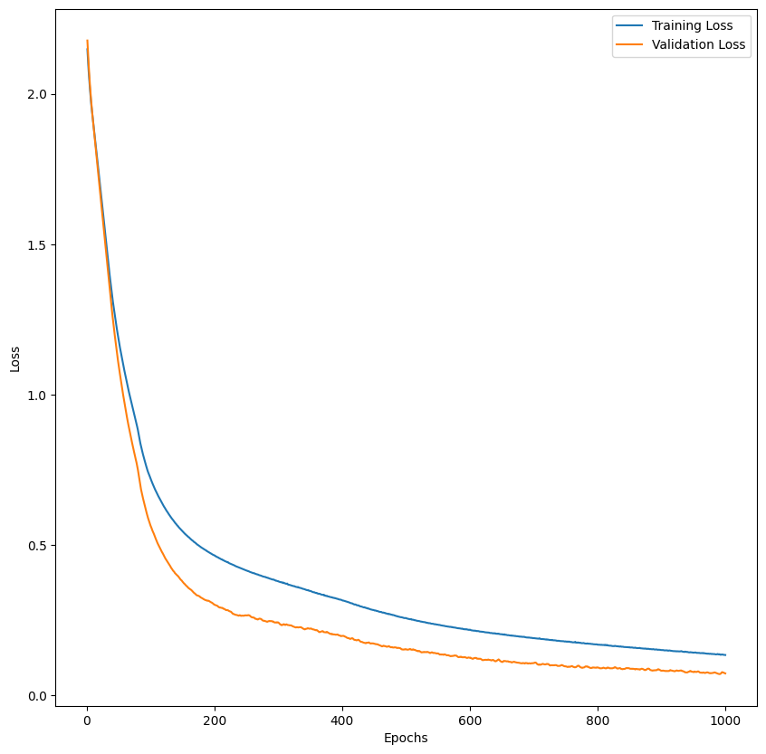

```python
import kagglehub

# Download latest version
path = kagglehub.dataset_download("vipullrathod/fish-market")

print("Path to dataset files:", path)
```

    /Users/jeongho/Desktop/w25536-kaggle/kaggle/lib/python3.9/site-packages/urllib3/__init__.py:35: NotOpenSSLWarning: urllib3 v2 only supports OpenSSL 1.1.1+, currently the 'ssl' module is compiled with 'LibreSSL 2.8.3'. See: https://github.com/urllib3/urllib3/issues/3020
      warnings.warn(


    Warning: Looks like you're using an outdated `kagglehub` version, please consider updating (latest version: 0.3.4)
    Path to dataset files: /Users/jeongho/.cache/kagglehub/datasets/vipullrathod/fish-market/versions/1


```python
import pandas as pd
import numpy as np
import matplotlib.pyplot as plt
import seaborn as sns


from sklearn.preprocessing import StandardScaler
from sklearn.model_selection import train_test_split
from sklearn.preprocessing import LabelEncoder

from sklearn.linear_model import LogisticRegression
import tensorflow as tf
```


```python
import os

df = pd.read_csv(os.path.join(path, "Fish.csv"))
```


```python
df
```


<div>
<style scoped>
    .dataframe tbody tr th:only-of-type {
        vertical-align: middle;
    }

    .dataframe tbody tr th {
        vertical-align: top;
    }

    .dataframe thead th {
        text-align: right;
    }
</style>
<table border="1" class="dataframe">
  <thead>
    <tr style="text-align: right;">
      <th></th>
      <th>Species</th>
      <th>Weight</th>
      <th>Length1</th>
      <th>Length2</th>
      <th>Length3</th>
      <th>Height</th>
      <th>Width</th>
    </tr>
  </thead>
  <tbody>
    <tr>
      <th>0</th>
      <td>Bream</td>
      <td>242.0</td>
      <td>23.2</td>
      <td>25.4</td>
      <td>30.0</td>
      <td>11.5200</td>
      <td>4.0200</td>
    </tr>
    <tr>
      <th>1</th>
      <td>Bream</td>
      <td>290.0</td>
      <td>24.0</td>
      <td>26.3</td>
      <td>31.2</td>
      <td>12.4800</td>
      <td>4.3056</td>
    </tr>
    <tr>
      <th>2</th>
      <td>Bream</td>
      <td>340.0</td>
      <td>23.9</td>
      <td>26.5</td>
      <td>31.1</td>
      <td>12.3778</td>
      <td>4.6961</td>
    </tr>
    <tr>
      <th>3</th>
      <td>Bream</td>
      <td>363.0</td>
      <td>26.3</td>
      <td>29.0</td>
      <td>33.5</td>
      <td>12.7300</td>
      <td>4.4555</td>
    </tr>
    <tr>
      <th>4</th>
      <td>Bream</td>
      <td>430.0</td>
      <td>26.5</td>
      <td>29.0</td>
      <td>34.0</td>
      <td>12.4440</td>
      <td>5.1340</td>
    </tr>
    <tr>
      <th>...</th>
      <td>...</td>
      <td>...</td>
      <td>...</td>
      <td>...</td>
      <td>...</td>
      <td>...</td>
      <td>...</td>
    </tr>
    <tr>
      <th>154</th>
      <td>Smelt</td>
      <td>12.2</td>
      <td>11.5</td>
      <td>12.2</td>
      <td>13.4</td>
      <td>2.0904</td>
      <td>1.3936</td>
    </tr>
    <tr>
      <th>155</th>
      <td>Smelt</td>
      <td>13.4</td>
      <td>11.7</td>
      <td>12.4</td>
      <td>13.5</td>
      <td>2.4300</td>
      <td>1.2690</td>
    </tr>
    <tr>
      <th>156</th>
      <td>Smelt</td>
      <td>12.2</td>
      <td>12.1</td>
      <td>13.0</td>
      <td>13.8</td>
      <td>2.2770</td>
      <td>1.2558</td>
    </tr>
    <tr>
      <th>157</th>
      <td>Smelt</td>
      <td>19.7</td>
      <td>13.2</td>
      <td>14.3</td>
      <td>15.2</td>
      <td>2.8728</td>
      <td>2.0672</td>
    </tr>
    <tr>
      <th>158</th>
      <td>Smelt</td>
      <td>19.9</td>
      <td>13.8</td>
      <td>15.0</td>
      <td>16.2</td>
      <td>2.9322</td>
      <td>1.8792</td>
    </tr>
  </tbody>
</table>
<p>159 rows × 7 columns</p>
</div>


```python
df.isnull().sum()
```


    Species    0
    Weight     0
    Length1    0
    Length2    0
    Length3    0
    Height     0
    Width      0
    dtype: int64


```python
y = df["Species"]
X = df.drop("Species", axis=1)
```


```python
y
```


    0      Bream
    1      Bream
    2      Bream
    3      Bream
    4      Bream
           ...  
    154    Smelt
    155    Smelt
    156    Smelt
    157    Smelt
    158    Smelt
    Name: Species, Length: 159, dtype: object


```python
scaler = StandardScaler()
X = pd.DataFrame(scaler.fit_transform(X), columns=X.columns)
```


```python
encoder = LabelEncoder()
y = encoder.fit_transform(y)
y_mappings = {index: label for index, label in enumerate(encoder.classes_)}
```


```python
y_mappings
```


    {0: 'Bream',
     1: 'Parkki',
     2: 'Perch',
     3: 'Pike',
     4: 'Roach',
     5: 'Smelt',
     6: 'Whitefish'}


```python
y
```


    array([0, 0, 0, 0, 0, 0, 0, 0, 0, 0, 0, 0, 0, 0, 0, 0, 0, 0, 0, 0, 0, 0,
           0, 0, 0, 0, 0, 0, 0, 0, 0, 0, 0, 0, 0, 4, 4, 4, 4, 4, 4, 4, 4, 4,
           4, 4, 4, 4, 4, 4, 4, 4, 4, 4, 4, 6, 6, 6, 6, 6, 6, 1, 1, 1, 1, 1,
           1, 1, 1, 1, 1, 1, 2, 2, 2, 2, 2, 2, 2, 2, 2, 2, 2, 2, 2, 2, 2, 2,
           2, 2, 2, 2, 2, 2, 2, 2, 2, 2, 2, 2, 2, 2, 2, 2, 2, 2, 2, 2, 2, 2,
           2, 2, 2, 2, 2, 2, 2, 2, 2, 2, 2, 2, 2, 2, 2, 2, 2, 2, 3, 3, 3, 3,
           3, 3, 3, 3, 3, 3, 3, 3, 3, 3, 3, 3, 3, 5, 5, 5, 5, 5, 5, 5, 5, 5,
           5, 5, 5, 5, 5])


```python
X_train, X_test, y_train, y_test = train_test_split(X, y, train_size=0.7)
```


```python
logistic_model = LogisticRegression()
logistic_model.fit(X_train, y_train)
logistic_model.score(X_test, y_test)
```


    0.8125


```python
inputs = tf.keras.Input(shape=(6,))
x = tf.keras.layers.Dense(16, activation="relu")(inputs)
x = tf.keras.layers.Dense(16, activation="relu")(x)
outputs = tf.keras.layers.Dense(7, activation="softmax")(x)

nn_model = tf.keras.Model(inputs=inputs, outputs=outputs)

nn_model.compile(
    optimizer="adam", loss="sparse_categorical_crossentropy", metrics=["accuracy"]
)

batch_size = 32
epochs = 1000

history = nn_model.fit(
    X_train,
    y_train,
    validation_split=0.2,
    batch_size=batch_size,
    epochs=epochs,
    verbose=0,
)
```


```python
plt.figure(figsize=(10, 10))

epochs_range = range(1, epochs + 1)
train_loss = history.history["loss"]
val_loss = history.history["val_loss"]

plt.plot(epochs_range, train_loss, label="Training Loss")
plt.plot(epochs_range, val_loss, label="Validation Loss")

plt.xlabel("Epochs")
plt.ylabel("Loss")
plt.legend()

plt.show()
```


    

    


```python
np.argmin(val_loss)
```


    990


```python
nn_model.evaluate(X_test, y_test)
```

    2/2 ━━━━━━━━━━━━━━━━━━━━ 0s 3ms/step - accuracy: 0.8646 - loss: 0.5265 


    [0.4929964542388916, 0.875]


```python

```
